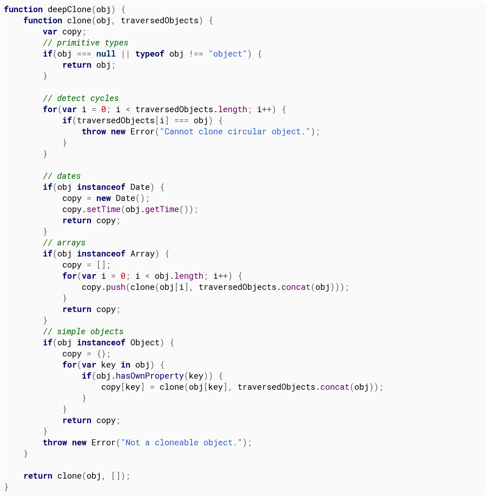
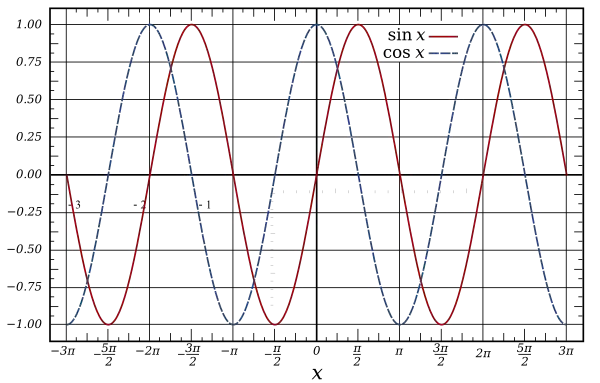
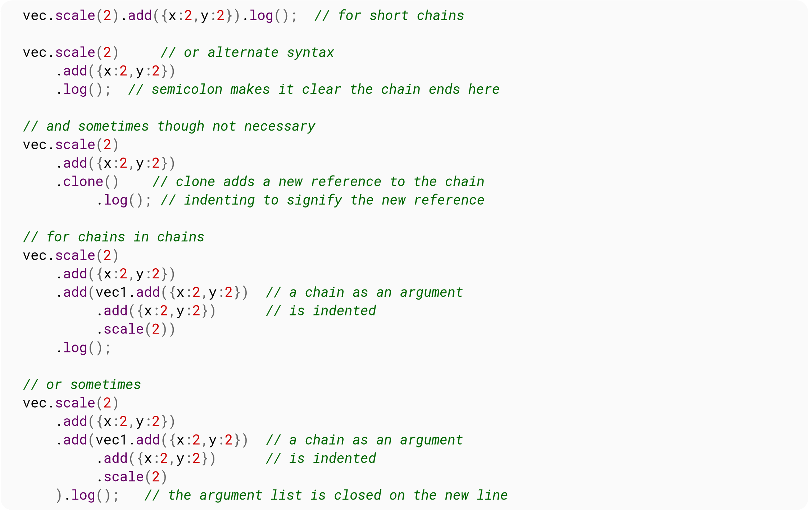
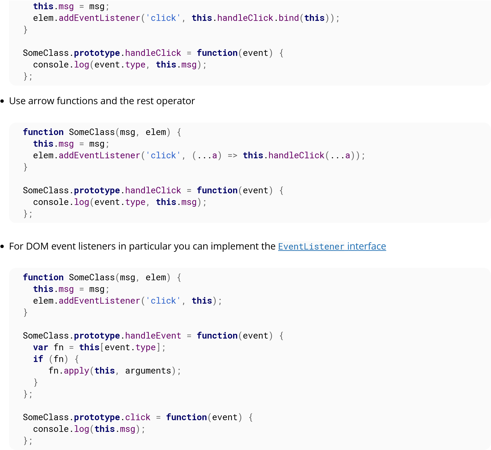
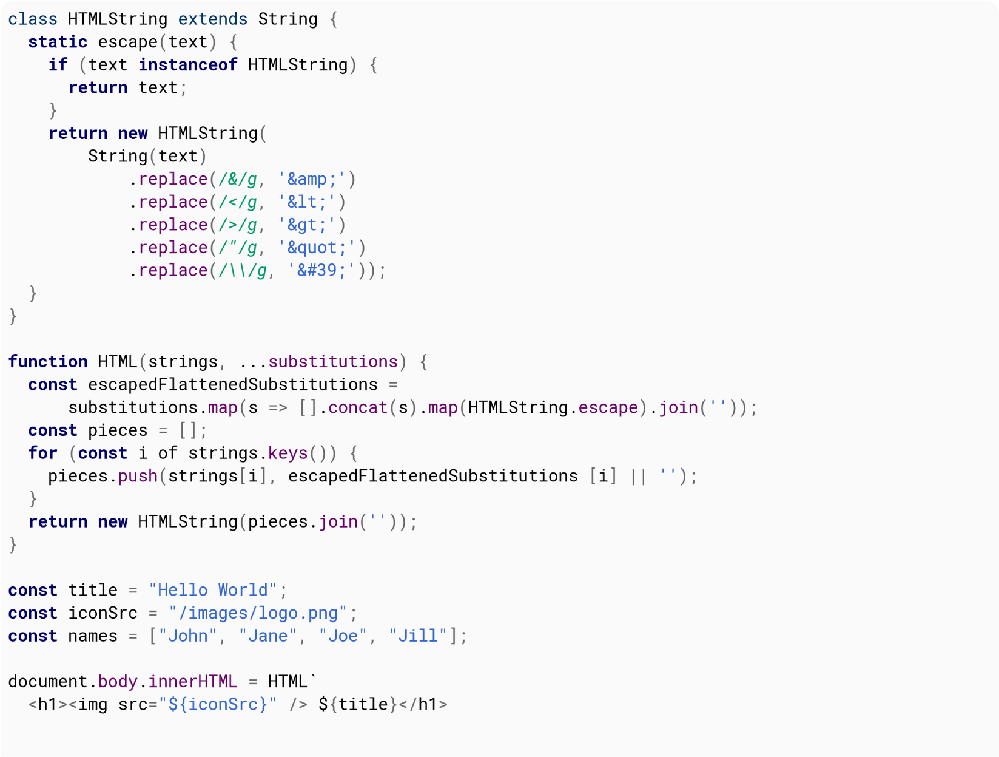

<!--~~~~~~~~~~~~~~~~~~~~~~~~~~~~~~~~~~~~~~~~~~~~~~~~~~~~~~~~~~~~~~~~~~~~~~~~~~~~~~~~~~~~~~~~~~~~-->
<!--~~~~~~~~~~~~~~~~~~~~~~~~~~ 01. javascript notes 4 pros logo (01) ~~~~~~~~~~~~~~~~~~~~~~~~~~~-->
<!--~~~~~~~~~~~~~~~~~~~~~~~~~~~~~~~~~~~~~~~~~~~~~~~~~~~~~~~~~~~~~~~~~~~~~~~~~~~~~~~~~~~~~~~~~~~~-->
<!--~~~~~~~~~~~~~~~~~~~~~~~~~~~~~ readme.md of js-notes4-pros.org ~~~~~~~~~~~~~~~~~~~~~~~~~~~~~~-->
<!--~~~~~~~~~~~~~~~~~~~~~~~~~~~~~~~~~~~~~~~~~~~~~~~~~~~~~~~~~~~~~~~~~~~~~~~~~~~~~~~~~~~~~~~~~~~~-->

  

<!--{width="8.25in" height="11.663194444444445in"}-->
<!-- As our processes become more agile,
our coding MUST be more resilient. -->
<!--~~~~~~~~~~~~~~~~~~~~~~~~~~~~~~~~~~~~~~~~~~~~~~~~~~~~~~~~~~~~~~~~~~~~~~~~~~~~~~~~~~~~~~~~~~~~-->
<!-- always use curly braces around if...statements, always. Don't assume logic  -->
<h4>Contents</h4>

See end of document.

<h4>About</h4>

Please feel free to share this PDF with anyone for free, latest 
version of this book can be downloaded from:

<a href="https://goalkicker.com/JavaScriptBook" target="_blank" rel="noreferrer noopener">
JS Notes 4 Pros</a>

This <i>JavaScript® Notes for Professionals</i> book is compiled from 
<a href="https://archive.org/details/documentation-dump.7z" 
target="_blank" rel="noreferrer noopener">Stack Overflow</a>.

<a href="https://archive.org/details/documentation-dump.7z" 
target="_blank" rel="noreferrer noopener">Documentation</a>, the
content is written by the beautiful people at Stack Overflow.

Text content is released under Creative Commons BY-SA, see credits at 
the end of this book whom contributed to the various chapters. Images 
may be copyright of their respective owners unless otherwise specified.

This is an unofficial free book created for educational purposes and 
is not affiliated with official JavaScript® group(s) or company(s) nor 
Stack Overflow. All trademarks and registered trademarks are the 
property of their respective company owners.

The information presented in this book is not guaranteed to be correct 
nor accurate, use at your own risk.

Please send feedback and corrections to &lbrack;web@petercv.com&rbrack;.

<!--page 2-->

<h2 id="ch1">Chapter 1: Getting started with JavaScript</h2>

<h5>Version Release Date</h5>

1.  1997-06-01
2.  1998-06-01
3.  1998-12-01
<a href="http://www-archive.mozilla.org/js/language/ECMA-357.pdf" target="_blank" rel="noreferrer noopener">E4X</a> 2004-06-01 
<a href="http://www.ecma-international.org/publications/files/ECMA-ST-ARCH/ECMA-262%205th%20edition%20December%202009.pdf" 
target="_blank" rel="noreferrer noopener">5</a> 2009-12-01 
<a href="http://www.ecma-international.org/publications/files/ECMA-ST-ARCH/ECMA-262%205.1%20edition%20June%202011.pdf" 
target="_blank" rel="noreferrer noopener">5.1</a> 2011-06-01 
6.  2015-06-01
7.  2016-06-14
8.  2017-06-27
<!--~~~~~~~~~~~~~~~~~~~~~~~~~~~~~~~~~~~~~~~~~~~~~~~~~~~~~~~~~~~~~~~~~~~~~~~~~~~~~~~~~~~~~~~~~~~~-->
<!--~~~~~~~~~~~~~~~~~~~~~~~~~~~~~ readme.md of js-notes4-pros.org ~~~~~~~~~~~~~~~~~~~~~~~~~~~~~~-->
<!--~~~~~~~~~~~~~~~~~~~~~~~~~~~~~~~~~~~~~~~~~~~~~~~~~~~~~~~~~~~~~~~~~~~~~~~~~~~~~~~~~~~~~~~~~~~~-->
<h3 id="ch1-1">Section 1.1: Using console.log()</h3>
<!--~~~~~~~~~~~~~~~~~~~~~~~~~~~~~~~~~~~~~~~~~~~~~~~~~~~~~~~~~~~~~~~~~~~~~~~~~~~~~~~~~~~~~~~~~~~~-->
<h4>Introduction</h4>

All modern web browsers, Node.js as well as almost every other 
JavaScript environments support writing messages to a console using a 
suite of logging methods. The most common of these methods is ().

In a browser environment, the () function is predominantly used for
debugging purposes.

<h4>Getting Started</h4>

Open up the JavaScript Console in your browser, type the following,
and press Enter:

<pre>
console.log("Hello, World!");
</pre>

This will log the following to the console:

<!--~~~~~~~~~~~~~~~~~~~~~~~~~~~~~~~~~~~~~~~~~~~~~~~~~~~~~~~~~~~~~~~~~~~~~~~~~~~~~~~~~~~~~~~~~~~~-->
<!--~~~~~~~~~~~~~~~~~~~~~~~~~~~~~ 02.  (xx) ~~~~~~~~~~~~~~~~~~~~~~~~~~~~~~-->

  

<!--{width="3.8916666666666666in" height="1.4236111111111112in"}-->

In the example above, the console.log() function prints Hello, World! to the console and returns <b>undefined</b>
(shown above in the console output window). This is because () has no 
explicit <i>return value</i>.

<h4>Logging variables</h4>

console.log() can be used to log variables of any kind; not only strings. Just pass
in the variable that you want to be displayed in the console, for example:

<pre>
<b>var</b>foo = &quot;bar&quot;;
console.log(foo);
</pre>

This will log the following to the console:

<!-- page 2 -->
<!--~~~~~~~~~~~~~~~~~~~~~~~~~~~~~~~~~~~~~~~~~~~~~~~~~~~~~~~~~~~~~~~~~~~~~~~~~~~~~~~~~~~~~~~~~~~~-->
<!--~~~~~~~~~~~~~~~~~~~~~~~~~~~~~ 03. example foobar console (xx) ~~~~~~~~~~~~~~~~~~~~~~~~~~~~~~-->

  

<!--~~~~~~~~~~~~~~~~~~~~~~~~~~~~~~~~~~~~~~~~~~~~~~~~~~~~~~~~~~~~~~~~~~~~~~~~~~~~~~~~~~~~~~~~~~~~-->
<!-- {width="5.954861111111111in" height="1.4777777777777779in"}-->

If you want to log two or more values, simply separate them with 
commas. Spaces will be automatically added between each argument 
during concatenation:

<pre>
var thisVar = 'first value';
var thatVar = 'second value';
console.log("thisVar:", thisVar, "and thatVar:", thatVar);
</pre>

This will log the following to the console:

<!-- page 3 -->
<!--~~~~~~~~~~~~~~~~~~~~~~~~~~~~~~~~~~~~~~~~~~~~~~~~~~~~~~~~~~~~~~~~~~~~~~~~~~~~~~~~~~~~~~~~~~~~-->
<!--~~~~~~~~~~~~~~~~~~~~~~~~~~~~~~ 04. thisVar and thatVar (xx) ~~~~~~~~~~~~~~~~~~~~~~~~~~~~~~~~-->

  

<!-- {width="7.477777777777778in" height="0.9729166666666667in"} -->

<h4>Placeholders</h4>

You can use console.log() in combination with placeholders:

<pre>
<b>var</b> greet = "Hello", who = "World";
console.log ("%s, %s!", greet, who);
</pre>

This will log the following to the console:

<!--~~~~~~~~~~~~~~~~~~~~~~~~~~~~~~~~~~~~~~~~~~~~~~~~~~~~~~~~~~~~~~~~~~~~~~~~~~~~~~~~~~~~~~~~~~~~-->
<!--~~~~~~~~~~~~~~~~~~~~~~~~~~~~~~~ 05. greet Hello, World (xx) ~~~~~~~~~~~~~~~~~~~~~~~~~~~~~~~~-->

  

<!--{width="6.990972222222222in" height="1.4868055555555555in"}-->

<h4>Logging Objects</h4>

Below we see the result of logging an object. This is often useful for 
logging JSON responses from API calls.

<pre>
console.log ( { 
  'Email': '', 
  'Groups': {}, 
  'Id': 33, 
  'IsHiddenInUI': <b>false</b>,
  'IsSiteAdmin': <b>false</b>, 
  'LoginName': 'i:0#.w|virtualdomain&bsol;&bsol;user2',
  'PrincipalType': 1, 
  'Title': 'user2' 
} );
</pre>

<!-- page 4 -->

This will log the following to the console:

<!--~~~~~~~~~~~~~~~~~~~~~~~~~~~~~~~~~~~~~~~~~~~~~~~~~~~~~~~~~~~~~~~~~~~~~~~~~~~~~~~~~~~~~~~~~~~~-->
<!--~~~~~~~~~~~~~~~~~~~~~~~~~~~~~ 06.  (xx) ~~~~~~~~~~~~~~~~~~~~~~~~~~~~~~-->

  
<!--{width="6.738888888888889in" height="1.7208333333333334in"}-->

<h4>Logging HTML elements</h4>

You have the ability to log any element which exists within the
<a href="https://developer.mozilla.org/en-US/docs/Web/API/Document_Object_Model/Introduction" 
target="_blank" rel="noreferrer noopener"><i>DOM</i></a>. In this case we log the body element:

<pre>
console.log(document.body);
</pre>

This will log the following to the console:

<!--~~~~~~~~~~~~~~~~~~~~~~~~~~~~~~~~~~~~~~~~~~~~~~~~~~~~~~~~~~~~~~~~~~~~~~~~~~~~~~~~~~~~~~~~~~~~-->
<!--~~~~~~~~~~~~~~~~~~~~~~~~~~~~~ 07.  (xx) ~~~~~~~~~~~~~~~~~~~~~~~~~~~~~~-->

  
<!--{width="6.522222222222222in" height="2.3784722222222223in"}-->

<h4>End Note</h4>

For more information on the capabilities of the console, see the 
Console topic.

<!--~~~~~~~~~~~~~~~~~~~~~~~~~~~~~~~~~~~~~~~~~~~~~~~~~~~~~~~~~~~~~~~~~~~~~~~~~~~~~~~~~~~~~~~~~~~~-->
<h3 id="ch1-2">Section 1.2: Using the DOM API</h3>
<!--~~~~~~~~~~~~~~~~~~~~~~~~~~~~~~~~~~~~~~~~~~~~~~~~~~~~~~~~~~~~~~~~~~~~~~~~~~~~~~~~~~~~~~~~~~~~-->

DOM stands for <b>D</b>ocument <b>O</b>bject <b>M</b>odel. It is an
object-oriented representation of structured documents like XML and HTML.

Setting the textContent property of an Element is one way to output
text on a web page.

For example, consider the following HTML tag:

<pre><b>&lt;p</b> id="paragraph"<b>&gt;&lt;/p&gt;</b></pre>

To change its textContent property, we can run the following JavaScript:

<!-- page 5 -->

<pre>document.getElementById("paragraph").textContent = "Hello, World";</pre>

This will select the element that with the id paragraph and set its
text content to "Hello, World":

<pre><b>&lt;p</b> id="paragraph"&gt;Hello, World<b>&lt;/p&gt;</b></pre>

<a href="http://jsbin.com/fuzijox/edit?html,js,console,output" 
target="_blank" rel="noreferrer noopener">(See also this demo)</a>

You can also use JavaScript to create a new HTML element programmatically. For example, 
consider an HTML document with the following body:

<pre>
<b>&lt;body&gt;</b>
  <b>&lt;h1&gt;</b>Adding an element<b>&lt;/h1&gt;</b>
<b>&lt;/body&gt;</b>
</pre>

In our JavaScript, we create a new <b>&lt;p&gt;</b>tag with a textContent property of 
and add it at the end of the html body:

<pre>
<b>var</b> element = document.createElement('p');
element.textContent = "Hello, World";
document.body.appendChild(element); //<i>add the newly created element to the DOM</i>
</pre>

That will change your HTML body to the following:

<pre>
<b>&lt;body&gt;</b>
  <b>&lt;h1&gt;</b>Adding an element<b>&lt;/h1&gt;</b>
  <b>&lt;p&gt;</b>Hello, World<b>&lt;/p&gt;</b>
<b>&lt;/body&gt;</b>
</pre>

Note that in order to manipulate elements in the DOM using JavaScript,
the JavaScript code must be run <i>after</i> the relevant element has been
created in the document. This can be achieved by putting the
JavaScript <b>&lt;script&gt;</b> tags <i>after</i> all of your other 
<b>&lt;body&gt;</b> content. Alternatively, you can also use 
<a href="https://developer.mozilla.org/en-US/docs/Web/API/EventTarget/addEventListener" 
target="_blank" rel="noreferrer noopener">an event listener</a> to listen to eg. 
<a href="https://developer.mozilla.org/en-US/docs/Web/API/GlobalEventHandlers/onload" 
target="_blank" rel="noreferrer noopener">window's onload event</a>, adding your code to 
that event listener will delay running your code until after the whole content on your 
page has been loaded.

A third way to make sure all your DOM has been loaded, is 
<a href="https://stackoverflow.com/questions/779379/why-is-settimeoutfn-0-sometimes-useful" 
target="_blank" rel="noreferrer noopener">to wrap the DOM manipulation code with a timeout 
function of 0 ms</a>. This way, this JavaScript code is re-queued at the end of the execution 
queue, which gives the browser a chance to finish doing some non-JavaScript things that have 
been waiting to finish before attending to this new piece of JavaScript.

<!--~~~~~~~~~~~~~~~~~~~~~~~~~~~~~~~~~~~~~~~~~~~~~~~~~~~~~~~~~~~~~~~~~~~~~~~~~~~~~~~~~~~~~~~~~~~~-->
<h3 id="ch1-3">Section 1.3: Using window.alert()</h3>
<!--~~~~~~~~~~~~~~~~~~~~~~~~~~~~~~~~~~~~~~~~~~~~~~~~~~~~~~~~~~~~~~~~~~~~~~~~~~~~~~~~~~~~~~~~~~~~-->

The alert method displays a visual alert box on screen. The alert
method parameter is displayed to the user in <b>plain</b> text:

<pre>window.alert(message);</pre>

Because window is the global object, you can call also use the following shorthand:

<pre>alert(message);</pre>

So what does window.alert() do? Well, let's take the following example:

<pre>alert('hello, world');</pre>

<!-- page 6 -->

In Chrome, that would produce a pop-up like this:

<!--~~~~~~~~~~~~~~~~~~~~~~~~~~~~~~~~~~~~~~~~~~~~~~~~~~~~~~~~~~~~~~~~~~~~~~~~~~~~~~~~~~~~~~~~~~~~-->
<!--~~~~~~~~~~~~~~~~~~~~~~~~~~~~~ 08.  (xx) ~~~~~~~~~~~~~~~~~~~~~~~~~~~~~~-->

  
<!--{width="5.225in" height="2.3152777777777778in"}-->

<h4>Notes</h4>
<blockquote>
  The alert method is technically a property of window object, but since
  all window properties are automatically global variables, we can use
  alert as a global variable instead of as a property of window meaning
  you can directly use alert() intead of window.alert().
</blockquote>

Unlike using console.log, alert acts as a modal prompt meaning that the code
calling alert will pause until the prompt is answered. Traditionally
this means that <i>no other JavaScript code will execute</i> until the
alert is dismissed:

<pre>
alert('Pause!');
console.log('Alert was dismissed');
</pre>

However the specification actually allows other event-triggered code
to continue to execute even though a modal dialog is still being
shown. In such implementations, it is possible for other code to run
while the modal dialog is being shown.

More information about usage of the alert method can be found in the
modals prompts topic.

The use of alerts is usually discouraged in favour of other methods
that do not block users from interacting with the page - in order to
create a better user experience. Nevertheless, it can be useful for
debugging.

Starting with Chrome 46.0, window.alert() is blocked inside an <b>&lt;iframe&gt;</b> 
<a href="https://developer.mozilla.org/en-US/docs/Web/API/Window/alert" 
target="_blank" rel="noreferrer noopener">unless its sandbox attribute has the value allow-modal</a>.
<!--~~~~~~~~~~~~~~~~~~~~~~~~~~~~~~~~~~~~~~~~~~~~~~~~~~~~~~~~~~~~~~~~~~~~~~~~~~~~~~~~~~~~~~~~~~~~-->
<h3 id="ch1-4">Section 1.4: Using window.prompt()</h3>
<!--~~~~~~~~~~~~~~~~~~~~~~~~~~~~~~~~~~~~~~~~~~~~~~~~~~~~~~~~~~~~~~~~~~~~~~~~~~~~~~~~~~~~~~~~~~~~-->

An easy way to get an input from a user is by using the () method.

<h4>Syntax</h4>

<pre>prompt(text, &lbrack;<b>default</b>&rbrack;);</pre>

<ul>
  <li><b>text</b>: The text displayed in the prompt box.</li>
  <li><b>default</b>): A default value for the input field (optional).</li>
</ul>

<b>Examples</b>

<pre>
<b>var</b> age = prompt("How old are you?");
console.log(age); // <i>Prints the value inserted by the user</i>
</pre>
<!-- page 7 -->
<!--~~~~~~~~~~~~~~~~~~~~~~~~~~~~~~~~~~~~~~~~~~~~~~~~~~~~~~~~~~~~~~~~~~~~~~~~~~~~~~~~~~~~~~~~~~~~-->
<!--~~~~~~~~~~~~~~~~~~~~~~~~~~~~~ 09.  (xx) ~~~~~~~~~~~~~~~~~~~~~~~~~~~~~~-->

  
<!--{width="4.603472222222222in" height="1.9548611111111112in"}-->

If the user clicks the <b>OK</b> button, the input value is returned.
Otherwise, the method returns <b>null</b>.

The return value of prompt is always a string, unless the user clicks
<b>Cancel</b>, in which that case it returns <b>null</b>. Safari is an
exception in that when the user clicks Cancel, the function returns an
empty string. From there, you can convert the return value to another
type, such as an integer.

<h4>Notes</h4>

<ul>
  <li>While the prompt box is displayed, the user is prevented from accessing 
    other parts of the page, since dialog boxes are modal windows.</li>
  <li>Starting with Chrome 46.0 this method is blocked inside an <b>&lt;iframe&gt;</b>
    unless its sandbox attribute has the value allow-modal.</li>
</ul>
<!--~~~~~~~~~~~~~~~~~~~~~~~~~~~~~~~~~~~~~~~~~~~~~~~~~~~~~~~~~~~~~~~~~~~~~~~~~~~~~~~~~~~~~~~~~~~~-->
<h3 id="ch1-5">Section 1.5: Using window.confirm()</h3>
<!--~~~~~~~~~~~~~~~~~~~~~~~~~~~~~~~~~~~~~~~~~~~~~~~~~~~~~~~~~~~~~~~~~~~~~~~~~~~~~~~~~~~~~~~~~~~~-->

The window.confirm() method displays a modal dialog with an optional message and two
buttons, OK and Cancel.

Now, let's take the following example:

<pre>result = window.confirm(message);</pre>

Here, <b>message</b> is the optional string to be displayed in the dialog
and <b>result</b> is a boolean value indicating whether OK or Cancel was
selected (true means OK).

window.confirm() is typically used to ask for user confirmation before doing a
dangerous operation like deleting something in a Control Panel:

<pre>
<b>if</b> (window.confirm("Are you sure you want to delete this?")) { 
  deleteItem (itemId);
}
</pre>

The output of that code would look like this in the browser:

<!--~~~~~~~~~~~~~~~~~~~~~~~~~~~~~~~~~~~~~~~~~~~~~~~~~~~~~~~~~~~~~~~~~~~~~~~~~~~~~~~~~~~~~~~~~~~~-->
<!--~~~~~~~~~~~~~~~~~~~~~~~~~~~~~ 10.  (xx) ~~~~~~~~~~~~~~~~~~~~~~~~~~~~~~-->

  
<!--{width="4.603472222222222in" height="1.4597222222222221in"}-->

If you need it for later use, you can simply store the result of the
user's interaction in a variable:

<!-- page 8 -->

<pre><b>var</b> deleteConfirm = window.confirm("Are you sure you want to delete this?");</pre>

<h4>Notes</h4>

<ul>
  <li>The argument is optional and not required by the specification.</li>
  <li>Dialog boxes are modal windows - they prevent the user from accessing
    the rest of the program's interface until the dialog box is closed.
    For this reason, you should not overuse any function that creates a
    dialog box (or modal window). And regardless, there are very good reasons 
    to avoid using dialog boxes for confirmation.</li>
  <li>Starting with Chrome 46.0 this method is blocked inside an <b>&lt;iframe&gt;</b>
    unless its sandbox attribute has the value allow-modal.</li>
  <li>It is commonly accepted to call the confirm method with the window
    notation removed as the window object is always implicit. However, it
    is recommended to explicitly define the window object as expected
    behavior may change due to implementation at a lower scope level with
    similarly named methods.</li>
</ul>

<!--~~~~~~~~~~~~~~~~~~~~~~~~~~~~~~~~~~~~~~~~~~~~~~~~~~~~~~~~~~~~~~~~~~~~~~~~~~~~~~~~~~~~~~~~~~~~-->
<h3 id="ch1-6">Section 1.6: Using the DOM API (with graphical text: Canvas, SVG, or image file)</h3>
<!--~~~~~~~~~~~~~~~~~~~~~~~~~~~~~~~~~~~~~~~~~~~~~~~~~~~~~~~~~~~~~~~~~~~~~~~~~~~~~~~~~~~~~~~~~~~~-->
<h4>Using canvas elements</h4>

HTML provides the canvas element for building raster-based images.

First build a canvas for holding image pixel information.

<pre>
<b>var</b> canvas = document.createElement('canvas');
canvas.width = 500;
canvas.height = 250;
</pre>

Then select a context for the canvas, in this case two-dimensional:

<pre><b>var</b> ctx=canvas.getContext ('2d');</pre>

Then set properties related to the text:

<pre>
ctx.font = '30px Cursive';
ctx.fillText ("Hello world!", 50, 50);
</pre>

Then insert the canvas element into the page to take effect:

<pre>document.body.appendChild(canvas);</pre>
<h4>Using SVG</h4>

SVG is for building scalable vector-based graphics and can be used
within HTML.

First create an SVG element container with dimensions:

<pre>
<b>var</b> svg=document.createElementNS('http://www.w3.org/2000/svg', 'svg');
svg.width = 500;
svg.height = 50;
</pre>

Then build a text element with the desired positioning and font
characteristics:

<!-- page 9 -->
<pre>
<b>var</b> text = document.createElementNS('http://www.w3.org/2000/svg', 'text');
text.setAttribute('x', '0');
text.setAttribute('y', '50');
text.style.fontFamily = 'Times New Roman';
text.style.fontSize = '50';
</pre>

Then add the actual text to display to the textelement:

<pre>text.textContent = 'Hello world!';</pre>

Finally add the text element to our svg container and add the svg
container element to the HTML document:

<pre>
svg.appendChild(text);
document.body.appendChild(svg);
</pre>
<h4>Image file</h4>

If you already have an image file containing the desired text and have
it placed on a server, you can add the URL of the image and then add
the image to the document as follows:

<pre>
<b>var</b> img = <b>new</b> Image ( );
img.src = 'https://i.ytimg.com/vi/zecueq-mo4M/maxresdefault.jpg';
document.body.appendChild(img);
</pre>
<!-- page 10 -->
<!--~~~~~~~~~~~~~~~~~~~~~~~~~~~~~~~~~~~~~~~~~~~~~~~~~~~~~~~~~~~~~~~~~~~~~~~~~~~~~~~~~~~~~~~~~~~~-->
<h2 id="ch2">Chapter 2: JavaScript Variables</h2>
<!--~~~~~~~~~~~~~~~~~~~~~~~~~~~~~~~~~~~~~~~~~~~~~~~~~~~~~~~~~~~~~~~~~~~~~~~~~~~~~~~~~~~~~~~~~~~~-->

<b>variable_name &nbsp;&nbsp;&nbsp;&nbsp;&nbsp;&nbsp;&nbsp;{Required} The name of the variable: used when calling it.</b>

= &nbsp;&nbsp;&nbsp;&nbsp;&nbsp;&nbsp;&nbsp;<b>&lbrack;Optional&rbrack;</b> Assignment (defining the variable)

value &nbsp;&nbsp;&nbsp;&nbsp;&nbsp;&nbsp;&nbsp<b>{Required when using Assignment}</b> The value of a variable
<b>&lbrack;default: undefined&rbrack;</b>

Variables are what make up most of JavaScript. These variables make up
things from numbers to objects, which are all over JavaScript to make
one's life much easier.

<!--~~~~~~~~~~~~~~~~~~~~~~~~~~~~~~~~~~~~~~~~~~~~~~~~~~~~~~~~~~~~~~~~~~~~~~~~~~~~~~~~~~~~~~~~~~~~-->
<h3 id="ch2-1">Section 2.1: Defining a Variable</h3>
<!--~~~~~~~~~~~~~~~~~~~~~~~~~~~~~~~~~~~~~~~~~~~~~~~~~~~~~~~~~~~~~~~~~~~~~~~~~~~~~~~~~~~~~~~~~~~~-->
<pre><b>var</b> myVariable = "This is a variable!";</pre>

This is an example of defining variables. This variable is called a
"string" because it has ASCII characters (A-Z, 0-9, !@#$, etc.)

<!--~~~~~~~~~~~~~~~~~~~~~~~~~~~~~~~~~~~~~~~~~~~~~~~~~~~~~~~~~~~~~~~~~~~~~~~~~~~~~~~~~~~~~~~~~~~~-->
<h3 id="ch2-2">Section 2.2: Using a Variable</h3>
<!--~~~~~~~~~~~~~~~~~~~~~~~~~~~~~~~~~~~~~~~~~~~~~~~~~~~~~~~~~~~~~~~~~~~~~~~~~~~~~~~~~~~~~~~~~~~~-->
<pre>
<b>var</b> number1 = 5;
number1 = 3;
</pre>

Here, we defined a number called "number1" which was equal to 5. 
However, on the second line, we changed the value to 3. To show the 
value of a variable, we log it to the console or use window.alert():

<pre>
console.log(number1); // <i>3</i>
window.alert(number1); // <i>3</i>
</pre>

To add, subtract, multiply, divide, etc., we do like so:

<pre>number1 = number1 + 5; // <i>3 + 5 = 8</i>
number1 = number1 - 6; // <i>8 - 6 = 2</i>
<b>var</b> number2 = number1 &ast; 10; // <i>2 (times) 10 = 20</i>
<b>var</b> number3 = number2 / number1; // <i>20 (divided by) 2 = 10;</i></pre>

We can also add strings which will concatenate them, or put them
together. For example:

<pre><b>var</b> myString = "I am a " + "string!" ; // <i>"I am a string!"</i></pre>
<!--~~~~~~~~~~~~~~~~~~~~~~~~~~~~~~~~~~~~~~~~~~~~~~~~~~~~~~~~~~~~~~~~~~~~~~~~~~~~~~~~~~~~~~~~~~~~-->
<h3 id="ch2-3">Section 2.3: Types of Variables</h3>
<!--~~~~~~~~~~~~~~~~~~~~~~~~~~~~~~~~~~~~~~~~~~~~~~~~~~~~~~~~~~~~~~~~~~~~~~~~~~~~~~~~~~~~~~~~~~~~-->
<pre>
<b>var</b> myInteger = 12; // <i>32-bit number (from -2,147,483,648 to 2,147,483,647)</i>
<b>var</b> myLong = 9310141419482 ; // <i>64-bit number (from -9,223,372,036,854,775,808 to
  9,223,372,036,854,775,807)</i>
<b>var</b> myFloat = 5.5; // <i>32-bit floating-point number (decimal)</i>
<b>var</b> myDouble = 9310141419482.22; // <i>64-bit floating-point number</i>
<b>var</b> myBoolean = <b>true</b>; // <i>1-bit true/false (0 or 1)</i>
<b>var</b> myBoolean2 = <b>false</b>;
<b>var</b> myNotANumber = <b>NaN</b>;
<b>var</b> NaN_Example = 0 / 0 ; // <i>NaN: Division by Zero is not possible</i>
<b>var</b> notDefined; // <i>undefined: we didn&apos;t define it to anything yet</i>
window.alert(aRandomVariable); // <i>undefined</i>
<b>var</b> myNull=<b>null</b>; // <i>null</i>
<i>// etc...</i>
</pre>
<!-- page 11 -->
<!--~~~~~~~~~~~~~~~~~~~~~~~~~~~~~~~~~~~~~~~~~~~~~~~~~~~~~~~~~~~~~~~~~~~~~~~~~~~~~~~~~~~~~~~~~~~~-->
<h3 id="ch2-4">Section 2.4: Arrays and Objects</h3>
<!--~~~~~~~~~~~~~~~~~~~~~~~~~~~~~~~~~~~~~~~~~~~~~~~~~~~~~~~~~~~~~~~~~~~~~~~~~~~~~~~~~~~~~~~~~~~~-->
<pre><b>var</b> myArray=&lbrack;&rbrack;; // <i>empty array</i></pre>

An array is a set of variables. For example:

<pre>
<b>var</b> favoriteFruits = &lbrack;"apple", "orange", "strawberry"&rbrack;;
<b>var</b> carsInParkingLot = &lbrack;"Toyota", "Ferrari", "Lexus"&rbrack;;
<b>var</b> employees = &lbrack;"Billy", "Bob", "Joe"&rbrack;;
<b>var</b> primeNumbers = &lbrack;2, 3, 5, 7, 11, 13, 17, 19, 23, 29, 31&rbrack;;
<b>var</b> randomVariables = &lbrack;2, "any type works", <b>undefined</b>, <b>null</b>, <b>true</b>, 2.51&rbrack;;
myArray = &lbrack;"zero" , "one" , "two" &rbrack;;
window.alert ( myArray &lbrack;0&rbrack;); // <i>0 is the first element of an array</i>
                  // <i>in this case, the value would be "zero"</i>
myArray = &lbrack;"John Doe", "Billy"&rbrack;;
elementNumber = 1;
window.alert(myArray&lbrack;elementNumber&rbrack;); // <i>Billy</i>
</pre>

An object is a group of values; unlike arrays, we can do something
better than them:

<pre>
myObject = {};
john = {firstname: "John", lastname: "Doe", fullname: "John Doe"};
billy = {
  firstname: "Billy",
  lastname: <b>undefined</b>,
  fullname: "Billy"
};
window.alert(john.fullname); // <i>John Doe</i>
window.alert(billy.firstname); // <i>Billy</i>
</pre>

Rather than making an array &lbrack;"John Doe", "Billy"&rbrack; and calling myArray&lbrack;0&rbrack;, we
can just call john.fullname and billy.fullname.

<!-- page 12 -->
<!--~~~~~~~~~~~~~~~~~~~~~~~~~~~~~~~~~~~~~~~~~~~~~~~~~~~~~~~~~~~~~~~~~~~~~~~~~~~~~~~~~~~~~~~~~~~~-->
<h2 id="ch3">Chapter 3: Built-in Constants</h2>
<!--~~~~~~~~~~~~~~~~~~~~~~~~~~~~~~~~~~~~~~~~~~~~~~~~~~~~~~~~~~~~~~~~~~~~~~~~~~~~~~~~~~~~~~~~~~~~-->
<h3 id="ch3-1">Section 3.1: null</h3>
<!--~~~~~~~~~~~~~~~~~~~~~~~~~~~~~~~~~~~~~~~~~~~~~~~~~~~~~~~~~~~~~~~~~~~~~~~~~~~~~~~~~~~~~~~~~~~~-->

<b>null</b> is used for representing the intentional absence of an object value and is a 
primitive value. Unlike <b>undefined</b>, it is not a property of the global object.

It is equal to <b>undefined</b> but not identical to it.

<pre>
<b>null</b> == <b>undefined</b>; // true
<b>null</b> === <b>undefined</b>; // false
</pre>

<b>CAREFUL</b>: The <b>typeof null</b> is 'object'.

<pre>
<b>typeof null</b>; // 'object';
</pre>

To properly check if a value is <b>null</b>, compare it with the strict equality operator.

<pre>
<b>var</b> a = <b>null</b>;
a === <b>null</b>; // true
</pre>
<!--~~~~~~~~~~~~~~~~~~~~~~~~~~~~~~~~~~~~~~~~~~~~~~~~~~~~~~~~~~~~~~~~~~~~~~~~~~~~~~~~~~~~~~~~~~~~-->
<h3 id="ch3-2">Section 3.2: Testing for NaN using isNaN()</h3>
<!--~~~~~~~~~~~~~~~~~~~~~~~~~~~~~~~~~~~~~~~~~~~~~~~~~~~~~~~~~~~~~~~~~~~~~~~~~~~~~~~~~~~~~~~~~~~~-->
<pre><b>window.isNaN</b></pre>  

The global function () can be used to check if a certain value or
expression evaluates to <b>NaN</b>. This function (in short) first checks
if the value is a number, if not tries to convert it (&ast;), and then
checks if the resulting value is <b>NaN</b>. For this reason, <b>this
testing method may cause confusion</b>.

(&ast;) The "conversion" method is not that simple, see 
<a href="http://www.ecma-international.org/ecma-262/6.0/#sec-isnan-number" 
target="_blank" rel="noreferrer noopener">ECMA-262 18.2.3</a> for a detailed explanation 
of the algorithm.

These examples will help you better understand the isNaN() behavior:

<pre>
isNaN(<b>NaN</b>);            // <i>true</i>
isNaN(1);             // <i>false: 1 is a number</i>
isNaN(-2e-4);         // <i>false: -2e-4 is a number (-0.0002) in scientific notation</i>
isNaN(<b>Infinity</b>);      // <i>false: Infinity is a number</i>
isNaN(<b>true</b>);          // <i>false: converted to 1, which is a number</i>
isNaN(<b>false</b>);         // <i>false: converted to 0, which is a number</i>
isNaN(<b>null</b>);          // <i>false: converted to 0, which is a number</i>
isNaN("");            // <i>false: converted to 0, which is a number</i>
isNaN("");            // <i>false: converted to 0, which is a number</i>
isNaN("45.3");        // <i>false: string representing a number, converted to 45.3</i>
isNaN("1.2e3");       // <i>false: string representing a number, converted to 1.2e3</i>
isNaN("Infinity");    // <i>false: string representing a number, converted to Infinity</i>
isNaN(<b>new</b> Date);      // <i>false: Date object, converted to milliseconds since epoch</i>
isNaN("10$");         // <i>true : conversion fails, the dollar sign is not a digit</i>
isNaN("hello");       // <i>true : conversion fails, no digits at all</i>
isNaN(<b>undefined</b>);     // <i>true : converted to NaN</i>
isNaN();              // <i>true : converted to NaN (implicitly undefined)</i>
isNaN(<b>function</b>(){}); // <i>true : conversion fails</i>
isNaN({});           // <i>true : conversion fails</i>
isNaN(&lbrack;1, 2&rbrack;);       // <i>true : converted to "1, 2", which can't be converted to a number</i>
</pre>
<!-- page 13 -->

This last one is a bit tricky: checking if an Array is <b>NaN</b>. To do
the Number() constructor first converts the array to a string, then to
a number; this is the reason why isNaN(&lbrack;&rbrack) and isNaN (&lbrack;34&rbrack;), 
"1,2", and <b>true</b> respectively. In general, <b>an array is
considered NaN by () unless it only holds one element whose string
representation can be converted to a valid number</b>.

<h5>Version ≥ 6</h5>
<pre>Number.isNaN</pre>

In ECMAScript 6, the Number.isNaN() function has been implemented primarily to
avoid the problem of window.isNaN() of forcefully converting the parameter to a 
number.Number.isNaN(), indeed, <b>doesn't try to convert </b> the value to a number 
before testing. This also means that <b>only values of the type number, that
are also NaN, return true</b> (which basically means only )).

From <a href="http://www.ecma-international.org/ecma-262/6.0/#sec-number.isnan" 
target="_blank" rel="noreferrer noopener">ECMA-262 20.1.2.4</a>:

<blockquote>

When the Number .isNaN is called with one argument number, the following steps are taken:

1.  If Type(number) is not Number, return <b>false</b>.
2.  If number is <b>NaN</b>, return <b>true</b>.
3.  Otherwise, return <b>false</b>.
</blockquote>

Some examples:

<!--~~~~~~~~~~~~~~~~~~~~~~~~~~~~~~~~~~~~~~~~~~~~~~~~~~~~~~~~~~~~~~~~~~~~~~~~~~~~~~~~~~~~~~~~~~~~-->
<!--~~~~~~~~~~~~~~~~~~~~~~~~~~~~~ 11. examples: Number.isNaN (xx) ~~~~~~~~~~~~~~~~~~~~~~~~~~~~~~-->

  
<!-- (./images/image011.png){width="7.486805555555556in" height="4.891666666666667in"} -->
<!--~~~~~~~~~~~~~~~~~~~~~~~~~~~~~~~~~~~~~~~~~~~~~~~~~~~~~~~~~~~~~~~~~~~~~~~~~~~~~~~~~~~~~~~~~~~~-->
<h3 id="ch3-3">Section 3.3: NaN</h3>
<!--~~~~~~~~~~~~~~~~~~~~~~~~~~~~~~~~~~~~~~~~~~~~~~~~~~~~~~~~~~~~~~~~~~~~~~~~~~~~~~~~~~~~~~~~~~~~-->

<a href="https://developer.mozilla.org/en-US/docs/Web/JavaScript/Reference/Global_Objects/NaN" 
target="_blank" rel="noreferrer noopener"><b>NaN</b></a> stands for "Not a Number." When a mathematical 
function or operation in JavaScript cannot return a specific number, it returns the value <b>NaN</b> 
instead.

<!-- page 14 -->

It is a property of the global object, and a reference to 
<a href="https://developer.mozilla.org/docs/Web/JavaScript/Reference/Global_Objects/Number/NaN" 
target="_blank" rel="noreferrer noopener">Number.NaN</a>

<pre>
window.hasOwnProperty('NaN'); // <i>true</i>
<b>NaN</b>; // <i>NaN</i>
</pre>

Perhaps confusingly, <b>NaN</b> is still considered a number.

<pre>
<b>typeof</b> <b>NaN</b>; // <i>'number'</i>
</pre>

Don&apos;t check for <b>NaN</b> using the equality operator. See isNaN instead.

<pre>
<b>NaN</b> == <b>NaN</b>  // <i>false</i>
<b>NaN</b> === <b>NaN</b> // <i>false</i>
</pre>
<!--~~~~~~~~~~~~~~~~~~~~~~~~~~~~~~~~~~~~~~~~~~~~~~~~~~~~~~~~~~~~~~~~~~~~~~~~~~~~~~~~~~~~~~~~~~~~-->
<h3 id="ch3-4">Section 3.4: undefined and null</h3>
<!--~~~~~~~~~~~~~~~~~~~~~~~~~~~~~~~~~~~~~~~~~~~~~~~~~~~~~~~~~~~~~~~~~~~~~~~~~~~~~~~~~~~~~~~~~~~~-->

At first glance it may appear that <b>null</b> and <b>undefined</b> are
basically the same, however there are subtle but important
differences.

<b>undefined</b> is the absence of a value in the compiler, because where
it should be a value, there hasn&apos;t been put one, like the case of an
unassigned variable.

<ul>
  <li><b>undefined</b> is a global value that represents the absence of an
    assigned value.
    <ul>
      <li><b>typeof</b> <b>undefined</b> === 'undefined'</li>
    </ul>
  </li>
  <li><b>null</b> is an object that indicates that a variable has been
    explicitly assigned "no value".
    <ul>
      <li><b>typeof</b> <b>null</b> === 'object'</li>
    </ul>
  </li>
</ul>

Setting a variable to <b>undefined</b> means the variable effectively
does not exist. Some processes, such as JSON serialization, may strip
<b>undefined</b> properties from objects. In contrast, <b>null</b>
properties indicate will be preserved so you can explicitly convey the
concept of an "empty" property.

The following evaluate to <b>undefined</b>:

<ul>
  <li>A variable when it is declared but not assigned a value (i.e. defined)
    <ul>
      <li><b>let</b> foo; 
        console.log('is undefined?', foo === <b>undefined</b>); 
        // <i>is undefined? true</i>
      </li>
    </ul>
  <li>Accessing the value of a property that doesn't exist
    <ul>
      <li><b>let</b> foo = { a: 'a' }; 
        console.log('is undefined?', foo.b === <b>undefined</b>); 
        // <i>is undefined? true</i>
      </li>
    </ul>
  <li>The return value of a function that doesn't return a value
    <ul>
      <li><b>function</b> foo() { <b>return</b>; } 
        console.log('is undefined?', foo() === <b>undefined</b>); 
        // <i>is undefined? true</i>
      </li>
    </ul>
  <li>The value of a function argument that is declared but has been omitted
    from the function call
    <ul>
      <li><b>function</b> foo(param) { 
          console.log('is undefined?', param === <b>undefined</b>); 
        } 
        foo('a'); 
        foo(); 
        // <i>is undefined? false</i> 
        // <i>is undefined? true</i> 
      </li>
    </ul>
  </li>
</ul>
<!-- page 15 -->

<b>undefined</b> is also a property of the global window object.

<pre>
// <i>Only in browsers</i>
console.log(window.<b>undefined</b>); // <i>undefined</i>
window.hasOwnProperty('undefined'); // <i>true</i>
</pre>
<h5>Version &lt; 5</h5>

Before ECMAScript 5 you could actually change the value of the
window.<b>undefined</b> property to any other value potentially breaking everything.

<!--~~~~~~~~~~~~~~~~~~~~~~~~~~~~~~~~~~~~~~~~~~~~~~~~~~~~~~~~~~~~~~~~~~~~~~~~~~~~~~~~~~~~~~~~~~~~-->
<h3 id="ch3-5">Section 3.5: Infinity and -Infinity</h3>
<!--~~~~~~~~~~~~~~~~~~~~~~~~~~~~~~~~~~~~~~~~~~~~~~~~~~~~~~~~~~~~~~~~~~~~~~~~~~~~~~~~~~~~~~~~~~~~-->
<pre>
1 / 0; // <i>Infinity</i>
// <i>Wait! WHAAAT?</i>
</pre>

<b>Infinity</b> is a property of the global object (therefore a global
variable) that represents mathematical infinity. It is a reference to Number.POSITIVE_INFINITY

It is greater than any other value, and you can get it by dividing by
0 or by evaluating the expression of a number that's so big that
overflows. This actually means there is no division by 0 errors in
JavaScript, there is Infinity!

There is also <b>-Infinity</b> which is mathematical negative infinity, and it's lower 
than any other value.

To get <b>-Infinity</b> you negate <b>Infinity</b>, or get a reference to it in 
<b>Number.NEGATIVE_INFINITY</b>.
<pre>- <b>Infinity</b>; // <i>-Infinity</i></pre>

Now let's have some fun with examples:

<pre>
<b>Infinity</b> &gt; 123192310293;  // <i>true</i>
<b>-Infinity</b> &lt; -123192310293;  // <i>true</i>
1 / 0;  // <i>Infinity</i>
Math.pow(123123123, 9123192391023); // <i>Infinity</i>
Number.MAX_VALUE &ast; 2;  // <i>Infinity</i>
23 / <b>Infinity;</b>  // <i>0</i>
<b>-Infinity;</b>  // <i>-Infinity</i>
<b>-Infinity</b> === Number.NEGATIVE_INFINITY;  // <i>true</i>
-0;  // <i>-0 , yes there is a negative 0 in the Language</i>
0 === -0;  // <i>true</i>
1 / -0;  // <i>-Infinity</i>
1 / 0 === 1 / -0;  // <i>false</i>
<b>Infinity + Infinity</b>  // <i>Infinity</i>
<b>var</b> a = 0, b = -0;
a === b;  // <i>true</i>
1 / a === 1 / b;  // <i>false</i>
// <i>Try your own!</i>
</pre>
<!--~~~~~~~~~~~~~~~~~~~~~~~~~~~~~~~~~~~~~~~~~~~~~~~~~~~~~~~~~~~~~~~~~~~~~~~~~~~~~~~~~~~~~~~~~~~~-->
<h3 id="ch3-6">Section 3.6: Number constants</h3>
<!--~~~~~~~~~~~~~~~~~~~~~~~~~~~~~~~~~~~~~~~~~~~~~~~~~~~~~~~~~~~~~~~~~~~~~~~~~~~~~~~~~~~~~~~~~~~~-->
<!-- page 16 -->

The Number constructor has some built in constants that can be useful

<pre>
Number.MAX_VALUE;  // <i>1.7976931348623157e+308</i>
Number.MAX_SAFE_INTEGER;  // <i>9007199254740991</i>
Number.MIN_VALUE;  // <i>5e-324</i>
Number.MIN_SAFE_INTEGER;  // <i>-9007199254740991</i>

Number.EPSILON; // <i>0.0000000000000002220446049250313</i>

Number.POSITIVE_INFINITY; // <i>Infinity</i>
Number.NEGATIVE_INFINITY;  // <i>-Infinity</i>

Number.<b>NaN</b>;  // <i>NaN</i>
</pre>

In many cases the various operators in JavaScript will break with
values outside the range of (Number.MIN_SAFE_INTEGER,Number.MAX_SAFE_INTEGER)

Note that represents the different between one and the smallest Number
greater than one, and thus the smallest possible difference between
two different Number values. One reason to use this is due to the
nature of how numbers are stored by JavaScript see Check the equality
of two numbers.

<!--~~~~~~~~~~~~~~~~~~~~~~~~~~~~~~~~~~~~~~~~~~~~~~~~~~~~~~~~~~~~~~~~~~~~~~~~~~~~~~~~~~~~~~~~~~~~-->
<h3 id="ch3-7">Section 3.7: Operations that return NaN</h3>
<!--~~~~~~~~~~~~~~~~~~~~~~~~~~~~~~~~~~~~~~~~~~~~~~~~~~~~~~~~~~~~~~~~~~~~~~~~~~~~~~~~~~~~~~~~~~~~-->

Mathematical operations on values other than numbers return NaN.

<pre>
"b" &ast; 3
"cde" - "e"
&lbrack;1, 2, 3&rbrack; &ast; 2
</pre>

An exception: Single-number arrays.

<pre>&lbrack;2&rbrack; &ast; &lbrack;3&rbrack;  // <i>Returns 6</i></pre>

Also, remember that the + operator concatenates strings.

<pre>"a" + "b"  // <i>Returns "ab"</i></pre>

Dividing zero by zero returns <b>NaN</b>.

<pre>0 / 0  // <i>NaN</i></pre>

Note: In mathematics generally (unlike in JavaScript programming),
dividing by zero is not possible.

<!--~~~~~~~~~~~~~~~~~~~~~~~~~~~~~~~~~~~~~~~~~~~~~~~~~~~~~~~~~~~~~~~~~~~~~~~~~~~~~~~~~~~~~~~~~~~~-->
<h3 id="ch3-8">Section 3.8: Math library functions that return NaN</h3>
<!--~~~~~~~~~~~~~~~~~~~~~~~~~~~~~~~~~~~~~~~~~~~~~~~~~~~~~~~~~~~~~~~~~~~~~~~~~~~~~~~~~~~~~~~~~~~~-->

Generally, Math functions that are given non-numeric arguments will
return NaN.

<pre>Math.floor("a")</pre>

The square root of a negative number returns NaN, because does not
support <a href="https://en.wikipedia.org/wiki/Imaginary_number" 
target="_blank" rel="noreferrer noopener">imaginary</a> or
<a href="https://en.wikipedia.org/wiki/Complex_number" 
target="_blank" rel="noreferrer noopener">complex</a> numbers.

<pre>Math.sqrt(-1)</pre>
<!-- page 17 -->
<!--~~~~~~~~~~~~~~~~~~~~~~~~~~~~~~~~~~~~~~~~~~~~~~~~~~~~~~~~~~~~~~~~~~~~~~~~~~~~~~~~~~~~~~~~~~~~-->
<h2 id="ch4">Chapter 4: Comments</h2>
<!--~~~~~~~~~~~~~~~~~~~~~~~~~~~~~~~~~~~~~~~~~~~~~~~~~~~~~~~~~~~~~~~~~~~~~~~~~~~~~~~~~~~~~~~~~~~~-->
<h3 id="ch4-1">Section 4.1: Using Comments</h3>
<!--~~~~~~~~~~~~~~~~~~~~~~~~~~~~~~~~~~~~~~~~~~~~~~~~~~~~~~~~~~~~~~~~~~~~~~~~~~~~~~~~~~~~~~~~~~~~-->

To add annotations, hints, or exclude some code from being executed
JavaScript provides two ways of commenting code lines.

<h4>Single line Comment //</h4>

Everything after the // until the end of the line is excluded from execution.

<pre>
<b>function</b> elementAt( event ) {
// <i>Gets the element from Event coordinates</i>
  <b>return</b> document.elementFromPoint(event.clientX, event.clientY);
}
&ast;// <i>TODO: write more cool stuff!</i>
</pre>
<h4>Multi-line Comment /&ast;&ast;/</h4>

Everything between the opening /&ast; and the closing &ast;/ is excluded
from execution, even if the opening and closing are on different
lines.

<pre>
/&ast;
   <i>Gets the element from Event coordinates.
   Use like:
     var clickedEl = someEl.addEventListener("click", elementAt, false);</i>
&ast;/
<b>function</b> elementAt( event ) {
  <b>return</b> document.elementFromPoint(event.clientX, event.clientY);
}
/&ast; <i>TODO: write more useful comments!</i> &ast;/
</pre>
<!--~~~~~~~~~~~~~~~~~~~~~~~~~~~~~~~~~~~~~~~~~~~~~~~~~~~~~~~~~~~~~~~~~~~~~~~~~~~~~~~~~~~~~~~~~~~~-->
<h3 id="ch4-2">Section 4.2: Using HTML comments in JavaScript (Bad practice)</h3>
<!--~~~~~~~~~~~~~~~~~~~~~~~~~~~~~~~~~~~~~~~~~~~~~~~~~~~~~~~~~~~~~~~~~~~~~~~~~~~~~~~~~~~~~~~~~~~~-->

HTML comments (optionally preceded by whitespace) will cause code (on
the same line) to be ignored by the browser also, though this is
considered <b>bad practice</b>.

One-line comments with the HTML comment opening sequence (&lt;!-&dash;):
<blockquote>
<b>Note:</b> the JavaScript interpreter ignores the closing characters of HTML comments (&dash;-&gt;) here.
</blockquote>
<pre>
&lt;!-- A single-line comment.
&lt;!-- --&gt; Identical to using `//` since
&lt;!-- --&gt; the closing '--&gt;' is ignored.
</pre>

This technique can be observed in legacy code to hide JavaScript from
browsers that didn't support it:

<pre>
<b>script</b> type="text/javascript" language="JavaScript"<b>&gt;</b>
&lt;!-&dash;
/&ast; Arbitrary JavaScript code.
   Old browsers would treat
   it as HTML code. &ast;/
// --&gt;
&lt;/script&gt;
</pre>
<!-- page 18 -->

An HTML closing comment can also be used in JavaScript (independent of
an opening comment) at the beginning of a line (optionally preceded by
whitespace) in which case it too causes the rest of the line to be
ignored:

<pre>&dash;-&gt; Unreachable JS code</pre>

These facts have also been exploited to allow a page to call itself
first as HTML and secondly as JavaScript. For example:

<pre>
&lt;!-&dash;
 self.postMessage('reached JS "file"');
/&ast;
&dash;-&gt;
<b>&lt;!DOCTYPE html&gt;</b>
<b>&lt;script&gt;</b>
var w1 = new Worker('#1');
w1.onmessage = function (e) {
  console.log(e.data); // 'reached JS "file"
};
<b>&lt;/script&gt;</b>
&lt;!-&dash;
&ast;/
&dash;-&gt;
</pre>

When run a HTML, all the multiline text between the &lt;!-&dash; and &dash;-&gt;
comments are ignored, so the JavaScript contained therein is ignored
when run as HTML.

As JavaScript, however, while the lines beginning with &lt;!-&dash; and &dash;-&gt;
are ignored, their effect is not to escape over <i>multiple</i>
lines, so the lines following them (e.g., self.postMessage(...) will not be ignored when
run as JavaScript, at least until they reach a <i>JavaScript</i> comment,
marked by /&ast; and &ast;/. Such JavaScript comments are used in the above
example to ignore the remaining <i>HTML</i> text (until the &dash;-&gt; which is
also ignored as JavaScript).

<!--~~~~~~~~~~~~~~~~~~~~~~~~~~~~~~~~~~~~~~~~~~~~~~~~~~~~~~~~~~~~~~~~~~~~~~~~~~~~~~~~~~~~~~~~~~~~-->
<h2 id="ch5">Chapter 5: Console</h2>
<!--~~~~~~~~~~~~~~~~~~~~~~~~~~~~~~~~~~~~~~~~~~~~~~~~~~~~~~~~~~~~~~~~~~~~~~~~~~~~~~~~~~~~~~~~~~~~-->
<!-- page 19 -->

The information displayed by a <a href="https://developer.mozilla.org/en-US/docs/Tools/Web_Console">
debugging/web console</a> is made available through the multiple <a href="https://developer.mozilla.org/en-US/Add-ons/SDK/Tools/console">
methods of the console Javascript object</a> that can be consulted through property, the methods 
displayed are generally the following (taken from Chromium&apos;s output):

<ul>
  <li><a href="https://developer.mozilla.org/en-US/docs/Web/API/console/assert" 
    target="_blank" rel="noreferrer noopener">assert</a></li>
  <li><a href="https://developer.mozilla.org/en-US/docs/Web/API/Console/clear" 
    target="_blank" rel="noreferrer noopener">clear</a></li>
  <li><a href="https://developer.mozilla.org/en-US/docs/Web/API/Console/count" 
    target="_blank" rel="noreferrer noopener">count</a></li>
  <li><a href="https://developer.mozilla.org/en-US/Add-ons/SDK/Tools/console#console.debug(...)" 
    target="_blank" rel="noreferrer noopener">debug</a></li>
  <li><a href="https://developer.mozilla.org/en-US/docs/Web/API/Console/dir" 
    target="_blank" rel="noreferrer noopener">dir</a></li>
  <li><a href="https://developer.mozilla.org/en-US/docs/Web/API/Console/dirxml" 
    target="_blank" rel="noreferrer noopener">dirxml</a></li>
  <li><a href="https://developer.mozilla.org/en-US/docs/Web/API/Console/error" 
    target="_blank" rel="noreferrer noopener">error</a></li>
  <li><a href="https://developer.mozilla.org/en-US/docs/Web/API/Console/group" 
    target="_blank" rel="noreferrer noopener">group</a></li>
  <li><a href="https://developer.mozilla.org/en-US/docs/Web/API/Console/groupCollapsed" 
    target="_blank" rel="noreferrer noopener">groupCollapsed</a></li>
  <li><a href="https://developer.mozilla.org/en-US/docs/Web/API/Console/groupEnd" 
    target="_blank" rel="noreferrer noopener">groupEnd</a></li>
  <li><a href="https://developer.mozilla.org/en-US/docs/Web/API/Console/info" 
    target="_blank" rel="noreferrer noopener">info</a></li>
  <li><a href="https://developer.mozilla.org/en-US/docs/Web/API/Console/log" 
    target="_blank" rel="noreferrer noopener">log</a></li>
  <li>markTimeline</li>
  <li><a href="https://developer.mozilla.org/en-US/docs/Web/API/Console/profile" 
    target="_blank" rel="noreferrer noopener">profile</a></li>
  <li><a href="https://developer.mozilla.org/en-US/docs/Web/API/Console/profileEnd" 
    target="_blank" rel="noreferrer noopener">profileEnd</a></li>
  <li><a href="https://developer.mozilla.org/en-US/docs/Web/API/Console/table" 
    target="_blank" rel="noreferrer noopener">table</a></li>
  <li><a href="https://developer.mozilla.org/en-US/docs/Web/API/Console/time" 
    target="_blank" rel="noreferrer noopener">time</a></li>
  <li><a href="https://developer.mozilla.org/en-US/docs/Web/API/Console/timeEnd" 
    target="_blank" rel="noreferrer noopener">timeEnd</a></li>
  <li><a href="https://developer.mozilla.org/en-US/docs/Web/API/Console/timeStamp" 
    target="_blank" rel="noreferrer noopener">timeStamp</a></li>
  <li>timeline</li>
  <li>timelineEnd</li>
  <li><a href="https://developer.mozilla.org/en-US/docs/Web/API/Console/trace" 
    target="_blank" rel="noreferrer noopener">trace</a></li>
  <li><a href="https://developer.mozilla.org/en-US/docs/Web/API/Console/warn" 
    target="_blank" rel="noreferrer noopener">warn</a></li>
</ul>

<h4>Opening the Console</h4>

In most current browsers, the JavaScript Console has been integrated
as a tab within Developer Tools. The shortcut keys listed below will
open Developer Tools, it might be necessary to switch to the right tab
after that.

<h4>Chrome</h4>

Opening the "Console" panel of Chrome's <b>DevTools</b>:

<ul>
  <li>Windows / Linux: any of the following options.
    <ul>
      <li>Ctrl + Shift + J</li>
      <li>Ctrl + Shift + I , then click on the "Web Console" tab <b>or</b> press ESC to toggle the console on and off</li>
      <li>F12 , then click on the "Console" tab <b>or</b> press ESC to toggle the console on and off</li>
    </ul>
  </li>
  <li>Mac OS: Cmd + Opt + J</li>
</ul>

<h4>Firefox</h4>
<!-- page 20 -->

Opening the "Console" panel in Firefox's <b>Developer Tools</b>:

<ul>
  <li>Windows / Linux: any of the following options.
    <ul>
      <li>Ctrl + Shift + K</li>
      <li>Ctrl + Shift + I , then click on the "Web Console" tab <b>or</b> press ESC to toggle the console on and off</li>
      <li>F12 , then click on the "Web Console" tab <b>or</b> press ESC to toggle the console on and off</li>
    </ul>
    </li>
  <li>Mac OS: Cmd + Opt + K</li>
</ul>

<h4>Edge and Internet Explorer</h4>

Opening the "Console" panel in the <b>F12 Developer Tools</b>:

<ul>
  <li>F12 , then click on the "Console" tab</li>
</ul>

<h4>Safari</h4>

Opening the "Console" panel in Safari's <b>Web Inspector</b> you must
first enable the develop menu in Safari&apos;s Preferences

<!--~~~~~~~~~~~~~~~~~~~~~~~~~~~~~~~~~~~~~~~~~~~~~~~~~~~~~~~~~~~~~~~~~~~~~~~~~~~~~~~~~~~~~~~~~~~~-->
<!--~~~~~~~~~~~~~~~~~~~~~~~~~~~~~~~~~~~ 12.  (xx) ~~~~~~~~~~~~~~~~~~~~~~~~~~~~~~~~~~~~-->

  
<!-- page 21 image012 -->

Then you can either pick &quot;Develop-&gt;Show Error Console&quot; from the menus or press ⌘
&plus; Option &plus; C

<h4>Opera</h4>

Opening the "Console" in opera:

<ul>
  <li>Ctrl + Shift + I ,then click on the "Console" tab</li>
</ul>
<h4>Compatibility</h4>

When using or emulating Internet Explorer 8 or earlier versions (e.g.
through Compatibility View / Enterprise Mode) the console will
<b>only</b> be defined when the Developer Tools are active, so console.log ()
statements can cause an exception and prevent code from executing. To
mitigate this, you can check to see if the console is available before
you log:

<pre>
<b>if</b> (<b>typeof</b> window.console !== &apos;undefined&apos)
{
  console.log(&quot;Hello World&quot;);
}
</pre>

Or at the start of your script you can identify if the console is available and if not, define a null function to catch all of your
references and prevent exceptions.

<!-- page 22 -->
<pre>
<b>if</b> (!window.console)
{
  console = {log: <b>function</b>() {}};
}
</pre>

Note this second example will stop <b>all</b> console logs even if the developer window has been opened.

Using this second example will preclude use of other functions such as console.dir(obj) unless that is specifically added.

A browser&apos;s debugging console or <a href="https://developer.mozilla.org/en-US/docs/Tools/Web_Console" 
target="_blank" rel="noreferrer noopener">web console</a> is generally used by developers to identify errors, 
understand flow of execution, log data and for many other purpose at runtime. This information is accessed 
through the <a href="https://developer.mozilla.org/en-US/docs/Web/API/Console" 
target="_blank" rel="noreferrer noopener">console</a> object.

<!--~~~~~~~~~~~~~~~~~~~~~~~~~~~~~~~~~~~~~~~~~~~~~~~~~~~~~~~~~~~~~~~~~~~~~~~~~~~~~~~~~~~~~~~~~~~~-->
<h3 id="ch5-1">Section 5.1: Measuring time - console.time()</h3>
<!--~~~~~~~~~~~~~~~~~~~~~~~~~~~~~~~~~~~~~~~~~~~~~~~~~~~~~~~~~~~~~~~~~~~~~~~~~~~~~~~~~~~~~~~~~~~~-->

console.time() can be used to measure how long a task in your code takes to run.

Calling <a href="https://developer.mozilla.org/en-US/docs/Web/API/Console/timeEnd" 
target="_blank" rel="noreferrer noopener">console.time(&lbrack;label&rbrack;)</a> 
starts a new timer. When 
<a href="https://developer.mozilla.org/en-US/docs/Web/API/Console/time" 
target="_blank" rel="noreferrer noopener">console.timeEnd(&lbrack;label&rbrack;)</a> is 
called, the elapsed time, in milliseconds, Since the original .time() call is calculated 
and logged. Because of this behavior, you can call .timeEnd() multiple times with the same 
label to log the elapsed time since the original .time() call was made.

<b>Example 1:</b>

<pre>
console.time(&apos;response in&apos;);

alert(&apos;Click to continue&apos;);
console.timeEnd(&apos;response in&apos;);

alert(&apos;One more time&apos;);
console.timeEnd(&apos;response in&apos;);
</pre>

will output:

<pre>
response <b>in</b>: 774.967ms
response <b>in</b>: 1402.199ms
</pre>

<b>Example 2:</b>

<pre><b>var</b> elms = document.getElementsByTagName(&apos;&ast;&apos;); // <i>select all elements on the page</i>
console.time(&apos;Loop time&apos;);

<b>for</b>(<b>var</b> i = 0; i &lt; 5000; i++) {
  <b>for</b> (<b>var</b> j = 0, length = elms.length; j &lt; length; j++) { 
    // <i>nothing to do ...</i>
  }
} 
console.timeEnd(&apos;Loop time&apos;);
</pre>

will output:

<pre>
Loop time: 40.716ms
</pre>
<!--~~~~~~~~~~~~~~~~~~~~~~~~~~~~~~~~~~~~~~~~~~~~~~~~~~~~~~~~~~~~~~~~~~~~~~~~~~~~~~~~~~~~~~~~~~~~-->
<h3 id="ch5-2">Section 5.2: Formatting console output</h3>
<!--~~~~~~~~~~~~~~~~~~~~~~~~~~~~~~~~~~~~~~~~~~~~~~~~~~~~~~~~~~~~~~~~~~~~~~~~~~~~~~~~~~~~~~~~~~~~-->
<!-- page 23 -->

Many of the console&apos;s print methods can also handle C-like string
formatting, using % tokens:

<pre>
console.log(&apos;%s has %d points&apos;,&apos;Sam&apos;, 100);
</pre>

Display Sam has 100 points.

The full list of format specifiers in JavaScript is:

<table border="1" style="width:200px">
  <thead>
    <tr>
      <th>Specifier</th>
      <th>Output</th>
    </tr>
  </thead>
  <tbody>
    <tr>
      <td>%s</td>
      <td>Formats the value as a string</td>
    </tr>
    <tr>
      <td>%i or %d</td>
      <td>Formats the value as an integer</td>
    </tr>
    <tr>
      <td>%f</td>
      <td>Formats the value as a floating point value</td>
    </tr>
    <tr>
      <td>%o</td>
      <td>Formats the value as an expandable DOM element</td>
    </tr>
    <tr>
      <td>%O</td>
      <td>Formats the value as an expandable JavaScript object</td>
    </tr>
    <tr>
      <td>%c</td>
      <td>Applies CSS style rules to the output string as specified by the second parameter</td>
    </tr>
  </tfoot>
</table>
<h4>Advanced styling</h4>

When the CSS format specifier (%c) is placed at the left side of the
string, the print method will accept a second parameter with CSS rules
which allow fine-grained control over the formatting of that string:

<pre>console.log(&apos;%cHello world!&apos;, &apos;color: blue; font-size: xx-large&apos;);</pre>

Displays:

<!--~~~~~~~~~~~~~~~~~~~~~~~~~~~~~~~~~~~~~~~~~~~~~~~~~~~~~~~~~~~~~~~~~~~~~~~~~~~~~~~~~~~~~~~~~~~~-->
<!--~~~~~~~~~~~~~~~~~~~~~~~~~~~~~~~~~~~ 13.  (xx) ~~~~~~~~~~~~~~~~~~~~~~~~~~~~~~~~~~~~-->

  
<!-- (./images/image013.jpg){width="7.477777777777778in" height="0.6666666666666666in"} -->

It is possible to use multiple %c format specifiers:

<ul>
  <li>any substring to the right of a %c has a corresponding parameter in
    the print method;</li>
  <li>this parameter may be an empty string, if there is no need to apply CSS 
    rules to that same substring;</li>
  <li>if two %c format specifiers are found, the 1st (encased in %c) and 2nd 
    substring will have their rules defined in the 2nd and 3rd parameter of the print
    method respectively.</li>
  <li>if three %c format specifiers are found, then the 1st, 2nd and 3rd substrings will 
    have their rules defined in the 2nd , 3rd and 4th parameter respectively, and so on&hellip;</li>
</ul>
<pre>
console.log("%cHello %cWorld%c!!", // <i>string to be printed</i>
            "color: blue;", // <i>applies color formatting to the 1st substring</i>
            &quot;font-size: xx-large;&quot;, // <i>applies font formatting to the 2nd substring</i>
            &quot;/&ast; no CSS rule &ast;/&quot; // <i>does not apply any rule to the remaining substring</i>
);
</pre>

Displays:

<!--~~~~~~~~~~~~~~~~~~~~~~~~~~~~~~~~~~~~~~~~~~~~~~~~~~~~~~~~~~~~~~~~~~~~~~~~~~~~~~~~~~~~~~~~~~~~-->
<!--~~~~~~~~~~~~~~~~~~~~~~~~~~~~~~~~~~~ 14.  (xx) ~~~~~~~~~~~~~~~~~~~~~~~~~~~~~~~~~~~~-->

  
<!-- (./images/image014.jpg){width="7.477777777777778in" height="0.6395833333333333in"} -->
<!-- page 24 -->
<h4>Using groups to indent output</h4>

Output can be indented and enclosed in a collapsible group in the
debugging console with the following methods:

<ul>
  <li><a href="https://developer.mozilla.org/en-US/docs/Web/API/Console/groupCollapsed" 
    target="_blank" rel="noreferrer noopener">console.groupCollapsed()</a>: creates a collapsed 
    group of entries that can be expanded through the disclosure button in order to reveal all 
    the entries performed after this method is invoked;</li>
  <li><a href="https://developer.mozilla.org/en-US/docs/Web/API/Console/group" 
    target="_blank" rel="noreferrer noopener">console.group()</a>: creates an expanded group 
    of entries that can be collapsed in order to hide the entries after this method is invoked.</li>
</ul>

The indentation can be removed for posterior entries by using the following method:

<ul>
  <li><a href="https://developer.mozilla.org/en-US/docs/Web/API/Console/groupEnd" 
    target="_blank" rel="noreferrer noopener">console.groupEnd()</a>: exits the current group, 
    allowing newer entries to be printed in the parent group after this method is invoked.</li>
</ul>

Groups can be cascaded to allow multiple indented output or collapsible layers within each other:

<!--~~~~~~~~~~~~~~~~~~~~~~~~~~~~~~~~~~~~~~~~~~~~~~~~~~~~~~~~~~~~~~~~~~~~~~~~~~~~~~~~~~~~~~~~~~~~-->
<!--~~~~~~~~~~~~~~~~~~~~~~~~~~~~ 15/16.  (xx) ~~~~~~~~~~~~~~~~~~~~~~~~~~~~~-->

  
&nbsp;&nbsp;&nbsp;&nbsp;&nbsp;

<!-- {width="2.1083333333333334in" height="3.009027777777778in"} -->
<!-- {width="2.08125in" height="3.729861111111111in"} -->

= Collapsed group expanded =&gt;

<!--~~~~~~~~~~~~~~~~~~~~~~~~~~~~~~~~~~~~~~~~~~~~~~~~~~~~~~~~~~~~~~~~~~~~~~~~~~~~~~~~~~~~~~~~~~~~-->
<h3 id="ch5-3">Section 5.3: Printing to a browser&apos;s debugging console</h3>
<!--~~~~~~~~~~~~~~~~~~~~~~~~~~~~~~~~~~~~~~~~~~~~~~~~~~~~~~~~~~~~~~~~~~~~~~~~~~~~~~~~~~~~~~~~~~~~-->

A browser&apos;s debugging console can be used in order to print simple
messages. This debugging or <a href="https://developer.mozilla.org/en-US/docs/Tools/Web_Console" 
target="_blank" rel="noreferrer noopener">web console</a> can be directly opened in the 
browser (F12 key in most browsers see <i>Remarks</i> below for further information) and 
the log method of the console JavaScript object can be invoked by typing the following:

<pre>console.log('My message');</pre>

Then, by pressing Enter, this will display "My message" in the debugging console.

console.log() can be called with any number of arguments and variables available in
the current scope. Multiple arguments will be printed in one line with a small space between them.

<pre>
<b>var</b> obj = {test: 1};
console.log(&lbrack;'string'&rbrack;, 1, obj, window);
</pre>

The log method will display the following in the debugging console:

<pre>&lbrack;'string'&rbrack; 1 Object { test: 1 } Window { /&ast; <i>truncated</i> &ast;/ }</pre>

Beside plain strings, console.log() can handle other types, like arrays, objects, dates, functions, etc.:

<pre>
console.log(&lbrack;0, 3, 32, 'a string' &rbrack;);
console.log({key1: 'value', key2: 'another value'});
</pre>

Displays:

<pre>
Array &lbrack;0, 3, 32, 'a string'&rbrack;
Object { key1: 'value', key2: 'another value'}
</pre>

Nested objects may be collapsed:

<pre>console.log({ key1: 'val', key2: &lbrack;'one', 'two'&rbrack;, key3: { a: 1, b: 2 } });</pre>

Displays:

<pre>Object { key1: 'val', key2: Array &lbrack;2&rbrack;, key3: Object }</pre>

Certain types such as Date objects and <b>function</b>s may be displayed differently:

<pre>
console.log(<b>new</b> Date(0));
console.log(<b>function</b> test(a, b) { <b>return</b> c; });
</pre>

Displays:

<pre>
Wed Dec 31 1969 19:00:00 GMT &minus; 0500 (Eastern Standard Time)
<b>function</b> test (a , b) { <b>return</b> c; }
</pre>
<h4>Other print methods</h4>

In addition to the log method, modern browsers also support similar methods:

<ul>
  <li><a href="https://developer.mozilla.org/es/docs/Web/API/Console/info" 
    target="_blank" rel="noreferrer noopener">
    console.info</a> - small informative icon (ⓘ) appears on the left side of the printed
    string(s) or object(s).</li>
  <li><a href="a href="https://developer.mozilla.org/en-US/docs/Web/API/Console/warning" 
    target="_blank" rel="noreferrer noopener">
    console.warn</a> - small warning icon (!) appears on the left side. In some browsers,
    the background of the log is yellow.</li>
  <li><a href="a href="https://developer.mozilla.org/en-US/docs/Web/API/Console/error" 
    target="_blank" rel="noreferrer noopener">
    console.error</a> - small times icon (⊗) appears on the left side. In some browsers, 
    the background of the log is red.</li>
  <li><a href="https://developer.mozilla.org/en-US/docs/Web/API/Console/timeStamp" 
    target="_blank" rel="noreferrer noopener">console.timeStamp</a> - outputs the current 
    time and a specified string, but is non-standard:</li>
</ul>

<pre>console.timeStamp('msg');</pre>

<h4>Displays:</h4>

<pre>00:00:00.001 msg</pre>

<ul>
  <li><a href="https://developer.mozilla.org/en-US/docs/Web/API/Console/trace" 
    target="_blank" rel="noreferrer noopener">console.trace</a> - outputs the current 
    stack trace or displays the same output as the log method if invoked in the global 
    scope.</li>
</ul>
<!-- page 26 -->

<pre>
<b>function</b> sec () {
  first();
}
<b>function</b> first () {
  console.trace();
}
sec ();
</pre>

<h4>Displays:</h4>

<pre>
first
sec
(anonymous <b>function</b>)
</pre>
<!--~~~~~~~~~~~~~~~~~~~~~~~~~~~~~~~~~~~~~~~~~~~~~~~~~~~~~~~~~~~~~~~~~~~~~~~~~~~~~~~~~~~~~~~~~~~~-->
<!--~~~~~~~~~~~~~~~~~~~~~~~~~~~~~~~~~~~ 17.  (xx) ~~~~~~~~~~~~~~~~~~~~~~~~~~~~~~~~~~~~-->

  
<!-- (./images/image017.jpg){width="7.477777777777778in" height="1.3243055555555556in"} -->

The above image shows all the functions, with the exception of timeStamp, in Chrome version 56.

These methods behave similarly to the log method and in different
debugging consoles may render in different colors or formats.

In certain debuggers, the individual objects information can be
further expanded by clicking the printed text or a small triangle (►)
which refers to the respective object properties. These collapsing
object properties can be open or closed on log. See the for additional
information on this.

<!--~~~~~~~~~~~~~~~~~~~~~~~~~~~~~~~~~~~~~~~~~~~~~~~~~~~~~~~~~~~~~~~~~~~~~~~~~~~~~~~~~~~~~~~~~~~~-->
<h3 id="ch5-4">Section 5.4: Including a stack trace when logging console.trace()</h3>
<!--~~~~~~~~~~~~~~~~~~~~~~~~~~~~~~~~~~~~~~~~~~~~~~~~~~~~~~~~~~~~~~~~~~~~~~~~~~~~~~~~~~~~~~~~~~~~-->
<pre>
<b>function</b> foo(){
  console.trace('My log statement');
}

foo();
</pre>

Will display this in the console:

<pre>
My log statement VM696:1
  foo            @ VM696:1
  (anonymous <b>function</b>) @ (program):1
</pre>

Note: Where available it&apos;s also useful to know that the same stack
trace is accessible as a property of the Error object. This can be
useful for post-processing and gathering automated feedback.

<pre>
<b>var</b> e = <b>new</b> Error ('foo');
console.log(e&period;stack);
</pre>
<!--~~~~~~~~~~~~~~~~~~~~~~~~~~~~~~~~~~~~~~~~~~~~~~~~~~~~~~~~~~~~~~~~~~~~~~~~~~~~~~~~~~~~~~~~~~~~-->
<h3 id="ch5-5">Section 5.5: Tabulating values - console.table()</h3>
<!--~~~~~~~~~~~~~~~~~~~~~~~~~~~~~~~~~~~~~~~~~~~~~~~~~~~~~~~~~~~~~~~~~~~~~~~~~~~~~~~~~~~~~~~~~~~~-->

In most environments, () can be used to display objects and arrays in a tabular format.

<b>For example:</b>

<!-- page 27 -->

<pre>console.table(&lbrack;&apos;Hello&apos;,&apos;world&apos;&rbrack;);</pre>

displays like:

<pre>
<b>(index) value</b>
0       &quot;Hello&quot;
1       &quot;world&quot;
</pre>

<pre>console.table({foo: &apos;bar&apos;, bar: &apos;baz&apos;});</pre>

displays like:

<pre>
<b>(index) value</b>
&quot;foo&quot;   &quot;bar&quot;
&quot;bar&quot;   &quot;baz&quot;
</pre>
<pre>
<b>var</b> personArr = &lbrack;
{ 
  &quot;personId&quot;: 123,
  &quot;name&quot;: &quot;Jhon&quot;, 
  &quot;city&quot;: &quot;Melbourne&quot;,
  &quot;phoneNo&quot;: &quot;1234567890&quot;
},
{ 
  {&quot;personId&quot;: 124, 
  &quot;name&quot;: &quot;Amelia&quot;, 
  &quot;city&quot;: &quot;Sydney&quot;,
  &quot;phoneNo&quot;: &quot;1234567890&quot; 
}, {
  &quot;personId&quot;: 125,
  &quot;name&quot;: &quot;Emily&quot;,
  &quot;city&quot;: &quot;Perth&quot;,
  &quot;phoneNo&quot;: &quot;1234567890&quot;
},
{
  &quot;personId&quot;: 126,
  &quot;name&quot;: &quot;Abraham&quot;,
  &quot;city&quot;: &quot;Perth&quot;,
  &quot;phoneNo&quot;: &quot;1234567890&quot;
}
&rbrack;;
  console.table(personArr, &lbrack;&apos;name&apos;, &apos;personId&apos;&rbrack;);
</pre>

displays like:

<!-- page 28 -->
<!--~~~~~~~~~~~~~~~~~~~~~~~~~~~~~~~~~~~~~~~~~~~~~~~~~~~~~~~~~~~~~~~~~~~~~~~~~~~~~~~~~~~~~~~~~~~~-->
<!--~~~~~~~~~~~~~~~~~~~~~~~~~~~~~~~~~~~ 18.  (xx) ~~~~~~~~~~~~~~~~~~~~~~~~~~~~~~~~~~~~-->

  
<!-- {width="7.477777777777778in" height="4.279166666666667in"} -->
<!--~~~~~~~~~~~~~~~~~~~~~~~~~~~~~~~~~~~~~~~~~~~~~~~~~~~~~~~~~~~~~~~~~~~~~~~~~~~~~~~~~~~~~~~~~~~~-->
<h3 id="ch5-6">Section 5.6: Counting - console.count()</h3>
<!--~~~~~~~~~~~~~~~~~~~~~~~~~~~~~~~~~~~~~~~~~~~~~~~~~~~~~~~~~~~~~~~~~~~~~~~~~~~~~~~~~~~~~~~~~~~~-->

<a href="https://developer.mozilla.org/en-US/docs/Web/API/Console/count" 
target="_blank" rel="noreferrer noopener">console.count(&lbrack;obj&rbrack;)</a> 
places a counter on the object&apos;s value provided as argument. Each time this method is 
invoked, the counter is increased (with the exception of the empty string &apos;&apos;). 
A label together with a number is displayed in the debugging console according to the 
following format:

<pre>
&lbrack;label&rbrack;: X
</pre>

label represents the value of the object passed as argument and X
represents the counter&apos;s value.

An object&apos;s value is always considered, even if variables are provided as arguments:

<pre>
<b>var</b> o1 = 1, o2 = &apos;2&apos;, o3 = &quot;&quot;;
console.count(o1);
console.count(o2);
console.count(o3);

console.count(1);
console.count(&apos;2&apos;);
console.count(&apos;&apos;);
</pre>

Displays:

<pre>
1: 1
2: 1
: 1
1: 2
2: 2
: 1
</pre>

Strings with numbers are converted to Number objects:

<!-- page 29 -->
<pre>
console.count(42.3);
console.count(Number(&apos;42.3&apos;));
console.count(&apos;42.3&apos;);
</pre>

Displays:

<pre>
42.3: 1
42.3: 2
42.3: 3
</pre>

Functions point always to the global Function object:

<pre>
console.count(console.constructor);
console.count(<b>function</b>(){});
console.count(Object);
<b>var</b> fn1 = <b>function</b> myfn(){};
console.count(fn1);
console.count(Number);
</pre>

Displays:

<pre>
&lbrack;object Function&rbrack;: 1
&lbrack;object Function&rbrack;: 2
&lbrack;object Function&rbrack;: 3
&lbrack;object Function&rbrack;: 4
&lbrack;object Function&rbrack;: 5
</pre>

Certain objects get specific counters associated to the type of object they refer to:

<pre>
console.count(<b>undefined</b>);
console.count(document.Batman);
<b>var</b> obj;
console.count(obj);
console.count(Number(<b>undefined</b>));
console.count(<b>NaN</b>);
console.count(<b>NaN</b>&plus;3);
console.count(1/0);
console.count(String(1/0));
console.count(window);
console.count(document);
console.count(console);
console.count(console.&lowbar;&lowbar;proto&lowbar;&lowbar;);
console.count(console.constructor.<b>prototype</b>);
console.count(
console.&lowbar;&lowbar;proto&lowbar;&lowbar;.constructor.<b>prototype</b>);
console.count(Object.getPrototypeOf(console));
console.count(<b>null</b>);
</pre>

Displays:

<pre>
<b>undefined</b>: 1
<b>undefined</b>: 2
<b>undefined</b>: 3
<b>NaN</b>: 1
<b>NaN</b>: 2
<b>NaN</b>: 3
<b>Infinity</b>: 1
<b>Infinity</b>: 2
&lbrack;object Window&rbrack;: 1
&lbrack;object HTMLDocument&rbrack;: 1
&lbrack;object Object&rbrack;: 1
&lbrack;object Object&rbrack;: 2
&lbrack;object Object&rbrack;: 3
&lbrack;object Object&rbrack;: 4
&lbrack;object Object&rbrack;: 5
<b>null</b>: 1
</pre>
<!-- page 30 -->

<b>Empty string or absence of argument</b>

If no argument is provided while <b>sequentially inputting the count
method in the debugging console</b>, an empty string is assumed as parameter, i.e.:
<pre>
&gt; console.count();
  : 1
&gt; console.count(&apos;&apos;);
  : 2
&gt; console.count(&quot;&quot;);
  : 3
</pre>
<!--~~~~~~~~~~~~~~~~~~~~~~~~~~~~~~~~~~~~~~~~~~~~~~~~~~~~~~~~~~~~~~~~~~~~~~~~~~~~~~~~~~~~~~~~~~~~-->
<h3 id="ch5-7">Section 5.7: Clearing the console - console.clear()</h3>
<!--~~~~~~~~~~~~~~~~~~~~~~~~~~~~~~~~~~~~~~~~~~~~~~~~~~~~~~~~~~~~~~~~~~~~~~~~~~~~~~~~~~~~~~~~~~~~-->

You can clear the console window using the () method. This removes all
previously printed messages in the console and may print a message
like &quot;Console was cleared&quot; in some environments.

<!--~~~~~~~~~~~~~~~~~~~~~~~~~~~~~~~~~~~~~~~~~~~~~~~~~~~~~~~~~~~~~~~~~~~~~~~~~~~~~~~~~~~~~~~~~~~~-->
<h3 id="ch5-8">Section 5.8: Displaying objects and XML interactively console.dir(), console.dirxml()</h3>
<!--~~~~~~~~~~~~~~~~~~~~~~~~~~~~~~~~~~~~~~~~~~~~~~~~~~~~~~~~~~~~~~~~~~~~~~~~~~~~~~~~~~~~~~~~~~~~-->

console.dir(object) displays an interactive list of the properties of the specified
JavaScript object. The output is presented as a hierarchical listing with disclosure triangles that let
you see the contents of child objects.

<pre>
<b>var</b> myObject = {
  &quot;foo&quot; : {
    &quot;bar&quot; : &quot;data&quot; 
  }
};

console.dir (myObject);
</pre>

displays:

<!--~~~~~~~~~~~~~~~~~~~~~~~~~~~~~~~~~~~~~~~~~~~~~~~~~~~~~~~~~~~~~~~~~~~~~~~~~~~~~~~~~~~~~~~~~~~~-->
<!--~~~~~~~~~~~~~~~~~~~~~~~~~~~~~~~~~~~ 19.  (xx) ~~~~~~~~~~~~~~~~~~~~~~~~~~~~~~~~~~~~-->

  
<!-- {width="7.477777777777778in" height="2.657638888888889in"} -->

console.dirxml(object) prints an XML representation of the descendant elements of object if
possible, or the JavaScript representation if not. Calling console.dirxml() on HTML
and XML elements is equivalent to calling console.log().

<!-- page 31 -->

<b>Example 1:</b>

<pre>console.dirxml ( document )</pre>

displays:

<!--~~~~~~~~~~~~~~~~~~~~~~~~~~~~~~~~~~~~~~~~~~~~~~~~~~~~~~~~~~~~~~~~~~~~~~~~~~~~~~~~~~~~~~~~~~~~-->
<!--~~~~~~~~~~~~~~~~~~~~~~~~~~~~~~~~~~~ 20.  (xx) ~~~~~~~~~~~~~~~~~~~~~~~~~~~~~~~~~~~~-->

  
<!-- {width="7.477777777777778in" height="1.6847222222222222in"} -->

<b>Example 2:</b>

<pre>
console.log(document)
</pre>

displays:

<!--~~~~~~~~~~~~~~~~~~~~~~~~~~~~~~~~~~~~~~~~~~~~~~~~~~~~~~~~~~~~~~~~~~~~~~~~~~~~~~~~~~~~~~~~~~~~-->
<!--~~~~~~~~~~~~~~~~~~~~~~~~~~~~~~~~~~~ 21.  (xx) ~~~~~~~~~~~~~~~~~~~~~~~~~~~~~~~~~~~~-->

  
<!-- {width="7.477777777777778in" height="1.8020833333333333in"} -->

<b>Example 3:</b>

<pre>
<b>var</b> myObject = {
  &quot;foo&quot;:{
    &quot;bar&quot; : &quot;data&quot;
  }
};

console.dirxml ( myObject );
</pre>

displays:

<!--~~~~~~~~~~~~~~~~~~~~~~~~~~~~~~~~~~~~~~~~~~~~~~~~~~~~~~~~~~~~~~~~~~~~~~~~~~~~~~~~~~~~~~~~~~~~-->
<!--~~~~~~~~~~~~~~~~~~~~~~~~~~~~~~~~~~~ 22.  (xx) ~~~~~~~~~~~~~~~~~~~~~~~~~~~~~~~~~~~~-->

  
<!-- {width="6.504166666666666in" height="2.6486111111111112in"} -->
<!--~~~~~~~~~~~~~~~~~~~~~~~~~~~~~~~~~~~~~~~~~~~~~~~~~~~~~~~~~~~~~~~~~~~~~~~~~~~~~~~~~~~~~~~~~~~~-->
<h3 id="ch5-9">Section 5.9: Debugging with assertions - console.assert()</h3>
<!--~~~~~~~~~~~~~~~~~~~~~~~~~~~~~~~~~~~~~~~~~~~~~~~~~~~~~~~~~~~~~~~~~~~~~~~~~~~~~~~~~~~~~~~~~~~~-->

Writes an error message to the console if the assertion is <b>false</b>.
Otherwise, if the assertion is <b>true</b>, this does nothing.

<pre>console.assert ( &apos;one&apos; === 1 );</pre>
<!--~~~~~~~~~~~~~~~~~~~~~~~~~~~~~~~~~~~~~~~~~~~~~~~~~~~~~~~~~~~~~~~~~~~~~~~~~~~~~~~~~~~~~~~~~~~~-->
<!--~~~~~~~~~~~~~~~~~~~~~~~~~~~~~~~~~~~ 23.  (xx) ~~~~~~~~~~~~~~~~~~~~~~~~~~~~~~~~~~~~-->

  
<!--~~~~~~~~~~~~~~~~~~~~~~~~~~~~~~~~~~~~~~~~~~~~~~~~~~~~~~~~~~~~~~~~~~~~~~~~~~~~~~~~~~~~~~~~~~~~-->

Multiple arguments can be provided after the assertionthese can be
strings or other objectsthat will only be printed if the assertion
is <b>false</b>:

<!--~~~~~~~~~~~~~~~~~~~~~~~~~~~~~~~~~~~~~~~~~~~~~~~~~~~~~~~~~~~~~~~~~~~~~~~~~~~~~~~~~~~~~~~~~~~~-->
<!--~~~~~~~~~~~~~~~~~~~~~~~~~~~~~~~~~~~ 24.  (xx) ~~~~~~~~~~~~~~~~~~~~~~~~~~~~~~~~~~~~-->

  
<!-- {width="6.46875in" height="1.2069444444444444in"} -->

<a href="https://developer.mozilla.org/en-US/docs/Web/API/console/assert" 
target="_blank" rel="noreferrer noopener">console.assert</a> does <i>not</i> throw an 
AssertionError (except in Node.js), meaning that this method is incompatible with most 
testing frameworks and that code execution will not break on a failed assertion.

<!--~~~~~~~~~~~~~~~~~~~~~~~~~~~~~~~~~~~~~~~~~~~~~~~~~~~~~~~~~~~~~~~~~~~~~~~~~~~~~~~~~~~~~~~~~~~~-->
<h2 id="ch6">Chapter 6: Datatypes in JavaScript</h2>
<!--~~~~~~~~~~~~~~~~~~~~~~~~~~~~~~~~~~~~~~~~~~~~~~~~~~~~~~~~~~~~~~~~~~~~~~~~~~~~~~~~~~~~~~~~~~~~-->
<h3 id="ch6-1">Section 6.1: typeof</h3>
<!--~~~~~~~~~~~~~~~~~~~~~~~~~~~~~~~~~~~~~~~~~~~~~~~~~~~~~~~~~~~~~~~~~~~~~~~~~~~~~~~~~~~~~~~~~~~~-->

<b>typeof</b> is the &apos;official&apos; function that one uses to get the type
in JavaScript, however in certain cases it might yield some unexpected
results &hellip;

<ol type="1" start="1">
  <li><b>Strings</b> 
  <b>typeof</b> &quot;String&quot; or
  <b>typeof</b> Date(2011,01,01)
  <blockquote>
  &quot;string&quot;
  </blockquote></li>

  <li><b>Numbers</b> 
  <b>typeof</b> 42
  <blockquote>
  &quot;number&quot;
  </blockquote></li>

  <li><b>Bool</b> 
  <b>typeof</b> <b>true</b> (valid values <b>true</b> and <b>false</b>)
  <blockquote>
  &quot;boolean&quot;
  </blockquote></li>

  <li><b>Object</b> 
  <b>typeof</b> {} or
  <b>typeof</b> &lbrack;&rbrack; or
  <b>typeof</b> <b>null</b> or
  <b>typeof</b> /aaa/ or
  <b>typeof</b> Error()
  <blockquote>
  &quot;object&quot;
  </blockquote></li>
  <li><b>Function</b> 
  <b>typeof</b> <b>function</b>(){}
  <blockquote>
  &quot;function&quot;
  </blockquote></li>
  <li><b>Undefined</b> 
  <b>var</b> var1; <b>typeof</b> var1
  <blockquote>
  &quot;undefined&quot;
  </blockquote></li>
</ol>
<!--~~~~~~~~~~~~~~~~~~~~~~~~~~~~~~~~~~~~~~~~~~~~~~~~~~~~~~~~~~~~~~~~~~~~~~~~~~~~~~~~~~~~~~~~~~~~-->
<h3 id="ch6-2">Section 6.2: Finding an object&apos;s class</h3>
<!--~~~~~~~~~~~~~~~~~~~~~~~~~~~~~~~~~~~~~~~~~~~~~~~~~~~~~~~~~~~~~~~~~~~~~~~~~~~~~~~~~~~~~~~~~~~~-->

To find whether an object was constructed by a certain constructor or
one inheriting from it, you can use the <b>instanceof</b> command:

<pre>
//<i>We want this function to take the sum of the numbers passed to it</i>
//<i>It can be called as sum(1, 2, 3) or sum(&lbrack;1, 2, 3&rbrack;) and should give 6</i>
<b>function</b> sum ( &hellip; arguments ) {
  <b>if</b> ( arguments.length === 1 ) {
    <b>const</b> &lbrack; firstArg &rbrack; = arguments
    <b>if</b> ( firstArg <b>instanceof</b> Array ) { //<i>firstArg is something like &lbrack;1, 2, 3&rbrack;</i>
      <b>return</b> sum (&hellip;firstArg) //<i>calls sum(1, 2, 3)</i>
    }
  }
  <b>return</b> arguments.reduce((a, b) =&gt; a &plus; b)
}
console.log(sum (1, 2, 3))   //<i>6</i>
console.log(sum (&lbrack;1, 2, 3&rbrack;)) //<i>6</i>
console.log(sum (4))         //<i>4</i>
</pre>

Note that primitive values are not considered instances of any class:

<pre>
console.log(2 <b>instanceof</b> Number)          //<i>false</i>
console.log(&apos;abc&apos; <b>instanceof</b> String)      //<i>false</i>
console.log(<b>true</b> <b>instanceof</b> Boolean)     //<i>false</i>
console.log(Symbol() <b>instanceof</b> Symbol)  //<i>false</i>
</pre>

Every value in JavaScript besides <b>null</b> and <b>undefined</b> also has
a constructor property storing the function that was used to construct
it. This even works with primitives.

<pre>
//<i>Whereas instanceof also catches instances of subclasses,</i>
//<i>using obj.constructor does not</i>
console.log(&lbrack;&rbrack; <b>instanceof</b> Object, &lbrack;&rbrack; <b>instanceof</b> Array)            // <i>true true</i>
console.log(&lbrack;&rbrack;.constructor === Object, &lbrack;&rbrack;.constructor === Array) // <i>false true</i>
<b>function</b> isNumber(value) {
  // <i>null.constructor and <b>undefined.constructor</b> throw an error when accessed</i>
  <b>if</b> (value === <b>null</b> &vert;&vert; value === <b>undefined</b>)
  <b>return</b> <b>false</b> <b>return</b> value.constructor === Number 
}
console.log(isNumber(<b>null</b>), isNumber(<b>undefined</b>))                   // <i>false false</i>
console.log(isNumber(&apos;abc&apos;), isNumber(&lbrack;&rbrack;), isNumber(() =&gt; 1))     // <i>false false false</i>
console.log(isNumber(0), isNumber(Number(&apos;10.1&apos;)), isNumber(<b>NaN</b>)) // <i>true true true</i>
</pre>
<!--~~~~~~~~~~~~~~~~~~~~~~~~~~~~~~~~~~~~~~~~~~~~~~~~~~~~~~~~~~~~~~~~~~~~~~~~~~~~~~~~~~~~~~~~~~~~-->
<h3 id="ch6-3">Section 6.3: Getting object type by constructor name</h3>
<!--~~~~~~~~~~~~~~~~~~~~~~~~~~~~~~~~~~~~~~~~~~~~~~~~~~~~~~~~~~~~~~~~~~~~~~~~~~~~~~~~~~~~~~~~~~~~-->

When one with <b>typeof</b> operator one gets type object it falls into
somewhat wast category&hellip;

In practice you might need to narrow it down to what sort of &apos;object&apos; it actually 
is and one way to do it is to use object constructor name to get what flavor of object it 
actually is: Object.<b>prototype</b>.toString.call(yourObject)

<ol type="1" start="1">
  <li><b>String</b> 
    Object.<b>prototype</b>.toString.call(&quot;String&quot;) 
    <blockquote>
    &quot;&lbrack;object String&rbrack;&quot;
    </blockquote></li>
  <li><b>Number</b> 
    Object.<b>prototype</b>.toString.call(42) 
    <blockquote>
    &quot;&lbrack;object Number&rbrack;&quot;
    </blockquote></li>
  <li><b>Bool</b> 
    Object.<b>prototype</b>.toString.call(<b>true</b>) 
    <blockquote>
    &quot;&lbrack;object Boolean&rbrack;&quot;
    </blockquote></li>
  <li><b>Object</b> 
    Object.<b>prototype</b>.toString.call(Object()) or 
    Object.<b>prototype</b>.toString.call({}) 
    <blockquote>
    &quot;&lbrack;object Object&rbrack;&quot;
    </blockquote></li>
  <li><b>Function</b> 
    Object.<b>prototype</b>.toString.call(<b>function</b>(){}) 
    <blockquote>
    &quot;&lbrack;object Function&rbrack;&quot;
    </blockquote></li>
  <li><b>Date</b> 
    Object.<b>prototype</b>.toString.call(<b>new</b> Date(2015,10,21)) 
    <blockquote>
    &quot;&lbrack;object Date&rbrack;&quot;
    </blockquote></li>
  <li><b>Regex</b> 
    Object.<b>prototype</b>.toString.call(<b>new</b> RegExp()) or 
    Object.<b>prototype</b>.toString.call(/<i>foo/</i>); 
    <blockquote>
    &quot;&lbrack;object.RegExp&rbrack;&quot;
    </blockquote></li>
  <li><b>Array</b> 
    Object.<b>prototype</b>.toString.call(&lbrack;&rbrack;); 
    <blockquote>
    &quot;&lbrack;object Array&rbrack;&quot;
    </blockquote></li>
  <li><b>Null</b> 
    Object.<b>prototype</b>.toString.call(<b>null</b>); 
    <blockquote>
    &quot;&lbrack;object Null&rbrack;&quot;
    </blockquote></li>
  <li><b>Undefined</b> 
    Object.<b>prototype</b>.toString.call(<b>undefined</b>); 
    <blockquote>
    &quot;&lbrack;object Undefined&rbrack;&quot;
    </blockquote></li>
  <li><b>Error</b> 
    Object.<b>prototype</b>.toString.call(Error()); 
    <blockquote>
    &quot;&lbrack;object Error&rbrack;&quot;
    </blockquote></li>
</ol>
<!-- page 37 -->
<!--~~~~~~~~~~~~~~~~~~~~~~~~~~~~~~~~~~~~~~~~~~~~~~~~~~~~~~~~~~~~~~~~~~~~~~~~~~~~~~~~~~~~~~~~~~~~-->
<h2 id="ch7">Chapter 7: Strings</h2>
<!--~~~~~~~~~~~~~~~~~~~~~~~~~~~~~~~~~~~~~~~~~~~~~~~~~~~~~~~~~~~~~~~~~~~~~~~~~~~~~~~~~~~~~~~~~~~~-->
<h3 id="ch7-1">Section 7.1: Basic Info and String Concatenation</h3>
<!--~~~~~~~~~~~~~~~~~~~~~~~~~~~~~~~~~~~~~~~~~~~~~~~~~~~~~~~~~~~~~~~~~~~~~~~~~~~~~~~~~~~~~~~~~~~~-->

Strings in JavaScript can be enclosed in Single quotes &apos;hello&apos;,
Double quotes &quot;Hello&quot; and (from ES2015, ES6) in Template Literals
(<i>backticks</i>) &grave;hello&grave;.

<pre>
<b>var</b> hello = &quot;Hello&quot;;
<b>var</b> world = &apos;world&apos;;
<b>var</b> helloW = &grave;Hello World&grave;; // <i>ES2015 / ES6</i>
</pre>

String can be created from other types using the String() function.

<pre>
<b>var</b> intString = String(32); // <i>&quot;32&quot;</i>
<b>var</b> booleanString = String(<b>true</b>); // <i>&quot;true&quot;</i>
<b>var</b> nullString = String(<b>null</b>); // <i>&quot;null&quot;</i>
</pre>

Or, toString() can be used to convert Numbers, Booleans or Objects to Strings.

<pre>
<b>var</b> intString = (5232).toString(); // <i>&quot;5232&quot;</i>
<b>var</b> booleanString = (<b>false</b>).toString(); // <i>&quot;false&quot;</i>
<b>var</b> objString = ({}).toString(); // <i>&quot;&lbrack;object Object&rbrack;&quot;</i>
</pre>

Strings also can be created by using String.fromCharCode method.

<pre>
String.fromCharCode(104,101,108,108,111)  // <i>&quot;hello&quot;</i>
</pre>

Creating a String object using <b>new</b> keyword is allowed, but is not recommended as 
it behaves like Objects unlike primitive strings.

<pre>
<b>var</b> objectString = <b>new</b> String(&quot;Yes, I am a String object&quot;);
<b>typeof</b> objectString; // <i>&quot;object&quot;</i>
<b>typeof</b> objectString.valueOf(); // <i>&quot;string&quot;</i>
</pre>

<b>Concatenating Strings</b>

String concatenation can be done with the + concatenation operator, or with the built-in concat() 
method on the String object prototype.

<pre>
<b>var</b> foo = &quot;Foo&quot;;
<b>var</b> bar = &quot;Bar&quot;;
console.log(foo &plus; bar);      // <i>=&gt;&quot;FooBar&quot;</i>
console.log(foo &plus; &quot; &quot;&plus; bar);  // <i>=&gt;&quot;Foo Bar&quot;</i>
foo.concat(bar)               // <i>=&gt;&quot;FooBar&quot;</i>
&quot;a&quot;.concat(&quot;b&quot;, &quot; &quot;, &quot;d&quot;) // <i>=&gt;&quot;ab d&quot;</i>
</pre>

Strings can be concatenated with non-string variables but will type-convert the non-string variables into strings.

<pre>
<b>var</b> string = &quot;string&quot;;
<b>var</b> number = 32;
<b>var</b> boolean = <b>true</b>;
console.log(string &plus; number &plus; boolean); // <i>&quot;string32true&quot;</i>
</pre>

<b>String Templates</b>

<!-- page 38 -->
<h5>Version ≥ 6</h5>

Strings can be created using template literals (<i>backticks</i>) &grave;hello&grave;.

<pre>
<b>var</b> greeting = &grave;Hello&grave;;
</pre>

With template literals, you can do string interpolation using &dollar;{variable} inside template literals:

<pre>
<b>var</b> place = &grave;World&grave;; 
<b>var</b> greet = &grave;Hello &dollar;{place}!&grave;
console.log(greet); // <i>&quot;Hello World!&quot;</i>
</pre>

You can use String.raw to get backslashes to be in the string without modification.

<pre>
&grave;a&bsol;&bsol;b&grave; // <i>= a&bsol;b</i>
String.raw&grave;a&bsol;&bsol;b&grave;  // <i>= a&bsol;&bsol;b</i>
</pre>
<!--~~~~~~~~~~~~~~~~~~~~~~~~~~~~~~~~~~~~~~~~~~~~~~~~~~~~~~~~~~~~~~~~~~~~~~~~~~~~~~~~~~~~~~~~~~~~-->
<h3 id="ch7-2">Section 7.2: Reverse String</h3>
<!--~~~~~~~~~~~~~~~~~~~~~~~~~~~~~~~~~~~~~~~~~~~~~~~~~~~~~~~~~~~~~~~~~~~~~~~~~~~~~~~~~~~~~~~~~~~~-->

The most &quot;popular&quot; way of reversing a string in JavaScript is the following code 
fragment, which is quite common:

<pre>
<b>function</b> reverseString (str) {
  <b>return</b> str.split(&apos;&apos;).reverse().join(&apos;&apos;);
}
reverseString(&apos;string&apos;);   // <i>&quot;gnirts&quot;</i>
</pre>

However, this will work only so long as the string being reversed does
not contain surrogate pairs. Astral symbols, i.e. characters outside
of the basic multilingual plane, may be represented by two code units,
and will lead this naive technique to produce wrong results. Moreover,
characters with combining marks (e.g. diaeresis) will appear on the
logical &quot;next&quot; character instead of the original one it was combined
with.

<pre>
&apos;?????.&apos;.split(&apos;&apos;).reverse().join(&apos;&apos;);  // <i>fails</i>
</pre>

While the method will work fine for most languages, a truly accurate, encoding respecting 
algorithm for string reversal is slightly more involved. One such implementation is a tiny 
library called <a href="https://github.com/mathiasbynens/esreverwhich" 
target="_blank" rel="noreferrer noopener">Esrever</a> uses regular expressions for matching 
combining marks and surrogate pairs in order to perform the reversing perfectly.

<b>Explanation</b>

<table border="1" style="width:500px">
  <thead>
    <tr>
      <th>Section</th>
      <th>Explanation</th>
      <th>Result</th>
    </tr>
  </thead>
  <tbody>
    <tr>
      <th>str</th>
      <th>The input string</th>
      <th>"string"</th>
    </tr>
    <tr>
      <th><a href="https://developer.mozilla.org/en-US/docs/Web/JavaScript/Reference/Global_Objects/String/split" 
        target="_blank" rel="noreferrer noopener">String.prototype.split(deliminator)</a></th>
      <th>Splits string str into an array. The parameter "" means to split between each character</th>
      <th>&lbrack;"s","t","r","i","n","g"&rbrack;</th>
    </tr>
    <tr>
      <th><a href="https://developer.mozilla.org/en-US/docs/Web/JavaScript/Reference/Global_Objects/Array/reverse" 
        target="_blank" rel="noreferrer noopener">Array.prototype.reverse()</a></th>
      <th>Returns the array from the split string with its elements in reverse order</th>
      <th>&lbrack;"g","n","i","r","t","s"&rbrack;</th>
    </tr>
    <tr>
      <th><a href="https://developer.mozilla.org/en-US/docs/Web/JavaScript/Reference/Global_Objects/Array/join" 
        target="_blank" rel="noreferrer noopener">Array.prototype.join(deliminator)</a></th>
      <th>Joins the elements in the array together into a sting. The "" parameter means an empty deliminator (i.e., the elements of the array are put right next to each other).</th>
      <th>"gnirts"</th>
    </tr>
  </tbody>
</table>

<b>Using spread operator</b>

<h5>Version ≥ 6</h5>
<!-- page 39 -->
<pre>
<b>function</b> reverseString(str) {
<b>return</b>&lbrack;&hellip;String(str)&rbrack;.reverse().join(&apos;&apos;);
}
console.log(reverseString(&apos;stackoverflow&apos;));  // <i>&quot;wolfrevokcats&quot;</i>
console.log(reverseString(1337));             // <i>&quot;7331&quot;</i>
console.log(reverseString(&lbrack;1, 2, 3&rbrack;));       // <i>&quot;3,2,1&quot;</i>
</pre>

<b>Custom reverse() function</b>

<pre>
<b>function</b> reverse(string) {
  <b>var</b> strRev = &quot;&quot;;
  <b>for</b> (<b>var</b> i = string.length &minus; 1; i &gt;= 0; i&minus;&minus;) {
    strRev += string&lbrack;i&rbrack;;
  }
  <b>return</b> strRev;
}
reverse&quot;zebra&quot;);  // <i>&quot;arbez&quot;</i>
</pre>
<!--~~~~~~~~~~~~~~~~~~~~~~~~~~~~~~~~~~~~~~~~~~~~~~~~~~~~~~~~~~~~~~~~~~~~~~~~~~~~~~~~~~~~~~~~~~~~-->
<h3 id="ch7-3">Section 7.3: Comparing Strings Lexicographically</h3>
<!--~~~~~~~~~~~~~~~~~~~~~~~~~~~~~~~~~~~~~~~~~~~~~~~~~~~~~~~~~~~~~~~~~~~~~~~~~~~~~~~~~~~~~~~~~~~~-->

To compare strings alphabetically, use
<a href="https://developer.mozilla.org/en-US/docs/Web/JavaScript/Reference/Global_Objects/String/localeCompare" 
target="_blank" rel="noreferrer noopener">localCompare()</a>. This returns a negative value 
if the reference string is lexicographically (alphabetically) before the compared string (the parameter), 
a positive value if it comes afterwards, and a value of 0 if they are equal.

<pre>
<b>var</b> a = &quot;hello&quot;;
<b>var</b> b = &quot;world&quot;;
console.log(a&period;localeCompare(b)); // <i>-1</i>
</pre>

The &gt; and &lt; operators can also be used to compare strings lexicographically, but 
they cannot return a value of zero (this can be tested with the == equality operator). As 
a result, a form of the localCompare() function can be written like so:

<pre>
<b>function</b> strcmp(a,b){
  <b>if</b>(a === b) {
    <b>return</b> 0; 
  }
  <b>if</b> (a &gt; b) {
    <b>return</b> 1;
  }
  <b>return</b> &minus;1;
}
console.log (strcmp (&quot;hello&quot;, &quot;world&quot;)); // <i>-1</i>
console.log (strcmp(&quot;hello&quot;, &quot;hello&quot;));  // <i>0</i>
console.log (strcmp(&quot;world&quot;, &quot;hello&quot;));  // <i>1</i>
</pre>

This is especially useful when using a sorting function that compares based on the sign 
of the return value (such as sort).

<pre>
<b>var</b> arr = &lbrack;&quot;bananas&quot;, &quot;cranberries&quot;, &quot;apples&quot;&rbrack;;
arr.sort (<b>function</b>(a, b) {
  <b>return</b> a&period;localeCompare(b);
});
console.log(arr);  // <i>&lbrack; &quot;apples&quot;, &quot;bananas&quot;, &quot;cranberries&quot; &rbrack;</i>
</pre>
<!-- page 40 -->
<!--~~~~~~~~~~~~~~~~~~~~~~~~~~~~~~~~~~~~~~~~~~~~~~~~~~~~~~~~~~~~~~~~~~~~~~~~~~~~~~~~~~~~~~~~~~~~-->
<h3 id="ch7-4">Section 7.4: Access character at index in string</h3>
<!--~~~~~~~~~~~~~~~~~~~~~~~~~~~~~~~~~~~~~~~~~~~~~~~~~~~~~~~~~~~~~~~~~~~~~~~~~~~~~~~~~~~~~~~~~~~~-->

Use <a href="https://developer.mozilla.org/en-US/docs/Web/JavaScript/Reference/Global_Objects/String/charAt" 
target="_blank" rel="noreferrer noopener">charAt()</a> to get a character at the specified index in the string.

<pre>
<b>var</b> string = &quot;Hello, World!&quot;;
console.log( string.charAt(4) ); // <i>&quot;o&quot;</i>
</pre>

Alternatively, because strings can be treated like arrays, use the index via 
<a href="https://developer.mozilla.org/en-US/docs/Web/JavaScript/Reference/Operators/Property_Accessors" 
target="_blank" rel="noreferrer noopener">bracket notation</a>.

<pre>
<b>var</b> string = &quot;Hello, World!&quot;;
console.log ( string &lbrack;4&rbrack; ); // <i>&quot;o&quot;</i>
</pre>

To get the character code of the character at a specified index, use 
<a href="https://developer.mozilla.org/en-US/docs/Web/JavaScript/Reference/Global_Objects/String/charCodeAt" 
target="_blank" rel="noreferrer noopener">charCodeAt()</a>.

<pre>
<b>var</b> string = &quot;Hello, World!&quot;;
console.log( string. charCodeAt(4) ); // <i>111</i>
</pre>

Note that these methods are all getter methods (return a value).
Strings in JavaScript are immutable. In other words, none of them can
be used to set a character at a position in the string.

<!--~~~~~~~~~~~~~~~~~~~~~~~~~~~~~~~~~~~~~~~~~~~~~~~~~~~~~~~~~~~~~~~~~~~~~~~~~~~~~~~~~~~~~~~~~~~~-->
<h3 id="ch7-5">Section 7.5: Escaping quotes</h3>
<!--~~~~~~~~~~~~~~~~~~~~~~~~~~~~~~~~~~~~~~~~~~~~~~~~~~~~~~~~~~~~~~~~~~~~~~~~~~~~~~~~~~~~~~~~~~~~-->

If your string is enclosed (i.e.) in single quotes you need to escape the inner literal 
quote with <i>backslash</i> &bsol;.

<pre>
<b>var</b> text = &apos;L&bsol;&apos;albero means tree in Italian&apos;;
console.log( text ); \\ &quot;L&apos;albero means tree in Italian&quot;
</pre>

Same goes for double quotes:

<pre>
<b>var</b> text = "I feel &bsol;"high&bsol;";
</pre>

Special attention must be given to escaping quotes if you&apos;re storing
HTML representations within a String, since HTML strings make large
use of quotations i.e. in attributes:

<pre>
<b>var</b> content = &quot;&lt;p class=<b>&bsol;&quot;special&bsol;&quot;&gt;</b>Hello World!&lt;/p&gt;; // <i>valid String</i>
<b>var</b> hello   = &apos;&lt;p class=&quot;special&quot;&gt;I<b>&bsol;&apos;</b>d like to say &quot;Hi&quot;&lt;/p&gt;&apos;; // <i>valid String</i>
</pre>

Quotes in HTML strings can also be represented using &apos;(or &#39;) as a single quote 
and &quot; (or &#34;) as double quotes.

<pre>
<b>var</b> hi = &quot;&lt;p class=&apos;special&apos;&gt;I&apos;d like to say &quot;Hi&quot;&lt;/p&gt;&quot;; // <i>valid String</i>
<b>var</b> hello = &apos;&lt;p class=&quot;special&quot;&gt;I&apos;d like to say &quot;Hi&quot;&lt;/p&gt;&apos;; // <i>valid String</i>
</pre>

<i>Note:</i> The use of &; will not overwrite double quotes that browsers can 
automatically place on attribute quotes. For example <b>&lt;p</b> class=special<b>&gt;</b> being made to <b>&lt;p</b> class="special"&gt;,
using &quot; can lead to <b>&lt;p</b> class=""special""&gt; where &bsol;" will be &lt;p class="special"&gt;.

<h5>Version ≥ 6</h5>

If a string has &apos; and &quot; you may want to consider using template literals (<i>also 
known as template strings in previous ES6 editions</i>), which do not require you to escape &apos; 
and &quot;. These use backticks (&grave;) instead of single or double quotes.

<pre>
<b>var</b> x = &grave;&quot;Escaping &quot; and &apos; can become very annoying&grave;;
</pre>
<!-- page 41 -->
<!--~~~~~~~~~~~~~~~~~~~~~~~~~~~~~~~~~~~~~~~~~~~~~~~~~~~~~~~~~~~~~~~~~~~~~~~~~~~~~~~~~~~~~~~~~~~~-->
<h3 id="ch7-6">Section 7.6: Word Counter</h3>
<!--~~~~~~~~~~~~~~~~~~~~~~~~~~~~~~~~~~~~~~~~~~~~~~~~~~~~~~~~~~~~~~~~~~~~~~~~~~~~~~~~~~~~~~~~~~~~-->

Say you have a <b>&lt;textarea&gt;</b> and you want to retrieve info about the number of:

<ul>
  <li>Characters (total)</li>
  <li>Characters (no spaces)</li>
  <li>Words</li>
  <li>Lines</li>
</ul>
<pre>
<b>function</b> wordCount( val ){
  <b>var</b> wom = val.match(<i>/&bsol;&bsol;S+/g</i>);
  <b>return</b> {
    charactersNoSpaces: val.replace(<i>/&bsol;s+/g</i>, &apos;&apos;).length,
    characters        : val.length,
    words             : wom ? wom.length : 0,
    lines             : val.split(<i>/&bsol;&bsol;r&ast;&bsol;n/</i>).length
  };
}
// <i>Use like:</i>
wordCount( someMultilineText ).words;  // <i>(Number of words)</i>
</pre>

<a href="http://jsfiddle.net/RokoCB/5nfay7d1/206/" target="_blank" rel="noreferrer noopener">
jsFiddle example</a>.

<!--~~~~~~~~~~~~~~~~~~~~~~~~~~~~~~~~~~~~~~~~~~~~~~~~~~~~~~~~~~~~~~~~~~~~~~~~~~~~~~~~~~~~~~~~~~~~-->
<h3 id="ch7-7">Section 7.7: Trim whitespace</h3>
<!--~~~~~~~~~~~~~~~~~~~~~~~~~~~~~~~~~~~~~~~~~~~~~~~~~~~~~~~~~~~~~~~~~~~~~~~~~~~~~~~~~~~~~~~~~~~~-->

To trim whitespace from the edges of a string, use String.prototype.trim:

<pre>
&quot;   some whitespaced string   &quot;.trim();  // <i>&quot;some whitespaced string&quot;</i>
</pre>

Many JavaScript engines, but 
<a href="https://developer.mozilla.org/en-US/docs/Web/JavaScript/Reference/Global_Objects/String/TrimLeft#Browser_compatibility" 
target="_blank" rel="noreferrer noopener">not Internet Explorer</a>, have implemented 
non-standard trimLeft and trimRight methods. There is a <a href="https://github.com/sebmarkbage/ecmascript-string-left-right-trim" 
target="_blank" rel="noreferrer noopener">proposal</a>, currently at Stage 1 of the process, 
for standardised trimStart and trimEnd methods, aliased to trimLeft and trimRight for 
compatibility.

<pre>
// <i>Stage 1 proposal</i>
&quot;    this is me    &quot;.trimStart();  // <i>&quot;this is me    &quot;</i>
&quot;    this is me    &quot;.trimEnd();  // <i>&quot;    this is me&quot;</i>
// <i>Non-standard methods, but currently implemented by most engines</i>
&quot;    this is me    &quot;.trimLeft();  // <i>&quot;this is me    &quot;</i>
&quot;    this is me    &quot;.trimRight();  // <i>&quot;    this is me&quot;</i>
</pre>
<!--~~~~~~~~~~~~~~~~~~~~~~~~~~~~~~~~~~~~~~~~~~~~~~~~~~~~~~~~~~~~~~~~~~~~~~~~~~~~~~~~~~~~~~~~~~~~-->
<h3 id="ch7-8">Section 7.8: Splitting a string into an array</h3>
<!--~~~~~~~~~~~~~~~~~~~~~~~~~~~~~~~~~~~~~~~~~~~~~~~~~~~~~~~~~~~~~~~~~~~~~~~~~~~~~~~~~~~~~~~~~~~~-->

Use .split to go from strings to an array of the split substrings:

<pre>
<b>var</b> s = &quot;one, two, three, four, five&quot;
s&period;split(&quot;, &quot;);  // <i>&lbrack;&quot;one&quot;, &quot;two&quot;, &quot;three&quot;, &quot;four&quot;, &quot;five&quot;&rbrack;</i>
</pre>

Use the <b>array method</b>.join to go back to a string:

<pre>
s&period;split(&quot;, &quot;).join(&quot;&minus;&minus;&quot;);  // <i>&quot;one&minus;&minus;two&minus;&minus;three&minus;&minus;four&minus;&minus;five&quot;</i>
</pre>
<!-- page 42 -->
<!--~~~~~~~~~~~~~~~~~~~~~~~~~~~~~~~~~~~~~~~~~~~~~~~~~~~~~~~~~~~~~~~~~~~~~~~~~~~~~~~~~~~~~~~~~~~~-->
<h3 id="ch7-9">Section 7.9: Strings are unicode</h3>
<!--~~~~~~~~~~~~~~~~~~~~~~~~~~~~~~~~~~~~~~~~~~~~~~~~~~~~~~~~~~~~~~~~~~~~~~~~~~~~~~~~~~~~~~~~~~~~-->

<b>All JavaScript strings are unicode!</b>

<pre>
<b>var</b> s = &quot;some ∆≈ƒ unicode ¡™£¢¢¢&quot;;
s&period;charCodeAt(5);  // <i>8710</i>
</pre>

There are no raw byte or binary strings in JavaScript. To effectively handle binary 
data, use Typed Arrays.

<!--~~~~~~~~~~~~~~~~~~~~~~~~~~~~~~~~~~~~~~~~~~~~~~~~~~~~~~~~~~~~~~~~~~~~~~~~~~~~~~~~~~~~~~~~~~~~-->
<h3 id="ch7-10">Section 7.10: Detecting a string</h3>
<!--~~~~~~~~~~~~~~~~~~~~~~~~~~~~~~~~~~~~~~~~~~~~~~~~~~~~~~~~~~~~~~~~~~~~~~~~~~~~~~~~~~~~~~~~~~~~-->

To detect whether a parameter is a <i>primitive</i> string, use <b>typeof</b>:

<pre>
<b>var</b> aString = &quot;my string&quot;;
<b>var</b> anInt = 5;
<b>var</b> anObj = {};
<b>typeof</b> aString === &quot;string&quot;;  // <i>true</i>
<b>typeof</b> anInt === &quot;string&quot;;    // <i>false</i>
<b>typeof</b> anObj === &quot;string&quot;;    // <i>false</i>
</pre>

If you ever have a String object, via <b>new</b> String("somestr"), then the above will not 
work. In this instance, we can use <b>instanceof</b>:

<pre>
<b>var</b> aStringObj = <b>new</b> String(&quot;my string&quot;);
aStringObj <b>instanceof</b> String;   // <i>true</i>
</pre>

To cover both instances, we can write a simple helper function:

<pre>
<b>var</b> isString = <b>function</b>(value) {
  <b>return</b> <b>typeof</b> value === &quot;string&quot; &vert;&vert; value <b>instanceof</b> String;
};
<b>var</b> aString = &quot;Primitive String&quot;;
<b>var</b> aStringObj = <b>new</b> String(&quot;String Object&quot;);
isString(aString); // <i>true</i>
isString(aStringObj); // <i>true</i>
isString({}); // <i>false</i>
isString(5); // <i>false</i>
</pre>

Or we can make use of toString function of Object. This can be useful
if we have to check for other types as well say in a switch statement,
as this method supports other datatypes as well just like <b>typeof</b>.

<pre>
<b>var</b> pString = &quot;Primitive String&quot;;
<b>var</b> oString = <b>new</b> String(&quot;Object Form of String&quot;);
Object.<b>prototype</b>.toString.call(pString);  // <i>&quot;&lbrack;object String&rbrack;&quot;</i>
Object.<b>prototype</b>.toString.call(oString);  // <i>&quot;&lbrack;object String&rbrack;&quot;</i>
</pre>

A more robust solution is to not <i>detect</i> a string at all, rather only check for what 
functionality is required. For example:

<pre>
<b>var</b> aString = &quot;Primitive String&quot;;
// <i>Generic check for a substring method</i>
<b>if</b>(aString.substring) {
}
// <i>Explicit check for the String substring prototype method</i>
<b>if</b>(aString.substring === String.<b>prototype</b>.substring) {
  aString.substring(0, );
}
</pre>
<!-- page 43 -->
<!--~~~~~~~~~~~~~~~~~~~~~~~~~~~~~~~~~~~~~~~~~~~~~~~~~~~~~~~~~~~~~~~~~~~~~~~~~~~~~~~~~~~~~~~~~~~~-->
<h3 id="ch7-11">Section 7.11: Substrings with slice</h3>
<!--~~~~~~~~~~~~~~~~~~~~~~~~~~~~~~~~~~~~~~~~~~~~~~~~~~~~~~~~~~~~~~~~~~~~~~~~~~~~~~~~~~~~~~~~~~~~-->

Use slice.() to extract substrings given two indices:

<pre>
<b>var</b> s = &quot;0123456789abcdefg&quot;;
s&period;slice (0, 5);  // <i>&quot;01234&quot;</i>
s&period;slice (5, 6);  // <i>&quot;5&quot;</i>
</pre>

Given one index, it will take from that index to the end of the string:

<pre>
s&period;slice(10);  // <i>&quot;abcdefg&quot;</i>
</pre>
<!--~~~~~~~~~~~~~~~~~~~~~~~~~~~~~~~~~~~~~~~~~~~~~~~~~~~~~~~~~~~~~~~~~~~~~~~~~~~~~~~~~~~~~~~~~~~~-->
<h3 id="ch7-12">Section 7.12: Character code</h3>
<!--~~~~~~~~~~~~~~~~~~~~~~~~~~~~~~~~~~~~~~~~~~~~~~~~~~~~~~~~~~~~~~~~~~~~~~~~~~~~~~~~~~~~~~~~~~~~-->

The method charCodeAt retrieves the Unicode character code of a single character:

<pre>
<b>var</b> charCode = &quot;µ&quot;.charCodeAt(); // <i>The character code of the letter µ is 181</i>
</pre>

To get the character code of a character in a string, the 0-based
position of the character is passed as a parameter to charCodeAt:

<pre>
<b>var</b> charCode = &quot;ABCDE&quot;.charCodeAt(3); // <i>The character code of &quot;D&quot; is 68</i>
</pre>
<h5>Version ≥ 6</h5>

Some Unicode symbols don&apos;t fit in a single character, and instead
require two UTF-16 surrogate pairs to encode. This is the case of
character codes beyond 216 - 1 or 63553. These extended character
codes or <i>code point</i> values can be retrieved with codePointAt:

<pre>
// <i>The Grinning Face Emoji has code point 128512 or 0x1F600</i>
<b>var</b> codePoint = &quot;????&quot;.codePointAt();
</pre>
<!--~~~~~~~~~~~~~~~~~~~~~~~~~~~~~~~~~~~~~~~~~~~~~~~~~~~~~~~~~~~~~~~~~~~~~~~~~~~~~~~~~~~~~~~~~~~~-->
<h3 id="ch7-13">Section 7.13: String Representations of Numbers</h3>
<!--~~~~~~~~~~~~~~~~~~~~~~~~~~~~~~~~~~~~~~~~~~~~~~~~~~~~~~~~~~~~~~~~~~~~~~~~~~~~~~~~~~~~~~~~~~~~-->

JavaScript has native conversion from <i>Number</i> to its <i>String representation</i> for any base from <i>2 to 36</i>.

The most common representation after <i>decimal (base 10)</i> is
<i>hexadecimal (base 16)</i>, but the contents of this section work for all
bases in the range.

In order to convert a <i>Number</i> from decimal (base 10) to its
hexadecimal (base 16) <i>String representation</i> the <i>toString</i> method
can be used with <i>radix 16</i>.

<pre>
// <i>base 10 Number</i>
<b>var</b> b10 = 12;
// <i>base 16 String representation</i>
<b>var</b> b16 = b10.toString(16); // <i>&quot;c&quot;</i>
</pre>

If the number represented is an integer, the inverse operation for
this can be done with parseInt and the <i>radix 16</i> again.

<!-- page 44 -->
<pre>
// <i>base 16 String representation</i>
<b>var</b> b16 = &apos;c&apos;;
// <i>base 10 Number</i>
<b>var</b> b10 = parseInt(b16, 16); // <i>12</i>
</pre>

To convert an arbitrary number (i.e. non-integer) from its <i>String
representation</i> into a <i>Number</i>, the operation must be split into two
parts; the integer part and the fraction part.

<h5>Version ≥ 6</h5>
<pre>
<b>let</b> b16 = &apos;3.243f3e0370cdc&apos;;
// <i>Split into integer and fraction parts</i>
<b>let</b> &lbrack;i16, f16&rbrack; = b16.split(&apos;.&apos;);
// <i>Calculate base 10 integer part</i>
<b>let</b> i10 = parseInt(i16, 16);  // <i>3</i>
// <i>Calculate the base 10 fraction part</i>
<b>let</b> f10 = parseInt(f16, 16) / Math.pow(16, f16.length); // <i>0.14158999999999988</i>
// <i>Put the base 10 parts together to find the Number</i>
<b>let</b> b10 = i10 &plus; f10; // <i>3.14159</i>
</pre>

<b>Note 1:</b> Be careful as small errors may be in the result due to
differences in what is possible to be represented in different bases.
It may be desirable to perform some kind of rounding afterwards. 
<b>Note 2:</b> Very long representations of numbers may also result in
errors due to the accuracy and maximum values of <i>Numbers</i> of the
environment the conversions are happening in.

<!--~~~~~~~~~~~~~~~~~~~~~~~~~~~~~~~~~~~~~~~~~~~~~~~~~~~~~~~~~~~~~~~~~~~~~~~~~~~~~~~~~~~~~~~~~~~~-->
<h3 id="ch7-14">Section 7.14: String Find and Replace Functions</h3>
<!--~~~~~~~~~~~~~~~~~~~~~~~~~~~~~~~~~~~~~~~~~~~~~~~~~~~~~~~~~~~~~~~~~~~~~~~~~~~~~~~~~~~~~~~~~~~~-->

To search for a string inside a string, there are several functions:

<a href="https://developer.mozilla.org/en-US/docs/Web/JavaScript/Reference/Global_Objects/String/indexOf">
indexOf( searchString ) <b>and</b> lastIndexOf( searchString )</a>

indexOf() will return the index of the first occurrence of searchString in
the string. If searchString is not found, then -1 is returned.

<pre>
<b>var</b> string = &quot;Hello, World!&quot;;
console.log( string.indexOf(&quot;o&quot;));  // <i>4</i>
console.log( string.indexOf(&quot;foo&quot;) ); // <i>-1</i>
</pre>

Similarly, lastIndexOf() will return the index of the last occurrence of
searchstring or -1 if not found.

<pre>
<b>var</b> string = &quot;Hello, World!&quot;; 
console.log( string.lastIndexOf(&quot;o&quot;));    // <i>8</i>
console.log( string.lastIndexOf(&quot;foo&quot;));  // <i>-1</i>
</pre>

<a href="https://developer.mozilla.org/en-US/docs/Web/JavaScript/Reference/Global_Objects/String/includes">
includes( searchString, start )</a>

includes() will return a boolean that tells whether searchString exists in the
string, starting from index start (defaults to 0). This is better than
() if you simply need to test for existence of a substring.

<pre>
<b>var</b> string = &quot;Hello, World!&quot;;
console.log( string.includes(&quot;Hello&quot;) ); // <i>true</i>
console.log( string.includes(&quot;foo&quot;));   // <i>false</i>
</pre>
<!-- page 45 -->

<a href="https://developer.mozilla.org/en-US/docs/Web/JavaScript/Reference/Global_Objects/String/replace">
replace( regexp|substring, replacement|replaceFunction )</a>

replace() will return a string that has all occurrences of substrings matching the 
<a href="https://developer.mozilla.org/en-US/docs/Web/JavaScript/Reference/Global_Objects/RegExp" 
target="_blank" rel="noreferrer noopener">RegExp</a> regexp or string substring with a string 
replacement or the returned value of replaceFunction.

Note that this does not modify the string in place, but returns the
string with replacements.

<pre>
<b>var</b> string = &quot;Hello, World!&quot;;
string = string.replace( &quot;Hello&quot;, &quot;Bye&quot; );
console.log( string ); // <i>&quot;Bye, World!&quot;</i>
string = string.replace( <i>/W.{3}d/g</i>, &quot;Universe&quot; );
console.log( string ); // <i>&quot;Bye, Universe!&quot;</i>
</pre>

replaceFunction can be used for conditional replacements for regular
expression objects (i.e., with use with regexp). The parameters are in
the following order:

<b>Parameter Meaning</b>

<table border="1" style="width:200px">
  <thead>
    <tr>
      <th>Parameter</th>
      <th>Meaning</th>
    </tr>
  </thead>
  <tbody>
    <tr>
      <td>match</td>
      <td>the substring that matches the entire regular expression</td>
    </tr>
    <tr>
      <td>g1,g2,g3,...</td>
      <td>the matching groups in the regular expression</td>
    </tr>
    <tr>
      <td>offset</td>
      <td>the offset of the match in the entire string</td>
    </tr>
    <tr>
      <td>string</td>
      <td>the entire string</td>
    </tr>
  </tbody>
</table>

Note that all parameters are optional.

<pre>
<b>var</b> string = &quot;heLlo, woRlD!&quot;;
string = string.replace( <i>/(&lbrack;a-zA-Z&rbrack;)(&lbrack;a-zA-Z&rbrack;+)/g</i>, <b>function</b>(match, g1, g2) {
  <b>return</b> g1.toUpperCase() &plus; g2.toLowerCase();
});
console.log( string );  // <i>&quot;Hello, World!&quot;</i>
</pre>
<!--~~~~~~~~~~~~~~~~~~~~~~~~~~~~~~~~~~~~~~~~~~~~~~~~~~~~~~~~~~~~~~~~~~~~~~~~~~~~~~~~~~~~~~~~~~~~-->
<h3 id="ch7-15">Section 7.15: Find the index of a substring inside a string</h3>
<!--~~~~~~~~~~~~~~~~~~~~~~~~~~~~~~~~~~~~~~~~~~~~~~~~~~~~~~~~~~~~~~~~~~~~~~~~~~~~~~~~~~~~~~~~~~~~-->

The .indexOf method returns the index of a substring inside another string (if exists, 
or -1 if otherwise)

<pre>
&apos;Hellow World&apos;.indexOf(&apos;Wor&apos;);  // <i>7</i>
</pre>

.indexOf also accepts an additional numeric argument that indicates on what index 
should the function start looking

<pre>
&quot;harr dee harr dee harr&quot; .indexOf(&quot;dee&quot;, 10); // <i>14</i>
</pre>

You should note that .indexOf is case sensitive

<pre>
&apos;Hellow World&apos; .indexOf(&apos;WOR&apos;);  // <i>-1</i>
</pre>
<!--~~~~~~~~~~~~~~~~~~~~~~~~~~~~~~~~~~~~~~~~~~~~~~~~~~~~~~~~~~~~~~~~~~~~~~~~~~~~~~~~~~~~~~~~~~~~-->
<h3 id="ch7-16">Section 7.16: String to Upper Case</h3>
<!--~~~~~~~~~~~~~~~~~~~~~~~~~~~~~~~~~~~~~~~~~~~~~~~~~~~~~~~~~~~~~~~~~~~~~~~~~~~~~~~~~~~~~~~~~~~~-->
<blockquote>
String.prototype.toUpperCase():
</blockquote>
<pre>
console.log(&apos;qwerty&apos;.toUpperCase()); // <i>&apos;QWERTY&apos;</i>
</pre>
<!-- page 46 -->
<!--~~~~~~~~~~~~~~~~~~~~~~~~~~~~~~~~~~~~~~~~~~~~~~~~~~~~~~~~~~~~~~~~~~~~~~~~~~~~~~~~~~~~~~~~~~~~-->
<h3 id="ch7-17">Section 7.17: String to Lower Case</h3>
<!--~~~~~~~~~~~~~~~~~~~~~~~~~~~~~~~~~~~~~~~~~~~~~~~~~~~~~~~~~~~~~~~~~~~~~~~~~~~~~~~~~~~~~~~~~~~~-->

String.prototype.toLowerCase()

<pre>
console.log(&apos;QWERTY&apos;.toLowerCase());  // <i>&apos;qwerty&apos;</i>
</pre>
<!--~~~~~~~~~~~~~~~~~~~~~~~~~~~~~~~~~~~~~~~~~~~~~~~~~~~~~~~~~~~~~~~~~~~~~~~~~~~~~~~~~~~~~~~~~~~~-->
<h3 id="ch7-18">Section 7.18: Repeat a String</h3>
<!--~~~~~~~~~~~~~~~~~~~~~~~~~~~~~~~~~~~~~~~~~~~~~~~~~~~~~~~~~~~~~~~~~~~~~~~~~~~~~~~~~~~~~~~~~~~~-->
<h5>Version ≥ 6</h5>

This can be done using the <a href="http://www.ecma-international.org/ecma-262/6.0/#sec-string.prototype.repeat" 
target="_blank" rel="noreferrer noopener">.repeat()</a> method:

<pre>
&quot;abc&quot;.repeat(3);   // <i>Returns &quot;abcabcabc&quot;</i>
&quot;abc&quot;.repeat(0);   // <i>Returns &quot;&quot;</i>
&quot;abc&quot;.repeat(&minus;1);  // <i>Throws a RangeError</i>
</pre>
<h5>Version &lt; 6</h5>

In the general case, this should be done using a correct polyfill for
the ES6 <a href="http://www.ecma-international.org/ecma-262/6.0/#sec-string.prototype.repeat" 
target="_blank" rel="noreferrer noopener">
String.prototype.repeat()</a> method. Otherwise, the idiom <b>new</b> Array(n &plus; 1).join(myString) 
can repeat n times the string myString:

<pre>
<b>var</b> myString = &quot;abc&quot;;
<b>var</b> n = 3;
<b>new</b> Array(n &plus; 1).join(myString);  // <i>Returns &quot;abcabcabc&quot;</i>
</pre>
<!-- page 47 -->
<!--~~~~~~~~~~~~~~~~~~~~~~~~~~~~~~~~~~~~~~~~~~~~~~~~~~~~~~~~~~~~~~~~~~~~~~~~~~~~~~~~~~~~~~~~~~~~-->
<h2 id="ch8">Chapter 8: Date</h2>
<!--~~~~~~~~~~~~~~~~~~~~~~~~~~~~~~~~~~~~~~~~~~~~~~~~~~~~~~~~~~~~~~~~~~~~~~~~~~~~~~~~~~~~~~~~~~~~-->
<table border="1" style="width:200px">
  <thead>
    <tr>
      <th>Parameter</th>
      <th>Details</th>
    </tr>
  </thead>
  <tbody>
    <tr>
      <td>value</td>
      <td>The number of milliseconds since 1 January 1970 00:00:00:000 UTC (Unix epoch)</td>
    </tr>
    <tr>
      <td>dateAsString</td>
      <td>A date formatted as a string (see examples for more information)</td>
    </tr>
    <tr>
      <td>year</td>
      <td>The year value of the date. Note that month must also be provided, or the value will be interpreted as a number of milliseconds. Also note that values between 0 and 99 have special meaning. See the examples.</td>
    </tr>
    <tr>
      <td>month</td>
      <td>The month, in the range 0-11. Note that using values outside the specified range for this and the following parameters will not result in an error, but rather cause the resulting date to "roll over" to the next value. See the examples.</td>
    </tr>
    <tr>
      <td>day</td>
      <td>Optional: The date, in the range 1-31.</td>
    </tr>
    <tr>
      <td>hour</td>
      <td>Optional: the hour, in the range 0-23.</td>
    </tr>
    <tr>
      <td>minute</td>
      <td>Optional: The minute, in the range 0-59.</td>
    </tr>
    <tr>
      <td>second</td>
      <td>Optional: The second, in the range 0-59.</td>
    </tr>
    <tr>
      <td>milliseconds</td>
      <td>Optional: The millisecond, in the range 0-999.</td>
    </tr>
  </tbody>
</table>
<!--~~~~~~~~~~~~~~~~~~~~~~~~~~~~~~~~~~~~~~~~~~~~~~~~~~~~~~~~~~~~~~~~~~~~~~~~~~~~~~~~~~~~~~~~~~~~-->
<h3 id="ch8-1">Section 8.1: Create a new Date object</h3>
<!--~~~~~~~~~~~~~~~~~~~~~~~~~~~~~~~~~~~~~~~~~~~~~~~~~~~~~~~~~~~~~~~~~~~~~~~~~~~~~~~~~~~~~~~~~~~~-->

To create a new Date object use the () constructor:

<ul>
  <li><b>with no arguments</b>  
    Date() creates a Date instance containing the current time (up to milliseconds) and date.  </li>
  <li><b>with one integer argument</b>  
    Date&lpar;m&rpar; creates a Date instance containing the time and date corresponding to the 
    Epoch time (1 January, 1970 UTC) plus m milliseconds. Example: <b>new</b> Date(749019369738) 
    gives the date <i>Sun, 26 Sep 1993 04:56:09 GMT</i>.  </li>
  <li><b>with a string argument</b>  
    Date(dateString) returns the Date object that results after parsing dateString with 
    Date.parse.  </li>
  <li><b>with two or more integer arguments</b>  
    Date(i1, i2, i3, i4, i5, i6)) reads the arguments as year, month, day, hours, minutes, seconds,
    milliseconds and instantiates the corresponding Dateobject. Note that the month is 0-indexed 
    in JavaScript, so 0 means January and 11 means December. Example: new Date(2017, 5, 1) gives 
    <i>June 1st, 2017</i>. </li>
</ul>

<b>Exploring dates</b>

Note that these examples were generated on a browser in the Central
Time Zone of the US, during Daylight Time, Date.<b>prototype</b>.toISOString
as evidenced by the code. Where comparison with UTC was instructive, 
Date.prototype.toISOString() was used to show the date and time in UTC 
(the Z in the formatted string denotes UTC).

<!-- page 48 -->
<pre>
// <i>Creates a Date object with the current date and time from the</i>
// <i>user&apos;s browser</i>
<b>var</b> now = <b>new</b> Date();
now.toString() === &apos;Mon Apr 11 2016 16:10:41 GMT-0500 (Central Daylight Time)&apos; 
// <i>true</i>
// <i>well, at the time of this writing, anyway</i>
// <i>Creates a Date object at the Unix Epoch (i.e., &apos;1970-01-01T00:00:00.000Z&apos;)</i>
<b>var</b> epoch = <b>new</b> Date(0);
epoch.toISOString() === &apos;1970-01-01T00:00:00.000Z&apos; // <i>true</i>
// <i>Creates a Date object with the date and time 2,012 milliseconds</i>
// <i>after the Unix Epoch (i.e., &apos;1970-01-01T00:00:02.012Z&apos;).</i>
<b>var</b> ms = <b>new</b> Date(2012);
date2012.toISOString() === &apos;1970-01-01T00:00:02.012Z&apos; // <i>true</i>
// <i>Creates a Date object with the first day of February of the year 2012</i>
// <i>in the local timezone.</i>
<b>var</b> one = <b>new</b> Date(2012, 1);
one.toString() === &apos;Wed Feb 01 2012 00:00:00 GMT-0600 (Central Standard Time)&apos;
// <i>true</i>
// <i>Creates a Date object with the first day of the year 2012 in the local</i>
// <i>timezone.</i>
// <i>(Months are zero-based)</i>
<b>var</b> zero = <b>new</b> Date(2012, 0);
zero.toString() === &apos;Sun Jan 01 2012 00:00:00 GMT-0600 (Central Standard Time)&apos;
// <i>true</i>
// <i>Creates a Date object with the first day of the year 2012, in UTC.</i>
<b>var</b> utc = <b>new</b> Date(Date.UTC(2012, 0));
utc.toString() === &apos;Sat Dec 31 2011 18:00:00 GMT-0600 (Central Standard Time)&apos;
// <i>true</i>
utc.toISOString() === &apos;2012-01-01T00:00:00.000Z&apos;
// <i>true</i>
// <i>Parses a string into a Date object (ISO 8601 format added in ECMAScript 5.1)</i>
// <i>Implementations should assumed UTC because of ISO 8601 format and Z designation</i>
<b>var</b> iso = <b>new</b> Date(&apos;2012-01-01T00:00:00.000Z&apos;);
iso.toISOString() === &apos;2012-01-01T00:00:00.000Z&apos; <i>// true</i>
// <i>Parses a string into a Date object (RFC in JavaScript 1.0)</i>
<b>var</b> local = <b>new</b> Date(&apos;Sun, 01 Jan 2012 00:00:00 -0600&apos;);
local.toString() === &apos;Sun Jan 01 2012 00:00:00 GMT-0600 (Central Standard Time)&apos;
// <i>true</i>
// <i>Parses a string in no particular format, most of the time. Note that parsing</i>
// <i>logic in these cases is very implementation-dependent, and therefore can vary</i>
// <i>across browsers and versions.</i>
<b>var</b> anything = <b>new</b> Date(&apos;11/12/2012&apos;);
anything.toString() === &apos;Mon Nov 12 2012 00:00:00 GMT-0600 (Central Standard Time)&apos;
// <i>true, in Chrome 49 64-bit on Windows 10 in the en-US locale. Other versions in
// other locales may get a different result.</i>
// <i>Rolls values outside of a specified range to the next value.</i>
<b>var</b> rollover = <b>new</b> Date(2012, 12, 32, 25, 62, 62, 1023);
rollover.toString() === &apos;Sat Feb 02 2013 02:03:03 GMT-0600 (Central Standard Time)&apos;
// <i>true; note that the month rolled over to Feb; first the month rolled over to</i>
// <i>Jan based on the month 12 (11 being December), then again because of the day 32</i>
// <i>(January having 31 days).</i>
// <i>Special dates for years in the range 0-99</i>
<b>var</b> special1 = <b>new</b> Date(12, 0);
special1.toString() === &apos;Mon Jan 01 1912 00:00:00 GMT-0600 (Central Standard Time)&grave;
// true
// If you actually wanted to set the year to the year 12 CE, you&apos;d need to use the
// <i>setFullYear() method:</i>
special1.setFullYear(12);
special1.toString() === &apos;Sun Jan 01    12 00:00:00 GMT-0600 (Central Standard Time)&grave;
// true
</pre>
<!-- page 49 -->
<!--~~~~~~~~~~~~~~~~~~~~~~~~~~~~~~~~~~~~~~~~~~~~~~~~~~~~~~~~~~~~~~~~~~~~~~~~~~~~~~~~~~~~~~~~~~~~-->
<h3 id="ch8-2">Section 8.2: Convert to a string format</h3>
<!--~~~~~~~~~~~~~~~~~~~~~~~~~~~~~~~~~~~~~~~~~~~~~~~~~~~~~~~~~~~~~~~~~~~~~~~~~~~~~~~~~~~~~~~~~~~~-->

<b>Convert to String</b>

<pre>
<b>var</b> date1 = <b>new</b> Date();
date1.toString();
</pre>
<blockquote>
Returns: &quot;Fri Apr 15 2016 07:48:48 GMT-0400 (Eastern Daylight Time)&quot;
</blockquote>

<b>Convert to Time String</b>

<pre>
<b>var</b> date1 = <b>new</b> Date();
date1.toTimeString();
</pre>
<blockquote>
Returns: &quot;07:48:48 GMT-0400 (Eastern Daylight Time)&quot;
</blockquote>

<b>Convert to Date String</b>

<pre>
<b>var</b> date1 = <b>new</b> Date();
date1.toDateString();
</pre>
<blockquote>
Returns: &quot;Thu Apr 14 2016&quot;
</blockquote>

<b>Convert to UTC String</b>

<pre>
<b>var</b> date1 = <b>new</b> Date ();
date1.toUTCString ();
</pre>
<blockquote>
Returns: &quot;Fri, 15 Apr 2016 11:48:48 GMT&quot;
</blockquote>

<b>Convert to ISO String</b>

<pre>
<b>var</b> date1 = <b>new</b> Date ();
date1.toISOString ();
</pre>
<blockquote>
Returns: &quot;2016-04-14T23:49:08.596Z&quot;
</blockquote>

<b>Convert to GMT String</b>

<pre>
<b>var</b> date1 = <b>new</b> Date ( ) ;
date1.toGMTString ( ) ;
</pre>
<blockquote>

Returns: &quot;Thu, 14 Apr 2016 23:49:08 GMT&quot;
</blockquote>

This function has been marked as deprecated so some browsers may not
support it in the future. It is suggested to use toUTCString()
instead.

<b>Convert to Locale Date String</b>

<pre>
<b>var</b> date1 = <b>new</b> Date ( ) ;
date1.toLocaleDateString ( ) ;
</pre>
<blockquote>

Returns: &quot;4/14/2016&quot;

</blockquote>

This function returns a locale sensitive date string based upon the
user&apos;s location by default.

<pre>
date1.toLocaleDateString(&lbrack;locales&lbrack;, options &rbrack;&rbrack;)
</pre>

can be used to provide specific locales but is browser implementation
specific. For example,

<pre>
date1.toLocaleDateString(&lbrack; &quot;zh&quot; , &quot;en-US&quot; &rbrack; );
</pre>

would attempt to print the string in the Chinese locale using United
States English as a fallback. The options parameter can be used to
provide specific formatting. For example:

<pre>
<b>var</b> options = { weekday: &apos;long&apos;, year: &apos;numeric&apos;, month: &apos;long&apos;, day: &apos;numeric&apos; }; 
date1.toLocaleDateString(&lbrack;&rbrack;, options);
</pre>

would result in

<pre>
&quot;Thursday, April 14, 2016&quot;.
</pre>

See <a href="https://developer.mozilla.org/en-US/docs/Web/JavaScript/Reference/Global_Objects/Date/toLocaleDateString#Example:_Checking_for_support_for_locales_and_options_arguments" 
target="_blank" rel="noreferrer noopener">the MDN</a> for more details.

<!--~~~~~~~~~~~~~~~~~~~~~~~~~~~~~~~~~~~~~~~~~~~~~~~~~~~~~~~~~~~~~~~~~~~~~~~~~~~~~~~~~~~~~~~~~~~~-->
<h3 id="ch8-3">Section 8.3: Creating a Date from UTC</h3>
<!--~~~~~~~~~~~~~~~~~~~~~~~~~~~~~~~~~~~~~~~~~~~~~~~~~~~~~~~~~~~~~~~~~~~~~~~~~~~~~~~~~~~~~~~~~~~~-->

By default, a Date object is created as local time. This is not always
desirable, for example when communicating a date between a server and
a client that do not reside in the same timezone. In this scenario,
one doesn&apos;t want to worry about timezones at all until the date needs
to be displayed in local time, if that is even required at all.

<b>The problem</b>

In this problem we want to communicate a specific date (day, month,
year) with someone in a different timezone. The first implementation
naively uses local times, which results in wrong results. The second
implementation uses UTC dates to avoid timezones where they are not
needed.

<b>Naive approach with WRONG results</b>

<!-- page 51 -->
<pre>
<b>function</b> formatDate(dayOfWeek, day, month, year) {
  <b>var</b> daysOfWeek = &lbrack;&quot;Sun&quot;,&quot;Mon&quot;,&quot;Tue&quot;,&quot;Wed&quot;,&quot;Thu&quot;,&quot;Fri&quot;,&quot;Sat&quot;&rbrack;;
  <b>var</b> months = &lbrack;&quot;Jan&quot;, &quot;Feb&quot;,&quot;Mar&quot;,&quot;Apr&quot;,&quot;May&quot;,&quot;Jun&quot;,&quot;Jul&quot;,&quot;Aug&quot;,quot;Sep&quot;,&quot;Oct&quot;,&quot;Nov&quot;,&quot;Dec&quot;&rbrack;;
  <b>return</b> daysOfWeek &lbrack;dayOfWeek &rbrack; &plus; &quot; &quot; &plus; months&lbrack;month&rbrack; &plus; &quot; &quot; &plus; day &plus; &quot; &quot; &plus; year;
}
// <i>Foo lives in a country with timezone GMT + 1</i>
<b>var</b> birthday = <b>new</b> Date(2000, 0, 1);
console.log(&quot;Foo was born on: &quot; &plus; formatDate(birthday.getDay(), birthday.getDate(),
  birthday.getMonth(), birthday.getFullYear()));

sendToBar(birthday.getTime());
</pre>

<blockquote>
Sample output:  
Foo was born on: Sat Jan 1 2000
</blockquote>
<pre>
// <i>Meanwhile somewhere else&hellip;</i>
// <i>Bar lives in a country with timezone GMT - 1</i>
<b>var</b> birthday = <b>new</b> Date(receiveFromFoo());
console.log(&quot;Foo was born on: &quot; &plus; formatDate(birthday.getDay(), birthday.getDate(),
  birthday.getMonth(), birthday.getFullYear()));
</pre>
<blockquote>
Sample output:  
Foo was born on: Fri Dec 31 1999
</blockquote>

And thus, Bar would always believe Foo was born on the last day of 1999.

<b>Correct approach</b>

<pre>
<b>function</b> formatDate(dayOfWeek, day, month, year) {
  <b>var</b> daysOfWeek = &lbrack;&quot;Sun&quot;,&quot;Mon&quot;,&quot;Tue&quot;,&quot;Wed&quot;,&quot;Thu&quot;,&quot;Fri&quot;,&quot;Sat&quot;&rbrack;;
  <b>var</b> months = &lbrack;&quot;Jan&quot;,&quot;Feb&quot;,&quot;Mar&quot;,&quot;Apr&quot;,&quot;May&quot;,&quot;Jun&quot;,&quot;Jul&quot;,&quot;Aug&quot;,&quot;Sep&quot;,&quot;Oct&quot;,&quot;Nov&quot;,&quot;Dec&quot;&rbrack;;
  <b>return</b> daysOfWeek&lbrack;dayOfWeek&rbrack; &plus; &quot; &quot; &plus; months&lbrack;month&rbrack; &plus; &quot; &quot; &plus; day &plus; &quot; &quot; &plus; year;
}
// <i>Foo lives in a country with timezone GMT + 1</i>
<b>var</b> birthday = <b>new</b> Date(Date.UTC(2000,0,1));
console.log(&quot;Foo was born on: &quot; &plus; formatDate(birthday.getUTCDay(), birthday.getUTCDate(),
  birthday.getUTCMonth(), birthday.getUTCFullYear()));
sendToBar (birthday.getTime());
</pre>
<blockquote>
Sample output:  
Foo was born on: Sat Jan 1 2000
</blockquote>
<pre>
// <i>Meanwhile somewhere else&hellip;</i>
// <i>Bar lives in a country with timezone GMT - 1</i>
<b>var</b> birthday = <b>new</b> Date(receiveFromFoo());
console.log(&quot;Foo was born on: &quot;&plus;formatDate(birthday.getUTCDay(), birthday.getUTCDate(),
  birthday.getUTCMonth(), birthday.getUTCFullYear()));
</pre>
<!-- page 52 -->
<blockquote>
Sample output:  
Foo was born on: Sat Jan 1 2000
</blockquote>

<b>Creating a Date from UTC</b>

If one wants to create a Date object based on UTC or GMT, the ) method
can be used. It uses the same arguments as the longest Date
constructor. This method will return a number representing the time
that has passed since January 1, 1970, 00:00:00 UTC.

<pre>
console.log(Date.UTC(2000,0,31,12));
</pre>
<blockquote>
Sample output:  
949320000000
</blockquote>
<pre>
<b>var</b> utcDate = <b>new</b> Date(Date.UTC(2000,0,31,12));
console.log(utcDate);
</pre>
<blockquote>
Sample output:  
Mon Jan 31 2000 13:00:00 GMT+0100 (West-Europa (standaardtijd))
</blockquote>

Unsurprisingly, the difference between UTC time and local time is, in
fact, the timezone offset converted to milliseconds.

<pre>
<b>var</b> utcDate = <b>new</b> Date ( Date.UTC(2000,0,31,12));
<b>var</b> localDate = <b>new</b> Date(2000,0,31,12);
console.log(localDate&minus; utcDate === utcDate.getTimezoneOffset()&ast;60&ast;1000);
</pre>
<blockquote>
Sample output: <b>true</b>
</blockquote>

<b>Changing a Date object</b>

All Date object modifiers, such as ) have an equivalent takes an argument in UTC time 
rather than in local time.

<pre>
<b>var</b> date = <b>new</b> Date();
date.setUTCFullYear (2000, 0, 31);
date.setUTCHours ( 12 , 0 , 0 , 0);
console.log ( date );
</pre>
<blockquote>
Sample output:  
Mon Jan 31 2000 13:00:00 GMT+0100 (West-Europa (standaardtijd))
</blockquote>

The other UTC-specific modifiers are .setUTCMonth(), .setUTCDate() (for the day of the month), 
setUTCMinutes(), .setUTCSeconds() and .setUTCMilliseconds().

<b>Avoiding ambiguity with getTime() and setTime()</b>

Where the methods above are required to differentiate between
ambiguity in dates, it is usually easier to communicate a date as the
amount of time that has passed since January 1, 1970, 00:00:00 UTC.
This single number represents a single point in time, and can be
converted to local time whenever necessary.

<pre>
<b>var</b> date = <b>new</b> Date (Date.UTC(2000,0,31,12));
<b>var</b> timestamp = date.getTime();
// <i>Alternatively</i>
<b>var</b> timestamp2 = Date.UTC( 2000, 0, 31, 12);
console.log ( timestamp === timestamp2 );
</pre>
<blockquote>
Sample output: <b>true</b>
</blockquote>
<pre>
// <i>And when constructing a date from it elsewhere&hellip;</i>
<b>var</b> otherDate = <b>new</b> Date(timestamp);
// <i>Represented as a universal date</i>
console.log ( otherDate. toUTCString ( ) );
// <i>Represented as a local date</i>
console.log ( otherDate );
</pre>
<blockquote>
Sample output: 
<pre>
Mon, 31 Jan 2000 12:00:00 GMT
Mon Jan 31 2000 13:00:00 GMT+0100 (West-Europa (standaardtijd))
/code&gt;
</pre>
</blockquote>
<!--~~~~~~~~~~~~~~~~~~~~~~~~~~~~~~~~~~~~~~~~~~~~~~~~~~~~~~~~~~~~~~~~~~~~~~~~~~~~~~~~~~~~~~~~~~~~-->
<h3 id="ch8-4">Section 8.4: Formatting a JavaScript date</h3>
<!--~~~~~~~~~~~~~~~~~~~~~~~~~~~~~~~~~~~~~~~~~~~~~~~~~~~~~~~~~~~~~~~~~~~~~~~~~~~~~~~~~~~~~~~~~~~~-->

<b>Formatting a JavaScript date in modern browsers</b>

In modern browsers (&ast;), <a href="https://developer.mozilla.org/en-US/docs/Web/JavaScript/Reference/Global_Objects/Date/toLocaleDateString" 
target="_blank" rel="noreferrer noopener">Date.prototype.toLocalDateString()</a> 
allows you to define the formatting of a Date in a convenient manner.

It requires the following format:

<pre>
dateObj.toLocaleDateString(&lbrack; locales &lbrack;, options &rbrack; &rbrack;)
</pre>

The locales parameter should be a string with a BCP 47 language tag, or an array of such strings.

<!-- page 54 -->

The options parameter should be an object with some or all of the following properties:

<ul>
  <li><b>localeMatcher</b>:possible values are &quot;lookup&quot; and &quot;best fit&quot;;
    the default is &quot;best fit&quot;</li>
  <li><b>timeZone</b>:the only value implementations must recognize is &quot;UTC&quot;; the default is the
    runtime&apos;s default time zone</li>
  <li><b>hour12</b>:possible values are <b>true</b> and <b>false</b>; the default is locale dependent</li>
  <li><b>formatMatcher</b>:possible values are &quot;basic&quot; and &quot;best fit&quot;; the default is 
    &quot;best fit&quot;</li>
  <li><b>weekday</b>:possible values are &quot;narrow&quot;, &quot;short&quot; & &quot;long&quot;</li>
  <li><b>era</b>:possible values are &quot;narrow&quot;, &quot;short&quot; & &quot;long&quot;</li>
  <li><b>year</b>:possible values are &quot;numeric&quot; & &quot;2-digit&quot;</li>
  <li><b>month</b>:possible values are &quot;numeric&quot;, &quot;2-digit&quot;, &quot;narrow&quot;,
    &quot;short&quot; & &quot;long&quot;</li>
  <li><b>day</b>:possible values are &quot;numeric&quot; & &quot;2-digit&quot;</li>
  <li><b>hour</b>:possible values are &quot;numeric&quot; & &quot;2-digit&quot;</li>
  <li><b>minute</b>:possible values are &quot;numeric&quot; & &quot;2-digit&quot;</li>
  <li><b>second</b>:possible values are &quot;numeric&quot; & &quot;2-digit&quot;</li>
  <li><b>timeZoneName</b>:possible values are &quot;short&quot; & &quot;long&quot;</li>
</ul>

<b>How to use</b>

<pre>
<b>var</b> today = <b>new</b> Date().toLocaleDateString(&apos;en-GB&apos;,{
  day   : &apos;numeric&apos;,
  month : &apos;short&apos;,
  year  : &apos;numeric&apos;
});
</pre>

Output if executed on January 24 ʰ, 2036 :

<pre>
&apos;24 Jan 2036&apos;
</pre>

<b>Going custom</b>

Date.<b>prototype</b>.toLocaleDateString

If Date.prototype.toLocalDateString() isn&apos;t flexible enough to fulfill whatever need you may have,
you might want to consider creating a custom Date object that looks like this:

<!--~~~~~~~~~~~~~~~~~~~~~~~~~~~~~~~~~~~~~~~~~~~~~~~~~~~~~~~~~~~~~~~~~~~~~~~~~~~~~~~~~~~~~~~~~~~~-->
<!--~~~~~~~~~~~~~~~~~~~~~~~~~~~~~~~~~ 25/25b. DateObject (54) ~~~~~~~~~~~~~~~~~~~~~~~~~~~~~~~~~~-->

  

<!-- {width="7.486805555555556in" height="4.675694444444445in"} -->
<!-- page 55 -->

If you included that code and executed new DateObject() on January 20 ʰ, 2019, it
would produce an object with the following properties:

<pre>
day: 20
dayPadded: &quot;20&quot;
month: 1
monthPadded: &quot;01&quot;
monthName: &quot;January&quot;
year: 2019
</pre>

To get a formatted string, you could do something like this:

<pre>
<b>new</b> DateObject().<b>get</b>(&lbrack;&apos;dayPadded&apos;, &apos;monthPadded&apos;, &apos;year&apos;&rbrack;);
</pre>

That would produce the following output:

<pre>
20-01-2016
</pre>

(&ast;) <a href="http://programmers.stackexchange.com/questions/56490/what-does-nightly-builds-mean" 
target="_blank" rel="noreferrer noopener">
<b>According to the MDN</b></a>, &quot;modern browsers&quot; means Chrome 24+, Firefox 29+, 
IE11, Edge12+, Opera 15+ & Safari 
<a href="http://programmers.stackexchange.com/questions/56490/what-does-nightly-builds-mean" 
target="_blank" rel="noreferrer noopener"><b>nightly build</b></a>.

<!--~~~~~~~~~~~~~~~~~~~~~~~~~~~~~~~~~~~~~~~~~~~~~~~~~~~~~~~~~~~~~~~~~~~~~~~~~~~~~~~~~~~~~~~~~~~~-->
<h3 id="ch8-5">Section 8.5: Get the number of milliseconds elapsed since 1 January 1970 00:00:00 UTC</h3>
<!--~~~~~~~~~~~~~~~~~~~~~~~~~~~~~~~~~~~~~~~~~~~~~~~~~~~~~~~~~~~~~~~~~~~~~~~~~~~~~~~~~~~~~~~~~~~~-->

The static method Date.now returns the number of milliseconds that have elapsed
since 1 January 1970 00:00:00 UTC. To get the number of milliseconds
that have elapsed since that time using an instance of a Date object,
use its getTime method.

<pre>// <i>get milliseconds using static method now of Date</i>
console.log(Date.now());
// <i>get milliseconds using method getTime of Date instance</i>
console.log((<b>new</b> Date ( ) ) .getTime ());</pre>
<!--~~~~~~~~~~~~~~~~~~~~~~~~~~~~~~~~~~~~~~~~~~~~~~~~~~~~~~~~~~~~~~~~~~~~~~~~~~~~~~~~~~~~~~~~~~~~-->
<h3 id="ch8-6">Section 8.6: Get the current time and date</h3>
<!--~~~~~~~~~~~~~~~~~~~~~~~~~~~~~~~~~~~~~~~~~~~~~~~~~~~~~~~~~~~~~~~~~~~~~~~~~~~~~~~~~~~~~~~~~~~~-->

Use <b>new</b> Date() to generate a new Date object containing the current date and time.

<i>Note that</i> Date() <i>called without arguments</i> is equivalent to</i> <b>new</b> Date(Date.now()).

Once you have a date object, you can apply any of the several available methods to extract 
its properties (e.g. getFullYear() to get the 4-digits year).

Below are some common date methods.

<b>Get the current year</b>

<pre>
<b>var</b> year = (<b>new</b> Date()).getFullYear();
console.log(year);
// <i>Sample output: 2016</i>
</pre>
<!-- page 56 -->

<b>Get the current month</b>

<pre>
<b>var</b> month = (<b>new</b> Date()).getMonth();
console.log(month);
// <i>Sample output: 0</i>
</pre>

Please note that 0 = January. This is because months range from <i>0</i> to
<i>11</i>, so it is often desirable to add +1 to the index.

<b>Get the current day</b>

<pre>
<b>var</b> day = (<b>new</b> Date()).getDate();
console.log(day);
// <i>Sample output: 31</i>
</pre>

<b>Get the current hour</b>

<pre>
<b>var</b> hours = (<b>new</b> Date()).getHours();
console.log(hours);
// <i>Sample output: 10</i>
</pre>

<b>Get the current minutes</b>

<pre>
<b>var</b> minutes = (<b>new</b> Date()).getMinutes();
console.log(minutes);
// <i>Sample output: 39</i>
</pre>

<b>Get the current seconds</b>

<pre>
<b>var</b> seconds = (<b>new</b> Date()).getSeconds();
console.log(second);
// <i>Sample output: 48</i>
</pre>

<b>Get the current milliseconds</b>

To get the milliseconds (ranging from 0 to 999) of an instance of a
Date object, use its getMilliseconds method.

<pre>
<b>var</b> milliseconds = (<b>new</b> Date()).getMilliseconds();
console.log(milliseconds);
// <i>Output: milliseconds right now</i>
</pre>

<b>Convert the current time and date to a human-readable string</b>

<pre>
<b>var</b> now = <b>new</b> Date();
// <i>convert date to a string in UTC timezone format:</i>
console.log(now.toUTCString());
// <i>Output: Wed, 21 Jun 2017 09:13:01 GMT</i>
</pre>

The static method Date.now() returns the number of milliseconds that have
elapsed since 1 January 1970 00:00:00 UTC. To get the number of
milliseconds that have elapsed since that time using an instance of a
Date object, use its getTime method.

<pre>
// <i>get milliseconds using static method now of Date</i>
console.log(Date.now());
// <i>get milliseconds using method getTime of Date instance</i>
console.log((<b>new</b> Date()).getTime());
</pre>
<!--~~~~~~~~~~~~~~~~~~~~~~~~~~~~~~~~~~~~~~~~~~~~~~~~~~~~~~~~~~~~~~~~~~~~~~~~~~~~~~~~~~~~~~~~~~~~-->
<h3 id="ch8-7">Section 8.7: Increment a Date Object</h3>
<!--~~~~~~~~~~~~~~~~~~~~~~~~~~~~~~~~~~~~~~~~~~~~~~~~~~~~~~~~~~~~~~~~~~~~~~~~~~~~~~~~~~~~~~~~~~~~-->

To increment date objects in JavaScript, we can usually do this:

<pre>
<b>var</b> checkoutDate = <b>new</b> Date(); // <i>Thu Jul 21 2016 10:05:13 GMT-0400 (EDT)</i>
checkoutDate.setDate (checkoutDate.getDate() &plus; 1);
console.log(checkoutDate); // <i>Fri Jul 22 2016 10:05:13 GMT-0400 (EDT)</i>
</pre>
<!-- page 57 -->

It is possible to use setDate to change the date to a day in the
following month by using a value larger than the number of days in the
current month.

<pre>
<b>var</b> checkoutDate = <b>new</b> Date(); // <i>Thu Jul 21 2016 10:05:13 GMT-0400 (EDT)</i>
checkoutDate.setDate( checkoutDate.getDate() + 12 );
console.log(checkoutDate); // <i>Tue Aug 02 2016 10:05:13 GMT-0400 (EDT)</i>
</pre>

The same applies to other methods such as getHours(), getMonth(),etc.

<b>Adding Work Days</b>

If you wish to add work days (in this case I am assuming Monday -
Friday) you can use the setDate function although you need a little
extra logic to account for the weekends (obviously this will not take
account of national holidays)

<pre>
<b>function</b> addWorkDays(startDate, days) {
  // <i>Get the day of the week as a number (0 = Sunday, 1 = Monday, &hellip;. 6 = Saturday)</i>
  <b>var</b> dow = startDate.getDay();
  <b>var</b> daysToAdd = days;
  // <i>If the current day is Sunday add one day</i>
  <b>if</b> (dow == 0)
    daysToAdd++;
  // <i>If the start date plus the additional days falls on or after the closest Saturday calculate</i>
  <i>weekends</i>
  <b>if</b> (dow &plus; daysToAdd &gt;= 6) {
    // <i>Subtract days in current working week from work days</i>
    <b>var</b> remainingWorkDays = daysToAdd &minus; (5 &minus; dow);
    // <i>Add current working week&apos;s weekend</i>
    daysToAdd += 2;
    <b>if</b> (remainingWorkDays &gt; 5) {
      // <i>Add two days for each working week by calculating how many weeks are included</i>
      daysToAdd += 2 &ast; Math.floor(remainingWorkDays / 5);
      // <i>Exclude final weekend if remainingWorkDays resolves to an exact number of weeks</i>
      <b>if</b> (remainingWorkDays &percnt; 5 == 0)
        daysToAdd -= 2;
    }
  }
  startDate.setDate(startDate.getDate() &plus; daysToAdd);
  <b>return</b> startDate;
}
</pre>
<!--~~~~~~~~~~~~~~~~~~~~~~~~~~~~~~~~~~~~~~~~~~~~~~~~~~~~~~~~~~~~~~~~~~~~~~~~~~~~~~~~~~~~~~~~~~~~-->
<h3 id="ch8-8">Section 8.8: Convert to JSON</h3>
<!--~~~~~~~~~~~~~~~~~~~~~~~~~~~~~~~~~~~~~~~~~~~~~~~~~~~~~~~~~~~~~~~~~~~~~~~~~~~~~~~~~~~~~~~~~~~~-->
<pre>
<b>var</b> date1 = <b>new</b> Date();
date1.toJSON();
</pre>
<blockquote>
Returns: &quot;2016-04-14T23:49:08.596Z&quot;
</blockquote>
<!-- page 58 -->
<!--~~~~~~~~~~~~~~~~~~~~~~~~~~~~~~~~~~~~~~~~~~~~~~~~~~~~~~~~~~~~~~~~~~~~~~~~~~~~~~~~~~~~~~~~~~~~-->
<h2 id="ch9">Chapter 9: Date Comparison</h2>
<!--~~~~~~~~~~~~~~~~~~~~~~~~~~~~~~~~~~~~~~~~~~~~~~~~~~~~~~~~~~~~~~~~~~~~~~~~~~~~~~~~~~~~~~~~~~~~-->
<h3 id="ch9-1">Section 9.1: Comparing Date values</h3>
<!--~~~~~~~~~~~~~~~~~~~~~~~~~~~~~~~~~~~~~~~~~~~~~~~~~~~~~~~~~~~~~~~~~~~~~~~~~~~~~~~~~~~~~~~~~~~~-->

To check the equality of Date values:

<pre>
<b>var</b> date1 = <b>new</b> Date();
<b>var</b> date2 = <b>new</b> Date(date1.valueOf() &plus; 10);
console.log(date1.valueOf() === date2.valueOf());
</pre>
<blockquote>
Sample output: <b>false</b>
</blockquote>

Note that you must use () to compare the values of Date objects
because the equality operator will compare if two object references
are the same. For example:

<pre>
<b>var</b> date1 = <b>new</b> Date();
<b>var</b> date2 = <b>new</b> Date();
console.log(date1 === date2);
</pre>
<blockquote>
Sample output: <b>false</b>
</blockquote>

Whereas if the variables point to the same object:

<pre>
<b>var</b> date1 = <b>new</b> Date();
<b>var</b> date2 = date1;
console.log(date1 === date2);
</pre>
<blockquote>
Sample output: <b>true</b>
</blockquote>

However, the other comparison operators will work as usual and you can
use &lt; and &bsol;to compare that one date is earlier or later than the
other. For example:

<pre>
<b>var</b> date1 = <b>new</b> Date();
<b>var</b> date2 = <b>new</b> Date(date1.valueOf() &plus; 10);
console.log(date1 &lt; date2);
</pre>

<blockquote>
Sample output: <b>true</b>
</blockquote>

It works even if the operator includes equality:

<pre>
<b>var</b> date1 = <b>new</b> Date();
<b>var</b> date2 = <b>new</b> Date(date1.valueOf());
console.log( date1 &lt;= date2);
</pre>

<blockquote>
Sample output: <b>true</b>
</blockquote>
<!-- page 59 -->
<!--~~~~~~~~~~~~~~~~~~~~~~~~~~~~~~~~~~~~~~~~~~~~~~~~~~~~~~~~~~~~~~~~~~~~~~~~~~~~~~~~~~~~~~~~~~~~-->
<h3 id="ch9-2">Section 9.2: Date Difference Calculation</h3>
<!--~~~~~~~~~~~~~~~~~~~~~~~~~~~~~~~~~~~~~~~~~~~~~~~~~~~~~~~~~~~~~~~~~~~~~~~~~~~~~~~~~~~~~~~~~~~~-->

To compare the difference of two dates, we can do the comparison based
on the timestamp.

<pre>
<b>var</b> date1 = <b>new</b> Date();
<b>var</b> date2 = <b>new</b> Date(date1.valueOf() &plus; 5000); 

<b>var</b> dateDiff = date1.valueOf() &minus; date2.valueOf();
<b>var</b> dateDiffInYears = dateDiff/1000/60/60/24/365; // <i>convert milliseconds into years</i> 
console.log( &quot;Date difference in years : &quot; &plus; dateDiffInYears);
</pre>
<!--~~~~~~~~~~~~~~~~~~~~~~~~~~~~~~~~~~~~~~~~~~~~~~~~~~~~~~~~~~~~~~~~~~~~~~~~~~~~~~~~~~~~~~~~~~~~-->
<h2 id="ch10">Chapter 10: Comparison Operations</h2>
<!--~~~~~~~~~~~~~~~~~~~~~~~~~~~~~~~~~~~~~~~~~~~~~~~~~~~~~~~~~~~~~~~~~~~~~~~~~~~~~~~~~~~~~~~~~~~~-->
<h3 id="ch10-1">Section 10.1: Abstract equality / inequality and type conversion</h3>
<!--~~~~~~~~~~~~~~~~~~~~~~~~~~~~~~~~~~~~~~~~~~~~~~~~~~~~~~~~~~~~~~~~~~~~~~~~~~~~~~~~~~~~~~~~~~~~-->

<b>The Problem</b>

The abstract equality and inequality operators (== and !=) convert
their operands if the operand types do not match. This type coercion
is a common source of confusion about the results of these operators,
in particular, these operators aren&apos;t always transitive as one would
expect.

<pre>
&quot;&quot; == 0;       // <i>true A</i>
0 == &quot;0&quot;;      // <i>true A</i>
&quot;&quot; == &quot;0&quot;;     // <i>false B</i>
<b>false</b> == 0;    // <i>true</i>
<b>false</b> == &quot;0&quot;;  // <i>true</i>
&quot;&quot; != 0;       // <i>false A</i>
0 != &quot;0&quot;;      // <i>false A</i>
&quot;&quot; != &quot;0&quot;;     // <i>true B</i>
<b>false</b> != 0;    // <i>false</i>
<b>false</b> != &quot;0&quot;;  // <i>false</i>
</pre>

The results start to make sense if you consider how JavaScript
converts empty strings to numbers.

<pre>
Number( &quot;&quot; );     // <i>0</i>
Number( &quot;0&quot; );    // <i>0</i>
Number( <b>false</b> );  // <i>0</i>
</pre>

<b>The Solution</b>

In the statement <b>false B</b>, both the operands are strings (&quot;&quot; and &quot;0&quot;),
hence there will be <b>no type conversion</b> and since &quot;&quot; and &quot;0&quot;
are not the same value, &quot;&quot; == &quot;0&quot; is <b>false</b> as expected.

One way to eliminate unexpected behavior here is making sure that you
always compare operands of the same type. For example, if you want the
results of numerical comparison use explicit conversion:

<pre>
<b>var</b> test = (a, b) =&gt; Number(a) == Number(b);
test(&quot;&quot;, 0 );        // <i>true;</i>
test(&quot;0&quot;, 0);        // <i>true</i>
test(&quot;&quot;, &quot;0&quot;);       // <i>true;</i>
test(&quot;abc&quot;, &quot;abc&quot;);  // <i>false as operands are not numbers</i>
</pre>

Or, if you want string comparison:

<pre>
<b>var</b> test = (a, b) =&gt; String(a) == String(b);
test(&quot;&quot;, 0);    // <i>false;</i>
test(&quot;0&quot;, 0);   // <i>true</i>
test(&quot;&quot;, &quot;0&quot;);  // <i>false;</i>
</pre>

<i>Side-note</i>: Number(&quot;0&quot;) and <b>new</b> Number(&quot;0&quot;) isn&apos;t the same thing! 
While the former performs a type conversion, the latter will create a new object. Objects are 
compared by reference and not by value which explains the results below.

<!-- page 61 -->
<pre>
Number(&quot;0&quot;) == Number(&quot;0&quot;);           // <i>true;</i>
<b>new</b> Number(&quot;0&quot;) == <b>new</b> Number (&quot;0&quot;);  // <i>false</i>
</pre>

Finally, you have the option to use strict equality and inequality
operators which will not perform any implicit type conversions.

<pre>
&quot;&quot; === 0;   // <i>false</i>
0 === &quot;0&quot;;  // <i>false</i>
&quot;&quot; === &quot;0&quot;; // <i>false</i>
</pre>

Further reference to this topic can be found here:

<a href="http://stackoverflow.com/questions/359494/does-it-matter-which-equals-operator-vs-i-use-in-javascript-comparisons">
Which equals operator (== vs ===) should be used in JavaScript comparisons?</a>.

Abstract Equality (==)

<!--~~~~~~~~~~~~~~~~~~~~~~~~~~~~~~~~~~~~~~~~~~~~~~~~~~~~~~~~~~~~~~~~~~~~~~~~~~~~~~~~~~~~~~~~~~~~-->
<h3 id="ch10-2">Section 10.2: NaN Property of the Global Object</h3>
<!--~~~~~~~~~~~~~~~~~~~~~~~~~~~~~~~~~~~~~~~~~~~~~~~~~~~~~~~~~~~~~~~~~~~~~~~~~~~~~~~~~~~~~~~~~~~~-->

<b>NaN</b> (&quot;<b>N</b>ot <b>a</b> <b>N</b>umber&quot;) is a special value defined by the 
<a href=""><i>IEEE Standard for Floating-Point Arithmetic</i></a>, which is used when a non-numeric 
value is provided but a number is expected (1 &ast; "two"), or when a calculation doesn&apos;t have a 
valid number result ((-1)).

Any equality or relational comparisons with <b>NaN</b> returns <b>false</b>, even comparing it 
with itself. Because, <b>NaN</b> is supposed to denote the result of a nonsensical computation, 
and as such, it isn't equal to the result of any other nonsensical computations.

<pre>
(1 &ast; &quot;two&quot;) === <b>NaN</b>   // <i>false</i>

<b>NaN</b> === 0;                    // <i>false</i>
<b>NaN</b> === <b>NaN</b>;           // <i>false</i>
Number.<b>NaN</b> === <b>NaN</b>;  // <i>false</i>

<b>NaN</b> &lt; 0;              // <i>false</i>
<b>NaN</b> &gt; 0;              // <i>false</i>
<b>NaN</b> &gt; 0;              // <i>false</i>
<b>NaN</b> &gt;= <b>NaN</b>;       // <i>false</i>
<b>NaN</b> &gt;= &apos;two&apos;;    // <i>false</i>
</pre>

Non-equal comparisons will always return <b>true</b>:

<pre>
<b>NaN</b> !== 0;   // <i>true</i>
<b>NaN</b> !== <b>NaN</b>; // <i>true</i>
</pre>

<b>Checking if a value is NaN</b>

<h5>Version ≥ 6</h5>

You can test a value or expression for <b>NaN</b> by using the function Number.isNaN():

<pre>
Number.isNaN(<b>NaN</b>);        // <i>true</i>
Number.isNaN(0 / 0);      // <i>true</i>
Number.isNaN(&apos;str&apos; &minus; 12); // <i>true</i>

Number.isNaN(24);         // <i>false</i>
Number.isNaN(&apos;24&apos;);      // <i>false</i>
Number.isNaN(1 / 0);     // <i>false</i>
Number.isNaN(<b>Infinity</b>);  // <i>false</i>

Number.isNaN(&apos;str&apos;);    // <i>false</i>
Number.isNaN(<b>undefined</b>); // <i>false</i>
Number.isNaN({});        // <i>false</i>
</pre>

<!-- page 62 -->
<h5>Version &lt; 6</h5>

You can check if a value is <b>NaN</b> by comparing it with itself:

<pre>
value !== value;  // <i>true for NaN, false for any other value</i>
</pre>
  

You can use the following polyfill for Number.isNaN():

<pre>
Number.isNaN = Number.isNaN &vert;&vert; <b>function</b>(value) {
  <b>return</b> value !== value;
}
</pre>

By contrast, the global function isNaN() returns <b>true</b> not only for <b>NaN</b>, but 
also for any value or expression that cannot be coerced into a number:

<pre>
isNaN (<b>NaN</b>);       // <i>true</i>
isNaN(0/0);       // <i>true</i>
isNaN(&apos;str&apos;&minus; 12); // <i>true</i>

isNaN(24);         // <i>false</i>
isNaN(&apos;24&apos;);      // <i>false</i>
isNaN(<b>Infinity</b>);  // <i>false</i>

isNaN(&apos;str&apos;);     // <i>true</i>
isNaN(<b>undefined</b>); // <i>true</i>
isNaN({});        // <i>true</i>
</pre>

ECMAScript defines a "sameness" algorithm called SameValue which, since ECMAScript 6, can 
be invoked with Object.is. Unlike the == and === comparison, using Object.is() will treat 
<b>NaN</b> as identical with itself (and -0 as note identical with +0):

<pre>
Object.is(<b>NaN, NaN</b>)      // <i>true</i>
Object.is(+0, 0)         // <i>false</i>

<b>NaN</b> === <b>NaN</b>              // <i>false</i>
+0 === 0                 // <i>true</i>
</pre>
<h5>Version &lt; 6</h5>

You can use the following polyfill for Object.is() (from
<a href="https://developer.mozilla.org/en-US/docs/Web/JavaScript/Reference/Global_Objects/Object/is#Polyfill_for_non-ES6_browsers">
MDN</a>):

<pre>
<b>if</b> (!Object.is) {
  Object.is = <b>function</b>(x, y) {
    // <i>SameValue algorithm</i>
    <b>if</b> (x === y) { // <i>Steps 1-5, 7-10</i>
      // <i>Steps 6.b-6.e: +0 != -0</i>
      <b>return</b> x !== 0 &vert;&vert; 1 / x === 1 / y;
    } <b>else</b> {
      // <i>Step 6.a: NaN == NaN</i>
      <b>return</b> x !== x && y !== y;
    }
  };
}
</pre>

<b>Points to note</b>

NaN itself is a number, meaning that it does not equal to the string
&quot;NaN&quot;, and most importantly (though perhaps unintuitively):

<!-- page 63 -->

<pre>
<b>typeof</b>(<b>NaN</b>) === &quot;number&quot;;  // <i>true</i>
</pre>
<!--~~~~~~~~~~~~~~~~~~~~~~~~~~~~~~~~~~~~~~~~~~~~~~~~~~~~~~~~~~~~~~~~~~~~~~~~~~~~~~~~~~~~~~~~~~~~-->
<h3 id="ch10-3">Section 10.3: Short-circuiting in boolean operators</h3>
<!--~~~~~~~~~~~~~~~~~~~~~~~~~~~~~~~~~~~~~~~~~~~~~~~~~~~~~~~~~~~~~~~~~~~~~~~~~~~~~~~~~~~~~~~~~~~~-->

The and-operator (&&) and the or-operator (&vert;&vert;) employ
short-circuiting to prevent unnecessary work if the outcome of the
operation does not change with the extra work.

In x && y, y will not be evaluated if x evaluates to <b>false</b>, because the whole expression is 
guaranteed to be <b>false</b>.

In x &vert;&vert; y, y will not be evaluated if x evaluated to <b>true</b>, because the whole expression 
is guaranteed to be <b>true</b>.

<b>Example with functions</b>

Take the following two functions:

<pre>
<b>function</b> T() {  // <i>True</i>
  console.log(&quot;T&quot;);
  <b>return</b> <b>true</b>;
}

<b>function</b> F() { // <i>False</i>
  console.log(&quot;F&quot;);
  <b>return</b> <b>false</b>;
}
</pre>

<i><b>Example 1</b></i>

<pre>
T ( ) && F ( );  // <i>false</i>
</pre>

Output:

<blockquote>
&apos;T&apos; 
&apos;F&apos;
</blockquote>

<i><b>Example 2</b></i>

<pre>
F () && T (); // <i>false</i>
</pre>

Output:

<blockquote>
&apos;F&apos;
</blockquote>

<i><b>Example 3</b></i>

<pre>
T () &vert;&vert; F ();  // <i>true</i>
</pre>

Output:

<blockquote>
&apos;T&apos;
</blockquote>

<i><b>Example 4</b></i>

<!-- page 64 -->
<pre>
F () &vert;&vert; T (); // <i>true</i>
</pre>

Output:

<blockquote>
&apos;F&apos; 
&apos;T&apos;
</blockquote>

<b>Short-circuiting to prevent errors</b>

<pre>
<b>var</b> obj; // <i>object has value of undefined</i>
<b>if</b>(obj.property){ }// <i>TypeError: Cannot read property &apos;property&apos; of undefined</i>
<b>if</b>(obj.property && obj !== <b>undefined</b>){}// <i>Line A TypeError: Cannot read property &apos;property&apos; of 
undefined</i>
</pre>

Line A: if you reverse the order the first conditional statement will prevent the error on the second 
by not executing it if it would throw the error.

<pre>
<b>if</b> (obj !== <b>undefined</b> && obj.property ) {}; // <i>no error thrown</i>
</pre>

But should only be used if you expect <b>undefined</b>.

<pre>
<b>if</b>(<b>typeof</b> obj === &quot;object&quot; && obj.property){}; // <i>safe option but slower</i>
</pre>

<b>Short-circuiting to provide a default value</b>

The &vert;&vert; operator can be used to select either a &quot;truthy&quot; value, or the default value.

For example, this can be used to ensure that a nullable value is converted to a non-nullable value:

<pre>
<b>var</b> nullableObj = <b>null</b>;
<b>var</b> obj = nullableObj &vert;&vert; {}; // <i>this selects {}</i>

<b>var</b> nullableObj2 = {x : 5};
<b>var</b> obj2 = nullableObj2 &vert;&vert; {} // <i>this selects {x: 5}</i>
</pre>

Or to return the first truthy value

<pre>
<b>var</b> truthyValue = {x : 10};
<b>return</b> truthyValue &vert;&vert; {}; // <i>will return {x: 10}</i>
</pre>

The same can be used to fall back multiple times:

<pre>
envVariable &vert;&vert; configValue &vert;&vert; defaultConstValue // <i>select the first &quot;truthy&quot; of these</i>
</pre>

<b>Short-circuiting to call an optional function</b>

The && operator can be used to evaluate a callback, only if it is passed:

<pre>
<b>function</b> myMethod (cb){
  // <i>This can be simplified</i>
  <b>if</b> (cb) {
    cb();
  }
  // <i>To this</i>
  cb && cb ();
}
</pre>
<!-- page 65 -->

Of course, the test above does not validate that cb is in fact a
<b>function</b> and not just an Object/Array/String/Number.

<!--~~~~~~~~~~~~~~~~~~~~~~~~~~~~~~~~~~~~~~~~~~~~~~~~~~~~~~~~~~~~~~~~~~~~~~~~~~~~~~~~~~~~~~~~~~~~-->
<h3 id="ch10-4">Section 10.4: Null and Undefined</h3>
<!--~~~~~~~~~~~~~~~~~~~~~~~~~~~~~~~~~~~~~~~~~~~~~~~~~~~~~~~~~~~~~~~~~~~~~~~~~~~~~~~~~~~~~~~~~~~~-->

<b>The differences between null and undefined</b>

null</b> and <b>undefined</b> share abstract equality == but not strict equality ===,

<pre>
<b>null</b> == <b>undefined</b>  // <i>true</i>
<b>null</b> === <b>undefined</b> // <i>false</i>
</pre>

They represent slightly different things:

<ul>
  <li><b>undefined</b> represents the <i>absence of a value</i>, such as before an
    identifier/Object property has been created or in the period between
    identifier/Function parameter creation and it&apos;s first set, if any.</li>
  <li><b>null</b> represents the <i><b>intentional</b> absence of a value</i> for an
    identifier or property which has already been created.</li>
</ul>

They are different types of syntax:

<ul>
  <li><b>undefined</b> is a <i>property of the global Object</i>, usually immutable
    in the global scope. This means anywhere you can define an identifier
    other than in the global namespace could hide <b>undefined</b> from that
    scope (although things can still <b>be undefined</b>)</li>
  <li><b>null</b> is a <i>word literal</i>, so it&apos;s meaning can never be changed 
    and attempting to do so will throw an <i>Error</i>.</li>
</ul>

<b>The similarities between null and undefined</b>

<b>null</b> and <b>undefined</b> are both falsy.

<pre>
<b>if</b> (<b>null</b>) console.log(&quot;won&apos;t be logged&quot;);
<b>if</b> (<b>undefined</b>) console.log(&quot;won&apos;t be logged&quot;);
</pre>

Neither <b>null</b> or <b>undefined</b> equal <b>false</b> (see 
<a href="http://stackoverflow.com/q/19277458/220060">this question</a>).

<pre>
<b>false</b> == <b>undefined</b>  // <i>false</i>
<b>false</b> == <b>null</b>       // <i>false</i>
<b>false</b> === <b>undefined</b> // <i>false</i>
<b>false</b> === <b>null</b>      // <i>false</i>
</pre>

<b>Using undefined</b>

<ul>
  <li>If the current scope can&apos;t be trusted, use something which evaluates
    to <i>undefined</i>, for example <b>void</b> 0;.</li>
  <li>If <b>undefined</b> is shadowed by another value, it&apos;s just as bad as
    shadowing Array or Number.</li>
  <li>Avoid <i>setting</i> something as <b>undefined</b>. If you want to remove a
    property <i>bar</i> from an <i>Object</i> foo, <b>delete</b> foo.bar; instead.</li>
  <li>Existence testing identifier foo against <b>undefined could throw a Reference 
    Error</b>, use against <b>typeof</b> foo against &quot;undefined&quot; instead.</li>
</ul>
<!--~~~~~~~~~~~~~~~~~~~~~~~~~~~~~~~~~~~~~~~~~~~~~~~~~~~~~~~~~~~~~~~~~~~~~~~~~~~~~~~~~~~~~~~~~~~~-->
<h3 id="ch10-5">Section 10.5: Abstract Equality (==)</h3>
<!--~~~~~~~~~~~~~~~~~~~~~~~~~~~~~~~~~~~~~~~~~~~~~~~~~~~~~~~~~~~~~~~~~~~~~~~~~~~~~~~~~~~~~~~~~~~~-->
<!-- page 66 -->

Operands of the abstract equality operator are compared <i>after</i> being
converted to a common type. How this conversion happens is based on
the specification of the operator:

<a href="https://tc39.github.io/ecma262/#sec-abstract-equality-comparison">
Specification for the == operator:</a>

<blockquote>
<b>7.2.13 Abstract Equality Comparison</b>
The comparison x == y, where x and y are values, produces <b>true</b> or <b>false</b>. Such a 
comparison is performed as follows:
<ol type="1" start="1">
  <li>If Type(x) is the same as Type(y), then:
    <ul>
      <li><b>a.</b> Return the result of performing Strict Equality Comparison x === y.</li>
    </li>
    </ul>
  </li>
  <li>If x is <b>null</b> and y is <b>undefined</b>, return <b>true</b>.</li>
  <li>If x is <b>undefined</b> and y is <b>null</b>, return <b>true</b>.</li>
  <li>If Type(x) is <b>Number</b> and <b>Type(y)</b> is String, return the result of the comparison
    x == ToNumber(y).</li>
  <li>If <b>Type(x)</b> is String and <b>Type(y)</b> is Number, return the result of the comparison x == <b>ToNumber(y)</b>.</li>
  <li>If <b>Type(x)</b> is Boolean, return the result of the comparison ToNumber(x) == y.</li>
  <li>If Type(y) is Boolean, return the result of the comparison X == ToNumber(y).</li>
  <li>If Type(x) is either String, Number, or Symbol and Type(y) is Object, return the result of the
    comparison x == ToPrimitive(y).</li>
  <li>If Type(x) is Object and Type(y) is either String, Number, or Symbol, return the result of the
    comparison ToPrimitive(x) == y.</li>
  <li>Return <b>false</b>.</li>
</ol>
</blockquote>

<b>Examples:</b>

<pre>
1 == 1;                      // <i>true</i>
1 == <b>true</b>;                  // <i>true (operand converted to number: true =&bsol;1)</i>
1 == &apos;1&apos;;                   // <i>true (operand converted to number: &apos;1&apos; =&bsol;1 )</i>
1 == &apos;1.00&apos;;                // <i>true</i>
1 == &apos;1.00000000001&apos;;       // <i>false</i>
1 == &apos;1.00000000000000001&apos;; // <i>true (true due to precision loss)</i>
<b>null</b> == <b>undefined</b>;         // <i>true (spec #2)</i>
1 == 2;                          // <i>false</i> 
0 == <b>false</b>;                 // <i>true</i>
0 == <b>undefined</b>;             // <i>false</i>
0 == &quot;&quot;;                  // <i>true</i>
</pre>
<!--~~~~~~~~~~~~~~~~~~~~~~~~~~~~~~~~~~~~~~~~~~~~~~~~~~~~~~~~~~~~~~~~~~~~~~~~~~~~~~~~~~~~~~~~~~~~-->
<h3 id="ch10-6">Section 10.6: Logic Operators with Booleans</h3>
<!--~~~~~~~~~~~~~~~~~~~~~~~~~~~~~~~~~~~~~~~~~~~~~~~~~~~~~~~~~~~~~~~~~~~~~~~~~~~~~~~~~~~~~~~~~~~~-->
<pre>
<b>var</b> x = <b>true</b>,
   y = <b>false</b>;
</pre>

<b>AND</b>

This operator will return true if both of the expressions evaluate to
true. This boolean operator will employ shortcircuiting and will not
evaluate y if x evaluates to <b>false</b>.

<pre>
x && y;
</pre>

This will return false, because y is false.

<b>OR</b>

This operator will return true if one of the two expressions evaluate
to true. This boolean operator will employ short-circuiting and y will
not be evaluated if x evaluates to <b>true</b>.

<!-- page 67 -->

<pre>
x &vert;&vert; y;
</pre>

This will return true, because x is true.

<b>NOT</b>

This operator will return false if the expression on the right
evaluates to true, and return true if the expression on the right
evaluates to false.

<pre>
!x;
</pre>

This will return false, because x is true.

<!--~~~~~~~~~~~~~~~~~~~~~~~~~~~~~~~~~~~~~~~~~~~~~~~~~~~~~~~~~~~~~~~~~~~~~~~~~~~~~~~~~~~~~~~~~~~~-->
<h3 id="ch10-7">Section 10.7: Automatic Type Conversions</h3>
<!--~~~~~~~~~~~~~~~~~~~~~~~~~~~~~~~~~~~~~~~~~~~~~~~~~~~~~~~~~~~~~~~~~~~~~~~~~~~~~~~~~~~~~~~~~~~~-->

Beware that numbers can accidentally be converted to strings or NaN (Not a Number).

JavaScript is loosely typed. A variable can contain different data
types, and a variable can change its data type:

<pre>
<b>var</b> x = &quot;Hello&quot;;   // <i>typeof x is a string</i>
x = 5;                  // <i>changes typeof x to a number</i>
</pre>

When doing mathematical operations, JavaScript can convert numbers to
strings:

<pre>
<b>var</b> x = 5 + 7;   // <i>x.valueOf() is 12, typeof x is a number</i>
<b>var</b> x = 5 + &quot;7&quot;; // <i>x.valueOf() is 57, typeof x is a string</i>
<b>var</b> x = &quot;5&quot; + 7; // <i>x.valueOf() is 57, typeof x is a string</i>
<b>var</b> x = 5 - 7;   // <i>x.valueOf() is -2, typeof x is a number</i>
<b>var</b> x = 5 - &quot;7&quot;; // <i>x.valueOf() is -2, typeof x is a number</i>
<b>var</b> x = &quot;5&quot; - 7; // <i>x.valueOf() is -2, typeof x is a number</i>
<b>var</b> x = 5 - &quot;x&quot;; // <i>x.valueOf() is NaN, typeof x is a number</i>
</pre>

Subtracting a string from a string, does not generate an error but returns 
NaN (Not a Number):

<pre>
&quot;Hello&quot; &minus; &quot;Dolly&quot; // <i>returns NaN</i>
</pre>
<!--~~~~~~~~~~~~~~~~~~~~~~~~~~~~~~~~~~~~~~~~~~~~~~~~~~~~~~~~~~~~~~~~~~~~~~~~~~~~~~~~~~~~~~~~~~~~-->
<h3 id="ch10-8">Section 10.8: Logic Operators with Non-boolean values (boolean coercion)</h3>
<!--~~~~~~~~~~~~~~~~~~~~~~~~~~~~~~~~~~~~~~~~~~~~~~~~~~~~~~~~~~~~~~~~~~~~~~~~~~~~~~~~~~~~~~~~~~~~-->

Logical OR (&vert;&vert;), reading left to right, will evaluate to the first
<i>truthy</i> value. If no <i>truthy</i> value is found, the last value is
returned.

<pre>
<b>var</b> a = &apos;hello&apos; &vert;&vert; &apos;&apos;; // <i>a = &apos;hello&apos;</i>
<b>var</b> b = &apos;&apos; &vert;&vert; &lbrack;&rbrack;; // <i>b = &lbrack;&rbrack;</i>
<b>var</b> c = &apos;&apos; &vert;&vert; <b>undefined</b>; // <i>c = undefined</i>
<b>var</b> d = 1 &vert;&vert; 5; // <i>d = 1</i>
<b>var</b> e = 0 &vert;&vert; {}; // <i>e = {}</i>
<b>var</b> f = 0 &vert;&vert; &apos;&apos; &vert;&vert; 5; // <i>f = 5</i>
<b>var</b> g = &apos;&apos; &vert;&vert; &apos;yay&apos; &vert;&vert; &apos;boo&apos;; // <i>g = &apos;yay&apos;</i>
</pre>

Logical AND (&&), reading left to right, will evaluate to the first
<i>falsy</i> value. If no <i>falsey</i> value is found, the last value is
returned.

<!-- page 68 -->

<pre>
<b>var</b> a = &apos;hello&apos; && &apos;&apos;; // <i>a = &apos;&apos;</i>
<b>var</b> b = &apos;&apos; && &lbrack;&rbrack;;  // <i>b = &apos;&apos;</i>
<b>var</b> c = <b>undefined</b> && 0;  // <i>c = undefined</i>
<b>var</b> d = 1 && 5; // <i>d = 5</i>
<b>var</b> e = 0 && {};  // <i>e = 0</i>
<b>var</b> f = &apos;hi&apos; && &lbrack;&rbrack; && &apos;done&apos;; // <i>f = &apos;done&apos;</i>
<b>var</b> g = &apos;bye&apos; && <b>undefined</b> && &apos;adios&apos;; // <i>g = undefined</i>
</pre>

This trick can be used, for example, to set a default value to a function argument (prior to ES6).

<pre>
<b>var</b>
<b>var</b> foo = <b>function</b> (val) {
  // <i>if val evaluates to falsey, &apos;default&apos; will be returned instead.</i>
  <b>return</b> val &vert;&vert; &apos;default&apos;;
}

console.log(foo(&apos;burger&apos;)); // <i>burger</i>
console.log(foo(100));                // <i>100</i>
console.log(foo(&lbrack;&rbrack;));   // <i>&lbrack;&rbrack;</i>
console.log(foo(0));                  // <i>default</i>
console.log(foo(<b>undefined</b>));   // <i>default</i>
</pre>

Just keep in mind that for arguments, 0 and (to a lesser extent) the
empty string are also often valid values that should be able to be
explicitly passed and override a default, which, with this pattern,
they won't (because they are <i>falsy</i>).

<!--~~~~~~~~~~~~~~~~~~~~~~~~~~~~~~~~~~~~~~~~~~~~~~~~~~~~~~~~~~~~~~~~~~~~~~~~~~~~~~~~~~~~~~~~~~~~-->
<h3 id="ch10-9">Section 10.9: Empty Array</h3>
<!--~~~~~~~~~~~~~~~~~~~~~~~~~~~~~~~~~~~~~~~~~~~~~~~~~~~~~~~~~~~~~~~~~~~~~~~~~~~~~~~~~~~~~~~~~~~~-->
<pre>
/<i>&ast; ToNumber(ToPrimitive(&lbrack;&rbrack;)) == ToNumber(false)</i> &ast;/
&lbrack;&rbrack; == <b>false</b>; // <i>true</i>
</pre>

When &lbrack;&rbrack;.toString() is executed it calls &lbrack;&rbrack;.join() if it exists, or 
Object.<b>prototype</b>.toString() otherwise.  This comparison is returning <b>true</b> because 
&lbrack;&rbrack;.join() returns '' which, coerced into 0, is equal to false. 
<a href="http://www.ecma-international.org/ecma-262/5.1/">ToNumber.

<!-- [ToNumber](http://www.ecma-international.org/ecma-262/5.1/#sec-9.3). -->

Beware though, all objects are truthy and Array is an instance of Object:

<pre>
// <i>Internally this is evaluated as ToBoolean(&lbrack;&rbrack;) === true ? &apos;truthy&apos; : &apos;falsy&apos;</i>
&lbrack;&rbrack; ? &apos;truthy&apos; : &apos;falsy&apos;; // <i>&apos;truthy&apos;</i>
</pre>
<!--~~~~~~~~~~~~~~~~~~~~~~~~~~~~~~~~~~~~~~~~~~~~~~~~~~~~~~~~~~~~~~~~~~~~~~~~~~~~~~~~~~~~~~~~~~~~-->
<h3 id="ch10-10">Section 10.10: Equality comparison operations</h3>
<!--~~~~~~~~~~~~~~~~~~~~~~~~~~~~~~~~~~~~~~~~~~~~~~~~~~~~~~~~~~~~~~~~~~~~~~~~~~~~~~~~~~~~~~~~~~~~-->

JavaScript has four different equality comparison operations.

<a href="http://www.ecma-international.org/ecma-262/6.0/#sec-samevalue"><b>SameValue</b></a>

It returns <b>true</b> if both operands belong to the same Type and are
the same value.

Note: the value of an object is a reference.

You can use this comparison algorithm via (ECMAScript 6).

Examples:

<pre>
Object.is(1, 1);            // <i>true</i>
Object.is(&plus;0, &minus;0);          // false</i>
Object.is(<b>NaN</b>, <b>NaN</b>);        // <i>true</i>
Object.is(<b>true</b>, &quot;true&quot;);   // <i>false</i>
Object.is(<b>false</b>, 0);       // <i>false</i>
Object.is(<b>null</b>, <b>undefined</b>); // <i>false</i>
Object.is(1, &quot;1&quot;);          // <i>false</i>
Object.is(&lbrack;&rbrack;, &lbrack;&rbrack;);      //<i>false</i>
</pre>

This algorithm has the properties of an <a href="https://en.wikipedia.org/wiki/Equivalence_relation">
equivalence relation</a>:

<ul>
  <li><a href="https://en.wikipedia.org/wiki/Reflexive_relation">Reflexivity</a>: Object.is(x, x) is <b>true</b>,
    for any value x</li>
  <li><a href="https://en.wikipedia.org/wiki/Symmetric_relation">Symmetry</a>: Object.is(x, y) is <b>true</b> if,
    and only if, Object.is(y, x) is <b>true</b>, for any values x and y.</li>
  <li><a href="https://en.wikipedia.org/wiki/Symmetric_relation">Transitivity</a>: If Object.is(x, y) and
    Object.is(y, z) are </b>true</b>, then Object.is(x, z) is also <b>true</b>, for any values x, y, and z.</li>
</ul>

<a href="http://www.ecma-international.org/ecma-262/6.0/#sec-samevaluezero">SameValueZero</a>

It behaves like SameValue, but considers +0 and -0 to be equal.

You can use this comparison algorithm via (ECMAScript 7).

Examples:

<pre>
&lbrack;1&rbrack;.includes(1); // <i>true</i>
&lbrack;&plus;0&rbrack;.includes(&minus;0); // <i>true</i>
&lbrack;<b>NaN</b>&rbrack;.includes(<b>NaN</b>); // <i>true</i>
&lbrack;<b>true</b>&rbrack;.includes(&quot;true&quot;); // <i>false</i>
&lbrack;<b>false</b>&rbrack;.includes(0);  // <i>false</i>
&lbrack;1&rbrack;.includes(&quot;1&quot;);  // <i>false</i>
&lbrack;<b>null</b>&rbrack;.includes(<b>undefined</b>);  // <i>false</i>
&lbrack;&lbrack;&rbrack;&rbrack;.includes(&lbrack;&rbrack;);  // <i>false</i>
</pre>

This algorithm still has the properties of an <a href="https://en.wikipedia.org/wiki/Equivalence_relation">equivalence
relation</a>:

<ul>
  <li><a href="https://en.wikipedia.org/wiki/Reflexive_relation">Reflexivity</a>:&lbrack;x&rbrack;.(x) is <b>true</b>, for any value x</li>
  <li><a href="https://en.wikipedia.org/wiki/Symmetric_relation">Symmetry</a>:&lbrack;x&rbrack;.(x) is <b>true</b> if, and only if, &lbrack;y&rbrack;.includes(x) 
    is <b>true</b>, for any values x and y.</li>
  <li><a href="https://en.wikipedia.org/wiki/Symmetric_relation">Transitivity</a>: If &lbrack;x&rbrack;.includes(y) and &lbrack;y&rbrack;.includes(z) are <b>true</b>,
    then &lbrack;x&rbrack;.includes(z) is also <b>true</b>, for any values x, y, and z.</li>
</ul>

<a href="http://www.ecma-international.org/ecma-262/6.0/#sec-strict-equality-comparison"><b>Strict Equality Comparison</b></a>

It behaves like SameValue, but

<ul>
  <li>Considers +0 and -0 to be equal.</li>
  <li>Considers <b>NaN</b> different than any value, including itself</li>
</ul>

You can use this comparison algorithm via the === operator (ECMAScript 3).

There is also the !== operator (ECMAScript 3), which negates the result of ===.

Examples:

<pre>
1 === 1;                              // <i>true</i>
&plus;0 === &minus;0;                       // <i>true</i>
<b>NaN</b> === <b>NaN</b>;              // <i>false</i>
<b>true</b> === &quot;true&quot;;     // <i>false</i>
<b>false</b> === 0;                     // <i>false</i>
1 === &quot;1&quot;;                      // <i>false</i>
<b>null</b> === <b>undefined</b>;  // <i>false</i>
&lbrack;&rbrack; === &lbrack;&rbrack;;        // <i>false</i>
</pre>

This algorithm has the following properties:

<!-- page 70 -->

<ul>
  <li><a href="https://en.wikipedia.org/wiki/Symmetric_relation">Symmetry</a>: x === y is <b>true</b> 
    if, and only if, y === <b>for</b> any values x and y&grave;</li>
  <li><a href="https://en.wikipedia.org/wiki/Symmetric_relation">Transitivity</a>: If x === y and 
    y === z are <b>true</b>, then x === z is also <b>true</b>, for any values x, y and z.</li>
</ul>
 

But is not an <a href="https://en.wikipedia.org/wiki/Equivalence_relation">equivalence relation</a> because

<ul>
  <li><b>NaN</b> is not <a href="https://en.wikipedia.org/wiki/Reflexive_relation">reflexive</a>: 
    <b>NaN</b> !== <b>NaN</b></li>
</ul>

<a href="http://www.ecma-international.org/ecma-262/6.0/#sec-abstract-equality-comparison"><b>Abstract Equality Comparison</b></a>

If both operands belong to the same Type, it behaves like the Strict Equality Comparison.

Otherwise, it coerces them as follows:

<ul>
  <li><b>undefined</b> and <b>null</b> are considered to be equal</li>
  <li>When comparing a number with a string, the string is coerced to a number</li>
  <li>When comparing a boolean with something else, the boolean is coerced to a number</li>
  <li>When comparing an object with a number, string or symbol, the object is coerced to a primitive</li>
</ul>
  

If there was a coercion, the coerced values are compared recursively. Otherwise the algorithm returns <b>false</b>.

You can use this comparison algorithm via the == operator (ECMAScript 1).

There is also the != operator (ECMAScript 1), which negates the result of ==.

Examples:

<pre>
1 == 1;               // <i>true</i>
&plus;0 == &minus;0;            // <i>true</i>
<b>NaN</b> == <b>NaN</b>;          // <i>false</i>
<b>true</b> == &quot;true&quot;;      // <i>false</i>
<b>false</b> == 0;          // <i>true</i>
1 == &quot;1&quot;;           // <i>true</i>
<b>null</b> == <b>undefined</b>;  // <i>true</i>
&lbrack;&rbrack; == &lbrack;&rbrack;;&nbsp;&nbsp;&nbsp;//        <i>false</i>
</pre>

This algorithm has the following property:

<ul>
  <li><a href="https://en.wikipedia.org/wiki/Symmetric_relation">Symmetry</a>: x == y is <b>true</b> if, and only if, y == x is <b>true</b>, for any values x and y.</li>
</ul>

But is not an <a href="https://en.wikipedia.org/wiki/Equivalence_relation">equivalence relation</a>because

<ul>
  <li><b>NaN</b> is not <a href="https://en.wikipedia.org/wiki/Reflexive_relation">reflexive</a>: <b>NaN</b> != <b>NaN</b></li>
  <li><a href="https://en.wikipedia.org/wiki/Symmetric_relation">Transitivity</a> does not hold, e.g. 0 == &apos;&apos; and 0 == &apos;0&apos;, but &apos;&apos; != &apos;0&apos;</li>
</ul>
<!--~~~~~~~~~~~~~~~~~~~~~~~~~~~~~~~~~~~~~~~~~~~~~~~~~~~~~~~~~~~~~~~~~~~~~~~~~~~~~~~~~~~~~~~~~~~~-->
<h3 id="ch10-11">Section 10.11: Relational operators (&lt;, &lt;=, &gt;, &gt;=)</h3>
<!--~~~~~~~~~~~~~~~~~~~~~~~~~~~~~~~~~~~~~~~~~~~~~~~~~~~~~~~~~~~~~~~~~~~~~~~~~~~~~~~~~~~~~~~~~~~~-->

When both operands are numeric, they are compared normally:

<pre>
1 &lt; 2         // <i>true</i>
2 &lt;= 2        // <i>true</i>
3 &gt;= 5       // <i>false</i>
<b>true</b> &lt; <b>false</b> // <i>false (implicitly converted to numbers, 1 &bsol;0)</i>
</pre>

When both operands are strings, they are compared lexicographically
(according to alphabetical order):

<pre>
&apos;a&apos; &lt; &apos;b&apos;  // <i>true</i>
&apos;1&apos; &lt; &apos;2&apos;  // <i>true</i>
&apos;100&apos; &apos;12&apos; // <i>false (&apos;100&apos; is less than &apos;12&apos; lexicographically!)</i>
</pre>
<!-- page 71 -->

When one operand is a string and the other is a number, the string is
converted to a number before comparison:

<pre>
&apos;1&apos; &lt; 2     // <i>true</i>
&apos;3&apos; &gt; 2     // <i>true</i>
<b>true</b> &gt; &apos;2&apos;  // <i>false (true implicitly converted to number, 1 &lt; 2)</i>
</pre>

When the string is non-numeric, numeric conversion returns <b>NaN</b>
(not-a-number). Comparing with <b>NaN</b> always returns <b>false</b>:

<pre>
1 &lt; &apos;abc&apos;    // <i>false</i>
1 &gt; &apos;abc&apos;    // <i>false</i>
</pre>

But be careful when comparing a numeric value with <b>null</b>,
<b>undefined</b> or empty strings:

<pre>
1 &gt; &apos;&apos;        // <i>true</i>
1 &lt; &apos;&apos;        // <i>false</i>
1 &gt; <b>null</b>      // <i>true</i>
1 &lt; <b>null</b>      // <i>false</i>
1 &gt; <b>undefined</b> // <i>false</i>
1 &lt; <b>undefined</b> // <i>false</i>
</pre>

When one operand is a object and the other is a number, the object is
converted to a number before comparison. So <b>null</b> is particular case
because Number(<b>null</b>);//0

<pre>
<b>new</b> Date(2015) &lt; 1479480185280             // <i>true</i>
<b>null</b> &gt; &minus;1                                 // <i>true</i>
({toString:<b>function</b>(){<b>return</b> 123}}) &gt; 122 // <i>true</i>
</pre>
<!--~~~~~~~~~~~~~~~~~~~~~~~~~~~~~~~~~~~~~~~~~~~~~~~~~~~~~~~~~~~~~~~~~~~~~~~~~~~~~~~~~~~~~~~~~~~~-->
<h3 id="ch10-12">Section 10.12: Inequality</h3>
<!--~~~~~~~~~~~~~~~~~~~~~~~~~~~~~~~~~~~~~~~~~~~~~~~~~~~~~~~~~~~~~~~~~~~~~~~~~~~~~~~~~~~~~~~~~~~~-->

Operator != is the inverse of the == operator. 
Will return <b>true</b> if the operands aren&apos;t equal. 
The JavaScript engine will try and convert both operands to matching
types if they aren&apos;t of the same type. <b>Note:</b> if the two operands
have different internal references in memory, then <b>false</b> will be returned.

<b>Sample:</b>

<pre>
1 != &apos;1&apos;  // <i>false</i>
1 != 2    // <i>true</i>
</pre>

In the sample above, 1 != '1' is <b>false</b> because, a primitive number type
is being compared to a char value. Therefore, the JavaScript engine
doesn&apos;t care about the datatype of the R.H.S value.

Operator: !== is the inverse of the === operator. Will return true if
the operands are not equal or if their types do not match.

Example:

<pre>
1 !== &apos;1&apos;    // <i>true</i>
1 !== 2      // <i>true</i>
1 !== 1      // <i>false</i>
</pre>
<!-- page 72 -->
<!--~~~~~~~~~~~~~~~~~~~~~~~~~~~~~~~~~~~~~~~~~~~~~~~~~~~~~~~~~~~~~~~~~~~~~~~~~~~~~~~~~~~~~~~~~~~~-->
<h3 id="ch10-13">Section 10.13: List of Comparison Operators</h3>
<!--~~~~~~~~~~~~~~~~~~~~~~~~~~~~~~~~~~~~~~~~~~~~~~~~~~~~~~~~~~~~~~~~~~~~~~~~~~~~~~~~~~~~~~~~~~~~-->
<table>
<table border="1" style="width:200px">
  <thead>
    <tr>
      <th><b>Operator</b></th>
      <th><b>Comparison</b></th>
      <th><b>Example</b></th>
    </tr>
  </thead>
  <tbody>
    <tr>
      <td>==</td>
      <td>Equal</td>
      <td>i == 0</td>
    </tr>
    <tr>
      <td>===</td>
      <td>Equal Value and Type</td>
      <td>i === &quot;5&quot;</td>
    </tr>
    <tr>
      <td>!=</td>
      <td>Not Equal</td>
      <td>i != 5</td>
    </tr>
    <tr>
      <td>!==</td>
      <td>Not Equal Value or Type</td>
      <td>i !== 5</td>
    </tr>
    <tr>
      <td>&gt;</td>
      <td>Greater than</td>
      <td>i &gt; 5</td>
    </tr>
    <tr>
      <td>&lt;</td>
      <td>Less than</td>
      <td>i &lt; 5</td>
    </tr>
    <tr>
      <td>&gt;=</td>
      <td>Greater than or equal</td>
      <td>i &gt;= 5</td>
    </tr>
    <tr>
      <td>&lt;=</td>
      <td>Less than or equal</td>
      <td>i &lt;= 5</td>
    </tr>
  </tbody>
</table>
<!--~~~~~~~~~~~~~~~~~~~~~~~~~~~~~~~~~~~~~~~~~~~~~~~~~~~~~~~~~~~~~~~~~~~~~~~~~~~~~~~~~~~~~~~~~~~~-->
<h3 id="ch10-14">Section 10.14: Grouping multiple logic statements</h3>
<!--~~~~~~~~~~~~~~~~~~~~~~~~~~~~~~~~~~~~~~~~~~~~~~~~~~~~~~~~~~~~~~~~~~~~~~~~~~~~~~~~~~~~~~~~~~~~-->

You can group multiple boolean logic statements within parenthesis in
order to create a more complex logic evaluation, especially useful in
if statements.

<pre>
<b>if</b> ((age &gt;= 18 && height &gt;= 5.11) &vert;&vert; (status === &apos;royalty&apos; && hasInvitation)) {
  console.log(&apos;You can enter our club&apos;);
}
</pre>

We could also move the grouped logic to variables to make the
statement a bit shorter and descriptive:

<pre>
<b>var</b> isLegal = age &gt;= 18;
<b>var</b> tall = height &gt;= 5.11;
<b>var</b> suitable = isLegal && tall;
<b>var</b> isRoyalty = status === &apos;royalty&apos;;
<b>var</b> specialCase = isRoyalty && hasInvitation;
<b>var</b> canEnterOurBar = suitable &vert;&vert; specialCase;

<b>if</b> (canEnterOurBar) console.log(&apos;You can enter our club&apos;);
</pre>

Notice that in this particular example (and many others), grouping the
statements with parenthesis works the same as if we removed them, just
follow a linear logic evaluation and you&apos;ll find yourself with the
same result. I do prefer using parenthesis as it allows me to
understand clearer what I intended and might prevent for logic
mistakes.

<!--~~~~~~~~~~~~~~~~~~~~~~~~~~~~~~~~~~~~~~~~~~~~~~~~~~~~~~~~~~~~~~~~~~~~~~~~~~~~~~~~~~~~~~~~~~~~-->
<h3 id="ch10-15">Section 10.15: Bit fields to optimise comparison of multi state data</h3>
<!--~~~~~~~~~~~~~~~~~~~~~~~~~~~~~~~~~~~~~~~~~~~~~~~~~~~~~~~~~~~~~~~~~~~~~~~~~~~~~~~~~~~~~~~~~~~~-->

A bit field is a variable that holds various boolean states as
individual bits. A bit on would represent true, and off would be
false. In the past bit fields were routinely used as they saved memory
and reduced processing load. Though the need to use bit field is no
longer so important they do offer some benefits that can simplify many
processing tasks.

For example user input. When getting input from a keyboard&apos;s
direction keys up, down, left, right you can encode the various keys
into a single variable with each direction assigned a bit.

Example reading keyboard via bitfield

<pre>
<b>var</b> bitField = 0; // <i>the value to hold the bits</i>
<b>const</b> KEY_BITS = &lbrack;4,1,8,2&rbrack;; // <i>left up right down</i>
<b>const</b> KEY_MASKS = &lbrack;0b1011,0b1110,0b0111,0b1101&rbrack;; // <i>left up right down</i>
window.onkeydown = window.onkeyup = <b>function</b> (e) {
  <b>if</b>(e.keyCode &gt;= 37 && e.keyCode &lt;41){
    <b>if</b>(e&period;type === &quot;keydown&quot;) {
      bitField &vert;= KEY_BITS&lbrack;e&period;keyCode &minus; 37&rbrack;;
    } <b>else</b>{
      bitField &= KEY_MASKS&lbrack;e&period;keyCode &minus; 37&rbrack;;
    }
  }
}
</pre>
<!-- page 73 -->

<b>Example reading as an array</b>

<pre>
<b>var</b> directionState = &lbrack;<b>false</b>,<b>false</b>,<b>false</b>,<b>false</b>&rbrack;;
window.onkeydown = window.onkeyup = <b>function</b> (e) {
  <b>if</b>(e&period;keyCode &gt;= 37 && e&period;keyCode &lt; 41){
    directionState &lbrack; e&period; keyCode &minus; 37 &rbrack; = e&period; type === &quot;keydown&quot;;
  }
}
</pre>

To turn on a bit use bitwise <i>or</i> &vert; and the value corresponding to
the bit. So if you wish to set the 2nd bit bitField will turn it on. If you wish 
to turn a bit off use bitwise <i>and</i> & with a value that has all by the 
required bit on. Using 4 bits and turning the 2nd bit off bitfield &= 0b1101;

You may say the above example seems a lot more complex than assigning
the various key states to an array. Yes, it is a little more complex
to set but the advantage comes when interrogating the state.

If you want to test if all keys are up.

<pre>
// <i>as bit field</i>
<b>if</b> ( ! bitfield ) // <i>no keys are on</i>

// <i>as array test each item in array</i>
<b>if</b> (!(directionState&lbrack;0&rbrack; && directionState&lbrack;1&rbrack; && directionState&lbrack;2&rbrack; && directionState&lbrack;3&rbrack;)){
</pre>

You can set some constants to make things easier

<pre>
// <i>postfix U,D,L,R for Up down left right</i>
<b>const</b> KEY_U = 1; 
<b>const</b> KEY_D = 2;
<b>const</b> KEY_L = 4;
<b>const</b> KEY_R = 8;
<b>const</b> KEY_UL = KEY_U &plus; KEY_L; // <i>up left</i>
<b>const</b> KEY_UR = KEY_U &plus; KEY_R; // <i>up Right</i>
<b>const</b> KEY_DL = KEY_D &plus; KEY_L; // <i>down left</i>
<b>const</b> KEY_DR = KEY_D &plus; KEY_R; // <i>down right</i> 
</pre>

You can then quickly test for many various keyboard states

<pre>
<b>if</b> ((bitfield & KEY_UL) === KEY_UL) { // <i>is UP and LEFT only down</i>
<b>if</b> (bitfield & KEY_UL) { // <i>is Up left down</i>
<b>if</b> ((bitfield & KEY_U) === KEY_U) { // <i>is Up only down</i>
<b>if</b> (bitfield & KEY_U) { // <i>is Up down (any other key may be down)</i>
<b>if</b> (!(bitfield & KEY_U)) { // <i>is Up up (any other key may be down)</i>
<b>if</b> (!bitfield ) { // <i>no keys are down</i>
<b>if</b> (bitfield ) { // <i>any one or more keys are down</i>
</pre>

The keyboard input is just one example. Bitfields are useful when you
have various states that must in combination be acted on. JavaScript
can use up to 32 bits for a bit field. Using them can offer
significant performance increases. They are worth being familiar with.

<!-- page 74 -->
<!--~~~~~~~~~~~~~~~~~~~~~~~~~~~~~~~~~~~~~~~~~~~~~~~~~~~~~~~~~~~~~~~~~~~~~~~~~~~~~~~~~~~~~~~~~~~~-->
<h2 id="ch11">Chapter 11: Conditions</h2>
<!--~~~~~~~~~~~~~~~~~~~~~~~~~~~~~~~~~~~~~~~~~~~~~~~~~~~~~~~~~~~~~~~~~~~~~~~~~~~~~~~~~~~~~~~~~~~~-->

Conditional expressions, involving keywords such as if and else,
provide JavaScript programs with the ability to perform different
actions depending on a Boolean condition: true or false. This section
covers the use of JavaScript conditionals, Boolean logic, and ternary
statements.

<!--~~~~~~~~~~~~~~~~~~~~~~~~~~~~~~~~~~~~~~~~~~~~~~~~~~~~~~~~~~~~~~~~~~~~~~~~~~~~~~~~~~~~~~~~~~~~-->
<h3 id="ch11-1">Section 11.1: Ternary operators</h3>
<!--~~~~~~~~~~~~~~~~~~~~~~~~~~~~~~~~~~~~~~~~~~~~~~~~~~~~~~~~~~~~~~~~~~~~~~~~~~~~~~~~~~~~~~~~~~~~-->

Can be used to shorten if/else operations. This comes in handy for
returning a value quickly (i.e. in order to assign it to another
variable).

For example:

<pre>
<b>var</b> animal = &apos;kitty&apos;;
<b>var</b> result = (animal === &apos;kitty&apos;) ? &apos;cute&apos; : &apos;still nice&apos;;
</pre>

In this case, result gets the &apos;cute&apos; value, because the value of
animal is &apos;kitty&apos;. If animal had another value, result would get the
&apos;still nice&apos; value.

Compare this to what the code would like with conditions.

<pre>
<b>var</b> animal = &apos;kitty&apos;;
<b>var</b> result = &apos;&apos;;
<b>if</b> (animal === &apos;kitty&apos;) {
  result = &apos;cute&apos;;
} <b>else</b> {
  result = &apos;still nice&apos;;
}
</pre>

The if or <b>else</b> conditions may have several operations. In this
case the operator returns the result of the last expression.

<pre>
<b>var</b> a = 0;
<b>var</b> str = &apos;not a&apos;;
<b>var</b> b = &apos;&apos;;
b = a === 0 ? ( a = 1 , str += &apos; test&apos; ) : (a = 2);
</pre>

Because a was equal to 0, it becomes 1, and str becomes &apos;not a
test&apos;. The operation which involved str was the last, so b receives
the result of the operation, which is the value contained in str, i.e.
&apos;not a test&apos;.

Ternary operators <i>always</i> expect else conditions, otherwise you&apos;ll
get a syntax error. As a workaround you could return a zero something
similar in the else branch - this doesn&apos;t matter if you aren&apos;t using
the return value but just shortening (or attempting to shorten) the operation.

<pre>
<b>var</b> a = =1;
a === 1 ? alert (&apos;Hey, it is 1!&apos;) : 0;
</pre>

As you see, if (a ===1) alert('He, it is 1!'); would do the same thing. It would be just a char
longer, since it doesn&apos;t need an obligatory <b>else</b> condition. If an <b>else</b>
condition was involved, the ternary method would be much cleaner.

<pre>
a === 1 ? alert(&apos;Hey, it is 1!&apos;) : alert(&apos;Weird, what could it be?&apos;);
<b>if</b> (a === 1) alert(&apos;Hey, it is 1!&apos;) <b>else</b> alert(&apos;Weird, what could it be?&apos;);
</pre>
<!-- page 75 -->

Ternaries can be nested to encapsulate additional logic. For example

<pre>
foo ? bar ? 1 : 2 : 3

// <i>To be clear, this is evaluated left to right</i>
// <i>and can be more explicitly expressed as:</i>

foo ? (bar ? 1 : 2) : 3
</pre>

This is the same as the following

<pre>
  <b>if</b> (foo) {
    <b>if</b> (bar) {
      1
    } <b>else</b> {
      2
      }
  } <b>else</b> {
    3
}
</pre>

Stylistically this should only be used with short variable names, as
multi-line ternaries can drastically decrease readability.

The only statements which cannot be used in ternaries are control
statements. For example, you cannot use return or break with
ternaries. The following expression will be invalid.

<pre>
<b>var</b> animal = &apos;kitty&apos;;
<b>for</b> (<b>var</b> i = 0; i &lt; 5; ++i) {
  (animal === &apos;kitty&apos;) ? <b>break</b>:console.log(i);
}
</pre>

For return statements, the following would also be invalid:

<pre>
<b>var</b> animal = &apos;kitty&apos;;
(animal === &apos;kitty&apos;) ? <b>return</b> &apos;meow&apos; : <b>return</b> &apos;woof&apos;;
</pre>

To do the above properly, you would return the ternary as follows:

<pre>
<b>var</b> animal = &apos;kitty&apos;;
<b>return</b> (animal === &apos;kitty&apos;) ? &apos;meow&apos; : &apos;woof&apos;;
</pre>
<!--~~~~~~~~~~~~~~~~~~~~~~~~~~~~~~~~~~~~~~~~~~~~~~~~~~~~~~~~~~~~~~~~~~~~~~~~~~~~~~~~~~~~~~~~~~~~-->
<h3 id="ch11-2">Section 11.2: Switch statement</h3>
<!--~~~~~~~~~~~~~~~~~~~~~~~~~~~~~~~~~~~~~~~~~~~~~~~~~~~~~~~~~~~~~~~~~~~~~~~~~~~~~~~~~~~~~~~~~~~~-->

Switch statements compare the value of an expression against 1 or more
values and executes different sections of code based on that comparison.

<pre>
<b>var</b> value = 1;
<b>switch</b> (value) {
  <b>case</b> 1:
    console.log(&apos;I will always run&apos;);
    <b>break</b>;
  <b>case</b> 2:
    console.log(&apos;I will never run&apos;);
  <b>break</b>;
}
</pre>
<!-- page 76 -->

The <b>break</b> statement &quot;breaks&quot; out of the switch statement and
ensures no more code within the switch statement is executed. This is
how sections are defined and allows the user to make &quot;fall through&quot;
cases.

<blockquote>
<b>Warning</b>: lack of a <b>break</b> or <b>return</b> statement for each case means the program will continue to evaluate
the next case, even if the case criteria is unmet!
</blockquote>

<pre>
<b>switch</b> (value) {
  <b>case</b> 1:
    console.log(&apos;I will only run if value === 1&apos;);
    // <i>Here, the code &quot;falls through&quot; and will run the code under case 2</i>
  <b>case</b> 2:
    console.log(&apos;I will run if value === 1 or value === 2&apos;);
    <b>break</b>;
  <b>case</b> 3:
    console.log(&apos;I will only run if value === 3&apos;);
    <b>break</b>;
}
</pre>

The last case is the <b>default</b> case. This one will run if no other
matches were made.

<pre>
<b>var</b> animal = &apos;Lion&apos;;
<b>switch</b> (animal) {
  <b>case</b> &apos;Dog&apos;:
    console.log(&apos;I will not run since animal !== &quot;Dog&quot;&apos;);
    <b>break</b>;
  <b>case</b> &apos;Cat&apos;:
    console.log(&apos;I will not run since animal !== &quot;Cat&quot;&apos;);
    <b>break</b>;
  <b>default</b>:
    console.log(&apos;I will run since animal does not match any other case&apos;);
}
</pre>

It should be noted that a case expression can be any kind of
expression. This means you can use comparisons, function calls, etc.
as case values.

<pre>
<b>function</b> john() {
  <b>return</b> &apos;John&apos;;
}
<b>function</b> jacob() {
  <b>return</b> &apos;Jacob&apos;;
}
<b>switch</b> (name) {
  <b>case</b> john():  // <i>Compare name with the return value of john() (name == &quot;John&quot;)</i>
    console.log(&apos;I will run if name === &quot;John&quot;&apos;);
    <b>break</b>;
  <b>case</b> &apos;Ja&apos; &plus; &apos;ne&apos;: // <i>Concatenate the strings together then compare (name == &quot;Jane&quot;)</i>
    console.log(&apos;I will run if name === &quot;Jane&quot;&apos;);
    <b>break</b>;
  <b>case</b> john() &plus; &apos; &apos; &plus; jacob() &plus; &apos; Jingleheimer Schmidt&apos;:
    console.log(&apos;His name is equal to name too!&apos;);
    <b>break</b>;
}
</pre>

<b>Multiple Inclusive Criteria for Cases</b>

Since cases &quot;fall through&quot; without a <b>break</b> or <b>return</b>
statement, you can use this to create multiple inclusive criteria:

<!-- page 77 -->

<pre>
<b>var</b> x = &quot;c&quot;
<b>switch</b> (x) {
  <b>case</b> &quot;a&quot;:
  <b>case</b> &quot;b&quot;:
  <b>case</b> &quot;c&quot;:
    console.log(&quot;Either a, b, or c was selected.&quot;);
    <b>break</b>;
  <b>case</b> &quot;d&quot;:
    console.log(&quot;Only d was selected.&quot;);
    <b>break</b>;
  <b>default</b>:
    console.log(&quot;No case was matched.&quot;);
    <b>break</b>;  // <i>precautionary break if case order changes</i>
}
</pre>
<!--~~~~~~~~~~~~~~~~~~~~~~~~~~~~~~~~~~~~~~~~~~~~~~~~~~~~~~~~~~~~~~~~~~~~~~~~~~~~~~~~~~~~~~~~~~~~-->
<h3 id="ch11-3">Section 11.3: If / Else If / Else Control</h3>
<!--~~~~~~~~~~~~~~~~~~~~~~~~~~~~~~~~~~~~~~~~~~~~~~~~~~~~~~~~~~~~~~~~~~~~~~~~~~~~~~~~~~~~~~~~~~~~-->

In its most simple form, an if condition can be used like this:

<pre>
<b>var</b> i = 0;

<b>if</b> (i &lt; 1) {
  console.log(&quot;i is smaller than 1&quot;);
}
</pre>

The condition i &lt; 1 is evaluated, and if it evaluates to <b>true</b> the block that 
follows is executed. If it evaluates to <b>false</b>, the block is skipped.

An if condition can be expanded with an <b>else</b> block. The condition is checked 
<i>once</i> as above, and if it evaluates to <b>false</b> a secondary block will be 
executed (which would be skipped if the condition were <b>true</b>). An example:

<pre>
<b>if</b> (i &lt; 1) {
  console.log(&quot;i is smaller than 1&quot;);
} <b>else</b> {
  console.log(&quot;i was not smaller than 1&quot;);
}
</pre>

Supposing the <b>else</b> block contains nothing but another if block
(with optionally an <b>else</b> block) like this:

<pre>
<b>if</b> (i &lt; 1) {
  console.log(&quot;i is smaller than 1&quot;);
} <b>else</b> {
  <b>if</b> (i &lt; 2) {
    console.log(&quot;i is smaller than 2&quot;);
  } <b>else</b> {
    console.log(&quot;none of the previous conditions was true&quot;);
  }
}
</pre>

Then there is also a different way to write this which reduces nesting:

<pre>
<b>if</b> (i &lt; 1) {
  console.log(&quot;i is smaller than 1&quot;);
} <b>else</b> <b>if</b> (i &lt; 2) {
  console.log(&quot;i is smaller than 2&quot;);
} <b>else</b> {
  console.log(&quot;none of the previous conditions was true&quot;);
}
</pre>
<!-- page 78 -->

Some important footnotes about the above examples:

<ul>
  <li>If any one condition evaluated to <b>true</b>, no other condition in that chain of 
    blocks will be evaluated, and all corresponding blocks (including the <b>else</b> 
    block) will not be executed.</li>
  <li>The number of <b>else</b> <b>if</b> parts is practically unlimited. The last example 
    above only contains one, but you can have as many as you like.</li>
  <li>The <i>condition</i> inside an if statement can be anything that can be coerced to 
    a boolean value, see the topic on boolean logic for more details;</li>
  <li>The if-else-<b>if</b> ladder exits at the first success. That is, in the example above,
    if the value of i is 0.5 then the first branch is executed. If the conditions overlap, 
    the first criteria occurring in the flow of execution is executed. The other condition, 
    which could also be true is ignored.</li>
  <li>If you have only one statement, the braces around that statement are technically 
    optional, e.g this is fine:  
</ul>
<pre>
<b>if</b> (i &lt; 1) console.log(&quot;i is smaller than 1&quot;);
</pre>

And this will work as well:

<pre>
<b>if</b> (i &lt;1)
  console.log(&quot;i is smaller than 1&quot;);
</pre>

If you want to execute multiple statements inside an if block, then
the curly braces around them are mandatory. Only using indentation
isn&apos;t enough. For example, the following code:

<pre>
<b>if</b> (i &lt;1)
  console.log(&quot;i is smaller than 1&quot;);
  console.log(&quot;this will run REGARDLESS of the condition&quot;); // <i>Warning, see text!</i>
</pre>

is equivalent to:

<pre>
<b>if</b> (i &lt;1) {
  console.log(&quot;i is smaller than 1&quot;);
}
console.log(&quot;this will run REGARDLESS of the condition&quot;);
</pre>
  </li>
</ul>
<!--~~~~~~~~~~~~~~~~~~~~~~~~~~~~~~~~~~~~~~~~~~~~~~~~~~~~~~~~~~~~~~~~~~~~~~~~~~~~~~~~~~~~~~~~~~~~-->
<h3 id="ch11-4">Section 11.4: Strategy</h3>
<!--~~~~~~~~~~~~~~~~~~~~~~~~~~~~~~~~~~~~~~~~~~~~~~~~~~~~~~~~~~~~~~~~~~~~~~~~~~~~~~~~~~~~~~~~~~~~-->

A strategy pattern can be used in JavaScript in many cases to replace
a switch statement. It is especially helpful when the number of
conditions is dynamic or very large. It allows the code for each
condition to be independent and separately testable.

Strategy object is simple an object with multiple functions, representing each separate 
condition. Example:

<pre>
<b>const</b> AnimalSays = {
  dog() {
    <b>return</b> &apos;woof&apos;;
  },
  
  cat() {
    <b>return</b> &apos;meow&apos;;
  },
  lion() {
    <b>return</b> &apos;roar&apos;;
  },
  // <i>&hellip; other animals</i>
  <b>default</b> () {
    <b>return</b> &apos;moo&apos;;
  }
};
</pre>
<!-- page 79 -->

The above object can be used as follows:

<pre>
<b>function</b> makeAnimalSpeak(animal) {
  // <i>Match the animal by type</i>
  <b>const</b> speak = AnimalSays&lbrack;animal&rbrack; &vert;&vert; AnimalSays.<b>default</b>;
  console.log(animal &plus; &apos; says &apos; &plus; speak());
}
</pre>

Results:

<pre>
makeAnimalSpeak(&apos;dog&apos;) // <i>=&gt;&apos;dog says woof&apos;</i>
makeAnimalSpeak(&apos;cat&apos;) // <i>=&gt;&apos;cat says meow&apos;</i>
makeAnimalSpeak(&apos;lion&apos;) // <i>=&gt;&apos;lion says roar&apos;</i>
makeAnimalSpeak(&apos;snake&apos;) // <i>=&gt;&apos;snake says moo&apos;</i>
</pre>

In the last case, our default function handles any missing animals.

<!--~~~~~~~~~~~~~~~~~~~~~~~~~~~~~~~~~~~~~~~~~~~~~~~~~~~~~~~~~~~~~~~~~~~~~~~~~~~~~~~~~~~~~~~~~~~~-->
<h3 id="ch11-5">Section 11.5: Using &vert;&vert; and && short circuiting</h3>
<!--~~~~~~~~~~~~~~~~~~~~~~~~~~~~~~~~~~~~~~~~~~~~~~~~~~~~~~~~~~~~~~~~~~~~~~~~~~~~~~~~~~~~~~~~~~~~-->

The Boolean operators &vert;&vert; and && will &quot;short circuit&quot; and not
evaluate the second parameter if the first is true or false
respectively. This can be used to write short conditionals like:

<pre>
<b>var</b> x = 10
x == 10 && alert(&quot;x is 10&quot;)
x == 10 &vert;&vert; alert(&quot;x is not 10&quot;)
</pre>
<!--~~~~~~~~~~~~~~~~~~~~~~~~~~~~~~~~~~~~~~~~~~~~~~~~~~~~~~~~~~~~~~~~~~~~~~~~~~~~~~~~~~~~~~~~~~~~-->
<h2 id="ch12">Chapter 12: Arrays</h2>
<!--~~~~~~~~~~~~~~~~~~~~~~~~~~~~~~~~~~~~~~~~~~~~~~~~~~~~~~~~~~~~~~~~~~~~~~~~~~~~~~~~~~~~~~~~~~~~-->
<h3 id="ch12-1">Section 12.1: Converting Array-like Objects to Arrays</h3>
<!--~~~~~~~~~~~~~~~~~~~~~~~~~~~~~~~~~~~~~~~~~~~~~~~~~~~~~~~~~~~~~~~~~~~~~~~~~~~~~~~~~~~~~~~~~~~~-->

<b>What are Array-like Objects?</b>

JavaScript has &quot;Array-like Objects&quot;, which are Object
representations of Arrays with a length property. For example:

<pre>
<b>var</b> realArray = &lbrack;&apos;a&apos;, &apos;b&apos;, &apos;c&apos;&rbrack;;
<b>var</b> arrayLike = {
  0: &apos;a&apos;,
  1: &apos;b&apos;,
  2: &apos;c&apos;,
  length: 3
};
</pre>

Common examples of Array-like Objects are the <a href="https://developer.mozilla.org/en/docs/Web/JavaScript/Reference/Functions/arguments">
arguments</a> object in functions and
<a href="https://developer.mozilla.org/en-US/docs/Web/API/HTMLCollection">HTMLCollection</a> or 
<a href="https://developer.mozilla.org/en-US/docs/Web/API/NodeList"> NodeList</a> objects returned from methods like 
<a href="https://developer.mozilla.org/en-US/docs/Web/API/Document/getElementsByTagName">document.getElementsByTagName</a>
 or <a href="https://developer.mozilla.org/en-US/docs/Web/API/Document/querySelectorAll">document.querySelectorAll</a>.

However, one key difference between Arrays and Array-like Objects is
that Array-like objects inherit from 
<a href="https://developer.mozilla.org/en-US/docs/Web/JavaScript/Reference/Global_Objects/Object/prototype">
Object.prototype</a> instead of 
<a href="https://developer.mozilla.org/en-US/docs/Web/JavaScript/Reference/Global_Objects/Array/prototype">
Array.prototype</a>. This means that Array-like Objects can&apost access common 
<a href="https://developer.mozilla.org/en-US/docs/Web/JavaScript/Reference/Global_Objects/Array/prototype">
Array prototype methods</a> like 
<a href="https://developer.mozilla.org/en-US/docs/Web/JavaScript/Reference/Global_Objects/Array/forEach">foreEach(),
<a href="https://developer.mozilla.org/en-US/docs/Web/JavaScript/Reference/Global_Objects/Array/push">push(), 
<a href="https://developer.mozilla.org/en-US/docs/Web/JavaScript/Reference/Global_Objects/Array/map">map(), 
<a href="https://developer.mozilla.org/en-US/docs/Web/JavaScript/Reference/Global_Objects/Array/filter">filter()</a>, 
and <a href="https://developer.mozilla.org/en-US/docs/Web/JavaScript/Reference/Global_Objects/Array/slice">slice()</a>:

<pre>
<b>var</b> parent = document.getElementById(&apos;myDropdown&apos;);
<b>var</b> desiredOption = parent.querySelector(&apos;option&lbrack;value=&quot;desired&quot;&rbrack;&apos;);
<b>var</b> domList = parent.children;
domList.indexOf(desiredOption);  // <i>Error! indexOf is not defined.</i>
domList.forEach(<b>function</b>() {
  arguments.map(/&ast; <i>Stuff here &ast;/)</i>) // <i>Error! map is not defined.</i>
}); // <i>Error! forEach is not defined.</i>
<b>function</b> func() {
  console.log(arguments);
}
func (1, 2, 3); // <i>→ &lbrack;1, 2, 3&rbrack;</i>
</pre>

<b>Convert Array-like Objects to Arrays in ES6</b>

<ol type="1" start="1">
  <li>Array.from:</li>
</ol>
<h5>Version ≥ 6</h5>
<pre>
<b>const</b> arrayLike = {
  0: &apos;Value 0&apos;,
  1: &apos;Value 1&apos;,
  length: 2
};
arrayLike.forEach(value =&gt; {/&ast; Do something &ast;/}); // <i>Errors</i>
<b>const</b> realArray = Array.from(arrayLike);
realArray.forEach(value =&gt; {/&ast; Do something &ast;/}); // <i>Works</i>
</pre>
<ol start="2">
  <li><b>for</b>&hellip;of:</li>
</ol>
<h5>Version ≥ 6</h5>
<pre>
<b>var</b> realArray = &lbrack;&rbrack;;
<b>for</b>(<b>const</b> element of arrayLike) {
  realArray.append(element);
}
</pre>
<!-- page 81 -->
<ol start="3">
  <li>Spread operator:</li>
</ol>
<h5>Version ≥ 6</h5>
<pre>
&lbrack;&hellip;arrayLike&rbrack;
</pre>
<ol start="4">
  <li>Object.values:</li>
</ol>
<h5>Version ≥ 7</h5>
<pre>
<b>var</b> realArray = Object.values(arrayLike);
</pre>

<ol start="5">
  <li>Object.keys:</li>
</ol>
<h5>Version ≥ 6</h5>

<pre>
<b>var</b> realArray = Object
  .keys(arrayLike)
  .map((key) =&gt; arrayLike&lbrack;key&rbrack;);
</pre>
  

<b>Convert Array-like Objects to Arrays in</b> ≤ <b>ES5</b>

Use Array.prototype.slice like so:

<pre>
<b>var</b> arrayLike = {
  0: &apos;Value 0&apos;,
  1: &apos;Value 1&apos;,
  length: 2
};
<b>var</b> realArray = Array.<b>prototype</b>.slice.call(arrayLike);
realArray = &lbrack;&rbrack;.slice.call(arrayLike); // <i>Shorter version</i>

realArray.indexOf(&apos;Value 1&apos;); // <i>Wow! this works</i>
</pre>

You can also use Function.<b>prototype</b>.call to call Array.<b>prototype</b> methods
on Array-like objects directly, without converting them:

<h5>Version ≥ 5.1</h5>

<pre>
<b>var</b> domList = document.querySelectorAll(&apos;#myDropdown option&apos;);

domList.forEach (<b>function</b>() {
  // <i>Do stuff</i>
}); // <i>Error! forEach is not defined.</i>

Array.<b>prototype</b>forEach.call(domList, <b>function</b>() {
  // <i>Do stuff</i>
}); // <i>Wow! this works</i>
</pre>

You can also use &lbrack;&rbrack;.method.bind( arrayLikeObject ) to borrow array 
methods and glom them on to your object:

<h5>Version ≥ 5.1</h5>

<pre>
<b>var</b> arrayLike = {
  0: &apos;Value 0&apos;,
  1: &apos;Value 1&apos;,
  length: 2
};

arrayLike.forEach(<b>function</b>() {
  // <i>Do stuff</i>
}); // <i>Error! forEach is not defined.</i>

&lbrack;&rbrack;.forEach.bind(arrayLike)(<b>function</b>(val) {
// <i>Do stuff with val</i>
}); // <i>Wow! this works</i>
</pre>
<!-- page 82 -->

<b>Modifying Items During Conversion</b>

In ES6, while using Array.from, we can specify a map function that returns a
mapped value for the new array being created.

<h5>Version ≥ 6</h5>
<pre>
Array.from(domList, element =&bsol;element.tagName); // <i>Creates an array of tagName&apos;s</i>
</pre>

See Arrays are Objects for a detailed analysis.

<!--~~~~~~~~~~~~~~~~~~~~~~~~~~~~~~~~~~~~~~~~~~~~~~~~~~~~~~~~~~~~~~~~~~~~~~~~~~~~~~~~~~~~~~~~~~~~-->
<h3 id="ch12-2">Section 12.2: Reducing values</h3>
<!--~~~~~~~~~~~~~~~~~~~~~~~~~~~~~~~~~~~~~~~~~~~~~~~~~~~~~~~~~~~~~~~~~~~~~~~~~~~~~~~~~~~~~~~~~~~~-->
<h5>Version ≥ 5.1</h5>

The reduce() method applies a function against an accumulator and each value
of the array (from left-to-right) to reduce it to a single value.

<b>Array Sum</b>

This method can be used to condense all values of an array into a single value:

<pre>
&lbrack;1, 2, 3, 4&rbrack;.reduce(<b>function</b>(a, b) {
  <b>return</b> a &plus; b;
});
// <i>→ 10</i>
</pre>

Optional second parameter can be passed to (). Its value will be used
as the first argument (specified as a) for the first call to the
callback (specified as function(a, b))).

<pre>
&lbrack;2&rbrack;.reduce(<b>function</b>(a, b) {
  console.log(a, b); // <i>prints: 1 2</i>
  <b>return</b> a &plus; b;
}, 1);
// <i>→ 3</i>
</pre>

<h5>Version ≥ 5.1</h5>

<b>Flatten Array of Objects</b>

The example below shows how to flatten an array of objects into a single object.

<pre>
<b>var</b> array = &lbrack;{
  key: &apos;one&apos;,
  value: 1
}, {
  key: &apos;two&apos;,
  value: 2
}, {
  key: &apos;three&apos;,
  value: 3
}&rbrack;;
</pre>

<h5>Version ≤ 5.1</h5>

<pre>
array.reduce(<b>function</b>(obj, current) {
  obj&lbrack;current.key&rbrack; = current.value;
  <b>return</b> obj;
}, {});
</pre>
<!-- page 83 -->

<h5>Version ≥ 6</h5>

<pre>
array.reduce((obj, current) =&gt; Object.assign(obj, {
  &lbrack;current.key&rbrack;: current.value
}), {});
</pre>

<h5>Version ≥ 7</h5>

<pre>
array.reduce((obj, current) =&lpar;{&hellip;obj, &lbrack;current.key&rbrack;: current.value}), {});
</pre>

Note that the <a href="https://github.com/sebmarkbage/ecmascript-rest-spread">
Rest/Spread Properties</a> is not in the list of 
<a href="https://github.com/tc39/proposals/blob/master/finished-proposals.md">
finished proposals of ES2016</a>. It isn&apos;t supported by ES2016. But we can 
use babel plugin <a href="https://babeljs.io/docs/plugins/transform-object-rest-spread/">babel-plugin-transform-object-rest-spread</a>
to support it.

All of the above examples for Flatten Array result in:

<pre>
{
  one: 1,
  two: 2,
  three: 3
}
</pre>

<h5>Version ≥ 5.1</h5>

<b>Map Using Reduce</b>

As another example of using the <i>initial value</i> parameter, consider
the task of calling a function on an array of items, returning the
results in a new array. Since arrays are ordinary values and list
concatenation is an ordinary function, we can use reduce to accumulate
a list, as the following example demonstrates:

<pre>
<b>function</b> map(list, fn) {
  <b>return</b> list.reduce(<b>function</b>(newList, item) {
    <b>return</b> newList.concat(fn(item));
}, &lbrack;&rbrack;);
}

// <i>Usage:</i>
map(&lbrack;1, 2, 3&rbrack;, <b>function</b>(n) {<b>return</b> n &ast; n;});
// <i>→ &lbrack;1, 4, 9&rbrack;</i>
</pre>

Note that this is for illustration (of the initial value parameter)
only, use the native map for working with list transformations (see
Mapping values for the details).

<h5>Version ≥ 5.1</h5>

<b>Find Min or Max Value</b>

We can use the accumulator to keep track of an array element as well.
Here is an example leveraging this to find the min value:

<pre>
<b>var</b> arr = &lbrack;4, 2, 1, &minus;10, 9&rbrack;

arr.reduce(<b>function</b>(a, b) {
  <b>return</b> a &lt; b ? a : b
}, <b>Infinity</b>);
// <i>→ -10</i>
</pre>

<h5>Version ≥ 6</h5>

<b>Find Unique Values</b>

Here is an example that uses reduce to return the unique numbers to an
array. An empty array is passed as the second argument and is
referenced by prev.

<!-- page 84 -->

<pre>
<b>var</b> arr = &lbrack;1, 2, 1, 5, 9, 5&rbrack;;
arr.reduce((prev, number) =&gt; {
  <b>if</b>(prev.indexOf(number) === &minus;1) {
    prev.push(number);
  }
  <b>return</b> prev;
}, &lbrack;&rbrack;);
// <i>→ &lbrack;1, 2, 5, 9&rbrack;</i>
</pre>
<!--~~~~~~~~~~~~~~~~~~~~~~~~~~~~~~~~~~~~~~~~~~~~~~~~~~~~~~~~~~~~~~~~~~~~~~~~~~~~~~~~~~~~~~~~~~~~-->
<h3 id="ch12-3">Section 12.3: Mapping values</h3>
<!--~~~~~~~~~~~~~~~~~~~~~~~~~~~~~~~~~~~~~~~~~~~~~~~~~~~~~~~~~~~~~~~~~~~~~~~~~~~~~~~~~~~~~~~~~~~~-->

It is often necessary to generate a new array based on the values of
an existing array.

For example, to generate an array of string lengths from an array of strings:

<h5>Version ≥ 5.1</h5>
<pre>
&lbrack;&apos;one&apos;, &apos;two&apos;, &apos;three&apos;, &apos;four&apos;&rbrack;.map(<b>function</b>(value, index, arr) {
  <b>return</b> value.length;
});
// <i>→ &lbrack;3, 3, 5, 4&rbrack;</i>
</pre>
<h5>Version ≥ 6</h5>
<pre>
&lbrack;&apos;one&apos;, &apos;two&apos;, &apos;three&apos;, &apos;four&apos;&rbrack;.map(value =&gt; value.length);
// <i>→ &lbrack;3, 3, 5, 4&rbrack;</i>
</pre>

In this example, an anonymous function is provided to the map() function, and the map 
function will call it for every element in the array, providing the following parameters, 
in this order:

<ul>
  <li>The element itself</li>
  <li>The index of the element (0, 1&hellip;)</li>
  <li>The entire array</li>
</ul>

Additionally, map() provides an <i>optional</i> second parameter in order to
set the value of <b>this</b> in the mapping function. Depending on the
execution environment, the default value of <b>this</b> might vary:

In a browser, the default value of <b>this</b> is always window:

<pre>
&lbrack;&apos;one&apos;, &apos;two&apos;&rbrack;.map(<b>function</b>(value, index, arr) {
  console.log(<b>this</b>);  // <i>window (the default value in browsers)</i>
  <b>return</b> value.length;
});
</pre>

You can change it to any custom object like this:

<pre>
&lbrack;&apos;one&apos;, &apos;two&apos;&rbrack;.map(<b>function</b>(value, index, arr) {
  console.log(<b>this</b>); // <i>Object { documentation: &quot;randomObject&quot; }</i>
  <b>return</b> value.length;
}, {
  documentation:&apos;randomObject&apos;
});
</pre>
<!--~~~~~~~~~~~~~~~~~~~~~~~~~~~~~~~~~~~~~~~~~~~~~~~~~~~~~~~~~~~~~~~~~~~~~~~~~~~~~~~~~~~~~~~~~~~~-->
<h3 id="ch12-4">Section 12.4: Filtering Object Arrays</h3>
<!--~~~~~~~~~~~~~~~~~~~~~~~~~~~~~~~~~~~~~~~~~~~~~~~~~~~~~~~~~~~~~~~~~~~~~~~~~~~~~~~~~~~~~~~~~~~~-->

The filter() method accepts a test function, and returns a new array containing only 
the elements of the original array that pass the test provided.

<!-- page 85 -->
<pre>
// <i>Suppose we want to get all odd numbers in an array:</i>
<b>var</b> numbers = &lbrack;5, 32, 43, 4&rbrack;;
</pre>
<h5>Version ≥ 5.1</h5>
<pre>
<b>var</b> odd = numbers.filter(<b>function</b>(n) {
  <b>return</b> n &percnt; 2 !== 0;
});
</pre>
<h5>Version ≥ 6</h5>
<pre>
<b>let</b> odd = numbers.filter(n =&bsol;n % 2 !== 0); // <i>can be shortened to (n =&bsol;n % 2)</i>
</pre>

odd would contain the following array: &lbrack;5, 43&rbrack;.

It also works on an array of objects:

<pre>
<b>var</b> people = &lbrack;{
  id: 1,
  name: &quot;John&quot;,
  age: 28
}, {
  id: 2,
  name: &quot;Jane&quot;,
  age: 31
}, {
  id: 3,
  name: &quot;Peter&quot;,
  age: 55
}&rbrack;;
</pre>
<h5>Version ≥ 5.1</h5>
<pre>
<b>var</b> young = people.filter(<b>function</b>(person) {
  <b>return</b> person.age &lt; 35;
});
</pre>
<h5>Version ≥ 6</h5>
<pre>
<b>let</b> young = people.filter(person =&gt; person.age &lt; 35);
</pre>

young would contain the following array:

<pre>
&lbrack;{
  id: 1,
  name: &quot;John&quot;,
  age: 28
}, {
  id: 2,
  name: &quot;Jane&quot;,
  age: 31
}&rbrack;
</pre>

You can search in the whole array for a value like this:

<pre>
<b>var</b> young = people.filter((obj) =&gt; {
  <b>var</b> flag = <b>false</b>;
  Object.values(obj).forEach((val) =&gt; {
    <b>if</b>(String(val).indexOf(&quot;J&quot;) &gt; &minus;1) {
      flag = <b>true</b>;
      <b>return</b>;
    }
  });
  <b>if</b>(flag) <b>return</b> obj;
});
</pre>
<!-- page 86 -->

This returns:

<pre>
&lbrack;{
  id: 1,
  name: &quot;John&quot;,
  age: 28
}, {
  id: 2,
  name: &quot;Jane&quot;,
  age: 31
}&rbrack;
</pre>
<!--~~~~~~~~~~~~~~~~~~~~~~~~~~~~~~~~~~~~~~~~~~~~~~~~~~~~~~~~~~~~~~~~~~~~~~~~~~~~~~~~~~~~~~~~~~~~-->
<h3 id="ch12-5">Section 12.5: Sorting Arrays</h3>
<!--~~~~~~~~~~~~~~~~~~~~~~~~~~~~~~~~~~~~~~~~~~~~~~~~~~~~~~~~~~~~~~~~~~~~~~~~~~~~~~~~~~~~~~~~~~~~-->

The sort.() method sorts the elements of an array. The default method will sort the 
array according to string Unicode code points. To sort an array numerically the .sort() 
method needs to have a compareFunction passed to it.

sort () method is impure. .sort

<blockquote>
<b>Note:</b> The .sort() method is impure. .sort will sort the array <b>in-place</b>, 
i.e., instead of creating a sorted copy of the original array, it will re-order the
original array and return it.
</blockquote>

<b>Default Sort</b>

Sorts the array in UNICODE order.

<pre>
&lbrack;&apos;s&apos;, &apos;t&apos;, &apos;a&apos;, 34, &apos;K&apos;, &apos;o&apos;, &apos;v&apos;, &apos;E&apos;, &apos;r&apos;, &apos;2&apos;, &apos;4&apos;, &apos;o&apos;, &apos;W&apos;, -1, &apos;-4&apos;&rbrack;.sort();
</pre>

Results in:

<pre>
&lbrack;&minus;1, &apos;-4&apos;, &apos;2&apos;, 34, &apos;4&apos;, &apos;E&apos;, &apos;K&apos;, &apos;W&apos;, &apos;a&apos;, &apos;l&apos;, &apos;o&apos;, &apos;o&apos;, &apos;r&apos;, &apos;s&apos;, &apos;t&apos;, &apos;v&apos;&rbrack;
</pre>
<blockquote>
<b>Note:</b> The uppercase characters have moved above lowercase. The array is not in
alphabetical order, and numbers are not in numerical order.
</blockquote>

<b>Alphabetical Sort</b>

<pre>
&lbrack;&apos;s&apos;, &apos;t&apos;, &apos;a&apos;, &apos;c&apos;, &apos;K&apos;, &apos;o&apos;, &apos;v&apos;, &apos;E&apos;, &apos;r&apos;, &apos;f&apos;, &apos;l&apos;, &apos;W&apos;, &apos;2&apos;, &apos;1&apos;&rbrack;.sort((a, b) =&gt; {
  <b>return</b> a&period;localeCompare(b);
});
</pre>

Results in:

<pre>
&lbrack;&apos;1&apos;, &apos;2&apos;, &apos;a&apos;, &apos;c&apos;, &apos;E&apos;, &apos;f&apos;, &apos;K&apos;, &apos;l&apos;, &apos;o&apos;, &apos;r&apos;, &apos;s&apos;, &apos;t&apos;, &apos;v&apos;, &apos;W&apos;&rbrack;
</pre>
<blockquote>
<b>Note:</b> The above sort will throw an error if any array items are not a string.
If you know that the array may contain items that are not strings use the safe version below.
</blockquote>
<pre>
&lbrack;&apos;s&apos;, &apos;t&apos;, &apos;a&apos;, &apos;c&apos;, &apos;K&apos;, 1, &apos;v&apos;, &apos;E&apos;, &apos;r&apos;, &apos;f&apos;, &apos;l&apos;, &apos;o&apos;, &apos;W&apos;&rbrack;.sort((a, b) =&gt; {
  <b>return</b> a&period;toString().localeCompare(b);
});
</pre>
<!-- page 87 -->

<b>String sorting by length (longest first)</b>

<pre>
&lbrack;&quot;zebras&quot;, &quot;dogs&quot;, &quot;elephants&quot;, &quot;penguins&quot;&rbrack;.sort(<b>function</b>(a, b) {
  <b>return</b> b&period;length &minus; a&period;length;
});
</pre>

Results in

<pre>
&lbrack;&quot;elephants&quot;, &quot;penguins&quot;, &quot;zebras&quot;, &quot;dogs&quot;&rbrack;;
</pre>

<b>String sorting by length (shortest first)</b>

<pre>
&lbrack;&quot;zebras&quot;, &quot;dogs&quot;, &quot;elephants&quot;, &quot;penguins&quot;&rbrack;.sort(<b>function</b>(a, b) {
  <b>return</b> a&period;length &minus; b&period;length;
});
</pre>

Results in

<pre>
&lbrack;&quot;dogs&quot;, &quot;zebras&quot;, &quot;penguins&quot;, &quot;elephants&quot;&rbrack;;
</pre>

<b>Numerical Sort (ascending)</b>

<pre>
&lbrack;100, 1000, 10, 10000, 1&rbrack;.sort(<b>function</b>(a, b) {
  <b>return</b> a &minus; b;
});
</pre>

Results in:

<pre>
&lbrack;1, 10, 100, 1000, 10000&rbrack;
</pre>

<b>Numerical Sort (descending)</b>

<pre>&lbrack;100, 1000, 10, 10000, 1&rbrack;.sort(<b>function</b>(a, b) {
  <b>return</b> b &minus; a;
});
</pre>

Results in:

<pre>
&lbrack;10000, 1000, 100, 10, 1&rbrack;
</pre>

<b>Sorting array by even and odd numbers</b>

<pre>
&lbrack;10, 21, 4, 15, 7, 99, 0, 12&rbrack;.sort(<b>function</b>(a, b) {
  <b>return</b> (a & 1) &minus; (b & 1) &vert;&vert; a &minus; b;
});
</pre>

Results in:

<pre>
&lbrack;0, 4, 10, 12, 7, 15, 21, 99&rbrack;
</pre>

<b>Date Sort (descending)</b>

<!-- page 88 -->
<pre>
<b>var</b> dates = &lbrack;
  <b>new</b> Date(2007, 11, 10),
  <b>new</b> Date(2014, 2, 21),
  <b>new</b> Date(2009, 6, 11),
  <b>new</b> Date(2016, 7, 23)
&rbrack;;
dates.sort(<b>function</b>(a, b) {
  <b>if</b> (a &gt; b) <b>return</b> &minus;1;
  <b>if</b> (a &lt; b) <b>return</b> 1;
  <b>return</b> 0;
});
// <i>the date objects can also sort by its difference</i>
// <i>the same way that numbers array is sorting</i>
dates.sort(<b>function</b>(a, b) {
  <b>return</b> b&minus;a;
});
</pre>

Results in:

<pre>
&lbrack;
  &quot;Tue Aug 23 2016 00:00:00 GMT-0600 (MDT)&quot;,
  &quot;Fri Mar 21 2014 00:00:00 GMT-0600 (MDT)&quot;,
  &quot;Sat Jul 11 2009 00:00:00 GMT-0600 (MDT)&quot;,
  &quot;Mon Dec 10 2007 00:00:00 GMT-0700 (MST)&quot;
&rbrack;
</pre>
<!--~~~~~~~~~~~~~~~~~~~~~~~~~~~~~~~~~~~~~~~~~~~~~~~~~~~~~~~~~~~~~~~~~~~~~~~~~~~~~~~~~~~~~~~~~~~~-->
<h3 id="ch12-6">Section 12.6: Iteration</h3>
<!--~~~~~~~~~~~~~~~~~~~~~~~~~~~~~~~~~~~~~~~~~~~~~~~~~~~~~~~~~~~~~~~~~~~~~~~~~~~~~~~~~~~~~~~~~~~~-->

<b>A traditional for-loop</b>

A traditional <b>for</b> loop has three components:

<ol type="1" start="1">
  <li><b>The initialization:</b> executed before the look block is executed
    the first time</li>
  <li><b>The condition:</b> checks a condition every time before the loop
    block is executed, and quits the loop if false</li>
  <li><b>The afterthought:</b> performed every time after the loop block is
    executed</li>
</ol>

These three components are separated from each other by a ; symbol.
Content for each of these three components is optional, which means
that the following is the most minimal <b>for</b> loop possible:

<pre>
<b>for</b>(;;) {
  // <i>Do stuff</i>
}
</pre>

Of course, you will need to include an <b>if</b>(condition === <b>true</b>) { <b>break</b>; }
or an <b>if</b>(condition === <b>true</b>) { <b>return</b>; } somewhere inside that 
<b>for</b>&minus;loop to get it to stop running.

Usually, though, the initialization is used to declare an index, the condition 
is used to compare that index with a minimum or maximum value, and the afterthought 
is used to increment the index:

<pre>
<b>for</b> (<b>var</b> i = 0, length = 10; i &lt; length; i++) {
  console.log(i);
}
</pre>

<b>Using a traditional for loop to loop through an array</b>

The traditional way to loop through an array, is this:

<!-- page 89 -->
<pre>
<b>for</b> (<b>var</b> i = 0, length = myArray.length; i &lt; length; i++) {
  console.log(myArray&lbrack;i&rbrack;);
}
</pre>

Or, if you prefer to loop backwards, you do this:

<pre>
<b>for</b> (<b>var</b> i = myArray.length &minus; 1; i &gt; &minus;1; i&bsol;) {
  console.log(myArray&lbrack;i&rbrack;);
}
</pre>

There are, however, many variations possible, like for example this one:

<pre>
<b>for</b> (<b>var</b> key = 0, value = myArray&lbrack;key&rbrack;, length = myArray.length; key &lt; length; value =
myArray&lbrack;++key&rbrack;) {
  console.log(value);
}
</pre>

&hellip; or this one &hellip;

<pre>
<b>var</b> i = 0, length = myArray.length;
<b>for</b> (; i &lt; length;) {
  console.log(myArray&lbrack;i&rbrack;);
  i++;
}
</pre>

&hellip; or this one:

<pre>
<b>var</b> key = 0, value;
<b>for</b> (; value = myArray&lbrack;key++&rbrack;;) {
  console.log(value);
}
</pre>

Whichever works best is largely a matter of both personal taste and
the specific use case you&apos;re implementing.

Note that each of these variations is supported by all browsers, including very very 
old ones!

<b>A while loop</b>

One alternative to a <b>for</b> loop is a while loop. To loop through an
array, you could do this:

<pre>
<b>var</b> key = 0;
while(value = myArray&lbrack;key++&rbrack;) {
  console.log(value);
}
</pre>

Like traditional <b>for</b> loops, while loops are supported by even the oldest of 
browsers.

Also, note that every while loop can be rewritten as a <b>for</b> loop.
For example, the while loop hereabove behaves the exact same way as
this <b>for</b>-loop:

<pre>
<b>for</b> (<b>var</b> key = 0; value = myArray&lbrack;key++&rbrack;;) {
  console.log(value);
}
</pre>

<b>for&hellip;in</b>

In JavaScript, you can also do this:

<!-- page 90 -->
<pre>
<b>for</b> (i <b>in</b> myArray) {
  console.log(myArray&lbrack;i&rbrack;);
}
</pre>

This should be used with care, however, as it doesn&apos;t behave the same
as a traditional <b>for</b> loop in all cases, and there are potential
side-effects that need to be considered. See 
<a href="https://stackoverflow.com/questions/500504/why-is-using-for-in-with-array-iteration-such-a-bad-idea">
<b>Why is using &quot;for&hellip;in&quot; with array iteration a bad</b> <b>idea?</b></a>
for more details.

<b>for&hellip;of</b>

In ES 6, the <a href="https://developer.mozilla.org/en-US/docs/Web/JavaScript/Reference/Statements/for...of">
for-of</a> loop is the recommended way of iterating over a the values of an array:

<h5>Version ≥ 6</h5>
<pre>
<b>let</b> myArray = &lbrack;1, 2, 3, 4&rbrack;;
<b>for</b> (<b>let</b> value of myArray) {
  <b>let</b> twoValue = value &ast; 2;
  console.log(&quot;2 &ast; value is: %d&quot;, twoValue);
}
</pre>

The following example shows the difference between a for...of loop and a for...in loop:

<h5>Version ≥ 6</h5>
<pre>
<b>let</b> myArray = &lbrack;3, 5, 7&rbrack;;
myArray.foo = &quot;hello&quot;;
<b>for</b> (<b>var</b> i <b>in</b> myArray) {
  console.log(i);  // <i>logs 0, 1, 2, &quot;foo&quot;</i>
}
<b>for</b> (<b>var</b> i of myArray) {
  console.log(i);  // <i>logs 3, 5, 7</i>
}
</pre>

<b>Array.prototype.keys</b>

The <a href="https://developer.mozilla.org/en-US/docs/Web/JavaScript/Reference/Global_Objects/Array/keys">
Array.prototype.keys()</a> method can be used to iterate over indices like this:

<h5>Version ≥ 6</h5>
<pre>
<b>let</b> myArray = &lbrack;1, 2, 3, 4&rbrack;;
<b>for</b> (<b>let</b> i of myArray.keys()) {
  <b>let</b> twoValue = myArray&lbrack;i&rbrack; &ast; 2;
  console.log(&quot;2 &ast; value is: %d&quot;, twoValue);
}
</pre>

<b>Array.prototype.forEach()</b>

The <a href="https://developer.mozilla.org/en-US/docs/Web/JavaScript/Reference/Global_Objects/Array/forEach">
forEach(...)</a> method is an option in ES 5 and above. It is supported by all modern browsers, as well as 
Internet Explorer 9 and later.

method is an option in ES 5 and above.

<h5>Version ≥ 5</h5>
<pre>
&lbrack;1, 2, 3, 4&rbrack;.forEach(<b>function</b>(value, index, arr) {
  <b>var</b> twoValue = value &ast; 2;
  console.log(&quot;2 &ast; value is: %d&quot;, twoValue);
});
</pre>

Comparing with the traditional <b>for</b> loop, we can&apos;t jump out of the
loop in .(). In this case, use the <b>for</b> loop, or use partial
iteration presented below.

<!-- page 91 -->

In all versions of JavaScript, it is possible to iterate through the
indices of an array using a traditional C-style <b>for</b> loop.

<pre>
<b>var</b> myArray = &lbrack;1, 2, 3, 4&rbrack;;
<b>for</b>(<b>var</b> i = 0; i &lt; myArray.length; ++i) {
  <b>var</b> twoValue = myArray&lbrack;i&rbrack; &ast; 2;
  console.log(&quot;2 &ast; value is: %d&quot;, twoValue);
}
</pre>

It&apos;s also possible to use while loop:

<pre>
<b>var</b> myArray = &lbrack;1, 2, 3, 4&rbrack;, 
  i = 0, sum = 0;
while(i++ &lt; myArray.length) {
  sum += i;
}
console.log(sum);
</pre>

<b>Array.prototype.every</b>

Since ES5, if you want to iterate over a portion of an array, you can
use <a href="https://developer.mozilla.org/en-US/docs/Web/JavaScript/Reference/Global_Objects/Array/every">
Array.prototype.every</a>, which iterates until we return <b>false</b>:

<h5>Version ≥ 5</h5>
<pre>
// <i>&lbrack;&rbrack;.every() stops once it finds a false result</i>
// <i>thus, this iteration will stop on value 7 (since 7 % 2 !== 0)</i>
&lbrack;2, 4, 7, 9&rbrack;.every(<b>function</b>(value, index, arr) {
  console.log(value);
  <b>return</b> value &percnt; 2 === 0;  // <i>iterate until an odd number is found</i>
});
</pre>

Equivalent in any JavaScript version:

<pre>
<b>var</b> arr = &lbrack;2, 4, 7, 9&rbrack;
<b>for</b> (<b>var</b> i = 0; i &lt; arr.length && (arr&lbrack;i&rbrack; &percnt; 2 !== 0); i++) { // <i>iterate until an odd number is</i>
<i>found</i>
console.log(arr&lbrack;i&rbrack;);
}
</pre>

<a href="https://developer.mozilla.org/en-US/docs/Web/JavaScript/Reference/Global_Objects/Array/some">
<b>Array.prototype.some</b></a> iterates until we return <b>true</b>.

<h5>Version ≥ 5</h5>
<pre>
// <i>&lbrack;&rbrack;.some stops once it finds a false result</i>
// <i>thus, this iteration will stop on value 7 (since 7 % 2 !== 0)</i>
&lbrack;2, 4, 7, 9&rbrack;.some(<b>function</b>(value, index, arr) {
  console.log(value);
  <b>return</b> value === 7;  // <i>iterate until we find value 7</i>
});
</pre>

Equivalent in any JavaScript version:

<pre>
<b>var</b> arr = &lbrack;2, 4, 7, 9&rbrack;;
<b>for</b> (<b>var</b> i = 0; i &lt; arr.length && arr&lbrack;i&rbrack; !== 7; i++) {
  console.log(arr&lbrack;i&rbrack;);
}
</pre>
<!-- page 92 -->

<b>Libraries</b>

Finally, many utility libraries also have their own foreach variation.
Three of the most popular ones are these:

<a href="http://api.jquery.com/jquery.each/"><b>jQuery.each</b>()</a>, in 
<a href="https://jquery.com/"><b>jQuery:</b></a>

<pre>
&dollar;.each(myArray, <b>function</b>(key, value) {
  console.log(value);
});
</pre>

<a href="http://underscorejs.org/#each"><b>_.each()</b>, in <a href="http://underscorejs.org/">
<b>Underscore.js</b></a>:

<pre>
&lowbar;.each(myArray, <b>function</b>(value, key, myArray) {
  console.log(value);
});
</pre>

<a href="http://lodashjs.com/docs#forEach"><b>_.forEach()</b>, in <a href="https://lodash.com/">
<b>Lodash.js</b></a>:

<pre>
&lowbar;.forEach(myArray, <b>function</b>(value, key) {
  console.log(value);
});
</pre>

See also the following question on SO, where much of this information 
was originally posted:

<ul>
  <li><a href="https://stackoverflow.com/questions/3010840/loop-through-an-array-in-javascript/35707349#35707349">
    Loop through an array in JavaScript</li>
</ul>
<!--~~~~~~~~~~~~~~~~~~~~~~~~~~~~~~~~~~~~~~~~~~~~~~~~~~~~~~~~~~~~~~~~~~~~~~~~~~~~~~~~~~~~~~~~~~~~-->
<h3 id="ch12-7">Section 12.7: Destructuring an array</h3>
<!--~~~~~~~~~~~~~~~~~~~~~~~~~~~~~~~~~~~~~~~~~~~~~~~~~~~~~~~~~~~~~~~~~~~~~~~~~~~~~~~~~~~~~~~~~~~~-->
<h5>Version ≥ 6</h5>

An array can be destructured when being assigned to a new variable.

<pre>
<b>const</b> triangle = &lbrack;3, 4, 5&rbrack;;
<b>const</b> &lbrack;length, height, hypotenuse&rbrack; = triangle;
length === 3;     // <i>→ true</i>
height === 4;     // <i>→ true</i>
hypotneuse === 5; // <i>→ true</i>
</pre>

Elements can be skipped

<pre>
<b>const</b> &lbrack;,b,,c&rbrack; = &lbrack;1, 2, 3, 4&rbrack;;
console.log(b, c);  // <i>→ 2, 4 </i>
</pre>

Rest operator can be used too

<pre>
<b>const</b> &lbrack;b, c, &hellip;xs&rbrack; = &lbrack;2, 3, 4, 5&rbrack;;
console.log(b, c, xs);  // <i>→ 2, 3, &lbrack;4, 5&rbrack;</i>
</pre>

An array can also be destructured if it&apos;s an argument to a function.

<pre>
<b>function</b> area(&lbrack;length, height&rbrack;) {
  <b>return</b> (length &ast; height) / 2;
}
<b>const</b> triangle = &lbrack;3, 4, 5&rbrack;;
area(triangle);  // <i>→ 6</i>
</pre>
<!-- page 93 -->

<i>Notice the third argument is not named in the function because it&apos;s not needed.</i>

Learn more about destructuring syntax.

<!--~~~~~~~~~~~~~~~~~~~~~~~~~~~~~~~~~~~~~~~~~~~~~~~~~~~~~~~~~~~~~~~~~~~~~~~~~~~~~~~~~~~~~~~~~~~~-->
<h3 id="ch12-8">Section 12.8: Removing duplicate elements</h3>
<!--~~~~~~~~~~~~~~~~~~~~~~~~~~~~~~~~~~~~~~~~~~~~~~~~~~~~~~~~~~~~~~~~~~~~~~~~~~~~~~~~~~~~~~~~~~~~-->

From ES5.1 onwards, you can use the native method <a href="https://developer.mozilla.org/en-US/docs/Web/JavaScript/Reference/Global_Objects/Array/filter"><b>Array.prototype.filter</b></a> to loop through an
array and leave only entries that pass a given callback function.

In the following example, our callback checks if the given value
occurs in the array. If it does, it is a duplicate and will not be
copied to the resulting array.

<h5>Version ≥ 5.1</h5>
<pre>
<b>var</b> uniqueArray = &lbrack;&apos;a&apos;, 1, &apos;a&apos;, 2, &apos;1&apos;, 1&rbrack;.filter(<b>function</b>(value, index, self) { 
  <b>return</b> self.indexOf(value) === index;
}); // <i>returns &lbrack;&apos;a&apos;, 1, 2, &apos;1&apos;&rbrack;</i>
</pre>

If your environment supports ES6, you can also use the
<a href="https://developer.mozilla.org/en-US/docs/Web/JavaScript/Reference/Global_Objects/Set">
Set</a> object. This object lets you store unique values of any type, whether
primitive values or object references:

<h5>Version ≥ 6</h5>
<pre>
<b>var</b> uniqueArray = &lbrack;&hellip; <b>new</b> Set(&lbrack;&apos;a&apos;, 1, &apos;a&apos;, 2, &apos;1&apos;, 1&rbrack;)&rbrack;;
</pre>
<!--~~~~~~~~~~~~~~~~~~~~~~~~~~~~~~~~~~~~~~~~~~~~~~~~~~~~~~~~~~~~~~~~~~~~~~~~~~~~~~~~~~~~~~~~~~~~-->
<h3 id="ch12-9">Section 12.9: Array comparison</h3>
<!--~~~~~~~~~~~~~~~~~~~~~~~~~~~~~~~~~~~~~~~~~~~~~~~~~~~~~~~~~~~~~~~~~~~~~~~~~~~~~~~~~~~~~~~~~~~~-->

For simple array comparison you can use JSON stringify and compare the output strings:

<pre>
JSON.stringify(array1) === JSON.stringify(array2)
</pre>
<blockquote>
<b>Note:</b>
that this will only work if both objects are JSON serializable and do not contain cyclic 
references. It may throw TypeError: Converting circular structure to JSON
</blockquote>

You can use a recursive function to compare arrays.

<pre>
<b>function</b> compareArrays(array1, array2) {
  <b>var</b> i, isA1, isA2;
  isA1 = Array.isArray(array1);
  isA2 = Array.isArray(array2);
  
  <b>if</b> (isA1 !== isA2) {  // <i>is one an array and the other not?</i>
    <b>return</b> <b>false</b>;  // <i>yes then can not be the same</i>
  }
  <b>if</b> (!(isA1 && isA2)) {  // <i>Are both not arrays</i>
    <b>return</b> array1 === array2;  // <i>return strict equality</i>
  }
  <b>if</b>(array1.length !== array2.length) {  // <i>if lengths differ then can not be the same</i>
    <b>return</b> <b>false</b>;
  }
  // <i>iterate arrays and compare them</i>
  <b>for</b> (i = 0; i &lt; array1.length; i += 1) {
    <b>if</b> (!compareArrays(array1&lbrack;i&rbrack;, array2&lbrack;i&rbrack;)) {  // <i>Do items compare recursively</i>
      <b>return</b> <b>false</b>;
    }
  }
  <b>return</b> <b>true</b>;  // <i>must be equal</i>
}
</pre>
<!-- page 94 -->

<b>WARNING:</b> Using the above function is dangerous and should be
wrapped in a <b>try</b> <b>catch</b> if you suspect there is a chance the
array has cyclic references (a reference to an array that contains a
reference to itself)

<pre>
a = &lbrack;0&rbrack;;
a&lbrack;1&rbrack; = a;
b = &lbrack;0, a&rbrack;;
compareArrays(a, b);  // <i>throws RangeError: Maximum call stack size exceeded</i>
</pre>
<blockquote>
<b>Note:</b> The function uses the strict equality operator === to compare non array items 
{a: 0} === {a: 0} is <b>false</b>
</blockquote>
<!--~~~~~~~~~~~~~~~~~~~~~~~~~~~~~~~~~~~~~~~~~~~~~~~~~~~~~~~~~~~~~~~~~~~~~~~~~~~~~~~~~~~~~~~~~~~~-->
<h3 id="ch12-10">Section 12.10: Reversing arrays</h3>
<!--~~~~~~~~~~~~~~~~~~~~~~~~~~~~~~~~~~~~~~~~~~~~~~~~~~~~~~~~~~~~~~~~~~~~~~~~~~~~~~~~~~~~~~~~~~~~-->

.reverse . is used to reverse the order of items inside an array.

Example for .reverse:

<pre>
&lbrack;1, 2, 3, 4&rbrack;.reverse();
</pre>

Results in:

<pre>
&lbrack;4, 3, 2, 1&rbrack;
</pre>
<blockquote>
<b>Note</b>: Please note that .reverse(Array.<b>prototype</b>.reverse) will reverse the 
array <i>in place</i>. Instead of returning a reversed copy, it will return the same array, 
reversed.
<pre>
<b>var</b> arr1 = &lbrack;11, 22, 33&rbrack;;
<b>var</b> arr2 = arr1.reverse();
console.log(arr2);  // <i>&lbrack;33, 22, 11&rbrack;</i>
console.log(arr1);  // <i>&lbrack;33, 22, 11&rbrack;</i>
</pre>

You can also reverse an array &apos;deeply&apos; by:

<pre>
<b>function</b> deepReverse(arr) {
  arr.reverse().forEach(elem =&gt; {
    <b>if</b>(Array.isArray(elem)) {
      deepReverse(elem);
    }
  });
  <b>return</b> arr;
}
</pre>

Example for deepReverse:

<pre>
<b>var</b> arr = &lbrack;1, 2, 3, &lbrack;1, 2, 3, &lbrack;&apos;a&apos;, &apos;b&apos;, &apos;c&apos;&rbrack;&rbrack;&rbrack;;
deepReverse(arr);
</pre>
<!-- page ~95 -->

Results in:

<pre>
arr // <i>-&amp;lbrack;&lbrack;&lbrack;&apos;c&apos;,&apos;b&apos;,&apos;a&apos;&rbrack;, 3, 2, 1&rbrack;, 3, 2, 1&rbrack;</i>
</pre>
<!--~~~~~~~~~~~~~~~~~~~~~~~~~~~~~~~~~~~~~~~~~~~~~~~~~~~~~~~~~~~~~~~~~~~~~~~~~~~~~~~~~~~~~~~~~~~~-->
<h3 id="ch12-11">Section 12.11: Shallow cloning an array</h3>
<!--~~~~~~~~~~~~~~~~~~~~~~~~~~~~~~~~~~~~~~~~~~~~~~~~~~~~~~~~~~~~~~~~~~~~~~~~~~~~~~~~~~~~~~~~~~~~-->

Sometimes, you need to work with an array while ensuring you don&apos;t
modify the original. Instead of a clone method, arrays have a slice
method that lets you perform a shallow copy of any part of an array.
Keep in mind that this only clones the first level. This works well
with primitive types, like numbers and strings, but not objects.

To shallow-clone an array (i.e. have a new array instance but with the
same elements), you can use the following one-liner:

<pre>
<b>var</b> clone = arrayToClone.slice();
</pre>

This calls the built-in JavaScript Array.<b>prototype</b>.slice method. If you 
pass arguments to slice, you can get more complicated behaviors that create shallow 
clones of only part of an array, but for our purposes just calling slice() will create a 
shallow copy of the entire array.

All method used to convert array like objects to array are applicable
to clone an array:

<h5>Version ≥ 6</h5>
<pre>
arrayToClone = &lbrack;1, 2, 3, 4, 5&rbrack;;
clone1 = Array.from(arrayToClone);
clone2 = Array.of(&hellip;arrayToClone);
clone3 = &lbrack;&hellip;arrayToClone&rbrack;  // <i>the shortest way</i>
</pre>
<h5>Version ≤ 5.1</h5>
<pre>
arrayToClone = &lbrack; 1, 2, 3, 4, 5&rbrack;;
clone1 = Array.<b>prototype</b>.slice.call(arrayToClone);
clone2 = &lbrack;&rbrack;.slice.call(arrayToClone);
</pre>
<!--~~~~~~~~~~~~~~~~~~~~~~~~~~~~~~~~~~~~~~~~~~~~~~~~~~~~~~~~~~~~~~~~~~~~~~~~~~~~~~~~~~~~~~~~~~~~-->
<h3 id="ch12-12">Section 12.12: Concatenating Arrays</h3>
<!--~~~~~~~~~~~~~~~~~~~~~~~~~~~~~~~~~~~~~~~~~~~~~~~~~~~~~~~~~~~~~~~~~~~~~~~~~~~~~~~~~~~~~~~~~~~~-->

<b>Two Arrays</b>

<pre>
<b>var</b> array1 = &lbrack;1, 2&rbrack;;
<b>var</b> array2 = &lbrack;3, 4, 5&rbrack;;
</pre>
<h5>Version ≥ 3</h5>
<pre>
<b>var</b> array3 = array1.concat(array2);  // <i>returns a new array</i>
</pre>
<h5>Version ≥ 6</h5>
<pre>
<b>var</b> array3 = &lbrack;&hellip;array1, &hellip;array2&rbrack;
</pre>

Results in a new Array:

<pre>
&lbrack;1, 2, 3, 4, 5&rbrack;
</pre>

<b>Multiple Arrays</b>

<pre>
<b>var</b> array1 = &lbrack;&quot;a&quot;, &quot;b&quot;&rbrack;,
    array2 = &lbrack;&quot;c&quot;, &quot;d&quot;&rbrack;,
    array3 = &lbrack;&quot;e&quot;, &quot;f&quot;&rbrack;,
    array4 = &lbrack;&quot;g&quot;, &quot;h&quot;&rbrack;;
</pre>
<!-- page 96 -->
<h5>Version ≥ 3</h5>

Provide more Array arguments to array.concat().

<pre>
<b>var</b> arrConc = array1.concat(array2, array3, array4);
</pre>
<h5>Version ≥ 6</h5>

Provide more arguments to &lbrack;&rbrack;

<pre>
<b>var</b> arrConc = &lbrack;&hellip;array1, &hellip;array2, &hellip;array3, &hellip;array4&rbrack;
</pre>

Results in a new Array:

<pre>
&lbrack;&quot;a&quot;, &quot;b&quot;, &quot;c&quot;, &quot;d&quot;, &quot;e&quot;, &quot;f&quot;, &quot;g&quot;, &quot;h&quot;&rbrack;
</pre>

<b>Without Copying the First Array</b>

<pre>
<b>var</b> longArray = &lbrack;1, 2, 3, 4, 5, 6, 7, 8&rbrack;,
  shortArray = &lbrack;9, 10&rbrack;;
</pre>
<h5>Version ≥ 3</h5>

Provide the elements of shortArray as parameters to push using Function.<b>prototype</b>.apply

<pre>
longArray.push.apply(longArray, shortArray);
</pre>
<h5>Version ≥ 6</h5>

Use the spread operator to pass the elements of shortArray as separate arguments to push

<pre>
longArray.push(&hellip;shortArray)
</pre>

The value of longArray is now:

<pre>
&lbrack;1, 2, 3, 4, 5, 6, 7, 8, 9, 10&rbrack;
</pre>

Note that if the second array is too long (&gt;100,000 entries), you may get a stack overflow error 
(because of how apply works). To be safe, you can iterate instead:

<pre>
shortArray.forEach(<b>function</b> (elem) {
  longArray.push(elem);
});
</pre>

<b>Array and non-array values</b>

<pre>
<b>var</b> array = &lbrack;&quot;a&quot;, &quot;b&quot;&rbrack;;
</pre>
<h5>Version ≥ 3</h5>
<pre>
<b>var</b> arrConc = array.concat(&quot;c&quot;, &quot;d&quot;);
</pre>
<h5>Version ≥ 6</h5>
<pre>
<b>var</b> arrConc = &lbrack;&hellip;array, &quot;c&quot;, &quot;d&quot;&rbrack;
</pre>

Results in a new Array:

<pre>
&lbrack;&quot;a&quot;, &quot;b&quot;, &quot;c&quot;, &quot;d&quot;&rbrack;
</pre>

You can also mix arrays with non-arrays

<!-- page 97 -->
<pre>
<b>var</b> arr1 = &lbrack;&quot;a&quot;, &quot;b&quot;&rbrack;;
<b>var</b> arr2 = &lbrack;&quot;e&quot;, &quot;f&quot;&rbrack;;
<b>var</b> arrConc = arr1.concat(&quot;c&quot;, &quot;d&quot;, arr2);
</pre>

Results in a new Array:

<pre>
&lbrack;&quot;a&quot;, &quot;b&quot;, &quot;c&quot;, &quot;d&quot;, &quot;e&quot;, &quot;f&quot;&rbrack;
</pre>
<!--~~~~~~~~~~~~~~~~~~~~~~~~~~~~~~~~~~~~~~~~~~~~~~~~~~~~~~~~~~~~~~~~~~~~~~~~~~~~~~~~~~~~~~~~~~~~-->
<h3 id="ch12-13">Section 12.13: Merge two array as key value pair</h3>
<!--~~~~~~~~~~~~~~~~~~~~~~~~~~~~~~~~~~~~~~~~~~~~~~~~~~~~~~~~~~~~~~~~~~~~~~~~~~~~~~~~~~~~~~~~~~~~-->

When we have two separate array and we want to make key value pair
from that two array, we can use array&apos;s reduce function like below:

<pre>
<b>var</b> columns = &lbrack;&quot;Date&quot;, &quot;Number&quot;, &quot;Size&quot;, &quot;Location&quot;, &quot;Age&quot;&rbrack;;
<b>var</b> rows = &lbrack;&quot;2001&quot;, &quot;5&quot;, &quot;Big&quot;, &quot;Sydney&quot;, &quot;25&quot;&rbrack;;
<b>var</b> result = rows.reduce(<b>function</b>(result, field, index) {
  result&lbrack;columns&lbrack;index&rbrack;&rbrack; = field;
  <b>return</b> result;
}, {})
console.log(result);
</pre>

Output:

<pre>
{
  Date: &quot;2001&quot;,
  Number: &quot;5&quot;,
  Size: &quot;Big&quot;,
  Location: &quot;Sydney&quot;,
  Age: &quot;25&quot;
}
</pre>
<!--~~~~~~~~~~~~~~~~~~~~~~~~~~~~~~~~~~~~~~~~~~~~~~~~~~~~~~~~~~~~~~~~~~~~~~~~~~~~~~~~~~~~~~~~~~~~-->
<h3 id="ch12-14">Section 12.14: Array spread / rest</h3>
<!--~~~~~~~~~~~~~~~~~~~~~~~~~~~~~~~~~~~~~~~~~~~~~~~~~~~~~~~~~~~~~~~~~~~~~~~~~~~~~~~~~~~~~~~~~~~~-->

<b>Spread operator</b>

<h5>Version ≥ 6</h5>

With ES6, you can use spreads to separate individual elements into a comma-separated syntax:

<pre>
<b>let</b> arr = &lbrack;1, 2, 3, &hellip;&lbrack;4, 5, 6&rbrack;&rbrack;; // <i>&lbrack;1, 2, 3, 4, 5, 6&rbrack;</i>

// <i>in ES &lt; 6, the operations above are equivalent to</i>
arr = &lbrack;1, 2, 3&rbrack;;
arr.push(4, 5, 6);
</pre>

The spread operator also acts upon strings, separating each individual
character into a new string element. Therefore, using an array
function for converting these into integers, the array created above
is equivalent to the one below:

<pre>
<b>let</b> arr = &lbrack;1, 2, 3, &hellip;&lbrack;&hellip;&quot;456&quot;&rbrack;.map(x=&gt;parseInt(x))&rbrack;; // <i>&lbrack;1, 2, 3, 4, 5, 6&rbrack;</i>
</pre>

Or, using a single string, this could be simplified to:

<pre>
<b>let</b> arr = &lbrack;&hellip;&quot;123456&quot;&rbrack;.map(x=&gt;parseInt(x)); // <i>&lbrack;1, 2, 3, 4, 5, 6&rbrack;</i>
</pre>
<!-- page 98 -->

If the mapping is not performed then:

<pre>
<b>let</b> arr = &lbrack;&hellip;&quot;123456&quot;&rbrack;;  // <i>&lbrack;&quot;1&quot;, &quot;2&quot;, &quot;3&quot;, &quot;4&quot;, &quot;5&quot;, &quot;6&quot;&rbrack;</i>
</pre>

The spread operator can also be used to spread arguments into a function:

<pre>
<b>function</b> myFunction(a, b, c) { }
<b>let</b> args = &lbrack;0, 1, 2&rbrack;;
myFunction(&hellip;args);
// <i>in ES &lt; 6, this would be equivalent to:</i>
myFunction.apply(<b>null</b>, args);
</pre>

<b>Rest operator</b>

The rest operator does the opposite of the spread operator by coalescing several elements 
into a single one

<pre>
&lbrack;a, b, &hellip;rest&rbrack; = &lbrack;1, 2, 3, 4, 5, 6&rbrack;; // <i>rest is assigned &lbrack;3, 4, 5, 6&rbrack;</i> Collect arguments of a function:
</pre>

Collect arguments of a function:

<pre>
<b>function</b> myFunction(a, b, &hellip;rest) { console.log(rest); }
myFunction(0, 1, 2, 3, 4, 5, 6);  // <i>rest is &lbrack;2, 3, 4, 5, 6&rbrack;</i>
</pre>
<!--~~~~~~~~~~~~~~~~~~~~~~~~~~~~~~~~~~~~~~~~~~~~~~~~~~~~~~~~~~~~~~~~~~~~~~~~~~~~~~~~~~~~~~~~~~~~-->
<h3 id="ch12-15">Section 12.15: Filtering values</h3>
<!--~~~~~~~~~~~~~~~~~~~~~~~~~~~~~~~~~~~~~~~~~~~~~~~~~~~~~~~~~~~~~~~~~~~~~~~~~~~~~~~~~~~~~~~~~~~~-->

The filter() method creates an array filled with all array elements that pass a test provided 
as a function.

<h5>Version ≥ 5.1</h5>
<pre>
&lbrack;1, 2, 3, 4, 5&rbrack;.filter(<b>function</b>(value, index, arr) {
  <b>return</b> value &gt; 2;
});
</pre>
<h5>Version ≥ 6</h5>
<pre>
&lbrack;1, 2, 3, 4, 5&rbrack;.filter(value =&gt; value &gt; 2);
</pre>

Results in a new array:

<pre>
&lbrack;3, 4, 5&rbrack;
</pre>

<b>Filter falsy values</b>

<h5>Version ≥ 5.1</h5>
<pre>
<b>var</b> filtered = &lbrack; 0, <b>undefined</b>, {}, <b>null</b>, &apos;&apos;, <b>true</b>, 5&rbrack;.filter(Boolean);
</pre>

Since Boolean is a native JavaScript function/constructor that takes &lbrack;one optional 
parameter&rbrack; and the filter method also takes a function and passes it the current array 
item as parameter, you could read it like the following:

<ol type="1" start="1">
  <li>Boolean (0) returns false</li>
  <li>Boolean(<b>undefined</b>) returns false
  <li>Boolean({}) returns <b>true</b> which means push it to the returned array</li>
  <li>Boolean (<b>null</b> returns false</li>
  <li>Boolean (&apos;&apos;) returns false</li>
  <li>Boolean (<b>true</b> returns <b>true</b> which means push it to the returned array</li>
  <li>Boolean (5) returns <b>true</b> which means push it to the returned array</li>
</ol>
<!-- page 99 -->

so the overall process will result

<pre>
&lbrack; {}, <b>true</b>, 5 &rbrack;
</pre>

<b>Another simple example</b>

This example utilises the same concept of passing a function that takes one argument

<h5>Version ≥ 5.1</h5>
<pre>
<b>function</b> startsWithLetterA(str) {
  <b>if</b>(str && str&lbrack;0&rbrack;.toLowerCase() == &apos;a&apos;) {
    <b>return</b> <b>true</b>
  }
  <b>return</b> <b>false</b>;
}
<b>var</b> str = &apos;Since Boolean is a native javascript function/constructor that takes &lbrack;one
optional parameter&rbrack; and the filter method also takes a function and passes it the current array
item as a parameter, you could read it like the following&apos;;
<b>var</b> strArray = str.split(&quot; &quot;);
<b>var</b> wordsStartsWithA = strArray.filter(startsWithLetterA);
// <i>&lbrack;&quot;a&quot;, &quot;and&quot;, &quot;also&quot;, &quot;a&quot;, &quot;and&quot;, &quot;array&quot;, &quot;as&quot;&rbrack;</i>
</pre>
<!--~~~~~~~~~~~~~~~~~~~~~~~~~~~~~~~~~~~~~~~~~~~~~~~~~~~~~~~~~~~~~~~~~~~~~~~~~~~~~~~~~~~~~~~~~~~~-->
<h3 id="ch12-16">Section 12.16: Searching an Array</h3>
<!--~~~~~~~~~~~~~~~~~~~~~~~~~~~~~~~~~~~~~~~~~~~~~~~~~~~~~~~~~~~~~~~~~~~~~~~~~~~~~~~~~~~~~~~~~~~~-->

The recommended way (Since ES5) is to use <a href="https://developer.mozilla.org/en-US/docs/Web/JavaScript/Reference/Global_Objects/Array/find">Array.prototype.find</a>:

<pre>
<b>let</b> people = &lbrack;
  { name: &quot;bob&quot; },
  { name: &quot;john&quot;}
&rbrack;;
<b>let</b> bob = people.find(person =&gt; person.name === &quot;bob&quot;);
// <i>Or, more verbose</i>
<b>let</b> bob = people.find(<b>function</b>(person) {
  <b>return</b> person.name === &quot;bob&quot;;
});
</pre>

In any version of JavaScript, a standard <b>for</b> loop can be used as well:

<pre>
<b>for</b> (<b>var</b> i = 0; i &lt; people.length; i++) {
  <b>if</b> (people&lbrack;i&rbrack;.name === &quot;bob&quot;) {
    <b>break</b>;  // <i>we found bob</i>
  }
}
</pre>

<b>FindIndex</b>

The <a href="https://developer.mozilla.org/en-US/docs/Web/JavaScript/Reference/Global_Objects/Array/findIndex">
findIndex()</a> method returns an index in the array, if an element in the array satisfies 
the provided testing function. Otherwise -1 is returned.

<pre>
array = &lbrack;
  { value: 1 },
  { value: 2 },
  { value: 3 },
  { value: 4 },
  { value: 5 }
&rbrack;;
<b>var</b> index = array.findIndex(item =&gt; item.value === 3);  // <i>2</i>
<b>var</b> index = array.findIndex(item =&gt; item.value === 12); // <i>-1</i>
</pre>
<!-- page 100 -->
<!--~~~~~~~~~~~~~~~~~~~~~~~~~~~~~~~~~~~~~~~~~~~~~~~~~~~~~~~~~~~~~~~~~~~~~~~~~~~~~~~~~~~~~~~~~~~~-->
<h3 id="ch12-17">Section 12.17: Convert a String to an Array</h3>
<!--~~~~~~~~~~~~~~~~~~~~~~~~~~~~~~~~~~~~~~~~~~~~~~~~~~~~~~~~~~~~~~~~~~~~~~~~~~~~~~~~~~~~~~~~~~~~-->

The .split() will break the string into substrings on spaces (&quot; &quot;), which
is equivalent to calling .split(" "). 

The parameter passed to .split() specifies the character, or the regular
expression, to use for splitting the string.

To split a string into an array call .split with an empty string (&quot;&quot;).
<b>Important Note:</b> This only works if all of your characters fit in
the Unicode lower range characters, which covers most English and most
European languages. For languages that require 3 and 4 byte Unicode
characters, ) will separate them.

<pre>
<b>var</b> strArray = &quot;StackOverflow&quot;.split(&quot;&quot;);
// <i>strArray = &lbrack;&quot;S&quot;, &quot;t&quot;, &quot;a&quot;, &quot;c&quot;, &quot;k&quot;, &quot;O&quot;, &quot;v&quot;, &quot;e&quot;, &quot;r&quot;, &quot;f&quot;, &quot;l&quot;, &quot;o&quot;, &quot;w&quot;&rbrack;</i>
</pre>
<h5>Version ≥ 6</h5>

Using the spread operator (&hellip;), to convert a string into an array.

<pre>
<b>var</b> strArray = &lbrack;&hellip;&quot;sky is blue&quot;&rbrack;;
// <i>strArray = &lbrack;&quot;s&quot;, &quot;k&quot;, &quot;y&quot;, &quot; &quot;, &quot;i&quot;, &quot;s&quot;, &quot; &quot;, &quot;b&quot;, &quot;l&quot;, &quot;u&quot;, &quot;e&quot;&rbrack;</i>
</pre>
<!--~~~~~~~~~~~~~~~~~~~~~~~~~~~~~~~~~~~~~~~~~~~~~~~~~~~~~~~~~~~~~~~~~~~~~~~~~~~~~~~~~~~~~~~~~~~~-->
<h3 id="ch12-18">Section 12.18: Removing items from an array</h3>
<!--~~~~~~~~~~~~~~~~~~~~~~~~~~~~~~~~~~~~~~~~~~~~~~~~~~~~~~~~~~~~~~~~~~~~~~~~~~~~~~~~~~~~~~~~~~~~-->

<b>Shift</b>

Use .shift to remove the first item of an array.

For example:

<pre>
<b>var</b> array = &lbrack;1, 2, 3, 4&rbrack;;
array.shift();
</pre>

array results in:

<pre>
&lbrack;2, 3, 4&rbrack;
</pre>

<b>Pop</b>

Further .pop is used to remove the last item from an array.

For example:

<pre>
<b>var</b> array = &lbrack;1, 2, 3&rbrack;;
array.pop();
</pre>

array results in:

<pre>
&lbrack;1, 2&rbrack;
</pre>

Both methods return the removed item;

<b>Splice</b>

<!-- page 101 -->

Use .splice() to remove a series of elements from an array..splice() accepts two 
parameters, the starting splice index, and an optional number of elements to delete. If 
the second parameter is left out .splice() will remove all elements from the starting
index through the end of the array.

For example:

<pre>
<b>var</b> array = &lbrack;1, 2, 3, 4&rbrack;;
array.splice(1, 2);
</pre>

leaves array containing:

<pre>
&lbrack;1, 4&rbrack;
</pre>

The return of array.splice() is a new array containing the removed elements. For
the example above, the return would be:

<pre>
&lbrack;2, 3&rbrack;
</pre>

Thus, omitting the second parameter effectively splits the array into
two arrays, with the original ending before the index specified:

<pre>
<b>var</b> array = &lbrack;1, 2, 3, 4&rbrack;;
array.splice(2);
</pre>

&hellip;leaves array containing &lbrack;1, 2&rbrack; and returns &lbrack;3, 4&rbrack;.

<b>Delete</b>

Use <b>delete</b> to remove item from array without changing the length of array:

<pre>
<b>var</b> array = &lbrack;1, 2, 3, 4, 5&rbrack;;
console.log(array.length);  // <i>5</i>
<b>delete</b> array&lbrack;2&rbrack;;
console.log(array);  // <i>&lbrack;1, 2, undefined, 4, 5&rbrack;</i>
console.log(array.length);  // <i>5</i>
</pre>

<b>Array.prototype.length</b>

Assigning value to length of array changes the length to given value.
If new value is less than array length items will be removed from the
end of value.

<pre>
array = &lbrack;1, 2, 3, 4, 5&rbrack;;
array.length = 2;
console.log(array);  // <i>&lbrack;1, 2&rbrack;</i>
var arr = &lbrack;1, 2, 3, 4&rbrack;;
</pre>
<!--~~~~~~~~~~~~~~~~~~~~~~~~~~~~~~~~~~~~~~~~~~~~~~~~~~~~~~~~~~~~~~~~~~~~~~~~~~~~~~~~~~~~~~~~~~~~-->
<h3 id="ch12-19">Section 12.19: Removing all elements</h3>
<!--~~~~~~~~~~~~~~~~~~~~~~~~~~~~~~~~~~~~~~~~~~~~~~~~~~~~~~~~~~~~~~~~~~~~~~~~~~~~~~~~~~~~~~~~~~~~-->

<b>Method 1</b>

Creates a new array and overwrites the existing array reference with a new one.

<pre>
arr = &lbrack;&rbrack;;
</pre>
<!-- page 102 -->

Care must be taken as this does not remove any items from the original
array. The array may have been closed over when passed to a function.
The array will remain in memory for the life of the function though
you may not be aware of this. This is a common source of memory leaks.

Example of a memory leak resulting from bad array clearing:

<pre>
<b>var</b> count = 0;
<b>function</b> addListener(arr) { // <i>arr is closed over</i>
  <b>var</b> b = document.body.querySelector(&quot;#foo&quot; &plus; (count++));
  b&period;addEventListener(&quot;click&quot;, <b>function</b>(e) { // <i>this functions reference keeps</i>
    // <i>the closure current while the</i>
    // <i>event is active</i>
    // <i>do something but does not need arr</i>
  });
}
arr = &lbrack;&quot;big data&quot;&rbrack;;
<b>var</b> i = 100;
while (i &gt; 0) {
  addListener(arr);  // <i>the array is passed to the function</i>
  arr = &lbrack;&rbrack;;  // <i>only removes the reference, the original array remains</i>
  array.push(&quot;some large data&quot;);  // <i>more memory allocated</i>
  i&bsol;;
}
// <i>there are now 100 arrays closed over, each referencing a different array</i>
// <i>no a single item has been deleted</i>
</pre>

To prevent the risk of a memory leak use the one of the following 2
methods to empty the array in the above example&apos;s while loop.

<b>Method 2</b>

Setting the length property deletes all array element from the new
array length to the old array length. It is the most efficient way to
remove and dereference all items in the array. Keeps the reference to
the original array

<pre>
arr.length = 0;
</pre>

<b>Method 3</b>

Similar to method 2 but returns a new array containing the removed
items. If you do not need the items this method is inefficient as the
new array is still created only to be immediately dereferenced.

<pre>
arr.splice(0); // <i>should not use if you don&apos;t want the removed items</i>
// <i>only use this method if you do the following</i>
<b>var</b> keepArr = arr.splice(0); // <i>empties the array and creates a new array containing the</i> 
                                    // <i>removed items</i>
</pre>

<a href="http://stackoverflow.com/questions/1232040/how-do-i-empty-an-array-in-javascript">Related question</a>.

<!--~~~~~~~~~~~~~~~~~~~~~~~~~~~~~~~~~~~~~~~~~~~~~~~~~~~~~~~~~~~~~~~~~~~~~~~~~~~~~~~~~~~~~~~~~~~~-->
<h3 id="ch12-20">Section 12.20: Finding the minimum or maximum element</h3>
<!--~~~~~~~~~~~~~~~~~~~~~~~~~~~~~~~~~~~~~~~~~~~~~~~~~~~~~~~~~~~~~~~~~~~~~~~~~~~~~~~~~~~~~~~~~~~~-->

If your array or array-like object is <i>numeric</i>, that is, if all its elements are 
numbers, then you can use Math.min.apply or Math.max.apply by passing <b>null</b> as the
first argument, and your array as the second.

<pre>
<b>var</b> myArray =&lbrack;1, 2, 3, 4&rbrack;;
Math.min.apply(<b>null</b>, myArray);  // <i>1</i>
Math.max.apply(<b>null</b>, myArray);  // <i>4</i>
</pre>
<!-- page 103 -->
<h5>Version ≥ 6</h5>

In ES6 you can use the &hellip; operator to spread an array and take the
minimum or maximum element.

<pre>
<b>var</b> myArray = &lbrack;1, 2, 3, 4, 99, 20&rbrack;;
<b>var</b> maxValue = Math.max(&hellip;myArray);  // <i>99</i>
<b>var</b> minValue = Math.min(&hellip;myArray);  // <i>1</i>
</pre>

The following example uses a <b>for</b> loop:

<pre>
<b>var</b> maxValue = myArray&lbrack;0&rbrack;;
<b>for</b> (<b>var</b> i = 1; i &lt; myArray.length; i++) {
  <b>var</b> currentValue = myArray&lbrack;i&rbrack;;
  <b>if</b> (currentValue &gt; maxValue) {
    maxValue = currentValue;
  }
}
</pre>
<h5>Version ≥ 5.1</h5>

The following example uses Array.<b>prototype</b>.reduce() to find the minimum or maximum:

<pre>
<b>var</b> myArray = &lbrack;1, 2, 3, 4&rbrack;;
myArray.reduce(<b>function</b>(a, b) {
  <b>return</b> Math.min(a, b);
});  // <i>1</i>
myArray.reduce(<b>function</b>(a, b) {
  <b>return</b> Math.max(a, b);
});
// <i>4</i>
</pre>
<h5>Version ≥ 6</h5>

or using arrow functions:

<pre>
myArray.reduce((a, b) =&gt; Math.min(a, b));  // <i>1</i>
myArray.reduce((a, b) =&gt; Math.max(a, b));  // <i>4</i>
</pre>
<h5>Version ≥ 5.1</h5>

To generalize the reduce version we&apos;d have to pass in an </i>initial value</i> to cover the empty list case:

<pre>
<b>function</b> myMax(array) {
  <b>return</b> array.reduce(<b>function</b>(maxSoFar, element) {
    <b>return</b> Math.max(maxSoFar, element);
  }, &minus;<b>Infinity</b>);
}
myMax(&lbrack;3, 5&rbrack;);     // <i>5</i>
myMax(&lbrack;&rbrack;);         // <i>-Infinity</i>
Math.max.apply(<b>null</b>, &lbrack;&rbrack;);  // <i>-Infinity</i>
</pre>

For the details on how to properly use reduce see Reducing values.

<!--~~~~~~~~~~~~~~~~~~~~~~~~~~~~~~~~~~~~~~~~~~~~~~~~~~~~~~~~~~~~~~~~~~~~~~~~~~~~~~~~~~~~~~~~~~~~-->
<h3 id="ch12-21">Section 12.21: Standard array initialization</h3>
<!--~~~~~~~~~~~~~~~~~~~~~~~~~~~~~~~~~~~~~~~~~~~~~~~~~~~~~~~~~~~~~~~~~~~~~~~~~~~~~~~~~~~~~~~~~~~~-->

There are many ways to create arrays. The most common are to use array
literals, or the Array constructor:

<!-- page 104 -->
<pre>
<b>var</b> arr = &lbrack;1, 2, 3, 4&rbrack;;
<b>var</b> arr2 = <b>new</b> Array(1, 2, 3, 4);
</pre>

If the Array constructor is used with no arguments, an empty array is created.

<pre>
<b>var</b> arr3 = <b>new</b> Array();
</pre>

results in:

<pre>
&lbrack;&rbrack;
</pre>

Note that if it&apos;s used with exactly one argument and that argument is
a number, an array of that length with all <b>undefined</b> values will
be created instead:

<pre>
<b>var</b> arr4 = <b>new</b> Array(4);
</pre>

results in:

<pre>
&lbrack;<b>undefined</b>, <b>undefined</b>, <b>undefined</b>, <b>undefined</b>&rbrack;
</pre>

That does not apply if the single argument is non-numeric:

<pre>
<b>var</b> arr5 = <b>new</b> Array(&quot;foo&quot;);
</pre>

results in:

<pre>
&lbrack;&quot;foo&quot;&rbrack;
</pre>
<h5>Version ≥ 6</h5>

Similar to an array literal, Array.of can be used to create a new Array
instance given a number of arguments:

<pre>
Array.of(21, &quot;Hello&quot;, &quot;World&quot;);
</pre>

results in:

<pre>
&lbrack;21, &quot;Hello&quot;, &quot;World&quot;&rbrack;
</pre>

In contrast to the Array constructor, creating an array with a single
number such as Array.of(21) will create a new array &lbrack;&rbrack;, rather than an Array
with length 23.

The other way to create and initialize an array would be Array.from

<pre>
<b>var</b> newArray = Array.from({ length: 5 }, (&lowbar;, index) =&gt; Math.pow(index, 4));
</pre>

will result:

<pre>
&lbrack;0, 1, 16, 81, 256&rbrack;
</pre>
<!--~~~~~~~~~~~~~~~~~~~~~~~~~~~~~~~~~~~~~~~~~~~~~~~~~~~~~~~~~~~~~~~~~~~~~~~~~~~~~~~~~~~~~~~~~~~~-->
<h3 id="ch12-22">Section 12.22: Joining array elements in a string</h3>
<!--~~~~~~~~~~~~~~~~~~~~~~~~~~~~~~~~~~~~~~~~~~~~~~~~~~~~~~~~~~~~~~~~~~~~~~~~~~~~~~~~~~~~~~~~~~~~-->

To join all of an array&apos;s elements into a string, you can use the
join method:

<pre>
console.log(&lbrack;&quot;Hello&quot;, &quot; &quot;, &quot;world&quot;&rbrack;.join(&quot;&quot;));  // <i>&quot;Hello world&quot;</i>
console.log(&lbrack;1, 800, 555, 1234&rbrack;.join(&quot;-&quot;)); // <i>&quot;1-800-555-1234&quot;</i>
</pre>
<!-- page 105 -->

As you can see in the second line, items that are not strings will be
converted first.
<!--~~~~~~~~~~~~~~~~~~~~~~~~~~~~~~~~~~~~~~~~~~~~~~~~~~~~~~~~~~~~~~~~~~~~~~~~~~~~~~~~~~~~~~~~~~~~-->
<h3 id="ch12-23">Section 12.23: Removing/Adding elements using splice()</h3>
<!--~~~~~~~~~~~~~~~~~~~~~~~~~~~~~~~~~~~~~~~~~~~~~~~~~~~~~~~~~~~~~~~~~~~~~~~~~~~~~~~~~~~~~~~~~~~~-->

The splice() method can be used to remove elements from an array. In this example, we 
remove the first 3 from the array.

<pre>
<b>var</b> values = &lbrack;1, 2, 3, 4, 5, 3&rbrack;;
<b>var</b> i = values.indexOf(3);
<b>if</b> (i &gt;= 0) {
  values.splice(i, 1);
}
// <i>&lbrack;1, 2, 4, 5, 3&rbrack;</i>
</pre>

The splice() method can also be used to add elements to an array. In this
example, we will insert the numbers 6, 7, and 8 to the end of the array.

<pre>
<b>var</b> values = &lbrack;1, 2, 4, 5, 3&rbrack;;
<b>var</b> i = values.length &plus; 1;
values.splice(i, 0, 6, 7, 8);
// <i>&lbrack;1, 2, 4, 5, 3, 6, 7, 8&rbrack;</i>
</pre>

The first argument of the () method is the index at which to
remove/insert elements. The second argument is the number of elements
to remove. The third argument and onwards are the values to insert
into the array.

<!--~~~~~~~~~~~~~~~~~~~~~~~~~~~~~~~~~~~~~~~~~~~~~~~~~~~~~~~~~~~~~~~~~~~~~~~~~~~~~~~~~~~~~~~~~~~~-->
<h3 id="ch12-24">Section 12.24: The entries() method</h3>
<!--~~~~~~~~~~~~~~~~~~~~~~~~~~~~~~~~~~~~~~~~~~~~~~~~~~~~~~~~~~~~~~~~~~~~~~~~~~~~~~~~~~~~~~~~~~~~-->

The entries() method returns a new Array Iterator object that contains the
key/value pairs for each index in the array.

<h5>Version ≥ 6</h5>
<pre>
<b>var</b> letters = &lbrack;&apos;a&apos;, &apos;b&apos;, &apos;c&apos;&rbrack;;
<b>for</b> (<b>const</b>&lbrack;index, element&rbrack; of letters.entries()) {
  console.log(index, element);
}
</pre>

result

<pre>
0 &quot;a&quot;
1 &quot;b&quot;
2 &quot;c&quot;
</pre>

<b>Note</b>: <a href="http://kangax.github.io/compat-table/es6/#test-Array.prototype_methods_Array.prototype.entries">
This method is not supported in Internet Explorer</a>.

</i>Portions of this content from by <a href="https://developer.mozilla.org/en-US/docs/Web/JavaScript/Reference/Global_Objects/Array/entries$history">
Mozilla Contributors</a> licensed by <a href="http://creativecommons.org/licenses/by-sa/2.5/">CC-by-SA 2.5</a></i>

<!--~~~~~~~~~~~~~~~~~~~~~~~~~~~~~~~~~~~~~~~~~~~~~~~~~~~~~~~~~~~~~~~~~~~~~~~~~~~~~~~~~~~~~~~~~~~~-->
<h3 id="ch12-25">Section 12.25: Remove value from array</h3>
<!--~~~~~~~~~~~~~~~~~~~~~~~~~~~~~~~~~~~~~~~~~~~~~~~~~~~~~~~~~~~~~~~~~~~~~~~~~~~~~~~~~~~~~~~~~~~~-->

When you need to remove a specific value from an array, you can use
the following one-liner to create a copy array without the given
value:

<pre>
array.filter(<b>function</b>(val) { <b>return</b> val !== to_remove; });
</pre>
<!-- page 106 -->

Or if you want to change the array itself without creating a copy (for
example if you write a function that get an array as a function and
manipulates it) you can use this snippet:

<pre>
while(index = array.indexOf(3) !== -1) { array.splice(index, 1); } 
</pre>

And if you need to remove just the first value found, remove the while loop:

<pre>
<b>var</b> index = array.indexOf(to_remove);
<b>if</b>(index !== &minus;1) { array.splice(index, 1); }
</pre>
<!--~~~~~~~~~~~~~~~~~~~~~~~~~~~~~~~~~~~~~~~~~~~~~~~~~~~~~~~~~~~~~~~~~~~~~~~~~~~~~~~~~~~~~~~~~~~~-->
<h3 id="ch12-26">Section 12.26: Flattening Arrays</h3>
<!--~~~~~~~~~~~~~~~~~~~~~~~~~~~~~~~~~~~~~~~~~~~~~~~~~~~~~~~~~~~~~~~~~~~~~~~~~~~~~~~~~~~~~~~~~~~~-->

<b>2 Dimensional arrays</b>

<h5>Version ≥ 6</h5>

In ES6, we can flatten the array by the spread operator
<a href="https://developer.mozilla.org/en-US/docs/Web/JavaScript/Reference/Operators/Spread_operator">&hellip;</a>:

<pre>
<b>function</b> flattenES6(arr) {
  <b>return</b> &lbrack;&rbrack;.concat(&hellip;arr);
}
<b>var</b> arrL1 = &lbrack;1, 2, &lbrack;3, 4&rbrack;&rbrack;;
console.log(flattenES6(arrL1));  // <i>&lbrack;1, 2, 3, 4&rbrack;</i>
</pre>
<h5>Version ≥ 5</h5>

In ES5, we can achieve that by
<a href="https://developer.mozilla.org/en-US/docs/Web/JavaScript/Reference/Global_Objects/Function/apply">.apply()</a>:

<pre>
<b>function</b>
 flatten(arr) {
  <b>return</b> &lbrack;&rbrack;.concat.apply(&lbrack;&rbrack;, arr);
}
<b>var</b> arrL1 = &lbrack;1, 2, &lbrack;3, 4&rbrack;&rbrack;;
console.log(flatten(arrL1));  // <i>&lbrack;1, 2, 3, 4&rbrack;</i>
</pre>

<b>Higher Dimension Arrays</b>

Given a deeply nested array like so

<pre>
<b>var</b> deeplyNested = &lbrack;4, &lbrack;5, 6, &lbrack;7, 8&rbrack;, 9&rbrack;&rbrack;;
</pre>

It can be flattened with this magic

<pre>
console.log(String(deeplyNested).split(&apos;,&apos;).map(Number);
&bsol;#=&gt; &lbrack;4, 5, 6, 7, 8, 9&rbrack;
</pre>

Or

<pre>
<b>const</b> flatten = deeplyNested.toString().split(&apos;,&apos;).map(Number)
console.log(flatten);
&bsol;#=&gt; &lbrack;4, 5, 6, 7, 8, 9&rbrack;
</pre>

Both of the above methods only work when the array is made up
exclusively of numbers. A multi-dimensional array of objects cannot be
flattened by this method.

<!--~~~~~~~~~~~~~~~~~~~~~~~~~~~~~~~~~~~~~~~~~~~~~~~~~~~~~~~~~~~~~~~~~~~~~~~~~~~~~~~~~~~~~~~~~~~~-->
<h3 id="ch12-27">Section 12.27: Append / Prepend items to Array</h3>
<!--~~~~~~~~~~~~~~~~~~~~~~~~~~~~~~~~~~~~~~~~~~~~~~~~~~~~~~~~~~~~~~~~~~~~~~~~~~~~~~~~~~~~~~~~~~~~-->
<!-- page 107 -->

<b>Unshift</b>

Use .unshift to add one or more items in the beginning of an array.

For example:

<pre>
<b>var</b> array = &lbrack;3, 4, 5, 6&rbrack;;
array.unshift(1, 2);
</pre>

array results in:

<pre>
&lbrack;1, 2, 3, 4, 5, 6&rbrack;
</pre>

<b>Push</b>

Further is used to add items after the last currently existent item.

For example:

<pre>
<b>var</b> array = &lbrack;1, 2, 3&rbrack;;
array.push(4, 5, 6);
</pre>

array results in:

<pre>
&lbrack;1, 2, 3, 4, 5, 6&rbrack;
</pre>

Both methods return the new array length.

<!--~~~~~~~~~~~~~~~~~~~~~~~~~~~~~~~~~~~~~~~~~~~~~~~~~~~~~~~~~~~~~~~~~~~~~~~~~~~~~~~~~~~~~~~~~~~~-->
<h3 id="ch12-28">Section 12.28: Object keys and values to array</h3>
<!--~~~~~~~~~~~~~~~~~~~~~~~~~~~~~~~~~~~~~~~~~~~~~~~~~~~~~~~~~~~~~~~~~~~~~~~~~~~~~~~~~~~~~~~~~~~~-->
<pre>
<b>var</b> object = {
  key1: 10,
  key2: 3,
  key3: 40,
  key4: 20
};
</b>var</b> array = &lbrack;&rbrack;;
<b>for</b> (</b>var</b> people <b>in</b> object) {
  array.push(&lbrack;people, object&lbrack;people&rbrack;&rbrack;);
}
</pre>

Now array is

<pre>
&lbrack;
  &lbrack;&quot;key1&quot;, 10&rbrack;,
  &lbrack;&quot;key2&quot;, 3&rbrack;,
  &lbrack;&quot;key3&quot;, 40&rbrack;,
  &lbrack;&quot;key4&quot;, 20&rbrack;
&rbrack;
</pre>
<!--~~~~~~~~~~~~~~~~~~~~~~~~~~~~~~~~~~~~~~~~~~~~~~~~~~~~~~~~~~~~~~~~~~~~~~~~~~~~~~~~~~~~~~~~~~~~-->
<h3 id="ch12-29">Section 12.29: Logical connective of values</h3>
<!--~~~~~~~~~~~~~~~~~~~~~~~~~~~~~~~~~~~~~~~~~~~~~~~~~~~~~~~~~~~~~~~~~~~~~~~~~~~~~~~~~~~~~~~~~~~~-->
<h5>Version ≥ 5.1</h5>

some  and . every . allow a logical connective of Array values.

While .some combines the return values with OR, .every combines them with AND.

Examples for .some

<pre
&lbrack;<b>false</b>, <b>false</b>&rbrack;.some(<b>function</b>(value) {
  <b>return</b> value;
});
// <i>Result: false</i>
&lbrack;<b>false</b>, <b>true</b>&rbrack;.some(<b>function</b>(value) {
  <b>return</b> value;
});
// <i>Result: true</i>
&lbrack; <b>true</b>, <b>true</b>&rbrack;.some(<b>function</b>(value) {
  <b>return</b> value;
});
// <i>Result: true</i>
</pre>

And examples for .every

<pre>
&lbrack;<b>false</b>, <b>false</b>&rbrack;.every(<b>function</b>(value) {
  <b>return</b> value;
});
// <i>Result: false</i>
&lbrack; <b>false</b>, <b>true</b>&rbrack;.every(<b>function</b>(value) {
  <b>return</b> value;
});
// <i>Result: false</i>
&lbrack; <b>true</b>, <b>true</b>&rbrack;.every(<b>function</b>(value) {
  <b>return</b> value;
});
// <i>Result: true</i>
</pre>
<!-- thru 12.29 -->
<!--~~~~~~~~~~~~~~~~~~~~~~~~~~~~~~~~~~~~~~~~~~~~~~~~~~~~~~~~~~~~~~~~~~~~~~~~~~~~~~~~~~~~~~~~~~~~-->
<h3 id="ch12-30">Section 12.30: Checking if an object is an Array</h3>
<!--~~~~~~~~~~~~~~~~~~~~~~~~~~~~~~~~~~~~~~~~~~~~~~~~~~~~~~~~~~~~~~~~~~~~~~~~~~~~~~~~~~~~~~~~~~~~-->

Array.isArray (obj) returns <b>true</b> if the object is an Array, otherwise </b>false</b>.

<pre>
Array.isArray(&lbrack;&rbrack;)       // <i>true</i>
Array.isArray(&lbrack;1,2,3&rbrack;)  // <i>true</i>
Array.isArray({})                     // <i>false</i>
Array.isArray(1)                      // <i>false</i>
</pre>

In most cases you can <b>instanceof</b> to check if an object is an Array.

<pre>
&lbrack;&rbrack; <b>instanceof</b> Array;  // <i>true</i>
{} <b>instanceof</b> Array;                // <i>false</i>
</pre>

Array.isArray has the an advantage over using a <b>instanceof</b> check in that it will
still return <b>true</b> even if the prototype of the array has been changed and will return 
<b>false</b> if a non-arrays prototype was changed to the Array prototype.

<!-- page 109 -->
<pre>
<b>var</b> arr = &lbrack;&rbrack;;
Object.setPrototypeOf(arr, <b>null</b>);
Array.isArray(arr);  // <i>true</i>
arr <b>instanceof</b> Array;  // <i>false</i>
</pre>
<!--~~~~~~~~~~~~~~~~~~~~~~~~~~~~~~~~~~~~~~~~~~~~~~~~~~~~~~~~~~~~~~~~~~~~~~~~~~~~~~~~~~~~~~~~~~~~-->
<h3 id="ch12-31">Section 12.31: Insert an item into an array at a specific index</h3>
<!--~~~~~~~~~~~~~~~~~~~~~~~~~~~~~~~~~~~~~~~~~~~~~~~~~~~~~~~~~~~~~~~~~~~~~~~~~~~~~~~~~~~~~~~~~~~~-->

Simple item insertion can be done with 
<a href="https://developer.mozilla.org/en/docs/Web/JavaScript/Reference/Global_Objects/Array/splice">
Array.<b>prototype</b>.splice</a> method:

<pre>
arr.splice(index, 0, item);
</pre>

More advanced variant with multiple arguments and chaining support:

<pre>
/ <i>&ast; Syntax:</i>
  <i>array.insert(index, value1, value2, &hellip;, valueN) &ast;/</i>

Array.<b>prototype</b>.insert = <b>function</b>(index) {
  <b>this</b>.splice.apply(<b>this</b>, &lbrack;index, 0&rbrack;.concat(
    Array.<b>prototype</b>.slice.call(arguments, 1)));
  <b>return</b> <b>this</b>;
};

&lbrack;&quot;a&quot;, &quot;b&quot;, &quot;c&quot;, &quot;d&quot;&rbrack;.insert(2, &quot;X&quot;, &quot;Y&quot;, &quot;Z&quot;).slice(1, 6);  // <i>&lbrack;&quot;b&quot;, &quot;X&quot;, &quot;Y&quot;, &quot;Z&quot;, &quot;c&quot;&rbrack;</i>
</pre>

And with array-type arguments merging and chaining support:

<pre>
/<i>&ast; Syntax:</i>
  <i>array.insert(index, value1, value2, &hellip;, valueN) &ast;/</i>
Array.<b>prototype</b>.insert = <b>function</b>(index) {
  index = Math.min(index, <b>this</b>.length);
  arguments.length &gt; 1
  && <b>this</b>.splice.apply(<b>this</b>, &lbrack;index, 0&rbrack;.concat(&lbrack;&rbrack;.pop.call(arguments)))
  && <b>this</b>.insert.apply(<b>this</b>, arguments);
  <b>return</b> <b>this</b>;
};
&lbrack;&quot;a&quot;, &quot;b&quot;, &quot;c&quot;, &quot;d&quot;&rbrack;.insert(2, &quot;V&quot;, &lbrack;&quot;W&quot;, &quot;X&quot;, &quot;Y&quot;rbrack;, &quot;Z&quot;).join(&quot;-&quot;); // <i>&quot;a-b-V-W-X-Y-Z-c-d&quot;</i>
</pre>
<!--~~~~~~~~~~~~~~~~~~~~~~~~~~~~~~~~~~~~~~~~~~~~~~~~~~~~~~~~~~~~~~~~~~~~~~~~~~~~~~~~~~~~~~~~~~~~-->
<h3 id="ch12-32">Section 12.32: Sorting multidimensional array</h3>
<!--~~~~~~~~~~~~~~~~~~~~~~~~~~~~~~~~~~~~~~~~~~~~~~~~~~~~~~~~~~~~~~~~~~~~~~~~~~~~~~~~~~~~~~~~~~~~-->

Given the following array

<pre>
<b>var</b> array = &lbrack;
  &lbrack;&quot;key1&quot;, 10&rbrack;,
  &lbrack;&quot;key2&quot;, 3&rbrack;,
  &lbrack;&quot;key3&quot;, 40&rbrack;,
  &lbrack;&quot;key4&quot;, 20&rbrack;
&rbrack;;
</pre>

You can sort it sort it by number(second index)

<pre>
array.sort(<b>function</b>(a, b) {
  <b>return</b> a&lbrack;1&rbrack; &minus; b&lbrack;1&rbrack;;
})
</pre>
<!-- page 110 -->

<h5>Version ≥ 6</h5>
<pre>
array.sort((a, b) =&gt; a&lbrack;1&rbrack; &minus; b&lbrack;1&rbrack;);
</pre>

This will output

<pre>
&lbrack;
  &lbrack;&quot;key2&quot;, 3&rbrack;,
  &lbrack;&quot;key1&quot;, 10&rbrack;,
  &lbrack;&quot;key4&quot;, 20&rbrack;,
  &lbrack;&quot;key3&quot;, 40&rbrack;
&rbrack;
</pre>

Be aware that the sort method operates on the array <i>in place</i>. It
changes the array. Most other array methods return a new array,
leaving the original one intact. This is especially important to note
if you use a functional programming style and expect functions to not
have side-effects.

<!--~~~~~~~~~~~~~~~~~~~~~~~~~~~~~~~~~~~~~~~~~~~~~~~~~~~~~~~~~~~~~~~~~~~~~~~~~~~~~~~~~~~~~~~~~~~~-->
<h3 id="ch12-33">Section 12.33: Test all array items for equality</h3>
<!--~~~~~~~~~~~~~~~~~~~~~~~~~~~~~~~~~~~~~~~~~~~~~~~~~~~~~~~~~~~~~~~~~~~~~~~~~~~~~~~~~~~~~~~~~~~~-->

The .every method tests if all array elements pass a provided predicate test.

To test all objects for equality, you can use the following code snippets.

<pre>
&lbrack;1, 2, 1&rbrack;.every(<b>function</b>(item, i, list) { <b>return</b> item === list&lbrack;0&rbrack;; }); // <i>false</i>
&lbrack;1, 1, 1&rbrack;.every(<b>function</b>(item, i, list) { <b>return</b> item === list&lbrack;0&rbrack;; }); // <i>true</i>
</pre>
<h5>Version ≥ 6</h5>
<pre>
&lbrack;1, 1, 1&rbrack;.every((item, i, list) =&gt; item === list&lbrack;0&rbrack;); // <i>true</i>
</pre>

The following code snippets test for property equality

<pre>
<b>let</b> data = &lbrack;
  { name: &quot;alice&quot;, id: 111 },
  { name: &quot;alice&quot;, id: 222 }
&rbrack;;
data.every(<b>function</b>(item, i, list) { <b>return</b> item === list&lbrack;0&rbrack;; }); // <i>false</i>
data.every(<b>function</b>(item, i, list) { <b>return</b> item.name === list&lbrack;0&rbrack;.name; }); // <i>true</i>
</pre>
<h5>Version ≥ 6</h5>
<pre>
data.every((item, i, list) =&gt; item.name === list&lbrack;0&rbrack;.name);  // <i>true</i>
</pre>
<!--~~~~~~~~~~~~~~~~~~~~~~~~~~~~~~~~~~~~~~~~~~~~~~~~~~~~~~~~~~~~~~~~~~~~~~~~~~~~~~~~~~~~~~~~~~~~-->
<h3 id="ch12-34">Section 12.34: Copy part of an Array</h3>
<!--~~~~~~~~~~~~~~~~~~~~~~~~~~~~~~~~~~~~~~~~~~~~~~~~~~~~~~~~~~~~~~~~~~~~~~~~~~~~~~~~~~~~~~~~~~~~-->

The slice() method returns a copy of a portion of an array.

It takes two parameters, arr.slice(&lbrack;begin&lbrack;, end&rbrack;&rbrack;):

<b>begin</b>

Zero-based index which is the beginning of extraction.

<b>end</b>

Zero-based index which is the end of extraction, slicing up to this index but 
it&apos;s not included.

If the end is a negative number, end = arr.length + end.

<b>Example 1</b>

<!-- page 111 -->
<pre>
// <i>Let&apos;s say we have this Array of Alphabets</i>
<b>var</b> arr = &lbrack;&quot;a&quot;, &quot;b&quot;, &quot;c&quot;, &quot;d&quot;&hellip;&rbrack;;
// <i>I want an Array of the first two Alphabets</i>
<b>var</b> newArr = arr.slice(0, 2);  // <i>newArr === &lbrack;&quot;a&quot;, &quot;b&quot;&rbrack;</i>
</pre>

<b>Example 2</b>

<pre>
// <i>Let&apos;s say we have this Array of Numbers</i>
// <i>and I don&apos;t know it&apos;s end</i>
<b>var</b> arr =&lbrack;0, 1, 2, 3, 4, 5, 6, 7, 8, 9&hellip;&rbrack;;

// <i>I want to slice this Array starting from</i>
// <i>number 5 to its end</i>
<b>var</b> newArr = arr.slice(4);  // <i>newArr === &lbrack;5, 6, 7, 8, 9&hellip;&rbrack;</i>
</pre>
<!--~~~~~~~~~~~~~~~~~~~~~~~~~~~~~~~~~~~~~~~~~~~~~~~~~~~~~~~~~~~~~~~~~~~~~~~~~~~~~~~~~~~~~~~~~~~~-->
<h2 id="ch13">Chapter 13: Objects</h2>
<!--~~~~~~~~~~~~~~~~~~~~~~~~~~~~~~~~~~~~~~~~~~~~~~~~~~~~~~~~~~~~~~~~~~~~~~~~~~~~~~~~~~~~~~~~~~~~-->
<table>
<table>
<table border="1" style="width:200px">
  <thead>
    <tr>
      <th><b>Property</b></th>
      <th><b>Description</b></th>
    </tr>
  </thead>
  <tbody>
    <tr>
      <td>value</td>
      <td>The value to assign to the property.</td>
    </tr>
    <tr>
      <td>writable</td>
      <td>Whether the value of the property can be changed or not.</td>
    </tr>
    <tr>
      <td>enumerable</td>
      <td>Whether the property will be enumerated in <b>for in</b> loops or not.</td>
    </tr>
    <tr>
      <td>configurable</td>
      <td>Whether is will be possible to redefine the property description or not.</td>
    </tr>
    <tr>
      <td><b>get</b></td>
      <td>A function to be called that will return the value of the property.</td>
    </tr>
    <tr>
      <td><b>set</b></td>
      <td>A function to be called when the property is assigned a value.</td>
    </tr>
  </tbody>
</table>
<!--~~~~~~~~~~~~~~~~~~~~~~~~~~~~~~~~~~~~~~~~~~~~~~~~~~~~~~~~~~~~~~~~~~~~~~~~~~~~~~~~~~~~~~~~~~~~-->
<h3 id="ch13-1">Section 13.1: Shallow cloning</h3>
<!--~~~~~~~~~~~~~~~~~~~~~~~~~~~~~~~~~~~~~~~~~~~~~~~~~~~~~~~~~~~~~~~~~~~~~~~~~~~~~~~~~~~~~~~~~~~~-->
<h5>Version ≥ 6</h5>

ES6&apos;s Object.assign() function can be used to copy all of the <b>enumerable</b> properties 
from an existing Object instance to a new one.

<pre>
<b>const</b> existing = { a: 1, b: 2, c: 3 };
<b>const</b> clone = Object.assign({}, existing);
</pre>

This includes Symbol properties in addition to String ones.

<a href="https://github.com/tc39/proposal-object-rest-spread">
Object rest/spread destructuring</a> which is currently a stage 3 proposal provides an 
even simpler way to create shallow clones of Object instances:

<pre>
<b>const</b> existing = { a: 1, b: 2, c: 3 };
<b>const</b> { &hellip;clone } = existing;
</pre>

If you need to support older versions of JavaScript, the most-compatible way to clone an 
Object is by manually iterating over its properties and filtering out inherited ones using 
.hasOwnProperty().

<pre>
<b>var</b> existing = { a: 1, b: 2, c: 3 };
<b>var</b> clone = {};
<b>for</b> (<b>var</b> prop <b>in</b> existing) {
  <b>if</b> (existing.hasOwnProperty(prop)) {
    clone&lbrack;prop&rbrack; = existing&lbrack;prop&rbrack;;
  }
}
</pre>
<!--~~~~~~~~~~~~~~~~~~~~~~~~~~~~~~~~~~~~~~~~~~~~~~~~~~~~~~~~~~~~~~~~~~~~~~~~~~~~~~~~~~~~~~~~~~~~-->
<h3 id="ch13-2">Section 13.2: Object.freeze</h3>
<!--~~~~~~~~~~~~~~~~~~~~~~~~~~~~~~~~~~~~~~~~~~~~~~~~~~~~~~~~~~~~~~~~~~~~~~~~~~~~~~~~~~~~~~~~~~~~-->
<h5>Version ≥ 5</h5>

Object.freeze makes an object immutable by preventing the addition of new properties,
the removal of existing properties, and the modification of the enumerability, configurability, 
and writability of existing properties. It also prevents the value of existing properties from 
being changed. However, it does not work recursively which means that child objects are not
automatically frozen and are subject to change.

<!-- page 113 -->

The operations following the freeze will fail silently unless the code
is running in strict mode. If the code is in strict mode, a TypeError will be thrown.

<pre>
<b>var</b> obj = {
  foo: &apos;foo&apos;,
  bar: &lbrack;1, 2, 3&rbrack;,
  baz: {
    foo: &apos;nested-foo&apos;
  }
};
Object.freeze(obj);
// <i>Cannot add new properties</i>
obj.newProperty = <b>true</b>;
// <i>Cannot modify existing values or their descriptors</i>
obj.foo = &apos;not foo&apos;;
Object.defineProperty(obj, &apos;foo&apos;, {
  writable: <b>true</b>
});
// <i>Cannot delete existing properties</i>
<b>delete</b> obj.foo;
// <i>Nested objects are not frozen</i>
obj.bar.push(4);
obj.baz.foo = &apos;new foo&apos;;
</pre>
<!--~~~~~~~~~~~~~~~~~~~~~~~~~~~~~~~~~~~~~~~~~~~~~~~~~~~~~~~~~~~~~~~~~~~~~~~~~~~~~~~~~~~~~~~~~~~~-->
<h3 id="ch13-3">Section 13.3: Object cloning</h3>
<!--~~~~~~~~~~~~~~~~~~~~~~~~~~~~~~~~~~~~~~~~~~~~~~~~~~~~~~~~~~~~~~~~~~~~~~~~~~~~~~~~~~~~~~~~~~~~-->

When you want a complete copy of an object (i.e. the object properties
and the values inside those properties, etc&hellip;), that is called
<b>deep cloning</b>.

<h5>Version ≥ 5.1</h5>

If an object can be serialized to JSON, then you can create a deep clone of it with a 
combination of JSON.parse and JSON.stringify:

<pre>
<b>var</b> existing = { a: 1, b: { c: 2 } };
<b>var</b> copy = JSON.parse(JSON.stringify(existing));
existing.b.c = 3;  // <i>copy.b.c will not change</i>
</pre>

Note that JSON.stringify will convert Date objects to ISO-format string JSON.parse
will not convert the string back into a Date.

There is no built-in function in JavaScript for creating deep clones,
and it is not possible in general to create deep clones for every
object for many reasons. For example,

<ul>
  <li>objects can have non-enumerable and hidden properties which cannot be detected.</li>
  <li>object getters and setters cannot be copied.</li>
  <li>objects can have a cyclic structure.</li>
  <li>function properties can depend on state in a hidden scope.</li>
</ul>

Assuming that you have a &quot;nice&quot; object whose properties only contain
primitive values, dates, arrays, or other &quot;nice&quot; objects, then the
following function can be used for making deep clones. It is a
recursive function that can detect objects with a cyclic structure and
will throw an error in such cases.

<!-- page 114 -->
<!--~~~~~~~~~~~~~~~~~~~~~~~~~~~~~~~~~~~~~~~~~~~~~~~~~~~~~~~~~~~~~~~~~~~~~~~~~~~~~~~~~~~~~~~~~~~~-->
<!--~~~~~~~~~~~~~~~~~~~~~~~~~~~~ 26. function deepClone(obj) (xxx) ~~~~~~~~~~~~~~~~~~~~~~~~~~~~~-->

  
<!-- {width="7.486805555555556in" height="7.639583333333333in"} -->
<!--~~~~~~~~~~~~~~~~~~~~~~~~~~~~~~~~~~~~~~~~~~~~~~~~~~~~~~~~~~~~~~~~~~~~~~~~~~~~~~~~~~~~~~~~~~~~-->
<h3 id="ch13-4">Section 13.4: Object properties iteration</h3>
<!--~~~~~~~~~~~~~~~~~~~~~~~~~~~~~~~~~~~~~~~~~~~~~~~~~~~~~~~~~~~~~~~~~~~~~~~~~~~~~~~~~~~~~~~~~~~~-->

You can access each property that belongs to an object with this loop

<pre>
<b>for</b> (<b>var</b> property <b>in</b> object) {
  <i>// always check if an object has a property</i>
  <b>if</b> (object.hasOwnProperty(property)) {
    <i>// do stuff</i>
  }
}
</pre>

You should include the additional check for hasOwnProperty because an
object may have properties that are inherited from the object&apos;s base
class. Not performing this check can raise errors.

<h5>Version ≥ 5</h5>
<!-- page 115 -->

You can also use function which return an Array containing all properties of an object 
and then you can loop through this array with function.

<pre>
<b>var</b> obj = {0: &apos;a&apos;, 1: &apos;b&apos;, 2: &apos;c&apos; };
Object.keys(obj).map(<b>function</b>(key) {
  console.log(key);
});
// <i>outputs: 0, 1, 2</i>
</pre>
<!--~~~~~~~~~~~~~~~~~~~~~~~~~~~~~~~~~~~~~~~~~~~~~~~~~~~~~~~~~~~~~~~~~~~~~~~~~~~~~~~~~~~~~~~~~~~~-->
<h3 id="ch12-35">Section 13.5: Object.assign</h3>
<!--~~~~~~~~~~~~~~~~~~~~~~~~~~~~~~~~~~~~~~~~~~~~~~~~~~~~~~~~~~~~~~~~~~~~~~~~~~~~~~~~~~~~~~~~~~~~-->

The <a href="https://developer.mozilla.org/en-US/docs/Web/JavaScript/Reference/Global_Objects/Object/assign">
Object.assign()</a> method is used to copy the values of all enumerable own properties from 
one or more source objects to a target object. It will return the target object.

Use it to assign values to an existing object:

<pre>
<b>var</b> user = {
  firstName: &quot;John&quot;
};
Object.assign(user, {lastName: &quot;Doe&quot;, age:39});
console.log(user);  <i>// Logs: {firstName: &quot;John&quot;, lastName: &quot;Doe&quot;, age: 39}</i>
</pre>

Or to create a shallow copy of an object:

<pre>
<b>var</b> obj = Object.assign({}, user);
console.log(obj);  // <i>Logs: {firstName: &quot;John&quot;, lastName: &quot;Doe&quot;, age: 39}</i>
</pre>

Or merge many properties from multiple objects to one:

<pre>
<b>var</b> obj1 = {
  a: 1
};
<b>var</b> obj2 = {
  b: 2
};
<b>var</b> obj3 = {
  c: 3
};
<b>var</b> obj = Object.assign(obj1, obj2, obj3);
console.log(obj);  //<i>Logs: { a: 1, b: 2, c: 3 }</i>
console.log(obj1);  // <i>Logs: { a: 1, b: 2, c: 3 }, target object itself is changed</i>
</pre>

Primitives will be wrapped, null and undefined will be ignored:

<pre>
<b>var</b> var_1 = &apos;abc&apos;;
<b>var</b> var_2 = <b>true</b>;
<b>var</b> var_3 = 10;
<b>var</b> var_4 = Symbol(&apos;foo&apos;);
<b>var</b> obj = Object.assign({}, var_1, <b>null</b>, var_2, <b>undefined</b>, var_3, var_4);
console.log(obj);  // <i>Logs: { &quot;0&quot;: &quot;a&quot;, &quot;1&quot;: &quot;b&quot;, &quot;2&quot;: &quot;c&quot; }</i>
</pre>
<blockquote>
Note, only string wrappers can have own enumerable properties
</blockquote>
<!-- page 116 -->

Use it as reducer: (merges an array to an object)

<pre>
<b>return</b> users.reduce((result, user) =&bsol;Object.assign({}, {&lbrack;user.id&rbrack;: user})
</pre>
<!--~~~~~~~~~~~~~~~~~~~~~~~~~~~~~~~~~~~~~~~~~~~~~~~~~~~~~~~~~~~~~~~~~~~~~~~~~~~~~~~~~~~~~~~~~~~~-->
<h3 id="ch12-36">Section 13.6: Object rest/spread (&hellip;)</h3>
<!--~~~~~~~~~~~~~~~~~~~~~~~~~~~~~~~~~~~~~~~~~~~~~~~~~~~~~~~~~~~~~~~~~~~~~~~~~~~~~~~~~~~~~~~~~~~~-->
<h5>Version &gt; 7</h5>

Object spreading is just syntactic sugar for Object.assign({}, obj1, &hellip, objn);

It is done with the &hellip; operator:

<pre>
<b>let</b> obj = { a: 1 };
<b>let</b> obj2 = { &hellip;obj, b: 2, c:3 };
console.log(obj2);  // <i>{ a: 1, b: 2, c: 3 };</i>
</pre>

As Object.assign it does <b>shallow</b> merging, not deep merging.

<pre>
<b>let</b> obj3 = { &hellip;obj, b: { c: 2 } };
console.log(obj3);  // <i>{ a: 1, b: { c: 2 } };</i>
</pre>

<b>NOTE</b>: <a href="https://github.com/sebmarkbage/ecmascript-rest-spread">
This specification</a> is currently in <a href="http://www.2ality.com/2015/11/tc39-process.html">stage 3</a>

<!--~~~~~~~~~~~~~~~~~~~~~~~~~~~~~~~~~~~~~~~~~~~~~~~~~~~~~~~~~~~~~~~~~~~~~~~~~~~~~~~~~~~~~~~~~~~~-->
<h3 id="ch13-7">Section 13.7: Object.defineProperty</h3>
<!--~~~~~~~~~~~~~~~~~~~~~~~~~~~~~~~~~~~~~~~~~~~~~~~~~~~~~~~~~~~~~~~~~~~~~~~~~~~~~~~~~~~~~~~~~~~~-->
<h5>Version ≥ 5</h5>

It allows us to define a property in an existing object using a property descriptor.

<pre>
<b>var</b> obj = { };
Object.defineProperty(obj, &apos;foo&apos;, { value: &apos;foo&apos; });
console.log(obj.foo);
</pre>

Console output

<blockquote>
foo
</blockquote>

Object.defineProperty can be called with the following options:

<pre>
Object.defineProperty(obj, &apos;nameOfTheProperty&apos;, { 
  value: valueOfTheProperty, 
  writable: <b>true</b>, // <i>if false, the property is read-only</i>
  configurable : <b>true</b>, // <i>true means the property can be changed later</i>
  enumerable : <b>true</b> // <i>true means property can be enumerated such as in a for..in loop</i>
 });
</pre>

Object.defineProperties allows you to define multiple properties at a time.

<!-- page 117 -->
<b>var</b> obj = {};
Object.defineProperties(obj, {
  property1: {
    value: <b>true</b>,
    writable: <b>true</b>
  },
  property2: {
    value: &apos;Hello&apos;,
    writable: <b>false</b>
  }
});
</pre>
<!--~~~~~~~~~~~~~~~~~~~~~~~~~~~~~~~~~~~~~~~~~~~~~~~~~~~~~~~~~~~~~~~~~~~~~~~~~~~~~~~~~~~~~~~~~~~~-->
<h3 id="ch13-8">Section 13.8: Accesor properties (get and set)</h3>
<!--~~~~~~~~~~~~~~~~~~~~~~~~~~~~~~~~~~~~~~~~~~~~~~~~~~~~~~~~~~~~~~~~~~~~~~~~~~~~~~~~~~~~~~~~~~~~-->
<h5>Version ≥ 5</h5>

Treat a property as a combination of two functions, one to get the
value from it, and another one to set the value in it.

The <b>get</b> property of the property descriptor is a function that
will be called to retrieve the value from the property.

The <b>set</b> property is also a function, it will be called when the
property has been assigned a value, and the new value will be passed
as an argument.

You cannot assign a value or writable to a descriptor that has <b>get</b>
or <b>set</b>

<pre>
<b>var</b> person = { name: &quot;John&quot;, surname: &quot;Doe&quot;};
Object.defineProperty(person, &apos;fullName&apos;, {
  <b>get</b>: <b>function</b>() {
    <b>return</b> <b>this</b>.name &plus; &quot; &quot; &plus; <b>this</b>.surname;
  },
  <b>set</b>: <b>function</b> (value) {
    &lbrack;<b>this</b>.name, <b>this</b>.surname&rbrack; = value.split(&quot; &quot;);
  }
});
console.log(person.fullName);  // <i>-&amp;quot;John Doe&quot;</i>
person.surname = &quot;Hill&quot;;
console.log(person.fullName);  // <i>-&amp;quot;John Hill&quot;</i>
person.fullName = &quot;Mary Jones&quot;;
console.log(person.name)  // <i>-&amp;quot;Mary&quot;</i>
</pre>
<!--~~~~~~~~~~~~~~~~~~~~~~~~~~~~~~~~~~~~~~~~~~~~~~~~~~~~~~~~~~~~~~~~~~~~~~~~~~~~~~~~~~~~~~~~~~~~-->
<h3 id="ch13-9">Section 13.9: Dynamic / variable property names</h3>
<!--~~~~~~~~~~~~~~~~~~~~~~~~~~~~~~~~~~~~~~~~~~~~~~~~~~~~~~~~~~~~~~~~~~~~~~~~~~~~~~~~~~~~~~~~~~~~-->

Sometimes the property name needs to be stored into a variable. In
this example, we ask the user what word needs to be looked up, and
then provide the result from an object I&apos;ve named dictionary.

<pre>
<b>var</b> dictionary = {
  lettuce: &apos;a veggie&apos;,
  banana: &apos;a fruit&apos;,
  tomato: &apos;it depends on who you ask&apos;,
  apple: &apos;a fruit&apos;,
  Apple: &apos;Steve Jobs rocks!&apos;  // <i>properties are case-sensitive</i>
}
<b>var</b> word = prompt(&apos;What word would you like to look up today?&apos;)
<b>var</b> definition = dictionary&lbrack;word&rbrack;
alert(word &plus; &apos; <b>&bsol;&bsol;n</b> <b>&bsol;&bsol;n</b>&apos; &plus; definition)
</pre>
<!-- page 118 -->

Note how we are using &lbrack;&rbrack; bracket notation to look at the variable
named word; if we were to use the traditional . notation, then it
would take the value literally, hence:

<pre>
console.log(dictionary.word) // <i>doesn&apos;t work because word is taken literally and dictionary has no 
field named &grave;word&grave;</i>
console.log(dictionary.apple) // <i>it works! because apple is taken literally</i>
console.log(dictionary&lbrack;word&rbrack;) // <i>it works! because word is a variable, and the user perfectly typed 
in one of the words from our dictionary when prompted</i>
console.log(dictionary&lbrack;apple&rbrack;) // <i>error! apple is not defined (as a variable)</i>
</pre>

You could also write literal values with &lbrack;&rbrack; notation by replacing
the variable word with a string &apos;apple&apos;. See &lbrack;Properties with
special characters or reserved words&rbrack; example.

You can also set dynamic properties with the bracket syntax:

<pre>
<b>var</b> property=&quot;test&quot;;
<b>var</b> obj={
  &lbrack;property&rbrack;=1;
};
console.log(obj.test);  // <i>1</i>
</pre>

It does the same as:

<pre>
<b>var</b> property=&quot;test&quot;;
<b>var</b> obj={};
obj&lbrack;property&rbrack;=1;
</pre>
<!--~~~~~~~~~~~~~~~~~~~~~~~~~~~~~~~~~~~~~~~~~~~~~~~~~~~~~~~~~~~~~~~~~~~~~~~~~~~~~~~~~~~~~~~~~~~~-->
<h3 id="ch13-10">Section 13.10: Arrays are Objects</h3>
<!--~~~~~~~~~~~~~~~~~~~~~~~~~~~~~~~~~~~~~~~~~~~~~~~~~~~~~~~~~~~~~~~~~~~~~~~~~~~~~~~~~~~~~~~~~~~~-->
<blockquote>
<b>Disclaimer:</b> Creating array-like objects is not recommend. However,
it is helpful to understand how they work, especially when working
with DOM. This will explain why regular array operations don&apos;t work
on DOM objects returned from many DOM document functions. (i.e.
querySelectorAll, form.elements)
</blockquote>

Supposing we created the following object which has some properties you would expect 
to see in an Array.

<pre>
<b>var</b> anObject = {
  foo: &apos;bar&apos;,
  length: &apos;interesting&apos;,
  &apos;0&apos;: &apos;zero!&apos;,
  &apos;1&apos;: &apos;one!&apos;
};
</pre>

Then we&apos;ll create an array.

<pre>
<b>var</b> anArray = &lbrack;&apos;zero.&apos;, &apos;one.&apos;&rbrack;;
</pre>

Now, notice how we can inspect both the object, and the array in the same way.

<pre>
console.log(anArray&lbrack;0&rbrack;, anObject&lbrack;0&rbrack;); // <i>outputs: zero. zero!</i>
console.log(anArray&lbrack;1&rbrack;, anObject&lbrack;1&rbrack;); // <i>outputs: one. one!</i>
console.log(anArray.length, anObject.length); // <i>outputs: 2 interesting</i>
console.log(anArray.foo, anObject.foo); // <i>outputs: undefined bar</i>
</pre>
<!-- page 119 -->

Since anArray is actually an object, just like anObject, we can even
add custom wordy properties to anArray

<blockquote>
<b>Disclaimer:</b>
Arrays with custom properties are not usually recommended as they can be confusing, but 
it can be useful in advanced cases where you need the optimized functions of an Array. 
(i.e. jQuery objects)
</blockquote>
<pre>
anArray.foo = &apos;it works!&apos;;
console.log(anArray.foo);
</pre>

We can even make anObject to be an array-like object by adding a length.

<pre>
anObject.length = 2;
</pre>

Then you can use the C-style <b>for</b> loop to iterate over anObject
just as if it were an Array. See Array Iteration

Note that anObject is only an <b>array-like</b> object. (also known as a List) It is 
not a true Array. This is important, because functions like push and forEach (or any 
convenience function found in Array.prototype) will not work by default on array-like 
objects.

Many of the DOM document functions will return a List (i.e. querySelectorAll,form.element) 
which is similar to the array-like anObject we created above. See Converting Array-like 
Objects to Arrays

<pre>
console.log(<b>typeof</b> anArray == &apos;object&apos;, <b>typeof</b> anObject == &apos;object&apos;); // <i>outputs: true true</i>
console.log(anArray <b>instanceof</b> Object, anObject <b>instanceof</b> Object); // <i>outputs: true true</i>
console.log(anArray <b>instanceof</b> Array, anObject <b>instanceof</b> Array); // <i>outputs: true false</i>
console.log(Array.isArray(anArray), Array.isArray(anObject)); // <i>outputs: true false</i>
</pre>
<!--~~~~~~~~~~~~~~~~~~~~~~~~~~~~~~~~~~~~~~~~~~~~~~~~~~~~~~~~~~~~~~~~~~~~~~~~~~~~~~~~~~~~~~~~~~~~-->
<h3 id="ch13-11">Section 13.11: Object.seal</h3>
<!--~~~~~~~~~~~~~~~~~~~~~~~~~~~~~~~~~~~~~~~~~~~~~~~~~~~~~~~~~~~~~~~~~~~~~~~~~~~~~~~~~~~~~~~~~~~~-->
<h5>Version ≥ 5</h5>

Object.seal prevents the addition or removal of properties from an object. Once an 
object has been sealed its Object.freeze property descriptors can&apos;t be converted 
to another type. Unlike it does allow properties to be edited.

Attempts to do this operations on a sealed object will fail silently

<pre>
<b>var</b> obj = { foo: &apos;foo&apos;, bar: <b>function</b> () { <b>return</b> &apos;bar&apos;; } };
Object.seal(obj)
obj.newFoo = &apos;newFoo&apos;;
obj.bar = <b>function</b> () { <b>return</b> &apos;foo&apos; };
obj.newFoo; // <i>undefined</i>
obj.bar();  // <i>&apos;foo&apos;</i>
// <i>Can&apos;t make foo an accessor property</i>
Object.defineProperty(obj, &apos;foo&apos;, {
  <b>get</b>: <b>function</b> () { <b>return</b> &apos;newFoo&apos;; }
});  // <i>TypeError</i>
// <i>But you can make it read only</i>
Object.defineProperty(obj, &apos;foo&apos;, {
  writable: <b>false</b>
});  // <i>TypeError</i>
obj.foo = &apos;newFoo&apos;;
obj.foo;  // <i>&apos;foo&apos;;</i>
</pre>
<!-- page 120 -->

In strict mode these operations will throw a TypeError

<pre>
(<b>function</b> () {
  &apos;use strict&apos;;
  <b>var</b> obj = { foo: &apos;foo&apos; };
  Object.seal(obj);
  obj.newFoo = &apos;newFoo&apos;;  // <i>TypeError</i>
}());
</pre>
<!--~~~~~~~~~~~~~~~~~~~~~~~~~~~~~~~~~~~~~~~~~~~~~~~~~~~~~~~~~~~~~~~~~~~~~~~~~~~~~~~~~~~~~~~~~~~~-->
<h3 id="ch13-12">Section 13.12: Convert object&apos;s values to array</h3>
<!--~~~~~~~~~~~~~~~~~~~~~~~~~~~~~~~~~~~~~~~~~~~~~~~~~~~~~~~~~~~~~~~~~~~~~~~~~~~~~~~~~~~~~~~~~~~~-->

Given this object:

<pre>
<b>var</b> obj = {
  a: &quot;hello&quot;,
  b: &quot;this is&quot;,
  c: &quot;javascript!&quot;,
};
</pre>

You can convert its values to an array by doing:

<pre>
<b>var</b> array = Object.keys(obj)
  .map(<b>function</b>(key) {
    <b>return</b> obj&lbrack;key&rbrack;;
});
console.log(array);  // <i>&lbrack;&quot;hello&quot;, &quot;this is&quot;, &quot;javascript!&quot;&rbrack;</i>
</pre>
<!--~~~~~~~~~~~~~~~~~~~~~~~~~~~~~~~~~~~~~~~~~~~~~~~~~~~~~~~~~~~~~~~~~~~~~~~~~~~~~~~~~~~~~~~~~~~~-->
<h3 id="ch13-13">Section 13.13: Retrieving properties from an object</h3>
<!--~~~~~~~~~~~~~~~~~~~~~~~~~~~~~~~~~~~~~~~~~~~~~~~~~~~~~~~~~~~~~~~~~~~~~~~~~~~~~~~~~~~~~~~~~~~~-->

<i><b>Characteristics of properties :</b></i>

Properties that can be retrieved from an <i>object</i> could have the following characteristics,

<ul>
  <li>Enumerable</li>
  <li>Non - Enumerable</li>
  <li>own</li>
</ul>

While creating the properties using 
<a href="https://developer.mozilla.org/en/docs/Web/JavaScript/Reference/Global_Objects/Object/defineProperty"><i>Object.defineProperty(ies)</i></a>),
we could set its characteristics except <i>&quot;own&quot;</i>. Properties which are available 
in the direct level not in the <i>prototype</i> level (&lowbar;&lowbar;proto&lowbar;&lowbar;) 
of an object are called as <i>own</i> properties.

And the properties that are added into an object without using Object.defindProperty(ies) 
will don&apos;t have its enumerable characteristic. That means it be considered as true.

<i><b>Purpose of enumerability:</b></i>

The main purpose of setting enumerable characteristics to a property
is to make the particular property&apos;s availability when retrieving it
from its object, by using different programmatical methods. Those
different methods will be discussed deeply below.

<!-- page 121 -->

<i><b>Methods of retrieving properties:</b></i>

Properties from an object could be retrieved by the following methods,

<ol type="1" start="1">
  <li><a href="https://developer.mozilla.org/en/docs/Web/JavaScript/Reference/Statements/for...in"><b>for</b>..<b>in</b></a> loop 
  
This loop is very useful in retrieving enumerable properties from an object. 
  Additionally this loop will retrieve enumerable own properties as well as it will do the 
  same retrieval by traversing through the prototype chain until it sees the prototype as null.

<pre>
// <i>Ex 1 : Simple data</i>
<b>var</b> x = { a : 10 , b : 3}, props = &lbrack;&rbrack;;
<b>for</b> (prop <b>in</b> x){
  props.push(prop);
}
console.log(props);  // <i>&lbrack;&quot;a&quot;,&quot;b&quot;&rbrack;</i>
// <i>Ex 2 : Data with enumerable properties in prototype chain</i>
<b>var</b> x = {a : 10, &lowbar;&lowbar;proto&lowbar;&lowbar; : { b : 10}} , props = &lbrack;&rbrack;;
<b>for</b> (prop <b>in</b> x){
  props.push(prop);
}
console.log(props);  // <i>&lbrack;&quot;a&quot;,&quot;b&quot;&rbrack;</i>
// <i>Ex 3 : Data with non enumerable properties</i>
<b>var</b> x = { a : 10 } , props = &lbrack;&rbrack;;
Object.defineProperty(x, &quot;b&quot;, {value : 5, enumerable: <b>false</b>});
<b>for</b> (prop <b>in</b> x) {
  props.push(prop);
}
console.log(props);  // <i>&lbrack;&quot;a&quot;&rbrack;</i>
</pre></li>
  <li><a href="https://developer.mozilla.org/en/docs/Web/JavaScript/Reference/Global_Objects/Object/keys">Object.keys()</a> function 
  
This function was unveiled as a part of ECMAScript 5. It is used to retrieve enumerable own properties from an object. 
  Prior to its release people used to retrieve own properties from an object by combining 
  <a href="https://developer.mozilla.org/en/docs/Web/JavaScript/Reference/Statements/for...in">for..in</a> loop and 
  <a href="https://developer.mozilla.org/en/docs/Web/JavaScript/Reference/Global_Objects/Object/hasOwnProperty">
  Object.prototype.hasOwnProperty()</a> function.

<pre>
// <i>Ex 1 : Simple data</i>
<b>var</b> x = { a : 10 , b : 3} , props;
props = Object.keys(x);
console.log(props);  // <i>&lbrack;&quot;a&quot;,&quot;b&quot;&rbrack;</i>
// <i>Ex 2 : Data with enumerable properties in prototype chain</i>
<b>var</b> x = { a : 10 , &lowbar;&lowbar;proto&lowbar;&lowbar; : { b : 10}} , props;
props = Object.keys(x);
console.log(props);  // <i>&lbrack;&quot;a&quot;&rbrack;</i>
// <i>Ex 3 : Data with non enumerable properties</i>
<b>var</b> x = { a : 10 } , props;
Object.defineProperty(x, &quot;b&quot;, {value : 5, enumerable : <b>false</b>});
props = Object.keys(x);
console.log(props);  // <i>&lbrack;&quot;a&quot;&rbrack;</i>
</pre>
</li>
<!-- page 122 -->
  <li><a href="https://developer.mozilla.org/en-US/docs/Web/JavaScript/Reference/Global_Objects/Object/getOwnPropertyNames">
    Object.getOwnProperties()</a> function 

  
This function will retrieve both enumerable and non enumerable, own properties from an 
  object. It was also released as a part of ECMAScript 5.

<pre>
// <i>Ex 1 : Simple data</i>
<b>var</b> x = { a : 10 , b : 3} , props;
props = Object.getOwnPropertyNames(x);
console.log(props);  // <i>&lbrack;&quot;a&quot;,&quot;b&quot;&rbrack;</i>

// <i>Ex 2 : Data with enumerable properties in prototype chain</i>
<b>var</b> x = { a : 10 , &lowbar;&lowbar;proto&lowbar;&lowbar; : { b : 10}} , props;
props = Object.getOwnPropertyNames(x);
console.log(props);  // <i>&lbrack;&quot;a&quot;&rbrack;</i>

// <i>Ex 3 : Data with non enumerable properties</i>
<b>var</b> x = { a : 10 } , props;
Object.defineProperty(x, &quot;b&quot;, {value : 5, enumerable : <b>false</b>});
props = Object.getOwnPropertyNames(x);
console.log(props);  // <i>&lbrack;&quot;a&quot;, &quot;b&quot;&rbrack;</i>
</pre>
</li>
</ol>

<i><b>Miscellaneous :</b></i>

A technique for retrieving all (own, enumerable, non enumerable, all prototype level) 
properties from an object is given below,

<pre>
<b>function</b> getAllProperties(obj, props = &lbrack;&rbrack;){
  <b>return</b> obj == <b>null</b> ? props:
    getAllProperties(Object.getPrototypeOf(obj),
      props.concat(Object.getOwnPropertyNames(obj)));
}

<b>var</b> x = {a:10, &lowbar;&lowbar;proto&lowbar;&lowbar; : { b : 5, c : 15 }};

// <i>adding a non enumerable property to first level prototype</i>
Object.defineProperty(x&period;&lowbar;&lowbar;proto&lowbar;&lowbar;, &quot;d&quot;, {value : 20, enumerable : <b>false</b>});
console.log(getAllProperties(x)); &lbrack;&quot;a&quot;, &quot;b&quot;, &quot;c&quot;, &quot;d&quot;, &quot;&hellip;other default core props&hellip;&quot;&rbrack;
</pre>

And this will be supported by the browsers which supports ECMAScript 5.

<!-- page 123 -->
<!--~~~~~~~~~~~~~~~~~~~~~~~~~~~~~~~~~~~~~~~~~~~~~~~~~~~~~~~~~~~~~~~~~~~~~~~~~~~~~~~~~~~~~~~~~~~~-->
<h3 id="ch13-14">Section 13.14: Read-Only property</h3>
<!--~~~~~~~~~~~~~~~~~~~~~~~~~~~~~~~~~~~~~~~~~~~~~~~~~~~~~~~~~~~~~~~~~~~~~~~~~~~~~~~~~~~~~~~~~~~~-->
<h5>Version ≥ 5</h5>

Using property descriptors we can make a property read only, and any
attempt to change its value will fail silently, the value will not be
changed and no error will be thrown.

The writable property in a property descriptor indicates whether that property can be 
changed or not.

<pre>
<b>var</b> a =  { };
Object.defineProperty(a, &apos;foo&apos;, { value: &apos;original&apos;, writable: <b>false</b>});

a&period;foo = &apos;new&apos;;
console.log(a&period;foo);
</pre>

Console output

<blockquote>
original
</blockquote>
<!--~~~~~~~~~~~~~~~~~~~~~~~~~~~~~~~~~~~~~~~~~~~~~~~~~~~~~~~~~~~~~~~~~~~~~~~~~~~~~~~~~~~~~~~~~~~~-->
<h3 id="ch13-15">Section 13.15: Non enumerable property</h3>
<!--~~~~~~~~~~~~~~~~~~~~~~~~~~~~~~~~~~~~~~~~~~~~~~~~~~~~~~~~~~~~~~~~~~~~~~~~~~~~~~~~~~~~~~~~~~~~-->
<h5>Version ≥ 5</h5>

We can avoid a property from showing up in for (... in ...) loops.

The enumerable property of the property descriptor tells whether that property will be 
enumerated while looping through the object&apos;s properties.

<pre>
<b>var</b> obj = { };

Object.defineProperty(obj, &quot;foo&quot;, { value: &apos;show&apos;, enumerable: <b>true</b>});
Object.defineProperty(obj, &quot;bar&quot;, { value: &apos;hide&apos;, enumerable: <b>false</b>});

<b>for</b> (<b>var</b> prop <b>in</b> obj) {
  console.log(obj&lbrack;prop&rbrack;);
}
</pre>

Console output

<blockquote>
show
</blockquote>
<!--~~~~~~~~~~~~~~~~~~~~~~~~~~~~~~~~~~~~~~~~~~~~~~~~~~~~~~~~~~~~~~~~~~~~~~~~~~~~~~~~~~~~~~~~~~~~-->
<h3 id="ch13-16">Section 13.16: Lock property description</h3>
<!--~~~~~~~~~~~~~~~~~~~~~~~~~~~~~~~~~~~~~~~~~~~~~~~~~~~~~~~~~~~~~~~~~~~~~~~~~~~~~~~~~~~~~~~~~~~~-->
<h5>Version ≥ 5</h5>

A property&apos;s descriptor can be locked so no changes can be made to
it. It will still be possible to use the property normally, assigning
and retrieving the value from it, but any attempt to redefine it will
throw an exception.

The configurable property of the property descriptor is used to disallow any further 
changes on the descriptor.

<!-- page 124 -->
<pre>
<b>var</b> obj = {};

// <i>Define &apos;foo&apos; as read only and lock it</i>
Object.defineProperty(obj, &quot;foo&quot;, {
  value: &quot;original value&quot;,
  writable: <b>false</b>,
  configurable: <b>false</b>
});
Object.defineProperty(obj, &quot;foo&quot;, {writable: <b>true</b>});
</pre>

This error will be thrown:

<blockquote>
TypeError: Cannot redefine property: foo
</blockquote>

And the property will still be read only.

<pre>
obj.foo = &quot;new value&quot;;
console.log(foo);
</pre>

Console output

<blockquote>
original value
</blockquote>
<!--~~~~~~~~~~~~~~~~~~~~~~~~~~~~~~~~~~~~~~~~~~~~~~~~~~~~~~~~~~~~~~~~~~~~~~~~~~~~~~~~~~~~~~~~~~~~-->
<h3 id="ch13-17">Section 13.17: Object.getOwnPropertyDescriptor</h3>
<!--~~~~~~~~~~~~~~~~~~~~~~~~~~~~~~~~~~~~~~~~~~~~~~~~~~~~~~~~~~~~~~~~~~~~~~~~~~~~~~~~~~~~~~~~~~~~-->

Get the description of a specific property in an object.

<pre>
<b>var</b> sampleObject = {
  hello: &apos;world&apos;
};

Object.getOwnPropertyDescriptor(sampleObject, &apos;hello&apos;);
// <i>Object {value: &quot;world&quot;, writable: true, enumerable: true, configurable: true}</i>
</pre>
<!--~~~~~~~~~~~~~~~~~~~~~~~~~~~~~~~~~~~~~~~~~~~~~~~~~~~~~~~~~~~~~~~~~~~~~~~~~~~~~~~~~~~~~~~~~~~~-->
<h3 id="ch13-18">Section 13.18: Descriptors and Named Properties</h3>
<!--~~~~~~~~~~~~~~~~~~~~~~~~~~~~~~~~~~~~~~~~~~~~~~~~~~~~~~~~~~~~~~~~~~~~~~~~~~~~~~~~~~~~~~~~~~~~-->

Properties are members of an object. Each named property is a pair of (name, 
descriptor). The name is a string that allows access (using the dot notation or 
the square brackets notation object  &lbrack; &apos;propertyName&apos; &rbrack;). 
The descriptor is a record of fields defining the behavior of the property when it is
accessed (what happens to the property and what is the value returned from accessing 
it). By and large, a property associates a name to a behavior (we can think of the 
behavior as a black box).

There are two types of named properties:

<ol type="1" start="1">
  <li><i>data property</i>: the property&apos;s name is associated with a value.</li>
  <li><i>accessor property</i>: the property&apos;s name is associated with one or
    two accessor functions.</li>
</ol>

Demonstration:

<pre>
obj.propertyName1 = 5; // <i>translates behind the scenes into</i>
                       // <i>either assigning 5 to the value field&ast; if it is a data property</i>
                       // <i>or calling the set function with the parameter 5 if accessor property</i>
                       // <i>&ast;actually whether an assignment would take place in the case of a data property</i>
                       // <i>also depends on the presence and value of the writable field - on that later on</i>
</pre>
<!-- page 125 -->

The property&apos;s type is determined by its descriptor&apos;s fields, and a
property cannot be of both types.

<b>Data descriptors</b>-

<ul>
  <li>Required fields: value or writable or both</li>
  <li>Optional fields:configurable,enumerable</li>
</ul>

Sample:

<pre>
{
  value: 10,
  ritable: <b>true</b>;
}
</pre>

<b>Accessor descriptors</b>-

<ul>
  <li>Required fields: <b>get</b> or <b>set</b> or both</li>
  <li>Optional fields: configurable, enumerable</li>
</ul>

Sample:

<pre>
{
  <b>get</b>: <b>function</b>() {
    <b>return</b> 10;
  },
  enumerable: <b>true</b>
}
</pre>

<b>meaning of fields and their defaults</b>

configurable,enumerable and writable:

<ul>
  <li>These keys all default to <b>false</b>.</li>
  <li>configurable is <b>true</b> if and only if the type of this property descriptor may 
    be changed and if the property may be deleted from the corresponding object.</li>
  <li>enumerable is <b>true</b> if and only if this property shows up during enumeration 
    of the properties on the corresponding object.</li>
  <li>writable is <b>true</b> if and only if the value associated with the property may 
    be changed with an assignment operator.</li>
</ul>

<b>get</b> and <b>set</b>:

<ul>
  <li>These keys default to <b>undefined</b>.
  <li><b>get</b> is a function which serves as a getter for the property, or <b>undefined</b> 
    if there is no getter. The function return will be used as the value of the property.</li>
  <li><b>set</b> is a function which serves as a setter for the property, or <b>undefined</b> 
    if there is no setter. The function will receive as only argument the new value being 
    assigned to the property.</li>
</ul>

value:

<ul>
  <li>This key defaults to <b>undefined</b>.</li>
  <li>The value associated with the property. Can be any valid JavaScript value (number, 
    object, function, etc).</li>
</ul>

Example:

<!-- page 126 -->
<pre>
<b>var</b> obj = {propertyName1: 1}; // <i>the pair is actually (&apos;propertyName1&apos;, {value:1,</i>
                                     // <i>writable:true,</i>
                                     // <i>enumerable:true,</i>
                                     // <i>configurable:true})</i>
Object.defineProperty(obj, &apos;propertyName2&apos;, {<b>get</b>: <b>function</b>() { 
console.log(&apos;this will be logged &apos; +
&apos;every time propertyName2 is accessed to get its value&apos;); 
},
<b>set</b>: <b>function</b>() {
console.log(&apos;and this will be logged &apos; +
&apos;every time propertyName2<b>&amp;amp;apos;</b>s value is tried to be set&apos;)
// <i>will be treated like it has enumerable:false, configurable:false</i>
}});
// <i>propertyName1 is the name of obj&apos;s data property</i>
// <i>and propertyName2 is the name of its accessor property</i>
obj.propertyName1 = 3;
console.log(obj.propertyName1); // <i>3</i>

obj.propertyName2 = 3; // <i>and this will be logged every time propertyName2&apos;s value is tried to be set</i>
console.log(obj.propertyName2); // <i>this will be logged every time propertyName2 is accessed to get</i>
<i>its value</i>
</pre>
<!--~~~~~~~~~~~~~~~~~~~~~~~~~~~~~~~~~~~~~~~~~~~~~~~~~~~~~~~~~~~~~~~~~~~~~~~~~~~~~~~~~~~~~~~~~~~~-->
<h3 id="ch13-19">Section 13.19: Object.keys</h3>
<!--~~~~~~~~~~~~~~~~~~~~~~~~~~~~~~~~~~~~~~~~~~~~~~~~~~~~~~~~~~~~~~~~~~~~~~~~~~~~~~~~~~~~~~~~~~~~-->
<h5>Version ≥ 5</h5>

Object.keys(obj) returns an array of a given object&apos;s keys.

<pre>
<b>var</b> obj = {
  a: &quot;hello&quot;,
  b: &quot;this is&quot;,
  c: &quot;javascript!&quot;
};
<b>var</b> keys = Object.keys(obj);
console.log(keys);  // <i>&lbrack;&quot;a&quot;, &quot;b&quot;, &quot;c&quot;&rbrack;</i>
</pre>
<!--~~~~~~~~~~~~~~~~~~~~~~~~~~~~~~~~~~~~~~~~~~~~~~~~~~~~~~~~~~~~~~~~~~~~~~~~~~~~~~~~~~~~~~~~~~~~-->
<h3 id="ch13-20">Section 13.20: Properties with special characters or reserved words</h3>
<!--~~~~~~~~~~~~~~~~~~~~~~~~~~~~~~~~~~~~~~~~~~~~~~~~~~~~~~~~~~~~~~~~~~~~~~~~~~~~~~~~~~~~~~~~~~~~-->

While object property notation is usually written as , this will only allow characters 
that are normally found in 
<a href="http://stackoverflow.com/questions/1661197/what-characters-are-valid-for-javascript-variable-names">
JavaScript variable names</a>, which is mainly letters, numbers and underscore (&lowbar;).

If you need special characters, such as space, ☺, or user-provided content, this is 
possible using &lbrack;&rbrack; bracket notation.

<pre>
myObject&lbrack;&apos;special property ☺&apos;&rbrack; = &apos;it works!&apos;
console.log(myObject&lbrack;&apos;special property ☺&apos;&rbrack;)
</pre>

<b>All-digit properties:</b>

In addition to special characters, property names that are all-digits
will require bracket notation. However, in this case the property need
not be written as a string.

<!-- page 127 -->
<pre>
myObject&lbrack;123&rbrack; = &apos;hi!&apos; // <i>number 123 is automatically converted to a string</i>
console.log(myObject&lbrack;&apos;123&apos;&rbrack;) // <i>notice how using string 123 produced the same result</i>
console.log(myObject&lbrack;&apos;12&apos; + &apos;3&apos;&rbrack;) // <i>string concatenation</i>
console.log(myObject&lbrack;120 + 3&rbrack;) // <i>arithmetic, still resulting in 123 and producing the same result</i>
console.log(myObject&lbrack;123.0&rbrack;) // <i>this works too because 123.0 evaluates to 123</i>
console.log(myObject&lbrack;&apos;123.0&apos;&rbrack;) // <i>this does NOT work, because &apos;123&apos; != &apos;123.0&apos;</i>
</pre>

However, leading zeros are not recommended as that is interpreted as
Octal notation. (TODO, we should produce and link to an example
describing octal, hexadecimal and exponent notation)

See also: &lbrack;Arrays are Objects&rbrack; example.

<!--~~~~~~~~~~~~~~~~~~~~~~~~~~~~~~~~~~~~~~~~~~~~~~~~~~~~~~~~~~~~~~~~~~~~~~~~~~~~~~~~~~~~~~~~~~~~-->
<h3 id="ch13-21">Section 13.21: Creating an Iterable object</h3>
<!--~~~~~~~~~~~~~~~~~~~~~~~~~~~~~~~~~~~~~~~~~~~~~~~~~~~~~~~~~~~~~~~~~~~~~~~~~~~~~~~~~~~~~~~~~~~~-->
<h5>Version ≥ 6</h5>
<pre>
<b>var</b>
myIterableObject = {};
// <i>An Iterable object must define a method located at the Symbol.iterator key:</i>
myIterableObject&lbrack;Symbol.iterator&rbrack; = <b>function</b> () {
// <i>The iterator should return an Iterator object</i>
  <b>return</b> {
    // <i>The Iterator object must implement a method, next()</i>
    next: <b>function</b> () {
      // <i>next must itself return an IteratorResult object</i>
      <b>if</b>(!<b>this</b>.iterated) {
        <b>this</b>.iterated = <b>true</b>;
        // <i>The IteratorResult object has two properties</i>
        <b>return</b> {
          // <i>whether the iteration is complete, and</i>
          done: <b>false</b>,
          // <i>the value of the current iteration</i>
          value: &apos;One&apos;
        };
      }
      <b>return</b> {
        // <i>When iteration is complete, just the done property is needed</i>
        done: <b>true</b>
      };
    },
    iterated: <b>false</b>
  };
};

<b>for</b> (<b>var</b> c of myIterableObject) {
  console.log(c);
}
</pre>

Console output

<blockquote>
One
</blockquote>
<!--~~~~~~~~~~~~~~~~~~~~~~~~~~~~~~~~~~~~~~~~~~~~~~~~~~~~~~~~~~~~~~~~~~~~~~~~~~~~~~~~~~~~~~~~~~~~-->
<h3 id="ch13-22">Section 13.22: Iterating over Object entries - Object.entries()</h3>
<!--~~~~~~~~~~~~~~~~~~~~~~~~~~~~~~~~~~~~~~~~~~~~~~~~~~~~~~~~~~~~~~~~~~~~~~~~~~~~~~~~~~~~~~~~~~~~-->
<h5>Version ≥ 8</h5>

The <a href="https://github.com/tc39/proposal-object-values-entries">
proposed Object.entries()</a> method returns an array of key/value pairs for the given 
object. It does not return an iterator like Array.<b>prototype</b>.entries(), but the 
Array returned Object.entries() can be iterated regardless

<!-- page 128 -->
<pre>
<b>const</b> obj = {
  one: 1,
  two: 2,
  three: 3
};
Object.entries(obj);
</pre>

Results in:

<pre>
&lbrack;
  &lbrack;&quot;one&quot;, 1&rbrack;,
  &lbrack;&quot;two&quot;, 2&rbrack;,
  &lbrack;&quot;three&quot;, 3&rbrack;
&rbrack;
</pre>

It is an useful way of iterating over the key/value pairs of an object:

<pre>
<b>for</b> (<b>const</b> &lbrack;key, value &rbrack; of Object.entries(obj)) {
  console.log(key);  // <i>&quot;one&quot;, &quot;two&quot; and &quot;three&quot;</i>
  console.log(value);  // <i>1, 2 and 3</i>
}
</pre>
<!--~~~~~~~~~~~~~~~~~~~~~~~~~~~~~~~~~~~~~~~~~~~~~~~~~~~~~~~~~~~~~~~~~~~~~~~~~~~~~~~~~~~~~~~~~~~~-->
<h3 id="ch13-23">Section 13.23: Object.values()</h3>
<!--~~~~~~~~~~~~~~~~~~~~~~~~~~~~~~~~~~~~~~~~~~~~~~~~~~~~~~~~~~~~~~~~~~~~~~~~~~~~~~~~~~~~~~~~~~~~-->
<h5>Version ≥ 8</h5>

The Object.values() method returns an array of a given object&apos;s own enumerable
property values, in the same order as that provided by a for&hellip;in
loop (the difference being that a for-in loop enumerates properties in
the prototype chain as well).

<pre>
<b>var</b> obj = { 0: &apos;a&apos;, 1: &apos;b&apos;, 2: &apos;c&apos; };
console.log(Object.values(obj));  // <i>&lbrack;&apos;a&apos;, &apos;b&apos;, &apos;c&apos;&rbrack;</i>
</pre>

<b>Note:</b>

For browser support, please refer to this <a href="http://kangax.github.io/compat-table/es2016plus/#test-Object.values">
link</a>

<!--~~~~~~~~~~~~~~~~~~~~~~~~~~~~~~~~~~~~~~~~~~~~~~~~~~~~~~~~~~~~~~~~~~~~~~~~~~~~~~~~~~~~~~~~~~~~-->
<h2 id="ch14">Chapter 14: Arithmetic (Math)</h2>
<!--~~~~~~~~~~~~~~~~~~~~~~~~~~~~~~~~~~~~~~~~~~~~~~~~~~~~~~~~~~~~~~~~~~~~~~~~~~~~~~~~~~~~~~~~~~~~-->
<h3 id="ch14-1">Section 14.1: Constants</h3>
<!--~~~~~~~~~~~~~~~~~~~~~~~~~~~~~~~~~~~~~~~~~~~~~~~~~~~~~~~~~~~~~~~~~~~~~~~~~~~~~~~~~~~~~~~~~~~~-->
<table>
<table border="1" style="width:200px">
  <thead>
    <tr>
      <th><b>Constants</b></th>
      <th><b>Description</b></th>
      <th><b>Approximate</b></th>
    </tr>
  </thead>
  <tbody>
    <tr>
      <td>Math.E</td>
      <td>Base of natural logarithm <i>e</i></td>
      <td>2.718</td>
    </tr>
    <tr>
      <td>Math.LN10</td>
      <td>Natural logarithm of 10</td>
      <td>2.302</td>
    </tr>
    <tr>
      <td>Math.LN2</td>
      <td>Natural logarithm of 2</td>
      <td>0.693</td>
    </tr>
    <tr>
      <td>Math.Log10E</td>
      <td>Base 10 logarithm of <i>e</i></td>
      <td>0.434</td>
    </tr>
    <tr>
      <td>Math.LOG2E</td>
      <td>Base 2 logarithm of <i>e</i></td>
      <td>1.442</td>
    </tr>
    <tr>
      <td></td>
      <td>Pi: the ratio of circle circumference to diameter (π)</td>
      <td>3.14</td>
    </tr>
    <tr>
      <td>Math.SQRT1_2</td>
      <td>Square root of 1/2</td>
      <td>0.707</td>
    </tr>
    <tr>
      <td>Math.SQRT2</td>
      <td>Square root of 2</td>
      <td>1.414</td>
    </tr>
    <tr>
      <td>Number.EPSILON</td>
      <td>Difference between one and the smallest value greater than one represntable as a Number</td>
      <td>2.2204460492503130808472633361816E-16</td>
    </tr>
    <tr>
      <td>Number.MAX_SAFE_INTEGER</td>
      <td>Largest interger n such that n and n + 1 are both exactly representable as a Number</td>
      <td>2&Hat;53 - 1</td>
    </tr>
    <tr>
      <td>Number.MAX_VALUE</td>
      <td>Largest possitive infinite value of Number</td>
      <td>1.79E+308</td>
    </tr>
    <tr>
      <td>Number.MIN_SAFE_INTEGER</td>
      <td>Smallest integer n such that n and n - 1 are both exactly representable as a Number</td>
      <td>-(2&Hat;53 - 1)</td>
    </tr>
    <tr>
      <td>Number.MIN_VALUE</td>
      <td>Smallest positive value for Number</td>
      <td>5E-324</td>
    </tr>
    <tr>
      <td>Number.NEGATIVE_INFINITY</td>
      <td>Value of negative infinity (-∞)</td>
      <td></td>
    </tr>
    <tr>
      <td>Number.NEGATIVE_INFINITY</td>
      <td></td>
      <td></td>
    </tr>
    <tr>
      <td>Number.POSITIVE_INFINITY</td>
      <td>Value of positive infinity (∞)</td>
      <td></td>
    </tr>
    <tr>
      <td><b>Infinity</td>
      <td>Value of positive infinity (∞)</td>
      <td></td>
    </tr>
  </tbody>
</table>
<!--~~~~~~~~~~~~~~~~~~~~~~~~~~~~~~~~~~~~~~~~~~~~~~~~~~~~~~~~~~~~~~~~~~~~~~~~~~~~~~~~~~~~~~~~~~~~-->
<h3 id="ch14-2">Section 14.2: Remainder / Modulus (%)</h3>
<!--~~~~~~~~~~~~~~~~~~~~~~~~~~~~~~~~~~~~~~~~~~~~~~~~~~~~~~~~~~~~~~~~~~~~~~~~~~~~~~~~~~~~~~~~~~~~-->

The remainder / modulus operator (%) returns the remainder after
(integer) division.

<pre>
console.log( 42 &percnt;  10); // <i>2</i>
console.log( 42 &percnt; &minus;10); // <i>2</i>
console.log(&minus;42 &percnt;  10); // <i>-2</i>
console.log(&minus;42 &percnt; &minus;10); // <i>-2</i>
console.log(&minus; 40 &percnt;  10); // <i>-0</i>
console.log( 40 &percnt;  10); // <i>0</i>
</pre>

This operator returns the remainder left over when one operand is
divided by a second operand. When the first operand is a negative
value, the return value will always be negative, and vice versa for
positive values.

In the example above, 10 can be subtracted four times from 42 before
there is not enough left to subtract again without it changing sign.
The remainder is thus:42 - 4 &ast; 10 = 2.

The remainder operator may be useful for the following problems:

<ol type="1" start="1">
  <li>Test if an integer is (not) divisible by another number: 
  <pre>
  x &percnt; 4 == 0  // <i>true if x is divisible by 4</i>
  x &percnt; 2 == 0  // <i>true if x is even number</i>
  x &percnt; 2 != 0  // <i>true if x is odd number</i>
  </pre>
  
Since 0 === -0, this also works for x &lt;= -0.

  </li>
  <li>Implement cyclic increment/decrement of value within &lbrack;0,) interval.</li>
</ol>
<!-- page 130 -->

Suppose that we need to increment integer value from 0 to (but not including) n, 
so the next value after n-1 become 0&period; This can be done by such pseudocode:

<pre>
<b>var</b> n = &hellip;;  // <i>given n</i>
<b>var</b> i = 0;
<b>function</b> inc() {
  i = (i &plus; 1) &percnt; n;
}
while(<b>true</b>) {
  inc();
  // <i>update something with i</i>
}
</pre>

Now generalize the above problem and suppose that we need to allow to
both increment and decrement that value from 0 to (not including) n,
so the next value after n-1 become 0 and the previous value before 0
become n-1.

<pre>
<b>var</b> n = &hellip;;  // <i>given n</i>
<b>var</b> i = 0;
<b>function</b> delta(d) { // <i>d - any signed integer</i>
  i = (i &plus; d &plus; n) &percnt; n;  // <i>we add n to (i+d) to ensure the sum is positive</i>
}
</pre>

Now we can call delta() function passing any integer, both positive and negative, 
as delta parameter.

<b>Using modulus to obtain the fractional part of a number</b>

<pre>
<b>var</b> myNum = 10 / 4;       // <i>2.5</i>
<b>var</b> fraction = myNum &percnt; 1; // <i>0.5</i>
myNum = &minus;20 / 7;              // <i>-2.857142857142857</i>
fraction = myNum &percnt; 1;        // <i>-0.857142857142857</i>
</pre>
<!--~~~~~~~~~~~~~~~~~~~~~~~~~~~~~~~~~~~~~~~~~~~~~~~~~~~~~~~~~~~~~~~~~~~~~~~~~~~~~~~~~~~~~~~~~~~~-->
<h3 id="ch14-3">Section 14.3: Rounding</h3>
<!--~~~~~~~~~~~~~~~~~~~~~~~~~~~~~~~~~~~~~~~~~~~~~~~~~~~~~~~~~~~~~~~~~~~~~~~~~~~~~~~~~~~~~~~~~~~~-->

<b>Rounding</b>

Math.round() will round the value to the closest integer using <i>half round up</i>
to break ties.

<pre>
<b>var</b> a = Math.round(2.3);  // <i>a is now 2</i>
<b>var</b> b = Math.round(2.7);  // <i>b is now 3</i>
<b>var</b> c = Math.round(2.5);  // <i>c is now 3</i>
</pre>

But

<pre>
<b>var</b> c = Math.round(&minus;2.7);  // <i>c is now -3</i>
<b>var</b> c = Math.round(&minus;2.5);  // <i>c is now -2</i>
</pre>

Note how -2.5 is rounded to -2. This is because half-way values are always rounded 
up, that is they&apos;re rounded to the integer with the next higher value.

<!-- page 131 -->

<b>Rounding up</b>

Math.ceil() will round the value up.

<pre>
<b>var</b> a = Math.ceil(2.3);  // <i>a is now 3</i>
<b>var</b> b = Math.ceil(2.7);  // <i>b is now 3</i>
</pre>

ceiling a negative number will round towards zero

<pre>
<b>var</b> c = Math.ceil(&minus;1.1);  // <i>c is now 1</i>
</pre>

<b>Rounding down</b>

Math.floor() will round the value down.

<pre>
<b>var</b> a = Math.floor(2.3);  // <i>a is now 2</i>
<b>var</b> b = Math.floor(2.7);  // <i>b is now 2</i>
</pre>

flooring a negative number will round it away from zero.

<pre>
<b>var</b> c = Math.floor(&minus;1.1);  // <i>c is now -1</i>
</pre>

<b>Truncating</b>

<b>Caveat</b>: using bitwise operators (except &gt;&gt;&gt;) only applies to
numbers between &minus;2147483649 and 2147483648.

<pre>
 2.3 &vert; 0;                      // <i>2 (floor)</i>
-2.3 &vert; 0;                      // <i>-2 (ceil)</i>
<b>NaN</b> &vert; 0;                // <i>0</i>
</pre>
<h5>Version ≥ 6</h5>

Math.trunc()

<pre>
Math.trunc(2.3);           // <i>2 (floor)</i>
Math.trunc(-2.3);          // <i>-2 (ceil)</i>
Math.trunc(2147483648.1);  // <i>2147483648 (floor)</i>
Math.trunc(-2147483649.1); // <i>-2147483649 (ceil)</i>
Math.trunc(<b>NaN</b>);    // <i>NaN</i>
</pre>

<b>Rounding to decimal places</b>

Math.floor, Math.ceil(), and Math.round() () can be used to round to a number of 
decimal places

To round to 2 decimal places:

<pre>
<b>var</b> myNum = 2/3;    // <i>0.6666666666666666</i>
<b>var</b> multiplier = 100;
<b>var</b> a = Math.round(myNum &ast; multiplier) / multiplier; // <i>0.67</i>
<b>var</b> b = Math.ceil (myNum &ast; multiplier) / multiplier; // <i>0.67</i>
<b>var</b> c = Math.floor(myNum &ast; multiplier) / multiplier; // <i>0.66</i>
</pre>

You can also round to a number of digits:

<pre>
<b>var</b> myNum = 10000/3;  // <i>3333.3333333333335</i>
<b>var</b> multiplier = 1/100;
<b>var</b> a = Math.round(myNum &ast; multiplier) / multiplier; // <i>3300</i>
<b>var</b> b = Math.ceil (myNum &ast; multiplier) / multiplier; // <i>3400</i>
<b>var</b> c = Math.floor(myNum &ast; multiplier) / multiplier; // <i>3300</i>
</pre>
<!-- page 132 -->

As a more usable function:

<pre>
// <i>value is the value to round</i>
// <i>places if positive the number of decimal places to round to</i>
// <i>places if negative the number of digits to round to</i>
<b>function</b> roundTo(value, places) {
  <b>var</b> power = Math.pow(10, places);
  <b>return</b> Math.round(value &ast; power) / power;
}
<b>var</b> myNum = 10000/3;  // <i>3333.3333333333335</i>
roundTo(myNum, 2);  // <i>3333.33</i>
roundTo(myNum, 0);  // <i>3333</i>
roundTo(myNum, &minus;2);  // <i>3300</i>
</pre>

And the variants for ceil and floor:

<pre>
<b>function</b> ceilTo(value, places) {
  <b>var</b> power = Math.pow(10, places);
  <b>return</b> Math.ceil(value &ast; power) / power;
}
<b>function</b> floorTo(value, places) {
  <b>var</b> power = Math.pow(10, places);
  <b>return</b> Math.floor(value &ast; power) / power;
}
</pre>
<!--~~~~~~~~~~~~~~~~~~~~~~~~~~~~~~~~~~~~~~~~~~~~~~~~~~~~~~~~~~~~~~~~~~~~~~~~~~~~~~~~~~~~~~~~~~~~-->
<h3 id="ch14-4">Section 14.4: Trigonometry</h3>
<!--~~~~~~~~~~~~~~~~~~~~~~~~~~~~~~~~~~~~~~~~~~~~~~~~~~~~~~~~~~~~~~~~~~~~~~~~~~~~~~~~~~~~~~~~~~~~-->

All angles below are in radians. An angle r in radians has measure 180 &ast; r / Math.PI 
in degrees.

<b>Sine</b>

<pre>
Math.sin(r);
</pre>

This will return the sine of r, a value between -1 and 1.

<pre>
Math.asin(r);
</pre>

This will return the arcsine (the reverse of the sine) of r.

<pre>
Math.asinh(r);
</pre>

This will return the hyperbolic arcsine of r.

<b>Cosine</b>

<pre>
Math.cos(r);
</pre>

This will return the cosine of r, a value between -1 and 1

<pre>
Math.acos(r);
</pre>

This will return the arccosine (the reverse of the cosine) of r.

<pre>
Math.acosh(r);
</pre>
<!-- page 133 -->

This will return the hyperbolic arccosine of r.

<b>Tangent</b>

<pre>
Math.tan(r);
</pre>

This will return the tangent of r.

<pre>
Math.atan(r);
</pre>

This will return the arctangent (the reverse of the tangent) of r. Note that it will 
return an angle in radians between &minus;π/2 and π/2.

<pre>
Math.atanh(r);
</pre>

This will return the hyperbolic arctangent of r.

<pre>
Math.atan2(x, y);
</pre>

This will return the value of an angle from (0, 0) to (x, y) in radians. It will 
return a value between &minus;π and π, not including π.

<!--~~~~~~~~~~~~~~~~~~~~~~~~~~~~~~~~~~~~~~~~~~~~~~~~~~~~~~~~~~~~~~~~~~~~~~~~~~~~~~~~~~~~~~~~~~~~-->
<h3 id="ch14-5">Section 14.5: Bitwise operators</h3>
<!--~~~~~~~~~~~~~~~~~~~~~~~~~~~~~~~~~~~~~~~~~~~~~~~~~~~~~~~~~~~~~~~~~~~~~~~~~~~~~~~~~~~~~~~~~~~~-->

Note that all bitwise operations operate on 32-bit integers by passing
any operands to the internal function <a href="http://www.ecma-international.org/ecma-262/6.0/#sec-toint32">
ToInt32</a>.

<b>Bitwise or</b>

<pre>
<b>var</b> a;
a = 0b0011 &vert; 0b1010;  // <i>a === 0b1011</i>
// <i>truth table</i>
// <i>1010 &vert; (or)</i>
// <i>0011</i>
// <i>1011 (result)</i>
</pre>

<b>Bitwise and</b>

<pre>
a = 0b0011 &amp; 0b1010;  // <i>a === 0b0010</i>
// <i>truth table</i>
// <i>1010 & (and)</i>
// <i>0011</i>
// <i>0010 (result)</i>
</pre>

<b>Bitwise not</b>

<pre>
a = &bsol;0b0011;  // <i>a === 0b1100</i>
// <i>truth table</i>
// <i>10 &bsol;~(not)</i>
// <i>01 (result)</i>
</pre>

<b>Bitwise xor (exclusive or)</b>

<pre>
a = 0b1010 &Hat; 0b0011;  // <i>a === 0b1001</i>
// <i>truth table</i>
// <i>1010 &Hat; (xor)</i>
// <i>0011</i>
// <i>1001 (result)</i>
</pre>

<b>Bitwise left shift</b>

<pre>
a = 0b0001 &lt;&lt; 1;  // <i>a === 0b0010</i>
a = 0b0001 &lt;&lt; 2;  // <i>a === 0b0100</i>
a = 0b0001 &lt;&lt; 3;  // <i>a === 0b1000</i>
</pre>
<!-- page 134 -->

Shift left is equivalent to integer multiply by Math.pow (2, n). When doing integer
math, shift can significantly improve the speed of some math operations.

<pre>
<b>var</b> n = 2;
<b>var</b> a = 5.4;
<b>var</b> result = (a &lt;&lt; n) === Math.floor(a) &ast; Math.pow(2, n);
// <i>result is true</i>
a = 5.4 &lt;&lt; n;  // <i>20</i>
</pre>

<b>Bitwise right shift &gt;&lpar;Sign-propagating shift) &gt;&gt;&lpar;Zero-fill
right shift)</b>

<pre>
a = 0b1001 &gt;&gt; 1;  // <i>a === 0b0100</i>
a = 0b1001 &gt;&gt; 2;  // <i>a === 0b0010</i>
a = 0b1001 &gt;&gt; 3;  // <i>a === 0b0001</i>

a = 0b1001 &gt;&gt;&gt; 1;  // <i>a === 0b0100</i>
a = 0b1001 &gt;&gt;&gt; 2;  // <i>a === 0b0010</i>
a = 0b1001 &gt;&gt;&gt; 3;  // <i>a === 0b0001</i>
</pre>

A negative 32bit value always has the left most bit on:

<pre>
a = 0b11111111111111111111111111110111 &vert; 0;
console.log(a); // <i>-9</i>
b = a &gt;&bsol;2; // <i>leftmost bit is shifted 1 to the right then new left most bit is set to on (1)</i>
console.log(b); // <i>-3</i>
b = a &gt;&gt;&bsol;2; // <i>leftmost bit is shifted 1 to the right. the new left most bit is set to off (0)</i>
console.log(b); // <i>2147483643</i>
</pre>

The result of a &gt;&gt;&bsol;operation is always positive.

The result of a &gt;&bsol;is always the same sign as the shifted value.

Right shift on positive numbers is the equivalent of dividing by the Math.pow(2,n) 
and flooring the result:

<pre>
a = 256.67;
n = 4;
result = (a &gt;&gt; n) === Math.floor( Math.floor(a) / Math.pow(2, n) );
// <i>result is true</i>
a = a &gt;&gt; n;  // <i>16</i>

result = (a &gt;&gt;&gt; n) === Math.floor( Math.floor(a) / Math.pow(2, n) );
// <i>result is true</i>
a = a &gt;&gt;&gt; n;  // <i>16</i>
</pre>

Right shift zero fill (&gt;&gt;&gt;) on negative numbers is different. As
JavaScript does not convert to unsigned ints when doing bit operations
there is no operational equivalent:

<pre>
a = &minus;256.67;
result = (a &gt;&gt;&gt; n) === Math.floor( Math.floor(a) / Math.pow(2, n) );
// <i>result is false</i>
</pre>

<b>Bitwise assignment operators</b>

With the exception of not (&bsol;~) all the above bitwise operators can be
used as assignment operators:

<pre>
a &vert;= b;  // <i>same as: a = a &vert; b;</i>
a &Hat;= b;   // <i>same as: a = a &Hat; b;</i>
a &= b;       // <i>same as: a = a & b;</i>
a &gt;&gt;= b; // <i>same as: a = a &gt;&bsol;b;</i>
a &gt;&gt;&gt;= b; // <i>same as: a = a &gt;&gt;&bsol;b;</i>
a &lt;&lt;= b;     // <i>same as: a = a &lt;&lt; b;</i>
</pre>
<!-- page 135 -->

<b>Warning</b>: JavaScript uses Big Endian to store integers. This will
not always match the Endian of the device/OS. When using typed arrays
with bit lengths greater than 8 bits you should check if the
environment is Little Endian or Big Endian before applying bitwise
operations.

<b>Warning</b>: Bitwise operators such as & and &vert; are <b>not</b> the same
as the logical operators && (and) and &vert;&vert; (or). They will provide
incorrect results if used as logical operators. The &Hat; operator is
<b>not</b> the power operator (<i>ab</i>).

<!--~~~~~~~~~~~~~~~~~~~~~~~~~~~~~~~~~~~~~~~~~~~~~~~~~~~~~~~~~~~~~~~~~~~~~~~~~~~~~~~~~~~~~~~~~~~~-->
<h3 id="ch14-6">Section 14.6: Incrementing (++)</h3>
<!--~~~~~~~~~~~~~~~~~~~~~~~~~~~~~~~~~~~~~~~~~~~~~~~~~~~~~~~~~~~~~~~~~~~~~~~~~~~~~~~~~~~~~~~~~~~~-->

The Increment operator (++) increments its operand by one.

<ul>
  <li>If used as a postfix, then it returns the value before incrementing.</li>
  <li>If used as a prefix, then it returns the value after incrementing.</li>
</ul>
<pre>
// <i>postfix</i>
<b>var</b> a = 5,  // <i>5</i>
    b = a ++,      // <i>5</i>
    c = a          // <i>6</i>
</pre>

In this case, a is incremented after setting b. So, b will be 5, and c will be 6.

<pre>
// <i>prefix</i>
<b>var</b> a = 5,  // <i>5</i>
    b = ++a,       // <i>6</i>
    c = a          // <i>6</i>
</pre>

In this case, a is incremented before setting b. So, b will be 6, and 
c will be 6.

The increment and decrement operators are commonly used in <b>for</b> loops, for example:

<pre>
<b>for</b> (<b>var</b> i = 0; i &lt; 42; ++i)
{
  // <i>do something awesome!</i>
}
</pre>

Notice how the <i>prefix</i> variant is used. This ensures that a
temporarily variable isn&apos;t needlessly created (to return the value
prior to the operation).

<!--~~~~~~~~~~~~~~~~~~~~~~~~~~~~~~~~~~~~~~~~~~~~~~~~~~~~~~~~~~~~~~~~~~~~~~~~~~~~~~~~~~~~~~~~~~~~-->
<h3 id="ch14-7">Section 14.7: Exponentiation (Math.pow() or &ast;&ast;)</h3>
<!--~~~~~~~~~~~~~~~~~~~~~~~~~~~~~~~~~~~~~~~~~~~~~~~~~~~~~~~~~~~~~~~~~~~~~~~~~~~~~~~~~~~~~~~~~~~~-->

Exponentiation makes the second operand the power of the first operand (ab).

<pre>
<b>var</b> a = 2,
    b = 3,
    c = Math.pow(a, b);
</pre>

c will now be 8

<h5>Version &gt; 6</h5>

Stage 3 ES2016 (ECMAScript 7) Proposal:

<pre>
<b>let</b> a = 2,
    b = 3,
    c = a &ast;&ast; b;
</pre>
<!-- page 136 -->

c will now be 8

<b>Use Math.pow to find the nth root of a number.</b>

Finding the nth roots is the inverse of raising to the nth power. For
example 2 to the power of 5 is 32. The 5th root of 32 is 2.

<pre>
Math.pow(v, 1 / n); // <i>where v is any positive real number</i> 
                    // <i>and n is any positive integer</i>
<b>var</b> a = 16;
<b>var</b> b = Math.pow(a, 1 / 2); // <i>return the square root of 16 = 4</i>
<b>var</b> c = Math.pow(a, 1 / 3); // <i>return the cubed root of 16 = 2.5198420997897464</i>
<b>var</b> d = Math.pow(a, 1 / 4); // <i>return the 4th root of 16 = 2</i>
</pre>
<!--~~~~~~~~~~~~~~~~~~~~~~~~~~~~~~~~~~~~~~~~~~~~~~~~~~~~~~~~~~~~~~~~~~~~~~~~~~~~~~~~~~~~~~~~~~~~-->
<h3 id="ch14-8">Section 14.8: Random Integers and Floats</h3>
<!--~~~~~~~~~~~~~~~~~~~~~~~~~~~~~~~~~~~~~~~~~~~~~~~~~~~~~~~~~~~~~~~~~~~~~~~~~~~~~~~~~~~~~~~~~~~~-->
<pre>
<b>var</b> a = Math.random();
</pre>

Sample value of a: 0.21322848065742162

Math.random() returns a random number between 0 (inclusive) and 1 (exclusive)

<pre>
<b>function</b> getRandom() {
  <b>return</b> Math.random();
}
</pre>

To use Math.random() to get a number from an arbitrary range (not &lbrack;0,1)) use
this function to get a random number between min (inclusive) and max (exclusive): interval of &lbrack;)

<pre>
<b>function</b> getRandomArbitrary(min, max) {
  <b>return</b> Math.random() &ast; (max &minus; min) &plus; min;
}
</pre>

To use Math.random() to get an integer from an arbitrary range (not &lbrack;0,1)) use
this function to get a random number between min (inclusive) and max(exclusive): interval 
of &lbrack;)

<pre>
<b>function</b> getRandomInt(min, max) {
  <b>return</b> Math.floor(Math.random() &ast; (max &minus; min)) &plus; min;
}
</pre>

To use Math.random() to get an integer from an arbitrary range (not &lbrack;0,1)) use
this function to get a random number between min (inclusive) and max (inclusive): 
interval of &lbrack;&rbrack;

<pre>
<b>function</b> getRandomIntInclusive(min, max) {
  <b>return</b> Math.floor(Math.random() &ast; (max &minus; min &plus; 1)) &plus; min;
}
</pre>

Functions taken from 
<a href="https://developer.mozilla.org/en-US/docs/Web/JavaScript/Reference/Global_Objects/Math/random">
Mozilla Global Objects: Math.random</a>.

<!-- page 137 -->
<!--~~~~~~~~~~~~~~~~~~~~~~~~~~~~~~~~~~~~~~~~~~~~~~~~~~~~~~~~~~~~~~~~~~~~~~~~~~~~~~~~~~~~~~~~~~~~-->
<h3 id="ch14-9">Section 14.9: Addition (+)</h3>
<!--~~~~~~~~~~~~~~~~~~~~~~~~~~~~~~~~~~~~~~~~~~~~~~~~~~~~~~~~~~~~~~~~~~~~~~~~~~~~~~~~~~~~~~~~~~~~-->

The addition operator (+) adds numbers.

<pre>
<b>var</b> a = 9,
    b = 3,
    c = a &plus; b;
</pre>

c will now be 12

This operand can also be used multiple times in a single assignment:

<pre>
<b>var</b> a = 9,
    b = 3,
    c = 8,
    d = a &plus; b &plus; c;
</pre>

d will now be 20.

Both operands are converted to primitive types. Then, if either one is
a string, they&apos;re both converted to strings and concatenated.
Otherwise, they&apos;re both converted to numbers and added.

<pre>
<b>null</b> &plus; <b>null</b>;      // <i>0</i>
<b>null</b> &plus; <b>undefined</b>; // <i>NaN</i>
<b>null</b> &plus; {};          // <i>&quot;null&lbrack;object Object&rbrack;&quot;</i>
<b>null</b> &plus; &apos;&apos;;       // <i>&quot;null&quot;</i>
</pre>

If the operands are a string and a number, the number is converted to
a string and then they&apos;re concatenated, which may lead to unexpected
results when working with strings that look numeric.

<pre>
&quot;123&quot; &plus; 1;  // <i>&quot;1231&quot; (not 124)</i>
</pre>

If a boolean value is given in place of any of the number values, the
boolean value is converted to a number (0 for <b>false</b>, 1 for
<b>true</b>) before the sum is calculated:

<pre>
<b>true</b> &plus; 1;       // <i>2</i>
<b>false</b> &plus; 5;      // <i>5</i>
<b>null</b> &plus; 1;       // <i>1</i>
<b>undefined</b> &plus; 1;  // <i>NaN</i>
</pre>

If a boolean value is given alongside a string value, the boolean
value is converted to a string instead:

<pre>
<b>true</b> &plus; &quot;1&quot;;     // <i>&quot;true1&quot;</i>
<b>false</b> &plus; &quot;bar&quot;;  // <i>&quot;falsebar&quot;</i>
</pre>
<!--~~~~~~~~~~~~~~~~~~~~~~~~~~~~~~~~~~~~~~~~~~~~~~~~~~~~~~~~~~~~~~~~~~~~~~~~~~~~~~~~~~~~~~~~~~~~-->
<h3 id="ch14-10">Section 14.10: Little / Big endian for typed arrays when using bitwise operators</h3>
<!--~~~~~~~~~~~~~~~~~~~~~~~~~~~~~~~~~~~~~~~~~~~~~~~~~~~~~~~~~~~~~~~~~~~~~~~~~~~~~~~~~~~~~~~~~~~~-->

To detect the endian of the device

<pre>
<b>var</b> isLittleEndian = <b>true</b>;
(()=&gt;{
  <b>var</b> buf = <b>new</b> ArrayBuffer(4);
  <b>var</b> buf8 = <b>new</b> Uint8ClampedArray(buf);
  <b>var</b> data = <b>new</b> Uint32Array(buf);
  data&lbrack;0&rbrack; = 0x0F000000;
  <b>if</b> (buf8&lbrack;0&rbrack; === 0x0f){
    isLittleEndian = <b>false</b>;
  }
})();
</pre>
<!-- page 138 -->

Little-Endian stores most significant bytes from right to left.

Big-Endian stores most significant bytes from left to right.

<pre>
<b>var</b> myNum = 0x11223344 &vert; 0;  // <i>32 bit signed integer</i>
<b>var</b> buf = <b>new</b> ArrayBuffer(4);
<b>var</b> data8 = <b>new</b> Uint8ClampedArray(buf);
<b>var</b> data32 = <b>new</b> Uint32Array(buf);
data32&lbrack;0&rbrack; = myNum; // <i>store number in 32Bit array</i>
</pre>

If the system uses Little-Endian, then the 8bit byte values will be console.

<pre>
console.log(data8&lbrack;0&rbrack;.toString(16));  // <i>0x44</i>
console.log(data8&lbrack;1&rbrack;.toString(16));  // <i>0x33</i>
console.log(data8&lbrack;2&rbrack;.toString(16));  // <i>0x22</i>
console.log(data8&lbrack;3&rbrack;.toString(16));  // <i>0x11</i>
</pre>

If the system uses Big-Endian, then the 8bit byte values will be console.

<pre>
console.log(data8&lbrack;0&rbrack;.toString(16));  // <i>0x11</i>
console.log(data8&lbrack;1&rbrack;.toString(16));  // <i>0x22</i>
console.log(data8&lbrack;2&rbrack;.toString(16));  // <i>0x33</i>
console.log(data8&lbrack;3&rbrack;.toString(16));  // <i>0x44</i>
</pre>

Example where Endian type is important

<pre>
<b>var</b> canvas = document.createElement(&quot;canvas&quot;);
<b>var</b> ctx = canvas.getContext(&quot;2d&quot;);
<b>var</b> imgData = ctx.getImageData(0, 0, canvas.width, canvas.height);
// <i>To speed up read and write from the image buffer you can create a buffer view that is</i>
// <i>32 bits allowing you to read/write a pixel in a single operation</i>
<b>var</b> buf32 = <b>new</b> Uint32Array(imgData.data.buffer);
// <i>Mask out Red and Blue channels</i>
<b>var</b> mask = 0x00FF00FF;  // <i>bigEndian pixel channels Red,Green,Blue,Alpha</i>
<b>if</b> (isLittleEndian) {
  mask = 0xFF00FF00;  // <i>littleEndian pixel channels Alpha,Blue,Green,Red</i>
}
<b>var</b> len = buf32.length;
<b>var</b> i = 0;
while(i &lt; len) { // <i>Mask all pixels</i>
  buf32&lbrack;i&rbrack; &= mask;  // <i>Mask out Red and Blue</i>
}
ctx.putImageData(imgData);
</pre>
<!--~~~~~~~~~~~~~~~~~~~~~~~~~~~~~~~~~~~~~~~~~~~~~~~~~~~~~~~~~~~~~~~~~~~~~~~~~~~~~~~~~~~~~~~~~~~~-->
<h3 id="ch14-11">Section 14.11: Get Random Between Two Numbers</h3>
<!--~~~~~~~~~~~~~~~~~~~~~~~~~~~~~~~~~~~~~~~~~~~~~~~~~~~~~~~~~~~~~~~~~~~~~~~~~~~~~~~~~~~~~~~~~~~~-->

Returns a random integer between min and max:

<pre>
<b>function</b> randomBetween(min, max) {
  <b>return</b> Math.floor(Math.random() &ast; (max &minus; min &plus; 1) &plus; min);
}
</pre>
<!-- page 139 -->

Examples:

<pre>
// <i>randomBetween(0, 10);</i>
Math.floor(Math.random() &ast; 11);

// <i>randomBetween(1, 10);</i>
Math.floor(Math.random() &ast; 10) &plus; 1;

// <i>randomBetween(5, 20);</i>
Math.floor(Math.random() &ast; 16) &plus; 5;

// <i>randomBetween(-10, -2);</i>
Math.floor(Math.random() &ast; 9) &minus; 10;
</pre>
<!--~~~~~~~~~~~~~~~~~~~~~~~~~~~~~~~~~~~~~~~~~~~~~~~~~~~~~~~~~~~~~~~~~~~~~~~~~~~~~~~~~~~~~~~~~~~~-->
<h3 id="ch14-12">Section 14.12: Simulating events with different probabilities</h3>
<!--~~~~~~~~~~~~~~~~~~~~~~~~~~~~~~~~~~~~~~~~~~~~~~~~~~~~~~~~~~~~~~~~~~~~~~~~~~~~~~~~~~~~~~~~~~~~-->

Sometimes you may only need to simulate an event with two outcomes,
maybe with different probabilities, but you may find yourself in a
situation that calls for many possible outcomes with different
probabilities. Let&apos;s imagine you want to simulate an event that has
six equally probable outcomes. This is quite simple.

<pre>
<b>function</b> simulateEvent(numEvents) {
  <b>var</b> event = Math.floor(numEvents &ast; Math.random());
  <b>return</b> event;
}
// <i>simulate fair die</i>
console.log(&quot;Rolled a &quot; &plus; (simulateEvent(6)&plus;1));  // <i>Rolled a 2</i>
</pre>

However, you may not want equally probable outcomes. Say you had a
list of three outcomes represented as an array of probabilities in
percents or multiples of likelihood. Such an example might be a
weighted die. You could rewrite the previous function to simulate such
an event.

<pre>
<b>function</b> simulateEvent(chances) {
  <b>var</b> sum = 0;
  chances.forEach(<b>function</b>(chance) {
    sum+=chance;
  });
  <b>var</b> rand = Math.random();
  <b>var</b> chance = 0;
  <b>for</b> (<b>var</b> i=0; i &lt; chances.length; i++) {
    chance += chances&lbrack;i&rbrack; / sum;
    <b>if</b> (rand&lt;chance) {
      <b>return</b> i;
    }
  }
  // <i>should never be reached unless sum of probabilities is less than 1</i>
  // <i>due to all being zero or some being negative probabilities</i>
  <b>return</b> &minus;1;
}

// <i>simulate weighted dice where 6 is twice as likely as any other face</i>
// <i>using multiples of likelihood</i>
console.log(&quot;Rolled a &quot; &plus; (simulateEvent(&lbrack;1,1,1,1,1,2&rbrack;)&plus;1));  // <i>Rolled a 1</i>

// <i>using probabilities</i>
console.log(&quot;Rolled a &quot;&plus;(simulateEvent(&lbrack;1/7,1/7,1/7,1/7,1/7,2/7&rbrack;) &plus; 1)); // <i>Rolled a 6</i>
</pre>
<!-- page 140 -->

As you probably noticed, these functions return an index, so you could
have more descriptive outcomes stored in an array. Here&apos;s an example.

<pre>
<b>var</b> rewards = &lbrack;&quot;gold coin&quot;,&quot;silver coin&quot;,&quot;diamond&quot;,&quot;god sword&quot;&rbrack;; 
<b>var</b> likelihoods = &lbrack;5,9,1,0&rbrack;;
// <i>least likely to get a god sword (0/15 = 0%, never),</i>
// <i>most likely to get a silver coin (9/15 = 60%, more than half the time)</i>

// <i>simulate event, log reward</i>
console.log(&quot;You get a &quot;+rewards&lbrack;simulateEvent(likelihoods)&rbrack;); // <i>You get a silver coin</i>
</pre>
<!-- thru 14.12 -->
<!--~~~~~~~~~~~~~~~~~~~~~~~~~~~~~~~~~~~~~~~~~~~~~~~~~~~~~~~~~~~~~~~~~~~~~~~~~~~~~~~~~~~~~~~~~~~~-->
<h3 id="ch14-13">Section 14.13: Subtraction (-)</h3>
<!--~~~~~~~~~~~~~~~~~~~~~~~~~~~~~~~~~~~~~~~~~~~~~~~~~~~~~~~~~~~~~~~~~~~~~~~~~~~~~~~~~~~~~~~~~~~~-->

The subtraction operator (-) subtracts numbers.

<pre>
<b>var</b> a = 9;
<b>var</b> b = 3;
<b>var</b> c = a &minus; b;
</pre>

c will now be 6

If a string or boolean is provided in place of a number value, it gets
converted to a number before the difference is calculated (0 for
<b>false</b>, 1 for <b>true</b>):

<pre>
&quot;5&quot; &minus;1;  // <i>4</i>
7 &minus; &quot;3&quot;; // <i>4</i>
&quot;5&quot; &minus; <b>true</b>; // <i>4</i>
</pre>

If the string value cannot be converted into a Number, the result will
be <b>NaN</b>:

<pre>
&quot;foo&quot; &minus;1;    // <i>NaN</i>
100 &minus; &quot;bar&quot;; // <i>NaN</i>
</pre>
<!--~~~~~~~~~~~~~~~~~~~~~~~~~~~~~~~~~~~~~~~~~~~~~~~~~~~~~~~~~~~~~~~~~~~~~~~~~~~~~~~~~~~~~~~~~~~~-->
<h3 id="ch14-14">Section 14.14: Multiplication (&ast;)</h3>
<!--~~~~~~~~~~~~~~~~~~~~~~~~~~~~~~~~~~~~~~~~~~~~~~~~~~~~~~~~~~~~~~~~~~~~~~~~~~~~~~~~~~~~~~~~~~~~-->

The multiplication operator (&ast;) perform arithmetic multiplication on
numbers (literals or variables).

<pre>
console.log( 3 &ast;  5);  // <i>15</i>
console.log(&minus; 3 &ast;  5); // <i>-15</i>
console.log( 3 &ast; &minus;5);  // <i>-15</i>
console.log(&minus; 3 &ast; &minus;5); // <i>15</i>
</pre>
<!--~~~~~~~~~~~~~~~~~~~~~~~~~~~~~~~~~~~~~~~~~~~~~~~~~~~~~~~~~~~~~~~~~~~~~~~~~~~~~~~~~~~~~~~~~~~~-->
<h3 id="ch14-15">Section 14.15: Getting maximum and minimum</h3>
<!--~~~~~~~~~~~~~~~~~~~~~~~~~~~~~~~~~~~~~~~~~~~~~~~~~~~~~~~~~~~~~~~~~~~~~~~~~~~~~~~~~~~~~~~~~~~~-->

The Math.max() function returns the largest of zero or more numbers.

<pre>
Math.max( 4, 12 ); // <i>12</i>
Math.max(&minus;1, &minus;15); // <i>-1</i>
</pre>

The Math.min() function returns the smallest of zero or more numbers.

<pre>
Math.min( 4, 12 );  // <i>4</i>
Math.min(&minus;1, &minus;15); // <i>-15</i>
</pre>
<!-- page 140 -->

<b>Getting maximum and minimum from an array:</b>

<pre>
<b>var</b> arr = &lbrack;1, 2, 3, 4, 5, 6, 7, 8, 9&rbrack;,
max = Math.max.apply(Math, arr),
min = Math.min.apply(Math, arr);
console.log(max);  // <i>Logs: 9</i>
console.log(min);  // <i>Logs: 1</i>
</pre>

ECMAScript 6 <a href="https://developer.mozilla.org/en-US/docs/Web/JavaScript/Reference/Operators/Spread_operator">
spread operator</a>, getting the maximum and minimum of an array:

<pre>
<b>var</b> arr = &lbrack;1, 2, 3, 4, 5, 6, 7, 8, 9&rbrack;,
  max = Math.max(&hellip;arr),
  min = Math.min(&hellip;arr);
console.log(max); // <i>Logs: 9</i>
console.log(min); // <i>Logs: 1</i>
</pre>
<!--~~~~~~~~~~~~~~~~~~~~~~~~~~~~~~~~~~~~~~~~~~~~~~~~~~~~~~~~~~~~~~~~~~~~~~~~~~~~~~~~~~~~~~~~~~~~-->
<h3 id="ch14-16">Section 14.16: Restrict Number to Min/Max Range</h3>
<!--~~~~~~~~~~~~~~~~~~~~~~~~~~~~~~~~~~~~~~~~~~~~~~~~~~~~~~~~~~~~~~~~~~~~~~~~~~~~~~~~~~~~~~~~~~~~-->

If you need to clamp a number to keep it inside a specific range boundary

<pre>
<b>function</b> clamp(min, max, val) {
  <b>return</b> Math.min(Math.max(min, &plus;val), max);
}

console.log(clamp(&minus;10, 10, &quot;4.30&quot;)); // <i>4.3</i>
console.log(clamp(&minus;10, 10, &minus;8));     // <i>-8</i>
console.log(clamp(&minus;10, 10, 12));     // <i>10</i>
console.log(clamp(&minus;10, 10, &minus;15));    // <i>-10</i>
</pre>

<a href="https://jsfiddle.net/RokoCB/8drqL3vo/">Use-case example (jsFiddle)</a>

<!--~~~~~~~~~~~~~~~~~~~~~~~~~~~~~~~~~~~~~~~~~~~~~~~~~~~~~~~~~~~~~~~~~~~~~~~~~~~~~~~~~~~~~~~~~~~~-->
<h3 id="ch14-17">Section 14.17: Ceiling and Floor</h3>
<!--~~~~~~~~~~~~~~~~~~~~~~~~~~~~~~~~~~~~~~~~~~~~~~~~~~~~~~~~~~~~~~~~~~~~~~~~~~~~~~~~~~~~~~~~~~~~-->

<b>ceil()</b>

The ceil() method rounds a number </i>upwards</i> to the nearest integer, and
returns the result.

<b>Syntax:</b>

<pre>
Math.ceil(n);
</pre>

<b>Example:</b>

<pre>
console.log(Math.ceil(0.60)); // <i>1</i>
console.log(Math.ceil(0.40)); // <i>1</i>
console.log(Math.ceil(5.1));  // <i>6</i>
console.log(Math.ceil(&minus;5.1)); // <i>-5</i>
console.log(Math.ceil(&minus;5.9)); // <i>-5</i>
</pre>

The floor() method rounds a number </i>downwards</i> to the nearest integer, and
returns the result.

<b>Syntax:</b>

<!-- page 142 -->
<pre>
Math.floor(n);
</pre>

<b>Example:</b>

<pre>
console.log(Math.ceil(0.60)); // <i>0</i>
console.log(Math.ceil(0.40)); // <i>0</i>
console.log(Math.ceil(5.1));  // <i>5</i>
console.log(Math.ceil(&minus;5.1)); // <i>-6</i>
console.log(Math.ceil(&minus;5.9)); // <i>-6</i>
</pre>
<!--~~~~~~~~~~~~~~~~~~~~~~~~~~~~~~~~~~~~~~~~~~~~~~~~~~~~~~~~~~~~~~~~~~~~~~~~~~~~~~~~~~~~~~~~~~~~-->
<h3 id="ch14-18">Section 14.18: Getting roots of a number</h3>
<!--~~~~~~~~~~~~~~~~~~~~~~~~~~~~~~~~~~~~~~~~~~~~~~~~~~~~~~~~~~~~~~~~~~~~~~~~~~~~~~~~~~~~~~~~~~~~-->

<b>Square Root</b>

Use Math.sqrt() to find the square root of a number

<pre>
Math.sqrt(16)  #=&gt; 4
</pre>

<b>Cube Root</b>

To find the cube root of a number, use the Math.cbrt() function

<h5>Version ≥ 6</h5>
<pre>
Math.cbrt(27) #=&gt; 3
</pre>

<b>Finding nth-roots</b>

To find the nth-root, use the Math.pow() function and pass in a fractional exponent.

<pre>
Math.pow(64, 1/6) #=&gt; 2
</pre>
<!--~~~~~~~~~~~~~~~~~~~~~~~~~~~~~~~~~~~~~~~~~~~~~~~~~~~~~~~~~~~~~~~~~~~~~~~~~~~~~~~~~~~~~~~~~~~~-->
<h3 id="ch14-19">Section 14.19: Random with gaussian distribution</h3>
<!--~~~~~~~~~~~~~~~~~~~~~~~~~~~~~~~~~~~~~~~~~~~~~~~~~~~~~~~~~~~~~~~~~~~~~~~~~~~~~~~~~~~~~~~~~~~~-->

The Math.random() function should give random numbers that have a standard
deviation approaching 0. When picking from a deck of card, or
simulating a dice roll this is what we want.

But in most situations this is unrealistic. In the real world the
randomness tends to gather around an common normal value. If plotted
on a graph you get the classical bell curve or gaussian distribution.

To do this with the Math.random() function is relatively simple.

<pre>
<b>var</b> randNum = (Math.random() + Math.random()) / 2;
<b>var</b> randNum = (Math.random() + Math.random() + Math.random()) / 3;
<b>var</b> randNum = (Math.random() + Math.random() + Math.random() + Math.random()) / 4;
</pre>

Adding a random value to the last increases the variance of the random
numbers. Dividing by the number of times you add normalises the result
to a range of 0-1

As adding more than a few randoms is messy a simple function will
allow you to select a variance you want.

<pre>
// <i>v is the number of times random is summed and should be over &gt;= 1</i>
// <i>return a random number between 0-1 exclusive</i>
<b>function</b> randomG(v) {
  <b>var</b> r = 0;
  <b>for</b> (<b>var</b> i = v; i &gt; 0; i&minus;&minus) {
    r += Math.random();
  }
  <b>return</b> r / v;
}
</pre>
<!--~~~~~~~~~~~~~~~~~~~~~~~~~~~~~~~~~~~~~~~~~~~~~~~~~~~~~~~~~~~~~~~~~~~~~~~~~~~~~~~~~~~~~~~~~~~~-->
<!--~~~~~~~~~~~~~~~~~~~~~~~~~~~~ 27.  (xxx) ~~~~~~~~~~~~~~~~~~~~~~~~~~~~~-->

  

The image shows the distribution of random values for different values of v. The top 
left is standard single Math.random() call the bottom right is Math.random () summed 8 
times. This is from 5,000,000 samples using Chrome

This method is most efficient at v&lt;5

<!--~~~~~~~~~~~~~~~~~~~~~~~~~~~~~~~~~~~~~~~~~~~~~~~~~~~~~~~~~~~~~~~~~~~~~~~~~~~~~~~~~~~~~~~~~~~~-->
<h3 id="ch14-20">Section 14.20: Math.atan2 to find direction</h3>
<!--~~~~~~~~~~~~~~~~~~~~~~~~~~~~~~~~~~~~~~~~~~~~~~~~~~~~~~~~~~~~~~~~~~~~~~~~~~~~~~~~~~~~~~~~~~~~-->

If you are working with vectors or lines you will at some stage want
to get the direction of a vector, or line. Or the direction from a
point to another point.

Math.atan( yComponent, xComponent ) return the angle in radius Math.PI to 
Math.PI(- 180 within the range of ?? to 180 deg)

<b>Direction of a vector</b>

<pre>
<b>var</b> vec = {x : 4, y : 3};
<b>var</b> dir = Math.atan2(vec.y, vec.x); // <i>0.6435011087932844</i>
</pre>

<b>Direction of a line</b>

<pre>
<b>var</b> line = {
  p1 : { x : 100, y : 128},
  p2 : { x : 320, y : 256}
}
// <i>get the direction from p1 to p2</i>
<b>var</b> dir = Math.atan2(line.p2.y &minus; line.p1.y, line.p2.x &minus; line.p1.x);  // <i>0.5269432271894297</i>
</pre>

<b>Direction from a point to another point</b>

<pre>
<b>var</b> point1 = { x: 123, y : 294};
<b>var</b> point2 = { x: 354, y : 284};
// <i>get the direction from point1 to point2</i>
<b>var</b> dir = Math.atan2(point2.y - point1.y, point2.x - point1.x); // <i>-0.04326303140726714</i>
</pre>
<!-- thru 14.20 -->
<!--~~~~~~~~~~~~~~~~~~~~~~~~~~~~~~~~~~~~~~~~~~~~~~~~~~~~~~~~~~~~~~~~~~~~~~~~~~~~~~~~~~~~~~~~~~~~-->
<h3 id="ch14-21">Section 14.21: Sin & Cos to create a vector given direction & distance</h3>
<!--~~~~~~~~~~~~~~~~~~~~~~~~~~~~~~~~~~~~~~~~~~~~~~~~~~~~~~~~~~~~~~~~~~~~~~~~~~~~~~~~~~~~~~~~~~~~-->

If you have a vector in polar form (direction & distance) you will
want to convert it to a cartesian vector with a x and y component. For
reference the screen coordinate system has directions as 0 deg points
from left to right, 90 (PI/2) point down the screen, and so on in a
clock wise direction.

<pre>
<b>var</b> dir = 1.4536; // <i>direction in radians</i>
<b>var</b> dist = 200;  // <i>distance</i>
<b>var</b> vec = {};
vec.x = Math.cos(dir) &ast; dist;  // <i>get the x component</i>
vec.y = Math.sin(dir) &ast; dist;  // <i>get the y component</i>
</pre>

You can also ignore the distance to create a normalised (1 unit long)
vector in the direction of dir

<pre>
<b>var</b> dir = 1.4536;  // <i>direction in radians</i>
<b>var</b> vec = {};
vec.x = Math.cos(dir); // <i>get the x component</i>
vec.y = Math.sin(dir); // <i>get the y component</i>
</pre>

If your coordinate system has y as up then you need to switch cos and
sin. In this case a positive direction is in a counterclockwise
direction from the x axis.

<pre>
// <i>get the directional vector where y points up</i>
<b>var</b> dir = 1.4536;  // <i>direction in radians</i>
<b>var</b> vec = {};
vec.x = Math.sin(dir);  // <i>get the x component</i>
vec.y = Math.cos(dir);  // <i>get the y component</i>
</pre>
<!--~~~~~~~~~~~~~~~~~~~~~~~~~~~~~~~~~~~~~~~~~~~~~~~~~~~~~~~~~~~~~~~~~~~~~~~~~~~~~~~~~~~~~~~~~~~~-->
<h3 id="ch14-22">Section 14.22: Math.hypot</h3>
<!--~~~~~~~~~~~~~~~~~~~~~~~~~~~~~~~~~~~~~~~~~~~~~~~~~~~~~~~~~~~~~~~~~~~~~~~~~~~~~~~~~~~~~~~~~~~~-->

To find the distance between two points we use pythagoras to get the
square root of the sum of the square of the component of the vector
between them.

<pre>
<b>var</b> v1 = {x : 10, y : 5};
<b>var</b> v2 = {x : 20, y : 10};
<b>var</b> x = v2.x &minus; v1.x;
<b>var</b> y = v2.y &minus; v1.y;
<b>var</b> distance = Math.sqrt(x &ast; x &plus; y &ast; y); // <i>11.180339887498949</i>
</pre>

With ECMAScript 6 came Math.hypot which does the same thing

<pre>
<b>var</b> v1 = {x : 10, y : 5};
<b>var</b> v2 = {x : 20, y : 10};
<b>var</b> x = v2.x &minus; v1.x;
<b>var</b> y = v2.y &minus; v1.y;
<b>var</b> distance = Math.hypot(x, y);  // <i>11.180339887498949</i>
</pre>

Now you don&apos;t have to hold the interim vars to stop the code becoming
a mess of variables

<pre>
<b>var</b> v1 = {x : 10, y : 5};
<b>var</b> v2 = {x : 20, y : 10};
<b>var</b> distance = Math.hypot(v2.x &minus; v1.x, v2.y &minus; v1.y);  // <i>11.180339887498949</i>
</pre>

Math.hypot can take any number of dimensions

<pre>
// <i>find distance in 3D</i>
<b>var</b> v1 = {x : 10, y : 5, z : 7};
<b>var</b> v2 = {x : 20, y : 10, z : 16};
<b>var</b> dist = Math.hypot(v2.x &minus; v1.x, v2.y &minus; v1.y, v2.z &minus; v1.z);  // <i>14.352700094407325</i>

// <i>find length of 11th dimensional vector</i>
<b>var</b> v = &lbrack;1,3,2,6,1,7,3,7,5,3,1&rbrack;;
<b>var</b> i = 0;
dist = Math.hypot(v&lbrack;i++&rbrack;,v&lbrack;i++&rbrack;,v&lbrack;i++&rbrack;,v&lbrack;i++&rbrack;v&lbrack;i++&rbrack;,v&lbrack;i++&rbrack;,v&lbrack;i++&rbrack;,v&lbrack;i++&rbrack;,v&lbrack;i++&rbrack;,v&lbrack;i++&rbrack;,v&lbrack;i++&rbrack;);
</pre>
<!-- page 145 -->
<!--~~~~~~~~~~~~~~~~~~~~~~~~~~~~~~~~~~~~~~~~~~~~~~~~~~~~~~~~~~~~~~~~~~~~~~~~~~~~~~~~~~~~~~~~~~~~-->
<h3 id="ch14-23">Section 14.23: Periodic functions using Math.sin</h3>
<!--~~~~~~~~~~~~~~~~~~~~~~~~~~~~~~~~~~~~~~~~~~~~~~~~~~~~~~~~~~~~~~~~~~~~~~~~~~~~~~~~~~~~~~~~~~~~-->

Math.sin and Math.cos are cyclic with a period of 2&ast;PI radians (360 deg) they output a wave
with an amplitude of 2 in the range -1 to 1.

Graph of sine and cosine function: <i>(courtesy Wikipedia)</i>

<!--~~~~~~~~~~~~~~~~~~~~~~~~~~~~~~~~~~~~~~~~~~~~~~~~~~~~~~~~~~~~~~~~~~~~~~~~~~~~~~~~~~~~~~~~~~~~-->
<!--~~~~~~~~~~~~~~~~~~~~~~~~~~~~ 28.  (xxx) ~~~~~~~~~~~~~~~~~~~~~~~~~~~~~-->

  
<!-- {width="6.252083333333333in" height="3.990972222222222in"} -->

They are both very handy for many types of periodic calculations, from
creating sound waves, to animations, and even encoding and decoding
image data

This example shows how to create a simple sin wave with control over
period/frequency, phase, amplitude, and offset.

The unit of time being used is seconds. 
The most simple form with control over frequency only.

<pre>
// <i>Time is the time in seconds when you want to get a sample</i>
// <i>Frequency represents the number of oscillations per second</i>
<b>function</b> oscillator(time, frequency) {
  <b>return</b> Math.sin(time &ast; 2 &ast; Math.PI &ast; frequency);
}
</pre>

In almost all cases you will want to make some changes to the value
returned. The common terms for modifications

<ul>
  <li>Phase: The offset in terms of frequency from the start of the oscillations. It is a 
    value in the range of 0 to 1 where the value 0.5 move the wave forward in time by half 
    its frequency. A value of 0 or 1 makes no change.</li>
  <li>Amplitude: The distance from the lowest value and highest value during one cycle. 
    An amplitude of 1 has a range of 2. The lowest point (trough) -1 to the highest 
    (peak) 1. For a wave with frequency 1 the peak is at 0.25 seconds, and trough at 
    0.75.</li>
  <li>Offset: moves the whole wave up or down.</li>
</ul>

To include all these in the function:

<!-- page 146 -->
<pre>
<b>function</b> oscillator(time, frequency = 1, amplitude = 1, phase = 0, offset = 0) {
  <b>var</b> t = time &ast; frequency &ast; Math.PI &ast; 2; // <i>get phase at time</i>
  t += phase &ast; Math.PI &ast; 2;  // <i>add the phase offset</i>
  <b>var</b> v = Math.sin(t);  // <i>get the value at the calculated position in the cycle</i>
  v &ast;= amplitude;  // <i>set the amplitude</i>
  v += offset;  // <i>add the offset</i>
  <b>return</b> v;
}
</pre>

Or in a more compact (and slightly quicker form):

<pre>
<b>function</b> oscillator(time, frequency = 1, amplitude = 1, phase = 0, offset = 0) { 
  <b>return</b> Math.sin(time &ast; frequency &ast; Math.PI &ast; 2 + phase &ast; Math.PI &ast; 2) &ast; amplitude + offset; 
  }
</pre>

All the arguments apart from time are optional

<!--~~~~~~~~~~~~~~~~~~~~~~~~~~~~~~~~~~~~~~~~~~~~~~~~~~~~~~~~~~~~~~~~~~~~~~~~~~~~~~~~~~~~~~~~~~~~-->
<h3 id="ch14-24">Section 14.24: Division (/)</h3>
<!--~~~~~~~~~~~~~~~~~~~~~~~~~~~~~~~~~~~~~~~~~~~~~~~~~~~~~~~~~~~~~~~~~~~~~~~~~~~~~~~~~~~~~~~~~~~~-->

The division operator (/) perform arithmetic division on numbers (literals or variables).

<pre>
console.log(15 / 3);  // <i>5</i>
console.log(15 / 4);  // <i>3.75</i>
</pre>
<!--~~~~~~~~~~~~~~~~~~~~~~~~~~~~~~~~~~~~~~~~~~~~~~~~~~~~~~~~~~~~~~~~~~~~~~~~~~~~~~~~~~~~~~~~~~~~-->
<h3 id="ch14-25">Section 14.25: Decrementing (&rpar;</h3>
<!--~~~~~~~~~~~~~~~~~~~~~~~~~~~~~~~~~~~~~~~~~~~~~~~~~~~~~~~~~~~~~~~~~~~~~~~~~~~~~~~~~~~~~~~~~~~~-->

The decrement operator (&rpar; decrements numbers by one.

<ul>
  <li>If used as a postfix to n, the operator returns the current n and <i>then</i> assigns 
    the decremented the value.</li>
  <li>If used as a prefix to n, the operator assigns the decremented n and <i>then</i> returns 
    the changed value.</li>
</ul>
<pre>
<b>var</b> a = 5,     // <i>5</i>
    b = a&minus;&minus;,   // <i>5</i>
    c = a      // <i>4</i>
</pre>

In this case, b is set to the initial value of a. So, b will be 5, and c will be 4.

<pre>
<b>var</b> a = 5,     // <i>5</i>
    b = &minus;&minus;a,   // <i>4</i>
    c = a      // <i>4</i>
</pre>

In this case, b is set to the new value of a. So, b will be 4, and c will be 4.

<b>Common Uses</b>

The decrement and increment operators are commonly used in <b>for</b> loops, for example:

<pre>
<b>for</b> (<b>var</b> i = 42; i &gt; 0; &minus;i) {
  console.log (i)
}
</pre>

Notice how the <i>prefix</i> variant is used. This ensures that a temporarily variable isn&apos;t 
needlessly created (to return the value prior to the operation).

<!-- page 147 -->
<blockquote>
<b>Note:</b> Neither &minus;&minus; nor ++ are like normal mathematical operators, but rather they are 
very concise operators for <i>assignment</i>. Notwithstanding the return value, both

x&minus;&minus;
and
&minus;&minus;x
reassign to x such that x = x &minus; 1.
</blockquote>
<pre>
<b>const</b> x = 1;
console.log(x&minus;)  // <i>TypeError: Assignment to constant variable.</i>
console.log(&minus;x)  // <i>TypeError: Assignment to constant variable.</i>
console.log(&minus;3)  // <i>ReferenceError: Invalid left-hand size expression in prefix operation.</i>
console.log(3&minus;)  // <i>ReferenceError: Invalid left-hand side expression in postfix operation.</i>
</pre>
<!-- thru chapter 14 & section 14.25 -->
<!--~~~~~~~~~~~~~~~~~~~~~~~~~~~~~~~~~~~~~~~~~~~~~~~~~~~~~~~~~~~~~~~~~~~~~~~~~~~~~~~~~~~~~~~~~~~~-->
<h2 id="ch15">Chapter 15: Bitwise operators</h2>
<!--~~~~~~~~~~~~~~~~~~~~~~~~~~~~~~~~~~~~~~~~~~~~~~~~~~~~~~~~~~~~~~~~~~~~~~~~~~~~~~~~~~~~~~~~~~~~-->
<h3 id="ch15-1">Section 15.1: Bitwise operators</h3>
<!--~~~~~~~~~~~~~~~~~~~~~~~~~~~~~~~~~~~~~~~~~~~~~~~~~~~~~~~~~~~~~~~~~~~~~~~~~~~~~~~~~~~~~~~~~~~~-->

Bitwise operators perform operations on bit values of data. These
operators convert operands to signed 32-bit integers in <a href="http://stackoverflow.com/questions/1049722/what-is-2s-complement">two&apos;s
complement</a>.

<b>Conversion to 32-bit integers</b>

Numbers with more than 32 bits discard their most significant bits.
For example, the following integer with more than 32 bits is converted
to a 32-bit integer:

<pre>
Before: 10100110111110100000000010000011110001000001
After: 10100000000010000011110001000001
</pre>

<b>Two&apos;s Complement</b>

In normal binary we find the binary value by adding the 1&apos;s based on
their position as powers of 2 - The rightmost bit being 2&Hat;0 to the
leftmost bit being 2&Hat;n-1 where n is the number of bits. For example,
using 4 bits:

<pre>
// <i>Normal Binary</i>
// <i>8 4 2 1</i>
   0 1 1 0 =&gt; 0 &plus; 4 &plus; 2 &plus; 0 =&gt; 6
</pre>

>Two complement&apos;s format means that the number&apos;s negative counterpart
(6 vs -6) is all the bits for a number inverted, plus one. The
inverted bits of 6 would be:

<pre>
// <i>Normal binary</i>
   0 1 1 0
// <i>One&apos;s complement (all bits inverted)</i>
   1 0 0 1 =&gt; &minus;8 &plus; 0 &plus; 0 &plus; 1 =&gt; &minus;7
// <i>Two&apos;s complement (add 1 to one&apos;s complement)</i>
   1 0 1 0 =&gt; &minus;8 &plus; 0 &plus; 2 &plus; 0 =&gt; &minus;6
</pre>

<i>Note:</i> Adding more 1&apos;s to the left of a binary number does not
change its value in two&apos;s compliment. The value 1010 and
1111111111010 are both -6.

<b>Bitwise AND</b>

The bitwise AND operation a &amp; b returns the binary value with a 1 where both
binary operands have 1&apos;s in a specific position, and 0 in all other
positions. For example:

<pre>
13 & 7 =&gt; 5
// <i>13: 0..01101</i>
// <i>7: 0..00111</i>
//<i>&minus;&minus;&minus;&minus;&minus;&minus;&minus;&minus;&minus;&minus;&minus;&minus;&minus;&minus;&minus;&ast;</i>
// <i>5: 0..00101 (0 + 0 + 4 + 0 + 1)</i>
</pre>

<b>Real world example: Number&apos;s Parity Check</b>

Instead of this &quot;masterpiece&quot; (unfortunately too often seen in many
real code parts):

<!-- page 149 -->
<pre>
<b>function</b> isEven (n) {
  <b>return</b> n &percnt; 2 == 0;
}
<b>function</b> isOdd(n) {
  <b>if</b> (isEven(n)) {
    <b>return</b> <b>false</b>;
  } <b>else</b> {
    <b>return</b> <b>true</b>;
  }
}
</pre>

You can check the (integer) number&apos;s parity in much more effective
and simple manner:

<pre>
<b>if</b> (n & 1) {
  console.log(&quot;ODD!&quot;);
} <b>else</b> {
  console.log(&quot;EVEN!&quot;);
}
</pre>

<b>Bitwise OR</b>

The bitwise OR operation returns the binary value with a 1 where
either operands or both operands have 1&apos;s in a specific position, and
0 when both values have 0 in a position. For example:

<pre>
13 &vert; 7 =&gt; 15
// <i>13: 0..01101</i>
// <i>7: 0..00111</i>
// <i>&minus;&minus;&minus;&minus;&minus;&minus;&minus;&minus;&minus;&minus;&minus;&minus;&minus;&minus;&minus;&ast;
// <i>15: 0..01111 (0 + 8 + 4 + 2 + 1)</i>
</pre>

<b>Bitwise NOT</b>

The bitwise NOT operation &bsol;~a <i>flips</i> the bits of the given value a.
This means all the 1&apos;s will become 0&apos;s and all the 0&apos;s will become
1&apos;s.

<pre>
~13 =&gt; 14
// 13: 0..01101</i>
//&minus;&minus;&minus;&minus;&minus;&minus;&minus;&minus;&minus;&minus;&minus;&minus;&minus;&minus;&minus;&bsol;</i>
//-14: 1..10010 (-16 + 0 + 0 + 2 + 0)
</pre>

<b>Bitwise XOR</b>

The bitwise XOR (<i>exclusive or</i>) operation a &Hat; b places a 1 only if the two
bits are different. Exclusive or means <i>either one or the other, but
not both</i>.

<pre>
13 &Hat; 7 =&gt; 10
// <i>13: 0..01101</i>
// <i>7: 0..00111</i>
//<i>&minus;&minus;&minus;&minus;&minus;&minus;&minus;&minus;&minus;&minus;&minus;&minus;&minus;&minus;&minus;&ast;</i>
// <i>10: 0..01010 (0 + 8 + 0 + 2 + 0)</i>
</pre>

<b>Real world example: swapping two integer values without additional memory allocation</b>

<pre>
<b>var</b> a = 11, b = 22;
a = a &Hat; b;
b = a &Hat; b;
a = a &Hat; b;
console.log(&quot;a = &quot; &plus; a &plus; &quot;; b = &quot; &plus; b); // <i>a is now 22 and b is now 11</i>
</pre>
<!-- page 150 -->
<!--~~~~~~~~~~~~~~~~~~~~~~~~~~~~~~~~~~~~~~~~~~~~~~~~~~~~~~~~~~~~~~~~~~~~~~~~~~~~~~~~~~~~~~~~~~~~-->
<h3 id="ch15-2">Section 15.2: Shift Operators</h3>
<!--~~~~~~~~~~~~~~~~~~~~~~~~~~~~~~~~~~~~~~~~~~~~~~~~~~~~~~~~~~~~~~~~~~~~~~~~~~~~~~~~~~~~~~~~~~~~-->

Bitwise shifting can be thought as &quot;moving&quot; the bits either left or
right, and hence changing the value of the data operated on.

<b>Left Shift</b>

The left shift operator (value) &lt;&lt; (shift amount) will shift the bits to the left
by (shift amount) bits; the new bits coming in from the right will be 0&apos;s:

<pre>
5 &lt;&lt; 2 =&gt; 20
// <i>5: 0..000101</i>
// <i>20: 0..010100 &lt;= adds two 0&apos;s to the right</i>
</pre>

<b>Right Shift (<i>Sign-propagating</i>)</b>

The right shift operator (value) &gt;&gt; (shift amount) is also known as the 
&quot;Sign-propagating right shift&quot; because it keeps the sign of the initial 
operand. The right shift operator shifts the value the specified shift amount of 
bits to the right. Excess bits shifted off the right are discarded. The new bits 
coming in from the left will be based on the sign of the initial operand. If the
left-most bit was 1 then the new bits will all be 1 and vice-versa for 0&apos;s.

<pre>
20 &gt;&gt; 2 =&gt; 5
// <i>20: 0..010100</i>
// <i>5: 0..000101 &lt;= added two 0&apos;s from the left and chopped off 00 from the right</i>

&minus;5 &gt;&gt; 3 =&gt; &minus;1
// <i>-5: 1..111011</i>
// <i>-2: 1..111111 &lt;= added three 1&apos;s from the left and chopped off 011 from the right</i>
</pre>

<b>Right Shift (<i>Zero fill</i>)</b>

The zero-fill right shift operator (value) &gt;&gt;&gt; (shift amount) will move the bits to the right,
and the new bits will be 0&apos;s. The 0&apos;s are shifted in from the left, and excess bits to the
right are shifted off and discarded. This means it can make negative numbers into positive ones.

<pre>
&minus;30 &gt;&gt;&gt; 2 =&gt; 1073741816
// <i>-30: 111..1100010</i>
// <i>1073741816: 001..1111000</i>
</pre>

Zero-fill right shift and sign-propagating right shift yield the same
result for non negative numbers.

<!-- page 151 -->
<!--~~~~~~~~~~~~~~~~~~~~~~~~~~~~~~~~~~~~~~~~~~~~~~~~~~~~~~~~~~~~~~~~~~~~~~~~~~~~~~~~~~~~~~~~~~~~-->
<h2 id="ch16">Chapter 16: Constructor functions</h2>
<!--~~~~~~~~~~~~~~~~~~~~~~~~~~~~~~~~~~~~~~~~~~~~~~~~~~~~~~~~~~~~~~~~~~~~~~~~~~~~~~~~~~~~~~~~~~~~-->
<h3 id="ch16-1">Section 16.1: Declaring a constructor function</h3>
<!--~~~~~~~~~~~~~~~~~~~~~~~~~~~~~~~~~~~~~~~~~~~~~~~~~~~~~~~~~~~~~~~~~~~~~~~~~~~~~~~~~~~~~~~~~~~~-->

Constructor functions are functions designed to construct a new
object. Within a constructor function, the keyword <b>this</b> refers to
a newly created object which values can be assigned to. Constructor
functions &quot;return&quot; this new object automatically.

<pre>
<b>function</b> Cat(name) {
  <b>this</b>.name = name;
  <b>this</b>.sound = &quot;Meow&quot;;
}
</pre>

Constructor functions are invoked using the <b>new</b> keyword:

<pre>
<b>let</b> cat = <b>new</b>Cat(&quot;Tom&quot;);
cat.sound;  // <i>Returns &quot;Meow&quot;</i>
</pre>

Constructor functions also have a <b>prototype</b> property which points
to an object whose properties are automatically inherited by all
objects created with that constructor:

<pre>
Cat.<b>prototype</b>.speak = <b>function</b>() {
  console.log(<b>this</b>.sound);
}

cat.speak();  // <i>Outputs &quot;Meow&quot; to the console</i>
</pre>

Objects created by constructor functions also have a special property
on their prototype called constructor, which points to the function
used to create them:

<pre>
cat.constructor  // <i>Returns the &grave;Cat&grave; function</i>
</pre>

Objects created by constructor functions are also considered to be
&quot;instances&quot; of the constructor function by the <b>instanceof</b>
operator:

<pre>
cat <b>instanceof</b> Cat  // <i>Returns &quot;true&quot;</i>
</pre>
<!-- page 152 -->
<!--~~~~~~~~~~~~~~~~~~~~~~~~~~~~~~~~~~~~~~~~~~~~~~~~~~~~~~~~~~~~~~~~~~~~~~~~~~~~~~~~~~~~~~~~~~~~-->
<h2 id="ch17">Chapter 17: Declarations and Assignments</h2>
<!--~~~~~~~~~~~~~~~~~~~~~~~~~~~~~~~~~~~~~~~~~~~~~~~~~~~~~~~~~~~~~~~~~~~~~~~~~~~~~~~~~~~~~~~~~~~~-->
<h3 id="ch17-1">Section 17.1: Modifying constants</h3>
<!--~~~~~~~~~~~~~~~~~~~~~~~~~~~~~~~~~~~~~~~~~~~~~~~~~~~~~~~~~~~~~~~~~~~~~~~~~~~~~~~~~~~~~~~~~~~~-->
Declaring a variable <b>const</b> only prevents its value from being
<i>replaced</i> by a new value. <b>const</b> does not put any restrictions on
the internal state of an object. The following example shows that a
value of a property of a <b>const</b> object can be changed, and even new
properties can be added, because the object that is assigned to person
is modified, but not <i>replaced</i>.

<pre>
<b>const</b> person = {
  name: &quot;John&quot;
};

console.log(&apos;The name of the person is&apos;, person.name);
person.name = &quot;Steve&quot;;
console.log(&apos;The name of the person is&apos;, person.name);
person.surname = &quot;Fox&quot;;
console.log(&apos;The name of the person is&apos;, person.name, &apos;and the surname is&apos;, person.surname);
</pre>

<b>Result:</b>

<pre>
The name of the person is John
The name of the person is Steve
The name of the person is Steve and the surname is Fox
</pre>

In this example we&apos;ve created constant object called person and
we&apos;ve reassigned property and created new property.

<!--~~~~~~~~~~~~~~~~~~~~~~~~~~~~~~~~~~~~~~~~~~~~~~~~~~~~~~~~~~~~~~~~~~~~~~~~~~~~~~~~~~~~~~~~~~~~-->
<h3 id="ch17-2">Section 17.2: Declaring and initializing constants</h3>
<!--~~~~~~~~~~~~~~~~~~~~~~~~~~~~~~~~~~~~~~~~~~~~~~~~~~~~~~~~~~~~~~~~~~~~~~~~~~~~~~~~~~~~~~~~~~~~-->

You can initialize a constant by using the <b>const</b> keyword.

<pre>
<b>const</b> foo = 100;
<b>const</b> bar = <b>false</b>;
<b>const</b> person = { name: &quot;John&quot; };
<b>const</b> fun = <b>function</b> () = { /&ast; &hellip; &ast;/};
<b>const</b> arrowFun = () =&gt; /&ast; &hellip; &ast;/;
</pre>

<b>Important</b>

You must declare and initialize a constant in the same statement.

<!--~~~~~~~~~~~~~~~~~~~~~~~~~~~~~~~~~~~~~~~~~~~~~~~~~~~~~~~~~~~~~~~~~~~~~~~~~~~~~~~~~~~~~~~~~~~~-->
<h3 id="ch17-3">Section 17.3: Declaration</h3>
<!--~~~~~~~~~~~~~~~~~~~~~~~~~~~~~~~~~~~~~~~~~~~~~~~~~~~~~~~~~~~~~~~~~~~~~~~~~~~~~~~~~~~~~~~~~~~~-->

There are four principle ways to declare a variable in JavaScript:
using the <b>var</b>, <b>let</b> or <b>const</b> keywords, or without a keyword
at all (&quot;bare&quot; declaration). The method used determines the
resulting scope of the variable, or reassignability in the case of
<b>const</b>.

<ul>
  <li>The <b>var</b> keyword creates a function-scope variable.</li>
  <li>The <b>let</b> keyword creates a block-scope variable.</li>
  <li>The <b>const</b> keyword creates a block-scope variable that cannot be reassigned.</li>
  <li>A bare declaration creates a global variable.</li>
</ul>
<!-- page 153 -->
<pre>
<b>var</b> a = &apos;foo&apos;;  // <i>Function-scope</i>
<b>let</b> b = &apos;foo&apos;;  // <i>Block-scope</i>
<b>const</b> c = &apos;foo&apos;; // <i>Block-scope & immutable reference</i>
</pre>

Keep in mind that you can&apos;t declare constants without initializing
them at the same time.

<pre>
<b>const</b> foo; // <i>&quot;Uncaught SyntaxError: Missing initializer in const declaration&quot;</i>
</pre>

(An example of keyword-less variable declaration is not included above
for technical reasons. Continue reading to see an example.)

<!--~~~~~~~~~~~~~~~~~~~~~~~~~~~~~~~~~~~~~~~~~~~~~~~~~~~~~~~~~~~~~~~~~~~~~~~~~~~~~~~~~~~~~~~~~~~~-->
<h3 id="ch17-4">Section 17.4: Undefined</h3>
<!--~~~~~~~~~~~~~~~~~~~~~~~~~~~~~~~~~~~~~~~~~~~~~~~~~~~~~~~~~~~~~~~~~~~~~~~~~~~~~~~~~~~~~~~~~~~~-->

Declared variable without a value will have the value <b>undefined</b>

<pre>
<b>var</b> a;
console.log(a);  // <i>logs: undefined</i>
</pre>

Trying to retrieve the value of undeclared variables results in a
ReferenceError. However, both the type of undeclared and unitialized
variables is &quot;undefined&quot;:

<pre>
<b>var</b> a;
console.log(<b>typeof</b> a === &quot;undefined&quot;);  // <i>logs: true</i>
console.log(<b>typeof</b> variableDoesNotExist === &quot;undefined&quot;); // <i>logs: true</i>
</pre>
<!--~~~~~~~~~~~~~~~~~~~~~~~~~~~~~~~~~~~~~~~~~~~~~~~~~~~~~~~~~~~~~~~~~~~~~~~~~~~~~~~~~~~~~~~~~~~~-->
<h3 id="ch17-5">Section 17.5: Data Types</h3>
<!--~~~~~~~~~~~~~~~~~~~~~~~~~~~~~~~~~~~~~~~~~~~~~~~~~~~~~~~~~~~~~~~~~~~~~~~~~~~~~~~~~~~~~~~~~~~~-->

JavaScript variables can hold many data types: numbers, strings,
arrays, objects and more:

<pre>
// <i>Number</i>
<b>var</b> length = 16;

// <i>String</i>
<b>var</b> message = &quot;Hello, World!&quot;;

// <i>Array</i>
<b>var</b> carNames = &lbrack;&apos;Chevrolet&apos;, &apos;Nissan&apos;, &apos;BMW&apos;&rbrack;;

// <i>Object</i>
<b>var</b> person = {
  firstName: &quot;John&quot;,
  lastName: &quot;Doe&quot;
};
</pre>

JavaScript has dynamic types. This means that the same variable can be
used as different types:

<pre>
<b>var</b> a;                     // <i>a is undefined</i>
<b>var</b> a = 5;                 // <i>a is a Number</i>
<b>var</b> a = &quot;John&quot;;  // <i>a is a String</i>
</pre>
<!--~~~~~~~~~~~~~~~~~~~~~~~~~~~~~~~~~~~~~~~~~~~~~~~~~~~~~~~~~~~~~~~~~~~~~~~~~~~~~~~~~~~~~~~~~~~~-->
<h3 id="ch17-6">Section 17.6: Mathematic operations and assignment</h3>
<!--~~~~~~~~~~~~~~~~~~~~~~~~~~~~~~~~~~~~~~~~~~~~~~~~~~~~~~~~~~~~~~~~~~~~~~~~~~~~~~~~~~~~~~~~~~~~-->

<b>Increment by</b>

<pre>
<b>var</b> a = 9,
b = 3;
b += a;
</pre>

b will now be 12

This is functionally the same as

<pre>
b = b &plus; a;
</pre>

<b>Decrement by</b>

<pre>
<b>var</b> a = 9,
b = 3;
b -= a;
</pre>

b will now be 6

This is functionally the same as

<pre>
b = b &minus; a;
</pre>

<b>Multiply by</b>

<pre>
<b>var</b> a = 5,
b = 3;
b &ast;= a;
</pre>

b will now be 15

This is functionally the same as

<pre>
b = b &ast; a;
</pre>

<b>Divide by</b>

<pre>
</b>var</b> a = 3,
b = 15;
b /= a;
</pre>

b will now be 5

This is functionally the same as

<pre>
b = b / a;
</pre>
<h5>Version ≥ 7</h5>

<b>Raised to the power of</b>

<pre>
<b>var</b> a = 3,
b = 15;
b &ast;&ast;= a;
</pre>

b will now be 3375

This is functionally the same as

<pre>
b = b &ast;&ast; a;
</pre>
<!--~~~~~~~~~~~~~~~~~~~~~~~~~~~~~~~~~~~~~~~~~~~~~~~~~~~~~~~~~~~~~~~~~~~~~~~~~~~~~~~~~~~~~~~~~~~~-->
<h3 id="ch17-7">Section 17.7: Assignment</h3>
<!--~~~~~~~~~~~~~~~~~~~~~~~~~~~~~~~~~~~~~~~~~~~~~~~~~~~~~~~~~~~~~~~~~~~~~~~~~~~~~~~~~~~~~~~~~~~~-->

To assign a value to a previously declared variable, use the
assignment operator, =:

<pre>
a = 6;
b = &quot;Foo&quot;;
</pre>

As an alternative to independent declaration and assignment, it is
possible to perform both steps in one statement:

<pre>
<b>var</b> a = 6;
<b>let</b> b = &quot;Foo&quot;;
</pre>

It is in this syntax that global variables may be declared without a
keyword; if one were to declare a bare variable without an assignment
immediately afterword, the interpreter would not be able to
differentiate global declarations a; from references to variables a;.

<pre>
c = 5;
c = &quot;Now the value is a String.&quot;;
myNewGlobal;  // <i>ReferenceError</i>
</pre>

Note, however, that the above syntax is generally discouraged and is
not strict-mode compliant. This is to avoid the scenario in which a
programmer inadvertently drops a <b>let</b> or <b>var</b> keyword from their
statement, accidentally creating a variable in the global namespace
without realizing it. This can pollute the global namespace and
conflict with libraries and the proper functioning of a script.
Therefore global variables should be declared and initialized using
the <b>var</b> keyword in the context of the window object, instead, so
that the intent is explicitly stated.

Additionally, variables may be declared several at a time by
separating each declaration (and optional value assignment) with a
comma. Using this syntax, the var and let keywords need only be used
once at the beginning of each statement.

<pre>
globalA = &quot;1&quot;, globalB = &quot;2&quot;;
<b>let</b> x, y = 5;
<b>var</b> person = &apos;John Doe&apos;,
   foo,
   age = 14,
   date = <b>new</b> Date();
</pre>

Notice in the preceding code snippet that the order in which declaration
and assignment expressions occur (var a, b, c = 2, d:) does not matter. You may freely intermix the two.

Function declaration effectively creates variables, as well.

<!--~~~~~~~~~~~~~~~~~~~~~~~~~~~~~~~~~~~~~~~~~~~~~~~~~~~~~~~~~~~~~~~~~~~~~~~~~~~~~~~~~~~~~~~~~~~~-->
<h2 id="ch18">Chapter 18: Loops</h2>
<!--~~~~~~~~~~~~~~~~~~~~~~~~~~~~~~~~~~~~~~~~~~~~~~~~~~~~~~~~~~~~~~~~~~~~~~~~~~~~~~~~~~~~~~~~~~~~-->
<h3 id="ch18-1">Section 18.1: Standard &quot;for&quot; loops</h3>
<!--~~~~~~~~~~~~~~~~~~~~~~~~~~~~~~~~~~~~~~~~~~~~~~~~~~~~~~~~~~~~~~~~~~~~~~~~~~~~~~~~~~~~~~~~~~~~-->

<b>Standard usage</b>

<pre>
<b>for</b> (<b>var</b> i = 0; i &lt; 100; i++) {
  console.log(i);
}
</pre>

Expected output:

<blockquote>
0 
1 
&hellip; 
99
</blockquote>

<b>Multiple declarations</b>

Commonly used to cache the length of an array.

<pre>
<b>var</b> array = &lbrack;&apos;a&apos;, &apos;b&apos;, &apos;c&apos;&rbrack;;
<b>for</b> (<b>var</b> i = 0; i &lt; array.length; i++) {
  console.log(array&lbrack;i&rbrack;);
}
</pre>

Expected output:

<blockquote>
&apos;a&apos; 
&apos;b&apos; 
&apos;c&apos;
</blockquote>

<b>Changing the increment</b>

<pre>
<b>for</b> (<b>var</b> i = 0; i &lt; 100; i += 2 /&ast; Can also be: i = i + 2 &ast;/ ) {
  console.log(i);
}
</pre>

Expected output:

<blockquote>
0 
2 
4 
&hellip; 
98
</blockquote>

<b>Decremented loop</b>

<pre>
<b>for</b> (<b>var</b> i = 100; i &gt;=0; i&bsol;) {
  console.log(i);
}
</pre>
<!-- page 157 -->

Expected output:

<blockquote>
100 
99 
98 
&hellip; 
0
</blockquote>
<!--~~~~~~~~~~~~~~~~~~~~~~~~~~~~~~~~~~~~~~~~~~~~~~~~~~~~~~~~~~~~~~~~~~~~~~~~~~~~~~~~~~~~~~~~~~~~-->
<h3 id="ch18-2">Section 18.2: &quot;for &hellip; of&quot; loop</h3>
<!--~~~~~~~~~~~~~~~~~~~~~~~~~~~~~~~~~~~~~~~~~~~~~~~~~~~~~~~~~~~~~~~~~~~~~~~~~~~~~~~~~~~~~~~~~~~~-->
<h5>Version ≥ 6</h5>
<pre>
<b>const</b> iterable = &lbrack;0, 1, 2&rbrack;;
<b>for</b> (<b>let</b> i of iterable) {
  console.log(i);
}
</pre>

Expected output:

<blockquote>
0 
1 
2
</blockquote>

The advantages from the for&hellip;of loop are:

<ul>
  <li>This is the most concise, direct syntax yet for looping through array elements</li>
  <li>It avoids all the pitfalls of for&hellip;in</li>
  <li>nlike (), it works with break, continue, and return</li>
</ul>

<b>Support of for&hellip;of in other collections</b>

<b>Strings</b>

for&hellip;of will treat a string as a sequence of Unicode characters:

<pre>
<b>const</b> string = &quot;abc&quot;;
<b>for</b> (<b>let</b> chr of string) {
  console.log(chr);
}
</pre>

Expected output:

<blockquote>
a b c
</blockquote>

<b>Sets</b>

for&hellip;of works on Set objects.

<b>Note</b>:

<ul>
  <li>A Set object will eliminate duplicates.</li>
  <li>Please <a href="https://developer.mozilla.org/en/docs/Web/JavaScript/Reference/Global_Objects/Set#Browser_compatibility">check this reference</a>
    for () browser support.</li>
</ul>
<!-- page 158 -->
<pre>
<b>const</b> names = &lbrack;&apos;bob&apos;, &apos;alejandro&apos;, &apos;zandra&apos;, &apos;anna&apos;, &apos;bob&apos;&rbrack;;
<b>const</b> uniqueNames = <b>new</b> Set(names);
<b>for</b> (<b>let</b> name of uniqueNames) {
  console.log(name);
}
</pre>

Expected output:

<blockquote>
bob 
alejandro 
zandra 
anna
</blockquote>

<b>Maps</b>

You can also use for&hellip;of loops to iterate over Maps. This works
similarly to arrays and sets, except the iteration variable stores both a key and a value.

<pre>
<b>const</b> map = <b>new</b> Map()
  .<b>set</b>(&apos;abc&apos;, 1)
  .<b>set</b>(&apos;def&apos;, 2)
<b>for</b> (<b>const</b> iteration of map) {
  console.log(iteration)  //<i>will log &lbrack;&apos;abc&apos;, 1&rbrack; and then &lbrack;&apos;def&apos;, 2&rbrack;</i>
}
</pre>

You can use destructuring assignment to capture the key and the value separately:

<pre>
<b>const</b> map = <b>new</b> Map()
  .<b>set</b>(&apos;abc&apos;, 1)
  .<b>set</b>(&apos;def&apos;, 2)
<b>for</b> (<b>const</b> &lbrack;key, value&rbrack; of map) {
  console.log(key &plus; &apos; is mapped to &apos; &plus; value)
}
<i>/&ast;Logs:</i>
  <i>abc is mapped to 1</i>
  <i>def is mapped to 2</i>
<i>&ast;/</i>
</pre>

<b>Objects</b>

for&hellip;of loops <i>do not</i> work directly on plain Objects; but, it is
possible to iterate over an object's properties by switching to a
for&hellip;in loop, or using Object.keys():

<pre>
<b>const</b> someObject = { name: &apos;Mike&apos; };
<b>for</b> (<b>let</b> key of Object.keys(someObject)) {
  console.log(key &plus; &quot;: &quot; &plus; someObject&lbrack;key&rbrack;);
}
</pre>

Expected output:

<blockquote>
name: Mike
</blockquote>
<!-- page 159 -->
<!--~~~~~~~~~~~~~~~~~~~~~~~~~~~~~~~~~~~~~~~~~~~~~~~~~~~~~~~~~~~~~~~~~~~~~~~~~~~~~~~~~~~~~~~~~~~~-->
<h3 id="ch18-3">Section 18.3: &quot;for &hellip; in&quot; loop</h3>
<!--~~~~~~~~~~~~~~~~~~~~~~~~~~~~~~~~~~~~~~~~~~~~~~~~~~~~~~~~~~~~~~~~~~~~~~~~~~~~~~~~~~~~~~~~~~~~-->
<blockquote>
<b>Warning</b>
for&hellip;in is intended for iterating over object keys, not array indexes.
<a href="http://stackoverflow.com/questions/500504/why-is-using-for-in-with-array-iteration-such-a-bad-idea">
Using it to loop through an array is generally discouraged</a>. It also includes properties 
from the prototype, so it may be necessary to check if the key is within the object using
hasOwnProperty/defineProperties method and set the param enumerable: false, those attributes
will be inaccessible.
</blockquote>
<pre>
var object = {&quot;a&quot;:&quot;foo&quot;, &quot;b&quot:&quot;bar&quot;, &quot;c&quot:&quot;baz&quot;);
// <i>&grave;a&grave; is inaccessible</i>
Object.defineProperty(object, &apos;a&apos;, {
  enumerable: <b>false</b>,
});
<b>for</b> (<b>var</b> key <b>in</b> object) {
  <b>if</b>(object.hasOwnProperty(key)) {
    console.log(&apos;object.&apos; &plus; key &plus; &apos;, &apos; &plus; object&lbrack;key&rbrack;);
  }
}
</pre>

Expected output:

<blockquote>
object.b, bar 
object.c, baz
</blockquote>
<!--~~~~~~~~~~~~~~~~~~~~~~~~~~~~~~~~~~~~~~~~~~~~~~~~~~~~~~~~~~~~~~~~~~~~~~~~~~~~~~~~~~~~~~~~~~~~-->
<h3 id="ch18-4">Section 18.4: &quot;while&quot; Loops</h3>
<!--~~~~~~~~~~~~~~~~~~~~~~~~~~~~~~~~~~~~~~~~~~~~~~~~~~~~~~~~~~~~~~~~~~~~~~~~~~~~~~~~~~~~~~~~~~~~-->

<b>Standard While Loop</b>

A standard while loop will execute until the condition given is false:

<pre>
<b>var</b> i = 0;
while (i &lt; 100) {
  console.log(i);
  i++;
}
</pre>

Expected output:

<blockquote>
0 
1 
&hellip; 
99
</blockquote>

<b>Decremented loop</b>

<pre>
<b>var</b> i = 100;
while (i &gt; 0) {
  console.log(i);
  i&bsol;; /&ast; equivalent to i=i-1 &ast;/
}
</pre>
<!-- page 160 -->

Expected output:

<blockquote>
100 
99 
98 
&hellip; 
1
</blockquote>

<b>Do&hellip;while Loop</b>

A do&hellip;while loop will always execute at least once, regardless of
whether the condition is true or false:

<pre>
<b>var</b> i = 101;
<b>do</b> {
  console.log(i);
} while (i &lt; 100);
</pre>

Expected output:

<blockquote>
101
</blockquote>
<!--~~~~~~~~~~~~~~~~~~~~~~~~~~~~~~~~~~~~~~~~~~~~~~~~~~~~~~~~~~~~~~~~~~~~~~~~~~~~~~~~~~~~~~~~~~~~-->
<h3 id="ch18-5">Section 18.5: &quot;continue&quot; a loop</h3>
<!--~~~~~~~~~~~~~~~~~~~~~~~~~~~~~~~~~~~~~~~~~~~~~~~~~~~~~~~~~~~~~~~~~~~~~~~~~~~~~~~~~~~~~~~~~~~~-->

<b>Continuing a &quot;for&quot; Loop</b>

When you put the <b>continue</b> keyword in a for loop, execution jumps
to the update expression (i in the example):

<pre>
<b>for</b> (<b>var</b> i = 0; i &lt; 3; i++) {
  <b>if</b> (i === 1) {
    <b>continue</b>;
  }
  console.log(i);
}
</pre>

Expected output:

<blockquote>
0 
2
</blockquote>

<b>Continuing a While Loop</b>

When you <b>continue</b> in a while loop, execution jumps to the condition (i &lt; 3 
in the example):

<pre>
<b>var</b> i = 0;
while (i &lt; 3) {
  <b>if</b> (i ===1) {
    i = 2;
    <b>continue</b>;
  }
  console.log(i);
  i++;
}
</pre>

Expected output:

<blockquote>
0 
2
</blockquote>
<!--~~~~~~~~~~~~~~~~~~~~~~~~~~~~~~~~~~~~~~~~~~~~~~~~~~~~~~~~~~~~~~~~~~~~~~~~~~~~~~~~~~~~~~~~~~~~-->
<h3 id="ch18-6">Section 18.6: Break specific nested loops</h3>
<!--~~~~~~~~~~~~~~~~~~~~~~~~~~~~~~~~~~~~~~~~~~~~~~~~~~~~~~~~~~~~~~~~~~~~~~~~~~~~~~~~~~~~~~~~~~~~-->

We can name our loops and break the specific one when necessary.

<pre>
outerloop:
<b>for</b> (<b>var</b> i = 0;i&lt;3;i++) {
  innerloop:
  <b>for</b> (<b>var</b> j = 0; j &lt; 3; j++) {
    console.log(i);
    console.log(j);
    <b>if</b> (j == 1) {
      <b>break</b> outerloop;
    }
  }
}
</pre>

Output:

<pre>
0
0
0
1
</pre>
<!--~~~~~~~~~~~~~~~~~~~~~~~~~~~~~~~~~~~~~~~~~~~~~~~~~~~~~~~~~~~~~~~~~~~~~~~~~~~~~~~~~~~~~~~~~~~~-->
<h3 id="ch18-7">Section 18.7: &quot;do &hellip; while&quot; loop</h3>
<!--~~~~~~~~~~~~~~~~~~~~~~~~~~~~~~~~~~~~~~~~~~~~~~~~~~~~~~~~~~~~~~~~~~~~~~~~~~~~~~~~~~~~~~~~~~~~-->
<pre>
<b>var</b> availableName;
<b>do</b> {
  availableName = getRandomName();
} while (isNameUsed(name));
</pre>

A <b>do</b> while loop is guaranteed to run at least once as it&apos;s condition 
is only checked at the end of an iteration. A traditional while loop may run
zero or more times as its condition is checked at the beginning of an
iteration.

<!--~~~~~~~~~~~~~~~~~~~~~~~~~~~~~~~~~~~~~~~~~~~~~~~~~~~~~~~~~~~~~~~~~~~~~~~~~~~~~~~~~~~~~~~~~~~~-->
<h3 id="ch18-8">Section 18.8: Break and continue labels</h3>
<!--~~~~~~~~~~~~~~~~~~~~~~~~~~~~~~~~~~~~~~~~~~~~~~~~~~~~~~~~~~~~~~~~~~~~~~~~~~~~~~~~~~~~~~~~~~~~-->

Break and continue statements can be followed by an optional label
which works like some kind of a goto statement, resumes execution from
the label referenced position

<pre>
<b>for</b>(<b>var</b> i = 0; i &lt; 5; i++) {
  nextLoop2Iteration:
  <b>for</b>(<b>var</b> j = 0; j &lt; 5; j++) {
    <b>if</b>(i == j) <b>break</b> nextLoop2Iteration;
    console.log(i, j);
  }
}
</pre>
<!-- page 162 -->
<blockquote>
<i><b>i=0 j=0 skips rest of j values</b></i> 
1 0 
<i><b>i=1 j=1 skips rest of j values</b></i> 
2 0 
2 1 <i><b>i=2 j=2 skips rest of j values</b></i> 
3 0 
3 1 
3 2 
<i><b>i=3 j=3 skips rest of j values</b></i> 
4 0 
4 1 
4 2 
4 3 
<i><b>i=4 j=4 does not log and loops are done</b></i>
</blockquote>
<!-- page 163 -->
<!--~~~~~~~~~~~~~~~~~~~~~~~~~~~~~~~~~~~~~~~~~~~~~~~~~~~~~~~~~~~~~~~~~~~~~~~~~~~~~~~~~~~~~~~~~~~~-->
<h2 id="ch19">Chapter 19: Functions</h2>
<!--~~~~~~~~~~~~~~~~~~~~~~~~~~~~~~~~~~~~~~~~~~~~~~~~~~~~~~~~~~~~~~~~~~~~~~~~~~~~~~~~~~~~~~~~~~~~-->

Functions in JavaScript provide organized, reusable code to perform a
set of actions. Functions simplify the coding process, prevent
redundant logic, and make code easier to follow. This topic describes
the declaration and utilization of functions, arguments, parameters,
return statements and scope in JavaScript.

<!--~~~~~~~~~~~~~~~~~~~~~~~~~~~~~~~~~~~~~~~~~~~~~~~~~~~~~~~~~~~~~~~~~~~~~~~~~~~~~~~~~~~~~~~~~~~~-->
<h3 id="ch19-1">Section 19.1: Function Scoping</h3>
<!--~~~~~~~~~~~~~~~~~~~~~~~~~~~~~~~~~~~~~~~~~~~~~~~~~~~~~~~~~~~~~~~~~~~~~~~~~~~~~~~~~~~~~~~~~~~~-->

When you define a function, it creates a <i>scope</i>.

Everything defined within the function is not accessible by code
outside the function. Only code within this scope can see the entities
defined inside the scope.

<pre>
<b>function</b> foo() {
  <b>var</b> a = &apos;hello&apos;;
  console.log(a);  // <i>=&gt; &apos;hello&apos;</i>
}
console.log(a);    // <i>reference error</i>
</pre>

Nested functions are possible in JavaScript and the same rules apply.

<pre>
<b>function</b> foo() {
  <b>var</b> a = &apos;hello&apos;;
  <b>function</b> bar() {
    <b>var</b> b = &apos;world&apos;;
    console.log(a);  // <i>=&gt; &apos;hello&apos;</i>
    console.log(b);  // <i>=&gt; &apos;world&apos;</i>
  }
  console.log(a);  // <i>=&gt; &apos;hello&apos;</i>
  console.log(b);  // <i>reference error</i>
}
console.log(a);  // <i>reference error</i>
console.log(b);  // <i>reference error</i>
</pre>

When JavaScript tries to resolve a reference or variable, it starts
looking for it in the current scope. If it cannot find that
declaration in the current scope, it climbs up one scope to look for
it. This process repeats until the declaration has been found. If the
JavaScript parser reaches the global scope and still cannot find the
reference, a reference error will be thrown.

<pre>
<b>var</b> a = &apos;hello&apos;;
<b>function</b> foo() {
  <b>var</b> b = &apos;world&apos;;
  <b>function</b>bar () {
    <b>var</b> c = &apos;!!&apos;;
    console.log(a);  // <i>=&gt; &apos;hello&apos;</i>
    console.log(b);  // <i>=&gt; &apos;world&apos;</i>
    console.log(c);  // <i>=&gt; &apos;!!&apos;</i>
    console.log(d);  // <i>reference error</i>
  }
}
</pre>

This climbing behavior can also mean that one reference may &quot;shadow&quot;
over a similarly named reference in the outer scope since it gets seen first.

<pre>
<b>var</b> a = &apos;hello&apos;;
<b>function</b> foo() {
  <b>var</b> a = &apos;world&apos;;
  <b>function</b> bar() {
    console.log(a);  // <i>=&gt; &apos;world&apos;</i>
  }
}
</pre>
<h5>Version ≥ 6</h5>

The way JavaScript resolves scoping also applies to the <b>const</b>
keyword. Declaring a variable with the <b>const</b> keyword implies that
you are not allowed to reassign the value, but declaring it in a
function will create a new scope and with that a new variable.

<pre>
<b>function</b> foo () {
  <b>const</b> a = <b>true</b>;
  <b>function</b> bar() {
    <b>const</b> a = <b>false</b>;  // <i>different variable</i>
    console.log(a);   // <i>false</i>
  }
  <b>const</b> a = <b>false</b>;  // <i>SyntaxError</i>
  a = <b>false</b>;        // <i>TypeError</i>
  console.log(a);   // <i>true</i>
}
</pre>

However, functions are not the only blocks that create a scope (if you
are using <b>let</b> or <b>const</b>). <b>let</b> and <b>const</b> declarations
have a scope of the nearest block statement. See here for a more
detailed description.

<!--~~~~~~~~~~~~~~~~~~~~~~~~~~~~~~~~~~~~~~~~~~~~~~~~~~~~~~~~~~~~~~~~~~~~~~~~~~~~~~~~~~~~~~~~~~~~-->
<h3 id="ch19-2">Section 19.2: Currying</h3>
<!--~~~~~~~~~~~~~~~~~~~~~~~~~~~~~~~~~~~~~~~~~~~~~~~~~~~~~~~~~~~~~~~~~~~~~~~~~~~~~~~~~~~~~~~~~~~~-->
<a href="https://en.wikipedia.org/wiki/Currying">Currying</a> is the
transformation of a function of n arity or arguments into a sequence
of n functions taking only one argument.

Use cases: When the values of some arguments are available before
others, you can use currying to decompose a function into a series of
functions that complete the work in stages, as each value arrives.
This can be useful:

<ul>
  <li>When the value of an argument almost never changes (e.g., a conversion factor), but 
    you need to maintain the flexibility of setting that value (rather than hard-coding it 
	as a constant).</li>
  <li>When the result of a curried function is useful before the other curried functions 
    have run.</li>
  <li>To validate the arrival of the functions in a specific sequence.</li>
</ul>

For example, the volume of a rectangular prism can be explained by a
function of three factors: length (l), width (w), and height (h):

<pre>
<b>var</b> prism = <b>function</b>(l, w, h) {
  <b>return</b> l &ast; w &ast; h;
  }
</pre>

A curried version of this function would look like:

<pre>
<b>function</b> prism(l) {
  <b>return</b> <b>function</b>(w) {
    <b>return</b> <b>function</b>(h) {
      <b>return</b> l &ast; w &ast; h;
    }
  }
}
</pre>
<h5>Version ≥ 6</h5>
<pre>
// <i>alternatively, with concise ECMAScript 6+ syntax:</i>
<b>var</b> prism = l =&gt; w =&gt; h =&gt; l &ast; w &ast; h;
</pre>

You can call these sequence of functions with (2)(3)(5), which should
evaluate to 30.

Without some extra machinery (like with libraries), currying is of
limited syntactical flexibility in JavaScript (ES 5/6) due to the lack
of placeholder values; thus, while you can use (2)(3) to create a
<a href="https://en.wikipedia.org/wiki/Partial_application">partially applied function</a>
, you cannot use ()(3)(5).

<!--~~~~~~~~~~~~~~~~~~~~~~~~~~~~~~~~~~~~~~~~~~~~~~~~~~~~~~~~~~~~~~~~~~~~~~~~~~~~~~~~~~~~~~~~~~~~-->
<h3 id="ch19-3">Section 19.3: Immediately Invoked Function Expressions</h3>
<!--~~~~~~~~~~~~~~~~~~~~~~~~~~~~~~~~~~~~~~~~~~~~~~~~~~~~~~~~~~~~~~~~~~~~~~~~~~~~~~~~~~~~~~~~~~~~-->

Sometimes you don&apos;t want to have your function accessible/stored as a
variable. You can create an Immediately Invoked Function Expression
(IIFE for short). These are essentially <i>self-executing anonymous
functions</i>. They have access to the surrounding scope, but the
function itself and any internal variables will be inaccessible from
outside. An important thing to note about IIFE is that even if you
name your function, IIFE are not hoisted like standard functions are
and cannot be called by the function name they are declared with.

<pre>
(<b>function</b>() {
  alert(&quot;I&apos;ve run - but can&apos;t be run again because I&apos;m immediately invoked at runtime,
  leaving behind only the result I generate&quot;);
}());
</pre>

This is another way to write IIFE. Notice that the closing parenthesis
before the semicolon was moved and placed right after the closing
curly bracket:

<pre>
(<b>function</b>() {
  alert(&quot;This is IIFE too.&quot;);
})();
</pre>

You can easily pass parameters into an IIFE:

<pre>
(<b>function</b>(message) {
  alert(message);
}(&quot;Hello World!&quot;));
</pre>

Additionally, you can return values to the surrounding scope:

<pre>
<b>var</b> example = (<b>function</b>() {
  <b>return</b> 42;
}());
console.log(example); // <i>=&bsol;42</i>
</pre>

If required it is possible to name an IIFE. While less often seen,
this pattern has several advantages, such as providing a reference
which can be used for a recursion and can make debugging simpler as
the name is included in the callstack.

<!-- page 166 -->
<pre>
(<b>function</b> namedIIFE() {
  <b>throw</b> error; // <i>We can now see the error thrown in &apos;namedIIFE()&apos;</i>
}());
</pre>

While wrapping a function in parenthesis is the most common way to
denote to the JavaScript parser to expect an expression, in places
where an expression is already expected, the notation can be made more
concise:

<pre>
<b>var</b> a = <b>function</b>() { <b>return</b> 42 }();
console.log(a)  // <i>=&bsol;42</i>
</pre>

Arrow version of immediately invoked function:

<h5>Version ≥ 6</h5>
<pre>
(() =&gt; console.log(&quot;Hello!&quot;))(); // <i>=&bsol;Hello!</i>
</pre>
<!--~~~~~~~~~~~~~~~~~~~~~~~~~~~~~~~~~~~~~~~~~~~~~~~~~~~~~~~~~~~~~~~~~~~~~~~~~~~~~~~~~~~~~~~~~~~~-->
<h3 id="ch19-4">Section 19.4: Named Functions</h3>
<!--~~~~~~~~~~~~~~~~~~~~~~~~~~~~~~~~~~~~~~~~~~~~~~~~~~~~~~~~~~~~~~~~~~~~~~~~~~~~~~~~~~~~~~~~~~~~-->

Functions can either be named or unnamed (anonymous functions):

<pre>
<b>var</b> namedSum = <b>function</b> sum (a, b) { // <i>named</i>
  <b>return</b> a &plus; b;
}
<b>var</b> anonSum = <b>function</b> (a, b) {  // <i>anonymous</i>
  <b>return</b> a &plus; b;
}
namedSum(1, 3);
anonSum(1, 3);
</pre>
<blockquote>
4
4
</blockquote>

But their names are private to their own scope:

<pre>
<b>var</b> sumTwoNumbers = <b>function</b> sum (a, b) {
  <b>return</b> a &plus; b;
}
sum(1, 3);
</pre>
<blockquote>
Uncaught ReferenceError: sum is not defined
</blockquote>

Named functions differ from the anonymous functions in multiple scenarios:

<ul>
  <li>When you are debugging, the name of the function will appear in the error/stack trace</li>
  <li>Named functions are hoisted while anonymous functions are not</li>
  <li>Named functions and anonymous functions behave differently when handling recursion</li>
  <li>Depending on ECMAScript version, named and anonymous functions may treat the function 
    name property differently</li>
</ul>

<b>Named functions are hoisted</b>

<!-- page 167 -->

When using an anonymous function, the function can only be called
after the line of declaration, whereas a named function can be called
before declaration. Consider

<pre>
foo();
<b>var</b> foo = <b>function</b> () {  // <i>using an anonymous function</i>
  console.log(&apos;bar&apos;);
}
</pre>
<blockquote>
Uncaught TypeError: foo is not a function
</blockquote>
<pre>
foo();
<b>function</b> foo () { // <i>using a named function</i>
console.log(&apos;bar&apos;);
}
</pre>
<blockquote>
bar
</blockquote>

<b>Named Functions in a recursive scenario</b>

A recursive function can be defined as:

<pre>
<b>var</b> say = <b>function</b> (times) {
  <b>if</b> (times &gt; 0) {
    console.log(&apos;Hello!&apos;);
    say (times &minus; 1);
  }
}
// <i>you could call &apos;say&apos; directly,</i>
// <i>but this way just illustrates the example</i>
<b>var</b> sayHelloTimes = say;
sayHelloTimes(2);
</pre>
<blockquote>
Hello!
Hello!
</blockquote>

What if somewhere in your code the original function binding gets redefined?

<pre>
<b>var</b> say = <b>function</b> (times) {
  <b>if</b> (times &gt; 0) {
    console.log(&apos;Hello!&apos;);
    say(times &minus; 1);
  }
}
<b>var</b> sayHelloTimes = say;
say = &quot;oops&quot;;
sayHelloTimes(2);
</pre>
<!-- page 168 -->
<blockquote>
Hello!
Uncaught TypeError: say is not a function
</blockquote>

This can be solved using a named function

<pre>
// <i>The outer variable can even have the same name as the function</i>
// <i>as they are contained in different scopes</i>
<b>var</b> say = <b>function</b> say (times) {
  <b>if</b> (times &gt; 0) {
    console.log(&apos;Hello!&apos;);
    // <i>this time, &apos;say&apos; doesn&apos;t use the outer variable</i>
    // <i>it uses the named function</i>
    say (times &minus; 1);
  }
}
<b>var</b> sayHelloTimes = say;
say = &quot;oops&quot;;
sayHelloTimes(2);
</pre>
<blockquote>
Hello!
Hello!
</blockquote>

And as bonus, the named function can&apos;t be set to <b>undefined</b>, even from inside:

<pre>
<b>var</b> say = <b>function</b> say (times) {
  // <i>this does nothing</i>
  say = <b>undefined</b>;
  <b>if</b> (times &gt; 0) {
    console.log(&apos;Hello!&apos;);
    // <i>this time, &apos;say&apos; doesn&apos;t use the outer variable</i>
    // <i>it&apos;s using the named function</i>
    say(times &minus; 1);
  }
}
<b>var</b> sayHelloTimes = say;
say = &quot;oops&quot;;
sayHelloTimes(2);
</pre>
<blockquote>
Hello!
Hello!
</blockquote>

<b>The name property of functions</b>

Before ES6, named functions had their name properties set to their
function names, and anonymous functions had their name properties set
to the empty string.

<!-- page 169 -->
<h5>Version ≤ 5</h5>
<pre>
<b>var</b> foo = <b>function</b> () {}
console.log(foo.name);  // <i>outputs &apos;&apos;</i>
<b>function</b> foo () {}
console.log(foo.name);  // <i>outputs &apos;foo&apos;</i>
</pre>

Post ES6, named and unnamed functions both set their name properties:

<h5>Version ≥ 6</h5>
<pre>
<b>var</b> foo = <b>function</b> () {}
console.log(foo.name);  // <i>outputs &apos;foo&apos;</i>
<b>function</b>foo () {}
console.log(foo.name);  // <i>outputs &apos;foo&apos;</i>
<b>var</b> foo = <b>function</b> bar () {}
console.log(foo.name);  // <i>outputs &apos;bar&apos;</i>
</pre>
<!--~~~~~~~~~~~~~~~~~~~~~~~~~~~~~~~~~~~~~~~~~~~~~~~~~~~~~~~~~~~~~~~~~~~~~~~~~~~~~~~~~~~~~~~~~~~~-->
<h3 id="ch19-5">Section 19.5: Binding &grave;this&grave; and arguments</h3>
<!--~~~~~~~~~~~~~~~~~~~~~~~~~~~~~~~~~~~~~~~~~~~~~~~~~~~~~~~~~~~~~~~~~~~~~~~~~~~~~~~~~~~~~~~~~~~~-->
<h5>Version ≥ 5.1</h5>

When you take a reference to a method (a property which is a function)
in JavaScript, it usually doesn&apos;t remember the object it was
originally attached to. If the method needs to refer to that object as
<b>this</b> it won&apos;t be able to, and calling it will probably cause a
crash.

You can use the .bind() method on a function to create a wrapper that 
includes the value of <b>this</b> and any number of leading arguments.

<pre>
<b>var</b> monitor = {
  threshold: 5,
  check: <b>function</b>(value) {
    <b>if</b> (value &gt; <b>this</b>.threshold) {
      <b>this</b>.display(&quot;Value is too high!&quot;);
    }
  },
  display(message) {
    alert(message);
  }
};
monitor.check(7);  // <i>The value of &grave;this&grave; is implied by the method call syntax.</i>
<b>var</b> badCheck = monitor.check;
badCheck(15);  // <i>The value of &grave;this&grave; is window object and this.threshold is undefined, so value &gt;</i>
<i>this.threshold is false</i>
<b>var</b> check = monitor.check.bind(monitor);
check(15);
// <i>This value of &grave;this&grave; was explicitly bound, the function works.</i>
<b>var</b> check8 = monitor.check.bind(monitor, 8);
check8();  // <i>We also bound the argument to &grave;8&grave; here. It can&apos;t be re-specified.</i>
</pre>

When not in strict mode, a function uses the global object (window in the browser) as 
<b>this</b>, unless the function is called as a method, bound, or called with the method 
.call syntax.

<!-- page 170 -->
<pre>
window.x = 12;
<b>function</b> example() {
  <b>return</b> <b>this</b>.x;
}
console.log(example());  // <i>12</i>
</pre>

In strict mode <b>this</b> is <b>undefined</b> by default

<pre>
window.x = 12;
<b>function</b> example() {
  &quot;use strict&quot;;
  <b>return</b> <b>this</b>.x;
}
console.log(example());  // <i>Uncaught TypeError: Cannot read property &apos;x&apos; of undefined(</i>...)
</pre>
<h5>Version ≥ 7</h5>

<b>Bind Operator</b>

The double colon <b>bind operator</b> can be used as a shortened syntax for the concept explained above:

<pre>
<b>var</b> log = console.log.bind(console);  // <i>long version</i>
<b>const</b> log = ::console.log;  // <i>short version</i>
foo.bar.call(foo);  // <i>long version</i>
foo::bar();  // <i>short version</i>
foo.bar.call(foo, arg1, arg2, arg3);  // <i>long version</i>
foo::bar(arg1, arg2, arg3);  // <i>short version</i>
foo.bar.apply(foo, args);  // <i>long version</i>
foo::bar(&hellip;args);  // <i>short version</i>
</pre>

This syntax allows you to write normally, without worrying about binding <b>this</b> everywhere.

<b>Binding console functions to variables var</b>

<pre>
var log = console.log.bind(console);
</pre>

<b>Usage:</b>

<pre>
log(&apos;one&apos;, &apos;2&apos;, 3, &lbrack;4&rbrack;, {5: 5});
</pre>

<b>Output:</b>

<pre>
one 2 3 &lbrack;4&rbrack; Object {5: 5}
</pre>

<b>Why would you do that?</b>

One use case can be when you have custom logger and you want to decide on runtime which one to use.

<pre>
<b>var</b> logger = require(&apos;appLogger&apos;);
<b>var</b> log = logToServer ? logger.log : console.log.bind(console);
</pre>
<!--~~~~~~~~~~~~~~~~~~~~~~~~~~~~~~~~~~~~~~~~~~~~~~~~~~~~~~~~~~~~~~~~~~~~~~~~~~~~~~~~~~~~~~~~~~~~-->
<h3 id="ch19-6">Section 19.6: Functions with an Unknown Number of Arguments (variadic functions)</h3>
<!--~~~~~~~~~~~~~~~~~~~~~~~~~~~~~~~~~~~~~~~~~~~~~~~~~~~~~~~~~~~~~~~~~~~~~~~~~~~~~~~~~~~~~~~~~~~~-->

To create a function which accepts an undetermined number of
arguments, there are two methods depending on your environment.

<h5>Version ≤ 5</h5>

Whenever a function is called, it has an Array-like
<a href="https://developer.mozilla.org/en-US/docs/Web/JavaScript/Reference/Functions/arguments">
arguments</a> object in its scope, containing all the arguments passed to the function. 
Indexing into or iterating over this will give access to the arguments, for example

<pre>
<b>function</b> logSomeThings() {
  <b>for</b> (<b>var</b> i = 0; i &lt; arguments.length; ++i) {
    console.log(arguments&lbrack;i&rbrack;);
  }
}
logSomeThings(&apos;hello&apos;, &apos;world&apos;);
// <i>logs &quot;hello&quot;</i>
// <i>logs &quot;world&quot;</i>
</pre>

Note that you can convert arguments to an actual Array if need-be; see: Converting Array-like Objects to Arrays

<h5>Version ≥ 6</h5>

From ES6, the function can be declared with its last parameter using the 
<a href="https://developer.mozilla.org/docs/Web/JavaScript/Reference/Functions/rest_parameters">
rest operator</a> (&hellip;). This creates an Array which holds the arguments from that point onwards

<pre>
<b>function</b> personLogsSomeThings(person, &hellip;msg) {
  msg.forEach(arg =&gt; {
    console.log(person, &apos;says&apos;, arg);
  });
}
personLogsSomeThings(&apos;John&apos;, &apos;hello&apos;, &apos;world&apos;);
// <i>logs &quot;John says hello&quot;</i>
// <i>logs &quot;John says world&quot;</i>
</pre>

Functions can also be called with similar way, the 
<a href="https://developer.mozilla.org/docs/Web/JavaScript/Reference/Operators/Spread_operator">
spread syntax</a>

<pre>
<b>const</b> logArguments = (&hellip;args) =&gt; console.log(args)
<b>const</b> list = &lbrack;1, 2, 3&rbrack;
logArguments(&apos;a&apos;, &apos;b&apos;, &apos;c&apos;, &hellip;list)
// <i>output: Array &lbrack; &quot;a&quot;, &quot;b&quot;, &quot;c&quot;, 1, 2, 3 &rbrack;</i>
</pre>

This syntax can be used to insert arbitrary number of arguments to any
position, and can be used with any iterable(apply accepts only array-like objects).

<pre>
<b>const</b> logArguments = (&hellip;args) =&gt; console.log(args)
<b>function</b> &ast;generateNumbers() {
  yield 6
  yield 5
  yield 4
}
logArguments(&apos;a&apos;, &hellip;generateNumbers(), &hellip;&apos;pqr&apos;, &apos;b&apos;)
// <i>output: Array &lbrack; &quot;a&quot;, 6, 5, 4, &quot;p&quot;, &quot;q&quot;, &quot;r&quot;, &quot;b&quot; &rbrack;</i>
</pre>
<!-- page 172 -->
<!--~~~~~~~~~~~~~~~~~~~~~~~~~~~~~~~~~~~~~~~~~~~~~~~~~~~~~~~~~~~~~~~~~~~~~~~~~~~~~~~~~~~~~~~~~~~~-->
<h3 id="ch19-7">Section 19.7: Anonymous Function</h3>
<!--~~~~~~~~~~~~~~~~~~~~~~~~~~~~~~~~~~~~~~~~~~~~~~~~~~~~~~~~~~~~~~~~~~~~~~~~~~~~~~~~~~~~~~~~~~~~-->

<b>Defining an Anonymous Function</b>

When a function is defined, you often give it a name and then invoke
it using that name, like so:

<pre>
foo();
<b>function</b> foo() {
  // <i>&hellip;</i>
}
</pre>

When you define a function this way, the JavaScript runtime stores
your function in memory and then creates a reference to that function,
using the name you&apos;ve assigned it. That name is then accessible
within the current scope. This can be a very convenient way to create
a function, but JavaScript does not require you to assign a name to a
function. The following is also perfectly legal:

<pre>
<b>function</b>() {
  // <i>&hellip;</i>
}
</pre>

When a function is defined without a name, it&apos;s known as an anonymous
function. The function is stored in memory, but the runtime doesn&apos;t
automatically create a reference to it for you. At first glance, it
may appear as if such a thing would have no use, but there are several
scenarios where anonymous functions are very convenient.

<b>Assigning an Anonymous Function to a Variable</b>

A very common use of anonymous functions is to assign them to a
variable:

<pre>
<b>var</b> foo = <b>function</b>(){ /&ast;&hellip;&ast;/ };
foo();
</pre>

This use of anonymous functions is covered in more detail in Functions
as a variable

<b>Supplying an Anonymous Function as a Parameter to Another Function</b>

Some functions may accept a reference to a function as a parameter.
These are sometimes referred to as &quot;dependency injections&quot; or 
&quot;callbacks&quot;, because it allows the function your calling to 
&quot;call back&quot; to your code, giving you an opportunity to change 
the way the called function behaves. For example, the Array object&apos;s 
map function allows you to iterate over each element of an array, then build 
a new array by applying a transform function to each element.

<pre>
<b>var</b> nums = &lbrack;0, 1, 2&rbrack;;
<b>var</b> doubledNums = nums.map( <b>function</b>(element){ <b>return</b> element &ast; 2; }); // <i>&lbrack;0,2,4&rbrack;</i>
</pre>

It would be tedious, sloppy and unnecessary to create a named
function, which would clutter your scope with a function only needed
in this one place and break the natural flow and reading of your code
(a colleague would have to leave this code to find your function to
understand what&apos;s going on).

<b>Returning an Anonymous Function From Another Function</b>

Sometimes it&apos;s useful to return a function as the result of another
function. For example:

<!-- page 173 -->
<pre>
<b>var</b> hash = getHashFunction( &apos;sha1&apos; );
<b>var</b> hashValue = hash( &apos;Secret Value&apos; );
<b>function</b> getHashFunction( algorithm ) {
  <b>if</b> ( algorithm === &apos;sha1&apos; ) <b>return function</b>( value ){ /&ast;&hellip;&ast;/ };
  <b>else if</b> ( algorithm === &apos;md5&apos; ) <b>return function</b>( value ){ /&ast;&hellip;&ast;/ };
}
</pre>

<b>Immediately Invoking an Anonymous Function</b>

Unlike many other languages, scoping in JavaScript is function-level,
not block-level. (See Function Scoping ). In some cases, however,
it&apos;s necessary to create a new scope. For example, it&apos;s common to
create a new scope when adding code via a <b>&gt;</b> tag, rather than
allowing variable names to be defined in the global scope (which runs
the risk of other scripts colliding with your variable names). A
common method to handle this situation is to define a new anonymous
function and then immediately invoke it, safely hiding you variables
within the scope of the anonymous function and without making your
code accessible to third-parties via a leaked function name. For
example:

<pre>
&lt;!&minus;&minus; My Script &minus;&minus;&gt;
<b>&lt;script&gt;</b>
function initialize() {
  // foo is safely hidden within initialize, but&hellip;
  var foo = &apos;&apos;;
}
// &hellip;my initialize function is now accessible from global scope.
// There is a risk someone could call it again, probably by accident.
initialize();
<b>&lt;/script&gt;</b>

<b>&lt;script&gt;</b>
// Using an anonymous function, and then immediately
// invoking it, hides my foo variable and guarantees
// no one else can call it a second time.
(function() {
  var foo = &apos;&apos;;
}()) // &lt;&minus;&minus; the parentheses invokes the function immediately
<b>&lt;/script&gt;</b>
</pre>

<b>Self-Referential Anonymous Functions</b>

Sometimes it&apos;s useful for an anonymous function to be able to refer
to itself. For example, the function may need to recursively call
itself or add properties to itself. If the function is anonymous,
though, this can be very difficult as it requires knowledge of the
variable that the function has been assigned to. This is the less than
ideal solution:

<pre>
<b>var</b> foo = <b>function</b>(callAgain) {
  console.log( &apos;Whassup?&apos; );
  // <i>Less than ideal&hellip; we&apos;re dependent on a variable reference&hellip;</i>
  <b>if</b> (callAgain === <b>true</b>) foo(<b>false</b>);
};
foo(<b>true</b>);
// <i>Console Output:</i>
// <i>Whassup?</i>
// <i>Whassup?</i>
// <i>Assign bar to the original function, and assign foo to another function.</i>
<b>var</b> bar = foo;
foo = <b>function</b>() {
  console.log(&apos;Bad.&apos;)
};
bar(<b>true</b>);
// <i>Console Output:</i>
// <i>Whassup?</i>
// <i>Bad.</i>
</pre>
<!-- page 174 -->

The intent here was for the anonymous function to recursively call
itself, but when the value of foo changes, you end up with a
potentially difficult to trace bug.

Instead, we can give the anonymous function a reference to itself by
giving it a private name, like so:

<pre>
<b>var</b> foo = <b>function</b> myself(callAgain) {
  console.log( &apos;Whassup?&apos; );
  // <i>Less than ideal&hellip; we&apos;re dependent on a variable reference&hellip;</i>
  <b>if</b> (callAgain === <b>true</b>) myself(<b>false</b>);
};
foo(<b>true</b>);
// <i>Console Output:</i>
// <i>Whassup?</i>
// <i>Whassup?</i>
// <i>Assign bar to the original function, and assign foo to another function.</i>
<b>var</b> bar = foo;
foo = <b>function</b>() {
  console.log(&apos;Bad.&apos;)
};
bar(<b>true</b>);
// <i>Console Output:</i>
// <i>Whassup?</i>
// <i>Whassup?</i>
</pre>

Note that the function name is scoped to itself. The name has not
eaked into the outer scope:

<pre>
myself(<b>false</b>); // <i>ReferenceError: myself is not defined</i>
</pre>

This technique is especially useful when dealing with recursive
anonymous functions as callback parameters:

<h5>Version ≥ 5</h5>
<pre>
// <i>Calculate the Fibonacci value for each number in an array:</i>
<b>var</b> fib = <b>false</b>,
  result = &lbrack;1,2,3,4,5,6,7,8&rbrack;.map(
    <b>function</b> fib(n) {
      <b>return</b>( n &lt;= 2 ) ? 1 : fib( n &minus; 1 ) &plus; fib( n &minus; 2 );
  });
// <i>result = &lbrack;1, 1, 2, 3, 5, 8, 13, 21&rbrack;</i>
// <i>fib = false (the anonymous function name did not overwrite our fib variable)</i>
</pre>
<!--~~~~~~~~~~~~~~~~~~~~~~~~~~~~~~~~~~~~~~~~~~~~~~~~~~~~~~~~~~~~~~~~~~~~~~~~~~~~~~~~~~~~~~~~~~~~-->
<h3 id="ch19-8">Section 19.8: Default parameters</h3>
<!--~~~~~~~~~~~~~~~~~~~~~~~~~~~~~~~~~~~~~~~~~~~~~~~~~~~~~~~~~~~~~~~~~~~~~~~~~~~~~~~~~~~~~~~~~~~~-->

Before ECMAScript 2015 (ES6), a parameter&apos;s default value could be
assigned in the following way:

<pre>
<b>function</b> printMsg(msg) {
msg = <b>typeof</b> msg !== &apos;undefined&apos; ? // <i>if a value was provided</i>
  msg :                                            // <i>then, use that value in the reassignment</i>
  &apos;Default value for msg.&apos;;              // <i>else, assign a default value</i>
console.log(msg); 
}
</pre>

ES6 provided a new syntax where the condition and reassignment
depicted above is no longer necessary:

<h5>Version ≥ 6</h5>
<pre>
<b>function</b> printMsg(msg=&apos;Default value for msg.&apos;) {
  console.log(msg);
}
printMsg();  // <i>-&amp;quot;Default value for msg.&quot;</i>
printMsg(<b>undefined</b>);  // <i>-&amp;quot;Default value for msg.&quot;</i>
printMsg(&apos;Now my msg in different!&apos;); // <i>-&amp;quot;Now my msg in different!&quot;</i>
</pre>

This also shows that if a parameter is missing when the function is
invoked, its value is kept as <b>undefined</b>, as it can be confirmed by
explicitly providing it in the following example (using an arrow function):

<h5>Version ≥ 6</h5>
<pre>
<b>let</b> param_check = (p = &apos;str&apos;) =&gt; console.log(p &plus; &apos; is of type: &apos; &plus; <b>typeof</b> p);
param_check();  // <i>-&amp;quot;str is of type: string&quot;</i>
param_check(<b>undefined</b>);  // <i>-&amp;quot;str is of type: string&quot;</i>
param_check(1);  // <i>-&amp;quot;1 is of type: number&quot;</i>
param_check(<b>this</b>);  // <i>-&amp;quot;&lbrack;object Window&rbrack; is of type: object&quot;</i>
</pre>

<b>Functions/variables as default values and reusing parameters</b>

The default parameters&apos; values are not restricted to numbers, strings
or simple objects. A function can also be set as the default value callback = function(){}:

<h5>Version ≥ 6</h5>
<pre>
<b>function</b> foo(callback = <b>function</b>(){ console.log(&apos;default&apos;); }) {
  callback();
}
foo(<b>function</b>() {
  console.log(&apos;custom&apos;);
});
// <i>custom</i>
foo();
// <i>default</i>
</pre>

There are certain characteristics of the operations that can be
performed through default values:

<ul>
  <li>A previously declared parameter can be reused as a default value for
    the upcoming parameters&apos; values.</li>
  <li>Inline operations are allowed when assigning a default value to a parameter.</li>
  <li>Variables existing in the same scope of the function being declared can be 
    used in its default values.</li>
  <li>Functions can be invoked in order to provide their return value into a default value.</li>
</ul>
<h5>Version ≥ 6</h5>
<pre>
<b>let</b> zero = 0; 
<b>function</b> multiply(x) { <b>return</b> x &ast; 2;}
<b>function</b> add(a = 1 + zero, b = a, c = b + a, d = multiply(c)) {
  console.log((a + b + c), d);
}
add(1);                 // <i>4, 4</i>
add(3);                 // <i>12, 12</i>
add(2, 7);              // <i>18, 18</i>
add(1, 2, 5);           // <i>8, 10</i>
add(1, 2, 5, 10);       // <i>8, 20</i>
</pre>

<b>Reusing the function&apos;s return value in a new invocation&apos;s default value:</b>

<h5>Version ≥ 6</h5>
<pre>
<b>let</b> array = &lbrack;1&rbrack;;  // <i>meaningless: this will be overshadowed in the function&apos;s scope</i>
<b>function</b> add(value, array = &lbrack;&rbrack;) {
  array.push(value);
  <b>return</b> array;
}
add(5);     // <i>&lbrack;5&rbrack;</i>
add(6);     // <i>&lbrack;6&rbrack;, not &lbrack;5, 6&rbrack;</i>
add(6, add(5));  // <i>&lbrack;5, 6&rbrack;</i>
</pre>

<b>arguments value and length when lacking parameters in invocation</b>

The arguments array object only retains the parameters whose values
are not default, i.e. those that are explicitly provided when the
function is invoked:

<h5>Version ≥ 6</h5>
<pre>
<b>function</b> foo(a = 1, b = a &plus; 1) {
  console.info(arguments.length, arguments);
  console.log(a, b);
}
foo();  // <i>info: 0 &gt;&amp;lbrack;&rbrack; &vert; log: 1, 2</i>
foo(4);  // <i>info: 1 &gt;&amp;lbrack;4&rbrack; &vert; log: 4, 5</i>
foo(5, 6);  // <i>info: 2 &gt;&amp;lbrack;5, 6&rbrack; &vert; log: 5, 6</i>
</pre>
<!--~~~~~~~~~~~~~~~~~~~~~~~~~~~~~~~~~~~~~~~~~~~~~~~~~~~~~~~~~~~~~~~~~~~~~~~~~~~~~~~~~~~~~~~~~~~~-->
<h3 id="ch19-9">Section 19.9: Call and apply</h3>
<!--~~~~~~~~~~~~~~~~~~~~~~~~~~~~~~~~~~~~~~~~~~~~~~~~~~~~~~~~~~~~~~~~~~~~~~~~~~~~~~~~~~~~~~~~~~~~-->

Functions have two built-in methods that allow the programmer to
supply arguments and the <b>this</b> variable differently: call and
apply.

This is useful, because functions that operate on one object (the
object that they are a property of) can be repurposed to operate on
another, compatible object. Additionally, arguments can be given in
one shot as arrays, similar to the spread (&hellip;) operator in ES6.

<pre>
<b>let</b> obj = {
  a: 1,
  b: 2,
  <b>set</b>: <b>function</b> (a, b) {
    <b>this</b>.a = a;
    <b>this</b>.b = b;
  }
};
obj.<b>set</b>(3, 7);  // <i>normal syntax</i>
obj.<b>set</b>.call(obj, 3, 7);  // <i>equivalent to the above</i>
obj.<b>set</b>.apply(obj, &lbrack;3, 7&rbrack;); // <i>equivalent to the above; note that an array is used</i>
console.log(obj);  // <i>prints { a: 3, b: 5 }</i>
<b>let</b> myObj = {};
myObj.<b>set</b>(5, 4);  // <i>fails; myObj has no &grave;set&grave; property</i>
obj.<b>set</b>.call(myObj, 5, 4); // <i>success; &grave;this&grave; in set() is re-routed to myObj instead of obj</i>
obj.<b>set</b>.apply(myObj, &lbrack;5, 4&rbrack;); // <i>same as above; note the array</i>

console.log(myObj); // <i>prints { a: 3, b: 5 }</i>
</pre>
<h5>Version ≥ 5</h5>

<b>bind</b>   <b>()</b> in addition to call() and apply

ECMAScript 5 introduced another method called bind() in addition to call() and apply() set 
<b>this</b> value of the function to specific object.

It behaves quite differently than the other two. The first argument to
bind() is the <b>this</b> value for the new function. All other arguments
represent named parameters that should be permanently set in the new function.

<pre>
<b>function</b> showName(label) {
  console.log(label &plus; &quot;:&quot; &plus; <b>this</b>.name);
}
<b>var</b> student1 = {
  name: &quot;Ravi&quot;
};
<b>var</b> student2 = {
  name: &quot;Vinod&quot;
};
// <i>create a function just for student1</i>
<b>var</b> showNameStudent1 = showName.bind(student1);
showNameStudent1(&quot;student1&quot;);  // <i>outputs &quot;student1:Ravi&quot;</i>
// <i>create a function just for student2</i>
<b>var</b> showNameStudent2 = showName.bind(student2, &quot;student2&quot;);
showNameStudent2();  // <i>outputs &quot;student2:Vinod&quot;</i>
// <i>attaching a method to an object doesn&apos;t change &grave;this&grave; value of that method.</i>
student2.sayName = showNameStudent1;
student2.sayName(&quot;student2&quot;);  // <i>outputs &quot;student2:Ravi&quot;</i>
</pre>
<!--~~~~~~~~~~~~~~~~~~~~~~~~~~~~~~~~~~~~~~~~~~~~~~~~~~~~~~~~~~~~~~~~~~~~~~~~~~~~~~~~~~~~~~~~~~~~-->
<h3 id="ch19-10">Section 19.10: Partial Application</h3>
<!--~~~~~~~~~~~~~~~~~~~~~~~~~~~~~~~~~~~~~~~~~~~~~~~~~~~~~~~~~~~~~~~~~~~~~~~~~~~~~~~~~~~~~~~~~~~~-->

Similar to currying, partial application is used to reduce the number of arguments 
passed to a function. Unlike currying, the number need not go down by one.

Example:

This function &hellip;

<pre>
<b>function</b> multiplyThenAdd(a, b, c) {
  <b>return</b> a &ast; b &plus; c;
}
</pre>

&hellip; can be used to create another function that will always multiply
by 2 and then add 10 to the passed value;

<pre>
<b>function</b> reversedMultiplyThenAdd(c, b, a) {
  <b>return</b> a &ast; b &plus; c;
}
<b>function</b> factory(b, c) {
  <b>return</b> reversedMultiplyThenAdd.bind(<b>null</b>, c, b);
}
<b>var</b> multiplyTwoThenAddTen = factory(2, 10);
multiplyTwoThenAddTen(10);  // <i>30</i>
</pre>
<!-- page 178 -->

The &quot;application&quot; part of partial application simply means fixing
parameters of a function.

<!--~~~~~~~~~~~~~~~~~~~~~~~~~~~~~~~~~~~~~~~~~~~~~~~~~~~~~~~~~~~~~~~~~~~~~~~~~~~~~~~~~~~~~~~~~~~~-->
<h3 id="ch19-11">Section 19.11: Passing arguments by reference or value</h3>
<!--~~~~~~~~~~~~~~~~~~~~~~~~~~~~~~~~~~~~~~~~~~~~~~~~~~~~~~~~~~~~~~~~~~~~~~~~~~~~~~~~~~~~~~~~~~~~-->

In JavaScript all arguments are passed by value. When a function
assigns a new value to an argument variable, that change will not be
visible to the caller:

<pre>
<b>var</b> obj = {a: 2};
<b>function</b> yfunc(arg) {
  arg = {a: 5};  // <i>Note the assignment is to the parameter variable itself</i>
}
myfunc(obj);
console.log(obj.a); // <i>2</i>
</pre>

However, changes made to (nested) properties <i>of</i> such arguments, will
be visible to the caller:

<pre>
<b>var</b> obj = {a: 2};
<b>function</b> myfunc(arg) {
  arg.a = 5;  // <i>assignment to a property of the argument</i>
}
myfunc(obj);
console.log(obj.a);  // <i>5</i>
</pre>

This can be seen as a <i>call by reference</i>: although a function cannot
change the caller&apos;s object by assigning a new value to it, it could
<i>mutate</i> the caller&apos;s object.

As primitive valued arguments, like numbers or strings, are immutable,
there is no way for a function to mutate them:

<pre>
<b>var</b> s = &apos;say&apos;;
<b>function</b> myfunc(arg) {
  arg += &apos; hello&apos;; // <i>assignment to the parameter variable itself</i>
}
myfunc(s);
console.log(s);  // <i>&apos;say&apos;</i>
</pre>

When a function wants to mutate an object passed as argument, but does
not want to actually mutate the caller&apos;s object, the argument
variable should be reassigned:

<h5>Version ≥ 6</h5>
<pre>
<b>var</b> obj = {a: 2, b: 3};
<b>function</b> myfunc(arg) {
  arg = Object.assign({}, arg);  // <i>assignment to argument variable, shallow copy</i>
  arg.a = 5;
}
myfunc(obj);
console.log(obj.a);  // <i>2</i>
</pre>

As an alternative to in-place mutation of an argument, functions can
create a new value, based on the argument, and return it. The caller
can then assign it, even to the original variable that was passed as
argument:

<!-- page 179 -->
<pre>
<b>var</b> a = 2;
<b>function</b> myfunc(arg) {
  arg ++;
  <b>return</b> arg;
}
a = myfunc(a);
console.log(obj.a);  // <i>3</i>
</pre>
<!--~~~~~~~~~~~~~~~~~~~~~~~~~~~~~~~~~~~~~~~~~~~~~~~~~~~~~~~~~~~~~~~~~~~~~~~~~~~~~~~~~~~~~~~~~~~~-->
<h3 id="ch19-12">Section 19.12: Function Arguments, &quot;arguments&quot; object, rest and spread parameters</h3>
<!--~~~~~~~~~~~~~~~~~~~~~~~~~~~~~~~~~~~~~~~~~~~~~~~~~~~~~~~~~~~~~~~~~~~~~~~~~~~~~~~~~~~~~~~~~~~~-->

Functions can take inputs in form of variables that can be used and
assigned inside their own scope. The following function takes two
numeric values and returns their sum:

<pre>
<b>function</b> addition (argument1, argument2) {
  <b>return</b> argument1 &plus; argument2;
}
console.log(addition(2, 3));  // <i>-&gt; 5</i>
</pre>

<b>arguments object</b>

The arguments object contains all the function&apos;s parameters that
contain a non-default value. It can also be used even if the
parameters are not explicitly declared:

<pre>
(<b>function</b>() { console.log(arguments) })(0,&apos;str&apos;, &lbrack;2,{3}&rbrack;) // <i>-&amp;lbrack;0, &quot;str&quot;, Array&lbrack;2&rbrack;&rbrack;</i>
</pre>

Although when printing arguments the output resembles an Array, it is in fact an object:

<pre>
(<b>function</b>() { console.log(<b>typeof</b>arguments) })();  // <i>-&bsol;object</i>
</pre>

<b>Rest parameters: function ( &hellip; parm) {}</b>

In ES6, the&hellip;syntax when used in the declaration of a function&apos;s
parameters transforms the variable to its right into a single object
containing all the remaining parameters provided after the declared
ones. This allows the function to be invoked with an unlimited number
of arguments, which will become part of this variable:

<pre>
(</b>function</b>(a, &hellip;b){console.log(<b>typeof</b> b&plus;&apos;: &apos; &plus;b&lbrack;0&rbrack;&plus;b&lbrack;1&rbrack;&plus;b&lbrack;2&rbrack;) })(0, 1, &apos;2&apos;, &lbrack;3&rbrack;,{i:4});
// <i>&minus&gt; object: 123</i>
</pre>

<b>Spread parameters: function_name(&hellip;varb);</b>

In ES6, the &hellip; syntax can also be used when invoking a function by
placing an object/variable to its right. This allows that object&apos;s
elements to be passed into that function as a single object:
<pre>
</b>let</b> nums = lbrack;2, 42, -1&rbrack;;
console.log(&hellip;&lbrack;&apos;a&apos;, &apos;b&apos;, &apos;c&apos;&rbrack;, Math.max(&hellip;nums)); // <i>-&gt;a b c 42</i>
</pre>
<!--~~~~~~~~~~~~~~~~~~~~~~~~~~~~~~~~~~~~~~~~~~~~~~~~~~~~~~~~~~~~~~~~~~~~~~~~~~~~~~~~~~~~~~~~~~~~-->
<h3 id="ch19-13">Section 19.13: Function Composition</h3>
<!--~~~~~~~~~~~~~~~~~~~~~~~~~~~~~~~~~~~~~~~~~~~~~~~~~~~~~~~~~~~~~~~~~~~~~~~~~~~~~~~~~~~~~~~~~~~~-->

Composing multiple functions into one is a functional programming common practice;

composition makes a pipeline through which our data will transit and get modified 
simply working on the functioncomposition (just like snapping pieces of a track together)&hellip;

you start out with some single responsibility functions:

<h5>Version ≥ 6</h5>

<pre>
<b>const</b> capitalize = x =&bsol;x.replace(*/&Hat;&bsol;&bsol;w/, m =&gt; m.toUpperCase());
<b>const</b> sign = x =&bsol;x + &apos;,<b>&bsol;n</b>made with love&apos;;
</pre>
<!-- page 180 -->

and easily create a transformation track:

<h5>Version ≥ 6</h5>
<pre>
<b>const</b> formatText = compose(capitalize, sign);
formatText(&apos;this is an example&apos;)
// <i>This is an example,</i>
// <i>made with love</i>
</pre>

N.B. Composition is achieved through a utility function usually called compose 
as in our example.

Implementation of compose are present in many JavaScript utility libraries 
(<a href="https://lodash.com/docs#flow">lodash</a>, <a href="http://ramdajs.com/">
rambda</a>http://ramdajs.com/ etc.) but you can also start out with a
simple implementation such as:

<h5>Version ≥ 6</h5>
<pre>
<b>const</b> compose = (&hellip;funs) =&gt;
  x =&gt;
  funs.reduce((ac, f) =&gt; f(ac), x);
</pre>
<!--~~~~~~~~~~~~~~~~~~~~~~~~~~~~~~~~~~~~~~~~~~~~~~~~~~~~~~~~~~~~~~~~~~~~~~~~~~~~~~~~~~~~~~~~~~~~-->
<h3 id="ch19-14">Section 19.14: Get the name of a function object</h3>
<!--~~~~~~~~~~~~~~~~~~~~~~~~~~~~~~~~~~~~~~~~~~~~~~~~~~~~~~~~~~~~~~~~~~~~~~~~~~~~~~~~~~~~~~~~~~~~-->
<h5>Version ≥ 6</h5>

<b>ES6</b>:</h5>
<pre>
myFunction.name
</pre>

<a href="https://developer.mozilla.org/en-US/docs/Web/JavaScript/Reference/Global_Objects/Function/name">Explanation on MDN</a>.
As of 2015 works in Node.js and all major browsers except IE.

<h5>Version ≥ 5</h5>

<b>ES5</b>:

If you have a reference to the function, you can do:

<pre>
<b>function</b> functionName( func )
{
  // <i>Match:</i>
  // <i>- &Hat;           the beginning of the string</i>
  // <i>- function        the word &apos;function&apos;</i>
  // <i>- &bsol;s+        at least some white space</i>
  // <i>- (&lbrack;&bsol;&bsol;w&bsol;&amp;dollar;&rbrack;+) capture one or more valid JavaScript identifier characters</i>
  // <i>- &amp;lpar;      followed by an opening brace</i>
  // 
<b>var</b> result = / <i>&Hat;function&bsol;&bsol;s+(&lbrack;&bsol;&bsol;w&bsol;&amp;dollar;&rbrack;+)&amp;lpar;/</i>.exec( func.toString() )
  <b>return</b> result ? result &lbrack;1&rbrack; : &apos;&apos;
}
</pre>
<!--~~~~~~~~~~~~~~~~~~~~~~~~~~~~~~~~~~~~~~~~~~~~~~~~~~~~~~~~~~~~~~~~~~~~~~~~~~~~~~~~~~~~~~~~~~~~-->
<h3 id="ch19-15">Section 19.15: Recursive Function</h3>
<!--~~~~~~~~~~~~~~~~~~~~~~~~~~~~~~~~~~~~~~~~~~~~~~~~~~~~~~~~~~~~~~~~~~~~~~~~~~~~~~~~~~~~~~~~~~~~-->

A recursive function is simply a function, that would call itself.

<!-- page 181 -->
<pre>
<b>function</b> factorial (n) {
  <b>if</b> (n &lt;= 1) {
    <b>return</b> 1;
}
<b>return</b> n &ast; factorial(n &minus; 1);
}
</pre>

The above function shows a basic example of how to perform a recursive function 
to return a factorial.

Another example, would be to retrieve the sum of even numbers in an array.

<pre>
<b>function</b> countEvenNumbers (arr) {
  // <i>Sentinel value. Recursion stops on empty array.</i>
  <b>if</b> (arr.length &lt; 1) {
    <b>return</b> 0;
  }
  // <i>The shift() method removes the first element from an array</i>
  // <i>and returns that element. This method changes the length of the array.</i>
  <b>var</b> value = arr.shift();
  // <i>&grave;value % 2 === 0&grave; tests if the number is even or odd</i>
  // <i>If it&apos;s even we add one to the result of counting the remainder of</i>
  // <i>the array. If it&apos;s odd, we add zero to it.</i>
<b>return</b> ((value &percnt; 2 === 0) ? 1 : 0) &plus; countEvens(arr);
}
</pre>

It is important that such functions make some sort of sentinel value
check to avoid infinite loops. In the first example above, when n is
less than or equal to 1, the recursion stops, allowing the result of
each call to be returned back up the call stack.

<!--~~~~~~~~~~~~~~~~~~~~~~~~~~~~~~~~~~~~~~~~~~~~~~~~~~~~~~~~~~~~~~~~~~~~~~~~~~~~~~~~~~~~~~~~~~~~-->
<h3 id="ch19-16">Section 19.16: Using the Return Statement</h3>
<!--~~~~~~~~~~~~~~~~~~~~~~~~~~~~~~~~~~~~~~~~~~~~~~~~~~~~~~~~~~~~~~~~~~~~~~~~~~~~~~~~~~~~~~~~~~~~-->

The return statement can be a useful way to create output for a
function. The return statement is especially useful if you do not know
in which context the function will be used yet.

<pre>
// <i>An example function that will take a string as input and return</i>
// <i>the first character of the string.</i>
<b>function</b> firstChar (stringIn) {
  <b>return</b> stringIn.charAt(0);
}
</pre>

Now to use this function, you need to put it in place of a variable
somewhere else in your code:

<b>Using the function result as an argument for another function:</b>

<pre>
console.log(firstChar(&quot;Hello world&quot;));
</pre>

<i>Console output will be:</i>

<pre>
&gt; H
</pre>

<b>The return statement ends the function</b>

If we modify the function in the beginning, we can demonstrate that the return 
statement ends the function.

<!-- page 182 -->
<pre>
<b>function</b> firstChar (stringIn){
  console.log(&quot;The first action of the first char function&quot;);
  <b>return</b> stringIn.charAt(0);
  console.log(&quot;The last action of the first char function&quot;);
}
</pre>

Running this function like so will look like this:

<pre>
console.log(firstChar(&quot;JS&quot;));
</pre>

<i>Console output:</i>

<pre>
&gt; The first action of the first char <b>function</b>
&gt; J
</pre>

It will not print the message after the return statement, as the function has now been ended.

<b>Return statement spanning multiple lines:</b>

In JavaScript, you can normally split up a line of code into many lines for readability 
purposes or organization. This is valid JavaScript:

<pre>
<b>var</b>
  name = &quot;bob&quot;,
  age = 18;
</pre>

When JavaScript sees an incomplete statement like <b>var</b> it looks to the next line to 
complete itself. However, if you make the same mistake with the <b>return</b> statement, you 
will not get what you expected.

<pre>
<b>return</b>
  &quot;Hi, my name is &quot; &plus; name &plus; &quot;. &quot; &plus;
  &quot;I&apos;m &quot; &plus; age &plus; &quot; years old.&quot;;
</pre>

This code will return <b>undefined</b> because <b>return</b> by itself is a
complete statement in JavaScript, so it will not look to the next line
to complete itself. If you need to split up a <b>return</b> statement
into multiple lines, put a value next to return before you split it
up, like so.

<pre>
<b>return</b> &quot;Hi, my name is &quot; &plus; name &plus; &quot;. &quot; &plus;
  &quot;I&apos;m &quot; &plus; age &plus; &quot; years old.&quot;;
</pre>
<!--~~~~~~~~~~~~~~~~~~~~~~~~~~~~~~~~~~~~~~~~~~~~~~~~~~~~~~~~~~~~~~~~~~~~~~~~~~~~~~~~~~~~~~~~~~~~-->
<h3 id="ch19-17">Section 19.17: Functions as a variable</h3>
<!--~~~~~~~~~~~~~~~~~~~~~~~~~~~~~~~~~~~~~~~~~~~~~~~~~~~~~~~~~~~~~~~~~~~~~~~~~~~~~~~~~~~~~~~~~~~~-->

A normal function declaration looks like this:

<pre>
<b>function</b> foo() {
}
</pre>

A function defined like this is accessible from anywhere within its
context by its name. But sometimes it can be useful to treat function
references like object references. For example, you can assign an
object to a variable based on some set of conditions and then later
retrieve a property from one or the other object:

<pre>
<b>var</b> name = &apos;Cameron&apos;;
<b>var</b> spouse;
<b>if</b> ( name === &apos;Taylor&apos; ) spouse = { name: &apos;Jordan&apos; };
<b>else if</b> ( name === &apos;Cameron&apos; ) spouse = { name: &apos;Casey&apos; };
<b>var</b> spouseName = spouse.name;
</pre>
<!-- page 183 -->

In JavaScript, you can do the same thing with functions:

<pre>
// <i>Example 1</i>
<b>var</b> hashAlgorithm = &apos;sha1&apos;;
<b>var</b> hash;
<b>if</b> ( hashAlgorithm === &apos;sha1&apos; ) hash = <b>function</b>(value) { <i>/&ast;&hellip;&ast;/</i> };
<b>else if</b> ( hashAlgorithm === &apos;md5&apos; ) hash = md5Hash;
hash(&apos;Fred&apos;);
</pre>

In the example above, hash is a normal variable. It is assigned a
reference to a function, after which the function it references can be
invoked using parentheses, just like a normal function declaration.

The example above references anonymous functions&hellip; functions that do
not have their own name. You can also use variables to refer to named
functions. The example above could be rewritten like so:

<pre>
// <i>Example 2</i>
var hashAlgorithm = &apos;ha1&apos;;
var hash;

<b>function</b> md5Hash(value) {
  // ...
}
<b>function</b> sha1Hash(value) {
  // ...
}
</pre>

Or, you can assign function references from object properties:

<pre>
// <i>Example 3</i>
<b>var</b> hashAlgorithms = {
  sha1: <b>function</b>(value){ <i>/&ast;&ast;/</i> },
  md5: <b>function</b>(value) { <i>/&ast;&ast;/</i> }
};
<b>var</b> hashAlgorithm = &apos;sha1&apos;;
<b>var</b> hash;
<b>if</b> ( hashAlgorithm === &apos;sha1&apos; ) hash = hashAlgorithms.sha1;
<b>else</b> <b>if</b> (  hashAlgorithm === &apos;md5&apos; ) hash = hashAlgorithms.md5;
hash(&apos;Fred&apos;);
</pre>

You can assign the reference to a function held by one variable to
another by omitting the parentheses. This can result in an
easy-to-make mistake: attempting to assign the return value of a
function to another variable, but accidentally assigning the reference
to the function.

<!-- page 184 -->
<pre>
// <i>Example 4</i>
<b>var</b> a = getValue;
<b>var</b> b = a;  // <i>b is now a reference to getValue.</i>
<b>var</b> c = b(); // <i>b is invoked, so c now holds the value returned by getValue (41)</i>
<b>function</b> getValue(){
  <b>return</b> 41;
}
</pre>
<!-- page 184 -->

A reference to a function is like any other value. As you&apos;ve seen, a
reference can be assigned to a variable, and that variable&apos;s
reference value can be subsequently assigned to other variables. You
can pass around references to functions like any other value,
including passing a reference to a function as the return value of
another function. For example:

<pre>
// <i>Example 5</i>
// <i>getHashingFunction returns a function, which is assigned</i>
// <i>to hash for later use:</i>
<b>var</b> hash = getHashingFunction( &apos;sha1&apos; );
// <i>&hellip;</i>
hash(&apos;Fred&apos;);
// <i>return the function corresponding to the given algorithmName</i>
<b>function</b> getHashingFunction( algorithmName ) {
  // <i>return a reference to an anonymous function</i>
<b>if</b> (algorithmName === &apos;sha1&apos; ) <b>return</b> <b>function</b>(value){ <i>/&ast;&ast;/</i> };
// <i>return a reference to a declared function</i>
<b>else if</b> (algorithmName === &apos;md5&apos;) <b>return</b> md5;
}
<b>function</b> md5Hash(value) {
  // <i>&hellip;</i>
}
</pre>

You don&apos;t need to assign a function reference to a variable in order to invoke it. 
This example, building off example 5, will call getHashingFunction and then immediately 
invoke the returned function and pass its return value to hashedValue.

<pre>
// <i>Example 6</i>
<b>var</b> hashedValue = getHashingFunction( &apos;sha1&apos; )( &apos;Fred&apos; );
</pre>

<b>A Note on Hoisting</b>

Keep in mind that, unlike normal function declarations, variables that
reference functions are not &quot;hoisted&quot;. In example 2, the md5Hash and
sha1Hash functions are defined at the bottom of the script, but are
available everywhere immediately. No matter where you define a
function, the interpreter &quot;hoists&quot; it to the top of its scope,
making it immediately available. This is <b>not</b> the case for variable
definitions, so code like the following will break:

<pre>
<b>var</b> functionVariable;
hoistedFunction();  // <i>works, because the function is &quot;hoisted&quot; to the top of its scope</i>
functionVariable();  // <i>error: undefined is not a function.</i>
<b>function</b> hoistedFunction(){}
functionVariable = <b>function</b>(){};
</pre>
<!-- page 185 -->
<!--~~~~~~~~~~~~~~~~~~~~~~~~~~~~~~~~~~~~~~~~~~~~~~~~~~~~~~~~~~~~~~~~~~~~~~~~~~~~~~~~~~~~~~~~~~~~-->
<h2 id="ch20">Chapter 20: Functional JavaScript</h2>
<!--~~~~~~~~~~~~~~~~~~~~~~~~~~~~~~~~~~~~~~~~~~~~~~~~~~~~~~~~~~~~~~~~~~~~~~~~~~~~~~~~~~~~~~~~~~~~-->
<h3 id="ch20-1">Section 20.1: Higher-Order Functions</h3>
<!--~~~~~~~~~~~~~~~~~~~~~~~~~~~~~~~~~~~~~~~~~~~~~~~~~~~~~~~~~~~~~~~~~~~~~~~~~~~~~~~~~~~~~~~~~~~~-->

In general, functions that operate on other functions, either by
taking them as arguments or by returning them (or both), are called
higher-order functions.

A higher-order function is a function that can take another function
as an argument. You are using higher-order functions when passing
callbacks.

<pre>
<b>function</b> iAmCallbackFunction() {
  console.log(&quot;callback has been invoked&quot;);
}
<b>function</b> iAmJustFunction(callbackFn) {
  // <i>do some stuff &hellip;</i>
  // <i>invoke the callback function.</i>
  callbackFn();
}
// <i>invoke your higher-order function with a callback function.</i>
iAmJustFunction(iAmCallbackFunction);
</pre>

A higher-order function is also a function that returns another function as its result.

<pre>
<b>function</b> iAmJustFunction() {
  // <i>do some stuff &hellip;</i>
  // <i>return a function.</i>
  <b>return</b> <b>function</b> iAmReturnedFunction() {
    console.log(&quot;returned function has been invoked&quot;);
  }
}
// <i>invoke your higher-order function and its returned function.</i>
iAmJustFunction()();
</pre>
<!--~~~~~~~~~~~~~~~~~~~~~~~~~~~~~~~~~~~~~~~~~~~~~~~~~~~~~~~~~~~~~~~~~~~~~~~~~~~~~~~~~~~~~~~~~~~~-->
<h3 id="ch20-2">Section 20.2: Identity Monad</h3>
<!--~~~~~~~~~~~~~~~~~~~~~~~~~~~~~~~~~~~~~~~~~~~~~~~~~~~~~~~~~~~~~~~~~~~~~~~~~~~~~~~~~~~~~~~~~~~~-->

This is an example of an implementation of the identity monad in
JavaScript, and could serve as a starting point to create other
monads.

Based on the <a href="https://www.youtube.com/watch?v=b0EF0VTs9Dc">
conference by Douglas Crockford on monads and gonads</a>

Using this approach reusing your functions will be easier because of
the flexibility this monad provides, and composition nightmares:

<pre>
f(g(h(i(j(k(value), j1), i2), h1, h2), g1, g2), f1, f2)
</pre>

readable, nice and clean:

<pre>
identityMonad(value)
  .bind(k)
  .bind(j, j1, j2)
  .bind(i, i2)
  .bind(h, h1, h2)
  .bind(g, g1, g2)
  .bind(f, f1, f2);
</pre>
<pre>
<b>function</b> identityMonad(value) {
  <b>var</b> monad = Object.create(<b>null</b>);
  // <i>func should return a monad</i>
  monad.bind = <b>function</b> (func, &hellip;args) {
    <b>return</b> func(value, &hellip;args);
};
  // <i>whatever func does, we get our monad back</i>
  monad.call = <b>function</b>(func, &hellip;args) {
    func(value, &hellip;args);
    <b>return</b> identityMonad(value);
  };
  // <i>func doesn&apos;t have to know anything about monads</i>
  monad.apply = <b>function</b>(func, &hellip;args) {
    <b>return</b> identityMonad(func(value, &hellip;args));
  };
  // <i>Get the value wrapped in this monad</i>
  monad.value = <b>function</b> () {
    <b>return</b> value;
  };
  <b>return</b> monad;
};
</pre>

It works with primitive values

<pre>
<b>var</b> value = &apos;foo&apos;,
  f = x =&gt; x &plus; &apos; changed&apos;,
  g = x =&gt; x &plus; &apos; again&apos;;
identityMonad(value)
  .apply(f)
  .apply(g)
  .bind(alert);  // <i>Alerts &apos;foo changed again&apos;</i>
</pre>

And also with objects

<pre>
<b>var</b> value = { foo: &apos;foo&apos; },
  f = x =&gt; identityMonad(Object.assign(x, { foo: &apos;bar&apos;})),
  g = x =&gt; Object.assign(x, { bar: &apos;foo&apos;}),
  h = x =&gt; console.log(&apos;foo: &apos; &plus; x&period;foo &plus; &apos;, bar: &apos; &plus; x&period;bar);
identityMonad(value)
  .bind(f)
  .apply(g)
  .bind(h);  // <i>Logs &apos;foo: bar, bar: foo&apos;</i>
</pre>

Let&apos;s try everything:

<!-- page 187 -->
<pre>
<b>var</b> add = (x, &hellip;args) =&bsol;x + args.reduce((r, n) =&bsol;r + n, 0),
  multiply = (x, &hellip;args) =&bsol;x &ast; args.reduce((r, n) =&bsol;r &ast; n, 1),
  divideMonad = (x, &hellip;args) =&gt; identityMonad(x / multiply(&hellip;args)),
  log = x =&gt; console.log(x),
  substract = (x, &hellip;args) =&gt; x &minus; add(&hellip;args);
identityMonad(100)
  .apply(add, 10, 29, 13)
  .apply(multiply, 2)
  .bind(divideMonad, 2)
  .apply(substract, 67, 34)
  .apply(multiply, 1239)
  .bind(divideMonad, 20, 54, 2)
  .apply(Math.round)
  .call(log);  // <i>Logs 29</i>
</pre>
<!--~~~~~~~~~~~~~~~~~~~~~~~~~~~~~~~~~~~~~~~~~~~~~~~~~~~~~~~~~~~~~~~~~~~~~~~~~~~~~~~~~~~~~~~~~~~~-->
<h3 id="ch20-3">Section 20.3: Pure Functions</h3>
<!--~~~~~~~~~~~~~~~~~~~~~~~~~~~~~~~~~~~~~~~~~~~~~~~~~~~~~~~~~~~~~~~~~~~~~~~~~~~~~~~~~~~~~~~~~~~~-->

A basic principle of functional programming is that it <b>avoids
changing</b> the application state (statelessness) and variables outside
its scope (immutability).

Pure functions are functions that:

<ul>
  <li>with a given input, always return the same output</li>
  <li>they do not rely on any variable outside their scope</li>
  <li>they do not modify the state of the application (<b>no side effects</b>)</li>
</ul>

Let&apos;s take a look at some examples:

<blockquote>
Pure functions must not change any variable outside their scope
</blockquote>

<b>Impure function</b>

<pre>
<b>let</b> obj = { a: 0 }
<b>const</b> impure = (input) =&gt; {
  // <i>Modifies input.a</i>
  input.a = input.a &plus; 1;
  <b>return</b> input.a;
}
<b>let</b> b = impure(obj)
console.log(obj)  // <i>Logs { &quot;a&quot;: 1 }</i>
console.log(b)    // <i>Logs 1</i>
</pre>

The function changed the obj.a value that is outside its scope.

<b>Pure function</b>

<pre>
<b>let</b> obj = { a: 0 }
<b>const</b> pure = (input) =&gt; {
  // <i>Does not modify obj</i>
  <b>let</b> output = input.a &plus; 1;
  <b>return</b> output;
}
<b>let</b> b = pure(obj) console.log(obj) // <i>Logs { &quot;a&quot;: 0 }</i>
console.log(b) // <i>Logs 1</i>
</pre>
<!-- page 188 -->

The function did not change the object obj values

<blockquote>
Pure functions must not rely on variables outside their scope
</blockquote>

<b>Impure function</b>

<pre>
<b>let</b> a = 1;
<b>let</b> impure = (input) =&gt; {
  // <i>Multiply with variable outside function scope</i>
  <b>let</b> output = input &ast; a;
  <b>return</b> output;
}
console.log(impure(2))  // <i>Logs 2</i>
a++; // <i>a becomes equal to 2</i>
console.log(impure(2))  // <i>Logs 4</i>
</pre>

This <b>impure</b> function rely on variable a that is defined outside
its scope. So, if a is modified, impure&apos;s function result will be
different.

<b>Pure function</b>

<pre>
<b>let</b> pure = (input) =&gt; {
  <b>let</b> a = 1;
  // <i>Multiply with variable inside function scope</i>
  <b>let</b> output = input &ast; a;
  <b>return</b> output;
}
console.log(pure(2))  // <i>Logs 2</i>
</pre>

The pure&apos;s function result <b>does not rely</b> on any variable outside its scope.

<!--~~~~~~~~~~~~~~~~~~~~~~~~~~~~~~~~~~~~~~~~~~~~~~~~~~~~~~~~~~~~~~~~~~~~~~~~~~~~~~~~~~~~~~~~~~~~-->
<h3 id="ch20-4">Section 20.4: Accepting Functions as Arguments</h3>
<!--~~~~~~~~~~~~~~~~~~~~~~~~~~~~~~~~~~~~~~~~~~~~~~~~~~~~~~~~~~~~~~~~~~~~~~~~~~~~~~~~~~~~~~~~~~~~-->
<b>function</b> transform(fn, arr) {
  <b>let</b> result = &lbrack;&rbrack;;
  <b>for</b> (<b>let</b> el of arr) {
    result.push(fn(el));  // <i>We push the result of the transformed item to result</i>
  }
  <b>return</b> result;
}
console.log(transform(x=&gt; x &ast; 2, &lbrack;1,2,3,4&rbrack;));  // <i>&lbrack;2, 4, 6, 8&rbrack;</i>
</pre>

As you can see, our transform function accepts two parameters, a
function and a collection. It will then iterate the collection, and
push values onto the result, calling fn on each of them.

Looks familiar? This is very similar to how Array.prototype.map() works!

<!-- page 189 -->
<pre>
console.log(&lbrack;1, 2, 3, 4&rbrack;.map(x =&gt; x &ast; 2));  // <i>&lbrack;2, 4, 6, 8&rbrack;</i>
</pre>
<!--~~~~~~~~~~~~~~~~~~~~~~~~~~~~~~~~~~~~~~~~~~~~~~~~~~~~~~~~~~~~~~~~~~~~~~~~~~~~~~~~~~~~~~~~~~~~-->
<h2 id="ch21">Chapter 21: Prototypes, objects</h2>
<!--~~~~~~~~~~~~~~~~~~~~~~~~~~~~~~~~~~~~~~~~~~~~~~~~~~~~~~~~~~~~~~~~~~~~~~~~~~~~~~~~~~~~~~~~~~~~-->

In the conventional JS there are no class instead we have prototypes.
Like the class, prototype inherits the properties including the
methods and the variables declared in the class. We can create the new
instance of the object whenever it is necessary by,
Object.create(PrototypeName); (we can give the value for the
constructor as well)

<!--~~~~~~~~~~~~~~~~~~~~~~~~~~~~~~~~~~~~~~~~~~~~~~~~~~~~~~~~~~~~~~~~~~~~~~~~~~~~~~~~~~~~~~~~~~~~-->
<h3 id="ch21-1">Section 21.1: Creation and initialising Prototype</h3>
<!--~~~~~~~~~~~~~~~~~~~~~~~~~~~~~~~~~~~~~~~~~~~~~~~~~~~~~~~~~~~~~~~~~~~~~~~~~~~~~~~~~~~~~~~~~~~~-->
<b>var</b> Human = <b>function</b>() {
  <b>this</b>.canWalk = <b>true</b>;
  <b>this</b>.canSpeak = <b>true</b>;  <i>//</i>
};
Person.<b>prototype</b>.greet = <b>function</b>() {
  <b>if</b> (<b>this</b>.canSpeak) { // <i>checks whether this prototype has instance of speak</i>
  <b>this</b>.name = &quot;Steve&quot;
  console.log(&apos;Hi, I am &apos; &plus; <b>this</b>.name);
  } <b>else</b> {
  console.log(&apos;Sorry i can not speak&apos;);
  }
};
</pre>

The prototype can be instantiated like this

<pre>
obj = Object.create(Person.<b>prototype</b>);
ob.greet();
</pre>

We can pass value for the constructor and make the boolean true and false 
based on the requirement.

Detailed Explanation

<pre>
<b>var</b> Human = <b>function</b>() {
  <b>this</b>.canSpeak = <b>true</b>;
};
// <i>Basic greet function which will greet based on the canSpeak flag</i>
Human.<b>prototype</b>.greet = <b>function</b>() {
  <b>if</b> (<b>this</b>.canSpeak) {
    console.log(&apos;Hi, I am &apos; &plus; <b>this</b>.name);
  }
};
<b>var</b> Student = <b>function</b>(name, title) {
  Human.call(<b>this</b>);  // <i>Instantiating the Human object and getting the memebers of the class</i>
  <b>this</b>.name = name;  // <i>inheriting the name from the human class</i>
  <b>this</b>.title = title;  // <i>getting the title from the called function</i>
};
Student.<b>prototype</b> = Object.create(Human.<b>prototype</b>);
Student.<b>prototype</b>.constructor = Student;
Student.<b>prototype</b>.greet = <b>function</b>() {
  <b>if</b> (<b>this</b>.canSpeak) {
    console.log(&apos;Hi, I am &apos; &plus; <b>this</b>.name &plus; &apos;, the &apos; &plus; <b>this</b>.title);
  }
};
<b>var</b> Customer = <b>function</b>(name) {
  Human.call(<b>this</b>);  // <i>inheriting from the base class</i>
  <b>this</b>.name = name;
};
Customer.<b>prototype</b> = Object.create(Human.<b>prototype</b>);  // <i>creating the object</i>
Customer.<b>prototype</b>.constructor = Customer;
<b>var</b> bill = <b>new</b> Student(&apos;Billy&apos;, &apos;Teacher&apos;);
<b>var</b> carter = <b>new</b> Customer(&apos;Carter&apos;);
<b>var</b> andy = <b>new</b> Student(&apos;Andy&apos;, &apos;Bill&apos;);
<b>var</b> virat = <b>new</b> Customer(&apos;Virat&apos;);
bill.greet();
// <i>Hi, I am Bob, the Teacher</i>
carter.greet();
// <i>Hi, I am Carter</i>
andy.greet();
// <i>Hi, I am Andy, the Bill</i>
virat.greet();
</pre>
<!-- page 192 -->
<!--~~~~~~~~~~~~~~~~~~~~~~~~~~~~~~~~~~~~~~~~~~~~~~~~~~~~~~~~~~~~~~~~~~~~~~~~~~~~~~~~~~~~~~~~~~~~-->
<h2 id="ch22">Chapter 22: Classes</h2>
<!--~~~~~~~~~~~~~~~~~~~~~~~~~~~~~~~~~~~~~~~~~~~~~~~~~~~~~~~~~~~~~~~~~~~~~~~~~~~~~~~~~~~~~~~~~~~~-->
<h3 id="ch22-1">Section 22.1: Class Constructor</h3>
<!--~~~~~~~~~~~~~~~~~~~~~~~~~~~~~~~~~~~~~~~~~~~~~~~~~~~~~~~~~~~~~~~~~~~~~~~~~~~~~~~~~~~~~~~~~~~~-->

The fundamental part of most classes is its constructor, which sets up
each instance&apos;s initial state and handles any parameters that were
passed when calling <b>new</b>.

It&apos;s defined in a class block as though you&apos;re defining a method
named constructor, though it&apos;s actually handled as a special case.

<pre>
class MyClass {
  constructor(option) {
    console.log(&grave;Creating instance using &dollar; {option} option.&grave;);
    <b>this</b>.option = option;
  }
}
</pre>

Example usage:

<pre>
<b>const</b> foo = <b>new</b> MyClass(&apos;speedy&apos;); // <i>logs: &quot;Creating instance using speedy option&quot;</i>
</pre>

A small thing to note is that a class constructor cannot be made
static via the <b>static</b> keyword, as described below for other
methods.

<!--~~~~~~~~~~~~~~~~~~~~~~~~~~~~~~~~~~~~~~~~~~~~~~~~~~~~~~~~~~~~~~~~~~~~~~~~~~~~~~~~~~~~~~~~~~~~-->
<h3 id="ch22-2">Section 22.2: Class Inheritance</h3>
<!--~~~~~~~~~~~~~~~~~~~~~~~~~~~~~~~~~~~~~~~~~~~~~~~~~~~~~~~~~~~~~~~~~~~~~~~~~~~~~~~~~~~~~~~~~~~~-->

Inheritance works just like it does in other object-oriented
languages: methods defined on the superclass are accessible in the
extending subclass.

If the subclass declares its own constructor then it must invoke the
parents constructor via () before it can access <b>this</b>.

<pre>
class SuperClass {
  constructor() {
    <b>this</b>.logger = console.log;
  }
  log() {
    <b>this</b>.logger(&grave;Hello &dollar;{<b>this</b>.name}&grave;);
  }
}
class SubClass extends SuperClass {
  constructor() {
    super();
    <b>this</b>.name = &apos;subclass&apos;;
  }
}
<b>const</b> subClass = <b>new</b> SubClass();
subClass.log();  // <i>logs: &quot;Hello subclass&quot;</i>
</pre>
<!-- page 193 -->
<!--~~~~~~~~~~~~~~~~~~~~~~~~~~~~~~~~~~~~~~~~~~~~~~~~~~~~~~~~~~~~~~~~~~~~~~~~~~~~~~~~~~~~~~~~~~~~-->
<h3 id="ch22-3">Section 22.3: Static Methods</h3>
<!--~~~~~~~~~~~~~~~~~~~~~~~~~~~~~~~~~~~~~~~~~~~~~~~~~~~~~~~~~~~~~~~~~~~~~~~~~~~~~~~~~~~~~~~~~~~~-->

Static methods and properties are defined on <i>the class/constructor
itself</i>, not on instance objects. These are specified in a class
definition by using the <b>static</b> keyword.

<pre>
class MyClass {
  <b>static</b> myStaticMethod() {
    <b>return</b> &apos;Hello&apos;;
  }
  <b>static</b> <b>get</b> myStaticProperty() {
    <b>return</b> &apos;Goodbye&apos;;
  }
}
console.log(MyClass.myStaticMethod());  // <i>logs: &quot;Hello&quot;</i>
console.log(MyClass.myStaticProperty);  // <i>logs: &quot;Goodbye&quot;</i>
</pre>

We can see that static properties are not defined on object instances:

<pre>
<b>const</b> myClassInstance = <b>new</b> MyClass();
console.log(myClassInstance.myStaticProperty);  // <i>logs: undefined</i>
</pre>

However, they <i>are</i> defined on subclasses:

<pre>
class MySubClass extends MyClass {};
console.log(MySubClass.myStaticMethod());  // <i>logs: &quot;Hello&quot;</i>
console.log(MySubClass.myStaticProperty);  // <i>logs: &quot;Goodbye&quot;</i>
</pre>
<!--~~~~~~~~~~~~~~~~~~~~~~~~~~~~~~~~~~~~~~~~~~~~~~~~~~~~~~~~~~~~~~~~~~~~~~~~~~~~~~~~~~~~~~~~~~~~-->
<h3 id="ch22-4">Section 22.4: Getters and Setters</h3>
<!--~~~~~~~~~~~~~~~~~~~~~~~~~~~~~~~~~~~~~~~~~~~~~~~~~~~~~~~~~~~~~~~~~~~~~~~~~~~~~~~~~~~~~~~~~~~~-->

Getters and setters allow you to define custom behaviour for reading
and writing a given property on your class. To the user, they appear
the same as any typical property. However, internally a custom
function you provide is used to determine the value when the property
is accessed (the getter), and to perform any necessary changes when
the property is assigned (the setter).

In a class definition, a getter is written like a no-argument method
prefixed by the <b>get</b> keyword. A setter is similar, except that it
accepts one argument (the new value being assigned) and the <b>set</b>
keyword is used instead.

Here&apos;s an example class which provides a getter and setter for its .
property. Each time it&apos;s assigned, we&apos;ll record the new name in an
internal . array. Each time it&apos;s accessed, we&apos;ll return the latest
name.

<pre>
class MyClass {
  constructor() {
    <b>this</b>.names&lowbar; = &lbrack;&rbrack;;
  }
  <b>set</b> name(value) {
    <b>this</b>.names&lowbar;.push(value);
  }
  <b>get</b> name() {
    <b>return</b> <b>this</b>.names&lowbar;&lbrack;<b>this</b>.names&lowbar;.length &minus; 1&rbrack;;
  }
}
<b>const</b> myClassInstance = <b>new</b> MyClass();
myClassInstance.name = &apos;Joe&apos;;
myClassInstance.name = &apos;Bob&apos;;
console.log(myClassInstance.name);  // <i>logs: &quot;Bob&quot;</i>
console.log(myClassInstance.names&lowbar;);  // <i>logs: &lbrack;&quot;Joe&quot;, &quot;Bob&quot;&rbrack;</i>
</pre>

If you only define a setter, attempting to access the property will always 
return <b>undefined</b>.

<pre>
<b>const</b> classInstance = <b>new</b> class {
  <b>set</b> prop(value) {
    console.log(&apos;setting&apos;, value);
  }
};
classInstance.prop = 10;  // <i>logs: &quot;setting&quot;, 10</i>
console.log(classInstance.prop);  // <i>logs: undefined</i>
</pre>

If you only define a getter, attempting to assign the property will
have no effect.

<pre>
<b>const</b> classInstance = <b>new</b> class {
  <b>get</b> prop() {
    <b>return</b> 5;
}
};
classInstance.prop = 10;
console.log(classInstance.prop);  // <i>logs: 5</i>
</pre>
<!--~~~~~~~~~~~~~~~~~~~~~~~~~~~~~~~~~~~~~~~~~~~~~~~~~~~~~~~~~~~~~~~~~~~~~~~~~~~~~~~~~~~~~~~~~~~~-->
<h3 id="ch22-5">Section 22.5: Private Members</h3>
<!--~~~~~~~~~~~~~~~~~~~~~~~~~~~~~~~~~~~~~~~~~~~~~~~~~~~~~~~~~~~~~~~~~~~~~~~~~~~~~~~~~~~~~~~~~~~~-->

JavaScript does not technically support private members as a language
feature. Privacy - <a href="http://javascript.crockford.com/private.html">described by Douglas
Crockford</a> - gets emulated instead via closures (preserved function scope) that will be
generated each with every instantiation call of a constructor function.

The Queue example demonstrates how, with constructor functions, local
state can be preserved and made accessible too via privileged methods.

<pre>
class Queue {
  constructor () {                // <i>- does generate a closure with each instantiation.</i>
    <b>const</b> list = &lbrack;&rbrack;;   // <i>- local state (&quot;private member&quot;).</i>
    <b>this</b>.enqueue = <b>function</b> (type) {  // <i>- privileged public method</i>
                                                  // <i>accessing the local state</i>
      list.push(type);                              // <i>&quot;writing&quot; alike.</i>
      <b>return</b> type;
    };
    <b>this</b>.dequeue = <b>function</b> () {      // <i>- privileged public method</i>
                                                  // <i>accessing the local state</i>
      <b>return</b> list.shift ();                  // <i>&quot;reading / writing&quot; alike.</i>
    };
  }
}
<b>var</b> q = <b>new</b> Queue;      // <i></i>
                                      // <i></i>
  q&period;enqueue(9);                // <i>&hellip; first in &hellip;</i>
  q&period;enqueue(8);                // <i></i>
  q&period;enqueue(7);                // <i></i>
                                      // <i></i>
  console.log(q&period;dequeue());    // <i>9 &hellip; first out.</i>
  console.log(q&period;dequeue());    // <i>8</i>
  console.log(q&period;dequeue());    // <i>7</i>
  console.log(q);                     // <i>{}</i>
  console.log(Object.keys(q));        // <i>&lbrack;&quot;enqueue&quot;,&quot;dequeue&quot;&rbrack;</i>
</pre>

With every instantiation of a Queue type the constructor generates a closure.

Thus both of a Queue type&apos;s own methods enqueue and dequeue (see Object.kes(q))
still do have access to list that continues to <i>live</i> in its enclosing
scope that, at construction time, has been preserved.

Making use of this pattern - emulating private members via privileged
public methods - one should keep in mind that, with every instance,
additional memory will be consumed for every <i>own property</i> method
(for it is code that can&apos;t be shared/reused). The same is true for
the amount/size of state that is going to be stored within such a
closure.

<!--~~~~~~~~~~~~~~~~~~~~~~~~~~~~~~~~~~~~~~~~~~~~~~~~~~~~~~~~~~~~~~~~~~~~~~~~~~~~~~~~~~~~~~~~~~~~-->
<h3 id="ch22-6">Section 22.6: Methods</h3>
<!--~~~~~~~~~~~~~~~~~~~~~~~~~~~~~~~~~~~~~~~~~~~~~~~~~~~~~~~~~~~~~~~~~~~~~~~~~~~~~~~~~~~~~~~~~~~~-->

Methods can be defined in classes to perform a function and optionally
return a result. They can receive arguments from the caller.

<pre>
class Something {
  constructor(data) {
    <b>this</b>.data = data
  }
  doSomething(text) {
    <b>return</b> {
      data: <b>this</b>.data,
      text
    }
  }
}
<b>var</b> s = <b>new</b> Something({})
s&period;doSomething(&quot;hi&quot;) // <i>returns: { data: {}, text: &quot;hi&quot; }</i>
</pre>
<!--~~~~~~~~~~~~~~~~~~~~~~~~~~~~~~~~~~~~~~~~~~~~~~~~~~~~~~~~~~~~~~~~~~~~~~~~~~~~~~~~~~~~~~~~~~~~-->
<h3 id="ch22-7">Section 22.7: Dynamic Method Names</h3>
<!--~~~~~~~~~~~~~~~~~~~~~~~~~~~~~~~~~~~~~~~~~~~~~~~~~~~~~~~~~~~~~~~~~~~~~~~~~~~~~~~~~~~~~~~~~~~~-->

There is also the ability to evaluate expressions when naming methods
similar to how you can access an objects&apos; properties with &lbrack;&rbrack;. This
can be useful for having dynamic property names, however is often used
in conjunction with Symbols.

<pre>
<b>let</b> METADATA = Symbol(&apos;metadata&apos;);
class Car {
  constructor(make, model) {
  <b>this</b>.make = make;
  <b>this</b>.model = model;
// <i>example using symbols</i>
&lbrack;METADATA&rbrack;() {
  <b>return</b> {
    make:  <b>this</b>.make,
    model: <b>this</b>.model
  };
}
// <i>you can also use any javascript expression</i>
// <i>this one is just a string, and could also be defined with simply add()</i>
&lbrack;&quot;add&quot;&rbrack;(a, b) {
<b>return</b> a &plus; b;
}
// <i>this one is dynamically evaluated</i>
&lbrack; 1 &plus; 2&rbrack;() {
  <b>return</b> &quot;three&quot;;
  }
}
<b>let</b> MazdaMPV = <b>new</b> Car(&quot;Mazda&quot;, &quot;MPV&quot;);
MazdaMPV.add(4, 5); // <i>9</i>
MazdaMPV&lbrack;3&rbrack;();  // <i>&quot;three&quot;</i>
MazdaMPV&lbrack;METADATA&rbrack;();  // <i>{ make: &quot;Mazda&quot;, model: &quot;MPV&quot; }</i>
</pre>
<!--~~~~~~~~~~~~~~~~~~~~~~~~~~~~~~~~~~~~~~~~~~~~~~~~~~~~~~~~~~~~~~~~~~~~~~~~~~~~~~~~~~~~~~~~~~~~-->
<h3 id="ch22-8">Section 22.8: Managing Private Data with Classes</h3>
<!--~~~~~~~~~~~~~~~~~~~~~~~~~~~~~~~~~~~~~~~~~~~~~~~~~~~~~~~~~~~~~~~~~~~~~~~~~~~~~~~~~~~~~~~~~~~~-->

One of the most common obstacles using classes is finding the proper
approach to handle private states. There are 4 common solutions for
handling private states:

<b>Using Symbols</b>

Symbols are new primitive type introduced on in ES2015, as defined at
<a href="https://developer.mozilla.org/en/docs/Web/JavaScript/Reference/Global_Objects/Symbol">MDN</a>

<blockquote>
A symbol is a unique and immutable data type that may be used as an
identifier for object properties.
</blockquote>

When using symbol as a property key, it is not enumerable.

As such, they won&apos;t be revealed using far var in or Object.keys.

Thus we can use symbols to store private data.

<pre>
<b>const</b> topSecret = Symbol(&apos;topSecret&apos;);  // <i>our private key; will only be accessible on the scope of</i>
<i>the module file</i>
export class SecretAgent {
  constructor(secret) {
    <b>this</b>&lbrack;topSecret&rbrack; = secret;  // <i>we have access to the symbol key (closure)</i>
    <b>this</b>.coverStory = &apos;just a simple gardner&apos;;
    <b>this</b>.doMission = () =&gt; {
      figureWhatToDo(topSecret&lbrack;topSecret&rbrack;);  // <i>we have access to topSecret</i>
    };
  }
}
</pre>

Because symbols are unique, we must have reference to the original
symbol to access the private property.

<!-- page 197 -->
<pre>
import {SecretAgent} from &apos;SecretAgent.js&apos;
<b>const</b> agent = </b>new</b> SecretAgent(&apos;steal all the ice cream&apos;);
// <i>ok let&apos;s try to get the secret out of him!</i>
Object.keys(agent); // <i>&lbrack;&apos;coverStory&apos;&rbrack; only cover story is public, our secret is kept.</i>
agent&lbrack;Symbol(&apos;topSecret&apos;)&rbrack;; // <i>undefined, as we said, symbols are always unique, so only the 
original symbol will help us to get the data.</i>
</pre>

But it&apos;s not 100% private; let&apos;s break that agent down! We can use
the method to get the object symbols.

<pre>
<b>const</b> secretKeys = Object.getOwnPropertySymbols(agent);
agent&lbrack;secretKeys&lbrack;0&rbrack;&rbrack; // <i>&apos;steal all the ice cream&apos; , we got the secret.</i>
</pre>

<b>Using WeakMaps</b>

WeakMap is a new type of object that have been added for es6.

As defined on <a href="https://developer.mozilla.org/en/docs/Web/JavaScript/Reference/Global_Objects/Symbolhttps:/developer.mozilla.org/en/docs/Web/JavaScript/Reference/Global_Objects/WeakMap">MDN</a>

<blockquote>
The WeakMap object is a collection of key/value pairs in which the
keys are weakly referenced. The keys must be objects and the values
can be arbitrary values.
</blockquote>

Another important feature of WeakMap is, as defined on <a href="https://developer.mozilla.org/en/docs/Web/JavaScript/Reference/Global_Objects/WeakMap">MDN</a>.

<blockquote>
The key in a WeakMap is held weakly. What this means is that, if there
are no other strong references to the key, the entire entry will be
removed from the WeakMap by the garbage collector.
</blockquote>

The idea is to use the WeakMap, as a static map for the whole class,
to hold each instance as key and keep the private data as a value for
that instance key.

Thus only inside the class will we have access to the WeakMap collection.

Let&apos;s give our agent a try, with WeakMap:

<pre>
<b>const</b> topSecret = <b>new</b> WeakMap();  // <i>will hold all private data of all instances.</i>
export class SecretAgent {
  constructor(secret) {
    topSecret.<b>set</b>(<b>this</b>, secret);  // <i>we use this, as the key, to set it on our instance private</i>
<i>data</i>
    <b>this</b>.coverStory = &apos;just a simple gardner&apos;;
    <b>this</b>.doMission = () =&gt; {
      figureWhatToDo(topSecret.<b>get</b>(<b>this</b>));   // <i>we have access to topSecret</i>
    };
  }
}
</pre>

Because the const topSecret is defined inside our module closure, and
since we didn&apos;t bind it to our instance properties, this approach is
totally private, and we can&apos;t reach the agent topSecret.

<b>Define all methods inside the constructor</b>

The idea here is simply to define all our methods and members inside
the constructor and use the closure to access private members without
assigning them to <b>this</b>.

<!-- page 198 -->
<pre>
export class SecretAgent {
  constructor(secret) {
    <b>const</b> topSecret = secret;
    <b>this</b>.coverStory = &apos;just a simple gardner&apos;;
    <b>this</b>.doMission = () =&gt; {
      figureWhatToDo(topSecret);  // <i>we have access to topSecret</i>
    };
  }
}
</pre>

In this example as well the data is 100% private and can&apos;t be reached
outside the class, so our agent is safe.

<b>Using naming conventions</b>

We will decide that any property who is private will be prefixed with &lowbar;.

Note that for this approach the data isn&apos;t really private.

<pre>
export class SecretAgent {
  constructor(secret) {
    <b>this</b>.&lowbar;topSecret = secret;  // <i>it private by convention</i>
    <b>this</b>.coverStory = &apos;just a simple gardner&apos;;
    <b>this</b>.doMission = () =&gt; {
      figureWhatToDo(this_topSecret);
    };
  }
}
</pre>
<!--~~~~~~~~~~~~~~~~~~~~~~~~~~~~~~~~~~~~~~~~~~~~~~~~~~~~~~~~~~~~~~~~~~~~~~~~~~~~~~~~~~~~~~~~~~~~-->
<h3 id="ch22-9">Section 22.9: Class Name binding</h3>
<!--~~~~~~~~~~~~~~~~~~~~~~~~~~~~~~~~~~~~~~~~~~~~~~~~~~~~~~~~~~~~~~~~~~~~~~~~~~~~~~~~~~~~~~~~~~~~-->

ClassDeclaration&apos;s Name is bound in different ways in different scopes -

<ol type="1" start="1">
  <li>The scope in which the class is defined - <b>let</b> binding</li>
  <li>The scope of the class itself - within { and } in class {} - <b>const</b> binding</li>
</ol>
<pre>
class Foo {
  // <i>Foo inside this block is a const binding</i>
}
// <i>Foo here is a let binding</i>
</pre>

For example,

<pre>
class A {
  foo() {
    A = <b>null</b>;  // <i>will throw at runtime as A inside the class is a &grave;const&grave; binding</i>
  }
}
A = <b>null</b>;  // <i>will NOT throw as A here is a &grave;let&grave; binding</i>
</pre>

This is not the same for a Function -

<pre>
<b>function</b> A() {
  A = <b>null</b>;  // <i>works</i>
}
A.<b>prototype</b>.foo = <b>function</b> foo() {
  A = <b>null</b>;  // <i>works</i>
}
A = <b>null</b>;  // <i>works</i>
</pre>
<!-- page 199 -->
<!--~~~~~~~~~~~~~~~~~~~~~~~~~~~~~~~~~~~~~~~~~~~~~~~~~~~~~~~~~~~~~~~~~~~~~~~~~~~~~~~~~~~~~~~~~~~~-->
<h2 id="ch23">Chapter 23: Namespacing</h2>
<!--~~~~~~~~~~~~~~~~~~~~~~~~~~~~~~~~~~~~~~~~~~~~~~~~~~~~~~~~~~~~~~~~~~~~~~~~~~~~~~~~~~~~~~~~~~~~-->
<h3 id="ch23-1">Section 23.1: Namespace by direct assignment</h3>
<!--~~~~~~~~~~~~~~~~~~~~~~~~~~~~~~~~~~~~~~~~~~~~~~~~~~~~~~~~~~~~~~~~~~~~~~~~~~~~~~~~~~~~~~~~~~~~-->
<pre>
// <i>Before: antipattern 3 global variables</i>
  <b>var</b> setActivePage = <b>function</b> () {};
  <b>var</b> getPage = <b>function</b>() {};
  <b>var</b> redirectPage = <b>function</b>() {};
// <i>After: just 1 global variable, no function collision and more meaningful function names</i>
  <b>var</b> NavigationNs = NavigationNs &vert;&vert; {};
  NavigationNs.active = <b>function</b>() {}
  NavigationNs.pagination = <b>function</b>() {}
  NavigationNs.redirection = <b>function</b>() {}
</pre>
<!--~~~~~~~~~~~~~~~~~~~~~~~~~~~~~~~~~~~~~~~~~~~~~~~~~~~~~~~~~~~~~~~~~~~~~~~~~~~~~~~~~~~~~~~~~~~~-->
<h3 id="ch23-2">Section 23.2: Nested Namespaces</h3>
<!--~~~~~~~~~~~~~~~~~~~~~~~~~~~~~~~~~~~~~~~~~~~~~~~~~~~~~~~~~~~~~~~~~~~~~~~~~~~~~~~~~~~~~~~~~~~~-->

When multiple modules are involved, avoid proliferating global names
by creating a single global namespace. From there, any sub-modules can
be added to the global namespace. (Further nesting will slow down
performance and add unnecessary complexity.) Longer names can be used
if name clashes are an issue:

<pre>
<b>var</b> NavigationNs = NavigationNs &vert;&vert; {};
  NavigationNs.active = {};
  NavigationNs.pagination = {};
  NavigationNs.redirection = {};
  // <i>The second level start here.</i>
  Navigational.pagination.jquery = <b>function</b>();
  Navigational.pagination.angular = <b>function</b>();
  Navigational.pagination.ember = <b>function</b>();
</pre>
<!-- page 200 -->
<!--~~~~~~~~~~~~~~~~~~~~~~~~~~~~~~~~~~~~~~~~~~~~~~~~~~~~~~~~~~~~~~~~~~~~~~~~~~~~~~~~~~~~~~~~~~~~-->
<h2 id="ch24">Chapter 24: Context (this)</h2>
<!--~~~~~~~~~~~~~~~~~~~~~~~~~~~~~~~~~~~~~~~~~~~~~~~~~~~~~~~~~~~~~~~~~~~~~~~~~~~~~~~~~~~~~~~~~~~~-->
<h3 id="ch24-1">Section 24.1: this with simple objects</h3>
<!--~~~~~~~~~~~~~~~~~~~~~~~~~~~~~~~~~~~~~~~~~~~~~~~~~~~~~~~~~~~~~~~~~~~~~~~~~~~~~~~~~~~~~~~~~~~~-->
<pre>
<b>var</b> person = {
  name: &apos;John Doe&apos;,
  age: 42,
  gender: &apos;male&apos;,
  bio: <b>function</b>() {
    console.log(&apos;My name is &apos; &plus; <b>this</b>.name);
  }
};
person.bio();  // <i>logs &quot;My name is John Doe&quot;</i>
<b>var</b> bio = person.bio;
bio();  // <i>logs &quot;My name is undefined&quot;</i>
</pre>

In the above code, person.bio makes use of the context(this). When the function is called
as person.bio(), the context gets passed automatically, and so it correctly logs &quot;My name
is John Doe&quot;. When assigning the function to a variable though, it
loses its context.

In non-strict mode, the default context is the global object (window).
In strict mode it is <b>undefined</b>.

<!--~~~~~~~~~~~~~~~~~~~~~~~~~~~~~~~~~~~~~~~~~~~~~~~~~~~~~~~~~~~~~~~~~~~~~~~~~~~~~~~~~~~~~~~~~~~~-->
<h3 id="ch24-2">Section 24.2: Saving this for use in nested functions / objects</h3>
<!--~~~~~~~~~~~~~~~~~~~~~~~~~~~~~~~~~~~~~~~~~~~~~~~~~~~~~~~~~~~~~~~~~~~~~~~~~~~~~~~~~~~~~~~~~~~~-->

One common pitfall is to try and use <b>this</b> in a nested function or
an object, where the context has been lost.

<pre>
document.getElementById(&apos;myAJAXButton&apos;).onclick = <b>function</b>() {
  makeAJAXRequest(<b>function</b>(result) {
    <b>if</b> (result) {  // <i>success</i>
      <b>this</b>.className = &apos;success&apos;;
    }
  })
}
</pre>

Here the context (<b>this</b>) is lost in the inner callback function. To
correct this, you can save the value of <b>this</b> in a variable:

<pre>
document.getElementById(&apos;myAJAXButton&apos;).onclick = <b>function</b>() {
  <b>var</b> self = <b>this</b>;
  makeAJAXRequest(<b>function</b>(result) {
    <b>if</b> (result) {  // <i>success</i>
      self.className = &apos;success&apos;;
    }
  })
}
</pre>
<h5>Version ≥ 6</h5>

ES6 introduced arrow functions which include lexical <b>this</b> binding.
The above example could be written like this:

<pre>
document.getElementById(&apos;myAJAXButton&apos;).onclick = <b>function</b>() {
  makeAJAXRequest(result =&gt; {
    <b>if</b> (result) {  // <i>success</i>
      <b>this</b>.className = &apos;success&apos;;
    }
  })
}
</pre>
<!-- page 201 -->
<!--~~~~~~~~~~~~~~~~~~~~~~~~~~~~~~~~~~~~~~~~~~~~~~~~~~~~~~~~~~~~~~~~~~~~~~~~~~~~~~~~~~~~~~~~~~~~-->
<h3 id="ch24-3">Section 24.3: Binding function context</h3>
<!--~~~~~~~~~~~~~~~~~~~~~~~~~~~~~~~~~~~~~~~~~~~~~~~~~~~~~~~~~~~~~~~~~~~~~~~~~~~~~~~~~~~~~~~~~~~~-->
<h5>Version ≥ 5.1</h5>

Every function has a bind method, which will create a wrapped function
that will call it with the correct context. See here for more information.

<pre>
<b>var</b> monitor = {
  threshold: 5,
  check: <b>function</b>(value) {
    <b>if</b> (value &gt; <b>this</b>.threshold) {
      <b>this</b>.display(&quot;Value is too high!&quot;);
    }
  },
  display(message) {
    alert(message);
  }
};
monitor.check(7);  // <i>The value of &grave;this&grave; is implied by the method call syntax.</i>
<b>var</b> badCheck = monitor.check;
badCheck(15);  // <i>The value of &grave;this&grave; is window object and this.threshold is undefined, so value &gt;</i>
<i>this.threshold is false</i>
<b>var</b> check = monitor.check.bind(monitor);
check(15);  // <i>This value of &grave;this&grave; was explicitly bound, the function works.</i>
<b>var</b> check8 = monitor.check.bind(monitor, 8);
check8();  // <i>We also bound the argument to &grave;8&grave; here. It can&apos;t be re-specified.</i>
</pre>

<b>Hard binding</b>

<ul>
  <li>The object of <i>hard binding</i> is to &quot;hard&quot; link a reference to <b>this</b>.</li>
  <li>Advantage: It&apos;s useful when you want to protect particular objects from being lost.</li>
  <li>Example:</li>
</ul>
<pre>
<b>function</b> Person() {
  console.log(&quot;I&apos;m &quot; &plus; <b>this</b>.name);
}
<b>var</b> person0 = {name: &quot;Stackoverflow&quot;}
<b>var</b> person1 = {name: &quot;John&quot;};
<b>var</b> person2 = {name: &quot;Doe&quot;};
<b>var</b> person3 = {name: &quot;Ala Eddine JEBALI&quot;};
<b>var</b> origin = Person;
Person = <b>function</b>() {
  origin.call(person0);
}
Person();
// <i>outputs: I&apos;m Stackoverflow</i>
Person.call(person1);
// <i>outputs: I&apos;m Stackoverflow</i>
Person.apply(person2);
// <i>outputs: I&apos;m Stackoverflow</i>
Person.call(person3);
// <i>outputs: I&apos;m Stackoverflow</i>
</pre>
<!-- page 202 -->
<ul>
  <li>So, as you can remark in the example above, whatever object you pass to <i>Person</i>,
    it&apos;ll always use <i>person() object</i> <b>it&apos;s hard binded.</b></li>
</ul>
<!--~~~~~~~~~~~~~~~~~~~~~~~~~~~~~~~~~~~~~~~~~~~~~~~~~~~~~~~~~~~~~~~~~~~~~~~~~~~~~~~~~~~~~~~~~~~~-->
<h3 id="ch24-4">Section 24.4: this in constructor functions</h3>
<!--~~~~~~~~~~~~~~~~~~~~~~~~~~~~~~~~~~~~~~~~~~~~~~~~~~~~~~~~~~~~~~~~~~~~~~~~~~~~~~~~~~~~~~~~~~~~-->

When using a function as a constructor, it has a special <b>this</b>
binding, which refers to the newly created object:

<pre>
<b>function</b> Cat(name) {
  <b>this</b>.name = name;
  <b>this</b>.sound = &quot;Meow&quot;;
}
<b>var</b> cat = <b>new</b> Cat(&quot;Tom&quot;);  // <i>is a Cat object</i>
cat.sound;  // <i>Returns &quot;Meow&quot;</i>
<b>var</b> cat2 = Cat(&quot;Tom&quot;);  // <i>is undefined &bsol; function got executed in global context</i>
window.name;  // <i>&quot;Tom&quot;</i>
cat2.name;  // <i>error! cannot access property of undefined</i>
</pre>
<!-- page 203 -->
<!--~~~~~~~~~~~~~~~~~~~~~~~~~~~~~~~~~~~~~~~~~~~~~~~~~~~~~~~~~~~~~~~~~~~~~~~~~~~~~~~~~~~~~~~~~~~~-->
<h2 id="ch25">Chapter 25: Setters and Getters</h2>
<!--~~~~~~~~~~~~~~~~~~~~~~~~~~~~~~~~~~~~~~~~~~~~~~~~~~~~~~~~~~~~~~~~~~~~~~~~~~~~~~~~~~~~~~~~~~~~-->

Setters and getters are object properties that call a function when they are set/gotten.

<!--~~~~~~~~~~~~~~~~~~~~~~~~~~~~~~~~~~~~~~~~~~~~~~~~~~~~~~~~~~~~~~~~~~~~~~~~~~~~~~~~~~~~~~~~~~~~-->
<h3 id="ch25-1">Section 25.1: Defining a Setter/Getter Using Object.defineProperty</h3>
<!--~~~~~~~~~~~~~~~~~~~~~~~~~~~~~~~~~~~~~~~~~~~~~~~~~~~~~~~~~~~~~~~~~~~~~~~~~~~~~~~~~~~~~~~~~~~~-->
<pre>
<b>var</b> setValue;
<b>var</b> obj = {};
Object.defineProperty(obj, &quot;objProperty&quot;, {
  <b>get</b>: <b>function</b>() {
    <b>return</b> &quot;a value&quot;;
  },
  <b>set</b>: <b>function</b>(value) {
    setValue = value;
  }
});
</pre>
<!--~~~~~~~~~~~~~~~~~~~~~~~~~~~~~~~~~~~~~~~~~~~~~~~~~~~~~~~~~~~~~~~~~~~~~~~~~~~~~~~~~~~~~~~~~~~~-->
<h3 id="ch25-2">Section 25.2: Defining an Setter/Getter in a Newly Created Object</h3>
<!--~~~~~~~~~~~~~~~~~~~~~~~~~~~~~~~~~~~~~~~~~~~~~~~~~~~~~~~~~~~~~~~~~~~~~~~~~~~~~~~~~~~~~~~~~~~~-->

JavaScript allows us to define getters and setters in the object
literal syntax. Here&apos;s an example:

<pre>
<b>var</b> date = {
  year: &apos;2017&apos;,
  month: &apos;02&apos;,
  day: &apos;27&apos;,
  <b>get</b> date() {
    // <i>Get the date in YYYY-MM-DD format</i>
    <b>return</b> &grave;&dollar;{<b>this</b>.year}&minus;&dollar;{<b>this</b>.month}&minus;&dollar;{<b>this</b>.day}&grave;
  },
  <b>set</b> date(dateString) {
    // <i>Set the date from a YYYY-MM-DD formatted string</i>
    <b>var</b> dateRegExp = /&ast;(&bsol;&bsol;d{4})-(&bsol;&bsol;d{2})-(&bsol;&bsol;d{2})&ast;/;
    // <i>Check that the string is correctly formatted</i>
    <b>if</b> (dateRegExp.test(dateString)) {
      <b>var</b> parsedDate = dateRegExp.exec(dateString);
      <b>this</b>.year = parsedDate&lbrack;1&rbrack;;
      <b>this</b>.month = parsedDate&lbrack;2&rbrack;;
      <b>this</b>.day = parsedDate&lbrack;3&rbrack;;
    }
    <b>else</b> {
      <b>throw</b> <b>new</b> Error(&apos;Date string must be in YYYY-MM-DD format&apos;);
    }
  }
};
</pre>

Accessing the date.date property would return the value 2017-02-27. Setting date.date = '2018-1-02' 
would call the setter function, which would then parse the string and set date.year = '2018',
date.month = '01, and date.day = '02'. Trying to pass an incorrectly formateed string (such 
as "hello") would throw an error.

<!--~~~~~~~~~~~~~~~~~~~~~~~~~~~~~~~~~~~~~~~~~~~~~~~~~~~~~~~~~~~~~~~~~~~~~~~~~~~~~~~~~~~~~~~~~~~~-->
<h3 id="ch25-3">Section 25.3: Defining getters and setters in ES6 class</h3>
<!--~~~~~~~~~~~~~~~~~~~~~~~~~~~~~~~~~~~~~~~~~~~~~~~~~~~~~~~~~~~~~~~~~~~~~~~~~~~~~~~~~~~~~~~~~~~~-->
<pre>
class Person {
constructor(firstname, lastname) {
  <b>this</b>.&lowbar;firstname = firstname;
  <b>this</b>.&lowbar;lastname = lastname;
}
  <b>get</b> firstname() {
    <b>return</b> <b>this</b>.&lowbar;firstname;
}
  <b>set</b> firstname(name) {
    <b>this</b>.&lowbar;firstname = name;
}
  <b>get</b> lastname() {
    <b>return</b> <b>this</b>.&lowbar;lastname;
}
  <b>set</b> lastname(name) {
  <b>this</b>.&lowbar;lastname = name;
  }
}
<b>let</b> person = <b>new</b> Person(&apos;John&apos;, &apos;Doe&apos;);
console.log(person.firstname, person.lastname);  // <i>John Doe</i>
person.firstname = &apos;Foo&apos;;
person.lastname = &apos;Bar&apos;;
console.log(person.firstname, person.lastname);  // <i>Foo Bar</i>
</pre>
<!-- page 205 -->
<!--~~~~~~~~~~~~~~~~~~~~~~~~~~~~~~~~~~~~~~~~~~~~~~~~~~~~~~~~~~~~~~~~~~~~~~~~~~~~~~~~~~~~~~~~~~~~-->
<h2 id="ch26">Chapter 26: Events</h2>
<!--~~~~~~~~~~~~~~~~~~~~~~~~~~~~~~~~~~~~~~~~~~~~~~~~~~~~~~~~~~~~~~~~~~~~~~~~~~~~~~~~~~~~~~~~~~~~-->
<h3 id="ch26-1">Section 26.1: Page, DOM and Browser loading</h3>
<!--~~~~~~~~~~~~~~~~~~~~~~~~~~~~~~~~~~~~~~~~~~~~~~~~~~~~~~~~~~~~~~~~~~~~~~~~~~~~~~~~~~~~~~~~~~~~-->

This is an example to explain the variations of load events.

<ol type="1" start = "1">
  <li><b>onload event</b></li>
</ol>
<pre>
<b>&lt;body</b> onload=&quot;someFunction()&quot;<b>&gt;</b>
<b>&lt;img</b> src=&quot;image1&quot; <b>/&gt;</b>
<b>&lt;img</b> src=&quot;image2&quot; <b>/&gt;</b>
<b>&lt;/body&gt;</b>
<b>&lt;script&gt;</b>
  function someFunction() {
    console.log(&quot;Hi! I am loaded&quot;);
  }
  <b>&lt;/script&gt;</b>
</pre>

In this case, the message is logged once <i>all the contents of the page
including the images and stylesheets(if any)</i> are completely loaded.

<ol type="1" start = "2">
  <li><b>DOMContentLoaded event</b></li>
</ol>
<pre>
document.addEventListener(&quot;DOMContentLoaded&quot;, <b>function</b>(event) {
  console.log(&quot;Hello! I am loaded&quot;);
  });
</pre>

In the above code, the message is logged only after the DOM/document
is loaded (<i>ie:once the DOM is constructed</i>).

<ol type="1" start = "3">
  <li><b>Self-invoking anonymous function</b></li>
</ol>
<pre>
(<b>function</b>() {
  console.log(&quot;Hi I am an anonymous function! I am loaded&quot;);
})();
</pre>

Here, the message gets logged as soon as the browser interprets the
anonymous function. It means, this function can get executed even
before the DOM is loaded.

<!-- page 206 -->
<!--~~~~~~~~~~~~~~~~~~~~~~~~~~~~~~~~~~~~~~~~~~~~~~~~~~~~~~~~~~~~~~~~~~~~~~~~~~~~~~~~~~~~~~~~~~~~-->
<h2 id="ch27">Chapter 27: Inheritance</h2>
<!--~~~~~~~~~~~~~~~~~~~~~~~~~~~~~~~~~~~~~~~~~~~~~~~~~~~~~~~~~~~~~~~~~~~~~~~~~~~~~~~~~~~~~~~~~~~~-->
<h3 id="ch27-1">Section 27.1: Standard function prototype</h3>
<!--~~~~~~~~~~~~~~~~~~~~~~~~~~~~~~~~~~~~~~~~~~~~~~~~~~~~~~~~~~~~~~~~~~~~~~~~~~~~~~~~~~~~~~~~~~~~-->

Start by defining a Foo function that we&apos;ll use as a constructor.

<pre>
<b>function</b> Foo (){}
</pre>

By editing Foo.prototype, we can define properties and methods that will be shared
by all instances of Foo.

<pre>
Foo.<b>prototype</b>.bar = <b>function</b>() {
  <b>return</b> &apos;I am bar&apos;;
};
</pre>

We can then create an instance using the <b>new</b> keyword, and call the method.

<pre>
<b>var</b> foo = <b>new</b> Foo();
console.log(foo.bar());  // <i>logs &grave;I am bar&grave;</i>
</pre>
<!--~~~~~~~~~~~~~~~~~~~~~~~~~~~~~~~~~~~~~~~~~~~~~~~~~~~~~~~~~~~~~~~~~~~~~~~~~~~~~~~~~~~~~~~~~~~~-->
<h3 id="ch27-2">Section 27.2: Difference between Object.key and Object.prototype.key</h3>
<!--~~~~~~~~~~~~~~~~~~~~~~~~~~~~~~~~~~~~~~~~~~~~~~~~~~~~~~~~~~~~~~~~~~~~~~~~~~~~~~~~~~~~~~~~~~~~-->

Unlike in languages like Python, static properties of the constructor
function are <i>not</i> inherited to instances. Instances only inherit from
their prototype, which inherits from the parent type&apos;s prototype.
Static properties are never inherited.

<pre>
<b>function</b> Foo() {};
Foo.style = &apos;bold&apos;;
<b>var</b> foo = <b>new</b> Foo();
console.log(Foo.style);  // <i>&apos;bold&apos;</i>
console.log(foo.style);  // <i>undefined</i>
Foo.<b>prototype</b>.style = &apos;italic&apos;;
console.log(Foo.style);  // <i>&apos;bold&apos;</i>
console.log(foo.style);  // <i>&apos;italic&apos;</i>
</pre>
<!-- thru 27.2 -->
<!--~~~~~~~~~~~~~~~~~~~~~~~~~~~~~~~~~~~~~~~~~~~~~~~~~~~~~~~~~~~~~~~~~~~~~~~~~~~~~~~~~~~~~~~~~~~~-->
<h3 id="ch27-3">Section 27.3: Prototypal inheritance</h3>
<!--~~~~~~~~~~~~~~~~~~~~~~~~~~~~~~~~~~~~~~~~~~~~~~~~~~~~~~~~~~~~~~~~~~~~~~~~~~~~~~~~~~~~~~~~~~~~-->

Suppose we have a plain object called <b>prototype</b>:

<pre>
<b>var prototype</b> = { foo: &apos;foo&apos;, bar: <b>function</b> () { <b>return this</b>.foo; } };
</pre>

Now we want another object called obj that inherits from
<b>prototype</b>, which is the same as saying that <b>prototype</b> is the
prototype of obj

<pre>
<b>var</b> obj = Object.create(<b>prototype</b>);
</pre>

Now all the properties and methods from <b>prototype</b> will be available to obj

<!-- page 207 -->
<pre>
console.log(obj.foo);
console.log(obj.bar());
</pre>

Console output

<pre>
&quot;foo&quot;
&quot;foo&quot;
</pre>

Prototypal inheritance is made through object references internally
and objects are completely mutable. This means any change you make on
a prototype will immediately affect every other object that prototype
is prototype of.

<pre>
<b>prototype</b>.foo = &quot;bar&quot;;
console.log(obj.foo);
</pre>

Console output

<pre>
&quot;bar&quot;
</pre>

Object.<b>prototype</b> is the prototype of every object, so it&apos;s strongly 
recommended you don&apos;t mess with it, especially if you use any third party library, 
but we can play with it a little bit.

<pre>
Object.<b>prototype</b>.breakingLibraries = &apos;foo&apos;;
console.log(obj.breakingLibraries);
console.log(<b>prototype</b>.breakingLibraries);
</pre>

Console output

<pre>
&quot;foo&quot;
&quot;foo&quot;
</pre>

<b>Fun fact</b> I&apos;ve used the browser console to make these examples and
broken this page by adding that breakingLibraries property.

<!--~~~~~~~~~~~~~~~~~~~~~~~~~~~~~~~~~~~~~~~~~~~~~~~~~~~~~~~~~~~~~~~~~~~~~~~~~~~~~~~~~~~~~~~~~~~~-->
<h3 id="ch27-4">Section 27.4: Pseudo-classical inheritance</h3>
<!--~~~~~~~~~~~~~~~~~~~~~~~~~~~~~~~~~~~~~~~~~~~~~~~~~~~~~~~~~~~~~~~~~~~~~~~~~~~~~~~~~~~~~~~~~~~~-->

It&apos;s an emulation of classical inheritance using prototypical
inheritance which shows how powerful prototypes are. It was made to
make the language more attractive to programmers coming from other
languages.

<h5>Version &lt; 6</h5>

<b>IMPORTANT NOTE</b>: Since ES6 it doesn&apos;t make sense to use
pseudo-classical inheritance since the language simulates conventional
classes. If you&apos;re not using ES6, [you
should](http://www.2ality.com/2015/08/getting-started-es6.html). If
you still want to use the classical inheritance pattern and you&apos;re in
a ECMAScript 5 or lower environment, then pseudo-classical is your
best bet.

A &quot;class&quot; is just a function that is made to be called with the
<b>new</b> operand and it&apos;s used as a constructor.

<pre>
<b>function</b> Foo(id, name) {
  <b>this</b>.id = id;
  <b>this</b>.name = name;
}
<b>var</b> foo = <b>new</b>Foo(1, &apos;foo&apos;);
console.log(foo.id);
</pre>
<!-- page 208 -->

Console output

<blockquote>
1
</blockquote>

foo is an instance of Foo. The JavaScript coding convention says if a
function begins with a capital letter case it can be called as a
constructor (with the <b>new</b> operand).

To add properties or methods to the &quot;class&quot; you have to add them to
its prototype, which can be found in the <b>prototype</b> property of the
constructor.

<pre>
Foo.<b>prototype</b>.bar = &apos;bar&apos;;
console.log(foo.bar);
</pre>

Console output

<blockquote>
bar
</blockquote>
Foo.<b>prototype</b>

In fact what Foo is doing as a &quot;constructor&quot; is just creating
objects with Foo.<b>prototype</b> as it&apos;s prototype.

You can find a reference to its constructor on every object

<pre>
console.log(foo.constructor);
</pre>
<blockquote>
function Foo(id, name) { &hellip;
</blockquote>
<pre>
console.log({ }.constructor);
</pre>
<blockquote>
function Object() {&lbrack;native code&rbrack;}
</blockquote>

And also check if an object is an instance of a given class with the 
<b>instanceof</b> operator

<pre>
console.log(foo <b>instanceof</b> Foo);
</pre>
<blockquote>
true
</blockquote>
<pre>
console.log(foo <b>instanceof</b> Object);
</pre>
<blockquote>
true
</blockquote>
<!--~~~~~~~~~~~~~~~~~~~~~~~~~~~~~~~~~~~~~~~~~~~~~~~~~~~~~~~~~~~~~~~~~~~~~~~~~~~~~~~~~~~~~~~~~~~~-->
<h3 id="ch27-5">Section 27.5: Setting an Object&apos;s prototype</h3>
<!--~~~~~~~~~~~~~~~~~~~~~~~~~~~~~~~~~~~~~~~~~~~~~~~~~~~~~~~~~~~~~~~~~~~~~~~~~~~~~~~~~~~~~~~~~~~~-->
<h5>Version ≥ 5</h5>

With ES5+, the function can be used to create an Object with any other
Object as it&apos;s prototype.

<!-- page 209 -->
<pre>
<b>const</b> anyObj = {
  hello() {
    console.log(&grave;<b>this</b>.foois &dollar;{<b>this</b>.foo}&grave;);
  },
};
<b>let</b> objWithProto = Object.create(anyObj);
objWithProto.foo = &apos;bar&apos;;
objWithProto.hello();  // <i>&quot;this.foo is bar&quot;</i>
</pre>

To explicitly create an Object without a prototype, use <b>null</b> as
the prototype. This means the Object will not inherit from either Object.<b>prototype</b> 
either and is useful for Objects used for existence checking dictionaries, e.g.

<pre>
<b>let</b> objInheritingObject = {};
<b>let</b> objInheritingNull = Object.create(<b>null</b>);
&apos;toString&apos; <b>in</b> objInheritingObject;  // <i>true</i>
&apos;toString&apos; <b>in</b> objInheritingNull;    // <i>false</i>
</pre>
<h5>Version ≥ 6</h5>

From ES6, the prototype of an existing Object can be changed using 
Object.<b>setPrototypeOf</b>, for example

<pre>
<b>let</b> obj = Object.create({foo: &apos;foo&apos;});
obj = Object.setPrototypeOf(obj, {bar: &apos;bar&apos;});
obj.foo;  // <i>undefined</i>
obj.bar;  // <i>&quot;bar&quot;</i>
</pre>

This can be done almost anywhere, including on a <b>this</b> object or in
a constructor.

<b>Note:</b> This process is very slow in current browsers and should be
used sparingly, try to create the Object with the desired prototype
instead.

<h5>Version &lt; 5</h5>

Before ES5, the only way to create an Object with a manually defined
prototype was to construct it with <b>new</b>, for example

<pre>
<b>var</b> proto = {fizz: &apos;buzz&apos;};
<b>function</b> ConstructMyObj() {}
ConstructMyObj.<b>prototype</b> = proto;
<b>var</b> objWithProto = <b>new</b> ConstructMyObj();
objWithProto.fizz;  // <i>&quot;buzz&quot;</i>
</pre>

This behaviour is close enough to Object.create that it is possible to write a
polyfill.

<!-- page 210 -->
<!--~~~~~~~~~~~~~~~~~~~~~~~~~~~~~~~~~~~~~~~~~~~~~~~~~~~~~~~~~~~~~~~~~~~~~~~~~~~~~~~~~~~~~~~~~~~~-->
<h2 id="ch28">Chapter 28: Method Chaining</h2>
<!--~~~~~~~~~~~~~~~~~~~~~~~~~~~~~~~~~~~~~~~~~~~~~~~~~~~~~~~~~~~~~~~~~~~~~~~~~~~~~~~~~~~~~~~~~~~~-->
<h3 id="ch28-1">Section 28.1: Chainable object design and chaining</h3>
<!--~~~~~~~~~~~~~~~~~~~~~~~~~~~~~~~~~~~~~~~~~~~~~~~~~~~~~~~~~~~~~~~~~~~~~~~~~~~~~~~~~~~~~~~~~~~~-->

Chaining and Chainable is a design methodology used to design object
behaviors so that calls to object functions return references to self,
or another object, providing access to additional function calls
allowing the calling statement to chain together many calls without
the need to reference the variable holding the objects.

Objects that can be chained are said to be chainable. If you call an
object chainable, you should ensure that all returned objects /
primitives are of the correct type. It only takes one time for your
chainable object to not return the correct reference (easy to forget
to add <b>return this</b>) and the person using your API will lose trust and avoid
chaining. Chainable objects should be all or nothing (not a chainable
object even if parts are). An object should not be called chainable if
only some of its functions are.

<b>Object designed to be chainable</b>

<pre>
<b>function</b> Vec(x = 0,y = 0) {
  <b>this</b>.x = x;
  <b>this</b>.y = y;
  // <i>the new keyword implicitly implies the return type</i>
  // <i>as this and thus is chainable by default.</i>
}
Vec.<b>prototype</b> = {
  add : <b>function</b>(vec) {
    <b>this</b>.x += vec.x;
    <b>this</b>.y += vec.y;
    <b>return</b> <b>this</b>;  // <i>return reference to self to allow chaining of function calls</i>
  },
  scale : <b>function</b>(val) {
    <b>this</b>.x &ast;= val;
    <b>this</b>.y &ast;= val;
    <b>return</b> <b>this</b>; // <i>return reference to self to allow chaining of function calls</i>
  },
  log : <b>function</b>(val) {
    console.log(<b>this</b>.x &plus; &apos; : &apos; &plus; <b>this</b>.y);
    <b>return</b> <b>this</b>; 
  },
  clone : <b>function</b>() {
    <b>return</b> <b>new</b> Vec(<b>this</b>.x, <b>this</b>.y);
  }
}
</pre>

<b>Chaining example</b>

<pre>
<b>var</b> vec = <b>new</b> Vec();
vec.add({x:10, y:10})
   .add({x:10, y:10})
   .log()  // <i>console output &quot;20 : 20&quot;</i>
   .add({x:10, y:10})
   .scale(1 / 30)
   .log()              // <i>console output &quot;1 : 1&quot;</i>
   .clone()            // <i>returns a new instance of the object</i>
   .scale(2)           // <i>from which you can continue chaining</i>
   .log()
</pre>

<b>Don&apos;t create ambiguity in the return type</b>

Not all function calls return a useful chainable type, nor do they
always return a reference to self. This is where common sense use of
naming is important. In the above example the function call .() is
unambiguous. Other examples are .<b>toString</b>() implies a string is returned.

<!-- page 211 -->

An example of an ambiguous function name in a chainable object.

<pre>
// <i>line object represents a line</i>
line.rotate(1)
  .vec();  // <i>ambiguous you don&apos;t need to be looking up docs while writing.</i>
line.rotate(1)
  .asVec() // <i>unambiguous implies the return type is the line as a vec (vector)</i>
  .add({x:10, y:10)
// <i>toVec is just as good as long as the programmer can use the naming</i>
// <i>to infer the return type</i>
</pre>

<b>Syntax convention</b>

There is no formal usage syntax when chaining. The convention is to
either chain the calls on a single line if short or to chain on the
new line indented one tab from the referenced object with the dot on
the new line. Use of the semicolon is optional but does help by
clearly denoting the end of the chain.

<!--~~~~~~~~~~~~~~~~~~~~~~~~~~~~~~~~~~~~~~~~~~~~~~~~~~~~~~~~~~~~~~~~~~~~~~~~~~~~~~~~~~~~~~~~~~~~-->

  

<b>A bad syntax</b>

<pre>
vec            // <i>new line before the first function call</i>
.scale()       // <i>can make it unclear what the intention is</i>
.log();
vec.           // <i>the dot on the end of the line</i>
   scale(2).   // <i>is very difficult to see in a mass of code</i>
   scale(1/2); // <i>and will likely frustrate as can easily be missed</i>
               // <i>when trying to locate bugs</i>
</pre>

<b>Left hand side of assignment</b>

<!-- page 212 -->

When you assign the results of a chain the last returning call or
object reference is assigned.

<pre>
<b>var</b> vec2 = vec.scale(2)
  .add(x:1,y:10)
  .clone(); // <i>the last returned result is assigned</i>
  // <i>vec2 is a clone of vec after the scale and add</i>
</pre>

In the above example vec2 is assigned the value returned from the last
call in the chain. In this case, that would be a copy of vec after the
scale and add.

<b>Summary</b>

The advantage of changing is clearer more maintainable code. Some
people prefer it and will make chainable a requirement when selecting
an API. There is also a performance benefit as it allows you to avoid
having to create variables to hold interim results. With the last word
being that chainable objects can be used in a conventional way as well
so you don&apos;t enforce chaining by making an object chainable.

<!--~~~~~~~~~~~~~~~~~~~~~~~~~~~~~~~~~~~~~~~~~~~~~~~~~~~~~~~~~~~~~~~~~~~~~~~~~~~~~~~~~~~~~~~~~~~~-->
<h3 id="ch28-2">Section 28.2: Method Chaining</h3>
<!--~~~~~~~~~~~~~~~~~~~~~~~~~~~~~~~~~~~~~~~~~~~~~~~~~~~~~~~~~~~~~~~~~~~~~~~~~~~~~~~~~~~~~~~~~~~~-->

Method chaining is a programming strategy that simplifies your code
and beautifies it. Method chaining is done by ensuring that each
method on an object returns the entire object, instead of returning a
single element of that object. For example:

<pre>
<b>function</b> Door() {
  <b>this</b>.height = &apos;&apos;;
  <b>this</b>.width = &apos;&apos;;
  <b>this</b>.status = &apos;closed&apos;;
}
Door.<b>prototype</b>.open =<b>function</b>() {
  <b>this</b>.status = &apos;opened&apos;;
  <b>return</b> <b>this</b>;
}
Door.<b>prototype</b>.close = <b>function</b>() {
  <b>this</b>.status = &apos;closed&apos;;
  <b>return</b> <b>this</b>;
}
Door.<b>prototype</b>.setParams = <b>function</b>(width, height) {
  <b>this</b>.width = width;
  <b>this</b>.height = height;
  <b>return</b> <b>this</b>;
}
Door.<b>prototype</b>.doorStatus = <b>function</b>() {
  console.log(&apos;The&apos;, <b>this</b>.width, &apos;x&apos;, <b>this</b>.height, &apos;Door is&apos;, <b>this</b>.status);
  <b>return</b> <b>this</b>;
}
<b>var</b> smallDoor = <b>new</b> Door();
smallDoor.setParams(20, 100).open().doorStatus().close().doorStatus();
</pre>

Note that each method in Door.<b>prototype</b> returns <b>this</b>, which refers 
to the entire instance of that Door object.

<!-- page 213 -->
<!--~~~~~~~~~~~~~~~~~~~~~~~~~~~~~~~~~~~~~~~~~~~~~~~~~~~~~~~~~~~~~~~~~~~~~~~~~~~~~~~~~~~~~~~~~~~~-->
<h2 id="ch29">Chapter 29: Callbacks</h2>
<!--~~~~~~~~~~~~~~~~~~~~~~~~~~~~~~~~~~~~~~~~~~~~~~~~~~~~~~~~~~~~~~~~~~~~~~~~~~~~~~~~~~~~~~~~~~~~-->
<h3 id="ch29-1">Section 29.1: Simple Callback Usage Examples</h3>
<!--~~~~~~~~~~~~~~~~~~~~~~~~~~~~~~~~~~~~~~~~~~~~~~~~~~~~~~~~~~~~~~~~~~~~~~~~~~~~~~~~~~~~~~~~~~~~-->

Callbacks offer a way to extend the functionality of a function (or
method) </i><b>without changing</b></i> its code. This approach is often used
in modules (libraries / plugins), the code of which is not supposed to be changed.

Suppose we have written the following function, calculating the sum of
a given array of values:

<pre>
<b>function</b> foo(array) {
  <b>var</b> sum = 0;
  <b>for</b> (<b>var</b> i = 0; i &lt; array.length; i++) {
    sum += array&lbrack;i&rbrack;;
  }
  <b>return</b> sum;
}
</pre>

Now suppose that we want to do something with each value of the array,
e.g. display it using alert(). We could make the 
appropriate changes in the code of foo, like this:

<pre>
<b>function</b> foo(array) {
  <b>var</b> sum = 0;
  <b>for</b> (<b>var</b> i = 0; i &lt; array.length; i++) {
    alert(array&lbrack;i&rbrack;);
    sum += array&lbrack;i&rbrack;;
  }
  <b>return</b> sum;
}
</pre>

But what if we decide to use console.log()? Obviously 
changing the code of foo, whenever we decide to do something else with each value, 
is not a good idea. It is much better to have the option to change our mind without 
changing the code of foo. That&apos;s exactly the use case for callbacks. We only 
have to slightly change foo&apos;s signature and body:

<pre>
<b>function</b> foo(array, callback) {
  <b>var</b> sum = 0;
  <b>for</b> (<b>var</b> i = 0; i &lt; array.length; i++) {
    callback(array&lbrack;i&rbrack;);
    sum += array&lbrack;i&rbrack;;
  }
  <b>return</b> sum;
}
</pre>

And now we are able to change the behaviour of foo just by changing
its parameters:

<pre>
<b>var</b> array =&lbrack;&rbrack;;
foo(array, alert);
foo(array, <b>function</b>(x) {
  console.log(x);
});
</pre>

<b>Examples with Asynchronous Functions</b>

In jQuery, the <b>&dollar;getJSON()</b> method to fetch JSON data is asynchronous.
Therefore, passing code in a callback makes sure that the code is called </i>after</i> 
the JSON is fetched.

<!-- page 214 -->

&dollar;.getJSON () syntax:

<pre>
&dollar;.getJSON( url, dataObject, successCallback);
</pre>

Example of <b>&dollar;.getJSON</b>() code:

<pre>
&dollar;.getJSON(&quot;foo.json&quot;, {}, <b>function</b>(data) {
  // <i>data handling code</i>
});
</pre>

The following would <i>not</i> work, because the data-handling code would
likely be called <i>before</i> the data is actually received, because the
<b>&dollar;.getJSON</b> function takes an unspecified length of time and does 
not hold up the call stack as it waits for the JSON.

<pre>
&dollar;.getJSON(&quot;foo.json&quot;, {});
// <i>data handling code</i>
</pre>

Another example of an asynchronous function is jQuery&apos;s <b>animate</b>() 
function. Because it takes a specified time to run the animation, sometimes it
is desirable to run some code directly following the animation.

<b>.animate</b>() syntax:

<pre>
jQueryElement.animate( properties, duration, callback );
</pre>

For example, to create a fading-out animation after which the element
completely disappears, the following code can be run. Note the use of
the callback.

<pre>
elem.animate( { opacity: 0 }, 5000, <b>function</b>() {
  elem.hide();
});
</pre>

This allows the element to be hidden right after the function has
finished execution. This differs from:

<pre>
elem.animate( { opacity: 0 }, 5000 );
elem.hide();
</pre>

because the latter does not wait for <b>animate</b>() (an asynchronous function) to
complete, and therefore the element is hidden right away, producing an undesirable effect.

<!--~~~~~~~~~~~~~~~~~~~~~~~~~~~~~~~~~~~~~~~~~~~~~~~~~~~~~~~~~~~~~~~~~~~~~~~~~~~~~~~~~~~~~~~~~~~~-->
<h3 id="ch29-2">Section 29.2: Continuation (synchronous and asynchronous)</h3>
<!--~~~~~~~~~~~~~~~~~~~~~~~~~~~~~~~~~~~~~~~~~~~~~~~~~~~~~~~~~~~~~~~~~~~~~~~~~~~~~~~~~~~~~~~~~~~~-->

Callbacks can be used to provide code to be executed after a method
has completed:

<pre>
<i>/&ast;&ast;</i>
  <i>&ast; &commat;arg {Function} then continuation callback</i>
  <i>&ast;/</i>
<b>function</b> doSomething(then) {
  console.log(&apos;Doing something&apos;);
  then();
}
// <i>Do something, then execute callback to log &apos;done&apos;</i>
doSomething(<b>function</b>() {
  console.log(&apos;Done&apos;);
  });
console.log(&apos;Doing something else&apos;);
// <i>Outputs:</i>
//   <i>&quot;Doing something&quot;</i>
//   <i>&quot;Done&quot;</i>
//   <i>&quot;Doing something else&quot;</i>
</pre>
<!-- page 215 -->

The <b>doSomething</b>() method above executes synchronously with the callback - 
execution blocks until <b>doSomething</b>() returns, ensuring that the callback is
executed before the interpreter moves on.

Callbacks can also be used to execute code asynchronously:

<pre>
doSomethingAsync(then) {
  setTimeout(then, 1000);
  console.log(&apos;Doing something asynchronously&apos;);
}
doSomethingAsync(<b>function</b>() {
  console.log(&apos;Done&apos;);
});
console.log(&apos;Doing something else&apos;);
// <i>Outputs:</i>
// <i>&quot;Doing something asynchronously&quot;</i>
// <i>&quot;Doing something else&quot;</i>
// <i>&quot;Done&quot;</i>
</pre>

The <b>then</b> callbacks are considered continuations of the <b>doSomething</b>() 
methods. Providing a callback as the last instruction in a function is called a
<a href="https://en.wikipedia.org/wiki/Tail_call">tail-call</a>, which is 
<a href="http://www.2ality.com/2015/06/tail-call-optimization.html">
optimized by ES2015 interpreters</a>.

<!--~~~~~~~~~~~~~~~~~~~~~~~~~~~~~~~~~~~~~~~~~~~~~~~~~~~~~~~~~~~~~~~~~~~~~~~~~~~~~~~~~~~~~~~~~~~~-->
<h3 id="ch29-3">Section 29.3: What is a callback?</h3>
<!--~~~~~~~~~~~~~~~~~~~~~~~~~~~~~~~~~~~~~~~~~~~~~~~~~~~~~~~~~~~~~~~~~~~~~~~~~~~~~~~~~~~~~~~~~~~~-->

This is a normal function call:

<pre>
console.log(&quot;Hello World!&quot;);
</pre>

When you call a normal function, it does its job and then returns control back to the caller.

However, sometimes a function needs to return control back to the <i>caller</i> in order 
to do its job:

<pre>
&lbrack;1, 2, 3&rbrack;.map(<b>function</b> double(x) {
  <b>return</b> 2 &ast; x;
});
</pre>

In the above example, the function <b>double</b> is a callback for the
function <b>map</b> because:

<ol type="1" start="1">
  <li>The function <b>double</b> is given to the function map by the caller.</li>
  <li>The function <b>map</b> needs to call the function <b>double</b> zero 
    or more times in order to do its job.</li>
</ol>

Thus, the function <b>map</b> is essentially returning control back to the
caller every time it calls the function double. Hence, the name "callback".

Functions may accept more than one callback:

<pre>
promise.then(<b>function</b>onFulfilled(value) {
  console.log(&quot;Fulfilled with value &quot; &plus; value);
}, <b>function</b> onRejected(reason) {
  console.log(&quot;Rejected with reason &quot; &plus; reason);
});
</pre>
<!-- page 216 -->

Here then function <b>then</b> accepts two callback functions, <b>onFulfilled</b>
and <b>onRejected</b>. Furthermore, only one of these two callback functions
is actually called.

What&apos;s more interesting is that the function <b>then</b> returns before
either of the callbacks are called. Hence, a callback function may be
called even after the original function has returned.

<!--~~~~~~~~~~~~~~~~~~~~~~~~~~~~~~~~~~~~~~~~~~~~~~~~~~~~~~~~~~~~~~~~~~~~~~~~~~~~~~~~~~~~~~~~~~~~-->
<h3 id="ch29-4">Section 29.4: Callbacks and &grave;this&grave;</h3>
<!--~~~~~~~~~~~~~~~~~~~~~~~~~~~~~~~~~~~~~~~~~~~~~~~~~~~~~~~~~~~~~~~~~~~~~~~~~~~~~~~~~~~~~~~~~~~~-->

Often when using a callback you want access to a specific context.

<pre>
<b>function</b> SomeClass(msg, elem) {
  <b>this</b>.msg = msg;
  elem.addEventListener(&apos;click&apos;, <b>function</b>() {
    console.log(<b>this</b>.msg);  // <i>&lt;= will fail because &quot;this&quot; is undefined</i>
  });
}
<b>var</b> s = <b>new</b> SomeClass(&quot;hello&quot;, someElement);
</pre>

<b>Solutions</b>

<ul>
  <li>Use bind 
  <b>bind</b> effectively generates a new function that sets <b>this</b> to
    whatever was passed to <b>bind</b> then calls the original function. 
<pre>
<b>function</b> SomeClass(msg, elem) {
  <b>this</b>.msg = msg;
  elem.addEventListener(&apos;click&apos;, <b>function</b>() {
    console.log(<b>this</b>.msg);
  } .bind(<b>this</b>));  // <i>&lt;=- bind the function to &grave;this&grave;</i>
}
</pre>
</li>
  <li>Use arrow functions 
  Arrow functions automatically bind the current <b>this</b> context.
<pre>
<b>function</b> SomeClass(msg, elem) {
  <b>this</b>.msg = msg;
  elem.addEventListener(&apos;click&apos;, () =&gt; { // <i>&lt;=- arrow function binds &grave;this&grave;</i>
    console.log(<b>this</b>.msg);
  });
}
</pre>
  </li>
</ul>

Often you&apos;d like to call a member function, ideally passing any
arguments that were passed to the event on to the function.

<b>Solutions:</b>

<ul>
  <li>Use bind 
  <pre>
  <b>function</b> SomeClass(msg, elem) {
    <b>this</b>.msg = msg;
    elem.addEventListener(&apos;click&apos;, this.handleClick.bind(this)));
  }
  SomeClass.prototype.handleClick = function(event) {
    console.log(event.type, this.msg);
  };
  </pre>
  </li>
  <li>For DOM event listeners in particular you can implement the <a href="">EventListener interface</a>
  <pre>
  function SomeClass(msg, elem} {
    this.msg = msg;
	elem.addEventListener(&apos;click&apos;, this);
  }
  SomeClass.prototype.handleEvent = function(event) {
    var fn = this&lbrack;event.type&rbrack;;
	if (fn) {
	  fn.apply(this, arguments);
	}
  };
  SomeClass.prototype.click = function(event) {
    console.log(this.msg);
  };
  </pre>
  </li>
</ul>
<!--~~~~~~~~~~~~~~~~~~~~~~~~~~~~~~~~~~~~~~~~~~~~~~~~~~~~~~~~~~~~~~~~~~~~~~~~~~~~~~~~~~~~~~~~~~~~-->
<!-- 

  
-->
<!--~~~~~~~~~~~~~~~~~~~~~~~~~~~~~~~~~~~~~~~~~~~~~~~~~~~~~~~~~~~~~~~~~~~~~~~~~~~~~~~~~~~~~~~~~~~~-->
<h3 id="ch29-5">Section 29.5: Callback using Arrow function</h3>
<!--~~~~~~~~~~~~~~~~~~~~~~~~~~~~~~~~~~~~~~~~~~~~~~~~~~~~~~~~~~~~~~~~~~~~~~~~~~~~~~~~~~~~~~~~~~~~-->

<b>Using arrow function as callback function can reduce lines of code.</b>

The default syntax for arrow function is

<pre>
() =&gt; {}
</pre>

This can be used as callbacks

For example if we want to print all elements in an array &lbrack;1,2,3,4,5&rbrack;
without arrow function, the code will look like this &lbrack;

<pre>
&lbrack;1,2,3,4,5&rbrack;.forEach(<b>function</b>(x) {
  console.log(x);
}
</pre>

With arrow function, it can be reduced to

<!-- page 218 -->
<pre>
&lbrack;1,2,3,4,5&rbrack;.forEach(x =&gt; console.log(x));
</pre>

Here the callback function <b>function(x){console.log(x))</b> is reduced to 
<b>x=&gt;console.log(x)</b>.

<!--~~~~~~~~~~~~~~~~~~~~~~~~~~~~~~~~~~~~~~~~~~~~~~~~~~~~~~~~~~~~~~~~~~~~~~~~~~~~~~~~~~~~~~~~~~~~-->
<h3 id="ch29-6">Section 29.6: Error handling and control-flow branching</h3>
<!--~~~~~~~~~~~~~~~~~~~~~~~~~~~~~~~~~~~~~~~~~~~~~~~~~~~~~~~~~~~~~~~~~~~~~~~~~~~~~~~~~~~~~~~~~~~~-->

Callbacks are often used to provide error handling. This is a form of
control flow branching, where some instructions are executed only when
an error occurs:

<pre>
<b>const</b> expected = <b>true</b>;
<b>function</b> compare(actual, success, failure) {
  <b>if</b> (actual === expected) {
    success();
  } <b>else</b> {
    failure();
  }
}
<b>function</b> onSuccess() {
  console.log(&apos;Value was expected&apos;);
}
<b>function</b> onFailure() {
  console.log(&apos;Value was unexpected/exceptional&apos;);
}
compare(<b>true</b>, onSuccess, onFailure);
compare(<b>false</b>, onSuccess, onFailure);
// <i>Outputs:</i>
// <i>&quot;Value was expected&quot;</i>
// <i>&quot;Value was unexpected/exceptional&quot;</i>
</pre>

Code execution in <b>compare</b>() above has two possible branches: success 
when the expected and actual values are the same, and error when they are different. 
This is especially useful when control flow should branch after some asynchronous 
instruction:

<pre>
<b>function</b> compareAsync(actual, success, failure) {
  setTimeout(<b>function</b> () {
    compare(actual, success, failure)
  }, 1000);
}
compareAsync(<b>true</b>, onSuccess, onFailure);
compareAsync(<b>false</b>, onSuccess, onFailure);
console.log(&apos;Doing something else&apos;);
// <i>Outputs:</i>
// <i>&quot;Doing something else&quot;</i>
// <i>&quot;Value was expected&quot;</i>
// <i>&quot;Value was unexpected/exceptional&quot;</i>
</pre>

It should be noted, multiple callbacks do not have to be mutually
exclusive - both methods could be called. Similarly, the <b>compare</b>() 
could be written with callbacks that are optional (by using a 
<a href="https://en.wikipedia.org/wiki/NOP">noop</a> as the default value - see 
<a href="https://en.wikipedia.org/wiki/Null_Object_pattern">
Null Object pattern</a>).

<!-- page 219 -->
<!--~~~~~~~~~~~~~~~~~~~~~~~~~~~~~~~~~~~~~~~~~~~~~~~~~~~~~~~~~~~~~~~~~~~~~~~~~~~~~~~~~~~~~~~~~~~~-->
<h2 id="ch30">Chapter 30: Intervals and Timeouts</h2>
<!--~~~~~~~~~~~~~~~~~~~~~~~~~~~~~~~~~~~~~~~~~~~~~~~~~~~~~~~~~~~~~~~~~~~~~~~~~~~~~~~~~~~~~~~~~~~~-->
<h3 id="ch30-1">Section 30.1: Recursive setTimeout</h3>
<!--~~~~~~~~~~~~~~~~~~~~~~~~~~~~~~~~~~~~~~~~~~~~~~~~~~~~~~~~~~~~~~~~~~~~~~~~~~~~~~~~~~~~~~~~~~~~-->

To repeat a function indefinitely, <b>setTimeout</b> can be called
recursively:

<pre>
<b>function</b> repeatingFunc() {
  console.log(&quot;It&apos;s been 5 seconds. Execute the function again.&quot;);
  setTimeout(repeatingFunc, 5000);
}
setTimeout(repeatingFunc, 5000);
</pre>

Unlike <b>setInterval</b>, this ensures that the function will execute even
if the function&apos;s running time is longer than the specified delay.
However, it does not guarantee a regular interval between function
executions. This behaviour also varies because an exception before the
recursive call to <b>setTimeout</b> will prevent it from repeating again,
while <b>setInterval</b> would repeat indefinitely regardless of exceptions.

<!--~~~~~~~~~~~~~~~~~~~~~~~~~~~~~~~~~~~~~~~~~~~~~~~~~~~~~~~~~~~~~~~~~~~~~~~~~~~~~~~~~~~~~~~~~~~~-->
<h3 id="ch30-2">Section 30.2: Intervals</h3>
<!--~~~~~~~~~~~~~~~~~~~~~~~~~~~~~~~~~~~~~~~~~~~~~~~~~~~~~~~~~~~~~~~~~~~~~~~~~~~~~~~~~~~~~~~~~~~~-->
<pre>
<b>function</b> waitFunc() {
  console.log(&quot;This will be logged every 5 seconds&quot;);
}
window.setInterval(waitFunc, 5000);
</pre>
<!--~~~~~~~~~~~~~~~~~~~~~~~~~~~~~~~~~~~~~~~~~~~~~~~~~~~~~~~~~~~~~~~~~~~~~~~~~~~~~~~~~~~~~~~~~~~~-->
<h3 id="ch30-3">Section 30.3: Intervals</h3>
<!--~~~~~~~~~~~~~~~~~~~~~~~~~~~~~~~~~~~~~~~~~~~~~~~~~~~~~~~~~~~~~~~~~~~~~~~~~~~~~~~~~~~~~~~~~~~~-->

<b>Standard</b>

You don&apos;t need to create the variable, but it&apos;s a good practice as
you can use that variable with clearInterval to stop the currently
running interval.

<pre>
<b>var</b> int = setInterval(&quot;doSomething()&quot;, 5000 ); <i>/&ast; 5 seconds &ast;/</i>
<b>var</b> int = setInterval(doSomething, 5000 ); <i>/&ast; same thing, no quotes, no parens &ast;/</i>
</pre>

If you need to pass parameters to the doSomething function, you can
pass them as additional parameters beyond the first two to
setInterval.

<b>Without overlapping</b>

setInterval, as above, will run every 5 seconds (or whatever you set
it to) no matter what. Even if the function doSomething takes long
than 5 seconds to run. That can create issues. If you just want to
make sure there is that pause in between runnings of doSomething, you
can do this:

<pre>
(<b>function</b>() {
  doSomething();
  setTimeout(arguments.callee, 5000);
})()
</pre>
<!--~~~~~~~~~~~~~~~~~~~~~~~~~~~~~~~~~~~~~~~~~~~~~~~~~~~~~~~~~~~~~~~~~~~~~~~~~~~~~~~~~~~~~~~~~~~~-->
<h3 id="ch30-4">Section 30.4: Removing intervals</h3>
<!--~~~~~~~~~~~~~~~~~~~~~~~~~~~~~~~~~~~~~~~~~~~~~~~~~~~~~~~~~~~~~~~~~~~~~~~~~~~~~~~~~~~~~~~~~~~~-->

window.setInterval() returns an IntervalID, which can be used to stop that interval from
continuing to run. To do this, store the return value of window.setInterval() in a variable and 
call clearInterval() with that variable as the only argument:

<pre>
<b>function</b> waitFunc() {
  console.log(&quot;This will be logged every 5 seconds&quot;);
}
<b>var</b> interval = window.setInterval(waitFunc, 5000);
window.setTimeout(<b>function</b>() {
  clearInterval(interval);
},32000);
</pre>

This will log "This will be logged every 5 seconds" every 5 seconds, but will stop it 
after 32 seconds.  So it will log  the message 6 times.

<!--~~~~~~~~~~~~~~~~~~~~~~~~~~~~~~~~~~~~~~~~~~~~~~~~~~~~~~~~~~~~~~~~~~~~~~~~~~~~~~~~~~~~~~~~~~~~-->
<h3 id="ch30-5">Section 30.5: Removing timeouts</h3>
<!--~~~~~~~~~~~~~~~~~~~~~~~~~~~~~~~~~~~~~~~~~~~~~~~~~~~~~~~~~~~~~~~~~~~~~~~~~~~~~~~~~~~~~~~~~~~~-->

window.setTimout () returns a TimeoutID, which can be used to stop that timeout from
running. To do this, store the return value of window.setTimeout() in a variable and call 
clearTimeout() with that variable as the only argument.

<pre>
<b>function</b> waitFunc() {
  console.log(&quot;This will not be logged after 5 seconds&quot;);
}
<b>function</b> stopFunc() {
  clearTimeout(timeout);
}
<b>var</b> timeout = window.setTimeout(waitFunc, 5000);
window.setTimeout(stopFunc, 3000);
</pre>

This will not log the message because the timer is stopped after 3 seconds.

<!--~~~~~~~~~~~~~~~~~~~~~~~~~~~~~~~~~~~~~~~~~~~~~~~~~~~~~~~~~~~~~~~~~~~~~~~~~~~~~~~~~~~~~~~~~~~~-->
<h3 id="ch30-6">Section 30.6: setTimeout, order of operations, clearTimeout</h3>
<!--~~~~~~~~~~~~~~~~~~~~~~~~~~~~~~~~~~~~~~~~~~~~~~~~~~~~~~~~~~~~~~~~~~~~~~~~~~~~~~~~~~~~~~~~~~~~-->

<b>setTimeout</b>

<ul>
  <li>Executes a function, after waiting a specified number of milliseconds.</li>
  <li>Used to delay the execution of a function.</li>
</ul>

<b>Syntax:</b> setTimeout ( <b>function</b>, milliseconds) or 
window.setTimeout(<b>function</b>, milliseconds)

<b>Example :</b> This example outputs &quot;hello&quot; to the console after 1
second. The second parameter is in milliseconds, so 1000 = 1 sec, 250
= 0.25 sec, etc.

<pre>
setTimeout(<b>function</b>() {
  console.log(&apos;hello&apos;);
}, 1000);
</pre>

<b>Problems with setTimeout</b>

if you&apos;re using the setTimeout method in a for loop:

<!-- page 221 -->
<pre>
<b>for</b> (i = 0; i &lt; 3; ++i) {
  setTimeout(<b>function</b>() {
    console.log(i);
  }, 500);
}
</pre>

This will output the value 3 times, which is not correct.

Workaround of this problem :

<pre>
<b>for</b> (i = 0; i &lt; 3; ++i) {
  setTimeout(<b>function</b>(j) {
    console.log(i);
  } (i), 1000);
}
</pre>

It will output the value 0,1,2. Here, we're passing the i into the
function as a parameter(j).

<b>Order of operations</b>

Additionally though, due to the fact that JavaScript is single
threaded and uses a global event loop, setTimeout can be used to add
an item to the end of the execution queue by calling setTimeout with
zero delay. For example:

<pre>
setTimeout(<b>function</b>() {
  console.log(&apos;world&apos;);
}, 0);
console.log(&apos;hello&apos;);
</pre>

Will actually output:

<pre>
hello
world
</pre>

Also, zero milliseconds here does not mean the function inside the
setTimeout will execute immediately. It will take slightly more than
that depending upon the items to be executed remaining in the
execution queue. This one is just pushed to the end of the queue.

<b>Cancelling a timeout</b>

<b>clearTimeout():</b> stops the execution of the function specified in setTimeout()

<b>Syntax:</b> clearTimeout(timeoutVariable) or window.clearTimeout(timeoutVariable)

<b>Example:</b>

<pre>
<b>var</b> timeout = setTimeout(<b>function</b>() {
  console.log(&apos;hello&apos;);
}, 1000);
clearTimeout(timeout);  // <i>The timeout will no longer be executed</i>
</pre>

<!--~~~~~~~~~~~~~~~~~~~~~~~~~~~~~~~~~~~~~~~~~~~~~~~~~~~~~~~~~~~~~~~~~~~~~~~~~~~~~~~~~~~~~~~~~~~~-->
<h2 id="ch31">Chapter 31: Regular expressions</h2>
<!--~~~~~~~~~~~~~~~~~~~~~~~~~~~~~~~~~~~~~~~~~~~~~~~~~~~~~~~~~~~~~~~~~~~~~~~~~~~~~~~~~~~~~~~~~~~~-->
<table border="1" style="width:200px">
  <thead>
    <tr>
      <th>Flags</th>
      <th>Details</th>
    </tr>
  </thead>
  <tbody>
    <tr>
      <td>g</td>
      <td><b>g</b>lobal. All matches (don't return on the first match).</td>
    </tr>
    <tr>
      <td>m</td>
      <td><b>m</b>ulti-line. Causes &Hat;&amp;&dollar; to match the begin/end of each line (not only begin/end of string).</td>
    </tr>
    <tr>
      <td>i</td>
      <td><b>i</b>nsensitive: Case insensitive match (ignores case of &lbrack;a-zA-Z&rbrack;).</td>
    </tr>
    <tr>
      <td>u</td>
      <td><b>u</b>nicode: Pattern strings are treated as <b>UTF-16</b>. Also causes escape sequences to match
	  Unicode characters.</td>
    </tr>
    <tr>
      <td>y</td>
      <td>stick<b>y</b>: matches only from the index indicated by the lastIndex property of this regular expression
	  in the target string (and does not attempt to match from any later indexes).</td>
    </tr>
  </tbody>
</table>
<!--~~~~~~~~~~~~~~~~~~~~~~~~~~~~~~~~~~~~~~~~~~~~~~~~~~~~~~~~~~~~~~~~~~~~~~~~~~~~~~~~~~~~~~~~~~~~-->
<h3 id="ch31-1">Section 31.1: Creating a RegExp Object</h3>
<!--~~~~~~~~~~~~~~~~~~~~~~~~~~~~~~~~~~~~~~~~~~~~~~~~~~~~~~~~~~~~~~~~~~~~~~~~~~~~~~~~~~~~~~~~~~~~-->

<b>Standard Creation</b>

It is recommended to use this form only when creating regex from
dynamic variables.

Use when the expression may change or the expression is user generated.

<pre>
<b>var</b> re = <b>new</b> RegExp(&quot;.&ast;&quot;);
</pre>

With flags:

<pre>
<b>var</b> re = <b>new</b> RegExp(&quot;.&ast;&quot;, &quot;gmi&quot;);
</pre>

With a backslash: (this must be escaped because the regex is specified
with a string)

<pre>
<b>var</b> re = <b>new</b> RegExp(&quot;<b>&bsol;&bsol; &amp;ast;</b>w&ast;&quot;);
</pre>

<b>Static initialization</b>

Use when you know the regular expression will not change, and you know
what the expression is before runtime.

<pre>
<b>var</b> re = <i>/.&ast;/</i>;
</pre>

With flags:

<pre>
<b>var</b> re = <i>/.&ast;/gmi</i>;
</pre>

With a backslash: (this should not be escaped because the regex is
specified in a literal)

<pre>
<b>var</b> re = <i>/&bsol;&bsol;w&ast;/</i>;
</pre>
<!--~~~~~~~~~~~~~~~~~~~~~~~~~~~~~~~~~~~~~~~~~~~~~~~~~~~~~~~~~~~~~~~~~~~~~~~~~~~~~~~~~~~~~~~~~~~~-->
<h3 id="ch31-2">Section 31.2: RegExp Flags</h3>
<!--~~~~~~~~~~~~~~~~~~~~~~~~~~~~~~~~~~~~~~~~~~~~~~~~~~~~~~~~~~~~~~~~~~~~~~~~~~~~~~~~~~~~~~~~~~~~-->

There are several flags you can specify to alter the RegEx behaviour. Flags may be 
appended to the end of a regex literal, such as specifying gi in test/gi, or they may 
be specified as the second argument to the RegExp constructor, as in 
<b>new</b> RegExp(&apos;test&apos;, &apos;gi&apos;).

<ul>
  <li>g - Global. Finds all matches instead of stopping after the first.</li>
  <li>i - Ignore case. /&lbrack;a-z&rbrack;/i is equivalent to /&lbrack;a&bsol;Z&rbrack;/.</li>
  <li>m - Multiline. &Hat; and &dollar; match the beginning and end of each line
    respectively treating &bsol;&bsol;n and &bsol;&bsol;r as delimiters instead 
	of simply the beginning and end of the entire string.</li>
</ul>
<h5>Version ≥ 6</h5>
<ul>
  <li>u - Unicode. If this flag is not supported you must match specific
    Unicode characters with &bsol;&bsol;uXXXX where XXXX is the character&apos;s 
	value in hexadecimal.</li>
  <li>y - Finds all consecutive/adjacent matches.</li>
</ul>
<!--~~~~~~~~~~~~~~~~~~~~~~~~~~~~~~~~~~~~~~~~~~~~~~~~~~~~~~~~~~~~~~~~~~~~~~~~~~~~~~~~~~~~~~~~~~~~-->
<h3 id="ch31-3">Section 31.3: Check if string contains pattern using .test()</h3>
<!--~~~~~~~~~~~~~~~~~~~~~~~~~~~~~~~~~~~~~~~~~~~~~~~~~~~~~~~~~~~~~~~~~~~~~~~~~~~~~~~~~~~~~~~~~~~~-->
<pre>
<b>var</b> re = <i>/&lbrack;a-z&rbrack;+/</i>;
<b>if</b> (re.test(&quot;foo&quot;)) {
  console.log(&quot;Match exists.&quot;);
}
</pre>

The test method performs a search to see if a regular expression
matches a string. The regular expression &lbrack;a-z&rbrack;+ will search for one
or more lowercase letters. Since the pattern matches the string,
"match exists" will be logged to the console.

<!--~~~~~~~~~~~~~~~~~~~~~~~~~~~~~~~~~~~~~~~~~~~~~~~~~~~~~~~~~~~~~~~~~~~~~~~~~~~~~~~~~~~~~~~~~~~~-->
<h3 id="ch31-4">Section 31.4: Matching With .exec()</h3>
<!--~~~~~~~~~~~~~~~~~~~~~~~~~~~~~~~~~~~~~~~~~~~~~~~~~~~~~~~~~~~~~~~~~~~~~~~~~~~~~~~~~~~~~~~~~~~~-->

<b>Match Using .exec()</b>

RegExp.<b>prototype</b> . exec (string) returns an array of captures, or <b>null</b> if there was no match.

<pre>
<b>var</b> re = <i>/(&lbrack;0-9&rbrack;+)&lbrack;a-z&rbrack;+/</i>;
<b>var</b> match = re.exec(&quot;foo123bar&quot;);
</pre>

match.index is 3, the (zero-based) location of the match.

match&lbrack;0&rbrack; is the full match string.

match&lbrack;1&rbrack; is the text corresponding to the first captured group.match&lbrack;n&rbrack; 
 would be the value of the <i>n</i>th captured group.

<b>Loop Through Matches Using .exec()</b>

<pre>
<b>var</b> re = <i>/a/g</i>;
<b>var</b> result;
while ((result = re.exec(&apos;barbatbaz&apos;)) !== <b>null</b>) {
  console.log(&quot;found &apos;&quot; &plus; result&lbrack;0&rbrack; &plus; &quot;&apos;, next exec starts at index &apos;&quot; &plus; re.lastIndex &plus; &quot;&apos;&quot;);
}
</pre>

Expected output

<blockquote>
found &apos;a&apos;, next exec starts at index &apos;2&apos;
found &apos;a&apos;, next exec starts at index &apos;5&apos;
found &apos;a&apos;, next exec starts at index &apos;8&apos;
</blockquote>
<!--~~~~~~~~~~~~~~~~~~~~~~~~~~~~~~~~~~~~~~~~~~~~~~~~~~~~~~~~~~~~~~~~~~~~~~~~~~~~~~~~~~~~~~~~~~~~-->
<h3 id="ch31-5">Section 31.5: Using RegExp With Strings</h3>
<!--~~~~~~~~~~~~~~~~~~~~~~~~~~~~~~~~~~~~~~~~~~~~~~~~~~~~~~~~~~~~~~~~~~~~~~~~~~~~~~~~~~~~~~~~~~~~-->

The String object has the following methods that accept regular
expressions as arguments.

<ul>
  <li>&quot;string&quot;.match(&hellip;</li>
  <li>&quot;string&quot;.replace(&hellip;</li>
  <li>&quot;string&quot;.split(&hellip;</li>
  <li>&quot;string&quot;.search(&hellip;</li>
</ul>

<b>Match with RegExp</b>

console.log(&quot;string&quot;.match(<i>/&lbrack;i-n&rbrack;+/</i>));
console.log(&quot;string&quot;.match(<i>/(r)&lbrack;i-n&rbrack;+/</i>));
</pre>

Expected output

<blockquote>
Array &lbrack;&quot;in&quot;&rbrack;
Array &lbrack;&quot;rin&quot;, &quot;r&quot;&rbrack;
</blockquote>

<b>Replace with RegExp</b>

<pre>
console.log(&quot;string&quot;.replace(<i>/&lbrack;i-n&rbrack;+/</i>,&quot;foo&quot;));
</pre>

Expected output

<blockquote>
strfoog
</blockquote>

<b>Split with RegExp</b>

<pre>
console.log(&quot;stringstring&quot;.split(<i>/&lbrack;i-n&rbrack;+/</i>));
</pre>

Expected output

<blockquote>
Array &lbrack;&quot;str&quot;, &quot;gstr&quot;, &quot;g&quot;&rbrack;
</blockquote>

<b>Search with RegExp</b>

search.() returns the index at which a match is found or -1.

<pre>
console.log(&quot;string&quot;.search(<i>/&lbrack;i-n&rbrack;+/</i>));
console.log(&quot;string&quot;.search(<i>/&lbrack;o-q&rbrack;+/</i>));
</pre>

Expected output

<blockquote>
3 
-1
</blockquote>
<!--~~~~~~~~~~~~~~~~~~~~~~~~~~~~~~~~~~~~~~~~~~~~~~~~~~~~~~~~~~~~~~~~~~~~~~~~~~~~~~~~~~~~~~~~~~~~-->
<h3 id="ch31-6">Section 31.6: RegExp Groups</h3>
<!--~~~~~~~~~~~~~~~~~~~~~~~~~~~~~~~~~~~~~~~~~~~~~~~~~~~~~~~~~~~~~~~~~~~~~~~~~~~~~~~~~~~~~~~~~~~~-->

JavaScript supports several types of group in its Regular Expressions,
<i>capture groups</i>, <i>non-capture groups</i> and <i>lookaheads</i>. Currently,
there is no <i>look-behind</i> support.

<b>Capture</b>

Sometimes the desired match relies on its context. This means a simple
<i>RegExp</i> will over-find the piece of the <i>String</i> that is of interest,
so the solution is to write a capture group (pattern). The captured data can
then be referenced as&hellip;

<!-- page 225 -->
<ul>
  <li>String replacement &quot;&dollar;n&quot; where n is the <i>n th</i> capture 
    group (starting from 1)</li>
  <li>The <i>n th</i> argument in a callback function</li>
  <li>If the <i>RegExp</i> is not flagged g, the <i>n+1 th</i> item in a returned
    <i>Array</i></li>
  <li>If the <i>RegExp</i> is flagged g, str.match discards capters, use re.exec instead</li>
</ul>

Say there is a <i>String</i> where all + signs need to be replaced with a
space, but only if they follow a letter character. This means a simple
match would include that letter character and it would also be
removed. Capturing it is the solution as it means the matched letter
can be preserved.

<pre>
<b>let</b> str = &quot;aa+b+cc+1+2&quot;,
  re = <i>/(&lbrack;a-z&rbrack;)&amp;plus;/g</i>;
// <i>String replacement</i>
str.replace(re, &apos;&dollar;1 &apos;);  // <i>&quot;aa b cc 1+2&quot;</i>
// <i>Function replacement</i>
str.replace(re, (m, &dollar;1) =&gt; &dollar;1 &plus; &apos; &apos;);  // <i>&quot;aa b cc 1+2&quot;</i>
</pre>

<b>Non-Capture</b>

Using the form (?:pattern), these work in a similar way to capture groups,
except they do not store the contents of the group after the match.

They can be particularly useful if other data is being captured which
you don&apos;t want to move the indices of, but need to do some advanced
pattern matching such as an OR

<pre>
<b>let</b> str = &quot;aa+b+cc+1+2&quot;,
  re = <i>/(?:&bsol;&bsol;b&vert;c)(&lbrack;a-z&rbrack;)&amp;plus;/g</i>;
str.replace(re, &apos;&dollar;1 &apos;); // <i>&quot;aa+b c 1+2&quot;</i>
</pre>

<b>Look-Ahead</b>

If the desired match relies on something which follows it, rather than
matching that and capturing it, it is possible to use a look-ahead to
test for it but not include it in the match. A positive look-ahead has
the form (), a negative look-ahead (where the expression match only
happens if the look-ahead pattern did not match) has the form (?!pattern)

<pre>
<b>let</b> str = &quot;aa+b+cc+1+2&quot;,
  re = <i>/\&plus;(?=&lbrack;a-z&rbrack;)/g</i>;
str.replace(re, &apos; &apos;);  // <i>&quot;aa b cc+1+2&quot;</i>
</pre>
<!--~~~~~~~~~~~~~~~~~~~~~~~~~~~~~~~~~~~~~~~~~~~~~~~~~~~~~~~~~~~~~~~~~~~~~~~~~~~~~~~~~~~~~~~~~~~~-->
<h3 id="ch31-7">Section 31.7: Replacing string match with a callback function</h3>
<!--~~~~~~~~~~~~~~~~~~~~~~~~~~~~~~~~~~~~~~~~~~~~~~~~~~~~~~~~~~~~~~~~~~~~~~~~~~~~~~~~~~~~~~~~~~~~-->

String#replace can have a function as its second argument so you can provide a
replacement based on some logic.

<pre>
&quot;Some string Some&quot;.replace(/Some/g, (match, startIndex, wholeString) =&gt; {
  <b>if</b>(startIndex == 0) {
    <b>return</b> &apos;Start&apos;;
  } <b>else</b> {
    <b>return</b> &apos;End&apos;;
  }
  });
// <i>will return Start string End</i>
</pre>
<!-- page 226 -->

One line template library

<pre>
<b>let</b> data = {name: &apos;John&apos;, surname: &apos;Doe&apos;}
&quot;My name is {surname}, {name} {surname}&quot;.replace(<i>/(?:{(.+?)})/g</i>, x =&gt;data&lbrack;x&period;slice(1,-1)&rbrack;);
// <i>&quot;My name is Doe, John Doe&quot;</i>
</pre>
<!--~~~~~~~~~~~~~~~~~~~~~~~~~~~~~~~~~~~~~~~~~~~~~~~~~~~~~~~~~~~~~~~~~~~~~~~~~~~~~~~~~~~~~~~~~~~~-->
<h3 id="ch31-8">Section 31.8: Using Regex.exec() with parentheses regex to extract matches of a string</h3>
<!--~~~~~~~~~~~~~~~~~~~~~~~~~~~~~~~~~~~~~~~~~~~~~~~~~~~~~~~~~~~~~~~~~~~~~~~~~~~~~~~~~~~~~~~~~~~~-->

Sometimes you doesn&apos;t want to simply replace or remove the string.
Sometimes you want to extract and process matches. Here an example of
how you manipulate matches.

What is a match ? When a compatible substring is found for the entire
regex in the string, the exec command produce a match. A match is an
array compose by firstly the whole substring that matched and all the
parenthesis in the match.

Imagine a html string:

<pre>
<b>&lt;html&gt;</b>
<b>&lt;head&gt;&lt;/head&gt;</b>
<b>&lt;body&gt;</b>
  <b>&lt;h1&gt;</b>Example<b>&lt;/h1&gt;</b>
  <b>&lt;p&gt;</b>Look at this great link : <b>&lt;a</b> href=&quot;http://goalkicker.com&quot;<b>&gt;</b>goalkicker<b>&lt;/a&gt;</b>
http://anotherlinkoutsideatag<b>&lt;/p&gt;</b>
Copyright <b>&lt;a</b> href=&quot;https://stackoverflow.com&quot;<b>&gt;</b>Stackoverflow<b>&lt;/a&gt;&lt;</b>
<b>/body&gt;</b>
</pre>

You want to extract and get all the links inside an a tag. At first, here the regex you write:

<pre>
<b>var</b> re = <i>/&lt;a&lbrack;&Hat;&gt;&rbrack;&ast;href=&quot;https?:&bsol;/&bsol;/.&ast;&quot;&lbrack;&Hat;&gt;&rbrack;&ast;&gt;&lbrack;&Hat;&lt;&rbrack;&ast;&lt;&bsol;/a&gt;/g</i>;
</pre>

But now, imagine you want the href and the anchor of each link. And
you want it together. You can simply add a new regex in for each match <b>OR</b> you can use parentheses:

<pre>
<b>var</b> re = <i>/&lt;a&lbrack;&Hat;&gt;&rbrack;&ast;href=&quot;(https?:&bsol;&bsol;/&bsol;&bsol;/.&ast;)&quot;&lbrack;&Hat;&gt;&rbrack;&ast;&gt;(&lbrack;&Hat;&lt;&rbrack;&ast;)&lt;&bsol;&bsol;/a&gt;/g</i>;
<b>var</b> str = &apos;&lt;html&gt;<b>&bsol;n</b> &lt;head&gt;&lt;/head&gt;<b>&bsol;n</b> &lt;body&gt;<b>&bsol;n</b> &lt;h1&gt;Example&lt;/h1&gt;<b>&bsol;n</b> &lt;p&gt;Look at this
great link: &lt;a href=&quot;http://goalkicker.com&quot;&gt;goalkicker&lt;/a&gt; http://anotherlinkoutsideatag&lt;/p&gt;<b>&bsol;n&bsol;n</b>
  Copyright &lt;a href=&quot;https://stackoverflow.com&quot;&gt;Stackoverflow&lt;/a&gt;<b>&bsol;n</b> &lt;/body&gt;<b>&bsol;&apos;</b>;<b>&bsol;n</b>&apos;;
<b>var</b> m;
<b>var</b> links = &lbrack;&rbrack;;
while ((m = re.exec(str)) !== <b>null</b>) {
  <b>if</b> (m&period;index === re.lastIndex) {
    re.lastIndex++;
  }
  console.log(m&lbrack;0&rbrack;); // <i>The all substring</i>
  console.log(m&lbrack;1&rbrack;); // <i>The href subpart</i>
  console.log(m&lbrack;2&rbrack;); // <i>The anchor subpart</i>
  links.push({
    match : m&lbrack;0&rbrack;,  // <i>the entire match</i>
    href : m&lbrack;1&rbrack;,   // <i>the first parenthesis =&lpar;https?:&bsol;&bsol;/&bsol;&bsol;/.&ast;)</i>
    anchor : m&lbrack;2&rbrack;,  // <i>the second one =&lpar;&lbrack;&Hat;&lt;&rbrack;&ast;)</i>
  });
}
</pre>
<!-- page 227 -->

At the end of the loop, you have an array of link with anchor and href
and you can use it to write markdown for example:

<pre>
links.forEach(<b>function</b>(link) {
  console.log(&apos;&lbrack;%s&rbrack;(%s)&apos;, link.anchor, link.href);
});
</pre>

To go further:

<ul>
  <li>Nested parenthesis</li>
</ul>
<!--~~~~~~~~~~~~~~~~~~~~~~~~~~~~~~~~~~~~~~~~~~~~~~~~~~~~~~~~~~~~~~~~~~~~~~~~~~~~~~~~~~~~~~~~~~~~-->
<h2 id="ch32">Chapter 32: Cookies</h2>
<!--~~~~~~~~~~~~~~~~~~~~~~~~~~~~~~~~~~~~~~~~~~~~~~~~~~~~~~~~~~~~~~~~~~~~~~~~~~~~~~~~~~~~~~~~~~~~-->
<h3 id="ch32-1">Section 32.1: Test if cookies are enabled</h3>
<!--~~~~~~~~~~~~~~~~~~~~~~~~~~~~~~~~~~~~~~~~~~~~~~~~~~~~~~~~~~~~~~~~~~~~~~~~~~~~~~~~~~~~~~~~~~~~-->

If you want to make sure cookies are enabled before using them, you can use navigator.cookieEnabled:

<pre>
<b>if</b> (navigator.cookieEnabled === <b>false</b>)
{
  alert(&quot;Error: cookies not enabled!&quot;);
}
</pre>

Note that on older browsers navigator.cookieEneabled may not exist and be undefined. In those
cases you won&apos;t detect that cookies are not enabled.

<!--~~~~~~~~~~~~~~~~~~~~~~~~~~~~~~~~~~~~~~~~~~~~~~~~~~~~~~~~~~~~~~~~~~~~~~~~~~~~~~~~~~~~~~~~~~~~-->
<h3 id="ch32-2">Section 32.2: Adding and Setting Cookies</h3>
<!--~~~~~~~~~~~~~~~~~~~~~~~~~~~~~~~~~~~~~~~~~~~~~~~~~~~~~~~~~~~~~~~~~~~~~~~~~~~~~~~~~~~~~~~~~~~~-->

The following variables set up the below example:

<pre>
<b>var</b> COOKIE_NAME = &quot;Example Cookie&quot;; <i>/&ast; The cookie&apos;s name. &ast;/</i> 
<b>var</b> COOKIE_VALUE = &quot;Hello, world!&quot;; <i>/&ast; The cookie&apos;s value. &ast;/</i>
<b>var</b> COOKIE_PATH = &quot;/foo/bar&quot;; <i>/&ast; The cookie&apos;s path. &ast;/</i> 
<b>var</b> COOKIE_EXPIRES; <i>/&ast; The cookie&apos;s expiration date (config&apos;d below). &ast;/</i>
<i>/&ast; Set the cookie expiration to 1 minute in future (60000ms = 1 minute). &ast;/</i>
COOKIE_EXPIRES = (<b>new</b> Date(Date.now() + 60000)).toUTCString();
document.cookie += COOKIE_NAME 
+ &quot;=&quot; + COOKIE_VALUE
&plus; &quot;; expires=&quot; + COOKIE_EXPIRES
&plus; &quot;; path=&quot; + COOKIE_PATH;
</pre>
<!--~~~~~~~~~~~~~~~~~~~~~~~~~~~~~~~~~~~~~~~~~~~~~~~~~~~~~~~~~~~~~~~~~~~~~~~~~~~~~~~~~~~~~~~~~~~~-->
<h3 id="ch32-3">Section 32.3: Reading cookies</h3>
<!--~~~~~~~~~~~~~~~~~~~~~~~~~~~~~~~~~~~~~~~~~~~~~~~~~~~~~~~~~~~~~~~~~~~~~~~~~~~~~~~~~~~~~~~~~~~~-->
<pre>
<b>var</b> name = name &plus; &quot;=&quot;,
  cookie_array = document.cookie.split(&apos;;&apos;),
  cookie_value;
<b>for</b> (<b>var</b>i=0;i&lt;cookie_array.length; i++) {
  <b>var</b> cookie=cookie_array&lbrack;i&rbrack;;
  while (cookie.charAt(0) == &apos; &apos;)
    cookie = cookie.substring(1, cookie.length);
    <b>if</b> (cookie.indexOf(name) == 0)
      cookie_value = cookie.substring(name.length, cookie.length);
}
</pre>

This will set cookie_value to the value of the cookie, if it exists.
If the cookie is not set, it will set cookie_value to <b>null</b>

<!--~~~~~~~~~~~~~~~~~~~~~~~~~~~~~~~~~~~~~~~~~~~~~~~~~~~~~~~~~~~~~~~~~~~~~~~~~~~~~~~~~~~~~~~~~~~~-->
<h3 id="ch32-4">Section 32.4: Removing cookies</h3>
<!--~~~~~~~~~~~~~~~~~~~~~~~~~~~~~~~~~~~~~~~~~~~~~~~~~~~~~~~~~~~~~~~~~~~~~~~~~~~~~~~~~~~~~~~~~~~~-->
<pre>
<b>var</b> expiry = <b>new</b> Date();
expiry.setTime(expiry.getTime() &minus; 3600);
document.cookie = name &plus; &quot;=; expires=&quot; &plus; expiry.toGMTString() &plus; &quot;; path=/&quot;
</pre>

This will remove the cookie with a given name.

<!--~~~~~~~~~~~~~~~~~~~~~~~~~~~~~~~~~~~~~~~~~~~~~~~~~~~~~~~~~~~~~~~~~~~~~~~~~~~~~~~~~~~~~~~~~~~~-->
<h2 id="ch33">Chapter 33: Web Storage</h2>
<!--~~~~~~~~~~~~~~~~~~~~~~~~~~~~~~~~~~~~~~~~~~~~~~~~~~~~~~~~~~~~~~~~~~~~~~~~~~~~~~~~~~~~~~~~~~~~-->

<b>Parameter Description</b>

<pre>
<i>name</i> The key/name of the item 
<i>value</i> The value of the item
</pre>
<!--~~~~~~~~~~~~~~~~~~~~~~~~~~~~~~~~~~~~~~~~~~~~~~~~~~~~~~~~~~~~~~~~~~~~~~~~~~~~~~~~~~~~~~~~~~~~-->
<h3 id="ch33-1">Section 33.1: Using localStorage</h3>
<!--~~~~~~~~~~~~~~~~~~~~~~~~~~~~~~~~~~~~~~~~~~~~~~~~~~~~~~~~~~~~~~~~~~~~~~~~~~~~~~~~~~~~~~~~~~~~-->

The localStorage object provides persistent (but not permanent - see
limits below) key-value storage of strings. Any changes are
immediately visible in all other windows/frames from the same origin.
The stored values persistent indefinitely unless the user clears saved
data or configures an expiration limit. localStorage uses a map-like
interface for getting and setting values.

localStorage.setItem(&apos;name&apos;, &quot;John Smith&quot;);
console.log(localStorage.getItem(&apos;name&apos;)); // <i>&quot;John Smith&quot;</i>
localStorage.removeItem(&apos;name&apos;);
console.log(localStorage.getItem(&apos;name&apos;)); // <i>null</i>

If you want to store simple structured data, you can use JSON to
serialize it to and from strings for storage.

<pre>
<b>var</b> players = &lbrack;{name: &quot;Tyler&quot;, score: 22}, {name: &quot;Ryan&quot;, score: 41}&rbrack;;
localStorage.setItem(&apos;players&apos;, JSON.stringify(players));

console.log(JSON.parse(localStorage.getItem(&apos;players&apos;)));
// <i>&lbrack; Object { name: &quot;Tyler&quot;, score: 22 }, Object { name: &quot;Ryan&quot;, score: 41 } &rbrack;</i>
</pre>

<b>localStorage limits in browsers</b>

Mobile browsers:

<table border="1" style="width:200px">
  <thead>
    <tr>
      <th><b>Browser</b></th>
      <th><b>Google Chrome</b></th>
      <th><b>Android Browser</b></th>
      <th><b>Firefox</b></th>
      <th><b>iOS Safari</b></th>
    </tr>
  </thead>
  <tbody>
    <tr>
      <td>Version</td>
      <td>40</td>
      <td>4.3</td>
      <td>34</td>
      <td>6-8</td>
    </tr>
    <tr>
      <td>Space available</td>
      <td>10MB</td>
      <td>2MB</td>
      <td>10MB</td>
      <td>5MB</td>
    </tr>
  </tbody>
</table>
<!--~~~~~~~~~~~~~~~~~~~~~~~~~~~~~~~~~~~~~~~~~~~~~~~~~~~~~~~~~~~~~~~~~~~~~~~~~~~~~~~~~~~~~~~~~~~~-->
<h3 id="ch33-2">Section 33.2: Simpler way of handling Storage</h3>
<!--~~~~~~~~~~~~~~~~~~~~~~~~~~~~~~~~~~~~~~~~~~~~~~~~~~~~~~~~~~~~~~~~~~~~~~~~~~~~~~~~~~~~~~~~~~~~-->

localStorage, sessionStorage are JavaScript <b>Objects</b> and you can treat them as such.
Instead of using Storage Methods like .getItem(), setItem(), etc... here&apos;s a simpler alternative:

<pre>
// <i>Set</i>
localStorage.greet = &quot;Hi!&quot;;  // <i>Same as: window.localStorage.setItem(&quot;greet&quot;, &quot;Hi!&quot;);</i>
// <i>Get</i>
localStorage.greet ;                   // <i>Same as: window.localStorage.getItem(&quot;greet&quot;);</i>
// <i>Remove item</i>
<b>delete</b> localStorage.greet;      // <i>Same as: window.localStorage.removeItem(&quot;greet&quot;);</i>
// <i>Clear storage</i>
localStorage.clear();
</pre>

<b>Example:</b>

<pre>
// <i>Store values (Strings, Numbers)</i>
localStorage.hello = &quot;Hello&quot;;
localStorage.year = 2017;
// <i>Store complex data (Objects, Arrays)</i>
<b>var</b> user = {name: &quot;John&quot;, surname:&quot;Doe&quot;, books:&lbrack;&quot;A&quot;, &quot;B&quot;&rbrack;};
localStorage.user = JSON.stringify( user );
// <i>Important: Numbers are stored as String</i>
console.log( <b>typeof</b> localStorage.year );  // <i>String</i>
// <i>Retrieve values</i>
<b>var</b> someYear = localStorage.year;  // <i>&quot;2017&quot;</i>
// <i>Retrieve complex data</i>
<b>var</b> userData = JSON.parse(localStorage.user);
<b>var</b> userName = userData.name;  // <i>&quot;John&quot;</i>
// <i>Remove specific data</i>
<b>delete</b> localStorage.year;  // <i>Clear (delete) all stored data</i>
localStorage.clear();
</pre>
<!--~~~~~~~~~~~~~~~~~~~~~~~~~~~~~~~~~~~~~~~~~~~~~~~~~~~~~~~~~~~~~~~~~~~~~~~~~~~~~~~~~~~~~~~~~~~~-->
<h3 id="ch33-3">Section 33.3: Storage events</h3>
<!--~~~~~~~~~~~~~~~~~~~~~~~~~~~~~~~~~~~~~~~~~~~~~~~~~~~~~~~~~~~~~~~~~~~~~~~~~~~~~~~~~~~~~~~~~~~~-->

Whenever a value in set in localStorage, a storage event will be
dispatched on all other windows from the same origin. This can be used
to synchronize state between different pages without reloading or
communicating with a server. For example, we can reflect the value of
an input element as paragraph text in another window:

First Window

<b>var</b> input = document.createElement(&apos;input&apos;);
document.body.appendChild(input);
input.value = localStorage.getItem(&apos;user-value&apos;);
input.oninput = <b>function</b>(event) {
  localStorage.setItem(&apos;user-value&apos;, input.value);
};
</pre>

Second Window

<b>var</b> output = document.createElement(&apos;p&apos;);
document.body.appendChild(output);
output.textContent = localStorage.getItem(&apos;user-value&apos;);
window.addEventListener(&apos;storage&apos;, <b>function</b>(event) {
  <b>if</b> (event.key === &apos;user-value&apos;) {
    output.textContent = event.newValue;
  }
});
</pre>

<b>Notes</b>

<!-- page 231 -->

Event is not fired or catchable under Chrome, Edge and Safari if
domain was modified through script.

First window

<pre>
// <i>page url: http://sub.a.com/1.html</i>
document.domain = &apos;a.com&apos;;
<b>var</b> input = document.createElement(&apos;input&apos;);
document.body.appendChild(input);
input.value = localStorage.getItem(&apos;user-value&apos;);
input.oninput = <b>function</b>(event) {
  localStorage.setItem(&apos;user-value&apos;, input.value);
};
</pre>

Second Window

<pre>
// <i>page url: http://sub.a.com/2.html</i>
document.domain = &apos;a.com&apos;;
<b>var</b> output = document.createElement(&apos;p&apos;);
document.body.appendChild(output);
// <i>Listener will never called under Chrome(53), Edge and Safari(10.0).</i>
window.addEventListener(&apos;storage&apos;, <b>function</b>(event) {
  <b>if</b>(event.key === &apos;user-value&apos;) {
    output.textContent = event.newValue;
  }
});
</pre>
<!--~~~~~~~~~~~~~~~~~~~~~~~~~~~~~~~~~~~~~~~~~~~~~~~~~~~~~~~~~~~~~~~~~~~~~~~~~~~~~~~~~~~~~~~~~~~~-->
<h3 id="ch33-4">Section 33.4: sessionStorage</h3>
<!--~~~~~~~~~~~~~~~~~~~~~~~~~~~~~~~~~~~~~~~~~~~~~~~~~~~~~~~~~~~~~~~~~~~~~~~~~~~~~~~~~~~~~~~~~~~~-->

The sessionStorage object implements the same Storage interface as
localStorage. However, instead of being shared with all pages from the
same origin, sessionStorage data is stored separately for every
window/tab. Stored data persists between pages <i>in that window/tab</i>
for as long as it&apos;s open, but is visible nowhere else.

<pre>
<b>var</b> audio = document.querySelector(&apos;audio&apos;);
// <i>Maintain the volume if the user clicks a link then navigates back here.</i>
audio.volume = Number(sessionStorage.getItem(&apos;volume&apos;) &vert;&vert; 1.0);
audio.onvolumechange = <b>function</b>(event) {
  sessionStorage.setItem(&apos;volume&apos;, audio.volume);
};
</pre>

Save data to sessionStorage

<pre>
sessionStorage.setItem(&apos;key&apos;, &apos;value&apos;);
</pre>

Get saved data from sessionStorage

<pre>
<b>var</b> data = sessionStorage.getItem(&apos;key&apos;);
</pre>

Remove saved data from sessionStorage

<pre>
sessionStorage.removeItem(&apos;key&apos;)
</pre>
<!-- page 232 -->
<!--~~~~~~~~~~~~~~~~~~~~~~~~~~~~~~~~~~~~~~~~~~~~~~~~~~~~~~~~~~~~~~~~~~~~~~~~~~~~~~~~~~~~~~~~~~~~-->
<h3 id="ch33-5">Section 33.5: localStorage length</h3>
<!--~~~~~~~~~~~~~~~~~~~~~~~~~~~~~~~~~~~~~~~~~~~~~~~~~~~~~~~~~~~~~~~~~~~~~~~~~~~~~~~~~~~~~~~~~~~~-->

localStorage.length property returns an integer number indicating the number of elements in
the localStorage

Example:

Set Items

<pre>
localStorage.setItem(&apos;StackOverflow&apos;, &apos;Documentation&apos;);
localStorage.setItem(&apos;font&apos;, &apos;Helvetica&apos;);
localStorage.setItem(&apos;image&apos;, &apos;sprite.svg&apos;);
</pre>

Get length

<pre>
localStorage.length; // <i>3</i>
</pre>
<!--~~~~~~~~~~~~~~~~~~~~~~~~~~~~~~~~~~~~~~~~~~~~~~~~~~~~~~~~~~~~~~~~~~~~~~~~~~~~~~~~~~~~~~~~~~~~-->
<h3 id="ch33-6">Section 33.6: Error conditions</h3>
<!--~~~~~~~~~~~~~~~~~~~~~~~~~~~~~~~~~~~~~~~~~~~~~~~~~~~~~~~~~~~~~~~~~~~~~~~~~~~~~~~~~~~~~~~~~~~~-->

Most browsers, when configured to block cookies, will also block
localStorage. Attempts to use it will result in an exception. Do not
forget to manage these cases.

<pre>
<b>var</b> video = document.querySelector(&apos;video&apos;)
<b>try</b> {
  video.volume = localStorage.getItem(&apos;volume&apos;)
} <b>catch</b> (error) {
  alert(&apos;If you <b>&bsol;&amp;apos;</b>d like your volume saved, turn on cookies&apos;)
}
video.play()
</pre>

If error were not handled, program would stop functioning properly.

<!--~~~~~~~~~~~~~~~~~~~~~~~~~~~~~~~~~~~~~~~~~~~~~~~~~~~~~~~~~~~~~~~~~~~~~~~~~~~~~~~~~~~~~~~~~~~~-->
<h3 id="ch33-7">Section 33.7: Clearing storage</h3>
<!--~~~~~~~~~~~~~~~~~~~~~~~~~~~~~~~~~~~~~~~~~~~~~~~~~~~~~~~~~~~~~~~~~~~~~~~~~~~~~~~~~~~~~~~~~~~~-->

To clear the storage, simply run

<pre>
localStorage.clear();
</pre>
<!--~~~~~~~~~~~~~~~~~~~~~~~~~~~~~~~~~~~~~~~~~~~~~~~~~~~~~~~~~~~~~~~~~~~~~~~~~~~~~~~~~~~~~~~~~~~~-->
<h3 id="ch33-8">Section 33.8: Remove Storage Item</h3>
<!--~~~~~~~~~~~~~~~~~~~~~~~~~~~~~~~~~~~~~~~~~~~~~~~~~~~~~~~~~~~~~~~~~~~~~~~~~~~~~~~~~~~~~~~~~~~~-->

To remove a specific item from the browser Storage (the opposite of
setItem) use removeItem

<pre>
localStorage.removeItem(&quot;greet&quot;);
</pre>

<b>Example:</b>

<pre>
localStorage.setItem(&quot;greet&quot;, &quot;hi&quot;);
localStorage.removeItem(&quot;greet&quot;);
console.log(localStorage.getItem(&quot;greet&quot;) ); // <i>null</i>
</pre>

(Same applies for sessionStorage)

<!--~~~~~~~~~~~~~~~~~~~~~~~~~~~~~~~~~~~~~~~~~~~~~~~~~~~~~~~~~~~~~~~~~~~~~~~~~~~~~~~~~~~~~~~~~~~~-->
<h2 id="ch34">Chapter 34: Data attributes</h2>
<!--~~~~~~~~~~~~~~~~~~~~~~~~~~~~~~~~~~~~~~~~~~~~~~~~~~~~~~~~~~~~~~~~~~~~~~~~~~~~~~~~~~~~~~~~~~~~-->
<h3 id="ch34-1">Section 34.1: Accessing data attributes</h3>
<!--~~~~~~~~~~~~~~~~~~~~~~~~~~~~~~~~~~~~~~~~~~~~~~~~~~~~~~~~~~~~~~~~~~~~~~~~~~~~~~~~~~~~~~~~~~~~-->

<b>Using the dataset property</b>

The new dataset property allows access (for both reading and writing) to all data attributes 
on any element.

<pre>
<b>&lt;p&gt;</b>Countries:<b>&lt;/p&gt;</b>
<b>&lt;ul&gt;</b>
  <b>&lt;li</b> id=&quot;C1&quot; onclick=&quot;showDetails(this)&quot; data-id=&quot;US&quot; data-dial-code=&quot;1&quot;<b>&gt;</b>USA<b>&lt;/li&gt;</b>
  <b>&lt;li</b> id=&quot;C2&quot; onclick=&quot;showDetails(this)&quot; data-id=&quot;CA&quot; data-dial-code=&quot;1&quot;<b>&gt;</b>Canada<b>&lt;/li&gt;</b>
  <b>&lt;li</b> id=&quot;C3&quot; onclick=&quot;showDetails(this)&quot; data-id=&quot;FF&quot; data-dial-code=&quot;3&quot;<b>&gt;</b>France<b>&lt;/li&gt;</b>
<b>&lt;/ul&gt;</b>
<b>&lt;button</b> type=&quot;button&quot; onclick=&quot;correctDetails()&quot;<b>&gt;</b>Correct Country Details<b>&lt;/button&gt;</b>
<b>&lt;script&gt;</b>
function showDetails(item) {
  var msg = item.innerHTML
    &plus; &quot;&bsol;r&bsol;nISO ID: &quot; + item.dataset.id
    &plus; &quot;&bsol;r&bsol;nDial Code: &quot; + item.dataset.dialCode;
  alert(msg);
}
function correctDetails(item) {
  var item = document.getEmementById(&quot;C3&quot;);
  item.dataset.id = &quot;FR&quot;;
  item.dataset.dialCode = &quot;33&quot;;
}
<b>&lt;/script&gt;</b>
</pre>

Note: The dataset property is only supported in modern browsers and
it&apos;s slightly slower than the getAttribute and setAttribute methods
which are supported by all browsers.

<b>Using the getAttribute & setAttribute methods</b>

If you want to support the older browsers before HTML5, you can use
the getAttribute and setAttribute methods which are used to access any
attribute including the data attributes. The two functions in the
example above can be written this way:

<pre>
<b>&lt;script&gt;</b>
function showDetails(item) {
  var msg = item.innerHTML
    &plus; &quot;&bsol;r&bsol;nISO ID: &quot; + item.getAttribute(&quot;data-id&quot;)
    &plus; &quot;&bsol;r&bsol;nDial Code: &quot; + item.getAttribute(&quot;data-dial-code&quot;);
  alert(msg);
}
function correctDetails(item) {
var item = document.getEmementById(&quot;C3&quot;);
item.setAttribute(&quot;id&quot;, &quot;FR&quot;);
item.setAttribute(&quot;data-dial-code&quot;, &quot;33&quot;);
}
<b>&lt;/script&gt;</b>
</pre>
<!-- page 234 -->
<!--~~~~~~~~~~~~~~~~~~~~~~~~~~~~~~~~~~~~~~~~~~~~~~~~~~~~~~~~~~~~~~~~~~~~~~~~~~~~~~~~~~~~~~~~~~~~-->
<h2 id="ch35">Chapter 35: JSON</h2>
<!--~~~~~~~~~~~~~~~~~~~~~~~~~~~~~~~~~~~~~~~~~~~~~~~~~~~~~~~~~~~~~~~~~~~~~~~~~~~~~~~~~~~~~~~~~~~~-->
<table border="1" style="width:200px">
  <thead>
    <tr>
      <th><b>Parameter</b></th>
      <th><b>Details</b></th>
    </tr>
  </thead>
  <tbody>
    <tr>
      <td><b>JSON.parse</b></td>
      <td><b>Parse a JSON string</b></td>
    </tr>
    <tr>
      <td>input(string)</td>
      <td>JSON string to be parsed.</td>
    </tr>
    <tr>
      <td>reviver(function)</td>
      <td>Presribes a transformation for the input JSON string.</td>
    </tr>
    <tr>
      <td><b>JSON.stringify</b></td>
      <td><b>Serialize a serializable value</b></td>
    </tr>
    <tr>
      <td>value(string)</td>
      <td>Value to be serialized according to the JSON specification.</td>
    </tr>
    <tr>
      <td>replacer(function or String&lbrack;&rbrack; or Number&lbrack;&rbrack;)</td>
      <td>Selectively includes certain properties of the value object.</td>
    </tr>
    <tr>
      <td>space(String or Number)</td>
      <td>If a number is provided, then space number of whitespaces will be inserted of readability. If a string is provided, the string(first 10 chars) will be used as whitespace.</td>
    </tr>
  </tbody>
</table>

JSON (JavaScript Object Notation) is a lightweight data-interchange format. It is easy for humans to read and write
and easy for machines to parse and generate. It is important to realize that, in JavaScrtip, JSON is a string and not 
an object.

A basic overview can be found on the <a href="http://json.org/">json.org</a> 
website which also contains links to implementations of the standard
in many different programming languages.

<!--~~~~~~~~~~~~~~~~~~~~~~~~~~~~~~~~~~~~~~~~~~~~~~~~~~~~~~~~~~~~~~~~~~~~~~~~~~~~~~~~~~~~~~~~~~~~-->
<h3 id="ch35-1">Section 35.1: JSON versus JavaScript literals</h3>
<!--~~~~~~~~~~~~~~~~~~~~~~~~~~~~~~~~~~~~~~~~~~~~~~~~~~~~~~~~~~~~~~~~~~~~~~~~~~~~~~~~~~~~~~~~~~~~-->

JSON stands for &quot;JavaScript Object Notation&quot;, but it&apos;s not
JavaScript. Think of it as just a <i>data serialization format</i> that
<i>happens</i> to be directly usable as a JavaScript literal. However, it
is not advisable to directly run (i.e. through eval()) JSON that is
fetched from an external source. Functionally, JSON isn&apos;t very
different from XML or YAML  some confusion can be avoided if JSON is
just imagined as some serialization format that looks very much like
JavaScript.

Even though the name implies just objects, and even though the
majority of use cases through some kind of API always happen to be
objects and arrays, JSON is not for just objects or arrays. The
following primitive types are supported:

<ul>
  <li>String (e.g. &quot;Hello World!&quot;)</li>
  <li>Number (e.g. 42)</li>
  <li>Boolean (e.g. <b>true</b>)</li>
  <li>The value <b>null</b></li>
</ul>

<b>undefined</b> is not supported in the sense that an undefined property
will be omitted from JSON upon serialization. Therefore, there is no
way to deserialize JSON and end up with a property whose value is <b>undefined</b>.

The string &quot;42&quot; is valid JSON. JSON doesn&apos;t always have to have an
outer envelope of &quot;{&hellip;}&quot; or &quot;&lbrack;&hellip;&rbrack;&quot;.

While some JSON is also valid JavaScript and some JavaScript is also
valid JSON, there are some subtle differences between both languages
and neither language is a subset of the other.

Take the following JSON string as an example:

<pre>
{&quot;color&quot;: &quot;blue&quot;}
</pre>

This can be directly inserted into JavaScript. It will be
syntactically valid and will yield the correct value:

<pre>
<b>const</b> skin = {&quot;color&quot;: &quot;blue&quot;};
</pre>

However, we know that &quot;color&quot; is a valid identifier name and the
quotes around the property name can be omitted:

<pre>
<b>const</b> skin = {color: &quot;blue&quot;};
</pre>

We also know that we can use single quotes instead of double quotes:

<pre>
<b>const</b> skin = {&apos;color&apos;: &apos;blue&apos;};
</pre>

But, if we were to take both of these literals and treat them as JSON,
<b>neither will be syntactically valid</b> JSON:

<pre>
{color: &quot;blue&quot;}
{&apos;color&apos;: &apos;blue&apos;}
</pre>

JSON strictly requires all property names to be double quoted and
string values to be double quoted as well.

It&apos;s common for JSON-newcomers to attempt to use code excerpts with
JavaScript literals as JSON, and scratch their heads about the syntax
errors they are getting from the JSON parser.

More confusion starts arising when <i>incorrect terminology</i> is applied
in code or in conversation.

A common anti-pattern is to name variables that hold non-JSON values
as &quot;json&quot;:

<pre>
fetch(url).then(<b>function</b>(response) {
  <b>const</b> json = JSON.parse(response.data);  // <i>Confusion ensues!</i>
// <i>We&apos;re done with the notion of &quot;JSON&quot; at this point,</i>
// <i>but the concept stuck with the variable name.</i>
});
</pre>

In the above example, response.data is a JSON string that is returned by some API.
JSON stops at the HTTP response domain. The variable with the &quot;json&quot;
misnomer holds just a JavaScript value (could be an object, an array,
or even a simple number!)

A less confusing way to write the above is:

<pre>
fetch(url).then(<b>function</b>(response) {
  <b>const</b> value = JSON.parse(response.data);
  // <i>We&apos;re done with the notion of &quot;JSON&quot; at this point.</i>
  // <i>You don&apos;t talk about JSON after parsing JSON.</i>
});
</pre>

Developers also tend to throw the phrase &quot;JSON object&quot; around a lot.
This also leads to confusion. Because as mentioned above, a JSON
string doesn&apos;t have to hold an object as a value. &quot;JSON string&quot; is
a better term. Just like &quot;XML string&quot; or &quot;YAML string&quot;. You get a
string, you parse it, and you end up with a value.

<!--~~~~~~~~~~~~~~~~~~~~~~~~~~~~~~~~~~~~~~~~~~~~~~~~~~~~~~~~~~~~~~~~~~~~~~~~~~~~~~~~~~~~~~~~~~~~-->
<h3 id="ch35-2">Section 35.2: Parsing with a reviver function</h3>
<!--~~~~~~~~~~~~~~~~~~~~~~~~~~~~~~~~~~~~~~~~~~~~~~~~~~~~~~~~~~~~~~~~~~~~~~~~~~~~~~~~~~~~~~~~~~~~-->

A reviver function can be used to filter or transform the value being parsed.

<h5>Version ≥ 5.1</h5>
<pre>
<b>var</b> jsonString = &apos;&lbrack;{&quot;name&quot;:&quot;John&quot;,&quot;score&quot;:51},{&quot;name&quot;:&quot;Jack&quot;,&quot;score&quot;:17}&rbrack;&apos;;
<b>var</b> data = JSON.parse(jsonString, <b>function</b>reviver(key, value) {
  <b>return</b> key === &apos;name&apos; ? value.toUpperCase() : value;
});
</pre>
<h5>Version ≥ 6</h5>
<per>
<b>const</b> jsonString = &apos;&lbrack;{&quot;name&quot;:&quot;John&quot;,&quot;score&quot;:51},{&quot;name&quot;:&quot;Jack&quot;,&quot;score&quot;:17}&rbrack;&apos;;
<b>const</b> data = JSON.parse(jsonString, (key, value) =&gt;
  key === &apos;name&apos; ? value.toUpperCase() : value
);
</pre>

This produces the following result:

<pre>
&lbrack;
  {
    &apos;name&apos; : &apos;JOHN&apos;,
    &apos;score&apos; : 51
  },
  {
    &apos;name&apos; : &apos;JACK&apos;,
    &apos;score&apos; : 17
  }
&rbrack;
</pre>

This is particularly useful when data must be sent that needs to be
serialized/encoded when being transmitted with JSON, but one wants to
access it deserialized/decoded. In the following example, a date was
encoded to its ISO 8601 representation. We use the reviver function to
parse this in a JavaScript Date.

<h5>Version ≥ 5.1</h5>
<pre>
<b>var</b> jsonString = &apos;{&quot;date&quot;:&quot;2016-01-04T23:00:00.000Z&quot;}&apos;;
<b>var</b> data = JSON.parse(jsonString, <b>function</b>(key, value) {
  <b>return</b> (key === &apos;date&apos;) ? <b>new</b> Date(value) : value;
});
</pre>
<h5>Version ≥ 6</h5>
<pre>
<b>const</b> jsonString = &apos;{&quot;date&quot;:&quot;2016-01-04T23:00:00.000Z&quot;}&apos;;
<b>const</b> data = JSON.parse(jsonString, (key, value) =&gt;
  key === &apos;date&apos; ? <b>new</b> Date(value) : value
);
</pre>

It is important to make sure the reviver function returns a useful
value at the end of each iteration. If the reviver function returns
<b>undefined</b>, no value or the execution falls off towards the end of
the function, the property is deleted from the object. Otherwise, the
property is redefined to be the return value.

<!--~~~~~~~~~~~~~~~~~~~~~~~~~~~~~~~~~~~~~~~~~~~~~~~~~~~~~~~~~~~~~~~~~~~~~~~~~~~~~~~~~~~~~~~~~~~~-->
<h3 id="ch35-3">Section 35.3: Serializing a value</h3>
<!--~~~~~~~~~~~~~~~~~~~~~~~~~~~~~~~~~~~~~~~~~~~~~~~~~~~~~~~~~~~~~~~~~~~~~~~~~~~~~~~~~~~~~~~~~~~~-->

A JavaScript value can be converted to a JSON string using the
JSON.stringify function.

<pre>
JSON.stringify(value&lbrack;, replacer&lbrack;, space&rbrack;&rbrack;)
</pre>

1.  value The value to convert to a JSON string.

<pre>
<i>/&ast; Boolean &ast;/</i> JSON.stringify(<b>true</b>) <i>// &apos;true&apos;</i>
<i>/&ast; Number &ast;/</i> JSON.stringify(12) <i>// &apos;12&apos;</i>
<i>/&ast; String &ast;/</i> JSON.stringify(&apos;foo&apos;) <i>// &apos;&quot;foo&quot;&apos;</i>
<i>/&ast; Object &ast;/</i> JSON.stringify({}) <i>// &apos;{}&apos;</i>
                            JSON.stringify({foo: &apos;baz&apos;}) <i>// &apos;{&quot;foo&quot;: &quot;baz&quot;}&apos;</i>
<i>/&ast; Array &ast;/</i> JSON.stringify(&lbrack;1, <b>true</b>, &apos;foo&apos;&rbrack;) <i>// &apos;&lbrack;1, true, &quot;foo&quot;&rbrack;&apos;</i>
<i>/&ast; Date &ast;/</i> JSON.stringify(<b>new</b> Date()) <i>// &apos;&quot;2016-08-06T17:25:23.588Z&quot;&apos;</i>
<i>/&ast; Symbol &ast;/</i> JSON.stringify({x:Symbol()}) <i>// &apos;{}&apos;</i>
</pre>
<!-- page 237 -->

2.  replacer A function that alters the behaviour of the stringification
    process or an array of String and Number objects that serve as a
    whitelist for filtering the properties of the value object to be
    included in the JSON string. If this value is null or is not
    provided, all properties of the object are included in the resulting
    JSON string.

<pre>
// <i>replacer as a function</i>
<b>function</b> replacer( key, value) {
  // <i>Filtering out properties</i>
  <b>if</b> (<b>typeof</b> value === &quot;string&quot;) {
    <b>return</b>
  }
  <b>return</b> value
}
<b>var</b> foo = { foundation: &quot;Mozilla&quot;, model: &quot;box&quot;, week: 45, transport: &quot;car&quot;, month: 7}
JSON.stringify(foo, replacer)
// <i>-&amp;apos;{&quot;week&quot;: 45, &quot;month&quot;: 7}&apos;</i>
// <i>replacer as an array</i>
JSON.stringify(foo, &lbrack;&apos;foundation&apos;, &apos;week&apos;, &apos;month&apos;&rbrack;)
// <i>-&gt; ;apos;{&quot;foundation&quot;: &quot;Mozilla&quot;, &quot;week&quot;: 45, &quot;month&quot;: 7}&apos;</i>
// <i>only the &grave;foundation&grave;, &grave;week&grave;, and &grave;month&grave; properties are kept</i>
</pre>

3.  space For readability, the number of spaces used for indentation may be specified as the third parameter.

<pre>
JSON.stringify({x: 1, y: 1}, <b>null</b>, 2)  // <i>2 space characters will be used for indentation</i>
<i>/&ast; output:</i>
  <i>{</i>
    <i>&apos;x&apos;: 1,</i>
    <i>&apos;y&apos;: 1</i>
  <i>}</i>
<i>&ast;/</i>
</pre>

Alternatively, a string value can be provided to use for indentation. For example, 
passing &apos;&apos; will cause the tab character to be used for indentation.

<pre>
JSON.stringify({x: 1, y: 1}, <b>null</b>, &apos;<b>&bsol;t</b>&apos;)
<i>/&ast; output:</i>
  <i>{</i>
    <i>&apos;x&apos;: 1,</i>
    <i>&apos;y&apos;: 1</i>
  <i>}</i>
<i>&ast;/</i>
</pre>
<!--~~~~~~~~~~~~~~~~~~~~~~~~~~~~~~~~~~~~~~~~~~~~~~~~~~~~~~~~~~~~~~~~~~~~~~~~~~~~~~~~~~~~~~~~~~~~-->
<h3 id="ch35-4">Section 35.4: Serializing and restoring class instances</h3>
<!--~~~~~~~~~~~~~~~~~~~~~~~~~~~~~~~~~~~~~~~~~~~~~~~~~~~~~~~~~~~~~~~~~~~~~~~~~~~~~~~~~~~~~~~~~~~~-->

You can use a custom toJSON method and reviver function to transmit
instances of your own class in JSON. If an object has a toJSON method,
its result will be serialized instead of the object itself.

<h5>Version &lt; 6</h5>
<pre>
<b>function</b> Car(color, speed) {
  <b>this</b>.color = color;
  <b>this</b>.speed = speed;
}
Car.<b>prototype</b>.toJSON = <b>function</b>() {
  <b>return</b> {
    &dollar;type: &apos;com.example.Car&apos;,
    color: <b>this</b>.color,
    speed: <b>this</b>.speed
  };
};
Car.fromJSON = <b>function</b>(data) {
  <b>return</b> <b>new</b> Car(data.color, data.speed);
};
</pre>
<h5>Version ≥ 6</h5>
<pre>
class Car {
  constructor(color, speed) {
    <b>this</b>.color = color;
    <b>this</b>.speed = speed;
    <b>this</b>.id&lowbar; = Math.random();
}
  toJSON() {
    <b>return</b> {
      &dollar;type: &apos;com.example.Car&apos;,
      color: <b>this</b>.color,
      speed: <b>this</b>.speed
	};
}
  <b>static</b> fromJSON(data) {
    <b>return</b> <b>new</b> Car(data.color, data.speed);
  }
}
<b>var</b> userJson = JSON.stringify({
  name: &quot;John&quot;,
  car: <b>new</b> Car(&apos;red&apos;, &apos;fast&apos;)
});
</pre>

This produces the a string with the following content:

<pre>
{&quot;name&quot;:&quot;John&quot;,&quot;car&quot;:{&quot;&dollar;type&quot;:&quot;com.example.Car&quot;,&quot;color&quot;:&quot;red&quot;,&quot;speed&quot;:&quot;fast&quot;}}
<b>var</b> userObject = JSON.parse(userJson, <b>function</b> reviver(key, value) {
  <b>return</b> (value && value.&dollar;type === &apos;com.example.Car&apos;) ? Car.fromJSON(value) : value;
});
</pre>

This produces the following object:

<pre>
{
  name: &quot;John&quot;,
  car: Car {
    color: &quot;red&quot;,
    speed: &quot;fast&quot;,
    id&lowbar;: 0.19349242527065402
  }
}
</pre>
<!--~~~~~~~~~~~~~~~~~~~~~~~~~~~~~~~~~~~~~~~~~~~~~~~~~~~~~~~~~~~~~~~~~~~~~~~~~~~~~~~~~~~~~~~~~~~~-->
<h3 id="ch35-5">Section 35.5: Serializing with a replacer function</h3>
<!--~~~~~~~~~~~~~~~~~~~~~~~~~~~~~~~~~~~~~~~~~~~~~~~~~~~~~~~~~~~~~~~~~~~~~~~~~~~~~~~~~~~~~~~~~~~~-->

A replacer function can be used to filter or transform values being serialized.

<pre>
<b>const</b> userRecords = &lbrack;
  {name: &quot;Joe&quot;, points: 14.9, level: 31.5},
  {name: &quot;Jane&quot;, points: 35.5, level: 74.4},
  {name: &quot;Jacob&quot;, points: 18.5, level: 41.2},
  {name: &quot;Jessie&quot;, points: 15.1, level: 28.1},
&rbrack;;
// <i>Remove names and round numbers to integers to anonymize records before sharing</i>
<b>const</b> anonymousReport = JSON.stringify(userRecords, (key, value) =&gt;
  key === &apos;name&apos;
    ? <b>undefined</b>
    : (<b>typeof</b> value === &apos;number&apos; ? Math.floor(value) : value)
);
</pre>

This produces the following string:

<pre>
&apos;&lbrack;{&quot;points&quot;:14,&quot;level&quot;:31},{&quot;points&quot;:35,&quot;level&quot;:74},{&quot;points&quot;:18,&quot;level&quot;:41},{&quot;points&quot;:15,&quot;level&quot;:2
8}&rbrack;&apos;
</pre>
<!--~~~~~~~~~~~~~~~~~~~~~~~~~~~~~~~~~~~~~~~~~~~~~~~~~~~~~~~~~~~~~~~~~~~~~~~~~~~~~~~~~~~~~~~~~~~~-->
<h3 id="ch35-6">Section 35.6: Parsing a simple JSON string</h3>
<!--~~~~~~~~~~~~~~~~~~~~~~~~~~~~~~~~~~~~~~~~~~~~~~~~~~~~~~~~~~~~~~~~~~~~~~~~~~~~~~~~~~~~~~~~~~~~-->

The JSON.parse() method parses a string as JSON and returns a JavaScript primitive, 
array or object:

<pre>
<b>const</b> array = JSON.parse(&apos;&lbrack;1, 2, &quot;c&quot;, &quot;d&quot;, {&quot;e&quot;: false}&rbrack;&apos;);
console.log(array); <i>// logs: &lbrack;1, 2, &quot;c&quot;, &quot;d&quot;, {e: false}&rbrack;</i>
</pre>
<!--~~~~~~~~~~~~~~~~~~~~~~~~~~~~~~~~~~~~~~~~~~~~~~~~~~~~~~~~~~~~~~~~~~~~~~~~~~~~~~~~~~~~~~~~~~~~-->
<h3 id="ch35-7">Section 35.7: Cyclic object values</h3>
<!--~~~~~~~~~~~~~~~~~~~~~~~~~~~~~~~~~~~~~~~~~~~~~~~~~~~~~~~~~~~~~~~~~~~~~~~~~~~~~~~~~~~~~~~~~~~~-->

Not all objects can be converted to a JSON string. When an object has cyclic 
self-references, the conversion will fail.

This is typically the case for hierarchical data structures where parent and child both
reference each other:

<pre>
<b>const</b> world = {
  name: &apos;World&apos;,
  regions: &lbrack;&rbrack;
};
world.regions.push({
  name: &apos;North America&apos;,
  parent: &apos;America&apos;
});
console.log(JSON.stringify(world));
// <i>{&quot;name&quot;:&quot;World&quot;,&quot;regions&quot;:&lbrack;{&quot;name&quot;:&quot;North America&quot;,&quot;parent&quot;:&quot;America&quot;}&rbrack;}</i>
world.regions.push({
  name: &apos;Asia&apos;,
  parent: world
});
console.log(JSON.stringify(world));
// <i>Uncaught TypeError: Converting circular structure to JSON</i>
</pre>

As soon as the process detects a cycle, the exception is raised. If there were no cycle 
detection, the string would be infinitely long.

<!-- page 240 -->
<!--~~~~~~~~~~~~~~~~~~~~~~~~~~~~~~~~~~~~~~~~~~~~~~~~~~~~~~~~~~~~~~~~~~~~~~~~~~~~~~~~~~~~~~~~~~~~-->
<h2 id="ch36">Chapter 36: AJAX</h2>
<!--~~~~~~~~~~~~~~~~~~~~~~~~~~~~~~~~~~~~~~~~~~~~~~~~~~~~~~~~~~~~~~~~~~~~~~~~~~~~~~~~~~~~~~~~~~~~-->

AJAX stands for &quot;Asynchronous JavaScript and XML&quot;. Although the name 
includes XML, JSON is more often used due to its simpler formatting and lower redundancy. 
AJAX allows the user to communicate with external resources without reloading the webpage.

<!--~~~~~~~~~~~~~~~~~~~~~~~~~~~~~~~~~~~~~~~~~~~~~~~~~~~~~~~~~~~~~~~~~~~~~~~~~~~~~~~~~~~~~~~~~~~~-->
<h3 id="ch36-1">Section 36.1: Sending and Receiving JSON Data via POST</h3>
<!--~~~~~~~~~~~~~~~~~~~~~~~~~~~~~~~~~~~~~~~~~~~~~~~~~~~~~~~~~~~~~~~~~~~~~~~~~~~~~~~~~~~~~~~~~~~~-->
<h5>Version ≥ 6</h5>

Fetch request promises initially return Response objects. These will
provide response header information, but they don&apos;t directly include
the response body, which may not have even loaded yet. Methods on the
Response object such as .json() can be used to wait for the response body
to load, then parse it.

<pre>
<b>const</b> requestData = {
  method: &apos;getUsers&apos;
};
<b>const</b> usersPromise = fetch(&apos;/api&apos;, {
  method: &apos;POST&apos;,
  body: JSON.stringify(requestData)
}) .then(response =&gt; {
  <b>if</b> (!response.ok) {
    <b>throw</b> <b>new</b> Error(&quot;Got non-2XX response from API server.&quot;);
  }
  <b>return</b> response.json();
}) .then(responseData =&gt; {
  <b>return</b> responseData.users;
});
usersPromise.then(users =&gt; {
  console.log(&quot;Known users: &quot;, users);
}, error =&gt; {
  console.error(&quot;Failed to fetch users due to error: &quot;, error);
});
</pre>
<!--~~~~~~~~~~~~~~~~~~~~~~~~~~~~~~~~~~~~~~~~~~~~~~~~~~~~~~~~~~~~~~~~~~~~~~~~~~~~~~~~~~~~~~~~~~~~-->
<h3 id="ch36-2">Section 36.2: Add an AJAX preloader</h3>
<!--~~~~~~~~~~~~~~~~~~~~~~~~~~~~~~~~~~~~~~~~~~~~~~~~~~~~~~~~~~~~~~~~~~~~~~~~~~~~~~~~~~~~~~~~~~~~-->

Here&apos;s a way to show a GIF preloader while an AJAX call is executing.
We need to prepare our add and remove preloader functions:

<pre>
<b>function</b> addPreloader() {
  // <i>if the preloader doesn&apos;t already exist, add one to the page</i>
  <b>if</b> (!document.querySelector(&apos;#preloader&apos;)) {
    <b>var</b> preloaderHTML = &apos;&lt;img id=&quot;preloader&quot; src=&quot;https://goo.gl/cNhyvX&quot; /&gt;&apos;;
    document.querySelector(&apos;body&apos;).innerHTML += preloaderHTML;
  }
}
<b>function</b> removePreloader() {
  // <i>select the preloader element</i>
  <b>var</b> preloader = document.querySelector(&apos;#preloader&apos;);
  // <i>if it exists, remove it from the page</i>
  <b>if</b>(preloader) {
    preloader.remove();
  }
}
</pre>
<!-- page 241 -->

Now we&apos;re going to look at where to use these functions.

<pre>
<b>var</b> request = <b>new</b> XMLHttpRequest();
</pre>

Inside the onreadystatechange function you should have an if statement
with condition: request.readyState == 4 
&& request.status == 200.

If <b>true</b>: the request is finished and response is ready that&apos;s
where we&apos;ll use removePreloader().

Else if <b>false</b>: the request is still in progress, in this case
we&apos;ll run the function addPreloader()

<pre>
xmlhttp.onreadystatechange = <b>function</b>() {
  <b>if</b>(request.readyState == 4 && request.status == 200) {
    // <i>the request has come to an end, remove the preloader</i>
    removePreloader();
  } <b>else</b> {
    // <i>the request isn&apos;t finished, add the preloader</i>
    addPreloader()
  }
};
xmlhttp.open(&apos;GET&apos;, your_file.php, <b>true</b>);
xmlhttp.send();
</pre>
<!--~~~~~~~~~~~~~~~~~~~~~~~~~~~~~~~~~~~~~~~~~~~~~~~~~~~~~~~~~~~~~~~~~~~~~~~~~~~~~~~~~~~~~~~~~~~~-->
<h3 id="ch36-3">Section 36.3: Displaying the top JavaScript questions of the month from Stack Overflow&apos;s API</h3>
<!--~~~~~~~~~~~~~~~~~~~~~~~~~~~~~~~~~~~~~~~~~~~~~~~~~~~~~~~~~~~~~~~~~~~~~~~~~~~~~~~~~~~~~~~~~~~~-->

We can make an AJAX request to <a href="http://api.stackexchange.com/docs">Stack 
Exchange&apos;s API</a> to retrieve a list of the top JavaScript questions for the month, 
then present them as a list of links. If the request fails or the returns an API error, 
our promise error handling displays the error instead.

<h5>Version ≥ 6</h5>
<a href="http://plume-pine.hyperweb.space/hot-javascript.html">View live results on HyperWeb</a>.
<pre>
<b>const</b> url =
  &apos;http://api.stackexchange.com/2.2/questions?site=stackoverflow&apos; &plus;
  &apos;&tagged=javascript&sort=month&filter=unsafe&key=gik4BOCMC7J9doavgYteRw((&apos;;
fetch(url).then(response =&gt; response.json()).then(data =&gt; {
  <b>if</b>(data.error_message) {
    <b>throw</b> <b>new</b> Error(data.error_message);
  }
  <b>const</b> list = document.createElement(&apos;ol&apos;);
  document.body.appendChild(list);
  <b>for</b> (<b>const</b> {title, link} of data.items) {
    <b>const</b> entry = document.createElement(&apos;li&apos;);
    <b>const</b> hyperlink = document.createElement(&apos;a&apos;);
    entry.appendChild(hyperlink);
    list.appendChild(entry);
    hyperlink.textContent = title;
    hyperlink.href = link;
  }
}).then(<b>null</b>, error =&gt; {
  <b>const</b> message = document.createElement(&apos;pre&apos;);
  document.body.appendChild(message);
  message.style.color = &apos;red&apos;;
  message.textContent = String(error);
});
</pre>
<!-- page 242 -->
<!--~~~~~~~~~~~~~~~~~~~~~~~~~~~~~~~~~~~~~~~~~~~~~~~~~~~~~~~~~~~~~~~~~~~~~~~~~~~~~~~~~~~~~~~~~~~~-->
<h3 id="ch36-4">Section 36.4: Using GET with parameters</h3>
<!--~~~~~~~~~~~~~~~~~~~~~~~~~~~~~~~~~~~~~~~~~~~~~~~~~~~~~~~~~~~~~~~~~~~~~~~~~~~~~~~~~~~~~~~~~~~~-->

This function runs an AJAX call using GET allowing us to send
<b>parameters</b> (object) to a <b>file</b> (string) and launch a
<b>callback</b> (function) when the request has been ended.

<pre>
<b>function</b> ajax(file, params, callback) {
  <b>var</b> url = file &plus; &apos;?&apos;;
  // <i>loop through object and assemble the url</i>
  <b>var</b> notFirst = <b>false</b>;
  <b>for</b> (<b>var</b> key <b>in</b> params) {
    <b>if</b> (params.hasOwnProperty(key)) {
      url += (notFirst ? &apos;&&apos; : &apos;&apos;) &plus; key &plus; &quot;=&quot; &plus; params&lbrack;key&rbrack;;
    }
    notFirst = <b>true</b>;
  }
  // <i>create a AJAX call with url as parameter</i>
  <b>var</b> xmlhttp = <b>new</b> XMLHttpRequest();
  xmlhttp.onreadystatechange = <b>function</b>() {
    <b>if</b> (xmlhttp.readyState == 4 && xmlhttp.status == 200) {
      callback(xmlhttp.responseText);
    }
  };
  xmlhttp.open(&apos;GET&apos;, url, <b>true</b>);
  xmlhttp.send();
}
</pre>

Here&apos;s how we use it:

<pre>
ajax(&apos;cars.php&apos;, {type:&quot;Volvo&quot;, model:&quot;300&quot;, color:&quot;purple&quot;}, <b>function</b>(response) {
// <i>add here the code to be executed when data comes back to this page</i>
// <i>for example console.log(response) will show the AJAX response in console</i>
});
</pre>

And the following shows how to retrieve the url parameters in cars.php:

<pre>
<b>if</b>(isset(&dollar;&lowbar;REQUEST&lbrack;&apos;type&apos;&rbrack;, &dollar;&lowbar;REQUEST&lbrack;&apos;model&apos;&rbrack;, &dollar;&lowbar;REQUEST&lbrack;&apos;color&apos;&rbrack;)) { 
  // <i>they are set, we can use them !</i>
  &dollar;response = &apos;The color of your car is &apos; . &dollar;&lowbar;REQUEST&lbrack;&apos;color&apos;&rbrack;. &apos;. &apos;;
  &dollar;response .= &apos;It is a &apos; . &dollar;&lowbar;REQUEST&lbrack;&apos;type&apos;&rbrack; . &apos; model &apos; .
  &dollar;&lowbar;REQUEST&lbrack;&apos;model&apos;&rbrack; . &apos;!&apos;; 
  echo &dollar;response;
  }
</pre>

If you had console.log(response) in callback function the result in console would have been:

<blockquote>
The color of your car is purple. It is a Volvo model 300!
</blockquote>
<!-- page 243 -->
<!--~~~~~~~~~~~~~~~~~~~~~~~~~~~~~~~~~~~~~~~~~~~~~~~~~~~~~~~~~~~~~~~~~~~~~~~~~~~~~~~~~~~~~~~~~~~~-->
<h3 id="ch36-5">Section 36.5: Check if a file exists via a HEAD request</h3>
<!--~~~~~~~~~~~~~~~~~~~~~~~~~~~~~~~~~~~~~~~~~~~~~~~~~~~~~~~~~~~~~~~~~~~~~~~~~~~~~~~~~~~~~~~~~~~~-->

This function executes an AJAX request using the HEAD method allowing
us to <b>check whether a file exists in the directory</b> given as an
argument. It also enables us to <b>launch a callback for each case</b>
(success, failure).

<pre>
<b>function</b> fileExists(dir, successCallback, errorCallback) {
  <b>var</b> xhttp = <b>new</b> XMLHttpRequest;
  <i>/&ast; Check the status code of the request &ast;/</i>
  xhttp.onreadystatechange = <b>function</b>() {
    <b>return</b> (xhttp.status !== 404) ? successCallback : errorCallback;
  };
  <i>/&ast; Open and send the request &ast;/</i>
  xhttp.open(&apos;head&apos;, dir, <b>false</b>);
  xhttp.send();
};
</pre>
<!--~~~~~~~~~~~~~~~~~~~~~~~~~~~~~~~~~~~~~~~~~~~~~~~~~~~~~~~~~~~~~~~~~~~~~~~~~~~~~~~~~~~~~~~~~~~~-->
<h3 id="ch36-6">Section 36.6: Using GET and no parameters</h3>
<!--~~~~~~~~~~~~~~~~~~~~~~~~~~~~~~~~~~~~~~~~~~~~~~~~~~~~~~~~~~~~~~~~~~~~~~~~~~~~~~~~~~~~~~~~~~~~-->
<pre>
<b>var</b> xhttp = <b>new</b> XMLHttpRequest();
xhttp.onreadystatechange = <b>function</b>() {
  <b>if</b> (xhttp.readyState === XMLHttpRequest.DONE && xhttp.status === 200) {
    // <i>parse the response in xhttp.responseText;</i>
  }
};
xhttp.open(&quot;GET&quot;, &quot;ajax_info.txt&quot;, <b>true</b>);
xhttp.send();
</pre>
<h5>Version ≥ 6</h5>

The fetch API is a newer promise-based way to make asynchronous HTTP requests.

<pre>
fetch(&apos;/&apos;).then(response =&gt; response.text()).then(text =&gt; {
  console.log(&quot;The home page is &quot; &plus; text.length &plus; &quot; characters long.&quot;);
});
</pre>
<!--~~~~~~~~~~~~~~~~~~~~~~~~~~~~~~~~~~~~~~~~~~~~~~~~~~~~~~~~~~~~~~~~~~~~~~~~~~~~~~~~~~~~~~~~~~~~-->
<h3 id="ch36-7">Section 36.7: Listening to AJAX events at a global level</h3>
<!--~~~~~~~~~~~~~~~~~~~~~~~~~~~~~~~~~~~~~~~~~~~~~~~~~~~~~~~~~~~~~~~~~~~~~~~~~~~~~~~~~~~~~~~~~~~~-->
<pre>
// <i>Store a reference to the native method</i>
<b>let</b> open = XMLHttpRequest.<b>prototype</b>.open;
// <i>Overwrite the native method</i>
XMLHttpRequest.<b>prototype</b>.open = <b>function</b>() {
  // <i>Assign an event listener</i>
  <b>this</b>.addEventListener(&quot;load&quot;, event =&gt; console.log(XHR), <b>false</b>);
  // <i>Call the stored reference to the native method</i>
  open.apply(<b>this</b>, arguments);
};
</pre>
<!-- page 244 -->
<!--~~~~~~~~~~~~~~~~~~~~~~~~~~~~~~~~~~~~~~~~~~~~~~~~~~~~~~~~~~~~~~~~~~~~~~~~~~~~~~~~~~~~~~~~~~~~-->
<h2 id="ch37">Chapter 37: Enumerations</h2>
<!--~~~~~~~~~~~~~~~~~~~~~~~~~~~~~~~~~~~~~~~~~~~~~~~~~~~~~~~~~~~~~~~~~~~~~~~~~~~~~~~~~~~~~~~~~~~~-->
<h3 id="ch37-1">Section 37.1: Enum definition using Object.freeze()</h3>
<!--~~~~~~~~~~~~~~~~~~~~~~~~~~~~~~~~~~~~~~~~~~~~~~~~~~~~~~~~~~~~~~~~~~~~~~~~~~~~~~~~~~~~~~~~~~~~-->
<h5>Version ≥ 5.1</h5>

JavaScript does not directly support enumerators but the functionality
of an enum can be mimicked.

<pre>
// <i> Prevent the enum from being changed</i>
<b>const</b> TestEnum = Object.freeze({
  One: 1,
  Two: 2,
  Three: 3
});
// <i>Define a variable with a value from the enum</i>
<b>var</b> x = TestEnum.Two;
// <i> Prints a value according to the variable&apos;s enum value</i>
<b>switch</b>(x) {
  <b>case</b> TestEnum.One:
    console.log(&quot;111&quot;);
    <b>break</b>;
  <b>case</b> TestEnum.Two:
    console.log(&quot;222&quot;);
}
</pre>

The above enumeration definition, can also be written as follows:

<pre>
<b>var</b> TestEnum = { One: 1, Two: 2, Three: 3 }
Object.freeze(TestEnum);
</pre>

After that you can define a variable and print like before.

<!--~~~~~~~~~~~~~~~~~~~~~~~~~~~~~~~~~~~~~~~~~~~~~~~~~~~~~~~~~~~~~~~~~~~~~~~~~~~~~~~~~~~~~~~~~~~~-->
<h3 id="ch37-2">Section 37.2: Alternate definition</h3>
<!--~~~~~~~~~~~~~~~~~~~~~~~~~~~~~~~~~~~~~~~~~~~~~~~~~~~~~~~~~~~~~~~~~~~~~~~~~~~~~~~~~~~~~~~~~~~~-->

The Object.freeze() method is available since version 5.1. For older versions, you can
use the following code (note that it also works in versions 5.1 and later):

<pre>
<b>var</b> ColorsEnum = {
  WHITE: 0,
  GRAY: 1,
  BLACK: 2
}
// <i> Define a variable with a value from the enum</i>
<b>var</b> currentColor = ColorsEnum.GRAY;
</pre>
<!--~~~~~~~~~~~~~~~~~~~~~~~~~~~~~~~~~~~~~~~~~~~~~~~~~~~~~~~~~~~~~~~~~~~~~~~~~~~~~~~~~~~~~~~~~~~~-->
<h3 id="ch37-3">Section 37.3: Printing an enum variable</h3>
<!--~~~~~~~~~~~~~~~~~~~~~~~~~~~~~~~~~~~~~~~~~~~~~~~~~~~~~~~~~~~~~~~~~~~~~~~~~~~~~~~~~~~~~~~~~~~~-->

After defining an enum using any of the above ways and setting a
variable, you can print both the variable&apos;s value as well as the
corresponding name from the enum for the value. Here&apos;s an example:

<pre>
// <i> Define the enum</i>
<b>var</b> ColorsEnum = { WHITE: 0, GRAY: 1, BLACK: 2 }
Object.freeze(ColorsEnum);
// <i> Define the variable and assign a value</i>
<b>var</b> color = ColorsEnum.BLACK;
<b>if</b>(color == ColorsEnum.BLACK) {
  console.log(color);  // <i> This will print &quot;2&quot;</i>
  <b>var</b> ce = ColorsEnum;
  <b>for</b> (<b>var</b> name <b>in</b> ce) {
    <b>if</b> (ce&lbrack;name&rbrack; == ce.BLACK)
      console.log(name);  // <i> This will print &quot;BLACK&quot;</i>
  }
}
</pre>
<!-- page 245 -->
<!--~~~~~~~~~~~~~~~~~~~~~~~~~~~~~~~~~~~~~~~~~~~~~~~~~~~~~~~~~~~~~~~~~~~~~~~~~~~~~~~~~~~~~~~~~~~~-->
<h3 id="ch37-4">Section 37.4: Implementing Enums Using Symbols</h3>
<!--~~~~~~~~~~~~~~~~~~~~~~~~~~~~~~~~~~~~~~~~~~~~~~~~~~~~~~~~~~~~~~~~~~~~~~~~~~~~~~~~~~~~~~~~~~~~-->

As ES6 introduced <a href="https://developer.mozilla.org/en/docs/Web/JavaScript/Reference/Global_Objects/Symbol"><b>Symbols</b></a>,
which are both <b>unique and immutable primitive values</b> that may be used as the 
key of an Object property, instead of using strings as possible values for an enum, 
it&apos;s possible to use symbols.

<pre>
// <i> Simple symbol</i>
<b>const</b> newSymbol = Symbol();
<b>typeof</b> newSymbol === &apos;symbol&apos; // <i> true</i>
// <i> A symbol with a label</i>
<b>const</b> anotherSymbol = Symbol(&quot;label&quot;);
// <i> Each symbol is unique</i>
<b>const</b> yetAnotherSymbol = Symbol(&quot;label&quot;);
yetAnotherSymbol === anotherSymbol; // <i> false</i>
<b>const</b> Regnum_Animale    = Symbol();
<b>const</b> Regnum_Vegetabile = Symbol();
<b>const</b> Regnum_Lapideum   = Symbol();
<b>function</b> describe(kingdom) {
  <b>switch</b> (kingdom) {
    <b>case</b> Regnum_Animale:
      <b>return</b> &quot;Animal kingdom&quot;;
    <b>case</b> Regnum_Vegetabile:
      <b>return</b> &quot;Vegetable kingdom&quot;;
    <b>case</b> Regnum_Lapideum:
      <b>return</b> &quot;Mineral kingdom&quot;;
  }
}
describe(Regnum_Vegetabile);
// <i> Vegetable kingdom</i>
</pre>

The <a href="http://www.2ality.com/2014/12/es6-symbols.html">Symbols in ECMAScript
6</a> article covers this new primitive type more in detail.

<!--~~~~~~~~~~~~~~~~~~~~~~~~~~~~~~~~~~~~~~~~~~~~~~~~~~~~~~~~~~~~~~~~~~~~~~~~~~~~~~~~~~~~~~~~~~~~-->
<h3 id="ch37-5">Section 37.5: Automatic Enumeration Value</h3>
<!--~~~~~~~~~~~~~~~~~~~~~~~~~~~~~~~~~~~~~~~~~~~~~~~~~~~~~~~~~~~~~~~~~~~~~~~~~~~~~~~~~~~~~~~~~~~~-->
<h5>Version ≥ 5.1</h5>

This Example demonstrates how to automatically assign a value to each
entry in an enum list. This will prevent two enums from having the
same value by mistake. NOTE: 
<a href="https://developer.mozilla.org/en-US/docs/Web/JavaScript/Reference/Global_Objects/Object/freeze">
Object.freeze browser support</a>

<pre>
<b>var</b> testEnum = <b>function</b>() {
  // <i>Initializes the enumerations</i>
  <b>var</b> enumList = &lbrack;
    &quot;One&quot;,
    &quot;Two&quot;,
    &quot;Three&quot;
  &rbrack;;
  enumObj = {};
  enumList.forEach((item, index) =&gt; enumObj&lbrack;item&rbrack; = index &plus; 1);
  // <i>Do not allow the object to be changed</i>
  Object.freeze(enumObj);
  <b>return</b> enumObj;
}();
console.log(testEnum.One);  // <i>1 will be logged</i>
<b>var</b> x = testEnum.Two;
<b>switch</b>(x) {
  <b>case</b> testEnum.One:
    console.log(&quot;111&quot;);
    <b>break</b>;
  <b>case</b> testEnum.Two:
    console.log(&quot;222&quot;);  // <i>222 will be logged</i>
    <b>break</b>;
}
</pre>

<!--~~~~~~~~~~~~~~~~~~~~~~~~~~~~~~~~~~~~~~~~~~~~~~~~~~~~~~~~~~~~~~~~~~~~~~~~~~~~~~~~~~~~~~~~~~~~-->
<h2 id="ch38">Chapter 38: Map</h2>
<!--~~~~~~~~~~~~~~~~~~~~~~~~~~~~~~~~~~~~~~~~~~~~~~~~~~~~~~~~~~~~~~~~~~~~~~~~~~~~~~~~~~~~~~~~~~~~-->
<table border="1" style="width:200px">
  <thead>
    <tr>
      <th>Parameter</th>
      <th>Details</th>
    </tr>
  </thead>
  <tbody>
    <tr>
      <td>Iterable</td>
      <td>Any iterable object (for example an array) containing &lbrack;key, value&rbrack; pairs.</td>
    </tr>
    <tr>
      <td>key</td>
      <td>The key of an element.</td>
    </tr>
    <tr>
      <td>value</td>
      <td>The value assigned to the key</td>
    </tr>
    <tr>
      <td>callback</td>
      <td>Callback function called with three parameters: value, key and the map.</td>
    </tr>
    <tr>
      <td>thisArg</td>
      <td>Value which will be used as this when executing callback.</td>
    </tr>
  </tfoot>
</table>
<!--~~~~~~~~~~~~~~~~~~~~~~~~~~~~~~~~~~~~~~~~~~~~~~~~~~~~~~~~~~~~~~~~~~~~~~~~~~~~~~~~~~~~~~~~~~~~-->
<h3 id="ch38-1">Section 38.1: Creating a Map</h3>
<!--~~~~~~~~~~~~~~~~~~~~~~~~~~~~~~~~~~~~~~~~~~~~~~~~~~~~~~~~~~~~~~~~~~~~~~~~~~~~~~~~~~~~~~~~~~~~-->

A Map is a basic mapping of keys to values. Maps are different from
objects in that their keys can be anything (primitive values as well
as objects), not just strings and symbols. Iteration over Maps is also
always done in the order the items were inserted into the Map, whereas
the order is undefined when iterating over keys in an object.

To create a Map, use the Map constructor:

<pre>
<b>const</b> map = <b>new</b> Map();
</pre>

It has an optional parameter, which can be any iterable object (for
example an array) which contains arrays of two elements  first is
the key, the seconds is the value. For example:

<pre>
<b>const</b> map = <b>new</b> Map(&lbrack;&lbrack;<b>new</b> Date(), {foo: &quot;bar&quot;}&rbrack;, &lbrack;document.body, &quot;body&quot;&rbrack;&rbrack;);
// <i>&Hat;key &Hat;value &Hat;key &Hat;value</i>
</pre>
<!--~~~~~~~~~~~~~~~~~~~~~~~~~~~~~~~~~~~~~~~~~~~~~~~~~~~~~~~~~~~~~~~~~~~~~~~~~~~~~~~~~~~~~~~~~~~~-->
<h3 id="ch38-2">Section 38.2: Clearing a Map</h3>
<!--~~~~~~~~~~~~~~~~~~~~~~~~~~~~~~~~~~~~~~~~~~~~~~~~~~~~~~~~~~~~~~~~~~~~~~~~~~~~~~~~~~~~~~~~~~~~-->

To remove all elements from a Map, use the .clear() method:

<pre>
map.clear();
</pre>

Example:

<pre>
<b>const</b> map = <b>new</b> Map(&lbrack;&lbrack;1, 2&rbrack;, &lbrack;3, 4&rbrack;&rbrack;);
console.log(map.size);  // <i>2</i>
map.clear();
console.log(map.size);  // <i>0</i>
console.log(map.<b>get</b>(1));  // <i>undefined</i>
</pre>
<!--~~~~~~~~~~~~~~~~~~~~~~~~~~~~~~~~~~~~~~~~~~~~~~~~~~~~~~~~~~~~~~~~~~~~~~~~~~~~~~~~~~~~~~~~~~~~-->
<h3 id="ch38-3">Section 38.3: Removing an element from a Map</h3>
<!--~~~~~~~~~~~~~~~~~~~~~~~~~~~~~~~~~~~~~~~~~~~~~~~~~~~~~~~~~~~~~~~~~~~~~~~~~~~~~~~~~~~~~~~~~~~~-->

To remove an element from a map use the .delete() method.

<pre>
map.<b>delete</b>(key);
</pre>

Example:

<pre>
<b>const</b> map = <b>new</b> Map(&lbrack;&lbrack;1, 2&rbrack;,&lbrack;3, 4&rbrack;&rbrack;);
console.log(map.<b>get</b>(3));  // <i>4</i>
map.<b>delete</b>(3);
console.log(map.<b>get</b>(3));  // <i>undefined</i>
</pre>
<!-- page 248 -->

This method returns <b>true</b> if the element existed and has been
removed, otherwise <b>false</b>:

<pre>
<b>const</b> map = <b>new</b> Map(&lbrack;&lbrack;1, 2&rbrack;, &lbrack;3, 4&rbrack;&rbrack;);
console.log(map.<b>delete</b>(1));  // <i>true</i>
console.log(map.<b>delete</b>(7));  // <i>false</i>
</pre>
<!--~~~~~~~~~~~~~~~~~~~~~~~~~~~~~~~~~~~~~~~~~~~~~~~~~~~~~~~~~~~~~~~~~~~~~~~~~~~~~~~~~~~~~~~~~~~~-->
<h3 id="ch38-4">Section 38.4: Checking if a key exists in a Map</h3>
<!--~~~~~~~~~~~~~~~~~~~~~~~~~~~~~~~~~~~~~~~~~~~~~~~~~~~~~~~~~~~~~~~~~~~~~~~~~~~~~~~~~~~~~~~~~~~~-->

To check if a key exists in a Map, use the .has() method:

<pre>
map.has(key);
</pre>

Example:

<pre>
<b>const</b> map = <b>new</b> Map(&lbrack;&lbrack;1, 2&rbrack;, &lbrack;3, 4&rbrack;&rbrack;);
console.log(map.has(1));  // <i>true</i>
console.log(map.has(2));  // <i>false</i>
</pre>
<!--~~~~~~~~~~~~~~~~~~~~~~~~~~~~~~~~~~~~~~~~~~~~~~~~~~~~~~~~~~~~~~~~~~~~~~~~~~~~~~~~~~~~~~~~~~~~-->
<h3 id="ch38-5">Section 38.5: Iterating Maps</h3>
<!--~~~~~~~~~~~~~~~~~~~~~~~~~~~~~~~~~~~~~~~~~~~~~~~~~~~~~~~~~~~~~~~~~~~~~~~~~~~~~~~~~~~~~~~~~~~~-->

Map has three methods which returns iterators: .keys(), .values() and .entries() is the default
Map iterator, and contains &lbrack;key, value&rbrack; pairs.
<pre> <b>const</b> map = </b>new</b> Map(&lbrack;&lbrack;1, 2&rbrack;, &lbrack;3, 4&rbrack;&rbrack;);
<b>for</b> (</b>const</b> &lbrack;key, value&rbrack; of map) {
  console.log(&grave;key: &dollar;{key}, value: &dollar;{value}&grave;);
// <i>logs:</i>
// <i>key: 1, value: 2</i>
// <i>key: 3, value: 4</i>
}
<b>for</b> (<b>const</b> key of map.keys()) {
  console.log(key);  // <i>logs 1 and 3</i>
}
<b>for</b> (<b>const</b> value of map.values()) {
  console.log(value);  // <i>logs 2 and 4</i>
}
</pre>

Map also has .forEach() method. The first parameter is a callback function, which will 
be called for each element in the map, and the second parameter is the value which will 
be used as <b>this</b> when executing the callback function.

The callback function has three arguments: value, key, and the map

<pre>
<b>const</b> map = <b>new</b> Map(&lbrack;&lbrack;1, 2&rbrack;, &lbrack;3, 4&rbrack;&rbrack;);
map.forEach((value, key, theMap) =&gt; console.log(&grave;key: &dollar;{key}, value: &dollar;{value}&grave;));
// <i>logs:</i>
// <i>key: 1, value: 2</i>
// <i>key: 3, value: 4</i>
</pre>
<!--~~~~~~~~~~~~~~~~~~~~~~~~~~~~~~~~~~~~~~~~~~~~~~~~~~~~~~~~~~~~~~~~~~~~~~~~~~~~~~~~~~~~~~~~~~~~-->
<h3 id="ch38-6">Section 38.6: Getting and setting elements</h3>
<!--~~~~~~~~~~~~~~~~~~~~~~~~~~~~~~~~~~~~~~~~~~~~~~~~~~~~~~~~~~~~~~~~~~~~~~~~~~~~~~~~~~~~~~~~~~~~-->

Use <b>get</b>(key) to get value by key and .<b>set</b>(key, value)  to assign 
a value to a key.

If the element with the specified key doesn&apos;t exist in the map, .get()
returns <b>undefined</b>.

<!-- page 249 -->

.<b>set</b>() method returns the map object, so you can chain .<b>set</b>() calls.
<pre>
<b>const</b> map = <b>new</b> Map();
console.log(map.<b>get</b>(1));  // <i>undefined</i>
map.<b>set</b>(1, 2).<b>set</b>(3, 4);
console.log(map.<b>get</b>(1));  // <i>2</i>
</pre>
<!--~~~~~~~~~~~~~~~~~~~~~~~~~~~~~~~~~~~~~~~~~~~~~~~~~~~~~~~~~~~~~~~~~~~~~~~~~~~~~~~~~~~~~~~~~~~~-->
<h3 id="ch38-7">Section 38.7: Getting the number of elements of a Map</h3>
<!--~~~~~~~~~~~~~~~~~~~~~~~~~~~~~~~~~~~~~~~~~~~~~~~~~~~~~~~~~~~~~~~~~~~~~~~~~~~~~~~~~~~~~~~~~~~~-->

To get the numbers of elements of a Map, use the .size property:

<pre>
<b>const</b> map = <b>new</b> Map(&lbrack;&lbrack;1, 2&rbrack;, &lbrack;3,4&rbrack;&rbrack;);
console.log(map.size);  // <i>2</i>
</pre>
<!-- page 250 -->
<!--~~~~~~~~~~~~~~~~~~~~~~~~~~~~~~~~~~~~~~~~~~~~~~~~~~~~~~~~~~~~~~~~~~~~~~~~~~~~~~~~~~~~~~~~~~~~-->
<h2 id="ch39">Chapter 39: Timestamps</h2>
<!--~~~~~~~~~~~~~~~~~~~~~~~~~~~~~~~~~~~~~~~~~~~~~~~~~~~~~~~~~~~~~~~~~~~~~~~~~~~~~~~~~~~~~~~~~~~~-->
<h3 id="ch39-1">Section 39.1: High-resolution timestamps</h3>
<!--~~~~~~~~~~~~~~~~~~~~~~~~~~~~~~~~~~~~~~~~~~~~~~~~~~~~~~~~~~~~~~~~~~~~~~~~~~~~~~~~~~~~~~~~~~~~-->

<a href="https://developer.mozilla.org/en-US/docs/Web/API/Performance/now">
performance.now()</a> returns a precise timestamp: The number of milliseconds, 
including microseconds, since the current web page started to load.

More generally, it returns the time elapsed since the 
<a href="https://developer.mozilla.org/en-US/docs/Web/API/PerformanceTiming/navigationStart">performanceTiming.navigationStart</a>

<pre>
t = performance.now();
</pre>

For example, in a web browser&apos;s main context, performance.now() returns 
6288.319 if the web page began to load 6288 milliseconds and 319 microseconds ago.

<!--~~~~~~~~~~~~~~~~~~~~~~~~~~~~~~~~~~~~~~~~~~~~~~~~~~~~~~~~~~~~~~~~~~~~~~~~~~~~~~~~~~~~~~~~~~~~-->
<h3 id="ch39-2">Section 39.2: Get Timestamp in Seconds</h3>
<!--~~~~~~~~~~~~~~~~~~~~~~~~~~~~~~~~~~~~~~~~~~~~~~~~~~~~~~~~~~~~~~~~~~~~~~~~~~~~~~~~~~~~~~~~~~~~-->

To get the timestamp in seconds=

<pre>
Math.floor((<b>new</b> Date().getTime()) / 1000)
</pre>
<!--~~~~~~~~~~~~~~~~~~~~~~~~~~~~~~~~~~~~~~~~~~~~~~~~~~~~~~~~~~~~~~~~~~~~~~~~~~~~~~~~~~~~~~~~~~~~-->
<h3 id="ch39-3">Section 39.3: Low-resolution timestamps</h3>
<!--~~~~~~~~~~~~~~~~~~~~~~~~~~~~~~~~~~~~~~~~~~~~~~~~~~~~~~~~~~~~~~~~~~~~~~~~~~~~~~~~~~~~~~~~~~~~-->

<a href="https://developer.mozilla.org/en-US/docs/Web/JavaScript/Reference/Global_Objects/Date/now">Date.now()]()
returns the number of whole milliseconds that have elapsed since 1 January 1970 00:00:00 UTC.

<pre>
t = Date.now();
</pre>

For example, Date.now() returns 1461069314 if it was called on 19 April 2016 at
12:35:14 GMT.

<!--~~~~~~~~~~~~~~~~~~~~~~~~~~~~~~~~~~~~~~~~~~~~~~~~~~~~~~~~~~~~~~~~~~~~~~~~~~~~~~~~~~~~~~~~~~~~-->
<h3 id="ch39-4">Section 39.4: Support for legacy browsers</h3>
<!--~~~~~~~~~~~~~~~~~~~~~~~~~~~~~~~~~~~~~~~~~~~~~~~~~~~~~~~~~~~~~~~~~~~~~~~~~~~~~~~~~~~~~~~~~~~~-->

In older browsers where Data.now() is unavailable, use 
<a href="https://developer.mozilla.org/en-US/docs/Web/JavaScript/Reference/Global_Objects/Date/getTime">
(new Date()).getTime()</a> instead:

<pre>
t = (<b>new</b> Date()).getTime();
</pre>

Or, to provide a Date.now() function for use in older browsers, 
<a href="https://developer.mozilla.org/en-US/docs/Web/JavaScript/Reference/Global_Objects/Date/now#Polyfill">
use this polyfill</a>

<pre>
<b>if</b> (!Date.now) {
  Date.now = <b>function</b> now() {
    <b>return</b> <b>new</b> Date().getTime();
  };
}
</pre>
<!-- page 251 -->
<!--~~~~~~~~~~~~~~~~~~~~~~~~~~~~~~~~~~~~~~~~~~~~~~~~~~~~~~~~~~~~~~~~~~~~~~~~~~~~~~~~~~~~~~~~~~~~-->
<h2 id="ch40">Chapter 40: Unary Operators</h2>
<!--~~~~~~~~~~~~~~~~~~~~~~~~~~~~~~~~~~~~~~~~~~~~~~~~~~~~~~~~~~~~~~~~~~~~~~~~~~~~~~~~~~~~~~~~~~~~-->
<h3 id="ch40-1">Section 40.1: Overview</h3>
<!--~~~~~~~~~~~~~~~~~~~~~~~~~~~~~~~~~~~~~~~~~~~~~~~~~~~~~~~~~~~~~~~~~~~~~~~~~~~~~~~~~~~~~~~~~~~~-->

Unary operators are operators with only one operand. Unary operators are more 
efficient than standard JavaScript function calls. Additionally, unary operators 
can not be overridden and therefore their functionality is guaranteed.

The following unary operators are available:

<table border="1" style="width:200px">
  <thead>
    <tr>
      <th><b>Operator</b></th>
      <th><b>Operation</b></th>
    </tr>
  </thead>
  <tbody>
    <tr>
      <td><b>delete</b></td>
      <td>The delete operator deletes a property from an object.</td>
    </tr>
    <tr>
      <td><b>void</b></td>
      <td>The void operator discards an expression's return value.</td>
    </tr>
    <tr>
      <td><b>typeof</b></td>
      <td>The typeof operator determns the type of a given object.</td>
    </tr>
    <tr>
      <td><b>&plus;</b></td>
      <td>The unary plus operator converts its operand to Number type.</td>
    <tr>
      <td>&minus;</td>
      <td>The unary negation operator converts its operand to Number, then negates it.</td>
    </tr>
    <tr>
      <td>&tilde;</td>
      <td>Bitwise NOT operator.</td>
    <tr>
      <td>&excl;</td>
      <td>Logical NOT operator.</td>
    </tr>
  </tbody>
</table>
<!--~~~~~~~~~~~~~~~~~~~~~~~~~~~~~~~~~~~~~~~~~~~~~~~~~~~~~~~~~~~~~~~~~~~~~~~~~~~~~~~~~~~~~~~~~~~~-->
<h3 id="ch40-2">Section 40.2: The typeof operator</h3>
<!--~~~~~~~~~~~~~~~~~~~~~~~~~~~~~~~~~~~~~~~~~~~~~~~~~~~~~~~~~~~~~~~~~~~~~~~~~~~~~~~~~~~~~~~~~~~~-->

The <b>typeof</b> operator returns the data type of the unevaluated operand as a string.

<b>Syntax:</b>

<b>typeof</b> operand

<b>Returns:</b>

These are the possible return values from <b>typeof</b>:

<table border="1" style="width:200px">
  <thead>
    <tr>
      <th><b>Type</b></th>
      <th><b>Return value</b></th>
    </tr>
  </thead>
  <tbody>
    <tr>
      <td>Undefined</td>
      <td>&quot;undefined&quot;</td>
    </tr>
    <tr>
      <td>Null</td>
      <td>&quot;object&quot;</td>
    </tr>
    <tr>
      <td>Boolean</td>
      <td>&quot;boolean&quot;</td>
    </tr>
    <tr>
      <td>Number</td>
      <td>&quot;number&quot;</td>
	</tr>
    <tr>
      <td>String</td>
      <td>&quot;string&quot;</td>
    </tr>
    <tr>
      <td>Symbol (ES6)</td>
      <td>&quot;symbol&quot;</td>
    </tr>
    <tr>
      <td>Function object</td>
      <td>&quot;function&quot;</td>
    </tr>
    <tr>
      <td>document.all</td>
      <td>&quot;undefined&quot;</td>
    </tr>
    <tr>
      <td>Any other object</td>
      <td>&quot;object&quot;</td>
    </tr>
  </tbody>
</table>
<b>Type Return value</b>

The unusual behavior of document.all with the typeof operator with the <b>typeof</b> operator is from its
former usage to detect legacy browsers. 
For more information, see <a href="http://stackoverflow.com/q/40643613/6388243">
Why is document.all defined but typeof document.all returns &quot;undefined&quot;?</a>

<!-- page 252 -->

<b>Examples:</b>

<pre>
// <i>returns &apos;number&apos;</i>
<b>typeof</b> 3.14;
<b>typeof</b> <b>Infinity</b>;
<b>typeof</b> <b>NaN</b>;  // <i>&quot;Not-a-Number&quot; is a &quot;number&quot;</i>
// <i>returns &apos;string&apos;</i>
<b>typeof</b> &quot;&quot;;
<b>typeof</b> &quot;bla&quot;;
<b>typeof</b> (<b>typeof</b> 1); // <i>typeof always returns a string</i>
// <i>returns &apos;boolean&apos;</i>
<b>typeof</b> <b>true</b>;
<b>typeof</b> <b>false</b>;
// <i>returns &apos;undefined&apos;</i>
<b>typeof</b> <b>undefined</b>;
<b>typeof</b> declaredButUndefinedVariable;
<b>typeof</b> undeclaredVariable;
<b>typeof</b> <b>void</b> 0;
<b>typeof</b> document.all  // <i>see above</i>
// <i>returns &apos;function&apos;</i>
<b>typeof</b> <b>function</b>(){};
<b>typeof</b> class C {};
<b>typeof</b> Math.sin;
// <i>returns &apos;object&apos;</i>
<b>typeof</b> { <i>/&ast;&lt;&hellip;&gt;&ast;/</i>};
<b>typeof</b> <b>null</b>;
<b>typeof</b> <i>/regex/</i>;  // <i>This is also considered an object</i>
<b>typeof</b> &lbrack;1, 2, 4&rbrack;; // <i>use Array.isArray or Object.prototype.toString.call.</i>
<b>typeof</b> <b>new</b> Date();
<b>typeof</b> <b>new</b> RegExp();
<b>typeof</b> <b>new</b> Boolean(<b>true</b>);   // <i>Don&apos;t use!</i>
<b>typeof</b> <b>new</b> Number(1);              // <i>Don&apos;t use!</i>
<b>typeof</b> <b>new</b>String(&quot;abc&quot;); // <i>Don&apos;t use!</i>
// <i>returns &apos;symbol&apos;</i>
<b>typeof</b> Symbol();
<b>typeof</b> Symbol.iterator;
</pre>
<!--~~~~~~~~~~~~~~~~~~~~~~~~~~~~~~~~~~~~~~~~~~~~~~~~~~~~~~~~~~~~~~~~~~~~~~~~~~~~~~~~~~~~~~~~~~~~-->
<h3 id="ch40-3">Section 40.3: The delete operator</h3>
<!--~~~~~~~~~~~~~~~~~~~~~~~~~~~~~~~~~~~~~~~~~~~~~~~~~~~~~~~~~~~~~~~~~~~~~~~~~~~~~~~~~~~~~~~~~~~~-->

The <b>delete</b> operator deletes a property from an object.

<b>Syntax:</b>

<pre>
<b>delete</b> object.property  
<b>delete</b> object&lbrack;&apos;property&apos;&rbrack;
</pre>

<b>Returns:</b>

If deletion is successful, or the property did not exist:

<ul>
  <li><b>true</b></li>
</ul>

If the property to be deleted is an own non-configurable property (can&apos;t be deleted):

<ul>
  <li><b>false</b> in non-strict mode.</li>
  <li>Throws an error in strict mode.</li>
</ul>
 

<b>Description</b>

The <b>delete</b> operator does not directly free memory. It can
indirectly free memory if the operation means all references to the
property are gone.

<!-- page 253 -->

<b>delete</b> works on an object&apos;s properties. If a property with the
same name exists on the object&apos;s prototype chain, the property will
be inherited from the prototype.

<b>delete</b> does not work on variables or function names.

<b>Examples:</b>

<pre>
// <i>Deleting a property</i>
foo = 1;  // <i>a global variable is a property of &grave;window&grave;: &grave;window.foo&grave;</i>
<b>delete</b> foo;  // <i>true</i>
console.log(foo);   // <i>Uncaught ReferenceError: foo is not defined</i>
// <i>Deleting a variable</i>
<b>var</b> foo = 1;
<b>delete</b> foo;    // <i>false</i>
console.log(foo);     // <i>1 (Not deleted)</i>
// <i>Deleting a function</i>
<b>function</b> foo(){ };
<b>delete</b> foo;             // <i>false</i>
console.log(foo);              // <i>function foo(){ } (Not deleted)</i>
// <i>Deleting a property</i>
<b>var</b> foo = { bar: &quot;42&quot; };
<b>delete</b> foo.bar;                 // <i>true</i>
console.log(foo);                      // <i>Object { } (Deleted bar)</i>
// <i>Deleting a property that does not exist</i>
<b>var</b> foo = { };
<b>delete</b> foo.bar;                 // <i>true</i>
console.log(foo);                      // <i>Object { } (No errors, nothing deleted)</i>
// <i>Deleting a non-configurable property of a predefined object</i>
<b>delete</b> Math.PI;                 // <i>false ()</i>
console.log(Math.PI);                  // <i>3.141592653589793 (Not deleted)</i>
</pre>
<!--~~~~~~~~~~~~~~~~~~~~~~~~~~~~~~~~~~~~~~~~~~~~~~~~~~~~~~~~~~~~~~~~~~~~~~~~~~~~~~~~~~~~~~~~~~~~-->
<h3 id="ch40-4">Section 40.4: The unary plus operator (+)</h3>
<!--~~~~~~~~~~~~~~~~~~~~~~~~~~~~~~~~~~~~~~~~~~~~~~~~~~~~~~~~~~~~~~~~~~~~~~~~~~~~~~~~~~~~~~~~~~~~-->

The unary plus (+) precedes its operand <i>and evaluates</i> to its
operand. It attempts to convert the operand to a number, if it isn&apos;t
already.

<b>Syntax:</b>

<pre>
+expression
</pre>

<b>Returns:</b>

<ul>
  <li>a Number.</li>
</ul>
 

<b>Description</b>

The unary plus (+) operator is the fastest (and preferred) method of
converting something into a number.

It can convert:

<ul>
  <li>string representations of integers (decimal or hexadecimal) and floats.</li>
  <li>booleans: <b>true</b>, <b>false</b>.</li>
  <li><b>null</b></li>
</ul>

Values that can&apos;t be converted will evaluate to <b>NaN</b>.

<b>Examples:</b>

<!-- page 254 -->
<pre>
&plus;42             // <i>42</i>
&plus;&quot;42&quot; // <i>42</i>
&plus;<b>true</b>    // <i>1</i>
&plus;<b>false</b>   // <i>0</i>
&plus;<b>null</b>    // <i>0</i>
&plus;<b>undefined</b> // <i>NaN</i>
&plus;<b>NaN</b>       // <i>NaN</i>
&plus;&quot;foo&quot;  // <i>NaN</i>
&plus;{}               // <i>NaN</i>
&plus;<b>function</b>(){} // <i>NaN</i>
</pre>

Note that attempting to convert an array can result in unexpected
return values. In the background, arrays are first converted to their
string representations:

<pre>
&lbrack;&rbrack;.toString() === &apos;&apos;;
&lbrack;1&rbrack;.toString() === &apos;1&apos;;
&lbrack;1, 2&rbrack;.toString() === &apos;1,2&apos;;
</pre>

The operator then attempts to convert those strings to numbers:

<pre>
&plus;&lbrack;&rbrack;     // <i>0 ( === +&apos;&apos; )</i>
&plus;&lbrack;1&rbrack;    // <i>1 ( === +&apos;1&apos; )</i>
&plus;&lbrack;1, 2&rbrack; // <i>NaN ( === +&apos;1,2&apos; )</i>
</pre>
<!--~~~~~~~~~~~~~~~~~~~~~~~~~~~~~~~~~~~~~~~~~~~~~~~~~~~~~~~~~~~~~~~~~~~~~~~~~~~~~~~~~~~~~~~~~~~~-->
<h3 id="ch40-5">Section 40.5: The void operator</h3>
<!--~~~~~~~~~~~~~~~~~~~~~~~~~~~~~~~~~~~~~~~~~~~~~~~~~~~~~~~~~~~~~~~~~~~~~~~~~~~~~~~~~~~~~~~~~~~~-->

The <b>void</b> operator evaluates the given expression and then returns <b>undefined</b>.

<b>Syntax:</b>

<pre>
<b>void</b> expression
</pre>

<b>Returns:</b>

<ul>
  <li><b>undefined</b></li>
</ul>
 

<b>Description</b>

The <b>void</b> operator is often used to obtain the <b>undefined</b>
primitive value, by means of writing void 0 or void(0). Note that <b>void</b> is an
operator, not a function, so () is not required.

Usually the result of a <b>void</b> expression and <b>undefined</b> can be
used interchangeably.

However, in older versions of ECMAScript, <b>window.undefined</b> could be assigned any value,
and it is still possible to use <b>undefined</b> as name for function
parameters variables inside functions, thus disrupting other code that
relies on the value of <b>undefined</b>.

<b>void</b> will always yield the <i>true</i> <b>undefined</b> value though.

<b>void</b> 0 is also commonly used in code minification as a shorter way of
writing <b>undefined</b>. In addition, it&apos;s probably safer as some 
other code could&apos;ve tampered with <b>window.undefined</b>.

<b>Examples:</b>

Returning <b>undefined</b>:

<pre>
<b>function</b> foo() {
  <b>return</b> <b>void</b> 0;
}
console.log(foo());  // <i>undefined</i>
</pre>
<!-- page 255 -->

Changing the value of <b>undefined</b> inside a certain scope:

<pre>
(<b>function</b>(<b>undefined</b>) {
  <b>var</b> str = &apos;foo&apos;;
  console.log(str === <b>undefined</b>);  // <i>true</i>
})(&apos;foo&apos;);
</pre>
<!--~~~~~~~~~~~~~~~~~~~~~~~~~~~~~~~~~~~~~~~~~~~~~~~~~~~~~~~~~~~~~~~~~~~~~~~~~~~~~~~~~~~~~~~~~~~~-->
<h3 id="ch40-6">Section 40.6: The unary negation operator (-)</h3>
<!--~~~~~~~~~~~~~~~~~~~~~~~~~~~~~~~~~~~~~~~~~~~~~~~~~~~~~~~~~~~~~~~~~~~~~~~~~~~~~~~~~~~~~~~~~~~~-->

The unary negation (-) precedes its operand and negates it, after
trying to convert it to number.

<b>Syntax:</b>

<pre>
-expression <b>Returns:</b> a Number.
</pre>

<b>Description</b>

The unary negation(-) can convert the same types / values as the unary plus (+) operator can.

Values that can&apos;t be converted will evaluate to <b>NaN</b> (there is no -<b>NaN</b>).

<b>Examples:</b>

<pre>
&minus;42             // <i>-42</i>
&minus;&quot;42&quot;  // <i>-42</i>
&minus;<b>true</b>     // <i>-1</i>
&minus;<b>false</b>    // <i>-0</i>
&minus;<b>null</b>     // <i>-0</i>
&minus;<b>undefined</b> // <i>NaN</i>
&minus;<b>NaN</b>       // <i>NaN</i>
&minus;&quot;foo&quot;  // <i>NaN</i>
&minus;{}               // <i>NaN</i>
&minus;<b>function</b>(){} // <i>NaN</i>
</pre>

Note that attempting to convert an array can result in unexpected
return values. In the background, arrays are first converted to their
string representations:

<pre>
&lbrack;&rbrack;.toString() === &apos;&apos;;
&lbrack;1&rbrack;.toString() === &apos;1&apos;;
&lbrack;1, 2&rbrack;.toString() === &apos;1,2&apos;;
</pre>

The operator then attempts to convert those strings to numbers:

<pre>
&minus;&lbrack;&rbrack;       // <i>-0 ( === -&apos;&apos; )</i>
&minus;&lbrack;1&rbrack;      // <i>-1 ( === -&apos;1&apos; )</i>
&minus;&lbrack;1, 2&rbrack;   // <i>NaN ( === -&apos;1,2&apos; )</i>
</pre>
<!--~~~~~~~~~~~~~~~~~~~~~~~~~~~~~~~~~~~~~~~~~~~~~~~~~~~~~~~~~~~~~~~~~~~~~~~~~~~~~~~~~~~~~~~~~~~~-->
<h3 id="ch40-7">Section 40.7: The bitwise NOT operator (~)</h3>
<!--~~~~~~~~~~~~~~~~~~~~~~~~~~~~~~~~~~~~~~~~~~~~~~~~~~~~~~~~~~~~~~~~~~~~~~~~~~~~~~~~~~~~~~~~~~~~-->

The bitwise NOT (~) performs a NOT operation on each bit in a value.

<b>Syntax:</b>

<pre>
~expression
</pre>

<b>Returns:</b>

<!-- page 256 -->
<ul>
  <li>a Number.</li>
</ul>

<b>Description</b>

The truth table for the NOT operation is:

<b>a NOT a</b>

<pre>
0 1
1 0
</pre>
1337 (base 10) = 0000010100111001 (base2)
~1337 (base10) = 1111101011000110 (base2) = &minus;1338 (base 10)
</pre>

A bitwise not on a number results in: &minus;(x &plus; 1).

<b>Examples:</b>

<b>value (base 10) value (base 2) return (base 2) return (base 10)</b>
<pre>
2     00000010   11111100   -3 
1     00000001   11111110   -2 
0     00000000   11111111   -1 
-1    11111111   00000000   0 
-2    11111110   00000001   1 
-3    11111100   00000010   2
</pre>
<!--~~~~~~~~~~~~~~~~~~~~~~~~~~~~~~~~~~~~~~~~~~~~~~~~~~~~~~~~~~~~~~~~~~~~~~~~~~~~~~~~~~~~~~~~~~~~-->
<h3 id="ch40-8">Section 40.8: The logical NOT operator (!)</h3>
<!--~~~~~~~~~~~~~~~~~~~~~~~~~~~~~~~~~~~~~~~~~~~~~~~~~~~~~~~~~~~~~~~~~~~~~~~~~~~~~~~~~~~~~~~~~~~~-->
<!--

The logical NOT (!) operator performs logical negation on an expression.

<b>Syntax:</b>

<pre>
!expression
</pre>

<b>Returns:</b>

<ul>
  <li>a Boolean.</li>
</ul>

<b>Description</b>

The logical NOT(!) operator performs logical negation on an expression.

Boolean values simply get inverted: !<b>true</b> === <b>false</b> and !<b>false</b> === <b>true</b>. 
Non-boolean values get converted to boolean values first, then are negated.

This means that a double logical NOT (!!) can be used to cast any value to a boolean:

<pre>
!!&quot;FooBar&quot; === <b>true</b>
!!1 === <b>true</b>
!!0 === <b>false</b>
</pre>

These are all equal to !<b>true</b>:

<pre>
!&apos;true&apos; === !<b>new</b> Boolean(&apos;true&apos;);
!&apos;false&apos; === !<b>new</b> Boolean(&apos;false&apos;);
!&apos;FooBar&apos; === !<b>new</b> Boolean(&apos;FooBar&apos;);
!&lbrack;&rbrack; === !<b>new</b> Boolean(&lbrack;&rbrack;);
!{} === !<b>new</b> Boolean({});
</pre>
<!-- page 257 -->

These are all equal to !<b>false</b>:

<pre>
!0 === !<b>new</b> Boolean(0);
!&apos;&apos; === !<b>new</b> Boolean(&apos;&apos;);
!<b>NaN</b> === !<b>new</b> Boolean(<b>NaN</b>);
!<b>null</b> === !<b>new</b> Boolean(<b>null</b>);
!<b>undefined</b> === !<b>new</b> Boolean(<b>undefined</b>);
</pre>

<b>Examples:</b>

<pre>
!<b>true</b>         // <i>false</i>
!-1                  // <i>false</i>
!&quot;-1&quot;      // <i>false</i>
!42                  // <i>false</i>
!&quot;42&quot;      // <i>false</i>
!&quot;foo&quot;     // <i>false</i>
!&quot;true&quot;    // <i>false</i>
!&quot;false&quot;   // <i>false</i>
!{}                  // <i>false</i>
!&lbrack;&rbrack;    // <i>false</i>
!<b>function</b>(){} // <i>false</i>
!<b>false</b>        // <i>true</i>
!<b>null</b>         // <i>true</i>
!<b>undefined</b>    // <i>true</i>
!<b>NaN</b>          // <i>true</i>
!0                   // <i>true</i>
!&quot;&quot;        // <i>true</i>
</pre>
<!-- page 258 -->
<!--~~~~~~~~~~~~~~~~~~~~~~~~~~~~~~~~~~~~~~~~~~~~~~~~~~~~~~~~~~~~~~~~~~~~~~~~~~~~~~~~~~~~~~~~~~~~-->
<h2 id="ch41">Chapter 41: Generators</h2>
<!--~~~~~~~~~~~~~~~~~~~~~~~~~~~~~~~~~~~~~~~~~~~~~~~~~~~~~~~~~~~~~~~~~~~~~~~~~~~~~~~~~~~~~~~~~~~~-->

Generator functions (defined by the <b>function</b>&ast; keyword) run as coroutines, 
generating a series of values as they&apos;re requested through an iterator.

<!--~~~~~~~~~~~~~~~~~~~~~~~~~~~~~~~~~~~~~~~~~~~~~~~~~~~~~~~~~~~~~~~~~~~~~~~~~~~~~~~~~~~~~~~~~~~~-->
<h3 id="ch41-1">Section 41.1: Generator Functions</h3>
<!--~~~~~~~~~~~~~~~~~~~~~~~~~~~~~~~~~~~~~~~~~~~~~~~~~~~~~~~~~~~~~~~~~~~~~~~~~~~~~~~~~~~~~~~~~~~~-->

A <i>generator function</i> is created with a <b>function</b>&ast; declaration. When it is
called, its body is <b>not</b> immediately executed. Instead, it returns a <i>generator object</i>, 
which can be used to &quot;step through&quot; the function&apos;s execution.

A yield expression inside the function body defines a point at which execution can 
suspend and resume.

<pre>
<b>function</b>&ast; nums() {
  console.log(&apos;starting&apos;);  // <i>A</i>
  yield 1;                            // <i>B</i>
  console.log(&apos;yielded 1&apos;); // <i>C</i>
  yield 2;                            // <i>D</i>
  console.log(&apos;yielded 2&apos;); // <i>E</i>
  yield 3;                            // <i>F</i>
  console.log(&apos;yielded 3&apos;); // <i>G</i>
}
<b>var</b> generator = nums();  // <i>Returns the iterator. No code in nums is executed</i>
 
generator.next();  // <i>Executes lines A,B returning { value: 1, done: false }</i>
// <i>console: &quot;starting&quot;</i>
generator.next();  // <i>Executes lines C,D returning { value: 2, done: false }</i>
// <i>console: &quot;yielded 1&quot;</i>
generator.next();  // <i>Executes lines E,F returning { value: 3, done: false }</i>
// <i>console: &quot;yielded 2&quot;</i>
generator.next();  // <i>Executes line G returning { value: undefined, done: true }</i>
// <i>console: &quot;yielded 3&quot;</i>
</pre>

<b>Early iteration exit</b>

<pre>
generator = nums();
generator.next(); // <i>Executes lines A,B returning { value: 1, done: false }</i> 
generator.next(); // <i>Executes lines C,D returning { value: 2, done: false }</i>
generator.<b>return</b>(3); // <i>no code is executed returns { value: 3, done: true }</i>
// <i>any further calls will return done = true</i>
generator.next(); // <i>no code executed returns { value: undefined, done: true }</i>
</pre>

<b>Throwing an error to generator function</b>

<pre>
<b>function</b>&ast; nums() {
  <b>try</b> {
    yield 1;           // <i>A</i>
    yield 2;           // <i>B</i>
    yield 3;           // <i>C</i>
  } <b>catch</b> (e) {
    console.log(e&period;message); // <i>D</i>
  }
}
<b>var</b> generator = nums();
generator.next();  // <i>Executes line A returning { value: 1, done: false }</i>
generator.next();  // <i>Executes line B returning { value: 2, done: false }</i>
generator.<b>throw</b>(<b>new</b> Error(&quot;Error!!&quot;)); // <i>Executes line D returning { value: undefined, done: true}</i>
// <i>console: &quot;Error!!&quot;</i>
generator.next();  // <i>no code executed. returns { value: undefined, done: true }</i>
</pre>
<!-- page 259 -->
<!--~~~~~~~~~~~~~~~~~~~~~~~~~~~~~~~~~~~~~~~~~~~~~~~~~~~~~~~~~~~~~~~~~~~~~~~~~~~~~~~~~~~~~~~~~~~~-->
<h3 id="ch41-2">Section 41.2: Sending Values to Generator</h3>
<!--~~~~~~~~~~~~~~~~~~~~~~~~~~~~~~~~~~~~~~~~~~~~~~~~~~~~~~~~~~~~~~~~~~~~~~~~~~~~~~~~~~~~~~~~~~~~-->

It is possible to <i>send</i> a value to the generator by passing it to the next() method.

<pre>
<b>function</b>&ast; summer() {
  <b>let</b> sum = 0, value;
  while (<b>true</b>) {
    // <i>receive sent value</i>
    value = yield;
    <b>if</b> (value === <b>null</b>) <b>break</b>;
    // <i>aggregate values</i>
    sum += value;
  }
  <b>return</b> sum;
}
<b>let</b> generator = summer();
// <i>proceed until the first &quot;yield&quot; expression, ignoring the &quot;value&quot; argument</i>
generator.next();
// <i>from this point on, the generator aggregates values until we send &quot;null&quot;</i>
generator.next(1);
generator.next(10);
generator.next(100);
// <i>close the generator and collect the result</i>
<b>let</b> sum = generator.next(<b>null</b>).value;  // <i>111</i>
</pre>
<!--~~~~~~~~~~~~~~~~~~~~~~~~~~~~~~~~~~~~~~~~~~~~~~~~~~~~~~~~~~~~~~~~~~~~~~~~~~~~~~~~~~~~~~~~~~~~-->
<h3 id="ch41-3">Section 41.3: Delegating to other Generator</h3>
<!--~~~~~~~~~~~~~~~~~~~~~~~~~~~~~~~~~~~~~~~~~~~~~~~~~~~~~~~~~~~~~~~~~~~~~~~~~~~~~~~~~~~~~~~~~~~~-->

From within a generator function, the control can be delegated to
another generator function using yield&ast;.

<pre>
<b>function</b>&ast; g1() {
  yield 2;
  yield 3;
  yield 4;
}
<b>function</b>&ast; g2() {
  yield 1;
  yield&ast; g1();
  yield 5;
}
<b>var</b> it = g2();
console.log(it.next()); // <i>1</i>
console.log(it.next()); // <i>2</i>
console.log(it.next()); // <i>3</i>
console.log(it.next()); // <i>4</i>
console.log(it.next()); // <i>5</i>
console.log(it.next()); // <i>undefined</i>
</pre>
<!--~~~~~~~~~~~~~~~~~~~~~~~~~~~~~~~~~~~~~~~~~~~~~~~~~~~~~~~~~~~~~~~~~~~~~~~~~~~~~~~~~~~~~~~~~~~~-->
<h3 id="ch41-4">Section 41.4: Iteration</h3>
<!--~~~~~~~~~~~~~~~~~~~~~~~~~~~~~~~~~~~~~~~~~~~~~~~~~~~~~~~~~~~~~~~~~~~~~~~~~~~~~~~~~~~~~~~~~~~~-->

A generator is <i>iterable</i>. It can be looped over with a <b>for</b>&hellip;of 
statement, and used in other constructs which depend on the iteration protocol.

<!-- page 260 -->
<pre>
<b>function</b>&ast; range(n) {
  <b>for</b> (<b>let</b> i = 0; i &lt; n; ++i) {
    yield i;
  }
}
// <i>looping</i>
<b>for</b> (<b>let</b> n of range(10)) {
  // <i>n takes on the values 0, 1, &hellip; 9</i>
}
// <i>spread operator</i>
<b>let</b> nums = &lbrack;&hellip;range(3)&rbrack;;  // <i>&lbrack;0, 1, 2&rbrack;</i>
<b>let</b> max = Math.max(&hellip;range(100));  // <i>99</i>
</pre>

Here is another example of use generator to custom iterable object in
ES6. Here anonymous generator function <b>function</b>&ast; used.

<pre>
<b>let</b> user = {
  name: &quot;sam&quot;, totalReplies: 17, isBlocked: <b>false</b>
};
user&lbrack;Symbol.iterator&rbrack; = <b>function</b> &ast;() {
  <b>let</b> properties = Object.keys(<b>this</b>);
  <b>let</b> count = 0;
  <b>let</b> isDone = <b>false</b>;
<b>for</b> (<b>let</b> p of properties) {
  yield <b>this</b>&lbrack;p&rbrack;;
}};
<b>for</b> (<b>let</b> p of user) {
  console.log( p );
}
</pre>
<!--~~~~~~~~~~~~~~~~~~~~~~~~~~~~~~~~~~~~~~~~~~~~~~~~~~~~~~~~~~~~~~~~~~~~~~~~~~~~~~~~~~~~~~~~~~~~-->
<h3 id="ch41-5">Section 41.5: Async flow with generators</h3>
<!--~~~~~~~~~~~~~~~~~~~~~~~~~~~~~~~~~~~~~~~~~~~~~~~~~~~~~~~~~~~~~~~~~~~~~~~~~~~~~~~~~~~~~~~~~~~~-->

Generators are functions which are able to pause and then resume
execution. This allows to emulate async functions using external
libraries, mainly q or co. Basically it allows to write functions that
wait for async results in order to go on:

<pre>
<b>function</b> someAsyncResult() {
  <b>return</b> Promise.resolve(&apos;newValue&apos;)
}
q&period;spawn(<b>function</b> &ast; () {
  <b>var</b> result = yield someAsyncResult()
  console.log(result)  // <i>&apos;newValue&apos;</i>
})
</pre>

This allows to write async code as if it were synchronous. Moreover,
try and catch work over several async blocks. If the promise is
rejected, the error is caught by the next catch:

<pre>
<b>function</b> asyncError() {
  <b>return</b> <b>new</b> Promise(<b>function</b> (resolve, reject) {
    setTimeout(<b>function</b> () {
      reject(<b>new</b> Error(&apos;Something went wrong&apos;))
    }, 100)
  })
}
q&period;spawn(<b>function</b> &ast; () {
  <b>try</b> {
    <b>var</b> result = yield asyncError()
  } <b>catch</b> (e) {
    console. error(e)  // <i>Something went wrong</i>
  }
})
</pre>

Using co would work exactly the same but with co(<b>function</b> &ast; (){&hellip;}) instead of <b>q&period;spawn</b>

<!--~~~~~~~~~~~~~~~~~~~~~~~~~~~~~~~~~~~~~~~~~~~~~~~~~~~~~~~~~~~~~~~~~~~~~~~~~~~~~~~~~~~~~~~~~~~~-->
<h3 id="ch41-6">Section 41.6: Iterator-Observer interface</h3>
<!--~~~~~~~~~~~~~~~~~~~~~~~~~~~~~~~~~~~~~~~~~~~~~~~~~~~~~~~~~~~~~~~~~~~~~~~~~~~~~~~~~~~~~~~~~~~~-->

A generator is a combination of two things - an Iterator and an Observer.

<b>Iterator</b>

An iterator is something when invoked returns an iterable. An iterable
is something you can iterate upon. From ES6/ES2015 onwards, all
collections (Array, Map, Set, WeakMap, WeakSet) conform to the
Iterable contract.

<blockquote>
A generator(iterator) is a producer. In iteration the consumer PULLs the
value from the producer.
</blockquote>

Example:

<pre>
<b>function</b> &ast;gen() { yield 5; yield 6; }
<b>let</b> a = gen();
</pre>

Whenever you call <b>a.next</b>(), you&apos;re essentially pull-ing value from the
Iterator and pause the execution at yield. The next time you call <b>a.next</b>(),
the execution resumes from the previously paused state.

<b>Observer</b>

A generator is also an observer using which you can send some values
back into the generator.

<pre>
<b>function</b> &ast;gen() {
  document.write(&apos;&lt;br&gt;observer:&apos;, yield1);
}
<b>var</b> a = gen();
<b>var</b> i = a&period;next();
while (!i&period;done) {
  document.write(&apos;&lt;br&gt;iterator:&apos;, i&period;value);
  i = a&period;next(100);
}
</pre>

Here you can see that <b>yield 1</b> is used like an expression which evaluates to
some value. The value it evaluates to is the value sent as an argument
to the <b>a.next</b> function call.

So, for the first time <b>i.value</b> will be the first value yielded (1), and when
continuing the iteration to the next state, we send a value back to
the generator using a.next(100).

<b>Doing async with Generators</b>

Generators are widely used with spawn (from taskJS or co) function,
where the function takes in a generator and allows us to write
asynchronous code in a synchronous fashion. This does NOT mean that
async code is converted to sync code / executed synchronously. It
means that we can write code that looks like sync but internally it is
still async.

<blockquote>
Sync is BLOCKING; Async is WAITING. Writing code that blocks is easy.
When PULLing, value appears in the assignment position. When PUSHing,
value appears in the argument position of the callback.
</blockquote>

When you use iterators, you PULL the value from the producer. When you
use callbacks, the producer PUSHes the value to the argument position
of the callback.

<pre>
<b>var</b> i = a&period;next()  // <i>PULL</i>
dosomething(&hellip;, v =&gt; {&hellip;})  // <i>PUSH</i>
</pre>

Here, you pull the value from } is the callback and a value is PUSHed
into the argument position v of the callback function.

Using this pull-push mechanism, we can write async programming like this,

<pre>
<b>let</b> delay = t =&gt; <b>new</b> Promise(r =&gt; setTimeout(r, t));
spawn(<b>function</b>&ast;() {
  // <i>wait for 100 ms and send 1</i>
  <b>let</b> x = yield delay(100).then(() =&gt; 1);
  console.log(x);  // <i>1</i>
  // <i>wait for 100 ms and send 2</i>
  <b>let</b> y = yield delay(100).then(() =&gt; 2);
  console.log(y);  // <i>2</i>
});
</pre>

So, looking at the above code, we are writing async code that looks
like it&apos;s blocking (the yield statements wait for 100ms and then
continue execution), but it&apos;s actually waiting. The pause and resume
property of generator allows us to do this amazing trick.

<b>How does it work ?</b>

The spawn function uses yield promise to PULL the promise state from
the generator, waits till the promise is resolved, and PUSHes the
resolved value back to the generator so it can consume it.

<b>Use it now</b>

So, with generators and spawn function, you can clean up all your
async code in NodeJS to look and feel like it&apos;s synchronous. This
will make debugging easy. Also the code will look neat.

This feature is coming to future versions of JavaScript - as async&hellip;await. 
But you can use them today in ES2015/ES6 using the spawn function defined in the 
libraries - taskjs, co, or bluebird

<!-- page 263 -->
<!--~~~~~~~~~~~~~~~~~~~~~~~~~~~~~~~~~~~~~~~~~~~~~~~~~~~~~~~~~~~~~~~~~~~~~~~~~~~~~~~~~~~~~~~~~~~~-->
<h2 id="ch42">Chapter 42: Promises</h2>
<!--~~~~~~~~~~~~~~~~~~~~~~~~~~~~~~~~~~~~~~~~~~~~~~~~~~~~~~~~~~~~~~~~~~~~~~~~~~~~~~~~~~~~~~~~~~~~-->
<h3 id="ch42-1">Section 42.1: Introduction</h3>
<!--~~~~~~~~~~~~~~~~~~~~~~~~~~~~~~~~~~~~~~~~~~~~~~~~~~~~~~~~~~~~~~~~~~~~~~~~~~~~~~~~~~~~~~~~~~~~-->

A <a href="https://developer.mozilla.org/en-US/docs/Web/JavaScript/Reference/Global_Objects/Promise">Promise</a>
object represents an operation which <i>has produced or will eventually produce</i> a value. 
Promises provide a robust way to wrap the (possibly pending) result of asynchronous work, 
mitigating the problem of deeply nested callbacks (known as 
&quot;<a href="http://callbackhell.com/">callback hell</a>&quot;).

<b>States and control flow</b>

A promise can be in one of three states:

<ul>
  <li><i>pending</i>  The underlying operation has not yet completed, and the
    promise is <i>pending</i> fulfillment.</li>
  <li><i>fulfilled</i>  The operation has finished, and the promise is
  <i>fulfilled</i> with a <i>value</i>. This is analogous to returning a value
    from a synchronous function.</li>
  <li><i>rejected</i>  An error has occurred during the operation, and the
    promise is <i>rejected</i> with a <i>reason</i>. This is analogous to throwing
	an error in a synchronous function.</li>
</ul>

A promise is said to be <i>settled</i> (or <i>resolved</i>) when it is either
fulfilled or rejected. Once a promise is settled, it becomes
immutable, and its state cannot change. The
<a href="https://developer.mozilla.org/en-US/docs/Web/JavaScript/Reference/Global_Objects/Promise/then">
then</a> and
<a href="https://developer.mozilla.org/en-US/docs/Web/JavaScript/Reference/Global_Objects/Promise/catch">
<b>catch</b></a> methods of a promise can be used to attach callbacks that execute when
it is settled. These callbacks are invoked with the fulfillment value
and rejection reason, respectively.

<!--~~~~~~~~~~~~~~~~~~~~~~~~~~~~~~~~~~~~~~~~~~~~~~~~~~~~~~~~~~~~~~~~~~~~~~~~~~~~~~~~~~~~~~~~~~~~-->
<!--~~~~~~~~~~~~~~~~~~~~~~~~~~~~ 32.  (xxx) ~~~~~~~~~~~~~~~~~~~~~~~~~~~~~-->

  
<!-- {width="7.477777777777778in" height="1.9819444444444445in"} -->

<b>Example</b>

<pre>
<b>const</b> promise = <b>new</b> Promise((resolve, reject) =&gt;{ 
  // <i>Perform some work (possibly asynchronous)</i>
  // <i>&hellip;</i>
  <b>if</b> (<i>/&ast; Work has successfully finished and produced &quot;value&quot; &ast;/</i>) {
    resolve(value);
  } <b>else</b> {
    // <i>Something went wrong because of &quot;reason&quot;</i>
    // <i>The reason is traditionally an Error object, although</i>
    // <i>this is not required or enforced.</i>
    <b>let</b> reason = <b>new</b> Error(message);
    reject(reason);
    // <i>Throwing an error also rejects the promise.</i>
    <b>throw</b> reason;
  }
});
</pre>

The <a href="https://developer.mozilla.org/en-US/docs/Web/JavaScript/Reference/Global_Objects/Promise/then">
then</a> and <a href="https://developer.mozilla.org/en-US/docs/Web/JavaScript/Reference/Global_Objects/Promise/catch">
<b>catch</b></a> methods can be used to attach fulfillment and rejection callbacks:

<!-- page 264 -->
<pre>
promise.then(value =&gt; {
  // <i>Work has completed successfully,</i>
  // <i>promise has been fulfilled with &quot;value&quot;</i>
}).<b>catch</b>(reason =&gt; {
  // <i>Something went wrong,</i>
  // <i>promise has been rejected with &quot;reason&quot;</i>
});
</pre>

<b>Note:</b> Calling promise.then( ) and promise.catch(...) on the same promise might 
result in an Uncaught exception <b>in</b> Promise if an error occurs, either while executing
the promise or inside one of the callbacks, so the preferred way would be to attach the next 
listener on the promise returned by the previous then / <b>catch</b>.

Alternatively, both callbacks can be attached in a single call to
<a href="https://developer.mozilla.org/en-US/docs/Web/JavaScript/Reference/Global_Objects/Promise/then">
then</a>:

<pre>
promise.then(onFulfilled, onRejected);
</pre>

Attaching callbacks to a promise that has already been settled will immediately place 
them in the <a href="http://stackoverflow.com/a/25933985/5931915">
microtask queue</a>, and they will be invoked &quot;as soon as possible&quot; (i.e. 
immediately after the currently executing script). It is not necessary to check the 
state of the promise before attaching callbacks, unlike with many other event-emitting 
implementations.

<a href="https://jsfiddle.net/SO_AMK/sy8s7a3a/">Live demo</a>

<!--~~~~~~~~~~~~~~~~~~~~~~~~~~~~~~~~~~~~~~~~~~~~~~~~~~~~~~~~~~~~~~~~~~~~~~~~~~~~~~~~~~~~~~~~~~~~-->
<h3 id="ch43-2">Section 42.2: Promise chaining</h3>
<!--~~~~~~~~~~~~~~~~~~~~~~~~~~~~~~~~~~~~~~~~~~~~~~~~~~~~~~~~~~~~~~~~~~~~~~~~~~~~~~~~~~~~~~~~~~~~-->

The <a href="https://developer.mozilla.org/en-US/docs/Web/JavaScript/Reference/Global_Objects/Promise/then">
then</a> method of a promise returns a new promise.

<pre>
<b>const</b> promise = <b>new</b> Promise(resolve =&gt; setTimeout(resolve, 5000));
promise
  // <i>5 seconds later</i>
  .then(() =&gt; 2)
  // <i>returning a value from a then callback will cause</i>
  // <i>the new promise to resolve with this value</i>
  .then(value =&gt; { <i>/&ast; value === 2 &ast;/</i> });
</pre>

Returning a <a href="https://developer.mozilla.org/en-US/docs/Web/JavaScript/Reference/Global_Objects/Promise">
Promise</a> from a <a href="https://developer.mozilla.org/en-US/docs/Web/JavaScript/Reference/Global_Objects/Promise/then">
then</a> callback will append it to the promise chain.

<pre>
<b>function</b> wait(millis) {
  <b>return</b> <b>new</b> Promise(resolve =&gt; setTimeout(esolve, millis));
}
<b>const</b> p = wait(5000).then(() =&gt; wait(4000)).then(() =&gt; wait(1000));
p&period;then(() =&gt; { <i>/&ast; 10 seconds have passed &ast;/</i> });
</pre>

A <a href="https://developer.mozilla.org/en-US/docs/Web/JavaScript/Reference/Global_Objects/Promise/catch">
<b>catch</b></a> allows a rejected promise to recover, similar to how <b>catch</b> in a
<b>try</b>/<b>catch</b> statement works. Any chained <a href="https://developer.mozilla.org/en-US/docs/Web/JavaScript/Reference/Global_Objects/Promise/then">
then</a> after a <a href="https://developer.mozilla.org/en-US/docs/Web/JavaScript/Reference/Global_Objects/Promise/catch">
<b>catch</b></a> will execute its resolve handler using the value resolved from the
<a href="https://developer.mozilla.org/en-US/docs/Web/JavaScript/Reference/Global_Objects/Promise/catch"><b>catch</b></a>.

<pre>
<b>const</b> p = <b>new</b> Promise(resolve =&gt; {<b>throw</b> &apos;oh no&apos;});
p.<b>catch</b>(() =&apos;oh yes&apos;).then(console.log.bind(console)); // <i>outputs &quot;oh yes&quot;</i>
</pre>

If there are no <a href="https://developer.mozilla.org/en-US/docs/Web/JavaScript/Reference/Global_Objects/Promise/catch">
<b>catch</b></a> or reject handlers in the middle of the chain, a
<a href="https://developer.mozilla.org/en-US/docs/Web/JavaScript/Reference/Global_Objects/Promise/catch"><b>catch</b></a> 
at the end will capture any rejection in the chain:

<pre>
p&period;<b>catch</b>(() =&gt; Promise.reject(&apos;oh yes&apos;))
  .then(console.log.bind(console))  // <i>won&apos;t be called</i>
  .<b>catch</b>(console.error.bind(console)); // <i>outputs &quot;oh yes&quot;</i>
</pre>
<!-- page 265 -->

On certain occasions, you may want to &quot;branch&quot; the execution of the
functions. You can do it by returning different promises from a
function depending on the condition. Later in the code, you can merge
all of these branches into one to call other functions on them and/or
to handle all errors in one place.

<pre>
promise
  .then(result =&gt; {
    <b>if</b> (result.condition) {
      <b>return</b> handlerFn1()
        .then(handlerFn2);
    } <b>else</b> <b>if</b> (result.condition2) {
      <b>return</b> handlerFn3()
	    .then(handlerFn4);
    } <b>else</b> {
        <b>throw</b> <b>new</b> Error(&quot;Invalid result&quot;);
    }
  })
  .then(handlerFn5)
  .<b>catch</b>(err =&gt; {
    console.error(err);
  });
</pre>

Thus, the execution order of the functions look like:

<pre>
promise &dash;&dash;&gt; handlerFn1 &dash;&gt; handlerFn2 &dash;&dash;&gt; handlerFn5 &sim;&sim;&gt; .<b>catch</b>()
         &vert;                            &Hat;
         V                            &vert;
         -&dash;&gt;handlerFn3 &dash;&gt; handlerFn4 &dash;&Hat;
</pre>

The single <b>catch</b> will get the error on whichever branch it may occur.

<!--~~~~~~~~~~~~~~~~~~~~~~~~~~~~~~~~~~~~~~~~~~~~~~~~~~~~~~~~~~~~~~~~~~~~~~~~~~~~~~~~~~~~~~~~~~~~-->
<h3 id="ch42-3">Section 42.3: Waiting for multiple concurrent promises</h3>
<!--~~~~~~~~~~~~~~~~~~~~~~~~~~~~~~~~~~~~~~~~~~~~~~~~~~~~~~~~~~~~~~~~~~~~~~~~~~~~~~~~~~~~~~~~~~~~-->
The <a href="https://developer.mozilla.org/en-US/docs/Web/JavaScript/Reference/Global_Objects/Promise/all">
Promise.all()</a> static method accepts an iterable (e.g. an Array) of promises and
returns a new promise, which resolves when <b>all</b> promises in the
iterable have resolved, or rejects if <b>at least one</b> of the promises
in the iterable have rejected.

<pre>
// <i>wait &quot;millis&quot; ms, then resolve with &quot;value&quot;</i>
<b>function</b> resolve(value, milliseconds) {
  <b>return</b> <b>new </b>Promise(resolve =&gt; setTimeout(() =&gt; resolve(value), milliseconds));
}
// <i>wait &quot;millis&quot; ms, then reject with &quot;reason&quot;</i>
<b>function</b> reject(reason, milliseconds) {
  <b>return</b> <b>new</b> Promise((&lowbar;, reject) =&gt; setTimeout(() =&gt; reject(reason), milliseconds));
}
Promise.all(&lbrack;
  resolve(1, 5000),
  resolve(2, 6000),
  resolve(3, 7000)
&rbrack;).then (values =&gt; console.log(values));  // <i>outputs &quot;&lbrack;1, 2, 3&rbrack;&quot; after 7 seconds.</i>
Promise.all(&lbrack;
  resolve(1, 5000),
  reject(&apos;Error!&apos;, 6000),
  resolve(2, 7000)
&rbrack;).then(values =&gt; console.log(values))  // <i>does not output anything</i>
.<b>catch</b>(reason =&gt;console.log(reason)); // <i>outputs &quot;Error!&quot; after 6 seconds.</i>
</pre>
<!-- page 266 -->

Non-promise values in the iterable are &quot;promisified&quot;.

<pre>
Promise.all(&lbrack;
  resolve(1, 5000),
  resolve(2, 6000),
  { hello: 3 }
&rbrack;)
.then(values =&gt; console.log(values));  // <i>outputs &quot;&lbrack;1, 2, { hello: 3 }&rbrack;&quot; after 6 seconds</i>
</pre>

Destructuring assignment can help to retrieve results from multiple promises.

<pre>
Promise.all(&lbrack;
  resolve(1, 5000),
  resolve(2, 6000),
  resolve(3, 7000)
&rbrack;)
.then((&lbrack;result1, result2, result3&rbrack;) =&gt; {
  console.log(result1);
  console.log(result2);
  console.log(result3);
});
</pre>
<!--~~~~~~~~~~~~~~~~~~~~~~~~~~~~~~~~~~~~~~~~~~~~~~~~~~~~~~~~~~~~~~~~~~~~~~~~~~~~~~~~~~~~~~~~~~~~-->
<h3 id="ch42-4">Section 42.4: Reduce an array to chained promises</h3>
<!--~~~~~~~~~~~~~~~~~~~~~~~~~~~~~~~~~~~~~~~~~~~~~~~~~~~~~~~~~~~~~~~~~~~~~~~~~~~~~~~~~~~~~~~~~~~~-->

This design pattern is useful for generating a sequence of
asynchronous actions from a list of elements.

There are two variants:

<ul>
  <li>the &quot;then&quot; reduction, which builds a chain that continues as long as
    the chain experiences success.</li>
  <li>the &quot;catch&quot; reduction, which builds a chain that continues as long
    as the chain experiences error.</li>
</ul>

<b>The &quot;then&quot; reduction</b>

This variant of the pattern builds a <a href="https://developer.mozilla.org/en-US/docs/Web/JavaScript/Reference/Global_Objects/Promise/then">.then()</a> chain
, and might be used for chaining animations, or making a sequence of dependent HTTP requests.

<pre>&lbrack;1, 3, 5, 7, 9&rbrack;.reduce((seq, n) =&gt; {
  <b>return</b> seq.then(() =&gt; {
    console.log(n);
    <b>return</b> <b>new</b> Promise(res =&gt; setTimeout(res, 1000));
  });
}, Promise.resolve()).then (
  () =&gt; console.log(&apos;done&apos;),
  (e) =&gt; console.log(e)
);
// <i>will log 1, 3, 5, 7, 9, &apos;done&apos; in 1s intervals</i>
</pre>

Explanation:

<ol type="1">
  <li>We call <a href="https://developer.mozilla.org/en-US/docs/Web/JavaScript/Reference/Global_Objects/Array/Reduce">
    .reduce()</a> On a source array, and provie <a href="">Promise.resolve()</a> as an initial value.</li>
  <li>Every element reduced will add a <a href="https://developer.mozilla.org/en-US/docs/Web/JavaScript/Reference/Global_Objects/Promise/then">
    .then()</a> to the inital value.</li>
  <li><a href="https://developer.mozilla.org/en-US/docs/Web/JavaScript/Reference/Global_Objects/Array/Reduce">
    reduce()&apos;s product will be Promise.resolve().then(...).then(...).</li>
  <li>We manually append a <a href="https://developer.mozilla.org/en-US/docs/Web/JavaScript/Reference/Global_Objects/Promise/then">
    .then(successHandler, errorHandler)</a> after the reduce, to execute successHandler once all the 
	previous steps have resolved. If any step was to fail, then errorHandler would execute.</li>
</ol>
 

Note: The &quot;then&quot; reduction is a sequential counterpart of Promise.all().

<b>The &quot;catch&quot; reduction</b>

This variant of the pattern builds a <a href="https://developer.mozilla.org/en-US/docs/Web/JavaScript/Reference/Global_Objects/Promise/catch">
.catch()</a> chain and might be used for sequentially probing a set of web servers for some mirrored 
resource until a working server is found.

<pre>
<b>var</b> working_resource = 5; // <i>one of the values from the source array</i>
&lbrack;1, 3, 5, 7, 9&rbrack;.reduce((seq, n) =&gt; {
  <b>return</b> seq.<b>catch</b>(() =&gt; {
    console.log(n);
    <b>if</b>(n === working_resource) {  // <i>5 is working</i>
      <b>return</b> <b>new</b> Promise((resolve, reject) =&gt; setTimeout(() =&gt; resolve(n), 1000));
    } <b>else</b> { // <i>all other values are not working</i>
      <b>return</b> <b>new</b> Promise((resolve, reject) =&gt; setTimeout(reject, 1000));
    }
  });
}, Promise.reject()).then (
    (n) =&gt; console.log(&apos;success at: &apos; &plus; n),
    () =&gt; console.log(&apos;total failure&apos;)
);
// <i>will log 1, 3, 5, &apos;success at 5&apos; at 1s intervals</i>
</pre>

Explanation:

<ol type = "1">
  <li>We call <a href="https://developer.mozilla.org/en-US/docs/Web/JavaScript/Reference/Global_Objects/Array/Reduce)[()](https://developer.mozilla.org/en-US/docs/Web/JavaScript/Reference/Global_Objects/Promise/reject">
  .reduce</a>()  on a source array, and provide <a href="">Promise.reject()</a> as an initial value.</li>
  <li>Every element reduced will add a <a href="https://developer.mozilla.org/en-US/docs/Web/JavaScript/Reference/Global_Objects/Promise/catch">.catch()</a> to the initial value.</li>
  <li><a href="https://developer.mozilla.org/en-US/docs/Web/JavaScript/Reference/Global_Objects/Array/Reduce">reduce()</a>&apos;s product will be Promise.reject().catch(...).catch(...).</li>
  <li>We manually append <a href="https://developer.mozilla.org/en-US/docs/Web/JavaScript/Reference/Global_Objects/Promise/then">.then(successHandler, errorHandler)</a> after the reduce, to execute
    successHandler once any of the previous steps has resolved. If all steps were to fail, then errorHandler would execute.</li>
</ol>
 

Note: The &quot;catch&quot; reduction is a sequential counterpart of , but not
currently in native ECMAScript).

<!--~~~~~~~~~~~~~~~~~~~~~~~~~~~~~~~~~~~~~~~~~~~~~~~~~~~~~~~~~~~~~~~~~~~~~~~~~~~~~~~~~~~~~~~~~~~~-->
<h3 id="ch42-5">Section 42.5: Waiting for the first of multiple concurrent promises</h3>
<!--~~~~~~~~~~~~~~~~~~~~~~~~~~~~~~~~~~~~~~~~~~~~~~~~~~~~~~~~~~~~~~~~~~~~~~~~~~~~~~~~~~~~~~~~~~~~-->

The <a href="https://developer.mozilla.org/en-US/docs/Web/JavaScript/Reference/Global_Objects/Promise/race">
Promise.race()</a> static method accepts an iterable of Promises and returns a new Promise 
which resolves or rejects as soon as the <b>first</b> of the promises in the iterable has 
resolved or rejected.

<pre>
// <i>wait &quot;milliseconds&quot; milliseconds, then resolve with &quot;value&quot;</i>
<b>function</b> resolve(value, milliseconds) {
  <b>return</b> <b>new</b> Promise(resolve =&gt; setTimeout(() =&gt; resolve(value), milliseconds));
}
// <i>wait &quot;milliseconds&quot; milliseconds, then reject with &quot;reason&quot;</i>
<b>function</b> reject(reason, milliseconds) {
  <b>return</b> <b>new</b> Promise((&lowbar;, reject) =&gt; setTimeout(() =&gt; reject(reason), milliseconds));
}
Promise.race(&lbrack;
  resolve(1, 5000),
  resolve(2, 3000),
  resolve(3, 1000)
&rbrack;)
.then(value =&gt; console.log(value));  // <i>outputs &quot;3&quot; after 1 second.</i>
Promise.race(&lbrack;
  reject(<b>new</b> Error(&apos;bad things!&apos;), 1000),
  resolve(2, 2000)
&rbrack;)
.then(value =&gt; console.log(value)) // <i>does not output anything</i>
.<b>catch</b>(error =&gt; console.log(error.message)); // <i>outputs &quot;bad things!&quot; after 1 second</i>
</pre>
<!--~~~~~~~~~~~~~~~~~~~~~~~~~~~~~~~~~~~~~~~~~~~~~~~~~~~~~~~~~~~~~~~~~~~~~~~~~~~~~~~~~~~~~~~~~~~~-->
<h3 id="ch42-6">Section 42.6: &quot;Promisifying&quot; functions with callbacks</h3>
<!--~~~~~~~~~~~~~~~~~~~~~~~~~~~~~~~~~~~~~~~~~~~~~~~~~~~~~~~~~~~~~~~~~~~~~~~~~~~~~~~~~~~~~~~~~~~~-->

Given a function that accepts a Node-style callback,

<pre>
fooFn(options, <b>function</b> callback(err, result) {&hellip;});
</pre>

you can promisify it <i>(convert it to a promise-based function)</i> like this:

<pre>
<b>function</b> promiseFooFn(options) {
  <b>return</b> <b>new</b> Promise((resolve, reject) =&gt;
    fooFn(options, (err, result) =&gt;
	  // <i>If there&apos;s an error, reject; otherwise resolve</i>
      err ? reject(err) : resolve(result)
    )
  );
}
</pre>

This function can then be used as follows:

<pre>
promiseFooFn(options).then(result =&gt; {
  // <i>success!</i>
}).<b>catch</b>(err =&gt; {
  // <i>error!</i>
});
</pre>

In a more generic way, here&apos;s how to promisify any given callback-style function:

<pre>
<b>function</b> promisify(func) {
  <b>return</b> <b>function</b>(&hellip;args) {
    <b>return</b> <b>new</b> Promise((resolve, reject) =&gt; {
      func(&hellip;args, (err, result) =&gt; err ? reject(err) : resolve(result));
    });
  }
}
</pre>

This can be used like this:

<pre>
<b>const</b> fs = require(&apos;fs&apos;);
<b>const</b> promisedStat = promisify(fs.stat.ind(fs));
promisedStat(&apos;/foo/bar&apos;)
  .then(stat =&gt; console.log(&apos;STATE&apos;, stat))
  .<b>catch</b>(err =&gt; console.log(&apos;ERROR&apos;, err));
</pre>
<!--~~~~~~~~~~~~~~~~~~~~~~~~~~~~~~~~~~~~~~~~~~~~~~~~~~~~~~~~~~~~~~~~~~~~~~~~~~~~~~~~~~~~~~~~~~~~-->
<h3 id="ch42-7">Section 42.7: Error Handling</h3>
<!--~~~~~~~~~~~~~~~~~~~~~~~~~~~~~~~~~~~~~~~~~~~~~~~~~~~~~~~~~~~~~~~~~~~~~~~~~~~~~~~~~~~~~~~~~~~~-->

Errors thrown from promises are handled by the second parameter (reject) passed to 
then or by the handler passed to <b>catch</b>:

<!-- page 269 -->
<pre>
throwErrorAsync()
  .then(<b>null</b>, error =&gt; { <i>/&ast; handle error here &ast;/</i> });
// <i>or</i>
throwErrorAsync()
  .<b>catch</b>(error =&gt; { <i>/&ast; handle error here &ast;/</i> });
</pre>

<b>Chaining</b>

If you have a promise chain then an error will cause resolve handlers to be skipped:

<pre>
throwErrorAsync()
  .then(() =&gt; { <i>/&ast; never called &ast;/</i> })
  .<b>catch</b>(error =&gt; { <i>/&ast; handle error here &ast;/</i> });
</pre>

The same applies to your then functions. If a resolve handler throws
an exception then the next reject handler will be invoked:

<pre>
doSomethingAsync()
  .then(result =&gt; { throwErrorSync(); })
  .then(() =&gt; { <i>/&ast; never called &ast;/</i> })
  .<b>catch</b>(error =&gt; { <i>/&ast; handle error from throwErrorSync() &ast;/</i> });
</pre>

An error handler returns a new promise, allowing you to continue a
promise chain. The promise returned by the error handler is resolved
with the value returned by the handler:

<pre>
throwErrorAsync()
  .<b>catch</b>(error =&gt; { <i>/&ast; handle error here &ast;/</i>; <b>return</b>result; })
  .then(result =&gt; { <i>/&ast; handle result here &ast;/</i> });
</pre>

You can let an error cascade down a promise chain by re-throwing the error:

<pre>
throwErrorAsync()
  .<b>catch</b>(error =&gt; {
    <i>/&ast; handle error from throwErrorAsync() &ast;/</i>
	<b>throw</b> error;
  })
    .then(() =&gt; { <i>/&ast; will not be called if there&apos;s an error &ast;/</i> })
    .<b>catch</b>(error =&gt; { <i>/&ast; will get called with the same error &ast;/</i> });
</pre>

It is possible to throw an exception that is not handled by the promise by wrapping 
the <b>throw</b> statement inside a setTimeout callback:

<pre>
<b>new</b> Promise((resolve, reject) =&gt; {
  setTimeout(() =&gt; { <b>throw</b> <b>new</b> Error(); });
});
</pre>

This works because promises cannot handle exceptions thrown asynchronously.

<b>Unhandled rejections</b>

An error will be silently ignored if a promise doesn&apos;t have a <b>catch</b> block 
or reject handler:

<pre>
throwErrorAsync()
  .then(() =&gt; { <i>/&ast; will not be called &ast;/</i> });
// <i>error silently ignored</i>
</pre>

To prevent this, always use a <b>catch</b> block:

<!-- page 270 -->
<pre>
throwErrorAsync()
  .then(() =&gt; { <i>/&ast; will not be called &ast;/</i> })
  .<b>catch</b>(error =&gt; { <i>/&ast; handle error&ast;/</i> });
// <i>or</i>
throwErrorAsync()
  .then(() =&gt; { <i>/&ast; will not be called &ast;/</i> }, error =&gt; { <i>/&ast; handle error&ast;/</i> });
</pre>

Alternatively, subscribe to the <a href="https://developer.mozilla.org/en-US/docs/Web/Events/unhandledrejection">
unhandledrejection</a> event to catch any unhandled rejected promises:

<pre>
window.addEventListener(&apos;unhandledrejection&apos;, event =&gt; {});
</pre>

Some promises can handle their rejection later than their creation time. The
<a href="https://developer.mozilla.org/en-US/docs/Web/Events/rejectionhandled">rejectionhandled</a> 
event gets fired whenever such a promise is handled:

<pre>
window.addEventListener(&apos;unhandledrejection&apos;, event =&gt; console.log(&apos;unhandled&apos;));
window.addEventListener(&apos;rejectionhandled&apos;, event =&gt; console.log(&apos;handled&apos;));
<b>var</b> p = Promise.reject(&apos;test&apos;);

setTimeout() =&gt; p&period;<b>catch</b>(console.log), 1000);

// <i>Will print &apos;unhandled&apos;, and after one second &apos;test&apos; and &apos;handled&apos;</i>
</pre>

The event argument contains information about the rejection.event.reason is the error object 
and event.promise is the promise object that caused the event.

In Nodejs the rejectionhandled and unhandledrejection events are called 
<a href="https://nodejs.org/api/process.html#process_event_rejectionhandled">rejectionHandled</a> and
<a href="https://nodejs.org/api/process.html#process_event_unhandledrejection">unhandledRejection</a>
on process, respectively, and have a different signature:

<pre>
process.on(&apos;rejectionHandled&apos;, (reason, promise) =&gt;{});
process.on(&apos;unhandledRejection&apos;, (reason, promise) =&gt;{});
</pre>

The reason argument is the error object and the promise argument is a
reference to the promise object that caused the event to fire.

Usage of these unhandledrejection and rejectionhandled events should
be considered for debugging purposes only. Typically, all promises
should handle their rejections.

<b>Note:</b> Currently, only Chrome 49+ and Node.js support unhandledrejection and rejectionhandled events.

<b>Caveats</b> 
<b>Chaining with fulfill and reject</b>

The then(fulfill, reject) function (with both parameters not <b>null</b>) has unique and
complex behavior, and shouldn&apos;t be used unless you know exactly how it works.

The function works as expected if given <b>null</b> for one of the inputs:

<pre>
// <i>the following calls are equivalent</i>
promise.then(fulfill, <b>null</b>)
promise.then(fulfill)
// <i>the following calls are also equivalent</i>
promise.then(<b>null</b>, reject)
promise.<b>catch</b>(reject)
</pre>

However, it adopts unique behavior when both inputs are given:

<!-- page 271 -->
<pre>
// <i>the following calls are not equivalent!</i>
promise.then(fulfill, reject)
promise.then(fulfill).<b>catch</b>(reject)
// <i>the following calls are not equivalent!</i>
promise.then(fulfill, reject)
promise.<b>catch</b>(reject).then(fulfill)
</pre>

The then(fulfill, reject) function looks like it is shortcut for then(fulfill).<b>catch</b>(reject), 
but it is not, and will cause problems if used interchangeably. One such problem is that the reject
handler does not handle errors from the fulfill handler.  Here is what will happen:
<pre>
Promise.resolve() // <i>previous promise is fulfilled</i>
  .then(() =&gt;{ <b>throw</b> <b>new</b> Error(); }, // <i>error in the fulfill handler</i>
    error =&gt;{ <i>/&ast; this is not called! &ast;/</i> });
</pre>

The above code will result in a rejected promise because the error is
propagated. Compare it to the following code, which results in a fulfilled promise:

<pre>
Promise.resolve() // <i>previous promise is fulfilled</i>
  .then(() =&gt;{ <b>throw</b> <b>new</b> Error(); }) // <i>error in the fulfill handler</i>
    .<b>catch</b>(error =&gt;{ <i>/&ast; handle error &ast;/</i> });
</pre>

A similar problem exists when using then(fulfill, reject) interchangeably with catch(reject).then(fulfill),
except with propagating fulfilled promises instead of rejected promises.

<b>Synchronously throwing from function that should return a promise</b>

Imagine a function like this:

<pre>
<b>function</b> foo(arg) {
  <b>if</b> (arg === &apos;unexepectedValue&apos;) {
    <b>throw</b> <b>new</b> Error(&apos;UnexpectedValue&apos;)
  }
  <b>return</b> <b>new</b> Promise(resolve =&gt;
    setTimeout(() =&gt; resolve(arg), 1000)
  )
}
</pre>

If such function is used in the <b>middle</b> of a promise chain, then 
apparently there is no problem:

<pre>
makeSomethingAsync().
  .then(() =&gt; foo(&apos;unexpectedValue&apos;))
  .<b>catch</b>(err =&gt; console.log(err)) // <i>&lt;&dash;&dash; Error: UnexpectedValue will be caught here</i>
</pre>

However, if the same function is called outside of a promise chain, then the error will 
not be handled by it and will be thrown to the application:

<pre>
foo(&apos;unexpectedValue&apos;) // <i>&lt;&dash;&dash; error will be thrown, so the application will crash</i>
  .then(makeSomethingAsync) // <i>&lt;&dash;&dash; will not run</i>
  .<b>catch</b>(err =&gt; console.log(err)) // <i>&lt;&dash;&dash; will not catch</i>
</pre>

There are 2 possible workarounds:

<b>Return a rejected promise with the error</b>

<!-- page 272 -->

Instead of throwing, do as follows:

<pre>
<b>function</b> foo(arg) {
  <b>if</b> (arg === &apos;unexepectedValue&apos;) {
    <b>return</b> Promise.reject(<b>new</b> Error(&apos;UnexpectedValue&apos;))
  }
  <b>return</b> <b>new</b> Promise(resolve =&gt;
    setTimeout(() =&gt; resolve(arg), 1000)
  )
}
</pre>

<b>Wrap your function into a promise chain</b>

Your <b>throw</b> statement will be properly caught when it is already inside a promise chain:

<pre>
<b>function</b> foo(arg) {
  <b>return</b> Promise.resolve()
    .then(() =&gt; {
      <b>if</b> (arg === &apos;unexepectedValue&apos;) {
        <b>throw</b> <b>new</b> Error(&apos;UnexpectedValue&apos;)
      }
      <b>return</b> <b>new</b> Promise(resolve =&gt;
        setTimeout(() =&gt; resolve(arg), 1000)
      )
    })
}
</pre>
<!--~~~~~~~~~~~~~~~~~~~~~~~~~~~~~~~~~~~~~~~~~~~~~~~~~~~~~~~~~~~~~~~~~~~~~~~~~~~~~~~~~~~~~~~~~~~~-->
<h3 id="ch42-8">Section 42.8: Reconciling synchronous and asynchronous operations</h3>
<!--~~~~~~~~~~~~~~~~~~~~~~~~~~~~~~~~~~~~~~~~~~~~~~~~~~~~~~~~~~~~~~~~~~~~~~~~~~~~~~~~~~~~~~~~~~~~-->

In some cases you may want to wrap a synchronous operation inside a
promise to prevent repetition in code branches. Take this example:

<pre>
<b>if</b> (result) { // <i>if we already have a result</i>
  processResult(result); // <i>process it</i>
} <b>else</b> {
  fetchResult().then(processResult);
}
</pre>

The synchronous and asynchronous branches of the above code can be
reconciled by redundantly wrapping the synchronous operation inside a
promise:

<pre>
<b>var</b> fetch = result
  ? Promise.resolve(result)
  : fetchResult();
fetch.then(processResult);
</pre>

When caching the result of an asynchronous call, it is preferable to
cache the promise rather than the result itself. This ensures that
only one asynchronous operation is required to resolve multiple
parallel requests.

Care should be taken to invalidate cached values when error conditions
are encountered.

<!-- page 273 -->
<pre>
// <i>A resource that is not expected to change frequently</i>
<b>var</b> planets = &apos;http://swapi.co/api/planets/&apos;;
// <i>The cached promise, or null</i>
<b>var</b> cachedPromise;
<b>function</b> fetchResult() {
  <b>if</b> (!cachedPromise) {
    cachedPromise = fetch(planets)
	  .<b>catch</b>(<b>function</b> (e) {
        // <i>Invalidate the current result to retry on the next fetch</i>
        cachedPromise = <b>null</b>;
        // <i>re-raise the error to propagate it to callers</i>
        <b>throw</b> e;
      });
  }
  <b>return</b> cachedPromise;
}
</pre>
<!--~~~~~~~~~~~~~~~~~~~~~~~~~~~~~~~~~~~~~~~~~~~~~~~~~~~~~~~~~~~~~~~~~~~~~~~~~~~~~~~~~~~~~~~~~~~~-->
<h3 id="ch42-9">Section 42.9: Delay function call</h3>
<!--~~~~~~~~~~~~~~~~~~~~~~~~~~~~~~~~~~~~~~~~~~~~~~~~~~~~~~~~~~~~~~~~~~~~~~~~~~~~~~~~~~~~~~~~~~~~-->

The <a href="https://developer.mozilla.org/en-US/docs/Web/API/WindowTimers/setTimeout">
setTimout()</a> method calls a function or evaluates an expression after a specified
number of milliseconds. It is also a trivial way to achieve an
asynchronous operation.

In this example calling the wait function resolves the promise after
the time specified as first argument:

<pre>
<b>function</b> wait(ms) {
  <b>return</b> <b>new</b> Promise(resolve =&gt; setTimeout(resolve, ms));
}
wait(5000).then(() =&gt; {
  console.log(&apos;5 seconds have passed&hellip;&apos;);
});
</pre>
<!--~~~~~~~~~~~~~~~~~~~~~~~~~~~~~~~~~~~~~~~~~~~~~~~~~~~~~~~~~~~~~~~~~~~~~~~~~~~~~~~~~~~~~~~~~~~~-->
<h3 id="ch42-10">Section 42.10: &quot;Promisifying&quot; values</h3>
<!--~~~~~~~~~~~~~~~~~~~~~~~~~~~~~~~~~~~~~~~~~~~~~~~~~~~~~~~~~~~~~~~~~~~~~~~~~~~~~~~~~~~~~~~~~~~~-->

The <a href="https://developer.mozilla.org/en-US/docs/Web/JavaScript/Reference/Global_Objects/Promise/resolve">
Promise.resolve</a> The static method can be used to wrap values into promises.

<pre>
<b>let</b> resolved = Promise.resolve(2);
resolved.then(value =&gt; {
  // <i>immediately invoked</i>
  // <i>value === 2</i>
});
</pre>

If value is already a promise, <a href="https://developer.mozilla.org/en-US/docs/Web/JavaScript/Reference/Global_Objects/Promise/resolve">
Promise.resolve</a> simply recasts it.

<pre> 
<b>let</b> one = <b>new</b> Promise(resolve =&gt; setTimeout(() =&gt; resolve(2), 1000));
<b>let</b> two = Promise.resolve(one);
two.then(value =&gt; {
  // <i>1 second has passed</i>
  // <i>value === 2</i>
});
</pre>

In fact, value can be any &quot;thenable&quot; (object defining a then method that works 
sufficiently like a spec-compliant promise). This allows 
<a href="https://developer.mozilla.org/en-US/docs/Web/JavaScript/Reference/Global_Objects/Promise/resolve">
Promise.resolve</a> to convert untrusted 3rd-party objects into trusted 1st-party Promises.

<pre>
<b>let</b> resolved = Promise.resolve({
  then(onResolved) {
    onResolved(2);
  }
});
resolved.then(value =&gt; {
  // <i>immediately invoked</i>
  // <i>value === 2</i>
});
</pre>
<!-- page 274 -->

The <a href="https://developer.mozilla.org/en-US/docs/Web/JavaScript/Reference/Global_Objects/Promise/reject">
Promise.reject</a> static method returns a promise which immediately rejects with the
given reason.

<pre>
<b>let</b> rejected = Promise.reject(&quot;Oops!&quot;);
rejected.<b>catch</b>(reason =&gt; {
  // <i>immediately invoked</i>
  // <i>reason === &quot;Oops!&quot;</i>
});
</pre>
<!--~~~~~~~~~~~~~~~~~~~~~~~~~~~~~~~~~~~~~~~~~~~~~~~~~~~~~~~~~~~~~~~~~~~~~~~~~~~~~~~~~~~~~~~~~~~~-->
<h3 id="ch42-11">Section 42.11: Using ES2017 async/await</h3>
<!--~~~~~~~~~~~~~~~~~~~~~~~~~~~~~~~~~~~~~~~~~~~~~~~~~~~~~~~~~~~~~~~~~~~~~~~~~~~~~~~~~~~~~~~~~~~~-->

The same example above, Image loading, can be written using async
functions. This also allows using the common try/catch method for exception handling.

Note: <a href="http://caniuse.com/#feat=async-functions">
as of April 2017, the current releases of all browsers but Internet 
Explorer supports async functions</a>.

<pre>
<b>function</b> loadImage(url) {
  <b>return</b> <b>new</b> Promise((resolve, reject) =&gt; {
    <b>const</b> img = <b>new</b> Image();
    img.addEventListener(&apos;load&apos;, () =&gt; resolve(img));
    img.addEventListener(&apos;error&apos;, () =&gt; {
      reject(<b>new</b> Error(&grave;Failed to load &dollar;{url}&grave;));
    });
    img.src = url;
  });
}
(async () =&gt; {
  // <i>load /image.png and append to #image-holder, otherwise throw error</i>
  <b>try</b> {
    <b>let</b> img = await loadImage(&apos;http://example.com/image.png&apos;);
    document.getElementById(&apos;image-holder&apos;).appendChild(img);
  }
  <b>catch</b> (error) {
    console.error(error);
  }
})();
</pre>
<!--~~~~~~~~~~~~~~~~~~~~~~~~~~~~~~~~~~~~~~~~~~~~~~~~~~~~~~~~~~~~~~~~~~~~~~~~~~~~~~~~~~~~~~~~~~~~-->
<h3 id="ch42-12">Section 42.12: Performing cleanup with finally()</h3>
<!--~~~~~~~~~~~~~~~~~~~~~~~~~~~~~~~~~~~~~~~~~~~~~~~~~~~~~~~~~~~~~~~~~~~~~~~~~~~~~~~~~~~~~~~~~~~~-->

There is currently a 
<a href="https://github.com/tc39/proposal-promise-finally">
proposal</a> (not yet part of the ECMAScript standard) to add a 
<b>finally</b> callback to promises that will be executed regardless 
of whether the promise is fulfilled or rejected. Semantically, this 
is similar to the 
<a href="https://developer.mozilla.org/en-US/docs/Web/JavaScript/Reference/Statements/try...catch#The_finally_clause">
<b>finally</b> clause of the <b>try</b> block</a>.

You would usually use this functionality for cleanup:

<pre>
<b>var</b> loadingData = <b>true</b>;
fetch(&apos;/data&apos;)
  .then(result =&gt; processData(result.data))
  .<b>catch</b>(error =&gt; console.error(error))
  .<b>finally</b>(() =&gt; {
    loadingData = <b>false</b>;
  });
</pre>
<!-- page 275 -->

It is important to note that the <b>finally</b> callback doesn&apos;t affect
the state of the promise. It doesn&apos;t matter what value it returns,
the promise stays in the fulfilled/rejected state that it had before. 
So in the example above the promise will be resolved with the return value 
of processData(result.data) even though the <b>finally</b> callback returned 
<b>undefined</b>.

With the standardization process still being in progress, your
promises implementation most likely won&apos;t support <b>finally</b>
callbacks out of the box. For synchronous callbacks you can add this
functionality with a polyfill however:

<pre>
<b>if</b> (!Promise.<b>prototype</b>.<b>finally</b>) {
  Promise.<b>prototype</b>.<b>finally</b> = <b>function</b>(callback) {
    <b>return</b> <b>this</b>.then(result =&gt; {
      callback();
      <b>return</b> result;
    }, error =&gt; {
      callback();
      <b>throw</b> error;
    });
  };
}
</pre>
<!--~~~~~~~~~~~~~~~~~~~~~~~~~~~~~~~~~~~~~~~~~~~~~~~~~~~~~~~~~~~~~~~~~~~~~~~~~~~~~~~~~~~~~~~~~~~~-->
<h3 id="ch42-13">Section 42.13: forEach with promises</h3>
<!--~~~~~~~~~~~~~~~~~~~~~~~~~~~~~~~~~~~~~~~~~~~~~~~~~~~~~~~~~~~~~~~~~~~~~~~~~~~~~~~~~~~~~~~~~~~~-->

It is possible to effectively apply a function (cb) which returns a
promise to each element of an array, with each element waiting to be
processed until the previous element is processed.

<pre>
<b>function</b> promiseForEach(arr, cb) {
  <b>var</b> i = 0;
  <b>var</b> nextPromise = <b>function</b>() {
    <b>if</b> (i &gt;= arr.length) {
      // <i>Processing finished.</i>
      <b>return</b>;
    }
    // <i>Process next function. Wrap in &grave;Promise.resolve&grave; in case</i>
    // <i>the function does not return a promise</i>
    <b>var</b> newPromise = Promise.resolve(cb(arr&lbrack;i&rbrack;, i));
    i++;
    // <i>Chain to finish processing.</i>
    <b>return</b> newPromise.then(nextPromise);
  };
  // <i>Kick off the chain.</i>
  <b>return</b> Promise.resolve().then(nextPromise);
};
</pre>

This can be helpful if you need to efficiently process thousands of
items, one at a time. Using a regular <b>for</b> loop to create the
promises will create them all at once and take up a significant amount
of RAM.

<!--~~~~~~~~~~~~~~~~~~~~~~~~~~~~~~~~~~~~~~~~~~~~~~~~~~~~~~~~~~~~~~~~~~~~~~~~~~~~~~~~~~~~~~~~~~~~-->
<h3 id="ch42-14">Section 42.14: Asynchronous API request</h3>
<!--~~~~~~~~~~~~~~~~~~~~~~~~~~~~~~~~~~~~~~~~~~~~~~~~~~~~~~~~~~~~~~~~~~~~~~~~~~~~~~~~~~~~~~~~~~~~-->

This is an example of a simple GET API call wrapped in a promise to
take advantage of its asynchronous functionality.

<pre>
<b>var</b> <b>get</b> = <b>function</b>(path) {
  <b>return</b> <b>new</b> Promise(<b>function</b>(resolve, reject) {
    <b>let</b> request = <b>new</b> XMLHttpRequest();
	request.open(&apos;GET&apos;, path);
    request.onload = resolve;
    request.onerror = reject;
    request.send();
  });
};
</pre>

More robust error handling can be done using the following
<a href="https://developer.mozilla.org/en-US/docs/Web/API/XMLHttpRequestEventTarget/onload">
onload</a> and <a href="https://developer.mozilla.org/en-US/docs/Web/API/XMLHttpRequestEventTarget/onerror">
onerror</a> functions.

<pre>
request.onload = <b>function</b>() {
  <b>if</b> (<b>this</b>.status &gt;= 200 && <b>this</b>.status &lt; 300) {
    <b>if</b> (request.response) {
      // <i>Assuming a successful call returns JSON</i>
      resolve(JSON.parse(request.response));
    } <b>else</b> {
      resolve();
    } <b>else</b> {
      reject({
        &apos;status&apos;: <b>this</b>.status,
        &apos;message&apos;: request.statusText
      });
    }
};
request.onerror = <b>function</b>() {
  reject({
    &apos;status&apos;: </b>this</b>.status,
    &apos;message&apos;: request.statusText
  });
};
</pre>
<!-- page 277 -->
<!-- thru chapter 42 section 14 -->
<!--~~~~~~~~~~~~~~~~~~~~~~~~~~~~~~~~~~~~~~~~~~~~~~~~~~~~~~~~~~~~~~~~~~~~~~~~~~~~~~~~~~~~~~~~~~~~-->
<h2 id="ch43">Chapter 43: Set</h2>
<!--~~~~~~~~~~~~~~~~~~~~~~~~~~~~~~~~~~~~~~~~~~~~~~~~~~~~~~~~~~~~~~~~~~~~~~~~~~~~~~~~~~~~~~~~~~~~-->
<table>
<table border="1" style="width:200px">
  <thead>
    <tr>
      <th><b>Parameter</b></th>
      <th><b>Details</b></th>
    </tr>
  </thead>
  <tbody>
    <tr>
      <td>Iterable</td>
      <td>If an iterable object is passed, all of its elements will be added to the new Set. null is treated as undefined.</td>
    </tr>
    <tr>
      <td>value</td>
      <td>The value of the element to add to the Set object.</td>
    </tr>
    <tr>
      <td>callback</td>
      <td>Function to execute for each element.</td>
    </tr>
    <tr>
      <td>thisArg</td>
      <td>Optional. Value to use as this when executing callback.</td>
    </tr>
  </tbody>
</table>

The Set object lets you store unique values of any type, whether
primitive values or object references.

Set objects are collections of values. You can iterate through the
elements of a set in insertion order. A value in the Set may only
occur <b>ONCE</b>; it is unique in the Set&apos;s collection. Distinct values
are discriminated using the <i>SameValueZero</i> comparison algorithm.

<a href="http://www.ecma-international.org/ecma-262/6.0/#sec-set-objects">
Standard Specification About Set</a>

<!--~~~~~~~~~~~~~~~~~~~~~~~~~~~~~~~~~~~~~~~~~~~~~~~~~~~~~~~~~~~~~~~~~~~~~~~~~~~~~~~~~~~~~~~~~~~~-->
<h3 id="ch43-1">Section 43.1: Creating a Set</h3>
<!--~~~~~~~~~~~~~~~~~~~~~~~~~~~~~~~~~~~~~~~~~~~~~~~~~~~~~~~~~~~~~~~~~~~~~~~~~~~~~~~~~~~~~~~~~~~~-->

The Set object lets you store unique values of any type, whether
primitive values or object references.

You can push items into a set and iterate them similar to a plain
JavaScript array, but unlike array, you cannot add a value to a Set if
the value already exist in it.

To create a new set:

<pre>
<b>const</b> mySet = <b>new</b> Set();
</pre>

Or you can create a set from any iterable object to give it starting values:

<pre>
<b>const</b> arr = &lbrack;1,2,3,4,4,5&rbrack;;
<b>const</b> mySet = <b>new</b> Set(arr);
</pre>

In the example above the set content would be {1, 2, 3, 4, 5}. Note that the 
value 4 appears only once, unlike in the original array used to create it.

<!--~~~~~~~~~~~~~~~~~~~~~~~~~~~~~~~~~~~~~~~~~~~~~~~~~~~~~~~~~~~~~~~~~~~~~~~~~~~~~~~~~~~~~~~~~~~~-->
<h3 id="ch43-2">Section 43.2: Adding a value to a Set</h3>
<!--~~~~~~~~~~~~~~~~~~~~~~~~~~~~~~~~~~~~~~~~~~~~~~~~~~~~~~~~~~~~~~~~~~~~~~~~~~~~~~~~~~~~~~~~~~~~-->

To add a value to a Set, use the .add() method:

<pre>
mySet.add(5);
</pre>

If the value already exist in the set it will not be added again, as Sets 
contain unique values.

Note that the .add() method returns the set itself, so you can chain add
calls together:

<pre>
mySet.add(1).add(2).add(3);
</pre>
<!--~~~~~~~~~~~~~~~~~~~~~~~~~~~~~~~~~~~~~~~~~~~~~~~~~~~~~~~~~~~~~~~~~~~~~~~~~~~~~~~~~~~~~~~~~~~~-->
<h3 id="ch43-3">Section 43.3: Removing value from a set</h3>
<!--~~~~~~~~~~~~~~~~~~~~~~~~~~~~~~~~~~~~~~~~~~~~~~~~~~~~~~~~~~~~~~~~~~~~~~~~~~~~~~~~~~~~~~~~~~~~-->

To remove a value from a set, use .delete() method:

<!-- page 278 -->
<pre>
mySet.<b>delete</b>(some_val);
</pre>

This function will return <b>true</b> if the value existed in the set and
was removed, or <b>false</b> otherwise.

<!--~~~~~~~~~~~~~~~~~~~~~~~~~~~~~~~~~~~~~~~~~~~~~~~~~~~~~~~~~~~~~~~~~~~~~~~~~~~~~~~~~~~~~~~~~~~~-->
<h3 id="ch43-4">Section 43.4: Checking if a value exist in a set</h3>
<!--~~~~~~~~~~~~~~~~~~~~~~~~~~~~~~~~~~~~~~~~~~~~~~~~~~~~~~~~~~~~~~~~~~~~~~~~~~~~~~~~~~~~~~~~~~~~-->

To check if a given value exists in a set, use .has() method:

<pre>
mySet.has(someVal);
</pre>

Will return <b>true</b> if someVal appears in the set, <b>false</b> otherwise.

<!--~~~~~~~~~~~~~~~~~~~~~~~~~~~~~~~~~~~~~~~~~~~~~~~~~~~~~~~~~~~~~~~~~~~~~~~~~~~~~~~~~~~~~~~~~~~~-->
<h3 id="ch43-5">Section 43.5: Clearing a Set</h3>
<!--~~~~~~~~~~~~~~~~~~~~~~~~~~~~~~~~~~~~~~~~~~~~~~~~~~~~~~~~~~~~~~~~~~~~~~~~~~~~~~~~~~~~~~~~~~~~-->

You can remove all the elements in a set using the .clear() method:

<pre>
mySet.clear();
</pre>
<!--~~~~~~~~~~~~~~~~~~~~~~~~~~~~~~~~~~~~~~~~~~~~~~~~~~~~~~~~~~~~~~~~~~~~~~~~~~~~~~~~~~~~~~~~~~~~-->
<h3 id="ch43-6">Section 43.6: Getting set length</h3>
<!--~~~~~~~~~~~~~~~~~~~~~~~~~~~~~~~~~~~~~~~~~~~~~~~~~~~~~~~~~~~~~~~~~~~~~~~~~~~~~~~~~~~~~~~~~~~~-->

You can get the number of elements inside the set using the .size property

<pre>
<b>const</b> mySet = <b>new</b> Set(&lbrack;1, 2, 2, 3&rbrack;);
mySet.add(4);
mySet.size;  // <i>4</i>
</pre>

This property, unlike Array.prototype.length, is read-only, which means that 
you can&apos;t change it by assigning something to it:

<pre>
mySet.size = 5;
mySet.size;  // <i>4</i>
</pre>

In strict mode it even throws an error:

<pre>
TypeError: Cannot <b>set</b> property size of #&lt;Set&gt; which has only a getter
</pre>
<!--~~~~~~~~~~~~~~~~~~~~~~~~~~~~~~~~~~~~~~~~~~~~~~~~~~~~~~~~~~~~~~~~~~~~~~~~~~~~~~~~~~~~~~~~~~~~-->
<h3 id="ch43-7">Section 43.7: Converting Sets to arrays</h3>
<!--~~~~~~~~~~~~~~~~~~~~~~~~~~~~~~~~~~~~~~~~~~~~~~~~~~~~~~~~~~~~~~~~~~~~~~~~~~~~~~~~~~~~~~~~~~~~-->

Sometimes you may need to convert a Set to an array, for example to be
able to use Array.prototype methods like .filter(). In order to do so,  Array.from() or 
destructuring&minus;assignment:

<pre>
<b>var</b> mySet = <b>new</b> Set(&lbrack;1, 2, 3, 4&rbrack;);
// <i>use Array.from</i>
<b>const</b> myArray = Array.from(mySet);
// <i>use destructuring-assignment</i>
<b>const</b> myArray = &lbrack;&hellip;mySet&rbrack;;
</pre>

Now you can filter the array to contain only even numbers and convert
it back to Set using Set constructor:

<pre>
mySet = <b>new</b> Set(myArray.filter(x =&gt; x &percnt; 2 === 0));
</pre>

mySet now contains only even numbers:

<!-- page 279 -->
<pre>
console.log(mySet);  // <i>Set {2, 4}</i>
</pre>
<!--~~~~~~~~~~~~~~~~~~~~~~~~~~~~~~~~~~~~~~~~~~~~~~~~~~~~~~~~~~~~~~~~~~~~~~~~~~~~~~~~~~~~~~~~~~~~-->
<h3 id="ch43-8">Section 43.8: Intersection and difference in Sets</h3>
<!--~~~~~~~~~~~~~~~~~~~~~~~~~~~~~~~~~~~~~~~~~~~~~~~~~~~~~~~~~~~~~~~~~~~~~~~~~~~~~~~~~~~~~~~~~~~~-->

There are no build-in methods for intersection and difference in Sets,
but you can still achieve that but converting them to arrays,
filtering, and converting back to Sets:

<pre>
<b>var</b> set1 = <b>new</b> Set(&lbrack;1, 2, 3, 4&rbrack;),
    set2 = <b>new</b> Set(&lbrack;3, 4, 5, 6&rbrack;);
<b>const</b> intersection = <b>new</b> Set(Array.from(set1).filter(x =&gt; set2.has(x)));// <i>Set {3, 4}</i>
<b>const</b> difference = <b>new</b> Set(Array.from(set1).filter(x =&gt;!set2.has(x))); // <i>Set {1, 2}</i>
</pre>
<!--~~~~~~~~~~~~~~~~~~~~~~~~~~~~~~~~~~~~~~~~~~~~~~~~~~~~~~~~~~~~~~~~~~~~~~~~~~~~~~~~~~~~~~~~~~~~-->
<h3 id="ch43-9">Section 43.9: Iterating Sets</h3>
<!--~~~~~~~~~~~~~~~~~~~~~~~~~~~~~~~~~~~~~~~~~~~~~~~~~~~~~~~~~~~~~~~~~~~~~~~~~~~~~~~~~~~~~~~~~~~~-->

You can use a simple for-of loop to iterate a Set:

<pre>
<b>const</b> mySet = <b>new</b> Set(&lbrack;1, 2, 3&rbrack;);
<b>for</b> (<b>const</b> value of mySet) {
  console.log(value);  // <i>logs 1, 2 and 3</i>
}
</pre>

When iterating over a set, it will always return values in the order
they were first added to the set. For example:

<pre>
<b>const</b> <b>set</b> = <b>new</b> Set(&lbrack;4, 5, 6&rbrack;)
<b>set</b>.add(10)
<b>set</b>.add(5)  // <i>5 already exists in the set</i>
Array.from(<b>set</b>)  // <i>&lbrack;4, 5, 6, 10&rbrack;</i>
</pre>

There&apos;s also a .forEach() method, similar to Array.prototype.forEach(). 
It has two parameters, callback, which will be executed for each element, and 
optional thisArg, which will be used as <b>this</b> when executing callback.

callback has three arguments. The first two arguments are both the current 
element of Set (for consistency with Array.prototype.forEach() and Map.prototype.forEach()) 
and the third argument is the Set itself.

<pre>
mySet.forEach((value, value2, <b>set</b>) =&gt; console.log(value)); // <i>logs 1, 2 and 3</i>
</pre>
<!-- page 280 -->
<!--~~~~~~~~~~~~~~~~~~~~~~~~~~~~~~~~~~~~~~~~~~~~~~~~~~~~~~~~~~~~~~~~~~~~~~~~~~~~~~~~~~~~~~~~~~~~-->
<h2 id="ch44">Chapter 44: Modals - Prompts</h2>
<!--~~~~~~~~~~~~~~~~~~~~~~~~~~~~~~~~~~~~~~~~~~~~~~~~~~~~~~~~~~~~~~~~~~~~~~~~~~~~~~~~~~~~~~~~~~~~-->
<h3 id="ch44-1">Section 44.1: About User Prompts</h3>
<!--~~~~~~~~~~~~~~~~~~~~~~~~~~~~~~~~~~~~~~~~~~~~~~~~~~~~~~~~~~~~~~~~~~~~~~~~~~~~~~~~~~~~~~~~~~~~-->

<a href="">User Prompts</a> are methods part of the <a href="">Web Application API</a> used to invoke Browser
modals requesting a user action such as confirmation or input.

<b>window.alert(message)</b>

Show a modal <i>popup</i> with a message to the user.

Requires the user to click &lbrack;OK&rbrack; to dismiss.

<pre>
alert(&quot;Hello World&quot;);
</pre>

More information below in &quot;Using alert()&quot;.

<pre>
<b>boolean = window.confirm(message)</b>
</pre>

Show a modal <i>popup</i> with the provided message.

Provides &lbrack;OK&rbrack; and &lbrack;Cancel&rbrack; buttons which will respond with a
boolean value <b>true</b> / <b>false</b> respectively.

<pre>
confirm(&quot;Delete this comment?&quot;);
</pre>

<b>result = window.prompt(message, defaultValue)</b>

Show a modal <i>popup</i> with the provided message and an input field with an 
optional pre-filled value. Returns as result the user provided input value.

<pre>
prompt(&quot;Enter your website address&quot;, &quot;http://&quot;);
</pre>

More information below in &quot;Usage of prompt()&quot;.

<pre>
<b>window.print()</b>
</pre>

Opens a modal with document print options.

<pre>
print();
</pre>
<!--~~~~~~~~~~~~~~~~~~~~~~~~~~~~~~~~~~~~~~~~~~~~~~~~~~~~~~~~~~~~~~~~~~~~~~~~~~~~~~~~~~~~~~~~~~~~-->
<h3 id="ch44-2">Section 44.2: Persistent Prompt Modal</h3>
<!--~~~~~~~~~~~~~~~~~~~~~~~~~~~~~~~~~~~~~~~~~~~~~~~~~~~~~~~~~~~~~~~~~~~~~~~~~~~~~~~~~~~~~~~~~~~~-->

When using <b>prompt</b> a user can always click <i><b>Cancel</b></i> and no
value will be returned. To prevent empty values and make it more <b>persistent</b>:

<pre>
<b>&lt;h2&gt;</b>Welcome <b>&lt;span</b> id=&quot;name&quot;<b>&gt;&lt;/span&gt;!&lt;/h2&gt;</b>
&lt;script&gt;
// <i>Persistent Prompt modal</i>
<b>var</b> userName
while(!userName) {
  userName = prompt(&quot;Enter your name&quot;, &quot;&quot;);
  <b>if</b>(!userName) {
    alert(&quot;Please, we need your name!&quot;);
  } <b>else</b> {
    document.getElementById(&quot;name&quot;).innerHTML = userName;
  }
}
&lt;/script&gt;
</pre>
<!-- page 281 -->
<a href="https://jsfiddle.net/RokoCB/2r3ekqzk/1/">jsFiddle demo</a>
<!--~~~~~~~~~~~~~~~~~~~~~~~~~~~~~~~~~~~~~~~~~~~~~~~~~~~~~~~~~~~~~~~~~~~~~~~~~~~~~~~~~~~~~~~~~~~~-->
<h3 id="ch44-3">Section 44.3: Confirm to Delete element</h3>
<!--~~~~~~~~~~~~~~~~~~~~~~~~~~~~~~~~~~~~~~~~~~~~~~~~~~~~~~~~~~~~~~~~~~~~~~~~~~~~~~~~~~~~~~~~~~~~-->

A way to use confirm() is when some UI action does some <i>destructive</i> changes
to the page and is better accompanied by a <b>notification</b> and a <b>user confirmation</b> 
- like i.e. before deleting a post message:

<pre>
<b>&lt;div</b>id=&quot;post-102&quot;<b>&gt;</b>
  <b>&lt;p&gt;</b>I like Confirm modals.<b>&lt;/p&gt;</b>
  <b>&lt;a</b> data-deletepost=&quot;post-102&quot;<b>&gt;</b>Delete post<b>&lt;/a&gt;</b>
<b>&lt;/div&gt;</b>
<b>&lt;div</b> id=&quot;post-103&quot;<b>&gt;</b>
  <b>&lt;p&gt;</b>That&apos;s way too cool!<b>&lt;/p&gt;</b>
  <b>&lt;a</b>data-deletepost=&quot;post-103&quot;<b>&gt;</b>Delete post<b>&lt;/a&gt;</b>
<b>&lt;/div&gt;</b>
// <i>Collect all buttons</i>
<b>var</b> deleteBtn = document.querySelectorAll(&quot;&lbrack;data-deletepost&rbrack;&quot;);
<b>function</b> deleteParentPost(event) {
  event.preventDefault();  // <i>Prevent page scroll jump on anchor click</i>
  <b>if</b>(confirm(&quot;Really Delete this post?&quot;)) {
    <b>var</b> post = document.getElementById( <b>this</b>.dataset.deletepost );
    post.parentNode.removeChild(post);
    // <i>TODO: remove that post from database</i>
  } // <i>else, do nothing</i>
}
// <i>Assign click event to buttons</i>
&lbrack;&rbrack;.forEach.call(deleteBtn, <b>function</b>(btn) {
  btn.addEventListener(&quot;click&quot;, deleteParentPost, <b>false</b>);
});
</pre>

<a href="https://jsfiddle.net/RokoCB/6d652ycL/">jsFiddle demo</a>

<!--~~~~~~~~~~~~~~~~~~~~~~~~~~~~~~~~~~~~~~~~~~~~~~~~~~~~~~~~~~~~~~~~~~~~~~~~~~~~~~~~~~~~~~~~~~~~-->
<h3 id="ch44-4">Section 44.4: Usage of alert()</h3>
<!--~~~~~~~~~~~~~~~~~~~~~~~~~~~~~~~~~~~~~~~~~~~~~~~~~~~~~~~~~~~~~~~~~~~~~~~~~~~~~~~~~~~~~~~~~~~~-->

The altert() method of the window object displays an <i>alert box</i> with a
specified message and an OK or Cancel button. The text of that button
depends on the browser and can&apos;t be modified.

<b>Syntax</b>

<pre>
alert(&quot;Hello world!&quot;);
// <i>Or, alternatively&hellip;</i>
window.alert(&quot;Hello world!&quot;);
</pre>

<b>Produces</b>

<!-- page 282 -->
<!--~~~~~~~~~~~~~~~~~~~~~~~~~~~~~~~~~~~~~~~~~~~~~~~~~~~~~~~~~~~~~~~~~~~~~~~~~~~~~~~~~~~~~~~~~~~~-->
<!--~~~~~~~~~~~~~~~~~~~~~ 33. stackoverflow.com says: Hello world! (282) ~~~~~~~~~~~~~~~~~~~~~~~-->

  
<!-- {width="4.666666666666667in" height="1.5041666666666667in"} -->

An <i>alert box</i> is often used if you want to make sure information comes through 
to the user.

<b>Note:</b> The alert box takes the focus away from the current window, and forces 
the browser to read the message. Do not overuse this method, as it prevents the user 
from accessing other parts of the page until the box is closed. Also it stops the
further code execution, until user clicks OK. (in particular, the timers which were set 
with setInterval() or setTimeout() don&apos;t tick either). The alert box only works in 
browsers, and its design cannot be modified.

<table border="1" style="width:200px">
  <thead>
    <tr>
      <th>Parameter</th>
      <th>Description</th>
    </tr>
  </thead>
  <tbody>
    <tr>
      <td>message</td>
      <td>Required. Specifies the text to display in the alert box, or an object converted into a string and displayed.</td>
    </tr>
  </tbody>
</table>

<b>Return value</b>

alert function doesn&apos;t return any value

<!--~~~~~~~~~~~~~~~~~~~~~~~~~~~~~~~~~~~~~~~~~~~~~~~~~~~~~~~~~~~~~~~~~~~~~~~~~~~~~~~~~~~~~~~~~~~~-->
<h3 id="ch44-5">Section 44.5: Usage of prompt()</h3>
<!--~~~~~~~~~~~~~~~~~~~~~~~~~~~~~~~~~~~~~~~~~~~~~~~~~~~~~~~~~~~~~~~~~~~~~~~~~~~~~~~~~~~~~~~~~~~~-->

Prompt will display a dialog to the user requesting their input. You
can provide a message that will be placed above the text field. The
return value is a string representing the input provided by the user.

<pre>
<b>var</b> name = prompt(&quot;What&apos;s your name?&quot;);
console.log(&quot;Hello, &quot; &plus; name);
</pre>

You can also pass prompt() a second parameter, which will be displayed as
the default text in the prompt&apos;s text field.

<pre>
<b>var</b> name = prompt(&apos;What<b>&bsol;</b>&apos;s your name?&apos;, &apos; Name&hellip;&apos;);
console.log(&apos;Hello, &apos; &plus; name);
</pre>
<table border="0" style="width:200px">
  <thead>
    <tr>
      <th>Parameter</th>
      <th>Description</th>
    </tr>
  </thead>
  <tbody>
    <tr>
      <td>message</td>
      <td>Required. Text to display above the text field of the prompt.</td>
    </tr>
    <tr>
      <td>default</td>
      <td>Optional. Default text to display in the text field when the prompt is diplayed.</td>
    </tr>
  </tbody>
</table>
<!-- page 283 -->
<!--~~~~~~~~~~~~~~~~~~~~~~~~~~~~~~~~~~~~~~~~~~~~~~~~~~~~~~~~~~~~~~~~~~~~~~~~~~~~~~~~~~~~~~~~~~~~-->
<h2 id="ch45">Chapter 45: execCommand and contenteditable</h2>
<!--~~~~~~~~~~~~~~~~~~~~~~~~~~~~~~~~~~~~~~~~~~~~~~~~~~~~~~~~~~~~~~~~~~~~~~~~~~~~~~~~~~~~~~~~~~~~-->
<table style="border: none; width:200px">
  <thead>
    <tr>
      <th><b>commandId</b></th>
      <th><b>value</b></th>
    </tr>
  </thead>
  <tbody>
    <tr>
      <td><b>&vellip;inline formatting commands</b></td>
      <td></td>
    </tr>
    <tr>
      <td>backColor</td>
      <td>Color value String</td>
    </tr>
    <tr>
      <td>bold</td>
      <td></td>
    </tr>
    <tr>
      <td>createLink</td>
      <td>URL String</td>
    </tr>
    <tr>
      <td>fontName</td>
      <td>Font family name</td>
    </tr>
    <tr>
      <td>fontSize</td>
      <td>&quot;1&quot;, &quot;2&quot;, &quot;3&quot;, &quot;4&quot;, &quot;5&quot;, &quot;6&quot;, &quot;7&quot;</td>
    </tr>
    <tr>
      <td>foreColor</td>
      <td>Color value String</td>
    </tr>
    <tr>
      <td>strikeThrough</td>
      <td></td>
    </tr>
    <tr>
      <td>superscript</td>
      <td></td>
    </tr>
    <tr>
      <td>unlink</td>
      <td></td>
    </tr>
    <tr>
      <td><b>&vellip;Block formatting commands</b></td>
      <td></td>
    </tr>
    <tr>
      <td>delete</td>
      <td></td>
    </tr>
    <tr>
      <td>formatBlock</td>
      <td>&quot;address&quot;,&quot;dd&quot;,&quot;div&quot;,&quot;dt&quot;,&quot;h1&quot;,&quot;h2&quot;,&quot;h3&quot;,&quot;h4&quot;,&quot;h5&quot;,&quot;h6&quot;,&quot;p&quot;,&quot;pre&quot;</td>
    </tr>
    <tr>
      <td>forwardDelete</td>
      <td></td>
    </tr>
    <tr>
      <td>insertHorizontalRule</td>
      <td></td>
    </tr>
    <tr>
      <td>insertHTML</td>
      <td>HTML String</td>
    </tr>
    <tr>
      <td>insertImage</td>
      <td>URL String</td>
    </tr>
    <tr>
      <td>insertLineBreak</td>
      <td></td>
    </tr>
    <tr>
      <td>insertOrderedList</td>
      <td></td>
    </tr>
    <tr>
      <td>insertParagraph</td>
      <td></td>
    </tr>
    <tr>
      <td>insertText</td>
      <td>Text string</td>
    </tr>
    <tr>
      <td>insertUnorderedList</td>
      <td></td>
    </tr>
    <tr>
      <td>JustifyCenter</td>
      <td></td>
    </tr>
    <tr>
      <td>JustifyFull</td>
      <td></td>
    </tr>
    <tr>
      <td>JustifyLeft</td>
      <td></td>
    </tr>
    <tr>
      <td>JustifyRight</td>
      <td></td>
    </tr>
    <tr>
      <td>outdent</td>
	  <td>
	</tr>
	<tr>
      <td><b>&vellip;Clipboard commands</b></td>
      <td></td>
    </tr>
    <tr>
      <td>copy</td>
      <td>Currently Selected String</td>
    </tr>
    <tr>
      <td>cut</td>
      <td>Currently Selected String</td>
    </tr>
    <tr>
      <td>paste</td>
      <td></td>
    </tr>
    <tr>
      <td><b>&vellip;Miscellaneous commands</b></td>
      <td></td>
    </tr>
    <tr>
      <td>defaultParagraphSeparator</td>
      <td></td>
    </tr>
    <tr>
      <td>redo</td>
      <td></td>
    </tr>
    <tr>
      <td>selectAll</td>
      <td></td>
    </tr>
    <tr>
      <td>styleWithCSS</td>
      <td></td>
    </tr>
    <tr>
      <td>undo</td>
      <td></td>
    </tr>
    <tr>
      <td>useCSS</td>
      <td></td>
    </tr>
  </tbody>
</table>
<!-- page 284 -->
<!--~~~~~~~~~~~~~~~~~~~~~~~~~~~~~~~~~~~~~~~~~~~~~~~~~~~~~~~~~~~~~~~~~~~~~~~~~~~~~~~~~~~~~~~~~~~~-->
<h3 id="ch45-1">Section 45.1: Listening to Changes of contenteditable</h3>
<!--~~~~~~~~~~~~~~~~~~~~~~~~~~~~~~~~~~~~~~~~~~~~~~~~~~~~~~~~~~~~~~~~~~~~~~~~~~~~~~~~~~~~~~~~~~~~-->

Events that work with most form elements (e.g., change, keydown,
keyup, keypress) do not work with contenteditable.

Instead, you can listen to changes of contenteditable contents with
the input event. Assuming contenteditableHtmlElement is a JS DOM
object that is contenteditable:

<pre>
contenteditableHtmlElement.addEventListener(&quot;input&quot;, <b>function</b>() {
  console.log(&quot;contenteditable element changed&quot;);
});
</pre>
<!--~~~~~~~~~~~~~~~~~~~~~~~~~~~~~~~~~~~~~~~~~~~~~~~~~~~~~~~~~~~~~~~~~~~~~~~~~~~~~~~~~~~~~~~~~~~~-->
<h3 id="ch45-2">Section 45.2: Getting started</h3>
<!--~~~~~~~~~~~~~~~~~~~~~~~~~~~~~~~~~~~~~~~~~~~~~~~~~~~~~~~~~~~~~~~~~~~~~~~~~~~~~~~~~~~~~~~~~~~~-->

The HTML attribute contenteditable provides a simple way to turn a
HTML element into a user-editable area

<pre>
<b>&lt;</b><b>div</b> contenteditable<b>&gt;</b>You can <b>&lt;</b><b>b</b><b>&gt;</b>edit<b>&lt;</b><b>/b</b><b>&gt;</b> me!<b>&lt;</b><b>/div</b><b>&gt;</b>
</pre>

<b>Native Rich-Text editing</b>

Using <b>JavaScript</b> and <a href="https://w3c.github.io/editing/execCommand.html">execCommandW3C</a> you
can additionally pass more editing features to the currently focused contenteditable element (specifically 
at the caret position or selection).

The execCommand function method accepts 3 arguments document.

<pre>
document.execCommand(commandId, showUI, value)
</pre>
<ul>
  <li>commandId String. from the list of available &ast;&ast;<i>commandId</i>&ast;&ast;s 
  (see: <i><b>Parameters</b></i>→<i>commandId</i>)</li>
  <li>showUI Boolean (not implemented. Use <b>false</b>)</li>
  <li>value String If a command expects a command-related String <i><b>value</b></i>, otherwise &quot;&quot;. 
  (see: <i><b>Parameters</b></i>→<i>value</i>)</li>
</ul>

Example using the &quot;bold&quot; <b>command</b> and &quot;formatBlock&quot; (where a <b>value</b> is expected):

<pre>
document.execCommand(&quot;bold&quot;, <b>false</b>, &quot;&quot;); // <i>Make selected text bold</i>
document.execCommand(&quot;formatBlock&quot;, <b>false</b>, &quot;H2&quot;); // <i>Make selected text Block-level &lt;h2&gt;</i>
</pre>

<b>Quick Start Example:</b>

<pre>
<b>&lt;button</b>data-edit=&quot;bold&quot;<b>&gt;&lt;b&gt;</b>B<b>&lt;/b&gt;&lt;/button&gt;</b>
<b>&lt;button</b>data-edit=&quot;italic&quot;<b>&gt;&lt;i&gt;</b>I<b>&lt;/i&gt;&lt;/button&gt;</b>
<b>&lt;button</b>data-edit=&quot;formatBlock:p&quot;<b>&gt;&lt;/button&gt;</b>
<b>&lt;button</b>data-edit=&quot;formatBlock:H1&quot;<b>&gt;</b>H1<b>&lt;/button&gt;</b>
<b>&lt;button</b>data-edit=&quot;insertUnorderedList&quot;<b>&gt;</b>UL<b>&lt;/button&gt;</b>
<b>&lt;button</b>data-edit=&quot;justifyLeft&quot;<b>&gt;</b>&#8676;<b>&lt;/button&gt;</b>
<b>&lt;button</b>data-edit=&quot;justifyRight&quot;<b>&gt;</b>&#8677;<b>&lt;/button&gt;</b>
<b>&lt;button</b>data-edit=&quot;removeFormat&quot;<b>&gt;</b>&times;<b>&lt;/button&gt;</b>
<b>&lt;div</b>contenteditable<b>&gt;&lt;p&gt;</b>Edit me!<b>&lt;/p&gt;&lt;</b>
<b>/div&gt;</b>
<b>&lt;script&gt;</b>
  &lbrack;&rbrack;.forEach.call(document.querySelectorAll(&quot;&lbrack;data-edit&rbrack;&quot;), function(btn) {
  btn.addEventListener(&quot;click&quot;, edit, false);
});
function edit(event) {
  event.preventDefault();
  var cmd_val = this.dataset.edit.split(&quot;:&quot;);
  document.execCommand(cmd_val&lbrack;0&rbrack;, false, cmd_val&lbrack;1&rbrack;);
}
<b>&lt;</b><b>script</b><b>&gt;</b>
</pre>
<!-- page 285 -->
<a href="https://jsfiddle.net/RokoCB/az7f38w7/">jsFiddle demo</a>
<a href="https://jsfiddle.net/RokoCB/yvshdr4q/">Basic Rich-Text editor example (Modern browsers)</a>

<b>Final thoughts</b>

Even being present for a long time (IE6), implementations and
behaviors of execCommand vary from browser to browser making
&quot;building a Fully-featured and cross-browser compatible WYSIWYG
editor&quot; a hard task to any experienced JavaScript developer.

Even if not yet fully standardized you can expect pretty decent
results on the newer browsers like <b>Chrome, Firefox, Edge</b>. If you
need <i>better</i> support for other browsers and more features like
HTMLTable editing etc. a rule of thumbs is to look for an <b>already
existent</b> and robust <b>Rich-Text</b> editor.

<!--~~~~~~~~~~~~~~~~~~~~~~~~~~~~~~~~~~~~~~~~~~~~~~~~~~~~~~~~~~~~~~~~~~~~~~~~~~~~~~~~~~~~~~~~~~~~-->
<h3 id="ch45-3">Section 45.3: Copy to clipboard from textarea using execCommand(&quot;copy&quot;)</h3>
<!--~~~~~~~~~~~~~~~~~~~~~~~~~~~~~~~~~~~~~~~~~~~~~~~~~~~~~~~~~~~~~~~~~~~~~~~~~~~~~~~~~~~~~~~~~~~~-->

Example:

<pre>
&lt;!DOCTYPE html&gt;
&lt;html lang=&quot;en&quot;&gt;
&lt;head&gt;
  &lt;meta charset=&quot;UTF-8&quot;&gt;
  &lt;title&gt;&lt;/title&gt;
&lt;/head&gt;
&lt;body&gt;
  &lt;textarea id = &quot;content&quot;&gt;&lt;/textarea&gt;
  &lt;input type=&quot;button&quot; id=&quot;copyID&quot; value=&quot;Copy&quot; /&gt;
  &lt;script type=&quot;text/javascript&quot;&gt;
    <b>var</b> button = document.getElementById(&quot;copyID&quot;),
       input = document.getElementById(&quot;content&quot;);
    button.addEventListener(&quot;click&quot;, <b>function</b>(event) {
      event.preventDefault();
      input.select();
      document.execCommand(&quot;copy&quot;);
    });
  &lt;/script&gt;
&lt;/body&gt;
&lt;/html&gt;
</pre>

document.execCommand(&quot;copy&quot;) copies the current selection to the clipboard

<!--~~~~~~~~~~~~~~~~~~~~~~~~~~~~~~~~~~~~~~~~~~~~~~~~~~~~~~~~~~~~~~~~~~~~~~~~~~~~~~~~~~~~~~~~~~~~-->
<h3 id="ch45-4">Section 45.4: Formatting</h3>
<!--~~~~~~~~~~~~~~~~~~~~~~~~~~~~~~~~~~~~~~~~~~~~~~~~~~~~~~~~~~~~~~~~~~~~~~~~~~~~~~~~~~~~~~~~~~~~-->

Users can add formatting to contenteditable documents or elements
using their browser&apos;s features, such as common keyboard shortcuts for
formatting ( Ctrl-B for <b>bold</b>, Ctrl-I for <i>italic</i>, etc.) or by
dragging and dropping images, links, or markup from the clipboard.

Additionally, developers can use JavaScript to apply formatting to the
current selection (highlighted text).

<pre>
document.execCommand(&apos;bold&apos;, <b>false</b>, <b>null</b>); // <i>toggles bold formatting</i>
document.execCommand(&apos;italic&apos;, <b>false</b>, <b>null</b>); // <i>toggles italic formatting</i>
document.execCommand(&apos;underline&apos;, <b>false</b>, <b>null</b>); // <i>toggles underline</i>
</pre>
<!-- page 287 -->
<!--~~~~~~~~~~~~~~~~~~~~~~~~~~~~~~~~~~~~~~~~~~~~~~~~~~~~~~~~~~~~~~~~~~~~~~~~~~~~~~~~~~~~~~~~~~~~-->
<h2 id="ch46">Chapter 46: History</h2>
<!--~~~~~~~~~~~~~~~~~~~~~~~~~~~~~~~~~~~~~~~~~~~~~~~~~~~~~~~~~~~~~~~~~~~~~~~~~~~~~~~~~~~~~~~~~~~~-->
<!-- page 287 -->
<table border="1" style="width:200px">
  <thead>
    <tr>
      <th><b>Parameter</b></th>
      <th><b>Details</b></th>
    </tr>
  </thead>
  <tbody>
    <tr>
      <td>domain</td>
      <td>The domain you want to update to</td>
    </tr>
    <tr>
      <td>title</td>
      <td>The title to update to</td>
    </tr>
    <tr>
      <td>path</td>
      <td>The path to update to</td>
    </tr>
  </tbody>
</table>
<!--~~~~~~~~~~~~~~~~~~~~~~~~~~~~~~~~~~~~~~~~~~~~~~~~~~~~~~~~~~~~~~~~~~~~~~~~~~~~~~~~~~~~~~~~~~~~-->
<h3 id="ch46-1">Section 46.1: history.pushState()
<!--~~~~~~~~~~~~~~~~~~~~~~~~~~~~~~~~~~~~~~~~~~~~~~~~~~~~~~~~~~~~~~~~~~~~~~~~~~~~~~~~~~~~~~~~~~~~-->

Syntax:

<pre>
history.pushState(state object, title, url)
</pre>

This method allows to ADD histories entries. For more reference,
Please have a look on this document: 
<a href="https://developer.mozilla.org/en-US/docs/Web/API/History_API#The_pushState()_method">
pushState() method</a>

<b>Example:</b>

<pre>
window.history.pushState(&quot;http://example.ca&quot;, &quot;Sample Title&quot;, &quot;/example/path.html&quot;);
</pre>

This example inserts a new record into the history, address bar, and page title.

Note this is different from the (). Which updates the current history
entry, rather than adding a new one.

<!--~~~~~~~~~~~~~~~~~~~~~~~~~~~~~~~~~~~~~~~~~~~~~~~~~~~~~~~~~~~~~~~~~~~~~~~~~~~~~~~~~~~~~~~~~~~~-->
<h3 id="ch46-2">Section 46.2: history.replaceState()</h3>
<!--~~~~~~~~~~~~~~~~~~~~~~~~~~~~~~~~~~~~~~~~~~~~~~~~~~~~~~~~~~~~~~~~~~~~~~~~~~~~~~~~~~~~~~~~~~~~-->

<b>Syntax:</b>

<pre>
history.replaceState(data, title &lbrack;, url &rbrack;)
</pre>

This method modifies the current history entry instead of creating a
new one. Mainly used when we want to update URL of the current history
entry.

<pre>
window.history.replaceState(&quot;http://example.ca&quot;, &quot;Sample Title&quot;, &quot;/example/path.html&quot;);
</pre>

This example replaces the current history, address bar, and page title.

Note this is different from the history.pushState(). Which inserts a new history 
entry, rather than replacing the current one.

<!--~~~~~~~~~~~~~~~~~~~~~~~~~~~~~~~~~~~~~~~~~~~~~~~~~~~~~~~~~~~~~~~~~~~~~~~~~~~~~~~~~~~~~~~~~~~~-->
<h3 id="ch46-3">Section 46.3: Load a specific URL from the history list</h3>
<!--~~~~~~~~~~~~~~~~~~~~~~~~~~~~~~~~~~~~~~~~~~~~~~~~~~~~~~~~~~~~~~~~~~~~~~~~~~~~~~~~~~~~~~~~~~~~-->

<b>go() method</b>

The go() method loads a specific URL from the history list. The
parameter can either be a number which goes to the URL within the
specific position (-1 goes back one page, 1 goes forward one page), or
a string. The string must be a partial or full URL, and the function
will go to the first URL that matches the string.

<blockquote>
Syntax
</blockquote>
<!-- page 288 -->
<pre>
history.go(number&vert;URL)
</pre>
<blockquote>
Example
</blockquote>

Click on the button to go back two pages:

<pre>
<b>&lt;html&gt;</b>
  <b>&lt;head&gt;</b>
  <b>&lt;script</b> type=&quot;text/javascript&quot;<b>&gt;</b>
    function goBack()
    {
      window.history.go(-2)
    }
  <b>&lt;/script&gt;</b>
  <b>&lt;/head&gt;</b>
  <b>&lt;body&gt;</b>
    <b>&lt;input</b> type=&quot;button&quot; value=&quot;Go back 2 pages&quot; onclick=&quot;goBack()&quot;<b>/&gt;</b>
  <b>&lt;/body&gt;</b>
<b>&lt;/html&gt;</b>
</pre>
<!-- page 289 -->
<!--~~~~~~~~~~~~~~~~~~~~~~~~~~~~~~~~~~~~~~~~~~~~~~~~~~~~~~~~~~~~~~~~~~~~~~~~~~~~~~~~~~~~~~~~~~~~-->
<h2 id="ch47">Chapter 47: Navigator Object</h2>
<!--~~~~~~~~~~~~~~~~~~~~~~~~~~~~~~~~~~~~~~~~~~~~~~~~~~~~~~~~~~~~~~~~~~~~~~~~~~~~~~~~~~~~~~~~~~~~-->
<h3 id="ch47-1">Section 47.1: Get some basic browser data and return it as a JSON object</h3>
<!--~~~~~~~~~~~~~~~~~~~~~~~~~~~~~~~~~~~~~~~~~~~~~~~~~~~~~~~~~~~~~~~~~~~~~~~~~~~~~~~~~~~~~~~~~~~~-->

The following function can be used to get some basic information about
the current browser and return it in JSON format.

<pre>
<b>function</b> getBrowserInfo() {
  <b>var</b>
    json = &quot;&lbrack;{&quot;,
    <i>/&ast; The array containing the browser info &ast;/</i>
    info = &lbrack;
      navigator.userAgent, // <i>Get the User-agent</i>
      navigator.cookieEnabled, // <i>Checks whether cookies are enabled in browser</i>
      navigator.appName, // <i>Get the Name of Browser</i>
      navigator.language, // <i>Get the Language of Browser</i>
      navigator.appVersion, // <i>Get the Version of Browser</i>
      navigator.platform // <i>Get the platform for which browser is compiled</i>
    &rbrack;,
    <i>/&ast; The array containing the browser info names &ast;/</i>
    infoNames = &lbrack;
      &quot;userAgent&quot;,
      &quot;cookiesEnabled&quot;,
      &quot;browserName&quot;,
      &quot;browserLang&quot;,
      &quot;browserVersion&quot;,
      &quot;browserPlatform&quot;
	&rbrack;;
<i>/&ast; Creating the JSON object &ast;/</i>
<b>for</b> (<b>var</b> i = 0; i &lt; info.length; i++) {
  <b>if</b> (i === info.length &minus; 1) {
    json += &apos;&quot;&apos; &plus; infoNames&lbrack;i&rbrack; &plus; &apos;&quot;: &quot;&apos; &plus; info&lbrack;i&rbrack; &plus;&apos;&quot;&apos;;
  }
  <b>else</b> {
    json += &apos;&quot;&apos; &plus; infoNames&lbrack;i&rbrack; &plus; &apos;&quot;: &quot;&apos; &plus; info&lbrack;i&rbrack; &plus; &apos;&quot;,&apos;;
  }
};
<b>return</b> json &plus; &quot;}&rbrack;&quot;;
};
</pre>
<!-- page 290 -->
<!--~~~~~~~~~~~~~~~~~~~~~~~~~~~~~~~~~~~~~~~~~~~~~~~~~~~~~~~~~~~~~~~~~~~~~~~~~~~~~~~~~~~~~~~~~~~~-->
<h2 id="ch48">Chapter 48: BOM (Browser Object Model)</h2>
<!--~~~~~~~~~~~~~~~~~~~~~~~~~~~~~~~~~~~~~~~~~~~~~~~~~~~~~~~~~~~~~~~~~~~~~~~~~~~~~~~~~~~~~~~~~~~~-->
<h3 id="ch48-1">Section 48.1: Introduction</h3>
<!--~~~~~~~~~~~~~~~~~~~~~~~~~~~~~~~~~~~~~~~~~~~~~~~~~~~~~~~~~~~~~~~~~~~~~~~~~~~~~~~~~~~~~~~~~~~~-->

The BOM (Browser Object Model) contains objects that represent the
current browser window and components; objects that model things like
<i>history, device&apos;s screen,</i> etc

The topmost object in BOM is the window object, which represents the
current browser window or tab.

<!--~~~~~~~~~~~~~~~~~~~~~~~~~~~~~~~~~~~~~~~~~~~~~~~~~~~~~~~~~~~~~~~~~~~~~~~~~~~~~~~~~~~~~~~~~~~~-->
<!--~~~~~~~~~~~~~~~~~~~~~~~~~~ 34. bom (browser object model) (290) ~~~~~~~~~~~~~~~~~~~~~~~~~~~~-->

  

<ul>
  <li><b>Document:</b> represents current web page.</li>
  <li><b>History:</b> represents pages in browser history.</li>
  <li><b>Location:</b> represents URL of current page.</li>
  <li><b>Navigator:</b> represents information about browser.</li>
  <li><b>Screen:</b> represents device&apos;s display information.</li>
</ul>
<!--~~~~~~~~~~~~~~~~~~~~~~~~~~~~~~~~~~~~~~~~~~~~~~~~~~~~~~~~~~~~~~~~~~~~~~~~~~~~~~~~~~~~~~~~~~~~-->
<h3 id="ch48-2">Section 48.2: Window Object Properties</h3>
<!--~~~~~~~~~~~~~~~~~~~~~~~~~~~~~~~~~~~~~~~~~~~~~~~~~~~~~~~~~~~~~~~~~~~~~~~~~~~~~~~~~~~~~~~~~~~~-->

The Window Object contains the following properties.

<!-- page 291 -->
<table border="1" style="width:200px">
  <thead>
    <tr>
      <th><b>Property</b></th>
      <th><b>Description</b></th>
    </tr>
  </thead>
  <tbody>
    <tr>
      <td>window.closed</td>
      <td>Whether the window has been closed</td>
    </tr>
    <tr>
      <td>window.length</td>
      <td>Number of <b>&lt;iframe&gt;</b> elements in window</td>
    </tr>
    <tr>
      <td>window.name</td>
      <td>Gets or sets the name of the window</td>
    </tr>
    <tr>
      <td>window.innerHeight</td>
      <td>Height of window</td>
    </tr>
    <tr>
      <td>window.innerWidth</td>
      <td>Width of window</td>
    </tr>
    <tr>
      <td>window.screenX</td>
      <td>X-coordinate of pointer, relative to top left corner of screen</td>
    </tr>
    <tr>
      <td>window.screenY</td>
      <td>Y-coordinate of pointer, relative to top left corner of screen</td>
    </tr>
    <tr>
      <td>window.location</td>
      <td>Current URL of window object (or local file path)</td>
    </tr>
    <tr>
      <td>window.history</td>
      <td>Reference to history object for browser window or tab</td>
    </tr>
    <tr>
      <td>window.screen</td>
      <td>Reference to screen object</td>
    </tr>
    <tr>
      <td>window.pageXOffset</td>
      <td>Distance document has been scrolled horizontally</td>
    </tr>
    <tr>
      <td>window.pageYOffset</td>
      <td>Distance document has been scrolled vertically</td>
    </tr>
  </tbody>
</table>
<!-- page 291 -->
<!--~~~~~~~~~~~~~~~~~~~~~~~~~~~~~~~~~~~~~~~~~~~~~~~~~~~~~~~~~~~~~~~~~~~~~~~~~~~~~~~~~~~~~~~~~~~~-->
<h3 id="ch48-3">Section 48.3: Window Object Methods</h3>
<!--~~~~~~~~~~~~~~~~~~~~~~~~~~~~~~~~~~~~~~~~~~~~~~~~~~~~~~~~~~~~~~~~~~~~~~~~~~~~~~~~~~~~~~~~~~~~-->

The most important object in the is the window object. It helps in
accessing information about the browser and its components. To access
these features, it has various methods and properties.

<table border="1" style="width:200px">
  <thead>
    <tr>
      <th>Method</th>
      <th>Description</th>
    </tr>
  </thead>
  <tbody>
    <tr>
      <td>window.alert()</td>
      <td>Creates dialog box with message and an OK button</td>
    </tr>
    <tr>
      <td>window.blur()</td>
      <td>Remove focus from window</td>
    </tr>
    <tr>
      <td>window.close()</td>
      <td>Closes a browser window</td>
    </tr>
    <tr>
      <td>window.confirm()</td>
      <td>Creates dialog box with message, an OK button and a cancel button</td>
    </tr>
    <tr>
      <td>window.getComputedStyle()</td>
      <td>Get CSS styles applied to an element</td>
    </tr>
    <tr>
      <td>window.moveto(x,y)</td>
      <td>Move a window&apos;s left and top edget to supplied coordinates</td>
    </tr>
    <tr>
      <td>window.open</td>
      <td>Opens new browser window with URL specified as parameter</td>
    </tr>
    <tr>
      <td>window.print()</td>
      <td>Tells browser that user wants to print conents of current page</td>
    </tr>
    <tr>
      <td>window.prompt()</td>
      <td>Creates dialog box for retrieving user input</td>
    </tr>
    <tr>
      <td>window.scrollBy()</td>
      <td>Scrolls the document by the specified number of pixels</td>
    </tr>
    <tr>
      <td>window.scrollTo()</td>
      <td>Scrolls the document to the specified coordinates</td>
    </tr>
    <tr>
      <td>window.setInterval()</td>
      <td>Do something repeatedly at specified intervals</td>
    </tr>
    <tr>
      <td>window.setTimeout()</td>
      <td>Do something after a specified amount of time</td>
    </tr>
    <tr>
      <td>window.stop()</td>
      <td>Stop window from loading</td>
    </tr>
  </tbody>
</table>
<!-- page 292 -->
<!--~~~~~~~~~~~~~~~~~~~~~~~~~~~~~~~~~~~~~~~~~~~~~~~~~~~~~~~~~~~~~~~~~~~~~~~~~~~~~~~~~~~~~~~~~~~~-->
<h2 id="ch49">Chapter 49: The Event Loop</h2>
<!--~~~~~~~~~~~~~~~~~~~~~~~~~~~~~~~~~~~~~~~~~~~~~~~~~~~~~~~~~~~~~~~~~~~~~~~~~~~~~~~~~~~~~~~~~~~~-->
<h3 id="ch49-1">Section 49.1: The event loop in a web browser</h3>
<!--~~~~~~~~~~~~~~~~~~~~~~~~~~~~~~~~~~~~~~~~~~~~~~~~~~~~~~~~~~~~~~~~~~~~~~~~~~~~~~~~~~~~~~~~~~~~-->

The vast majority of modern JavaScript environments work according to an 
<i>event loop</i>. This is a common concept in computer programming which 
essentially means that your program continually waits for new things to happen, 
and when they do, reacts to them. The <i>host environment</i> calls into your 
program, spawning a &quot;turn&quot; or &quot;tick&quot; or &quot;task&quot; 
in the event loop, which then <i>runs to completion</i>. When that turn has 
finished, the host environment waits for something else to happen, before all 
this starts.

A simple example of this is in the browser. Consider the following example:

<pre>
&lt;!DOCTYPE html&gt;
<b>&lt;title&gt;</b>Event loop example<b>&lt;/title&gt;</b>
<b>&lt;script&gt;</b>
console.log(&quot;this a script entry point&quot;);
document.body.onclick = () =&gt;{
  console.log(&quot;onclick&quot;);
};
setTimeout(() =&gt; {
console.log(&quot;setTimeout callback log 1&quot;);
console.log(&quot;setTimeout callback log 2&quot;);
}
, 100);
<b>&lt;/script&gt;</b>
In this example, the host environment is the web browser.
<b>&lt;script&gt;</b>
</pre>

<ol type="1">
  <li>The HTML parser will first execute the <b>&gt;</b>. It will run to completion.</li>
  <li>The call to <a href="https://html.spec.whatwg.org/multipage/webappapis.html#dom-settimeout">
    setTimeout</a> tells the browser that, after 100 milliseconds, it should enqueue a
    <a href="https://html.spec.whatwg.org/multipage/webappapis.html#concept-task">task</a> 
    to perform the given action.</li>
  <li>In the meantime, the event loop is then responsible for continually
    checking if there&apos;s something else to do: for example, rendering the web page.</li>
  <li>After 100 milliseconds, if the event loop is not busy for some other
    reason, it will see the task that setTimeout enqueues, and run the
    function, logging those two statements.</li>
  <li>At any time, if someone clicks on the body, the browser will post a
    task to the event loop to run the click handler function. The event
    loop, as it goes around continually checking what to do, will see
    this, and run that function.</li>
</ol>
 

You can see how in this example there are several different types of
entry points into JavaScript code, which the event loop invokes:

<ul>
  <li>The <b>&lt;script&gt;</b> element is invoked immediately</li>
  <li>The setTimeout task is posted to the event loop and run once</li>
  <li>The click handler task can be posted many times and run each time</li>
</ul>
 

Each turn of the event loop is responsible for many things; only some
of them will invoke these JavaScript tasks. For full details, 
<a href="https://html.spec.whatwg.org/multipage/webappapis.html#event-loop-processing-model">
see the HTML specification</a>

One last thing: what do we mean by saying that each event loop task
&quot;runs to completion&quot;? We mean that it is not generally possible to
interrupt a block of code that is queued to run as a task, and it is
never possible to run code interleaved with another block of code. For
example, even if you clicked at the perfect time, you could never get
the above code to log &quot;onclick&quot; in between the two 1/2&quot;s. This is
due to the way the taskposting works; it is cooperative and
queue-based, instead of preemptive.

<!-- page 293 -->
<!--~~~~~~~~~~~~~~~~~~~~~~~~~~~~~~~~~~~~~~~~~~~~~~~~~~~~~~~~~~~~~~~~~~~~~~~~~~~~~~~~~~~~~~~~~~~~-->
<h3 id="ch49-2">Section 49.2: Asynchronous operations and the event loop</h3>
<!--~~~~~~~~~~~~~~~~~~~~~~~~~~~~~~~~~~~~~~~~~~~~~~~~~~~~~~~~~~~~~~~~~~~~~~~~~~~~~~~~~~~~~~~~~~~~-->

Many interesting operations in common JavaScript programming
environments are asynchronous. For example, in the browser we see
things like

<pre>
window.setTimeout(() =&gt; {
  console.log(&quot;this happens later&quot;);
}, 100);
</pre>

and in Node.js we see things like

<pre>
fs.readFile(&quot;file.txt&quot;, (err, data) =&gt; {
  console.log(&quot;data&quot;);
});
</pre>

How does this fit with the event loop?

How this works is that when these statements execute, they tell the
<i>host environment</i> (i.e., the browser or Node.js runtime,
respectively) to go off and do something, probably in another thread.
When the host environment is done doing that thing (respectively,
waiting 100 milliseconds or reading the file file.txt) it will post a task to
the event loop, saying &quot;call the callback I was given earlier with
these arguments&quot;.

The event loop is then busy doing its thing: rendering the webpage,
listening for user input, and continually looking for posted tasks.
When it sees these posted tasks to call the callbacks, it will call
back into JavaScript. That&apos;s how you get asynchronous behavior!

<!-- page 294 -->
<!--~~~~~~~~~~~~~~~~~~~~~~~~~~~~~~~~~~~~~~~~~~~~~~~~~~~~~~~~~~~~~~~~~~~~~~~~~~~~~~~~~~~~~~~~~~~~-->
<h2 id="ch50">Chapter 50: Strict mode</h2>
<!--~~~~~~~~~~~~~~~~~~~~~~~~~~~~~~~~~~~~~~~~~~~~~~~~~~~~~~~~~~~~~~~~~~~~~~~~~~~~~~~~~~~~~~~~~~~~-->
<h3 id="ch50-1">Section 50.1: For entire scripts</h3>
<!--~~~~~~~~~~~~~~~~~~~~~~~~~~~~~~~~~~~~~~~~~~~~~~~~~~~~~~~~~~~~~~~~~~~~~~~~~~~~~~~~~~~~~~~~~~~~-->

Strict mode can be applied on entire scripts by placing the statement

<pre>
&quot;use strict&quot;; 
// <i>strict mode now applies for the rest of the script</i>
</pre>

Strict mode is only enabled in scripts where you define &quot;use
strict&quot;. You can combine scripts with and without strict mode,
because the strict state is not shared among different scripts.

<h5>Version ≥ 6</h5>

<b>Note:</b> All code written inside ES2015+ modules and classes are
strict by default.

<!--~~~~~~~~~~~~~~~~~~~~~~~~~~~~~~~~~~~~~~~~~~~~~~~~~~~~~~~~~~~~~~~~~~~~~~~~~~~~~~~~~~~~~~~~~~~~-->
<h3 id="ch50-2">Section 50.2: For functions</h3>
<!--~~~~~~~~~~~~~~~~~~~~~~~~~~~~~~~~~~~~~~~~~~~~~~~~~~~~~~~~~~~~~~~~~~~~~~~~~~~~~~~~~~~~~~~~~~~~-->

Strict mode can also be applied to single functions by prepending the
&quot;use strict&quot;; statement at the beginning of the function declaration.

<pre>
<b>function</b> strict() {
  &quot;use strict&quot;;
  // <i>strict mode now applies to the rest of this function</i>
  <b>var</b> innerFunction = <b>function</b>() {
    // <i>strict mode also applies here</i>
    };
}
<b>function</b> notStrict() {
  // <i>but not here</i>
}
</pre>

Strict mode will also apply to any inner scoped functions.

<!--~~~~~~~~~~~~~~~~~~~~~~~~~~~~~~~~~~~~~~~~~~~~~~~~~~~~~~~~~~~~~~~~~~~~~~~~~~~~~~~~~~~~~~~~~~~~-->
<h3 id="ch50-3">Section 50.3: Changes to properties</h3>
<!--~~~~~~~~~~~~~~~~~~~~~~~~~~~~~~~~~~~~~~~~~~~~~~~~~~~~~~~~~~~~~~~~~~~~~~~~~~~~~~~~~~~~~~~~~~~~-->

Strict mode also prevents you from deleting undeletable properties.

<pre>
&quot;use strict&quot;;
<b>delete</b> Object.<b>prototype</b>;  // <i>throws a TypeError</i>
</pre>

The above statement would simply be ignored if you don&apos;t use strict
mode, however now you know why it does not execute as expected.

It also prevents you from extending a non-extensible property.

<pre>
<b>var</b> myObject = {name: &quot;My Name&quot;}
Object.preventExtensions(myObject);
<b>function</b> setAge() {
  myObject.age = 25;  // <i>No errors</i>
}
<b>function</b> setAge() {
  &quot;use strict&quot;;
  myObject.age = 25;  // <i>TypeError: can&apos;t define property &quot;age&quot;: Object is not extensible</i>
  }
</pre>
<!--~~~~~~~~~~~~~~~~~~~~~~~~~~~~~~~~~~~~~~~~~~~~~~~~~~~~~~~~~~~~~~~~~~~~~~~~~~~~~~~~~~~~~~~~~~~~-->
<h3 id="ch50-4">Section 50.4: Changes to global properties</h3>
<!--~~~~~~~~~~~~~~~~~~~~~~~~~~~~~~~~~~~~~~~~~~~~~~~~~~~~~~~~~~~~~~~~~~~~~~~~~~~~~~~~~~~~~~~~~~~~-->

In a non-strict-mode scope, when a variable is assigned without being
initialized with the <b>var</b>, <b>const</b> or the <b>let</b> keyword, it is
automatically declared in the global scope:

<pre>
a = 12;
console.log(a);  // <i>12</i>
</pre>

In strict mode however, any access to an undeclared variable will
throw a reference error:

<pre>
&quot;use strict&quot;;
a = 12;  // <i>ReferenceError: a is not defined</i>
console.log(a);
</pre>

This is useful because JavaScript has a number of possible events that
are sometimes unexpected. In non-strictmode, these events often lead
developers to believe they are bugs or unexpected behavior, thus by
enabling strictmode, any errors that are thrown enforces them to know
exactly what is being done.

<pre>
&quot;use strict&quot;;
                       // <i>Assuming a global variable mistypedVariable exists</i>
mistypedVaraible = 17; // <i>this line throws a ReferenceError due to the</i>
                       // <i>misspelling of variable</i>
</pre>

This code in strict mode displays one possible scenario: it throws a
reference error which points to the assignment&apos;s line number,
allowing the developer to immediately detect the mistype in the
variable&apos;s name.

In non-strict-mode, besides the fact that no error is thrown and the
assignment is successfully made, the mistypedVaraible will be
automatically declared in the global scope as a global variable. This
implies that the developer needs to look up manually this specific
assignment in the code.

Furthermore, by forcing declaration of variables, the developer cannot
accidentally declare global variables inside functions. In
non-strict-mode:

<pre>
<b>function</b> foo() {
  a = &quot;bar&quot;;  // <i>variable is automatically declared in the global scope</i>
}
foo();
console.log(a);  // <i>&gt;&gt;bar</i>
</pre>

In strict mode, it is necessary to explicitly declare the variable:

<pre>
<b>function</b> strict_scope() {
  &quot;use strict&quot;;
  <b>var</b> a = &quot;bar&quot;;  // <i>variable is local</i>
}
strict_scope();
console.log(a);  // <i>&gt;&amp;quot;ReferenceError: a is not defined&quot;</i>
</pre>

The variable can also be declared outside and after a function,
allowing it to be used, for instance, in the global scope:

<!-- page 296 -->
<pre>
<b>function</b> strict_scope() {
  &quot;use strict&quot;;
  a = &quot;bar&quot;;  // <i>variable is global</i>
}
<b>var</b> a;
strict_scope();
console.log(a);  // <i>&gt;&gt;bar</i>
</pre>
<!--~~~~~~~~~~~~~~~~~~~~~~~~~~~~~~~~~~~~~~~~~~~~~~~~~~~~~~~~~~~~~~~~~~~~~~~~~~~~~~~~~~~~~~~~~~~~-->
<h3 id="ch50-5">Section 50.5: Duplicate Parameters</h3>
<!--~~~~~~~~~~~~~~~~~~~~~~~~~~~~~~~~~~~~~~~~~~~~~~~~~~~~~~~~~~~~~~~~~~~~~~~~~~~~~~~~~~~~~~~~~~~~-->

Strict mode does not allow you to use duplicate function parameter names.

<pre>
<b>function</b> foo(bar, bar) {}  // <i>No error. bar is set to the final argument when called</i>
&quot;use strict&quot;;
<b>function</b>foo(bar, bar) {};  // <i>SyntaxError: duplicate formal argument bar</i>
</pre>
<!--~~~~~~~~~~~~~~~~~~~~~~~~~~~~~~~~~~~~~~~~~~~~~~~~~~~~~~~~~~~~~~~~~~~~~~~~~~~~~~~~~~~~~~~~~~~~-->
<h3 id="ch50-5">Section 50.6: Function scoping in strict mode</h3>
<!--~~~~~~~~~~~~~~~~~~~~~~~~~~~~~~~~~~~~~~~~~~~~~~~~~~~~~~~~~~~~~~~~~~~~~~~~~~~~~~~~~~~~~~~~~~~~-->

In Strict Mode, functions declared in a local block are inaccessible outside the block.

<pre>
&quot;use strict&quot;;
{
  f();  // <i>&apos;hi&apos;</i>
  <b>function</b> f() {console.log(&apos;hi&apos;);}
}
f();  // <i>ReferenceError: f is not defined</i>
</pre>

Scope-wise, function declarations in Strict Mode have the same kind of
binding as <b>let</b> or <b>const</b>.

<!--~~~~~~~~~~~~~~~~~~~~~~~~~~~~~~~~~~~~~~~~~~~~~~~~~~~~~~~~~~~~~~~~~~~~~~~~~~~~~~~~~~~~~~~~~~~~-->
<h3 id="ch50-7">Section 50.7: Behaviour of a function&apos;s arguments list</h3>
<!--~~~~~~~~~~~~~~~~~~~~~~~~~~~~~~~~~~~~~~~~~~~~~~~~~~~~~~~~~~~~~~~~~~~~~~~~~~~~~~~~~~~~~~~~~~~~-->

arguments object behave different in <i>strict</i> and <i>non strict</i> mode.
In <i>non-strict</i> mode, the argument object will reflect the changes in
the value of the parameters which are present, however in <i>strict</i>
mode any changes to the value of the parameter will not be reflected
in the argument object.

<pre>
<b>function</b> add(a, b) {
  console.log(arguments&lbrack;0&rbrack;, arguments&lbrack;1&rbrack;);  // <i>Prints : 1,2</i>
  a = 5, b = 10;
  console.log(arguments&lbrack;0&rbrack;, arguments&lbrack;1&rbrack;);  // <i>Prints : 5,10</i>
}
add(1, 2);
</pre>

For the above code, the arguments object is changed when we change the
value of the parameters. However, for <i>strict</i> mode, the same will not
be reflected.

<pre>
<b>function</b> add(a, b) {
  &apos;use strict&apos;;
  console.log(arguments&lbrack;0&rbrack;, arguments&lbrack;1&rbrack;);  // <i>Prints : 1,2</i>
  a = 5, b = 10;
  console.log(arguments&lbrack;0&rbrack;, arguments&lbrack;1&rbrack;);  // <i>Prints : 1,2</i>
}
</pre>
<!-- page 297 -->

It&apos;s worth noting that, if any one of the parameters is
<b>undefined</b>, and we try to change the value of the parameter in both
<i>strict-mode</i> or <i>non-strict</i> mode the arguments object remains
unchanged.

<b>Strict mode</b>

<pre>
<b>function</b> add(a, b) {
  &apos;use strict&apos;;
  console.log(arguments&lbrack;0&rbrack;, arguments&lbrack;1&rbrack;);  // <i>undefined,undefined</i>
                                            // <i>1,undefined</i>
  a = 5, b = 10;
  console.log(arguments&lbrack;0&rbrack;, arguments&lbrack;1&rbrack;);  // <i>undefined,undefined</i>
                                            // <i>1, undefined</i>
}
add();
// <i>undefined,undefined</i>
// <i>undefined,undefined</i>
add(1)
// <i>1, undefined</i>
// <i>1, undefined</i>
</pre>

<b>Non-Strict Mode</b>

<pre>
<b>function</b> add(a, b) {
  console.log(arguments&lbrack;0&rbrack;, arguments&lbrack;1&rbrack;);
  a = 5, b = 10;
  console.log(arguments&lbrack;0&rbrack;, arguments&lbrack;1&rbrack;);
}
add();
// <i>undefined,undefined</i>
// <i>undefined,undefined</i>
add(1);
// <i>1, undefined</i>
// <i>5, undefined</i>
</pre>
<!--~~~~~~~~~~~~~~~~~~~~~~~~~~~~~~~~~~~~~~~~~~~~~~~~~~~~~~~~~~~~~~~~~~~~~~~~~~~~~~~~~~~~~~~~~~~~-->
<h3 id="ch50-8">Section 50.8: Non-Simple parameter lists</h3>
<!--~~~~~~~~~~~~~~~~~~~~~~~~~~~~~~~~~~~~~~~~~~~~~~~~~~~~~~~~~~~~~~~~~~~~~~~~~~~~~~~~~~~~~~~~~~~~-->
<pre>
<b>function</b> a(x = 5) {
  &quot;use strict&quot;;
}
</pre>

is invalid JavaScript and will throw a SyntaxError because you cannot use the directive
&quot;use strict&quot; in a function with Non-Simple Parameter list like the one above - 
default assignment x = 5

Non-Simple parameters include -

<ul>
  <li>Default assignment</li>
</ul>
 
<!-- page 298 -->
<pre>
<b>function</b> a(x = 1) {
  &quot;use strict&quot;;
}
</pre>
<ul>
  <li>Destructuring</li>
</ul>
 
<pre>
<b>function</b> a({ x }) {
  &quot;use strict&quot;;
}
</pre>
<ul>
  <li>Rest params</li>
</ul>
 
<pre>
<b>function</b> a(&hellip;args) {
  &quot;use strict&quot;;
}
</pre>
<!-- thru 50.8 -->
<!-- page 299 -->
<!--~~~~~~~~~~~~~~~~~~~~~~~~~~~~~~~~~~~~~~~~~~~~~~~~~~~~~~~~~~~~~~~~~~~~~~~~~~~~~~~~~~~~~~~~~~~~-->
<h2 id="ch51">Chapter 51: Custom Elements</h2>
<!--~~~~~~~~~~~~~~~~~~~~~~~~~~~~~~~~~~~~~~~~~~~~~~~~~~~~~~~~~~~~~~~~~~~~~~~~~~~~~~~~~~~~~~~~~~~~-->
<table border="1" style="width:200px">
  <thead>
    <tr>
      <th><b>Parameter</b></th>
      <th><b>Details</b></th>
    </tr>
  </thead>
  <tbody>
    <tr>
      <td>name</td>
      <td>The name of the new custom element.</td>
    </tr>
    <tr>
      <td>options.extends</td>
      <td>The name of the native element being extended, if any.</td>
    </tr>
    <tr>
      <td>options.prototype</td>
      <td>The custom prototype to use for the custom element, if any.</td>
    </tr>
  </tbody>
</table>
<!--~~~~~~~~~~~~~~~~~~~~~~~~~~~~~~~~~~~~~~~~~~~~~~~~~~~~~~~~~~~~~~~~~~~~~~~~~~~~~~~~~~~~~~~~~~~~-->
<h3 id="ch51-1">Section 51.1: Extending Native Elements</h3>
<!--~~~~~~~~~~~~~~~~~~~~~~~~~~~~~~~~~~~~~~~~~~~~~~~~~~~~~~~~~~~~~~~~~~~~~~~~~~~~~~~~~~~~~~~~~~~~-->

It&apos;s possible to extent native elements, but their descendants don&apos;t
get to have their own tag names. Instead, the is attribute is used to
specify which subclass an element is supposed to use. For example,
here&apos;s an extension of the <b>&lt;img&gt;</b> element which logs a message to the
console when it&apos;s loaded.

<pre>
<b>const prototype</b> = Object.create(HTMLImageElement.<b>prototype</b>);
<b>prototype</b>.createdCallback = <b>function</b>() {
  <b>this</b>.addEventListener(&apos;load&apos;, event =&gt; {
    console.log(&quot;Image loaded successfully.&quot;);
  });
};
document.registerElement(&apos;ex-image&apos;, {extends: &apos;img&apos;, <b>prototype</b>: <b>prototype</b>});
<b>&lt;img</b> is=&quot;ex-image&quot; src=&quot;http://cdn.sstatic.net/Sites/stackoverflow/img/apple-touch-icon.png&quot;<b>/&gt;</b>
</pre>
<!--~~~~~~~~~~~~~~~~~~~~~~~~~~~~~~~~~~~~~~~~~~~~~~~~~~~~~~~~~~~~~~~~~~~~~~~~~~~~~~~~~~~~~~~~~~~~-->
<h3 id="ch51-2">Section 51.2: Registering New Elements</h3>
<!--~~~~~~~~~~~~~~~~~~~~~~~~~~~~~~~~~~~~~~~~~~~~~~~~~~~~~~~~~~~~~~~~~~~~~~~~~~~~~~~~~~~~~~~~~~~~-->

Defines <b>&lt;initially-hidden&gt;</b> custom element which hides its contents until 
a specified number of seconds have elapsed.

<pre>
<b>const</b> InitiallyHiddenElement = document.registerElement(&apos;initially-hidden&apos;, class extends
HTMLElement {
  createdCallback() {
    <b>this</b>.revealTimeoutId = <b>null</b>;
  }
  attachedCallback() {
    <b>const</b> seconds = Number(<b>this</b>.getAttribute(&apos;for&apos;));
    <b>this</b>.style.display = &apos;none&apos;;
    <b>this</b>.revealTimeoutId = setTimeout(() =&gt; {
      <b>this</b>.style.display = &apos;block&apos;;
    }, seconds &ast; 1000);
  }
  detachedCallback() {
    <b>if</b> (<b>this</b>.revealTimeoutId) {
      clearTimeout(<b>this</b>.revealTimeoutId);
      <b>this</b>.revealTimeoutId = <b>null</b>;
    }
  }
});
<b>&lt;initially-hidden</b> for=&quot;2&quot;<b>&gt;</b>Hello<b>&lt;/initially-hidden&gt;</b>
<b>&lt;initially-hidden</b> for=&quot;5&quot;<b>&gt;</b>World<b>&lt;/initially-hidden&gt;</b>
</pre>
<!-- page 300 -->
<!--~~~~~~~~~~~~~~~~~~~~~~~~~~~~~~~~~~~~~~~~~~~~~~~~~~~~~~~~~~~~~~~~~~~~~~~~~~~~~~~~~~~~~~~~~~~~-->
<h2 id="ch52">Chapter 52: Data Manipulation</h2>
<!--~~~~~~~~~~~~~~~~~~~~~~~~~~~~~~~~~~~~~~~~~~~~~~~~~~~~~~~~~~~~~~~~~~~~~~~~~~~~~~~~~~~~~~~~~~~~-->
<h3 id="ch52-1">Section 52.1: Format numbers as money</h3>
<!--~~~~~~~~~~~~~~~~~~~~~~~~~~~~~~~~~~~~~~~~~~~~~~~~~~~~~~~~~~~~~~~~~~~~~~~~~~~~~~~~~~~~~~~~~~~~-->

Fast and short way to format value of type Number as money, e.g. 1234567.90 =&gt; &quot;1,234,567.89&quot;:

<pre>
<b>var</b> num = 1234567.89,
  formatted;
formatted = num.toFixed(2).replace(/&bsol;d(?=(&bsol;d{3})+&bsol;&period;)/g</i>, &apos;&dollar;&,&apos;); // <i>&quot;1,234,567.89&quot;</i>
</pre>

More advanced variant with support of any number of decimals &lbrack;0 .. n&rbrack;, variable size of
number groups &lbrack;0 .. x&rbrack; and different delimiter types:

<pre>
<i>/&ast;&ast;</i>
 &ast; Number.prototype.format(n, x, s, c)</i>
 &ast;</i>
 &ast; &commat;param integer n: length of decimal</i>
 &ast; &commat;param integer x: length of whole part</i>
 &ast; &commat;param mixed   s: sections delimiter</i>
 &ast; &commat;param mixed   c: decimal delimiter</i>
<i>&ast;&ast;/</i>
Number.<b>prototype</b>.format = <b>function</b>(n, x, s, c) {
  <b>var</b> re = &apos;&bsol;&bsol;d(?=(&bsol;&bsol;d{&apos; &plus; (x &vert;&vert; 3) &plus; &apos;}) &plus; &apos; &plus; (n &gt; 0 ? &apos;&bsol;&bsol;D&apos; : &apos;&dollar;&apos;) &plus; &apos;)&apos;,
    num = <b>this</b>.toFixed(Math.max(0, ~~n));
  <b>return</b> (c ? num.replace(&apos;.&apos;, c) : num).replace(<b>new</b> RegExp(re, &apos;g&apos;), &apos;&dollar;&&apos; &plus; (s &vert;&vert; &apos;,&apos;));
};
12345678.9.format(2, 3, &apos;.&apos;, &apos;,&apos;);  // <i>&quot;12.345.678,90&quot;</i>
123456.789.format(4, 4, &apos; &apos;, &apos;:&apos;);  // <i>&quot;12 3456:7890&quot;</i>
12345678.9.format(0, 3, &apos;-&apos;);       // <i>&quot;12-345-679&quot;</i>
123456789..format(2);               // <i>&quot;123,456,789.00&quot;</i>
</pre>
<!--~~~~~~~~~~~~~~~~~~~~~~~~~~~~~~~~~~~~~~~~~~~~~~~~~~~~~~~~~~~~~~~~~~~~~~~~~~~~~~~~~~~~~~~~~~~~-->
<h3 id="ch52-2">Section 52.2: Extract extension from file name</h3>
<!--~~~~~~~~~~~~~~~~~~~~~~~~~~~~~~~~~~~~~~~~~~~~~~~~~~~~~~~~~~~~~~~~~~~~~~~~~~~~~~~~~~~~~~~~~~~~-->

Fast and short way to extract extension from file name in JavaScript
will be:

<pre>
<b>function</b> get_extension(filename) {
  <b>return</b>filename.slice((filename.lastIndexOf(&apos;.&apos;) &minus; 1 &gt;&gt;&gt; 0) &plus; 2);
}
</pre>

It works correctly both with names having no extension (e.g. myfile) or starting 
with .dot(e.g. .htaccess):

<pre>
get_extension(&apos;&apos;)                          // <i>&quot;&quot;</i>
get_extension(&apos;name&apos;)                      // <i>&quot;&quot;</i>
get_extension(&apos;name.txt&apos;)                  // <i>&quot;txt&quot;</i>
get_extension(&apos;.htpasswd&apos;)                 // <i>&quot;&quot;</i>
get_extension(&apos;name.with.many.dots.myext&apos;) // <i>&quot;myext&quot;</i>
</pre>

The following solution may extract file extensions from full path:

<pre>
<b>function</b> get_extension(path) {
  <b>var</b> basename = path.split(/&lbrack;&bsol;&bsol;/&rbrack;/).pop(), // <i>extract file name from full path &hellip;</i>
                                              // <i>(supports &grave;&bsol;&bsol;&grave; and &grave;/&grave; separators)</i>
    pos = basename.lastIndexOf(&apos;.&apos;);          // <i>get last position of &grave;.&grave;</i>
  <b>if</b> (basename === &apos;&apos; &vert;&vert; pos &lt; 1              // <i>if file name is empty or &hellip;</i>
    <b>return</b> &quot;&quot;;                                // <i>&grave;.&grave; not found (-1) or comes first (0)</i>
  <b>return</b> basename.slice(pos &plus; 1);             // <i>extract extension ignoring &grave;.&grave;</i>
}
get_extension(&apos;/path/to/file.ext&apos;); // <i>&quot;ext&quot;</i>
</pre>
<!--~~~~~~~~~~~~~~~~~~~~~~~~~~~~~~~~~~~~~~~~~~~~~~~~~~~~~~~~~~~~~~~~~~~~~~~~~~~~~~~~~~~~~~~~~~~~-->
<h3 id="ch52-3">Section 52.3: Set object property given its string name</h3>
<!--~~~~~~~~~~~~~~~~~~~~~~~~~~~~~~~~~~~~~~~~~~~~~~~~~~~~~~~~~~~~~~~~~~~~~~~~~~~~~~~~~~~~~~~~~~~~-->
<pre>
<b>function</b> assign(obj, prop, value) {
  <b>if</b> (<b>typeof</b> prop === &apos;string&apos;)
    prop = prop.split(&apos;.&apos;);
  <b>if</b> (prop.length &gt; 1) {
    <b>var</b> e = prop.shift();
    assign(obj&lbrack;e&rbrack; =
      Object.<b>prototype</b>.toString.call(obj&lbrack;e&rbrack;) === &apos;&lbrack;object Object&rbrack;&apos;
      ? obj&lbrack;e&rbrack;
      : {},
      prop,
      value);
  } <b>else</b>
    obj&lbrack;prop&lbrack;0&rbrack;&rbrack; = value;
}
<b>var</b> obj = {},
  propName = &apos;foo.bar.foobar&apos;;
assign(obj, propName, &apos;Value&apos;);
// <i>obj == {</i>
// <i>foo : {</i>
// <i>bar : {</i>
// <i>foobar : &apos;Value&apos;</i>
// <i>}</i>
// <i>}</i>
// <i>}</i>
</pre>
<!-- page 302 -->
<!--~~~~~~~~~~~~~~~~~~~~~~~~~~~~~~~~~~~~~~~~~~~~~~~~~~~~~~~~~~~~~~~~~~~~~~~~~~~~~~~~~~~~~~~~~~~~-->
<h2 id="ch53">Chapter 53: Binary Data</h2>
<!--~~~~~~~~~~~~~~~~~~~~~~~~~~~~~~~~~~~~~~~~~~~~~~~~~~~~~~~~~~~~~~~~~~~~~~~~~~~~~~~~~~~~~~~~~~~~-->
<h3 id="ch53-1">Section 53.1: Getting binary representation of an image file</h3>
<!--~~~~~~~~~~~~~~~~~~~~~~~~~~~~~~~~~~~~~~~~~~~~~~~~~~~~~~~~~~~~~~~~~~~~~~~~~~~~~~~~~~~~~~~~~~~~-->

This example is inspired by 
<a href="http://stackoverflow.com/q/38334315/2271269">
this question</a>.

We&apos;ll assume you know how to 
<a href="http://www.html5rocks.com/en/tutorials/file/dndfiles/">
load a file using the File API</a>.

<pre>
// <i>preliminary code to handle getting local file and finally printing to console</i>
// <i>the results of our function ArrayBufferToBinary().</i>
<b>var</b> file =  // <i>get handle to local file.</i>
<b>var</b> reader = <b>new</b> FileReader();
reader.onload = <b>function</b>(event) {
  <b>var</b> data = event.target.result;
  console.log(ArrayBufferToBinary(data));
};
reader.readAsArrayBuffer(file);  // <i>gets an ArrayBuffer of the file</i>
</pre>

Now we perform the actual conversion of the file data into 1&apos;s and
0&apos;s using a DataView:

<pre>
<b>function</b> ArrayBufferToBinary(buffer) {
  // <i>Convert an array buffer to a string bit-representation: 0 1 1 0 0 0&hellip;</i>
  <b>var</b> dataView = <b>new</b> DataView(buffer);
  <b>var</b> response = &quot;&quot;, offset = (8/8);
  <b>for</b>(<b>var</b> i = 0; i &lt; dataView.byteLength; i += offset) {
    response += dataView.getInt8(i).toString(2);
  }
  <b>return</b> response;
}
</pre>

DataViews let you read/write numeric data; getInt8 converts the data
from the byte position - here 0, the value passed in - in the
ArrayBuffer to signed 8-bit integer representation, and toString(2) converts
the 8-bit integer to binary representation format (i.e. a string of
1&apos;s and 0&apos;s).

Files are saved as bytes. The &apos;magic&apos; offset value is obtained by
noting we are taking files stored as bytes i.e. as 8-bit integers and
reading it in 8-bit integer representation. If we were trying to read
our byte-saved (i.e. 8 bits) files to 32-bit integers, we would note
that 32/8 = 4 is the number of byte spaces, which is our byte offset
value.

For this task, DataViews are overkill. They are typically used in
cases where endianness or heterogeneity of data are encountered (e.g.
in reading PDF files, which have headers encoded in different bases
and we would like to meaningfully extract that value). Because we just
want a textual representation, we do not care about heterogeneity as
there is never a need to.

A much better - and shorter - solution can be found using an
UInt8Array typed array, which treats the entire ArrayBuffer as
composed of unsigned 8-bit integers:

<pre>
<b>function</b> ArrayBufferToBinary(buffer) {
  <b>var</b> uint8 = <b>new</b> Uint8Array(buffer);
  <b>return</b> uint8.reduce((binary, uint8) =&gt; binary &plus; uint8.toString(2), &quot;&quot;);
}
</pre>
<!--~~~~~~~~~~~~~~~~~~~~~~~~~~~~~~~~~~~~~~~~~~~~~~~~~~~~~~~~~~~~~~~~~~~~~~~~~~~~~~~~~~~~~~~~~~~~-->
<h3 id="ch53-2">Section 53.2: Converting between Blobs and ArrayBuers</h3>
<!--~~~~~~~~~~~~~~~~~~~~~~~~~~~~~~~~~~~~~~~~~~~~~~~~~~~~~~~~~~~~~~~~~~~~~~~~~~~~~~~~~~~~~~~~~~~~-->

JavaScript has two primary ways to represent binary data in the
browser. ArrayBuffers/TypedArrays contain mutable (though still
fixed-length) binary data which you can directly manipulate. Blobs
contain immutable binary data which can only be accessed through the
asynchronous File interface.

<!-- page 303 -->

<b>Convert a Blob to an ArrayBuffer (asynchronous)</b>

<pre>
<b>var</b> blob = <b>new</b> Blob(&lbrack;&quot;<b>&bsol;x</b>01<b>&bsol;x</b>02<b>&bsol;x</b>03<b>&bsol;x</b>04&quot;&rbrack;),
  fileReader = <b>new</b> FileReader(),
  array;
fileReader.onload = <b>function</b>() {
  array = <b>this</b>.result;
  console.log(&quot;Array contains&quot;, array.byteLength, &quot;bytes.&quot;);
};
fileReader.readAsArrayBuffer(blob);
</pre>
<h5>Version ≥ 6</h5>

<b>Convert a Blob to an ArrayBuffer using a Promise (asynchronous)</b>

<pre>
<b>var</b> blob = <b>new</b> Blob(&lbrack;&quot;<b>&bsol;x</b>01<b>&bsol;x</b>02<b>&bsol;x</b>03<b>&bsol;x</b>&quot;04&rbrack;);
<b>var</b> arrayPromise = <b>new</b> Promise(<b>function</b>(resolve) {
  <b>var</b> reader = <b>new</b> FileReader();
  reader.onloadend = <b>function</b>() {
    resolve(reader.result);
  };
  reader.readAsArrayBuffer(blob);
});
arrayPromise.then(<b>function</b>(array) {
  console.log(&quot;Array contains&quot;, array.byteLength, &quot;bytes.&quot;);
});
</pre>

<b>Convert an ArrayBuffer or typed array to a Blob</b>

<pre>
<b>var</b> array = <b>new</b> Uint8Array(&lbrack;0x04, 0x06, 0x07, 0x08&rbrack;);
<b>var</b> blob = <b>new</b> Blob(&lbrack;array&rbrack;);
</pre>
<!--~~~~~~~~~~~~~~~~~~~~~~~~~~~~~~~~~~~~~~~~~~~~~~~~~~~~~~~~~~~~~~~~~~~~~~~~~~~~~~~~~~~~~~~~~~~~-->
<h3 id="ch53-3">Section 53.3: Manipulating ArrayBuffers with DataViews</h3>
<!--~~~~~~~~~~~~~~~~~~~~~~~~~~~~~~~~~~~~~~~~~~~~~~~~~~~~~~~~~~~~~~~~~~~~~~~~~~~~~~~~~~~~~~~~~~~~-->

DataViews provide methods to read and write individual values from an ArrayBuffer, 
instead of viewing the entire thing as an array of a single type. Here we set two bytes 
individually then interpret them together as a 16-bit unsigned integer, first big-endian 
then little-endian.

<pre>
<b>var</b> buffer = <b>new</b> ArrayBuffer(2);
<b>var</b> view = <b>new</b> DataView(buffer);
view.setUint8(0, 0xFF);
view.setUint8(1, 0x01);
console.log(view.getUint16(0, <b>false</b>)); // <i>65281</i>
console.log(view.getUint16(0, <b>true</b>));  // <i>511</i>
</pre>
<!--~~~~~~~~~~~~~~~~~~~~~~~~~~~~~~~~~~~~~~~~~~~~~~~~~~~~~~~~~~~~~~~~~~~~~~~~~~~~~~~~~~~~~~~~~~~~-->
<h3 id="ch53-4">Section 53.4: Creating a TypedArray from a Base64 string</h3>
<!--~~~~~~~~~~~~~~~~~~~~~~~~~~~~~~~~~~~~~~~~~~~~~~~~~~~~~~~~~~~~~~~~~~~~~~~~~~~~~~~~~~~~~~~~~~~~-->
<pre>
<b>var</b> data =
  &apos;iVBORw0KGgoAAAANSUhEUgAAAAUAAAAFCAYAAACN&apos; &plus;
  &apos;byblAAAAHElEQVQI12P4//8/w38GIAXDIBKE0DHx&apos; &plus;
  &apos;gljNBAAO9TXL0Y4OHwAAAABJRU5ErkJggg==&apos;;
<b>var</b> characters = atob(data);
<b>var</b> array = <b>new</b> Uint8Array(characters.length);
<b>for</b> (<b>var</b> i = 0; i &lt; characters.length; i++) {
  array&lbrack;i&rbrack; = characters.charCodeAt(i);
}
</pre>
<!--~~~~~~~~~~~~~~~~~~~~~~~~~~~~~~~~~~~~~~~~~~~~~~~~~~~~~~~~~~~~~~~~~~~~~~~~~~~~~~~~~~~~~~~~~~~~-->
<h3 id="ch53-5">Section 53.5: Using TypedArrays</h3>
<!--~~~~~~~~~~~~~~~~~~~~~~~~~~~~~~~~~~~~~~~~~~~~~~~~~~~~~~~~~~~~~~~~~~~~~~~~~~~~~~~~~~~~~~~~~~~~-->

TypedArrays are a set of types providing different views into
fixed-length mutable binary ArrayBuffers. For the most part, they act
like Arrays that coerce all assigned values to a given numeric type.
You can pass an ArrayBuffer instance to a TypedArray constructor to
create a new view of its data.

<pre>
<b>var</b> buffer = <b>new</b> ArrayBuffer(8);
<b>var</b> byteView = <b>new</b> int8Array(buffer);
<b>var</b> floatView = <b>new</b> Float64Array(buffer);
console.log(byteView);  // <i>&lbrack;0, 0, 0, 0, 0, 0, 0, 0&rbrack;</i>
console.log(floatView); // <i>&lbrack;0&rbrack;</i>
byteView&lbrack;0&rbrack; = 0x01;
byteView&lbrack;1&rbrack; = 0x02;
byteView&lbrack;2&rbrack; = 0x04;
byteView&lbrack;3&rbrack; = 0x08;
console.log(floatView);  // <i>&lbrack;6.64421383e-316&rbrack;</i>
</pre>

ArrayBuffers can be copied using the .slice(...) method, either directly or through 
a TypedArray view.

<pre>
<b>var</b> byteView2 = byteView.slice();
<b>var</b> floatView2 = <b>new</b> Float64Array(byteView2.buffer);
byteView2&lbrack;6&rbrack; = 0xFF;
console.log(floatView);  // <i>&lbrack;6.64421383e-316&rbrack;</i>
console.log(floatView2); // <i>&lbrack;7.06327456e-304&rbrack;</i>
</pre>
<!--~~~~~~~~~~~~~~~~~~~~~~~~~~~~~~~~~~~~~~~~~~~~~~~~~~~~~~~~~~~~~~~~~~~~~~~~~~~~~~~~~~~~~~~~~~~~-->
<h3 id="ch53-6">Section 53.6: Iterating through an arrayBuffer</h3>
<!--~~~~~~~~~~~~~~~~~~~~~~~~~~~~~~~~~~~~~~~~~~~~~~~~~~~~~~~~~~~~~~~~~~~~~~~~~~~~~~~~~~~~~~~~~~~~-->

For a convenient way to iterate through an arrayBuffer, you can create
a simple iterator that implements the DataView methods under the hood:

<pre>
<b>var</b> ArrayBufferCursor = <b>function</b>() {
  <b>var</b> ArrayBufferCursor = <b>function</b>(arrayBuffer) {
    <b>this</b>.dataview = <b>new</b> DataView(arrayBuffer, 0);
    <b>this</b>.size = arrayBuffer.byteLength;
    <b>this</b>.index = 0;
}
ArrayBufferCursor.<b>prototype</b>.next = <b>function</b>(type) {
  <b>switch</b>(type) {
    <b>case</b> &apos;Uint8&apos; :
      <b>var</b> result = <b>this</b>.dataview.getUint8(<b>this</b>.index);
      <b>this</b>.index += 1;
      <b>return</b> result;
    <b>case</b> &apos;Int16&apos; :
      <b>var</b> result = <b>this</b>.dataview.getInt16(<b>this</b>.index, <b>true</b>);
      <b>this</b>.index += 2;
      <b>return</b> result;
    <b>case</b> &apos;Uint16&apos; :
      <b>var</b> result = <b>this</b>.dataview.getUint16(<b>this</b>.index, <b>true</b>);
      <b>this</b>.index += 2;
      <b>return</b> result;
    <b>case</b> &apos;Int32&apos; :
      <b>var</b> result = <b>this</b>.dataview.getInt32(<b>this</b>.index, <b>true</b>);
      <b>this</b>.index += 4;
      <b>return</b> result;
    <b>case</b> &apos;Uint32&apos; :
      <b>var</b> result = <b>this</b>.dataview.getUint32(<b>this</b>.index, <b>true</b>);
      <b>this</b>.index += 4;
      <b>return</b> result;
    <b>case</b> &apos;Float&apos; :
    <b>case</b> &apos;Float32&apos; :
      <b>var</b> result = <b>this</b>.dataview.getFloat32(<b>this</b>.index, <b>true</b>);
      <b>this</b>.index += 4;
      <b>return</b> result;
	<b>case</b> &apos;Double&apos; :
    <b>case</b> &apos;Float64&apos; :
      <b>var</b> result = <b>this</b>.dataview.getFloat64(<b>this</b>.index, <b>true</b>);
      <b>this</b>.index += 8;
      <b>return</b> result;
    <b>default</b>:
      <b>throw new</b> Error("Unknown datatype");
    }
  };
  ArrayBuffuerCursor.<b>prototype</b>.hasNext = <b>function</b>() {
    <b>return this</b>.index &lt; <b>this</b>.size;
  }	
  <b>return</b> ArrayBufferCursor;
});
</pre>

You can then create an iterator like this:

<pre><b>var</b> cursor = <b>new</b> ArrayBufferCursor(arrayBuffer);</pre>

You can use the hasNext to check if there&apos;s still items

<pre>
<b>for</b>(;cursor.hasNext();) {
  // <i>There&apos;s still items to process</i>
}
</pre>

You can use the next method to take the next value:

<pre><b>var</b> nextValue = cursor.next(&apos;Float&apos;);</pre>

With such an iterator, writing your own parser to process binary data
becomes pretty easy.

<!--~~~~~~~~~~~~~~~~~~~~~~~~~~~~~~~~~~~~~~~~~~~~~~~~~~~~~~~~~~~~~~~~~~~~~~~~~~~~~~~~~~~~~~~~~~~~-->
<h2 id="ch54">Chapter 54: Template Literals</h2>
<!--~~~~~~~~~~~~~~~~~~~~~~~~~~~~~~~~~~~~~~~~~~~~~~~~~~~~~~~~~~~~~~~~~~~~~~~~~~~~~~~~~~~~~~~~~~~~-->

Template literals are a type of string literal that allows values to
be interpolated, and optionally the interpolation and construction
behaviour to be controlled using a &quot;tag&quot; function.

<!--~~~~~~~~~~~~~~~~~~~~~~~~~~~~~~~~~~~~~~~~~~~~~~~~~~~~~~~~~~~~~~~~~~~~~~~~~~~~~~~~~~~~~~~~~~~~-->
<h3 id="ch54-1">Section 54.1: Basic interpolation and multiline strings</h3>
<!--~~~~~~~~~~~~~~~~~~~~~~~~~~~~~~~~~~~~~~~~~~~~~~~~~~~~~~~~~~~~~~~~~~~~~~~~~~~~~~~~~~~~~~~~~~~~-->

Template literals are a special type of string literal that can be
used instead of the standard &apos;&hellip;&apos; or &quot;&hellip;&quot;. They are declared
by quoting the string with backticks instead of the standard single or
double quotes: &grave;&hellip;&grave;.

Template literals can contain line breaks and arbitrary expressions
can be embedded using the &dollar;{ expression } substitution syntax. By default, the
values of these substitution expressions are concatenated directly
into the string where they appear.

<pre>
<b>const</b> name = &quot;John&quot;;
<b>const</b> score = 74;
console.log(&grave;Game Over!
&dollar;{name}&apos;s score was &dollar;{score &ast; 10}.&grave;);
Game Over!
John&apos;s score was 740.
</pre>
<!--~~~~~~~~~~~~~~~~~~~~~~~~~~~~~~~~~~~~~~~~~~~~~~~~~~~~~~~~~~~~~~~~~~~~~~~~~~~~~~~~~~~~~~~~~~~~-->
<h3 id="ch54-2">Section 54.2: Tagged strings</h3>
<!--~~~~~~~~~~~~~~~~~~~~~~~~~~~~~~~~~~~~~~~~~~~~~~~~~~~~~~~~~~~~~~~~~~~~~~~~~~~~~~~~~~~~~~~~~~~~-->

A function identified immediately before a template literal is used to
interpret it, in what is called a <b>tagged template literal</b>. The tag
function can return a string, but it can also return any other type of
value.

The first argument to the tag function, strings, is an Array of each
constant piece of the literal. The remaining arguments, ...substitutions, contain the
evaluated values of each &dollar;{} substitution expression.

<pre>
<b>function</b> settings(strings, &hellip;substitutions) {
  <b>const</b> result = <b>new</b> Map();
  <b>for</b> (<b>let</b> i = 0; i &lt; substitutions.length; i++) {
    result.<b>set</b>(strings&lbrack;i&rbrack;.trim(), substitutions&lbrack;i&rbrack;);
  }
  <b>return</b> result;
}
<b>const</b> remoteConfiguration = settings&grave;
  label &dollar;{&apos;Content&apos;}
  servers &dollar;{2 &ast; 8 &plus; 1}
  hostname &dollar;{location.hostname}
&grave;;
Map {&quot;label&quot; =&gt; &quot;Content&quot;, &quot;servers&quot; =&gt; 17, &quot;hostname&quot; =&gt; &quot;stackoverflow.com&quot;}
</pre>

The strings Array has a special .raw property referencing a parallel Array of the 
same constant pieces of the template literal but <i>exactly</i> as they appear in the 
source code, without any backslash-escapes being replaced.

<pre>
<b>function</b> example(strings, &hellip;substitutions) {
  console.log(&apos;strings:&apos;, strings);
  console.log(&apos;&hellip;substitutions:&apos;, substitutions);
}
example&grave;Hello &dollar;{&apos;world&apos;}.&bsol;&bsol;n&bsol;&bsol;nHow are you?&grave;;
strings: &lbrack;&quot;Hello &quot;, &quot;&period;&bsol;n&bsol;How are you?&quot;, raw: &lbrack;&quot;Hello &quot;, &quot;&period&bsol;&bsol;n&bsol;&bsol;nHow are you?&quot;&rbrack;&rbrack;
substitutions: &lbrack;&quot;world&quot;&rbrack;
</pre>
<!--~~~~~~~~~~~~~~~~~~~~~~~~~~~~~~~~~~~~~~~~~~~~~~~~~~~~~~~~~~~~~~~~~~~~~~~~~~~~~~~~~~~~~~~~~~~~-->
<h3 id="ch54-3">Section 54.3: Raw strings</h3>
<!--~~~~~~~~~~~~~~~~~~~~~~~~~~~~~~~~~~~~~~~~~~~~~~~~~~~~~~~~~~~~~~~~~~~~~~~~~~~~~~~~~~~~~~~~~~~~-->

The tag function can be used with template literals to access a version of their contents 
without interpreting any backslash escape sequences.

String .raw&grave;&bsol;n&grave; will contain a backslash and the lowercase letter n, while &grave;&bsol;n&grave;
or &grave;&bsol;n&grave would contain a single newline character instead.

<pre>
<b>const</b> patternString = String.raw&grave;Welcome, (&bsol;w)!&grave;;
<b>const</b> pattern = <b>new</b> RegExp(patternString);
<b>const</b> message = &quot;Welcome, John!&quot;;
pattern.exec(message);
&lbrack;&quot;Welcome, John!&quot;, &quot;John&quot;&rbrack;
</pre>
<!--~~~~~~~~~~~~~~~~~~~~~~~~~~~~~~~~~~~~~~~~~~~~~~~~~~~~~~~~~~~~~~~~~~~~~~~~~~~~~~~~~~~~~~~~~~~~-->
<h3 id="ch54-4">Section 54.4: Templating HTML With Template Strings</h3>
<!--~~~~~~~~~~~~~~~~~~~~~~~~~~~~~~~~~~~~~~~~~~~~~~~~~~~~~~~~~~~~~~~~~~~~~~~~~~~~~~~~~~~~~~~~~~~~-->

You can create an HTML&grave;&hellip;&grave; template string tag function to
automatically encodes interpolated values. (This requires that
interpolated values are only used as text, and <b>may not be safe if
interpolated values are used in code</b> such as scripts or styles.)

<pre>
class HTMLString extends String {
  static escape(text) {
    if (text instanceof HTMLString) {
	  return text;
	}
	return new HTMLString(
	  String(text)
	    .replace(/&/g, '&amp;')
		.replace(/&lt;/g, '&lt;')
		.replace(/&gt;/g, '&gt;')
		.replace(/"/g, '&quot;)
		.replace(/&bsol;&bsol;/g, '&#39;');
  }
}
function HTML(strings, ...substitutions) {
  const escapedFlattenedSubstitutions =
    substitutions.map(s =&gt; &lbrack;&rbrack;.concat(s).map(HTMLString.escape).join(&apos;&apos;));
  const pieces = &lbrack;&rbrack;;
  for (const i of strings.key()) {
    pieces.push(strings&lbrack;i&rbrack;, escapedFlattenedSubstitutions &lbrack;i&rbrack; &vert;&vert; &apos;&apos;);
  }
  return new HTMLString(pieces.join(''));
}

const title = "Hello World";
const iconSrc = "/images/logo.png";
const names = &lbrack;&quot;John&quot;, &quot;Jane&quot;, &quot;Joe&quot;, &quot;Jill&quot;&rbrack;;
document.body.innerHTML = HTML`
  <h1>
  <ul> &dollar;(names.map(name =&gt; HTML `
    <li>?&dollar;{name}</li>
  </ul>
  `)} 
`;
</pre>
<!-- {width="7.486805555555556in" height="5.666666666666667in"} -->
<!--~~~~~~~~~~~~~~~~~~~~~~~~~~~~~~~~~~~~~~~~~~~~~~~~~~~~~~~~~~~~~~~~~~~~~~~~~~~~~~~~~~~~~~~~~~~~-->
<h3 id="ch54-5">Section 54.5: Introduction</h3>
<!--~~~~~~~~~~~~~~~~~~~~~~~~~~~~~~~~~~~~~~~~~~~~~~~~~~~~~~~~~~~~~~~~~~~~~~~~~~~~~~~~~~~~~~~~~~~~-->

Template Literals act like strings with special features. They are
enclosed by by the back-tick &grave;&grave; and can be spanned across multiple
lines.

Template Literals can contain embedded expressions too. These
expressions are indicated by a &dollar; sign and curly braces {}

<pre>
// <i>A single line Template Literal</i>
<b>var</b> aLiteral = &grave;single line string data&grave;;
// <i>Template Literal that spans across lines</i>
<b>var</b> anotherLiteral = &grave;string data that spans
  across multiple lines of code&grave;;
// <i>Template Literal with an embedded expression</i>
<b>var</b> x = 2;
<b>var</b> y = 3;
<b>var</b> theTotal = &grave;The total is &dollar;{x &plus; y}&grave;;  // <i>Contains &quot;The total is 5&quot;</i>
// <i>Comparison of a string and a template literal</i>
<b>var</b> aString = &quot;single line string data&quot;
console.log(aString === aLiteral)  // <i>Returns true</i>
</pre>

There are many other features of String Literals such as Tagged
Template Literals and Raw property. These are demonstrated in other
examples.

<!--~~~~~~~~~~~~~~~~~~~~~~~~~~~~~~~~~~~~~~~~~~~~~~~~~~~~~~~~~~~~~~~~~~~~~~~~~~~~~~~~~~~~~~~~~~~~-->
<h2 id="ch55">Chapter 55: Fetch</h2>
<!--~~~~~~~~~~~~~~~~~~~~~~~~~~~~~~~~~~~~~~~~~~~~~~~~~~~~~~~~~~~~~~~~~~~~~~~~~~~~~~~~~~~~~~~~~~~~-->
<table border="1" style="width:200px">
  <thead>
    <tr>
      <th><b>Options</b></th>
      <th><b>Details</b></th>
    </tr>
  </thead>
  <tbody>
    <tr>
      <td>method</td>
      <td>The HTTP method to use for the request. ex: GET,POST,PUT,DELETE,HEAD.Defaults to GET.</td>
    </tr>
    <tr>
      <td>headers</td>
      <td>A Headers object containg additional HTTP headers to include in the request.</td>
    </tr>
    <tr>
      <td>body</td>
      <td>The request payload, can be a string or a FormData object. Defaults to <b>undefined</b></td>
    </tr>
    <tr>
      <td>cache</td>
      <td>The caching mode. <b>default</b>, reload, no-cache.</td>
    </tr>
    <tr>
      <td>referrer</td>
      <td>The referrer of the request.</td>
    </tr>
    <tr>
      <td>mode</td>
      <td>cors, no-cors, same-origin. Defaults to no-cors.</td>
    </tr>
    <tr>
      <td>credentials</td>
      <td>omit, same-origin, include. Defaults to omit.</td>
    </tr>
    <tr>
      <td>redirect</td>
      <td>follow, error, manual. Default to follow.</td>
    </tr>
    <tr>
      <td>integrity</td>
      <td>Associated integrity metadata. Defaults to empty string.</td>
    </tr>
  </tbody>
</table>
<!--~~~~~~~~~~~~~~~~~~~~~~~~~~~~~~~~~~~~~~~~~~~~~~~~~~~~~~~~~~~~~~~~~~~~~~~~~~~~~~~~~~~~~~~~~~~~-->
<h3 id="ch55-1">Section 55.1: Getting JSON data</h3>
<!--~~~~~~~~~~~~~~~~~~~~~~~~~~~~~~~~~~~~~~~~~~~~~~~~~~~~~~~~~~~~~~~~~~~~~~~~~~~~~~~~~~~~~~~~~~~~-->
<pre>
// <i>get some data from stackoverflow</i>
fetch(&quot;https://api.stackexchange.com/2.2/questions/featured?order=desc&sort=activity&site=stackover
flow&quot;)
  .then(resp =&gt; resp.json())
  .then(json =&gt; console.log(json))
  .<b>catch</b>(err =&gt; console.log(err));
</pre>
<!--~~~~~~~~~~~~~~~~~~~~~~~~~~~~~~~~~~~~~~~~~~~~~~~~~~~~~~~~~~~~~~~~~~~~~~~~~~~~~~~~~~~~~~~~~~~~-->
<h3 id="ch55-2">Section 55.2: Set Request Headers</h3>
<!--~~~~~~~~~~~~~~~~~~~~~~~~~~~~~~~~~~~~~~~~~~~~~~~~~~~~~~~~~~~~~~~~~~~~~~~~~~~~~~~~~~~~~~~~~~~~-->
<pre>
fetch(&apos;/example.json&apos;, {
  headers: <b>new</b> Headers({
    &apos;Accept&apos; : &apos;text/plain&apos;,
    &apos;X-Your-Custom-Header&apos;: &apos;example value&apos;
  })
});
</pre>
<!--~~~~~~~~~~~~~~~~~~~~~~~~~~~~~~~~~~~~~~~~~~~~~~~~~~~~~~~~~~~~~~~~~~~~~~~~~~~~~~~~~~~~~~~~~~~~-->
<h3 id="ch55-3">Section 55.3: POST Data</h3>
<!--~~~~~~~~~~~~~~~~~~~~~~~~~~~~~~~~~~~~~~~~~~~~~~~~~~~~~~~~~~~~~~~~~~~~~~~~~~~~~~~~~~~~~~~~~~~~-->

Posting form data

<pre>
fetch(&grave;/example/submit&grave;, {
  method: &apos;POST&apos;,
  body: <b>new</b> FormData(document.getElementById(&apos;example-form&apos;))
});
Posting JSON data
fetch(&grave;/example/submit.json&grave;, {
  method: &apos;POST&apos;,
  body: JSON.stringify({
    email: document.getElementById(&apos;example-email&apos;).value,
    comment: document.getElementById(&apos;example-comment&apos;).value
  })
});
</pre>
<!-- page 310 -->
<!--~~~~~~~~~~~~~~~~~~~~~~~~~~~~~~~~~~~~~~~~~~~~~~~~~~~~~~~~~~~~~~~~~~~~~~~~~~~~~~~~~~~~~~~~~~~~-->
<h3 id="ch55-4">Section 55.4: Send cookies</h3>
<!--~~~~~~~~~~~~~~~~~~~~~~~~~~~~~~~~~~~~~~~~~~~~~~~~~~~~~~~~~~~~~~~~~~~~~~~~~~~~~~~~~~~~~~~~~~~~-->

The fetch function does not send cookies by default. There are two
possible ways to send cookies:

<ol type = "1">
  <li>Only send cookies if the URL is on the same origin as the calling script.</li>
</ol>
<pre>
fetch(&apos;/login&apos;, {
  credentials: &apos;same-origin&apos;
})
</pre>
<ol type = "1" start = "2">
  <li>Always send cookies, even for cross-origin calls.</li>
</ol>
<pre>
fetch(&apos;https://otherdomain.com/login&apos;, {
  credentials: &apos;include&apos;
})
</pre>
<!--~~~~~~~~~~~~~~~~~~~~~~~~~~~~~~~~~~~~~~~~~~~~~~~~~~~~~~~~~~~~~~~~~~~~~~~~~~~~~~~~~~~~~~~~~~~~-->
<h3 id="ch55-5">Section 55.5: GlobalFetch</h3>
<!--~~~~~~~~~~~~~~~~~~~~~~~~~~~~~~~~~~~~~~~~~~~~~~~~~~~~~~~~~~~~~~~~~~~~~~~~~~~~~~~~~~~~~~~~~~~~-->

The <a href="https://fetch.spec.whatwg.org/#globalfetch">GlobalFetch</a> 
interface exposes the fetch function, which can be used to request resources.

<pre>
fetch(&apos;/path/to/resource.json&apos;)
  .then(response =&gt; {
    <b>if</b>(!response.ok()) {
      <b>throw</b> <b>new</b> Error(&quot;Request failed!&quot;);
    }
    <b>return</b> response.json();
  })
  .then(json =&gt; {
    console.log(json);
  });
</pre>

The resolved value is a <a href="https://fetch.spec.whatwg.org/#response-class">
Response</a> Object. This Object contains the body of the response, as well as its 
status and headers.

<!--~~~~~~~~~~~~~~~~~~~~~~~~~~~~~~~~~~~~~~~~~~~~~~~~~~~~~~~~~~~~~~~~~~~~~~~~~~~~~~~~~~~~~~~~~~~~-->
<h3 id="ch55-6">Section 55.6: Using Fetch to Display Questions from the Stack Overflow API</h3>
<!--~~~~~~~~~~~~~~~~~~~~~~~~~~~~~~~~~~~~~~~~~~~~~~~~~~~~~~~~~~~~~~~~~~~~~~~~~~~~~~~~~~~~~~~~~~~~-->
<pre>
<b>const</b> url =
  &apos;http://api.stackexchange.com/2.2/questions?site=stackoverflow&tagged=javascript&apos;;
<b>const</b> questionList = document.createElement(&apos;ul&apos;);
document.body.appendChild(questionList);
<b>const</b> responseData = fetch(url).then(response =&gt; response.json());
responseData.then(({items, has_more, quota_max, quota_remaining}) =&gt; {
  <b>for</b> (<b>const</b> {title, score, owner, link, answer_count} of items) {
    <b>const</b> listItem = document.createElement(&apos;li&apos;);
    questionList.appendChild(listItem);
    <b>const</b> a = document.createElement(&apos;a&apos;);
    listItem.appendChild(a);
    a&period;href = link;
    a&period;textContent = &grave;&lbrack;&dollar;{score}&rbrack; &dollar;{title} (by &dollar;{owner.display_name &vert;&vert; &apos;somebody&apos;})&grave;
  }
});
</pre>
<!-- page 311 -->
<!--~~~~~~~~~~~~~~~~~~~~~~~~~~~~~~~~~~~~~~~~~~~~~~~~~~~~~~~~~~~~~~~~~~~~~~~~~~~~~~~~~~~~~~~~~~~~-->
<h2 id="ch56">Chapter 56: Scope</h2>
<!--~~~~~~~~~~~~~~~~~~~~~~~~~~~~~~~~~~~~~~~~~~~~~~~~~~~~~~~~~~~~~~~~~~~~~~~~~~~~~~~~~~~~~~~~~~~~-->
<h3 id="ch56-1">Section 56.1: Closures</h3>
<!--~~~~~~~~~~~~~~~~~~~~~~~~~~~~~~~~~~~~~~~~~~~~~~~~~~~~~~~~~~~~~~~~~~~~~~~~~~~~~~~~~~~~~~~~~~~~-->

When a function is declared, variables in the context of its
<i>declaration</i> are captured in its scope. For example, in the code
below, the variable x is bound to a value in the outer scope, and then
the reference to x is captured in the context of bar:

<pre>
<b>var</b> x = 4;  // <i>declaration in outer scope</i>
<b>function</b> bar() {
  console.log(x);  // <i>outer scope is captured on declaration</i>
}
bar();  // <i>prints 4 to console</i>
</pre>
<blockquote>
Sample output: 4
</blockquote>

This concept of &quot;capturing&quot; scope is interesting because we can use
and modify variables from an outer scope even after the outer scope
exits. For example, consider the following:

<pre>
<b>function</b> foo() {
  <b>var</b> x = 4;  // <i>declaration in outer scope</i>
  <b>function</b> bar() {
    console.log(x);  // <i>outer scope is captured on declaration</i>
  }
  <b>return</b> bar;
// <i>x goes out of scope after foo returns</i>
}
<b>var</b> barWithX = foo();
barWithX();  // <i>we can still access x</i>
</pre>
<blockquote>
Sample output: 4
</blockquote>

In the above example, when foo is called, its context is captured in
the function bar. So even after it returns, bar can still access and
modify the variable x. The function foo, whose context is captured in
another function, is said to be a <i>closure</i>.

<b>Private data</b>

This lets us do some interesting things, such as defining &quot;private&quot;
variables that are visible only to a specific function or set of
functions. A contrived (but popular) example:

<pre>
<b>function</b> makeCounter() {
  <b>var</b> counter = 0;
  <b>return</b> {
    value: <b>function</b>() {
      <b>return</b> counter;
    },
    increment: <b>function</b>() {
      counter++;
    }
  };
}
<b>var</b> a = makeCounter();
<b>var</b> b = makeCounter();
a&period;increment();
console.log(a&period;value());
console.log(b&period;value());
</pre>
<blockquote>
Sample output: 
 
10
</blockquote>

When makeCounter() is called, a snapshot of the context of that function is saved.
All code inside makeCountre() will use that snapshot in their execution. Two calls of 
makeCounter() will thus create two different snapshots, with their own copy of counter.

<b>Immediately-invoked function expressions (IIFE)</b>

Closures are also used to prevent global namespace pollution, often
through the use of immediately-invoked function expressions.

<i>Immediately-invoked function expressions</i> (or, perhaps more
intuitively, <i>self-executing anonymous functions</i>) are essentially
closures that are called right after declaration. The general idea
with IIFE&apos;s is to invoke the side-effect of creating a separate
context that is accessible only to the code within the IIFE.

Suppose we want to be able to reference jQuery with &dollar;. Consider the
naive method, without using an IIFE:

<pre>
<b>var</b> &dollar; = jQuery;
// <i>we&apos;ve just polluted the global namespace by assigning window.&dollar; to jQuery</i>
</pre>

In the following example, an IIFE is used to ensure that the &dollar; is
bound to jQuery only in the context created by the closure:

<pre>
(<b>function</b> (&dollar;) {
  // <i>&dollar; is assigned to jQuery here</i>
  })(jQuery);
// <i>but window.&dollar; binding doesn&apos;t exist, so no pollution</i>
</pre>

See <a href="http://stackoverflow.com/a/111111/2209007">the canonical answer on Stackoverflow</a> for more
information on closures.

<!--~~~~~~~~~~~~~~~~~~~~~~~~~~~~~~~~~~~~~~~~~~~~~~~~~~~~~~~~~~~~~~~~~~~~~~~~~~~~~~~~~~~~~~~~~~~~-->
<h3 id="ch56-2">Section 56.2: Hoisting</h3>
<!--~~~~~~~~~~~~~~~~~~~~~~~~~~~~~~~~~~~~~~~~~~~~~~~~~~~~~~~~~~~~~~~~~~~~~~~~~~~~~~~~~~~~~~~~~~~~-->

<b>What is hoisting?</b>

<b>Hoisting</b> is a mechanism which moves all variable and function
declarations to the top of their scope. However, variable assignments
still happen where they originally were.

For example, consider the following code:

<!-- page 313 -->
<pre>
console.log(foo);  // <i>→ undefined</i>
<b>var</b> foo = 42;
console.log(foo);  // <i>→ 42</i>
</pre>

The above code is the same as:

<pre>
<b>var</b> foo;    // <i>→ Hoisted variable declaration</i>
console.log(foo); // <i>→ undefined</i>
foo = 42;          // <i>→ variable assignment remains in the same place</i>
console.log(foo);  // <i>→ 42</i>
</pre>

Note that due to hoisting the above <b>undefined</b> is not the same as
the not defined resulting from running:

<pre>
console.log(foo);  // <i>→ foo is not defined</i>
</pre>

A similar principle applies to functions. When functions are assigned
to a variable (i.e. a <a href="https://developer.mozilla.org/en-US/docs/Web/JavaScript/Reference/Operators/function">
function expression</a>), the variable declaration is hoisted while the assignment remains in
the same place. The following two code snippets are equivalent.

<pre>
console.log(foo(2, 3));  // <i>→ foo is not a function</i>
<b>var</b> foo = <b>function</b>(a, b) {
  <b>return</b> a &ast; b;
}
<b>var</b> foo;
console.log(foo(2, 3));  // <i>→ foo is not a function</i>
foo = <b>function</b>(a, b) {
  <b>return</b> a &ast; b;
}
</pre>

When declaring <a href="https://developer.mozilla.org/en-US/docs/Web/JavaScript/Reference/Statements/function">
function statements</a>, a different scenario occurs. Unlike function statements, function
declarations are hoisted to the top of their scope. Consider the following code:

<pre>
console.log(foo(2, 3));  // <i>→ 6</i>
<b>function</b> foo(a, b) {
  <b>return</b> a &ast; b;
}
</pre>

The above code is the same as the next code snippet due to hoisting:

<pre>
<b>function</b> foo(a, b) {
  <b>return</b> a &ast; b;
}
console.log(foo(2, 3));  // <i>→ 6</i>
</pre>

Here are some examples of what is and what isn&apos;t hoisting:

<pre>
// <i>Valid code:</i>
foo();
<b>function</b> foo() {}
// <i>Invalid code:</i>
bar();                         // <i>→ TypeError: bar is not a function</i>
<b>var</b> bar = <b>function</b> () {};
// <i>Valid code:</i>
foo();
<b>function</b> foo() {
  bar();
}
<b>function</b> bar() {}
// <i>Invalid code:</i>
foo();
<b>function</b> foo() {
  bar();               // <i>→ TypeError: bar is not a function</i>
}
<b>var</b> bar = <b>function</b> () {};
// <i>(E) valid:</i>
<b>function</b> foo() {
  bar();
}
<b>var</b> bar = <b>function</b>(){};
foo();
</pre>

<b>Limitations of Hoisting</b>

Initializing a variable can not be Hoisted or In simple JavaScript
Hoists declarations not initialization.

For example: The below scripts will give different outputs.

<pre>
<b>var</b> x = 2;
<b>var</b> y = 4;
alert(x &plus; y);
</pre>

This will give you an output of 6. But this&hellip;

<pre>
<b>var</b> x = 2;
alert(x &plus; y);
<b>var</b> y = 4;
</pre>

This will give you an output of NaN. Since we are initializing the
value of y, the JavaScript Hoisting is not happening, so the y value
will be undefined. The JavaScript will consider that y is not yet
declared.

So the second example is same as of below.

<pre>
<b>var</b> x = 2;
<b>var</b> y;
alert(x &plus; y);
y = 4;
</pre>

This will give you an output of NaN.

<!--~~~~~~~~~~~~~~~~~~~~~~~~~~~~~~~~~~~~~~~~~~~~~~~~~~~~~~~~~~~~~~~~~~~~~~~~~~~~~~~~~~~~~~~~~~~~-->
<!--~~~~~~~~~~~~~~~~~~~~~~~~~~ 37. www.w3schools.com says NaN (315) ~~~~~~~~~~~~~~~~~~~~~~~~~~~~-->

  
<!-- {width="4.090277777777778in" height="2.1534722222222222in"} -->
<!--~~~~~~~~~~~~~~~~~~~~~~~~~~~~~~~~~~~~~~~~~~~~~~~~~~~~~~~~~~~~~~~~~~~~~~~~~~~~~~~~~~~~~~~~~~~~-->
<h3 id="ch56-3">Section 56.3: Difference between var and let</h3>
<!--~~~~~~~~~~~~~~~~~~~~~~~~~~~~~~~~~~~~~~~~~~~~~~~~~~~~~~~~~~~~~~~~~~~~~~~~~~~~~~~~~~~~~~~~~~~~-->

<i>(Note: All examples using <b>let</b> are also valid for <b>const</b>)</i>

<b>var</b> is available in all versions of JavaScript, while <b>let</b> and
<b>const</b> are part of ECMAScript 6 and <a href="http://caniuse.com/#search=block%20level">
only available in some newer browsers</a>.

<b>var</b> is scoped to the containing function or the global space, depending when it is
declared:

<pre>
<b>var</b> x = 4;  // <i>global scope</i>
<b>function</b> DoThings() {
  <b>var</b> x = 7;  // <i>function scope</i>
  console.log(x);
}
console.log(x);  // <i>&gt;&bsol;4</i>
DoThings();      // <i>&gt;&bsol;7</i>
console.log(x);  // <i>&gt;&bsol;4</i>
</pre>

That means it &quot;escapes&quot; if statements and all similar block constructs:

<pre>
<b>var</b> x = 4;
<b>if</b> (<b>true</b>) {
  <b>var</b> x = 7;
}
console.log(x);  // <i>&gt;&bsol;7</i>
<b>for</b> (<b>var</b> i = 0; i &lt; 4; i++) {
  <b>var</b> j = 10;
}
console.log(i);  // <i>&gt;&bsol;4</i>
console.log(j);  // <i>&gt;&bsol;10</i>
</pre>

By comparison, <b>let</b> is block scoped:

<pre>
<b>let</b> x = 4;
<b>if</b> (<b>true</b>) {
  <b>let</b> x = 7;
  console.log(x);  // <i>&gt;&bsol;7</i>
}
console.log(x);    // <i>&gt;&bsol;4</i>
<b>for</b> (<b>let</b> i = 0; i &lt; 4; i++) {
  <b>let</b> j = 10;
}
console.log(i);  // <i>&gt;&amp;quot;ReferenceError: i is not defined&quot;</i>
console.log(j);  // <i>&gt;&amp;quot;ReferenceError: j is not defined&quot;</i>
</pre>

Note that i and j are only declared in the <b>for</b> loop and are
therefore undeclared outside of it.

There are several other crucial differences:

<b>Global variable declaration</b>

In the top scope (outside any functions and blocks), <b>var</b>
declarations put an element in the global object. <b>let</b> does not:

<pre>
<b>var</b> x = 4;
<b>let</b> y = 7;
console.log(<b>this</b>.x);  // <i>&gt;&bsol;4</i>
console.log(<b>this</b>.y);  // <i>&gt;&bsol;undefined</i>
</pre>

<b>Re-declaration</b>

Declaring a variable twice using <b>var</b> doesn&apos;t produce an error
(even though it&apos;s equivalent to declaring it once):

<pre>
<b>var</b> x = 4;
<b>var</b> x = 7;
</pre>

With <b>let</b>, this produces an error:

<pre>
<b>let</b> x = 4;
<b>let</b> x = 7;
</pre>
<blockquote>
TypeError: Identifier x has already been declared
</blockquote>

The same is true when y is declared with <b>var</b>:

<pre>
<b>var</b> y = 4;
<b>let</b> y = 7;
</pre>
<blockquote>
TypeError: Identifier y has already been declared
</blockquote>

However variables declared with let can be reused (not re-declared) in a nested block

<pre>
<b>let</b> i = 5;
{
  <b>let</b> i = 6;
  console.log(i); // <i>&gt;&gt; 6</i>
}
console.log(i);   // <i>&gt;&gt; 5</i>
</pre>

Within the block the outer i can be accessed, but if the within block
has a <b>let</b> declaration for i, the outer i can not be accessed and
will throw a ReferenceError if used before the second is declared.

<pre>
<b>let</b> i = 5;
{
  i = 6;  // <i>outer i is unavailable within the Temporal Dead Zone</i>
  <b>let</b> i;
}
</pre>
<blockquote>
ReferenceError: i is not defined
</blockquote>

<b>Hoisting</b>

Variables declared both with <b>var</b> and <b>let</b> are hoisted. The
difference is that a variable declared with <b>var</b> can be referenced
before its own assignment, since it gets automatically assigned (with
<b>undefined</b> as its value), but <b>let</b> cannotit specifically
requires the variable to be declared before being invoked:

<pre>
console.log(x);  // <i>&gt;&gt; undefined</i>
console.log(y);  // <i>&gt;&gt; quot;ReferenceError: &grave;y&grave; is not defined&quot;</i>
// <i>OR &gt;&amp;quot;ReferenceError: can&apos;t access lexical declaration &grave;y&grave; before initialization&quot;</i>
<b>var</b> x = 4;
<b>let</b> y = 7;
</pre>

The area between the start of a block and a <b>let</b> or <b>const</b>
declaration is known as the <a href="https://developer.mozilla.org/en-US/docs/Web/JavaScript/Reference/Statements/let#Temporal_dead_zone_and_errors_with_let">
Temporal Dead Zone</a>, and any references to the variable in this area will cause a
ReferenceError. This happens even if the <a href="http://stackoverflow.com/questions/41451181/does-let-override-a-global-declaration-and-throws-a-referenceerror">
variable is assigned before being declared</a>:

<pre>
y=7;  // <i>&gt;&gt; &quot;ReferenceError: &grave;y&grave; is not defined&quot;</i>
<b>let</b> y;
</pre>

In non-strict-mode, assigning a value to a variable without any
declaration, automatically declares the variable in the global scope.
In this case, instead of y being automatically declared in the global
scope, <b>let</b> reserves the variable&apos;s name (y) and does not allow
any access or assignment to it before the line where it is
declared/initialized.

<!--~~~~~~~~~~~~~~~~~~~~~~~~~~~~~~~~~~~~~~~~~~~~~~~~~~~~~~~~~~~~~~~~~~~~~~~~~~~~~~~~~~~~~~~~~~~~-->
<h3 id="ch56-4">Section 56.4: Apply and Call syntax and invocation</h3>
<!--~~~~~~~~~~~~~~~~~~~~~~~~~~~~~~~~~~~~~~~~~~~~~~~~~~~~~~~~~~~~~~~~~~~~~~~~~~~~~~~~~~~~~~~~~~~~-->

The apply and call methods in every function allow it to provide a custom value for <b>this</b>.

<pre>
<b>function</b> print() {
  console.log(<b>this</b>.toPrint);
}
print.apply({ toPrint: &quot;Foo&quot; });  // <i>&gt;&amp;quot;Foo&quot;</i>
print.call({ toPrint: &quot;Foo&quot; });   // <i>&gt;&amp;quot;Foo&quot;</i>
</pre>

You might notice that the syntax for both the invocations used above
are the same. i.e. The signature looks similar.

But there is a small difference in their usage, since we are dealing
with functions and changing their scopes, we still need to maintain
the original arguments passed to the function. Both apply and call
support passing arguments to the target function as follows:

<pre>
<b>function</b> speak() {
  <b>var</b> sentences = Array.<b>prototype</b>.slice.call(arguments);
  console.log(<b>this</b>.name &plus; &quot;: &quot; &plus; sentences);
}
<b>var</b> person = { name: &quot;Sunny&quot; };
speak.apply(person, &lbrack;&quot;I&quot;, &quot;Code&quot;, &quot;Startups&quot;&rbrack;);  // <i>&gt;&amp;quot;Sunny: I Code Startups&quot;</i>
speak.call(person, &quot;I&quot;, &quot;&lt;3&quot;, &quot;Javascript&quot;); // <i>&gt;&amp;quot;Sunny: I &lt;3 Javascript&quot;</i>
</pre>
<!-- page 318 -->

Notice that apply allows you to pass an Array or the arguments object
(array-like) as the list of arguments, whereas, call needs you to pass
each argument separately.

These two methods give you the freedom to get as fancy as you want,
like implementing a poor version of the ECMAScript&apos;s native bind to
create a function that will always be called as a method of an object
from an original function.

<pre>
<b>function</b> bind (func, obj) {
  <b>return</b> <b>function</b> () {
    <b>return</b> func.apply(obj, Array.<b>prototype</b>.slice.call(arguments, 1));
  }
}
<b>var</b> obj = { name: &quot;Foo&quot; };
<b>function</b> print() {
  console.log(<b>this</b>.name);
}
printObj = bind(print, obj);
printObj();
</pre>

This will log

<blockquote>
&quot;Foo&quot;
</blockquote>

The bind function has a lot going on

<ol type="1">
  <li>obj will be used as the value of <b>this</b></li>
  <li>forward the arguments to the function</li>
  <li>and then return the value</li>
</ol>
<!--~~~~~~~~~~~~~~~~~~~~~~~~~~~~~~~~~~~~~~~~~~~~~~~~~~~~~~~~~~~~~~~~~~~~~~~~~~~~~~~~~~~~~~~~~~~~-->
<h3 id="ch56-5">Section 56.5: Arrow function invocation</h3>
<!--~~~~~~~~~~~~~~~~~~~~~~~~~~~~~~~~~~~~~~~~~~~~~~~~~~~~~~~~~~~~~~~~~~~~~~~~~~~~~~~~~~~~~~~~~~~~-->
<h5>Version ≥ 6</h5>

When using arrow functions <b>this</b> takes the value from the enclosing
execution context&apos;s <b>this</b> (that is, <b>this</b> in arrow functions
has lexical scope rather than the usual dynamic scope). In global code
(code that doesn&apos;t belong to any function) it would be the global
object. And it keeps that way, even if you invoke the function
declared with the arrow notation from any of the others methods here
described.

<pre>
<b>var</b> globalThis = <b>this</b>; // <i>&quot;window&quot; in a browser, or &quot;global&quot; in Node.js</i>
<b>var</b> foo = (() =&gt; <b>this</b>);
console.log(foo() === globalThis);  // <i>true</i>
<b>var</b> obj = { name: &quot;Foo&quot; };
console.log(foo.call(obj) === globalThis);  // <i>true</i>
</pre>

See how <b>this</b> inherits the context rather than referring to the
object the method was called on.

<!-- page 319 -->
<pre>
<b>var</b> globalThis = <b>this</b>;
<b>var</b> obj = {
  withoutArrow: <b>function</b>() {
    <b>return</b> <b>this</b>;
},
  withArrow: () =&gt; <b>this</b>
};
console.log(obj.withoutArrow() === obj);  // <i>true</i>
console.log(obj.withArrow() === globalThis); // <i>true</i>
<b>var</b> fn = obj.withoutArrow;  // <i>no longer calling withoutArrow as a method</i>
<b>var</b> fn2 = obj.withArrow;
console.log(fn() === globalThis);  // <i>true</i>
console.log(fn2() === globalThis); // <i>true</i>
</pre>
<!--~~~~~~~~~~~~~~~~~~~~~~~~~~~~~~~~~~~~~~~~~~~~~~~~~~~~~~~~~~~~~~~~~~~~~~~~~~~~~~~~~~~~~~~~~~~~-->
<h3 id="ch56-6">Section 56.6: Bound invocation</h3>
<!--~~~~~~~~~~~~~~~~~~~~~~~~~~~~~~~~~~~~~~~~~~~~~~~~~~~~~~~~~~~~~~~~~~~~~~~~~~~~~~~~~~~~~~~~~~~~-->

The bind method of every function allows you to create new version of
that function with the context strictly bound to a specific object. It
is especially useful to force a function to be called as a method of
an object.

<pre>
<b>var</b> obj = { foo: &apos;bar&apos; };
<b>function</b> foo() {
  <b>return</b> <b>this</b>.foo;
}
fooObj = foo.bind(obj);
fooObj();
</pre>

This will log:

<blockquote>
bar
</blockquote>
<!--~~~~~~~~~~~~~~~~~~~~~~~~~~~~~~~~~~~~~~~~~~~~~~~~~~~~~~~~~~~~~~~~~~~~~~~~~~~~~~~~~~~~~~~~~~~~-->
<h3 id="ch56-7">Section 56.7: Method invocation</h3>
<!--~~~~~~~~~~~~~~~~~~~~~~~~~~~~~~~~~~~~~~~~~~~~~~~~~~~~~~~~~~~~~~~~~~~~~~~~~~~~~~~~~~~~~~~~~~~~-->

Invoking a function as a method of an object the value of <b>this</b>
will be that object.

<pre>
<b>var</b> obj = {
  name: &quot;Foo&quot;,
  print: <b>function</b> () {
    console.log(<b>this</b>.name)
  }
}
</pre>

We can now invoke print as a method of obj. <b>this</b> will be obj

<pre>
obj.print();
</pre>

This will thus log:

<blockquote>
Foo
</blockquote>
<!-- page 320 -->
<!--~~~~~~~~~~~~~~~~~~~~~~~~~~~~~~~~~~~~~~~~~~~~~~~~~~~~~~~~~~~~~~~~~~~~~~~~~~~~~~~~~~~~~~~~~~~~-->
<h3 id="ch56-8">Section 56.8: Anonymous invocation</h3>
<!--~~~~~~~~~~~~~~~~~~~~~~~~~~~~~~~~~~~~~~~~~~~~~~~~~~~~~~~~~~~~~~~~~~~~~~~~~~~~~~~~~~~~~~~~~~~~-->

Invoking a function as an anonymous function, <b>this</b> will be the
global object (self in the browser).

<pre>
<b>function</b> func() {
  <b>return</b> <b>this</b>;
}
func() === window;  // <i>true</i>
</pre>
<h5>Version = 5</h5>

In ECMAScript 5&apos;s strict mode, <b>this</b> will be <b>undefined</b> if the
function is invoked anonymously.

<pre>
(<b>function</b> () {
  &quot;use strict&quot;;
  func();
}())
</pre>

This will output

<blockquote>
<b>undefined</b>
</blockquote>
<!--~~~~~~~~~~~~~~~~~~~~~~~~~~~~~~~~~~~~~~~~~~~~~~~~~~~~~~~~~~~~~~~~~~~~~~~~~~~~~~~~~~~~~~~~~~~~-->
<h3 id="ch56-9">Section 56.9: Constructor invocation</h3>
<!--~~~~~~~~~~~~~~~~~~~~~~~~~~~~~~~~~~~~~~~~~~~~~~~~~~~~~~~~~~~~~~~~~~~~~~~~~~~~~~~~~~~~~~~~~~~~-->

When a function is invoked as a constructor with the <b>new</b> keyword
<b>this</b> takes the value of the object being constructed

<pre>
<b>function</b> Obj(name) {
  <b>this</b>.name = name;
}
<b>var</b> obj = <b>new</b> Obj(&quot;Foo&quot;);
console.log(obj);
</pre>

This will log

<blockquote>
{name: &quot;Foo&quot;}
</blockquote>
<!--~~~~~~~~~~~~~~~~~~~~~~~~~~~~~~~~~~~~~~~~~~~~~~~~~~~~~~~~~~~~~~~~~~~~~~~~~~~~~~~~~~~~~~~~~~~~-->
<h3 id="ch56-10">Section 56.10: Using let in loops instead of var (click handlers example)</h3>
<!--~~~~~~~~~~~~~~~~~~~~~~~~~~~~~~~~~~~~~~~~~~~~~~~~~~~~~~~~~~~~~~~~~~~~~~~~~~~~~~~~~~~~~~~~~~~~-->

Let&apos;s say we need to add a button for each piece of loadedData array
(for instance, each button should be a slider showing the data; for
the sake of simplicity, we&apos;ll just alert a message). One may try
something like this:

<pre>
<b>for</b>(<b>var</b> i = 0; i &lt; loadedData.length; i++)
  jQuery(&quot;#container&quot;).append(&quot;&lt;a class=&apos;button&apos;&gt;&quot;+loadedData&lbrack;i&rbrack;.label+&quot;&lt;/a&gt;&quot;)
    .children().last() // <i>now let&apos;s attach a handler to the button which is a child</i>
    .on(&quot;click&quot;,<b>function</b>() { alert(loadedData&lbrack;i&rbrack;.content); });
</pre>

But instead of alerting, each button will cause the

<!-- page 321 -->
<blockquote>
TypeError: loadedData&lbrack;i&rbrack; is undefined
</blockquote>

error. This is because the scope of i is the global scope (or a
function scope) and after the loop, i == 3. What we need is not to
&quot;remember the state of i&quot;. This can be done using <b>let</b>:

<pre>
<b>for</b>(<b>let</b> i = 0; i &lt; loadedData.length; i++)
  jQuery(&quot;#container&quot;).append(&quot;&lt;a class=&apos;button&apos;&gt;&quot;+loadedData&lbrack;i&rbrack;.label+&quot;&lt;/a&gt;&quot;)
    .children().last() // <i>now let&apos;s attach a handler to the button which is a child</i>
    .on(&quot;click&quot;,<b>function</b>() { alert(loadedData&lbrack;i&rbrack;.content); });
</pre>

An example of loadedData to be tested with this code:

<pre>
  <b>var</b> loadedData = &lbrack;
    { label:&quot;apple&quot;, content:&quot;green and round&quot; },
    { label:&quot;blackberry&quot;, content:&quot;small black or blue&quot; },
    { label:&quot;pineapple&quot;, content:&quot;weird stuff.. difficult to explain the shape&quot; }
  &rbrack;;
</pre>

<a href="https://jsfiddle.net/fvgqu7a2/2/">A fiddle to illustrate this</a>

<!-- page 322 -->
<!--~~~~~~~~~~~~~~~~~~~~~~~~~~~~~~~~~~~~~~~~~~~~~~~~~~~~~~~~~~~~~~~~~~~~~~~~~~~~~~~~~~~~~~~~~~~~-->
<h3 id="ch57">Chapter 57: Modules</h2>
<!--~~~~~~~~~~~~~~~~~~~~~~~~~~~~~~~~~~~~~~~~~~~~~~~~~~~~~~~~~~~~~~~~~~~~~~~~~~~~~~~~~~~~~~~~~~~~-->
<h3 id="ch57-1">Section 57.1: Defining a module</h3>
<!--~~~~~~~~~~~~~~~~~~~~~~~~~~~~~~~~~~~~~~~~~~~~~~~~~~~~~~~~~~~~~~~~~~~~~~~~~~~~~~~~~~~~~~~~~~~~-->

In ECMAScript 6, when using the module syntax (import/export), each
file becomes its own module with a private namespace. Top-level
functions and variables do not pollute the global namespace. To expose
functions, classes, and variables for other modules to import, you can
use the export keyword.

<pre>
// <i>not exported</i>
<b>function</b> somethingPrivate() {
  console.log(&apos;TOP SECRET&apos;)
}
export <b>const</b> PI = 3.14;
export <b>function</b> doSomething() {
  console.log(&apos;Hello from a module!&apos;)
}
<b>function</b> doSomethingElse() {
  console.log(&quot;Something else&quot;)
}
export {doSomethingElse}
export class MyClass {
  test() {}
}
</pre>

Note: ES5 JavaScript files loaded via <b>&gt;</b> tags will remain the same
when not using import/export.

Only the values which are explicitly exported will be available
outside of the module. Everything else can be considered private or
inaccessible.

Importing this module would yield (assuming the previous code block is in my-module.js):

<pre>
import &ast; as myModule from &apos;./my-module.js&apos;;
myModule.PI;                   // <i>3.14</i>
myModule.doSomething();        // <i>&apos;Hello from a module!&apos;</i>
myModule.doSomethingElse();    // <i>&apos;Something else&apos;</i>
<b>new</b> myModule.MyClass();        // <i>an instance of MyClass</i>
myModule.somethingPrivate();   // <i>This would fail since somethingPrivate was not exported</i>
</pre>
<!--~~~~~~~~~~~~~~~~~~~~~~~~~~~~~~~~~~~~~~~~~~~~~~~~~~~~~~~~~~~~~~~~~~~~~~~~~~~~~~~~~~~~~~~~~~~~-->
<h3 id="ch57-2">Section 57.2: Default exports</h3>
<!--~~~~~~~~~~~~~~~~~~~~~~~~~~~~~~~~~~~~~~~~~~~~~~~~~~~~~~~~~~~~~~~~~~~~~~~~~~~~~~~~~~~~~~~~~~~~-->

In addition to named imports, you can provide a default export.

<pre>
// <i>circle.js</i>
export <b>const</b> PI = 3.14;
export <b>default</b> <b>function</b> area(radius) {
  <b>return</b> PI &ast; radius &ast; radius;
}
</pre>

You can use a simplified syntax to import the default export.

<!-- page 323 -->
<pre>
import circleArea from &apos;./circle&apos;;
console.log(circleArea(4));
</pre>

Note that a <i>default export</i> is implicitly equivalent to a named
export with the name <b>default</b>, and the imported binding (circleArea
above) is simply an alias. The previous module can be written like

<pre>
import { <b>default</b> as circleArea } from &apos;./circle&apos;;
console.log(circleArea(4));
</pre>

You can only have one default export per module. The name of the default export can be omitted.

<pre>
// <i>named export: must have a name</i>
export <b>const</b> PI = 3.14;
// <i>default export: name is not required</i>
export <b>default</b> <b>function</b> (radius) {
  <b>return</b> PI &ast; radius &ast; radius;
}
</pre>
<!--~~~~~~~~~~~~~~~~~~~~~~~~~~~~~~~~~~~~~~~~~~~~~~~~~~~~~~~~~~~~~~~~~~~~~~~~~~~~~~~~~~~~~~~~~~~~-->
<h3 id="ch57-3">Section 57.3: Importing named members from another module</h3>
<!--~~~~~~~~~~~~~~~~~~~~~~~~~~~~~~~~~~~~~~~~~~~~~~~~~~~~~~~~~~~~~~~~~~~~~~~~~~~~~~~~~~~~~~~~~~~~-->

Given that the module from the Defining a Module section exists in the
file test.js, you can import from that module and use its exported members:

<pre>
import {doSomething, MyClass, PI} from &apos;./test&apos;
doSomething()
<b>const</b> mine = <b>new</b> MyClass()
mine.test()
console.log(PI)
</pre>

The somethingPrivate() method was not exported from the test module, so attempting to
import it will fail:

<pre>
import {somethingPrivate} from &apos;./test&apos;
somethingPrivate()
</pre>
<!--~~~~~~~~~~~~~~~~~~~~~~~~~~~~~~~~~~~~~~~~~~~~~~~~~~~~~~~~~~~~~~~~~~~~~~~~~~~~~~~~~~~~~~~~~~~~-->
<h3 id="ch57-4">Section 57.4: Importing an entire module</h3>
<!--~~~~~~~~~~~~~~~~~~~~~~~~~~~~~~~~~~~~~~~~~~~~~~~~~~~~~~~~~~~~~~~~~~~~~~~~~~~~~~~~~~~~~~~~~~~~-->

In addition to importing named members from a module or a module&apos;s
default export, you can also import all members into a namespace binding.

<pre>
import &ast; as test from &apos;./test&apos;
test.doSomething()
</pre>

All exported members are now available on the test variable.
Non-exported members are not available, just as they are not available
with named member imports.

<b>Note:</b> The path to the module &apos;./test&apos; is resolved by the
<a href="https://whatwg.github.io/loader/"><i>loader</i></a> and is not covered by the
ECMAScript specification - this could be a string to any resource (a
path - relative or absolute - on a filesystem, a URL to a network
resource, or any other string identifier).

<!-- page 324 -->
<!--~~~~~~~~~~~~~~~~~~~~~~~~~~~~~~~~~~~~~~~~~~~~~~~~~~~~~~~~~~~~~~~~~~~~~~~~~~~~~~~~~~~~~~~~~~~~-->
<h3 id="ch57-5">Section 57.5: Importing named members with aliases</h3>
<!--~~~~~~~~~~~~~~~~~~~~~~~~~~~~~~~~~~~~~~~~~~~~~~~~~~~~~~~~~~~~~~~~~~~~~~~~~~~~~~~~~~~~~~~~~~~~-->

Sometimes you may encounter members that have really long member names, such 
as thisIsWayTooLongOfAName(). In this case, you can import the member and give 
it a shorter name to use in your current module:

<pre>
import {thisIsWayTooLongOfAName as shortName} from &apos;module&apos;
shortName()
</pre>

You can import multiple long member names like this:

<pre>
import {thisIsWayTooLongOfAName as shortName, thisIsAnotherLongNameThatShouldNotBeUsed as
otherName} from &apos;module&apos;
shortName()
console.log(otherName)
</pre>

And finally, you can mix import aliases with the normal member import:

<pre>
import {thisIsWayTooLongOfAName as shortName, PI} from &apos;module&apos;
shortName()
console.log(PI)
</pre>
<!--~~~~~~~~~~~~~~~~~~~~~~~~~~~~~~~~~~~~~~~~~~~~~~~~~~~~~~~~~~~~~~~~~~~~~~~~~~~~~~~~~~~~~~~~~~~~-->
<h3 id="ch57-6">Section 57.6: Importing with side effects</h3>
<!--~~~~~~~~~~~~~~~~~~~~~~~~~~~~~~~~~~~~~~~~~~~~~~~~~~~~~~~~~~~~~~~~~~~~~~~~~~~~~~~~~~~~~~~~~~~~-->

Sometimes you have a module that you only want to import so its
top-level code gets run. This is useful for polyfills, other globals,
or configuration that only runs once when your module is imported.

Given a file named test.js:

<pre>
console.log(&apos;Initializing&hellip;&apos;)
</pre>

You can use it like this:

<pre>
import &apos;./test&apos;
</pre>

This example will print Initializing&hellip; to the console.

<!--~~~~~~~~~~~~~~~~~~~~~~~~~~~~~~~~~~~~~~~~~~~~~~~~~~~~~~~~~~~~~~~~~~~~~~~~~~~~~~~~~~~~~~~~~~~~-->
<h3 id="ch57-7">Section 57.7: Exporting multiple named members</h3>
<!--~~~~~~~~~~~~~~~~~~~~~~~~~~~~~~~~~~~~~~~~~~~~~~~~~~~~~~~~~~~~~~~~~~~~~~~~~~~~~~~~~~~~~~~~~~~~-->
<pre>
<b>const</b> namedMember1 = &hellip;
<b>const</b> namedMember2 = &hellip;
<b>const</b> namedMember3 = &hellip;
export { namedMember1, namedMember2, namedMember3 }
</pre>
<!-- page 325 -->
<!--~~~~~~~~~~~~~~~~~~~~~~~~~~~~~~~~~~~~~~~~~~~~~~~~~~~~~~~~~~~~~~~~~~~~~~~~~~~~~~~~~~~~~~~~~~~~-->
<h2 id="ch58">Chapter 58: Screen</h2>
<!--~~~~~~~~~~~~~~~~~~~~~~~~~~~~~~~~~~~~~~~~~~~~~~~~~~~~~~~~~~~~~~~~~~~~~~~~~~~~~~~~~~~~~~~~~~~~-->
<h3 id="ch58-1">Section 58.1: Getting the screen resolution</h3>
<!--~~~~~~~~~~~~~~~~~~~~~~~~~~~~~~~~~~~~~~~~~~~~~~~~~~~~~~~~~~~~~~~~~~~~~~~~~~~~~~~~~~~~~~~~~~~~-->

To get the physical size of the screen (including window chrome and
menubar/launcher):

<pre>
<b>var</b> width = window.screen.width,
    height = window.screen.height;
</pre>
<!--~~~~~~~~~~~~~~~~~~~~~~~~~~~~~~~~~~~~~~~~~~~~~~~~~~~~~~~~~~~~~~~~~~~~~~~~~~~~~~~~~~~~~~~~~~~~-->
<h3 id="ch58-2">Section 58.2: Getting the "available" area of the screen</h3>
<!--~~~~~~~~~~~~~~~~~~~~~~~~~~~~~~~~~~~~~~~~~~~~~~~~~~~~~~~~~~~~~~~~~~~~~~~~~~~~~~~~~~~~~~~~~~~~-->

To get the "available" area of the screen (i.e. not including any bars
on the edges of the screen, but including window chrome and other
windows:

<pre>
<b>var</b> availableArea = {
  pos: {
    x: window.screen.availLeft,
    y: window.screen.availTop
  },
  size: {
    width: window.screen.availWidth,
    height: window.screen.availHeight
  }
};
</pre>
<!--~~~~~~~~~~~~~~~~~~~~~~~~~~~~~~~~~~~~~~~~~~~~~~~~~~~~~~~~~~~~~~~~~~~~~~~~~~~~~~~~~~~~~~~~~~~~-->
<h3 id="ch58-3">Section 58.3: Page width and height</h3>
<!--~~~~~~~~~~~~~~~~~~~~~~~~~~~~~~~~~~~~~~~~~~~~~~~~~~~~~~~~~~~~~~~~~~~~~~~~~~~~~~~~~~~~~~~~~~~~-->

To get current page width and height (for any browser), e.g. when
programming responsiveness:

<pre>
<b>function</b> pageWidth() {
  <b>return</b> window.innerWidth != <b>null</b>? window.innerWidth : document.documentElement &&
  document.documentElement.clientWidth ? document.documentElement.clientWidth : document.body != <b>null</b> 
  ? document.body.clientWidth : <b>null</b>; 
  }
<b>function</b> pageHeight() {
  <b>return</b> window.innerHeight != <b>null</b>? window.innerHeight : document.documentElement &&
document.documentElement.clientHeight ? document.documentElement.clientHeight : document.body != 
<b>null</b>? document.body.clientHeight : <b>null</b>; 
}
</pre>
<!--~~~~~~~~~~~~~~~~~~~~~~~~~~~~~~~~~~~~~~~~~~~~~~~~~~~~~~~~~~~~~~~~~~~~~~~~~~~~~~~~~~~~~~~~~~~~-->
<h3 id="ch58-4">Section 58.4: Window innerWidth and innerHeight Properties</h3>
<!--~~~~~~~~~~~~~~~~~~~~~~~~~~~~~~~~~~~~~~~~~~~~~~~~~~~~~~~~~~~~~~~~~~~~~~~~~~~~~~~~~~~~~~~~~~~~-->

Get the window height and width

<pre>
<b>var</b> width = window.innerWidth
<b>var</b> height = window.innerHeight
</pre>
<!--~~~~~~~~~~~~~~~~~~~~~~~~~~~~~~~~~~~~~~~~~~~~~~~~~~~~~~~~~~~~~~~~~~~~~~~~~~~~~~~~~~~~~~~~~~~~-->
<h3 id="ch58-5">Section 58.5: Getting color information about the screen</h3>
<!--~~~~~~~~~~~~~~~~~~~~~~~~~~~~~~~~~~~~~~~~~~~~~~~~~~~~~~~~~~~~~~~~~~~~~~~~~~~~~~~~~~~~~~~~~~~~-->

To determine the color and pixel depths of the screen:

<pre>
<b>var</b> pixelDepth = window.screen.pixelDepth,
  colorDepth = window.screen.colorDepth;
</pre>
<!-- page 326 -->
<!--~~~~~~~~~~~~~~~~~~~~~~~~~~~~~~~~~~~~~~~~~~~~~~~~~~~~~~~~~~~~~~~~~~~~~~~~~~~~~~~~~~~~~~~~~~~~-->
<h2 id="ch59">Chapter 59: Variable coercion/conversion</h2>
<!--~~~~~~~~~~~~~~~~~~~~~~~~~~~~~~~~~~~~~~~~~~~~~~~~~~~~~~~~~~~~~~~~~~~~~~~~~~~~~~~~~~~~~~~~~~~~-->
<h3 id="ch59-1">Section 59.1: Double Negation (!!x)</h3>
<!--~~~~~~~~~~~~~~~~~~~~~~~~~~~~~~~~~~~~~~~~~~~~~~~~~~~~~~~~~~~~~~~~~~~~~~~~~~~~~~~~~~~~~~~~~~~~-->

The double-negation !! is not a distinct JavaScript operator nor a
special syntax but rather just a sequence of two negations. It is used
to convert the value of any type to its appropriate <b>true</b> or
<b>false</b> Boolean value depending on whether it is <i>truthy</i> or
<i>falsy</i>.

<pre>
!!1       // <i>true</i>
!!0       // <i>false</i>
!!<b>undefined</b> // <i>false</i>
!!{}      // <i>true</i>
!!&lbrack;&rbrack;  // <i>true</i>
</pre>

The first negation converts any value to <b>false</b> if it is <i>truthy</i>
and to <b>true</b> if is <i>falsy</i>. The second negation then operates on a
normal Boolean value. Together they convert any <i>truthy</i> value to
<b>true</b> and any <i>falsy</i> value to <b>false</b>.

However, many professionals consider the practice of using such syntax
unacceptable and recommend simpler to read alternatives, even if
they&apos;re longer to write:

<pre>
x !== 0 // <i>instead of !!x in case x is a number</i>
x != <b>null</b> // <i>instead of !!x in case x is an object, a string, or an undefined</i>
</pre>

Usage of x is considered poor practice due to the following reasons:

<ol type="1">
  <li>Stylistically it may look like a distinct special syntax whereas in
    fact it is not doing anything other than two consecutive negations
    with implicit type conversion.</li>
  <li>It is better to provide information about types of values stored in
    variables and properties through the code. For example, x !== 0 says that x 
	is probably a number, whereas !!x does not convery any such advantage to
	the readers of the code.</li>
  <li>Usage of Boolean(x) allows for similar functionality, and is a more explicit 
    conversion of type.</li>
</ol>
<!--~~~~~~~~~~~~~~~~~~~~~~~~~~~~~~~~~~~~~~~~~~~~~~~~~~~~~~~~~~~~~~~~~~~~~~~~~~~~~~~~~~~~~~~~~~~~-->
<h3 id="ch59-2">Section 59.2: Implicit conversion</h3>
<!--~~~~~~~~~~~~~~~~~~~~~~~~~~~~~~~~~~~~~~~~~~~~~~~~~~~~~~~~~~~~~~~~~~~~~~~~~~~~~~~~~~~~~~~~~~~~-->

JavaScript will try to automatically convert variables to more
appropriate types upon use. It&apos;s usually advised to do conversions
explicitly (see other examples), but it&apos;s still worth knowing what
conversions take place implicitly.

<pre>
&quot;1&quot; + 5 === &quot;15&quot; // <i>5 got converted to string.</i>
1 + &quot;5&quot; === &quot;15&quot; // <i>1 got converted to string.</i>
1 - &quot;5&quot; === -4 // <i>&quot;5&quot; got converted to a number.</i>
alert({}) // <i>alerts &quot;&lbrack;object Object&rbrack;&quot;, {} got converted to string.</i>
!0 === <b>true</b> // <i>0 got converted to boolean</i>
<b>if</b> (&quot;hello&quot;) {} // <i>runs, &quot;hello&quot; got converted to boolean.</i>
<b>new</b> Array(3) === &quot;,,&quot;; // <i>Return true. The array is converted to string - Array.toString();</i>
</pre>

Some of the trickier parts:

<pre>
!&quot;0&quot; === <b>false</b> // <i>&quot;0&quot; got converted to true, then reversed.</i>
!&quot;false&quot; === <b>false</b> // <i>&quot;false&quot; converted to true, then reversed.</i>
</pre>
<!--~~~~~~~~~~~~~~~~~~~~~~~~~~~~~~~~~~~~~~~~~~~~~~~~~~~~~~~~~~~~~~~~~~~~~~~~~~~~~~~~~~~~~~~~~~~~-->
<h3 id="ch59-3">Section 59.3: Converting to boolean</h3>
<!--~~~~~~~~~~~~~~~~~~~~~~~~~~~~~~~~~~~~~~~~~~~~~~~~~~~~~~~~~~~~~~~~~~~~~~~~~~~~~~~~~~~~~~~~~~~~-->

Boolean( ... ) will convert any data type into either <b>true</b> or <b>false</b>.

<!-- page 327 -->
<pre>
Boolean(&quot;true&quot;) === <b>true</b>
Boolean(&quot;false&quot;) === <b>true</b>
Boolean(&minus;1) === <b>true</b>
Boolean(1) === <b>true</b>
Boolean(0) === <b>false</b>
Boolean(&quot;&quot;) === <b>false</b>
Boolean(&quot;1&quot;) === <b>true</b>
Boolean(&quot;0&quot;) === <b>true</b>
Boolean({}) === <b>true</b>
Boolean(&lbrack;&rbrack;) === <b>true</b>
</pre>

Empty strings and the number 0 will be converted to false, and all
others will be converted to true.

A shorter, but less clear, form:

<pre>
!!&quot;true&quot; === <b>true</b>
!!&quot;false&quot; === <b>true</b>
!!-1 === <b>true</b>
!!1 === <b>true</b>
!!0 === <b>false</b>
!!&quot;&quot; === <b>false</b>
!!&quot;1&quot; === <b>true</b>
!!&quot;0&quot; === <b>true</b>
!!{} === <b>true</b>
!!&lbrack;&rbrack; === <b>true</b>
</pre>

This shorter form takes advantage of implicit type conversion using
the logical NOT operator twice, as described in
http://stackoverflow.com/documentation/javascript/208/boolean-logic/3047/double-negation-x

Here is the complete list of boolean conversions from the 
<a href="http://www.ecma-international.org/publications/files/ECMA-ST/Ecma-262.pdf">
ECMAScript specification</a>

<ul>
  <li>if myArg of type <b>undefined</b> or <b>null</b> then Boolean(myArg) === false</li>
  <li>if myArg of type boolean then Boolean(myArg) === myArg</li>
  <li>if myArg of type number then Boolean(myArg) === false if myArg is +0, ‑0, or 
    <b>NaN</b>; otherwise <b>true</b></li>
  <li>if myArg of type string then Boolean(myArg) === false if myArg is the empty String
    (its length is zero); otherwise <b>true</b></li>
  <li>if myArg of type symbol or object then Boolean(myArg) === true</li>
</ul>

Values that get converted to <b>false</b> as booleans are called <i>falsy</i>
(and all others are called <i>truthy</i>). See Comparison Operations.

<!--~~~~~~~~~~~~~~~~~~~~~~~~~~~~~~~~~~~~~~~~~~~~~~~~~~~~~~~~~~~~~~~~~~~~~~~~~~~~~~~~~~~~~~~~~~~~-->
<h3 id="ch59-4">Section 59.4: Converting a string to a number</h3>
<!--~~~~~~~~~~~~~~~~~~~~~~~~~~~~~~~~~~~~~~~~~~~~~~~~~~~~~~~~~~~~~~~~~~~~~~~~~~~~~~~~~~~~~~~~~~~~-->
<pre>
Number(&apos;0&apos;) === 0
</pre>

Number(&apos;0&apos;) will convert the string (&apos;0&apos;) into a number (0)

A shorter, but less clear, form:

<pre>
&plus;&apos;0&apos; === 0
</pre>

The unary + operator does nothing to numbers, but converts anything
else to a number. Interestingly, +(-12 ) === &minus;12.

<pre>
parseInt(&apos;0&apos;, 10) === 0
</pre>

parseInt(&apos;0&apos;, 10) will convert the string (&apos;0&apos;) into a 
number (0), don&apos;t forget the second argument, which is radix. If not given, 
parseInt could convert string to wrong number.

<!-- page 328 -->
<!--~~~~~~~~~~~~~~~~~~~~~~~~~~~~~~~~~~~~~~~~~~~~~~~~~~~~~~~~~~~~~~~~~~~~~~~~~~~~~~~~~~~~~~~~~~~~-->
<h3 id="ch59-5">Section 59.5: Converting a number to a string</h3>
<!--~~~~~~~~~~~~~~~~~~~~~~~~~~~~~~~~~~~~~~~~~~~~~~~~~~~~~~~~~~~~~~~~~~~~~~~~~~~~~~~~~~~~~~~~~~~~-->
<!--
String
(
0
)
===
&apos;0&apos;
String
&lpar;0&rpar; will convert the number (0) into a string (&apos;0&apos;).
A shorter, but less clear, form:
&apos;&apos;
&plus;
0
===
&apos;0&apos;
<!--~~~~~~~~~~~~~~~~~~~~~~~~~~~~~~~~~~~~~~~~~~~~~~~~~~~~~~~~~~~~~~~~~~~~~~~~~~~~~~~~~~~~~~~~~~~~-->
<h3 id="ch59-6">Section 59.6: Primitive to Primitive conversion table</h3>
<!--~~~~~~~~~~~~~~~~~~~~~~~~~~~~~~~~~~~~~~~~~~~~~~~~~~~~~~~~~~~~~~~~~~~~~~~~~~~~~~~~~~~~~~~~~~~~-->
<!--
<b>Value Converted                                        
To String                                                
Converted To                                             
Number Converted                                         
To Boolean</b>                                             
undefinded                           NaN                 false
&quot;undefined&quot;                                            
  null &quot;null&quot;                        0                   false
  true &quot;true&quot;                        1                   
  false &quot;false&quot;                      0                   
  NaN &quot;NaN&quot;                                              <b>false</b>
  &quot;&quot; empty string                    0                   <b>false</b>
  &quot; &quot;                                0                   <b>true</b>
  &quot;2.4&quot; (numeric)                    2.4                 true
  &quot;test&quot; (non                        NaN                 true
  numeric                                                  
  &quot;0&quot;                                0                   <b>true</b>
  &quot;1&quot;                                1                   true
-0   &quot;0&quot;  <b>false</b>
0    &quot;0&quot;  false
1    &quot;1&quot;  true
Infinity  &quot;Infinity&quot;                           true
Infinity  &quot;-Infinity&quot;                          true
&lbrack;&rbrack;   &quot;&quot;   0  true
&lbrack;3&rbrack;  &quot;3&quot;  3  true
&lbrack;&apos;a&apos;&rbrack;         &quot;a&quot;              NaN                 true
&lbrack;&apos;a&apos;,&apos;b&apos;&rbrack;   &quot;a,b&quot;            NaN                 true
{ }               &quot;&lbrack;object         NaN                 true
Object&rbrack;&quot;                             
function(){}      &quot;function(){}&quot;   NaN                 true
Bold values highlight conversion that programmers may find surprising
To convert explicitly values you can use String() Number() Boolean()
<!--~~~~~~~~~~~~~~~~~~~~~~~~~~~~~~~~~~~~~~~~~~~~~~~~~~~~~~~~~~~~~~~~~~~~~~~~~~~~~~~~~~~~~~~~~~~~-->
<h3 id="ch59-7">Section 59.7: Convert an array to a string</h3>
<!--~~~~~~~~~~~~~~~~~~~~~~~~~~~~~~~~~~~~~~~~~~~~~~~~~~~~~~~~~~~~~~~~~~~~~~~~~~~~~~~~~~~~~~~~~~~~-->
<!--
Array   .  join   (   separator
) can be used to output an array as a string, with a configurable
separator.
Default (separator = &quot;,&quot;):
&lbrack;
&quot;a&quot;
,
&quot;b&quot;
,
&quot;c&quot;
&rbrack;
.
join
(
)
===
&quot;a,b,c&quot;
With a string separator:
&lbrack;
1
,
2
,
3
,
4
&rbrack;
.
join
(
&quot; + &quot;
)
===
&quot;1 + 2 + 3 + 4&quot;
With a blank separator:
&lbrack;
&quot;B&quot;
,
&quot;o&quot;
,
&quot;b&quot;
&rbrack;
.
oin
(
&quot;&quot;
)
===
&quot;Bob&quot;
<!--~~~~~~~~~~~~~~~~~~~~~~~~~~~~~~~~~~~~~~~~~~~~~~~~~~~~~~~~~~~~~~~~~~~~~~~~~~~~~~~~~~~~~~~~~~~~-->
<h3 id="ch59-8">Section 59.8: Array to String using array methods</h3>
<!--~~~~~~~~~~~~~~~~~~~~~~~~~~~~~~~~~~~~~~~~~~~~~~~~~~~~~~~~~~~~~~~~~~~~~~~~~~~~~~~~~~~~~~~~~~~~-->
<!--
This way may seem to be useless because you are using anonymous
function to accomplish something that you can do it with join(); But
if you need to make something to the strings while you are converting
the Array to String, this can be useful.
<b>var</b>
arr
=
&lbrack;
&apos;a&apos;
,
&apos;
á
&apos;
,
&apos;b&apos;
,
&apos;c&apos;
&rbrack;
<b>function</b>
upper_lower
(
a
,
b
,
i
)
{
// <i>&hellip;do something here</i>
b
=
i
&
1
?
b&period;
toUpperCase
(
)
:
b&period;
toLowerCase
(
)
;
<b>return</b>
a
&plus;
&apos;,&apos;
&plus;
b
}
arr
=
arr.
reduce
(
upper_lower
)
;
// <i>&quot;a,</i>
Á
<i>,b,C&quot;</i>
<!--~~~~~~~~~~~~~~~~~~~~~~~~~~~~~~~~~~~~~~~~~~~~~~~~~~~~~~~~~~~~~~~~~~~~~~~~~~~~~~~~~~~~~~~~~~~~-->
<h3 id="ch59-9">Section 59.9: Converting a number to a boolean</h3>
<!--~~~~~~~~~~~~~~~~~~~~~~~~~~~~~~~~~~~~~~~~~~~~~~~~~~~~~~~~~~~~~~~~~~~~~~~~~~~~~~~~~~~~~~~~~~~~-->
<!--
Boolean
(
0
)
===
<b>false</b>
Boolean(
0&rpar; will convert the number 0 into a boolean <b>false</b>.

A shorter, but less clear, form:
!!
0
===
<b>false</b>
<!--~~~~~~~~~~~~~~~~~~~~~~~~~~~~~~~~~~~~~~~~~~~~~~~~~~~~~~~~~~~~~~~~~~~~~~~~~~~~~~~~~~~~~~~~~~~~-->
<h3 id="ch59-10">Section 59.10: Converting a string to a boolean</h3>
<!--~~~~~~~~~~~~~~~~~~~~~~~~~~~~~~~~~~~~~~~~~~~~~~~~~~~~~~~~~~~~~~~~~~~~~~~~~~~~~~~~~~~~~~~~~~~~-->
<!--
To convert a string to boolean use
Boolean
(
myString
)
or the shorter but less clear form
!!
myString
All strings except the empty string (of length zero) are evaluated to
<b>true</b> as booleans.
Boolean
(
&apos;&apos;
)
===
<b>false</b>
// <i>is true</i>
Boolean
(
&quot;&quot;
)
===
<b>false</b>
// <i>is true</i>
Boolean
(
&apos;0&apos;
)
===
<b>false</b>
// <i>is false</i>
Boolean
(
&apos;any_nonempty_string&apos;
)
===
<b>true</b>
// <i>is true</i>
<!--~~~~~~~~~~~~~~~~~~~~~~~~~~~~~~~~~~~~~~~~~~~~~~~~~~~~~~~~~~~~~~~~~~~~~~~~~~~~~~~~~~~~~~~~~~~~-->
<h3 id="ch59-11">Section 59.11: Integer to Float</h3>
<!--~~~~~~~~~~~~~~~~~~~~~~~~~~~~~~~~~~~~~~~~~~~~~~~~~~~~~~~~~~~~~~~~~~~~~~~~~~~~~~~~~~~~~~~~~~~~-->
<!--
In JavaScript, all numbers are internally represented as floats. This
means that simply using your integer as a float is all that must be
done to convert it.
<!--~~~~~~~~~~~~~~~~~~~~~~~~~~~~~~~~~~~~~~~~~~~~~~~~~~~~~~~~~~~~~~~~~~~~~~~~~~~~~~~~~~~~~~~~~~~~-->
<h3 id="ch59-12">Section 59.12: Float to Integer</h3>
<!--~~~~~~~~~~~~~~~~~~~~~~~~~~~~~~~~~~~~~~~~~~~~~~~~~~~~~~~~~~~~~~~~~~~~~~~~~~~~~~~~~~~~~~~~~~~~-->
<!--
To convert a float to an integer, JavaScript provides multiple
methods.

The floor function returns the first integer less than or equal to the
float.
Math
.
floor
(
5.7
)
;
// <i>5</i>
The ceil function returns the first integer greater than or equal to
the float.
Math
.
ceil
(
5.3
)
;
// <i>6</i>
The round function rounds the float.
Math
.
round
(
3.2
)
;
// <i>3</i>
Math
.
round
(
3.6
)
;
// <i>4</i>
Version
≥
6
Truncation (trunc) removes the decimals from the float.
Math
.
trunc
(
3.7
)
;
// <i>3</i>
Notice the difference between truncation (trunc) and floor:
Math
.
floor
(
&minus;
3.1
)
;
// <i>-4</i>
Math
.
trunc
(
&minus;
3.1
)
;
// <i>-3</i>
<!--~~~~~~~~~~~~~~~~~~~~~~~~~~~~~~~~~~~~~~~~~~~~~~~~~~~~~~~~~~~~~~~~~~~~~~~~~~~~~~~~~~~~~~~~~~~~-->
<h3 id="ch59-13">Section 59.13: Convert string to float</h3>
<!--~~~~~~~~~~~~~~~~~~~~~~~~~~~~~~~~~~~~~~~~~~~~~~~~~~~~~~~~~~~~~~~~~~~~~~~~~~~~~~~~~~~~~~~~~~~~-->
<!--
parseFloat accepts a string as an argument which it converts to a
float/
parseFloat
(
&quot;10.01&quot;
)
// <i>= 10.01</i>

