<!--~~~~~~~~~~~~~~~~~~~~~~~~~~~~~~~~~~~~~~~~~~~~~~~~~~~~~~~~~~~~~~~~~~~~~~~~~~~~~~~~~~~~~~~~~~~~-->
<!--~~~~~~~~~~~~~~~~~~~~~~~~~~ 01. javascript notes 4 pros logo (01) ~~~~~~~~~~~~~~~~~~~~~~~~~~~-->
<!--~~~~~~~~~~~~~~~~~~~~~~~~~~~~~~~~~~~~~~~~~~~~~~~~~~~~~~~~~~~~~~~~~~~~~~~~~~~~~~~~~~~~~~~~~~~~-->
<!--~~~~~~~~~~~~~~~~~~~~~~~~~~~~~ readme.md of js-notes4-pros.org ~~~~~~~~~~~~~~~~~~~~~~~~~~~~~~-->
<!--~~~~~~~~~~~~~~~~~~~~~~~~~~~~~~~~~~~~~~~~~~~~~~~~~~~~~~~~~~~~~~~~~~~~~~~~~~~~~~~~~~~~~~~~~~~~-->

  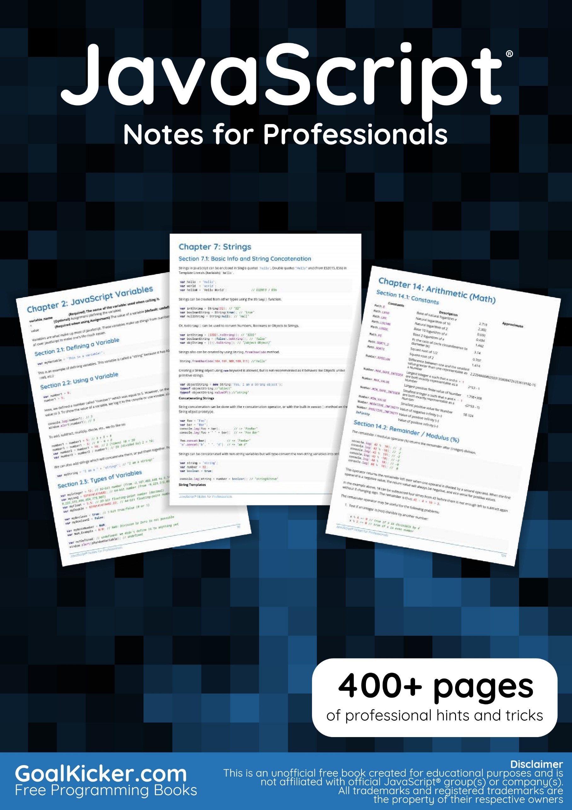

<!--{width="8.25in" height="11.663194444444445in"}-->

<h4>Contents</h4>

See end of document.

<h4>About</h4>

Please feel free to share this PDF with anyone for free, latest 
version of this book can be downloaded from:

<a href="https://goalkicker.com/JavaScriptBook" target="_blank" rel="noreferrer noopener">
JS Notes 4 Pros</a>

This <i>JavaScript® Notes for Professionals</i> book is compiled from 
<a href="https://archive.org/details/documentation-dump.7z" 
target="_blank" rel="noreferrer noopener">Stack Overflow</a>.

<a href="https://archive.org/details/documentation-dump.7z" 
target="_blank" rel="noreferrer noopener">Documentation</a>, the
content is written by the beautiful people at Stack Overflow.

Text content is released under Creative Commons BY-SA, see credits at 
the end of this book whom contributed to the various chapters. Images 
may be copyright of their respective owners unless otherwise specified.

This is an unofficial free book created for educational purposes and 
is not affiliated with official JavaScript® group(s) or company(s) nor 
Stack Overflow. All trademarks and registered trademarks are the 
property of their respective company owners.

The information presented in this book is not guaranteed to be correct 
nor accurate, use at your own risk.

Please send feedback and corrections to &lbrack;web@petercv.com&rbrack;.

<!--page 2-->

<h2 id="ch1">Chapter 1: Getting started with JavaScript</h2>

<h5>Version Release Date</h5>

1.  1997-06-01
2.  1998-06-01
3.  1998-12-01
<a href="http://www-archive.mozilla.org/js/language/ECMA-357.pdf" target="_blank" rel="noreferrer noopener">E4X</a> 2004-06-01 
<a href="http://www.ecma-international.org/publications/files/ECMA-ST-ARCH/ECMA-262%205th%20edition%20December%202009.pdf" 
target="_blank" rel="noreferrer noopener">5</a> 2009-12-01 
<a href="http://www.ecma-international.org/publications/files/ECMA-ST-ARCH/ECMA-262%205.1%20edition%20June%202011.pdf" 
target="_blank" rel="noreferrer noopener">5.1</a> 2011-06-01 
6.  2015-06-01
7.  2016-06-14
8.  2017-06-27
<!--~~~~~~~~~~~~~~~~~~~~~~~~~~~~~~~~~~~~~~~~~~~~~~~~~~~~~~~~~~~~~~~~~~~~~~~~~~~~~~~~~~~~~~~~~~~~-->
<!--~~~~~~~~~~~~~~~~~~~~~~~~~~~~~ readme.md of js-notes4-pros.org ~~~~~~~~~~~~~~~~~~~~~~~~~~~~~~-->
<!--~~~~~~~~~~~~~~~~~~~~~~~~~~~~~~~~~~~~~~~~~~~~~~~~~~~~~~~~~~~~~~~~~~~~~~~~~~~~~~~~~~~~~~~~~~~~-->
<h3 id="ch1-1">Section 1.1: Using console.log()</h3>
<!--~~~~~~~~~~~~~~~~~~~~~~~~~~~~~~~~~~~~~~~~~~~~~~~~~~~~~~~~~~~~~~~~~~~~~~~~~~~~~~~~~~~~~~~~~~~~-->
<h4>Introduction</h4>

All modern web browsers, Node.js as well as almost every other 
JavaScript environments support writing messages to a console using a 
suite of logging methods. The most common of these methods is ().

In a browser environment, the () function is predominantly used for
debugging purposes.

<h4>Getting Started</h4>

Open up the JavaScript Console in your browser, type the following,
and press Enter:

<pre>
console.log("Hello, World!");
</pre>

This will log the following to the console:

<!--~~~~~~~~~~~~~~~~~~~~~~~~~~~~~~~~~~~~~~~~~~~~~~~~~~~~~~~~~~~~~~~~~~~~~~~~~~~~~~~~~~~~~~~~~~~~-->
<!--~~~~~~~~~~~~~~~~~~~~~~~~~~~~~ 02.  (xx) ~~~~~~~~~~~~~~~~~~~~~~~~~~~~~~-->

  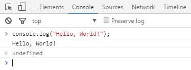

<!--{width="3.8916666666666666in" height="1.4236111111111112in"}-->

In the example above, the console.log() function prints Hello, World! to the console and returns <b>undefined</b>
(shown above in the console output window). This is because () has no 
explicit <i>return value</i>.

<h4>Logging variables</h4>

console.log() can be used to log variables of any kind; not only strings. Just pass
in the variable that you want to be displayed in the console, for example:

<pre>
<b>var</b>foo = &quot;bar&quot;;
console.log(foo);
</pre>

This will log the following to the console:

<!-- page 2 -->
<!--~~~~~~~~~~~~~~~~~~~~~~~~~~~~~~~~~~~~~~~~~~~~~~~~~~~~~~~~~~~~~~~~~~~~~~~~~~~~~~~~~~~~~~~~~~~~-->
<!--~~~~~~~~~~~~~~~~~~~~~~~~~~~~~ 03. example foobar console (xx) ~~~~~~~~~~~~~~~~~~~~~~~~~~~~~~-->

  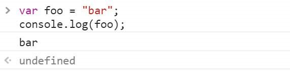

<!--~~~~~~~~~~~~~~~~~~~~~~~~~~~~~~~~~~~~~~~~~~~~~~~~~~~~~~~~~~~~~~~~~~~~~~~~~~~~~~~~~~~~~~~~~~~~-->
<!-- {width="5.954861111111111in" height="1.4777777777777779in"}-->

If you want to log two or more values, simply separate them with 
commas. Spaces will be automatically added between each argument 
during concatenation:

<pre>
var thisVar = 'first value';
var thatVar = 'second value';
console.log("thisVar:", thisVar, "and thatVar:", thatVar);
</pre>

This will log the following to the console:

<!-- page 3 -->
<!--~~~~~~~~~~~~~~~~~~~~~~~~~~~~~~~~~~~~~~~~~~~~~~~~~~~~~~~~~~~~~~~~~~~~~~~~~~~~~~~~~~~~~~~~~~~~-->
<!--~~~~~~~~~~~~~~~~~~~~~~~~~~~~~~ 04. thisVar and thatVar (xx) ~~~~~~~~~~~~~~~~~~~~~~~~~~~~~~~~-->

  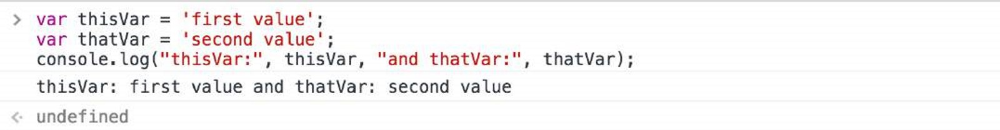

<!-- {width="7.477777777777778in" height="0.9729166666666667in"} -->

<h4>Placeholders</h4>

You can use console.log() in combination with placeholders:

<pre>
<b>var</b> greet = "Hello", who = "World";
console.log ("%s, %s!", greet, who);
</pre>

This will log the following to the console:

<!--~~~~~~~~~~~~~~~~~~~~~~~~~~~~~~~~~~~~~~~~~~~~~~~~~~~~~~~~~~~~~~~~~~~~~~~~~~~~~~~~~~~~~~~~~~~~-->
<!--~~~~~~~~~~~~~~~~~~~~~~~~~~~~~~~ 05. greet Hello, World (xx) ~~~~~~~~~~~~~~~~~~~~~~~~~~~~~~~~-->

  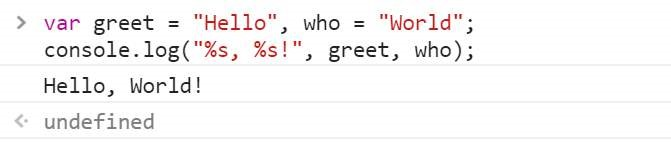

<!--{width="6.990972222222222in" height="1.4868055555555555in"}-->

<h4>Logging Objects</h4>

Below we see the result of logging an object. This is often useful for 
logging JSON responses from API calls.

<pre>
console.log ( { 
  'Email': '', 
  'Groups': {}, 
  'Id': 33, 
  'IsHiddenInUI': <b>false</b>,
  'IsSiteAdmin': <b>false</b>, 
  'LoginName': 'i:0#.w|virtualdomain&bsol;&bsol;user2',
  'PrincipalType': 1, 
  'Title': 'user2' 
} );
</pre>

<!-- page 4 -->

This will log the following to the console:

<!--~~~~~~~~~~~~~~~~~~~~~~~~~~~~~~~~~~~~~~~~~~~~~~~~~~~~~~~~~~~~~~~~~~~~~~~~~~~~~~~~~~~~~~~~~~~~-->
<!--~~~~~~~~~~~~~~~~~~~~~~~~~~~~~ 06.  (xx) ~~~~~~~~~~~~~~~~~~~~~~~~~~~~~~-->

  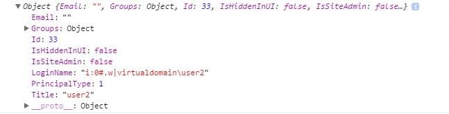
<!--{width="6.738888888888889in" height="1.7208333333333334in"}-->

<h4>Logging HTML elements</h4>

You have the ability to log any element which exists within the
<a href="https://developer.mozilla.org/en-US/docs/Web/API/Document_Object_Model/Introduction" 
target="_blank" rel="noreferrer noopener"><i>DOM</i></a>. In this case we log the body element:

<pre>
console.log(document.body);
</pre>

This will log the following to the console:

<!--~~~~~~~~~~~~~~~~~~~~~~~~~~~~~~~~~~~~~~~~~~~~~~~~~~~~~~~~~~~~~~~~~~~~~~~~~~~~~~~~~~~~~~~~~~~~-->
<!--~~~~~~~~~~~~~~~~~~~~~~~~~~~~~ 07.  (xx) ~~~~~~~~~~~~~~~~~~~~~~~~~~~~~~-->

  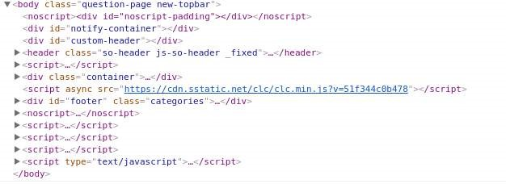
<!--{width="6.522222222222222in" height="2.3784722222222223in"}-->

<h4>End Note</h4>

For more information on the capabilities of the console, see the 
Console topic.

<!--~~~~~~~~~~~~~~~~~~~~~~~~~~~~~~~~~~~~~~~~~~~~~~~~~~~~~~~~~~~~~~~~~~~~~~~~~~~~~~~~~~~~~~~~~~~~-->
<h3 id="ch1-2">Section 1.2: Using the DOM API</h3>
<!--~~~~~~~~~~~~~~~~~~~~~~~~~~~~~~~~~~~~~~~~~~~~~~~~~~~~~~~~~~~~~~~~~~~~~~~~~~~~~~~~~~~~~~~~~~~~-->

DOM stands for <b>D</b>ocument <b>O</b>bject <b>M</b>odel. It is an
object-oriented representation of structured documents like XML and HTML.

Setting the textContent property of an Element is one way to output
text on a web page.

For example, consider the following HTML tag:

<pre><b>&lt;p</b> id="paragraph"<b>&gt;&lt;/p&gt;</b></pre>

To change its textContent property, we can run the following JavaScript:

<!-- page 5 -->

<pre>document.getElementById("paragraph").textContent = "Hello, World";</pre>

This will select the element that with the id paragraph and set its
text content to "Hello, World":

<pre><b>&lt;p</b> id="paragraph"&gt;Hello, World<b>&lt;/p&gt;</b></pre>

<a href="http://jsbin.com/fuzijox/edit?html,js,console,output" 
target="_blank" rel="noreferrer noopener">(See also this demo)</a>

You can also use JavaScript to create a new HTML element programmatically. For example, 
consider an HTML document with the following body:

<pre><b>&lt;body&gt;</b>
  <b>&lt;h1&gt;</b>Adding an element<b>&lt;/h1&gt;</b>
<b>&lt;/body&gt;</b></pre>

In our JavaScript, we create a new <b>&lt;p&gt;</b>tag with a textContent property of 
and add it at the end of the html body:

<pre><b>var</b> element = document.createElement('p');
element.textContent = "Hello, World";
document.body.appendChild(element); //<i>add the newly created element to the DOM</i></pre>

That will change your HTML body to the following:

<pre>
<b>&lt;body&gt;</b>
  <b>&lt;h1&gt;</b>Adding an element<b>&lt;/h1&gt;</b>
  <b>&lt;p&gt;</b>Hello, World<b>&lt;/p&gt;</b>
<b>&lt;/body&gt;</b>
</pre>

Note that in order to manipulate elements in the DOM using JavaScript,
the JavaScript code must be run <i>after</i> the relevant element has been
created in the document. This can be achieved by putting the
JavaScript <b>&lt;script&gt;</b> tags <i>after</i> all of your other 
<b>&lt;body&gt;</b> content. Alternatively, you can also use 
<a href="https://developer.mozilla.org/en-US/docs/Web/API/EventTarget/addEventListener" 
target="_blank" rel="noreferrer noopener">an event listener</a> to listen to eg. 
<a href="https://developer.mozilla.org/en-US/docs/Web/API/GlobalEventHandlers/onload" 
target="_blank" rel="noreferrer noopener">window's onload event</a>, adding your code to 
that event listener will delay running your code until after the whole content on your 
page has been loaded.

A third way to make sure all your DOM has been loaded, is 
<a href="https://stackoverflow.com/questions/779379/why-is-settimeoutfn-0-sometimes-useful" 
target="_blank" rel="noreferrer noopener">to wrap the DOM manipulation code with a timeout 
function of 0 ms</a>. This way, this JavaScript code is re-queued at the end of the execution 
queue, which gives the browser a chance to finish doing some non-JavaScript things that have 
been waiting to finish before attending to this new piece of JavaScript.

<!--~~~~~~~~~~~~~~~~~~~~~~~~~~~~~~~~~~~~~~~~~~~~~~~~~~~~~~~~~~~~~~~~~~~~~~~~~~~~~~~~~~~~~~~~~~~~-->
<h3 id="ch1-3">Section 1.3: Using window.alert()</h3>
<!--~~~~~~~~~~~~~~~~~~~~~~~~~~~~~~~~~~~~~~~~~~~~~~~~~~~~~~~~~~~~~~~~~~~~~~~~~~~~~~~~~~~~~~~~~~~~-->

The alert method displays a visual alert box on screen. The alert
method parameter is displayed to the user in <b>plain</b> text:

<pre>window.alert(message);</pre>

Because window is the global object, you can call also use the following shorthand:

<pre>alert(message);</pre>

So what does window.alert() do? Well, let's take the following example:

<pre>alert('hello, world');</pre>

<!-- page 6 -->

In Chrome, that would produce a pop-up like this:

<!--~~~~~~~~~~~~~~~~~~~~~~~~~~~~~~~~~~~~~~~~~~~~~~~~~~~~~~~~~~~~~~~~~~~~~~~~~~~~~~~~~~~~~~~~~~~~-->
<!--~~~~~~~~~~~~~~~~~~~~~~~~~~~~~ 08.  (xx) ~~~~~~~~~~~~~~~~~~~~~~~~~~~~~~-->

  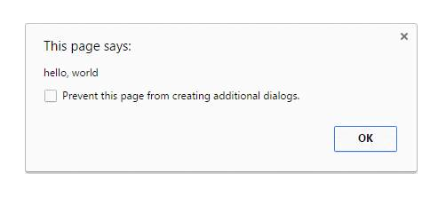
<!--{width="5.225in" height="2.3152777777777778in"}-->

<h4>Notes</h4>

<blockquote>
  The alert method is technically a property of window object, but since
  all window properties are automatically global variables, we can use
  alert as a global variable instead of as a property of window meaning
  you can directly use alert() intead of window.alert().
</blockquote>

Unlike using console.log, alert acts as a modal prompt meaning that the code
calling alert will pause until the prompt is answered. Traditionally
this means that <i>no other JavaScript code will execute</i> until the
alert is dismissed:

<pre>alert('Pause!');
console.log('Alert was dismissed');</pre>

However the specification actually allows other event-triggered code
to continue to execute even though a modal dialog is still being
shown. In such implementations, it is possible for other code to run
while the modal dialog is being shown.

More information about usage of the alert method can be found in the
modals prompts topic.

The use of alerts is usually discouraged in favour of other methods
that do not block users from interacting with the page - in order to
create a better user experience. Nevertheless, it can be useful for
debugging.

Starting with Chrome 46.0, window.alert() is blocked inside an <b>&lt;iframe&gt;</b> 
<a href="https://developer.mozilla.org/en-US/docs/Web/API/Window/alert" 
target="_blank" rel="noreferrer noopener">unless its sandbox attribute has the value allow-modal</a>.
<!--~~~~~~~~~~~~~~~~~~~~~~~~~~~~~~~~~~~~~~~~~~~~~~~~~~~~~~~~~~~~~~~~~~~~~~~~~~~~~~~~~~~~~~~~~~~~-->
<h3 id="ch1-4">Section 1.4: Using window.prompt()</h3>
<!--~~~~~~~~~~~~~~~~~~~~~~~~~~~~~~~~~~~~~~~~~~~~~~~~~~~~~~~~~~~~~~~~~~~~~~~~~~~~~~~~~~~~~~~~~~~~-->

An easy way to get an input from a user is by using the () method.

<h4>Syntax</h4>

<pre>prompt(text, &lbrack;<b>default</b>&rbrack;);</pre>

<ul>
  <li><b>text</b>: The text displayed in the prompt box.</li>
  <li><b>default</b>): A default value for the input field (optional).</li>
</ul>

<b>Examples</b>

<pre>
<b>var</b> age = prompt("How old are you?");
console.log(age); // <i>Prints the value inserted by the user</i>
</pre>
<!-- page 7 -->
<!--~~~~~~~~~~~~~~~~~~~~~~~~~~~~~~~~~~~~~~~~~~~~~~~~~~~~~~~~~~~~~~~~~~~~~~~~~~~~~~~~~~~~~~~~~~~~-->
<!--~~~~~~~~~~~~~~~~~~~~~~~~~~~~~ 09.  (xx) ~~~~~~~~~~~~~~~~~~~~~~~~~~~~~~-->

  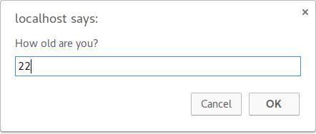
<!--{width="4.603472222222222in" height="1.9548611111111112in"}-->

If the user clicks the <b>OK</b> button, the input value is returned.
Otherwise, the method returns <b>null</b>.

The return value of prompt is always a string, unless the user clicks
<b>Cancel</b>, in which that case it returns <b>null</b>. Safari is an
exception in that when the user clicks Cancel, the function returns an
empty string. From there, you can convert the return value to another
type, such as an integer.

<h4>Notes</h4>

<ul>
  <li>While the prompt box is displayed, the user is prevented from accessing 
    other parts of the page, since dialog boxes are modal windows.</li>
  <li>Starting with Chrome 46.0 this method is blocked inside an <b>&lt;iframe&gt;</b>
    unless its sandbox attribute has the value allow-modal.</li>
</ul>
<!--~~~~~~~~~~~~~~~~~~~~~~~~~~~~~~~~~~~~~~~~~~~~~~~~~~~~~~~~~~~~~~~~~~~~~~~~~~~~~~~~~~~~~~~~~~~~-->
<h3 id="ch1-5">Section 1.5: Using window.confirm()</h3>
<!--~~~~~~~~~~~~~~~~~~~~~~~~~~~~~~~~~~~~~~~~~~~~~~~~~~~~~~~~~~~~~~~~~~~~~~~~~~~~~~~~~~~~~~~~~~~~-->

The window.confirm() method displays a modal dialog with an optional message and two
buttons, OK and Cancel.

Now, let's take the following example:

<pre>result = window.confirm(message);</pre>

Here, <b>message</b> is the optional string to be displayed in the dialog
and <b>result</b> is a boolean value indicating whether OK or Cancel was
selected (true means OK).

window.confirm() is typically used to ask for user confirmation before doing a
dangerous operation like deleting something in a Control Panel:

<pre><b>if</b> (window.confirm("Are you sure you want to delete this?")) { 
  deleteItem (itemId);
}</pre>

The output of that code would look like this in the browser:

<!--~~~~~~~~~~~~~~~~~~~~~~~~~~~~~~~~~~~~~~~~~~~~~~~~~~~~~~~~~~~~~~~~~~~~~~~~~~~~~~~~~~~~~~~~~~~~-->
<!--~~~~~~~~~~~~~~~~~~~~~~~~~~~~~ 10.  (xx) ~~~~~~~~~~~~~~~~~~~~~~~~~~~~~~-->

  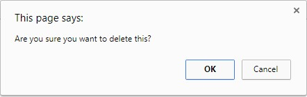
<!--{width="4.603472222222222in" height="1.4597222222222221in"}-->

If you need it for later use, you can simply store the result of the
user's interaction in a variable:

<!-- page 8 -->

<pre><b>var</b> deleteConfirm = window.confirm("Are you sure you want to delete this?");</pre>

<h4>Notes</h4>

<ul>
  <li>The argument is optional and not required by the specification.</li>
  <li>Dialog boxes are modal windows - they prevent the user from accessing
    the rest of the program's interface until the dialog box is closed.
    For this reason, you should not overuse any function that creates a
    dialog box (or modal window). And regardless, there are very good reasons 
    to avoid using dialog boxes for confirmation.</li>
  <li>Starting with Chrome 46.0 this method is blocked inside an <b>&lt;iframe&gt;</b>
    unless its sandbox attribute has the value allow-modal.</li>
  <li>It is commonly accepted to call the confirm method with the window
    notation removed as the window object is always implicit. However, it
    is recommended to explicitly define the window object as expected
    behavior may change due to implementation at a lower scope level with
    similarly named methods.</li>
</ul>

<!--~~~~~~~~~~~~~~~~~~~~~~~~~~~~~~~~~~~~~~~~~~~~~~~~~~~~~~~~~~~~~~~~~~~~~~~~~~~~~~~~~~~~~~~~~~~~-->
<h3 id="ch1-6">Section 1.6: Using the DOM API (with graphical text: Canvas, SVG, or image file)</h3>
<!--~~~~~~~~~~~~~~~~~~~~~~~~~~~~~~~~~~~~~~~~~~~~~~~~~~~~~~~~~~~~~~~~~~~~~~~~~~~~~~~~~~~~~~~~~~~~-->
<h4>Using canvas elements</h4>

HTML provides the canvas element for building raster-based images.

First build a canvas for holding image pixel information.

<pre><b>var</b> canvas = document.createElement('canvas');
canvas.width = 500;
canvas.height = 250;</pre>

Then select a context for the canvas, in this case two-dimensional:

<pre><b>var</b> ctx=canvas.getContext ('2d');</pre>

Then set properties related to the text:

<pre>ctx.font = '30px Cursive';
ctx.fillText ("Hello world!", 50, 50);</pre>

Then insert the canvas element into the page to take effect:

<pre>document.body.appendChild(canvas);</pre>

<h4>Using SVG</h4>

SVG is for building scalable vector-based graphics and can be used
within HTML.

First create an SVG element container with dimensions:

<pre><b>var</b> svg=document.createElementNS('http://www.w3.org/2000/svg', 'svg');
svg.width = 500;
svg.height = 50;</pre>

Then build a text element with the desired positioning and font
characteristics:

<!-- page 9 -->

<pre><b>var</b> text = document.createElementNS('http://www.w3.org/2000/svg', 'text');
text.setAttribute('x', '0');
text.setAttribute('y', '50');
text.style.fontFamily = 'Times New Roman';
text.style.fontSize = '50';</pre>

Then add the actual text to display to the textelement:

<pre>text.textContent = 'Hello world!';</pre>

Finally add the text element to our svg container and add the svg
container element to the HTML document:

<pre>svg.appendChild(text);
document.body.appendChild(svg);</pre>

<h4>Image file</h4>

If you already have an image file containing the desired text and have
it placed on a server, you can add the URL of the image and then add
the image to the document as follows:

<pre><b>var</b> img = <b>new</b> Image ( );
img.src = 'https://i.ytimg.com/vi/zecueq-mo4M/maxresdefault.jpg';
document.body.appendChild(img);</pre>
<!-- page 10 -->
<!--~~~~~~~~~~~~~~~~~~~~~~~~~~~~~~~~~~~~~~~~~~~~~~~~~~~~~~~~~~~~~~~~~~~~~~~~~~~~~~~~~~~~~~~~~~~~-->
<h2 id="ch2">Chapter 2: JavaScript Variables</h2>
<!--~~~~~~~~~~~~~~~~~~~~~~~~~~~~~~~~~~~~~~~~~~~~~~~~~~~~~~~~~~~~~~~~~~~~~~~~~~~~~~~~~~~~~~~~~~~~-->

<b>variable_name &nbsp;&nbsp;&nbsp;&nbsp;&nbsp;&nbsp;&nbsp;{Required} The name of the variable: used when calling it.</b>

= &nbsp;&nbsp;&nbsp;&nbsp;&nbsp;&nbsp;&nbsp;<b>&lbrack;Optional&rbrack;</b> Assignment (defining the variable)

value &nbsp;&nbsp;&nbsp;&nbsp;&nbsp;&nbsp;&nbsp<b>{Required when using Assignment}</b> The value of a variable
<b>&lbrack;default: undefined&rbrack;</b>

Variables are what make up most of JavaScript. These variables make up
things from numbers to objects, which are all over JavaScript to make
one's life much easier.

<!--~~~~~~~~~~~~~~~~~~~~~~~~~~~~~~~~~~~~~~~~~~~~~~~~~~~~~~~~~~~~~~~~~~~~~~~~~~~~~~~~~~~~~~~~~~~~-->
<h3 id="ch2-1">Section 2.1: Defining a Variable</h3>
<!--~~~~~~~~~~~~~~~~~~~~~~~~~~~~~~~~~~~~~~~~~~~~~~~~~~~~~~~~~~~~~~~~~~~~~~~~~~~~~~~~~~~~~~~~~~~~-->
<pre><b>var</b> myVariable = "This is a variable!";</pre>

This is an example of defining variables. This variable is called a
"string" because it has ASCII characters (A-Z, 0-9, !@#$, etc.)

<!--~~~~~~~~~~~~~~~~~~~~~~~~~~~~~~~~~~~~~~~~~~~~~~~~~~~~~~~~~~~~~~~~~~~~~~~~~~~~~~~~~~~~~~~~~~~~-->
<h3 id="ch2-2">Section 2.2: Using a Variable</h3>
<!--~~~~~~~~~~~~~~~~~~~~~~~~~~~~~~~~~~~~~~~~~~~~~~~~~~~~~~~~~~~~~~~~~~~~~~~~~~~~~~~~~~~~~~~~~~~~-->
<pre><b>var</b> number1 = 5;
number1 = 3;</pre>

Here, we defined a number called "number1" which was equal to 5. 
However, on the second line, we changed the value to 3. To show the 
value of a variable, we log it to the console or use window.alert():

<pre>console.log(number1); // <i>3</i>
window.alert(number1); // <i>3</i></pre>

To add, subtract, multiply, divide, etc., we do like so:

<pre>number1 = number1 + 5; // <i>3 + 5 = 8</i>
number1 = number1 - 6; // <i>8 - 6 = 2</i>
<b>var</b> number2 = number1 &ast; 10; // <i>2 (times) 10 = 20</i>
<b>var</b> number3 = number2 / number1; // <i>20 (divided by) 2 = 10;</i></pre>

We can also add strings which will concatenate them, or put them
together. For example:

<pre><b>var</b> myString = "I am a " + "string!" ; // <i>"I am a string!"</i></pre>
<!--~~~~~~~~~~~~~~~~~~~~~~~~~~~~~~~~~~~~~~~~~~~~~~~~~~~~~~~~~~~~~~~~~~~~~~~~~~~~~~~~~~~~~~~~~~~~-->
<h3 id="ch2-3">Section 2.3: Types of Variables</h3>
<!--~~~~~~~~~~~~~~~~~~~~~~~~~~~~~~~~~~~~~~~~~~~~~~~~~~~~~~~~~~~~~~~~~~~~~~~~~~~~~~~~~~~~~~~~~~~~-->
<pre><b>var</b> myInteger = 12; // <i>32-bit number (from -2,147,483,648 to 2,147,483,647)</i>
<b>var</b> myLong = 9310141419482 ; // <i>64-bit number (from -9,223,372,036,854,775,808 to
  9,223,372,036,854,775,807)</i>
<b>var</b> myFloat = 5.5; // <i>32-bit floating-point number (decimal)</i>
<b>var</b> myDouble = 9310141419482.22; // <i>64-bit floating-point number</i>

<b>var</b> myBoolean = <b>true</b>; // <i>1-bit true/false (0 or 1)</i>
<b>var</b> myBoolean2 = <b>false</b>;

<b>var</b> myNotANumber = <b>NaN</b>;
<b>var</b> NaN_Example = 0 / 0 ; // <i>NaN: Division by Zero is not possible</i>

<b>var</b> notDefined; // <i>undefined: we didn&apos;t define it to anything yet</i>
window.alert(aRandomVariable); // <i>undefined</i>

<b>var</b> myNull=<b>null</b>; // <i>null</i>
<i>// etc...</i></pre>

<!-- page 11 -->
<!--~~~~~~~~~~~~~~~~~~~~~~~~~~~~~~~~~~~~~~~~~~~~~~~~~~~~~~~~~~~~~~~~~~~~~~~~~~~~~~~~~~~~~~~~~~~~-->
<h3 id="ch2-4">Section 2.4: Arrays and Objects</h3>
<!--~~~~~~~~~~~~~~~~~~~~~~~~~~~~~~~~~~~~~~~~~~~~~~~~~~~~~~~~~~~~~~~~~~~~~~~~~~~~~~~~~~~~~~~~~~~~-->
<pre><b>var</b> myArray=&lbrack;&rbrack;; // <i>empty array</i></pre>

An array is a set of variables. For example:

<pre><b>var</b> favoriteFruits = &lbrack;"apple", "orange", "strawberry"&rbrack;;
<b>var</b> carsInParkingLot = &lbrack;"Toyota", "Ferrari", "Lexus"&rbrack;;
<b>var</b> employees = &lbrack;"Billy", "Bob", "Joe"&rbrack;;
<b>var</b> primeNumbers = &lbrack;2, 3, 5, 7, 11, 13, 17, 19, 23, 29, 31&rbrack;;
<b>var</b> randomVariables = &lbrack;2, "any type works", <b>undefined</b>, <b>null</b>, <b>true</b>, 2.51&rbrack;;

myArray = &lbrack;"zero" , "one" , "two" &rbrack;;
window.alert ( myArray &lbrack;0&rbrack;); // <i>0 is the first element of an array</i>
                  // <i>in this case, the value would be "zero"</i>
myArray = &lbrack;"John Doe", "Billy"&rbrack;;
elementNumber = 1;

window.alert(myArray&lbrack;elementNumber&rbrack;); // <i>Billy</i></pre>

An object is a group of values; unlike arrays, we can do something
better than them:

<pre>myObject = {};
john = {firstname: "John", lastname: "Doe", fullname: "John Doe"};
billy = {
  firstname: "Billy",
  lastname: <b>undefined</b>,
  fullname: "Billy"
};
window.alert(john.fullname); // <i>John Doe</i>
window.alert(billy.firstname); // <i>Billy</i></pre>

Rather than making an array &lbrack;"John Doe", "Billy"&rbrack; and calling myArray&lbrack;0&rbrack;, we
can just call john.fullname and billy.fullname.

<!-- page 12 -->
<!--~~~~~~~~~~~~~~~~~~~~~~~~~~~~~~~~~~~~~~~~~~~~~~~~~~~~~~~~~~~~~~~~~~~~~~~~~~~~~~~~~~~~~~~~~~~~-->
<h2 id="ch3">Chapter 3: Built-in Constants</h2>
<!--~~~~~~~~~~~~~~~~~~~~~~~~~~~~~~~~~~~~~~~~~~~~~~~~~~~~~~~~~~~~~~~~~~~~~~~~~~~~~~~~~~~~~~~~~~~~-->
<h3 id="ch3-1">Section 3.1: null</h3>
<!--~~~~~~~~~~~~~~~~~~~~~~~~~~~~~~~~~~~~~~~~~~~~~~~~~~~~~~~~~~~~~~~~~~~~~~~~~~~~~~~~~~~~~~~~~~~~-->

<b>null</b> is used for representing the intentional absence of an object value and is a 
primitive value. Unlike <b>undefined</b>, it is not a property of the global object.

It is equal to <b>undefined</b> but not identical to it.

<pre><b>null</b> == <b>undefined</b>; // true
<b>null</b> === <b>undefined</b>; // false</pre>

<b>CAREFUL</b>: The <b>typeof null</b> is 'object'.

<pre><b>typeof null</b>; // 'object';
</pre>

To properly check if a value is <b>null</b>, compare it with the strict equality operator.

<pre>
<b>var</b> a = <b>null</b>;

a === <b>null</b>; // true</pre>
<!--~~~~~~~~~~~~~~~~~~~~~~~~~~~~~~~~~~~~~~~~~~~~~~~~~~~~~~~~~~~~~~~~~~~~~~~~~~~~~~~~~~~~~~~~~~~~-->
<h3 id="ch3-2">Section 3.2: Testing for NaN using isNaN()</h3>
<!--~~~~~~~~~~~~~~~~~~~~~~~~~~~~~~~~~~~~~~~~~~~~~~~~~~~~~~~~~~~~~~~~~~~~~~~~~~~~~~~~~~~~~~~~~~~~-->
<pre><b>window.isNaN</b></pre>  

The global function () can be used to check if a certain value or
expression evaluates to <b>NaN</b>. This function (in short) first checks
if the value is a number, if not tries to convert it (&ast;), and then
checks if the resulting value is <b>NaN</b>. For this reason, <b>this
testing method may cause confusion</b>.

(&ast;) The "conversion" method is not that simple, see 
<a href="http://www.ecma-international.org/ecma-262/6.0/#sec-isnan-number" 
target="_blank" rel="noreferrer noopener">ECMA-262 18.2.3</a> for a detailed explanation 
of the algorithm.

These examples will help you better understand the isNaN() behavior:

<pre>isNaN(<b>NaN</b>);            // <i>true</i>
isNaN(1);             // <i>false: 1 is a number</i>
isNaN(-2e-4);         // <i>false: -2e-4 is a number (-0.0002) in scientific notation</i>
isNaN(<b>Infinity</b>);      // <i>false: Infinity is a number</i>
isNaN(<b>true</b>);          // <i>false: converted to 1, which is a number</i>
isNaN(<b>false</b>);         // <i>false: converted to 0, which is a number</i>
isNaN(<b>null</b>);          // <i>false: converted to 0, which is a number</i>
isNaN("");            // <i>false: converted to 0, which is a number</i>
isNaN("");            // <i>false: converted to 0, which is a number</i>
isNaN("45.3");        // <i>false: string representing a number, converted to 45.3</i>
isNaN("1.2e3");       // <i>false: string representing a number, converted to 1.2e3</i>
isNaN("Infinity");    // <i>false: string representing a number, converted to Infinity</i>
isNaN(<b>new</b> Date);      // <i>false: Date object, converted to milliseconds since epoch</i>
isNaN("10$");         // <i>true : conversion fails, the dollar sign is not a digit</i>
isNaN("hello");       // <i>true : conversion fails, no digits at all</i>
isNaN(<b>undefined</b>);     // <i>true : converted to NaN</i>
isNaN();              // <i>true : converted to NaN (implicitly undefined)</i>
isNaN(<b>function</b>(){}); // <i>true : conversion fails</i>
isNaN({});           // <i>true : conversion fails</i>
isNaN(&lbrack;1, 2&rbrack;);       // <i>true : converted to "1, 2", which can't be converted to a number</i></pre>

<!-- page 13 -->

This last one is a bit tricky: checking if an Array is <b>NaN</b>. To do
the Number() constructor first converts the array to a string, then to
a number; this is the reason why isNaN(&lbrack;&rbrack) and isNaN (&lbrack;34&rbrack;), 
"1,2", and <b>true</b> respectively. In general, <b>an array is
considered NaN by () unless it only holds one element whose string
representation can be converted to a valid number</b>.

<h5>Version ≥ 6</h5>

<pre>Number.isNaN</pre>

In ECMAScript 6, the Number.isNaN() function has been implemented primarily to
avoid the problem of window.isNaN() of forcefully converting the parameter to a 
number.Number.isNaN(), indeed, <b>doesn't try to convert </b> the value to a number 
before testing. This also means that <b>only values of the type number, that
are also NaN, return true</b> (which basically means only )).

From <a href="http://www.ecma-international.org/ecma-262/6.0/#sec-number.isnan" 
target="_blank" rel="noreferrer noopener">ECMA-262 20.1.2.4</a>:

<blockquote>

When the Number .isNaN is called with one argument number, the following steps are taken:

1.  If Type(number) is not Number, return <b>false</b>.
2.  If number is <b>NaN</b>, return <b>true</b>.
3.  Otherwise, return <b>false</b>.
</blockquote>

Some examples:

<!--~~~~~~~~~~~~~~~~~~~~~~~~~~~~~~~~~~~~~~~~~~~~~~~~~~~~~~~~~~~~~~~~~~~~~~~~~~~~~~~~~~~~~~~~~~~~-->
<!--~~~~~~~~~~~~~~~~~~~~~~~~~~~~~ 11. examples: Number.isNaN (xx) ~~~~~~~~~~~~~~~~~~~~~~~~~~~~~~-->

  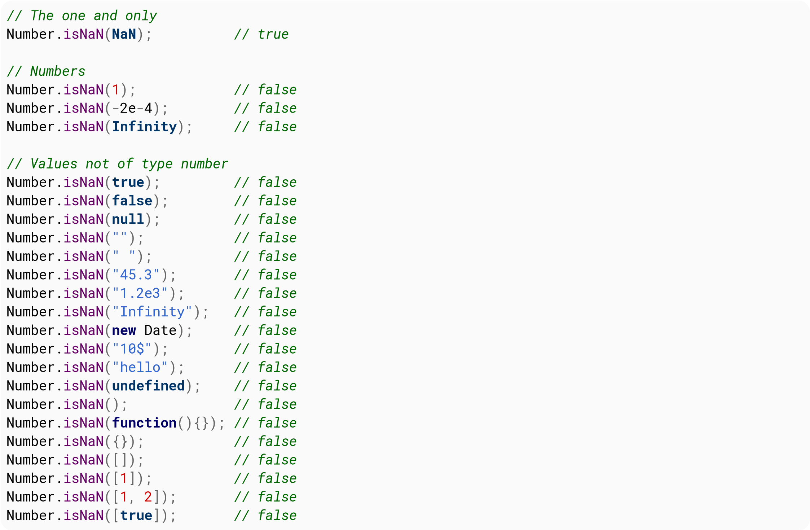
<!-- (./images/image011.png){width="7.486805555555556in" height="4.891666666666667in"} -->
<!--~~~~~~~~~~~~~~~~~~~~~~~~~~~~~~~~~~~~~~~~~~~~~~~~~~~~~~~~~~~~~~~~~~~~~~~~~~~~~~~~~~~~~~~~~~~~-->
<h3 id="ch3-3">Section 3.3: NaN</h3>
<!--~~~~~~~~~~~~~~~~~~~~~~~~~~~~~~~~~~~~~~~~~~~~~~~~~~~~~~~~~~~~~~~~~~~~~~~~~~~~~~~~~~~~~~~~~~~~-->

<a href="https://developer.mozilla.org/en-US/docs/Web/JavaScript/Reference/Global_Objects/NaN" 
target="_blank" rel="noreferrer noopener"><b>NaN</b></a> stands for "Not a Number." When a mathematical 
function or operation in JavaScript cannot return a specific number, it returns the value <b>NaN</b> 
instead.

<!-- page 14 -->

It is a property of the global object, and a reference to 
<a href="https://developer.mozilla.org/docs/Web/JavaScript/Reference/Global_Objects/Number/NaN" 
target="_blank" rel="noreferrer noopener">Number.NaN</a>

<pre>window.hasOwnProperty('NaN'); // <i>true</i>
<b>NaN</b>; // <i>NaN</i></pre>

Perhaps confusingly, <b>NaN</b> is still considered a number.

<pre><b>typeof</b> <b>NaN</b>; // <i>'number'</i></pre>

Don&apos;t check for <b>NaN</b> using the equality operator. See isNaN instead.

<pre><b>NaN</b> == <b>NaN</b>  // <i>false</i>
<b>NaN</b> === <b>NaN</b> // <i>false</i></pre>
<!--~~~~~~~~~~~~~~~~~~~~~~~~~~~~~~~~~~~~~~~~~~~~~~~~~~~~~~~~~~~~~~~~~~~~~~~~~~~~~~~~~~~~~~~~~~~~-->
<h3 id="ch3-4">Section 3.4: undefined and null</h3>
<!--~~~~~~~~~~~~~~~~~~~~~~~~~~~~~~~~~~~~~~~~~~~~~~~~~~~~~~~~~~~~~~~~~~~~~~~~~~~~~~~~~~~~~~~~~~~~-->

At first glance it may appear that <b>null</b> and <b>undefined</b> are
basically the same, however there are subtle but important
differences.

<b>undefined</b> is the absence of a value in the compiler, because where
it should be a value, there hasn&apos;t been put one, like the case of an
unassigned variable.

<ul>
  <li><b>undefined</b> is a global value that represents the absence of an
    assigned value.
    <ul>
      <li><b>typeof</b> <b>undefined</b> === 'undefined'</li>
    </ul>
  </li>
  <li><b>null</b> is an object that indicates that a variable has been
    explicitly assigned "no value".
    <ul>
      <li><b>typeof</b> <b>null</b> === 'object'</li>
    </ul>
  </li>
</ul>

Setting a variable to <b>undefined</b> means the variable effectively
does not exist. Some processes, such as JSON serialization, may strip
<b>undefined</b> properties from objects. In contrast, <b>null</b>
properties indicate will be preserved so you can explicitly convey the
concept of an "empty" property.

The following evaluate to <b>undefined</b>:

<ul>
  <li>A variable when it is declared but not assigned a value (i.e. defined)
    <ul>
      <li><b>let</b> foo; 
        console.log('is undefined?', foo === <b>undefined</b>); 
        // <i>is undefined? true</i>
      </li>
    </ul>
  <li>Accessing the value of a property that doesn't exist
    <ul>
      <li><b>let</b> foo = { a: 'a' }; 
        console.log('is undefined?', foo.b === <b>undefined</b>); 
        // <i>is undefined? true</i>
      </li>
    </ul>
  <li>The return value of a function that doesn't return a value
    <ul>
      <li><b>function</b> foo() { <b>return</b>; } 
        console.log('is undefined?', foo() === <b>undefined</b>); 
        // <i>is undefined? true</i>
      </li>
    </ul>
  <li>The value of a function argument that is declared but has been omitted
    from the function call
    <ul>
      <li><b>function</b> foo(param) { 
          console.log('is undefined?', param === <b>undefined</b>); 
        } 
        foo('a'); 
        foo(); 
        // <i>is undefined? false</i> 
        // <i>is undefined? true</i> 
      </li>
    </ul>
  </li>
</ul>
<!-- page 15 -->

<b>undefined</b> is also a property of the global window object.

<pre>// <i>Only in browsers</i>
console.log(window.<b>undefined</b>); // <i>undefined</i>
window.hasOwnProperty('undefined'); // <i>true</i></pre>

<h5>Version &lt; 5</h5>

Before ECMAScript 5 you could actually change the value of the
window.<b>undefined</b> property to any other value potentially breaking everything.

<!--~~~~~~~~~~~~~~~~~~~~~~~~~~~~~~~~~~~~~~~~~~~~~~~~~~~~~~~~~~~~~~~~~~~~~~~~~~~~~~~~~~~~~~~~~~~~-->
<h3 id="ch3-5">Section 3.5: Infinity and -Infinity</h3>
<!--~~~~~~~~~~~~~~~~~~~~~~~~~~~~~~~~~~~~~~~~~~~~~~~~~~~~~~~~~~~~~~~~~~~~~~~~~~~~~~~~~~~~~~~~~~~~-->
<pre>1 / 0; // <i>Infinity</i>
// <i>Wait! WHAAAT?</i></pre>

<b>Infinity</b> is a property of the global object (therefore a global
variable) that represents mathematical infinity. It is a reference to Number.POSITIVE_INFINITY

It is greater than any other value, and you can get it by dividing by
0 or by evaluating the expression of a number that's so big that
overflows. This actually means there is no division by 0 errors in
JavaScript, there is Infinity!

There is also <b>-Infinity</b> which is mathematical negative infinity, and it's lower 
than any other value.

To get <b>-Infinity</b> you negate <b>Infinity</b>, or get a reference to it in 
<b>Number.NEGATIVE_INFINITY</b>.

<pre>- <b>Infinity</b>; // <i>-Infinity</i></pre>

Now let's have some fun with examples:

<pre><b>Infinity</b> &gt; 123192310293;  // <i>true</i>
<b>-Infinity</b> &lt; -123192310293;  // <i>true</i>
1 / 0;  // <i>Infinity</i>
Math.pow(123123123, 9123192391023); // <i>Infinity</i>
Number.MAX_VALUE &ast; 2;  // <i>Infinity</i>
23 / <b>Infinity;</b>  // <i>0</i>
<b>-Infinity;</b>  // <i>-Infinity</i>
<b>-Infinity</b> === Number.NEGATIVE_INFINITY;  // <i>true</i>
-0;  // <i>-0 , yes there is a negative 0 in the Language</i>
0 === -0;  // <i>true</i>
1 / -0;  // <i>-Infinity</i>
1 / 0 === 1 / -0;  // <i>false</i>
<b>Infinity + Infinity</b>  // <i>Infinity</i>

<b>var</b> a = 0, b = -0;

a === b;  // <i>true</i>
1 / a === 1 / b;  // <i>false</i>

// <i>Try your own!</i></pre>
<!--~~~~~~~~~~~~~~~~~~~~~~~~~~~~~~~~~~~~~~~~~~~~~~~~~~~~~~~~~~~~~~~~~~~~~~~~~~~~~~~~~~~~~~~~~~~~-->
<h3 id="ch3-6">Section 3.6: Number constants</h3>
<!--~~~~~~~~~~~~~~~~~~~~~~~~~~~~~~~~~~~~~~~~~~~~~~~~~~~~~~~~~~~~~~~~~~~~~~~~~~~~~~~~~~~~~~~~~~~~-->
<!-- page 16 -->

The Number constructor has some built in constants that can be useful

<pre>Number.MAX_VALUE;  // <i>1.7976931348623157e+308</i>
Number.MAX_SAFE_INTEGER;  // <i>9007199254740991</i>
Number.MIN_VALUE;  // <i>5e-324</i>
Number.MIN_SAFE_INTEGER;  // <i>-9007199254740991</i>

Number.EPSILON; // <i>0.0000000000000002220446049250313</i>

Number.POSITIVE_INFINITY; // <i>Infinity</i>
Number.NEGATIVE_INFINITY;  // <i>-Infinity</i>

Number.<b>NaN</b>;  // <i>NaN</i></pre>

In many cases the various operators in JavaScript will break with
values outside the range of (Number.MIN_SAFE_INTEGER,Number.MAX_SAFE_INTEGER)

Note that represents the different between one and the smallest Number
greater than one, and thus the smallest possible difference between
two different Number values. One reason to use this is due to the
nature of how numbers are stored by JavaScript see Check the equality
of two numbers.

<!--~~~~~~~~~~~~~~~~~~~~~~~~~~~~~~~~~~~~~~~~~~~~~~~~~~~~~~~~~~~~~~~~~~~~~~~~~~~~~~~~~~~~~~~~~~~~-->
<h3 id="ch3-7">Section 3.7: Operations that return NaN</h3>
<!--~~~~~~~~~~~~~~~~~~~~~~~~~~~~~~~~~~~~~~~~~~~~~~~~~~~~~~~~~~~~~~~~~~~~~~~~~~~~~~~~~~~~~~~~~~~~-->

Mathematical operations on values other than numbers return NaN.

<pre>"b" &ast; 3
"cde" - "e"
&lbrack;1, 2, 3&rbrack; &ast; 2</pre>

An exception: Single-number arrays.

<pre>&lbrack;2&rbrack; &ast; &lbrack;3&rbrack;  // <i>Returns 6</i></pre>

Also, remember that the + operator concatenates strings.

<pre>"a" + "b"  // <i>Returns "ab"</i></pre>

Dividing zero by zero returns <b>NaN</b>.

<pre>0 / 0  // <i>NaN</i></pre>

Note: In mathematics generally (unlike in JavaScript programming),
dividing by zero is not possible.

<!--~~~~~~~~~~~~~~~~~~~~~~~~~~~~~~~~~~~~~~~~~~~~~~~~~~~~~~~~~~~~~~~~~~~~~~~~~~~~~~~~~~~~~~~~~~~~-->
<h3 id="ch3-8">Section 3.8: Math library functions that return NaN</h3>
<!--~~~~~~~~~~~~~~~~~~~~~~~~~~~~~~~~~~~~~~~~~~~~~~~~~~~~~~~~~~~~~~~~~~~~~~~~~~~~~~~~~~~~~~~~~~~~-->

Generally, Math functions that are given non-numeric arguments will
return NaN.

<pre>Math.floor("a")</pre>

The square root of a negative number returns NaN, because does not
support <a href="https://en.wikipedia.org/wiki/Imaginary_number" 
target="_blank" rel="noreferrer noopener">imaginary</a> or
<a href="https://en.wikipedia.org/wiki/Complex_number" 
target="_blank" rel="noreferrer noopener">complex</a> numbers.

<pre>Math.sqrt(-1)</pre>
<!-- page 17 -->
<!--~~~~~~~~~~~~~~~~~~~~~~~~~~~~~~~~~~~~~~~~~~~~~~~~~~~~~~~~~~~~~~~~~~~~~~~~~~~~~~~~~~~~~~~~~~~~-->
<h2 id="ch4">Chapter 4: Comments</h2>
<!--~~~~~~~~~~~~~~~~~~~~~~~~~~~~~~~~~~~~~~~~~~~~~~~~~~~~~~~~~~~~~~~~~~~~~~~~~~~~~~~~~~~~~~~~~~~~-->
<h3 id="ch4-1">Section 4.1: Using Comments</h3>
<!--~~~~~~~~~~~~~~~~~~~~~~~~~~~~~~~~~~~~~~~~~~~~~~~~~~~~~~~~~~~~~~~~~~~~~~~~~~~~~~~~~~~~~~~~~~~~-->

To add annotations, hints, or exclude some code from being executed
JavaScript provides two ways of commenting code lines.

<h4>Single line Comment //</h4>

Everything after the // until the end of the line is excluded from execution.

<pre><b>function</b> elementAt( event ) {
// <i>Gets the element from Event coordinates</i>
  <b>return</b> document.elementFromPoint(event.clientX, event.clientY);
}
&ast;// <i>TODO: write more cool stuff!</i></pre>

<h4>Multi-line Comment /&ast;&ast;/</h4>

Everything between the opening /* and the closing */ is excluded
from execution, even if the opening and closing are on different
lines.

<pre>/*
   <i>Gets the element from Event coordinates.
   Use like:
     var clickedEl = someEl.addEventListener("click", elementAt, false);</i>
*/
<b>function</b> elementAt( event ) {
  <b>return</b> document.elementFromPoint(event.clientX, event.clientY);
}
/&ast; <i>TODO: write more useful comments!</i> &ast;/</pre>
<!--~~~~~~~~~~~~~~~~~~~~~~~~~~~~~~~~~~~~~~~~~~~~~~~~~~~~~~~~~~~~~~~~~~~~~~~~~~~~~~~~~~~~~~~~~~~~-->
<h3 id="ch4-2">Section 4.2: Using HTML comments in JavaScript (Bad practice)</h3>
<!--~~~~~~~~~~~~~~~~~~~~~~~~~~~~~~~~~~~~~~~~~~~~~~~~~~~~~~~~~~~~~~~~~~~~~~~~~~~~~~~~~~~~~~~~~~~~-->

HTML comments (optionally preceded by whitespace) will cause code (on
the same line) to be ignored by the browser also, though this is
considered <b>bad practice</b>.

One-line comments with the HTML comment opening sequence (&lt;!-&dash;):

<blockquote>
<b>Note:</b> the JavaScript interpreter ignores the closing characters of HTML comments (&dash;-&gt;) here.
</blockquote>

<pre>&lt;!-- A single-line comment.
&lt;!-- --&gt; Identical to using `//` since
&lt;!-- --&gt; the closing '--&gt;' is ignored.</pre>

This technique can be observed in legacy code to hide JavaScript from
browsers that didn't support it:

<pre><b>script</b> type="text/javascript" language="JavaScript"<b>&gt;</b>
&lt;!-&dash;
/* Arbitrary JavaScript code.
   Old browsers would treat
   it as HTML code. */
// --&gt;
&lt;/script&gt;</pre>

<!-- page 18 -->

An HTML closing comment can also be used in JavaScript (independent of
an opening comment) at the beginning of a line (optionally preceded by
whitespace) in which case it too causes the rest of the line to be
ignored:

<pre>&dash;-&gt; Unreachable JS code</pre>

These facts have also been exploited to allow a page to call itself
first as HTML and secondly as JavaScript. For example:

<pre>&lt;!-&dash;
 self.postMessage('reached JS "file"');
/&ast;
&dash;-&gt;
<b>&lt;!DOCTYPE html&gt;</b>
<b>&lt;script&gt;</b>
var w1 = new Worker('#1');
w1.onmessage = function (e) {
  console.log(e.data); // 'reached JS "file"
};
<b>&lt;/script&gt;</b>
&lt;!-&dash;
&ast;/
&dash;-&gt;</pre>

When run a HTML, all the multiline text between the &lt;!-&dash; and &dash;-&gt;
comments are ignored, so the JavaScript contained therein is ignored
when run as HTML.

As JavaScript, however, while the lines beginning with &lt;!-&dash; and &dash;-&gt;
are ignored, their effect is not to escape over <i>multiple</i>
lines, so the lines following them (e.g., self.postMessage(...) will not be ignored when
run as JavaScript, at least until they reach a <i>JavaScript</i> comment,
marked by /&ast; and &ast;/. Such JavaScript comments are used in the above
example to ignore the remaining <i>HTML</i> text (until the &dash;-&gt; which is
also ignored as JavaScript).

<!--~~~~~~~~~~~~~~~~~~~~~~~~~~~~~~~~~~~~~~~~~~~~~~~~~~~~~~~~~~~~~~~~~~~~~~~~~~~~~~~~~~~~~~~~~~~~-->
<h2 id="ch5">Chapter 5: Console</h2>
<!--~~~~~~~~~~~~~~~~~~~~~~~~~~~~~~~~~~~~~~~~~~~~~~~~~~~~~~~~~~~~~~~~~~~~~~~~~~~~~~~~~~~~~~~~~~~~-->
<!-- page 19 -->

The information displayed by a <a href="https://developer.mozilla.org/en-US/docs/Tools/Web_Console">
debugging/web console</a> is made available through the multiple <a href="https://developer.mozilla.org/en-US/Add-ons/SDK/Tools/console">
methods of the console Javascript object</a> that can be consulted through property, the methods 
displayed are generally the following (taken from Chromium&apos;s output):

<ul>
  <li><a href="https://developer.mozilla.org/en-US/docs/Web/API/console/assert" 
    target="_blank" rel="noreferrer noopener">assert</a></li>
  <li><a href="https://developer.mozilla.org/en-US/docs/Web/API/Console/clear" 
    target="_blank" rel="noreferrer noopener">clear</a></li>
  <li><a href="https://developer.mozilla.org/en-US/docs/Web/API/Console/count" 
    target="_blank" rel="noreferrer noopener">count</a></li>
  <li><a href="https://developer.mozilla.org/en-US/Add-ons/SDK/Tools/console#console.debug(...)" 
    target="_blank" rel="noreferrer noopener">debug</a></li>
  <li><a href="https://developer.mozilla.org/en-US/docs/Web/API/Console/dir" 
    target="_blank" rel="noreferrer noopener">dir</a></li>
  <li><a href="https://developer.mozilla.org/en-US/docs/Web/API/Console/dirxml" 
    target="_blank" rel="noreferrer noopener">dirxml</a></li>
  <li><a href="https://developer.mozilla.org/en-US/docs/Web/API/Console/error" 
    target="_blank" rel="noreferrer noopener">error</a></li>
  <li><a href="https://developer.mozilla.org/en-US/docs/Web/API/Console/group" 
    target="_blank" rel="noreferrer noopener">group</a></li>
  <li><a href="https://developer.mozilla.org/en-US/docs/Web/API/Console/groupCollapsed" 
    target="_blank" rel="noreferrer noopener">groupCollapsed</a></li>
  <li><a href="https://developer.mozilla.org/en-US/docs/Web/API/Console/groupEnd" 
    target="_blank" rel="noreferrer noopener">groupEnd</a></li>
  <li><a href="https://developer.mozilla.org/en-US/docs/Web/API/Console/info" 
    target="_blank" rel="noreferrer noopener">info</a></li>
  <li><a href="https://developer.mozilla.org/en-US/docs/Web/API/Console/log" 
    target="_blank" rel="noreferrer noopener">log</a></li>
  <li>markTimeline</li>
  <li><a href="https://developer.mozilla.org/en-US/docs/Web/API/Console/profile" 
    target="_blank" rel="noreferrer noopener">profile</a></li>
  <li><a href="https://developer.mozilla.org/en-US/docs/Web/API/Console/profileEnd" 
    target="_blank" rel="noreferrer noopener">profileEnd</a></li>
  <li><a href="https://developer.mozilla.org/en-US/docs/Web/API/Console/table" 
    target="_blank" rel="noreferrer noopener">table</a></li>
  <li><a href="https://developer.mozilla.org/en-US/docs/Web/API/Console/time" 
    target="_blank" rel="noreferrer noopener">time</a></li>
  <li><a href="https://developer.mozilla.org/en-US/docs/Web/API/Console/timeEnd" 
    target="_blank" rel="noreferrer noopener">timeEnd</a></li>
  <li><a href="https://developer.mozilla.org/en-US/docs/Web/API/Console/timeStamp" 
    target="_blank" rel="noreferrer noopener">timeStamp</a></li>
  <li>timeline</li>
  <li>timelineEnd</li>
  <li><a href="https://developer.mozilla.org/en-US/docs/Web/API/Console/trace" 
    target="_blank" rel="noreferrer noopener">trace</a></li>
  <li><a href="https://developer.mozilla.org/en-US/docs/Web/API/Console/warn" 
    target="_blank" rel="noreferrer noopener">warn</a></li>
</ul>

<h4>Opening the Console</h4>

In most current browsers, the JavaScript Console has been integrated
as a tab within Developer Tools. The shortcut keys listed below will
open Developer Tools, it might be necessary to switch to the right tab
after that.

<h4>Chrome</h4>

Opening the "Console" panel of Chrome's <b>DevTools</b>:

<ul>
  <li>Windows / Linux: any of the following options.
    <ul>
      <li>Ctrl + Shift + J</li>
      <li>Ctrl + Shift + I , then click on the "Web Console" tab <b>or</b> press ESC to toggle the console on and off</li>
      <li>F12 , then click on the "Console" tab <b>or</b> press ESC to toggle the console on and off</li>
    </ul>
  </li>
  <li>Mac OS: Cmd + Opt + J</li>
</ul>

<h4>Firefox</h4>
<!-- page 20 -->

Opening the "Console" panel in Firefox's <b>Developer Tools</b>:

<ul>
  <li>Windows / Linux: any of the following options.
    <ul>
      <li>Ctrl + Shift + K</li>
      <li>Ctrl + Shift + I , then click on the "Web Console" tab <b>or</b> press ESC to toggle the console on and off</li>
      <li>F12 , then click on the "Web Console" tab <b>or</b> press ESC to toggle the console on and off</li>
    </ul>
    </li>
  <li>Mac OS: Cmd + Opt + K</li>
</ul>

<h4>Edge and Internet Explorer</h4>

Opening the "Console" panel in the <b>F12 Developer Tools</b>:

<ul>
  <li>F12 , then click on the "Console" tab</li>
</ul>

<h4>Safari</h4>

Opening the "Console" panel in Safari's <b>Web Inspector</b> you must
first enable the develop menu in Safari&apos;s Preferences

<!--~~~~~~~~~~~~~~~~~~~~~~~~~~~~~~~~~~~~~~~~~~~~~~~~~~~~~~~~~~~~~~~~~~~~~~~~~~~~~~~~~~~~~~~~~~~~-->
<!--~~~~~~~~~~~~~~~~~~~~~~~~~~~~~~~~~~~ 12.  (xx) ~~~~~~~~~~~~~~~~~~~~~~~~~~~~~~~~~~~~-->

  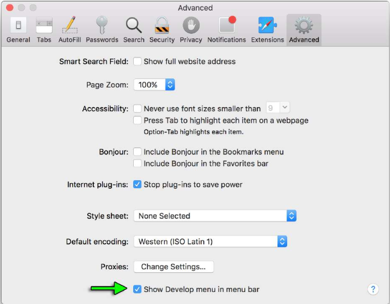
<!-- page 21 image012 -->

Then you can either pick &quot;Develop-&gt;Show Error Console&quot; from the menus or press ⌘
&plus; Option &plus; C

<h4>Opera</h4>

Opening the "Console" in opera:

<ul>
  <li>Ctrl + Shift + I ,then click on the "Console" tab</li>
</ul>

<h4>Compatibility</h4>

When using or emulating Internet Explorer 8 or earlier versions (e.g.
through Compatibility View / Enterprise Mode) the console will
<b>only</b> be defined when the Developer Tools are active, so console.log ()
statements can cause an exception and prevent code from executing. To
mitigate this, you can check to see if the console is available before
you log:

<pre><b>if</b> (<b>typeof</b> window.console !== &apos;undefined&apos)
{
  console.log(&quot;Hello World&quot;);
}</pre>

Or at the start of your script you can identify if the console is available and if not, define a null function to catch all of your
references and prevent exceptions.

<!-- page 22 -->

<pre><b>if</b> (!window.console)
{
  console = {log: <b>function</b>() {}};
}</pre>

Note this second example will stop <b>all</b> console logs even if the developer window has been opened.

Using this second example will preclude use of other functions such as console.dir(obj) unless that is specifically added.

A browser&apos;s debugging console or <a href="https://developer.mozilla.org/en-US/docs/Tools/Web_Console" 
target="_blank" rel="noreferrer noopener">web console</a> is generally used by developers to identify errors, 
understand flow of execution, log data and for many other purpose at runtime. This information is accessed 
through the <a href="https://developer.mozilla.org/en-US/docs/Web/API/Console" 
target="_blank" rel="noreferrer noopener">console</a> object.

<!--~~~~~~~~~~~~~~~~~~~~~~~~~~~~~~~~~~~~~~~~~~~~~~~~~~~~~~~~~~~~~~~~~~~~~~~~~~~~~~~~~~~~~~~~~~~~-->
<h3 id="ch5-1">Section 5.1: Measuring time - console.time()</h3>
<!--~~~~~~~~~~~~~~~~~~~~~~~~~~~~~~~~~~~~~~~~~~~~~~~~~~~~~~~~~~~~~~~~~~~~~~~~~~~~~~~~~~~~~~~~~~~~-->

console.time() can be used to measure how long a task in your code takes to run.

Calling <a href="https://developer.mozilla.org/en-US/docs/Web/API/Console/timeEnd" 
target="_blank" rel="noreferrer noopener">console.time(&lbrack;label&rbrack;)</a> 
starts a new timer. When 
<a href="https://developer.mozilla.org/en-US/docs/Web/API/Console/time" 
target="_blank" rel="noreferrer noopener">console.timeEnd(&lbrack;label&rbrack;)</a> is 
called, the elapsed time, in milliseconds, Since the original .time() call is calculated 
and logged. Because of this behavior, you can call .timeEnd() multiple times with the same 
label to log the elapsed time since the original .time() call was made.

<b>Example 1:</b>

<pre>console.time(&apos;response in&apos;);

alert(&apos;Click to continue&apos;);
console.timeEnd(&apos;response in&apos;);

alert(&apos;One more time&apos;);
console.timeEnd(&apos;response in&apos;);</pre>

will output:

<pre>response <b>in</b>: 774.967ms
response <b>in</b>: 1402.199ms</pre>

<b>Example 2:</b>

<pre><b>var</b> elms = document.getElementsByTagName(&apos;&ast;&apos;); // <i>select all elements on the page</i>
console.time(&apos;Loop time&apos;);

<b>for</b>(<b>var</b> i = 0; i &lt; 5000; i++) {
  <b>for</b> (<b>var</b> j = 0, length = elms.length; j &lt; length; j++) { 
    // <i>nothing to do ...</i>
  }
} 
console.timeEnd(&apos;Loop time&apos;);</pre>

will output:

<pre>
Loop time: 40.716ms
</pre>
<!--~~~~~~~~~~~~~~~~~~~~~~~~~~~~~~~~~~~~~~~~~~~~~~~~~~~~~~~~~~~~~~~~~~~~~~~~~~~~~~~~~~~~~~~~~~~~-->
<h3 id="ch5-2">Section 5.2: Formatting console output</h3>
<!--~~~~~~~~~~~~~~~~~~~~~~~~~~~~~~~~~~~~~~~~~~~~~~~~~~~~~~~~~~~~~~~~~~~~~~~~~~~~~~~~~~~~~~~~~~~~-->
<!-- page 23 -->

Many of the console&apos;s print methods can also handle C-like string
formatting, using % tokens:

<pre>
console.log(&apos;%s has %d points&apos;,&apos;Sam&apos;, 100);
</pre>

Display Sam has 100 points.

The full list of format specifiers in JavaScript is:

<table border="1" style="width:200px">
  <thead>
    <tr>
      <th>Specifier</th>
      <th>Output</th>
    </tr>
  </thead>
  <tbody>
    <tr>
      <td>%s</td>
      <td>Formats the value as a string</td>
    </tr>
    <tr>
      <td>%i or %d</td>
      <td>Formats the value as an integer</td>
    </tr>
    <tr>
      <td>%f</td>
      <td>Formats the value as a floating point value</td>
    </tr>
    <tr>
      <td>%o</td>
      <td>Formats the value as an expandable DOM element</td>
    </tr>
    <tr>
      <td>%O</td>
      <td>Formats the value as an expandable JavaScript object</td>
    </tr>
    <tr>
      <td>%c</td>
      <td>Applies CSS style rules to the output string as specified by the second parameter</td>
    </tr>
  </tfoot>
</table>

<h4>Advanced styling</h4>

When the CSS format specifier (%c) is placed at the left side of the
string, the print method will accept a second parameter with CSS rules
which allow fine-grained control over the formatting of that string:

<pre>console.log(&apos;%cHello world!&apos;, &apos;color: blue; font-size: xx-large&apos;);</pre>

Displays:

<!--~~~~~~~~~~~~~~~~~~~~~~~~~~~~~~~~~~~~~~~~~~~~~~~~~~~~~~~~~~~~~~~~~~~~~~~~~~~~~~~~~~~~~~~~~~~~-->
<!--~~~~~~~~~~~~~~~~~~~~~~~~~~~~~~~~~~~ 13.  (xx) ~~~~~~~~~~~~~~~~~~~~~~~~~~~~~~~~~~~~-->

  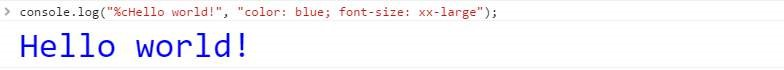
<!-- (./images/image013.jpg){width="7.477777777777778in" height="0.6666666666666666in"} -->

It is possible to use multiple %c format specifiers:

<ul>
  <li>any substring to the right of a %c has a corresponding parameter in
    the print method;</li>
  <li>this parameter may be an empty string, if there is no need to apply CSS 
    rules to that same substring;</li>
  <li>if two %c format specifiers are found, the 1st (encased in %c) and 2nd 
    substring will have their rules defined in the 2nd and 3rd parameter of the print
    method respectively.</li>
  <li>if three %c format specifiers are found, then the 1st, 2nd and 3rd substrings will 
    have their rules defined in the 2nd , 3rd and 4th parameter respectively, and so on&hellip;</li>
</ul>

<pre>
console.log("%cHello %cWorld%c!!", // <i>string to be printed</i>
            "color: blue;", // <i>applies color formatting to the 1st substring</i>
            &quot;font-size: xx-large;&quot;, // <i>applies font formatting to the 2nd substring</i>
            &quot;/&ast; no CSS rule &ast;/&quot; // <i>does not apply any rule to the remaining substring</i>
);
</pre>

Displays:

<!--~~~~~~~~~~~~~~~~~~~~~~~~~~~~~~~~~~~~~~~~~~~~~~~~~~~~~~~~~~~~~~~~~~~~~~~~~~~~~~~~~~~~~~~~~~~~-->
<!--~~~~~~~~~~~~~~~~~~~~~~~~~~~~~~~~~~~ 14.  (xx) ~~~~~~~~~~~~~~~~~~~~~~~~~~~~~~~~~~~~-->

  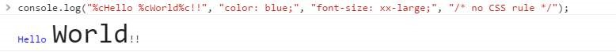
<!-- (./images/image014.jpg){width="7.477777777777778in" height="0.6395833333333333in"} -->
<!-- page 24 -->
<h4>Using groups to indent output</h4>

Output can be indented and enclosed in a collapsible group in the
debugging console with the following methods:

<ul>
  <li><a href="https://developer.mozilla.org/en-US/docs/Web/API/Console/groupCollapsed" 
    target="_blank" rel="noreferrer noopener">console.groupCollapsed()</a>: creates a collapsed 
    group of entries that can be expanded through the disclosure button in order to reveal all 
    the entries performed after this method is invoked;</li>
  <li><a href="https://developer.mozilla.org/en-US/docs/Web/API/Console/group" 
    target="_blank" rel="noreferrer noopener">console.group()</a>: creates an expanded group 
    of entries that can be collapsed in order to hide the entries after this method is invoked.</li>
</ul>

The indentation can be removed for posterior entries by using the following method:

<ul>
  <li><a href="https://developer.mozilla.org/en-US/docs/Web/API/Console/groupEnd" 
    target="_blank" rel="noreferrer noopener">console.groupEnd()</a>: exits the current group, 
    allowing newer entries to be printed in the parent group after this method is invoked.</li>
</ul>

Groups can be cascaded to allow multiple indented output or collapsible layers within each other:

<!--~~~~~~~~~~~~~~~~~~~~~~~~~~~~~~~~~~~~~~~~~~~~~~~~~~~~~~~~~~~~~~~~~~~~~~~~~~~~~~~~~~~~~~~~~~~~-->
<!--~~~~~~~~~~~~~~~~~~~~~~~~~~~~ 15/16.  (xx) ~~~~~~~~~~~~~~~~~~~~~~~~~~~~~-->

  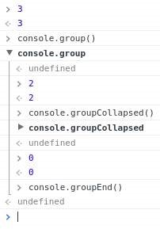
&nbsp;&nbsp;&nbsp;&nbsp;&nbsp;
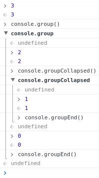
<!-- {width="2.1083333333333334in" height="3.009027777777778in"} -->
<!-- {width="2.08125in" height="3.729861111111111in"} -->

= Collapsed group expanded =&gt;

<!--~~~~~~~~~~~~~~~~~~~~~~~~~~~~~~~~~~~~~~~~~~~~~~~~~~~~~~~~~~~~~~~~~~~~~~~~~~~~~~~~~~~~~~~~~~~~-->
<h3 id="ch5-3">Section 5.3: Printing to a browser&apos;s debugging console</h3>
<!--~~~~~~~~~~~~~~~~~~~~~~~~~~~~~~~~~~~~~~~~~~~~~~~~~~~~~~~~~~~~~~~~~~~~~~~~~~~~~~~~~~~~~~~~~~~~-->

A browser&apos;s debugging console can be used in order to print simple
messages. This debugging or <a href="https://developer.mozilla.org/en-US/docs/Tools/Web_Console" 
target="_blank" rel="noreferrer noopener">web console</a> can be directly opened in the 
browser (F12 key in most browsers see <i>Remarks</i> below for further information) and 
the log method of the console JavaScript object can be invoked by typing the following:

<pre>console.log('My message');</pre>

Then, by pressing Enter, this will display "My message" in the debugging console.

console.log() can be called with any number of arguments and variables available in
the current scope. Multiple arguments will be printed in one line with a small space between them.

<pre><b>var</b> obj = {test: 1};
console.log(&lbrack;'string'&rbrack;, 1, obj, window);</pre>

The log method will display the following in the debugging console:

<pre>&lbrack;'string'&rbrack; 1 Object { test: 1 } Window { /&ast; <i>truncated</i> </i>/ }</pre>

Beside plain strings, console.log() can handle other types, like arrays, objects, dates, functions, etc.:

<pre>console.log(&lbrack;0, 3, 32, 'a string' &rbrack;);
console.log({key1: 'value', key2: 'another value'});</pre>

Displays:

<pre>Array &lbrack;0, 3, 32, 'a string'&rbrack;
Object { key1: 'value', key2: 'another value'}</pre>

Nested objects may be collapsed:

<pre>console.log({ key1: 'val', key2: &lbrack;'one', 'two'&rbrack;, key3: { a: 1, b: 2 } });</pre>

Displays:

<pre>Object { key1: 'val', key2: Array &lbrack;2&rbrack;, key3: Object }</pre>

Certain types such as Date objects and <b>function</b>s may be displayed differently:

<pre>console.log(<b>new</b> Date(0));
console.log(<b>function</b> test(a, b) { <b>return</b> c; });</pre>

Displays:

<pre>Wed Dec 31 1969 19:00:00 GMT &minus; 0500 (Eastern Standard Time)
<b>function</b> test (a , b) { <b>return</b> c; }</pre>

<h4>Other print methods</h4>

In addition to the log method, modern browsers also support similar methods:

<ul>
  <li><a href="https://developer.mozilla.org/es/docs/Web/API/Console/info" 
    target="_blank" rel="noreferrer noopener">
    console.info</a> - small informative icon (ⓘ) appears on the left side of the printed
    string(s) or object(s).</li>
  <li><a href="a href="https://developer.mozilla.org/en-US/docs/Web/API/Console/warning" 
    target="_blank" rel="noreferrer noopener">
    console.warn</a> - small warning icon (!) appears on the left side. In some browsers,
    the background of the log is yellow.</li>
  <li><a href="a href="https://developer.mozilla.org/en-US/docs/Web/API/Console/error" 
    target="_blank" rel="noreferrer noopener">
    console.error</a> - small times icon (⊗) appears on the left side. In some browsers, 
    the background of the log is red.</li>
  <li><a href="https://developer.mozilla.org/en-US/docs/Web/API/Console/timeStamp" 
    target="_blank" rel="noreferrer noopener">console.timeStamp</a> - outputs the current 
    time and a specified string, but is non-standard:</li>
</ul>

<pre>console.timeStamp('msg');</pre>

<h4>Displays:</h4>

<pre>00:00:00.001 msg</pre>

<ul>
  <li><a href="https://developer.mozilla.org/en-US/docs/Web/API/Console/trace" 
    target="_blank" rel="noreferrer noopener">console.trace</a> - outputs the current 
    stack trace or displays the same output as the log method if invoked in the global 
    scope.</li>
</ul>
<!-- page 26 -->

<pre><b>function</b> sec () {
  first();
}
<b>function</b> first () {
  console.trace();
}
sec ();</pre>

<h4>Displays:</h4>

<pre>first
sec
(anonymous <b>function</b>)</pre>
<!--~~~~~~~~~~~~~~~~~~~~~~~~~~~~~~~~~~~~~~~~~~~~~~~~~~~~~~~~~~~~~~~~~~~~~~~~~~~~~~~~~~~~~~~~~~~~-->
<!--~~~~~~~~~~~~~~~~~~~~~~~~~~~~~~~~~~~ 17.  (xx) ~~~~~~~~~~~~~~~~~~~~~~~~~~~~~~~~~~~~-->

  
<!-- (./images/image017.jpg){width="7.477777777777778in" height="1.3243055555555556in"} -->

The above image shows all the functions, with the exception of timeStamp, in Chrome version 56.

These methods behave similarly to the log method and in different
debugging consoles may render in different colors or formats.

In certain debuggers, the individual objects information can be
further expanded by clicking the printed text or a small triangle (►)
which refers to the respective object properties. These collapsing
object properties can be open or closed on log. See the for additional
information on this.

<!--~~~~~~~~~~~~~~~~~~~~~~~~~~~~~~~~~~~~~~~~~~~~~~~~~~~~~~~~~~~~~~~~~~~~~~~~~~~~~~~~~~~~~~~~~~~~-->
<h3 id="ch5-4">Section 5.4: Including a stack trace when logging console.trace()</h3>
<!--~~~~~~~~~~~~~~~~~~~~~~~~~~~~~~~~~~~~~~~~~~~~~~~~~~~~~~~~~~~~~~~~~~~~~~~~~~~~~~~~~~~~~~~~~~~~-->
<pre>
<b>function</b> foo(){
  console.trace('My log statement');
}

foo();
</pre>

Will display this in the console:

<pre>
My log statement VM696:1
  foo            @ VM696:1
  (anonymous <b>function</b>) @ (program):1
</pre>

Note: Where available it&apos;s also useful to know that the same stack
trace is accessible as a property of the Error object. This can be
useful for post-processing and gathering automated feedback.

<pre>
<b>var</b> e = <b>new</b> Error ('foo');
console.log(e&period;stack);
</pre>
<!--~~~~~~~~~~~~~~~~~~~~~~~~~~~~~~~~~~~~~~~~~~~~~~~~~~~~~~~~~~~~~~~~~~~~~~~~~~~~~~~~~~~~~~~~~~~~-->
<h3 id="ch5-5">Section 5.5: Tabulating values - console.table()</h3>
<!--~~~~~~~~~~~~~~~~~~~~~~~~~~~~~~~~~~~~~~~~~~~~~~~~~~~~~~~~~~~~~~~~~~~~~~~~~~~~~~~~~~~~~~~~~~~~-->

In most environments, () can be used to display objects and arrays in a tabular format.

<b>For example:</b>

<!-- page 27 -->

<pre>console.table(&lbrack;&apos;Hello&apos;,&apos;world&apos;&rbrack;);</pre>

displays like:

<pre>
<b>(index) value</b>
0       &quot;Hello&quot;
1       &quot;world&quot;
</pre>

<pre>console.table({foo: &apos;bar&apos;, bar: &apos;baz&apos;});</pre>

displays like:

<pre>
<b>(index) value</b>
&quot;foo&quot;   &quot;bar&quot;
&quot;bar&quot;   &quot;baz&quot;
</pre>

<pre><b>var</b> personArr = &lbrack;
{ 
  &quot;personId&quot;: 123,
  &quot;name&quot;: &quot;Jhon&quot;, 
  &quot;city&quot;: &quot;Melbourne&quot;,
  &quot;phoneNo&quot;: &quot;1234567890&quot;
},
{ 
  {&quot;personId&quot;: 124, 
  &quot;name&quot;: &quot;Amelia&quot;, 
  &quot;city&quot;: &quot;Sydney&quot;,
  &quot;phoneNo&quot;: &quot;1234567890&quot; 
}, {
  &quot;personId&quot;: 125,
  &quot;name&quot;: &quot;Emily&quot;,
  &quot;city&quot;: &quot;Perth&quot;,
  &quot;phoneNo&quot;: &quot;1234567890&quot;
},
{
  &quot;personId&quot;: 126,
  &quot;name&quot;: &quot;Abraham&quot;,
  &quot;city&quot;: &quot;Perth&quot;,
  &quot;phoneNo&quot;: &quot;1234567890&quot;
}
&rbrack;;
  console.table(personArr, &lbrack;&apos;name&apos;, &apos;personId&apos;&rbrack;);</pre>

displays like:

<!-- page 28 -->
<!--~~~~~~~~~~~~~~~~~~~~~~~~~~~~~~~~~~~~~~~~~~~~~~~~~~~~~~~~~~~~~~~~~~~~~~~~~~~~~~~~~~~~~~~~~~~~-->
<!--~~~~~~~~~~~~~~~~~~~~~~~~~~~~~~~~~~~ 18.  (xx) ~~~~~~~~~~~~~~~~~~~~~~~~~~~~~~~~~~~~-->

  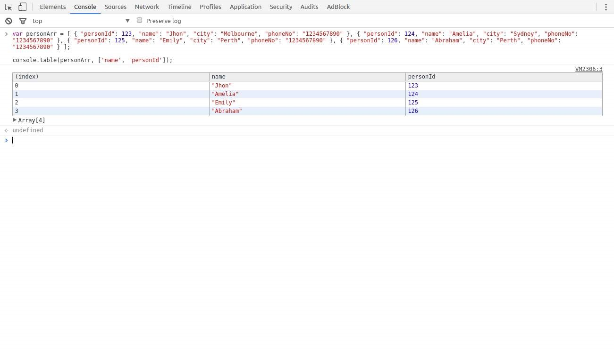
<!-- {width="7.477777777777778in" height="4.279166666666667in"} -->
<!--~~~~~~~~~~~~~~~~~~~~~~~~~~~~~~~~~~~~~~~~~~~~~~~~~~~~~~~~~~~~~~~~~~~~~~~~~~~~~~~~~~~~~~~~~~~~-->
<h3 id="ch5-6">Section 5.6: Counting - console.count()</h3>
<!--~~~~~~~~~~~~~~~~~~~~~~~~~~~~~~~~~~~~~~~~~~~~~~~~~~~~~~~~~~~~~~~~~~~~~~~~~~~~~~~~~~~~~~~~~~~~-->

<a href="https://developer.mozilla.org/en-US/docs/Web/API/Console/count" 
target="_blank" rel="noreferrer noopener">console.count(&lbrack;obj&rbrack;)</a> 
places a counter on the object&apos;s value provided as argument. Each time this method is 
invoked, the counter is increased (with the exception of the empty string &apos;&apos;). 
A label together with a number is displayed in the debugging console according to the 
following format:

<pre>
&lbrack;label&rbrack;: X
</pre>

label represents the value of the object passed as argument and X
represents the counter&apos;s value.

An object&apos;s value is always considered, even if variables are provided as arguments:

<pre>
<b>var</b> o1 = 1, o2 = &apos;2&apos;, o3 = &quot;&quot;;
console.count(o1);
console.count(o2);
console.count(o3);

console.count(1);
console.count(&apos;2&apos;);
console.count(&apos;&apos;);
</pre>

Displays:

<pre>
1: 1
2: 1
: 1
1: 2
2: 2
: 1
</pre>

Strings with numbers are converted to Number objects:

<!-- page 29 -->
<pre>
console.count(42.3);
console.count(Number(&apos;42.3&apos;));
console.count(&apos;42.3&apos;);
</pre>

Displays:

<pre>42.3: 1
42.3: 2
42.3: 3</pre>

Functions point always to the global Function object:

<pre>console.count(console.constructor);
console.count(<b>function</b>(){});
console.count(Object);
<b>var</b> fn1 = <b>function</b> myfn(){};
console.count(fn1);
console.count(Number);</pre>

Displays:

<pre>&lbrack;object Function&rbrack;: 1
&lbrack;object Function&rbrack;: 2
&lbrack;object Function&rbrack;: 3
&lbrack;object Function&rbrack;: 4
&lbrack;object Function&rbrack;: 5</pre>

Certain objects get specific counters associated to the type of object they refer to:

<pre>
console.count(<b>undefined</b>);
console.count(document.Batman);
<b>var</b> obj;
console.count(obj);
console.count(Number(<b>undefined</b>));
console.count(<b>NaN</b>);
console.count(<b>NaN</b>&plus;3);
console.count(1/0);
console.count(String(1/0));
console.count(window);
console.count(document);
console.count(console);
console.count(console.&lowbar;&lowbar;proto&lowbar;&lowbar;);
console.count(console.constructor.<b>prototype</b>);
console.count(
console.&lowbar;&lowbar;proto&lowbar;&lowbar;.constructor.<b>prototype</b>);
console.count(Object.getPrototypeOf(console));
console.count(<b>null</b>);
</pre>

Displays:

<pre><b>undefined</b>: 1
<b>undefined</b>: 2
<b>undefined</b>: 3
<b>NaN</b>: 1
<b>NaN</b>: 2
<b>NaN</b>: 3
<b>Infinity</b>: 1
<b>Infinity</b>: 2
&lbrack;object Window&rbrack;: 1
&lbrack;object HTMLDocument&rbrack;: 1
&lbrack;object Object&rbrack;: 1
&lbrack;object Object&rbrack;: 2
&lbrack;object Object&rbrack;: 3
&lbrack;object Object&rbrack;: 4
&lbrack;object Object&rbrack;: 5
<b>null</b>: 1</pre>

<!-- page 30 -->

<b>Empty string or absence of argument</b>

If no argument is provided while <b>sequentially inputting the count
method in the debugging console</b>, an empty string is assumed as parameter, i.e.:

<pre>
&gt; console.count();
  : 1
&gt; console.count(&apos;&apos;);
  : 2
&gt; console.count(&quot;&quot;);
  : 3
</pre>
<!--~~~~~~~~~~~~~~~~~~~~~~~~~~~~~~~~~~~~~~~~~~~~~~~~~~~~~~~~~~~~~~~~~~~~~~~~~~~~~~~~~~~~~~~~~~~~-->
<h3 id="ch5-7">Section 5.7: Clearing the console - console.clear()</h3>
<!--~~~~~~~~~~~~~~~~~~~~~~~~~~~~~~~~~~~~~~~~~~~~~~~~~~~~~~~~~~~~~~~~~~~~~~~~~~~~~~~~~~~~~~~~~~~~-->

You can clear the console window using the () method. This removes all
previously printed messages in the console and may print a message
like &quot;Console was cleared&quot; in some environments.

<!--~~~~~~~~~~~~~~~~~~~~~~~~~~~~~~~~~~~~~~~~~~~~~~~~~~~~~~~~~~~~~~~~~~~~~~~~~~~~~~~~~~~~~~~~~~~~-->
<h3 id="ch5-8">Section 5.8: Displaying objects and XML interactively console.dir(), console.dirxml()</h3>
<!--~~~~~~~~~~~~~~~~~~~~~~~~~~~~~~~~~~~~~~~~~~~~~~~~~~~~~~~~~~~~~~~~~~~~~~~~~~~~~~~~~~~~~~~~~~~~-->

console.dir(object) displays an interactive list of the properties of the specified
JavaScript object. The output is presented as a hierarchical listing with disclosure triangles that let
you see the contents of child objects.

<pre>
<b>var</b> myObject = {
  &quot;foo&quot; : {
    &quot;bar&quot; : &quot;data&quot; 
  }
};

console.dir (myObject);
</pre>

displays:

<!--~~~~~~~~~~~~~~~~~~~~~~~~~~~~~~~~~~~~~~~~~~~~~~~~~~~~~~~~~~~~~~~~~~~~~~~~~~~~~~~~~~~~~~~~~~~~-->
<!--~~~~~~~~~~~~~~~~~~~~~~~~~~~~~~~~~~~ 19.  (xx) ~~~~~~~~~~~~~~~~~~~~~~~~~~~~~~~~~~~~-->

  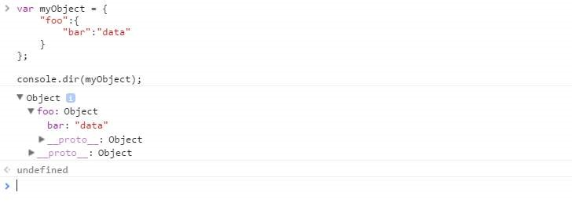
<!-- {width="7.477777777777778in" height="2.657638888888889in"} -->

console.dirxml(object) prints an XML representation of the descendant elements of object if
possible, or the JavaScript representation if not. Calling console.dirxml() on HTML
and XML elements is equivalent to calling console.log().

<!-- page 31 -->

<b>Example 1:</b>

<pre>console.dirxml ( document )</pre>

displays:

<!--~~~~~~~~~~~~~~~~~~~~~~~~~~~~~~~~~~~~~~~~~~~~~~~~~~~~~~~~~~~~~~~~~~~~~~~~~~~~~~~~~~~~~~~~~~~~-->
<!--~~~~~~~~~~~~~~~~~~~~~~~~~~~~~~~~~~~ 20.  (xx) ~~~~~~~~~~~~~~~~~~~~~~~~~~~~~~~~~~~~-->

  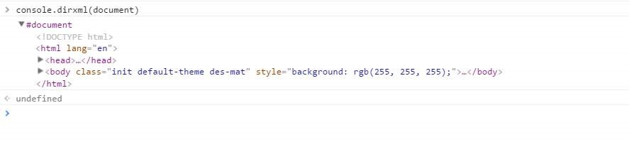
<!-- {width="7.477777777777778in" height="1.6847222222222222in"} -->

<b>Example 2:</b>

<pre>
console.log(document)
</pre>

displays:

<!--~~~~~~~~~~~~~~~~~~~~~~~~~~~~~~~~~~~~~~~~~~~~~~~~~~~~~~~~~~~~~~~~~~~~~~~~~~~~~~~~~~~~~~~~~~~~-->
<!--~~~~~~~~~~~~~~~~~~~~~~~~~~~~~~~~~~~ 21.  (xx) ~~~~~~~~~~~~~~~~~~~~~~~~~~~~~~~~~~~~-->

  
<!-- {width="7.477777777777778in" height="1.8020833333333333in"} -->

<b>Example 3:</b>

<pre>
<b>var</b> myObject = {
  &quot;foo&quot;:{
    &quot;bar&quot; : &quot;data&quot;
  }
};

console.dirxml ( myObject );
</pre>

displays:

<!--~~~~~~~~~~~~~~~~~~~~~~~~~~~~~~~~~~~~~~~~~~~~~~~~~~~~~~~~~~~~~~~~~~~~~~~~~~~~~~~~~~~~~~~~~~~~-->
<!--~~~~~~~~~~~~~~~~~~~~~~~~~~~~~~~~~~~ 22.  (xx) ~~~~~~~~~~~~~~~~~~~~~~~~~~~~~~~~~~~~-->

  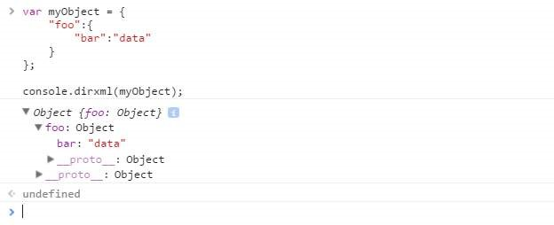
<!-- {width="6.504166666666666in" height="2.6486111111111112in"} -->
<!--~~~~~~~~~~~~~~~~~~~~~~~~~~~~~~~~~~~~~~~~~~~~~~~~~~~~~~~~~~~~~~~~~~~~~~~~~~~~~~~~~~~~~~~~~~~~-->
<h3 id="ch5-9">Section 5.9: Debugging with assertions - console.assert()</h3>
<!--~~~~~~~~~~~~~~~~~~~~~~~~~~~~~~~~~~~~~~~~~~~~~~~~~~~~~~~~~~~~~~~~~~~~~~~~~~~~~~~~~~~~~~~~~~~~-->

Writes an error message to the console if the assertion is <b>false</b>.
Otherwise, if the assertion is <b>true</b>, this does nothing.

<pre>console.assert ( &apos;one&apos; === 1 );</pre>
<!--~~~~~~~~~~~~~~~~~~~~~~~~~~~~~~~~~~~~~~~~~~~~~~~~~~~~~~~~~~~~~~~~~~~~~~~~~~~~~~~~~~~~~~~~~~~~-->
<!--~~~~~~~~~~~~~~~~~~~~~~~~~~~~~~~~~~~ 23.  (xx) ~~~~~~~~~~~~~~~~~~~~~~~~~~~~~~~~~~~~-->

  
<!--~~~~~~~~~~~~~~~~~~~~~~~~~~~~~~~~~~~~~~~~~~~~~~~~~~~~~~~~~~~~~~~~~~~~~~~~~~~~~~~~~~~~~~~~~~~~-->

Multiple arguments can be provided after the assertionthese can be
strings or other objectsthat will only be printed if the assertion
is <b>false</b>:

<!--~~~~~~~~~~~~~~~~~~~~~~~~~~~~~~~~~~~~~~~~~~~~~~~~~~~~~~~~~~~~~~~~~~~~~~~~~~~~~~~~~~~~~~~~~~~~-->
<!--~~~~~~~~~~~~~~~~~~~~~~~~~~~~~~~~~~~ 24.  (xx) ~~~~~~~~~~~~~~~~~~~~~~~~~~~~~~~~~~~~-->

  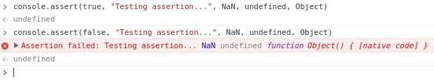
<!-- {width="6.46875in" height="1.2069444444444444in"} -->

<a href="https://developer.mozilla.org/en-US/docs/Web/API/console/assert" 
target="_blank" rel="noreferrer noopener">console.assert</a> does <i>not</i> throw an 
AssertionError (except in Node.js), meaning that this method is incompatible with most 
testing frameworks and that code execution will not break on a failed assertion.

<!--~~~~~~~~~~~~~~~~~~~~~~~~~~~~~~~~~~~~~~~~~~~~~~~~~~~~~~~~~~~~~~~~~~~~~~~~~~~~~~~~~~~~~~~~~~~~-->
<h2 id="ch6">Chapter 6: Datatypes in JavaScript</h2>
<!--~~~~~~~~~~~~~~~~~~~~~~~~~~~~~~~~~~~~~~~~~~~~~~~~~~~~~~~~~~~~~~~~~~~~~~~~~~~~~~~~~~~~~~~~~~~~-->
<h3 id="ch6-1">Section 6.1: typeof</h3>
<!--~~~~~~~~~~~~~~~~~~~~~~~~~~~~~~~~~~~~~~~~~~~~~~~~~~~~~~~~~~~~~~~~~~~~~~~~~~~~~~~~~~~~~~~~~~~~-->

<b>typeof</b> is the &apos;official&apos; function that one uses to get the type
in JavaScript, however in certain cases it might yield some unexpected
results &hellip;

<ol>
  <li><b>Strings</b> 
  <b>typeof</b> &quot;String&quot; or
  <b>typeof</b> Date(2011,01,01)
  <blockquote>
  &quot;string&quot;
  </blockquote></li>

  <li><b>Numbers</b> 
  <b>typeof</b> 42
  <blockquote>
  &quot;number&quot;
  </blockquote></li>

  <li><b>Bool</b> 
  <b>typeof</b> <b>true</b> (valid values <b>true</b> and <b>false</b>)
  <blockquote>
  &quot;boolean&quot;
  </blockquote></li>

  <li><b>Object</b> 
  <b>typeof</b> {} or
  <b>typeof</b> &lbrack;&rbrack; or
  <b>typeof</b> <b>null</b> or
  <b>typeof</b> /aaa/ or
  <b>typeof</b> Error()
  <blockquote>
  &quot;object&quot;
  </blockquote></li>

  <li><b>Function</b> 
  <b>typeof</b> <b>function</b>(){}
  <blockquote>
  &quot;function&quot;
  </blockquote></li>

  <li><b>Undefined</b> 
  <b>var</b> var1; <b>typeof</b> var1
  <blockquote>
  &quot;undefined&quot;
  </blockquote></li>
</ol>
<!--~~~~~~~~~~~~~~~~~~~~~~~~~~~~~~~~~~~~~~~~~~~~~~~~~~~~~~~~~~~~~~~~~~~~~~~~~~~~~~~~~~~~~~~~~~~~-->
<h3 id="ch6-2">Section 6.2: Finding an object&apos;s class</h3>
<!--~~~~~~~~~~~~~~~~~~~~~~~~~~~~~~~~~~~~~~~~~~~~~~~~~~~~~~~~~~~~~~~~~~~~~~~~~~~~~~~~~~~~~~~~~~~~-->

To find whether an object was constructed by a certain constructor or
one inheriting from it, you can use the <b>instanceof</b> command:

<pre>
//<i>We want this function to take the sum of the numbers passed to it</i>
//<i>It can be called as sum(1, 2, 3) or sum(&lbrack;1, 2, 3&rbrack;) and should give 6</i>
<b>function</b> sum ( &hellip; arguments ) {
  <b>if</b> ( arguments.length === 1 ) {
    <b>const</b> &lbrack; firstArg &rbrack; = arguments
    <b>if</b> ( firstArg <b>instanceof</b> Array ) { //<i>firstArg is something like &lbrack;1, 2, 3&rbrack;</i>
      <b>return</b> sum (&hellip;firstArg) //<i>calls sum(1, 2, 3)</i>
    }
  }
  <b>return</b> arguments.reduce((a, b) =&gt; a &plus; b)
}
console.log(sum (1, 2, 3))   //<i>6</i>
console.log(sum (&lbrack;1, 2, 3&rbrack;)) //<i>6</i>
console.log(sum (4))         //<i>4</i>
</pre>

Note that primitive values are not considered instances of any class:

<pre>
console.log(2 <b>instanceof</b> Number)          //<i>false</i>
console.log(&apos;abc&apos; <b>instanceof</b> String)      //<i>false</i>
console.log(<b>true</b> <b>instanceof</b> Boolean)     //<i>false</i>
console.log(Symbol() <b>instanceof</b> Symbol)  //<i>false</i>
</pre>

Every value in JavaScript besides <b>null</b> and <b>undefined</b> also has
a constructor property storing the function that was used to construct
it. This even works with primitives.

<pre>
//<i>Whereas instanceof also catches instances of subclasses,</i>
//<i>using obj.constructor does not</i>
console.log(&lbrack;&rbrack; <b>instanceof</b> Object, &lbrack;&rbrack; <b>instanceof</b> Array)            //<i>true true</i>
console.log(&lbrack;&rbrack;.constructor === Object, &lbrack;&rbrack;.constructor === Array) //<i>false true</i>

<b>function</b> isNumber(value) {
  //<i>null.constructor and undefined.constructor throw an error when accessed</i>
  <b>if</b> (value === <b>null</b> &vert;&vert; value === <b>undefined</b>)
  <b>return</b> <b>false</b> <b>return</b> value.constructor === Number 
}
console.log(isNumber(<b>null</b>), isNumber(<b>undefined</b>))                   //<i>false false</i>
console.log(isNumber(&apos;abc&apos;), isNumber(&lbrack;&rbrack;), isNumber(() =&gt; 1))     //<i>false false false</i>
console.log(isNumber(0), isNumber(Number(&apos;10.1&apos;)), isNumber(<b>NaN</b>)) //<i>true true true</i>
</pre>
<!--~~~~~~~~~~~~~~~~~~~~~~~~~~~~~~~~~~~~~~~~~~~~~~~~~~~~~~~~~~~~~~~~~~~~~~~~~~~~~~~~~~~~~~~~~~~~-->
<h3 id="ch6-3">Section 6.3: Getting object type by constructor name</h3>
<!--~~~~~~~~~~~~~~~~~~~~~~~~~~~~~~~~~~~~~~~~~~~~~~~~~~~~~~~~~~~~~~~~~~~~~~~~~~~~~~~~~~~~~~~~~~~~-->

When one with <b>typeof</b> operator one gets type object it falls into
somewhat wast category&hellip;

In practice you might need to narrow it down to what sort of &apos;object&apos; it actually 
is and one way to do it is to use object constructor name to get what flavor of object it 
actually is: Object.<b>prototype</b>.toString.call(yourObject)

<ol>
  <li><b>String</b> 
    Object.<b>prototype</b>.toString.call(&quot;String&quot;) 
    <blockquote>
    &quot;&lbrack;object String&rbrack;&quot;
    </blockquote></li>
  <li><b>Number</b> 
    Object.<b>prototype</b>.toString.call(42) 
    <blockquote>
    &quot;&lbrack;object Number&rbrack;&quot;
    </blockquote></li>
  <li><b>Bool</b> 
    Object.<b>prototype</b>.toString.call(<b>true</b>) 
    <blockquote>
    &quot;&lbrack;object Boolean&rbrack;&quot;
    </blockquote></li>
  <li><b>Object</b> 
    Object.<b>prototype</b>.toString.call(Object()) or 
    Object.<b>prototype</b>.toString.call({}) 
    <blockquote>
    &quot;&lbrack;object Object&rbrack;&quot;
    </blockquote></li>
  <li><b>Function</b> 
    Object.<b>prototype</b>.toString.call(<b>function</b>(){}) 
    <blockquote>
    &quot;&lbrack;object Function&rbrack;&quot;
    </blockquote></li>
  <li><b>Date</b> 
    Object.<b>prototype</b>.toString.call(<b>new</b> Date(2015,10,21)) 
    <blockquote>
    &quot;&lbrack;object Date&rbrack;&quot;
    </blockquote></li>
  <li><b>Regex</b> 
    Object.<b>prototype</b>.toString.call(<b>new</b> RegExp()) or 
    Object.<b>prototype</b>.toString.call(/<i>foo/</i>); 
    <blockquote>
    &quot;&lbrack;object.RegExp&rbrack;&quot;
    </blockquote></li>
  <li><b>Array</b> 
    Object.<b>prototype</b>.toString.call(&lbrack;&rbrack;); 
    <blockquote>
    &quot;&lbrack;object Array&rbrack;&quot;
    </blockquote></li>
  <li><b>Null</b> 
    Object.<b>prototype</b>.toString.call(<b>null</b>); 
    <blockquote>
    &quot;&lbrack;object Null&rbrack;&quot;
    </blockquote></li>
  <li><b>Undefined</b> 
    Object.<b>prototype</b>.toString.call(<b>undefined</b>); 
    <blockquote>
    &quot;&lbrack;object Undefined&rbrack;&quot;
    </blockquote></li>
  <li><b>Error</b> 
    Object.<b>prototype</b>.toString.call(Error()); 
    <blockquote>
    &quot;&lbrack;object Error&rbrack;&quot;
    </blockquote></li>
</ol>
<!-- page 37 -->
<!--~~~~~~~~~~~~~~~~~~~~~~~~~~~~~~~~~~~~~~~~~~~~~~~~~~~~~~~~~~~~~~~~~~~~~~~~~~~~~~~~~~~~~~~~~~~~-->
<h2 id="ch7">Chapter 7: Strings</h2>
<!--~~~~~~~~~~~~~~~~~~~~~~~~~~~~~~~~~~~~~~~~~~~~~~~~~~~~~~~~~~~~~~~~~~~~~~~~~~~~~~~~~~~~~~~~~~~~-->
<h3 id="ch7-1">Section 7.1: Basic Info and String Concatenation</h3>
<!--~~~~~~~~~~~~~~~~~~~~~~~~~~~~~~~~~~~~~~~~~~~~~~~~~~~~~~~~~~~~~~~~~~~~~~~~~~~~~~~~~~~~~~~~~~~~-->

Strings in JavaScript can be enclosed in Single quotes &apos;hello&apos;,
Double quotes &quot;Hello&quot; and (from ES2015, ES6) in Template Literals
(<i>backticks</i>) &grave;hello&grave;.

<pre>
<b>var</b> hello = &quot;Hello&quot;;
<b>var</b> world = &apos;world&apos;;
<b>var</b> helloW = &grave;Hello World&grave;; // <i>ES2015 / ES6</i>
</pre>

String can be created from other types using the String() function.

<pre>
<b>var</b> intString = String(32); // <i>&quot;32&quot;</i>
<b>var</b> booleanString = String(<b>true</b>); // <i>&quot;true&quot;</i>
<b>var</b> nullString = String(<b>null</b>); // <i>&quot;null&quot;</i>
</pre>

Or, toString() can be used to convert Numbers, Booleans or Objects to Strings.

<pre>
<b>var</b> intString = (5232).toString(); // <i>&quot;5232&quot;</i>
<b>var</b> booleanString = (<b>false</b>).toString(); // <i>&quot;false&quot;</i>
<b>var</b> objString = ({}).toString(); // <i>&quot;&lbrack;object Object&rbrack;&quot;</i>
</pre>

Strings also can be created by using String.fromCharCode method.

<pre>
String.fromCharCode(104,101,108,108,111)  //<i>&quot;hello&quot;</i>
</pre>

Creating a String object using <b>new</b> keyword is allowed, but is not recommended as 
it behaves like Objects unlike primitive strings.

<pre>
<b>var</b> objectString = <b>new</b> String(&quot;Yes, I am a String object&quot;);
<b>typeof</b> objectString; //<i>&quot;object&quot;</i>
<b>typeof</b> objectString.valueOf(); //<i>&quot;string&quot;</i>
</pre>

<b>Concatenating Strings</b>

String concatenation can be done with the + concatenation operator, or with the built-in concat() 
method on the String object prototype.

<pre>
<b>var</b> foo = &quot;Foo&quot;;
<b>var</b> bar = &quot;Bar&quot;;
console.log(foo &plus; bar);      // <i>=&gt;&quot;FooBar&quot;</i>
console.log(foo &plus; &quot; &quot;&plus; bar);  // <i>=&gt;&quot;Foo Bar&quot;</i>

foo.concat(bar)               // <i>=&gt;&quot;FooBar&quot;</i>
&quot;a&quot;.concat(&quot;b&quot;, &quot; &quot;, &quot;d&quot;) // <i>=&gt;&quot;ab d&quot;</i>
</pre>

Strings can be concatenated with non-string variables but will type-convert the non-string variables into strings.

<pre>
<b>var</b> string = &quot;string&quot;;
<b>var</b> number = 32;
<b>var</b> boolean = <b>true</b>;

console.log(string &plus; number &plus; boolean); // <i>&quot;string32true&quot;</i>
</pre>

<b>String Templates</b>

<!-- page 38 -->
<h5>Version ≥ 6</h5>

Strings can be created using template literals (<i>backticks</i>) &grave;hello&grave;.

<pre>
<b>var</b> greeting = &grave;Hello&grave;;
</pre>

With template literals, you can do string interpolation using &dollar;{variable} inside template literals:

<pre>
<b>var</b> place = &grave;World&grave;; 
<b>var</b> greet = &grave;Hello &dollar;{place}!&grave;

console.log(greet); // <i>&quot;Hello World!&quot;</i>
</pre>

You can use String.raw to get backslashes to be in the string without modification.

<pre>
&grave;a&bsol;&bsol;b&grave; // </i>= a&bsol;b</i>
String.raw&grave;a&bsol;&bsol;b&grave;  // <i>= a&bsol;&bsol;b</i>
</pre>
<!--~~~~~~~~~~~~~~~~~~~~~~~~~~~~~~~~~~~~~~~~~~~~~~~~~~~~~~~~~~~~~~~~~~~~~~~~~~~~~~~~~~~~~~~~~~~~-->
<h3 id="ch7-2">Section 7.2: Reverse String</h3>
<!--~~~~~~~~~~~~~~~~~~~~~~~~~~~~~~~~~~~~~~~~~~~~~~~~~~~~~~~~~~~~~~~~~~~~~~~~~~~~~~~~~~~~~~~~~~~~-->

The most &quot;popular&quot; way of reversing a string in JavaScript is the following code 
fragment, which is quite common:

<pre>
<b>function</b> reverseString (str) {
  <b>return</b> str.split(&apos;&apos;).reverse().join(&apos;&apos;);
}
reverseString(&apos;string&apos;);   // <i>&quot;gnirts&quot;</i>
</pre>

However, this will work only so long as the string being reversed does
not contain surrogate pairs. Astral symbols, i.e. characters outside
of the basic multilingual plane, may be represented by two code units,
and will lead this naive technique to produce wrong results. Moreover,
characters with combining marks (e.g. diaeresis) will appear on the
logical &quot;next&quot; character instead of the original one it was combined
with.

<pre>
&apos;?????.&apos;.split(&apos;&apos;).reverse().join(&apos;&apos;);  //<i>fails</i>
</pre>

While the method will work fine for most languages, a truly accurate, encoding respecting 
algorithm for string reversal is slightly more involved. One such implementation is a tiny 
library called <a href="https://github.com/mathiasbynens/esreverwhich" 
target="_blank" rel="noreferrer noopener">Esrever</a> uses regular expressions for matching 
combining marks and surrogate pairs in order to perform the reversing perfectly.

<b>Explanation</b>

<table border="1" style="width:500px">
  <thead>
    <tr>
      <th>Section</th>
      <th>Explanation</th>
      <th>Result</th>
    </tr>
  </thead>
  <tbody>
    <tr>
      <th>str</th>
      <th>The input string</th>
      <th>"string"</th>
    </tr>
    <tr>
      <th><a href="https://developer.mozilla.org/en-US/docs/Web/JavaScript/Reference/Global_Objects/String/split" 
        target="_blank" rel="noreferrer noopener">String.prototype.split(deliminator)</a></th>
      <th>Splits string str into an array. The parameter "" means to split between each character</th>
      <th>&lbrack;"s","t","r","i","n","g"&rbrack;</th>
    </tr>
    <tr>
      <th><a href="https://developer.mozilla.org/en-US/docs/Web/JavaScript/Reference/Global_Objects/Array/reverse" 
        target="_blank" rel="noreferrer noopener">Array.prototype.reverse()</a></th>
      <th>Returns the array from the split string with its elements in reverse order</th>
      <th>&lbrack;"g","n","i","r","t","s"&rbrack;</th>
    </tr>
    <tr>
      <th><a href="https://developer.mozilla.org/en-US/docs/Web/JavaScript/Reference/Global_Objects/Array/join" 
        target="_blank" rel="noreferrer noopener">Array.prototype.join(deliminator)</a></th>
      <th>Joins the elements in the array together into a sting. The "" parameter means an empty deliminator (i.e., the elements of the array are put right next to each other).</th>
      <th>"gnirts"</th>
    </tr>
  </tbody>
</table>

<b>Using spread operator</b>

<h5>Version ≥ 6</h5>

<!-- page 39 -->
<pre>
<b>function</b> reverseString(str) {
<b>return</b>&lbrack;&hellip;String(str)&rbrack;.reverse().join(&apos;&apos;);
}
console.log(reverseString(&apos;stackoverflow&apos;));  // <i>&quot;wolfrevokcats&quot;</i>
console.log(reverseString(1337));             // <i>&quot;7331&quot;</i>
console.log(reverseString(&lbrack;1, 2, 3&rbrack;));       // <i>&quot;3,2,1&quot;</i>
</pre>

<b>Custom reverse() function</b>

<pre>
<b>function</b> reverse(string) {
  <b>var</b> strRev = &quot;&quot;;
  <b>for</b> (<b>var</b> i = string.length &minus; 1; i &gt;= 0; i&minus;&minus;) {
    strRev += string&lbrack;i&rbrack;;
  }
  <b>return</b> strRev;
}

reverse&quot;zebra&quot;);  // <i>&quot;arbez&quot;</i>
</pre>
<!--~~~~~~~~~~~~~~~~~~~~~~~~~~~~~~~~~~~~~~~~~~~~~~~~~~~~~~~~~~~~~~~~~~~~~~~~~~~~~~~~~~~~~~~~~~~~-->
<h3 id="ch7-3">Section 7.3: Comparing Strings Lexicographically</h3>
<!--~~~~~~~~~~~~~~~~~~~~~~~~~~~~~~~~~~~~~~~~~~~~~~~~~~~~~~~~~~~~~~~~~~~~~~~~~~~~~~~~~~~~~~~~~~~~-->

To compare strings alphabetically, use
<a href="https://developer.mozilla.org/en-US/docs/Web/JavaScript/Reference/Global_Objects/String/localeCompare" 
target="_blank" rel="noreferrer noopener">localCompare()</a>. This returns a negative value 
if the reference string is lexicographically (alphabetically) before the compared string (the parameter), 
a positive value if it comes afterwards, and a value of 0 if they are equal.

<pre>
<b>var</b> a = &quot;hello&quot;;
<b>var</b> b = &quot;world&quot;;

console.log(a&period;localeCompare(b)); // <i>-1</i>
</pre>
  

The &gt; and &lt; operators can also be used to compare strings lexicographically, but 
they cannot return a value of zero (this can be tested with the == equality operator). As 
a result, a form of the localCompare() function can be written like so:

<pre>
<b>function</b> strcmp(a,b){
  <b>if</b>(a === b) {
    <b>return</b> 0; 
  }
  <b>if</b> (a &gt; b) {
    <b>return</b> 1;
  }
  <b>return</b> &minus;1;
}
console.log (strcmp (&quot;hello&quot;, &quot;world&quot;)); // <i>-1</i>
console.log (strcmp(&quot;hello&quot;, &quot;hello&quot;));  // <i>0</i>
console.log (strcmp(&quot;world&quot;, &quot;hello&quot;));  // <i>1</i>
</pre>

This is especially useful when using a sorting function that compares based on the sign 
of the return value (such as sort).

<pre>
<b>var</b> arr = &lbrack;&quot;bananas&quot;, &quot;cranberries&quot;, &quot;apples&quot;&rbrack;;
arr.sort (<b>function</b>(a, b) {
  <b>return</b> a&period;localeCompare(b);
});
console.log(arr);  // <i>&lbrack; &quot;apples&quot;, &quot;bananas&quot;, &quot;cranberries&quot; &rbrack;</i>
</pre>
<!-- page 40 -->
<!--~~~~~~~~~~~~~~~~~~~~~~~~~~~~~~~~~~~~~~~~~~~~~~~~~~~~~~~~~~~~~~~~~~~~~~~~~~~~~~~~~~~~~~~~~~~~-->
<h3 id="ch7-4">Section 7.4: Access character at index in string</h3>
<!--~~~~~~~~~~~~~~~~~~~~~~~~~~~~~~~~~~~~~~~~~~~~~~~~~~~~~~~~~~~~~~~~~~~~~~~~~~~~~~~~~~~~~~~~~~~~-->

Use <a href="https://developer.mozilla.org/en-US/docs/Web/JavaScript/Reference/Global_Objects/String/charAt" 
target="_blank" rel="noreferrer noopener">charAt()</a> to get a character at the specified index in the string.

<pre>
<b>var</b> string = &quot;Hello, World!&quot;;
console.log( string.charAt(4) ); // <i>&quot;o&quot;</i>
</pre>

Alternatively, because strings can be treated like arrays, use the index via 
<a href="https://developer.mozilla.org/en-US/docs/Web/JavaScript/Reference/Operators/Property_Accessors" 
target="_blank" rel="noreferrer noopener">bracket notation</a>.

<pre>
<b>var</b> string = &quot;Hello, World!&quot;;
console.log ( string &lbrack;4&rbrack; ); // <i>&quot;o&quot;</i>
</pre>

To get the character code of the character at a specified index, use 
<a href="https://developer.mozilla.org/en-US/docs/Web/JavaScript/Reference/Global_Objects/String/charCodeAt" 
target="_blank" rel="noreferrer noopener">charCodeAt()</a>.

<pre>
<b>var</b> string = &quot;Hello, World!&quot;;
console.log( string. charCodeAt(4) ); // <i>111</i>
</pre>

Note that these methods are all getter methods (return a value).
Strings in JavaScript are immutable. In other words, none of them can
be used to set a character at a position in the string.

<!--~~~~~~~~~~~~~~~~~~~~~~~~~~~~~~~~~~~~~~~~~~~~~~~~~~~~~~~~~~~~~~~~~~~~~~~~~~~~~~~~~~~~~~~~~~~~-->
<h3 id="ch7-5">Section 7.5: Escaping quotes</h3>
<!--~~~~~~~~~~~~~~~~~~~~~~~~~~~~~~~~~~~~~~~~~~~~~~~~~~~~~~~~~~~~~~~~~~~~~~~~~~~~~~~~~~~~~~~~~~~~-->

If your string is enclosed (i.e.) in single quotes you need to escape the inner literal 
quote with <i>backslash</i> &bsol;.

<pre>
<b>var</b> text = &apos;L&bsol;&apos;albero means tree in Italian&apos;;
console.log( text ); \\ &quot;L&apos;albero means tree in Italian&quot;
</pre>

Same goes for double quotes:

<pre>
<b>var</b> text = "I feel &bsol;"high&bsol;";
</pre>

Special attention must be given to escaping quotes if you&apos;re storing
HTML representations within a String, since HTML strings make large
use of quotations i.e. in attributes:

<pre>
<b>var</b> content = &quot;&lt;p class=<b>&bsol;&quot;special&bsol;&quot;&gt;</b>Hello World!&lt;/p&gt;; // <i>valid String</i>
<b>var</b> hello   = &apos;&lt;p class=&quot;special&quot;&gt;I<b>&bsol;&apos;</b>d like to say &quot;Hi&quot;&lt;/p&gt;&apos;; // <i>valid String</i>
</pre>
  

Quotes in HTML strings can also be represented using &apos;(or &#39;) as a single quote 
and &quot; (or &#34;) as double quotes.

<pre>
<b>var</b> hi = &quot;&lt;p class=&apos;special&apos;&gt;I&apos;d like to say &quot;Hi&quot;&lt;/p&gt;&quot;; // <i>valid String</i>
<b>var</b> hello = &apos;&lt;p class=&quot;special&quot;&gt;I&apos;d like to say &quot;Hi&quot;&lt;/p&gt;&apos;; // <i>valid String</i>
</pre>
  

<i>Note:</i> The use of &; will not overwrite double quotes that browsers can 
automatically place on attribute quotes. For example <b>&lt;p</b> class=special<b>&gt;</b> being made to <b>&lt;p</b> class="special"&gt;,
using &quot; can lead to <b>&lt;p</b> class=""special""&gt; where &bsol;" will be &lt;p class="special"&gt;.

<h5>Version ≥ 6</h5>

If a string has &apos; and &quot; you may want to consider using template literals (<i>also 
known as template strings in previous ES6 editions</i>), which do not require you to escape &apos; 
and &quot;. These use backticks (&grave;) instead of single or double quotes.

<pre>
<b>var</b> x = &grave;&quot;Escaping &quot; and &apos; can become very annoying&grave;;
</pre>
<!-- page 41 -->
<!--~~~~~~~~~~~~~~~~~~~~~~~~~~~~~~~~~~~~~~~~~~~~~~~~~~~~~~~~~~~~~~~~~~~~~~~~~~~~~~~~~~~~~~~~~~~~-->
<h3 id="ch7-6">Section 7.6: Word Counter</h3>
<!--~~~~~~~~~~~~~~~~~~~~~~~~~~~~~~~~~~~~~~~~~~~~~~~~~~~~~~~~~~~~~~~~~~~~~~~~~~~~~~~~~~~~~~~~~~~~-->

Say you have a <b>&lt;textarea&gt;</b> and you want to retrieve info about the number of:

<ul>
  <li>Characters (total)</li>
  <li>Characters (no spaces)</li>
  <li>Words</li>
  <li>Lines</li>
</ul>

<pre>
<b>function</b> wordCount( val ){
  <b>var</b> wom = val.match(<i>/&bsol;&bsol;S+/g</i>);
  <b>return</b> {
    charactersNoSpaces: val.replace(<i>/&bsol;s+/g</i>, &apos;&apos;).length,
    characters        : val.length,
    words             : wom ? wom.length : 0,
    lines             : val.split(<i>/&bsol;&bsol;r&ast;&bsol;n/</i>).length
  };
}
// <i>Use like:</i>
wordCount( someMultilineText ).words;  // <i>(Number of words)</i>
</pre>

<a href="http://jsfiddle.net/RokoCB/5nfay7d1/206/" target="_blank" rel="noreferrer noopener">
jsFiddle example</a>.

<!--~~~~~~~~~~~~~~~~~~~~~~~~~~~~~~~~~~~~~~~~~~~~~~~~~~~~~~~~~~~~~~~~~~~~~~~~~~~~~~~~~~~~~~~~~~~~-->
<h3 id="ch7-7">Section 7.7: Trim whitespace</h3>
<!--~~~~~~~~~~~~~~~~~~~~~~~~~~~~~~~~~~~~~~~~~~~~~~~~~~~~~~~~~~~~~~~~~~~~~~~~~~~~~~~~~~~~~~~~~~~~-->

To trim whitespace from the edges of a string, use String.prototype.trim:

<pre>
&quot;   some whitespaced string   &quot;.trim();  // <i>&quot;some whitespaced string&quot;</i>
</pre>

Many JavaScript engines, but 
<a href="https://developer.mozilla.org/en-US/docs/Web/JavaScript/Reference/Global_Objects/String/TrimLeft#Browser_compatibility" 
target="_blank" rel="noreferrer noopener">not Internet Explorer</a>, have implemented 
non-standard trimLeft and trimRight methods. There is a <a href="https://github.com/sebmarkbage/ecmascript-string-left-right-trim" 
target="_blank" rel="noreferrer noopener">proposal</a>, currently at Stage 1 of the process, 
for standardised trimStart and trimEnd methods, aliased to trimLeft and trimRight for 
compatibility.

<pre>
// <i>Stage 1 proposal</i>
&quot;    this is me    &quot;.trimStart();  // <i>&quot;this is me    &quot;</i>
&quot;    this is me    &quot;.trimEnd();  // <i>&quot;    this is me&quot;</i>

// <i>Non-standard methods, but currently implemented by most engines</i>
&quot;    this is me    &quot;.trimLeft();  // <i>&quot;this is me    &quot;</i>
&quot;    this is me    &quot;.trimRight();  // <i>&quot;    this is me&quot;</i>
</pre>
<!--~~~~~~~~~~~~~~~~~~~~~~~~~~~~~~~~~~~~~~~~~~~~~~~~~~~~~~~~~~~~~~~~~~~~~~~~~~~~~~~~~~~~~~~~~~~~-->
<h3 id="ch7-8">Section 7.8: Splitting a string into an array</h3>
<!--~~~~~~~~~~~~~~~~~~~~~~~~~~~~~~~~~~~~~~~~~~~~~~~~~~~~~~~~~~~~~~~~~~~~~~~~~~~~~~~~~~~~~~~~~~~~-->

Use .split to go from strings to an array of the split substrings:

<pre>
<b>var</b> s = &quot;one, two, three, four, five&quot;
s&period;split(&quot;, &quot;);  // <i>&lbrack;&quot;one&quot;, &quot;two&quot;, &quot;three&quot;, &quot;four&quot;, &quot;five&quot;&rbrack;</i>
</pre>

Use the <b>array method</b>.join to go back to a string:

<pre>
s&period;split(&quot;, &quot;).join(&quot;&minus;&minus;&quot;);  // <i>&quot;one&minus;&minus;two&minus;&minus;three&minus;&minus;four&minus;&minus;five&quot;</i>
</pre>
<!-- page 42 -->
<!--~~~~~~~~~~~~~~~~~~~~~~~~~~~~~~~~~~~~~~~~~~~~~~~~~~~~~~~~~~~~~~~~~~~~~~~~~~~~~~~~~~~~~~~~~~~~-->
<h3 id="ch7-9">Section 7.9: Strings are unicode</h3>
<!--~~~~~~~~~~~~~~~~~~~~~~~~~~~~~~~~~~~~~~~~~~~~~~~~~~~~~~~~~~~~~~~~~~~~~~~~~~~~~~~~~~~~~~~~~~~~-->

<b>All JavaScript strings are unicode!</b>

<pre>
<b>var</b> s = &quot;some ∆≈ƒ unicode ¡™£¢¢¢&quot;;
s&period;charCodeAt(5);  // <i>8710</i>
</pre>

There are no raw byte or binary strings in JavaScript. To effectively handle binary 
data, use Typed Arrays.

<!--~~~~~~~~~~~~~~~~~~~~~~~~~~~~~~~~~~~~~~~~~~~~~~~~~~~~~~~~~~~~~~~~~~~~~~~~~~~~~~~~~~~~~~~~~~~~-->
<h3 id="ch7-10">Section 7.10: Detecting a string</h3>
<!--~~~~~~~~~~~~~~~~~~~~~~~~~~~~~~~~~~~~~~~~~~~~~~~~~~~~~~~~~~~~~~~~~~~~~~~~~~~~~~~~~~~~~~~~~~~~-->

To detect whether a parameter is a <i>primitive</i> string, use <b>typeof</b>:

<pre>
<b>var</b> aString = &quot;my string&quot;;
<b>var</b> anInt = 5;
<b>var</b> anObj = {};
<b>typeof</b> aString === &quot;string&quot;;  // <i>true</i>
<b>typeof</b> anInt === &quot;string&quot;;    // <i>false</i>
<b>typeof</b> anObj === &quot;string&quot;;    // <i>false</i>
</pre>

If you ever have a String object, via <b>new</b> String("somestr"), then the above will not 
work. In this instance, we can use <b>instanceof</b>:

<pre>
<b>var</b> aStringObj = <b>new</b> String(&quot;my string&quot;);
aStringObj <b>instanceof</b> String;   // <i>true</i>
</pre>

To cover both instances, we can write a simple helper function:

<pre>
<b>var</b> isString = <b>function</b>(value) {
  <b>return</b> <b>typeof</b> value === &quot;string&quot; &vert;&vert; value <b>instanceof</b> String;
};
<b>var</b> aString = &quot;Primitive String&quot;;
<b>var</b> aStringObj = <b>new</b> String(&quot;String Object&quot;);
isString(aString); // <i>true</i>
isString(aStringObj); // <i>true</i>
isString({}); // <i>false</i>
isString(5); // <i>false</i>
</pre>

Or we can make use of toString function of Object. This can be useful
if we have to check for other types as well say in a switch statement,
as this method supports other datatypes as well just like <b>typeof</b>.

<pre>
<b>var</b> pString = &quot;Primitive String&quot;;
<b>var</b> oString = <b>new</b> String(&quot;Object Form of String&quot;);
Object.<b>prototype</b>.toString.call(pString);  //<i>&quot;&lbrack;object String&rbrack;&quot;</i>
Object.<b>prototype</b>.toString.call(oString);  //<i>&quot;&lbrack;object String&rbrack;&quot;</i>
</pre>

A more robust solution is to not <i>detect</i> a string at all, rather only check for what 
functionality is required. For example:

<pre>
<b>var</b> aString = &quot;Primitive String&quot;;
// <i>Generic check for a substring method</i>
<b>if</b>(aString.substring) {

}
// <i>Explicit check for the String substring prototype method</i>
<b>if</b>(aString.substring === String.<b>prototype</b>.substring) {
  aString.substring(0, );
}
</pre>
<!-- page 43 -->
<!--~~~~~~~~~~~~~~~~~~~~~~~~~~~~~~~~~~~~~~~~~~~~~~~~~~~~~~~~~~~~~~~~~~~~~~~~~~~~~~~~~~~~~~~~~~~~-->
<h3 id="ch7-11">Section 7.11: Substrings with slice</h3>
<!--~~~~~~~~~~~~~~~~~~~~~~~~~~~~~~~~~~~~~~~~~~~~~~~~~~~~~~~~~~~~~~~~~~~~~~~~~~~~~~~~~~~~~~~~~~~~-->

Use slice.() to extract substrings given two indices:

<pre>
<b>var</b> s = &quot;0123456789abcdefg&quot;;
s&period;slice (0, 5);  // <i>&quot;01234&quot;</i>
s&period;slice (5, 6);  // <i>&quot;5&quot;</i>
</pre>

Given one index, it will take from that index to the end of the string:

<pre>
s&period;slice(10);  // <i>&quot;abcdefg&quot;</i>
</pre>
<!--~~~~~~~~~~~~~~~~~~~~~~~~~~~~~~~~~~~~~~~~~~~~~~~~~~~~~~~~~~~~~~~~~~~~~~~~~~~~~~~~~~~~~~~~~~~~-->
<h3 id="ch7-12">Section 7.12: Character code</h3>
<!--~~~~~~~~~~~~~~~~~~~~~~~~~~~~~~~~~~~~~~~~~~~~~~~~~~~~~~~~~~~~~~~~~~~~~~~~~~~~~~~~~~~~~~~~~~~~-->

The method charCodeAt retrieves the Unicode character code of a single character:

<pre>
<b>var</b> charCode = &quot;µ&quot;.charCodeAt(); // <i>The character code of the letter µ is 181</i>
</pre>

To get the character code of a character in a string, the 0-based
position of the character is passed as a parameter to charCodeAt:

<pre>
<b>var</b> charCode = &quot;ABCDE&quot;.charCodeAt(3); // <i>The character code of &quot;D&quot; is 68</i>
</pre>

<h5>Version ≥ 6</h5>

Some Unicode symbols don&apos;t fit in a single character, and instead
require two UTF-16 surrogate pairs to encode. This is the case of
character codes beyond 216 - 1 or 63553. These extended character
codes or <i>code point</i> values can be retrieved with codePointAt:

<pre>
// <i>The Grinning Face Emoji has code point 128512 or 0x1F600</i>
<b>var</b> codePoint = &quot;????&quot;.codePointAt();
</pre>
<!--~~~~~~~~~~~~~~~~~~~~~~~~~~~~~~~~~~~~~~~~~~~~~~~~~~~~~~~~~~~~~~~~~~~~~~~~~~~~~~~~~~~~~~~~~~~~-->
<h3 id="ch7-13">Section 7.13: String Representations of Numbers</h3>
<!--~~~~~~~~~~~~~~~~~~~~~~~~~~~~~~~~~~~~~~~~~~~~~~~~~~~~~~~~~~~~~~~~~~~~~~~~~~~~~~~~~~~~~~~~~~~~-->

JavaScript has native conversion from <i>Number</i> to its <i>String representation</i> for any base from <i>2 to 36</i>.

The most common representation after <i>decimal (base 10)</i> is
<i>hexadecimal (base 16)</i>, but the contents of this section work for all
bases in the range.

In order to convert a <i>Number</i> from decimal (base 10) to its
hexadecimal (base 16) <i>String representation</i> the <i>toString</i> method
can be used with <i>radix 16</i>.

<pre>
// <i>base 10 Number</i>
<b>var</b> b10 = 12;

// <i>base 16 String representation</i>
<b>var</b> b16 = b10.toString(16); // <i>&quot;c&quot;</i>
</pre>

If the number represented is an integer, the inverse operation for
this can be done with parseInt and the <i>radix 16</i> again.

<!-- page 44 -->
<pre>
// <i>base 16 String representation</i>
<b>var</b> b16 = &apos;c&apos;;

// <i>base 10 Number</i>
<b>var</b> b10 = parseInt(b16, 16); // <i>12</i>
</pre>

To convert an arbitrary number (i.e. non-integer) from its <i>String
representation</i> into a <i>Number</i>, the operation must be split into two
parts; the integer part and the fraction part.

<h5>Version ≥ 6</h5>

<pre>
<b>let</b> b16 = &apos;3.243f3e0370cdc&apos;;
// <i>Split into integer and fraction parts</i>
<b>let</b> &lbrack;i16, f16&rbrack; = b16.split(&apos;.&apos;);

// <i>Calculate base 10 integer part</i>
<b>let</b> i10 = parseInt(i16, 16);  // <i>3</i>

// <i>Calculate the base 10 fraction part</i>
<b>let</b> f10 = parseInt(f16, 16) / Math.pow(16, f16.length); // <i>0.14158999999999988</i>

// <i>Put the base 10 parts together to find the Number</i>
<b>let</b> b10 = i10 &plus; f10; // <i>3.14159</i>
</pre>

<b>Note 1:</b> Be careful as small errors may be in the result due to
differences in what is possible to be represented in different bases.
It may be desirable to perform some kind of rounding afterwards. 
<b>Note 2:</b> Very long representations of numbers may also result in
errors due to the accuracy and maximum values of <i>Numbers</i> of the
environment the conversions are happening in.

<!--~~~~~~~~~~~~~~~~~~~~~~~~~~~~~~~~~~~~~~~~~~~~~~~~~~~~~~~~~~~~~~~~~~~~~~~~~~~~~~~~~~~~~~~~~~~~-->
<h3 id="ch7-14">Section 7.14: String Find and Replace Functions</h3>
<!--~~~~~~~~~~~~~~~~~~~~~~~~~~~~~~~~~~~~~~~~~~~~~~~~~~~~~~~~~~~~~~~~~~~~~~~~~~~~~~~~~~~~~~~~~~~~-->

To search for a string inside a string, there are several functions:

<a href="https://developer.mozilla.org/en-US/docs/Web/JavaScript/Reference/Global_Objects/String/indexOf">
indexOf( searchString ) <b>and</b> lastIndexOf( searchString )</a>

indexOf() will return the index of the first occurrence of searchString in
the string. If searchString is not found, then -1 is returned.

<pre>
<b>var</b> string = &quot;Hello, World!&quot;;
console.log( string.indexOf(&quot;o&quot;));  // <i>4</i>
console.log( string.indexOf(&quot;foo&quot;) ); // <i>-1</i>
</pre>

Similarly, lastIndexOf() will return the index of the last occurrence of
searchstring or -1 if not found.

<pre>
<b>var</b> string = &quot;Hello, World!&quot;; 
console.log( string.lastIndexOf(&quot;o&quot;));    // <i>8</i>
console.log( string.lastIndexOf(&quot;foo&quot;));  // <i>-1</i>
</pre>

<a href="https://developer.mozilla.org/en-US/docs/Web/JavaScript/Reference/Global_Objects/String/includes">
includes( searchString, start )</a>

includes() will return a boolean that tells whether searchString exists in the
string, starting from index start (defaults to 0). This is better than
() if you simply need to test for existence of a substring.

<pre>
<b>var</b> string = &quot;Hello, World!&quot;;
console.log( string.includes(&quot;Hello&quot;) ); // <i>true</i>
console.log( string.includes(&quot;foo&quot;));   // <i>false</i>
</pre>
<!-- page 45 -->

<a href="https://developer.mozilla.org/en-US/docs/Web/JavaScript/Reference/Global_Objects/String/replace">
replace( regexp|substring, replacement|replaceFunction )</a>

replace() will return a string that has all occurrences of substrings matching the 
<a href="https://developer.mozilla.org/en-US/docs/Web/JavaScript/Reference/Global_Objects/RegExp" 
target="_blank" rel="noreferrer noopener">RegExp</a> regexp or string substring with a string 
replacement or the returned value of replaceFunction.

Note that this does not modify the string in place, but returns the
string with replacements.

<pre>
<b>var</b> string = &quot;Hello, World!&quot;;
string = string.replace( &quot;Hello&quot;, &quot;Bye&quot; );
console.log( string ); // <i>&quot;Bye, World!&quot;</i>

string = string.replace( <i>/W.{3}d/g</i>, &quot;Universe&quot; );
console.log( string ); // <i>&quot;Bye, Universe!&quot;</i>
</pre>

replaceFunction can be used for conditional replacements for regular
expression objects (i.e., with use with regexp). The parameters are in
the following order:

<b>Parameter Meaning</b>

<table border="1" style="width:200px">
  <thead>
    <tr>
      <th>Parameter</th>
      <th>Meaning</th>
    </tr>
  </thead>
  <tbody>
    <tr>
      <td>match</td>
      <td>the substring that matches the entire regular expression</td>
    </tr>
    <tr>
      <td>g1,g2,g3,...</td>
      <td>the matching groups in the regular expression</td>
    </tr>
    <tr>
      <td>offset</td>
      <td>the offset of the match in the entire string</td>
    </tr>
    <tr>
      <td>string</td>
      <td>the entire string</td>
    </tr>
  </tbody>
</table>

Note that all parameters are optional.

<pre>
<b>var</b> string = &quot;heLlo, woRlD!&quot;;
string = string.replace( <i>/(&lbrack;a-zA-Z&rbrack;)(&lbrack;a-zA-Z&rbrack;+)/g</i>, <b>function</b>(match, g1, g2) {
  <b>return</b> g1.toUpperCase() &plus; g2.toLowerCase();
});

console.log( string );  // <i>&quot;Hello, World!&quot;</i>
</pre>
<!--~~~~~~~~~~~~~~~~~~~~~~~~~~~~~~~~~~~~~~~~~~~~~~~~~~~~~~~~~~~~~~~~~~~~~~~~~~~~~~~~~~~~~~~~~~~~-->
<h3 id="ch7-15">Section 7.15: Find the index of a substring inside a string</h3>
<!--~~~~~~~~~~~~~~~~~~~~~~~~~~~~~~~~~~~~~~~~~~~~~~~~~~~~~~~~~~~~~~~~~~~~~~~~~~~~~~~~~~~~~~~~~~~~-->

The .indexOf method returns the index of a substring inside another string (if exists, 
or -1 if otherwise)

<pre>
&apos;Hellow World&apos;.indexOf(&apos;Wor&apos;);  // <i>7</i>
</pre>

.indexOf also accepts an additional numeric argument that indicates on what index 
should the function start looking

<pre>
&quot;harr dee harr dee harr&quot; .indexOf(&quot;dee&quot;, 10); // <i>14</i>
</pre>

You should note that .indexOf is case sensitive

<pre>
&apos;Hellow World&apos; .indexOf(&apos;WOR&apos;);  // <i>-1</i>
</pre>
<!--~~~~~~~~~~~~~~~~~~~~~~~~~~~~~~~~~~~~~~~~~~~~~~~~~~~~~~~~~~~~~~~~~~~~~~~~~~~~~~~~~~~~~~~~~~~~-->
<h3 id="ch7-16">Section 7.16: String to Upper Case</h3>
<!--~~~~~~~~~~~~~~~~~~~~~~~~~~~~~~~~~~~~~~~~~~~~~~~~~~~~~~~~~~~~~~~~~~~~~~~~~~~~~~~~~~~~~~~~~~~~-->
<blockquote>
String.prototype.toUpperCase():
</blockquote>

<pre>
console.log(&apos;qwerty&apos;.toUpperCase()); // <i>&apos;QWERTY&apos;</i>
</pre>
<!-- page 46 -->
<!--~~~~~~~~~~~~~~~~~~~~~~~~~~~~~~~~~~~~~~~~~~~~~~~~~~~~~~~~~~~~~~~~~~~~~~~~~~~~~~~~~~~~~~~~~~~~-->
<h3 id="ch7-17">Section 7.17: String to Lower Case</h3>
<!--~~~~~~~~~~~~~~~~~~~~~~~~~~~~~~~~~~~~~~~~~~~~~~~~~~~~~~~~~~~~~~~~~~~~~~~~~~~~~~~~~~~~~~~~~~~~-->

String.prototype.toLowerCase()

<pre>
console.log(&apos;QWERTY&apos;.toLowerCase());  // <i>&apos;qwerty&apos;</i>
</pre>
<!--~~~~~~~~~~~~~~~~~~~~~~~~~~~~~~~~~~~~~~~~~~~~~~~~~~~~~~~~~~~~~~~~~~~~~~~~~~~~~~~~~~~~~~~~~~~~-->
<h3 id="ch7-18">Section 7.18: Repeat a String</h3>
<!--~~~~~~~~~~~~~~~~~~~~~~~~~~~~~~~~~~~~~~~~~~~~~~~~~~~~~~~~~~~~~~~~~~~~~~~~~~~~~~~~~~~~~~~~~~~~-->
<h5>Version ≥ 6</h5>

This can be done using the <a href="http://www.ecma-international.org/ecma-262/6.0/#sec-string.prototype.repeat" 
target="_blank" rel="noreferrer noopener">.repeat()</a> method:

<pre>
&quot;abc&quot;.repeat(3);   // <i>Returns &quot;abcabcabc&quot;</i>
&quot;abc&quot;.repeat(0);   // <i>Returns &quot;&quot;</i>
&quot;abc&quot;.repeat(&minus;1);  // <i>Throws a RangeError</i>
</pre>

<h5>Version &lt; 6</h5>

In the general case, this should be done using a correct polyfill for
the ES6 <a href="http://www.ecma-international.org/ecma-262/6.0/#sec-string.prototype.repeat" 
target="_blank" rel="noreferrer noopener">
String.prototype.repeat()</a> method. Otherwise, the idiom <b>new</b> Array(n &plus; 1).join(myString) 
can repeat n times the string myString:

<pre>
<b>var</b> myString = &quot;abc&quot;;
<b>var</b> n = 3;

<b>new</b> Array(n &plus; 1).join(myString);  // <i>Returns &quot;abcabcabc&quot;</i>
</pre>
<!-- page 47 -->
<!--~~~~~~~~~~~~~~~~~~~~~~~~~~~~~~~~~~~~~~~~~~~~~~~~~~~~~~~~~~~~~~~~~~~~~~~~~~~~~~~~~~~~~~~~~~~~-->
<h2 id="ch8">Chapter 8: Date</h2>
<!--~~~~~~~~~~~~~~~~~~~~~~~~~~~~~~~~~~~~~~~~~~~~~~~~~~~~~~~~~~~~~~~~~~~~~~~~~~~~~~~~~~~~~~~~~~~~-->
<table border="1" style="width:200px">
  <thead>
    <tr>
      <th>Parameter</th>
      <th>Details</th>
    </tr>
  </thead>
  <tbody>
    <tr>
      <td>value</td>
      <td>The number of milliseconds since 1 January 1970 00:00:00:000 UTC (Unix epoch)</td>
    </tr>
    <tr>
      <td>dateAsString</td>
      <td>A date formatted as a string (see examples for more information)</td>
    </tr>
    <tr>
      <td>year</td>
      <td>The year value of the date. Note that month must also be provided, or the value will be interpreted as a number of milliseconds. Also note that values between 0 and 99 have special meaning. See the examples.</td>
    </tr>
    <tr>
      <td>month</td>
      <td>The month, in the range 0-11. Note that using values outside the specified range for this and the following parameters will not result in an error, but rather cause the resulting date to "roll over" to the next value. See the examples.</td>
    </tr>
    <tr>
      <td>day</td>
      <td>Optional: The date, in the range 1-31.</td>
    </tr>
    <tr>
      <td>hour</td>
      <td>Optional: the hour, in the range 0-23.</td>
    </tr>
    <tr>
      <td>minute</td>
      <td>Optional: The minute, in the range 0-59.</td>
    </tr>
    <tr>
      <td>second</td>
      <td>Optional: The second, in the range 0-59.</td>
    </tr>
    <tr>
      <td>milliseconds</td>
      <td>Optional: The millisecond, in the range 0-999.</td>
    </tr>
  </tbody>
</table>
<!--~~~~~~~~~~~~~~~~~~~~~~~~~~~~~~~~~~~~~~~~~~~~~~~~~~~~~~~~~~~~~~~~~~~~~~~~~~~~~~~~~~~~~~~~~~~~-->
<h3 id="ch8-1">Section 8.1: Create a new Date object</h3>
<!--~~~~~~~~~~~~~~~~~~~~~~~~~~~~~~~~~~~~~~~~~~~~~~~~~~~~~~~~~~~~~~~~~~~~~~~~~~~~~~~~~~~~~~~~~~~~-->

To create a new Date object use the () constructor:

<ul>
  <li><b>with no arguments</b>  
    Date() creates a Date instance containing the current time (up to milliseconds) and date.  </li>
  <li><b>with one integer argument</b>  
    Date&lpar;m&rpar; creates a Date instance containing the time and date corresponding to the 
    Epoch time (1 January, 1970 UTC) plus m milliseconds. Example: <b>new</b> Date(749019369738) 
    gives the date <i>Sun, 26 Sep 1993 04:56:09 GMT</i>.  </li>
  <li><b>with a string argument</b>  
    Date(dateString) returns the Date object that results after parsing dateString with 
    Date.parse.  </li>
  <li><b>with two or more integer arguments</b>  
    Date(i1, i2, i3, i4, i5, i6)) reads the arguments as year, month, day, hours, minutes, seconds,
    milliseconds and instantiates the corresponding Dateobject. Note that the month is 0-indexed 
    in JavaScript, so 0 means January and 11 means December. Example: new Date(2017, 5, 1) gives 
    <i>June 1st, 2017</i>. </li>
</ul>

<b>Exploring dates</b>

Note that these examples were generated on a browser in the Central
Time Zone of the US, during Daylight Time, Date.<b>prototype</b>.toISOString
as evidenced by the code. Where comparison with UTC was instructive, 
Date.prototype.toISOString() was used to show the date and time in UTC 
(the Z in the formatted string denotes UTC).

<!-- page 48 -->
<pre>
// <i>Creates a Date object with the current date and time from the</i>
// <i>user&apos;s browser</i>
<b>var</b> now = <b>new</b> Date();
now.toString() === &apos;Mon Apr 11 2016 16:10:41 GMT-0500 (Central Daylight Time)&apos; 
// <i>true</i>
// <i>well, at the time of this writing, anyway</i>

// <i>Creates a Date object at the Unix Epoch (i.e., &apos;1970-01-01T00:00:00.000Z&apos;)</i>
<b>var</b> epoch = <b>new</b> Date(0);
epoch.toISOString() === &apos;1970-01-01T00:00:00.000Z&apos; // <i>true</i>

// <i>Creates a Date object with the date and time 2,012 milliseconds</i>
// <i>after the Unix Epoch (i.e., &apos;1970-01-01T00:00:02.012Z&apos;).</i>
<b>var</b> ms = <b>new</b> Date(2012);
date2012.toISOString() === &apos;1970-01-01T00:00:02.012Z&apos; // <i>true</i>

// <i>Creates a Date object with the first day of February of the year 2012</i>
// <i>in the local timezone.</i>
<b>var</b> one = <b>new</b> Date(2012, 1);
one.toString() === &apos;Wed Feb 01 2012 00:00:00 GMT-0600 (Central Standard Time)&apos;
// <i>true</i>

// <i>Creates a Date object with the first day of the year 2012 in the local</i>
// <i>timezone.</i>
// <i>(Months are zero-based)</i>
<b>var</b> zero = <b>new</b> Date(2012, 0);
zero.toString() === &apos;Sun Jan 01 2012 00:00:00 GMT-0600 (Central Standard Time)&apos;
// <i>true</i>

// <i>Creates a Date object with the first day of the year 2012, in UTC.</i>
<b>var</b> utc = <b>new</b> Date(Date.UTC(2012, 0));
utc.toString() === &apos;Sat Dec 31 2011 18:00:00 GMT-0600 (Central Standard Time)&apos;
// <i>true</i>
utc.toISOString() === &apos;2012-01-01T00:00:00.000Z&apos;
// <i>true</i>

// <i>Parses a string into a Date object (ISO 8601 format added in ECMAScript 5.1)</i>
// <i>Implementations should assumed UTC because of ISO 8601 format and Z designation</i>
<b>var</b> iso = <b>new</b> Date(&apos;2012-01-01T00:00:00.000Z&apos;);
iso.toISOString() === &apos;2012-01-01T00:00:00.000Z&apos; <i>// true</i>

// <i>Parses a string into a Date object (RFC in JavaScript 1.0)</i>
<b>var</b> local = <b>new</b> Date(&apos;Sun, 01 Jan 2012 00:00:00 -0600&apos;);
local.toString() === &apos;Sun Jan 01 2012 00:00:00 GMT-0600 (Central Standard Time)&apos;
// <i>true</i>

// <i>Parses a string in no particular format, most of the time. Note that parsing</i>
// <i>logic in these cases is very implementation-dependent, and therefore can vary</i>
// <i>across browsers and versions.</i>
<b>var</b> anything = <b>new</b> Date(&apos;11/12/2012&apos;);
anything.toString() === &apos;Mon Nov 12 2012 00:00:00 GMT-0600 (Central Standard Time)&apos;
// <i>true, in Chrome 49 64-bit on Windows 10 in the en-US locale. Other versions in
// other locales may get a different result.</i>

// <i>Rolls values outside of a specified range to the next value.</i>
<b>var</b> rollover = <b>new</b> Date(2012, 12, 32, 25, 62, 62, 1023);
rollover.toString() === &apos;Sat Feb 02 2013 02:03:03 GMT-0600 (Central Standard Time)&apos;
// <i>true; note that the month rolled over to Feb; first the month rolled over to</i>
// <i>Jan based on the month 12 (11 being December), then again because of the day 32</i>
// <i>(January having 31 days).</i>
// <i>Special dates for years in the range 0-99</i>
<b>var</b> special1 = <b>new</b> Date(12, 0);
special1.toString() === &apos;Mon Jan 01 1912 00:00:00 GMT-0600 (Central Standard Time)&grave;
// true

// If you actually wanted to set the year to the year 12 CE, you&apos;d need to use the
// <i>setFullYear() method:</i>
special1.setFullYear(12);
special1.toString() === &apos;Sun Jan 01    12 00:00:00 GMT-0600 (Central Standard Time)&grave;
// true
</pre>
<!-- page 49 -->
<!--~~~~~~~~~~~~~~~~~~~~~~~~~~~~~~~~~~~~~~~~~~~~~~~~~~~~~~~~~~~~~~~~~~~~~~~~~~~~~~~~~~~~~~~~~~~~-->
<h3 id="ch8-2">Section 8.2: Convert to a string format</h3>
<!--~~~~~~~~~~~~~~~~~~~~~~~~~~~~~~~~~~~~~~~~~~~~~~~~~~~~~~~~~~~~~~~~~~~~~~~~~~~~~~~~~~~~~~~~~~~~-->

<b>Convert to String</b>

<pre>
<b>var</b> date1 = <b>new</b> Date();
date1.toString();
</pre>

<blockquote>
Returns: &quot;Fri Apr 15 2016 07:48:48 GMT-0400 (Eastern Daylight Time)&quot;
</blockquote>

<b>Convert to Time String</b>

<pre>
<b>var</b> date1 = <b>new</b> Date();
date1.toTimeString();
</pre>

<blockquote>
Returns: &quot;07:48:48 GMT-0400 (Eastern Daylight Time)&quot;
</blockquote>

<b>Convert to Date String</b>

<pre>
<b>var</b> date1 = <b>new</b> Date();
date1.toDateString();
</pre>
<blockquote>
Returns: &quot;Thu Apr 14 2016&quot;
</blockquote>

<b>Convert to UTC String</b>

<pre>
<b>var</b> date1 = <b>new</b> Date ();
date1.toUTCString ();
</pre>

<blockquote>
Returns: &quot;Fri, 15 Apr 2016 11:48:48 GMT&quot;
</blockquote>

<b>Convert to ISO String</b>

<pre>
<b>var</b> date1 = <b>new</b> Date ();
date1.toISOString ();
</pre>

<blockquote>
Returns: &quot;2016-04-14T23:49:08.596Z&quot;
</blockquote>

<b>Convert to GMT String</b>

<pre>
<b>var</b> date1 = <b>new</b> Date ( ) ;
date1.toGMTString ( ) ;
</pre>

<blockquote>

Returns: &quot;Thu, 14 Apr 2016 23:49:08 GMT&quot;
</blockquote>

This function has been marked as deprecated so some browsers may not
support it in the future. It is suggested to use toUTCString()
instead.

<b>Convert to Locale Date String</b>

<pre>
<b>var</b> date1 = <b>new</b> Date ( ) ;
date1.toLocaleDateString ( ) ;
</pre>

<blockquote>

Returns: &quot;4/14/2016&quot;

</blockquote>

This function returns a locale sensitive date string based upon the
user&apos;s location by default.

<pre>
date1.toLocaleDateString(&lbrack;locales&lbrack;, options &rbrack;&rbrack;)
</pre>

can be used to provide specific locales but is browser implementation
specific. For example,

<pre>
date1.toLocaleDateString(&lbrack; &quot;zh&quot; , &quot;en-US&quot; &rbrack; );
</pre>

would attempt to print the string in the Chinese locale using United
States English as a fallback. The options parameter can be used to
provide specific formatting. For example:

<pre>
<b>var</b> options = { weekday: &apos;long&apos;, year: &apos;numeric&apos;, month: &apos;long&apos;, day: &apos;numeric&apos; }; 
date1.toLocaleDateString(&lbrack;&rbrack;, options);
</pre>

would result in

<pre>
&quot;Thursday, April 14, 2016&quot;.
</pre>

See <a href="https://developer.mozilla.org/en-US/docs/Web/JavaScript/Reference/Global_Objects/Date/toLocaleDateString#Example:_Checking_for_support_for_locales_and_options_arguments" 
target="_blank" rel="noreferrer noopener">the MDN</a> for more details.

<!--~~~~~~~~~~~~~~~~~~~~~~~~~~~~~~~~~~~~~~~~~~~~~~~~~~~~~~~~~~~~~~~~~~~~~~~~~~~~~~~~~~~~~~~~~~~~-->
<h3 id="ch8-3">Section 8.3: Creating a Date from UTC</h3>
<!--~~~~~~~~~~~~~~~~~~~~~~~~~~~~~~~~~~~~~~~~~~~~~~~~~~~~~~~~~~~~~~~~~~~~~~~~~~~~~~~~~~~~~~~~~~~~-->

By default, a Date object is created as local time. This is not always
desirable, for example when communicating a date between a server and
a client that do not reside in the same timezone. In this scenario,
one doesn&apos;t want to worry about timezones at all until the date needs
to be displayed in local time, if that is even required at all.

<b>The problem</b>

In this problem we want to communicate a specific date (day, month,
year) with someone in a different timezone. The first implementation
naively uses local times, which results in wrong results. The second
implementation uses UTC dates to avoid timezones where they are not
needed.

<b>Naive approach with WRONG results</b>

<!-- page 51 -->

<pre>
<b>function</b> formatDate(dayOfWeek, day, month, year) {
  <b>var</b> daysOfWeek = &lbrack;&quot;Sun&quot;,&quot;Mon&quot;,&quot;Tue&quot;,&quot;Wed&quot;,&quot;Thu&quot;,&quot;Fri&quot;,&quot;Sat&quot;&rbrack;;
  <b>var</b> months = &lbrack;&quot;Jan&quot;, &quot;Feb&quot;,&quot;Mar&quot;,&quot;Apr&quot;,&quot;May&quot;,&quot;Jun&quot;,&quot;Jul&quot;,&quot;Aug&quot;,quot;Sep&quot;,&quot;Oct&quot;,&quot;Nov&quot;,&quot;Dec&quot;&rbrack;;
  <b>return</b> daysOfWeek &lbrack;dayOfWeek &rbrack; &plus; &quot; &quot; &plus; months&lbrack;month&rbrack; &plus; &quot; &quot; &plus; day &plus; &quot; &quot; &plus; year;
}

// <i>Foo lives in a country with timezone GMT + 1</i>
<b>var</b> birthday = <b>new</b> Date(2000, 0, 1);
console.log(&quot;Foo was born on: &quot; &plus; formatDate(birthday.getDay(), birthday.getDate(),
  birthday.getMonth(), birthday.getFullYear()));

sendToBar(birthday.getTime());
</pre>

<blockquote>
Sample output:  
Foo was born on: Sat Jan 1 2000
</blockquote>

<pre>
// <i>Meanwhile somewhere else&hellip;</i>

// <i>Bar lives in a country with timezone GMT - 1</i>
<b>var</b> birthday = <b>new</b> Date(receiveFromFoo());
console.log(&quot;Foo was born on: &quot; &plus; formatDate(birthday.getDay(), birthday.getDate(),
  birthday.getMonth(), birthday.getFullYear()));
</pre>

<blockquote>
Sample output:  
Foo was born on: Fri Dec 31 1999
</blockquote>

And thus, Bar would always believe Foo was born on the last day of 1999.

<b>Correct approach</b>

<pre>
<b>function</b> formatDate(dayOfWeek, day, month, year) {
  <b>var</b> daysOfWeek = &lbrack;&quot;Sun&quot;,&quot;Mon&quot;,&quot;Tue&quot;,&quot;Wed&quot;,&quot;Thu&quot;,&quot;Fri&quot;,&quot;Sat&quot;&rbrack;;
  <b>var</b> months = &lbrack;&quot;Jan&quot;,&quot;Feb&quot;,&quot;Mar&quot;,&quot;Apr&quot;,&quot;May&quot;,&quot;Jun&quot;,&quot;Jul&quot;,&quot;Aug&quot;,&quot;Sep&quot;,&quot;Oct&quot;,&quot;Nov&quot;,&quot;Dec&quot;&rbrack;;
  <b>return</b> daysOfWeek&lbrack;dayOfWeek&rbrack; &plus; &quot; &quot; &plus; months&lbrack;month&rbrack; &plus; &quot; &quot; &plus; day &plus; &quot; &quot; &plus; year;
}

// <i>Foo lives in a country with timezone GMT + 1</i>
<b>var</b> birthday = <b>new</b> Date(Date.UTC(2000,0,1));
console.log(&quot;Foo was born on: &quot; &plus; formatDate(birthday.getUTCDay(), birthday.getUTCDate(),
  birthday.getUTCMonth(), birthday.getUTCFullYear()));

sendToBar (birthday.getTime());
</pre>

<blockquote>
Sample output:  
Foo was born on: Sat Jan 1 2000
</blockquote>

<pre>
// <i>Meanwhile somewhere else&hellip;</i>

// <i>Bar lives in a country with timezone GMT - 1</i>
<b>var</b> birthday = <b>new</b> Date(receiveFromFoo());
console.log(&quot;Foo was born on: &quot;&plus;formatDate(birthday.getUTCDay(), birthday.getUTCDate(),
  birthday.getUTCMonth(), birthday.getUTCFullYear()));
</pre>

<!-- page 52 -->

<blockquote>
Sample output:  
Foo was born on: Sat Jan 1 2000
</blockquote>

<b>Creating a Date from UTC</b>

If one wants to create a Date object based on UTC or GMT, the ) method
can be used. It uses the same arguments as the longest Date
constructor. This method will return a number representing the time
that has passed since January 1, 1970, 00:00:00 UTC.

<pre>
console.log(Date.UTC(2000,0,31,12));
</pre>

<blockquote>
Sample output:  
949320000000
</blockquote>

<pre>
<b>var</b> utcDate = <b>new</b> Date(Date.UTC(2000,0,31,12));
console.log(utcDate);
</pre>

<blockquote>
Sample output:  
Mon Jan 31 2000 13:00:00 GMT+0100 (West-Europa (standaardtijd))
</blockquote>

Unsurprisingly, the difference between UTC time and local time is, in
fact, the timezone offset converted to milliseconds.

<pre>
<b>var</b> utcDate = <b>new</b> Date ( Date.UTC(2000,0,31,12));
<b>var</b> localDate = <b>new</b> Date(2000,0,31,12);

console.log(localDate&minus; utcDate === utcDate.getTimezoneOffset()&ast;60&ast;1000);
</pre>

<blockquote>
Sample output: <b>true</b>
</blockquote>

<b>Changing a Date object</b>

All Date object modifiers, such as ) have an equivalent takes an argument in UTC time 
rather than in local time.

<pre>
<b>var</b> date = <b>new</b> Date();
date.setUTCFullYear (2000, 0, 31);
date.setUTCHours ( 12 , 0 , 0 , 0);
console.log ( date );
</pre>

<blockquote>
Sample output:  
Mon Jan 31 2000 13:00:00 GMT+0100 (West-Europa (standaardtijd))
</blockquote>

The other UTC-specific modifiers are .setUTCMonth(), .setUTCDate() (for the day of the month), 
setUTCMinutes(), .setUTCSeconds() and .setUTCMilliseconds().

<b>Avoiding ambiguity with getTime() and setTime()</b>

Where the methods above are required to differentiate between
ambiguity in dates, it is usually easier to communicate a date as the
amount of time that has passed since January 1, 1970, 00:00:00 UTC.
This single number represents a single point in time, and can be
converted to local time whenever necessary.

<pre>
<b>var</b> date = <b>new</b> Date (Date.UTC(2000,0,31,12));
<b>var</b> timestamp = date.getTime();
// <i>Alternatively</i>
<b>var</b> timestamp2 = Date.UTC( 2000, 0, 31, 12);
console.log ( timestamp === timestamp2 );
</pre>

<blockquote>
Sample output: <b>true</b>
</blockquote>

<pre>
// <i>And when constructing a date from it elsewhere&hellip;</i>
<b>var</b> otherDate = <b>new</b> Date(timestamp);

// <i>Represented as a universal date</i>
console.log ( otherDate. toUTCString ( ) );
// <i>Represented as a local date</i>
console.log ( otherDate );
</pre>

<blockquote>
Sample output: 
<pre>
Mon, 31 Jan 2000 12:00:00 GMT
Mon Jan 31 2000 13:00:00 GMT+0100 (West-Europa (standaardtijd))
/code&gt;
</pre>
</blockquote>
<!--~~~~~~~~~~~~~~~~~~~~~~~~~~~~~~~~~~~~~~~~~~~~~~~~~~~~~~~~~~~~~~~~~~~~~~~~~~~~~~~~~~~~~~~~~~~~-->
<h3 id="ch8-4">Section 8.4: Formatting a JavaScript date</h3>
<!--~~~~~~~~~~~~~~~~~~~~~~~~~~~~~~~~~~~~~~~~~~~~~~~~~~~~~~~~~~~~~~~~~~~~~~~~~~~~~~~~~~~~~~~~~~~~-->

<b>Formatting a JavaScript date in modern browsers</b>

In modern browsers (&ast;), <a href="https://developer.mozilla.org/en-US/docs/Web/JavaScript/Reference/Global_Objects/Date/toLocaleDateString" 
target="_blank" rel="noreferrer noopener">Date.prototype.toLocalDateString()</a> 
allows you to define the formatting of a Date in a convenient manner.

It requires the following format:

<pre>
dateObj.toLocaleDateString(&lbrack; locales &lbrack;, options &rbrack; &rbrack;)
</pre>

The locales parameter should be a string with a BCP 47 language tag, or an array of such strings.

<!-- page 54 -->

The options parameter should be an object with some or all of the following properties:

<ul>
  <li><b>localeMatcher</b>:possible values are &quot;lookup&quot; and &quot;best fit&quot;;
    the default is &quot;best fit&quot;</li>
  <li><b>timeZone</b>:the only value implementations must recognize is &quot;UTC&quot;; the default is the
    runtime&apos;s default time zone</li>
  <li><b>hour12</b>:possible values are <b>true</b> and <b>false</b>; the default is locale dependent</li>
  <li><b>formatMatcher</b>:possible values are &quot;basic&quot; and &quot;best fit&quot;; the default is 
    &quot;best fit&quot;</li>
  <li><b>weekday</b>:possible values are &quot;narrow&quot;, &quot;short&quot; & &quot;long&quot;</li>
  <li><b>era</b>:possible values are &quot;narrow&quot;, &quot;short&quot; & &quot;long&quot;</li>
  <li><b>year</b>:possible values are &quot;numeric&quot; & &quot;2-digit&quot;</li>
  <li><b>month</b>:possible values are &quot;numeric&quot;, &quot;2-digit&quot;, &quot;narrow&quot;,
    &quot;short&quot; & &quot;long&quot;</li>
  <li><b>day</b>:possible values are &quot;numeric&quot; & &quot;2-digit&quot;</li>
  <li><b>hour</b>:possible values are &quot;numeric&quot; & &quot;2-digit&quot;</li>
  <li><b>minute</b>:possible values are &quot;numeric&quot; & &quot;2-digit&quot;</li>
  <li><b>second</b>:possible values are &quot;numeric&quot; & &quot;2-digit&quot;</li>
  <li><b>timeZoneName</b>:possible values are &quot;short&quot; & &quot;long&quot;</li>
</ul>

<b>How to use</b>

<pre>
<b>var</b> today = <b>new</b> Date().toLocaleDateString(&apos;en-GB&apos;,{
  day   : &apos;numeric&apos;,
  month : &apos;short&apos;,
  year  : &apos;numeric&apos;
});
</pre>

Output if executed on January 24 ʰ, 2036 :

<pre>
&apos;24 Jan 2036&apos;
</pre>

<b>Going custom</b>

  
Date.<b>prototype</b>.toLocaleDateString

If Date.prototype.toLocalDateString() isn&apos;t flexible enough to fulfill whatever need you may have,
you might want to consider creating a custom Date object that looks like this:

<!--~~~~~~~~~~~~~~~~~~~~~~~~~~~~~~~~~~~~~~~~~~~~~~~~~~~~~~~~~~~~~~~~~~~~~~~~~~~~~~~~~~~~~~~~~~~~-->
<!--~~~~~~~~~~~~~~~~~~~~~~~~~~~~~~~~~ 25/25b. DateObject (54) ~~~~~~~~~~~~~~~~~~~~~~~~~~~~~~~~~~-->

  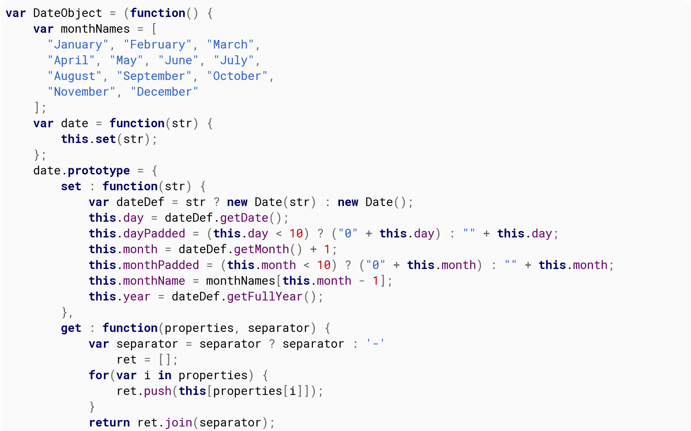
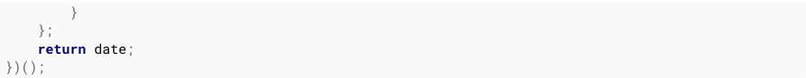
<!-- {width="7.486805555555556in" height="4.675694444444445in"} -->
<!-- page 55 -->

If you included that code and executed new DateObject() on January 20 ʰ, 2019, it
would produce an object with the following properties:

<pre>
day: 20
dayPadded: &quot;20&quot;
month: 1
monthPadded: &quot;01&quot;
monthName: &quot;January&quot;
year: 2019
</pre>

To get a formatted string, you could do something like this:

<pre>
<b>new</b> DateObject().<b>get</b>(&lbrack;&apos;dayPadded&apos;, &apos;monthPadded&apos;, &apos;year&apos;&rbrack;);
</pre>

That would produce the following output:

<pre>
20-01-2016
</pre>

(&ast;) <a href="http://programmers.stackexchange.com/questions/56490/what-does-nightly-builds-mean" 
target="_blank" rel="noreferrer noopener">
<b>According to the MDN</b></a>, &quot;modern browsers&quot; means Chrome 24+, Firefox 29+, 
IE11, Edge12+, Opera 15+ & Safari 
<a href="http://programmers.stackexchange.com/questions/56490/what-does-nightly-builds-mean" 
target="_blank" rel="noreferrer noopener"><b>nightly build</b></a>.

<!--~~~~~~~~~~~~~~~~~~~~~~~~~~~~~~~~~~~~~~~~~~~~~~~~~~~~~~~~~~~~~~~~~~~~~~~~~~~~~~~~~~~~~~~~~~~~-->
<h3 id="ch8-5">Section 8.5: Get the number of milliseconds elapsed since 1 January 1970 00:00:00 UTC</h3>
<!--~~~~~~~~~~~~~~~~~~~~~~~~~~~~~~~~~~~~~~~~~~~~~~~~~~~~~~~~~~~~~~~~~~~~~~~~~~~~~~~~~~~~~~~~~~~~-->

The static method Date.now returns the number of milliseconds that have elapsed
since 1 January 1970 00:00:00 UTC. To get the number of milliseconds
that have elapsed since that time using an instance of a Date object,
use its getTime method.

<pre>// <i>get milliseconds using static method now of Date</i>
console.log(Date.now());

// <i>get milliseconds using method getTime of Date instance</i>
console.log((<b>new</b> Date ( ) ) .getTime ());</pre>
<!--~~~~~~~~~~~~~~~~~~~~~~~~~~~~~~~~~~~~~~~~~~~~~~~~~~~~~~~~~~~~~~~~~~~~~~~~~~~~~~~~~~~~~~~~~~~~-->
<h3 id="ch8-6">Section 8.6: Get the current time and date</h3>
<!--~~~~~~~~~~~~~~~~~~~~~~~~~~~~~~~~~~~~~~~~~~~~~~~~~~~~~~~~~~~~~~~~~~~~~~~~~~~~~~~~~~~~~~~~~~~~-->

Use <b>new</b> Date() to generate a new Date object containing the current date and time.

<i>Note that</i> Date() <i>called without arguments</i> is equivalent to</i> <b>new</b> Date(Date.now()).

Once you have a date object, you can apply any of the several available methods to extract 
its properties (e.g. getFullYear() to get the 4-digits year).

Below are some common date methods.

<b>Get the current year</b>

<pre>
<b>var</b> year = (<b>new</b> Date()).getFullYear();
console.log(year);
// <i>Sample output: 2016</i>
</pre>
<!-- page 56 -->

<b>Get the current month</b>

<pre>
<b>var</b> month = (<b>new</b> Date()).getMonth();
console.log(month);
// <i>Sample output: 0</i>
</pre>

Please note that 0 = January. This is because months range from <i>0</i> to
<i>11</i>, so it is often desirable to add +1 to the index.

<b>Get the current day</b>

<pre>
<b>var</b> day = (<b>new</b> Date()).getDate();
console.log(day);
// <i>Sample output: 31</i>
</pre>

<b>Get the current hour</b>

<pre>
<b>var</b> hours = (<b>new</b> Date()).getHours();
console.log(hours);
// <i>Sample output: 10</i>
</pre>

<b>Get the current minutes</b>

<pre>
<b>var</b> minutes = (<b>new</b> Date()).getMinutes();
console.log(minutes);
// <i>Sample output: 39</i>
</pre>

<b>Get the current seconds</b>

<pre>
<b>var</b> seconds = (<b>new</b> Date()).getSeconds();
console.log(second);
// <i>Sample output: 48</i>
</pre>

<b>Get the current milliseconds</b>

To get the milliseconds (ranging from 0 to 999) of an instance of a
Date object, use its getMilliseconds method.

<pre>
<b>var</b> milliseconds = (<b>new</b> Date()).getMilliseconds();
console.log(milliseconds);
// <i>Output: milliseconds right now</i>
</pre>

<b>Convert the current time and date to a human-readable string</b>

<pre>
<b>var</b> now = <b>new</b> Date();
// <i>convert date to a string in UTC timezone format:</i>
console.log(now.toUTCString());
// <i>Output: Wed, 21 Jun 2017 09:13:01 GMT</i>
</pre>
  

The static method Date.now() returns the number of milliseconds that have
elapsed since 1 January 1970 00:00:00 UTC. To get the number of
milliseconds that have elapsed since that time using an instance of a
Date object, use its getTime method.

<pre>
// <i>get milliseconds using static method now of Date</i>
console.log(Date.now());

// <i>get milliseconds using method getTime of Date instance</i>
console.log((<b>new</b> Date()).getTime());
</pre>
<!--~~~~~~~~~~~~~~~~~~~~~~~~~~~~~~~~~~~~~~~~~~~~~~~~~~~~~~~~~~~~~~~~~~~~~~~~~~~~~~~~~~~~~~~~~~~~-->
<h3 id="ch8-7">Section 8.7: Increment a Date Object</h3>
<!--~~~~~~~~~~~~~~~~~~~~~~~~~~~~~~~~~~~~~~~~~~~~~~~~~~~~~~~~~~~~~~~~~~~~~~~~~~~~~~~~~~~~~~~~~~~~-->

To increment date objects in JavaScript, we can usually do this:

<pre>
<b>var</b> checkoutDate = <b>new</b> Date(); // <i>Thu Jul 21 2016 10:05:13 GMT-0400 (EDT)</i>
checkoutDate.setDate (checkoutDate.getDate() &plus; 1);
console.log(checkoutDate); // <i>Fri Jul 22 2016 10:05:13 GMT-0400 (EDT)</i>
</pre>
<!-- page 57 -->

It is possible to use setDate to change the date to a day in the
following month by using a value larger than the number of days in the
current month.

<pre>
<b>var</b> checkoutDate = <b>new</b> Date(); // <i>Thu Jul 21 2016 10:05:13 GMT-0400 (EDT)</i>
checkoutDate.setDate( checkoutDate.getDate() + 12 );
console.log(checkoutDate); // <i>Tue Aug 02 2016 10:05:13 GMT-0400 (EDT)</i>
</pre>

The same applies to other methods such as getHours(), getMonth(),etc.

<b>Adding Work Days</b>

If you wish to add work days (in this case I am assuming Monday -
Friday) you can use the setDate function although you need a little
extra logic to account for the weekends (obviously this will not take
account of national holidays)

<pre>
<b>function</b> addWorkDays(startDate, days) {
  // <i>Get the day of the week as a number (0 = Sunday, 1 = Monday, &hellip;. 6 = Saturday)</i>
  <b>var</b> dow = startDate.getDay();
  <b>var</b> daysToAdd = days;
  // <i>If the current day is Sunday add one day</i>
  <b>if</b> (dow == 0)
    daysToAdd++;
  // <i>If the start date plus the additional days falls on or after the closest Saturday calculate</i>
  <i>weekends</i>
  <b>if</b> (dow &plus; daysToAdd &gt;= 6) {
    // <i>Subtract days in current working week from work days</i>
    <b>var</b> remainingWorkDays = daysToAdd &minus; (5 &minus; dow);
    // <i>Add current working week&apos;s weekend</i>
    daysToAdd += 2;
    <b>if</b> (remainingWorkDays &gt; 5) {
      // <i>Add two days for each working week by calculating how many weeks are included</i>
      daysToAdd += 2 &ast; Math.floor(remainingWorkDays / 5);
      // <i>Exclude final weekend if remainingWorkDays resolves to an exact number of weeks</i>
      <b>if</b> (remainingWorkDays &percnt; 5 == 0)
        daysToAdd -= 2;
    }
  }
  startDate.setDate(startDate.getDate() &plus; daysToAdd);
  <b>return</b> startDate;
}
</pre>
<!--~~~~~~~~~~~~~~~~~~~~~~~~~~~~~~~~~~~~~~~~~~~~~~~~~~~~~~~~~~~~~~~~~~~~~~~~~~~~~~~~~~~~~~~~~~~~-->
<h3 id="ch8-8">Section 8.8: Convert to JSON</h3>
<!--~~~~~~~~~~~~~~~~~~~~~~~~~~~~~~~~~~~~~~~~~~~~~~~~~~~~~~~~~~~~~~~~~~~~~~~~~~~~~~~~~~~~~~~~~~~~-->
<pre>
<b>var</b> date1 = <b>new</b> Date();
date1.toJSON();
</pre>

<blockquote>
Returns: &quot;2016-04-14T23:49:08.596Z&quot;
</blockquote>
<!-- page 58 -->
<!--~~~~~~~~~~~~~~~~~~~~~~~~~~~~~~~~~~~~~~~~~~~~~~~~~~~~~~~~~~~~~~~~~~~~~~~~~~~~~~~~~~~~~~~~~~~~-->
<h2 id="ch9">Chapter 9: Date Comparison</h2>
<!--~~~~~~~~~~~~~~~~~~~~~~~~~~~~~~~~~~~~~~~~~~~~~~~~~~~~~~~~~~~~~~~~~~~~~~~~~~~~~~~~~~~~~~~~~~~~-->
<h3 id="ch9-1">Section 9.1: Comparing Date values</h3>
<!--~~~~~~~~~~~~~~~~~~~~~~~~~~~~~~~~~~~~~~~~~~~~~~~~~~~~~~~~~~~~~~~~~~~~~~~~~~~~~~~~~~~~~~~~~~~~-->

To check the equality of Date values:

<pre>
<b>var</b> date1 = <b>new</b> Date();
<b>var</b> date2 = <b>new</b> Date(date1.valueOf() &plus; 10);
console.log(date1.valueOf() === date2.valueOf());
</pre>

<blockquote>
Sample output: <b>false</b>
</blockquote>

Note that you must use () to compare the values of Date objects
because the equality operator will compare if two object references
are the same. For example:

<pre>
<b>var</b> date1 = <b>new</b> Date();
<b>var</b> date2 = <b>new</b> Date();
console.log(date1 === date2);
</pre>

<blockquote>
Sample output: <b>false</b>
</blockquote>

Whereas if the variables point to the same object:

<pre>
<b>var</b> date1 = <b>new</b> Date();
<b>var</b> date2 = date1;
console.log(date1 === date2);
</pre>

<blockquote>
Sample output: <b>true</b>
</blockquote>

However, the other comparison operators will work as usual and you can
use &lt; and &bsol;to compare that one date is earlier or later than the
other. For example:

<pre>
<b>var</b> date1 = <b>new</b> Date();
<b>var</b> date2 = <b>new</b> Date(date1.valueOf() &plus; 10);
console.log(date1 &lt; date2);
</pre>

<blockquote>
Sample output: <b>true</b>
</blockquote>

It works even if the operator includes equality:

<pre>
<b>var</b> date1 = <b>new</b> Date();
<b>var</b> date2 = <b>new</b> Date(date1.valueOf());
console.log( date1 &lt;= date2);
</pre>

<blockquote>
Sample output: <b>true</b>
</blockquote>
<!-- page 59 -->
<!--~~~~~~~~~~~~~~~~~~~~~~~~~~~~~~~~~~~~~~~~~~~~~~~~~~~~~~~~~~~~~~~~~~~~~~~~~~~~~~~~~~~~~~~~~~~~-->
<h3 id="ch9-2">Section 9.2: Date Difference Calculation</h3>
<!--~~~~~~~~~~~~~~~~~~~~~~~~~~~~~~~~~~~~~~~~~~~~~~~~~~~~~~~~~~~~~~~~~~~~~~~~~~~~~~~~~~~~~~~~~~~~-->

To compare the difference of two dates, we can do the comparison based
on the timestamp.

<pre>
<b>var</b> date1 = <b>new</b> Date();
<b>var</b> date2 = <b>new</b> Date(date1.valueOf() &plus; 5000); 

<b>var</b> dateDiff = date1.valueOf() &minus; date2.valueOf();
<b>var</b> dateDiffInYears = dateDiff/1000/60/60/24/365; // <i>convert milliseconds into years</i> 
console.log( &quot;Date difference in years : &quot; &plus; dateDiffInYears);
</pre>
<!--~~~~~~~~~~~~~~~~~~~~~~~~~~~~~~~~~~~~~~~~~~~~~~~~~~~~~~~~~~~~~~~~~~~~~~~~~~~~~~~~~~~~~~~~~~~~-->
<h2 id="ch10">Chapter 10: Comparison Operations</h2>
<!--~~~~~~~~~~~~~~~~~~~~~~~~~~~~~~~~~~~~~~~~~~~~~~~~~~~~~~~~~~~~~~~~~~~~~~~~~~~~~~~~~~~~~~~~~~~~-->
<h3 id="ch10-1">Section 10.1: Abstract equality / inequality and type conversion</h3>
<!--~~~~~~~~~~~~~~~~~~~~~~~~~~~~~~~~~~~~~~~~~~~~~~~~~~~~~~~~~~~~~~~~~~~~~~~~~~~~~~~~~~~~~~~~~~~~-->

<b>The Problem</b>

The abstract equality and inequality operators (== and !=) convert
their operands if the operand types do not match. This type coercion
is a common source of confusion about the results of these operators,
in particular, these operators aren&apos;t always transitive as one would
expect.

<pre>
&quot;&quot; == 0;       // <i>true A</i>
0 == &quot;0&quot;;      // <i>true A</i>
&quot;&quot; == &quot;0&quot;;     // <i>false B</i>
<b>false</b> == 0;    // <i>true</i>
<b>false</b> == &quot;0&quot;;  // <i>true</i>
&quot;&quot; != 0;      // <i>false A</i>
0 != &quot;0&quot;;     // <i>false A</i>
&quot;&quot; != &quot;0&quot;;    // <i>true B</i>
<b>false</b> != 0;   // <i>false</i>
<b>false</b> != &quot;0&quot;; // <i>false</i>
</pre>

The results start to make sense if you consider how JavaScript
converts empty strings to numbers.

<pre>
Number( &quot;&quot; );     // <i>0</i>
Number( &quot;0&quot; );    // <i>0</i>
Number( <b>false</b> );  // <i>0</i>
</pre>

<b>The Solution</b>

In the statement <b>false B</b>, both the operands are strings (&quot;&quot; and &quot;0&quot;),
hence there will be <b>no type conversion</b> and since &quot;&quot; and &quot;0&quot;
are not the same value, &quot;&quot; == &quot;0&quot; is <b>false</b> as expected.

One way to eliminate unexpected behavior here is making sure that you
always compare operands of the same type. For example, if you want the
results of numerical comparison use explicit conversion:

<pre>
<b>var</b> test = (a, b) =&gt; Number(a) == Number(b);
test(&quot;&quot;, 0 );        // <i>true;</i>
test(&quot;0&quot;, 0);        // <i>true</i>
test(&quot;&quot;, &quot;0&quot;);       // <i>true;</i>
test(&quot;abc&quot;, &quot;abc&quot;);  // <i>false as operands are not numbers</i>
</pre>

Or, if you want string comparison:

<pre>
<b>var</b> test = (a, b) =&gt; String(a) == String(b);
test(&quot;&quot;, 0);    // <i>false;</i>
test(&quot;0&quot;, 0);   // <i>true</i>
test(&quot;&quot;, &quot;0&quot;);  // <i>false;</i>
</pre>

<i>Side-note</i>: Number(&quot;0&quot;) and <b>new</b> Number(&quot;0&quot;) isn&apos;t the same thing! 
While the former performs a type conversion, the latter will create a new object. Objects are 
compared by reference and not by value which explains the results below.

<!-- page 61 -->
<pre>
Number(&quot;0&quot;) == Number(&quot;0&quot;);           // <i>true;</i>
<b>new</b> Number(&quot;0&quot;) == <b>new</b> Number (&quot;0&quot;);  // <i>false</i>
</pre>

Finally, you have the option to use strict equality and inequality
operators which will not perform any implicit type conversions.

<pre>
&quot;&quot; === 0;   // <i>false</i>
0 === &quot;0&quot;;  // <i>false</i>
&quot;&quot; === &quot;0&quot;; // <i>false</i>
</pre>

Further reference to this topic can be found here:

<a href="http://stackoverflow.com/questions/359494/does-it-matter-which-equals-operator-vs-i-use-in-javascript-comparisons">
Which equals operator (== vs ===) should be used in JavaScript comparisons?</a>.

Abstract Equality (==)

<!--~~~~~~~~~~~~~~~~~~~~~~~~~~~~~~~~~~~~~~~~~~~~~~~~~~~~~~~~~~~~~~~~~~~~~~~~~~~~~~~~~~~~~~~~~~~~-->
<h3 id="ch10-2">Section 10.2: NaN Property of the Global Object</h3>
<!--~~~~~~~~~~~~~~~~~~~~~~~~~~~~~~~~~~~~~~~~~~~~~~~~~~~~~~~~~~~~~~~~~~~~~~~~~~~~~~~~~~~~~~~~~~~~-->

<b>NaN</b> (&quot;<b>N</b>ot <b>a</b> <b>N</b>umber&quot;) is a special value defined by the 
<a href=""><i>IEEE Standard for Floating-Point Arithmetic</i></a>, which is used when a non-numeric 
value is provided but a number is expected (1 &ast; "two"), or when a calculation doesn&apos;t have a 
valid number result ((-1)).

Any equality or relational comparisons with <b>NaN</b> returns <b>false</b>, even comparing it 
with itself. Because, <b>NaN</b> is supposed to denote the result of a nonsensical computation, 
and as such, it isn't equal to the result of any other nonsensical computations.

<pre>
(1 &ast; &quot;two&quot;) === <b>NaN</b> // <i>false</i>

<b>NaN</b> === 0;                        // <i>false</i>
<b>NaN</b> === <b>NaN</b>;               // <i>false</i>
Number.<b>NaN</b> === <b>NaN</b>; // <i>false</i>

<b>NaN</b> &lt; 0;                // <i>false</i>
<b>NaN</b> &gt; 0;                // <i>false</i>
<b>NaN</b> &gt; 0;                // <i>false</i>
<b>NaN</b> &gt;= <b>NaN</b>;      // <i>false</i>
<b>NaN</b> &gt;= &apos;two&apos;; // <i>false</i>
</pre>

Non-equal comparisons will always return <b>true</b>:

<pre>
<b>NaN</b> !== 0;    // <i>true</i>
<b>NaN</b> !== <b>NaN</b>; // <i>true</i>
</pre>

<b>Checking if a value is NaN</b>

<h5>Version ≥ 6</h5>

You can test a value or expression for <b>NaN</b> by using the function Number.isNaN():

<pre>
Number.isNaN(<b>NaN</b>);      // <i>true</i>
Number.isNaN(0 / 0);      // <i>true</i>
Number.isNaN(&apos;str&apos; &minus; 12); // <i>true</i>

Number.isNaN(24);          // <i>false</i>
Number.isNaN(&apos;24&apos;);      // <i>false</i>
Number.isNaN(1 / 0);       // <i>false</i>
Number.isNaN(<b>Infinity</b>);   // <i>false</i>

Number.isNaN(&apos;str&apos;); // <i>false</i>
Number.isNaN(<b>undefined</b>); // <i>false</i>
Number.isNaN({});          // <i>false</i>
</pre>

<!-- page 62 -->
<h5>Version &lt; 6</h5>

You can check if a value is <b>NaN</b> by comparing it with itself:

<pre>
value !== value;  // <i>true for NaN, false for any other value</i>
</pre>
  

You can use the following polyfill for Number.isNaN():

<pre>
Number.isNaN = Number.isNaN &vert;&vert; <b>function</b>(value) {
  <b>return</b> value !== value;
}
</pre>

By contrast, the global function isNaN() returns <b>true</b> not only for <b>NaN</b>, but 
also for any value or expression that cannot be coerced into a number:

<pre>
isNaN (<b>NaN</b>);     // <i>true</i>
isNaN(0/0);        // <i>true</i>
isNaN(&apos;str&apos;&minus; 12); // <i>true</i>

isNaN(24);          // <i>false</i>
isNaN(&apos;24&apos;);      // <i>false</i>
isNaN(<b>Infinity</b>);  // <i>false</i>

isNaN(&apos;str&apos;);     // <i>true</i>
isNaN(<b>undefined</b>); // <i>true</i>
isNaN({});          // <i>true</i>
</pre>

ECMAScript defines a "sameness" algorithm called SameValue which, since ECMAScript 6, can 
be invoked with Object.is. Unlike the == and === comparison, using Object.is() will treat 
<b>NaN</b> as identical with itself (and -0 as note identical with +0):

<pre>
Object.is(<b>NaN, NaN</b>)      // <i>true</i>
Object.is(+0, 0)         // <i>false</i>

<b>NaN</b> === <b>NaN</b>            // <i>false</i>
+0 === 0                 // <i>true</i>
</pre>
<h5>Version &lt; 6</h5>

You can use the following polyfill for Object.is() (from
<a href="https://developer.mozilla.org/en-US/docs/Web/JavaScript/Reference/Global_Objects/Object/is#Polyfill_for_non-ES6_browsers">
MDN</a>):

<pre>
<b>if</b> (!Object.is) {
  Object.is = <b>function</b>(x, y) {
    // <i>SameValue algorithm</i>
    <b>if</b> (x === y) { // <i>Steps 1-5, 7-10</i>
      // <i>Steps 6.b-6.e: +0 != -0</i>
      <b>return</b> x !== 0 &vert;&vert; 1 / x === 1 / y;
    } <b>else</b> {
      // <i>Step 6.a: NaN == NaN</i>
      <b>return</b> x !== x && y !== y;
    }
  };
}
</pre>

<b>Points to note</b>

NaN itself is a number, meaning that it does not equal to the string
&quot;NaN&quot;, and most importantly (though perhaps unintuitively):

<!-- page 63 -->

<pre>
<b>typeof</b>(<b>NaN</b>) === &quot;number&quot;;  // <i>true</i>
</pre>
<!--~~~~~~~~~~~~~~~~~~~~~~~~~~~~~~~~~~~~~~~~~~~~~~~~~~~~~~~~~~~~~~~~~~~~~~~~~~~~~~~~~~~~~~~~~~~~-->
<h3 id="ch10-3">Section 10.3: Short-circuiting in boolean operators</h3>
<!--~~~~~~~~~~~~~~~~~~~~~~~~~~~~~~~~~~~~~~~~~~~~~~~~~~~~~~~~~~~~~~~~~~~~~~~~~~~~~~~~~~~~~~~~~~~~-->

The and-operator (&&) and the or-operator (&vert;&vert;) employ
short-circuiting to prevent unnecessary work if the outcome of the
operation does not change with the extra work.

In x && y, y will not be evaluated if x evaluates to <b>false</b>, because the whole expression is 
guaranteed to be <b>false</b>.

In x &vert;&vert; y, y will not be evaluated if x evaluated to <b>true</b>, because the whole expression 
is guaranteed to be <b>true</b>.

<b>Example with functions</b>

Take the following two functions:

<pre>
<b>function</b> T() {  // <i>True</i>
  console.log(&quot;T&quot;);
  <b>return</b> <b>true</b>;
}

<b>function</b> F() { // <i>False</i>
  console.log(&quot;F&quot;);
  <b>return</b> <b>false</b>;
}
</pre>

<i><b>Example 1</b></i>

<pre>
T ( ) && F ( );  // <i>false</i>
</pre>

Output:

<blockquote>
&apos;T&apos; 
&apos;F&apos;
</blockquote>

<i><b>Example 2</b></i>

<pre>
F () && T (); // <i>false</i>
</pre>

Output:

<blockquote>
&apos;F&apos;
</blockquote>

<i><b>Example 3</b></i>

<pre>
T () &vert;&vert; F ();  // <i>true</i>
</pre>

Output:

<blockquote>
&apos;T&apos;
</blockquote>

<i><b>Example 4</b></i>

<!-- page 64 -->
<pre>
F () &vert;&vert; T (); // <i>true</i>
</pre>

Output:

<blockquote>
&apos;F&apos; 
&apos;T&apos;
</blockquote>

<b>Short-circuiting to prevent errors</b>

<pre>
<b>var</b> obj; // <i>object has value of undefined</i>
<b>if</b>(obj.property){ }// <i>TypeError: Cannot read property &apos;property&apos; of undefined</i>
<b>if</b>(obj.property && obj !== <b>undefined</b>){}// <i>Line A TypeError: Cannot read property &apos;property&apos; of 
undefined</i>
</pre>

Line A: if you reverse the order the first conditional statement will prevent the error on the second 
by not executing it if it would throw the error.

<pre>
<b>if</b> (obj !== <b>undefined</b> && obj.property ) {}; // <i>no error thrown</i>
</pre>

But should only be used if you expect <b>undefined</b>.

<pre>
<b>if</b>(<b>typeof</b> obj === &quot;object&quot; && obj.property){}; // <i>safe option but slower</i>
</pre>

<b>Short-circuiting to provide a default value</b>

The &vert;&vert; operator can be used to select either a &quot;truthy&quot; value, or the default value.

For example, this can be used to ensure that a nullable value is converted to a non-nullable value:

<pre>
<b>var</b> nullableObj = <b>null</b>;
<b>var</b> obj = nullableObj &vert;&vert; {}; // <i>this selects {}</i>

<b>var</b> nullableObj2 = {x : 5};
<b>var</b> obj2 = nullableObj2 &vert;&vert; {} // <i>this selects {x: 5}</i>
</pre>

Or to return the first truthy value

<pre>
<b>var</b> truthyValue = {x : 10};
<b>return</b> truthyValue &vert;&vert; {}; // <i>will return {x: 10}</i>
</pre>

The same can be used to fall back multiple times:

<pre>
envVariable &vert;&vert; configValue &vert;&vert; defaultConstValue // <i>select the first &quot;truthy&quot; of these</i>
</pre>

<b>Short-circuiting to call an optional function</b>

The && operator can be used to evaluate a callback, only if it is passed:

<pre>
<b>function</b> myMethod (cb){
  // <i>This can be simplified</i>
  <b>if</b> (cb) {
    cb();
  }
  // <i>To this</i>
  cb && cb ();
}
</pre>
<!-- page 65 -->

Of course, the test above does not validate that cb is in fact a
<b>function</b> and not just an Object/Array/String/Number.

<!--~~~~~~~~~~~~~~~~~~~~~~~~~~~~~~~~~~~~~~~~~~~~~~~~~~~~~~~~~~~~~~~~~~~~~~~~~~~~~~~~~~~~~~~~~~~~-->
<h3 id="ch10-4">Section 10.4: Null and Undefined</h3>
<!--~~~~~~~~~~~~~~~~~~~~~~~~~~~~~~~~~~~~~~~~~~~~~~~~~~~~~~~~~~~~~~~~~~~~~~~~~~~~~~~~~~~~~~~~~~~~-->

<b>The differences between null and undefined</b>

null</b> and <b>undefined</b> share abstract equality == but not strict equality ===,

<pre>
<b>null</b> == <b>undefined</b> // <i>true</i>
<b>null</b> === <b>undefined</b> // <i>false</i>
</pre>

They represent slightly different things:

<ul>
  <li><b>undefined</b> represents the <i>absence of a value</i>, such as before an
    identifier/Object property has been created or in the period between
    identifier/Function parameter creation and it&apos;s first set, if any.</li>
  <li><b>null</b> represents the <i><b>intentional</b> absence of a value</i> for an
    identifier or property which has already been created.</li>
</ul>

They are different types of syntax:

<ul>
  <li><b>undefined</b> is a <i>property of the global Object</i>, usually immutable
    in the global scope. This means anywhere you can define an identifier
    other than in the global namespace could hide <b>undefined</b> from that
    scope (although things can still <b>be undefined</b>)</li>
  <li><b>null</b> is a <i>word literal</i>, so it&apos;s meaning can never be changed 
    and attempting to do so will throw an <i>Error</i>.</li>
</ul>

<b>The similarities between null and undefined</b>

<b>null</b> and <b>undefined</b> are both falsy.

<pre>
<b>if</b> (<b>null</b>) console.log(&quot;won&apos;t be logged&quot;);
<b>if</b> (<b>undefined</b>) console.log(&quot;won&apos;t be logged&quot;);
</pre>

Neither <b>null</b> or <b>undefined</b> equal <b>false</b> (see 
<a href="http://stackoverflow.com/q/19277458/220060">this question</a>).

<pre>
<b>false</b> == <b>undefined</b>  // <i>false</i>
<b>false</b> == <b>null</b>       // <i>false</i>
<b>false</b> === <b>undefined</b> // <i>false</i>
<b>false</b> === <b>null</b>      // <i>false</i>
</pre>

<b>Using undefined</b>

<ul>
  <li>If the current scope can&apos;t be trusted, use something which evaluates
    to <i>undefined</i>, for example <b>void</b> 0;.</li>
  <li>If <b>undefined</b> is shadowed by another value, it&apos;s just as bad as
    shadowing Array or Number.</li>
  <li>Avoid <i>setting</i> something as <b>undefined</b>. If you want to remove a
    property <i>bar</i> from an <i>Object</i> foo, <b>delete</b> foo.bar; instead.</li>
  <li>Existence testing identifier foo against <b>undefined could throw a Reference 
    Error</b>, use against <b>typeof</b> foo against &quot;undefined&quot; instead.</li>
</ul>
<!--~~~~~~~~~~~~~~~~~~~~~~~~~~~~~~~~~~~~~~~~~~~~~~~~~~~~~~~~~~~~~~~~~~~~~~~~~~~~~~~~~~~~~~~~~~~~-->
<h3 id="ch10-5">Section 10.5: Abstract Equality (==)</h3>
<!--~~~~~~~~~~~~~~~~~~~~~~~~~~~~~~~~~~~~~~~~~~~~~~~~~~~~~~~~~~~~~~~~~~~~~~~~~~~~~~~~~~~~~~~~~~~~-->
<!-- page 66 -->

Operands of the abstract equality operator are compared <i>after</i> being
converted to a common type. How this conversion happens is based on
the specification of the operator:

<a href="https://tc39.github.io/ecma262/#sec-abstract-equality-comparison">
Specification for the == operator:</a>

<blockquote>
<b>7.2.13 Abstract Equality Comparison</b>
The comparison x == y, where x and y are values, produces <b>true</b> or <b>false</b>. Such a 
comparison is performed as follows:
<ol>
  <li>If Type(x) is the same as Type(y), then:
    <ul>
      <li><b>a.</b> Return the result of performing Strict Equality Comparison x === y.</li>
    </li>
    </ul>
  </li>
  <li>If x is <b>null</b> and y is <b>undefined</b>, return <b>true</b>.</li>
  <li>If x is <b>undefined</b> and y is <b>null</b>, return <b>true</b>.</li>
  <li>If Type(x) is <b>Number</b> and <b>Type(y)</b> is String, return the result of the comparison
    x == ToNumber(y).</li>
  <li>If <b>Type(x)</b> is String and <b>Type(y)</b> is Number, return the result of the comparison x == <b>ToNumber(y)</b>.</li>
  <li>If <b>Type(x)</b> is Boolean, return the result of the comparison ToNumber(x) == y.</li>
  <li>If Type(y) is Boolean, return the result of the comparison X == ToNumber(y).</li>
  <li>If Type(x) is either String, Number, or Symbol and Type(y) is Object, return the result of the
    comparison x == ToPrimitive(y).</li>
  <li>If Type(x) is Object and Type(y) is either String, Number, or Symbol, return the result of the
    comparison ToPrimitive(x) == y.</li>
  <li>Return <b>false</b>.</li>
</ol>
</blockquote>

<b>Examples:</b>

<pre>
1 == 1;                                 // <i>true</i>
1 == <b>true</b>;                       // <i>true (operand converted to number: true =&bsol;1)</i>
1 == &apos;1&apos;;                     // <i>true (operand converted to number: &apos;1&apos; =&bsol;1 )</i>
1 == &apos;1.00&apos;;                  // <i>true</i>
1 == &apos;1.00000000001&apos;;         // <i>false</i>
1 == &apos;1.00000000000000001&apos;; // <i>true (true due to precision loss)</i>
<b>null</b> == <b>undefined</b>;       // <i>true (spec #2)</i>
1 == 2;                                 // <i>false</i> 
0 == <b>false</b>;                      // <i>true</i>
0 == <b>undefined</b>;                  // <i>false</i>
0 == &quot;&quot;;                      // <i>true</i>
</pre>
<!--~~~~~~~~~~~~~~~~~~~~~~~~~~~~~~~~~~~~~~~~~~~~~~~~~~~~~~~~~~~~~~~~~~~~~~~~~~~~~~~~~~~~~~~~~~~~-->
<h3 id="ch10-6">Section 10.6: Logic Operators with Booleans</h3>
<!--~~~~~~~~~~~~~~~~~~~~~~~~~~~~~~~~~~~~~~~~~~~~~~~~~~~~~~~~~~~~~~~~~~~~~~~~~~~~~~~~~~~~~~~~~~~~-->
<pre>
<b>var</b> x = <b>true</b>,
   y = <b>false</b>;
</pre>

<b>AND</b>

This operator will return true if both of the expressions evaluate to
true. This boolean operator will employ shortcircuiting and will not
evaluate y if x evaluates to <b>false</b>.

<pre>
x && y;
</pre>

This will return false, because y is false.

<b>OR</b>

This operator will return true if one of the two expressions evaluate
to true. This boolean operator will employ short-circuiting and y will
not be evaluated if x evaluates to <b>true</b>.

<!-- page 67 -->

<pre>
x &vert;&vert; y;
</pre>

This will return true, because x is true.

<b>NOT</b>

This operator will return false if the expression on the right
evaluates to true, and return true if the expression on the right
evaluates to false.

<pre>
!x;
</pre>

This will return false, because x is true.

<!--~~~~~~~~~~~~~~~~~~~~~~~~~~~~~~~~~~~~~~~~~~~~~~~~~~~~~~~~~~~~~~~~~~~~~~~~~~~~~~~~~~~~~~~~~~~~-->
<h3 id="ch10-7">Section 10.7: Automatic Type Conversions</h3>
<!--~~~~~~~~~~~~~~~~~~~~~~~~~~~~~~~~~~~~~~~~~~~~~~~~~~~~~~~~~~~~~~~~~~~~~~~~~~~~~~~~~~~~~~~~~~~~-->

Beware that numbers can accidentally be converted to strings or NaN (Not a Number).

JavaScript is loosely typed. A variable can contain different data
types, and a variable can change its data type:

<pre>
<b>var</b> x = &quot;Hello&quot;;   // <i>typeof x is a string</i>
x = 5;                  // <i>changes typeof x to a number</i>
</pre>

When doing mathematical operations, JavaScript can convert numbers to
strings:

<pre>
<b>var</b> x = 5 + 7; // <i>x.valueOf() is 12, typeof x is a number</i>
<b>var</b> x = 5 + &quot;7&quot;; // <i>x.valueOf() is 57, typeof x is a string</i>
<b>var</b> x = &quot;5&quot; + 7; // <i>x.valueOf() is 57, typeof x is a string</i>
<b>var</b> x = 5 - 7; // <i>x.valueOf() is -2, typeof x is a number</i>
<b>var</b> x = 5 - &quot;7&quot;; // <i>x.valueOf() is -2, typeof x is a number</i>
<b>var</b> x = &quot;5&quot; - 7; // <i>x.valueOf() is -2, typeof x is a number</i>
<b>var</b> x = 5 - &quot;x&quot;; // <i>x.valueOf() is NaN, typeof x is a number</i>
</pre>

Subtracting a string from a string, does not generate an error but returns 
NaN (Not a Number):

<pre>
&quot;Hello&quot; &minus; &quot;Dolly&quot; // <i>returns NaN</i>
</pre>
<!--~~~~~~~~~~~~~~~~~~~~~~~~~~~~~~~~~~~~~~~~~~~~~~~~~~~~~~~~~~~~~~~~~~~~~~~~~~~~~~~~~~~~~~~~~~~~-->
<h3 id="ch10-8">Section 10.8: Logic Operators with Non-boolean values (boolean coercion)</h3>
<!--~~~~~~~~~~~~~~~~~~~~~~~~~~~~~~~~~~~~~~~~~~~~~~~~~~~~~~~~~~~~~~~~~~~~~~~~~~~~~~~~~~~~~~~~~~~~-->

Logical OR (&vert;&vert;), reading left to right, will evaluate to the first
<i>truthy</i> value. If no <i>truthy</i> value is found, the last value is
returned.

<pre>
<b>var</b> a = &apos;hello&apos; &vert;&vert; &apos;&apos;; // <i>a = &apos;hello&apos;</i>
<b>var</b> b = &apos;&apos; &vert;&vert; &lbrack;&rbrack;; // <i>b = &lbrack;&rbrack;</i>
<b>var</b> c = &apos;&apos; &vert;&vert; <b>undefined</b>; // <i>c = undefined</i>
<b>var</b> d = 1 &vert;&vert; 5; // <i>d = 1</i>
<b>var</b> e = 0 &vert;&vert; {}; // <i>e = {}</i>
<b>var</b> f = 0 &vert;&vert; &apos;&apos; &vert;&vert; 5; // <i>f = 5</i>
<b>var</b> g = &apos;&apos; &vert;&vert; &apos;yay&apos; &vert;&vert; &apos;boo&apos;; // <i>g = &apos;yay&apos;</i>
</pre>

Logical AND (&&), reading left to right, will evaluate to the first
<i>falsy</i> value. If no <i>falsey</i> value is found, the last value is
returned.

<!-- page 68 -->

<pre>
<b>var</b> a = &apos;hello&apos; && &apos;&apos;; // <i>a = &apos;&apos;</i>
<b>var</b> b = &apos;&apos; && &lbrack;&rbrack;;  // <i>b = &apos;&apos;</i>
<b>var</b> c = <b>undefined</b> && 0;  // <i>c = undefined</i>
<b>var</b> d = 1 && 5; // <i>d = 5</i>
<b>var</b> e = 0 && {};  // <i>e = 0</i>
<b>var</b> f = &apos;hi&apos; && &lbrack;&rbrack; && &apos;done&apos;; // <i>f = &apos;done&apos;</i>
<b>var</b> g = &apos;bye&apos; && <b>undefined</b> && &apos;adios&apos;; // <i>g = undefined</i>
</pre>

This trick can be used, for example, to set a default value to a function argument (prior to ES6).

<pre>
<b>var</b>
<b>var</b> foo = <b>function</b> (val) {
  // <i>if val evaluates to falsey, &apos;default&apos; will be returned instead.</i>
  <b>return</b> val &vert;&vert; &apos;default&apos;;
}

console.log(foo(&apos;burger&apos;)); // <i>burger</i>
console.log(foo(100));                // <i>100</i>
console.log(foo(&lbrack;&rbrack;));   // <i>&lbrack;&rbrack;</i>
console.log(foo(0));                  // <i>default</i>
console.log(foo(<b>undefined</b>));   // <i>default</i>
</pre>

Just keep in mind that for arguments, 0 and (to a lesser extent) the
empty string are also often valid values that should be able to be
explicitly passed and override a default, which, with this pattern,
they won't (because they are <i>falsy</i>).

<!--~~~~~~~~~~~~~~~~~~~~~~~~~~~~~~~~~~~~~~~~~~~~~~~~~~~~~~~~~~~~~~~~~~~~~~~~~~~~~~~~~~~~~~~~~~~~-->
<h3 id="ch10-9">Section 10.9: Empty Array</h3>
<!--~~~~~~~~~~~~~~~~~~~~~~~~~~~~~~~~~~~~~~~~~~~~~~~~~~~~~~~~~~~~~~~~~~~~~~~~~~~~~~~~~~~~~~~~~~~~-->
<pre>
/<i>&ast; ToNumber(ToPrimitive(&lbrack;&rbrack;)) == ToNumber(false)</i> &ast;/
&lbrack;&rbrack; == <b>false</b>; // <i>true</i>
</pre>

When &lbrack;&rbrack;.toString() is executed it calls &lbrack;&rbrack;.join() if it exists, or 
Object.<b>prototype</b>.toString() otherwise.  This comparison is returning <b>true</b> because 
&lbrack;&rbrack;.join() returns '' which, coerced into 0, is equal to false. 
<a href="http://www.ecma-international.org/ecma-262/5.1/">ToNumber.

<!-- [ToNumber](http://www.ecma-international.org/ecma-262/5.1/#sec-9.3). -->

Beware though, all objects are truthy and Array is an instance of Object:

<pre>
// <i>Internally this is evaluated as ToBoolean(&lbrack;&rbrack;) === true ? &apos;truthy&apos; : &apos;falsy&apos;</i>
&lbrack;&rbrack; ? &apos;truthy&apos; : &apos;falsy&apos;; // <i>&apos;truthy&apos;</i>
</pre>
<!--~~~~~~~~~~~~~~~~~~~~~~~~~~~~~~~~~~~~~~~~~~~~~~~~~~~~~~~~~~~~~~~~~~~~~~~~~~~~~~~~~~~~~~~~~~~~-->
<h3 id="ch10-10">Section 10.10: Equality comparison operations</h3>
<!--~~~~~~~~~~~~~~~~~~~~~~~~~~~~~~~~~~~~~~~~~~~~~~~~~~~~~~~~~~~~~~~~~~~~~~~~~~~~~~~~~~~~~~~~~~~~-->

JavaScript has four different equality comparison operations.

<a href="http://www.ecma-international.org/ecma-262/6.0/#sec-samevalue"><b>SameValue</b></a>

It returns <b>true</b> if both operands belong to the same Type and are
the same value.

Note: the value of an object is a reference.

You can use this comparison algorithm via (ECMAScript 6).

Examples:

<pre>
Object.is(1, 1);            // <i>true</i>
Object.is(&plus;0, &minus;0);          // false</i>
Object.is(<b>NaN</b>, <b>NaN</b>);        // <i>true</i>
Object.is(<b>true</b>, &quot;true&quot;);   // <i>false</i>
Object.is(<b>false</b>, 0);       // <i>false</i>
Object.is(<b>null</b>, <b>undefined</b>); // <i>false</i>
Object.is(1, &quot;1&quot;);          // <i>false</i>
Object.is(&lbrack;&rbrack;, &lbrack;&rbrack;);      //<i>false</i>
</pre>

This algorithm has the properties of an <a href="https://en.wikipedia.org/wiki/Equivalence_relation">
equivalence relation</a>:

<ul>
  <li><a href="https://en.wikipedia.org/wiki/Reflexive_relation">Reflexivity</a>: Object.is(x, x) is <b>true</b>,
    for any value x</li>
  <li><a href="https://en.wikipedia.org/wiki/Symmetric_relation">Symmetry</a>: Object.is(x, y) is <b>true</b> if,
    and only if, Object.is(y, x) is <b>true</b>, for any values x and y.</li>
  <li><a href="https://en.wikipedia.org/wiki/Symmetric_relation">Transitivity</a>: If Object.is(x, y) and
    Object.is(y, z) are </b>true</b>, then Object.is(x, z) is also <b>true</b>, for any values x, y, and z.</li>
</ul>

<a href="http://www.ecma-international.org/ecma-262/6.0/#sec-samevaluezero">SameValueZero</a>

It behaves like SameValue, but considers +0 and -0 to be equal.

You can use this comparison algorithm via (ECMAScript 7).

Examples:

<pre>
&lbrack;1&rbrack;.includes(1); // <i>true</i>
&lbrack;&plus;0&rbrack;.includes(&minus;0); // <i>true</i>
&lbrack;<b>NaN</b>&rbrack;.includes(<b>NaN</b>); // <i>true</i>
&lbrack;<b>true</b>&rbrack;.includes(&quot;true&quot;); // <i>false</i>
&lbrack;<b>false</b>&rbrack;.includes(0);  // <i>false</i>
&lbrack;1&rbrack;.includes(&quot;1&quot;);  // <i>false</i>
&lbrack;<b>null</b>&rbrack;.includes(<b>undefined</b>);  // <i>false</i>
&lbrack;&lbrack;&rbrack;&rbrack;.includes(&lbrack;&rbrack;);  // <i>false</i>
</pre>

This algorithm still has the properties of an <a href="https://en.wikipedia.org/wiki/Equivalence_relation">equivalence
relation</a>:

<ul>
  <li><a href="https://en.wikipedia.org/wiki/Reflexive_relation">Reflexivity</a>:&lbrack;x&rbrack;.(x) is <b>true</b>, for any value x</li>
  <li><a href="https://en.wikipedia.org/wiki/Symmetric_relation">Symmetry</a>:&lbrack;x&rbrack;.(x) is <b>true</b> if, and only if, &lbrack;y&rbrack;.includes(x) 
    is <b>true</b>, for any values x and y.</li>
  <li><a href="https://en.wikipedia.org/wiki/Symmetric_relation">Transitivity</a>: If &lbrack;x&rbrack;.includes(y) and &lbrack;y&rbrack;.includes(z) are <b>true</b>,
    then &lbrack;x&rbrack;.includes(z) is also <b>true</b>, for any values x, y, and z.</li>
</ul>

<a href="http://www.ecma-international.org/ecma-262/6.0/#sec-strict-equality-comparison"><b>Strict Equality Comparison</b></a>

It behaves like SameValue, but

<ul>
  <li>Considers +0 and -0 to be equal.</li>
  <li>Considers <b>NaN</b> different than any value, including itself</li>
</ul>

You can use this comparison algorithm via the === operator (ECMAScript 3).

There is also the !== operator (ECMAScript 3), which negates the result of ===.

Examples:

<pre>
1 === 1;                              // <i>true</i>
&plus;0 === &minus;0;                       // <i>true</i>
<b>NaN</b> === <b>NaN</b>;              // <i>false</i>
<b>true</b> === &quot;true&quot;;     // <i>false</i>
<b>false</b> === 0;                     // <i>false</i>
1 === &quot;1&quot;;                      // <i>false</i>
<b>null</b> === <b>undefined</b>;  // <i>false</i>
&lbrack;&rbrack; === &lbrack;&rbrack;;        // <i>false</i>
</pre>

This algorithm has the following properties:

<!-- page 70 -->

<ul>
  <li><a href="https://en.wikipedia.org/wiki/Symmetric_relation">Symmetry</a>: x === y is <b>true</b> 
    if, and only if, y === <b>for</b> any values x and y&grave;</li>
  <li><a href="https://en.wikipedia.org/wiki/Symmetric_relation">Transitivity</a>: If x === y and 
    y === z are <b>true</b>, then x === z is also <b>true</b>, for any values x, y and z.</li>
</ul>
 

But is not an <a href="https://en.wikipedia.org/wiki/Equivalence_relation">equivalence relation</a> because

<ul>
  <li><b>NaN</b> is not <a href="https://en.wikipedia.org/wiki/Reflexive_relation">reflexive</a>: 
    <b>NaN</b> !== <b>NaN</b></li>
</ul>

<a href="http://www.ecma-international.org/ecma-262/6.0/#sec-abstract-equality-comparison"><b>Abstract Equality Comparison</b></a>

If both operands belong to the same Type, it behaves like the Strict Equality Comparison.

Otherwise, it coerces them as follows:

<ul>
  <li><b>undefined</b> and <b>null</b> are considered to be equal</li>
  <li>When comparing a number with a string, the string is coerced to a number</li>
  <li>When comparing a boolean with something else, the boolean is coerced to a number</li>
  <li>When comparing an object with a number, string or symbol, the object is coerced to a primitive</li>
</ul>
  

If there was a coercion, the coerced values are compared recursively. Otherwise the algorithm returns <b>false</b>.

You can use this comparison algorithm via the == operator (ECMAScript 1).

There is also the != operator (ECMAScript 1), which negates the result of ==.

Examples:

<pre>
1 == 1;           // <i>true</i>
&plus;0 == &minus;0; // <i>true</i>
<b>NaN</b> == <b>NaN</b>;  // <i>false</i>
<b>true</b> == &quot;true&quot;;  // <i>false</i>
<b>false</b> == 0;  // <i>true</i>
1 == &quot;1&quot;;  // <i>true</i>
<b>null</b> == <b>undefined</b>;  // <i>true</i>
&lbrack;&rbrack; == &lbrack;&rbrack;;  // <i>false</i>
</pre>

This algorithm has the following property:

<ul>
  <li><a href="https://en.wikipedia.org/wiki/Symmetric_relation">Symmetry</a>: x == y is <b>true</b> if, and only if, y == x is <b>true</b>, for any values x and y.</li>
</ul>

But is not an <a href="https://en.wikipedia.org/wiki/Equivalence_relation">equivalence relation</a>because

<ul>
  <li><b>NaN</b> is not <a href="https://en.wikipedia.org/wiki/Reflexive_relation">reflexive</a>: <b>NaN</b> != <b>NaN</b></li>
  <li><a href="https://en.wikipedia.org/wiki/Symmetric_relation">Transitivity</a> does not hold, e.g. 0 == &apos;&apos; and 0 == &apos;0&apos;, but &apos;&apos; != &apos;0&apos;</li>
</ul>
<!--~~~~~~~~~~~~~~~~~~~~~~~~~~~~~~~~~~~~~~~~~~~~~~~~~~~~~~~~~~~~~~~~~~~~~~~~~~~~~~~~~~~~~~~~~~~~-->
<h3 id="ch10-11">Section 10.11: Relational operators (&lt;, &lt;=, &gt;, &gt;=)</h3>
<!--~~~~~~~~~~~~~~~~~~~~~~~~~~~~~~~~~~~~~~~~~~~~~~~~~~~~~~~~~~~~~~~~~~~~~~~~~~~~~~~~~~~~~~~~~~~~-->

When both operands are numeric, they are compared normally:

<pre>
1 &lt; 2          // <i>true</i>
2 &lt;= 2         // <i>true</i>
3 &gt;= 5         // <i>false</i>
<b>true</b> &lt; <b>false</b> // <i>false (implicitly converted to numbers, 1 &bsol;0)</i>
</pre>

When both operands are strings, they are compared lexicographically
(according to alphabetical order):

<pre>
&apos;a&apos; &lt; &apos;b&apos; // <i>true</i>
&apos;1&apos; &lt; &apos;2&apos; // <i>true</i>
&apos;100&apos; &apos;12&apos; // <i>false (&apos;100&apos; is less than &apos;12&apos; lexicographically!)</i>
</pre>
<!-- page 71 -->

When one operand is a string and the other is a number, the string is
converted to a number before comparison:

<pre>
&apos;1&apos; &lt; 2         // <i>true</i>
&apos;3&apos; &gt; 2         // <i>true</i>
<b>true</b> &gt; &apos;2&apos;    // <i>false (true implicitly converted to number, 1 &lt; 2)</i>
</pre>

When the string is non-numeric, numeric conversion returns <b>NaN</b>
(not-a-number). Comparing with <b>NaN</b> always returns <b>false</b>:

<pre>
1 &lt; &apos;abc&apos;    // <i>false</i>
1 &gt; &apos;abc&apos;    // <i>false</i>
</pre>

But be careful when comparing a numeric value with <b>null</b>,
<b>undefined</b> or empty strings:

<pre>
1 &gt; &apos;&apos;      // <i>true</i>
1 &lt; &apos;&apos;      // <i>false</i>
1 &gt; <b>null</b>     // <i>true</i>
1 &lt; <b>null</b>     // <i>false</i>
1 &gt; <b>undefined</b> // <i>false</i>
1 &lt; <b>undefined</b> // <i>false</i>
</pre>

When one operand is a object and the other is a number, the object is
converted to a number before comparison. So <b>null</b> is particular case
because Number(<b>null</b>);//0

<pre>
<b>new</b> Date(2015) &lt; 1479480185280   // <i>true</i>
<b>null</b> &gt; &minus;1                  // <i>true</i>
({toString:<b>function</b>(){<b>return</b> 123}}) &gt; 122 // <i>true</i>
</pre>
<!--~~~~~~~~~~~~~~~~~~~~~~~~~~~~~~~~~~~~~~~~~~~~~~~~~~~~~~~~~~~~~~~~~~~~~~~~~~~~~~~~~~~~~~~~~~~~-->
<h3 id="ch10-12">Section 10.12: Inequality</h3>
<!--~~~~~~~~~~~~~~~~~~~~~~~~~~~~~~~~~~~~~~~~~~~~~~~~~~~~~~~~~~~~~~~~~~~~~~~~~~~~~~~~~~~~~~~~~~~~-->

Operator != is the inverse of the == operator.

Will return <b>true</b> if the operands aren&apos;t equal.

The JavaScript engine will try and convert both operands to matching
types if they aren&apos;t of the same type. <b>Note:</b> if the two operands
have different internal references in memory, then <b>false</b> will be returned.

<b>Sample:</b>

<pre>
1 != &apos;1&apos;  // <i>false</i>
1 != 2              // <i>true</i>
</pre>

In the sample above, 1 != '1' is <b>false</b> because, a primitive number type
is being compared to a char value. Therefore, the JavaScript engine
doesn&apos;t care about the datatype of the R.H.S value.

Operator: !== is the inverse of the === operator. Will return true if
the operands are not equal or if their types do not match.

Example:

<pre>
1 !== &apos;1&apos;  // <i>true</i>
1 !== 2              // <i>true</i>
1 !== 1              // <i>false</i>
</pre>
<!--~~~~~~~~~~~~~~~~~~~~~~~~~~~~~~~~~~~~~~~~~~~~~~~~~~~~~~~~~~~~~~~~~~~~~~~~~~~~~~~~~~~~~~~~~~~~-->
<h3 id="ch10-13">Section 10.13: List of Comparison Operators</h3>
<!--~~~~~~~~~~~~~~~~~~~~~~~~~~~~~~~~~~~~~~~~~~~~~~~~~~~~~~~~~~~~~~~~~~~~~~~~~~~~~~~~~~~~~~~~~~~~-->
<table>
<table border="1" style="width:200px">
  <thead>
    <tr>
      <th><b>Operator</b></th>
      <th><b>Comparison</b></th>
      <th><b>Example</b></th>
    </tr>
  </thead>
  <tbody>
    <tr>
      <td>==</td>
      <td>Equal</td>
      <td>i == 0</td>
    </tr>
    <tr>
      <td>===</td>
      <td>Equal Value and Type</td>
      <td>i === &quot;5&quot;</td>
    </tr>
    <tr>
      <td>!=</td>
      <td>Not Equal</td>
      <td>i != 5</td>
    </tr>
    <tr>
      <td>!==</td>
      <td>Not Equal Value or Type</td>
      <td>i !== 5</td>
    </tr>
    <tr>
      <td>&gt;</td>
      <td>Greater than</td>
      <td>i &gt; 5</td>
    </tr>
    <tr>
      <td>&lt;</td>
      <td>Less than</td>
      <td>i &lt; 5</td>
    </tr>
    <tr>
      <td>&gt;=</td>
      <td>Greater than or equal</td>
      <td>i &gt;= 5</td>
    </tr>
    <tr>
      <td>&lt;=</td>
      <td>Less than or equal</td>
      <td>i &lt;= 5</td>
    </tr>
  </tbody>
</table>
<!--~~~~~~~~~~~~~~~~~~~~~~~~~~~~~~~~~~~~~~~~~~~~~~~~~~~~~~~~~~~~~~~~~~~~~~~~~~~~~~~~~~~~~~~~~~~~-->
<h3 id="ch10-14">Section 10.14: Grouping multiple logic statements</h3>
<!--~~~~~~~~~~~~~~~~~~~~~~~~~~~~~~~~~~~~~~~~~~~~~~~~~~~~~~~~~~~~~~~~~~~~~~~~~~~~~~~~~~~~~~~~~~~~-->
<!--
You can group multiple boolean logic statements within parenthesis in
order to create a more complex logic evaluation, especially useful in
if statements.

<b>if</b>
(
(
age
&gt;=
18
&&
height
&gt;=
5.11
)
&vert;&vert;
(
status
===
&apos;royalty&apos;
&&
hasInvitation
)
)
{
console.
log
(
&apos;You can enter our club&apos;
)
;
}
We could also move the grouped logic to variables to make the
statement a bit shorter and descriptive:
<b>var</b>
isLegal
=
age
&gt;=
18
;
<b>var</b>
tall
=
height
&gt;=
5.11
;
<b>var</b>
suitable
=
isLegal
&&
tall
;
<b>var</b>
isRoyalty
=
status
===
&apos;royalty&apos;
;
<b>var</b>
specialCase
=
isRoyalty
&&
hasInvitation
;
<b>var</b>
canEnterOurBar
=
suitable
&vert;&vert;
specialCase
;
<b>if</b>
(
canEnterOurBar
)
console.
log
(
&apos;You can enter our club&apos;
)
;

Notice that in this particular example (and many others), grouping the
statements with parenthesis works the same as if we removed them, just
follow a linear logic evaluation and you&apos;ll find yourself with the
same result. I do prefer using parenthesis as it allows me to
understand clearer what I intended and might prevent for logic
mistakes.

<!--~~~~~~~~~~~~~~~~~~~~~~~~~~~~~~~~~~~~~~~~~~~~~~~~~~~~~~~~~~~~~~~~~~~~~~~~~~~~~~~~~~~~~~~~~~~~-->
<h3 id="ch10-15">Section 10.15: Bit fields to optimise comparison of multi state data</h3>
<!--~~~~~~~~~~~~~~~~~~~~~~~~~~~~~~~~~~~~~~~~~~~~~~~~~~~~~~~~~~~~~~~~~~~~~~~~~~~~~~~~~~~~~~~~~~~~-->
<!--
A bit field is a variable that holds various boolean states as
individual bits. A bit on would represent true, and off would be
false. In the past bit fields were routinely used as they saved memory
and reduced processing load. Though the need to use bit field is no
longer so important they do offer some benefits that can simplify many
processing tasks.

For example user input. When getting input from a keyboard&apos;s
direction keys up, down, left, right you can encode the various keys
into a single variable with each direction assigned a bit.

Example reading keyboard via bitfield

<b>var</b> bitField = 0; // <i>the value to hold the bits</i> <b>const</b>
KEY_BITS = &lbrack;4,1,8,2&rbrack;; // <i>left up right down</i> <b>const</b> KEY_MASKS =
&lbrack;0b1011,0b1110,0b0111,0b1101&rbrack;; // <i>left up right down</i>
window.onkeydown = window.onkeyup = <b>function</b> (e) {
<b>if</b>(e.keyCode &gt;= 37 && e.keyCode &lt;41){

<b>if</b>

(
e&period;
type
===
&quot;keydown&quot;
)
{
bitField
&vert;=
KEY_BITS
&lbrack;
e&period;
keyCode
&minus;
37
&rbrack;
;
}
<b>else</b>
{
bitField
&=
KEY_MASKS
&lbrack;
e&period;
keyCode
&minus;
37
&rbrack;
;
}
}
}

<b>Example reading as an array</b>

<b>var</b>
directionState
=
&lbrack;
<b>false</b>
,
<b>false</b>
,
<b>false</b>
,
<b>false</b>
&rbrack;
;
window.
onkeydown
=
window.
onkeyup
=
<b>function</b>
(
e
)
{
<b>if</b>
(
e&period;
keyCode
&gt;=
37
&&
e&period;
keyCode &lt;
41){
directionState &lbrack; e&period; 
keyCode &minus; 37 &rbrack; = e&period; type === &quot;keydown&quot;;
}}
&vert;= 0b10

To turn on a bit use bitwise <i>or</i> &vert; and the value corresponding to
the bit. So if you wish to set the 2nd bit bitField will turn it on.
If you wish to turn a bit off use bitwise <i>and</i> & with a value that
has all by the required bit on.
  bitfield &= 0b1101

Using 4 bits and turning the 2nd bit off ;

You may say the above example seems a lot more complex than assigning
the various key states to an array. Yes, it is a little more complex
to set but the advantage comes when interrogating the state.

If you want to test if all keys are up.
// <i>as bit field</i>
<b>if</b> ( ! bitfield ) // <i>no keys are on</i>
// <i>as array test each item in array</i>
<b>if</b>
(
!
(
directionState
&lbrack;
0
&rbrack;
&&
directionState
&lbrack;
1
&rbrack;
&&
directionState
&lbrack;
2
&rbrack;
&&
directionState
&lbrack;
3
&rbrack;
)
)
{
You can set some constants to make things easier
// <i>postfix U,D,L,R for Up down left right</i>
<b>const</b> KEY_U = 1; 
<b>const</b> KEY_D = 2;
<b>const</b> KEY_L = 4;
<b>const</b> KEY_R = 8;
<b>const</b> KEY_UL = KEY_U &plus; KEY_L ;
// <i>up left</i> <b>const</b> KEY_UR = KEY_U &plus; KEY_R;
// <i>up Right</i> <b>const</b> KEY_DL = KEY_D &plus; KEY_L;
// <i>down left</i> <b>const</b> KEY_DR = KEY_D &plus; KEY_R;
// <i>down right</i> 

You can then quickly test for many various keyboard states

<b>if</b> ((bitfield & KEY_UL) === KEY_UL) { // <i>is UP and LEFT only
down</i> <b>if</b> (bitfield & KEY_UL) { // <i>is Up left down</i> <b>if</b>
((bitfield & KEY_U) === KEY_U) { // <i>is Up only down</i> <b>if</b> (bitfield
& KEY_U) { // <i>is Up down (any other key may be down)</i> <b>if</b>
(!(bitfield & KEY_U)) { // <i>is Up up (any other key may be down)</i>
<b>if</b> (!bitfield ) { // <i>no keys are down</i>

<b>if</b> (bitfield ) { // <i>any one or more keys are down</i>

The keyboard input is just one example. Bitfields are useful when you
have various states that must in combination be acted on. JavaScript
can use up to 32 bits for a bit field. Using them can offer
significant performance increases. They are worth being familiar with.

<b>Parameter Details</b>

value The number of milliseconds since 1 January 1970 00:00:00.000 UTC
(Unix epoch) dateAsString A date formatted as a string (see examples
for more information)

The year value of the date. Note that month must also be provided, or
the value will be interpreted year as a number of milliseconds. Also note that values between 0 and
99 have special meaning. See the examples.

<!--  
11
The month, in the range 0-. Note that using values outside the specified
range for this and the

month following parameters will not result in an error, but rather
cause the resulting date to &quot;roll over&quot; to the next value. See the
examples.
  31
  23
  59
  59
  999

day Optional: The date, in the range 1-. hour Optional: The hour, in
the range 0-. minute Optional: The minute, in the range 0-. second
Optional: The second, in the range 0-. millisecond Optional: The
millisecond, in the range 0-.
-->
